                 

# 《LLM 应用无限：从个人助理到创意内容》

> **关键词：** 大语言模型（LLM），个人助理，创意内容生成，NLP，技术原理，项目实战。

> **摘要：** 本文将探讨大语言模型（LLM）的广泛应用，从个人助理到创意内容生成。通过深入解析LLM的基础概念、技术原理和应用实例，展示其如何在各个领域创造价值，并展望其未来的发展方向。

## 《LLM 应用无限：从个人助理到创意内容》目录大纲

### 第一部分：LLM基础与概述

#### 第1章：LLM基础与概述

##### 1.1 LLM的定义与特点
###### 1.1.1 LLM的定义
###### 1.1.2 LLM的特点
###### 1.1.3 LLM与传统NLP的区别

##### 1.2 LLM的架构与核心组件
###### 1.2.1 语言模型的基本结构
###### 1.2.2 预训练与微调
###### 1.2.3 LLM的常见技术

##### 1.3 LLM的应用场景
###### 1.3.1 个人助理
###### 1.3.2 创意内容生成
###### 1.3.3 其他应用场景

### 第二部分：LLM技术原理

#### 第2章：LLM技术原理

##### 2.1 自然语言处理基础
###### 2.1.1 词嵌入技术
###### 2.1.2 序列模型与注意力机制
###### 2.1.3 转换器架构详解

##### 2.2 LLM的核心算法原理
###### 2.2.1 语言模型的基本原理
###### 2.2.2 LLM的训练算法
###### 2.2.3 LLM的推理算法

##### 2.3 数学模型与数学公式
###### 2.3.1 语言模型概率计算
###### 2.3.2 对数概率计算
###### 2.3.3 最大后验概率估计

#### 第3章：LLM应用与实现

##### 3.1 LLM在个人助理中的应用
###### 3.1.1 个人助理的功能
###### 3.1.2 个人助理的开发流程
###### 3.1.3 个人助理的实际应用案例

##### 3.2 LLM在创意内容生成中的应用
###### 3.2.1 创意内容生成的原理
###### 3.2.2 创意内容生成的流程
###### 3.2.3 创意内容生成的实际应用案例

#### 第4章：项目实战

##### 4.1 项目实战一：构建个人助理
###### 4.1.1 项目需求分析
###### 4.1.2 环境搭建与准备
###### 4.1.3 代码实现与解析

##### 4.2 项目实战二：创意内容生成
###### 4.2.1 项目需求分析
###### 4.2.2 环境搭建与准备
###### 4.2.3 代码实现与解析

### 第三部分：LLM应用扩展与未来展望

#### 第5章：LLM应用扩展

##### 5.1 LLM在金融领域的应用
###### 5.1.1 金融报告生成
###### 5.1.2 金融问答系统
###### 5.1.3 其他金融应用

##### 5.2 LLM在教育领域的应用
###### 5.2.1 在线教育内容生成
###### 5.2.2 教育评估与反馈
###### 5.2.3 其他教育应用

#### 第6章：LLM的未来展望

##### 6.1 LLM技术的发展趋势
###### 6.1.1 模型规模与计算能力
###### 6.1.2 多模态处理与融合
###### 6.1.3 安全性与隐私保护

##### 6.2 LLM应用的挑战与机遇
###### 6.2.1 应用场景的拓展
###### 6.2.2 技术难题的解决
###### 6.2.3 未来发展方向

### 附录

#### 附录A：LLM开发工具与资源

##### A.1 主流深度学习框架对比
###### A.1.1 TensorFlow
###### A.1.2 PyTorch
###### A.1.3 JAX
###### A.1.4 其他框架简介

##### A.2 LLM学习资源推荐
###### A.2.1 开源数据集
###### A.2.2 在线课程与教程
###### A.2.3 相关书籍与论文

##### A.3 LLM应用案例分析
###### A.3.1 开源项目介绍
###### A.3.2 创业公司案例
###### A.3.3 大型企业应用案例

### Mermaid 流程图

```mermaid
graph TD
A[LLM定义与特点] --> B1[LLM定义]
A --> B2[LLM特点]
A --> B3[LLM与传统NLP区别]
C1[架构与核心组件] --> D1[语言模型结构]
C1 --> D2[预训练与微调]
C1 --> D3[LLM技术]
E1[应用场景] --> F1[个人助理]
E1 --> F2[创意内容生成]
E1 --> F3[其他应用场景]
G1[自然语言处理基础] --> H1[词嵌入技术]
G1 --> H2[序列模型与注意力机制]
G1 --> H3[转换器架构]
I1[核心算法原理] --> J1[语言模型原理]
I1 --> J2[训练算法]
I1 --> J3[推理算法]
K1[数学模型与公式] --> L1[语言模型概率计算]
K1 --> L2[对数概率计算]
K1 --> L3[最大后验概率估计]
M1[项目实战] --> N1[个人助理实战]
M1 --> N2[创意内容生成实战]
O1[应用扩展] --> P1[金融领域应用]
O1 --> P2[教育领域应用]
Q1[未来展望] --> R1[技术发展趋势]
Q1 --> R2[应用挑战与机遇]
```



### 伪代码

```python
# LLM训练算法伪代码
Initialize model parameters
for each epoch do
    for each training example do
        Compute gradients
        Update model parameters
    end for
end for

# LLM推理算法伪代码
Initialize input sequence
for each token in input sequence do
    Generate probability distribution over next token
    Sample next token
end for
```

### 数学公式

$$ 
P(w|context) = \frac{e^{\theta \cdot context \cdot w}}{\sum_{w'} e^{\theta \cdot context \cdot w'}} 
$$

$$ 
\log P(w|context) = \theta \cdot context \cdot w - \log \sum_{w'} e^{\theta \cdot context \cdot w'} 
$$

$$ 
P(w|context) = \frac{1}{Z} e^{\sum_{i=1}^{n} \theta_i \cdot context_i \cdot w_i} 
$$

### 代码实现与解读

将在后续章节中详细展示项目实战中的代码实现与解读。包括环境搭建、代码实现步骤、源代码详细实现以及代码解读与分析。

### 第一部分：LLM基础与概述

#### 第1章：LLM基础与概述

##### 1.1 LLM的定义与特点

大语言模型（Large Language Model，简称LLM）是一种深度学习模型，主要用于自然语言处理（Natural Language Processing，简称NLP）。与传统NLP方法不同，LLM能够处理更加复杂和丰富的语言现象，具有高度的可解释性和适应性。

###### 1.1.1 LLM的定义

LLM是一种基于神经网络的语言模型，通过大规模的文本数据进行预训练，从而学习到语言的结构和规律。预训练后，LLM可以通过微调（Fine-tuning）来适应特定任务，如文本分类、机器翻译、问答系统等。

###### 1.1.2 LLM的特点

- **规模大**：LLM通常包含数十亿甚至数千亿个参数，这使得模型能够捕捉到语言中的复杂模式。
- **自适应性强**：通过预训练和微调，LLM可以适应不同的任务和场景。
- **可解释性高**：与传统的NLP方法相比，LLM的决策过程更加透明，便于理解。
- **应用广泛**：LLM可以应用于各种NLP任务，如文本分类、命名实体识别、情感分析等。

###### 1.1.3 LLM与传统NLP的区别

传统NLP方法通常依赖于规则和手工特征工程，而LLM则完全依赖于数据驱动的方法。具体区别如下：

- **方法**：传统NLP使用规则和手工特征工程，而LLM使用神经网络。
- **数据处理**：传统NLP对数据预处理要求较高，而LLM对数据的依赖更强。
- **可扩展性**：传统NLP方法在处理大规模数据时效率较低，而LLM具有更好的可扩展性。
- **效果**：传统NLP方法的性能受限于特征工程，而LLM的性能主要由数据量和模型规模决定。

##### 1.2 LLM的架构与核心组件

LLM的架构主要包括语言模型、解码器、编码器等组件。以下将详细介绍这些组件及其作用。

###### 1.2.1 语言模型的基本结构

语言模型是一种用于预测下一个单词的概率的模型。在LLM中，语言模型通常使用神经网络来构建，如循环神经网络（RNN）、长短期记忆网络（LSTM）和Transformer等。语言模型的基本结构包括输入层、隐藏层和输出层。

- **输入层**：接收文本序列，将其转换为向量表示。
- **隐藏层**：通过神经网络进行计算，提取文本的特征。
- **输出层**：生成下一个单词的概率分布。

语言模型的主要功能是学习文本序列的概率分布，从而实现对文本的生成和预测。

###### 1.2.2 预训练与微调

预训练是指在大量文本数据上对模型进行训练，从而使其学习到语言的通用特征。预训练后的模型可以通过微调来适应特定的任务。

- **预训练**：使用大规模文本数据，如维基百科、新闻文章等，对模型进行训练。预训练的主要目标是学习到语言的基本结构和规律。
- **微调**：在预训练的基础上，使用特定任务的数据对模型进行微调。微调的主要目标是使模型能够更好地适应特定任务的需求。

###### 1.2.3 LLM的常见技术

LLM的常见技术包括词嵌入、序列模型、注意力机制和转换器架构等。

- **词嵌入**：将单词转换为向量表示，从而实现对文本的数值化处理。常用的词嵌入技术包括Word2Vec、GloVe等。
- **序列模型**：用于处理序列数据，如RNN、LSTM等。这些模型能够捕捉到序列中的时间和空间关系。
- **注意力机制**：用于在序列处理过程中关注重要的信息，从而提高模型的性能。注意力机制在Transformer模型中得到了广泛应用。
- **转换器架构**：是一种基于自注意力机制的神经网络架构，具有强大的序列处理能力。Transformer模型在NLP任务中取得了显著的效果。

##### 1.3 LLM的应用场景

LLM的应用场景非常广泛，以下将介绍几个典型的应用场景。

###### 1.3.1 个人助理

个人助理是一种基于LLM的智能对话系统，可以回答用户的问题、执行命令和提供帮助。个人助理通常包含以下几个功能：

- **问答系统**：可以回答用户提出的各种问题，如天气查询、日程安排等。
- **执行命令**：可以执行用户下达的命令，如发送邮件、设置提醒等。
- **辅助决策**：可以提供用户所需的建议和信息，如投资建议、健康咨询等。

###### 1.3.2 创意内容生成

创意内容生成是一种基于LLM的文本生成技术，可以生成各种形式的文本内容，如新闻文章、故事、歌词等。创意内容生成的流程通常包括以下几个步骤：

- **数据准备**：收集和准备用于训练的数据集。
- **模型训练**：使用预训练的LLM模型对数据进行训练，使其学习到文本生成的规律。
- **文本生成**：使用训练好的模型生成新的文本内容。

创意内容生成在娱乐、新闻、广告等领域具有广泛的应用。

###### 1.3.3 其他应用场景

除了个人助理和创意内容生成，LLM还可以应用于以下领域：

- **文本分类**：对文本进行分类，如情感分析、垃圾邮件过滤等。
- **命名实体识别**：识别文本中的命名实体，如人名、地名、组织名等。
- **机器翻译**：将一种语言的文本翻译成另一种语言。
- **语音识别**：将语音信号转换为文本。

### 第二部分：LLM技术原理

#### 第2章：LLM技术原理

##### 2.1 自然语言处理基础

自然语言处理（NLP）是计算机科学和人工智能领域的一个重要分支，旨在使计算机能够理解、处理和生成自然语言。LLM作为NLP的一种先进技术，其实现和应用离不开对NLP基础知识的掌握。

###### 2.1.1 词嵌入技术

词嵌入（Word Embedding）是将单词映射为低维向量表示的技术，从而在数值空间中实现对单词的表示和操作。词嵌入技术在NLP中起着至关重要的作用，是LLM的基础。

- **Word2Vec**：Word2Vec是最早的词嵌入技术之一，通过训练神经网络模型，将单词映射为固定长度的向量。Word2Vec模型包括连续词袋（CBOW）和Skip-Gram两种结构。
  
  **CBOW**：连续词袋模型通过预测中心词周围的词来生成词向量。具体来说，给定一个中心词，模型将周围几个词的词向量求平均作为中心词的词向量。

  ```python
  # CBOW模型伪代码
  for each center word w do
      Compute average of context words' embeddings
      Predict center word's embedding
  end for
  ```

  **Skip-Gram**：Skip-Gram模型与CBOW模型相反，通过预测中心词来生成词向量。给定一个中心词，模型将预测所有可能的上下文词。

  ```python
  # Skip-Gram模型伪代码
  for each center word w do
      Predict all possible context words
  end for
  ```

- **GloVe**：GloVe（Global Vectors for Word Representation）是一种基于矩阵分解的词嵌入技术。GloVe通过计算词与词之间的共现矩阵，然后使用矩阵分解方法学习词向量。

  ```python
  # GloVe模型伪代码
  Compute co-occurrence matrix
  Factorize co-occurrence matrix into word vectors
  ```

  GloVe的优点是能够处理稀疏数据，且对词序敏感，从而在捕获单词的语义信息方面表现出色。

###### 2.1.2 序列模型与注意力机制

序列模型（Sequential Model）是处理序列数据的神经网络模型，如循环神经网络（RNN）和长短期记忆网络（LSTM）。这些模型通过记忆机制处理序列中的时间依赖关系。

- **RNN**：循环神经网络是一种前向神经网络，其内部状态在序列的每个时间步上更新。RNN通过记忆过去的信息来处理序列数据，但在长序列中容易产生梯度消失或爆炸问题。

  ```python
  # RNN模型伪代码
  for each time step t do
      Compute hidden state using previous hidden state and input
      Produce output using hidden state
  end for
  ```

- **LSTM**：长短期记忆网络是RNN的一种改进，通过引入门控机制来学习长期依赖关系。LSTM包括输入门、遗忘门和输出门，能够有效地控制信息的流动，避免梯度消失问题。

  ```python
  # LSTM模型伪代码
  for each time step t do
      Compute input gate, forget gate, and output gate
      Update cell state using input gate and previous cell state
      Produce hidden state using output gate and updated cell state
  end for
  ```

注意力机制（Attention Mechanism）是一种在序列处理过程中关注重要信息的机制，能够提高模型的性能和可解释性。注意力机制在Transformer模型中得到了广泛应用。

- **注意力机制**：注意力机制通过计算一个加权求和的方式来处理序列。每个时间步的输出都受到整个序列中每个元素的影响。

  ```python
  # 注意力机制伪代码
  for each time step t do
      Compute attention weights for each element in sequence
      Compute weighted sum of sequence elements using attention weights
  end for
  ```

###### 2.1.3 转换器架构详解

转换器架构（Transformer）是一种基于自注意力机制的序列处理模型，由Vaswani等人于2017年提出。转换器架构在机器翻译、文本分类等任务中取得了显著的效果，是当前NLP领域的主流模型之一。

- **自注意力机制**：自注意力机制是一种在序列内部计算注意力权重的方法。通过计算每个元素在序列中的相对重要性，模型能够捕捉到序列中的长距离依赖关系。

  ```python
  # 自注意力机制伪代码
  for each head h do
      Compute query, key, and value vectors for each element in sequence
      Compute attention scores using query and key vectors
      Compute attention weights using attention scores
      Compute weighted sum of value vectors using attention weights
  end for
  ```

- **多头注意力**：多头注意力（Multi-head Attention）是转换器架构的核心组件，通过并行计算多个注意力头，模型能够捕获到不同层次的特征。

  ```python
  # 多头注意力伪代码
  for each time step t do
      Compute attention weights for each head
      Compute weighted sum of values for each head
      Concatenate weighted sums from all heads
  end for
  ```

- **编码器与解码器**：编码器（Encoder）和解码器（Decoder）是转换器架构的主要组成部分。编码器处理输入序列，生成序列的上下文表示；解码器根据上下文表示生成输出序列。

  ```python
  # 编码器伪代码
  for each layer do
      Compute self-attention using input sequence
      Compute multi-head attention using output of previous layer
      Add inputs and outputs of attention layers
  end for
  ```

  ```python
  # 解码器伪代码
  for each layer do
      Compute self-attention using input sequence
      Compute multi-head attention using encoder outputs
      Compute encoder-decoder attention using encoder outputs
      Add inputs and outputs of attention layers
  end for
  ```

##### 2.2 LLM的核心算法原理

LLM的核心算法包括语言模型的基本原理、训练算法和推理算法。以下将详细介绍这些算法的原理。

###### 2.2.1 语言模型的基本原理

语言模型（Language Model）是一种用于预测下一个单词或词组的概率的模型。在LLM中，语言模型通常使用神经网络来构建，如RNN、LSTM和Transformer等。

- **神经网络基础**：神经网络是一种由多个神经元组成的计算模型，通过学习输入和输出之间的映射关系来实现函数拟合。在语言模型中，神经网络用于学习文本序列的概率分布。

  ```python
  # 神经网络基础伪代码
  for each input sequence x do
      Compute hidden states using neural network
      Compute output probabilities using hidden states
  end for
  ```

- **损失函数**：在语言模型中，损失函数用于衡量模型预测与实际标签之间的差异。常见的损失函数包括交叉熵损失（Cross-Entropy Loss）和均方误差（Mean Squared Error）等。

  ```python
  # 交叉熵损失函数伪代码
  Compute prediction probabilities using neural network
  Compute negative log-likelihood of prediction probabilities
  Sum negative log-likelihood over all time steps
  ```

- **优化算法**：优化算法用于调整模型参数，以最小化损失函数。常见的优化算法包括随机梯度下降（Stochastic Gradient Descent，简称SGD）、Adam优化器等。

  ```python
  # Adam优化器伪代码
  Initialize parameters and velocities
  for each batch of training examples do
      Compute gradients using backpropagation
      Update parameters using gradients and velocities
  end for
  ```

###### 2.2.2 LLM的训练算法

LLM的训练算法包括预训练和微调两个阶段。

- **预训练**：预训练是指在大量文本数据上对模型进行训练，使其学习到语言的通用特征。预训练的目的是使模型能够理解语言的规律和结构，从而在后续的任务中表现出更好的性能。

  ```python
  # 预训练伪代码
  for each epoch do
      for each batch of text data do
          Compute loss using language model
          Update model parameters using gradients
      end for
  end for
  ```

- **微调**：微调是指在特定任务的数据上对模型进行训练，使其适应特定任务的需求。微调的目的是使模型在特定任务上表现出更好的性能。

  ```python
  # 微调伪代码
  for each epoch do
      for each batch of task-specific data do
          Compute loss using language model and task-specific data
          Update model parameters using gradients
      end for
  end for
  ```

###### 2.2.3 LLM的推理算法

LLM的推理算法用于生成文本序列。在推理过程中，模型根据输入的初始序列逐步生成后续的文本。

- **前向推理**：前向推理是一种自左向右的文本生成方法。在每次生成时，模型根据当前已生成的文本序列和模型参数，计算下一个词的概率分布，然后从中采样得到下一个词。

  ```python
  # 前向推理伪代码
  Initialize input sequence
  while not end-of-sequence do
      Compute probability distribution over next token
      Sample next token
      Add next token to input sequence
  end while
  ```

- **后向推理**：后向推理是一种自右向左的文本生成方法。在每次生成时，模型从最后一个词开始，根据当前已生成的文本序列和模型参数，计算上一个词的概率分布，然后从中采样得到上一个词。

  ```python
  # 后向推理伪代码
  Initialize input sequence with end-of-sequence token
  while not start-of-sequence do
      Compute probability distribution over previous token
      Sample previous token
      Add previous token to input sequence
  end while
  ```

##### 2.3 数学模型与数学公式

LLM的训练和推理过程涉及到多个数学模型和数学公式。以下将介绍一些常用的数学模型和数学公式。

###### 2.3.1 语言模型概率计算

语言模型的核心目标是预测下一个单词的概率。给定一个文本序列，语言模型通过计算下一个单词的条件概率来实现预测。

- **条件概率**：条件概率表示在某个条件下另一个事件发生的概率。在语言模型中，条件概率表示在给定当前文本序列的情况下，下一个单词的概率。

  $$ P(w_t|w_{t-1}, w_{t-2}, ..., w_1) $$

- **语言模型概率**：语言模型概率表示整个文本序列的概率。通过递归计算条件概率，语言模型可以计算整个序列的概率。

  $$ P(w_1, w_2, ..., w_t) = P(w_t|w_{t-1}, w_{t-2}, ..., w_1) \times P(w_{t-1}|w_{t-2}, ..., w_1) \times ... \times P(w_1) $$

  其中，$ P(w_1) $ 是单词 $ w_1 $ 的先验概率，通常可以忽略。

###### 2.3.2 对数概率计算

在实际应用中，直接计算语言模型概率的数值可能会导致数值溢出或计算困难。因此，通常使用对数概率来计算和表示语言模型概率。

- **对数概率**：对数概率是原始概率的负对数。通过计算对数概率，可以避免数值溢出和计算困难。

  $$ \log P(w_t|w_{t-1}, w_{t-2}, ..., w_1) = -\log P(w_t|w_{t-1}, w_{t-2}, ..., w_1) $$

- **对数语言模型概率**：对数语言模型概率是原始语言模型概率的对数。

  $$ \log P(w_1, w_2, ..., w_t) = -\log P(w_1, w_2, ..., w_t) $$

  通过计算对数语言模型概率，可以简化模型的计算过程。

###### 2.3.3 最大后验概率估计

在LLM中，最大后验概率估计（Maximum a Posteriori，简称MAP）是一种常用的概率估计方法。最大后验概率估计的目标是找到使对数概率最大的单词。

- **最大后验概率估计**：最大后验概率估计通过求解以下优化问题来找到最优单词：

  $$ \max_w \log P(w) + \log P(w|context) $$

  其中，$ \log P(w) $ 是单词 $ w $ 的先验概率，$ \log P(w|context) $ 是单词 $ w $ 在给定上下文条件下的概率。

  通过求解最大后验概率估计，可以得到最优单词的估计值。

  ```python
  # 最大后验概率估计伪代码
  Initialize weights for each word
  for each epoch do
      for each training example do
          Compute likelihood of training example using model parameters
          Compute prior probability of each word
          Compute posterior probability of each word
          Update model parameters using posterior probabilities
      end for
  end for
  ```

### 第三部分：LLM应用与实现

#### 第3章：LLM应用与实现

##### 3.1 LLM在个人助理中的应用

个人助理是一种基于LLM的智能对话系统，可以提供个性化的服务和支持。本节将介绍个人助理的功能、开发流程和实际应用案例。

###### 3.1.1 个人助理的功能

个人助理的功能包括但不限于以下几个方面：

- **问答系统**：能够回答用户提出的问题，如天气查询、日程安排、知识问答等。
- **执行命令**：能够执行用户下达的命令，如发送邮件、设置提醒、控制智能家居设备等。
- **辅助决策**：能够提供用户所需的建议和信息，如投资建议、健康咨询、旅游规划等。
- **多模态交互**：支持文本、语音、图像等多种交互方式，为用户提供便捷的服务。

###### 3.1.2 个人助理的开发流程

个人助理的开发流程通常包括以下几个步骤：

1. **需求分析**：明确个人助理的功能需求，如问答系统、执行命令、辅助决策等。
2. **数据收集**：收集用于训练的数据集，包括问答数据、命令数据、知识图谱等。
3. **模型训练**：使用预训练的LLM模型，对数据进行训练，使其学习到语言的结构和规律。
4. **模型评估**：评估模型的性能，包括准确性、召回率、F1分数等。
5. **模型部署**：将训练好的模型部署到实际应用场景中，如Web应用、移动应用等。

###### 3.1.3 个人助理的实际应用案例

以下是一个个人助理的实际应用案例：

**案例：智能客服机器人**

- **需求分析**：为企业提供7x24小时在线客服服务，解决用户的问题和疑问。
- **数据收集**：收集大量用户问题和客服回答数据，用于训练模型。
- **模型训练**：使用预训练的LLM模型，对数据进行训练，使其能够生成合理的回答。
- **模型评估**：通过人工评估和自动化评估方法，评估模型的性能和效果。
- **模型部署**：将模型部署到企业客服系统中，为用户提供智能客服服务。

**案例：个人健康助理**

- **需求分析**：为用户提供健康咨询、运动建议、饮食建议等服务。
- **数据收集**：收集用户健康数据、健康知识库数据等，用于训练模型。
- **模型训练**：使用预训练的LLM模型，对数据进行训练，使其能够生成合理的健康建议。
- **模型评估**：通过人工评估和自动化评估方法，评估模型的性能和效果。
- **模型部署**：将模型部署到移动应用或Web平台上，为用户提供个人健康服务。

##### 3.2 LLM在创意内容生成中的应用

创意内容生成是一种基于LLM的文本生成技术，可以生成各种形式的文本内容，如新闻文章、故事、歌词等。本节将介绍创意内容生成的原理、流程和实际应用案例。

###### 3.2.1 创意内容生成的原理

创意内容生成的原理基于LLM的预训练和微调技术。具体过程如下：

1. **数据准备**：收集和准备用于训练的数据集，包括各类文本内容，如新闻文章、故事、歌词等。
2. **模型训练**：使用预训练的LLM模型，对数据进行训练，使其学习到文本生成的规律和结构。
3. **文本生成**：使用训练好的模型，根据给定的输入提示或主题，生成新的文本内容。

创意内容生成的关键在于模型对语言的理解和生成能力。通过预训练，模型能够学习到丰富的语言知识，从而在生成过程中产生高质量的文本。

###### 3.2.2 创意内容生成的流程

创意内容生成的流程通常包括以下几个步骤：

1. **数据准备**：收集和准备用于训练的数据集，包括各类文本内容，如新闻文章、故事、歌词等。
2. **模型训练**：使用预训练的LLM模型，对数据进行训练，使其学习到文本生成的规律和结构。
3. **文本生成**：使用训练好的模型，根据给定的输入提示或主题，生成新的文本内容。

创意内容生成的关键在于模型对语言的理解和生成能力。通过预训练，模型能够学习到丰富的语言知识，从而在生成过程中产生高质量的文本。

###### 3.2.3 创意内容生成的实际应用案例

以下是一个创意内容生成的实际应用案例：

**案例：自动化新闻文章生成**

- **需求分析**：自动化生成新闻文章，提高新闻采编效率。
- **数据准备**：收集大量的新闻文章数据，用于训练模型。
- **模型训练**：使用预训练的LLM模型，对新闻文章数据进行训练，使其能够生成新闻文章。
- **文本生成**：根据新闻事件或主题，生成新闻文章。

**案例：自动生成故事**

- **需求分析**：为文学创作者提供辅助工具，自动生成故事。
- **数据准备**：收集大量的故事数据，用于训练模型。
- **模型训练**：使用预训练的LLM模型，对故事数据进行训练，使其能够生成故事。
- **文本生成**：根据给定的主题或情节，生成新的故事。

**案例：自动生成歌词**

- **需求分析**：为音乐制作人提供自动生成歌词的工具。
- **数据准备**：收集大量的歌词数据，用于训练模型。
- **模型训练**：使用预训练的LLM模型，对歌词数据进行训练，使其能够生成歌词。
- **文本生成**：根据给定的旋律或情感，生成新的歌词。

### 第四部分：项目实战

#### 第4章：项目实战

项目实战是理解和掌握LLM应用技术的重要环节。通过实际操作和代码实现，可以加深对LLM原理和应用的理解。本节将介绍两个项目实战：构建个人助理和创意内容生成。

##### 4.1 项目实战一：构建个人助理

**4.1.1 项目需求分析**

本项目的目标是构建一个简单的个人助理，能够回答用户的问题、执行命令并提供辅助决策。具体需求如下：

- **问答系统**：能够回答用户提出的各种问题，如天气查询、日程安排、知识问答等。
- **执行命令**：能够执行用户下达的命令，如发送邮件、设置提醒、控制智能家居设备等。
- **辅助决策**：能够提供用户所需的建议和信息，如投资建议、健康咨询、旅游规划等。

**4.1.2 环境搭建与准备**

在开始项目之前，需要搭建一个合适的环境。以下是环境搭建的步骤：

1. 安装Python环境（版本3.6及以上）。
2. 安装深度学习框架（如TensorFlow或PyTorch）。
3. 安装其他必需的库（如NLTK、Spacy等）。

```python
!pip install tensorflow
!pip install nltk
!pip install spacy
```

4. 下载数据集：下载用于训练和测试的数据集，如问答数据集、命令数据集等。

**4.1.3 代码实现与解析**

以下是构建个人助理的主要代码实现：

```python
import tensorflow as tf
import nltk
import spacy

# 加载预训练的LLM模型
model = tf.keras.models.load_model('path/to/llm_model.h5')

# 加载语言处理工具
nlp = spacy.load('en_core_web_sm')

# 处理输入文本
def preprocess_text(text):
    doc = nlp(text)
    tokens = [token.text.lower() for token in doc if not token.is_punct]
    return tokens

# 回答用户问题
def answer_question(question):
    preprocessed_question = preprocess_text(question)
    prediction = model.predict(preprocessed_question)
    # 根据预测结果生成回答
    # ...

# 执行用户命令
def execute_command(command):
    preprocessed_command = preprocess_text(command)
    prediction = model.predict(preprocessed_command)
    # 根据预测结果执行命令
    # ...

# 辅助决策
def make_decision(context):
    preprocessed_context = preprocess_text(context)
    prediction = model.predict(preprocessed_context)
    # 根据预测结果提供决策建议
    # ...

# 主程序
if __name__ == '__main__':
    # 用户交互
    while True:
        print("请输入问题、命令或退出：")
        user_input = input()
        if user_input.lower() == '退出':
            break
        elif user_input.lower().startswith('问'):
            print(answer_question(user_input))
        elif user_input.lower().startswith('执行'):
            print(execute_command(user_input))
        else:
            print(make_decision(user_input))
```

**代码解析**：

1. **模型加载**：加载预训练的LLM模型，用于问答、命令执行和决策建议。
2. **文本处理**：使用Spacy处理输入文本，提取有用的单词并转换为小写。
3. **问答系统**：预处理用户问题，通过模型预测生成回答。
4. **命令执行**：预处理用户命令，通过模型预测执行相应操作。
5. **辅助决策**：预处理用户上下文，通过模型预测提供决策建议。

**4.1.4 测试与优化**

1. **测试**：使用测试数据集对模型进行测试，评估模型的性能和效果。
2. **优化**：根据测试结果对模型进行调整和优化，提高模型的性能。

##### 4.2 项目实战二：创意内容生成

**4.2.1 项目需求分析**

本项目目标是使用LLM生成创意内容，如新闻文章、故事、歌词等。具体需求如下：

- **生成新闻文章**：根据新闻事件或主题，自动生成新闻文章。
- **生成故事**：根据给定的主题或情节，自动生成故事。
- **生成歌词**：根据旋律或情感，自动生成歌词。

**4.2.2 环境搭建与准备**

与4.1节相同，需要安装Python环境、深度学习框架和其他必需库。此外，需要下载相应的数据集，如新闻文章数据集、故事数据集、歌词数据集等。

**4.2.3 代码实现与解析**

以下是创意内容生成的主要代码实现：

```python
import tensorflow as tf
import nltk
import spacy

# 加载预训练的LLM模型
model = tf.keras.models.load_model('path/to/llm_model.h5')

# 加载语言处理工具
nlp = spacy.load('en_core_web_sm')

# 生成新闻文章
def generate_news(event):
    preprocessed_event = preprocess_text(event)
    generated_text = model.generate(preprocessed_event, num_words=100)
    return ' '.join(generated_text)

# 生成故事
def generate_story(theme):
    preprocessed_theme = preprocess_text(theme)
    generated_text = model.generate(preprocessed_theme, num_words=100)
    return ' '.join(generated_text)

# 生成歌词
def generate_lyrics(melody):
    preprocessed_melody = preprocess_text(melody)
    generated_text = model.generate(preprocessed_melody, num_words=50)
    return ' '.join(generated_text)

# 主程序
if __name__ == '__main__':
    # 生成新闻文章
    print("请输入新闻事件：")
    event = input()
    print("自动生成的新闻文章：")
    print(generate_news(event))

    # 生成故事
    print("请输入故事主题：")
    theme = input()
    print("自动生成的故事：")
    print(generate_story(theme))

    # 生成歌词
    print("请输入旋律：")
    melody = input()
    print("自动生成的歌词：")
    print(generate_lyrics(melody))
```

**代码解析**：

1. **模型加载**：加载预训练的LLM模型，用于文本生成。
2. **文本处理**：使用Spacy处理输入文本，提取有用的单词。
3. **新闻文章生成**：预处理用户输入的新闻事件，通过模型生成新闻文章。
4. **故事生成**：预处理用户输入的故事主题，通过模型生成故事。
5. **歌词生成**：预处理用户输入的旋律，通过模型生成歌词。

**4.2.4 测试与优化**

1. **测试**：使用测试数据集对模型进行测试，评估模型的性能和效果。
2. **优化**：根据测试结果对模型进行调整和优化，提高模型的性能。

### 第五部分：LLM应用扩展与未来展望

#### 第5章：LLM应用扩展

随着LLM技术的不断发展和进步，其在各个领域的应用也在不断扩展。本节将介绍LLM在金融、教育等领域的应用。

##### 5.1 LLM在金融领域的应用

LLM在金融领域具有广泛的应用潜力，可以用于金融报告生成、金融问答系统和风险预测等。

###### 5.1.1 金融报告生成

金融报告生成是一种基于LLM的自动化文本生成技术，可以自动生成各种金融报告，如年度报告、季度报告等。具体流程如下：

1. **数据收集**：收集金融报告模板和数据集，如财务报表、市场数据等。
2. **模型训练**：使用预训练的LLM模型，对金融报告模板和数据集进行训练，使其学习到金融报告的生成规律。
3. **文本生成**：使用训练好的模型，根据给定的数据生成金融报告。

**案例**：某金融机构使用LLM技术生成年度报告。通过收集大量的年度报告模板和数据集，使用LLM模型对数据进行训练，从而实现自动化生成年度报告。

###### 5.1.2 金融问答系统

金融问答系统是一种基于LLM的智能对话系统，可以回答用户提出的金融问题，如股票分析、投资建议等。具体流程如下：

1. **需求分析**：明确金融问答系统的功能需求，如股票查询、投资建议等。
2. **数据收集**：收集金融知识库、市场数据和用户问答数据。
3. **模型训练**：使用预训练的LLM模型，对金融知识库和市场数据进行训练，使其学习到金融问题的解答方法。
4. **模型部署**：将训练好的模型部署到实际应用场景中，如Web应用、移动应用等。

**案例**：某金融机构开发了一个金融问答系统，通过收集大量的金融问题和答案数据，使用LLM模型对数据进行训练，从而实现智能回答用户提出的金融问题。

###### 5.1.3 其他金融应用

除了金融报告生成和金融问答系统，LLM在金融领域还有其他应用，如风险预测、投资组合优化等。

1. **风险预测**：使用LLM模型对金融数据进行分析，预测潜在的风险。
2. **投资组合优化**：使用LLM模型优化投资组合，提高投资回报率。

##### 5.2 LLM在教育领域的应用

LLM在教育领域也具有广泛的应用潜力，可以用于在线教育内容生成、教育评估与反馈和智能辅导等。

###### 5.2.1 在线教育内容生成

在线教育内容生成是一种基于LLM的自动化文本生成技术，可以自动生成各种在线教育内容，如课程介绍、教学大纲、习题等。具体流程如下：

1. **数据收集**：收集教育知识库、教学大纲和数据集。
2. **模型训练**：使用预训练的LLM模型，对教育知识库和教学大纲进行训练，使其学习到在线教育内容的生成规律。
3. **文本生成**：使用训练好的模型，根据给定的课程主题或教学目标生成在线教育内容。

**案例**：某在线教育平台使用LLM技术自动生成课程内容。通过收集大量的教育知识库和教学大纲数据，使用LLM模型对数据进行训练，从而实现自动化生成课程内容。

###### 5.2.2 教育评估与反馈

教育评估与反馈是一种基于LLM的智能教育评估技术，可以对学生作业、考试等进行自动评估和提供反馈。具体流程如下：

1. **数据收集**：收集学生作业、考试数据和评估标准。
2. **模型训练**：使用预训练的LLM模型，对评估标准和数据进行训练，使其学习到教育评估的方法和标准。
3. **评估与反馈**：使用训练好的模型对学生作业、考试进行自动评估，并生成相应的反馈。

**案例**：某教育机构使用LLM技术自动评估学生作业。通过收集大量的学生作业数据和评估标准，使用LLM模型对数据进行训练，从而实现自动化评估和生成反馈。

###### 5.2.3 其他教育应用

除了在线教育内容生成和教育评估与反馈，LLM在教育领域还有其他应用，如智能辅导、学习习惯分析等。

1. **智能辅导**：使用LLM模型为学生提供个性化的辅导建议。
2. **学习习惯分析**：使用LLM模型分析学生的学习行为和习惯，为其提供针对性的学习建议。

### 第六章：LLM的未来展望

LLM技术近年来取得了显著的发展，但在应用过程中仍面临诸多挑战。本节将探讨LLM的未来发展趋势、应用挑战和机遇。

##### 6.1 LLM技术的发展趋势

随着计算能力和数据资源的提升，LLM技术将继续向以下方向发展：

1. **模型规模与计算能力**：未来的LLM模型将更加庞大，参数数量将达到数十亿甚至千亿级别。为了处理这些大规模模型，计算能力和硬件设施也将得到相应提升。
2. **多模态处理与融合**：未来的LLM技术将支持多种模态的数据处理，如图像、音频、视频等。通过多模态处理和融合，模型能够更全面地理解和生成文本内容。
3. **安全性与隐私保护**：随着LLM技术的普及，数据安全和隐私保护将成为重要问题。未来的LLM技术将注重数据安全保护，采用加密、隐私增强等技术确保用户数据的隐私和安全。

##### 6.2 LLM应用的挑战与机遇

尽管LLM技术在各个领域具有广泛的应用前景，但在实际应用过程中仍面临以下挑战和机遇：

1. **应用场景的拓展**：未来的LLM技术将更加关注应用场景的拓展，从传统的文本生成、问答等任务扩展到更多领域，如医疗、法律、金融等。
2. **技术难题的解决**：未来的LLM技术将解决现有的一些技术难题，如模型解释性、可解释性等。通过引入新的算法和架构，模型将更加透明和易于理解。
3. **未来发展方向**：未来的LLM技术将朝着更高效、更智能、更安全的方向发展。通过持续的研究和探索，LLM技术将为人类带来更多的便利和创新。

### 附录

#### 附录A：LLM开发工具与资源

为了方便开发者学习和应用LLM技术，本附录将介绍一些常用的LLM开发工具和资源。

##### A.1 主流深度学习框架对比

以下是几种主流深度学习框架的简要对比：

1. **TensorFlow**：由谷歌开发，支持多种数据结构和计算图，具有丰富的API和生态系统。
2. **PyTorch**：由Facebook开发，支持动态计算图，具有灵活的编程接口和良好的性能。
3. **JAX**：由谷歌开发，基于自动微分技术，支持高性能计算和自动化优化。
4. **其他框架**：如Theano、MXNet等，具有各自的特点和优势。

##### A.2 LLM学习资源推荐

以下是推荐的LLM学习资源：

1. **开源数据集**：如OpenSubtitles、Gutenberg等，提供丰富的文本数据用于训练模型。
2. **在线课程与教程**：如斯坦福大学的NLP课程、Coursera上的深度学习课程等，提供系统的学习资源。
3. **相关书籍与论文**：如《深度学习》（Goodfellow et al.）、《自然语言处理综论》（Jurafsky and Martin）等，提供深入的学术资源。

##### A.3 LLM应用案例分析

以下是几个LLM应用案例的分析：

1. **开源项目介绍**：如OpenAI的GPT系列模型、TensorFlow的Transformer模型等，展示LLM在不同领域的应用。
2. **创业公司案例**：如IBM Watson、Google Assistant等，展示LLM在商业领域的应用和成果。
3. **大型企业应用案例**：如微软Azure、亚马逊AWS等，展示LLM在大型企业中的广泛应用和贡献。

### 代码实现与解读

在本节的代码实现与解读部分，我们将结合前文提到的个人助理和创意内容生成的项目实战，详细展示代码实现过程，并对其进行解读。

**4.1 项目实战一：构建个人助理**

在4.1.3节中，我们提供了个人助理的代码实现。以下是代码的详细解读：

```python
import tensorflow as tf
import nltk
import spacy

# 加载预训练的LLM模型
model = tf.keras.models.load_model('path/to/llm_model.h5')

# 加载语言处理工具
nlp = spacy.load('en_core_web_sm')

# 处理输入文本
def preprocess_text(text):
    doc = nlp(text)
    tokens = [token.text.lower() for token in doc if not token.is_punct]
    return tokens

# 回答用户问题
def answer_question(question):
    preprocessed_question = preprocess_text(question)
    prediction = model.predict(preprocessed_question)
    # 根据预测结果生成回答
    # ...
```

**代码解读**：

- **模型加载**：使用`load_model`函数加载预训练的LLM模型。这个模型可以是GPT、BERT等预训练模型，也可以是自定义的模型。
- **语言处理工具加载**：使用`spacy.load`函数加载英语语言处理工具`en_core_web_sm`。这个工具用于对输入文本进行预处理，包括分词、词性标注等。

```python
# 处理输入文本
def preprocess_text(text):
    doc = nlp(text)
    tokens = [token.text.lower() for token in doc if not token.is_punct]
    return tokens
```

**代码解读**：

- **预处理文本**：函数`preprocess_text`接收输入文本，使用Spacy对其进行处理。首先，使用`nlp`函数将文本转换为文档对象，然后提取所有非标点符号的单词，并转换为小写。这样可以确保输入文本的格式一致，便于模型处理。

```python
# 回答用户问题
def answer_question(question):
    preprocessed_question = preprocess_text(question)
    prediction = model.predict(preprocessed_question)
    # 根据预测结果生成回答
    # ...
```

**代码解读**：

- **预测答案**：函数`answer_question`首先调用`preprocess_text`函数处理用户输入的问题。然后，使用`model.predict`函数对预处理后的输入进行预测。预测结果是一个概率分布，表示模型对每个可能答案的置信度。
- **生成回答**：在实际应用中，可以根据预测结果的置信度阈值，选择最有可能的答案作为最终的回答。这里，我们仅展示了函数框架，具体的回答生成逻辑需要根据任务需求进行实现。

**4.2 项目实战二：创意内容生成**

在4.2.3节中，我们提供了创意内容生成的代码实现。以下是代码的详细解读：

```python
import tensorflow as tf
import nltk
import spacy

# 加载预训练的LLM模型
model = tf.keras.models.load_model('path/to/llm_model.h5')

# 加载语言处理工具
nlp = spacy.load('en_core_web_sm')

# 生成新闻文章
def generate_news(event):
    preprocessed_event = preprocess_text(event)
    generated_text = model.generate(preprocessed_event, num_words=100)
    return ' '.join(generated_text)

# 生成故事
def generate_story(theme):
    preprocessed_theme = preprocess_text(theme)
    generated_text = model.generate(preprocessed_theme, num_words=100)
    return ' '.join(generated_text)

# 生成歌词
def generate_lyrics(melody):
    preprocessed_melody = preprocess_text(melody)
    generated_text = model.generate(preprocessed_melody, num_words=50)
    return ' '.join(generated_text)
```

**代码解读**：

- **模型加载**：与个人助理项目相同，这里也加载了预训练的LLM模型。
- **语言处理工具加载**：同样加载了Spacy语言处理工具。

```python
# 生成新闻文章
def generate_news(event):
    preprocessed_event = preprocess_text(event)
    generated_text = model.generate(preprocessed_event, num_words=100)
    return ' '.join(generated_text)
```

**代码解读**：

- **生成新闻文章**：函数`generate_news`接收输入的事件描述，首先调用`preprocess_text`函数对其进行预处理。然后，使用`model.generate`函数生成新闻文章。这里，`num_words`参数用于限制生成的文章长度。

```python
# 生成故事
def generate_story(theme):
    preprocessed_theme = preprocess_text(theme)
    generated_text = model.generate(preprocessed_theme, num_words=100)
    return ' '.join(generated_text)
```

**代码解读**：

- **生成故事**：函数`generate_story`与`generate_news`类似，接收主题描述，进行预处理后，生成故事。这里，`num_words`参数同样用于限制生成的文本长度。

```python
# 生成歌词
def generate_lyrics(melody):
    preprocessed_melody = preprocess_text(melody)
    generated_text = model.generate(preprocessed_melody, num_words=50)
    return ' '.join(generated_text)
```

**代码解读**：

- **生成歌词**：函数`generate_lyrics`接收旋律描述，进行预处理后，生成歌词。这里，`num_words`参数用于限制生成的歌词长度。

**总结**：

通过上述代码实现与解读，我们可以看到如何使用预训练的LLM模型进行文本生成。在实际应用中，可以根据具体需求调整模型、预处理方法和生成逻辑，以实现不同的文本生成任务。

### 附录B：术语表

在本文中，我们使用了以下术语：

- **LLM（Large Language Model）**：大语言模型，是一种深度学习模型，用于自然语言处理任务。
- **预训练（Pre-training）**：在大量文本数据上对模型进行训练，使其学习到语言的通用特征。
- **微调（Fine-tuning）**：在预训练的基础上，使用特定任务的数据对模型进行训练，使其适应特定任务。
- **词嵌入（Word Embedding）**：将单词映射为向量表示的技术，用于处理和操作文本。
- **注意力机制（Attention Mechanism）**：在序列处理过程中关注重要信息的机制，用于提高模型性能。
- **转换器架构（Transformer Architecture）**：一种基于自注意力机制的神经网络架构，用于处理序列数据。
- **编码器（Encoder）**：在转换器架构中，用于处理输入序列并生成序列的上下文表示。
- **解码器（Decoder）**：在转换器架构中，用于根据上下文表示生成输出序列。
- **多模态（Multi-modal）**：涉及多种模态（如文本、图像、音频等）的数据处理。
- **安全性与隐私保护（Security and Privacy Protection）**：确保数据安全和隐私的技术和措施。

### 附录C：参考资料

本文中引用的参考资料包括以下内容：

- **论文**：《Attention is All You Need》by Vaswani et al.（2017）
- **书籍**：《深度学习》by Goodfellow et al.（2016）
- **在线课程**：斯坦福大学NLP课程、Coursera上的深度学习课程
- **开源项目**：OpenAI的GPT系列模型、TensorFlow的Transformer模型

这些参考资料为本文提供了理论基础和技术指导。

### 作者信息

**作者：** AI天才研究院/AI Genius Institute & 禅与计算机程序设计艺术/Zen And The Art of Computer Programming

本文由AI天才研究院/AI Genius Institute撰写，作者是计算机图灵奖获得者、世界顶级技术畅销书资深大师级别的作家，拥有丰富的人工智能和计算机编程经验。作者在自然语言处理和深度学习领域有着深入的研究和广泛的应用实践，致力于推动人工智能技术的发展和创新。

### 致谢

感谢所有为本文提供支持和帮助的人员，包括编辑、审稿人和读者。感谢您对本文的关注和支持，希望本文能够为您在LLM应用领域的探索和学习提供有价值的参考。如果您有任何问题或建议，欢迎随时联系我们。

### 结束语

本文全面探讨了LLM在个人助理、创意内容生成等领域的应用，深入分析了LLM的技术原理和应用实践。随着LLM技术的不断发展和创新，我们有理由相信，LLM将在更多领域创造价值，为人类社会带来更多便利和进步。希望本文能够为您的学习和实践提供帮助，让我们一起探索LLM的无尽可能吧！
```markdown

### 结论

通过对大语言模型（LLM）的深入探讨，本文揭示了LLM在个人助理和创意内容生成等领域的广泛应用。LLM凭借其大规模、自适应性强、可解释性高等特点，正逐步成为自然语言处理领域的核心技术。在个人助理方面，LLM的应用不仅提升了用户体验，还极大地提高了工作效率；在创意内容生成方面，LLM则展现了其强大的文本生成能力，为新闻、文学、音乐等领域带来了前所未有的创作可能性。

然而，LLM的应用仍面临诸多挑战，如模型的可解释性、安全性和隐私保护等。未来，随着计算能力的提升和算法的优化，LLM技术有望在更多领域取得突破，为人类社会带来更多创新和变革。

本文旨在为读者提供一份全面、深入的LLM应用指南，帮助大家更好地理解和掌握LLM技术。希望本文能够激发读者在LLM领域的研究兴趣，共同推动人工智能技术的发展。

最后，感谢所有为本文提供支持与帮助的人员，包括编辑、审稿人和读者。您的关注和支持是我们前进的动力。如果您有任何问题或建议，欢迎随时联系我们。让我们一起期待LLM技术的无限可能，共同探索人工智能的未来。

### 附录

#### 附录A：LLM开发工具与资源

为了方便开发者学习和应用LLM技术，我们整理了一些常用的开发工具和资源。

##### A.1 主流深度学习框架对比

- **TensorFlow**：由谷歌开发，支持多种数据结构和计算图，具有丰富的API和生态系统。
  - 官网：[TensorFlow官网](https://www.tensorflow.org/)
  - 优点：稳定、社区支持强大、适用于多种应用场景。
  - 缺点：学习曲线较陡峭，对于新手可能有些难度。

- **PyTorch**：由Facebook开发，支持动态计算图，具有灵活的编程接口和良好的性能。
  - 官网：[PyTorch官网](https://pytorch.org/)
  - 优点：易于学习和使用，动态计算图使得调试更为方便。
  - 缺点：相比于TensorFlow，社区支持和生态系统较小。

- **JAX**：由谷歌开发，基于自动微分技术，支持高性能计算和自动化优化。
  - 官网：[JAX官网](https://jax.readthedocs.io/)
  - 优点：强大的自动微分功能，适用于科学计算和深度学习。
  - 缺点：相对于TensorFlow和PyTorch，应用场景较为狭窄。

- **其他框架**：如Theano、MXNet等，也具有各自的特点和优势，开发者可以根据具体需求选择合适的框架。

##### A.2 LLM学习资源推荐

- **在线课程与教程**：以下是几个推荐的在线课程和教程，可以帮助初学者快速入门LLM技术。
  - **斯坦福大学NLP课程**：[Stanford University NLP Course](https://web.stanford.edu/class/cs224n/)
  - **深度学习与自然语言处理**：[Deep Learning and NLP](https://www.coursera.org/learn/deep-learning-nlp)
  - **动手学深度学习**：[Dive into Deep Learning](https://d2l.ai/)
  - **斯坦福大学深度学习课程**：[Stanford University Deep Learning Course](https://web.stanford.edu/class/cs231n/)

- **相关书籍**：以下书籍是学习LLM技术的经典之作，适合深入理解和应用。
  - 《深度学习》（Goodfellow et al.）
  - 《自然语言处理综论》（Jurafsky and Martin）
  - 《hands-on machine learning with scikit-learn, Keras, and TensorFlow》（Aurélien Géron）

- **论文和开源项目**：以下是一些重要的论文和开源项目，供读者参考。
  - **GPT系列论文**：[Language Models are few-shot learners](https://arxiv.org/abs/2005.14165)
  - **BERT系列论文**：[BERT: Pre-training of Deep Bidirectional Transformers for Language Understanding](https://arxiv.org/abs/1810.04805)
  - **Transformers论文**：[Attention is All You Need](https://arxiv.org/abs/1706.03762)
  - **开源项目**：[OpenAI GPT](https://github.com/openai/gpt)、[TensorFlow Transformer](https://github.com/tensorflow/transformer)

##### A.3 LLM应用案例分析

以下是一些LLM应用的典型案例，展示了LLM在实际项目中的成功应用。

- **OpenAI GPT-3**：OpenAI推出的GPT-3模型是一个具有1750亿参数的预训练模型，可以应用于各种自然语言处理任务，如文本生成、机器翻译、问答等。GPT-3在多个任务上都取得了优异的性能。
- **TensorFlow Transformer**：TensorFlow Transformer是一个基于Transformer架构的预训练模型，可用于文本分类、机器翻译、情感分析等任务。该模型在多个NLP任务上取得了领先的性能。
- **微软Bing搜索**：微软Bing搜索引擎使用了深度学习技术，包括BERT和Transformer等模型，以提升搜索结果的相关性和用户体验。
- **谷歌搜索引擎**：谷歌搜索引擎也使用了深度学习技术，包括BERT和Transformer等模型，以提高搜索结果的准确性和用户体验。

#### 附录B：术语表

在本文中，我们使用了以下术语：

- **LLM（Large Language Model）**：大语言模型，是一种深度学习模型，用于自然语言处理任务。
- **预训练（Pre-training）**：在大量文本数据上对模型进行训练，使其学习到语言的通用特征。
- **微调（Fine-tuning）**：在预训练的基础上，使用特定任务的数据对模型进行训练，使其适应特定任务。
- **词嵌入（Word Embedding）**：将单词映射为向量表示的技术，用于处理和操作文本。
- **注意力机制（Attention Mechanism）**：在序列处理过程中关注重要信息的机制，用于提高模型性能。
- **转换器架构（Transformer Architecture）**：一种基于自注意力机制的神经网络架构，用于处理序列数据。
- **编码器（Encoder）**：在转换器架构中，用于处理输入序列并生成序列的上下文表示。
- **解码器（Decoder）**：在转换器架构中，用于根据上下文表示生成输出序列。
- **多模态（Multi-modal）**：涉及多种模态（如文本、图像、音频等）的数据处理。
- **安全性与隐私保护（Security and Privacy Protection）**：确保数据安全和隐私的技术和措施。

#### 附录C：作者信息

**作者：** AI天才研究院/AI Genius Institute & 禅与计算机程序设计艺术/Zen And The Art of Computer Programming

本文由AI天才研究院/AI Genius Institute撰写，作者是计算机图灵奖获得者、世界顶级技术畅销书资深大师级别的作家，拥有丰富的人工智能和计算机编程经验。作者在自然语言处理和深度学习领域有着深入的研究和广泛的应用实践，致力于推动人工智能技术的发展和创新。

#### 附录D：致谢

感谢所有为本文提供支持和帮助的人员，包括编辑、审稿人和读者。感谢您对本文的关注和支持，希望本文能够为您在LLM应用领域的探索和学习提供有价值的参考。如果您有任何问题或建议，欢迎随时联系我们。

### 总结与展望

本文系统地介绍了大语言模型（LLM）的基础知识、技术原理、应用实践和未来展望。我们详细分析了LLM在个人助理、创意内容生成等领域的应用，探讨了其技术原理，并通过实际项目实战展示了如何实现和优化LLM的应用。

在总结部分，我们再次强调了LLM在当前科技领域的重要性，并展望了其未来的发展趋势。随着计算能力的提升和算法的优化，LLM将在更多领域发挥关键作用，推动人工智能技术的不断进步。

最后，感谢您的阅读和关注。如果您对本文有任何疑问或建议，欢迎随时联系我们。让我们一起期待LLM技术的无限可能，共同探索人工智能的未来。

### 参考文献

- [Vaswani et al., 2017]. *Attention is All You Need*. arXiv preprint arXiv:1706.03762.
- [Goodfellow et al., 2016]. *Deep Learning*. MIT Press.
- [Jurafsky and Martin, 2008]. *Speech and Language Processing*. Prentice Hall.
- [Aurélien Géron, 2019]. *hands-on machine learning with scikit-learn, Keras, and TensorFlow*. O'Reilly Media.
- [OpenAI, 2020]. *GPT-3: Language Models are Few-shot Learners*. arXiv preprint arXiv:2005.14165.
- [Google AI Language Team, 2018]. *BERT: Pre-training of Deep Bidirectional Transformers for Language Understanding*. arXiv preprint arXiv:1810.04805.
- [TensorFlow Team, 2017]. *TensorFlow: Large-scale Machine Learning on Heterogeneous Systems*. TensorFlow Project.
- [PyTorch Team, 2019]. *PyTorch: Tensors and Dynamic computation graphs*. PyTorch Project.
- [AI天才研究院, 2022]. *禅与计算机程序设计艺术*. 机械工业出版社.

### 结束语

本文从多个角度深入探讨了大语言模型（LLM）的应用，旨在帮助读者全面了解LLM的基础知识、技术原理和应用实践。我们相信，随着LLM技术的不断发展和完善，它将在未来的科技发展中扮演越来越重要的角色。

感谢您的阅读，希望本文能为您在LLM领域的探索和学习提供帮助。如果您有任何问题或建议，欢迎随时与我们联系。让我们共同期待LLM技术的无限可能，共同推动人工智能技术的发展和创新。再次感谢您的关注和支持！
```

