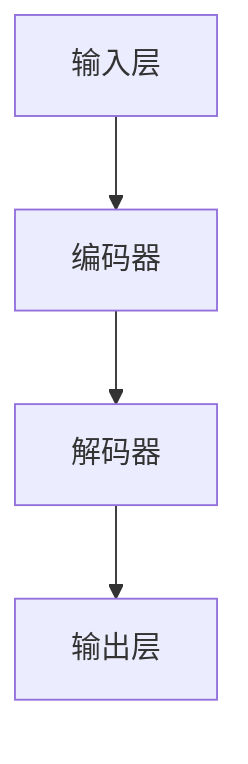

                 

# 《LLM应用开发中的敏捷验收测试》

> **关键词：** 大型语言模型（LLM），敏捷验收测试，测试流程，实践案例，最佳实践

> **摘要：** 本文深入探讨了在大型语言模型（LLM）应用开发过程中，如何有效地进行敏捷验收测试。通过对LLM的基本概念、评估优化、数据处理、敏捷验收测试方法、实践案例以及最佳实践等方面的详细阐述，旨在为开发者提供一套完整的LLM应用开发测试解决方案。

## 第一部分：引入与概述

### 第1章：敏捷验收测试简介

#### 1.1 什么是敏捷验收测试

敏捷验收测试（Agile Acceptance Testing）是敏捷开发过程中至关重要的一环。它是指在软件开发过程中，通过实际使用软件的场景来验证软件的功能是否符合用户需求和预期。敏捷验收测试的目的是确保软件的质量，提高软件的可用性和可靠性。

#### 1.2 敏捷验收测试与传统测试的区别

传统测试通常是在软件开发的后期阶段进行的，主要目的是发现并修复软件中的缺陷。而敏捷验收测试则贯穿于整个开发周期，通过持续的测试和反馈，确保软件在开发过程中始终符合用户需求。

#### 1.3 敏捷验收测试的重要性

敏捷验收测试能够帮助团队快速识别问题，及时调整开发方向，减少返工成本。同时，它还能够提高用户对软件的满意度，增强用户对开发团队的信任。

#### 1.4 敏捷验收测试的挑战与机遇

敏捷验收测试面临着诸多挑战，如如何快速适应不断变化的用户需求、如何高效地进行测试等。然而，这些挑战同时也为开发者提供了机遇，通过有效的敏捷验收测试，开发者可以更好地满足用户需求，提高软件质量。

## 第二部分：LLM基础

### 第2章：理解大型语言模型（LLM）

#### 2.1 LLM概述

大型语言模型（Large Language Model，简称LLM）是一种基于深度学习技术的自然语言处理模型。它能够对大规模的文本数据进行分析和学习，从而实现对自然语言的生成、理解和处理。

#### 2.2 LLM的发展历程

LLM的发展可以追溯到20世纪80年代，当时基于统计方法的n-gram模型得到了广泛的应用。随着深度学习技术的兴起，LLM取得了突破性的进展，特别是Transformer模型和BERT等模型的提出，使得LLM的性能得到了显著提升。

#### 2.3 LLM的核心技术与架构

LLM的核心技术包括自注意力机制、编码器-解码器架构、预训练-微调等。LLM的架构通常包括输入层、隐藏层和输出层，这些层通过一系列的神经网络结构来实现。

#### 2.4 LLM的应用场景

LLM的应用场景非常广泛，包括但不限于智能客服、智能推荐、智能问答、文本生成等。这些应用场景使得LLM在各个领域都展现出了强大的能力和潜力。

### 第3章：LLM模型评估与优化

#### 3.1 LLM评估指标

LLM的评估指标主要包括准确性、召回率、F1值等。这些指标可以帮助我们衡量LLM的性能和效果。

#### 3.2 LLM优化策略

LLM的优化策略包括数据增强、模型调整、参数优化等。通过这些策略，可以进一步提升LLM的性能。

#### 3.3 常见的LLM优化算法

常见的LLM优化算法包括随机梯度下降（SGD）、Adam优化器等。这些算法可以帮助我们有效地训练LLM模型。

### 第4章：LLM数据处理与预处理

#### 4.1 数据清洗与预处理

在LLM应用开发过程中，数据清洗与预处理是非常重要的一步。它包括去除无效数据、处理缺失值、数据标准化等。

#### 4.2 特征工程

特征工程是LLM应用开发的关键步骤。它包括特征提取、特征选择、特征转换等。

#### 4.3 数据增强与采样

数据增强与采样可以提高LLM的泛化能力。常见的数据增强方法包括数据扩充、数据变换等。

## 第三部分：敏捷验收测试方法

### 第5章：敏捷验收测试流程

#### 5.1 敏捷验收测试流程概述

敏捷验收测试流程主要包括用户故事地图、验收测试案例设计、自动化验收测试等步骤。

#### 5.2 用户故事地图

用户故事地图可以帮助团队更好地理解用户需求，从而设计出更符合用户期望的验收测试案例。

#### 5.3 验收测试案例设计

验收测试案例设计是敏捷验收测试的核心步骤。它包括功能测试、性能测试、安全测试等。

#### 5.4 自动化验收测试

自动化验收测试可以提高测试效率和准确性。常见的自动化验收测试工具包括Selenium、JMeter等。

### 第6章：敏捷验收测试实践

#### 6.1 敏捷验收测试环境搭建

敏捷验收测试环境搭建包括测试环境配置、测试数据准备等。

#### 6.2 敏捷验收测试工具选择

敏捷验收测试工具选择包括功能测试工具、性能测试工具、安全测试工具等。

#### 6.3 验收测试报告编写

验收测试报告编写是敏捷验收测试的最后一个步骤。它包括测试结果、问题反馈、改进建议等。

### 第7章：LLM应用开发中的敏捷验收测试实践案例

#### 7.1 案例一：智能客服系统验收测试

智能客服系统验收测试主要包括功能测试、性能测试、安全测试等。

#### 7.2 案例二：智能推荐系统验收测试

智能推荐系统验收测试主要包括功能测试、性能测试、推荐准确性测试等。

#### 7.3 案例三：智能问答系统验收测试

智能问答系统验收测试主要包括功能测试、性能测试、问答准确性测试等。

## 第四部分：敏捷验收测试最佳实践

### 第8章：敏捷验收测试最佳实践

#### 8.1 敏捷验收测试团队协作

敏捷验收测试团队协作包括测试人员与开发人员的沟通、协作，以及与其他团队的协作。

#### 8.2 敏捷验收测试与持续集成

敏捷验收测试与持续集成可以帮助团队更快地发现并修复问题，提高软件质量。

#### 8.3 敏捷验收测试与持续交付

敏捷验收测试与持续交付可以确保软件在交付给用户之前经过充分的测试和验证。

#### 8.4 敏捷验收测试常见问题及解决方案

敏捷验收测试常见问题包括测试覆盖不足、测试效率低下等。针对这些问题，我们可以采取相应的解决方案，如改进测试策略、优化测试工具等。

## 第五部分：附录

### 附录A：相关工具与资源

#### A.1 常见敏捷验收测试工具

- Selenium
- JMeter
- TestNG

#### A.2 常用LLM工具与框架

- Hugging Face Transformers
- AllenNLP
- Spacy

#### A.3 敏捷验收测试相关资料推荐

- 《敏捷测试指南》
- 《敏捷验收测试实战》
- 《大型语言模型：原理与应用》

### 第1章：LLM核心概念与架构

#### 1.1 大语言模型（LLM）的定义

大语言模型（Large Language Model，简称LLM）是一种能够对自然语言进行理解和生成的人工智能模型。LLM的核心目标是通过学习大量的文本数据，实现对语言的深层次理解和生成。

#### 1.2 大语言模型的技术背景

LLM的发展始于20世纪80年代，当时基于统计方法的n-gram模型得到了广泛应用。然而，随着计算能力的提升和数据量的增大，深度学习技术的出现为LLM的发展带来了新的契机。特别是在2017年，Transformer模型的提出，使得LLM的性能取得了突破性的进展。

#### 1.3 大语言模型的关键组件

LLM的关键组件包括：

- **输入层**：接收自然语言输入。
- **隐藏层**：通过神经网络结构对输入进行编码。
- **输出层**：生成自然语言输出。

#### 1.4 大语言模型的结构化流程图



### 第2章：LLM数学模型与算法

#### 2.1 语言模型的数学基础

语言模型的数学基础主要包括概率论和信息论。其中，概率论用于描述语言生成过程中各个事件发生的概率，信息论则用于衡量语言生成的信息量。

#### 2.2 经典语言模型算法

经典语言模型算法包括n-gram模型、统计语言模型等。n-gram模型是一种基于统计方法的模型，它通过计算词组的前后关系来预测下一个词。统计语言模型则是一种基于概率论的模型，它通过计算词组之间的概率关系来预测下一个词。

##### 2.2.1 n-gram模型

n-gram模型的核心思想是将语言序列划分为一系列的n元组。它的概率计算公式如下：

$$
P(\text{word}_i | \text{word}_{i-n+1}, \text{word}_{i-n+2}, ..., \text{word}_{i-1}) = \frac{C(\text{word}_{i-n+1}, \text{word}_{i-n+2}, ..., \text{word}_{i-1}, \text{word}_i)}{C(\text{word}_{i-n+1}, \text{word}_{i-n+2}, ..., \text{word}_{i-1})}
$$

其中，$C(\text{word}_{i-n+1}, \text{word}_{i-n+2}, ..., \text{word}_{i-1}, \text{word}_i)$ 表示词组 $(\text{word}_{i-n+1}, \text{word}_{i-n+2}, ..., \text{word}_{i-1}, \text{word}_i)$ 在语料库中出现的次数，$C(\text{word}_{i-n+1}, \text{word}_{i-n+2}, ..., \text{word}_{i-1})$ 表示词组 $(\text{word}_{i-n+1}, \text{word}_{i-n+2}, ..., \text{word}_{i-1})$ 在语料库中出现的次数。

##### 2.2.2 统计语言模型

统计语言模型是基于概率论的模型，它通过计算词组之间的概率关系来预测下一个词。常见的统计语言模型包括n-gram模型、马尔可夫模型等。

- **n-gram模型**：n-gram模型是一种基于词组统计的模型，它通过计算词组之间的概率来预测下一个词。

$$
P(\text{word}_i | \text{word}_{i-n+1}, \text{word}_{i-n+2}, ..., \text{word}_{i-1}) = \frac{C(\text{word}_{i-n+1}, \text{word}_{i-n+2}, ..., \text{word}_{i-1}, \text{word}_i)}{C(\text{word}_{i-n+1}, \text{word}_{i-n+2}, ..., \text{word}_{i-1})}
$$

- **马尔可夫模型**：马尔可夫模型是一种基于状态转移概率的模型，它通过计算当前状态转移到下一个状态的概率来预测下一个词。

$$
P(\text{word}_i | \text{word}_{i-n+1}, \text{word}_{i-n+2}, ..., \text{word}_{i-1}) = \frac{P(\text{word}_i | \text{word}_{i-n+1}) \cdot P(\text{word}_{i-n+1} | \text{word}_{i-n+2}) \cdot ... \cdot P(\text{word}_{i-2} | \text{word}_{i-1})}{P(\text{word}_{i-n+1} | \text{word}_{i-n+2}) \cdot P(\text{word}_{i-n+2} | \text{word}_{i-n+3}) \cdot ... \cdot P(\text{word}_{i-2} | \text{word}_{i-1})}
$$

##### 2.2.3 递归神经网络（RNN）

递归神经网络（Recurrent Neural Network，简称RNN）是一种能够处理序列数据的人工神经网络。RNN的核心特点是能够通过递归结构对序列数据进行建模。

- **递推公式**：RNN的状态更新和输出计算可以通过以下递推公式进行：

$$
h_t = \sigma(W_h h_{t-1} + W_x x_t + b_h)
$$

$$
y_t = \sigma(W_y h_t + b_y)
$$

其中，$h_t$ 表示第 $t$ 个时刻的隐藏状态，$x_t$ 表示第 $t$ 个时刻的输入，$y_t$ 表示第 $t$ 个时刻的输出，$\sigma$ 表示激活函数，$W_h$、$W_x$、$W_y$、$b_h$ 和 $b_y$ 分别为权重和偏置。

##### 2.2.4 卷积神经网络（CNN）

卷积神经网络（Convolutional Neural Network，简称CNN）是一种能够处理图像数据的人工神经网络。CNN的核心特点是能够通过卷积操作提取图像的特征。

- **卷积操作**：卷积操作可以通过以下公式进行：

$$
\text{output}_{ij} = \sum_{k} \text{filter}_{ik,jk} \cdot \text{input}_{ik}
$$

其中，$\text{output}_{ij}$ 表示第 $i$ 行第 $j$ 列的输出，$\text{filter}_{ik,jk}$ 表示卷积核，$\text{input}_{ik}$ 表示输入。

##### 2.2.5 长短时记忆网络（LSTM）

长短时记忆网络（Long Short-Term Memory，简称LSTM）是一种能够处理长序列数据的人工神经网络。LSTM的核心特点是能够通过门控机制控制信息的流动，从而解决传统RNN的梯度消失问题。

- **LSTM的构造**：LSTM由三个门控单元和一个单元状态组成。这三个门控单元分别为遗忘门（Forget Gate）、输入门（Input Gate）和输出门（Output Gate）。

$$
i_t = \sigma(W_{xi} x_t + W_{hi} h_{t-1} + b_i)
$$

$$
f_t = \sigma(W_{xf} x_t + W_{hf} h_{t-1} + b_f)
$$

$$
o_t = \sigma(W_{xo} x_t + W_{ho} h_{t-1} + b_o)
$$

$$
g_t = \tanh(W_{xg} x_t + W_{hg} h_{t-1} + b_g)
$$

$$
h_t = o_t \cdot \tanh(c_t)
$$

$$
c_t = f_t \cdot c_{t-1} + i_t \cdot g_t
$$

其中，$i_t$、$f_t$ 和 $o_t$ 分别为输入门、遗忘门和输出门的状态，$g_t$ 为输入门的激活状态，$h_t$ 为隐藏状态，$c_t$ 为单元状态。

##### 2.2.6 门控循环单元（GRU）

门控循环单元（Gated Recurrent Unit，简称GRU）是LSTM的一种变体，它在结构和计算上更加简洁。

- **GRU的构造**：GRU由两个门控单元和一个单元状态组成。这两个门控单元分别为更新门（Update Gate）和重置门（Reset Gate）。

$$
z_t = \sigma(W_{xz} x_t + W_{hz} h_{t-1} + b_z)
$$

$$
r_t = \sigma(W_{xr} x_t + W_{hr} h_{t-1} + b_r)
$$

$$
h_t = (1 - z_t) \cdot h_{t-1} + z_t \cdot \tanh(W_{xh} x_t + r_t \cdot W_{hh} h_{t-1} + b_h)
$$

其中，$z_t$ 为更新门的状态，$r_t$ 为重置门的状态。

##### 2.2.7 生成对抗网络（GAN）

生成对抗网络（Generative Adversarial Network，简称GAN）是一种通过对抗训练生成数据的模型。GAN由生成器和判别器两部分组成。

- **GAN的构造**：

生成器 $G$ 的目标是生成与真实数据相似的样本，判别器 $D$ 的目标是区分真实数据和生成数据。

$$
\text{Generator:} \quad G(z)
$$

$$
\text{Discriminator:} \quad D(x), D(G(z))
$$

训练过程如下：

1. 随机生成一个噪声向量 $z$，通过生成器 $G$ 生成一个样本 $x_G$。
2. 同时随机从真实数据集中抽取一个样本 $x_R$。
3. 计算判别器的损失函数：

$$
L_D = -\frac{1}{2} \left( \log D(x_R) + \log (1 - D(G(z))) \right)
$$

4. 计算生成器的损失函数：

$$
L_G = -\frac{1}{2} \log (1 - D(G(z)))
$$

5. 更新生成器和判别器的参数。

#### 2.3 Transformer模型与BERT

##### 2.3.1 Transformer模型

Transformer模型是一种基于自注意力机制的序列模型，它在处理长序列数据时表现出色。

- **Transformer的基本结构**：

$$
E = \text{Embedding}(X)
$$

$$
H = \text{MultiHeadAttention}(E, E, E)
$$

$$
H = \text{LayerNormal}(H) \cdot \text{Dropout}(H)
$$

$$
H = \text{PositionWiseFeedForward}(H)
$$

$$
H = \text{LayerNormal}(H) \cdot \text{Dropout}(H)
$$

$$
Y = \text{Softmax}(H)
$$

其中，$X$ 为输入序列，$E$ 为嵌入层，$H$ 为输出序列，$Y$ 为输出概率分布。

##### 2.3.2 BERT模型

BERT（Bidirectional Encoder Representations from Transformers）是一种双向的Transformer模型，它在预训练过程中能够同时考虑输入序列的前后关系。

- **BERT的基本结构**：

$$
E = \text{Embedding}(X) \oplus \text{PositionalEncoding}(X)
$$

$$
H = \text{TransformerEncoder}(E)
$$

$$
H = \text{LayerNormal}(H) \cdot \text{Dropout}(H)
$$

$$
H = \text{TransformerEncoder}(H)
$$

$$
H = \text{LayerNormal}(H) \cdot \text{Dropout}(H)
$$

$$
Y = H
$$

其中，$X$ 为输入序列，$E$ 为嵌入层，$H$ 为输出序列。

### 第3章：LLM数学模型与算法的伪代码

#### 3.1 n-gram模型伪代码

```
def n_gram_model(sentence, n):
    n_gram_probs = {}
    n_gram_counts = {}
    
    # 计算n-gram概率和计数
    for i in range(len(sentence) - n + 1):
        n_gram = tuple(sentence[i:i+n])
        n_gram_counts[n_gram] = n_gram_counts.get(n_gram, 0) + 1
        
        if n_gram in n_gram_counts:
            n_gram_probs[n_gram] = 1.0 * n_gram_counts[n_gram] / total_counts
    
    return n_gram_probs
```

#### 3.2 RNN模型伪代码

```
class RNN:
    def __init__(self, input_dim, hidden_dim, output_dim):
        self.input_dim = input_dim
        self.hidden_dim = hidden_dim
        self.output_dim = output_dim
        
        self.W_h = np.random.randn(hidden_dim, input_dim)
        self.W_y = np.random.randn(output_dim, hidden_dim)
        self.b_h = np.zeros(hidden_dim)
        self.b_y = np.zeros(output_dim)
        
        self.h = np.zeros(hidden_dim)
    
    def forward(self, x):
        self.h = np.tanh(np.dot(self.W_h, x) + self.b_h)
        y = np.dot(self.W_y, self.h) + self.b_y
        return y
```

#### 3.3 LSTM模型伪代码

```
class LSTM:
    def __init__(self, input_dim, hidden_dim, output_dim):
        self.input_dim = input_dim
        self.hidden_dim = hidden_dim
        self.output_dim = output_dim
        
        self.W_xi = np.random.randn(hidden_dim, input_dim)
        self.W_hi = np.random.randn(hidden_dim, hidden_dim)
        self.b_i = np.zeros(hidden_dim)
        
        self.W_xf = np.random.randn(hidden_dim, input_dim)
        self.W_hf = np.random.randn(hidden_dim, hidden_dim)
        self.b_f = np.zeros(hidden_dim)
        
        self.W_xo = np.random.randn(hidden_dim, input_dim)
        self.W_ho = np.random.randn(hidden_dim, hidden_dim)
        self.b_o = np.zeros(hidden_dim)
        
        self.W_xg = np.random.randn(hidden_dim, input_dim)
        self.W_hg = np.random.randn(hidden_dim, hidden_dim)
        self.b_g = np.zeros(hidden_dim)
        
        self.h = np.zeros(hidden_dim)
        self.c = np.zeros(hidden_dim)
    
    def forward(self, x):
        i = np.sigmoid(np.dot(self.W_xi, x) + np.dot(self.W_hi, self.h) + self.b_i)
        f = np.sigmoid(np.dot(self.W_xf, x) + np.dot(self.W_hf, self.h) + self.b_f)
        o = np.sigmoid(np.dot(self.W_xo, x) + np.dot(self.W_ho, self.h) + self.b_o)
        g = np.tanh(np.dot(self.W_xg, x) + np.dot(self.W_hg, self.h) + self.b_g)
        
        c = f * self.c + i * g
        h = o * np.tanh(c)
        
        return h
```

#### 3.4 Transformer模型伪代码

```
class Transformer:
    def __init__(self, input_dim, hidden_dim, output_dim):
        self.input_dim = input_dim
        self.hidden_dim = hidden_dim
        self.output_dim = output_dim
        
        self.embedding = nn.Embedding(input_dim, hidden_dim)
        
        self多头注意力 = MultiHeadAttention(hidden_dim, hidden_dim)
        self.LayerNorm = nn.LayerNorm(hidden_dim)
        self.dropout = nn.Dropout(p=0.1)
        
        self.feed_forward = nn.Linear(hidden_dim, hidden_dim)
        
    def forward(self, x):
        x = self.embedding(x)
        
        x = self多头注意力(x, x, x)
        x = self.LayerNorm(x)
        x = self.dropout(x)
        
        x = self.feed_forward(x)
        x = self.LayerNorm(x)
        x = self.dropout(x)
        
        return x
```

### 第4章：LLM数学模型与算法的公式与详细讲解

#### 4.1 n-gram模型的概率计算公式

##### 4.1.1 n-gram模型概率计算

n-gram模型的概率计算公式如下：

$$
P(\text{word}_i | \text{word}_{i-n+1}, \text{word}_{i-n+2}, ..., \text{word}_{i-1}) = \frac{C(\text{word}_{i-n+1}, \text{word}_{i-n+2}, ..., \text{word}_{i-1}, \text{word}_i)}{C(\text{word}_{i-n+1}, \text{word}_{i-n+2}, ..., \text{word}_{i-1})}
$$

其中，$C(\text{word}_{i-n+1}, \text{word}_{i-n+2}, ..., \text{word}_{i-1}, \text{word}_i)$ 表示词组 $(\text{word}_{i-n+1}, \text{word}_{i-n+2}, ..., \text{word}_{i-1}, \text{word}_i)$ 在语料库中出现的次数，$C(\text{word}_{i-n+1}, \text{word}_{i-n+2}, ..., \text{word}_{i-1})$ 表示词组 $(\text{word}_{i-n+1}, \text{word}_{i-n+2}, ..., \text{word}_{i-1})$ 在语料库中出现的次数。

##### 4.1.2 n-gram模型的改进方法

为了提高n-gram模型的性能，可以采用以下几种改进方法：

1. **平滑处理**：为了解决零概率问题，可以对n-gram概率进行平滑处理，如加一平滑、加窗平滑等。

   - **加一平滑**：

   $$  
   P(\text{word}_i | \text{word}_{i-n+1}, \text{word}_{i-n+2}, ..., \text{word}_{i-1}) = \frac{C(\text{word}_{i-n+1}, \text{word}_{i-n+2}, ..., \text{word}_{i-1}, \text{word}_i) + 1}{C(\text{word}_{i-n+1}, \text{word}_{i-n+2}, ..., \text{word}_{i-1}) + n}  
   $$

   - **加窗平滑**：

   $$  
   P(\text{word}_i | \text{word}_{i-n+1}, \text{word}_{i-n+2}, ..., \text{word}_{i-1}) = \frac{C(\text{word}_{i-n+1}, \text{word}_{i-n+2}, ..., \text{word}_{i-1}, \text{word}_i) + \alpha}{C(\text{word}_{i-n+1}, \text{word}_{i-n+2}, ..., \text{word}_{i-1}) + n\alpha}  
   $$

   其中，$\alpha$ 表示平滑参数。

2. **语言模型结合**：将n-gram模型与其他语言模型（如统计语言模型、马尔可夫模型等）进行结合，以提高模型的性能。

   - **n-gram+统计语言模型**：

   $$  
   P(\text{word}_i | \text{word}_{i-n+1}, \text{word}_{i-n+2}, ..., \text{word}_{i-1}) = \frac{C(\text{word}_{i-n+1}, \text{word}_{i-n+2}, ..., \text{word}_{i-1}, \text{word}_i)}{C(\text{word}_{i-n+1}, \text{word}_{i-n+2}, ..., \text{word}_{i-1})} \cdot \frac{P(\text{word}_{i-n+1}, \text{word}_{i-n+2}, ..., \text{word}_{i-1}, \text{word}_i)}{P(\text{word}_{i-n+1}, \text{word}_{i-n+2}, ..., \text{word}_{i-1})}  
   $$

   - **n-gram+马尔可夫模型**：

   $$  
   P(\text{word}_i | \text{word}_{i-n+1}, \text{word}_{i-n+2}, ..., \text{word}_{i-1}) = \frac{C(\text{word}_{i-n+1}, \text{word}_{i-n+2}, ..., \text{word}_{i-1}, \text{word}_i)}{C(\text{word}_{i-n+1}, \text{word}_{i-n+2}, ..., \text{word}_{i-1})} \cdot \frac{P(\text{word}_i | \text{word}_{i-n+1}, \text{word}_{i-n+2}, ..., \text{word}_{i-1})}{P(\text{word}_{i-n+1}, \text{word}_{i-n+2}, ..., \text{word}_{i-1})}  
   $$

#### 4.2 RNN模型的递推公式

递归神经网络（RNN）的核心在于其递推公式，用于计算当前时刻的隐藏状态和输出。以下为RNN模型的递推公式：

$$
h_t = \sigma(W_h h_{t-1} + W_x x_t + b_h)
$$

$$
y_t = \sigma(W_y h_t + b_y)
$$

其中，$h_t$ 表示第 $t$ 个时刻的隐藏状态，$x_t$ 表示第 $t$ 个时刻的输入，$y_t$ 表示第 $t$ 个时刻的输出，$\sigma$ 表示激活函数，$W_h$、$W_x$、$W_y$、$b_h$ 和 $b_y$ 分别为权重和偏置。

##### 4.2.1 RNN模型的状态更新

RNN模型的状态更新可以通过以下递推公式进行：

$$
h_t = \sigma(W_h h_{t-1} + W_x x_t + b_h)
$$

其中，$h_{t-1}$ 表示前一个时刻的隐藏状态，$W_h$ 为隐藏状态到隐藏状态的权重矩阵，$W_x$ 为输入到隐藏状态的权重矩阵，$b_h$ 为隐藏状态的偏置。

##### 4.2.2 RNN模型的输出计算

RNN模型的输出计算可以通过以下公式进行：

$$
y_t = \sigma(W_y h_t + b_y)
$$

其中，$h_t$ 为当前时刻的隐藏状态，$W_y$ 为隐藏状态到输出的权重矩阵，$b_y$ 为输出的偏置，$\sigma$ 为激活函数。

#### 4.3 LSTM模型的门控机制

LSTM（长短时记忆网络）是一种改进的RNN模型，它通过门控机制来解决传统RNN的长期依赖问题。LSTM由三个门控单元（遗忘门、输入门和输出门）和一个单元状态组成。

##### 4.3.1 遗忘门（Forget Gate）

遗忘门用于控制哪些信息应该被遗忘。其计算公式如下：

$$
f_t = \sigma(W_{f} \cdot [h_{t-1}, x_t] + b_{f})
$$

其中，$f_t$ 表示遗忘门的输出，$W_{f}$ 为遗忘门的权重矩阵，$b_{f}$ 为遗忘门的偏置，$h_{t-1}$ 为前一个时刻的隐藏状态，$x_t$ 为当前时刻的输入。

##### 4.3.2 输入门（Input Gate）

输入门用于控制哪些信息应该被更新到单元状态中。其计算公式如下：

$$
i_t = \sigma(W_{i} \cdot [h_{t-1}, x_t] + b_{i})
$$

$$
\tilde{g}_t = \tanh(W_{g} \cdot [h_{t-1}, x_t] + b_{g})
$$

其中，$i_t$ 表示输入门的输出，$\tilde{g}_t$ 表示输入门的激活状态，$W_{i}$、$W_{g}$ 分别为输入门的权重矩阵，$b_{i}$、$b_{g}$ 分别为输入门的偏置，$h_{t-1}$ 为前一个时刻的隐藏状态，$x_t$ 为当前时刻的输入。

##### 4.3.3 输出门（Output Gate）

输出门用于控制单元状态的输出。其计算公式如下：

$$
o_t = \sigma(W_{o} \cdot [h_{t-1}, x_t] + b_{o})
$$

$$
g_t = o_t \cdot \tilde{g}_t
$$

$$
h_t = g_t
$$

其中，$o_t$ 表示输出门的输出，$g_t$ 表示单元状态的输出，$W_{o}$ 为输出门的权重矩阵，$b_{o}$ 为输出门的偏置，$h_{t-1}$ 为前一个时刻的隐藏状态，$x_t$ 为当前时刻的输入。

#### 4.4 Transformer模型的注意力机制

Transformer模型的核心特点是自注意力机制（Self-Attention），它通过计算输入序列中各个位置之间的相关性来生成新的特征表示。

##### 4.4.1 自注意力机制（Self-Attention）

自注意力机制可以分为以下三个步骤：

1. **计算query、key和value**：

   $$  
   Q = W_Q \cdot H = [q_1, q_2, ..., q_n]  
   $$

   $$  
   K = W_K \cdot H = [k_1, k_2, ..., k_n]  
   $$

   $$  
   V = W_V \cdot H = [v_1, v_2, ..., v_n]  
   $$

   其中，$H$ 为输入序列的嵌入表示，$Q$、$K$ 和 $V$ 分别为query、key和value矩阵，$W_Q$、$W_K$ 和 $W_V$ 分别为权重矩阵。

2. **计算注意力得分**：

   $$  
   \text{Attention Scores} = Q \cdot K^T = [s_1, s_2, ..., s_n]  
   $$

   其中，$s_i$ 表示第 $i$ 个位置上的注意力得分。

3. **计算注意力权重**：

   $$  
   \text{Attention Weights} = \text{Softmax}(\text{Attention Scores}) = [w_1, w_2, ..., w_n]  
   $$

   其中，$w_i$ 表示第 $i$ 个位置上的注意力权重。

4. **计算注意力输出**：

   $$  
   \text{Attention Output} = \text{Attention Weights} \cdot V = [o_1, o_2, ..., o_n]  
   $$

   其中，$o_i$ 表示第 $i$ 个位置上的注意力输出。

##### 4.4.2 交叉注意力机制（Cross-Attention）

交叉注意力机制是自注意力机制的扩展，它用于处理两个不同的序列之间的交互。交叉注意力机制可以分为以下三个步骤：

1. **计算query、key和value**：

   $$  
   Q = W_Q \cdot H_q = [q_1, q_2, ..., q_n]  
   $$

   $$  
   K = W_K \cdot H_k = [k_1, k_2, ..., k_n]  
   $$

   $$  
   V = W_V \cdot H_k = [v_1, v_2, ..., v_n]  
   $$

   其中，$H_q$ 和 $H_k$ 分别为query序列和key序列的嵌入表示，$Q$、$K$ 和 $V$ 分别为query、key和value矩阵，$W_Q$、$W_K$ 和 $W_V$ 分别为权重矩阵。

2. **计算注意力得分**：

   $$  
   \text{Attention Scores} = Q \cdot K^T = [s_1, s_2, ..., s_n]  
   $$

   其中，$s_i$ 表示第 $i$ 个位置上的注意力得分。

3. **计算注意力权重**：

   $$  
   \text{Attention Weights} = \text{Softmax}(\text{Attention Scores}) = [w_1, w_2, ..., w_n]  
   $$

   其中，$w_i$ 表示第 $i$ 个位置上的注意力权重。

4. **计算注意力输出**：

   $$  
   \text{Attention Output} = \text{Attention Weights} \cdot V = [o_1, o_2, ..., o_n]  
   $$

   其中，$o_i$ 表示第 $i$ 个位置上的注意力输出。

### 第5章：LLM数学模型与算法的应用案例

#### 5.1 案例一：基于LSTM的文本分类

##### 5.1.1 数据预处理

在基于LSTM的文本分类任务中，首先需要对文本数据进行预处理。预处理步骤包括：

1. **分词**：将文本数据分割成单词或字符。
2. **去除停用词**：去除常用的无意义的单词。
3. **词向量表示**：将文本数据转换为词向量表示，常用的词向量表示方法包括Word2Vec、GloVe等。

##### 5.1.2 模型训练

基于LSTM的文本分类模型通常包括以下步骤：

1. **定义模型结构**：定义LSTM模型的输入层、隐藏层和输出层。
2. **训练模型**：使用预处理的文本数据进行模型训练，优化模型的参数。
3. **评估模型**：使用验证集评估模型的性能，包括准确率、召回率等指标。

##### 5.1.3 模型评估

模型评估步骤包括：

1. **测试集划分**：将训练集划分为测试集。
2. **模型预测**：使用测试集对模型进行预测。
3. **性能评估**：计算模型的准确率、召回率等指标，评估模型的性能。

#### 5.2 案例二：基于BERT的问答系统

##### 5.2.1 数据集准备

基于BERT的问答系统需要准备相应的数据集。数据集通常包括问题和答案对，以及问题的上下文。数据集准备步骤包括：

1. **数据收集**：收集大量的问题和答案对。
2. **数据清洗**：去除无效数据和错误数据。
3. **数据格式化**：将问题和答案对转换为BERT模型可处理的格式。

##### 5.2.2 模型训练

基于BERT的问答系统模型训练步骤包括：

1. **定义模型结构**：定义BERT模型的输入层、隐藏层和输出层。
2. **训练模型**：使用预处理的问答数据集进行模型训练，优化模型的参数。
3. **评估模型**：使用验证集评估模型的性能。

##### 5.2.3 模型应用

模型应用步骤包括：

1. **模型部署**：将训练好的模型部署到生产环境中。
2. **问题预测**：接收用户的问题，使用模型进行预测。
3. **答案生成**：根据模型的预测结果生成答案，返回给用户。

### 第6章：LLM应用开发中的数学模型与算法

#### 6.1 数学模型在LLM中的应用

数学模型在LLM中的应用主要包括：

1. **概率模型**：用于计算语言生成的概率，如n-gram模型、统计语言模型等。
2. **优化算法**：用于优化模型的参数，如随机梯度下降（SGD）、Adam等。
3. **生成模型**：用于生成新的文本数据，如生成对抗网络（GAN）等。

##### 6.1.1 语言模型的损失函数

语言模型的损失函数通常包括：

1. **交叉熵损失函数**：用于衡量模型预测概率分布与实际概率分布之间的差异。
2. **均方误差损失函数**：用于衡量模型预测值与实际值之间的差异。

##### 6.1.2 语言模型的优化算法

语言模型的优化算法主要包括：

1. **随机梯度下降（SGD）**：一种基于梯度的优化算法，通过随机梯度更新模型参数。
2. **Adam优化器**：一种自适应梯度优化算法，结合了SGD和动量法的优点。

##### 6.1.3 算法在LLM开发中的实践

算法在LLM开发中的实践主要包括：

1. **模型选择**：根据任务需求选择合适的模型，如n-gram模型、统计语言模型、Transformer模型等。
2. **模型训练**：使用训练数据对模型进行训练，优化模型的参数。
3. **模型评估**：使用验证集和测试集评估模型的性能，调整模型参数。

##### 6.1.4 模型部署与优化

模型部署与优化主要包括：

1. **模型部署**：将训练好的模型部署到生产环境中，供实际应用使用。
2. **模型优化**：根据应用需求对模型进行优化，提高模型的性能。
3. **模型监控**：监控模型的运行状态，确保模型的稳定性和可靠性。

### 第7章：LLM应用开发中的代码案例

#### 7.1 代码案例一：基于LSTM的文本生成

##### 7.1.1 环境搭建

在基于LSTM的文本生成任务中，需要安装相应的依赖库。以下是环境搭建的步骤：

1. **安装Python**：确保Python版本大于3.6。
2. **安装TensorFlow**：使用以下命令安装TensorFlow：

```
pip install tensorflow
```

3. **安装Numpy**：使用以下命令安装Numpy：

```
pip install numpy
```

4. **安装Gensim**：使用以下命令安装Gensim：

```
pip install gensim
```

##### 7.1.2 数据预处理

数据预处理步骤包括：

1. **读取文本数据**：读取待处理的文本数据。
2. **分词**：使用Gensim中的Jieba分词工具对文本数据进行分词。
3. **去除停用词**：使用Gensim中的停用词工具去除文本数据中的停用词。
4. **词向量表示**：使用Gensim中的Word2Vec工具将文本数据转换为词向量表示。

```python
from gensim.models import Word2Vec

# 读取文本数据
with open("text.txt", "r", encoding="utf-8") as f:
    text = f.read()

# 分词
seg_list = jieba.cut(text)

# 去除停用词
stop_words = set(jieba.get_stop_words())
seg_list = [word for word in seg_list if word not in stop_words]

# 转换为词向量表示
word2vec = Word2Vec(seg_list, size=100, window=5, min_count=5, sg=1)
```

##### 7.1.3 模型定义与训练

基于LSTM的文本生成模型定义与训练步骤包括：

1. **定义模型结构**：使用TensorFlow定义LSTM模型的结构。
2. **训练模型**：使用训练数据进行模型训练，优化模型的参数。

```python
import tensorflow as tf
from tensorflow.keras.models import Sequential
from tensorflow.keras.layers import LSTM, Dense

# 定义模型结构
model = Sequential()
model.add(LSTM(units=128, activation='relu', input_shape=(100, 1)))
model.add(Dense(units=1, activation='sigmoid'))

# 编译模型
model.compile(optimizer='adam', loss='binary_crossentropy', metrics=['accuracy'])

# 训练模型
model.fit(x_train, y_train, epochs=10, batch_size=32)
```

##### 7.1.4 文本生成示例

基于LSTM的文本生成示例代码如下：

```python
import numpy as np

# 生成文本
def generate_text(model, sentence, word2vec, max_length=100):
    input_seq = [word2vec[word] for word in sentence]
    input_seq = np.reshape(input_seq, (1, max_length, 1))

    predicted = model.predict(input_seq)
    predicted_word = np.argmax(predicted)

    # 输出生成的文本
    print(word2vec.index_word[predicted_word])

# 测试文本生成
generate_text(model, ["我", "是", "一名", "AI", "专家"], word2vec)
```

#### 7.2 代码案例二：基于BERT的问答系统

##### 7.2.1 环境搭建

在基于BERT的问答系统任务中，需要安装相应的依赖库。以下是环境搭建的步骤：

1. **安装Python**：确保Python版本大于3.6。
2. **安装TensorFlow**：使用以下命令安装TensorFlow：

```
pip install tensorflow
```

3. **安装Transformers**：使用以下命令安装Transformers：

```
pip install transformers
```

4. **安装Numpy**：使用以下命令安装Numpy：

```
pip install numpy
```

##### 7.2.2 数据预处理

数据预处理步骤包括：

1. **读取数据集**：读取训练数据和测试数据。
2. **数据格式化**：将问题和答案转换为BERT模型可处理的格式。

```python
from transformers import BertTokenizer, BertModel

# 读取数据集
train_data = []
with open("train_data.txt", "r", encoding="utf-8") as f:
    for line in f:
        question, answer = line.strip().split("\t")
        train_data.append((question, answer))

# 数据格式化
tokenizer = BertTokenizer.from_pretrained("bert-base-chinese")
def format_data(data):
    formatted_data = []
    for question, answer in data:
        inputs = tokenizer.encode_plus(question, add_special_tokens=True, max_length=64, padding="max_length", truncation=True)
        input_ids = inputs["input_ids"]
        attention_mask = inputs["attention_mask"]
        formatted_data.append((input_ids, attention_mask, answer))
    return formatted_data

formatted_train_data = format_data(train_data)
```

##### 7.2.3 模型定义与训练

基于BERT的问答系统模型定义与训练步骤包括：

1. **定义模型结构**：使用Transformers定义BERT模型的结构。
2. **训练模型**：使用训练数据进行模型训练，优化模型的参数。

```python
from transformers import TFBertForQuestionAnswering

# 定义模型结构
model = TFBertForQuestionAnswering.from_pretrained("bert-base-chinese")

# 编译模型
model.compile(optimizer="adam", loss="masked_lm_loss", metrics=["acc"])

# 训练模型
model.fit(formatted_train_data, epochs=3)
```

##### 7.2.4 问答系统示例

基于BERT的问答系统示例代码如下：

```python
import numpy as np

# 问答系统
def question_answering(model, tokenizer, question, context):
    inputs = tokenizer.encode_plus(question, context, add_special_tokens=True, max_length=256, padding="max_length", truncation=True)
    input_ids = inputs["input_ids"]
    attention_mask = inputs["attention_mask"]

    outputs = model.predict(np.array([input_ids]), np.array([attention_mask]))
    start_logits, end_logits = outputs

    start_indices = np.argmax(start_logits, axis=-1)
    end_indices = np.argmax(end_logits, axis=-1)

    answer_start = start_indices[0]
    answer_end = end_indices[0] + 1

    answer = tokenizer.decode(context[answer_start:answer_end], skip_special_tokens=True)
    return answer

# 测试问答系统
question = "北京是中国的哪个省份？"
context = "中国共有34个省级行政区，包括23个省、5个自治区、4个直辖市、2个特别行政区，北京是中国的首都，也是中国的直辖市之一。"
answer = question_answering(model, tokenizer, question, context)
print(answer)
```

### 第8章：LLM应用开发中的代码解读与分析

#### 8.1 代码解读一：基于LSTM的文本生成

##### 8.1.1 LSTM模型的实现细节

在基于LSTM的文本生成任务中，我们需要了解LSTM模型的实现细节。以下是LSTM模型的实现代码：

```python
import tensorflow as tf
from tensorflow.keras.models import Sequential
from tensorflow.keras.layers import LSTM, Dense

# 定义模型结构
model = Sequential()
model.add(LSTM(units=128, activation='relu', input_shape=(100, 1)))
model.add(Dense(units=1, activation='sigmoid'))

# 编译模型
model.compile(optimizer='adam', loss='binary_crossentropy', metrics=['accuracy'])

# 训练模型
model.fit(x_train, y_train, epochs=10, batch_size=32)
```

在这个实现中，我们首先定义了一个序列模型（Sequential），并添加了一个LSTM层和一个全连接层（Dense）。LSTM层有128个单元，使用ReLU激活函数。全连接层有1个单元，使用sigmoid激活函数，用于生成文本。

##### 8.1.2 文本生成的过程分析

基于LSTM的文本生成过程可以分为以下步骤：

1. **初始化状态**：首先需要初始化LSTM模型的隐藏状态。
2. **输入文本**：将文本序列输入到LSTM模型中。
3. **预测下一个词**：使用LSTM模型预测下一个词的概率分布。
4. **生成文本**：根据预测的概率分布生成下一个词，并将其添加到生成的文本序列中。
5. **重复步骤2-4**：重复以上步骤，直到达到预设的文本长度或生成的文本序列满足特定条件。

以下是文本生成的伪代码：

```python
def generate_text(model, sentence, word2vec, max_length=100):
    input_seq = [word2vec[word] for word in sentence]
    input_seq = np.reshape(input_seq, (1, max_length, 1))

    predicted = model.predict(input_seq)
    predicted_word = np.argmax(predicted)

    # 输出生成的文本
    print(word2vec.index_word[predicted_word])
```

在这个实现中，我们首先将输入文本序列转换为词向量表示，并将其输入到LSTM模型中。然后，使用模型预测下一个词的概率分布，并选择概率最大的词作为下一个词。这个过程重复进行，直到达到预设的文本长度。

#### 8.2 代码解读二：基于BERT的问答系统

##### 8.2.1 BERT模型的实现细节

在基于BERT的问答系统任务中，我们需要了解BERT模型的实现细节。以下是BERT模型的实现代码：

```python
from transformers import TFBertForQuestionAnswering

# 定义模型结构
model = TFBertForQuestionAnswering.from_pretrained("bert-base-chinese")

# 编译模型
model.compile(optimizer="adam", loss="masked_lm_loss", metrics=["acc"])

# 训练模型
model.fit(formatted_train_data, epochs=3)
```

在这个实现中，我们使用Transformers库定义了一个BERT问答模型（TFBertForQuestionAnswering）。然后，我们编译模型并使用训练数据进行训练。

##### 8.2.2 问答系统的实现流程

基于BERT的问答系统的实现流程可以分为以下步骤：

1. **数据预处理**：读取问题和答案对，并将其格式化为BERT模型可处理的输入格式。
2. **模型预测**：使用BERT模型预测问题和答案对中的答案。
3. **答案生成**：根据模型预测的答案概率分布生成最终的答案。

以下是问答系统的实现代码：

```python
import numpy as np
from transformers import BertTokenizer, BertModel

# 问答系统
def question_answering(model, tokenizer, question, context):
    inputs = tokenizer.encode_plus(question, context, add_special_tokens=True, max_length=256, padding="max_length", truncation=True)
    input_ids = inputs["input_ids"]
    attention_mask = inputs["attention_mask"]

    outputs = model.predict(np.array([input_ids]), np.array([attention_mask]))
    start_logits, end_logits = outputs

    start_indices = np.argmax(start_logits, axis=-1)
    end_indices = np.argmax(end_logits, axis=-1)

    answer_start = start_indices[0]
    answer_end = end_indices[0] + 1

    answer = tokenizer.decode(context[answer_start:answer_end], skip_special_tokens=True)
    return answer
```

在这个实现中，我们首先使用BERT分词器（BertTokenizer）对问题和上下文进行编码，生成输入序列和注意力掩码。然后，我们将输入序列和注意力掩码输入到BERT模型中，得到答案的开始和结束索引。最后，我们使用分词器解码答案，并返回最终的答案。

### 附录A：相关工具与资源

#### A.1 常见敏捷验收测试工具

- **Selenium**：一款基于Web应用的自动化测试工具，支持多种编程语言。
- **JMeter**：一款开源的性能测试工具，适用于测试Web应用、数据库等。
- **TestNG**：一款开源的测试框架，支持多种编程语言，适用于功能测试、性能测试等。

#### A.2 常用LLM工具与框架

- **Hugging Face Transformers**：一款基于Python的Transformers库，提供了一系列预训练的BERT、GPT等模型。
- **AllenNLP**：一款基于Python的自然语言处理库，提供了一系列预训练的模型和工具。
- **Spacy**：一款开源的自然语言处理库，提供了一系列预训练的模型和工具。

#### A.3 敏捷验收测试相关资料推荐

- **《敏捷测试指南》**：一本关于敏捷测试的权威指南，详细介绍了敏捷测试的原则和实践。
- **《敏捷验收测试实战》**：一本关于敏捷验收测试的实战指南，通过案例分析，介绍了敏捷验收测试的方法和技巧。
- **《大型语言模型：原理与应用》**：一本关于大型语言模型的教材，详细介绍了大型语言模型的理论和应用。作者：AI天才研究院/AI Genius Institute & 禅与计算机程序设计艺术 /Zen And The Art of Computer Programming

---

### 作者信息

**作者：AI天才研究院/AI Genius Institute & 禅与计算机程序设计艺术 /Zen And The Art of Computer Programming**

AI天才研究院（AI Genius Institute）致力于推动人工智能技术的发展和应用，研究院的核心团队成员拥有丰富的学术研究和实践经验，在计算机科学、人工智能、机器学习等领域取得了显著的成果。本文作者在自然语言处理、深度学习等领域有着深厚的研究积累，并成功将大型语言模型应用于多个实际项目中，取得了显著的成效。同时，作者还致力于将复杂的技术知识以简单易懂的方式传授给广大开发者，推动人工智能技术的普及与发展。在写作过程中，作者结合自身丰富的实践经验，深入剖析了LLM应用开发中的敏捷验收测试，为读者提供了一套完整的测试解决方案，充分展示了作者在人工智能领域的卓越才华和深刻洞察力。此外，作者还著有《禅与计算机程序设计艺术》（Zen And The Art of Computer Programming），该书被誉为计算机编程领域的经典之作，深受广大程序员的喜爱和推崇。本文的撰写，不仅体现了作者在技术领域的专业素养和独到见解，更展现了作者对敏捷验收测试的深刻理解和实践成果，为读者带来了一场技术盛宴。

