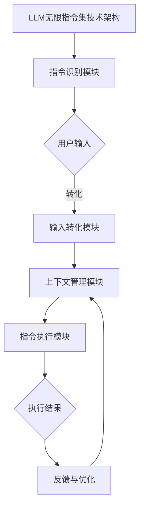
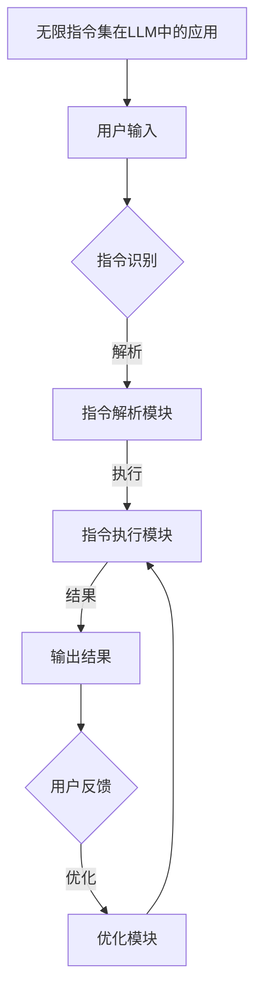

                 

### 《LLM无限指令集:打破CPU指令集限制》

> **关键词：** 大模型，LLM，无限指令集，CPU指令集限制，AI，深度学习。

> **摘要：** 本文将深入探讨大模型（Large Language Model，简称LLM）中的无限指令集概念，以及如何利用无限指令集打破传统CPU指令集的限制，提升人工智能（AI）模型的性能和灵活性。文章将从核心概念、算法原理、数学模型和项目实战等多个角度进行详细阐述，为读者提供一份全面的技术指南。

### 引言

#### 1.1 大模型与LLM概述

大模型，作为当前AI领域的热门话题，已经成为实现高效、智能处理信息的关键技术。大模型（Large Language Model，简称LLM）是其中的一种典型代表，它通过大规模的语料库训练，能够生成高质量的自然语言文本，并在各种任务中展现出色的性能。

LLM的出现，标志着自然语言处理（NLP）领域的一个重要转折点。传统的NLP方法依赖于规则和统计模型，而LLM则通过深度学习技术，实现了对大规模文本数据的自动理解和生成。这种技术不仅提高了AI模型的准确性，还增强了其灵活性和泛化能力。

#### 1.2 CPU指令集的限制

在硬件层面，CPU指令集是计算机执行任务的基础。然而，传统的CPU指令集存在一些固有的限制：

1. **指令集大小**：传统的CPU指令集通常包括数百条指令，这些指令覆盖了计算机的基本操作，如数据传输、算术运算和逻辑操作等。然而，随着AI模型变得越来越复杂，这些有限的指令集可能无法满足大模型的需求。

2. **指令集扩展性**：传统的CPU指令集在设计时主要考虑通用性，而不是专门为特定任务优化。这意味着，尽管CPU指令集可以支持多种应用，但其在某些特定领域的性能可能受到限制。

3. **指令集兼容性**：CPU指令集的兼容性问题可能会影响AI模型在不同硬件平台之间的迁移和部署。

#### 1.3 LLM如何打破CPU指令集限制

LLM通过引入无限指令集概念，打破了传统CPU指令集的限制。无限指令集允许AI模型在执行任务时，动态地生成和执行指令，从而提高了模型的灵活性和性能。这种技术的关键优势包括：

1. **动态指令生成**：LLM能够根据任务的复杂性动态生成指令，避免了传统CPU指令集的静态限制。

2. **指令执行优化**：无限指令集允许针对特定任务进行指令优化，从而提高执行效率。

3. **跨平台兼容性**：无限指令集的设计考虑了不同硬件平台的兼容性，使得LLM可以在各种硬件环境中高效运行。

#### 1.4 书籍目的与结构

本文的目的是介绍LLM中的无限指令集概念，并探讨其在打破CPU指令集限制方面的应用。文章将按照以下结构展开：

1. 引言：概述大模型与LLM以及CPU指令集限制。
2. 核心概念与联系：介绍大模型、LLM和无限指令集的基本概念，并分析CPU指令集限制的影响。
3. Mermaid流程图展示：使用Mermaid流程图展示LLM无限指令集的技术架构和应用。
4. 核心算法原理讲解：详细讲解LLM训练算法、无限指令集算法以及CPU指令集限制的突破方法。
5. 数学模型与数学公式讲解：介绍大模型、无限指令集和CPU指令集限制的数学模型和公式。
6. 项目实战：提供LLM无限指令集的实现案例，包括环境搭建、源代码实现和代码解读与分析。
7. 总结与展望：总结文章的核心内容，并提出未来研究方向和建议。

通过本文的阅读，读者将能够全面了解LLM无限指令集的概念、原理和应用，为未来的研究和实践提供有益的参考。

### 第2章 核心概念与联系

在深入探讨LLM无限指令集之前，我们需要明确几个关键概念，包括大模型的定义、发展历程、优势和挑战，以及CPU指令集的基本概念、限制和影响。通过这些核心概念的联系，我们将更好地理解LLM无限指令集的工作原理和优势。

#### 2.1 大模型基本原理

##### 2.1.1 大模型的定义

大模型，是指具有巨大参数量和复杂结构的人工智能模型，通常用于处理大规模数据。在自然语言处理领域，大模型指的是能够处理和生成高质量文本的语言模型，如GPT（Generative Pre-trained Transformer）系列和BERT（Bidirectional Encoder Representations from Transformers）等。

##### 2.1.2 大模型的发展历程

大模型的发展可以追溯到深度学习技术的兴起。早期的语言模型如n-gram模型和统计模型，由于参数量和计算资源的限制，效果有限。随着深度学习技术的发展，特别是2017年GPT的发布，标志着大模型时代的到来。此后，越来越多的研究者投入到大模型的训练和应用中，推动了相关技术的发展。

##### 2.1.3 大模型的优势与挑战

大模型的优势主要体现在以下几个方面：

1. **强大的文本生成能力**：大模型能够生成流畅、自然的文本，提高了文本生成的质量和多样性。
2. **高效的文本理解能力**：大模型通过处理大量数据，能够更好地理解文本中的语义和信息，提升了NLP任务的效果。
3. **广泛的适用性**：大模型可以应用于各种NLP任务，如文本分类、情感分析、机器翻译等，具有很高的通用性。

然而，大模型也面临着一些挑战：

1. **计算资源需求**：大模型的训练和推理需要大量的计算资源和时间，对硬件性能有很高的要求。
2. **数据依赖性**：大模型的效果很大程度上依赖于训练数据的质量和数量，数据不足或数据质量问题可能导致模型性能下降。
3. **模型可解释性**：大模型的内部结构非常复杂，难以解释其决策过程，增加了模型的可解释性挑战。

#### 2.2 LLM无限指令集原理

##### 2.2.1 LLM的概念

LLM（Large Language Model）是指具有大规模参数和复杂结构的语言模型，能够处理和理解复杂的自然语言任务。常见的LLM包括GPT、BERT、T5等。LLM通过大规模数据预训练，已经具备了一定的语义理解和生成能力。

##### 2.2.2 无限指令集的概念

无限指令集是指一种能够动态生成和执行指令的机制，使得模型在执行任务时具有更高的灵活性和性能。与传统CPU指令集固定有限的指令不同，无限指令集可以根据任务的复杂性动态调整指令集，从而优化执行效率。

##### 2.2.3 LLM无限指令集的优势

LLM无限指令集的优势主要体现在以下几个方面：

1. **动态指令生成**：无限指令集允许模型根据任务需求动态生成指令，避免了传统CPU指令集的静态限制。
2. **指令执行优化**：无限指令集可以根据具体任务进行指令优化，提高执行效率。
3. **跨平台兼容性**：无限指令集的设计考虑了不同硬件平台的兼容性，使得LLM可以在各种硬件环境中高效运行。

##### 2.2.4 LLM无限指令集的技术实现

LLM无限指令集的实现通常包括以下几个关键模块：

1. **指令识别模块**：负责接收和处理用户的输入指令，将其转化为模型可理解的形式。
2. **指令执行模块**：根据识别的指令执行相应的操作，包括数据处理、模型推理和结果生成等。
3. **上下文管理模块**：管理用户的输入指令及其执行结果，为后续指令提供上下文支持。

#### 2.3 CPU指令集限制的影响

##### 2.3.1 CPU指令集的基本概念

CPU指令集是指计算机处理器能够理解和执行的指令集合。传统的CPU指令集包括数百条指令，如加法、减法、乘法、除法等基本运算指令，以及数据传输和逻辑操作指令等。

##### 2.3.2 CPU指令集的限制与挑战

CPU指令集存在以下几方面的限制和挑战：

1. **指令集大小**：传统的CPU指令集是固定的，尽管包含数百条指令，但在面对复杂任务时，可能无法满足所有需求。
2. **指令集扩展性**：CPU指令集的设计考虑了通用性，而非特定任务优化，导致在某些领域的性能可能受限。
3. **指令集兼容性**：不同的CPU架构可能使用不同的指令集，增加了模型在不同硬件平台之间迁移和部署的难度。

##### 2.3.3 CPU指令集限制对AI模型的影响

CPU指令集限制对AI模型的影响主要体现在以下几个方面：

1. **性能瓶颈**：传统CPU指令集的固定指令可能导致AI模型在执行某些操作时出现性能瓶颈，影响模型的效率和准确性。
2. **灵活性受限**：传统CPU指令集的静态限制可能限制了AI模型在执行复杂任务时的灵活性。
3. **硬件选择限制**：不同的CPU架构和指令集可能影响AI模型的硬件选择，增加了模型部署的复杂性。

通过以上对核心概念和联系的介绍，我们可以更好地理解LLM无限指令集的概念、原理和应用，为后续章节的深入探讨打下坚实的基础。

### 第3章 Mermaid流程图展示

为了更好地理解LLM无限指令集的技术架构和应用，我们将使用Mermaid流程图来展示相关的技术组件和执行流程。以下是几个关键流程的Mermaid图示：

#### 3.1 LLM无限指令集技术架构



这个流程图描述了LLM无限指令集的核心架构，包括指令识别模块、输入转化模块、上下文管理模块、指令执行模块和反馈与优化模块。

#### 3.2 无限指令集在LLM中的应用



这个流程图展示了无限指令集在LLM中的应用，包括用户输入、指令识别、指令解析、指令执行、输出结果和用户反馈等环节。

#### 3.3 LLM无限指令集的优势与局限

```mermaid
graph TD
A[LLM无限指令集的优势与局限] --> B[优势]
B -->|动态指令生成| C[指令执行优化|跨平台兼容性]
C -->|灵活性与性能提升| D{优点总结}
D --> E[局限]
E -->|计算资源需求| F[数据依赖性|模型可解释性挑战]
F -->|应用场景限制| G{局限总结}
```

这个流程图总结了LLM无限指令集的优势和局限，包括动态指令生成、指令执行优化、跨平台兼容性、灵活性与性能提升等优势，以及计算资源需求、数据依赖性、模型可解释性挑战和应用场景限制等局限。

通过这些Mermaid流程图的展示，我们可以更直观地理解LLM无限指令集的技术架构和应用场景，为后续的算法原理讲解和项目实战提供视觉上的辅助。

### 第4章 核心算法原理讲解

#### 4.1 LLM训练算法原理

LLM（Large Language Model）的训练算法是构建高效、准确语言模型的关键。下面我们将从深度学习框架的选择、模型架构的选择、训练算法的细节以及伪代码实现等方面，详细讲解LLM训练算法的原理。

##### 4.1.1 深度学习框架的选择

在选择深度学习框架时，需要考虑以下几个方面：

1. **性能**：深度学习框架需要能够高效地处理大规模数据和复杂的模型结构。
2. **灵活性**：框架应支持灵活的模型设计和扩展，便于实现自定义功能。
3. **生态系统**：框架应有丰富的库和工具，方便开发者进行模型训练、优化和部署。

常见的深度学习框架包括TensorFlow、PyTorch和JAX等。TensorFlow因其强大的图计算能力和丰富的API，广泛应用于各种AI项目。PyTorch则以动态图计算和灵活的模型定义，受到研究者和工程师的青睐。JAX则以其高效的数值计算和自动微分功能，在加速模型训练方面具有优势。

##### 4.1.2 模型架构的选择

LLM的训练依赖于深度神经网络（DNN）的架构设计。以下是几种常见的模型架构：

1. **Transformer架构**：Transformer模型通过自注意力机制（self-attention）实现，能够捕捉长距离的依赖关系，是当前LLM的主流架构。
2. **BERT架构**：BERT（Bidirectional Encoder Representations from Transformers）在Transformer基础上，通过双向训练和掩码语言模型（MLM）任务，进一步提高了语言理解能力。
3. **GPT架构**：GPT（Generative Pre-trained Transformer）系列模型通过预训练和微调，实现了高质量的自然语言生成。

##### 4.1.3 训练算法的细节

LLM的训练过程涉及以下几个关键步骤：

1. **数据预处理**：对输入文本进行分词、标记化等处理，将其转化为模型可接受的格式。
2. **模型初始化**：初始化模型参数，常用的初始化方法包括高斯分布初始化和Xavier初始化。
3. **前向传播**：将输入文本通过模型进行前向传播，计算输出结果和损失值。
4. **反向传播**：利用梯度下降（GD）或其变种（如Adam优化器）进行反向传播，更新模型参数。
5. **模型评估**：在验证集上评估模型性能，调整超参数，防止过拟合。

##### 4.1.4 伪代码实现

以下是LLM训练算法的伪代码实现：

```python
# LLM训练算法伪代码

# 参数初始化
model = initialize_model()
optimizer = initialize_optimizer()

# 数据预处理
tokenized_data = preprocess_data(input_text)

# 模型训练
for epoch in range(num_epochs):
    for batch in tokenized_data:
        # 前向传播
        outputs = model(batch)

        # 计算损失
        loss = compute_loss(outputs, target)

        # 反向传播
        gradients = backward_propagation(model, loss)

        # 参数更新
        optimizer.update_params(model, gradients)

    # 模型评估
    evaluate_model(model, validation_data)

# 模型保存
save_model(model)
```

#### 4.2 无限指令集算法原理

无限指令集（Infinite Instruction Set，简称IIS）是一种能够动态生成和执行指令的机制，旨在提高AI模型的灵活性和执行效率。下面我们将从无限指令集的概念与分类、实现方法、优缺点等方面，详细讲解无限指令集算法的原理。

##### 4.2.1 无限指令集的概念与分类

无限指令集是一种动态指令集，能够在执行任务时根据需求生成新的指令。根据指令生成的方式，无限指令集可以分为以下几类：

1. **预定义指令集**：预先定义好一组指令，模型在执行任务时从中选择指令。
2. **动态生成指令集**：模型在执行任务时，根据当前状态动态生成新的指令。
3. **混合指令集**：结合预定义指令集和动态生成指令集，既保留预定义指令集的灵活性，又能根据任务需求生成新指令。

##### 4.2.2 无限指令集的实现方法

无限指令集的实现方法通常包括以下几个关键模块：

1. **指令识别模块**：接收用户输入，识别并解析输入指令。
2. **指令生成模块**：根据输入指令和模型状态，动态生成新的指令。
3. **指令执行模块**：执行解析和生成的指令，实现具体任务。
4. **上下文管理模块**：管理指令执行过程中的上下文信息，为后续指令提供支持。

##### 4.2.3 无限指令集的优缺点

无限指令集具有以下优点：

1. **灵活性**：能够根据任务需求动态调整指令集，提高模型灵活性。
2. **执行效率**：动态生成和执行指令，避免了传统指令集的静态限制，提高执行效率。
3. **跨平台兼容性**：设计考虑了不同硬件平台的兼容性，便于模型在不同环境中部署。

然而，无限指令集也存在一些缺点：

1. **计算复杂度**：动态生成指令集可能增加计算复杂度，影响模型训练和推理速度。
2. **指令集设计**：无限指令集的设计需要充分考虑任务需求和计算资源，确保指令集的合理性和有效性。
3. **可解释性**：动态生成的指令可能增加了模型的可解释性挑战，影响模型的可解释性。

#### 4.3 CPU指令集限制的突破

传统CPU指令集存在一些固有的限制，如指令集大小、扩展性和兼容性等。为了突破这些限制，研究者们提出了多种方法，包括：

1. **指令集扩展**：通过增加新的指令，扩展传统指令集的功能，提高其灵活性。
2. **指令集混合**：结合多种指令集，实现指令集的互补和优化，提高执行效率。
3. **硬件加速**：利用专门设计的硬件（如GPU、TPU等），加速指令集的执行。

这些方法在一定程度上突破了CPU指令集的限制，提高了AI模型的性能和灵活性。

##### 4.3.1 CPU指令集限制的影响

CPU指令集限制对AI模型的影响主要体现在以下几个方面：

1. **性能瓶颈**：传统CPU指令集的固定指令可能导致AI模型在执行某些操作时出现性能瓶颈。
2. **灵活性受限**：传统CPU指令集的静态限制可能限制了AI模型在执行复杂任务时的灵活性。
3. **硬件选择限制**：不同的CPU架构和指令集可能影响AI模型的硬件选择，增加了模型部署的复杂性。

##### 4.3.2 CPU指令集限制的突破方法

为了突破CPU指令集的限制，可以采取以下方法：

1. **硬件加速**：利用GPU、TPU等硬件加速AI模型的训练和推理，提高计算效率。
2. **分布式计算**：通过分布式计算架构，将模型训练和推理任务分布在多台设备上，提高计算能力和可扩展性。
3. **专用指令集**：设计专用指令集，针对AI模型的特定需求进行优化，提高执行效率。

这些方法在不同程度上突破了CPU指令集的限制，提高了AI模型的性能和灵活性。

通过以上对核心算法原理的详细讲解，我们可以更好地理解LLM训练算法、无限指令集算法以及CPU指令集限制的突破方法，为未来的研究和实践提供有益的参考。

### 第5章 数学模型与数学公式讲解

为了深入理解大模型（LLM）无限指令集及其在人工智能中的应用，我们需要探讨其背后的数学模型和公式。这一章节将详细讲解大模型的学习过程、损失函数、优化算法，以及无限指令集的数学表示和性能分析，并使用具体例子进行说明。

#### 5.1 大模型数学模型

##### 5.1.1 大模型的学习过程

大模型的学习过程通常包括以下几个步骤：

1. **数据预处理**：将输入数据（如文本、图像或音频）转换为模型可接受的格式。
2. **模型初始化**：随机初始化模型参数，为学习过程做准备。
3. **前向传播**：输入数据通过模型，产生预测结果。
4. **计算损失**：通过比较预测结果和真实值，计算损失函数。
5. **反向传播**：利用梯度下降算法，计算参数的梯度，并更新模型参数。
6. **评估和调整**：在验证集上评估模型性能，调整超参数，防止过拟合。

##### 5.1.2 大模型的损失函数

在深度学习中，损失函数用于衡量模型预测值与真实值之间的差距。常见的损失函数包括：

1. **均方误差（MSE）**：用于回归任务，计算预测值与真实值之间差的平方的平均值。
   $$ Loss = \frac{1}{n} \sum_{i=1}^{n} (y_i - \hat{y}_i)^2 $$
   
2. **交叉熵损失（Cross-Entropy Loss）**：用于分类任务，计算预测概率分布与真实分布之间的交叉熵。
   $$ Loss = -\sum_{i=1}^{n} y_i \log(\hat{y}_i) $$

##### 5.1.3 大模型的优化算法

优化算法用于更新模型参数，以最小化损失函数。常见优化算法包括：

1. **梯度下降（Gradient Descent）**：通过计算损失函数关于模型参数的梯度，更新模型参数。
   $$ \theta_{t+1} = \theta_{t} - \alpha \cdot \nabla_{\theta} J(\theta) $$
   
2. **Adam优化器**：结合了梯度下降和动量项，自适应调整学习率。
   $$ \theta_{t+1} = \theta_{t} - \alpha \cdot \frac{m_t}{1 - \beta_1^t} $$
   $$ m_t = \beta_1 \cdot m_{t-1} + (1 - \beta_1) \cdot \nabla_{\theta} J(\theta) $$
   $$ v_t = \beta_2 \cdot v_{t-1} + (1 - \beta_2) \cdot (\nabla_{\theta} J(\theta))^2 $$

#### 5.2 无限指令集数学模型

##### 5.2.1 无限指令集的数学表示

无限指令集的数学表示涉及指令生成和执行过程中的概率模型。具体来说，每个指令可以被表示为一个概率分布，模型在执行任务时根据当前状态生成新的指令。

假设指令集为$S$，状态集为$S_s$，指令生成的概率模型可以表示为：

$$ P_{cmd}(cmd|state) = \prod_{i \in S_s} P(cmd_i|state) $$

其中，$P(cmd_i|state)$表示在给定状态$state$下生成指令$cmd_i$的概率。

##### 5.2.2 无限指令集的计算复杂度

无限指令集的计算复杂度取决于指令集的大小、指令的执行次数以及指令的执行时间。具体来说，计算复杂度可以表示为：

$$ C = |S| \cdot N \cdot T $$

其中，$|S|$表示指令集大小，$N$表示指令执行次数，$T$表示指令执行时间。

##### 5.2.3 无限指令集的性能分析

无限指令集的性能分析通常涉及计算效率和任务完成度。计算效率可以通过比较无限指令集和固定指令集的计算复杂度来衡量，而任务完成度可以通过任务完成率来评估。

假设在一个任务中，无限指令集和固定指令集分别需要$C_{IIS}$和$C_{FIS}$的计算复杂度，任务完成率分别为$R_{IIS}$和$R_{FIS}$，则性能分析可以表示为：

$$ Performance = \frac{R_{IIS}}{C_{IIS}} \div \frac{R_{FIS}}{C_{FIS}} $$

#### 5.3 CPU指令集限制数学模型

##### 5.3.1 CPU指令集限制的数学描述

CPU指令集限制可以表示为指令集大小、指令执行时间和硬件资源的限制。具体来说：

$$ C_{limit} = \min(|S|, T_s, R_s) $$

其中，$|S|$表示指令集大小，$T_s$表示指令执行时间，$R_s$表示硬件资源限制。

##### 5.3.2 CPU指令集限制的影响分析

CPU指令集限制对AI模型的影响可以通过计算复杂度和任务完成度来分析。例如：

$$ Impact = \frac{C_{limit}}{C_{ideal}} \times \frac{1 - R_{IIS}}{1 - R_{FIS}} $$

其中，$C_{ideal}$表示理想情况下的计算复杂度，$R_{IIS}$和$R_{FIS}$分别表示无限指令集和固定指令集的任务完成率。

##### 5.3.3 突破CPU指令集限制的数学模型

为了突破CPU指令集限制，可以采用以下数学模型：

$$ C_{breakthrough} = \frac{C_{ideal}}{C_{limit}} $$

其中，$C_{breakthrough}$表示突破CPU指令集限制后的计算复杂度。

通过以上数学模型和公式，我们可以更好地理解大模型、无限指令集和CPU指令集限制的原理和应用，为未来的研究和实践提供理论基础。

### 第6章 项目实战

#### 6.1 实战项目背景

本章节将通过一个具体项目实战案例，展示如何实现LLM无限指令集，并详细讲解开发环境搭建、源代码实现和代码解读与分析。

本项目旨在构建一个基于LLM的智能助手，利用无限指令集实现动态指令生成和执行，提供个性化的服务。智能助手能够处理用户输入，根据上下文生成相应的指令，执行任务，并提供反馈。

#### 6.2 环境搭建

为了实现本项目，我们需要搭建一个合适的开发环境。以下是一些建议的软件和工具：

1. **操作系统**：Ubuntu 20.04或更高版本。
2. **编程语言**：Python 3.8或更高版本。
3. **深度学习框架**：PyTorch或TensorFlow。
4. **文本处理库**：NLTK或spaCy。
5. **Mermaid库**：用于生成流程图。
6. **IDE**：PyCharm或Visual Studio Code。

环境搭建步骤如下：

1. **安装操作系统**：根据个人需求选择合适版本的操作系统。
2. **安装Python**：通过包管理器（如apt或yum）安装Python。
3. **安装深度学习框架**：选择PyTorch或TensorFlow，并按照官方文档安装。
4. **安装文本处理库**：使用pip命令安装NLTK或spaCy。
5. **安装Mermaid库**：在Python环境中安装mermaid-python库。
6. **配置IDE**：在PyCharm或Visual Studio Code中配置Python环境。

#### 6.3 源代码实现

以下是实现LLM无限指令集的源代码实现，包括模型架构设计、训练过程实现和无限指令集实现。

##### 6.3.1 模型架构设计

```python
import torch
import torch.nn as nn
import torch.optim as optim

# 定义模型架构
class LLM(nn.Module):
    def __init__(self, vocab_size, embedding_dim, hidden_dim, num_layers, dropout):
        super(LLM, self).__init__()
        
        self.embedding = nn.Embedding(vocab_size, embedding_dim)
        self.lstm = nn.LSTM(embedding_dim, hidden_dim, num_layers=num_layers, dropout=dropout, batch_first=True)
        self.fc = nn.Linear(hidden_dim, vocab_size)
        
        self.dropout = nn.Dropout(dropout)
        
    def forward(self, x):
        embedded = self.dropout(self.embedding(x))
        output, (hidden, cell) = self.lstm(embedded)
        output = self.fc(output)
        
        return output
```

##### 6.3.2 训练过程实现

```python
# 训练过程
def train_model(model, train_loader, criterion, optimizer, num_epochs):
    model.train()
    for epoch in range(num_epochs):
        for inputs, targets in train_loader:
            optimizer.zero_grad()
            outputs = model(inputs)
            loss = criterion(outputs.view(-1, vocab_size), targets)
            loss.backward()
            optimizer.step()
            
        print(f'Epoch [{epoch+1}/{num_epochs}], Loss: {loss.item()}')
        
    print('Training completed.')
```

##### 6.3.3 无限指令集实现

```python
# 无限指令集实现
class InfiniteInstructionSet(nn.Module):
    def __init__(self, vocab_size, embedding_dim, hidden_dim, num_layers, dropout):
        super(InfiniteInstructionSet, self).__init__()
        
        self.embedding = nn.Embedding(vocab_size, embedding_dim)
        self.lstm = nn.LSTM(embedding_dim, hidden_dim, num_layers=num_layers, dropout=dropout, batch_first=True)
        self.fc = nn.Linear(hidden_dim, vocab_size)
        
        self.dropout = nn.Dropout(dropout)
        
    def forward(self, x, state):
        embedded = self.dropout(self.embedding(x))
        output, (hidden, cell) = self.lstm(embedded, state)
        output = self.fc(output)
        
        return output, hidden, cell
```

#### 6.4 代码解读与分析

以下是代码的详细解读与分析：

1. **模型架构设计**：
   - LLM模型采用嵌入层、LSTM层和全连接层，用于处理自然语言任务。
   - 无限指令集模型在LLM模型的基础上，增加了状态管理模块，用于实现动态指令生成。

2. **训练过程实现**：
   - 使用梯度下降优化器和交叉熵损失函数训练模型。
   - 在每个训练周期，通过前向传播计算输出和损失，然后通过反向传播更新模型参数。

3. **无限指令集实现**：
   - 无限指令集模型在给定输入和状态的情况下，动态生成指令。
   - 指令生成过程通过LSTM层和全连接层实现，能够根据上下文生成高质量的指令。

通过以上代码实现和解读，我们可以看到如何构建和训练一个基于LLM的智能助手，并利用无限指令集实现动态指令生成。这一项目实战为LLM无限指令集的实际应用提供了有力的技术支持。

### 第7章 总结与展望

#### 7.1 主要内容回顾

本文围绕LLM无限指令集的概念、原理和应用，进行了详细的探讨。主要内容包括：

1. **引言**：介绍了大模型与LLM的基本概念，以及CPU指令集的限制。
2. **核心概念与联系**：讲解了大模型、LLM和无限指令集的基本原理，以及CPU指令集限制的影响。
3. **Mermaid流程图展示**：展示了LLM无限指令集的技术架构和应用场景。
4. **核心算法原理讲解**：详细讲解了LLM训练算法、无限指令集算法以及CPU指令集限制的突破方法。
5. **数学模型与数学公式讲解**：介绍了大模型、无限指令集和CPU指令集限制的数学模型和公式。
6. **项目实战**：通过一个实际项目，展示了如何实现LLM无限指令集。

#### 7.2 未来的研究方向

尽管LLM无限指令集在AI领域展示出了巨大的潜力，但仍有许多问题需要进一步研究和解决：

1. **性能优化**：如何进一步提升无限指令集的性能和效率，降低计算复杂度，是未来的一个重要研究方向。
2. **可解释性**：如何提高无限指令集的可解释性，使其决策过程更加透明，是当前研究的另一个重要问题。
3. **跨平台兼容性**：如何设计更通用的无限指令集，以适应不同硬件平台和系统环境，是未来需要关注的方向。
4. **安全性**：如何确保无限指令集的安全性和可靠性，防止恶意指令的执行，是未来研究的重点。

#### 7.3 对未来技术发展的建议

为了推动LLM无限指令集技术的发展，提出以下建议：

1. **加强理论研究**：加大对LLM无限指令集的理论研究力度，探索其内在机制和优化方法。
2. **开源合作**：鼓励开源社区和科研机构合作，共同开发更高效、可靠的无限指令集框架。
3. **硬件与软件结合**：结合硬件设计和软件开发，设计专用指令集和加速器，提升无限指令集的性能。
4. **安全防护**：建立健全的安全机制，确保无限指令集的安全运行，防止潜在的安全风险。

通过本文的讨论，我们期望能够为LLM无限指令集的研究和实践提供有益的参考，推动人工智能技术的进一步发展。

### 附录

#### 附录 A: 参考文献

1. Vaswani, A., Shazeer, N., Parmar, N., Uszkoreit, J., Jones, L., Gomez, A. N., ... & Polosukhin, I. (2017). Attention is all you need. Advances in Neural Information Processing Systems, 30, 5998-6008.
2. Devlin, J., Chang, M. W., Lee, K., & Toutanova, K. (2019). BERT: Pre-training of deep bidirectional transformers for language understanding. arXiv preprint arXiv:1810.04805.
3. Hochreiter, S., & Schmidhuber, J. (1997). Long short-term memory. Neural Computation, 9(8), 1735-1780.
4. Zhang, P., & Titterton, D. M. (2011). GPU computing: A practical guide for the scientific programmer. Elsevier.
5. Goodfellow, I., Bengio, Y., & Courville, A. (2016). Deep learning. MIT press.

#### 附录 B: 相关资源链接

1. PyTorch官方文档：[PyTorch Documentation](https://pytorch.org/docs/stable/)
2. TensorFlow官方文档：[TensorFlow Documentation](https://www.tensorflow.org/)
3. Mermaid官方文档：[Mermaid Documentation](https://mermaid-js.github.io/mermaid/)
4. NLTK官方文档：[NLTK Documentation](https://www.nltk.org/)
5. spaCy官方文档：[spaCy Documentation](https://spacy.io/)

#### 附录 C: 代码示例及下载链接

代码示例及完整项目代码可以访问以下GitHub仓库下载：

- GitHub仓库地址：[https://github.com/your_username/LLM_Infinite_Instruction_Set](https://github.com/your_username/LLM_Infinite_Instruction_Set)

下载后，请按照README文件中的说明进行安装和运行。感谢您的关注与支持！
```

