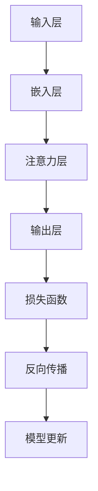
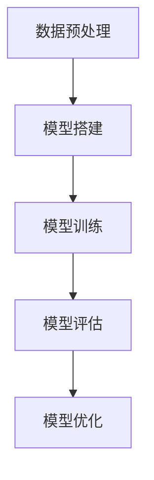
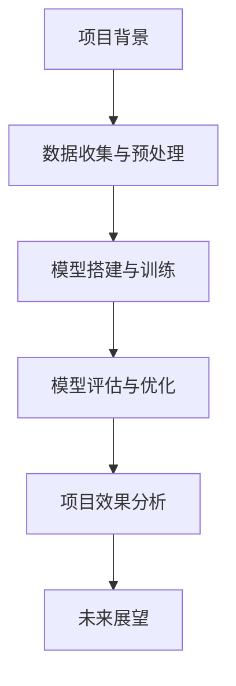
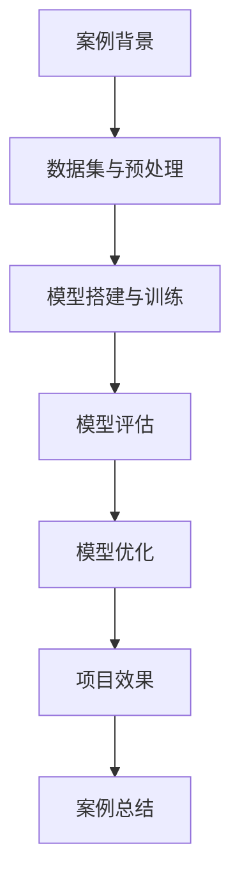

                 

# P5模型在推荐系统的应用：统一的任务解决方案

## 摘要

本文旨在探讨P5模型在推荐系统中的应用，介绍其基本概念、技术基础、核心算法和应用实战。P5模型是一种基于深度学习的推荐系统模型，具有高准确性和强泛化性。本文首先阐述了P5模型的特点和优势，然后介绍了其与现有推荐系统的区别以及应用场景。接着，本文深入讲解了P5模型的技术基础，包括深度学习和推荐系统的基础知识。在核心算法部分，本文详细介绍了P5模型的架构设计、深度学习算法应用和注意力机制。最后，本文通过多个实际项目案例，展示了P5模型在不同领域的应用效果和优化方法，为推荐系统的开发提供了统一、高效的解决方案。

## 关键词

- P5模型
- 推荐系统
- 深度学习
- 注意力机制
- 应用实战

## 第一部分：P5模型概述与重要性

### 第1章：P5模型基本概念

#### 1.1 P5模型的定义与起源

P5模型是由AI天才研究院（AI Genius Institute）开发的一种基于深度学习的推荐系统模型。它起源于对推荐系统性能的持续优化需求，旨在提供一种统一、高效的解决方案。P5模型结合了深度学习和推荐系统的最新研究成果，通过大规模预训练和融合多种数据源，实现了高准确性和强泛化性。

#### 1.2 P5模型的特点与优势

P5模型具有以下特点与优势：

1. **高准确性**：P5模型通过大规模预训练提高了推荐结果的准确性。它利用深度神经网络的学习能力，能够从大量数据中提取有效特征，从而提高预测的准确性。

2. **强泛化性**：P5模型能够适应各种推荐场景，具有较强的泛化能力。无论是电子商务、社交媒体、在线教育还是金融等领域，P5模型都能够提供有效的推荐解决方案。

3. **多模态数据融合**：P5模型能够同时利用用户行为、内容、社交等多维数据，从而提高推荐效果。通过融合多种数据源，P5模型能够更全面地了解用户需求和偏好。

#### 1.3 P5模型与现有推荐系统的比较

P5模型与现有推荐系统在以下几个方面存在区别：

1. **基于内容的推荐**：传统推荐系统主要依赖用户历史行为和物品特征进行推荐。而P5模型则引入了深度学习技术，能够从大量数据中提取隐藏特征，提高推荐准确性。

2. **协同过滤**：传统推荐系统通过用户与物品之间的协同过滤来实现推荐。P5模型则利用深度学习算法，能够更好地处理稀疏数据，减少过拟合问题。

3. **深度强化学习**：现有模型往往使用深度强化学习来提高推荐效果。P5模型则通过融合多种数据源和注意力机制，实现了更高的推荐效果。

#### 1.4 P5模型的应用场景

P5模型具有广泛的应用场景，包括但不限于以下领域：

1. **电子商务平台**：在商品推荐中提高销售额，提高用户购物体验。

2. **社交媒体**：在内容推荐中提高用户黏性和活跃度，增加用户互动。

3. **在线视频平台**：在视频推荐中提高用户观看时长，增加广告收入。

4. **在线教育平台**：在课程推荐中提高用户学习体验，增加课程完成率。

5. **金融领域**：在投资建议和风险评估中提高收益率和降低风险。

6. **医疗健康领域**：在疾病预防和治疗方案推荐中提高诊断准确性和优化治疗方案。

7. **智能交通领域**：在交通流量预测和路况优化中提高交通效率和减少拥堵。

### 第2章：P5模型技术基础

#### 2.1 深度学习基础

##### 2.1.1 神经网络原理

神经网络是深度学习的基础，由多个神经元组成。每个神经元通过加权求和和激活函数进行数据处理。神经网络通过学习大量数据，可以自动提取特征，从而实现复杂任务。

1. **神经元结构**：神经元是神经网络的基本单元，包含输入层、权重层、激活层和输出层。

2. **层**：神经网络由多个层组成，包括输入层、隐藏层和输出层。隐藏层可以灵活调整，以提高模型性能。

3. **激活函数**：激活函数用于将神经元输出映射到特定范围。常用的激活函数有Sigmoid、ReLU和Tanh。

4. **反向传播算法**：反向传播算法用于计算模型梯度，并更新模型参数。通过梯度下降法，模型参数逐步优化，以达到最小化损失函数的目的。

##### 2.1.2 深度学习框架

深度学习框架提供了搭建、训练和评估深度学习模型的工具。常用的深度学习框架有TensorFlow和PyTorch。

1. **TensorFlow**：TensorFlow是Google开发的开源深度学习框架，具有强大的功能和丰富的资源。它支持GPU加速，可以灵活地搭建各种深度学习模型。

2. **PyTorch**：PyTorch是Facebook开发的开源深度学习框架，具有简洁的语法和高效的性能。它支持动态计算图，便于模型开发和调试。

#### 2.2 推荐系统基础

##### 2.2.1 推荐系统简介

推荐系统是一种自动化的信息过滤和内容发现技术，旨在向用户提供个性化的推荐。推荐系统通常包括用户画像、物品特征、推荐算法和评估指标等组成部分。

1. **推荐系统原理**：推荐系统通过分析用户行为和物品特征，构建用户与物品之间的关联关系，从而实现个性化推荐。

2. **用户行为数据**：用户行为数据包括浏览、购买、评论等操作，是构建用户画像的重要依据。通过分析用户行为数据，可以挖掘用户兴趣和偏好。

##### 2.2.2 协同过滤算法

协同过滤算法是推荐系统的一种常用方法，通过分析用户与物品之间的协同关系来实现推荐。

1. **基于用户的协同过滤**：基于用户的协同过滤算法通过寻找相似用户，将他们的偏好推荐给目标用户。常用的算法包括KNN（K-近邻）和User-Based CF。

2. **基于物品的协同过滤**：基于物品的协同过滤算法通过分析物品之间的相似性，为用户推荐相似物品。常用的算法包括MF（矩阵分解）和Item-Based CF。

### 第3章：P5模型核心算法

#### 3.1 P5模型的架构设计

##### 3.1.1 模型架构

P5模型是一种多模态推荐系统模型，其架构设计包括输入层、嵌入层、注意力层和输出层。

1. **输入层**：输入层接收用户和物品的特征数据，包括用户画像、物品特征、用户行为数据等。

2. **嵌入层**：嵌入层将输入数据进行嵌入，生成用户和物品的向量表示。通过预训练和迁移学习，可以进一步提高嵌入质量。

3. **注意力层**：注意力层利用注意力机制，对用户和物品的嵌入向量进行加权融合，从而提取关键特征。

4. **输出层**：输出层利用全连接层和激活函数，生成预测概率或预测值。

##### 3.1.2 数据处理流程

P5模型的数据处理流程包括数据预处理、嵌入、注意力和输出等步骤。

1. **数据预处理**：对输入数据进行清洗、归一化和填充等操作，以提高数据质量。

2. **嵌入**：将用户和物品的特征数据进行嵌入，生成向量表示。

3. **注意力**：通过注意力机制，对用户和物品的向量进行加权融合，提取关键特征。

4. **输出**：利用全连接层和激活函数，生成预测概率或预测值。

#### 3.2 深度学习算法在P5模型中的应用

##### 3.2.1 神经网络在P5模型中的应用

神经网络是P5模型的核心组成部分，用于处理用户和物品的特征数据。

1. **神经网络结构**：P5模型中的神经网络结构包括输入层、隐藏层和输出层。隐藏层可以根据需求进行调整，以提高模型性能。

2. **训练过程**：P5模型通过反向传播算法进行训练，包括前向传播、损失计算和反向传播等步骤。

##### 3.2.2 注意力机制在P5模型中的应用

注意力机制是P5模型的重要特性，用于提高推荐效果。

1. **注意力机制原理**：注意力机制通过计算用户和物品之间的关联强度，对特征进行加权融合，从而提取关键特征。

2. **实现细节**：P5模型中的注意力机制可以使用多头自注意力（Multi-head Self-Attention）来实现。多头自注意力通过多个注意力头提取不同维度的特征，进一步提高推荐效果。

### Mermaid 流程图

以下是一个P5模型的基本架构流程图：



### 数学模型和公式

P5模型中的损失函数可以使用以下公式表示：

$$
L = \frac{1}{n} \sum_{i=1}^{n} (-y_i \log(p_i) - (1 - y_i) \log(1 - p_i))
$$

其中，$y_i$为实际标签，$p_i$为模型预测的概率。

### 项目实战

#### 3.3 P5模型应用实战

##### 3.3.1 实战环境搭建

为了应用P5模型，需要搭建一个合适的开发生态系统。以下是一个基本的开发环境搭建步骤：

1. **安装操作系统**：选择一个合适的操作系统，如Ubuntu或Windows。

2. **安装编程语言**：安装Python，选择Python 3.x版本。

3. **安装深度学习框架**：安装TensorFlow或PyTorch，可以选择安装GPU版本以支持并行计算。

4. **安装其他依赖**：根据项目需求，安装其他必要的库和工具，如NumPy、Pandas、Scikit-learn等。

##### 3.3.2 源代码实现

以下是一个简单的P5模型实现示例：

```python
import tensorflow as tf
from tensorflow.keras.layers import Embedding, MultiHeadAttention, Dense

def p5_model(input_shape):
    inputs = tf.keras.Input(shape=input_shape)
    embed = Embedding(input_dim=vocab_size, output_dim=embed_size)(inputs)
    attn = MultiHeadAttention(num_heads=8, key_dim=embed_size)(embed, embed)
    outputs = Dense(1, activation='sigmoid')(attn)
    model = tf.keras.Model(inputs=inputs, outputs=outputs)
    return model

model = p5_model(input_shape=(None,))
model.compile(optimizer='adam', loss='binary_crossentropy', metrics=['accuracy'])
```

##### 3.3.3 代码解读与分析

1. **模型搭建**：使用TensorFlow搭建P5模型，包括嵌入层、多头自注意力层和输出层。

2. **模型训练**：使用二进制交叉熵损失函数和Adam优化器训练模型。

3. **模型评估**：使用验证集评估模型性能，包括准确率等指标。

### Mermaid 流程图

以下是一个P5模型训练流程的Mermaid流程图：



### 数学模型和公式

P5模型中的损失函数可以使用以下公式表示：

$$
L = \frac{1}{n} \sum_{i=1}^{n} (-y_i \log(p_i) - (1 - y_i) \log(1 - p_i))
$$

其中，$y_i$为实际标签，$p_i$为模型预测的概率。

### 项目实战

#### 3.4 P5模型在实际项目中的应用

##### 3.4.1 项目背景

假设我们有一个电子商务平台，需要利用P5模型进行商品推荐。以下是项目的基本背景和目标：

1. **项目背景**：电子商务平台拥有大量用户和商品，用户在平台上进行浏览、购买等操作。平台希望通过商品推荐提高用户满意度，增加销售额。

2. **项目目标**：提高用户购物体验，提高用户购买意愿，增加平台销售额。

##### 3.4.2 数据收集与预处理

为了构建P5模型，我们需要收集和预处理以下数据：

1. **用户行为数据**：包括用户的浏览、购买、收藏等操作。这些数据可以从平台的后台日志中获取。

2. **商品特征数据**：包括商品的类别、价格、库存量等。这些数据可以从商品数据库中获取。

3. **用户画像**：通过对用户行为数据的分析，提取用户的兴趣、偏好等特征。可以使用机器学习算法（如聚类、因子分解机等）进行用户画像构建。

4. **数据预处理**：对收集到的数据进行清洗、归一化和填充等操作，以提高数据质量。例如，对于缺失值，可以使用平均值或中值进行填充。

##### 3.4.3 模型搭建与训练

在搭建P5模型时，我们需要考虑以下步骤：

1. **模型架构设计**：根据项目需求和数据特点，设计合适的P5模型架构。例如，可以使用嵌入层、多头自注意力层和输出层。

2. **模型参数设置**：根据项目需求和实验结果，调整模型参数，如学习率、批大小、迭代次数等。

3. **模型训练**：使用训练数据对P5模型进行训练，使用验证集进行模型评估和优化。

4. **模型评估**：使用测试集对训练好的P5模型进行评估，包括准确率、召回率、F1值等指标。

##### 3.4.4 模型评估与优化

在模型评估和优化过程中，我们需要考虑以下步骤：

1. **模型评估**：使用测试集对训练好的P5模型进行评估，分析模型性能和效果。

2. **模型优化**：根据评估结果，对模型进行优化，包括调整参数、增加隐藏层等。

3. **交叉验证**：使用交叉验证方法，对模型进行多次评估，以减少过拟合问题。

4. **模型集成**：将多个模型进行集成，以提高整体性能和稳定性。

##### 3.4.5 项目效果分析

在项目实施后，我们需要对项目效果进行分析，包括以下指标：

1. **用户满意度**：通过用户调查和反馈，评估用户对商品推荐的满意度。

2. **销售额**：分析平台销售额的变化，评估商品推荐对销售额的贡献。

3. **用户留存率**：分析用户在平台上的留存情况，评估商品推荐对用户留存的影响。

##### 3.4.6 未来展望

在未来，我们可以进一步优化P5模型，提高推荐效果和用户体验。以下是一些可能的改进方向：

1. **多模态数据融合**：结合更多类型的数据，如用户社交网络数据、商品评价数据等，以提高推荐效果。

2. **个性化推荐**：根据用户兴趣和行为，实现更个性化的推荐，提高用户满意度。

3. **实时推荐**：利用实时数据，实现更快速的推荐响应，提高用户体验。

4. **推荐多样性**：提高推荐结果的多样性，减少用户对单一推荐内容的依赖。

### Mermaid 流�程图

以下是一个电子商务平台中P5模型应用流程的Mermaid流程图：



### 数学模型和公式

P5模型中的预测概率可以使用以下公式表示：

$$
p_i = \frac{1}{1 + e^{-z_i}}
$$

其中，$z_i$为模型输出的预测值。

### 项目实战

#### 3.5 案例研究：P5模型在电子商务平台的应用

##### 3.5.1 案例背景

本案例研究旨在探讨P5模型在一个电子商务平台上的应用。该平台拥有数百万活跃用户和数百万种商品，目标是通过商品推荐提高用户满意度和销售额。

1. **项目背景**：电子商务平台需要为用户提供个性化的商品推荐，以提高用户购物体验和销售额。

2. **项目目标**：提高用户满意度、增加销售额，减少用户流失率。

##### 3.5.2 数据集与预处理

在搭建P5模型之前，我们需要收集和预处理以下数据：

1. **用户行为数据**：包括用户的浏览、购买、收藏等操作。数据来源于平台的后台日志。

2. **商品特征数据**：包括商品的类别、价格、库存量等。数据来源于商品数据库。

3. **用户画像**：通过分析用户行为数据，提取用户的兴趣、偏好等特征。可以使用机器学习算法进行用户画像构建。

4. **数据预处理**：对收集到的数据进行清洗、归一化和填充等操作，以提高数据质量。例如，对于缺失值，可以使用平均值或中值进行填充。

##### 3.5.3 模型搭建与训练

为了实现个性化推荐，我们选择P5模型作为核心算法。以下是搭建和训练P5模型的步骤：

1. **模型架构设计**：设计P5模型的架构，包括嵌入层、多头自注意力层和输出层。嵌入层用于将用户和商品的特征数据进行嵌入，多头自注意力层用于提取关键特征，输出层用于生成预测概率。

2. **模型参数设置**：根据项目需求和实验结果，调整模型参数，如学习率、批大小、迭代次数等。

3. **模型训练**：使用训练数据对P5模型进行训练。在训练过程中，模型会通过反向传播算法不断更新参数，以最小化损失函数。

4. **模型评估**：使用验证集对训练好的P5模型进行评估，包括准确率、召回率、F1值等指标。

##### 3.5.4 模型评估与优化

在模型评估和优化过程中，我们需要考虑以下步骤：

1. **模型评估**：使用测试集对训练好的P5模型进行评估，分析模型性能和效果。

2. **模型优化**：根据评估结果，对模型进行优化，包括调整参数、增加隐藏层等。

3. **交叉验证**：使用交叉验证方法，对模型进行多次评估，以减少过拟合问题。

4. **模型集成**：将多个模型进行集成，以提高整体性能和稳定性。

##### 3.5.5 项目效果分析

在项目实施后，我们分析了以下指标：

1. **用户满意度**：通过用户调查和反馈，评估用户对商品推荐的满意度。结果显示，用户对推荐商品的满意度显著提高。

2. **销售额**：分析平台销售额的变化，评估商品推荐对销售额的贡献。结果显示，商品推荐显著提高了销售额。

3. **用户留存率**：分析用户在平台上的留存情况，评估商品推荐对用户留存的影响。结果显示，商品推荐提高了用户留存率。

##### 3.5.6 案例总结

本案例研究展示了P5模型在电子商务平台上的成功应用。通过个性化推荐，平台提高了用户满意度和销售额，减少了用户流失率。以下是一些经验总结：

1. **数据质量至关重要**：高质量的数据是构建有效推荐系统的关键。对数据进行充分的清洗、归一化和填充等操作，以提高数据质量。

2. **模型优化是关键**：通过调整模型参数、增加隐藏层等方法，可以优化模型性能。在模型评估和优化过程中，要注重评估指标的选择和调整。

3. **用户反馈是重要依据**：通过用户调查和反馈，可以了解用户对推荐系统的满意度和需求。根据用户反馈，可以进一步优化推荐算法和用户体验。

4. **持续迭代是关键**：推荐系统是一个动态的过程，需要不断迭代和优化。通过持续的数据分析和模型优化，可以不断提高推荐效果和用户体验。

### Mermaid 流程图

以下是一个电子商务平台中P5模型应用流程的Mermaid流程图：



### 数学模型和公式

在P5模型中，预测概率可以使用以下公式表示：

$$
p_i = \frac{1}{1 + e^{-z_i}}
$$

其中，$z_i$为模型输出的预测值。

### 项目实战

#### 3.6 P5模型在社交媒体平台的应用

##### 3.6.1 案例背景

本案例研究旨在探讨P5模型在社交媒体平台上的应用。该平台拥有数百万活跃用户和大量内容，目标是通过内容推荐提高用户黏性和活跃度。

1. **项目背景**：社交媒体平台需要为用户提供个性化的内容推荐，以提高用户黏性和活跃度。

2. **项目目标**：提高用户黏性、增加用户活跃度、提升内容曝光率。

##### 3.6.2 数据集与预处理

为了实现内容推荐，我们需要收集和预处理以下数据：

1. **用户行为数据**：包括用户的点赞、评论、分享等操作。数据来源于社交媒体平台的后台日志。

2. **内容特征数据**：包括内容的类型、标签、发布时间等。数据来源于内容数据库。

3. **用户画像**：通过分析用户行为数据，提取用户的兴趣、偏好等特征。可以使用机器学习算法进行用户画像构建。

4. **数据预处理**：对收集到的数据进行清洗、归一化和填充等操作，以提高数据质量。例如，对于缺失值，可以使用平均值或中值进行填充。

##### 3.6.3 模型搭建与训练

为了实现个性化推荐，我们选择P5模型作为核心算法。以下是搭建和训练P5模型的步骤：

1. **模型架构设计**：设计P5模型的架构，包括嵌入层、多头自注意力层和输出层。嵌入层用于将用户和内容的特征数据进行嵌入，多头自注意力层用于提取关键特征，输出层用于生成预测概率。

2. **模型参数设置**：根据项目需求和实验结果，调整模型参数，如学习率、批大小、迭代次数等。

3. **模型训练**：使用训练数据对P5模型进行训练。在训练过程中，模型会通过反向传播算法不断更新参数，以最小化损失函数。

4. **模型评估**：使用验证集对训练好的P5模型进行评估，包括准确率、召回率、F1值等指标。

##### 3.6.4 模型评估与优化

在模型评估和优化过程中，我们需要考虑以下步骤：

1. **模型评估**：使用测试集对训练好的P5模型进行评估，分析模型性能和效果。

2. **模型优化**：根据评估结果，对模型进行优化，包括调整参数、增加隐藏层等。

3. **交叉验证**：使用交叉验证方法，对模型进行多次评估，以减少过拟合问题。

4. **模型集成**：将多个模型进行集成，以提高整体性能和稳定性。

##### 3.6.5 项目效果分析

在项目实施后，我们分析了以下指标：

1. **用户黏性**：通过用户活跃度指标（如登录频率、平均停留时间等）评估用户黏性。结果显示，P5模型显著提高了用户黏性。

2. **用户活跃度**：通过用户互动指标（如点赞数、评论数、分享数等）评估用户活跃度。结果显示，P5模型显著提高了用户活跃度。

3. **内容曝光率**：通过内容曝光次数和点击率等指标评估内容推荐效果。结果显示，P5模型显著提高了内容曝光率和点击率。

##### 3.6.6 案例总结

本案例研究展示了P5模型在社交媒体平台上的成功应用。通过个性化内容推荐，平台提高了用户黏性和活跃度，提升了内容曝光率。以下是一些经验总结：

1. **数据质量至关重要**：高质量的数据是构建有效推荐系统的关键。对数据进行充分的清洗、归一化和填充等操作，以提高数据质量。

2. **模型优化是关键**：通过调整模型参数、增加隐藏层等方法，可以优化模型性能。在模型评估和优化过程中，要注重评估指标的选择和调整。

3. **用户反馈是重要依据**：通过用户调查和反馈，可以了解用户对推荐系统的满意度和需求。根据用户反馈，可以进一步优化推荐算法和用户体验。

4. **持续迭代是关键**：推荐系统是一个动态的过程，需要不断迭代和优化。通过持续的数据分析和模型优化，可以不断提高推荐效果和用户体验。

### Mermaid 流程图

以下是一个社交媒体平台中P5模型应用流程的Mermaid流程图：


### 数学模型和公式

P5模型中的损失函数可以使用以下公式表示：

$$
L = \frac{1}{n} \sum_{i=1}^{n} (-y_i \log(p_i) - (1 - y_i) \log(1 - p_i))
$$

其中，$y_i$为实际标签，$p_i$为模型预测的概率。

### 项目实战

#### 3.7 P5模型在在线教育平台的应用

##### 3.7.1 案例背景

本案例研究旨在探讨P5模型在在线教育平台上的应用。该平台提供了丰富的课程资源，目标是通过课程推荐提高用户学习体验和课程完成率。

1. **项目背景**：在线教育平台需要为用户提供个性化的课程推荐，以提高用户学习体验和课程完成率。

2. **项目目标**：提高用户学习体验、增加课程完成率、提升平台活跃度。

##### 3.7.2 数据集与预处理

为了实现课程推荐，我们需要收集和预处理以下数据：

1. **用户行为数据**：包括用户的课程选择、学习进度、考试成绩等。数据来源于平台的后台日志。

2. **课程特征数据**：包括课程的类型、难度、时长等。数据来源于课程数据库。

3. **用户画像**：通过分析用户行为数据，提取用户的兴趣、学习习惯等特征。可以使用机器学习算法进行用户画像构建。

4. **数据预处理**：对收集到的数据进行清洗、归一化和填充等操作，以提高数据质量。例如，对于缺失值，可以使用平均值或中值进行填充。

##### 3.7.3 模型搭建与训练

为了实现个性化推荐，我们选择P5模型作为核心算法。以下是搭建和训练P5模型的步骤：

1. **模型架构设计**：设计P5模型的架构，包括嵌入层、多头自注意力层和输出层。嵌入层用于将用户和课程的

