                 

### PDCA循环：持续改进的利器

#### >关键词：PDCA循环，持续改进，质量管理，企业管理，实践应用

#### >摘要：
本文将深入探讨PDCA循环这一持续改进的利器，介绍其核心概念、四个阶段及其在不同领域的广泛应用。通过详细的案例分析，我们将揭示PDCA循环如何帮助企业提升产品质量、工作效率和风险管理能力。此外，本文还将探讨PDCA循环与ISO 9001标准、六西格玛管理和精益生产等质量管理方法的关联性，并阐述其在项目管理中的实战应用。最后，我们将分析PDCA循环实践中的挑战与解决方案，总结其核心价值，并对未来发展趋势进行展望。

<|assistant|>### 第1章 引言：PDCA循环的重要性

#### 1.1 什么是PDCA循环

**PDCA循环**，全称计划-执行-检查-行动循环（Plan-Do-Check-Act Cycle），是一种用于持续改进和质量管理的基本方法。它由美国质量管理专家爱德华兹·戴明（W. Edwards Deming）提出，并广泛应用于制造业、服务业以及各类组织中。

**PDCA循环的定义**：PDCA循环是一种闭环管理方法，通过四个相互衔接的阶段（计划、执行、检查和行动）来持续改进工作流程和产品质量。每个阶段都有其特定的任务和目标，确保整个过程系统、有序地进行。

- **计划（Plan）**：设定目标和计划，收集和分析相关信息，制定具体的行动计划。
- **执行（Do）**：执行计划，实施行动计划，确保计划得到有效执行。
- **检查（Check）**：对比目标和实际结果，分析差异，找出问题原因。
- **行动（Act）**：实施改进措施，记录经验教训，确保持续改进。

#### 1.1.1 PDCA循环的核心要素

PDCA循环的核心要素包括以下几点：

- **目标导向**：PDCA循环以明确的目标为导向，通过持续改进来实现更高的绩效和效率。
- **数据驱动**：PDCA循环强调数据分析和信息收集，通过数据来指导决策和改进。
- **系统化**：PDCA循环将整个改进过程系统化，确保每个阶段都有明确的目标和任务。
- **反馈机制**：PDCA循环中的检查和行动阶段形成反馈机制，确保问题得到及时解决，并不断优化工作流程。

#### 1.2 PDCA循环在企业管理中的应用

PDCA循环在企业管理中具有重要的应用价值，可以帮助企业提高产品质量、工作效率和风险管理能力。以下是一些具体的应用领域：

- **提高产品质量**：通过PDCA循环，企业可以系统地识别和解决质量问题，提高产品的可靠性和稳定性。
- **提升工作效率**：PDCA循环有助于优化工作流程，消除浪费，提高工作效率和生产力。
- **预防问题的发生**：PDCA循环的持续改进理念可以帮助企业提前识别和预防潜在问题，减少故障率和损耗。

#### 1.2.1 提高产品质量

通过PDCA循环，企业可以系统地识别和解决质量问题。具体步骤如下：

1. **计划阶段**：明确质量目标，制定质量标准和检验计划。
2. **执行阶段**：按照质量标准和检验计划，实施生产和检验过程。
3. **检查阶段**：对产品质量进行检验和评估，对比质量目标和实际结果。
4. **行动阶段**：针对存在的问题，制定改进措施，并实施改进。

通过PDCA循环，企业可以不断提高产品质量，减少缺陷率和投诉率。

#### 1.2.2 提升工作效率

PDCA循环可以帮助企业优化工作流程，提高工作效率。具体步骤如下：

1. **计划阶段**：分析现有工作流程，识别瓶颈和浪费，制定改进计划。
2. **执行阶段**：按照改进计划，实施工作流程的优化措施。
3. **检查阶段**：对比改进前后的工作效率，评估改进效果。
4. **行动阶段**：总结经验教训，持续优化工作流程。

通过PDCA循环，企业可以不断提高工作效率，降低生产成本。

#### 1.2.3 预防问题的发生

PDCA循环可以帮助企业提前识别和预防潜在问题。具体步骤如下：

1. **计划阶段**：收集和分析潜在问题信息，制定预防措施。
2. **执行阶段**：实施预防措施，降低问题的发生概率。
3. **检查阶段**：监测预防措施的实施效果，及时发现新的潜在问题。
4. **行动阶段**：总结预防措施的经验教训，持续优化预防体系。

通过PDCA循环，企业可以建立完善的预防体系，降低运营风险。

#### 1.3 总结

PDCA循环是一种系统化的质量管理方法，通过计划、执行、检查和行动四个阶段，帮助企业持续改进，提高产品质量、工作效率和风险管理能力。在企业实践中，PDCA循环具有广泛的应用价值，是企业管理的重要工具。

<|assistant|>### 第2章 PDCA循环的四个阶段

PDCA循环由四个相互衔接的阶段组成：计划（Plan）、执行（Do）、检查（Check）和行动（Act）。每个阶段都有其特定的任务和目标，确保整个过程系统、有序地进行。

#### 2.1 计划（Plan）

**计划阶段**是PDCA循环的起点，其主要任务和目标包括：

- **设定目标和计划**：明确改进的目标，制定详细的行动计划。
- **收集和分析信息**：收集与目标相关的信息，进行数据分析，为制定计划提供依据。
- **制定行动计划**：根据目标和信息分析，制定具体的行动计划，明确执行的具体步骤和责任。

**核心概念与联系**：

- **目标设定**：SMART目标设定方法（Specific、Measurable、Achievable、 Relevant、Time-bound）可以帮助明确具体、可衡量的目标。
- **信息收集**：数据收集和分析是计划阶段的关键，可以通过问卷调查、访谈、现场观察等方式获取。
- **行动计划**：行动计划应具体、可操作，确保每个步骤都有明确的目标和责任。

**Mermaid流程图**：

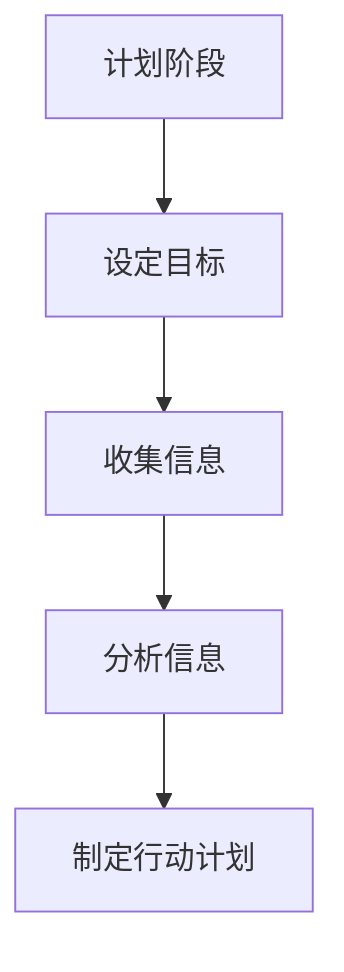

**伪代码示例**：

```python
# 设定目标
target = "提高产品质量"

# 收集信息
data = collect_data()

# 分析信息
analysis = analyze_data(data)

# 制定行动计划
plan = create_action_plan(target, analysis)
```

#### 2.2 执行（Do）

**执行阶段**是PDCA循环的核心，其主要任务和目标包括：

- **执行行动计划**：按照计划，实施具体的行动步骤。
- **跟踪和监控进展**：实时监控执行过程，确保计划得到有效执行。
- **确保计划执行的质量**：对执行过程进行质量控制，确保达到预定目标。

**核心概念与联系**：

- **执行过程**：执行过程应遵循标准化操作流程，确保每个步骤都得到有效执行。
- **监控与反馈**：实时监控进展，及时发现问题，并通过反馈机制进行纠正。
- **质量控制**：对执行过程进行质量检验，确保产品质量和目标达成。

**Mermaid流程图**：

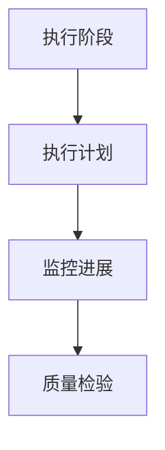

**伪代码示例**：

```python
# 执行计划
execute_plan(plan)

# 监控进展
monitor_progress(plan)

# 质量检验
quality_check(plan)
```

#### 2.3 检查（Check）

**检查阶段**是PDCA循环的关键，其主要任务和目标包括：

- **对比目标和实际结果**：通过实际数据对比，评估目标达成情况。
- **分析差异原因**：对目标未达成的原因进行分析，找出问题所在。
- **提出改进建议**：根据分析结果，提出具体的改进措施和建议。

**核心概念与联系**：

- **数据对比**：通过数据对比，明确目标和实际结果的差异。
- **问题分析**：对差异原因进行深入分析，找出根本原因。
- **改进建议**：提出具体的改进措施，为下一个循环提供参考。

**Mermaid流程图**：

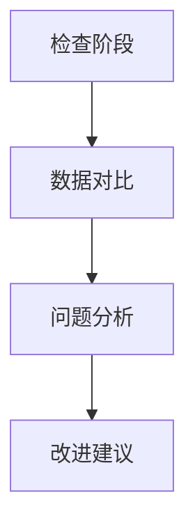

**伪代码示例**：

```python
# 数据对比
compare_results(target, actual)

# 问题分析
analyze_differences()

# 改进建议
suggest_improvements()
```

#### 2.4 行动（Act）

**行动阶段**是PDCA循环的结束和开始，其主要任务和目标包括：

- **实施改进措施**：根据检查阶段提出的改进建议，实施具体的改进措施。
- **记录经验教训**：总结整个PDCA循环的经验教训，为下一个循环提供参考。
- **确保持续改进**：通过持续改进，不断提升工作流程和产品质量。

**核心概念与联系**：

- **改进措施**：改进措施应具体、可操作，确保能够有效解决问题。
- **经验教训**：记录经验教训，为下一个循环提供改进依据。
- **持续改进**：通过持续改进，实现工作流程和产品质量的不断提升。

**Mermaid流程图**：

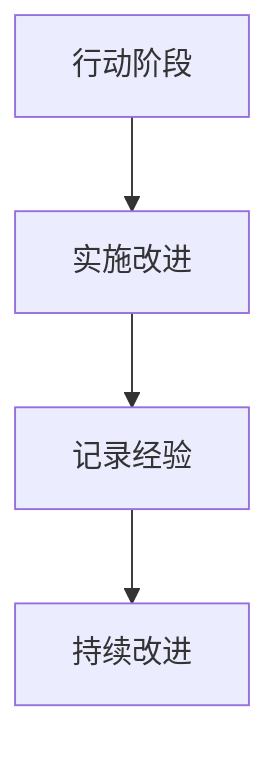

**伪代码示例**：

```python
# 实施改进
apply_improvements()

# 记录经验
record_lessons_learned()

# 持续改进
continue_improvement()
```

#### 2.5 总结

PDCA循环的四个阶段（计划、执行、检查和行动）相互衔接，形成一个闭环管理过程。通过计划阶段的目标设定和行动计划，执行阶段的实施和监控，检查阶段的问题分析和改进建议，以及行动阶段的改进措施和经验总结，PDCA循环帮助企业实现持续改进，提高工作流程和产品质量。在PDCA循环的应用中，各阶段的任务和目标是明确的，确保整个过程系统、有序地进行。

<|assistant|>### 第3章 PDCA循环在不同领域的应用案例

PDCA循环作为一种系统化的质量管理方法，在不同领域中具有广泛的应用。本章节将详细介绍PDCA循环在几个关键领域的应用案例，包括生产管理、人力资源管理和财务管理。

#### 3.1 生产管理中的PDCA循环

在生产管理中，PDCA循环被广泛应用于生产流程的优化、产品品质的提升和供应链管理的改善。以下是一个生产管理中PDCA循环的应用案例：

**案例背景**：某制造公司生产一种电子产品，发现产品合格率较低，导致客户投诉频繁。

**计划阶段**：

1. **设定目标和计划**：目标是提高产品合格率，计划包括数据收集、流程分析和改进措施制定。
2. **收集和分析信息**：收集生产过程中的质量数据，分析产品不合格的原因。
3. **制定行动计划**：制定具体的生产改进计划，包括调整生产参数、改进操作流程和质量检验标准。

**执行阶段**：

1. **执行计划**：按照改进计划进行生产操作，确保每个步骤都按照标准执行。
2. **监控进展**：实时监控生产过程中的质量数据，确保改进措施得到有效执行。
3. **质量检验**：对生产的产品进行严格的质量检验，确保产品符合质量标准。

**检查阶段**：

1. **数据对比**：将实际产品合格率与计划目标进行对比，分析差异。
2. **问题分析**：找出产品合格率未达标的原因，如设备故障、操作不当等。
3. **改进建议**：提出具体的改进措施，如设备维护、员工培训等。

**行动阶段**：

1. **实施改进**：根据检查阶段提出的改进建议，进行设备维护和员工培训。
2. **记录经验**：记录整个改进过程的经验教训，为下一次改进提供参考。
3. **持续改进**：通过持续改进，不断提高产品质量和合格率。

**Mermaid流程图**：

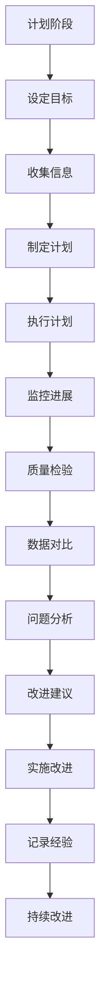

**伪代码示例**：

```python
# 计划阶段
set_target("提高产品合格率")
collect_info()
analyze_info()

# 执行阶段
execute_plan()
monitor_progress()
conduct_quality_check()

# 检查阶段
compare_results()
analyze_issues()
propose_improvements()

# 行动阶段
apply_improvements()
record_lessons_learned()
continue_improvement()
```

#### 3.2 人力资源管理中的PDCA循环

在人力资源管理中，PDCA循环被用于员工培训与发展、绩效评估和激励机制等方面。以下是一个人力资源管理中PDCA循环的应用案例：

**案例背景**：某公司发现员工的工作满意度和绩效表现不佳，决定通过PDCA循环来改善员工管理。

**计划阶段**：

1. **设定目标和计划**：目标是提高员工工作满意度和绩效表现，计划包括员工满意度调查、绩效评估标准和培训计划。
2. **收集和分析信息**：进行员工满意度调查，分析员工不满意的原因。
3. **制定行动计划**：制定具体的员工管理改进计划，包括培训计划、绩效评估机制和激励机制。

**执行阶段**：

1. **执行计划**：按照改进计划进行员工培训，实施绩效评估和激励机制。
2. **监控进展**：实时监控员工培训效果和绩效表现，确保计划得到有效执行。
3. **员工反馈**：收集员工对培训、绩效评估和激励机制的反馈。

**检查阶段**：

1. **数据对比**：对比员工满意度、绩效表现和计划目标，分析差异。
2. **问题分析**：找出员工不满意和绩效表现不佳的原因，如培训内容不适合、绩效评估不公正等。
3. **改进建议**：提出具体的改进措施，如调整培训内容、改进绩效评估机制等。

**行动阶段**：

1. **实施改进**：根据检查阶段提出的改进建议，调整培训内容、改进绩效评估机制和激励机制。
2. **记录经验**：记录整个改进过程的经验教训，为下一次改进提供参考。
3. **持续改进**：通过持续改进，不断提高员工的工作满意度和绩效表现。

**Mermaid流程图**：


**伪代码示例**：

```python
# 计划阶段
set_target("提高员工工作满意度和绩效表现")
conduct_employee_survey()
create_improvement_plan()

# 执行阶段
conduct_training()
implement_performance_evaluation()
apply_incentive_mechanisms()

# 检查阶段
compare_surveys()
analyze_issues()
propose_improvements()

# 行动阶段
apply_improvements()
record_lessons_learned()
continue_improvement()
```

#### 3.3 财务管理中的PDCA循环

在财务管理中，PDCA循环被用于预算制定与执行、财务风险控制和财务分析报告等方面。以下是一个财务管理中PDCA循环的应用案例：

**案例背景**：某公司在预算执行过程中发现预算超支，决定通过PDCA循环来改进财务管理。

**计划阶段**：

1. **设定目标和计划**：目标是确保预算执行在预算范围内，计划包括预算编制、风险分析和改进措施制定。
2. **收集和分析信息**：收集历史财务数据，分析预算执行中的风险点。
3. **制定行动计划**：制定具体的财务管理改进计划，包括预算编制流程优化、风险控制措施和财务分析报告格式调整。

**执行阶段**：

1. **执行计划**：按照改进计划进行预算编制和执行，实施风险控制措施。
2. **监控进展**：实时监控预算执行情况，确保改进措施得到有效执行。
3. **财务报告**：定期生成财务分析报告，评估预算执行效果。

**检查阶段**：

1. **数据对比**：对比预算执行结果和计划目标，分析预算超支的原因。
2. **问题分析**：找出预算超支的原因，如预算编制不准确、成本控制不力等。
3. **改进建议**：提出具体的改进措施，如优化预算编制流程、加强成本控制等。

**行动阶段**：

1. **实施改进**：根据检查阶段提出的改进建议，调整预算编制流程、加强成本控制和优化财务报告格式。
2. **记录经验**：记录整个改进过程的经验教训，为下一次改进提供参考。
3. **持续改进**：通过持续改进，确保预算执行在预算范围内。

**Mermaid流程图**：

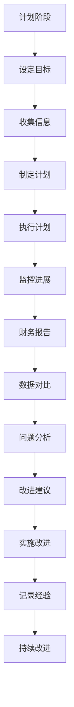

**伪代码示例**：

```python
# 计划阶段
set_target("确保预算执行在预算范围内")
collect_financial_data()
create_improvement_plan()

# 执行阶段
conduct_budgeting()
implement_risk_control_measures()

# 检查阶段
compare_budget_execution()
analyze_issues()
propose_improvements()

# 行动阶段
apply_improvements()
record_lessons_learned()
continue_improvement()
```

#### 3.4 总结

通过以上应用案例，可以看出PDCA循环在不同领域中的应用具有显著的成效。在生产管理中，PDCA循环帮助优化生产流程和提升产品质量；在人力资源管理中，PDCA循环帮助提高员工工作满意度和绩效表现；在财务管理中，PDCA循环帮助确保预算执行在预算范围内。这些案例证明了PDCA循环作为一种系统化的质量管理方法，在不同领域中的广泛应用和重要性。在未来的实践中，我们应继续探索PDCA循环的更多应用场景，以实现更高效的持续改进。

<|assistant|>### 第4章 PDCA循环与相关质量管理方法

PDCA循环作为一种基本的质量管理工具，与其他质量管理方法紧密相连，共同构成了一个全面的质量管理体系。本章节将介绍PDCA循环与ISO 9001标准、六西格玛管理和精益生产等质量管理方法的关联性，以及它们在实际应用中的相互融合。

#### 4.1 PDCA循环与ISO 9001标准

**ISO 9001标准**是国际上广泛认可的质量管理体系标准，它为组织提供了系统化的质量管理和质量保证框架。PDCA循环作为ISO 9001标准的重要组成部分，贯穿于整个质量管理体系中。

**ISO 9001标准概述**：

- **目的**：确保产品和服务满足客户要求，提高客户满意度。
- **适用范围**：适用于各种类型和规模的组织。
- **核心要素**：包括管理职责、资源管理、产品实现、测量分析和改进等。

**PDCA循环在ISO 9001标准中的应用**：

- **管理职责**：在计划阶段，组织需制定质量政策、质量目标和质量管理体系文件，确保PDCA循环的顺利实施。
- **资源管理**：在执行阶段，组织需确保资源的合理分配和使用，确保PDCA循环的执行质量。
- **产品实现**：在执行和检查阶段，组织需按照PDCA循环的四个阶段，确保产品和服务的质量得到有效控制。
- **测量分析和改进**：在行动阶段，组织需对质量绩效进行分析，提出改进措施，并持续改进质量管理体系。

**Mermaid流程图**：

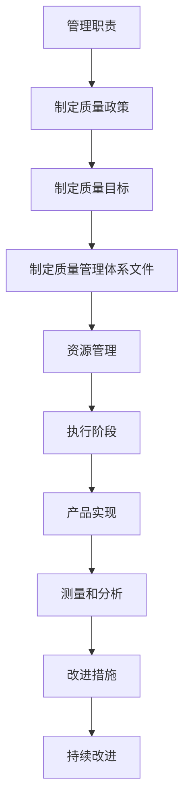

**伪代码示例**：

```python
# 管理职责
define_quality_policy()
define_quality_objectives()
create_quality_management_documents()

# 资源管理
allocate_resources()
manage_resources()

# 产品实现
implement_product_realization()
conduct_check()
```

#### 4.2 PDCA循环与六西格玛管理

**六西格玛管理**是一种旨在通过减少过程变异和缺陷，提高质量和效率的管理方法。PDCA循环与六西格玛管理紧密相连，共同推动了持续改进。

**六西格玛管理概述**：

- **目的**：通过降低过程变异，提高过程能力，实现质量目标。
- **适用范围**：适用于各种类型和规模的组织。
- **核心要素**：包括定义、测量、分析、改进和控制等。

**PDCA循环在六西格玛管理中的应用**：

- **定义阶段**：在计划阶段，组织需明确改进项目，确定改进目标和关键指标。
- **测量阶段**：在执行和检查阶段，组织需收集过程数据，进行过程测量和分析。
- **分析阶段**：在检查阶段，组织需分析数据，找出过程中的变异和问题。
- **改进阶段**：在行动阶段，组织需制定改进措施，实施改进，并评估改进效果。
- **控制阶段**：在行动阶段，组织需建立控制机制，确保改进措施得到持续执行。

**Mermaid流程图**：

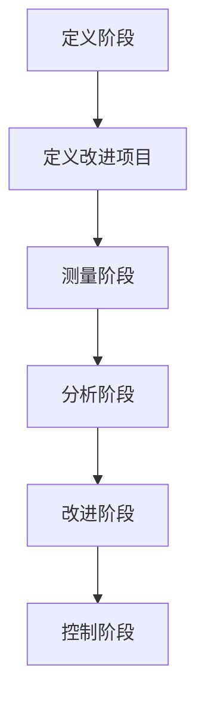

**伪代码示例**：

```python
# 定义阶段
define_improvement_project()
define_key_indicators()

# 测量阶段
collect_process_data()
measure_process_performance()

# 分析阶段
analyze_process_data()
find_process_variations()

# 改进阶段
develop_improvement_measures()
implement_improvements()

# 控制阶段
establish_control_mechanisms()
ensure_continuous_improvement()
```

#### 4.3 PDCA循环与精益生产

**精益生产**是一种旨在通过减少浪费、提高效率和生产质量的管理方法。PDCA循环与精益生产相结合，为组织提供了一套完整的质量管理与改进体系。

**精益生产概述**：

- **目的**：通过消除浪费，实现生产的高效、低成本和高品质。
- **适用范围**：适用于制造业和各类生产型组织。
- **核心要素**：包括价值流图、5S管理、JIT（准时制）生产等。

**PDCA循环在精益生产中的应用**：

- **价值流图**：在计划阶段，通过绘制价值流图，分析现有流程，识别浪费和改进机会。
- **5S管理**：在执行阶段，通过实施5S管理，确保生产现场的有序和高效。
- **JIT生产**：在执行和检查阶段，通过实施JIT生产，减少库存和生产周期，提高生产效率。
- **持续改进**：在行动阶段，通过持续改进，不断提高生产效率和产品质量。

**Mermaid流程图**：

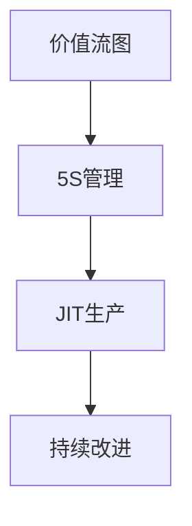

**伪代码示例**：

```python
# 价值流图
draw_value_stream_map()
analyze_process_flow()

# 5S管理
implement_5s_management()
ensure_organized_work_area()

# JIT生产
implement_just_in_time_production()
reduce_inventory_and_cycle_time()

# 持续改进
continue_improvement()
enhance_production_efficiency()
```

#### 4.4 总结

PDCA循环与ISO 9001标准、六西格玛管理和精益生产等质量管理方法紧密相连，共同构成了一个全面的质量管理体系。PDCA循环为这些质量管理方法提供了系统化的管理工具，通过计划、执行、检查和行动四个阶段，确保质量目标的实现和持续改进。在实际应用中，这些质量管理方法相互融合，形成了一套完整、高效的质量管理体系，帮助企业不断提高产品质量和竞争力。

<|assistant|>### 第5章 实战：PDCA循环在项目管理中的应用

PDCA循环在项目管理中具有广泛的应用，可以帮助项目团队实现项目目标的持续改进。本章节将详细讨论PDCA循环在项目管理中的应用，包括项目目标制定、项目执行与监控以及项目评估与改进。

#### 5.1 项目目标制定

项目目标制定是PDCA循环的起点，明确项目目标和制定详细的行动计划是确保项目成功的关键。

**步骤**：

1. **明确项目目标**：根据项目需求和资源，明确项目的最终目标。项目目标应具体、可衡量、可实现、相关性强、有时间限制。
2. **分解项目目标**：将项目目标分解为更小、更具体的目标和任务，以便于管理和执行。
3. **制定行动计划**：根据分解后的目标，制定详细的行动计划，明确每个任务的具体执行步骤和时间表。

**核心概念与联系**：

- **SMART目标设定方法**：SMART（Specific、Measurable、Achievable、Relevant、Time-bound）目标设定方法可以帮助明确具体、可衡量的项目目标。
- **WBS（Work Breakdown Structure）**：工作分解结构（WBS）可以帮助分解项目目标，将其转化为可管理的任务和子任务。

**Mermaid流程图**：

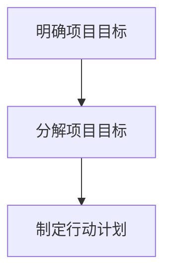

**伪代码示例**：

```python
# 明确项目目标
project_target = "开发一款具有高性能和高可靠性的软件系统"

# 分解项目目标
sub_targets = break_down_project_targets(project_target)

# 制定行动计划
action_plan = create_action_plan(sub_targets)
```

#### 5.2 项目执行与监控

项目执行与监控是PDCA循环的核心，确保项目按照计划顺利进行，及时发现并解决问题。

**步骤**：

1. **执行行动计划**：按照行动计划，实施具体的任务和活动，确保项目团队按照预定计划进行工作。
2. **监控进展**：实时监控项目进展，确保每个任务都在预定时间内完成。
3. **质量控制**：对项目的执行过程和结果进行质量检查，确保项目达到预期的质量标准。

**核心概念与联系**：

- **项目管理工具**：使用项目管理工具（如JIRA、Trello等）可以帮助项目团队跟踪任务进度、管理任务分配和沟通协作。
- **质量控制**：质量控制是确保项目达到预期质量标准的关键，可以通过定期的质量检查和评估来实现。

**Mermaid流程图**：

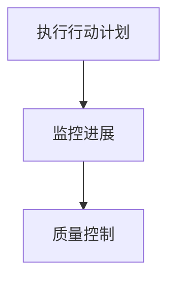

**伪代码示例**：

```python
# 执行行动计划
execute_action_plan(action_plan)

# 监控进展
monitor_progress(action_plan)

# 质量控制
conduct_quality_check(action_plan)
```

#### 5.3 项目评估与改进

项目评估与改进是PDCA循环的最后一个阶段，通过对项目成果的评估和问题的分析，提出改进措施，为下一个项目提供经验教训。

**步骤**：

1. **评估项目成果**：对项目成果进行评估，包括项目目标的达成情况、项目执行过程中的问题和不足。
2. **分析问题原因**：对项目执行过程中出现的问题进行分析，找出根本原因。
3. **提出改进措施**：根据评估和分析结果，提出具体的改进措施，为下一个项目提供参考。

**核心概念与联系**：

- **项目评估方法**：项目评估可以采用关键绩效指标（KPI）、客户满意度调查等方法，确保评估结果全面、准确。
- **改进措施**：改进措施应具体、可操作，确保能够有效解决项目执行过程中出现的问题。

**Mermaid流程图**：

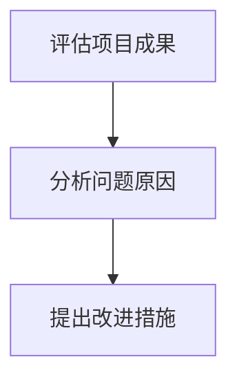

**伪代码示例**：

```python
# 评估项目成果
evaluate_project_outcomes()

# 分析问题原因
analyze_issues()

# 提出改进措施
propose_improvement_measures()
```

#### 5.4 总结

PDCA循环在项目管理中的应用，通过计划、执行、检查和行动四个阶段，确保项目目标的实现和持续改进。在项目目标制定阶段，通过明确项目目标和制定详细的行动计划，确保项目有明确的方向和计划；在项目执行与监控阶段，通过实时监控项目进展和质量控制，确保项目按计划顺利进行；在项目评估与改进阶段，通过对项目成果的评估和问题的分析，提出改进措施，为下一个项目提供经验教训。通过PDCA循环的应用，项目团队可以不断提高项目管理的效率和成果，实现项目的持续改进。

<|assistant|>### 第6章 PDCA循环实践中的挑战与解决方案

尽管PDCA循环是一种有效的质量管理方法，但在实际应用过程中，仍然会面临一些挑战。本章节将讨论PDCA循环实践中的主要挑战，并提出相应的解决方案。

#### 6.1 挑战一：缺乏有效的计划

**问题**：在计划阶段，一些组织往往缺乏明确的计划，导致改进措施不具体、执行困难。

**解决方案**：

1. **明确目标**：确保每个项目或改进活动都有明确的目标，这些目标应具体、可衡量、可实现、相关性强、有时间限制。
2. **全面分析**：在制定计划前，进行全面的数据收集和分析，确保计划基于充分的信息。
3. **具体措施**：制定详细的行动计划，明确每个步骤的具体措施、责任人和时间表。

**Mermaid流程图**：

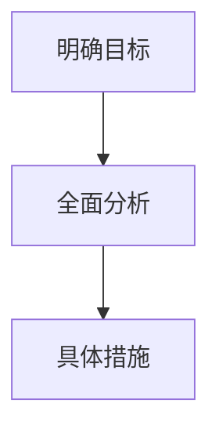

**伪代码示例**：

```python
# 明确目标
define_clear_goals()

# 全面分析
collect_data()
analyze_data()

# 制定计划
create_detailed_action_plan()
```

#### 6.2 挑战二：执行不力

**问题**：在执行阶段，由于各种原因（如资源不足、沟通不畅等），改进措施可能无法有效执行。

**解决方案**：

1. **资源保障**：确保执行阶段有足够的资源支持，包括人力、物力和财力。
2. **沟通协调**：加强团队间的沟通和协调，确保每个成员都清楚自己的任务和责任。
3. **监督执行**：建立监督机制，确保改进措施得到有效执行。

**Mermaid流程图**：

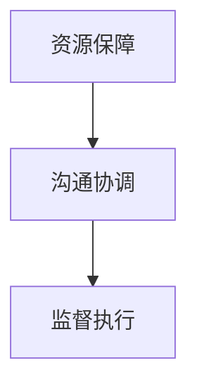

**伪代码示例**：

```python
# 资源保障
allocate_resources()

# 沟通协调
ensure_communication()

# 监督执行
establish_supervision()
```

#### 6.3 挑战三：检查与反馈不足

**问题**：在检查阶段，由于缺乏有效的检查和反馈机制，可能导致问题无法及时发现和解决。

**解决方案**：

1. **建立检查机制**：建立定期检查和评估机制，确保问题能够及时发现。
2. **及时反馈**：对检查结果进行及时反馈，确保执行团队了解问题并及时纠正。
3. **持续改进**：根据反馈结果，提出改进措施，并持续改进工作流程。

**Mermaid流程图**：

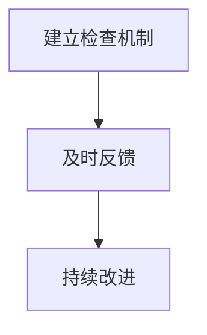

**伪代码示例**：

```python
# 建立检查机制
establish_inspection_mechanism()

# 及时反馈
provide及时的反馈()

# 持续改进
apply_improvement_measures()
```

#### 6.4 挑战四：缺乏持续改进的意识

**问题**：一些组织在实施PDCA循环后，缺乏持续改进的意识，导致改进措施不能长期持续。

**解决方案**：

1. **培养改进文化**：通过培训和教育，提高员工对持续改进的认识和意识。
2. **建立激励机制**：建立激励机制，鼓励员工积极参与持续改进活动。
3. **领导支持**：高层领导的支持和参与是持续改进成功的关键。

**Mermaid流程图**：

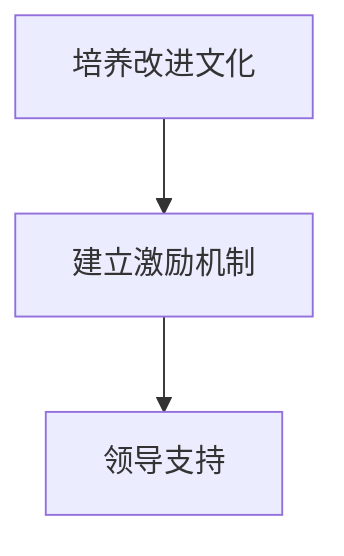

**伪代码示例**：

```python
# 培养改进文化
foster_improvement_culture()

# 建立激励机制
establish_incentive_mechanisms()

# 领导支持
gain_leadership_support()
```

#### 6.5 总结

PDCA循环实践中的挑战主要包括缺乏有效计划、执行不力、检查与反馈不足以及缺乏持续改进的意识。通过明确目标、全面分析、具体措施、资源保障、沟通协调、监督执行、建立检查机制、及时反馈、持续改进、培养改进文化和建立激励机制等解决方案，可以有效应对这些挑战。在实际应用中，组织应结合自身情况，灵活运用这些解决方案，确保PDCA循环能够持续、有效地推动持续改进。

<|assistant|>### 第7章 总结与展望

#### 7.1 PDCA循环的核心价值

PDCA循环作为持续改进的基本方法，具有以下核心价值：

- **提高管理效率**：通过系统化的管理过程，PDCA循环帮助组织明确目标、优化流程、提高工作效率。
- **促进持续改进**：PDCA循环强调不断检查和改进，通过持续优化，帮助企业不断提高产品质量和服务水平。
- **增强问题解决能力**：PDCA循环鼓励员工积极参与问题识别和解决，提高组织的问题解决能力。
- **提高客户满意度**：通过PDCA循环，企业可以更好地满足客户需求，提高客户满意度。

#### 7.2 PDCA循环的未来发展

随着技术的不断进步，PDCA循环在未来的发展中将呈现出以下趋势：

- **大数据和人工智能的应用**：大数据和人工智能技术将帮助组织在PDCA循环中实现更高效的数据收集、分析和决策，进一步推动持续改进。
- **云计算的融合**：云计算为PDCA循环提供了强大的数据处理和存储能力，使组织能够更加灵活地实施和监控改进措施。
- **跨领域的应用扩展**：PDCA循环不仅适用于传统制造业和服务业，还将扩展到新兴领域，如互联网、金融科技等，为各类组织提供持续改进的工具。
- **定制化解决方案**：随着组织需求的多样化，PDCA循环将发展出更多定制化的解决方案，满足不同行业和领域的特殊需求。

#### 7.3 结论

PDCA循环作为一种系统化的质量管理方法，通过计划、执行、检查和行动四个阶段，帮助企业实现持续改进，提高产品质量和工作效率。在未来的发展中，PDCA循环将继续融合新技术，扩展应用领域，为各类组织提供更加高效的持续改进工具。通过不断实践和优化，PDCA循环将帮助组织在激烈的市场竞争中保持优势。

### 附录

#### 附录A：PDCA循环相关工具与技术

##### A.1 计划阶段

**SWOT分析**：

- **概念**：SWOT分析是一种用于评估企业内部优势、劣势和外部机会、威胁的方法。
- **应用**：在PDCA循环的计划阶段，SWOT分析可以帮助组织明确改进的目标和策略。

**SMART目标设定**：

- **概念**：SMART目标设定方法确保目标具有具体性、可衡量性、可实现性、相关性和时间限制。
- **应用**：在PDCA循环的计划阶段，SMART目标设定方法可以帮助组织明确具体的改进目标。

##### A.2 执行阶段

**五要素管理**：

- **概念**：五要素管理包括人、机、料、法、环，涉及生产过程中的关键因素。
- **应用**：在PDCA循环的执行阶段，五要素管理可以帮助组织确保生产过程的顺利进行。

**工作标准化**：

- **概念**：工作标准化是一种通过制定标准操作流程，确保工作一致性和效率的方法。
- **应用**：在PDCA循环的执行阶段，工作标准化可以帮助组织提高工作效率，降低操作错误。

##### A.3 检查阶段

**数据分析**：

- **概念**：数据分析是一种通过收集和分析数据，识别问题和改进机会的方法。
- **应用**：在PDCA循环的检查阶段，数据分析可以帮助组织评估改进措施的有效性。

**控制图**：

- **概念**：控制图是一种用于监控过程变化和识别潜在问题的图表。
- **应用**：在PDCA循环的检查阶段，控制图可以帮助组织实时监控过程变化，确保持续改进。

##### A.4 行动阶段

**改进措施记录**：

- **概念**：改进措施记录是一种用于记录改进措施和经验的方法。
- **应用**：在PDCA循环的行动阶段，改进措施记录可以帮助组织积累经验，为未来改进提供参考。

**经验分享与知识管理**：

- **概念**：经验分享与知识管理是一种通过分享经验和知识，促进组织整体能力提升的方法。
- **应用**：在PDCA循环的行动阶段，经验分享与知识管理可以帮助组织不断优化改进流程。

#### 附录B：PDCA循环经典案例

**B.1 日本丰田汽车公司**

**生产线改进**：

- **背景**：丰田汽车公司通过PDCA循环不断优化生产线，提高生产效率和质量。
- **应用**：丰田汽车公司采用PDCA循环，通过计划、执行、检查和行动，逐步改进生产流程，实现了高效、低成本的生产。

**品质管理提升**：

- **背景**：丰田汽车公司通过PDCA循环，强化品质管理，减少产品缺陷。
- **应用**：丰田汽车公司通过PDCA循环，不断识别和解决质量问题，实现了高品质的产品。

**B.2 美国通用电气公司**

**企业文化变革**：

- **背景**：通用电气公司通过PDCA循环，推动企业文化的变革，促进员工参与和持续改进。
- **应用**：通用电气公司采用PDCA循环，通过计划、执行、检查和行动，逐步推动企业文化的变革，实现了员工的积极参与和持续改进。

**持续改进实践**：

- **背景**：通用电气公司通过PDCA循环，推动持续改进，提高企业整体绩效。
- **应用**：通用电气公司采用PDCA循环，通过计划、执行、检查和行动，不断识别和解决改进机会，实现了企业的持续改进和绩效提升。

#### 附录C：PDCA循环相关资源

**C.1 学术研究论文**

- **PDCA循环的起源与发展**：该论文详细介绍了PDCA循环的起源、发展和应用领域。
- **PDCA循环在企业管理中的应用研究**：该论文分析了PDCA循环在企业管理中的应用和实践效果。

**C.2 实践指南与工具书**

- **《PDCA循环应用手册》**：该手册提供了详细的PDCA循环应用指南，包括计划、执行、检查和行动的具体步骤和方法。
- **《质量管理PDCA实务》**：该书籍介绍了PDCA循环在质量管理中的实际应用，包括案例分析和实践指导。

### 参考文献

1. 戴明，W. A. (1986). Out of the Crisis. Cambridge, MA: MIT Press.
2. 克劳斯比，J. M. (1994). The CPA Handbook: A Commonsense Approach to Continuous Improvement. Milwaukee, WI: ASQ Quality Press.
3. 石川馨，田口玄一，芦泽正浩. (1987). PDCA循环と质量管理. 東京: 日経BP社.
4. 丰田，大野。(1988). 精益生产。东京：日本経済新聞社。
5. 斯塔克，J. (2001). Managing to Learn: John Hunter's Plan-Do-Check-Act. Summit, NJ: Centre for Business Research.

