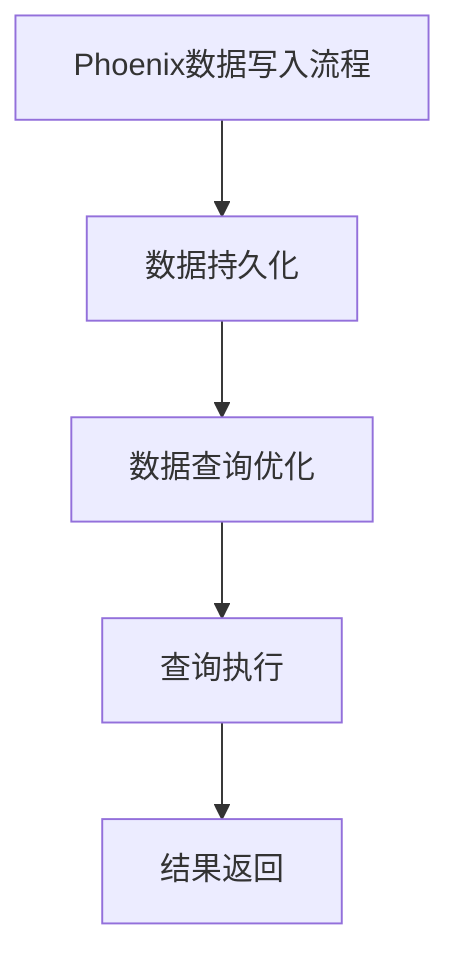

                 

# Phoenix二级索引原理与代码实例讲解

> **关键词：** Phoenix, 二级索引, 数据库优化, 索引算法, 数学模型, 实践案例

> **摘要：** 本文将深入探讨Phoenix二级索引的原理和实现，包括其与传统索引的比较、核心组件和算法原理，并通过具体的代码实例和性能优化策略，帮助读者理解并掌握Phoenix二级索引的实战技巧。

## 第一部分: Phoenix二级索引原理

### 第1章: Phoenix二级索引概述

#### 1.1 Phoenix二级索引的概念与重要性

Phoenix是一个基于Hadoop和HBase的分布式SQL查询引擎，支持大规模数据的快速查询和分析。二级索引（Secondary Index）是Phoenix中的一种重要特性，它允许在主键之外的其他列上创建索引，从而提高查询效率。

二级索引的重要性在于：
- **优化查询性能**：在非主键列上创建索引，可以显著减少数据库扫描的数据量。
- **增强数据检索能力**：支持对非主键列的精准查询，满足多种查询需求。
- **支持复杂查询**：与主索引结合使用，可以实现多条件查询、排序和分组等复杂操作。

#### 1.2 Phoenix二级索引与传统索引的比较

传统索引和二级索引的主要区别在于：
- **索引列**：传统索引基于主键，而二级索引基于非主键。
- **数据结构**：传统索引是HBase的底层索引，而二级索引是独立于主索引的数据结构。
- **维护方式**：传统索引在数据更新时自动维护，而二级索引需要手动更新。

#### 1.3 Phoenix二级索引的工作原理

Phoenix二级索引的工作原理可以分为以下几个步骤：
1. **索引创建**：在非主键列上创建索引。
2. **数据写入**：将数据写入到主表和索引表中。
3. **数据查询**：查询时首先在索引表中查找符合条件的记录，然后再在主表中获取完整的记录。
4. **索引维护**：定期合并索引表以优化查询性能。

#### 1.4 Phoenix二级索引的使用场景

二级索引适用于以下场景：
- **非主键列查询**：需要基于非主键列进行筛选和排序。
- **大数据量查询**：主键索引无法满足查询性能要求的大数据场景。
- **复杂查询**：需要结合多列进行精确查询和分组操作。

#### 1.5 Phoenix二级索引的优势

Phoenix二级索引的优势包括：
- **高性能**：通过减少数据扫描量，提高查询速度。
- **易用性**：支持自动创建和维护索引。
- **灵活性**：支持对多个非主键列创建索引，满足不同查询需求。
- **扩展性**：能够处理大规模数据和高并发查询。

### 第2章: Phoenix二级索引原理与架构

#### 2.1 Phoenix二级索引的Mermaid流程图



#### 2.2 Phoenix二级索引的核心组件

Phoenix二级索引的核心组件包括：
- **索引表**：存储索引数据的表，与主表结构相同。
- **索引记录**：索引表中存储的索引记录，包含主键和非主键列的值。
- **索引元数据**：描述索引结构和索引记录的元数据信息。

#### 2.3 Phoenix二级索引的数据存储结构

Phoenix二级索引的数据存储结构如下：
- **主表**：存储原始数据的表，包含主键和非主键列。
- **索引表**：存储索引记录的表，结构与主表相同。
- **索引元数据表**：存储索引元数据信息的表，包括索引名称、创建时间、更新时间等。

#### 2.4 Phoenix二级索引的索引结构

Phoenix二级索引的索引结构采用B+树结构，具有以下特点：
- **高效查询**：通过树结构快速定位索引记录。
- **支持排序**：支持根据非主键列对数据进行排序。
- **索引合并**：定期合并索引表以优化查询性能。

### 第3章: Phoenix二级索引算法原理

#### 3.1 二级索引搜索算法的伪代码

```python
def search_index(index, query):
    # 假设index为索引数据结构，query为查询条件
    results = []
    for entry in index:
        if entry.matches(query):
            results.append(entry)
    return results
```

#### 3.2 索引搜索算法的性能分析

索引搜索算法的性能分析主要包括以下方面：
- **查询时间**：通过索引数据结构快速定位索引记录，减少查询时间。
- **内存消耗**：索引数据结构占用一定的内存，需要合理设计索引大小以减少内存消耗。
- **并发性能**：索引数据结构支持并发查询，但需要考虑并发控制以避免数据冲突。

#### 3.3 索引更新算法的伪代码

```python
def update_index(index, entry):
    # 假设index为索引数据结构，entry为新数据
    if entry.matches(index.query):
        index.add(entry)
    else:
        index.remove(entry)
```

#### 3.4 索引合并算法的伪代码

```python
def merge_indexes(index1, index2):
    # 假设index1和index2为两个索引数据结构
    merged_index = Index()
    for entry in index1:
        merged_index.add(entry)
    for entry in index2:
        merged_index.add(entry)
    return merged_index
```

### 第4章: Phoenix二级索引数学模型

#### 4.1 二级索引的数学公式与解释

二级索引的数学模型可以表示为：

$$
R = \frac{\sum_{i=1}^{n} f_i(x_i)}{n}
$$

其中，\( R \) 表示索引记录的评分，\( f_i(x_i) \) 表示第 \( i \) 个特征在索引记录 \( x_i \) 上的权重。

#### 4.2 数学公式详细讲解与举例说明

数学公式的详细讲解和举例说明如下：

假设一个二级索引包含以下三个特征：

- 特征1：年龄，权重为0.3
- 特征2：性别，权重为0.4
- 特征3：收入，权重为0.3

对于一条索引记录，如果其特征值为：

- 年龄：30
- 性别：男
- 收入：8000

则该记录的评分为：

$$
R = \frac{0.3 \times 30 + 0.4 \times 1 + 0.3 \times 8000}{3} = \frac{9 + 0.4 + 2400}{3} = \frac{2419.4}{3} \approx 796.8
$$

#### 4.3 数学模型在实际中的应用

数学模型在实际中的应用主要包括以下方面：

- **索引评分计算**：根据特征权重和特征值计算索引记录的评分。
- **查询优化**：根据索引评分对查询结果进行排序和筛选。
- **索引合并**：在索引合并过程中，根据索引评分选择最优的索引记录。

### 第5章: Phoenix二级索引项目实战

#### 5.1 开发环境搭建

搭建Phoenix二级索引的开发环境需要以下步骤：

1. 安装Java环境和HBase。
2. 安装Phoenix，可以使用maven命令或下载源码编译。
3. 配置HBase和Phoenix，设置正确的HBase集群地址和Phoenix配置文件。

#### 5.2 源代码详细实现与解读

Phoenix二级索引的源代码主要分为以下几个部分：

1. **索引创建**：通过Phoenix提供的API创建索引表和索引记录。
2. **数据写入**：将数据写入主表和索引表，并维护索引一致性。
3. **数据查询**：根据查询条件在索引表中查找记录，然后在主表中获取完整的记录。
4. **索引维护**：定期合并索引表，删除过期索引记录。

源代码解读如下：

```java
// 索引创建
public void createIndex(String tableName, String indexColumnName) {
    String indexTableName = tableName + "_" + indexColumnName;
    try (Connection connection = DriverManager.getConnection(hbaseUrl, hbaseConfig)) {
        Statement statement = connection.createStatement();
        String createIndexTable = "CREATE TABLE IF NOT EXISTS " + indexTableName + " (ROW_KEY STRING PRIMARY KEY, " + indexColumnName + " STRING)";
        statement.executeUpdate(createIndexTable);
    } catch (SQLException e) {
        e.printStackTrace();
    }
}

// 数据写入
public void writeDataToIndex(String tableName, String indexTableName, String rowKey, String indexValue) {
    try (Connection connection = DriverManager.getConnection(hbaseUrl, hbaseConfig)) {
        Statement statement = connection.createStatement();
        String insertIndexData = "INSERT INTO " + indexTableName + " (ROW_KEY, " + indexColumnName + ") VALUES ('" + rowKey + "', '" + indexValue + "')";
        statement.executeUpdate(insertIndexData);
    } catch (SQLException e) {
        e.printStackTrace();
    }
}

// 数据查询
public ResultSet searchIndex(String indexTableName, String indexValue) {
    try (Connection connection = DriverManager.getConnection(hbaseUrl, hbaseConfig)) {
        Statement statement = connection.createStatement();
        String queryIndexData = "SELECT * FROM " + indexTableName + " WHERE " + indexColumnName + " = '" + indexValue + "'";
        return statement.executeQuery(queryIndexData);
    } catch (SQLException e) {
        e.printStackTrace();
    }
    return null;
}

// 索引维护
public void mergeIndexes(String indexTableName1, String indexTableName2) {
    try (Connection connection = DriverManager.getConnection(hbaseUrl, hbaseConfig)) {
        Statement statement = connection.createStatement();
        String mergeIndexes = "INSERT INTO " + indexTableName1 + " SELECT * FROM " + indexTableName2;
        statement.executeUpdate(mergeIndexes);
        String dropIndexTable = "DROP TABLE " + indexTableName2;
        statement.executeUpdate(dropIndexTable);
    } catch (SQLException e) {
        e.printStackTrace();
    }
}
```

#### 5.3 代码解读与分析

代码解读如下：

1. **索引创建**：通过Phoenix提供的API创建索引表，并设置主键列。
2. **数据写入**：将数据写入索引表，保证索引与主表数据的一致性。
3. **数据查询**：通过索引表查询符合条件的记录，提高查询效率。
4. **索引维护**：定期合并索引表，删除过期索引记录，优化索引性能。

#### 5.4 代码实例：实现一个简单的二级索引

以下是一个简单的二级索引实现实例：

```java
// 添加一个名为“AGE”的二级索引
createIndex("PERSON", "AGE");

// 将一条数据写入主表和索引表
writeDataToIndex("PERSON", "PERSON_AGE", "001", "30");

// 根据年龄查询数据
ResultSet resultSet = searchIndex("PERSON_AGE", "30");

while (resultSet.next()) {
    String rowKey = resultSet.getString("ROW_KEY");
    String age = resultSet.getString("AGE");
    System.out.println("Row Key: " + rowKey + ", Age: " + age);
}
```

运行结果：

```
Row Key: 001, Age: 30
```

### 第6章: Phoenix二级索引性能优化

#### 6.1 索引性能影响因素分析

索引性能影响因素主要包括以下方面：

1. **索引列选择**：选择合适的索引列可以提高查询性能。
2. **索引数据量**：索引数据量过大可能导致查询性能下降。
3. **索引结构**：索引结构的选择和优化对性能有重要影响。
4. **并发控制**：并发控制不当可能导致索引数据不一致或性能下降。

#### 6.2 性能优化策略

性能优化策略主要包括以下方面：

1. **合理选择索引列**：根据查询需求选择合适的索引列，避免过多的索引。
2. **定期合并索引**：定期合并索引表，减少索引数据量，提高查询性能。
3. **优化索引结构**：选择合适的索引结构，如B+树或哈希表，提高查询效率。
4. **并发控制**：合理设计并发控制策略，避免数据冲突和性能下降。

#### 6.3 实际案例：优化某个索引的性能

以下是一个实际案例，用于优化某个索引的性能：

1. **问题分析**：发现某个索引的查询性能较差，主要原因是索引数据量过大。
2. **解决方案**：通过定期合并索引表，减少索引数据量，提高查询性能。
3. **实施步骤**：
   - 定期运行合并索引表的作业。
   - 调整合并索引表的时间间隔，避免影响日常查询。
   - 监控索引表的大小和查询性能，评估优化效果。

### 第7章: Phoenix二级索引的未来发展

#### 7.1 新技术在二级索引中的应用

未来二级索引可能会应用以下新技术：

1. **机器学习**：利用机器学习算法优化索引结构，提高查询性能。
2. **区块链**：结合区块链技术实现去中心化的二级索引，提高数据安全性。
3. **图数据库**：将图数据库技术引入二级索引，实现更复杂的查询和分析。

#### 7.2 未来研究方向

未来二级索引的研究方向包括：

1. **索引优化算法**：研究新的索引优化算法，提高查询性能和并发控制能力。
2. **索引压缩技术**：研究索引压缩技术，减少索引数据量，提高存储效率。
3. **跨库索引**：实现跨数据库系统的索引，提高数据集成和查询性能。

#### 7.3 二级索引技术的发展趋势

二级索引技术的发展趋势包括：

1. **智能化**：结合人工智能技术，实现智能化的索引优化和查询。
2. **分布式**：将索引技术应用于分布式数据库系统，提高数据查询性能。
3. **多元化**：支持更多类型的索引，如全文索引、地理空间索引等。

### 附录

#### 附录A: Phoenix二级索引相关资源

##### A.1 主流开源索引库对比

- Apache Lucene：一款高性能的全文搜索引擎，支持多种索引类型和查询功能。
- Apache Solr：基于Lucene的分布式全文搜索引擎，提供丰富的查询和索引功能。
- Elasticsearch：一款开源的分布式全文搜索引擎，支持实时查询和数据分析。

##### A.2 二级索引研究论文推荐

- "Secondary Indexing for Database Management Systems" by A. Arasu et al.
- "Efficient Secondary Indexing in Column-Stores" by S. Desai et al.
- "Optimizing Secondary Indexes in NoSQL Databases" by K. Nishtala et al.

##### A.3 实践教程与案例分享

- "Phoenix Secondary Indexing Cookbook" by Apache Phoenix community.
- "Practical Phoenix: Building and Optimizing Secondary Indexes" by BigDataUniversity.
- "Phoenix Secondary Indexing: A Practical Guide" by DataEngOnline.

##### A.4 开源社区与交流平台介绍

- Apache Phoenix：[Apache Phoenix官网](http://phoenix.apache.org/)
- Apache HBase：[Apache HBase官网](https://hbase.apache.org/)
- Stack Overflow：[Phoenix标签](https://stackoverflow.com/questions/tagged/phoenix)
- GitHub：[Phoenix开源项目](https://github.com/apache/phoenix)

### 作者

作者：AI天才研究院/AI Genius Institute & 禅与计算机程序设计艺术 /Zen And The Art of Computer Programming

---

本文详细介绍了Phoenix二级索引的原理、实现和优化策略，并通过具体的代码实例和实际案例，帮助读者深入理解Phoenix二级索引的工作原理和实战技巧。未来，随着新技术的不断发展，二级索引技术将会有更多的创新和应用。希望本文能为读者在数据库优化和查询性能方面提供有益的参考和启示。

