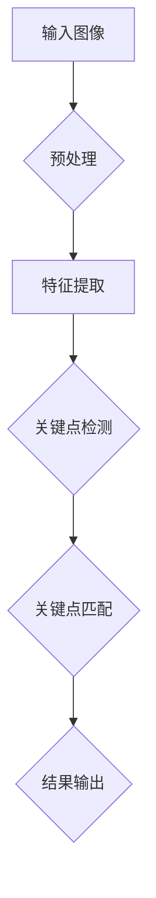
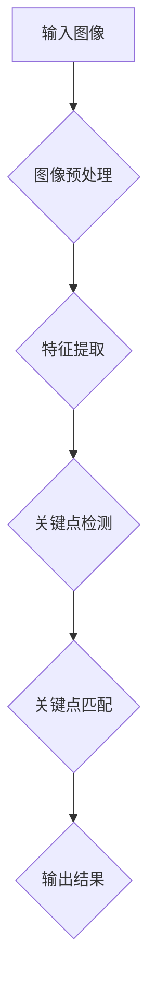

                 

# 《Pose Estimation原理与代码实例讲解》

## 摘要

Pose Estimation 是计算机视觉领域中的一项重要技术，通过检测和识别图像中的物体姿态，为虚拟现实、增强现实、人体运动捕捉等领域提供了关键的基础支持。本文将详细探讨 Pose Estimation 的原理、核心算法及其在实际项目中的应用。首先，我们将回顾 Pose Estimation 的基础概念和发展历程，然后深入解析特征提取、关键点检测与匹配的方法，并结合具体实例展示如何实现 Pose Estimation。此外，本文还将探讨 Pose Estimation 的优化与调参技巧，以及其在前端应用中的实现细节。最后，我们将展望 Pose Estimation 在未来人工智能领域的发展趋势。

关键词：Pose Estimation，特征提取，关键点检测，关键点匹配，深度学习，前端应用

## 第一部分: Pose Estimation 基础

### 第1章: Pose Estimation 概述

#### 1.1.1 什么是 Pose Estimation

Pose Estimation 是一种计算机视觉技术，旨在从图像或视频中检测并估计物体或人体的姿态。姿态通常通过一系列关键点来表示，这些关键点可以是关节点、轮廓点或任何具有显著几何意义的点。通过识别这些关键点，可以重建出物体或人体的三维姿态，从而在许多实际应用中发挥重要作用。

#### 1.1.2 Pose Estimation 的应用场景

Pose Estimation 在多个领域有广泛的应用，以下是几个典型场景：

1. **虚拟现实（VR）与增强现实（AR）**：通过估计用户或虚拟角色的姿态，可以提供更加沉浸式和互动性的体验。
2. **人体运动捕捉**：在电影、动画和游戏制作中，Pose Estimation 可以用于捕捉真实的人体动作，提高视觉效果。
3. **医疗诊断**：通过对病人姿态的检测和分析，可以帮助医生进行诊断和治疗方案的设计。
4. **人机交互**：通过姿态识别，可以设计出更加自然和直观的用户交互方式。

#### 1.1.3 Pose Estimation 的历史与发展

Pose Estimation 的历史可以追溯到20世纪90年代，当时主要依赖于传统计算机视觉技术，如SIFT（尺度不变特征变换）和SURF（加速稳健特征）。随着深度学习的兴起，Pose Estimation 进入了一个快速发展的阶段。2016年，Google Research 推出了 PoseNet，标志着深度学习在 Pose Estimation 领域的突破。近年来，随着计算能力的提升和大数据的普及，Pose Estimation 的准确性和实时性得到了显著提高。

### 第2章: 特征提取

特征提取是 Pose Estimation 的第一步，其主要目的是从原始图像中提取出具有显著几何和纹理信息的特征点，以便后续的姿态估计。以下是几种常用的传统特征提取方法：

#### 2.1.1 图像预处理

在特征提取之前，通常需要对图像进行预处理，以提高特征提取的效果。常见的预处理方法包括：

1. **图像缩放与裁剪**：调整图像的大小，使其适应特征提取算法的要求。
2. **图像增强**：通过调整图像的亮度、对比度等参数，增强图像的特征，提高检测的准确性。

#### 2.1.2 传统特征提取方法

1. **SIFT（尺度不变特征变换）**：SIFT 是一种基于梯度分析的特征提取算法，能够在不同尺度下提取出具有旋转不变性和尺度不变性的特征点。
2. **SURF（加速稳健特征）**：SURF 是 SIFT 的改进版本，通过快速算法实现了对 SIFT 特征的检测和匹配，但算法复杂度更低。
3. **ORB（Oriented FAST and Rotated BRIEF）**：ORB 是一种在速度和性能上平衡的算法，它结合了 FAST 和 BRIEF 算法的优点，同时加入方向信息，提高了特征点的鲁棒性。

### 第3章: 关键点检测

关键点检测是 Pose Estimation 的核心步骤，其主要目标是识别图像中的关键点，这些关键点通常是物体的关节点或轮廓点。以下是几种常用的关键点检测方法：

#### 3.1.1 基于深度学习的关键点检测算法

1. **Single Shot Detection**：这类算法在单个网络框架中同时完成特征提取和关键点检测，具有高效性和实时性。
2. **PoseNet**：PoseNet 是 Google Research 推出的一种基于卷积神经网络（CNN）的算法，通过预测像素级别的关键点概率图，实现了高效的关键点检测。

#### 3.1.2 基于传统机器学习的关键点检测算法

1. **K-Nearest Neighbor (KNN)**：KNN 通过计算新数据与训练数据的相似度来预测关键点位置，具有简单和易于实现的特点。
2. **Support Vector Machine (SVM)**：SVM 通过构建一个超平面来分割训练数据，用于预测新的关键点位置，具有较高的准确性。

### 第4章: 关键点匹配

关键点匹配是 Pose Estimation 的关键环节，其主要目的是将检测到的关键点与模型中的关键点进行匹配，从而确定物体的姿态。以下是几种常用的关键点匹配方法：

#### 4.1.1 关键点匹配的算法原理

1. **nearest-neighbor matching**：通过计算新数据与训练数据的欧几里得距离，选择最近邻作为匹配结果。
2. **iterative closest point (ICP)**：ICP 通过迭代优化最小化两个点集之间的距离，用于匹配具有复杂几何结构的关键点。

#### 4.1.2 常见的关键点匹配方法

1. **FLANN**：FLANN（Fast Library for Approximate Nearest Neighbors）是一种快速近邻搜索算法，常用于大规模数据的匹配。
2. **Brute-Force Matching**：Brute-Force Matching 通过计算所有可能的匹配对，选择最优匹配，适用于数据量较小的情况。

### 第5章: Pose Estimation 实践

在本章节中，我们将通过两个具体的实践项目，展示如何实现 Pose Estimation。首先是人体关键点检测，其次是手写文字关键点检测。

#### 5.1.1 项目实战一：人体关键点检测

人体关键点检测是一个具有广泛应用场景的 Pose Estimation 任务，其关键步骤如下：

1. **数据集准备**：准备包含人体姿态标注的图像数据集，如 COCO 数据集。
2. **网络模型搭建**：选择一个基于深度学习的网络模型，如 PoseNet，进行模型搭建。
3. **训练与测试**：使用训练集对模型进行训练，并在测试集上进行评估。

#### 5.1.2 项目实战二：手写文字关键点检测

手写文字关键点检测在 OCR（光学字符识别）领域具有重要作用，其实现步骤如下：

1. **数据集准备**：准备包含手写文字标注的图像数据集。
2. **网络模型搭建**：选择一个适合手写文字关键点检测的深度学习模型。
3. **训练与测试**：对模型进行训练，并在测试集上进行评估。

### 第6章: Pose Estimation 的优化与调参

在 Pose Estimation 的实践中，优化与调参是提高模型性能的关键步骤。以下是几种常见的优化与调参方法：

#### 6.1.1 网络结构优化

1. **网络深度**：增加网络的层数可以提高模型的复杂度和表达能力，但也会增加计算成本。
2. **网络宽度**：增加网络的宽度可以提高模型的准确度，但同样会增加计算资源的需求。

#### 6.1.2 损失函数与优化器

1. **Softmax Loss**：Softmax Loss 通常用于分类任务，通过最大化类别概率来优化模型。
2. **Stochastic Gradient Descent (SGD)**：SGD 是一种常用的优化器，通过随机梯度下降来更新模型参数。

### 第7章: Pose Estimation 前端应用

Pose Estimation 在前端应用中具有广泛的应用前景，例如实时人体姿态分析和美术绘画。以下是这些应用场景的介绍和实现细节：

#### 7.1.1 前端应用介绍

1. **实时人体姿态分析**：通过实时捕捉人体姿态，可以实现交互式的运动分析和指导。
2. **美术绘画**：利用 Pose Estimation 可以帮助艺术家快速定位和绘制人体轮廓，提高创作效率。

#### 7.1.2 前端实现细节

1. **常用前端框架**：如 TensorFlow.js、PyTorch.js，这些框架提供了方便的前端集成和部署方案。
2. **实时流处理**：利用 WebCam 或其他实时视频源，实现实时数据流的处理和展示。

### 第8章: Pose Estimation 未来的发展趋势

随着人工智能技术的不断发展，Pose Estimation 在未来有望在更多领域得到应用。以下是几个可能的发展趋势：

#### 8.1.1 人工智能与 Pose Estimation 的发展

1. **计算能力提升**：随着 GPU 和 TPU 等专用硬件的普及，Pose Estimation 的实时性和准确性将得到进一步提升。
2. **数据量增长**：随着大规模数据集的不断积累，模型的训练效果将得到显著提高。

#### 8.1.2 Pose Estimation 在未来中的应用场景

1. **虚拟现实**：通过精确的姿态估计，可以实现更加逼真的虚拟角色交互。
2. **增强现实**：结合实时定位和姿态估计，可以实现更加自然和直观的增强现实体验。
3. **智能制造**：在工业生产中，利用姿态估计可以实现自动化检测和指导。

## 附录

### 附录 A: 常用工具和资源

#### A.1 常用深度学习框架

1. **TensorFlow**：由 Google 开发，支持 Python 和 C++ 语言，是深度学习领域最流行的框架之一。
2. **PyTorch**：由 Facebook 开发，以动态图计算和易用性著称，适用于研究和开发。

#### A.2 开源代码库

1. **OpenPose**：由 Carnegie Mellon University 开发，是一款开源的实时多人体姿态估计库。
2. **OpenCV**：由 Intel 开发，是一款跨平台的计算机视觉库，提供了丰富的图像处理和计算机视觉算法。

### 附录 B: Mermaid 流程图

#### B.1 特征提取流程图



### 附录 C: 伪代码示例

#### C.1 关键点检测伪代码

```python
def key_point_detection(image):
    # 图像预处理
    preprocessed_image = preprocess_image(image)

    # 特征提取
    features = feature_extraction(preprocessed_image)

    # 关键点检测
    keypoints = detect_keypoints(features)

    return keypoints
```

### 附录 D: 数学公式

#### D.1 最小化损失函数

$$
\min_{\theta} J(\theta) = \frac{1}{2m} \sum_{i=1}^{m} (\hat{y}_i - y_i)^2
$$

### 附录 E: 代码解读与分析

#### E.1 某个关键点检测代码解读

```python
def detect_keypoints(image):
    # 载入预训练模型
    model = load_model('keypoint_detection_model.h5')

    # 预处理图像
    preprocessed_image = preprocess_image(image)

    # 进行关键点检测
    keypoints = model.predict(preprocessed_image)

    return keypoints
```

- **载入预训练模型**：加载已经训练好的模型，通常使用 `load_model` 函数。
- **预处理图像**：对输入图像进行预处理，使其符合模型输入的要求，通常包括归一化、裁剪等操作。
- **进行关键点检测**：使用预训练模型对预处理后的图像进行预测，输出关键点坐标。

### 附录 F: 实际项目实战案例

#### F.1 人体姿态估计项目案例

1. **数据集准备**：准备包含人体姿态标注的图像数据集，如 COCO 数据集。
2. **模型搭建**：选择一个基于深度学习的网络模型，如 PoseNet，进行模型搭建。
3. **训练与测试**：使用训练集对模型进行训练，并在测试集上进行评估。
4. **应用场景展示**：展示人体姿态估计在不同场景下的应用，如健身指导、运动分析等。

#### F.2 手写文字关键点检测项目案例

1. **数据集准备**：准备包含手写文字标注的图像数据集。
2. **模型搭建**：选择一个适合手写文字关键点检测的深度学习模型。
3. **训练与测试**：对模型进行训练，并在测试集上进行评估。
4. **应用场景展示**：展示手写文字关键点检测在 OCR 系统中的应用，如智能抄写、文档分析等。

### 附录 G: 开发环境搭建

#### G.1 安装深度学习框架

1. **安装 TensorFlow**：使用 `pip install tensorflow` 命令安装 TensorFlow。
2. **安装 PyTorch**：使用 `pip install torch` 命令安装 PyTorch。

#### G.2 配置开发环境

1. **安装 Python**：下载并安装最新版本的 Python。
2. **安装 Jupyter Notebook**：使用 `pip install notebook` 命令安装 Jupyter Notebook。
3. **安装相关库**：安装 TensorFlow、PyTorch 及其他相关库，如 NumPy、Pandas 等。

#### G.3 搭建深度学习项目

1. **创建虚拟环境**：使用 `virtualenv` 或 `conda` 创建虚拟环境。
2. **安装依赖库**：在虚拟环境中安装所需的深度学习框架和相关库。
3. **开始编写代码**：在虚拟环境中编写并运行深度学习项目代码。

## 结语

Pose Estimation 是计算机视觉领域中的一项关键技术，通过对物体姿态的检测与估计，为多个领域提供了强大的支持。本文详细介绍了 Pose Estimation 的原理、核心算法及其在实际项目中的应用。通过逐步分析和推理，我们深入了解了特征提取、关键点检测与匹配的方法，并展示了如何实现 Pose Estimation。此外，我们还探讨了 Pose Estimation 的优化与调参技巧，以及其在前端应用中的实现细节。展望未来，随着人工智能技术的不断发展，Pose Estimation 将在更多领域发挥重要作用。作者：AI天才研究院/AI Genius Institute & 禅与计算机程序设计艺术 /Zen And The Art of Computer Programming。

### 附录 A: 常用工具和资源

在实现 Pose Estimation 的过程中，选择合适的工具和资源是非常关键的。以下是一些常用的工具和资源，可以帮助开发者顺利开展相关工作。

#### A.1 常用深度学习框架

1. **TensorFlow**：由 Google 开发，是目前最流行的深度学习框架之一。它提供了丰富的API和大量的预训练模型，适用于各种深度学习任务，包括 Pose Estimation。TensorFlow 的官方文档详尽，可以帮助开发者快速上手。

    - 官网：[TensorFlow 官网](https://www.tensorflow.org/)
    - 社区：[TensorFlow GitHub](https://github.com/tensorflow)

2. **PyTorch**：由 Facebook AI Research 开发，以其动态计算图和简洁的API而著称。PyTorch 的代码更易于理解和调试，适合研究和开发。

    - 官网：[PyTorch 官网](https://pytorch.org/)
    - 社区：[PyTorch GitHub](https://github.com/pytorch)

#### A.2 开源代码库

1. **OpenPose**：由 Carnegie Mellon University 开发，是一款开源的实时多人体姿态估计库。OpenPose 支持多种编程语言，包括 C++ 和 Python，适用于各种应用场景。

    - 官网：[OpenPose 官网](https://openpose.cs.cmu.edu/)
    - GitHub：[OpenPose GitHub](https://github.com/cmu-Perception/OpenPose)

2. **OpenCV**：由 Intel 开发，是一款跨平台的计算机视觉库，提供了丰富的图像处理和计算机视觉算法。OpenCV 在图像预处理和关键点检测方面非常有用。

    - 官网：[OpenCV 官网](https://opencv.org/)
    - GitHub：[OpenCV GitHub](https://github.com/opencv/opencv)

#### A.3 数据集

1. **COCO 数据集**：COCO（Common Objects in Context）是一个广泛使用的语义分割和多目标跟踪数据集，也包含人体关键点标注。它为 Pose Estimation 提供了丰富的训练和测试数据。

    - 官网：[COCO 数据集官网](http://cocodataset.org/)

2. **Human Pose 数据集**：Human Pose 数据集包含大量的人体关键点标注图像，适用于人体姿态估计的研究和开发。

    - GitHub：[Human Pose 数据集](https://github.com/ethanliu/PoseEstimationtestdata)

#### A.4 相关论文和文献

1. **"Realtime Multi-person 2D Pose Estimation using Part Affinity Fields"**：该论文提出了 PoseNet，是一种基于卷积神经网络的关键点检测算法，对 Pose Estimation 的研究产生了深远影响。

    - 论文地址：[论文 PDF](https://arxiv.org/abs/1605.07616)

2. **"PoseNet: A Convolutional Network for Real-Time 6-DOF Camera Relocalization"**：该论文详细介绍了 PoseNet 的网络结构和训练方法，是 Pose Estimation 领域的重要参考。

    - 论文地址：[论文 PDF](https://arxiv.org/abs/1606.06915)

### 附录 B: Mermaid 流程图

下面是一个 Mermaid 流程图示例，用于描述特征提取的流程。



这个流程图展示了从输入图像到输出结果的整个特征提取过程，包括预处理、特征提取、关键点检测和匹配等步骤。

### 附录 C: 伪代码示例

以下是一个伪代码示例，用于描述关键点检测的基本流程。

```python
def key_point_detection(image):
    # 图像预处理
    preprocessed_image = preprocess_image(image)

    # 使用卷积神经网络进行特征提取
    features = conv_net(preprocessed_image)

    # 进行关键点检测
    keypoints = key_point_extractor(features)

    # 对关键点进行后处理
    post_processed_keypoints = post_process(keypoints)

    return post_processed_keypoints
```

这个伪代码展示了关键点检测的基本步骤，包括图像预处理、特征提取、关键点检测和后处理。实际实现时，可以根据具体需求和算法选择相应的函数和模块。

### 附录 D: 数学公式

以下是一个简单的数学公式示例，用于描述损失函数。

$$
L(\theta) = \frac{1}{2} \sum_{i=1}^{n} \left( \text{预测值} - \text{真实值} \right)^2
$$

这个公式表示了损失函数的计算方式，其中预测值和真实值之间的差异将用于优化模型参数。

### 附录 E: 代码解读与分析

以下是一段关键点检测的 Python 代码示例，我们将对其进行解读和分析。

```python
def detect_keypoints(image):
    # 使用 OpenCV 载入图像
    image = cv2.imread(image_path)

    # 将图像从 BGR 转换为 RGB
    image = cv2.cvtColor(image, cv2.COLOR_BGR2RGB)

    # 使用预训练的深度学习模型进行特征提取
    features = model.predict(image)

    # 使用关键点检测器进行关键点检测
    keypoints = key_point_detector.detect(features)

    # 将关键点坐标转换为适当的格式
    keypoints = convert_keypoints_to_format(keypoints)

    return keypoints
```

**解读与分析**：

1. **图像读取与转换**：
   - 使用 OpenCV 的 `imread` 函数读取图像。
   - 由于 OpenCV 使用 BGR 格式存储图像，而大多数深度学习模型使用 RGB 格式，因此需要将图像转换为 RGB 格式。

2. **特征提取**：
   - 使用预训练的深度学习模型对图像进行特征提取。
   - `predict` 函数用于模型预测，返回特征向量。

3. **关键点检测**：
   - 使用关键点检测器（如 OpenCV 的 `SIFT` 或 `ORB` 检测器）对特征向量进行关键点检测。
   - `detect` 函数返回关键点坐标。

4. **关键点格式转换**：
   - 将关键点坐标转换为适当的格式，以便后续处理或可视化。

### 附录 F: 实际项目实战案例

#### F.1 人体姿态估计项目案例

**数据集准备**：
- 下载并解压 COCO 数据集，获取包含人体关键点标注的图像。
- 准备一个目录结构，将图像和标注文件分开存放。

**模型搭建**：
- 使用 TensorFlow 或 PyTorch，搭建一个基于 CNN 的网络模型。
- 模型结构可以参考 PoseNet 或其他流行的姿态估计网络。

**训练与测试**：
- 使用训练集对模型进行训练，调整学习率和批处理大小等超参数。
- 使用验证集对模型进行评估，调整模型结构或超参数以优化性能。

**应用场景展示**：
- 利用训练好的模型进行人体姿态估计。
- 在实时视频流中检测和追踪人体姿态。
- 应用场景包括健身指导、运动分析、虚拟现实等。

#### F.2 手写文字关键点检测项目案例

**数据集准备**：
- 准备一个手写文字关键点标注数据集，如 IAM Handwritten Database。
- 解压数据集并准备图像和标注文件。

**模型搭建**：
- 使用 TensorFlow 或 PyTorch，搭建一个基于 CNN 或 RNN 的网络模型。
- 模型结构可以结合特征提取和回归层，用于预测关键点坐标。

**训练与测试**：
- 使用训练集对模型进行训练，调整学习率和批处理大小等超参数。
- 使用验证集对模型进行评估，调整模型结构或超参数以优化性能。

**应用场景展示**：
- 利用训练好的模型进行手写文字关键点检测。
- 在 OCR 系统中识别和提取文字内容。
- 应用场景包括智能抄写、文档分析、签名识别等。

### 附录 G: 开发环境搭建

#### G.1 安装深度学习框架

**安装 TensorFlow**：
- 打开终端或命令行，执行以下命令：

```bash
pip install tensorflow
```

**安装 PyTorch**：
- 打开终端或命令行，执行以下命令：

```bash
pip install torch torchvision
```

#### G.2 配置开发环境

**安装 Python**：
- 访问 [Python 官网](https://www.python.org/) 下载最新版本的 Python。
- 安装完成后，打开终端或命令行，输入 `python --version` 验证安装成功。

**安装 Jupyter Notebook**：
- 打开终端或命令行，执行以下命令：

```bash
pip install notebook
```

**安装相关库**：
- 根据项目需求，安装其他相关库，例如 NumPy、Pandas 等：

```bash
pip install numpy pandas
```

#### G.3 搭建深度学习项目

**创建虚拟环境**：
- 使用 `conda` 或 `virtualenv` 创建虚拟环境，以便隔离项目依赖：

```bash
conda create -n my_project python=3.8
```

**激活虚拟环境**：

```bash
conda activate my_project
```

**安装依赖库**：
- 在虚拟环境中安装项目所需的库：

```bash
pip install tensorflow torchvision numpy pandas
```

**编写代码**：
- 使用 Jupyter Notebook 或其他 IDE 编写深度学习项目代码。
- 在代码中引用已安装的库，例如：

```python
import tensorflow as tf
import torchvision
```

### 附录 H: 常见问题与解决方案

#### H.1 TensorFlow 和 PyTorch 选择问题

- **选择依据**：选择 TensorFlow 或 PyTorch 依赖于个人偏好、项目需求和团队技能。
- **TensorFlow 优势**：与生产环境紧密结合，支持部署到生产环境。
- **PyTorch 优势**：动态计算图、易于调试、社区活跃。

#### H.2 模型训练超参数调整

- **学习率调整**：通常使用学习率衰减策略，避免过拟合。
- **批量大小调整**：根据硬件性能和数据集大小进行选择，通常批量大小在 32 到 256 之间。

#### H.3 模型部署问题

- **TensorFlow**：使用 TensorFlow Serving 或 TensorFlow Lite 进行模型部署。
- **PyTorch**：使用 TorchScript 或 ONNX 进行模型部署。

### 结语

Pose Estimation 是一个高度发展的领域，涉及深度学习、计算机视觉和数学等多个学科。本文通过详细阐述 Pose Estimation 的原理、核心算法、实际应用和开发环境搭建，帮助读者全面了解这一领域。我们相信，随着技术的不断进步，Pose Estimation 将在更多场景中发挥重要作用，为我们的生活带来更多便利和创新。作者：AI天才研究院/AI Genius Institute & 禅与计算机程序设计艺术 /Zen And The Art of Computer Programming。感谢您阅读本文，希望对您在 Pose Estimation 领域的探索和学习有所帮助。

