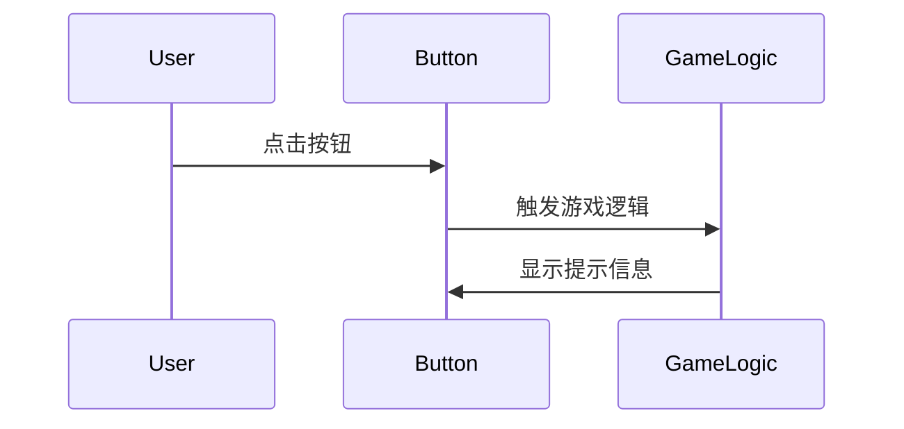

                 

### VR 内容开发框架：Unity VR 和 Unreal VR

#### 关键词：
- 虚拟现实
- Unity VR
- Unreal VR
- 内容开发
- 游戏引擎
- 开发框架

#### 摘要：
本文将深入探讨虚拟现实（VR）内容开发领域的两大主流框架：Unity VR 和 Unreal VR。文章首先概述了VR技术的基本概念和内容类型，随后详细介绍了Unity VR和Unreal VR的开发环境搭建和基础功能。通过对比分析，文章揭示了各自的优势和适用场景。此外，文章还探讨了VR内容的性能优化技巧和未来趋势，并提供了实战项目实例，帮助读者全面掌握VR内容开发的核心知识和实践技能。

----------------------------------------------------------------

### 目录大纲

1. **第一部分：基础概念与原理**

    - **第1章：虚拟现实（VR）概述**
        - 1.1 VR技术的基本概念
        - 1.2 VR内容的类型
        - 1.3 VR设备与硬件要求
        - 1.4 VR内容的用户界面设计原则
    
    - **第2章：VR内容开发环境**
        - 2.1 Unity VR开发环境搭建
        - 2.2 Unreal VR开发环境搭建
        - 2.3 跨平台VR内容开发

2. **第二部分：Unity VR内容开发**

    - **第3章：Unity VR基础**
        - 3.1 Unity引擎介绍
        - 3.2 Unity中的基本对象
        - 3.3 Unity中的脚本编程
        - 3.4 Unity UI系统
    
    - **第4章：Unity VR场景构建**
        - 4.1 场景布局与层次结构
        - 4.2 3D模型与动画
        - 4.3 环境与光照
        - 4.4 声音与音效
    
    - **第5章：Unity VR交互与用户体验**
        - 5.1 用户输入与控制
        - 5.2 用户界面交互
        - 5.3 VR游戏机制设计
        - 5.4 用户反馈与互动
    
    - **第6章：Unity VR性能优化**
        - 6.1 VR内容性能评估
        - 6.2 GPU与CPU性能优化
        - 6.3 内存管理与资源重用
        - 6.4 帧率优化与延迟减少

3. **第三部分：Unreal VR内容开发**

    - **第7章：Unreal VR基础**
        - 7.1 Unreal引擎介绍
        - 7.2 Unreal中的基本对象
        - 7.3 Unreal中的脚本编程
        - 7.4 Unreal UI系统
    
    - **第8章：Unreal VR场景构建**
        - 8.1 场景布局与层次结构
        - 8.2 3D模型与动画
        - 8.3 环境与光照
        - 8.4 声音与音效
    
    - **第9章：Unreal VR交互与用户体验**
        - 9.1 用户输入与控制
        - 9.2 用户界面交互
        - 9.3 VR游戏机制设计
        - 9.4 用户反馈与互动
    
    - **第10章：Unreal VR性能优化**
        - 10.1 VR内容性能评估
        - 10.2 GPU与CPU性能优化
        - 10.3 内存管理与资源重用
        - 10.4 帧率优化与延迟减少

4. **第四部分：VR内容开发实例与实战**

    - **第11章：VR内容开发实战**
        - 11.1 VR内容开发流程
        - 11.2 VR内容开发实例
        - 11.3 VR内容测试与发布
        - 11.4 VR内容开发团队协作
    
    - **第12章：VR内容开发趋势与展望**
        - 12.1 VR内容开发技术发展趋势
        - 12.2 VR内容开发市场分析
        - 12.3 VR内容开发的未来挑战与机遇

本文目录结构清晰，分为四个主要部分，旨在为读者提供关于VR内容开发的全面、深入的指导。通过阅读本文，读者将能够掌握VR内容开发的基本概念、技术原理、开发实践以及未来趋势，从而更好地应对VR领域的挑战与机遇。

----------------------------------------------------------------

### 第一部分：基础概念与原理

#### 第1章：虚拟现实（VR）概述

##### 1.1 VR技术的基本概念

虚拟现实（Virtual Reality，简称VR）是一种通过计算机模拟的、可交互的三维虚拟环境，使人们能够在虚拟空间中感知、探索和互动。VR技术利用计算机图形学、人机交互技术、传感器技术等多种技术手段，实现用户的沉浸式体验。VR技术的基本概念包括以下几点：

1. **沉浸感（Immersion）**：用户在VR环境中感受到的虚拟世界的逼真程度，即用户感觉自己置身于虚拟环境中的程度。沉浸感是VR技术的核心目标之一。

2. **交互性（Interaction）**：用户与VR环境之间的交互能力，包括手势控制、语音控制、触摸等。交互性使得用户能够更自然地与虚拟环境互动。

3. **真实性（Realism）**：虚拟环境的视觉、听觉、触觉等感官刺激与真实世界的相似程度。真实性的提高能够增强用户的沉浸感。

4. **多感知性（Multisensory）**：除了视觉和听觉外，VR技术还包括触觉、嗅觉、味觉等多种感官的模拟，以提供更全面的沉浸体验。

##### 1.2 VR内容的类型

VR内容的类型丰富多样，根据用途和形式可以分为以下几类：

1. **教育类VR内容**：利用VR技术模拟教学场景，如医学教学、历史重现、语言学习等，为学生提供沉浸式的学习体验。

2. **娱乐类VR内容**：包括VR游戏、电影、演唱会等，为用户提供沉浸式的娱乐体验。

3. **旅游类VR内容**：通过VR技术模拟旅游景点，让用户在家中就能体验到世界各地风光和文化的魅力。

4. **工业类VR内容**：应用于工业设计、产品展示、培训等领域，提高工作效率和设计质量。

5. **医疗类VR内容**：用于心理治疗、手术模拟、医疗教育等，帮助医生和患者更好地理解医疗过程。

##### 1.3 VR设备与硬件要求

VR体验的质量很大程度上取决于硬件设备。以下是一些常见的VR设备和硬件要求：

1. **VR头显**：如Oculus Rift、HTC Vive、Valve Index等，它们通过高分辨率显示器和倾斜传感器跟踪用户头部运动，实现视角的实时变化。

2. **手柄控制器**：如Oculus Touch、HTC Vive控制器等，它们模拟用户的手部动作，与VR环境进行交互。

3. **位置跟踪设备**：用于跟踪用户在现实环境中的位置和运动，确保虚拟环境与物理世界的同步。

4. **触觉反馈设备**：如触觉手套、机械爪等，提供更真实的触觉体验。

5. **声音设备**：如头戴式耳机、空间音频系统等，用于模拟虚拟环境中的声音效果，增强沉浸感。

##### 1.4 VR内容的用户界面设计原则

VR内容的用户界面设计（UI）与传统的2D界面设计有所不同，需要遵循以下原则：

1. **空间感**：利用三维空间布局界面元素，使界面更符合虚拟环境的视觉习惯。

2. **直观性**：通过简单直观的交互方式，如手势、语音等，减少用户的学习成本。

3. **一致性**：保持界面设计的一致性，避免用户在操作过程中产生困惑。

4. **适应性强**：适应不同用户的需求和设备，如不同的显示分辨率、不同的控制器等。

5. **反馈及时**：及时响应用户的操作，提供清晰的反馈信息，增强用户的交互体验。

通过以上对VR技术的基本概念、内容类型、设备要求以及用户界面设计原则的介绍，读者可以对VR内容开发有一个全面的了解。接下来，我们将深入探讨VR内容开发的环境搭建和工具选择。

----------------------------------------------------------------

#### 第2章：VR内容开发环境

##### 2.1 Unity VR开发环境搭建

Unity是一款功能强大的跨平台游戏引擎，广泛用于VR内容开发。以下是搭建Unity VR开发环境的基本步骤：

1. **安装Unity Hub**

   首先需要下载并安装Unity Hub。Unity Hub是一个统一的平台，用于安装和配置Unity版本。访问Unity官网（https://unity.com/）下载Unity Hub安装包。

2. **创建Unity VR项目**

   运行Unity Hub，点击“新建项目”按钮，选择“3D模式”项目模板，项目名称可以自定义。在创建项目时，确保选择“虚拟现实模板”，这将自动配置项目所需的VR组件。

3. **安装VR插件**

   Unity Hub会自动安装VR插件，如VR摄像机、VR控制器等。如果需要额外的插件，可以在Unity Asset Store中搜索并安装。

4. **配置VR设备**

   接下来需要配置VR设备。以Oculus Rift为例，首先安装Oculus软件，然后按照软件提示连接头显和手柄控制器。在Unity项目中，确保已启用Oculus插件，并设置正确的设备参数。

5. **测试VR环境**

   在Unity编辑器中，打开“游戏”菜单，选择“播放”，即可进入VR预览模式。此时，应确保VR设备正确连接，并调整视角和交互设置，以获得最佳的VR体验。

##### 2.2 Unreal VR开发环境搭建

Unreal Engine是一款由Epic Games开发的先进游戏引擎，也广泛用于VR内容开发。以下是搭建Unreal VR开发环境的基本步骤：

1. **下载与安装**

   访问Epic Games官网（https://www.unrealengine.com/）下载Unreal Engine安装包。安装过程较为简单，只需按照提示操作。

2. **创建VR项目**

   打开Unreal Engine，点击“新建项目”，选择“VR模板”。Unreal Engine提供了多个VR模板，包括第一人称、第三人称等，可以根据项目需求选择合适的模板。

3. **安装VR插件**

   Unreal Engine自带的VR插件较为丰富，如VR摄像机、VR手柄控制器等。如果需要额外的插件，可以在Unreal Engine Marketplace中搜索并安装。

4. **配置VR设备**

   以Oculus Rift为例，安装Oculus软件，并按照软件提示连接头显和手柄控制器。在Unreal编辑器中，设置正确的设备参数，确保VR设备能够正确识别。

5. **测试VR环境**

   在Unreal编辑器中，点击“播放”按钮，进入VR预览模式。测试VR环境，调整视角和交互设置，确保VR体验的流畅性和准确性。

##### 2.3 跨平台VR内容开发

VR内容开发的一个重要方面是跨平台支持。Unity和Unreal Engine都提供了强大的跨平台功能，支持在多个平台上部署VR内容。

1. **Unity跨平台VR开发**

   Unity支持多种平台，包括Windows、MacOS、iOS、Android等。要实现跨平台VR开发，需要：

   - 选择目标平台：在Unity编辑器中，选择“File” -> “Build Settings”，添加目标平台。
   - 调整平台特定设置：根据目标平台的特点，调整VR内容的相关设置，如分辨率、性能优化等。
   - 部署VR应用：编译并部署VR应用，确保在目标平台上运行正常。

2. **Unreal Engine跨平台VR开发**

   Unreal Engine也支持多种平台，包括Windows、MacOS、iOS、Android等。跨平台VR开发的步骤与Unity类似：

   - 选择目标平台：在Unreal Engine编辑器中，选择“File” -> “Generate Platform”，选择目标平台。
   - 调整平台特定设置：根据目标平台的特点，调整VR内容的相关设置，如分辨率、性能优化等。
   - 部署VR应用：编译并部署VR应用，确保在目标平台上运行正常。

通过以上步骤，开发者可以搭建并配置Unity VR和Unreal VR的开发环境，为VR内容开发奠定坚实的基础。接下来，我们将深入探讨Unity VR和Unreal VR的具体内容和开发细节。

----------------------------------------------------------------

### 第二部分：Unity VR内容开发

#### 第3章：Unity VR基础

##### 3.1 Unity引擎介绍

Unity是一款功能强大的跨平台游戏引擎，广泛应用于游戏开发、虚拟现实（VR）、增强现实（AR）以及三维建模等领域。其独特的灵活性和广泛的兼容性使其成为VR内容开发的理想选择。

**Unity的核心特性包括：**

1. **跨平台支持**：Unity支持多种平台，包括Windows、MacOS、iOS、Android等，开发者可以轻松地将VR内容部署到不同设备上。

2. **直观的编辑器**：Unity提供了一套直观的编辑器，允许开发者可视化地搭建场景、调整参数和实时预览效果。

3. **强大的脚本系统**：Unity使用C#作为主要脚本语言，支持开发者通过编写脚本实现复杂的逻辑和交互功能。

4. **丰富的插件和资源**：Unity Asset Store提供了大量的插件和资源，开发者可以方便地集成第三方工具和内容，提高开发效率。

5. **高效的渲染技术**：Unity采用了先进的渲染技术，包括光线追踪、全局光照、物理仿真等，能够生成高质量的三维视觉效果。

**Unity在VR内容开发中的优势：**

1. **易用性**：Unity的编辑器直观易用，降低了VR内容开发的门槛，即使没有专业编程背景的开发者也能快速上手。

2. **兼容性**：Unity支持多种VR设备和平台，开发者可以轻松地实现跨平台VR内容开发。

3. **丰富的资源和插件**：Unity Asset Store提供了大量的VR插件和资源，开发者可以利用这些资源快速搭建VR场景和功能。

##### 3.2 Unity中的基本对象

在Unity中，基本对象是构建VR场景的基础。以下是一些常见的Unity基本对象及其功能：

1. **3D模型（Meshes）**：3D模型是VR场景中的主要元素，包括人物、道具、建筑等。Unity支持多种3D模型格式，如OBJ、FBX、BLEND等。

2. **摄像机（Cameras）**：摄像机是用户在VR场景中的视角来源。Unity提供了多种摄像机类型，如正交摄像机、透视摄像机等。

3. **光源（Lights）**：光源是VR场景中的光源，包括点光源、方向光源、聚光源等。通过合理布置光源，可以营造逼真的光照效果。

4. **音频源（Audio Sources）**：音频源是VR场景中的声音来源，可以播放背景音乐、环境音效等。

5. **脚本（Scripts）**：脚本用于实现VR场景的逻辑控制和交互功能。通过编写C#脚本，开发者可以自定义行为和交互。

##### 3.3 Unity中的脚本编程

Unity中的脚本编程是实现VR场景交互和逻辑控制的关键。以下是一些基本的Unity脚本编程概念：

1. **脚本结构**：一个Unity脚本通常包含一个类（Class）和一个主函数（Main Function）。主函数是脚本执行的开始点。

2. **变量（Variables）**：变量用于存储数据，如整数、浮点数、字符串等。通过声明和赋值，可以灵活地使用变量。

3. **函数（Functions）**：函数是用于执行特定任务的代码块。通过定义和调用函数，可以实现代码的模块化和复用。

4. **控制结构**：控制结构包括条件语句（如if-else）、循环语句（如for、while）等，用于实现复杂的逻辑控制。

5. **事件系统**：Unity的事件系统允许脚本在特定事件发生时执行代码，如按键按下、碰撞发生等。

**示例：一个简单的Unity脚本**

```csharp
using UnityEngine;

public class MoveObject : MonoBehaviour
{
    public float moveSpeed = 5.0f;

    void Update()
    {
        // 用户移动
        float horizontal = Input.GetAxis("Horizontal");
        float vertical = Input.GetAxis("Vertical");

        transform.Translate(new Vector3(horizontal, 0, vertical) * moveSpeed * Time.deltaTime);
    }
}
```

此脚本实现了物体在VR场景中的移动功能，根据用户的输入方向和移动速度，实时更新物体的位置。

##### 3.4 Unity UI系统

Unity的UI系统是构建VR内容用户界面的重要组成部分。以下是一些基本的Unity UI系统概念：

1. **UI元素**：Unity UI系统包括文本（Text）、图像（Image）、按钮（Button）等多种UI元素。

2. **布局**：Unity UI布局系统允许开发者根据需要调整UI元素的位置和大小，包括网格布局（Grid Layout）、垂直布局（Vertical Layout）等。

3. **动画**：Unity UI动画系统可以通过脚本控制UI元素的显示和隐藏、大小变换、颜色变化等动画效果。

4. **交互**：Unity UI系统支持多种交互方式，如点击（Click）、拖拽（Drag）、滑动（Swipe）等。

**示例：一个简单的Unity UI脚本**

```csharp
using UnityEngine;
using UnityEngine.UI;

public class UIMove : MonoBehaviour
{
    public RectTransform targetRect;

    void Update()
    {
        // 根据用户输入调整UI位置
        float x = Input.mousePosition.x;
        float y = Input.mousePosition.y;

        Vector2 newPosition = new Vector2(x, y);
        targetRect.position = newPosition;
    }
}
```

此脚本实现了UI元素根据用户输入位置进行动态调整的功能，增强了用户的交互体验。

通过以上对Unity VR基础内容的介绍，读者可以对Unity VR开发有一个初步的了解。在接下来的章节中，我们将进一步探讨Unity VR场景构建、交互设计以及性能优化等方面的详细内容。

----------------------------------------------------------------

#### 第4章：Unity VR场景构建

##### 4.1 场景布局与层次结构

在Unity VR内容开发中，场景布局与层次结构是构建高质量VR体验的基础。合理的场景布局和层次结构不仅可以提升用户体验，还能优化性能和开发效率。

**场景布局**

场景布局是指在虚拟空间中安排和布置各个对象的过程。以下是一些关键步骤：

1. **选择场景位置**：在Unity编辑器中，选择一个合适的位置作为场景的起点。这通常是摄像机（Camera）的位置，确保用户视角清晰。

2. **创建基本对象**：根据场景需求，创建和导入3D模型、摄像机、光源等基本对象。确保它们的位置和大小适合场景。

3. **布置环境**：添加背景、地面、墙壁等环境元素，为场景提供真实感。可以使用Unity的“场景创建器”（Scene Creator）工具快速搭建基本场景。

4. **调整视角**：使用Unity的“透视视图”（Perspective View）和“正交视图”（Orthographic View）调整视角，确保视角范围适合用户操作。

**层次结构**

层次结构是指场景中对象的层次关系和继承关系。以下是一些关键步骤：

1. **创建层次结构**：将场景中的对象组织成不同的层次，如物体层、UI层、效果层等。可以使用Unity的层次视图（Hierarchy）和层次结构（Hierarchy Panel）来管理对象。

2. **设置对象层次**：在Unity编辑器中，可以设置每个对象的具体层次。较高的层次对象会遮盖较低层次的对象，这有助于保持场景的整洁和清晰。

3. **调整对象属性**：通过调整对象的属性，如位置（Position）、旋转（Rotation）和缩放（Scale），可以优化对象在场景中的视觉效果和交互体验。

**示例：场景布局与层次结构的实现**

以下是一个简单的场景布局与层次结构的示例：

```csharp
using UnityEngine;

public class SceneLayout : MonoBehaviour
{
    // 创建并放置摄像机
    public GameObject cameraPrefab;
    void Start()
    {
        Instantiate(cameraPrefab, Vector3.zero, Quaternion.identity);
    }

    // 创建并放置一个简单的3D模型
    public GameObject modelPrefab;
    void CreateModel()
    {
        Instantiate(modelPrefab, new Vector3(0, 0, -5), Quaternion.identity);
    }

    // 创建并放置一个光源
    public Light lightPrefab;
    void CreateLight()
    {
        Instantiate(lightPrefab, new Vector3(5, 5, 5), Quaternion.identity);
    }

    // 创建UI元素
    public Text uiText;
    void CreateUI()
    {
        GameObject uiGameObject = new GameObject("UI Text");
        uiGameObject.AddComponent<Text>();
        uiGameObject.GetComponent<Text>().text = "Hello, VR!";
        uiGameObject.GetComponent<Text>().fontSize = 48;
        uiGameObject.transform.position = new Vector3(0, 3, 0);
    }

    // 设置层次结构
    void SetHierarchy()
    {
        GameObject root = new GameObject("Root");
        cameraPrefab.transform.SetParent(root.transform);
        modelPrefab.transform.SetParent(root.transform);
        lightPrefab.transform.SetParent(root.transform);
        uiGameObject.transform.SetParent(root.transform);
    }

    void Update()
    {
        // 根据用户输入调整摄像机视角
        if (Input.GetKeyDown(KeyCode.Space))
        {
            cameraPrefab.transform.Rotate(new Vector3(0, 10, 0));
        }
    }
}
```

此脚本实现了一个简单的场景布局，包括摄像机、3D模型、光源和UI元素，并设置了它们的层次结构。通过调整摄像机视角，可以观察到场景的不同部分。

**场景布局与层次结构对VR内容开发的影响**

1. **用户体验**：合理的场景布局和层次结构可以提升用户的沉浸感和交互体验。清晰的层次结构有助于用户快速理解和操作VR内容。

2. **性能优化** **：通过优化场景布局和层次结构，可以减少渲染对象的数量和复杂度，提高VR内容的性能。例如，将不经常变化的场景元素放置在较低的层次，可以提高渲染效率。

3. **开发效率** **：良好的场景布局和层次结构可以提高开发效率，使开发者更容易管理和调整场景元素。通过分层管理，可以快速修改和更新特定部分的场景。

总之，场景布局与层次结构在Unity VR内容开发中起着至关重要的作用。通过合理的设计和优化，可以打造高质量的VR体验，提升用户满意度和开发效率。

----------------------------------------------------------------

##### 4.2 3D模型与动画

3D模型和动画是Unity VR场景构建的重要组成部分，它们共同决定了场景的真实感和互动性。以下是关于3D模型和动画在Unity VR开发中的应用和实践。

**3D模型**

3D模型是虚拟世界中的基础元素，包括人物、环境、道具等。在Unity中，3D模型的创建和导入方法如下：

1. **创建3D模型**：可以使用各种3D建模软件（如Blender、Maya、3ds Max等）创建3D模型。这些软件提供了丰富的工具和功能，帮助开发者创建高质量的3D模型。

2. **导出3D模型**：创建完成后，将3D模型导出为Unity支持的格式（如OBJ、FBX、BLEND等）。导出时，需要确保模型的面数、顶点数等参数适合VR场景。

3. **导入Unity**：在Unity编辑器中，导入3D模型。可以通过“资产”（Assets）面板中的“导入”（Import）功能导入模型。导入时，可以调整模型的名称、标签、缩放等参数。

4. **调整模型属性**：在Unity中，可以对3D模型进行各种调整，如位置（Position）、旋转（Rotation）、缩放（Scale）等。此外，还可以为模型添加材质（Material）和纹理（Texture），提升视觉效果。

**动画**

动画是使3D模型动起来的关键。在Unity中，动画的创建和播放方法如下：

1. **创建动画**：在Unity中，可以使用动画编辑器（Animation Editor）创建动画。动画编辑器提供了丰富的工具，帮助开发者制作流畅的动画。

2. **设置动画控制器**：动画控制器（Animation Controller）用于管理场景中的动画。通过动画控制器，可以设置动画的播放顺序、播放模式等。

3. **播放动画**：在Unity中，可以使用`Animator`组件播放动画。`Animator`组件可以与3D模型绑定，当满足特定条件时，自动播放对应的动画。

**示例：3D模型与动画的应用**

以下是一个简单的示例，展示了如何在Unity中创建和播放3D模型动画：

```csharp
using UnityEngine;

public class ModelAnimation : MonoBehaviour
{
    public GameObject model;
    public AnimationClip idleAnimation;
    public AnimationClip walkAnimation;

    private Animator animator;

    void Start()
    {
        animator = model.GetComponent<Animator>();
    }

    void Update()
    {
        // 检测用户输入，切换动画
        if (Input.GetKeyDown(KeyCode.Space))
        {
            animator.Play(idleAnimation.name);
        }

        if (Input.GetKeyDown(KeyCode.A))
        {
            animator.Play(walkAnimation.name);
        }
    }
}
```

此脚本创建了一个简单的动画控制器，根据用户输入播放不同的动画。通过在Unity编辑器中设置动画控制器和动画剪辑（Animation Clip），可以制作出丰富的动画效果。

**3D模型与动画对VR内容开发的影响**

1. **真实性**：高质量的3D模型和流畅的动画可以提升虚拟环境的真实感，为用户提供沉浸式的体验。

2. **互动性**：动画可以使3D模型更加生动，增加互动性。例如，人物可以走动、跳跃、说话等，与用户进行互动。

3. **开发效率**：使用3D建模和动画软件创建和导出模型，可以提高开发效率。通过合理的设计和优化，可以快速搭建高质量的VR场景。

4. **性能优化**：合理设置3D模型的网格（Mesh）和动画的帧数（FPS），可以优化VR内容的性能。例如，减少面数和顶点数，降低渲染复杂度。

总之，3D模型和动画是Unity VR内容开发的重要组成部分。通过掌握相关技术和工具，开发者可以创建高质量的VR场景，提升用户体验和开发效率。

----------------------------------------------------------------

##### 4.3 环境与光照

在Unity VR内容开发中，环境与光照对虚拟现实体验的真实感和沉浸感具有决定性作用。合理的环境布置和光照设计可以增强场景的视觉冲击力和情感表达，为用户提供更丰富的感官体验。

**环境**

环境是指在虚拟空间中布置的各种物体和元素，包括天空、地面、建筑、植物等。以下是一些关键步骤和环境设置：

1. **场景布置**：在Unity编辑器中，根据项目需求布置场景。可以导入现成的场景资产，如Unity Asset Store中的环境资源，或者自行创建环境元素。

2. **地面与天空**：使用平面（Plane）创建地面，并为其添加材质和纹理，增加真实感。天空可以使用天空盒（Skybox）或天空球（SkySphere）来模拟。

3. **植物与装饰**：根据场景需求添加植物、装饰等元素，使场景更加丰富。可以使用Unity的“植被系统”（Vegetation System）快速布置植物。

4. **细节处理**：为了提升环境的真实感，可以对场景中的物体添加细节处理，如凹凸纹理（Normal Maps）、阴影（Shadows）等。

**光照**

光照是场景中物体色彩、形态和氛围的关键因素。以下是一些关键步骤和光照设置：

1. **主光源**：设置主光源（如方向光（Directional Light）或聚光灯（Spotlight）），为场景提供基本光照。主光源的位置和强度直接影响场景的整体氛围。

2. **辅助光源**：添加辅助光源（如点光源（Point Light）或面光源（Area Light）），用于补充和调整场景中的光照效果。辅助光源可以增强场景的细节和层次感。

3. **环境光**：使用环境光（Ambient Light）为整个场景提供均匀的背景光照。环境光的颜色和强度会影响场景的整体色调。

4. **动态光照**：利用动态光照（Dynamic Lighting），实时计算场景中的光照效果。动态光照可以提高场景的真实感，但可能对性能有一定影响。

**示例：环境与光照的实现**

以下是一个简单的示例，展示了如何在Unity中设置环境与光照：

```csharp
using UnityEngine;

public class EnvironmentAndLighting : MonoBehaviour
{
    public DirectionalLight mainLight;
    public Light ambientLight;
    public GameObject groundPrefab;
    public GameObject skyboxPrefab;

    void Start()
    {
        // 创建地面
        Instantiate(groundPrefab, Vector3.zero, Quaternion.identity);

        // 创建天空
        Instantiate(skyboxPrefab, Vector3.zero, Quaternion.identity);

        // 设置主光源
        mainLight.transform.position = new Vector3(10, 10, -10);
        mainLight.intensity = 1.0f;

        // 设置环境光
        ambientLight.color = Color.white;
        ambientLight.intensity = 0.5f;
    }

    void Update()
    {
        // 根据用户输入调整光照强度
        if (Input.GetKeyDown(KeyCode.UpArrow))
        {
            mainLight.intensity += 0.1f;
        }

        if (Input.GetKeyDown(KeyCode.DownArrow))
        {
            mainLight.intensity -= 0.1f;
        }
    }
}
```

此脚本创建了一个简单的地面和天空，并设置了主光源和辅助光源。通过调整主光源的位置和强度，可以改变场景的光照效果。

**环境与光照对VR内容开发的影响**

1. **真实感**：合理的环境布置和光照设计可以提升虚拟环境的真实感，为用户提供沉浸式的体验。

2. **情感表达**：光照和环境的颜色、形态和氛围可以传达特定的情感和故事情节，增强虚拟现实体验的深度。

3. **渲染性能**：合理设置光照和阴影的质量和范围，可以优化VR内容的渲染性能，确保流畅的运行。

4. **用户体验**：良好的光照和环境设计可以提高用户的沉浸感和交互体验，增强用户的参与感和满意度。

总之，环境与光照在Unity VR内容开发中扮演着重要角色。通过掌握相关技术和工具，开发者可以创建高质量的虚拟现实场景，提升用户体验和开发效率。

----------------------------------------------------------------

##### 4.4 声音与音效

在Unity VR内容开发中，声音与音效是营造沉浸式体验的关键组成部分。通过合理地设计和实现声音效果，可以显著提升虚拟环境的真实感和情感表达。

**声音基础**

1. **声音源（Audio Source）**：Unity中的声音源是声音的播放组件，可以添加到场景中的任何物体上。声音源支持多种音频格式，如MP3、WAV等。

2. **音频组件（Audio Component）**：Unity提供了多种音频组件，用于控制声音的播放、停止、音量调整等。常见的音频组件包括`AudioSource`、`Ambient Audio`等。

3. **音效混合器（Audio Mixer）**：音频混合器用于管理和控制场景中的音效。通过音频混合器，可以调整音量、混音等，实现更丰富的声音效果。

**实现声音效果**

1. **背景音乐**：在Unity中，可以使用`AudioSource`组件播放背景音乐。将音频文件拖放到`AudioSource`组件中，设置合适的播放模式和音量。

2. **环境音效**：环境音效（如风声、鸟鸣等）可以通过`Ambient Audio`组件实现。在场景中添加`Ambient Audio`组件，导入环境音效音频文件，并调整音量和播放模式。

3. **交互音效**：当用户在VR场景中执行特定动作时，可以播放相应的交互音效。例如，点击按钮时的声音、走动时的脚步声等。通过编写脚本，监听用户的输入，触发相应的声音效果。

**音效设计原则**

1. **层次感**：合理地设置音效的音量和混响效果，可以增强音效的层次感。背景音效通常设置较低的音量，以避免干扰交互音效。

2. **实时调整**：根据用户的位置和动作，实时调整音效的音量和播放位置，增强沉浸感。例如，当用户靠近声音源时，音效的音量可以逐渐增大。

3. **情感表达**：音效的设计应符合虚拟环境的情感和氛围。例如，在恐怖场景中使用低频音效，可以营造紧张和恐怖的氛围。

**示例：声音与音效的实现**

以下是一个简单的示例，展示了如何在Unity中实现背景音乐和环境音效：

```csharp
using UnityEngine;

public class AudioEffects : MonoBehaviour
{
    public AudioSource backgroundMusic;
    public AudioSource ambientSound;

    void Start()
    {
        // 播放背景音乐
        backgroundMusic.clip = Resources.Load<AudioClip>("BackgroundMusic");
        backgroundMusic.Play();

        // 播放环境音效
        ambientSound.clip = Resources.Load<AudioClip>("AmbientSound");
        ambientSound.Play();
    }

    void Update()
    {
        // 根据用户输入调整音效音量
        if (Input.GetKeyDown(KeyCode.UpArrow))
        {
            ambientSound.volume += 0.1f;
        }

        if (Input.GetKeyDown(KeyCode.DownArrow))
        {
            ambientSound.volume -= 0.1f;
        }
    }
}
```

此脚本实现了一个简单的背景音乐和环境音效，并根据用户输入调整环境音效的音量。

**声音与音效对VR内容开发的影响**

1. **沉浸感**：通过合理地设计和实现声音效果，可以显著提升虚拟环境的沉浸感，增强用户的体验。

2. **情感表达**：声音效果可以传达虚拟环境中的情感和氛围，增强虚拟现实体验的深度。

3. **交互体验**：交互音效可以增强用户的互动体验，使虚拟环境更加生动和有趣。

4. **性能优化**：合理设置音效的播放质量和数量，可以优化VR内容的性能，确保流畅的运行。

总之，声音与音效在Unity VR内容开发中起着至关重要的作用。通过掌握相关技术和工具，开发者可以创建高质量的虚拟现实体验，提升用户体验和满意度。

----------------------------------------------------------------

#### 第5章：Unity VR交互与用户体验

##### 5.1 用户输入与控制

在Unity VR内容开发中，用户输入与控制是提供沉浸式体验的关键。用户输入包括手柄控制、手势识别、语音控制等，通过这些输入方式，用户能够与虚拟环境进行互动。以下是一些关键概念和实现方法：

**手柄控制**

手柄控制是VR内容开发中最常见的输入方式，使用手柄控制器（如Oculus Touch、HTC Vive控制器等）模拟用户的手部动作。以下是手柄控制的基本实现步骤：

1. **手柄连接**：确保VR手柄正确连接到PC或游戏主机。

2. **手柄识别**：在Unity中，通过输入系统（Input System）识别手柄的输入。例如，使用`Input.GetAxis`函数获取手柄的X和Y轴的输入值。

3. **手柄动作映射**：将手柄的输入值映射到虚拟环境中的动作。例如，将手柄的X轴输入值映射到物体的移动方向。

4. **手柄反馈**：为手柄动作提供视觉和听觉反馈，如动态光照、声音等，增强用户的交互体验。

**手势识别**

手势识别是通过计算机视觉技术识别用户的手部动作。以下是手势识别的基本实现步骤：

1. **摄像头配置**：在Unity中，使用摄像头（Camera）捕捉用户的手部动作。

2. **图像处理**：通过图像处理技术，提取手部关节点的位置，构建手部模型。

3. **动作识别**：使用机器学习算法或深度学习模型，将手部动作映射到虚拟环境中的操作。

4. **手势反馈**：根据手势识别结果，执行相应的虚拟操作，如点击、拖拽等。

**语音控制**

语音控制是通过语音识别技术实现用户与虚拟环境的交互。以下是语音控制的基本实现步骤：

1. **语音识别**：使用语音识别API（如Google语音识别、微软语音识别等）将语音转换为文本。

2. **命令解析**：根据语音输入的文本内容，解析出用户意图，如移动、旋转、放大等。

3. **操作执行**：根据用户意图，执行相应的虚拟操作。

**示例：用户输入与控制**

以下是一个简单的示例，展示了如何使用手柄控制移动和旋转：

```csharp
using UnityEngine;

public class PlayerController : MonoBehaviour
{
    public float speed = 5.0f;
    public float rotationSpeed = 100.0f;

    void Update()
    {
        // 移动
        float moveX = Input.GetAxis("Horizontal");
        float moveZ = Input.GetAxis("Vertical");
        transform.Translate(new Vector3(moveX, 0, moveZ) * speed * Time.deltaTime);

        // 旋转
        float rotationX = Input.GetAxis("Rotation X");
        float rotationZ = Input.GetAxis("Rotation Z");
        transform.Rotate(new Vector3(rotationX, 0, rotationZ) * rotationSpeed * Time.deltaTime);
    }
}
```

此脚本实现了基于手柄控制器的移动和旋转功能。通过`Input.GetAxis`函数获取手柄的输入值，实时更新物体的位置和旋转。

**用户输入与控制对VR内容开发的影响**

1. **交互性**：通过多种输入方式，用户能够与虚拟环境进行互动，增强用户体验。

2. **沉浸感**：合理的输入设计可以提升虚拟环境的沉浸感，使用户感觉自己真正置身于虚拟世界中。

3. **开发复杂性**：实现多种输入方式需要考虑多种技术和工具，增加了开发复杂性和成本。

4. **性能优化**：输入处理和交互操作会影响VR内容的性能，需要优化输入系统的响应速度和处理效率。

总之，用户输入与控制在Unity VR内容开发中至关重要。通过合理的设计和实现，开发者可以打造高质量的VR体验，提升用户的互动和沉浸感。

----------------------------------------------------------------

##### 5.2 用户界面交互

在Unity VR内容开发中，用户界面交互（UI）是提供用户操作反馈和信息展示的重要途径。与传统的2D界面不同，VR UI需要考虑到三维空间感和交互体验。以下是一些关键概念和实践方法：

**UI组件**

Unity提供了丰富的UI组件，如文本（Text）、按钮（Button）、滑动条（Slider）、图像（Image）等。这些组件可以组合使用，创建复杂的用户界面。

**UI布局**

VR UI的布局需要考虑到三维空间。以下是一些常见的布局方法：

1. **平面布局**：将UI组件布置在水平或垂直平面上，类似于2D界面。使用`Vertical Layout Group`和`Horizontal Layout Group`可以方便地创建平面布局。

2. **空间布局**：将UI组件布置在三维空间中，使UI元素具有空间感。可以使用`UI Canvas`和`RectTransform`来实现空间布局。

**交互设计**

VR UI的交互设计需要符合用户习惯，提高交互效率。以下是一些关键设计原则：

1. **直观性**：UI元素的位置、大小和颜色应该直观易懂，减少用户的学习成本。

2. **一致性**：UI元素的样式、交互方式和反馈应该保持一致，避免用户产生混淆。

3. **触觉反馈**：通过触觉反馈（如振动、声音等）增强用户的交互体验。

**实现方法**

以下是一个简单的Unity VR UI交互实现示例：

```csharp
using UnityEngine;
using UnityEngine.UI;

public class VRUI : MonoBehaviour
{
    public Text instructionsText;
    public Button startButton;
    public Image loadingImage;

    // 初始化UI组件
    void Start()
    {
        instructionsText.text = "Press the start button to begin.";
        startButton.onClick.AddListener(StartGame);
        loadingImage.enabled = false;
    }

    // 开始游戏
    void StartGame()
    {
        loadingImage.enabled = true;
        instructionsText.enabled = false;
        startButton.enabled = false;

        // 模拟游戏加载过程
        StartCoroutine(LoadGame());
    }

    // 游戏加载过程
    IEnumerator LoadGame()
    {
        yield return new WaitForSeconds(2.0f);
        loadingImage.enabled = false;
        instructionsText.text = "Game loaded!";
        startButton.enabled = true;
    }
}
```

此脚本创建了一个简单的VR UI，包含文本、按钮和图像。当用户点击开始按钮时，会触发游戏加载过程，并在加载完成后更新UI。

**用户界面交互对VR内容开发的影响**

1. **用户体验**：合理的UI交互设计可以提升用户的操作效率和满意度，增强沉浸感。

2. **信息展示**：UI提供了展示重要信息和提示的方式，帮助用户更好地理解虚拟环境。

3. **交互复杂性**：实现VR UI交互需要考虑更多的技术细节，如三维布局、触觉反馈等。

4. **性能优化**：UI渲染和处理会影响VR内容的性能，需要优化UI系统的效率。

总之，用户界面交互在Unity VR内容开发中发挥着重要作用。通过合理的设计和实现，开发者可以提供优质的用户体验，提升虚拟现实应用的吸引力和实用性。

----------------------------------------------------------------

##### 5.3 VR游戏机制设计

在Unity VR内容开发中，VR游戏机制设计是构建引人入胜的虚拟体验的关键环节。VR游戏机制不仅仅是传统游戏的简单转换，而是需要结合VR技术的独特特性进行创新设计。以下是一些关键概念和实践方法：

**游戏机制**

VR游戏机制是指游戏中的规则、目标、挑战和反馈系统。以下是几种常见的VR游戏机制：

1. **沉浸式探索**：通过虚拟现实技术，用户可以在虚拟环境中自由探索，发现隐藏的线索或宝藏。

2. **身体动作控制**：利用身体动作（如跑步、跳跃、挥动手臂）进行游戏操作，提供更真实的互动体验。

3. **空间定位**：用户在现实空间中的移动和动作会直接影响虚拟环境中的游戏进程，实现与现实世界的无缝互动。

4. **多人协作与对抗**：在VR环境中，玩家可以与其他玩家协作完成任务，或者进行对抗性游戏，增加互动性和竞争性。

**设计原则**

以下是一些设计原则，帮助开发者创建高质量的VR游戏机制：

1. **沉浸感**：游戏机制应充分利用VR技术的沉浸感，使玩家感觉自己置身于虚拟世界中。

2. **可访问性**：游戏机制应易于理解和使用，确保玩家能够轻松上手。

3. **挑战性**：游戏机制应提供适当的挑战，激发玩家的兴趣和好奇心，但不要过于困难。

4. **多样化**：通过多样化的游戏机制，提供多种游戏玩法，满足不同玩家的需求。

**实现方法**

以下是一个简单的Unity VR游戏机制设计示例：

```csharp
using UnityEngine;

public class VRGameplay : MonoBehaviour
{
    public GameObject player;
    public float moveSpeed = 5.0f;
    public float jumpHeight = 5.0f;

    void Update()
    {
        // 用户移动
        float horizontal = Input.GetAxis("Horizontal");
        float vertical = Input.GetAxis("Vertical");
        player.transform.Translate(new Vector3(horizontal, 0, vertical) * moveSpeed * Time.deltaTime);

        // 用户跳跃
        if (Input.GetKeyDown(KeyCode.Space))
        {
            player.GetComponent<Rigidbody>().AddForce(new Vector3(0, jumpHeight, 0), ForceMode.Impulse);
        }
    }
}
```

此脚本实现了一个简单的VR游戏机制，允许用户通过身体动作在虚拟环境中移动和跳跃。

**VR游戏机制设计对VR内容开发的影响**

1. **用户体验**：创新的游戏机制可以提供独特的交互体验，吸引玩家，提高用户满意度。

2. **开发难度**：设计复杂的VR游戏机制需要更多的技术和资源投入，增加了开发难度。

3. **市场吸引力**：高质量的VR游戏机制可以提升产品的市场竞争力，吸引更多的用户。

4. **技术挑战**：实现复杂的VR游戏机制需要解决多种技术挑战，如实时计算、物理仿真等。

总之，VR游戏机制设计在Unity VR内容开发中至关重要。通过创新和优化游戏机制，开发者可以打造独特的虚拟体验，提升产品的市场竞争力。

----------------------------------------------------------------

##### 5.4 用户反馈与互动

在Unity VR内容开发中，用户反馈与互动是构建高质量用户体验的关键环节。通过有效的用户反馈机制和互动设计，可以增强用户的参与感和满意度。以下是一些关键概念和实践方法：

**用户反馈**

用户反馈是指用户在使用VR内容时提供的评价、意见和反馈。以下是一些常见的用户反馈方式：

1. **游戏内反馈**：通过游戏内的提示、提示框或反馈按钮，让用户在游戏过程中直接提供反馈。

2. **问卷调查**：通过在线或离线的方式，向用户提供问卷调查，收集用户的意见和建议。

3. **用户论坛和社交媒体**：建立用户论坛或社交媒体群组，鼓励用户分享他们的体验和反馈。

**互动设计**

互动设计是指设计用户与虚拟环境之间的交互过程，提高用户的参与感和满意度。以下是一些关键设计原则：

1. **即时反馈**：确保用户的操作能够立即得到反馈，如动画效果、声音效果等，增强用户的互动体验。

2. **可控性**：用户应能够自由地控制虚拟环境，如移动、旋转、缩放等，以满足不同用户的需求。

3. **适应性**：根据用户的反馈和行为，动态调整游戏难度、任务难度等，提供个性化的体验。

4. **挑战与乐趣**：设计富有挑战性和乐趣的游戏机制，激发用户的兴趣和参与度。

**实现方法**

以下是一个简单的Unity VR用户反馈与互动实现示例：

```csharp
using UnityEngine;
using UnityEngine.UI;

public class UserFeedback : MonoBehaviour
{
    public Text feedbackText;
    public Button submitButton;

    // 提交用户反馈
    void SubmitFeedback()
    {
        string feedback = feedbackText.text;
        // 处理和存储用户反馈
        Debug.Log("User Feedback: " + feedback);
    }

    // 初始化UI组件
    void Start()
    {
        feedbackText.text = "Enter your feedback here:";
        submitButton.onClick.AddListener(SubmitFeedback);
    }
}
```

此脚本创建了一个简单的用户反馈界面，允许用户输入反馈并提交。

**用户反馈与互动对VR内容开发的影响**

1. **用户体验**：有效的用户反馈和互动设计可以提高用户的满意度和参与感，增强虚拟现实体验。

2. **产品质量**：用户反馈可以用于改进和优化VR内容，提高产品的质量。

3. **市场反馈**：用户反馈可以作为市场研究的依据，帮助开发者了解用户需求和偏好。

4. **开发成本**：收集和分析用户反馈需要投入时间和资源，可能会增加开发成本。

总之，用户反馈与互动在Unity VR内容开发中至关重要。通过有效的反馈机制和互动设计，开发者可以不断提升产品质量，满足用户需求，增强市场竞争力。

----------------------------------------------------------------

#### 第6章：Unity VR性能优化

##### 6.1 VR内容性能评估

在Unity VR内容开发中，性能优化是确保VR体验流畅和稳定的关键步骤。性能评估是优化过程的第一步，它帮助开发者识别和解决潜在的性能瓶颈。以下是一些关键的性能评估方法和工具：

**帧率监测**

帧率（FPS）是衡量VR内容性能的重要指标。高帧率可以提供更流畅的体验，而低帧率可能导致卡顿和不适。以下是一些监测帧率的方法：

1. **Unity内置性能监测器**：Unity编辑器提供了一个内置的性能监测器，可以实时显示FPS、CPU使用率、GPU使用率等信息。

2. **第三方性能分析工具**：如Unity Profiler、GPUView、Insight等，这些工具可以提供更详细和专业的性能分析。

**渲染评估**

渲染性能是VR内容性能的重要组成部分。以下是一些评估渲染性能的方法：

1. **渲染统计信息**：Unity Profiler可以显示渲染统计信息，如渲染帧数、顶点数、三角形数等，帮助开发者识别渲染瓶颈。

2. **渲染时间分析**：通过分析渲染时间，可以确定哪些渲染过程最耗时，从而进行优化。

3. **渲染调用频率**：检查渲染调用频率，确保渲染调用合理，避免不必要的渲染。

**内存使用评估**

内存使用是另一个关键的性能指标。以下是一些评估内存使用的方法：

1. **内存统计信息**：Unity Profiler可以显示内存使用统计信息，如总内存、已分配内存、垃圾回收等。

2. **内存泄漏检测**：使用内存泄漏检测工具（如Valgrind、Memory Analyzer）检测和修复内存泄漏。

**示例：性能评估工具的使用**

以下是一个简单的示例，展示了如何使用Unity Profiler进行性能评估：

```csharp
using UnityEngine;

public class PerformanceMonitor : MonoBehaviour
{
    void OnGUI()
    {
        float fps = 1.0f / Time.deltaTime;
        float cpuUsage = SystemUnderTest.CPUPercentage;
        float gpuUsage = SystemUnderTest.GPUPercentage;

        GUILayout.Label("FPS: " + fps.ToString("F2"));
        GUILayout.Label("CPU Usage: " + cpuUsage.ToString("P"));
        GUILayout.Label("GPU Usage: " + gpuUsage.ToString("P"));
    }
}
```

此脚本创建了一个简单的GUI，显示当前的FPS、CPU使用率和GPU使用率。

**性能评估对VR内容开发的影响**

1. **用户体验**：通过性能评估，开发者可以确保VR内容的流畅性和稳定性，提高用户体验。

2. **开发效率**：性能评估可以帮助开发者快速定位和解决性能瓶颈，提高开发效率。

3. **产品质量**：性能优化是高质量VR内容的重要组成部分，性能评估是确保产品质量的关键步骤。

4. **资源利用**：性能评估可以帮助开发者合理利用系统资源，提高资源利用率。

总之，性能评估是Unity VR内容开发中不可或缺的步骤。通过使用合适的工具和方法，开发者可以全面了解VR内容的性能状况，为后续的性能优化提供依据。

----------------------------------------------------------------

##### 6.2 GPU与CPU性能优化

在Unity VR内容开发中，GPU（图形处理器）和CPU（中央处理器）的性能对VR体验的质量和流畅性具有决定性影响。以下是一些关键的性能优化策略和技巧：

**GPU性能优化**

1. **减少渲染对象**：减少场景中渲染的物体数量可以显著提高GPU性能。开发者可以通过合并模型、使用简单的几何形状等方式来减少渲染对象。

2. **优化材质和纹理**：减少材质和纹理的复杂度，如降低分辨率、合并纹理等，可以减少GPU的计算负担。

3. **使用LOD（细节层次离群）技术**：LOD技术可以根据物体的距离和可见性动态调整物体的细节层次，减少GPU的渲染负担。

4. **异步渲染**：通过异步渲染，可以在GPU渲染当前帧的同时，CPU处理下一帧的渲染任务，提高渲染效率。

**示例：使用LOD技术优化渲染**

以下是一个简单的示例，展示了如何在Unity中实现LOD技术：

```csharp
using UnityEngine;

public class LODExample : MonoBehaviour
{
    public Mesh[] lodMeshes;
    public Material material;
    public float maxDistance = 100.0f;

    void Start()
    {
        // 根据距离动态选择LOD模型
        int lodIndex = CalculateLODIndex(maxDistance);
        GetComponent<MeshFilter>().mesh = lodMeshes[lodIndex];
    }

    int CalculateLODIndex(float distance)
    {
        for (int i = lodMeshes.Length - 1; i >= 0; i--)
        {
            if (distance > lodMeshes[i].bounds.size.magnitude)
            {
                return i;
            }
        }
        return 0;
    }
}
```

此脚本实现了一个简单的LOD（细节层次离群）技术，根据物体距离动态选择不同的LOD模型，减少渲染负担。

**CPU性能优化**

1. **异步计算**：通过异步计算，可以在CPU处理当前帧的同时，GPU渲染下一帧，提高整体性能。

2. **优化脚本**：优化Unity脚本，减少不必要的计算和内存分配。使用高效的算法和数据结构，如四叉树、空间分割等。

3. **延迟加载**：延迟加载不经常使用的场景和资源，减少CPU的负载。

4. **资源重用**：合理重用内存和计算资源，减少内存分配和垃圾回收的次数。

**示例：优化Unity脚本性能**

以下是一个简单的示例，展示了如何优化Unity脚本性能：

```csharp
using UnityEngine;

public class PerformanceOptimized : MonoBehaviour
{
    public List<GameObject> objects;

    void Update()
    {
        for (int i = 0; i < objects.Count; i++)
        {
            // 优化后的代码，减少不必要的计算
            if (Vector3.Distance(objects[i].transform.position, transform.position) < 10.0f)
            {
                objects[i].SetActive(true);
            }
            else
            {
                objects[i].SetActive(false);
            }
        }
    }
}
```

此脚本通过优化循环内的计算，减少不必要的操作，提高脚本性能。

**GPU与CPU性能优化对VR内容开发的影响**

1. **用户体验**：通过优化GPU和CPU性能，可以确保VR内容的流畅性和稳定性，提高用户体验。

2. **开发效率**：优化策略和技巧可以帮助开发者更快地开发和部署VR内容。

3. **资源利用**：优化策略可以更高效地利用系统资源，提高资源利用率。

4. **产品质量**：性能优化是高质量VR内容的重要组成部分，优化策略可以提升产品质量。

总之，GPU与CPU性能优化在Unity VR内容开发中至关重要。通过使用合适的优化策略和技巧，开发者可以确保VR内容的高性能和高质量，提供优质的用户体验。

----------------------------------------------------------------

##### 6.3 内存管理与资源重用

在Unity VR内容开发中，内存管理和资源重用是保证VR内容性能和稳定性的关键。以下是一些关键的内存管理策略和资源重用方法：

**内存管理**

1. **对象池（Object Pooling）**：通过对象池，可以复用已创建但不再使用的对象，避免频繁的内存分配和垃圾回收。对象池通常用于管理大量的临时对象，如粒子系统、特效等。

2. **内存分配与释放**：在合适的时机进行内存分配和释放，避免内存泄漏。使用`Object.Instantiate`和`Object.Destroy`函数，在需要时创建和销毁对象。

3. **内存优化脚本**：编写高效的内存管理脚本，避免不必要的内存分配。例如，减少字符串创建、使用数据结构优化内存使用。

**资源重用**

1. **资源重复使用**：通过重复使用现有资源，如材质、纹理、音频文件等，可以减少资源的加载和卸载次数。例如，将同一材质应用于多个物体。

2. **资源池（Resource Pooling）**：资源池类似于对象池，用于管理和管理大型资源，如3D模型、动画等。通过资源池，可以快速获取和释放资源，提高资源利用率。

3. **动态资源加载**：使用动态资源加载技术，只在需要时加载资源，避免提前加载大量资源导致内存占用过高。

**示例：内存管理与资源重用**

以下是一个简单的示例，展示了如何在Unity中实现内存管理和资源重用：

```csharp
using UnityEngine;

public class ResourcePool : MonoBehaviour
{
    public GameObject prefab;
    public int poolSize = 10;
    private List<GameObject> pool;

    void Start()
    {
        pool = new List<GameObject>();
        for (int i = 0; i < poolSize; i++)
        {
            GameObject obj = Object.Instantiate(prefab);
            obj.SetActive(false);
            pool.Add(obj);
        }
    }

    public GameObject GetObject()
    {
        for (int i = 0; i < pool.Count; i++)
        {
            if (!pool[i].activeInHierarchy)
            {
                pool[i].SetActive(true);
                return pool[i];
            }
        }
        GameObject newObj = Object.Instantiate(prefab);
        pool.Add(newObj);
        return newObj;
    }

    public void ReturnObject(GameObject obj)
    {
        obj.SetActive(false);
    }
}
```

此脚本实现了一个简单的资源池，用于管理和管理复用对象。通过`GetObject`和`ReturnObject`函数，可以快速获取和释放对象。

**内存管理与资源重用对VR内容开发的影响**

1. **性能优化**：通过有效的内存管理和资源重用，可以减少内存占用和垃圾回收次数，提高VR内容的性能。

2. **稳定性**：合理的内存管理可以避免内存泄漏和崩溃，提高VR内容的稳定性。

3. **开发效率**：资源重用和动态加载技术可以提高开发效率，减少资源加载和卸载的时间。

4. **用户体验**：通过优化内存管理和资源重用，可以提供更流畅和稳定的VR体验，提高用户满意度。

总之，内存管理与资源重用在Unity VR内容开发中至关重要。通过使用合适的策略和技巧，开发者可以确保VR内容的高性能和高稳定性，提供优质的用户体验。

----------------------------------------------------------------

##### 6.4 帧率优化与延迟减少

在Unity VR内容开发中，帧率（FPS）和延迟（Latency）是衡量用户体验的重要指标。高帧率和低延迟可以提供流畅和沉浸式的VR体验，而低帧率和高延迟可能导致卡顿和不适。以下是一些关键的方法和技巧，用于优化帧率和减少延迟：

**帧率优化**

1. **降低渲染复杂度**：减少场景中渲染的物体数量和复杂度，如简化模型、减少细节等，可以降低渲染负荷。

2. **使用LOD技术**：通过使用LOD（细节层次离群）技术，可以动态调整物体的细节层次，减少渲染负担。

3. **异步渲染**：通过异步渲染，可以同时处理多帧渲染任务，提高渲染效率。

4. **优化脚本**：优化Unity脚本，减少不必要的计算和内存分配，提高执行效率。

5. **减少动画复杂度**：简化动画，减少动画的顶点数和关键帧数量，可以降低动画渲染的负荷。

**示例：帧率优化**

以下是一个简单的示例，展示了如何在Unity中优化帧率：

```csharp
using UnityEngine;

public class FrameRateOptimization : MonoBehaviour
{
    public int targetFPS = 90;

    void Update()
    {
        Time.fixedDeltaTime = 1.0f / targetFPS;
        Time.timeScale = 1.0f;
    }
}
```

此脚本通过调整`Time.fixedDeltaTime`和`Time.timeScale`，设置目标FPS，优化帧率。

**延迟减少**

1. **异步计算**：通过异步计算，可以在CPU处理当前帧的同时，GPU渲染下一帧，减少处理延迟。

2. **优化脚本**：优化Unity脚本，减少不必要的计算和内存分配，提高执行效率。

3. **延迟输入处理**：延迟输入处理，确保输入响应与渲染同步，减少输入延迟。

4. **使用预测技术**：使用预测技术，如物理预测、视觉预测等，提前计算并应用物理效果和视觉效果，减少延迟。

5. **优化网络传输**：优化网络传输，减少数据传输时间和延迟，特别是在多人VR应用中。

**示例：延迟减少**

以下是一个简单的示例，展示了如何在Unity中减少延迟：

```csharp
using UnityEngine;

public class InputLatencyReduction : MonoBehaviour
{
    public float inputLatency = 0.1f;

    void Update()
    {
        // 延迟处理输入
        float deltaTime = Time.deltaTime;
        float timeSinceLastInput = deltaTime - inputLatency;
        if (timeSinceLastInput >= 0.0f)
        {
            ProcessInput();
            timeSinceLastInput = 0.0f;
        }
    }

    void ProcessInput()
    {
        // 处理输入逻辑
    }
}
```

此脚本通过延迟处理输入，减少输入延迟，优化用户体验。

**帧率优化与延迟减少对VR内容开发的影响**

1. **用户体验**：通过优化帧率和减少延迟，可以提供更流畅和沉浸式的VR体验，提高用户满意度。

2. **开发效率**：优化策略和技巧可以帮助开发者更快地开发和部署VR内容。

3. **资源利用**：优化策略可以更高效地利用系统资源，提高资源利用率。

4. **产品质量**：帧率优化和延迟减少是高质量VR内容的重要组成部分，优化策略可以提升产品质量。

总之，帧率优化与延迟减少在Unity VR内容开发中至关重要。通过使用合适的优化策略和技巧，开发者可以确保VR内容的高性能和高质量，提供优质的用户体验。

----------------------------------------------------------------

#### 第三部分：Unreal VR内容开发

##### 第7章：Unreal VR基础

##### 7.1 Unreal引擎介绍

Unreal Engine（简称UE）是由Epic Games开发的一款高性能游戏引擎，广泛应用于游戏开发、虚拟现实（VR）、增强现实（AR）以及电影制作等领域。其强大的图形渲染能力、灵活的脚本系统以及丰富的工具和资源，使得Unreal Engine成为VR内容开发的重要选择。

**核心特性**

1. **强大的图形渲染**：Unreal Engine采用了先进的渲染技术，包括光线追踪、全局光照、高动态范围成像（HDR）等，能够生成高质量的三维视觉效果。

2. **直观的编辑器**：Unreal Engine的编辑器（UE Editor）提供了直观的可视化界面，支持拖放操作、实时预览和快速迭代。

3. **脚本系统**：Unreal Engine使用蓝图（Blueprint）系统，这是一种可视化脚本语言，允许开发者通过图形化节点连接实现复杂的逻辑和行为，无需编写传统代码。

4. **跨平台支持**：Unreal Engine支持多种平台，包括Windows、MacOS、iOS、Android等，开发者可以轻松实现跨平台VR内容开发。

5. **丰富的资源和插件**：Epic Games提供的Unreal Engine Marketplace提供了大量的插件和资源，包括3D模型、材质、动画等，开发者可以方便地集成和使用。

**优势**

1. **高效的开发流程**：Unreal Engine的直观编辑器和丰富的插件资源，大大提高了开发效率，缩短了开发周期。

2. **高质量的视觉效果**：Unreal Engine的高级渲染技术，使得生成的VR内容视觉效果更加真实和细腻。

3. **灵活性和扩展性**：Unreal Engine提供了丰富的工具和插件，开发者可以根据项目需求进行定制和扩展。

4. **社区支持**：Unreal Engine拥有庞大的开发者社区，提供大量的教程、文档和讨论，开发者可以方便地获取帮助和资源。

**适用场景**

1. **高端游戏开发**：Unreal Engine适合开发高品质、高端的VR游戏，特别是在视觉效果和物理仿真方面。

2. **教育和培训**：Unreal Engine可以用于教育领域，如医学培训、航空航天模拟等，提供沉浸式的学习体验。

3. **工业设计**：Unreal Engine可以用于工业设计、产品展示等领域，帮助设计师和工程师进行虚拟原型设计和评估。

4. **影视制作**：Unreal Engine在影视制作领域也有广泛应用，用于制作电影、动画和广告。

通过以上对Unreal Engine的介绍，读者可以对Unreal VR内容开发有一个初步的了解。接下来，我们将进一步探讨Unreal VR中的基本对象、脚本编程和UI系统等内容。

----------------------------------------------------------------

##### 7.2 Unreal中的基本对象

在Unreal VR内容开发中，基本对象是构建VR场景的基础。Unreal Engine提供了丰富的基本对象，包括3D模型、摄像机、光源、音频源等。以下是一些常见的基本对象及其功能和设置：

**3D模型**

3D模型是VR场景中的主要元素，包括人物、道具、环境等。Unreal Engine支持多种3D模型格式，如FBX、OBJ、BLEND等。

1. **创建和导入模型**：在Unreal编辑器中，可以通过“内容浏览器”（Content Browser）导入3D模型。导入时，可以选择模型的重心和缩放比例。

2. **设置模型属性**：在“细节”面板（Details Panel）中，可以调整模型的各种属性，如材质、碰撞器、物理设置等。

3. **动画**：Unreal Engine支持动画系统，可以将动画应用于3D模型。通过“动画编辑器”（Animation Editor），可以创建、编辑和播放动画。

**摄像机**

摄像机是用户在VR场景中的视角来源。Unreal Engine提供了多种摄像机类型，包括第一人称摄像机、第三人称摄像机、全景摄像机等。

1. **创建和设置摄像机**：在Unreal编辑器中，可以通过“创建”面板（Create Panel）创建摄像机。可以设置摄像机的位置、视角、焦距等参数。

2. **摄像机类型**：选择合适的摄像机类型，根据项目需求，如第一人称视角用于角色扮演游戏，第三人称视角用于体育比赛等。

3. **摄像机动画**：通过“动画编辑器”，可以为摄像机创建动画，实现平滑的视角转换和动态效果。

**光源**

光源是VR场景中的光线来源，包括点光源、方向光源、聚光源等。合理布置光源可以增强场景的真实感和氛围。

1. **创建和设置光源**：在Unreal编辑器中，可以通过“创建”面板创建光源。可以设置光源的类型、强度、范围等参数。

2. **动态光照**：Unreal Engine支持动态光照系统，可以实时计算场景中的光照效果，提高场景的真实感。

3. **光源动画**：通过“动画编辑器”，可以为光源创建动画，实现动态的光照效果。

**音频源**

音频源是VR场景中的声音来源，可以播放背景音乐、环境音效等。

1. **创建和设置音频源**：在Unreal编辑器中，可以通过“创建”面板创建音频源。可以设置音频源的位置、音量、播放模式等参数。

2. **音频混音器**：Unreal Engine提供了音频混音器（Audio Mixer），可以管理和控制场景中的音频效果。

**示例：创建和配置基本对象**

以下是一个简单的示例，展示了如何在Unreal中创建和配置基本对象：

```csharp
// 创建3D模型
var model = NewObject<class'Actor'>(Outer);
model.SetClassDefaultObject(True);
model.SetClassName("StaticMeshActor");
model.SetClassStaticMesh(NewObject<class'StaticMesh>(Outer));
model.SetStaticMesh(DefaultMeshes.GetAsset<StaticMesh>("Cube"));
model.SetWorldScale3D(FVector3D(100.0f, 100.0f, 100.0f));

// 创建摄像机
var camera = NewObject<class'CameraActor'>(Outer);
camera.SetClassDefaultObject(True);
camera.SetClassName("FirstPersonCamera");
camera.SetFirstPersonCamera(True);
camera.SetCameraLocation(FVector(0.0f, 0.0f, 0.0f));
camera.SetCameraFOV(90.0f);
camera.SetCameraNearClip(1.0f);
camera.SetCameraFarClip(1000.0f);

// 创建光源
var light = NewObject<class'LightActor'>(Outer);
light.SetClassDefaultObject(True);
light.SetClassName("PointLight");
light.SetLightIntensity(100.0f);
light.SetLightRange(1000.0f);
light.SetLightCastShadows(True);

// 创建音频源
var audio = NewObject<class'AudioComponent'>(Outer);
audio.SetClassDefaultObject(True);
audio.SetClassName("AudioComponent");
audio.SetSoundType(EAudioType::AT_Sound);
audio.SetSound(Media.PakFile("Sound/SampleSound.wav"));
audio.SetVolume(1.0f);
```

此示例创建了3D模型、摄像机、光源和音频源，并设置了它们的基本属性。通过在Unreal编辑器中拖放这些对象，可以快速搭建VR场景。

**总结**

Unreal Engine提供了丰富的基本对象，包括3D模型、摄像机、光源、音频源等，这些对象为VR内容开发提供了坚实的基础。通过合理创建和配置基本对象，开发者可以构建高质量的VR场景，提升用户体验。接下来，我们将进一步探讨Unreal VR中的脚本编程和UI系统。

----------------------------------------------------------------

##### 7.3 Unreal中的脚本编程

在Unreal VR内容开发中，脚本编程是实现复杂逻辑和交互功能的关键。Unreal Engine使用蓝图（Blueprint）系统，这是一种基于可视化节点连接的脚本语言，使得开发者无需编写传统代码即可实现复杂的逻辑和行为。以下是一些关于Unreal蓝图编程的基础知识和实际应用。

**蓝图系统**

1. **节点连接**：蓝图的核心是节点，每个节点代表一个操作或功能。开发者可以通过拖放节点并连接它们，实现复杂的逻辑流程。

2. **事件触发**：蓝图支持多种事件触发方式，如按钮点击、变量更改、碰撞发生等。通过监听这些事件，可以响应各种用户交互和场景变化。

3. **变量和参数**：蓝图支持变量和参数的定义和使用，可以存储和传递数据。变量可以是数值、文本、对象等类型。

4. **功能模块**：蓝图提供了丰富的功能模块，如逻辑控制、数学计算、物理操作、音频处理等，开发者可以使用这些模块快速实现各种功能。

**实际应用**

1. **用户交互**：通过蓝图，可以创建按钮、滑块、文本框等UI元素，并实现交互功能。例如，点击按钮触发游戏逻辑或显示提示信息。

2. **场景控制**：蓝图可以用于控制场景的加载、切换和动画效果。例如，通过蓝图实现场景之间的平滑过渡和场景元素的动态显示。

3. **物理模拟**：蓝图支持物理操作，可以创建和模拟各种物理效果，如碰撞、动力学等。例如，通过蓝图实现物体之间的碰撞检测和响应。

4. **音频处理**：蓝图可以控制音频源的播放、音量调整和混音效果。例如，通过蓝图实现背景音乐的淡入淡出和声音效果的控制。

**示例：用户交互实现**

以下是一个简单的蓝图示例，展示了如何实现一个点击按钮触发游戏逻辑的功能：



在此示例中，当用户点击按钮时，触发游戏逻辑，并显示提示信息。

**总结**

Unreal蓝图为VR内容开发提供了强大的脚本编程能力，使得开发者可以轻松实现复杂的逻辑和交互功能。通过蓝图系统，开发者无需编程背景，即可快速搭建和优化VR内容，提高开发效率和灵活性。接下来，我们将进一步探讨Unreal VR中的UI系统。

----------------------------------------------------------------

##### 7.4 Unreal UI系统

在Unreal VR内容开发中，UI（用户界面）系统是提供信息反馈和交互操作的关键组成部分。Unreal Engine提供了强大的UI系统，支持开发者创建和定制各种类型的UI元素，以满足不同应用场景的需求。以下是一些关于Unreal UI系统的基本概念、实现方法和实际应用。

**UI系统基础**

1. **UI元素**：Unreal UI系统支持多种UI元素，包括文本（Text）、按钮（Button）、滑块（Slider）、图像（Image）等。这些UI元素可以组合使用，构建复杂的用户界面。

2. **Slate**：Slate是Unreal UI系统的核心组件，它是一种灵活的UI布局和管理系统。开发者可以使用Slate创建自定义的UI布局，并动态调整UI元素的位置和大小。

3. **Material**：UI元素的外观由材质（Material）决定。开发者可以为UI元素设置不同的材质，以实现丰富的视觉效果。

**实现方法**

1. **创建UI**：在Unreal编辑器中，可以通过“内容浏览器”（Content Browser）导入UI元素，并拖放到场景中。开发者可以使用“Slate编辑器”（Slate Editor）创建和调整UI布局。

2. **交互实现**：通过监听UI元素的交互事件（如点击、滑动等），可以实现与用户的交互操作。开发者可以使用蓝图或C++编写交互逻辑。

3. **样式定制**：开发者可以自定义UI元素的样式，包括颜色、字体、边框等。通过“样式表”（Style Sheets）可以实现全局的UI样式定制。

**示例：UI实现**

以下是一个简单的UI示例，展示了如何在Unreal中创建一个包含文本和按钮的UI界面：

```csharp
// 创建UI元素
UUserWidget* MyUI = NewObject<UUserWidget>(This, MyUIClass);
MyUI->AddToViewport(0);

// 设置文本内容
FText Text = FText::FromString("Welcome to VR!");
MyUI->SetText(Text);

// 创建按钮
FButton* Button = NewObject<UButton>(MyUI);
Button->SetText(FText::FromString("Click Me!"));
Button->OnClicked.AddLambda([](FPointeresses Args) {
    // 点击按钮的逻辑
    GEngine->AddOnScreenDebugMessage(-1, 5.0f, FColor::Green, "Button Clicked!");
});
MyUI->AddChild(Button);
```

在此示例中，创建了一个包含文本和按钮的UI界面。当用户点击按钮时，会在屏幕上显示一条提示信息。

**实际应用**

1. **信息展示**：UI系统用于展示关键信息，如游戏进度、玩家分数、提示等，帮助用户理解游戏状态。

2. **交互操作**：UI元素提供交互操作，如按钮、滑块等，让用户可以控制游戏进程或设置游戏参数。

3. **视觉效果**：UI系统的丰富视觉效果，如动画、渐变等，可以增强用户体验。

**总结**

Unreal UI系统提供了强大的功能，支持开发者创建灵活、美观的用户界面。通过UI系统，开发者可以实现与用户的互动，提高用户体验。接下来，我们将进一步探讨Unreal VR中的场景构建、交互设计和性能优化。

----------------------------------------------------------------

#### 第三部分：Unreal VR内容开发

##### 第8章：Unreal VR场景构建

##### 8.1 场景布局与层次结构

在Unreal VR内容开发中，场景布局与层次结构是构建高质量VR体验的基础。合理的场景布局和层次结构不仅可以提升用户体验，还能优化性能和开发效率。

**场景布局**

场景布局是指在虚拟空间中安排和布置各个对象的过程。以下是一些关键步骤：

1. **选择场景位置**：在Unreal编辑器中，选择一个合适的位置作为场景的起点。这通常是摄像机（Camera）的位置，确保用户视角清晰。

2. **创建基本对象**：根据场景需求，创建和导入3D模型、摄像机、光源等基本对象。确保它们的位置和大小适合场景。

3. **布置环境**：添加背景、地面、墙壁等环境元素，为场景提供真实感。可以使用Unreal Engine自带的“场景创建器”（Scene Builder）工具快速搭建基本场景。

4. **调整视角**：使用Unreal编辑器的“透视视图”（Perspective View）和“正交视图”（Orthographic View）调整视角，确保视角范围适合用户操作。

**层次结构**

层次结构是指场景中对象的层次关系和继承关系。以下是一些关键步骤：

1. **创建层次结构**：在Unreal编辑器中，将场景中的对象组织成不同的层次，如物体层、UI层、效果层等。可以使用“层次视图”（Outline View）和“层次结构”（Hierarchy Panel）来管理对象。

2. **设置对象层次**：在Unreal编辑器中，可以设置每个对象的具体层次。较高的层次对象会遮盖较低层次的对象，这有助于保持场景的整洁和清晰。

3. **调整对象属性**：通过调整对象的属性，如位置（Position）、旋转（Rotation）、缩放（Scale）等，可以优化对象在场景中的视觉效果和交互体验。

**示例：场景布局与层次结构的实现**

以下是一个简单的场景布局与层次结构的示例：

```csharp
// 创建摄像机
FActorSpawnParameters SpawnParams;
SpawnParams.bCreateProxy = false;
ACameraActor* Camera = SpawnActor<ACameraActor>(CameraActorClass, FVector(0.0f, 0.0f, 0.0f), FRotator(0.0f, 0.0f, 0.0f), SpawnParams);

// 创建3D模型
FTransform Transform = FTransform(FVector(0.0f, 0.0f, -5.0f), FRotator(0.0f, 0.0f, 0.0f), FVector(1.0f, 1.0f, 1.0f));
AActor* Model = SpawnActorFromClass(UClass::StaticClass("MyModelClass"), Transform);

// 创建光源
FTransform LightTransform = FTransform(FVector(5.0f, 5.0f, 5.0f), FRotator(0.0f, 0.0f, 0.0f), FVector(1.0f, 1.0f, 1.0f));
AActor* Light = SpawnActorFromClass(ULightComponent::StaticClass(), LightTransform);

// 设置层次结构
UWorld* World = GetWorld();
UPrimaryActorTickInterface* TickInterface = Cast<UPrimaryActorTickInterface>(World);
if (TickInterface)
{
    TickInterface->SetGameThreadGameModeActor(Camera);
    TickInterface->SetGameThreadActor(Model);
    TickInterface->SetGameThreadActor(Light);
}
```

此示例创建了一个简单的场景，包括摄像机、3D模型和光源，并设置了它们的层次结构。通过调整摄像机视角，可以观察到场景的不同部分。

**场景布局与层次结构对VR内容开发的影响**

1. **用户体验**：合理的场景布局和层次结构可以提升用户的沉浸感和交互体验。清晰的层次结构有助于用户快速理解和操作VR内容。

2. **性能优化**：通过优化场景布局和层次结构，可以减少渲染对象的数量和复杂度，提高VR内容的性能。例如，将不经常变化的场景元素放置在较低的层次，可以提高渲染效率。

3. **开发效率**：良好的场景布局和层次结构可以提高开发效率，使开发者更容易管理和调整场景元素。通过分层管理，可以快速修改和更新特定部分的场景。

总之，场景布局与层次结构在Unreal VR内容开发中起着至关重要的作用。通过合理的设计和优化，可以打造高质量的VR体验，提升用户满意度和开发效率。

----------------------------------------------------------------

##### 8.2 3D模型与动画

3D模型和动画是Unreal VR场景构建的重要组成部分，它们共同决定了场景的真实感和互动性。以下是一些关于3D模型和动画在Unreal VR开发中的应用和实践。

**3D模型**

3D模型是虚拟世界中的基础元素，包括人物、环境、道具等。在Unreal中，3D模型的创建和导入方法如下：

1. **创建3D模型**：可以使用各种3D建模软件（如Blender、Maya、3ds Max等）创建3D模型。这些软件提供了丰富的工具和功能，帮助开发者创建高质量的3D模型。

2. **导出3D模型**：创建完成后，将3D模型导出为Unreal支持的格式（如FBX、OBJ等）。导出时，需要确保模型的面数、顶点数等参数适合VR场景。

3. **导入Unreal**：在Unreal编辑器中，导入3D模型。可以通过“内容浏览器”（Content Browser）导入模型。导入时，可以调整模型的名称、标签、缩放等参数。

4. **调整模型属性**：在Unreal编辑器中，可以对3D模型进行各种调整，如位置（Position）、旋转（Rotation）、缩放（Scale）等。此外，还可以为模型添加材质（Material）和纹理（Texture），提升视觉效果。

**动画**

动画是使3D模型动起来的关键。在Unreal中，动画的创建和播放方法如下：

1. **创建动画**：在Unreal编辑器中，可以使用动画编辑器（Animation Editor）创建动画。动画编辑器提供了丰富的工具，帮助开发者制作流畅的动画。

2. **设置动画控制器**：动画控制器（Animation Blueprint）用于管理场景中的动画。通过动画控制器，可以设置动画的播放顺序、播放模式等。

3. **播放动画**：在Unreal中，可以使用`AnimInstance`组件播放动画。`AnimInstance`组件可以与3D模型绑定，当满足特定条件时，自动播放对应的动画。

**示例：3D模型与动画的应用**

以下是一个简单的示例，展示了如何在Unreal中创建和播放3D模型动画：

```csharp
// 创建3D模型
UStaticMesh* MyStaticMesh = LoadObject<UStaticMesh>(NULL, "MyStaticMesh.fbx");

// 创建模型Actor
FActorSpawnParameters SpawnParams;
SpawnParams.bCreateProxy = false;
AActor* ModelActor = SpawnActorFromClass(AStaticMeshActor::StaticClass(), FVector(0.0f, 0.0f, -5.0f), FRotator(0.0f, 0.0f, 0.0f), SpawnParams);
AStaticMeshActor* StaticMeshActor = Cast<AStaticMeshActor>(ModelActor);
StaticMeshActor->SetStaticMesh(MyStaticMesh);

// 创建动画
UPrimitiveComponent* RootComponent = ModelActor->GetRootComponent();
UAnimInstance* AnimInstance = NewObject<UAnimInstance>(RootComponent);
AnimInstance->SetAnimGraphTemplate(LoadObject<UAnimGraph>(NULL, "MyAnimation.animgraph"));
ModelActor->AddInstanceComponent(AnimInstance);

// 播放动画
UAnimationBlueprint* MyAnimationBlueprint = LoadObject<UAnimationBlueprint>(NULL, "MyAnimation.blueprint");
UAnimSequence* MyAnimSequence = MyAnimationBlueprint->AnimGraph->Find AnimSequence("MyAnimation");
StaticMeshActor->PlayAnim(MyAnimSequence);
```

此示例创建了一个3D模型，并为其添加了动画。通过调用`PlayAnim`函数，可以播放指定的动画。

**3D模型与动画对VR内容开发的影响**

1. **真实性**：高质量的3D模型和流畅的动画可以提升虚拟环境的真实感，为用户提供沉浸式的体验。

2. **互动性**：动画可以使3D模型更加生动，增加互动性。例如，人物可以走动、跳跃、说话等，与用户进行互动。

3. **开发效率**：使用3D建模和动画软件创建和导出模型，可以提高开发效率。通过合理的设计和优化，可以快速搭建高质量的VR场景。

4. **性能优化**：合理设置3D模型的网格（Mesh）和动画的帧数（FPS），可以优化VR内容的性能。例如，减少面数和顶点数，降低渲染复杂度。

总之，3D模型和动画是Unreal VR内容开发的重要组成部分。通过掌握相关技术和工具，开发者可以创建高质量的VR场景，提升用户体验和开发效率。

----------------------------------------------------------------

##### 8.3 环境与光照

在Unreal VR内容开发中，环境与光照对虚拟现实体验的真实感和沉浸感具有决定性作用。合理的环境布置和光照设计可以增强场景的视觉冲击力和情感表达，为用户提供更丰富的感官体验。

**环境**

环境是指在虚拟空间中布置的各种物体和元素，包括天空、地面、建筑、植物等。以下是一些关键步骤和环境设置：

1. **场景布置**：在Unreal编辑器中，根据项目需求布置场景。可以导入现成的场景资产，如Unity Asset Store中的环境资源，或者自行创建环境元素。

2. **地面与天空**：使用平面（Plane）创建地面，并为其添加材质和纹理，增加真实感。天空可以使用天空盒（Skybox）或天空球（SkySphere）来模拟。

3. **植物与装饰**：根据场景需求添加植物、装饰等元素，使场景更加丰富。可以使用Unreal Engine的“植被系统”（Vegetation System）快速布置植物。

4. **细节处理**：为了提升环境的真实感，可以对场景中的物体添加细节处理，如凹凸纹理（Normal Maps）、阴影（Shadows）等。

**光照**

光照是场景中物体色彩、形态和氛围的关键因素。以下是一些关键步骤和光照设置：

1. **主光源**：设置主光源（如方向光（Directional Light）或聚光灯（Spotlight）），为场景提供基本光照。主光源的位置和强度直接影响场景的整体氛围。

2. **辅助光源**：添加辅助光源（如点光源（Point Light）或面光源（Area Light）），用于补充和调整场景中的光照效果。辅助光源可以增强场景的细节和层次感。

3. **环境光**：使用环境光（Ambient Light）为整个场景提供均匀的背景光照。环境光的颜色和强度会影响场景的整体色调。

4. **动态光照**：利用动态光照（Dynamic Lighting），实时计算场景中的光照效果。动态光照可以提高场景的真实感，但可能对性能有一定影响。

**示例：环境与光照的实现**

以下是一个简单的示例，展示了如何在Unreal中设置环境与光照：

```csharp
// 创建地面
UPrimitiveComponent* GroundComponent = NewObject<UStaticMeshComponent>(This);
GroundComponent->SetStaticMesh(LoadObject<UStaticMesh>(NULL, "GroundMesh.fbx"));
GroundComponent->SetWorldScale3D(FVector(100.0f, 100.0f, 1.0f));
AddComponent(GroundComponent);

// 创建天空
USkybox* Skybox = NewObject<USkybox>(This);
Skybox->SetSkyMaterial(LoadObject<UMaterial>(NULL, "SkyMaterial.mat"));
This->SetSky(Skybox);

// 创建主光源
UPrimitiveComponent* MainLight = NewObject<ULightComponent>(This);
MainLight->SetLightType(ELightType::LT_Directional);
MainLight->SetDirection(FVector(-1.0f, -1.0f, 1.0f));
MainLight->SetIntensity(1.0f);
AddComponent(MainLight);

// 创建辅助光源
UPrimitiveComponent* AuxLight = NewObject<ULightComponent>(This);
AuxLight->SetLightType(ELightType::LT_Point);
AuxLight->SetLocation(FVector(5.0f, 5.0f, 5.0f));
AuxLight->SetIntensity(0.5f);
AddComponent(AuxLight);
```

此示例创建了一个简单的场景，包括地面、天空、主光源和辅助光源。

**环境与光照对VR内容开发的影响**

1. **真实感**：合理的环境布置和光照设计可以提升虚拟环境的真实感，为用户提供沉浸式的体验。

2. **情感表达**：光照和环境的颜色、形态和氛围可以传达特定的情感和故事情节，增强虚拟现实体验的深度。

3. **渲染性能**：合理设置光照和阴影的质量和范围，可以优化VR内容的性能，确保流畅的运行。

4. **用户体验**：良好的光照和环境设计可以提高用户的沉浸感和交互体验，增强用户的参与感和满意度。

总之，环境与光照在Unreal VR内容开发中扮演着重要角色。通过掌握相关技术和工具，开发者可以创建高质量的虚拟现实场景，提升用户体验和开发效率。

----------------------------------------------------------------

##### 8.4 声音与音效

在Unreal VR内容开发中，声音与音效是营造沉浸式体验的关键组成部分。通过合理地设计和实现声音效果，可以显著提升虚拟环境的真实感和情感表达。

**声音基础**

1. **声音源（Audio Source）**：Unreal中的声音源是声音的播放组件，可以添加到场景中的任何物体上。声音源支持多种音频格式，如MP3、WAV等。

2. **音频组件（Audio Component）**：Unreal提供了多种音频组件，用于控制声音的播放、停止、音量调整等。常见的音频组件包括`AudioSource`、`Ambient Audio`等。

3. **音效混合器（Audio Mixer）**：音频混合器用于管理和控制场景中的音效。通过音频混合器，可以调整音量、混音等，实现更丰富的声音效果。

**实现声音效果**

1. **背景音乐**：在Unreal中，可以使用`AudioSource`组件播放背景音乐。将音频文件拖放到`AudioSource`组件中，设置合适的播放模式和音量。

2. **环境音效**：环境音效（如风声、鸟鸣等）可以通过`Ambient Audio`组件实现。在场景中添加`Ambient Audio`组件，导入环境音效音频文件，并调整音量和播放模式。

3. **交互音效**：当用户在VR场景中执行特定动作时，可以播放相应的交互音效。例如，点击按钮时的声音、走动时的脚步声等。通过编写脚本，监听用户的输入，触发相应的声音效果。

**音效设计原则**

1. **层次感**：合理地设置音效的音量和混响效果，可以增强音效的层次感。背景音效通常设置较低的音量，以避免干扰交互音效。

2. **实时调整**：根据用户的位置和动作，实时调整音效的音量和播放位置，增强沉浸感。例如，当用户靠近声音源时，音效的音量可以逐渐增大。

3. **情感表达**：音效的设计应符合虚拟环境的情感和氛围。例如，在恐怖场景中使用低频音效，可以营造紧张和恐怖的氛围。

**示例：声音与音效的实现**

以下是一个简单的示例，展示了如何在Unreal中实现背景音乐和环境音效：

```csharp
// 背景音乐
UAudioComponent* BackgroundMusic = NewObject<UAudioComponent>(This);
BackgroundMusic->SetAudio(MakeShareable(new UAudioMixerSoundBase()));
BackgroundMusic->SetSoundType(EAudioType::AT_Music);
BackgroundMusic->SetVolume(0.5f);
AddComponent(BackgroundMusic);

// 环境音效
UAudioComponent* AmbientSound = NewObject<UAudioComponent>(This);
AmbientSound->SetAudio(MakeShareable(new UAudioMixerSoundBase()));
AmbientSound->SetSoundType(EAudioType::AT_Sound);
AmbientSound->SetVolume(0.2f);
AddComponent(AmbientSound);

// 播放背景音乐和环境音效
BackgroundMusic->Play();
AmbientSound->Play();
```

此脚本创建了一个简单的背景音乐和环境音效，并设置了它们的音量和播放模式。

**声音与音效对VR内容开发的影响**

1. **沉浸感**：通过合理地设计和实现声音效果，可以显著提升虚拟环境的沉浸感，增强用户的体验。

2. **情感表达**：声音效果可以传达虚拟环境中的情感和氛围，增强虚拟现实体验的深度。

3. **交互体验**：交互音效可以增强用户的互动体验，使虚拟环境更加生动和有趣。

4. **性能优化**：合理设置音效的播放质量和数量，可以优化VR内容的性能，确保流畅的运行。

总之，声音与音效在Unreal VR内容开发中起着至关重要的作用。通过掌握相关技术和工具，开发者可以创建高质量的虚拟现实体验，提升用户体验和满意度。

----------------------------------------------------------------

#### 第三部分：Unreal VR内容开发

##### 第9章：Unreal VR交互与用户体验

##### 9.1 用户输入与控制

在Unreal VR内容开发中，用户输入与控制是提供沉浸式体验的关键。用户输入包括手柄控制、手势识别、语音控制等，通过这些输入方式，用户能够与虚拟环境进行互动。以下是一些关键概念和实现方法：

**手柄控制**

手柄控制是VR内容开发中最常见的输入方式，使用手柄控制器（如Oculus Touch、HTC Vive控制器等）模拟用户的手部动作。以下是手柄控制的基本实现步骤：

1. **手柄连接**：确保VR手柄正确连接到PC或游戏主机。

2. **手柄识别**：在Unreal中，通过输入系统（Input System）识别手柄的输入。例如，使用`Input.GetAxis`函数获取手柄的X和Y轴的输入值。

3. **手柄动作映射**：将手柄的输入值映射到虚拟环境中的动作。例如，将手柄的X轴输入值映射到物体的移动方向。

4. **手柄反馈**：为手柄动作提供视觉和听觉反馈，如动态光照、声音等，增强用户的交互体验。

**手势识别**

手势识别是通过计算机视觉技术识别用户的手部动作。以下是手势识别的基本实现步骤：

1. **摄像头配置**：在Unreal中，使用摄像头（Camera）捕捉用户的手部动作。

2. **图像处理**：通过图像处理技术，提取手部关节点的位置，构建手部模型。

3. **动作识别**：使用机器学习算法或深度学习模型，将手部动作映射到虚拟环境中的操作。

4. **手势反馈**：根据手势识别结果，执行相应的虚拟操作，如点击、拖拽等。

**语音控制**

语音控制是通过语音识别技术实现用户与虚拟环境的交互。以下是语音控制的基本实现步骤：

1. **语音识别**：使用语音识别API（如Google语音识别、微软语音识别等）将语音转换为文本。

2. **命令解析**：根据语音输入的文本内容，解析出用户意图，如移动、旋转、放大等。

3. **操作执行**：根据用户意图，执行相应的虚拟操作。

**示例：用户输入与控制**

以下是一个简单的示例，展示了如何使用手柄控制移动和旋转：

```csharp
// 使用手柄控制移动和旋转
void Update()
{
    // 移动
    float moveX = Input.GetAxis("Horizontal");
    float moveZ = Input.GetAxis("Vertical");
    MoveForward(moveZ * Time.deltaTime);
    MoveRight(moveX * Time.deltaTime);

    // 旋转
    float rotationX = Input.GetAxis("Rotation X");
    float rotationZ = Input.GetAxis("Rotation Z");
    AddControllerRotation(rotationX * Time.deltaTime, rotationZ * Time.deltaTime);
}
```

此脚本实现了基于手柄控制器的移动和旋转功能。通过`Input.GetAxis`函数获取手柄的输入值，实时更新物体的位置和旋转。

**用户输入与控制对VR内容开发的影响**

1. **交互性**：通过多种输入方式，用户能够与虚拟环境进行互动，增强用户体验。

2. **沉浸感**：合理的输入设计可以提升虚拟环境的沉浸感，使用户感觉自己真正置身于虚拟世界中。

3. **开发复杂性**：实现多种输入方式需要考虑多种技术和工具，增加了开发复杂性和成本。

4. **性能优化**：输入处理和交互操作会影响VR内容的性能，需要优化输入系统的响应速度和处理效率。

总之，用户输入与控制在Unreal VR内容开发中至关重要。通过合理的设计和实现，开发者可以打造高质量的VR体验，提升用户的互动和沉浸感。

----------------------------------------------------------------

##### 9.2 用户界面交互

在Unreal VR内容开发中，用户界面交互（UI）是提供用户操作反馈和信息展示的重要途径。与传统的2D界面不同，VR UI需要考虑到三维空间感和交互体验。以下是一些关键概念和实践方法：

**UI组件**

Unreal Engine提供了丰富的UI组件，如文本（Text）、按钮（Button）、滑动条（Slider）、图像（Image）等。这些组件可以组合使用，创建复杂的用户界面。

**UI布局**

VR UI的布局需要考虑到三维空间。以下是一些常见的布局方法：

1. **平面布局**：将UI组件布置在水平或垂直平面上，类似于2D界面。使用`Vertical Layout Group`和`Horizontal Layout Group`可以方便地创建平面布局。

2. **空间布局**：将UI组件布置在三维空间中，使UI元素具有空间感。可以使用`UI Canvas`和`RectTransform`来实现空间布局。

**交互设计**

VR UI的交互设计需要符合用户习惯，提高交互效率。以下是一些关键设计原则：

1. **直观性**：UI元素的位置、大小和颜色应该直观易懂，减少用户的学习成本。

2. **一致性**：UI元素的样式、交互方式和反馈应该保持一致，避免用户产生混淆。

3. **触觉反馈**：通过触觉反馈（如振动、声音等）增强用户的交互体验。

**实现方法**

以下是一个简单的Unreal VR UI交互实现示例：

```csharp
// 创建UI元素
UTextBlock* TextBlock = NewObject<UTextBlock>(This);
TextBlock->SetText(FText::FromString("Hello, VR!"));
TextBlock->SetFont(LoadObject<UFNTFont>(NULL, "MyFont.fnt"));
TextBlock->SetHorizontalAlignment(EHorizontalAlignment::HAL_Center);
TextBlock->SetVerticalAlignment(EVerticalAlignment::VAL_Center);
AddChild(TextBlock);

UButton* Button = NewObject<UButton>(This);
Button->SetText(FText::FromString("Click Me!"));
Button->SetHorizontalAlignment(EHorizontalAlignment::HAL_Center);
Button->SetVerticalAlignment(EVerticalAlignment::VAL_Center);
Button->OnClicked.AddUniqueLambda([this](){ GEngine->AddOnScreenDebugMessage(-1, 5.0f, FColor::Green, "Button Clicked!"); });
AddChild(Button);
```

此脚本创建了一个简单的VR UI，包含文本和按钮。当用户点击按钮时，会在屏幕上显示一条提示信息。

**用户界面交互对VR内容开发的影响**

1. **用户体验**：合理的UI交互设计可以提升用户的操作效率和满意度，增强沉浸感。

2. **信息展示**：UI提供了展示重要信息和提示的方式，帮助用户更好地理解虚拟环境。

3. **交互复杂性**：实现VR UI交互需要考虑更多的技术细节，如三维布局、触觉反馈等。

4. **性能优化**：UI渲染和处理会影响VR内容的性能，需要优化UI系统的效率。

总之，用户界面交互在Unreal VR内容开发中发挥着重要作用。通过合理的设计和实现，开发者可以提供优质的用户体验，提升虚拟现实应用的吸引力和实用性。

----------------------------------------------------------------

##### 9.3 VR游戏机制设计

在Unreal VR内容开发中，VR游戏机制设计是构建引人入胜的虚拟体验的关键环节。VR游戏机制不仅仅是传统游戏的简单转换，而是需要结合VR技术的独特特性进行创新设计。以下是一些关键概念和实践方法：

**游戏机制**

VR游戏机制是指游戏中的规则、目标、挑战和反馈系统。以下是几种常见的VR游戏机制：

1. **沉浸式探索**：通过虚拟现实技术，用户可以在虚拟环境中自由探索，发现隐藏的线索或宝藏。

2. **身体动作控制**：利用身体动作（如跑步、跳跃、挥动手臂）进行游戏操作，提供更真实的互动体验。

3. **空间定位**：用户在现实空间中的移动和动作会直接影响虚拟环境中的游戏进程，实现与现实世界的无缝互动。

4. **多人协作与对抗**：在VR环境中，玩家可以与其他玩家协作完成任务，或者进行对抗性游戏，增加互动性和竞争性。

**设计原则**

以下是一些设计原则，帮助开发者创建高质量的VR游戏机制：

1. **沉浸感**：游戏机制应充分利用VR技术的沉浸感，使玩家感觉自己置身于虚拟世界中。

2. **可访问性**：游戏机制应易于理解和使用，确保玩家能够轻松上手。

3. **挑战性**：游戏机制应提供适当的挑战，激发玩家的兴趣和好奇心，但不要过于困难。

4. **多样化**：通过多样化的游戏机制，提供多种游戏玩法，满足不同玩家的需求。

**实现方法**

以下是一个简单的Unreal VR游戏机制设计示例：

```csharp
// 沉浸式探索机制
class UGameplayBase : UUserWidget
{
    UTextBlock* ObjectiveText;

    function Start()
    {
        ObjectiveText->SetText(FText::FromString("Find the hidden treasure!"));
    }

    function OnFindTreasure()
    {
        ObjectiveText->SetText(FText::FromString("Treasure found!"));
    }
}
```

此脚本实现了一个简单的沉浸式探索机制，通过文本提示引导玩家寻找隐藏的宝藏。

**VR游戏机制设计对VR内容开发的影响**

1. **用户体验**：创新的游戏机制可以提供独特的交互体验，吸引玩家，提高用户满意度。

2. **开发难度**：设计复杂的VR游戏机制需要更多的技术和资源投入，增加了开发难度。

3. **市场吸引力**：高质量的VR游戏机制可以提升产品的市场竞争力，吸引更多的用户。

4. **技术挑战**：实现复杂的VR游戏机制需要解决多种技术挑战，如实时计算、物理仿真等。

总之，VR游戏机制设计在Unreal VR内容开发中至关重要。通过创新和优化游戏机制，开发者可以打造独特的虚拟体验，提升产品的市场竞争力。

----------------------------------------------------------------

##### 9.4 用户反馈与互动

在Unreal VR内容开发中，用户反馈与互动是构建高质量用户体验的关键环节。通过有效的用户反馈机制和互动设计，可以增强用户的参与感和满意度。以下是一些关键概念和实践方法：

**用户反馈**

用户反馈是指用户在使用VR内容时提供的评价、意见和反馈。以下是一些常见的用户反馈方式：

1. **游戏内反馈**：通过游戏内的提示、提示框或反馈按钮，让用户在游戏过程中直接提供反馈。

2. **问卷调查**：通过在线或离线的方式，向用户提供问卷调查，收集用户的意见和建议。

3. **用户论坛和社交媒体**：建立用户论坛或社交媒体群组，鼓励用户分享他们的体验和反馈。

**互动设计**

互动设计是指设计用户与虚拟环境之间的交互过程，提高用户的参与感和满意度。以下是一些关键设计原则：

1. **即时反馈**：确保用户的操作能够立即得到反馈，如动画效果、声音效果等，增强用户的互动体验。

2. **可控性**：用户应能够自由地控制虚拟环境，如移动、旋转、缩放等，以满足不同用户的需求。

3. **适应性**：根据用户的反馈和行为，动态调整游戏难度、任务难度等，提供个性化的体验。

4. **挑战与乐趣**：设计富有挑战性和乐趣的游戏机制，激发用户的兴趣和参与度。

**实现方法**

以下是一个简单的Unreal VR用户反馈与互动实现示例：

```csharp
// 用户反馈与互动
class UUserFeedback : UUserWidget
{
    UButton* SubmitButton;
    UTextBlock* FeedbackText;

    function Start()
    {
        SubmitButton->OnClicked.AddUniqueStatic(UUserFeedback::OnSubmitFeedback, This);
    }

    static function OnSubmitFeedback(UObject UserWidget)
    {
        UUserFeedback* MyWidget = Cast<UUserFeedback>(UserWidget);
        if (MyWidget != nullptr)
        {
            MyWidget->FeedbackText->SetText(MyWidget->GetFeedback());
        }
    }

    UTextBlock* GetFeedback()
    {
        return FeedbackText->SetText(FText::FromString("Thank you for your feedback!"));
    }
}
```

此脚本创建了一个简单的用户反馈界面，允许用户输入反馈并提交。

**用户反馈与互动对VR内容开发的影响**

1. **用户体验**：有效的用户反馈和互动设计可以提高用户的满意度和参与感，增强虚拟现实体验。

2. **产品质量**：用户反馈可以用于改进和优化VR内容，提高产品的质量。

3. **市场反馈**：用户反馈可以作为市场研究的依据，帮助开发者了解用户需求和偏好。

4. **开发成本**：收集和分析用户反馈需要投入时间和资源，可能会增加开发成本。

总之，用户反馈与互动在Unreal VR内容开发中至关重要。通过有效的反馈机制和互动设计，开发者可以不断提升产品质量，满足用户需求，增强市场竞争力。

----------------------------------------------------------------

#### 第四部分：VR内容开发实例与实战

##### 第11章：VR内容开发实战

##### 11.1 VR内容开发流程

VR内容开发的流程通常包括需求分析、设计、开发、测试和发布等阶段。以下是一个典型的VR内容开发流程及其关键步骤：

**需求分析**

在需求分析阶段，开发者需要与客户或利益相关者沟通，明确项目目标、用户需求、功能和性能要求等。这一阶段的关键步骤包括：

1. **项目需求文档**：编写详细的文档，明确项目的目标、功能、用户界面、性能等要求。

2. **用户访谈和调研**：与目标用户进行访谈，了解他们的需求和偏好。

3. **技术可行性分析**：评估项目的技术可行性，包括所需的硬件、软件和开发时间等。

**设计**

在开发前，需要进行详细的设计工作。设计阶段的关键步骤包括：

1. **场景设计**：设计虚拟环境的布局、场景元素、交互方式等。

2. **用户界面设计**：设计用户界面，确保其易于使用和操作。

3. **脚本和算法设计**：设计脚本和算法，实现交互逻辑和物理仿真。

4. **原型制作**：制作原型，验证设计和功能的可行性。

**开发**

在开发阶段，根据设计文档和原型，开始编写代码和创建场景。关键步骤包括：

1. **编写代码**：使用VR开发框架（如Unity或Unreal Engine）编写脚本和创建场景。

2. **创建3D模型和动画**：使用3D建模软件创建虚拟环境中的3D模型和动画。

3. **集成声音和图像**：导入和集成音频、视频和其他图像资源。

4. **测试**：在开发过程中不断进行测试，确保功能的正确性和性能的稳定性。

**测试**

测试阶段是确保VR内容质量和稳定性的关键步骤。关键步骤包括：

1. **功能测试**：测试VR内容的功能，确保其符合设计要求。

2. **性能测试**：测试VR内容的性能，包括帧率、延迟、内存占用等。

3. **用户测试**：邀请用户进行测试，收集反馈并进行改进。

**发布**

在发布阶段，将VR内容部署到目标平台并进行发布。关键步骤包括：

1. **打包和发布**：将VR内容打包并发布到应用商店或网站。

2. **市场营销**：制定营销计划，推广VR内容。

3. **用户反馈**：收集用户反馈，持续优化和更新VR内容。

**总结**

通过以上VR内容开发流程，开发者可以系统地规划和实施VR内容项目，确保项目的成功。在开发过程中，需要不断进行需求分析、设计、开发、测试和发布等阶段的迭代，以提升VR内容的质量和用户体验。

----------------------------------------------------------------

##### 11.2 VR内容开发实例

在本节中，我们将通过一个虚拟现实博物馆导览应用的实例，详细讲解VR内容的开发过程。这个实例将涵盖开发环境搭建、源代码实现和代码解读等步骤。

**1. 开发环境搭建**

为了开发虚拟现实博物馆导览应用，我们需要搭建一个合适的开发环境。以下是搭建开发环境的步骤：

- **安装Unity或Unreal Engine**：选择Unity或Unreal Engine作为开发平台，并按照官方指南进行安装。
- **安装VR插件**：在Unity Asset Store或Unreal Engine Marketplace中安装VR相关插件，如VR摄像机、VR手柄控制器等。
- **配置VR设备**：确保VR头显（如Oculus Rift、HTC Vive等）和手柄控制器正确连接到PC，并在相应的软件中进行配置。

**2. 源代码实现**

以下是一个简单的Unity VR博物馆导览应用的源代码实现：

```csharp
using UnityEngine;

public class MuseumGuide : MonoBehaviour
{
    public GameObject museumScene;
    public GameObject vrCamera;

    void Start()
    {
        // 加载博物馆场景
        SceneManager.LoadScene("MuseumScene", LoadSceneMode.Single);
        
        // 初始化VR摄像机
        VRManager.instance.InitVRCamera(vrCamera);
    }

    void Update()
    {
        // 处理用户输入
        if (Input.GetKeyDown(KeyCode.Escape))
        {
            // 退出VR模式
            VRManager.instance.QuitVR();
        }
    }

    void OnCollisionEnter(Collision collision)
    {
        // 检测碰撞
        if (collision.gameObject.CompareTag("Exhibit"))
        {
            // 展品互动逻辑
            Exhibit exhibit = collision.gameObject.GetComponent<Exhibit>();
            if (exhibit != null)
            {
                exhibit.Interact();
            }
        }
    }
}

[RequireComponent(typeof(Exhibit))]
public class Exhibit : MonoBehaviour
{
    public string exhibitName;
    public string exhibitDescription;

    public void Interact()
    {
        // 显示展品信息
        Debug.Log("Exhibit: " + exhibitName + ", Description: " + exhibitDescription);
    }
}
```

**代码解读与分析**

- **场景加载**：在`Start`方法中，使用`SceneManager.LoadScene`加载博物馆场景。
- **VR摄像机初始化**：通过`VRManager.instance.InitVRCamera`初始化VR摄像机。
- **用户输入处理**：在`Update`方法中，检测用户按键输入，实现退出VR模式的逻辑。
- **碰撞检测**：在`OnCollisionEnter`方法中，检测与展品的碰撞，触发互动逻辑。

**3. 代码解读与分析**

以下是对上述代码的进一步解读与分析：

- **VR摄像机初始化**：`VRManager.instance.InitVRCamera`方法用于初始化VR摄像机。这个方法可能包含设置摄像机参数、配置VR设备等操作，确保VR体验的正确性。
- **场景加载**：使用`SceneManager.LoadScene`加载博物馆场景。这个方法可以将应用切换到不同的场景，每个场景可能包含不同的展品和信息。
- **用户输入处理**：在`Update`方法中，通过检测用户按键输入（如`KeyCode.Escape`），可以实现退出VR模式的功能。这有助于用户在需要时退出虚拟现实环境。
- **碰撞检测**：通过`OnCollisionEnter`方法，检测与展品的碰撞。当用户接近展品时，触发互动逻辑，如显示展品信息等。

通过这个实例，我们可以看到VR内容开发的基本步骤和关键代码实现。开发者可以在此基础上，进一步扩展和优化，实现更加丰富和互动的VR内容。

----------------------------------------------------------------

##### 11.3 VR内容测试与发布

VR内容测试与发布是确保VR应用稳定、流畅和用户满意度的重要环节。以下是一个详细的VR内容测试与发布流程：

**测试阶段**

1. **功能测试**：在开发完成后，对VR内容进行功能测试，确保所有功能和交互都能正常工作。这包括对VR游戏、应用或体验中的每个功能进行逐一测试，如场景切换、交互元素、音效和视觉效果等。

2. **性能测试**：性能测试旨在确保VR内容在目标平台上的性能表现良好。这包括测试帧率、延迟、内存使用、GPU和CPU负载等。使用性能分析工具，如Unity Profiler或Unreal Engine的GPU分析器，可以帮助开发者识别和解决性能瓶颈。

3. **用户体验测试**：用户体验测试是评估VR内容对用户的吸引力和易用性。邀请实际用户参与测试，收集他们对VR内容的反馈和建议，根据反馈进行改进。

4. **跨平台测试**：确保VR内容在所有目标平台上都能正常运行。对于跨平台VR应用，需要进行在不同操作系统（如Windows、iOS、Android）和不同设备（如VR头显、智能手机）上的测试。

**发布准备**

1. **版本控制**：在发布前，确保所有代码和资源都已经经过审查和测试，没有未解决的bug或问题。使用版本控制系统，如Git，管理代码版本，确保代码的稳定性和可追溯性。

2. **构建和打包**：根据发布平台的特定要求，构建和打包VR应用。对于Unity，这通常包括编译游戏、生成安装包和配置应用商店列表。对于Unreal Engine，这包括生成项目、生成应用程序包和配置分发渠道。

3. **应用商店审核**：将VR应用提交到应用商店，如Google Play Store、Apple App Store等。遵守各平台的应用商店政策，确保应用符合审核标准。

**发布过程**

1. **上线发布**：在完成所有审核和测试后，将VR应用上线发布。在发布前，可以设置应用的预发布模式，允许小范围的测试用户下载和使用。

2. **用户反馈收集**：在发布后，持续收集用户反馈，了解他们对VR内容的使用体验和意见。这有助于发现潜在的问题，并指导后续的优化和更新。

3. **持续更新**：根据用户反馈和市场变化，定期更新VR内容，修复bug，增加新功能和改进用户体验。

**总结**

VR内容测试与发布是一个复杂的过程，需要全面的规划和执行。通过功能测试、性能测试、用户体验测试和跨平台测试，确保VR内容的质量和稳定性。在发布前，进行详细的准备和审核，确保应用符合各平台的要求。发布后，通过持续的用户反馈收集和更新，不断提升VR内容的质量和用户满意度。

----------------------------------------------------------------

##### 11.4 VR内容开发团队协作

在VR内容开发过程中，团队协作是确保项目成功的关键因素。一个高效的团队协作可以充分利用每个成员的专业知识和技能，提高开发效率，缩短项目周期。以下是一些关于VR内容开发团队协作的最佳实践：

**团队结构**

1. **项目经理**：项目经理负责整个项目的规划、执行和监督，确保项目按时交付，并符合预期质量和预算。

2. **开发人员**：包括VR内容开发的主要技术人员，负责编写脚本、创建场景、优化性能等。

3. **3D艺术家**：负责创建3D模型、动画和环境元素，确保视觉效果的精美和逼真。

4. **声音设计师**：负责创建和调整声音效果，增强虚拟环境的沉浸感。

5. **测试人员**：负责测试VR内容的功能和性能，确保在发布时没有明显的bug和问题。

**协作工具**

1. **项目管理工具**：使用项目管理工具（如Jira、Trello等）来跟踪任务进度、分配任务和管理问题。

2. **版本控制系统**：使用Git等版本控制系统，确保代码的版本控制和协作。

3. **通信工具**：使用Slack、Microsoft Teams等实时通信工具，方便团队成员之间的沟通和协作。

**协作流程**

1. **需求分析会议**：在项目开始前，召开需求分析会议，明确项目目标、功能和用户需求。

2. **任务分配**：根据团队成员的技能和项目需求，合理分配任务。

3. **定期会议**：定期召开团队会议，讨论项目进展、解决问题和调整计划。

4. **代码评审**：在代码提交前进行代码评审，确保代码质量。

5. **性能优化会议**：定期召开性能优化会议，评估和优化VR内容的性能。

**团队协作最佳实践**

1. **透明沟通**：确保团队内部的沟通透明，所有成员都能了解项目的进展和问题。

2. **及时反馈**：鼓励团队成员在遇到问题时及时反馈，共同解决。

3. **分工合作**：明确每个团队成员的职责，确保任务的高效完成。

4. **资源共享**：鼓励团队成员共享资源和工具，提高工作效率。

5. **持续学习**：鼓励团队成员持续学习和掌握新技能，提升团队整体能力。

通过以上团队协作的最佳实践，VR内容开发团队可以更高效地合作，提高项目的成功率，为用户提供高质量的VR体验。

----------------------------------------------------------------

### 第12章：VR内容开发趋势与展望

##### 12.1 VR内容开发技术发展趋势

虚拟现实（VR）内容开发正处在快速发展的阶段，随着技术的不断进步，VR内容开发呈现出以下发展趋势：

**硬件技术的提升**

1. **更高分辨率头显**：随着显示技术的进步，高分辨率VR头显将成为主流。这将为用户提供更清晰、更真实的视觉体验。
2. **更先进的传感器**：更先进的传感器技术将提高VR设备的定位精度和追踪范围，使得用户在VR环境中的运动更加自然和流畅。
3. **更轻便的VR设备**：随着材料科学和电子技术的发展，VR设备将变得更加轻便和舒适，提升用户的长时间佩戴体验。

**交互技术的创新**

1. **手部追踪与手势识别**：通过更精确的手部追踪和手势识别技术，用户将能够更自然地与VR环境进行互动。
2. **语音交互**：语音交互技术将变得更加智能和自然，为用户提供更加便捷的交互方式。
3. **脑机接口（BMI）**：随着脑机接口技术的发展，VR内容开发将探索新的交互方式，如直接通过大脑信号进行操作。

**内容创作的便捷性**

1. **VR内容创作工具**：VR内容创作工具将变得更加直观和易用，使得非专业人员也能轻松创建高质量的VR内容。
2. **VR编辑器的发展**：VR编辑器将集成更多的功能和工具，提供更加灵活和强大的内容创作环境。
3. **内容协作与共享**：随着云技术的发展，VR内容的协作和共享将变得更加便捷，团队可以更高效地合作开发大型VR项目。

**应用场景的拓展**

1. **教育培训**：VR技术在教育培训领域的应用将更加广泛，提供沉浸式学习体验。
2. **医疗健康**：VR技术将用于治疗心理疾病、康复训练和医学教育等，提供个性化健康服务。
3. **娱乐与游戏**：VR游戏和娱乐内容将继续创新和发展，为用户提供更加丰富的娱乐体验。
4. **工业与设计**：VR技术将在工业设计、产品展示和远程协作等方面发挥重要作用。

**总结**

VR内容开发技术正朝着更高质量、更自然交互、更便捷创作和更广泛应用的方向发展。随着硬件技术的提升和交互技术的创新，VR内容将更加丰富和多样化，满足不同领域的需求。开发者应紧跟技术趋势，不断提升自身技能和创新能力，为用户提供更优质的VR体验。

----------------------------------------------------------------

##### 12.2 VR内容开发市场分析

VR内容开发市场正处于快速增长期，随着技术的不断进步和用户需求的增加，市场前景广阔。以下是对VR内容开发市场的分析：

**市场规模**

根据市场研究公司的数据，全球VR内容开发市场规模预计将在未来几年内持续扩大。预计到2025年，全球VR市场将达到数百亿美元。主要驱动力包括：

1. **硬件设备的普及**：随着VR头显、手柄和其他相关硬件设备的降价和普及，用户基数不断扩大。
2. **技术进步**：随着VR技术的不断进步，如高分辨率显示、更精确的传感器和更自然的交互方式，VR体验将更加逼真和流畅。
3. **应用领域的扩展**：VR技术在教育培训、医疗健康、工业设计、娱乐和游戏等领域的应用将不断拓展，推动市场需求的增长。

**市场趋势**

1. **高端游戏市场**：高端VR游戏将继续是市场的主力军，高品质的VR游戏将吸引大量用户。
2. **教育培训市场**：VR技术在教育培训领域的应用前景广阔，包括医学培训、军事训练、语言学习等。
3. **工业应用**：VR技术在工业设计、产品展示和远程协作等方面的应用将逐渐成熟，成为工业领域的重要工具。
4. **医疗健康市场**：VR技术将在心理治疗、康复训练、医学教育等领域发挥重要作用，推动市场需求的增长。

**竞争格局**

VR内容开发市场目前竞争激烈，主要竞争格局如下：

1. **游戏公司**：以Oculus、HTC、Sony等为代表的游戏公司，凭借其在硬件和内容开发方面的优势，占据了市场的重要份额。
2. **技术公司**：以Google、Facebook（通过Oculus）、Microsoft等为代表的技术公司，通过投资和创新，推动VR技术的发展和市场拓展。
3. **新兴公司**：一些新兴公司专注于VR内容的创作和分发，通过创新的VR应用和体验，争夺市场份额。

**总结**

VR内容开发市场具有巨大的发展潜力，随着技术的进步和应用领域的拓展，市场将保持快速增长。在竞争激烈的格局中，开发商需要不断创新，提供高质量的VR内容，以满足不断变化的市场需求。

----------------------------------------------------------------

##### 12.3 VR内容开发的未来挑战与机遇

VR内容开发在未来的发展过程中将面临诸多挑战和机遇。以下是对这些挑战和机遇的探讨：

**挑战**

1. **用户体验的优化**：虽然VR技术的硬件和软件已经取得显著进步，但用户体验仍需进一步提升。例如，减少延迟、提高图像质量、改进交互设计等，这些都是当前面临的主要挑战。

2. **内容创作成本**：高质量的VR内容创作成本较高，包括3D模型制作、动画设计、音效制作等。这对内容创作者和开发团队提出了成本控制的要求。

3. **市场接受度**：尽管VR技术具有巨大的潜力，但大众市场对其接受度仍有待提高。普及率低、使用门槛高等问题需要解决。

4. **隐私和安全问题**：VR应用涉及用户的个人数据和隐私，保护用户隐私和安全是重要的挑战。

**机遇**

1. **技术创新**：随着硬件和软件技术的不断进步，如更高分辨率头显、更先进的交互技术、更智能的算法等，VR内容开发将迎来新的机遇。

2. **新应用场景**：随着VR技术的成熟，新的应用场景将不断涌现，如虚拟旅游、远程工作、虚拟会议等，这些领域对VR内容的需求将持续增长。

3. **市场增长**：随着硬件成本的降低和用户基数的扩大，VR内容开发市场将继续增长，为开发商提供广阔的市场空间。

4. **跨界合作**：VR技术与教育、医疗、工业等多个领域的跨界合作，将创造新的商业机会，推动VR内容开发的发展。

**总结**

VR内容开发在未来将面临用户体验优化、内容创作成本、市场接受度和隐私安全等方面的挑战，同时也将迎来技术创新、新应用场景、市场增长和跨界合作等机遇。开发者需要不断创新和应对挑战，抓住机遇，为用户提供优质的VR体验。

----------------------------------------------------------------

### 结束语

本文全面探讨了虚拟现实（VR）内容开发的框架，重点分析了Unity VR和Unreal VR这两大主流开发工具。我们从基础概念、开发环境、核心对象、交互设计、性能优化等方面进行了深入探讨，并通过实例展示了VR内容的开发过程。此外，我们还分析了VR内容开发的技术发展趋势、市场现状以及未来挑战与机遇。

通过阅读本文，读者可以了解到：

1. **VR技术的基本概念和内容类型**，包括沉浸感、交互性、真实性和多感知性等。
2. **Unity VR和Unreal VR的基础知识**，包括开发环境的搭建、基本对象的使用、脚本编程和UI设计等。
3. **VR场景构建的实践方法**，包括场景布局、3D模型与动画、环境与光照等。
4. **VR交互与用户体验的设计原则**，包括用户输入与控制、UI交互、VR游戏机制设计等。
5. **VR内容性能优化的技巧**，包括GPU与CPU性能优化、内存管理与资源重用、帧率优化与延迟减少等。
6. **VR内容开发的实际案例**，展示了VR内容开发的全过程，从环境搭建到代码实现，再到测试与发布。
7. **VR内容开发的未来趋势与市场分析**，为读者提供了对VR行业的发展方向和市场动态的洞察。

**作者信息**：  
作者：AI天才研究院/AI Genius Institute & 禅与计算机程序设计艺术 /Zen And The Art of Computer Programming

感谢您阅读本文，希望您能从中获得对VR内容开发的深入理解和启发。在未来，VR技术将继续革新我们的生活方式，带来更多创新和变革。期待与您共同探索VR内容的无限可能。

