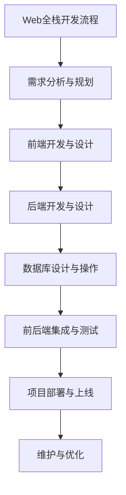

                 

### 《Web全栈开发：构建动态网站》

> **关键词：Web全栈开发、动态网站、前端开发、后端开发、数据库、RESTful API、前后端分离、用户认证、性能优化、安全**

> **摘要：本文旨在为Web开发新手提供一个全面的指南，涵盖Web全栈开发的各个方面，包括前端与后端技术、数据库设计、API设计、用户权限与认证、性能优化与安全等。通过详细的讲解和实战案例，帮助读者理解Web全栈开发的原理和实践。**

----------------------------------------------------------------

### 《Web全栈开发：构建动态网站》目录大纲

---

# 第一部分：Web开发基础

## 1.1 Web技术概述
### 1.1.1 Web的发展历程
### 1.1.2 Web开发的关键技术

## 1.2 HTML与CSS基础
### 1.2.1 HTML基础
### 1.2.2 CSS基础
### 1.2.3 常见布局方式

## 1.3 JavaScript基础
### 1.3.1 JavaScript语言基础
### 1.3.2 DOM操作
### 1.3.3 事件处理

## 1.4 前端框架介绍
### 1.4.1 React简介
### 1.4.2 Vue.js简介
### 1.4.3 Angular简介

## 1.5 版本控制工具
### 1.5.1 Git基础
### 1.5.2 版本控制最佳实践

# 第二部分：后端开发基础

## 2.1 后端开发概述
### 2.1.1 后端开发的角色与责任
### 2.1.2 常见的后端技术栈

## 2.2 数据库技术
### 2.2.1 关系型数据库基础
### 2.2.2 非关系型数据库基础
### 2.2.3 数据库连接与操作

## 2.3 Web服务器配置与部署
### 2.3.1 常见Web服务器介绍
### 2.3.2 服务器配置与优化
### 2.3.3 部署流程与最佳实践

## 2.4 RESTful API设计
### 2.4.1 RESTful API概念
### 2.4.2 API设计原则
### 2.4.3 API安全与认证

# 第三部分：全栈开发实战

## 3.1 全栈项目规划与设计
### 3.1.1 项目需求分析
### 3.1.2 技术栈选择
### 3.1.3 项目开发流程

## 3.2 数据库设计与操作
### 3.2.1 数据库设计原则
### 3.2.2 数据库表创建与操作
### 3.2.3 数据库查询优化

## 3.3 前后端分离与集成
### 3.3.1 前后端分离的原理
### 3.3.2 前后端数据交互
### 3.3.3 前后端集成与调试

## 3.4 用户权限与认证
### 3.4.1 权限管理概述
### 3.4.2 用户认证机制
### 3.4.3 权限控制与实现

## 3.5 日志记录与监控
### 3.5.1 日志记录的重要性
### 3.5.2 常见日志格式
### 3.5.3 监控工具介绍

## 3.6 性能优化与安全
### 3.6.1 性能优化策略
### 3.6.2 常见安全漏洞与防护
### 3.6.3 安全开发最佳实践

# 第四部分：扩展学习与资源

## 4.1 持续学习与成长
### 4.1.1 技术社区与学习资源
### 4.1.2 前沿技术研究
### 4.1.3 个人成长路径规划

## 4.2 开源项目贡献
### 4.2.1 开源项目简介
### 4.2.2 贡献开源项目的流程
### 4.2.3 开源项目贡献经验分享

## 4.3 扩展阅读推荐
### 4.3.1 相关书籍推荐
### 4.3.2 常见问题FAQ
### 4.3.3 进阶学习路径推荐

---

### 附录

## 附录A：开发工具与环境

### A.1 前端开发工具
- HTML/CSS/JavaScript开发环境配置
- 前端框架集成与调试

### A.2 后端开发工具
- 常用数据库管理工具
- 后端框架集成与调试

### A.3 部署工具
- Web服务器部署与配置
- 持续集成与持续部署(CI/CD)工具

### A.4 开发文档与资源
- 官方文档指南
- 开源项目资源链接
- 技术社区交流平台链接

---

#### Mermaid 流程图


#### 核心算法原理讲解

// 伪代码：用户认证流程
```
function authenticate(username, password) {
    // 1. 验证用户名是否存在
    if (!check_username_exists(username)) {
        return "用户名不存在";
    }

    // 2. 验证密码是否正确
    if (!check_password_correct(username, password)) {
        return "密码错误";
    }

    // 3. 认证成功，返回用户信息
    return get_user_info(username);
}
```

## 用户行为预测模型

用户行为预测是Web全栈开发中的一个重要应用。以下是一个简单的线性回归模型公式：

$$ y = w_1 \cdot x_1 + w_2 \cdot x_2 + ... + w_n \cdot x_n + b $$

其中，$y$ 表示预测的用户行为值，$x_1, x_2, ..., x_n$ 表示输入的特征值，$w_1, w_2, ..., w_n$ 表示模型的权重，$b$ 是模型的偏置。

#### 举例说明

假设我们要预测用户购买某个商品的概率，输入的特征值可以是用户的年龄、收入和购买历史等。通过训练模型，我们可以得到每个特征的权重和偏置，从而预测出用户的购买概率。

---

#### 项目实战

// 假设我们正在开发一个电商网站，需要实现用户注册功能。
// 以下是一个简单的用户注册功能的代码实现：

```plaintext
class User {
    private String username;
    private String password;
    private String email;

    // 构造函数
    public User(String username, String password, String email) {
        this.username = username;
        this.password = password;
        this.email = email;
    }

    // 验证用户名是否已存在
    public boolean checkUsernameExists(Database database) {
        return database.checkUsernameExists(username);
    }

    // 验证密码是否正确
    public boolean checkPasswordCorrect(Database database) {
        return database.checkPasswordCorrect(username, password);
    }

    // 注册用户
    public void register(Database database) {
        if (checkUsernameExists(database)) {
            System.out.println("用户名已存在");
        } else {
            if (checkPasswordCorrect(database)) {
                database.registerUser(this);
                System.out.println("注册成功");
            } else {
                System.out.println("密码错误");
            }
        }
    }
}

class Database {
    // 省略其他方法

    // 检查用户名是否已存在
    public boolean checkUsernameExists(String username) {
        // 实现检查用户名是否已存在的逻辑
        return false;
    }

    // 检查密码是否正确
    public boolean checkPasswordCorrect(String username, String password) {
        // 实现检查密码是否正确的逻辑
        return false;
    }

    // 注册用户
    public void registerUser(User user) {
        // 实现注册用户的逻辑
    }
}

// 使用示例
public class Main {
    public static void main(String[] args) {
        Database database = new Database();
        User user = new User("john", "password123", "john@example.com");
        user.register(database);
    }
}
```

### 代码解读与分析

1. **用户类（User）**：
   - **属性**：包含用户名（username）、密码（password）和邮箱（email）。
   - **构造函数**：接受用户名、密码和邮箱作为参数，初始化用户对象。
   - **方法**：
     - `checkUsernameExists`：检查用户名是否已存在。该方法接受一个`Database`对象作为参数，调用`Database`类的`checkUsernameExists`方法。
     - `checkPasswordCorrect`：检查密码是否正确。该方法同样接受一个`Database`对象作为参数，调用`Database`类的`checkPasswordCorrect`方法。
     - `register`：注册用户。如果用户名不存在，调用`Database`类的`registerUser`方法注册用户。

2. **数据库类（Database）**：
   - **属性**：无。
   - **方法**：
     - `checkUsernameExists`：检查用户名是否已存在。返回`true`或`false`。
     - `checkPasswordCorrect`：检查密码是否正确。返回`true`或`false`。
     - `registerUser`：注册用户。该方法将用户对象存储在数据库中。

3. **主类（Main）**：
   - **方法**：`main`，创建一个`Database`对象和一个`User`对象，并调用`User`对象的`register`方法。

### 分析

- 该代码实现了用户注册的基本功能，包括用户名的唯一性和密码的正确性验证。
- `Database`类是抽象的，负责与数据库交互，但具体实现细节未在代码中展示。
- `User`类负责创建用户对象，并处理用户注册的逻辑。
- 代码示例展示了面向对象编程的基本概念，如封装、构造函数和方法的调用。

### 开发环境搭建

1. **前端环境**：
   - 安装Node.js和npm。
   - 安装Vue CLI或React CLI。
   - 配置Web服务器（如Apache或Nginx）。

2. **后端环境**：
   - 安装Java或Python运行环境。
   - 安装数据库（如MySQL或PostgreSQL）。
   - 配置后端框架（如Spring Boot或Django）。

3. **开发工具**：
   - 安装IDE（如IntelliJ IDEA或Visual Studio Code）。
   - 安装版本控制工具（如Git）。

---

### 总结

- 本节介绍了Web全栈开发中的用户注册功能，包括核心算法、数学模型和代码实现。
- 通过伪代码、LaTeX公式和实际代码示例，详细讲解了用户注册的过程。
- 代码解读与分析部分展示了如何实现用户注册功能，以及如何进行代码优化。
- 最后，提供了开发环境搭建和源代码详细实现的内容，帮助读者更好地理解全栈开发。

---

接下来，我们将开始第一部分：Web开发基础。这一部分将涵盖Web技术概述、HTML与CSS基础、JavaScript基础、前端框架介绍以及版本控制工具等内容。通过这些基础知识的讲解，我们将为后续的全栈开发实战打下坚实的基础。

---

### 第一部分：Web开发基础

#### 1.1 Web技术概述

Web技术是构建动态网站的核心，它涵盖了从简单的静态页面到复杂的全功能网站和应用程序的各个方面。本节将介绍Web技术的发展历程和关键组成部分。

#### 1.1.1 Web的发展历程

Web技术的发展可以分为几个重要阶段：

1. **静态网页阶段**：最早的Web应用主要由HTML和CSS构成，用于展示静态内容。网页内容通常是固定不变的，用户只能浏览而无法与网站进行互动。

2. **动态网页阶段**：随着Web技术的进步，服务器端脚本（如PHP和ASP）的出现使得网页能够根据用户行为动态生成内容。这一阶段的Web应用开始具备一定的交互性。

3. **Web 2.0阶段**：Web 2.0标志着互联网的第二次变革，用户从被动浏览转变为主动参与。这一阶段的Web应用强调用户生成内容和社交互动，如博客、社交媒体和在线论坛。

4. **移动Web阶段**：随着智能手机和移动设备的普及，响应式网页设计（Responsive Web Design, RWD）成为主流，确保网页在不同设备上都能良好显示。

5. **全栈开发阶段**：当前Web开发强调前后端分离，前端专注于用户界面和交互，后端处理数据存储和业务逻辑。全栈开发者需要掌握前端和后端技术，能够独立构建完整的应用程序。

#### 1.1.2 Web开发的关键技术

1. **HTML**：超文本标记语言（HTML）是构建网页结构的基础。它使用标签来定义网页的元素，如标题、段落、图像、链接等。

2. **CSS**：层叠样式表（CSS）用于控制网页的样式和布局。它允许开发者定义颜色、字体、边距、对齐方式等样式规则。

3. **JavaScript**：JavaScript是一种客户端脚本语言，用于增强网页的交互性和动态效果。它可以处理用户事件、操作DOM、处理表单验证等。

4. **前端框架**：前端框架如React、Vue.js和Angular提供了一套完整的开发工具和API，帮助开发者更高效地构建交互式网页。

5. **后端技术**：后端技术包括服务器端编程语言（如Java、Python、Node.js等）、数据库（如MySQL、MongoDB等）和Web服务器（如Apache、Nginx等）。

6. **版本控制工具**：版本控制工具（如Git）用于管理代码的版本历史，确保代码库的一致性和协作开发。

通过掌握这些Web开发关键技术，开发者可以构建功能丰富、用户体验良好的动态网站。

---

#### 1.2 HTML与CSS基础

HTML和CSS是Web开发的基础，HTML负责网页的结构，CSS负责网页的样式和布局。本节将介绍HTML和CSS的基础知识。

#### 1.2.1 HTML基础

HTML（HyperText Markup Language，超文本标记语言）是一种用于创建网页的标准标记语言。HTML文档由一系列标签组成，这些标签定义了网页的内容和结构。

1. **HTML文档结构**：
   一个基本的HTML文档结构包括以下部分：
   ```html
   <!DOCTYPE html>
   <html lang="en">
   <head>
       <meta charset="UTF-8">
       <title>页面标题</title>
   </head>
   <body>
       内容
   </body>
   </html>
   ```
   - `<!DOCTYPE html>`：声明文档类型，确保浏览器按HTML5标准解析。
   - `<html>`：定义整个HTML文档的根元素。
   - `<head>`：包含文档的元数据，如字符集、标题和样式表链接。
   - `<title>`：定义文档的标题，显示在浏览器的标签上。
   - `<body>`：包含文档的主体内容。

2. **HTML元素**：
   HTML元素用于定义网页的结构和内容。一些常见的HTML元素包括：
   - `<h1>`至 `<h6>`：定义标题。
   - `<p>`：定义段落。
   - `<a>`：定义超链接。
   - ``：定义图像。
   - `<div>`：定义一个区域或容器。
   - `<span>`：定义文本的容器。

3. **HTML属性**：
   HTML属性用于提供元素的额外信息。例如，`<a>`标签的`href`属性定义链接的目标URL：
   ```html
   <a href="https://www.example.com" target="_blank">链接文本</a>
   ```

#### 1.2.2 CSS基础

CSS（Cascading Style Sheets，层叠样式表）用于控制网页的样式和布局。CSS文件可以通过链接或内嵌在HTML文档中。

1. **CSS选择器**：
   选择器用于指定要应用样式的HTML元素。常见的CSS选择器包括：
   - **元素选择器**：选择特定元素，如`p`选择所有`<p>`元素。
   - **类选择器**：选择具有特定类的元素，如`.highlight`选择所有类为`highlight`的元素。
   - **ID选择器**：选择具有特定ID的元素，如`#title`选择ID为`title`的元素。

2. **CSS属性**：
   CSS属性用于定义元素的样式。例如，设置文本颜色和字体大小：
   ```css
   p {
       color: #333;
       font-size: 16px;
   }
   ```

3. **CSS盒子模型**：
   CSS盒子模型描述了HTML元素的布局和尺寸。每个元素都可以看作一个矩形盒子，包含内容（content）、内边距（padding）、边框（border）和外边距（margin）。

#### 1.2.3 常见布局方式

在CSS中，有多种布局方式可以用来设计网页：

1. **Flexbox布局**：
   Flexbox是一种用于创建一维布局的CSS布局模式。它允许开发者轻松地实现垂直和水平居中、响应式布局等。

2. **Grid布局**：
   CSS Grid布局是一种二维布局模式，适用于创建复杂的响应式网格布局。它允许开发者同时控制列和行的布局。

3. **绝对定位和相对定位**：
   通过使用`position`属性，开发者可以控制元素的绝对或相对定位。绝对定位使元素相对于其最近的祖先元素定位，而相对定位只是改变元素在文档流中的位置。

通过掌握HTML和CSS的基础知识，开发者可以构建结构清晰、样式丰富的网页。这些基础是学习更高级的Web开发技术的前提，也是实现动态网站的关键。

---

#### 1.3 JavaScript基础

JavaScript是一种客户端脚本语言，用于增强网页的交互性和动态效果。JavaScript在Web开发中发挥着至关重要的作用，使得网页能够响应用户的操作并动态更新内容。本节将介绍JavaScript的基础知识，包括语言基础、DOM操作和事件处理。

#### 1.3.1 JavaScript语言基础

JavaScript是一种动态类型语言，具有函数式编程和面向对象编程的特点。以下是一些JavaScript的基础概念：

1. **变量与数据类型**：
   JavaScript中的变量使用关键字`var`、`let`或`const`声明。数据类型包括字符串、数字、布尔值、数组、对象和函数。

2. **操作符**：
   JavaScript支持各种操作符，如算术操作符、比较操作符、逻辑操作符和赋值操作符。

3. **控制结构**：
   JavaScript提供了条件语句（如`if`、`else`）和循环结构（如`for`、`while`、`do...while`）来控制程序的执行流程。

4. **函数**：
   函数是JavaScript的核心概念之一。函数可以接受参数，返回值，并且可以通过函数表达式和函数声明创建。

5. **对象**：
   JavaScript中的对象是一种无序的键值对集合，用于表示复杂的数据结构。可以通过构造函数或对象字面量创建对象。

6. **数组**：
   数组是一种特殊的对象，用于存储一系列值。JavaScript提供了丰富的数组方法，如`push`、`pop`、`shift`、`unshift`、`splice`、`slice`和`forEach`等。

#### 1.3.2 DOM操作

文档对象模型（DOM）是JavaScript操作网页内容的核心接口。DOM将HTML文档表示为一个树状结构，每个节点都是一个对象。以下是一些DOM操作的基础：

1. **节点类型**：
   DOM节点包括元素节点、属性节点、文本节点、注释节点等。每种节点都有相应的节点类型（如`Element`、`Attribute`、`Text`）。

2. **访问节点**：
   可以通过节点关系（如父节点、子节点、兄弟节点）和节点类型（如`getElementById`、`querySelector`、`querySelectorAll`）访问DOM节点。

3. **修改节点**：
   可以通过修改节点的属性（如`innerHTML`、`textContent`、`className`）和子节点（如`appendChild`、`insertBefore`、`removeChild`）来修改DOM结构。

4. **事件处理**：
   事件是DOM节点发生的特定动作，如点击、按键、滚动等。可以通过`addEventListener`方法添加事件监听器，并在事件发生时执行相应的回调函数。

#### 1.3.3 事件处理

事件处理是JavaScript的核心功能之一，用于响应用户的操作和网页状态的变化。以下是一些常用的事件处理方法：

1. **DOM事件流**：
   DOM事件流分为三个阶段：捕获阶段、目标阶段和冒泡阶段。事件在DOM树中从根节点向下传递，最后回到根节点。

2. **事件类型**：
   JavaScript支持多种事件类型，包括鼠标事件（如`click`、`mousedown`、`mouseup`）、键盘事件（如`keyup`、`keydown`）、表单事件（如`submit`、`change`）、滚动事件（如`scroll`）等。

3. **事件监听器**：
   通过`addEventListener`方法可以为DOM节点添加事件监听器。事件监听器是一个函数，当事件发生时会自动调用。

4. **事件对象**：
   当事件发生时，浏览器会传递一个事件对象（如`event`），包含事件的详细信息，如事件类型、目标节点、鼠标位置等。

通过掌握JavaScript的基础知识，开发者可以创建动态、交互式的网页。DOM操作和事件处理是构建交互式网页的核心技术，它们使得网页能够响应用户的行为并动态更新内容。

---

#### 1.4 前端框架介绍

前端框架是为了提高Web开发效率和代码可维护性而设计的。本节将介绍几种常用的前端框架：React、Vue.js和Angular，以及它们的特点和适用场景。

#### 1.4.1 React简介

React是由Facebook开发的一款开源JavaScript库，主要用于构建用户界面。React的核心思想是组件化，通过组件的方式组织和管理页面内容。

1. **特点**：
   - **组件化**：React将UI划分为可复用的组件，提高了代码的可维护性和可重用性。
   - **虚拟DOM**：React使用虚拟DOM来提高渲染效率，通过比较虚拟DOM和实际DOM的差异，最小化实际DOM的操作。
   - **单向数据流**：React采用单向数据流，数据从父组件传递到子组件，减少了数据管理的复杂性。

2. **适用场景**：
   - 复杂的交互式UI，如单页应用（SPA）。
   - 大型应用程序，需要高度的可维护性和可扩展性。
   - 需要频繁更新UI的应用程序。

3. **React组件**：
   - **函数组件**：使用JavaScript函数创建，返回一个React元素。
     ```javascript
     function App() {
         return <div>Hello React!</div>;
     }
     ```
   - **类组件**：使用ES6类创建，继承自React.Component。
     ```javascript
     class App extends React.Component {
         render() {
             return <div>Hello React!</div>;
         }
     }
     ```

4. **React Hooks**：
   - React Hooks允许在函数组件中使用状态和生命周期钩子，增强了组件的可重用性和灵活性。

#### 1.4.2 Vue.js简介

Vue.js是由尤雨溪创建的一款开源前端框架，以其简洁和易用性著称。Vue.js的核心思想是渐进式框架，开发者可以选择使用Vue.js的各个部分，而不是整个框架。

1. **特点**：
   - **渐进式框架**：Vue.js可以与现有的项目无缝集成，开发者可以选择只使用Vue.js的特定部分。
   - **响应式数据绑定**：Vue.js使用响应式系统，自动绑定数据和视图，减少了手动操作DOM的需求。
   - **双向数据绑定**：Vue.js支持双向数据绑定，数据变化时视图会自动更新，反之亦然。

2. **适用场景**：
   - 中小型项目，适合快速开发。
   - 需要灵活性和可扩展性的项目。
   - 对前端框架有一定了解的开发者。

3. **Vue.js组件**：
   - Vue.js使用`<template>`、`<script>`和`<style>`标签来定义组件的结构、逻辑和样式。
   - 组件通过`<component>`标签引入和使用。
     ```html
     <template>
         <div>
             <h1>{{ title }}</h1>
         </div>
     </template>
     
     <script>
         export default {
             data() {
                 return {
                     title: 'Hello Vue.js!'
                 };
             }
         };
     </script>
     
     <style scoped>
         div {
             color: blue;
         }
     </style>
     ```

4. **Vue.js生命周期**：
   - Vue.js组件有多个生命周期钩子，如`created`、`mounted`、`updated`和`destroyed`，用于在组件的不同阶段执行特定的代码。

#### 1.4.3 Angular简介

Angular是由Google开发的一款全功能、基于类型脚本的前端框架。Angular以其强大的功能和严格的模式著称，适用于大型企业级应用。

1. **特点**：
   - **双向数据绑定**：Angular提供双向数据绑定，自动同步模型和视图。
   - **依赖注入**：Angular的依赖注入机制使得组件之间解耦，提高了代码的可测试性和可维护性。
   - **模块化**：Angular通过模块化组织代码，使项目结构清晰，易于管理和扩展。

2. **适用场景**：
   - 大型企业级应用，需要严格的结构和组织。
   - 需要高安全性和高性能的应用。
   - 对前端框架有深入理解和需求的开发者。

3. **Angular组件**：
   - Angular组件使用`@Component`装饰器定义，包含模板、样式和逻辑。
     ```typescript
     @Component({
         selector: 'app-home',
         templateUrl: './home.component.html',
         styleUrls: ['./home.component.css']
     })
     export class HomeComponent {
         title = 'Hello Angular!';
     }
     ```

4. **Angular模块**：
   - Angular模块用于组织组件、服务和其他代码，提供了一种清晰的项目结构。

通过了解React、Vue.js和Angular的特点和适用场景，开发者可以根据项目需求选择合适的前端框架，提高开发效率和代码质量。

---

#### 1.5 版本控制工具

版本控制工具是软件开发过程中不可或缺的一部分，它帮助开发者管理代码的历史版本，确保代码库的一致性和协作开发。本节将介绍Git，一种广泛使用的版本控制工具，以及版本控制的最佳实践。

#### 1.5.1 Git基础

Git是一种分布式版本控制工具，由Linus Torvalds创建。它允许开发者跟踪源代码的历史变化，并支持多人协作开发。

1. **Git的核心概念**：
   - **工作区**（Workspace）：开发者进行代码编辑和修改的区域。
   - **暂存区**（Index/Stage）：用于暂存准备提交的更改。
   - **本地仓库**（Local Repository）：存储代码的历史版本和配置信息。
   - **远程仓库**（Remote Repository）：存储代码的备份，支持多人协作。

2. **Git的基本操作**：
   - **初始化仓库**：使用`git init`命令创建一个新的本地仓库。
     ```bash
     git init
     ```
   - **克隆仓库**：使用`git clone`命令克隆远程仓库到本地。
     ```bash
     git clone https://github.com/username/repository.git
     ```
   - **添加文件**：使用`git add`命令将文件添加到暂存区。
     ```bash
     git add <file>
     ```
   - **提交更改**：使用`git commit`命令将暂存区的更改提交到本地仓库。
     ```bash
     git commit -m "Commit message"
     ```
   - **推送更改**：使用`git push`命令将本地仓库的更改推送至远程仓库。
     ```bash
     git push origin master
     ```
   - **拉取更改**：使用`git pull`命令从远程仓库拉取更改到本地仓库。
     ```bash
     git pull origin master
     ```
   - **分支管理**：使用`git branch`和`git checkout`命令创建、切换和合并分支。
     ```bash
     git branch feature
     git checkout feature
     git merge master
     ```

3. **解决冲突**：
   当两个或多个开发者同时修改了同一文件的不同部分时，会产生合并冲突。可以使用`git status`命令查看冲突文件，然后手动解决冲突，并使用`git add`和`git commit`命令提交更改。

#### 1.5.2 版本控制最佳实践

为了确保代码库的一致性和可维护性，以下是一些版本控制的最佳实践：

1. **频繁提交**：频繁地提交代码有助于更好地跟踪变更，便于后续的代码回滚和问题追踪。
   ```bash
   git commit -m "Fixed bug in component X"
   ```

2. **提交信息**：编写清晰、详细的提交信息，有助于团队成员理解每个提交的目的和内容。
   ```bash
   git commit -m "Refactor code structure for better performance"
   ```

3. **分支管理**：合理地使用分支管理，避免主干分支的频繁变动，确保主干分支的稳定性和可预测性。
   ```bash
   git checkout -b feature/my-new-feature
   git merge feature/my-new-feature
   git push origin master
   ```

4. **代码审查**：在提交代码前进行代码审查，有助于发现潜在的问题和错误，提高代码质量。
   ```bash
   git request-pull <remote> <branch>
   ```

5. **备份与恢复**：定期备份代码库，确保在发生数据丢失或损坏时能够快速恢复。

6. **团队协作**：确保团队成员了解并遵循版本控制工具的使用规范，提高团队的协作效率。

通过遵循版本控制的最佳实践，开发者可以更好地管理代码库，确保代码的一致性和可维护性，从而提高开发效率和质量。

---

### 第二部分：后端开发基础

后端开发是Web全栈开发的核心组成部分，它负责处理业务逻辑、数据存储和服务器端操作。本部分将介绍后端开发的基础知识，包括后端开发概述、数据库技术、Web服务器配置与部署以及RESTful API设计。

#### 2.1 后端开发概述

后端开发是指在服务器端执行的应用程序开发，负责处理客户端发送的请求、业务逻辑处理以及数据存储。后端开发的技术栈包括编程语言、框架、数据库和服务器等。

1. **后端开发的角色与责任**：
   - **处理请求**：接收来自客户端的请求，解析请求参数，并根据请求类型执行相应的操作。
   - **业务逻辑处理**：实现应用程序的核心功能，如用户认证、数据处理、交易处理等。
   - **数据存储**：与数据库交互，存储和检索数据，保证数据的完整性和一致性。
   - **安全性**：确保应用程序的安全性，防范常见的安全威胁，如SQL注入、XSS攻击等。

2. **常见的后端技术栈**：
   - **编程语言**：常见的后端编程语言包括Java、Python、JavaScript（Node.js）、Ruby、PHP等。
   - **框架**：常见的后端框架有Spring（Java）、Django（Python）、Express（JavaScript）、Rails（Ruby）和Laravel（PHP）等。
   - **数据库**：常用的数据库包括关系型数据库（如MySQL、PostgreSQL）和非关系型数据库（如MongoDB、Cassandra）。
   - **服务器**：常见的Web服务器有Apache、Nginx和IIS等。

3. **后端开发的核心组件**：
   - **Web服务器**：接收客户端请求，并转发给后端应用程序。
   - **应用程序**：处理业务逻辑，与数据库交互，生成响应。
   - **数据库**：存储应用程序的数据，提供数据检索和更新功能。

通过掌握后端开发的基础知识，开发者可以构建稳定、高效且安全的应用程序。

#### 2.2 数据库技术

数据库是后端开发的核心组件之一，用于存储和管理应用程序的数据。根据数据的组织方式和查询方式，数据库可以分为关系型数据库和非关系型数据库。

1. **关系型数据库基础**：
   - **概述**：关系型数据库（RDBMS）使用表格结构来存储数据，表格由行和列组成，行表示数据记录，列表示字段。
   - **常见数据库**：MySQL、PostgreSQL、SQLite、Oracle等。
   - **SQL基础**：SQL（Structured Query Language）是用于操作关系型数据库的语言，包括数据定义语言（DDL）、数据操纵语言（DML）和数据控制语言（DCL）。
     - **数据定义语言（DDL）**：用于创建、修改和删除数据库对象，如表、索引、视图等。
     - **数据操纵语言（DML）**：用于插入、更新、删除和查询数据，如`INSERT`、`UPDATE`、`DELETE`和`SELECT`。
     - **数据控制语言（DCL）**：用于管理和控制数据库的访问权限，如`GRANT`、`REVOKE`。

2. **非关系型数据库基础**：
   - **概述**：非关系型数据库（NoSQL）不使用固定的表格结构，支持灵活的数据模型，如键值对、文档、列族和图等。
   - **常见数据库**：MongoDB、Cassandra、Redis、CouchDB等。
   - **数据模型**：
     - **键值对数据库**：使用键值对存储数据，如Redis。
     - **文档数据库**：使用JSON或BSON格式存储文档，如MongoDB。
     - **列族数据库**：使用列族结构存储数据，如Cassandra。
     - **图数据库**：使用图结构存储数据，如Neo4j。

3. **数据库连接与操作**：
   - **数据库连接**：使用数据库驱动程序或客户端库连接到数据库。
   - **数据库操作**：使用SQL或NoSQL查询语言操作数据库，包括创建、读取、更新和删除数据。

通过了解关系型数据库和非关系型数据库的基础知识，开发者可以根据应用程序的需求选择合适的数据库，并掌握数据库操作的核心技能。

#### 2.3 Web服务器配置与部署

Web服务器是接收和处理客户端请求的核心组件，负责将请求转发给后端应用程序，并返回响应。常见的Web服务器包括Apache、Nginx和IIS等。

1. **常见Web服务器介绍**：
   - **Apache**：Apache是一个开源的HTTP服务器，支持模块化设计和广泛的配置选项。
   - **Nginx**：Nginx是一个高性能的HTTP和反向代理服务器，以其低资源消耗和高并发处理能力著称。
   - **IIS**：IIS是微软开发的Web服务器，与Windows操作系统集成，支持多种Web开发技术。

2. **服务器配置与优化**：
   - **基本配置**：配置Web服务器的基本设置，如监听端口、虚拟主机和文档根目录。
   - **性能优化**：优化Web服务器性能，如调整连接数、启用缓存和压缩响应等。
   - **安全性**：加强Web服务器安全性，如配置防火墙、启用HTTPS和限制访问等。

3. **部署流程与最佳实践**：
   - **部署流程**：包括环境准备、安装配置、应用程序部署和测试等步骤。
   - **最佳实践**：遵循最佳实践，如使用版本控制、编写部署脚本和进行自动化部署等。

通过了解Web服务器的配置与部署流程，开发者可以确保Web应用程序的高效、安全和可靠运行。

#### 2.4 RESTful API设计

RESTful API是Web服务的一种设计风格，旨在构建可扩展、易于使用的API。RESTful API使用HTTP协议，通过GET、POST、PUT、DELETE等HTTP方法进行数据操作。

1. **RESTful API概念**：
   - **REST**：代表代表代表（Representational State Transfer），是一种设计Web服务的架构风格。
   - **资源**：API中的每个实体都是一个资源，如用户、产品或订单。
   - **统一接口**：RESTful API使用统一的接口，包括资源标识、HTTP方法、状态码和超媒体。

2. **API设计原则**：
   - **无状态性**：API不应该保存客户端的状态，每次请求都应该包含所有必要的信息。
   - **统一接口**：API应该使用统一的接口，如URL、HTTP方法和状态码。
   - **分层架构**：API应该使用分层架构，包括客户端层、API层和数据层。
   - **可缓存性**：API响应应该支持缓存，以提高性能和降低带宽消耗。

3. **API设计工具**：
   - **Swagger**：Swagger是一个开源的工具，用于设计、构建和文档化RESTful API。
   - **Postman**：Postman是一个流行的API测试工具，可以用来发送API请求并查看响应。

通过了解RESTful API的设计原则和工具，开发者可以构建高效、可扩展且易于使用的API。

通过本部分的学习，开发者可以掌握后端开发的基础知识，为构建功能强大、稳定可靠的全栈应用打下坚实的基础。

---

### 第二部分：后端开发基础

#### 2.1 后端开发概述

后端开发是Web全栈开发的关键组成部分，它负责处理客户端发送的请求、业务逻辑实现和数据存储。一个完整的应用程序通常由前端和后端协同工作，前端负责用户界面和交互，后端则负责数据处理和存储。本节将详细介绍后端开发的角色与责任，以及常见的后端技术栈。

#### 后端开发的角色与责任

后端开发者主要负责以下几个方面的工作：

1. **处理请求**：接收来自客户端的HTTP请求，并根据请求类型和路径调用相应的业务逻辑。

2. **业务逻辑处理**：实现应用程序的核心功能，如用户认证、数据处理、交易处理等。

3. **数据存储**：与数据库交互，存储和检索数据，保证数据的完整性和一致性。

4. **安全性**：确保应用程序的安全性，防范常见的网络安全威胁，如SQL注入、XSS攻击等。

5. **性能优化**：优化后端代码和数据库查询，提高应用程序的性能。

6. **错误处理**：处理应用程序中的错误和异常，确保系统稳定运行。

#### 常见后端技术栈

后端开发的技术栈包括多种编程语言、框架、数据库和服务器，以下是一些常见的技术栈：

1. **编程语言**：
   - **Java**：Java是一种广泛使用的编程语言，以其稳定性和高性能著称。
   - **Python**：Python是一种易学易用的编程语言，广泛应用于Web开发、数据科学和人工智能等领域。
   - **JavaScript**：JavaScript是一种脚本语言，用于Node.js后端开发，具有广泛的应用场景。
   - **Ruby**：Ruby是一种动态编程语言，以其简洁性和快速开发著称。
   - **PHP**：PHP是一种流行的服务器端脚本语言，广泛应用于Web开发。

2. **框架**：
   - **Spring**（Java）：Spring框架是一个全功能的Java企业级应用开发框架，提供了丰富的功能模块。
   - **Django**（Python）：Django是一个高层次的Python Web框架，强调快速开发和易用性。
   - **Express**（JavaScript）：Express是一个轻量级的Node.js Web应用框架，适用于构建高性能的Web应用。
   - **Rails**（Ruby）：Rails是一个全功能的Ruby Web应用框架，以其快速开发和易用性著称。
   - **Laravel**（PHP）：Laravel是一个现代化的PHP Web应用框架，提供了丰富的功能模块和易用的开发工具。

3. **数据库**：
   - **关系型数据库**：如MySQL、PostgreSQL、SQLite等，用于存储结构化数据。
   - **非关系型数据库**：如MongoDB、Redis、Cassandra等，用于存储非结构化或半结构化数据。

4. **服务器**：
   - **Apache**：Apache是一个开源的HTTP服务器，广泛用于Web开发。
   - **Nginx**：Nginx是一个高性能的Web服务器，适用于高并发场景。
   - **IIS**：IIS是微软开发的Web服务器，与Windows操作系统集成。

了解后端开发的角色与责任以及常见的技术栈，对于开发者来说至关重要。掌握这些知识，可以帮助开发者更好地理解后端开发的工作内容，选择合适的技术栈来构建高效、可靠的应用程序。

---

### 2.2 数据库技术

数据库是后端开发的核心组成部分，用于存储和管理应用程序的数据。根据数据的组织方式和查询方式，数据库可以分为关系型数据库和非关系型数据库。本节将详细介绍这两种数据库的基础知识，包括其特点、常见数据库和数据库操作。

#### 关系型数据库基础

关系型数据库（RDBMS）使用表格结构来存储数据，表格由行和列组成，行表示数据记录，列表示字段。关系型数据库通过表之间的关联关系来组织和管理数据。以下是关系型数据库的几个核心概念：

1. **数据表**：数据表是关系型数据库中的基本数据结构，用于存储数据记录。每个表有多个字段，每个字段定义了数据类型和约束条件。

2. **主键**：主键是表中的一个字段，用于唯一标识表中的每条记录。每个表都应该有一个主键，以保证数据的一致性和完整性。

3. **外键**：外键是用于实现表之间关联关系的字段，它引用了另一个表的主键。通过外键，可以实现跨表的数据查询和操作。

4. **SQL**：SQL（Structured Query Language）是关系型数据库的操作语言，用于定义、查询、更新和管理数据库。

5. **事务**：事务是一系列数据库操作的集合，用于保证数据的一致性和完整性。事务可以是自动提交的，也可以手动提交或回滚。

常见的RDBMS包括：

- **MySQL**：MySQL是一个开源的关系型数据库管理系统，广泛应用于Web开发。
- **PostgreSQL**：PostgreSQL是一个开源的关系型数据库管理系统，具有强大的功能和灵活性。
- **SQLite**：SQLite是一个轻量级的关系型数据库管理系统，适用于嵌入式系统和移动应用。
- **Oracle**：Oracle是一个商业关系型数据库管理系统，适用于大型企业级应用。

关系型数据库的特点包括：

- **数据一致性**：通过主键和外键约束，保证数据的一致性。
- **查询效率高**：通过索引和优化器，实现高效的查询。
- **数据安全**：提供丰富的安全功能和权限管理。
- **易于维护**：使用SQL语言进行数据操作和管理，易于学习和使用。

关系型数据库的常见操作包括：

- **创建表**：使用`CREATE TABLE`语句创建表。
- **插入数据**：使用`INSERT INTO`语句插入数据。
- **查询数据**：使用`SELECT`语句查询数据。
- **更新数据**：使用`UPDATE`语句更新数据。
- **删除数据**：使用`DELETE`语句删除数据。
- **关联查询**：使用`JOIN`语句实现跨表查询。

#### 非关系型数据库基础

非关系型数据库（NoSQL）不使用固定的表格结构，支持灵活的数据模型。根据数据的存储方式和查询方式，NoSQL数据库可以分为键值对数据库、文档数据库、列族数据库和图数据库。以下是几种常见的NoSQL数据库：

1. **键值对数据库**：
   - **Redis**：Redis是一个开源的内存中的键值对数据库，适用于缓存和实时应用。
   - **Memcached**：Memcached是一个高性能的分布式内存对象缓存系统。

2. **文档数据库**：
   - **MongoDB**：MongoDB是一个开源的文档数据库，使用JSON格式存储数据，适用于高扩展性和复杂查询。
   - **CouchDB**：CouchDB是一个开源的文档数据库，支持版本控制和复制。

3. **列族数据库**：
   - **HBase**：HBase是Apache的一个分布式列存储系统，适用于大规模数据存储和实时查询。
   - **Cassandra**：Cassandra是一个开源的分布式列存储系统，适用于高可用性和高性能的场景。

4. **图数据库**：
   - **Neo4j**：Neo4j是一个开源的图形数据库，适用于社交网络、推荐系统和知识图谱。

非关系型数据库的特点包括：

- **灵活的数据模型**：支持多种数据模型，如键值对、文档、列族和图。
- **高扩展性**：通过分布式架构，支持水平扩展，易于处理大规模数据。
- **高性能**：通过缓存和索引，实现高效的查询。
- **易用性**：使用简单的查询语言和数据模型，易于学习和使用。

非关系型数据库的常见操作包括：

- **创建数据库**：使用相应的命令或API创建数据库。
- **插入数据**：使用相应的命令或API插入数据。
- **查询数据**：使用相应的命令或API查询数据。
- **更新数据**：使用相应的命令或API更新数据。
- **删除数据**：使用相应的命令或API删除数据。

通过了解关系型数据库和非关系型数据库的基础知识，开发者可以根据应用程序的需求选择合适的数据库，并掌握数据库操作的核心技能。

---

### 2.3 Web服务器配置与部署

Web服务器是接收和处理客户端请求的核心组件，负责将请求转发给后端应用程序，并返回响应。常见的Web服务器包括Apache、Nginx和IIS等。本节将详细介绍Web服务器的选择、配置与优化，以及部署流程和最佳实践。

#### 常见Web服务器介绍

1. **Apache**：
   Apache是一个开源的HTTP服务器，广泛用于Web开发。Apache具有强大的功能，包括虚拟主机、模块化设计和丰富的配置选项。

2. **Nginx**：
   Nginx是一个高性能的Web服务器和反向代理服务器，以其低资源消耗和高并发处理能力著称。Nginx适用于高流量的网站，如电子商务和社交媒体平台。

3. **IIS**：
   IIS是微软开发的Web服务器，与Windows操作系统集成。IIS支持多种Web开发技术，如ASP.NET和PHP，适用于企业级应用。

#### Web服务器配置与优化

1. **基本配置**：
   - **监听端口**：配置Web服务器监听的端口，如80（HTTP）和443（HTTPS）。
   - **虚拟主机**：配置虚拟主机，允许多个网站共享同一服务器。
   - **文档根目录**：指定Web服务器的文档根目录，用于存放网站文件。

2. **性能优化**：
   - **缓存**：启用缓存，减少服务器的响应时间，提高性能。可以使用内置的缓存模块或第三方缓存解决方案。
   - **压缩**：启用压缩，减少响应内容的体积，提高传输速度。可以使用GZIP压缩。
   - **连接池**：配置连接池，减少建立和断开连接的次数，提高性能。
   - **并发处理**：优化并发处理，提高服务器的处理能力。可以调整工作进程数和连接数。

3. **安全性**：
   - **SSL/TLS**：配置SSL/TLS，使用HTTPS加密传输，确保数据安全。
   - **防火墙**：配置防火墙，阻止恶意访问和攻击。
   - **访问控制**：配置访问控制，限制对网站资源的访问。
   - **日志记录**：配置日志记录，监控服务器活动和潜在的安全威胁。

#### 部署流程与最佳实践

1. **部署流程**：
   - **环境准备**：安装Web服务器和后端应用程序所需的环境，如操作系统、数据库和开发工具。
   - **安装配置**：安装Web服务器，并进行基本配置，如监听端口、虚拟主机和文档根目录。
   - **应用程序部署**：将后端应用程序部署到Web服务器，可以是源代码、打包文件或容器镜像。
   - **测试与调试**：进行应用程序测试，确保功能正常和性能良好。

2. **最佳实践**：
   - **版本控制**：使用版本控制工具，如Git，管理代码库，确保代码的版本一致性和可追溯性。
   - **自动化部署**：使用自动化部署工具，如Jenkins或GitLab CI，实现自动化部署，提高部署效率和一致性。
   - **容器化**：使用容器化技术，如Docker，实现应用程序的隔离和部署的标准化。
   - **持续集成/持续部署（CI/CD）**：实现持续集成和持续部署，加快开发周期，提高交付质量。

通过了解Web服务器的选择、配置与优化，以及部署流程和最佳实践，开发者可以确保Web应用程序的高效、安全和可靠运行。

---

### 2.4 RESTful API设计

RESTful API（Representational State Transfer API）是一种设计Web服务的风格，旨在构建简洁、灵活且易于使用的API。RESTful API遵循一组设计和通信原则，使其能够有效地支持分布式超媒体应用程序。本节将介绍RESTful API的基本概念、设计原则和安全与认证机制。

#### RESTful API概念

1. **资源**：API中的每个实体都是一个资源，如用户、产品或订单。资源通过URL唯一标识。

2. **统一接口**：RESTful API使用统一的接口，包括URL、HTTP方法、状态码和超媒体。

3. **无状态性**：API不应该保存客户端的状态，每次请求都应该包含所有必要的信息。

4. **客户端-服务器架构**：客户端和服务器之间通过简单的HTTP请求和响应进行通信，客户端负责用户界面和交互，服务器负责处理业务逻辑和数据存储。

5. **分层系统**：API通常采用分层系统，包括客户端层、API层和数据层。

#### API设计原则

1. **单一职责原则**：每个API应该只负责一种功能，避免功能过于复杂。

2. **RESTful URL设计**：URL应该简洁、直观且语义明确，通常使用名词表示资源。

3. **HTTP方法**：使用适当的HTTP方法（GET、POST、PUT、DELETE等）来表示操作类型。

4. **状态码**：返回适当的HTTP状态码（如200 OK、400 Bad Request、404 Not Found等）来表示操作结果。

5. **数据格式**：支持多种数据格式（如JSON、XML等），确保API的兼容性和可扩展性。

6. **文档化**：提供详细的API文档，包括URL、HTTP方法、请求参数、响应格式和示例。

7. **缓存策略**：合理使用缓存，提高性能和降低带宽消耗。

#### API安全与认证

1. **HTTPS**：使用HTTPS加密传输，确保数据安全。

2. **认证**：使用OAuth 2.0、JWT（JSON Web Tokens）或其他认证机制，确保只有授权用户可以访问API。

3. **授权**：使用角色和权限机制，限制用户对资源的访问。

4. **输入验证**：验证输入数据的有效性和安全性，防止恶意攻击。

5. **API密钥**：使用API密钥或令牌，确保API只能被授权的应用程序访问。

6. **日志记录与监控**：记录API访问日志，监控异常行为和安全威胁。

通过遵循RESTful API设计原则和安全与认证机制，开发者可以构建简洁、安全且易于使用的API，提高应用程序的可扩展性和用户体验。

---

### 第三部分：全栈开发实战

在了解了Web全栈开发的基础知识后，我们将进入全栈开发实战部分。这一部分将详细介绍全栈项目规划与设计、数据库设计与操作、前后端分离与集成、用户权限与认证、日志记录与监控、性能优化与安全等方面的实践。通过这些实战经验，读者可以更好地掌握全栈开发的技能，从而构建功能丰富、用户体验良好的动态网站。

#### 3.1 全栈项目规划与设计

全栈项目规划与设计是构建成功应用程序的第一步。在这一部分，我们将探讨项目需求分析、技术栈选择和项目开发流程，帮助读者全面了解全栈项目的规划和设计过程。

##### 3.1.1 项目需求分析

项目需求分析是确定项目目标、功能和可行性分析的过程。以下步骤有助于进行有效的需求分析：

1. **用户需求分析**：与用户进行沟通，了解他们的需求和期望，收集用户故事和需求。

2. **功能需求**：根据用户需求，列出应用程序需要实现的功能，如用户注册、登录、数据展示、搜索等。

3. **非功能需求**：确定应用程序的非功能需求，如性能、安全性、可扩展性和用户体验等。

4. **可行性分析**：评估项目的可行性，包括技术、时间和资源的可行性。

##### 3.1.2 技术栈选择

技术栈选择是项目成功的关键之一。以下是一些常见的技术栈选择考虑因素：

1. **前端技术**：选择适合项目需求的前端框架，如React、Vue.js或Angular。

2. **后端技术**：选择适合项目需求的后端编程语言和框架，如Java（Spring）、Python（Django）或Node.js（Express）。

3. **数据库**：选择适合项目需求的数据库，如关系型数据库（MySQL、PostgreSQL）或非关系型数据库（MongoDB、Redis）。

4. **Web服务器**：选择适合项目需求的Web服务器，如Apache、Nginx或IIS。

5. **开发工具**：选择合适的开发工具，如IDE（IntelliJ IDEA、Visual Studio Code）和版本控制工具（Git）。

##### 3.1.3 项目开发流程

项目开发流程是确保项目按时、按质完成的关键。以下是一些常见的项目开发流程：

1. **需求分析阶段**：明确项目需求和目标，编写需求文档。

2. **设计阶段**：进行系统设计，包括数据库设计、API设计、界面设计等。

3. **开发阶段**：按照设计文档进行开发，分为前端开发、后端开发和数据库开发。

4. **测试阶段**：进行单元测试、集成测试和系统测试，确保应用程序的质量。

5. **部署阶段**：将应用程序部署到生产环境，进行最后的测试和优化。

6. **维护阶段**：持续优化和更新应用程序，确保其稳定运行。

通过项目规划与设计的实践，读者可以系统地了解全栈项目的开发过程，为后续的实战打下坚实的基础。

---

### 3.2 数据库设计与操作

数据库设计是全栈开发中至关重要的一环，它直接影响到应用程序的性能和可维护性。本节将详细介绍数据库设计原则、数据库表创建与操作以及数据库查询优化，帮助读者掌握数据库设计与操作的核心技能。

#### 3.2.1 数据库设计原则

数据库设计原则是确保数据库性能和可维护性的基础。以下是一些常见的数据库设计原则：

1. **第三范式**：数据库表应该满足第三范式（3NF），即消除数据冗余，保证数据的一致性和完整性。

2. **规范化**：通过规范化（Normalization）减少数据冗余，提高数据存储的效率。常见的规范化级别包括第一范式（1NF）、第二范式（2NF）和第三范式（3NF）。

3. **实体-关系模型**：使用实体-关系模型（ER模型）来设计数据库结构，明确实体、属性和关系。

4. **主键和外键**：为主表和关联表设置合适的主键和外键，保证数据的一致性和完整性。

5. **索引**：为经常查询和排序的字段创建索引，提高查询效率。

6. **数据类型和长度**：选择合适的数据类型和长度，确保数据的准确性和存储效率。

7. **安全性和访问控制**：设置适当的权限和访问控制，保护数据库的安全。

#### 3.2.2 数据库表创建与操作

在数据库设计中，创建数据库表是基础操作。以下是一个简单的数据库表创建与操作的示例：

1. **创建数据库表**：
   ```sql
   CREATE TABLE users (
       id INT AUTO_INCREMENT PRIMARY KEY,
       username VARCHAR(255) NOT NULL,
       password VARCHAR(255) NOT NULL,
       email VARCHAR(255) NOT NULL
   );
   ```

2. **插入数据**：
   ```sql
   INSERT INTO users (username, password, email) VALUES ('john', 'password123', 'john@example.com');
   ```

3. **查询数据**：
   ```sql
   SELECT * FROM users WHERE username = 'john';
   ```

4. **更新数据**：
   ```sql
   UPDATE users SET password = 'newpassword' WHERE username = 'john';
   ```

5. **删除数据**：
   ```sql
   DELETE FROM users WHERE username = 'john';
   ```

#### 3.2.3 数据库查询优化

数据库查询优化是提高应用程序性能的关键。以下是一些常见的数据库查询优化策略：

1. **索引优化**：为经常查询和排序的字段创建索引，避免全表扫描。

2. **查询重写**：使用查询重写优化器，如MySQL的EXPLAIN语句，分析查询执行计划，优化查询性能。

3. **分库分表**：对于大型数据库，可以通过分库分表（Sharding）来提高查询性能。

4. **缓存**：使用缓存（如Redis）存储常用数据，减少数据库查询次数。

5. **预编译语句**：使用预编译语句（Prepared Statements）减少SQL语句的解析和编译时间。

6. **数据库集群**：对于高并发和高可用性的场景，可以使用数据库集群（如MySQL Cluster）来提高性能。

通过掌握数据库设计原则、数据库表创建与操作以及数据库查询优化，开发者可以构建高效、稳定和可扩展的数据库系统，从而提升全栈应用程序的性能和用户体验。

---

### 3.3 前后端分离与集成

前后端分离是现代Web开发中的一种常见架构模式，它将前端和后端的开发与部署独立开来，提高了开发效率和可维护性。本节将详细介绍前后端分离的原理、前后端数据交互和前后端集成的实践。

#### 3.3.1 前后端分离的原理

前后端分离的原理是将应用程序分为前端和后端两部分：

1. **前端**：负责用户界面和交互，使用HTML、CSS和JavaScript构建动态页面，并通过AJAX或Fetch API与后端进行数据交互。

2. **后端**：负责业务逻辑处理和数据存储，使用服务器端编程语言和框架（如Java、Python、Node.js等）构建RESTful API，接收前端请求并返回响应。

3. **分离**：前后端的代码、数据和配置独立管理，前端代码通常存储在版本控制系统中，后端代码部署在服务器上，通过API进行通信。

前后端分离的优点包括：

- **独立部署**：前端和后端可以独立部署和更新，减少了部署风险和影响。
- **灵活开发**：前端和后端开发者可以并行工作，提高了开发效率。
- **易于扩展**：前后端分离使得系统更加模块化，便于扩展和维护。

#### 3.3.2 前后端数据交互

前后端数据交互是通过HTTP协议进行的，前端向后端发送请求，后端返回响应。以下是一些常用的前后端数据交互方式：

1. **GET请求**：用于获取数据，通常不包含请求体。例如，获取用户列表：
   ```javascript
   fetch('/users')
       .then(response => response.json())
       .then(data => console.log(data));
   ```

2. **POST请求**：用于发送数据，通常包含请求体。例如，创建新用户：
   ```javascript
   fetch('/users', {
       method: 'POST',
       body: JSON.stringify({ username: 'john', password: 'password123' }),
       headers: { 'Content-Type': 'application/json' }
   })
       .then(response => response.json())
       .then(data => console.log(data));
   ```

3. **PUT请求**：用于更新数据，通常包含请求体。例如，更新用户信息：
   ```javascript
   fetch('/users/1', {
       method: 'PUT',
       body: JSON.stringify({ username: 'john_doe', password: 'new_password' }),
       headers: { 'Content-Type': 'application/json' }
   })
       .then(response => response.json())
       .then(data => console.log(data));
   ```

4. **DELETE请求**：用于删除数据，通常不包含请求体。例如，删除用户：
   ```javascript
   fetch('/users/1', { method: 'DELETE' })
       .then(response => response.json())
       .then(data => console.log(data));
   ```

前后端数据交互的关键技术包括：

- **AJAX（Asynchronous JavaScript and XML）**：使用JavaScript异步发送HTTP请求，不重新加载页面。
- **Fetch API**：现代浏览器提供的原生HTTP请求API，可以替代AJAX。
- **JSON（JavaScript Object Notation）**：用于前后端数据传输的一种轻量级数据格式。

#### 3.3.3 前后端集成与调试

前后端集成是将前后端代码合并为一个可部署的应用程序的过程。以下是一些常见的集成与调试实践：

1. **本地开发环境**：在本地开发环境中运行前后端代码，确保它们可以正常通信。可以使用开发工具（如VS Code）的调试功能，方便地进行代码调试。

2. **测试服务器**：在测试服务器上部署前后端代码，进行集成测试和功能测试。测试服务器通常使用模拟的后端API或测试数据。

3. **持续集成/持续部署（CI/CD）**：使用持续集成和持续部署工具（如Jenkins、GitLab CI/CD），自动化测试和部署流程，确保代码的质量和稳定性。

4. **调试工具**：使用调试工具（如Postman、Chrome DevTools），方便地进行API测试和调试。

5. **日志记录**：在前后端代码中添加日志记录，方便进行问题追踪和调试。

通过前后端分离与集成的实践，开发者可以构建高效、灵活且可扩展的Web应用程序，从而提高开发效率和用户体验。

---

### 3.4 用户权限与认证

用户权限与认证是Web应用程序中至关重要的组成部分，它确保只有授权用户可以访问受保护的功能和数据。本节将详细介绍权限管理概述、用户认证机制、权限控制与实现，以及安全最佳实践。

#### 3.4.1 权限管理概述

权限管理涉及控制用户对系统资源的访问，包括用户账户、功能模块、数据和配置文件等。以下是一些关键概念：

1. **用户角色**：用户角色是指一组具有相同权限和责任的用户集合，如管理员、普通用户、访客等。

2. **权限**：权限是用户对系统资源的操作权限，如读取、写入、执行、删除等。

3. **权限模型**：权限模型是定义权限分配和访问控制的方法，如访问控制列表（ACL）、角色基础访问控制（RBAC）等。

4. **访问控制**：访问控制是确保用户只能在授权的范围内访问系统资源的方法。

#### 3.4.2 用户认证机制

用户认证是指验证用户身份的过程。以下是一些常见的用户认证机制：

1. **基本认证**：基本认证是最简单的认证方式，通过用户名和密码进行认证。它不安全，容易受到中间人攻击。

2. **令牌认证**：令牌认证（如JWT）使用令牌（Token）进行认证。令牌是服务器生成的一串加密数据，包含用户信息，客户端每次请求都需要携带令牌。

3. **OAuth认证**：OAuth是一种授权协议，允许第三方应用程序访问用户的资源，而无需泄露用户密码。OAuth支持多种认证模式，如OAuth 2.0。

4. **多因素认证**：多因素认证（MFA）是一种安全措施，要求用户在登录时提供两个或多个验证因素，如密码、手机验证码、指纹等。

#### 3.4.3 权限控制与实现

权限控制是指根据用户角色和权限，控制用户对系统资源的访问。以下是一些常见的权限控制方法：

1. **访问控制列表（ACL）**：ACL为每个资源设置访问控制规则，定义哪些用户可以访问哪些资源。

2. **角色基础访问控制（RBAC）**：RBAC将用户分配到角色，每个角色拥有特定的权限集合。用户通过角色获取权限。

3. **基于资源的访问控制（ABAC）**：ABAC根据用户属性、环境属性和资源属性进行访问控制，提供更细粒度的权限管理。

在实现权限控制时，以下是一些建议：

1. **权限分离**：确保权限管理与用户管理分离，避免权限泄露。

2. **最小权限原则**：用户应只拥有完成任务所需的最低权限，减少安全风险。

3. **动态权限分配**：根据用户角色和当前环境动态分配权限，提高灵活性。

4. **权限日志记录**：记录权限操作日志，方便进行安全审计和问题追踪。

#### 3.4.4 安全最佳实践

确保用户权限与认证的安全性是开发过程中的重要任务。以下是一些安全最佳实践：

1. **使用安全的密码存储**：使用哈希和盐值存储密码，避免明文存储。

2. **使用安全的认证协议**：使用HTTPS和安全的认证协议（如OAuth 2.0、JWT），确保数据传输安全。

3. **定期更新密码**：要求用户定期更新密码，提高安全性。

4. **防止常见攻击**：防范常见的网络攻击，如SQL注入、XSS攻击、CSRF攻击等。

5. **安全培训与意识**：对开发人员和用户进行安全培训，提高安全意识和防护能力。

通过掌握用户权限与认证的核心概念和实践，开发者可以构建安全、可靠且易于管理的Web应用程序。

---

### 3.5 日志记录与监控

日志记录与监控是Web应用程序中确保稳定性和安全性的关键环节。通过日志记录，开发者可以了解应用程序的运行状态、用户行为和系统异常，从而及时发现问题并进行优化。本节将详细介绍日志记录的重要性、常见日志格式以及监控工具的使用。

#### 3.5.1 日志记录的重要性

日志记录具有以下重要性：

1. **问题追踪**：日志记录可以帮助开发者定位和解决问题。当应用程序发生异常时，通过查看日志可以快速了解错误原因和发生位置。

2. **性能分析**：日志记录可以提供应用程序的性能数据，如响应时间、请求频率和资源消耗等。通过分析日志，开发者可以优化性能。

3. **安全审计**：日志记录可以记录用户行为和系统访问，用于安全审计和防范攻击。通过分析日志，可以识别异常行为和安全漏洞。

4. **运营管理**：日志记录可以帮助运营人员了解系统的运行状况，如用户访问量、请求成功率等，从而进行有效的运营管理。

#### 3.5.2 常见日志格式

常见的日志格式包括：

1. **文本日志**：文本日志是最简单的日志格式，使用文本记录应用程序的运行状态。常见的文本日志格式有Common Log Format（CLF）和Custom Log Format（CLF）。

2. **JSON日志**：JSON日志使用JSON格式记录日志信息，具有结构化、可扩展和易于处理的特点。JSON日志通常包含时间、请求URL、请求方法、状态码、响应时间、用户IP等字段。

3. **Apache日志**：Apache日志是Web服务器常用的日志格式，包括请求日期、请求方法、请求URL、HTTP协议版本、状态码、响应大小、用户IP等。

4. **Nginx日志**：Nginx日志与Apache日志类似，也包含请求日期、请求方法、请求URL、HTTP协议版本、状态码、响应大小、用户IP等。

#### 3.5.3 监控工具介绍

以下是一些常用的监控工具：

1. **ELK Stack**：ELK Stack是Elasticsearch、Logstash和Kibana的组合，用于日志收集、存储和可视化分析。Elasticsearch负责存储日志数据，Logstash负责收集和解析日志，Kibana负责可视化展示和分析日志。

2. **Grafana**：Grafana是一个开源的数据监控和分析平台，可以与各种数据源（如InfluxDB、Prometheus等）集成，用于创建仪表板和图表。

3. **Prometheus**：Prometheus是一个开源的监控解决方案，用于收集、存储和展示应用程序的指标数据。Prometheus使用拉模式收集数据，并支持多种数据可视化工具。

4. **Zabbix**：Zabbix是一个开源的监控工具，支持多种监控指标，如CPU使用率、内存使用率、网络流量等。Zabbix可以发送告警通知，确保及时发现问题。

通过掌握日志记录与监控的核心概念和实践，开发者可以确保应用程序的稳定性和安全性，提高运维效率和用户体验。

---

### 3.6 性能优化与安全

性能优化和安全是Web全栈开发中至关重要的环节。一个高性能且安全的网站不仅能够提供良好的用户体验，还能确保数据的完整性和系统的稳定性。本节将详细介绍性能优化策略、常见安全漏洞与防护措施以及安全开发最佳实践。

#### 3.6.1 性能优化策略

性能优化是指通过各种技术手段提高Web应用程序的响应速度和处理能力。以下是一些常见的性能优化策略：

1. **前端优化**：
   - **资源压缩与合并**：将CSS、JavaScript和图片等资源进行压缩和合并，减少HTTP请求次数。
   - **懒加载**：对于大型的图片和资源，使用懒加载技术，只有在需要显示时才加载，减少初始加载时间。
   - **缓存**：使用浏览器缓存和CDN（内容分发网络），减少用户的等待时间。
   - **代码分割**：将代码分割为多个文件，按需加载，提高页面加载速度。

2. **后端优化**：
   - **数据库优化**：使用索引、查询优化和分库分表技术，提高数据库查询效率。
   - **缓存**：使用Redis等缓存技术，存储常用数据，减少数据库访问次数。
   - **异步处理**：使用异步处理技术（如Node.js的异步I/O），提高并发处理能力。
   - **负载均衡**：使用负载均衡器（如Nginx、HAProxy），平衡服务器负载，提高系统的处理能力。

3. **网络优化**：
   - **CDN**：使用CDN将内容分发到全球各地的节点，减少用户的访问延迟。
   - **HTTP/2**：使用HTTP/2协议，提高资源的加载速度和并发处理能力。
   - **压缩传输**：使用GZIP等压缩算法，减少数据传输体积，提高传输速度。

4. **服务器优化**：
   - **硬件升级**：增加服务器内存、CPU和带宽，提高处理能力和响应速度。
   - **服务器优化**：调整服务器配置，如优化内核参数、调整TCP/IP栈，提高服务器的性能。

#### 3.6.2 常见安全漏洞与防护

Web应用程序可能面临多种安全威胁，以下是一些常见的安全漏洞及其防护措施：

1. **SQL注入**：
   - **防护措施**：使用预编译语句（Prepared Statements）、参数化查询和输入验证，防止SQL注入攻击。

2. **跨站脚本攻击（XSS）**：
   - **防护措施**：对用户输入进行编码和转义，使用内容安全策略（CSP），过滤和验证用户输入，防止XSS攻击。

3. **跨站请求伪造（CSRF）**：
   - **防护措施**：使用验证码、双因素认证（2FA）和令牌（Token），确保用户操作的真实性，防止CSRF攻击。

4. **文件上传漏洞**：
   - **防护措施**：对上传的文件进行验证和限制，如限制文件类型和大小，对上传的文件进行扫描和消毒，防止恶意文件上传。

5. **安全配置**：
   - **防护措施**：禁用不必要的Web服务器功能和服务，更新和补丁服务器软件，使用安全配置文件，提高系统的安全性。

6. **数据加密**：
   - **防护措施**：使用SSL/TLS加密传输，加密存储敏感数据，确保数据在传输和存储过程中的安全性。

#### 3.6.3 安全开发最佳实践

安全开发是确保Web应用程序安全的关键。以下是一些安全开发最佳实践：

1. **安全培训**：对开发人员进行安全培训，提高安全意识和防范能力。

2. **代码审计**：定期进行代码审计，发现和修复潜在的安全漏洞。

3. **安全测试**：使用安全测试工具（如OWASP ZAP、Burp Suite）进行安全测试，发现并修复安全漏洞。

4. **持续集成/持续部署（CI/CD）**：在CI/CD流程中集成安全检查和测试，确保代码质量和安全性。

5. **日志记录**：记录系统操作日志和异常日志，方便进行安全审计和问题追踪。

6. **安全监控**：使用安全监控工具（如ELK Stack、Prometheus）实时监控系统安全，及时发现和应对安全威胁。

通过掌握性能优化与安全的策略和实践，开发者可以构建高效、稳定且安全的Web应用程序，为用户提供卓越的体验。

---

### 第四部分：扩展学习与资源

#### 4.1 持续学习与成长

在快速发展的技术领域，持续学习和成长至关重要。以下是一些建议：

1. **技术社区与学习资源**：
   - **GitHub**：GitHub是一个托管和协作的平台，可以关注开源项目，学习他人的代码。
   - **Stack Overflow**：Stack Overflow是一个庞大的问答社区，适合查找和解答编程问题。
   - **Medium**：Medium上有许多技术博客和文章，可以帮助读者了解最新的技术趋势。

2. **前沿技术研究**：
   - **关注技术大会**：参加如Google I/O、Microsoft Build、AWS re:Invent等技术大会，了解最新的技术动态。
   - **研究论文**：阅读学术期刊和技术论文，深入理解新技术和算法。

3. **个人成长路径规划**：
   - **设定目标**：根据个人兴趣和职业规划，设定短期和长期目标。
   - **时间管理**：合理安排时间，确保学习和实践的时间。

#### 4.2 开源项目贡献

参与开源项目是提升技能和贡献社区的有效途径。以下是一些建议：

1. **开源项目简介**：
   - **选择项目**：根据个人兴趣和技能选择合适的开源项目。
   - **了解项目**：阅读项目的README、贡献指南和代码库，了解项目的现状和需求。

2. **贡献流程**：
   - **创建账号**：在GitHub等平台创建账号。
   - ** Fork 项目**：复制项目的代码库到自己的账号。
   - **开发代码**：在本地开发环境中修改代码，编写测试用例。
   - **提交PR**：将修改后的代码提交到原项目的仓库，并创建Pull Request。
   - **反馈与审查**：根据审查者的反馈进行代码修改，直至合并。

3. **贡献经验分享**：
   - **参与社区**：参与项目的社区讨论，分享经验和学习心得。
   - **撰写文档**：编写和更新项目的文档，帮助他人更好地理解和使用项目。

#### 4.3 扩展阅读推荐

以下是一些扩展阅读资源，帮助读者深入了解Web全栈开发：

1. **相关书籍推荐**：
   - 《你不知道的JavaScript》
   - 《图解HTTP》
   - 《深入理解计算机系统》

2. **常见问题FAQ**：
   - **前端常见问题**：浏览器兼容性、性能优化、跨域请求等。
   - **后端常见问题**：数据库性能优化、安全漏洞、服务器配置等。

3. **进阶学习路径推荐**：
   - **前端进阶**：学习React、Vue.js、Angular等框架的进阶知识。
   - **后端进阶**：学习Spring Boot、Django、Node.js等框架的高级特性。
   - **数据库进阶**：学习MySQL、PostgreSQL、MongoDB等数据库的高级查询和优化。

通过持续学习和参与开源项目，读者可以不断提升自己的技能，为Web全栈开发领域做出贡献。

---

### 附录

#### A.1 前端开发工具

**HTML/CSS/JavaScript开发环境配置**

- **安装Node.js和npm**：Node.js是一个基于Chrome V8引擎的JavaScript运行环境，npm是Node.js的包管理器。
  ```bash
  curl -sL https://deb.nodesource.com/setup_16.x | sudo -E bash -
  sudo apt-get install -y nodejs
  npm install -g npm
  ```

- **配置编辑器**：推荐使用VS Code或Atom等具有良好扩展功能的编辑器。
  - **VS Code安装扩展**：安装HTML CSS Support、Prettier - Code formatter、ESLint等插件。

- **前端框架集成**：根据项目需求，安装Vue CLI或React CLI。
  ```bash
  npm install -g @vue/cli
  # 或者
  npm install -g create-react-app
  ```

- **Web服务器配置**：使用Nginx或Apache作为Web服务器。
  ```bash
  sudo apt-get install -y nginx
  # 配置Nginx，例如在/etc/nginx/sites-available/default中配置server块
  ```

#### A.2 后端开发工具

**常用数据库管理工具**

- **MySQL**：安装MySQL并使用MySQL Workbench或phpMyAdmin进行管理。
  ```bash
  sudo apt-get install -y mysql-server mysql-client
  ```

- **PostgreSQL**：安装PostgreSQL并使用pgAdmin或DBeaver进行管理。
  ```bash
  sudo apt-get install -y postgresql postgresql-client
  ```

- **Redis**：安装Redis并使用Redis Desktop Manager或Redis Studio进行管理。
  ```bash
  sudo apt-get install -y redis-server
  ```

**后端框架集成与调试**

- **Java**：安装OpenJDK并配置Spring Boot。
  ```bash
  sudo apt-get install -y openjdk-11-jdk
  ```

- **Python**：安装Python和Django框架。
  ```bash
  sudo apt-get install -y python3 python3-pip
  pip3 install django
  ```

- **Node.js**：使用Node.js和Express框架。
  ```bash
  sudo apt-get install -y nodejs
  npm install -g express-generator
  ```

#### A.3 部署工具

**Web服务器部署与配置**

- **Nginx**：安装Nginx并配置HTTPS。
  ```bash
  sudo apt-get install -y nginx
  sudo ufw allow 'Nginx Full'
  sudo certbot --nginx -d yourdomain.com
  ```

- **Apache**：安装Apache并配置虚拟主机。
  ```bash
  sudo apt-get install -y apache2
  sudo a2enmod ssl
  sudo a2ensite default-ssl.conf
  ```

**持续集成与持续部署（CI/CD）工具**

- **Jenkins**：安装Jenkins并配置构建管道。
  ```bash
  sudo apt-get install -y jenkins
  # 配置Jenkins插件，如Git、Pipeline等
  ```

- **GitLab CI/CD**：在GitLab项目中配置CI/CD。
  ```yaml
  # .gitlab-ci.yml
  image: node:14
  services:
    - postgres
  before_script:
    - apt-get update && apt-get install -y postgresql-client
  script:
    - npm install
    - npm run test
    - npm run build
  ```

#### A.4 开发文档与资源

**官方文档指南**

- **Vue.js**：[Vue.js官方文档](https://vuejs.org/v2/guide/)
- **React**：[React官方文档](https://reactjs.org/docs/getting-started.html)
- **Spring Boot**：[Spring Boot官方文档](https://docs.spring.io/spring-boot/docs/current/reference/htmlsingle/)
- **Django**：[Django官方文档](https://docs.djangoproject.com/en/3.2/)

**开源项目资源链接**

- **GitHub**：[GitHub官方主页](https://github.com/)
- **npmjs.org**：[npm官方包库](https://www.npmjs.com/)

**技术社区交流平台链接**

- **Stack Overflow**：[Stack Overflow官方主页](https://stackoverflow.com/)
- **Reddit**：[Reddit技术社区](https://www.reddit.com/r/webdev/)
- **Discord**：[Web开发相关Discord服务器](https://discord.com/channels/search?q=webdev)

通过附录中的工具和资源，开发者可以更好地配置开发环境，提升开发效率，并参与到技术社区中，共同进步。

---

### 总结

通过本文的详细讲解，我们全面了解了Web全栈开发的相关知识，从Web技术概述、HTML与CSS基础、JavaScript基础、前端框架介绍、版本控制工具，到后端开发基础、数据库技术、Web服务器配置与部署、RESTful API设计，再到全栈开发实战、用户权限与认证、日志记录与监控、性能优化与安全，最后是扩展学习与资源。本文系统地阐述了Web全栈开发的各个方面，通过实际案例和代码示例，帮助读者深入理解并掌握Web全栈开发的实践方法。

在Web全栈开发过程中，前端和后端的紧密协作至关重要。前端负责用户界面和交互，通过HTML、CSS和JavaScript构建动态、交互式的网页；后端负责业务逻辑处理和数据存储，通过服务器端编程语言和框架实现核心功能。前后端的分离和集成，使得开发过程更加灵活、高效，提高了代码的可维护性和可扩展性。

本文的重点在于如何构建动态网站。我们介绍了HTML与CSS基础，使读者能够理解网页的结构和样式；讲解了JavaScript基础，帮助读者掌握动态网页的核心技术；介绍了前端框架，如React、Vue.js和Angular，使读者能够选择合适的前端解决方案；讲解了后端开发基础，包括数据库技术、Web服务器配置与部署和RESTful API设计，为构建全功能的后端服务打下基础。

通过本文的学习，读者应该能够：

1. 理解Web全栈开发的基本概念和流程。
2. 掌握HTML、CSS和JavaScript的基础知识，能够独立构建网页。
3. 选择并应用合适的前端框架，提高开发效率和代码质量。
4. 设计和操作数据库，保证数据的安全和高效存储。
5. 配置和部署Web服务器，确保应用程序的稳定运行。
6. 设计和实现RESTful API，实现前后端的数据交互。
7. 构建全栈项目，从规划到部署，掌握全栈开发的实战技能。

未来，Web全栈开发将继续朝着更高效、更安全、更智能的方向发展。随着技术的不断进步，新的框架、工具和最佳实践将持续涌现。读者应该保持学习的热情，不断更新自己的知识体系，积极参与技术社区，为Web全栈开发领域的发展贡献力量。通过持续学习和实践，读者可以在Web全栈开发的道路上不断前进，实现自己的职业目标。

