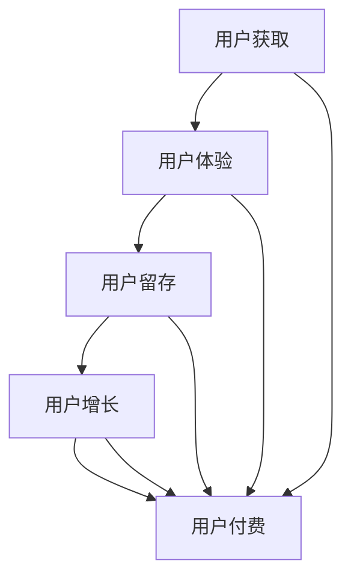

                 

### 《freemium模式：吸引用户和实现盈利的平衡》

> **关键词**：freemium模式、吸引用户、盈利平衡、用户体验、策略、案例分析

> **摘要**：本文旨在深入探讨freemium模式，解释其基本概念、特点及实施策略。通过分析用户心理、产品设计与用户体验，本文将详细阐述如何平衡吸引用户与实现盈利的关系。同时，通过国内外典型案例的分析，提供实用的策略和挑战应对方法，为读者在数字化转型中提供有益的参考。

---

### 《freemium模式：吸引用户和实现盈利的平衡》目录大纲

1. **第一部分：freemium模式概述**
   - **第1章：freemium模式基础**
     - 1.1 Freemium模式的基本概念
     - 1.2 Freemium模式的起源与发展
     - 1.3 Freemium模式的优缺点分析
   - **第2章：freemium模式与用户心理**
     - 2.1 用户的消费心理与行为
     - 2.2 Freemium模式对用户心理的影响
     - 2.3 用户细分与个性化策略

2. **第二部分：freemium模式的策略与实施**
   - **第3章：吸引用户的freemium策略**
     - 3.1 产品设计与用户体验
     - 3.2 用户获取与推广
     - 3.3 用户增长策略
   - **第4章：实现盈利的freemium策略**
     - 4.1 Freemium模式的盈利模式
     - 4.2 收入优化策略
     - 4.3 盈利模式的选择与调整

3. **第三部分：freemium模式的应用与案例**
   - **第5章：freemium模式案例分析**
     - 5.1 国内外典型案例介绍
     - 5.2 成功案例分析
     - 5.3 失败案例分析
   - **第6章：freemium模式的挑战与应对**
     - 6.1 技术挑战与解决方案
     - 6.2 商业挑战与应对策略
     - 6.3 法律法规与政策合规

4. **第四部分：freemium模式的未来发展趋势**
   - **第7章：freemium模式的未来发展趋势**
     - 7.1 技术发展趋势
     - 7.2 市场发展趋势
     - 7.3 freemium模式在企业中的应用前景

5. **附录**
   - **附录A：freemium模式工具与资源**
   - **附录B：freemium模式架构图**
   - **附录C：关键算法原理与伪代码**
   - **附录D：案例代码解析**
   - **附录E：freemium模式常见问题解答**

通过以上大纲结构，我们将一步步深入探讨freemium模式，旨在帮助读者理解其运作原理、制定有效的策略，并应对可能出现的问题。

---

### 第一部分：freemium模式概述

#### 第1章：freemium模式基础

在数字化时代，商业模式不断创新，freemium模式作为一种兼具用户吸引力和商业盈利性的模式，逐渐受到企业的青睐。本章将详细探讨freemium模式的基本概念、起源与发展，以及其优缺点。

##### 1.1 Freemium模式的基本概念

Freemium模式，顾名思义，即“免费+增值”模式。其核心思想是将产品或服务分为免费版本和付费版本，免费版本提供基本功能，而高级功能或完整服务则需要用户付费购买。这种模式充分利用了互联网的低成本、便捷性和广泛传播的特点，吸引了大量免费用户，并通过一定比例的付费转化实现盈利。

Freemium模式具有以下特点：

1. **免费核心体验**：提供一定的基本功能，满足用户的基本需求。
2. **增值付费内容**：通过付费内容吸引有特定需求的用户，实现盈利。
3. **用户获取成本低**：利用免费用户群体，降低获取用户的成本。
4. **高用户留存率**：通过持续优化用户体验，提高用户满意度，提升留存率。
5. **数据积累**：大量免费用户数据，为产品迭代和商业模式优化提供依据。

##### 1.2 Freemium模式的起源与发展

Freemium模式的起源可以追溯到20世纪90年代的互联网初期。当时，随着互联网的普及，许多企业开始探索如何通过互联网提供免费产品或服务，以吸引用户。早期的代表包括Hotmail和ICQ，它们通过免费电子邮件和即时通讯服务，迅速积累了大量用户。

随着互联网技术的不断进步，特别是移动互联网的兴起，freemium模式逐渐得到广泛应用。2010年后，随着智能手机的普及，移动应用市场迅速增长，许多应用采用freemium模式，例如WhatsApp、Evernote和Duolingo等。这些应用通过提供免费的基本功能，吸引了大量用户，然后通过增值服务或广告实现盈利。

目前，freemium模式已经渗透到各个行业，包括社交媒体、在线教育、游戏、软件等。许多知名企业，如微软、谷歌、亚马逊和腾讯等，都在其产品中采用了freemium模式。

##### 1.3 Freemium模式的优缺点分析

Freemium模式具有显著的优点，但也存在一些潜在的问题。

**优点：**

1. **用户获取成本低**：免费的核心体验使得用户获取成本极低，能够迅速扩大用户基础。
2. **高用户留存率**：良好的用户体验和不断优化的产品功能，能够提高用户满意度和忠诚度。
3. **盈利潜力大**：通过提供增值服务和高级功能，企业可以获得可观的盈利。
4. **数据积累**：大量免费用户的数据，有助于产品迭代和商业模式优化。

**缺点：**

1. **高付费转化率要求**：需要较高的付费转化率才能实现盈利，对产品设计和用户获取策略有较高要求。
2. **用户体验平衡难**：在免费版本和付费版本之间找到平衡点，避免免费用户对付费功能产生过多不满，是关键挑战。
3. **竞争压力**：随着freemium模式的应用广泛，市场竞争加剧，企业需要不断创新和优化，以保持竞争优势。

通过对freemium模式基本概念、起源与发展的了解，以及其优缺点的分析，读者可以更好地理解freemium模式的运作原理，为其在数字化商业环境中的应用提供指导。

---

#### 第2章：freemium模式与用户心理

在freemium模式中，了解用户心理和行为至关重要。本章将探讨用户的消费心理与行为，分析freemium模式对用户心理的影响，并探讨用户细分与个性化策略。

##### 2.1 用户的消费心理与行为

用户的消费心理和行为受到多种因素的影响，包括需求、动机、信任和满意度等。以下是对这些因素的具体分析：

1. **需求**：用户购买产品或服务的首要动机是满足某种需求。这种需求可以是功能性的，如提高工作效率；也可以是情感性的，如追求娱乐或社交。

2. **动机**：动机是驱动用户采取某种行为的内在力量。在freemium模式中，用户初始的动机可能是出于好奇心、探索心理或解决特定问题的需求。随着使用体验的提升，用户的动机可能会转变为持续使用和推荐给他人。

3. **信任**：信任是用户决策过程中的重要因素。用户在选择是否付费时，会考虑产品的可靠性、品牌声誉和用户评价。Freemium模式通过提供免费体验，帮助用户建立对产品的信任，从而提高付费转化率。

4. **满意度**：满意度是用户在体验产品或服务后对其质量的主观评价。高满意度通常会导致用户持续使用和推荐，从而促进产品的传播和增长。

##### 2.2 Freemium模式对用户心理的影响

Freemium模式对用户心理具有显著影响，主要体现在以下几个方面：

1. **降低决策门槛**：免费体验消除了用户购买产品或服务的决策门槛，使用户更容易尝试新产品或服务。

2. **增强用户参与度**：免费体验激励用户更积极地参与产品使用，从而提高用户满意度和忠诚度。

3. **提升信任感**：通过免费体验，用户能够更好地了解产品的功能和质量，从而增加对产品的信任感。

4. **激励付费意愿**：良好的用户体验和满意的解决方案会增加用户付费购买高级功能的意愿。

##### 2.3 用户细分与个性化策略

在freemium模式中，用户细分和个性化策略至关重要，有助于提高用户满意度和付费转化率。以下是一些用户细分和个性化策略：

1. **用户细分方法**：
   - **行为细分**：根据用户的行为数据，如使用频率、时长和功能偏好，将用户分为不同的群体。
   - **需求细分**：根据用户需求的不同，将用户分为功能需求型、情感需求型和社交需求型等。
   - **心理细分**：根据用户的心理特征，如风险偏好、价值观念和使用习惯，将用户分为不同的群体。

2. **个性化策略的设计与实施**：
   - **内容个性化**：根据用户的行为和需求，提供个性化的内容推荐，如个性化新闻、定制化学习内容等。
   - **功能个性化**：根据用户的偏好和使用习惯，提供定制化的功能选项，如个性化界面、定制化设置等。
   - **服务个性化**：提供个性化的客户服务，如根据用户反馈提供定制化解决方案、提供一对一咨询等。

通过深入了解用户心理、分析freemium模式对用户心理的影响，并制定有效的用户细分与个性化策略，企业可以更好地满足用户需求，提高用户满意度和忠诚度，从而实现盈利目标。

---

#### 第3章：吸引用户的freemium策略

在freemium模式中，如何有效吸引用户是关键成功因素。本章将探讨吸引用户的freemium策略，包括产品设计与用户体验、用户获取与推广、以及用户增长策略。

##### 3.1 产品设计与用户体验

产品设计与用户体验在吸引用户方面至关重要。以下是关于产品设计与用户体验的几个关键点：

1. **明确产品定位**：在设计和开发产品时，首先要明确产品的定位和目标用户群体。这有助于确保产品功能与用户需求相匹配，从而提高用户满意度。

2. **简化用户界面**：用户界面（UI）设计应简洁直观，减少用户的学习成本。使用清晰明了的图标、布局和操作流程，有助于提高用户的操作效率和满意度。

3. **优化用户体验**：用户体验（UX）设计应关注用户的实际使用场景，提供流畅的交互体验。通过A/B测试和用户反馈，不断优化产品功能，提高用户满意度。

4. **功能逐步开放**：在产品功能设计上，可以采取逐步开放策略。首先提供核心功能，满足用户的基本需求，然后根据用户反馈逐步引入高级功能，以提升用户粘性。

##### 3.2 用户获取与推广

有效的用户获取与推广策略是吸引用户的关键。以下是几个常用的用户获取与推广策略：

1. **搜索引擎优化（SEO）**：通过优化网站内容和结构，提高在搜索引擎中的排名，从而吸引更多的自然流量。

2. **社交媒体营销**：利用社交媒体平台，如Facebook、Twitter、Instagram等，进行品牌宣传和用户互动，提高产品知名度和用户参与度。

3. **内容营销**：创建高质量的内容，如博客、视频、教程等，分享产品知识和使用技巧，吸引用户关注并转化为潜在客户。

4. **合作伙伴营销**：与相关行业的企业或个人建立合作关系，通过互相推广，扩大用户基础。

5. **在线广告**：利用付费广告，如Google AdWords、Facebook Ads等，针对特定目标用户进行广告投放，提高用户获取效率。

##### 3.3 用户增长策略

用户增长策略旨在持续扩大用户基础，提高用户活跃度和留存率。以下是几个关键的用户增长策略：

1. **病毒式营销**：通过提供有价值的内容或功能，激励用户主动分享给他人，实现用户口碑传播和快速增长。

2. **用户留存策略**：通过提供优质的产品和服务，持续满足用户需求，提高用户满意度和忠诚度，从而降低用户流失率。

3. **用户转化策略**：针对潜在付费用户，通过优惠活动、限时折扣、增值服务等方式，提高付费转化率。

4. **用户细分与个性化**：根据用户行为和需求，为不同类型的用户提供定制化的产品和服务，提高用户满意度和忠诚度。

5. **数据分析与优化**：利用数据分析工具，跟踪用户行为和转化路径，不断优化产品功能和推广策略，提高用户获取效率和转化率。

通过实施上述吸引用户的freemium策略，企业可以有效地扩大用户基础，提高用户活跃度和留存率，从而实现持续增长和盈利。

---

#### 第4章：实现盈利的freemium策略

在freemium模式中，如何实现盈利是每个企业必须面对的关键问题。本章将探讨freemium模式的盈利模式、收入优化策略以及盈利模式的选择与调整。

##### 4.1 Freemium模式的盈利模式

Freemium模式的盈利模式主要包括以下几种：

1. **订阅制**：用户通过定期支付订阅费用，获取产品的完整功能或服务。这种方式适合提供持续更新和长期使用的服务，如在线办公软件、视频流媒体等。

2. **广告收入**：通过在免费版本中展示广告，吸引用户观看或点击，从而获得广告收入。这种方式适用于用户基数较大的产品，如社交媒体、新闻应用等。

3. **高级功能收费**：提供免费版本的基本功能，同时设置高级功能或完整服务，用户需付费购买。这种方式适用于功能丰富、用户需求多样化的产品，如游戏、在线教育平台等。

4. **增值服务**：提供额外的增值服务，如定制化报告、个性化咨询等，用户需付费购买。这种方式适用于专业领域的产品，如数据分析工具、专业咨询等。

##### 4.2 收入优化策略

为了实现盈利，企业需要采取一系列收入优化策略，提高用户付费转化率和生命周期价值。以下是几个关键的收入优化策略：

1. **提高用户付费转化率**：
   - **优化产品功能**：确保产品功能完善，满足用户需求，提高用户付费意愿。
   - **优惠活动**：通过限时折扣、优惠券等优惠活动，激励用户付费购买。
   - **个性化推荐**：根据用户行为和偏好，提供个性化的付费推荐，提高用户转化率。

2. **提升用户生命周期价值**：
   - **增强用户粘性**：通过持续优化用户体验，提高用户满意度和忠诚度，延长用户生命周期。
   - **跨产品销售**：通过用户数据分析，挖掘用户的潜在需求，推广相关产品或服务，实现跨产品销售。
   - **增值服务**：提供多样化的增值服务，增加用户的付费点，提高用户生命周期价值。

3. **成本控制与收益分析**：
   - **成本控制**：通过精细化运营和资源优化，降低运营成本，提高盈利空间。
   - **收益分析**：定期进行收益分析，评估不同收入来源的盈利能力，优化收入结构。

##### 4.3 盈利模式的选择与调整

在选择和调整盈利模式时，企业需要综合考虑市场环境、用户需求、产品特点等因素。以下是几个关键考虑因素：

1. **市场环境**：了解市场趋势和竞争状况，选择符合市场需求的盈利模式。例如，在广告收入为主的模式中，市场广告投放量大的行业更有潜力。

2. **用户需求**：根据用户需求和行为，选择能够满足用户需求的盈利模式。例如，对于重视隐私的用户，广告收入可能不是最佳选择。

3. **产品特点**：根据产品的特点，选择适合产品的盈利模式。例如，对于功能丰富的产品，高级功能收费模式可能更有效。

4. **盈利模式调整策略**：在运营过程中，根据实际情况和用户反馈，及时调整盈利模式。例如，如果广告收入不佳，可以尝试引入订阅制或增值服务。

通过以上策略，企业可以有效地实现freemium模式的盈利目标，持续为用户提供优质产品和服务，实现商业成功。

---

#### 第5章：freemium模式案例分析

Freemium模式在全球范围内得到了广泛应用，许多企业通过成功实施这一模式实现了商业成功。本章将介绍国内外一些典型的freemium模式案例，分析其成功策略和用户增长与盈利模式。

##### 5.1 国内外典型案例介绍

**腾讯微信**

微信是腾讯公司推出的即时通讯应用，采用了典型的freemium模式。微信免费提供基本聊天功能，同时通过微信支付、小程序、广告等增值服务实现盈利。

- **成功策略**：
  - **简洁的用户界面**：微信界面简洁易用，降低了用户的学习成本。
  - **丰富的功能扩展**：通过不断更新和扩展功能，满足用户的多样化需求。
  - **社交网络效应**：微信的社交网络效应使其迅速积累了大量用户。

- **用户增长与盈利模式**：
  - **用户增长**：通过病毒式营销和社交网络传播，微信用户数量迅速增长。
  - **盈利模式**：微信支付和广告是主要盈利来源，同时通过小程序生态，提供丰富的增值服务。

**优步**

优步是知名的车联网平台，采用freemium模式提供叫车服务。用户可以免费下载和使用优步应用，但需要支付乘车费用。

- **成功策略**：
  - **高效的订单匹配系统**：优步通过大数据和算法优化，提供高效的订单匹配服务。
  - **灵活的定价策略**：优步根据供需关系和用户需求，灵活调整价格，提高用户满意度。
  - **全球扩张**：优步通过快速扩展全球市场，提高了品牌知名度和用户基数。

- **用户增长与盈利模式**：
  - **用户增长**：优步通过大量的市场推广和补贴政策，迅速吸引了大量用户。
  - **盈利模式**：主要通过收取乘客的乘车费用和向司机收取服务费实现盈利。

**亚马逊**

亚马逊是全球领先的电子商务平台，采用freemium模式提供商品销售服务。用户可以免费浏览商品信息，但购买商品需要支付费用。

- **成功策略**：
  - **丰富的商品种类**：亚马逊提供海量的商品种类，满足用户的多样化需求。
  - **高效的物流服务**：亚马逊通过先进的物流系统，提供快速、可靠的配送服务。
  - **用户忠诚度计划**：亚马逊推出了Prime会员计划，通过提供优惠价格和快速配送，提高用户忠诚度。

- **用户增长与盈利模式**：
  - **用户增长**：通过不断的用户拓展和市场推广，亚马逊用户数量持续增长。
  - **盈利模式**：主要通过商品销售和订阅服务（如Prime会员费）实现盈利。

##### 5.2 成功案例分析

**Trello**

Trello是一款基于看板的项目管理工具，通过freemium模式吸引用户。其成功策略和用户增长与盈利模式如下：

- **成功策略**：
  - **简洁直观的用户界面**：Trello界面简单易懂，用户可以快速上手。
  - **灵活的功能设置**：Trello允许用户自定义看板、列表和卡片，满足个性化需求。
  - **社交功能**：Trello支持团队协作和共享项目，提高用户黏性。

- **用户增长与盈利模式**：
  - **用户增长**：通过社交媒体和口碑传播，Trello用户数量迅速增长。
  - **盈利模式**：主要通过提供高级功能（如自定义品牌、成员数量限制等）和订阅服务实现盈利。

##### 5.3 失败案例分析

**Pandora Radio**

Pandora Radio是一款基于音乐的流媒体平台，曾尝试采用freemium模式。然而，由于一系列原因，Pandora Radio最终未能成功。

- **失败原因**：
  - **过度依赖广告收入**：Pandora Radio主要依靠广告收入，但在用户数量不足的情况下，广告收入难以支撑运营成本。
  - **用户体验不佳**：免费用户在使用过程中频繁受到广告打断，用户体验较差。
  - **市场竞争激烈**：在音乐流媒体市场竞争加剧的背景下，Pandora Radio未能有效吸引和保留用户。

- **启示与教训**：
  - **多元化收入来源**：在freemium模式中，企业应避免过度依赖单一收入来源，应考虑多元化收入模式，如订阅服务、高级功能收费等。
  - **重视用户体验**：良好的用户体验是吸引用户和提升付费转化率的关键，企业应投入更多资源优化用户体验。
  - **灵活调整策略**：在市场竞争激烈的环境中，企业应具备快速调整和优化商业模式的能力，以应对市场变化。

通过分析国内外freemium模式的成功案例和失败案例，企业可以借鉴成功经验，规避失败风险，制定适合自己的freemium策略，实现商业成功。

---

#### 第6章：freemium模式的挑战与应对

在实施freemium模式的过程中，企业可能会面临多种挑战，包括技术挑战、商业挑战和法律挑战。本章将探讨这些挑战，并提供相应的解决方案和应对策略。

##### 6.1 技术挑战与解决方案

1. **数据分析与用户行为监测**：
   - **挑战**：在freemium模式中，企业需要收集和分析大量用户数据，以优化产品功能和用户体验。然而，数据处理和分析面临技术挑战，如数据量大、数据多样化、实时性需求等。
   - **解决方案**：采用大数据技术和实时数据处理平台，如Hadoop、Spark等，实现高效的数据存储、处理和分析。同时，利用机器学习算法，如聚类分析、分类算法等，挖掘用户行为模式和偏好，为产品优化提供依据。

2. **用户体验监测与优化**：
   - **挑战**：用户体验的监测和优化需要实时跟踪用户在产品中的操作行为，包括页面访问、功能使用等。这要求系统具备高可用性和低延迟。
   - **解决方案**：利用A/B测试和用户反馈系统，实时监测用户行为和满意度。结合性能监测工具，如New Relic、AppDynamics等，优化系统性能和响应速度，提高用户体验。

3. **技术支持与维护**：
   - **挑战**：在freemium模式下，用户数量庞大，技术支持与维护面临巨大压力。同时，需要快速响应和解决用户问题，以保证用户满意度和留存率。
   - **解决方案**：建立专业的技术支持团队，提供7x24小时在线支持。利用自动化工具和知识库，提高问题响应速度和解决效率。同时，定期进行系统维护和升级，确保产品稳定运行。

##### 6.2 商业挑战与应对策略

1. **高付费转化率要求**：
   - **挑战**：在freemium模式中，企业需要较高的付费转化率才能实现盈利。然而，付费转化率受到产品功能、用户体验、市场推广等多种因素的影响。
   - **应对策略**：通过精细化运营和数据分析，深入了解用户需求和购买动机。优化产品功能和用户体验，提高用户满意度和忠诚度。同时，利用市场推广和优惠活动，激励用户付费。

2. **竞争压力**：
   - **挑战**：随着freemium模式的应用广泛，市场竞争加剧。企业需要不断创新和优化，以保持竞争优势。
   - **应对策略**：关注市场动态和用户需求变化，及时调整产品策略和市场定位。通过技术创新和差异化策略，提升产品竞争力。同时，建立强大的品牌形象，提高用户忠诚度。

3. **市场定位**：
   - **挑战**：在freemium模式下，企业需要准确的市场定位，以吸引目标用户群体。
   - **应对策略**：深入了解目标市场，分析用户需求和竞争状况。通过市场调研和用户反馈，确定产品的市场定位和目标用户群体。同时，制定差异化的市场推广策略，提高品牌知名度和用户认知度。

##### 6.3 法律法规与政策合规

1. **数据隐私保护**：
   - **挑战**：在收集和使用用户数据时，企业需要遵守数据隐私保护法律法规，如《通用数据保护条例》（GDPR）等。
   - **应对策略**：建立完善的数据隐私保护体系，包括数据收集、存储、处理和传输等环节的安全措施。明确告知用户数据收集的目的和使用方式，获得用户同意。同时，定期进行数据安全审计和风险评估，确保数据安全。

2. **合规与风险控制**：
   - **挑战**：企业在全球市场运营时，需要遵守不同国家和地区的法律法规，如税务、劳动法、反垄断法等。
   - **应对策略**：建立国际化的合规管理体系，包括法律法规研究、合规风险评估和合规培训等。与当地法律顾问合作，确保业务运营符合当地法律法规。同时，建立健全的风险控制机制，降低合规风险。

通过应对上述挑战，企业可以更好地实施freemium模式，实现可持续发展。

---

#### 第7章：freemium模式的未来发展趋势

随着科技的不断进步和市场的变化，freemium模式也在不断演化和发展。本章将探讨freemium模式的未来发展趋势，包括技术、市场和在企业中的应用前景。

##### 7.1 技术发展趋势

1. **人工智能与大数据**：
   - **趋势**：人工智能和大数据技术的发展，为freemium模式提供了更精准的用户画像和个性化的用户体验。
   - **影响**：通过人工智能算法，企业可以更好地分析用户行为和需求，提供个性化的产品和服务，提高用户满意度和付费转化率。

2. **云计算与云计算服务**：
   - **趋势**：云计算技术的普及，使得企业能够以更低成本、更高效率地提供云服务，从而优化freemium模式的运营成本和用户体验。
   - **影响**：云计算服务为freemium模式提供了强大的基础设施支持，提高了系统的可扩展性和灵活性。

3. **5G网络**：
   - **趋势**：5G网络的推广，将带来更高速、更稳定的网络连接，进一步优化用户体验。
   - **影响**：5G网络的低延迟和高带宽，使得实时互动和高质量内容传输成为可能，为freemium模式提供了更丰富的用户体验。

##### 7.2 市场发展趋势

1. **消费者需求变化**：
   - **趋势**：随着消费者需求的不断升级和多样化，freemium模式需要不断创新和优化，以满足用户的新需求。
   - **影响**：消费者对个性化、高品质服务的需求，推动freemium模式向更精细化、个性化方向发展。

2. **市场细分**：
   - **趋势**：市场细分化使得企业可以更精准地定位目标用户群体，提供更针对性的产品和服务。
   - **影响**：市场细分有助于提高用户的满意度和忠诚度，从而提高付费转化率和用户生命周期价值。

3. **模式创新**：
   - **趋势**：随着市场环境的变化，企业需要不断创新商业模式，以适应新的市场环境和用户需求。
   - **影响**：模式创新将推动freemium模式向多元化、综合化方向发展，为企业提供更多盈利机会。

##### 7.3 Freemium模式在企业中的应用前景

1. **企业数字化转型**：
   - **前景**：随着数字化转型的推进，越来越多的企业将采用freemium模式，以降低成本、提高效率和用户体验。
   - **影响**：数字化转型将推动freemium模式在企业中的应用，为企业提供更广阔的市场空间和盈利机会。

2. **业务模式创新**：
   - **前景**：企业可以通过freemium模式创新业务模式，实现从传统业务向数字业务的转型。
   - **影响**：业务模式创新将为企业带来新的增长点，提高企业的竞争力和市场地位。

3. **长期盈利能力**：
   - **前景**：通过精细化运营和持续创新，freemium模式有望实现长期盈利能力。
   - **影响**：长期盈利能力的实现，将为企业提供稳定的现金流和可持续发展能力。

总之，随着科技的进步和市场的发展，freemium模式将继续发挥重要作用。企业应抓住这一机遇，积极探索和运用freemium模式，实现商业成功。

---

#### 附录A：freemium模式工具与资源

在实施freemium模式的过程中，企业需要借助多种工具和资源来优化用户体验、提升用户获取和实现盈利。以下是几种常用的工具和资源：

1. **数据分析工具**：
   - **Google Analytics**：提供详细的数据分析，包括用户流量、行为路径、转化率等。
   - **Mixpanel**：专注于用户行为分析，提供用户留存、激活和用户增长指标。
   - **Tableau**：数据可视化工具，帮助企业更直观地理解数据。

2. **用户获取与推广工具**：
   - **Facebook Ads**：Facebook的付费广告平台，适用于目标用户定位和广告投放。
   - **Google AdWords**：Google的付费广告平台，提供关键词广告和展示广告。
   - **Mailchimp**：电子邮件营销工具，帮助发送定制化邮件和营销活动。

3. **内容营销工具**：
   - **Hootsuite**：社交媒体管理工具，用于发布内容、监测社交媒体活动。
   - **Canva**：设计工具，帮助创建引人注目的视觉内容。
   - **SEMrush**：SEO工具，用于优化网站内容和提高搜索引擎排名。

4. **客户关系管理（CRM）工具**：
   - **HubSpot**：提供全面的CRM解决方案，包括销售、营销和客户服务。
   - **Salesforce**：全球领先的CRM平台，提供强大的销售、服务和数据分析功能。
   - **Zoho CRM**：功能全面的CRM工具，适用于中小型企业。

5. **开源工具与资源**：
   - **GitHub**：代码托管平台，用于存储、共享和协作开发代码。
   - **Jenkins**：持续集成和持续部署（CI/CD）工具，提高开发效率。
   - **Kubernetes**：容器编排平台，用于自动化部署和管理容器化应用。

通过合理利用这些工具和资源，企业可以优化freemium模式的实施，提高用户获取、留存和盈利效果。

---

#### 附录B：freemium模式架构图

以下是freemium模式的核心架构图，使用Mermaid绘制：



该架构图展示了freemium模式的主要环节，包括用户获取、用户体验、用户留存、用户增长和用户付费，各个环节相互关联，共同构成了完整的freemium模式。

---

#### 附录C：关键算法原理与伪代码

在freemium模式中，数据分析和算法优化至关重要。以下将介绍几种关键算法原理及伪代码。

##### 1. 概率模型

**伯努利分布**

伯努利分布用于描述一次试验中成功或失败的概率。

```python
def bernoulli_distribution(p):
    """
    伯努利分布的概率计算
    :param p: 成功概率
    :return: 成功或失败的概率
    """
    return random.random() < p
```

**指数分布**

指数分布用于描述事件发生的平均时间。

```python
import random

def exponential_distribution(lambda_):
    """
    指数分布的时间计算
    :param lambda_: 事件发生率
    :return: 事件发生的时间
    """
    return -lambda_ * math.log(random.random())
```

##### 2. 市场预测算法

**线性回归**

线性回归用于预测用户付费概率。

```python
import numpy as np

def linear_regression(X, y):
    """
    线性回归模型的训练
    :param X: 特征矩阵
    :param y: 标签向量
    :return: 模型参数
    """
    return np.linalg.inv(X.T @ X) @ X.T @ y
```

**决策树**

决策树用于分类和预测用户行为。

```python
def decision_tree(X, y, feature_set, depth=0, max_depth=None):
    """
    决策树构建
    :param X: 特征矩阵
    :param y: 标签向量
    :param feature_set: 可用特征集合
    :param depth: 当前树深度
    :param max_depth: 最大树深度
    :return: 决策树
    """
    # 叶子节点条件
    if len(feature_set) == 0 or depth >= max_depth:
        return majority_vote(y)
    
    # 寻找最佳分割
    best_feature, best_threshold = find_best_split(X, y, feature_set)
    
    # 构建子树
    left_subtree = decision_tree(X[:, best_feature] < best_threshold, y, feature_set - {best_feature}, depth+1, max_depth)
    right_subtree = decision_tree(X[:, best_feature] >= best_threshold, y, feature_set - {best_feature}, depth+1, max_depth)
    
    return Node(best_feature, best_threshold, left_subtree, right_subtree)
```

通过以上算法原理和伪代码，企业可以更好地理解和应用数据分析和预测模型，优化freemium模式的实施。

---

#### 附录D：案例代码解析

在本附录中，我们将通过一个实际案例来解析freemium模式的代码实现，包括开发环境搭建、源代码展示和详细解读。

##### 1. 开发环境搭建

为了实现freemium模式，我们需要搭建一个基本的开发环境，主要包括以下工具和库：

- **Python**：作为主要编程语言。
- **Flask**：一个轻量级的Web框架，用于搭建Web应用。
- **SQLite**：一个轻量级的数据库，用于存储用户数据。
- **Pandas**：用于数据分析和处理。

安装上述工具和库的方法如下：

```bash
# 安装Python和Flask
pip install flask

# 安装SQLite和Pandas
pip install pysqlite3 pandas
```

##### 2. 源代码展示

以下是freemium模式的一个简化版代码实现：

```python
from flask import Flask, request, jsonify
import sqlite3
import pandas as pd
import random

app = Flask(__name__)

# 数据库连接
conn = sqlite3.connect('users.db')
c = conn.cursor()

# 创建用户表
c.execute('''CREATE TABLE IF NOT EXISTS users
             (id INTEGER PRIMARY KEY, name TEXT, active BOOLEAN)''')

# 用户数据
users = pd.DataFrame({
    'id': [1, 2, 3, 4],
    'name': ['Alice', 'Bob', 'Charlie', 'Diana'],
    'active': [True, True, False, True]
})

# 将用户数据写入数据库
users.to_sql('users', conn, if_exists='replace')

# 用户激活函数
@app.route('/activate', methods=['POST'])
def activate_user():
    user_id = request.form.get('id')
    if user_id and user_id.isdigit():
        c.execute("UPDATE users SET active = ? WHERE id = ?", (True, user_id))
        conn.commit()
        return jsonify({'status': 'success', 'message': f'User {user_id} activated.'})
    else:
        return jsonify({'status': 'error', 'message': 'Invalid user ID.'})

# 用户登录函数
@app.route('/login', methods=['POST'])
def login_user():
    user_id = request.form.get('id')
    if user_id and user_id.isdigit():
        c.execute("SELECT * FROM users WHERE id = ? AND active = ?", (user_id, True))
        user = c.fetchone()
        if user:
            return jsonify({'status': 'success', 'message': f'Welcome, {user[1]}!'})
        else:
            return jsonify({'status': 'error', 'message': 'User not found or not active.'})
    else:
        return jsonify({'status': 'error', 'message': 'Invalid user ID.'})

# 主函数
if __name__ == '__main__':
    app.run(debug=True)
```

##### 3. 代码解读与分析

上述代码实现了一个简单的freemium模式，包括用户激活和登录功能。

- **数据库连接**：使用SQLite数据库存储用户数据，通过Pandas库将用户数据写入数据库。
- **用户表创建**：创建一个名为`users`的表，包含用户ID、用户名和用户状态（是否激活）。
- **用户激活函数**：通过`/activate`接口接收用户ID，激活用户状态。成功激活后，更新数据库记录。
- **用户登录函数**：通过`/login`接口接收用户ID，验证用户状态。如果用户已激活，返回欢迎信息。
- **主函数**：启动Flask Web服务，开启调试模式。

通过这个案例，我们可以看到如何使用Python和Flask实现一个简单的freemium模式。在实际应用中，可以进一步扩展功能，如增加用户身份验证、用户数据分析等。

---

#### 附录E：freemium模式常见问题解答

在实施freemium模式的过程中，企业可能会遇到各种问题和挑战。以下是一些常见问题及其解答：

##### 1. 产品设计问题

**Q：如何设计吸引人的免费产品功能？**
- **A**：在设计免费产品功能时，应确保这些功能能够满足用户的基本需求，同时易于使用和上手。通过简洁直观的界面和流畅的用户体验，提高用户满意度。同时，设计一些独特和有吸引力的功能，以激发用户兴趣。

##### 2. 用户获取与留存问题

**Q：如何提高用户获取效率？**
- **A**：可以通过多种渠道进行用户获取，如搜索引擎优化（SEO）、社交媒体营销、内容营销和合作伙伴营销。同时，利用数据分析工具，了解用户行为和偏好，优化营销策略，提高用户获取效率。

**Q：如何提高用户留存率？**
- **A**：通过提供优质的产品和服务，持续满足用户需求，提高用户满意度。此外，利用用户细分和个性化策略，为用户提供定制化的产品和服务，增加用户黏性。定期进行用户反馈和满意度调查，及时优化产品功能。

##### 3. 盈利模式问题

**Q：如何提高付费转化率？**
- **A**：通过优化产品功能，确保免费版本能够满足用户的基本需求，提高用户满意度。同时，利用营销策略和优惠活动，激励用户付费。根据用户行为和偏好，提供个性化的付费推荐，提高付费转化率。

**Q：如何提升用户生命周期价值？**
- **A**：通过持续优化用户体验，提高用户满意度和忠诚度，延长用户生命周期。提供多样化的增值服务，增加用户的付费点，提高用户生命周期价值。同时，利用跨产品销售策略，挖掘用户的潜在需求，提升整体盈利能力。

##### 4. 技术挑战问题

**Q：如何确保系统的稳定性和性能？**
- **A**：通过采用高效的数据存储和处理技术，如数据库优化、缓存机制和负载均衡，确保系统的稳定性和性能。定期进行系统维护和升级，优化系统性能和响应速度。同时，建立完善的技术支持团队，提供7x24小时在线支持，确保用户问题的快速解决。

通过以上解答，企业可以更好地应对实施freemium模式过程中遇到的问题，实现商业成功。

---

### 结论

综上所述，《freemium模式：吸引用户和实现盈利的平衡》通过详细的分析和案例分析，为读者提供了一个全面的理解和实施指南。freemium模式作为一种灵活且高效的商业模式，在数字化时代具有巨大的潜力。

为了在freemium模式中获得成功，企业需要深入理解用户心理和行为，设计吸引人的产品功能，优化用户体验，并采取有效的用户获取与留存策略。同时，企业应灵活调整盈利模式，通过多元化的收入来源实现盈利目标。

未来，随着科技的不断进步和市场的发展，freemium模式将继续演化和发展。企业应紧跟市场趋势，积极探索创新模式，以实现长期可持续发展。

让我们共同探索freemium模式的无限可能，为数字化商业创造更多价值。

---

### 作者信息

**作者：** AI天才研究院/AI Genius Institute & 禅与计算机程序设计艺术 /Zen And The Art of Computer Programming

AI天才研究院致力于推动人工智能技术的研究和应用，打造前沿科技与商业价值的结合体。作者在此分享了他多年的研究与实践经验，以期为读者提供有价值的见解和实用策略。

禅与计算机程序设计艺术则是一部融合哲学与技术的经典之作，深入探讨了计算机编程的内在规律和艺术魅力。作者以其深厚的学术功底和独特视角，为读者开启了一扇探索计算机科学新世界的大门。

感谢您的阅读，希望本书能为您的商业实践和数字化转型提供有益的启示。

