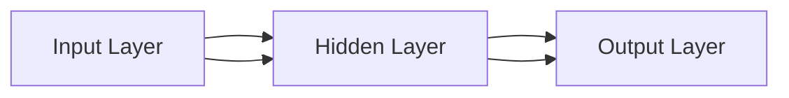

                 

# 【AI大数据计算原理与代码实例讲解】数据挖掘

> **关键词**：AI、大数据、数据挖掘、机器学习、深度学习、Spark、Hadoop、TensorFlow、PyTorch

> **摘要**：
本文将深入探讨AI与大数据的融合，特别是在数据挖掘领域中的应用。通过详细讲解AI大数据计算原理、数据预处理与特征工程、机器学习算法与模型、AI大数据计算流程与性能优化、AI大数据应用实例以及未来发展趋势，本文旨在帮助读者全面理解AI大数据计算的核心概念和实践方法。代码实例部分将展示如何使用Spark、Hadoop、TensorFlow和PyTorch进行实际的数据挖掘任务。

## 目录大纲

### 第一部分：AI大数据计算原理基础

#### 第1章：AI与大数据简介

- **1.1 AI与大数据的融合**
  - **1.1.1 大数据的定义与特点**
  - **1.1.2 AI在数据处理中的角色**
  - **1.1.3 AI与大数据的关系及趋势**

- **1.2 数据挖掘的基本概念**
  - **1.2.1 数据挖掘的定义**
  - **1.2.2 数据挖掘的过程**
  - **1.2.3 数据挖掘的应用领域**

- **1.3 大数据处理技术概述**
  - **1.3.1 分布式计算技术**
  - **1.3.2 大数据存储技术**
  - **1.3.3 大数据管理技术**

- **1.4 AI大数据计算框架**
  - **1.4.1 Hadoop生态圈**
  - **1.4.2 Spark生态圈**
  - **1.4.3 Flink生态圈**

#### 第2章：数据预处理与特征工程

- **2.1 数据预处理**
  - **2.1.1 数据清洗**
  - **2.1.2 数据集成**
  - **2.1.3 数据转换**

- **2.2 特征工程**
  - **2.2.1 特征选择**
  - **2.2.2 特征提取**
  - **2.2.3 特征转换**

- **2.3 特征重要性分析**
  - **2.3.1 特征重要性评估方法**
  - **2.3.2 特征重要性可视化**

#### 第3章：机器学习算法与模型

- **3.1 机器学习基本算法**
  - **3.1.1 监督学习**
  - **3.1.2 无监督学习**
  - **3.1.3 强化学习**

- **3.2 常见机器学习模型**
  - **3.2.1 线性回归模型**
  - **3.2.2 决策树模型**
  - **3.2.3 支持向量机**
  - **3.2.4 集成模型**

- **3.3 深度学习模型**
  - **3.3.1 神经网络基础**
  - **3.3.2 卷积神经网络**
  - **3.3.3 循环神经网络**

#### 第4章：AI大数据计算流程与性能优化

- **4.1 AI大数据计算流程**
  - **4.1.1 计算流程概述**
  - **4.1.2 数据流模型**
  - **4.1.3 计算资源调度**

- **4.2 性能优化方法**
  - **4.2.1 并行计算**
  - **4.2.2 内存优化**
  - **4.2.3 网络优化**
  - **4.2.4 混合计算架构**

- **4.3 代码实例讲解**
  - **4.3.1 Spark与Hadoop代码实例**
  - **4.3.2 TensorFlow与PyTorch代码实例**

#### 第5章：AI大数据应用实例

- **5.1 金融行业应用**
  - **5.1.1 信用评分模型**
  - **5.1.2 风险管理模型**
  - **5.1.3 投资组合优化模型**

- **5.2 零售行业应用**
  - **5.2.1 客户行为分析**
  - **5.2.2 销售预测模型**
  - **5.2.3 库存优化模型**

- **5.3 医疗行业应用**
  - **5.3.1 疾病预测模型**
  - **5.3.2 医疗影像分析**
  - **5.3.3 药物研发**

#### 第6章：AI大数据计算中的挑战与未来趋势

- **6.1 挑战与解决方案**
  - **6.1.1 数据质量挑战**
  - **6.1.2 模型可解释性挑战**
  - **6.1.3 安全性与隐私保护挑战**

- **6.2 未来发展趋势**
  - **6.2.1 增强学习在数据挖掘中的应用**
  - **6.2.2 联邦学习与隐私保护**
  - **6.2.3 大数据处理技术的发展趋势**

#### 附录

- **附录A：常用数据挖掘工具**

  - **A.1 Spark与Hadoop工具使用**
    - **A.1.1 Spark的安装与配置**
    - **A.1.2 Hadoop的安装与配置**

  - **A.2 机器学习框架使用**
    - **A.2.1 TensorFlow使用入门**
    - **A.2.2 PyTorch使用入门**<|less|>## 第一部分：AI大数据计算原理基础

### 第1章：AI与大数据简介

#### 1.1 AI与大数据的融合

##### 1.1.1 大数据的定义与特点

大数据（Big Data）通常指的是数据量巨大、种类繁多、速度极快、价值密度低的数据集合。Gartner将其定义为“大数据是高容量、高速度、高多样性数据源中提取价值的过程”。大数据具有以下四个主要特点，即4V：

1. **Volume（数据量）**：大数据量级通常达到EB（艾字节）级别，这是传统数据库和数据处理系统难以处理的。
2. **Velocity（速度）**：大数据处理需要快速响应，以实时或接近实时的速度进行数据收集、存储和分析。
3. **Variety（多样性）**：大数据来源广泛，包括结构化、半结构化和非结构化数据，如文本、图像、音频、视频等。
4. **Value（价值）**：大数据的价值密度低，意味着数据中蕴含的价值相对较低，需要通过高级的数据处理和分析技术来挖掘。

##### 1.1.2 AI在数据处理中的角色

人工智能（AI）在数据处理中扮演着至关重要的角色，它可以实现自动化数据分析和决策支持，具体包括：

1. **数据预处理**：AI算法能够自动完成数据清洗、数据整合、缺失值填补等任务。
2. **特征工程**：通过AI算法，可以自动提取数据中的有效特征，提高模型性能。
3. **预测模型**：AI算法能够建立预测模型，如回归、分类、聚类等，从数据中提取有用信息。
4. **数据可视化**：AI可以帮助构建交互式的数据可视化工具，使得数据分析更加直观。

##### 1.1.3 AI与大数据的关系及趋势

AI与大数据的关系是相辅相成的。AI技术依赖于大数据来训练模型，而大数据则为AI提供了丰富的训练资源。以下是一些AI与大数据融合的趋势：

1. **增强学习与实时数据**：随着增强学习算法的发展，实时数据的处理变得更加重要。
2. **深度学习与大规模数据**：深度学习算法能够处理大规模数据，从而实现更高的准确性和效率。
3. **联邦学习与隐私保护**：为了解决隐私问题，联邦学习等分布式学习方法逐渐得到关注。
4. **云计算与边缘计算**：云计算提供了强大的计算资源，而边缘计算则能够实现数据的实时处理和传输。

##### 1.1.4 AI与大数据融合的应用场景

AI与大数据融合的应用场景非常广泛，以下是一些典型的应用：

1. **金融领域**：利用大数据和AI进行风险评估、信用评分、欺诈检测等。
2. **医疗健康**：通过AI分析海量医疗数据，实现疾病预测、个性化治疗等。
3. **零售行业**：利用大数据和AI进行客户行为分析、销售预测、库存优化等。
4. **交通领域**：利用AI和大数据进行智能交通管理、车辆调度等。
5. **制造行业**：通过AI和大数据进行生产优化、故障预测、质量检测等。

#### 1.2 数据挖掘的基本概念

##### 1.2.1 数据挖掘的定义

数据挖掘（Data Mining）是指从大量数据中提取隐藏的、有价值的模式和知识的过程。它通常包括以下步骤：

1. **数据收集**：收集数据，包括内部数据和外部数据。
2. **数据预处理**：清洗、转换和整合数据，以提高数据质量。
3. **数据分析**：利用统计方法、机器学习和深度学习算法分析数据。
4. **知识发现**：从数据中提取有用模式和知识。
5. **知识应用**：将发现的模式应用于决策支持、业务优化等。

##### 1.2.2 数据挖掘的过程

数据挖掘过程可以分为以下六个阶段：

1. **业务理解**：明确挖掘目标和需求。
2. **数据理解**：收集数据，进行数据探索和分析。
3. **数据准备**：处理数据，包括数据清洗、集成、转换和归一化。
4. **模型建立**：选择合适的算法建立模型。
5. **模型评估**：评估模型性能，包括交叉验证、模型选择和调整等。
6. **部署和应用**：将模型应用于实际业务，持续监控和优化。

##### 1.2.3 数据挖掘的应用领域

数据挖掘应用广泛，涵盖了许多行业和领域：

1. **商业智能**：通过数据挖掘帮助企业进行市场分析、客户关系管理和业务流程优化。
2. **金融**：用于风险管理、信用评估、欺诈检测和投资分析。
3. **医疗**：用于疾病预测、药物研发、医学影像分析和健康监测。
4. **零售**：用于客户行为分析、销售预测和库存管理。
5. **交通**：用于交通流量分析、车辆调度和事故预测。
6. **教育**：用于个性化学习、学生成绩预测和学校管理优化。

#### 1.3 大数据处理技术概述

##### 1.3.1 分布式计算技术

分布式计算技术是大数据处理的核心，它允许将大规模的数据集分布到多个节点上进行并行处理。以下是一些常用的分布式计算技术：

1. **MapReduce**：由Google提出，是一种基于数据分区和任务分发的分布式数据处理模型。
2. **Spark**：一个开源的分布式计算引擎，提供了高效的数据处理和机器学习库。
3. **Flink**：一个流处理和批处理统一的开源分布式计算引擎。
4. **Hadoop**：一个基于分布式文件系统（HDFS）和MapReduce框架的大数据处理平台。

##### 1.3.2 大数据存储技术

大数据存储技术需要能够处理大规模、多样性和快速变化的数据。以下是一些常用的存储技术：

1. **HDFS（Hadoop Distributed File System）**：一个分布式文件系统，用于存储大规模数据。
2. **NoSQL数据库**：如MongoDB、Cassandra和HBase，适用于非结构化或半结构化数据存储。
3. **NewSQL**：如Google Spanner和Amazon Redshift，结合了SQL的易用性和NoSQL的扩展性。
4. **云存储**：如Amazon S3、Google Cloud Storage和Microsoft Azure Blob Storage，提供了弹性和可扩展的存储解决方案。

##### 1.3.3 大数据管理技术

大数据管理技术包括数据集成、数据仓库、数据治理和数据安全等方面：

1. **数据集成**：通过ETL（Extract, Transform, Load）工具将不同来源的数据集成到一起。
2. **数据仓库**：用于存储、管理和分析大量数据的集中式系统。
3. **数据治理**：确保数据质量、合规性和安全性的过程。
4. **数据安全**：保护数据不被未授权访问、篡改或泄露。

#### 1.4 AI大数据计算框架

##### 1.4.1 Hadoop生态圈

Hadoop生态圈是一个开源的大数据处理平台，包括以下核心组件：

1. **Hadoop分布式文件系统（HDFS）**：用于存储大规模数据。
2. **MapReduce**：用于分布式数据处理。
3. **YARN**：资源调度框架，负责管理计算资源。
4. **Hive**：基于Hadoop的数据仓库，用于数据分析和查询。
5. **HBase**：一个分布式列存储数据库，适用于实时数据分析。
6. **Pig**：一个基于Hadoop的数据处理平台，用于数据转换和提取。
7. **Spark**：一个开源的分布式计算引擎，用于数据分析和机器学习。

##### 1.4.2 Spark生态圈

Spark生态圈是一个强大的分布式计算引擎，包括以下组件：

1. **Spark Core**：Spark的核心组件，提供内存计算和分布式数据集。
2. **Spark SQL**：用于结构化数据分析和查询。
3. **Spark Streaming**：用于实时数据流处理。
4. **MLlib**：提供机器学习算法和库。
5. **GraphX**：用于大规模图处理。
6. **Spark R**：用于R语言的交互式数据分析。

##### 1.4.3 Flink生态圈

Flink生态圈是一个流处理和批处理统一的开源分布式计算引擎，包括以下组件：

1. **Flink Core**：提供流处理和批处理的核心功能。
2. **DataStream API**：用于数据流处理。
3. **Table API**：用于表处理和数据查询。
4. **Gelly**：用于图处理。
5. **ML**：提供机器学习算法和库。
6. **Flink SQL**：用于结构化数据分析和查询。

### 总结

AI与大数据的融合在数据挖掘领域带来了巨大的变革。通过分布式计算技术、大数据存储技术和大数据管理技术，我们可以有效地处理和分析海量数据。AI技术在数据预处理、特征工程、预测模型等方面发挥着重要作用，使得数据挖掘变得更加高效和智能化。Hadoop、Spark和Flink等大数据计算框架为数据挖掘提供了强大的工具和平台，助力各行业实现数据驱动的决策和创新。在接下来的章节中，我们将进一步探讨数据预处理与特征工程、机器学习算法与模型等关键内容。|>## 第2章：数据预处理与特征工程

#### 2.1 数据预处理

数据预处理是数据挖掘过程中至关重要的一步，它的目的是将原始数据进行清洗、转换和集成，以便后续的特征工程和模型训练。以下是一些常见的数据预处理任务：

##### 2.1.1 数据清洗

数据清洗是数据预处理中最基础也是最重要的一步，其目的是消除数据中的错误、异常和重复值。数据清洗主要包括以下几种方法：

1. **缺失值处理**：缺失值的处理方法有删除、填充和插值等。
   - **删除**：删除含有缺失值的记录，适用于缺失值比例较小的情况。
   - **填充**：使用平均值、中位数、众数或特定值（如0或-1）进行填充，适用于缺失值比例较小的情况。
   - **插值**：使用插值方法（如线性插值、高斯插值等）来填补缺失值，适用于缺失值比例较大的情况。
   
2. **异常值处理**：异常值是指那些偏离大多数数据的值，可能由数据录入错误、测量误差或真实异常值引起。异常值处理方法有删除、替换和保留等。
   - **删除**：删除异常值，适用于异常值数量较少且影响较大的情况。
   - **替换**：使用统计方法（如平均值、中位数等）或插值方法来替换异常值，适用于异常值数量较多但影响较小的情况。
   - **保留**：保留异常值，适用于异常值对结果有重要影响的情况。

3. **重复值处理**：删除重复的数据记录，以避免数据冗余。

##### 2.1.2 数据集成

数据集成是将来自多个源的数据合并到一个统一的格式中，以便后续处理。数据集成可能面临以下挑战：

1. **数据源格式差异**：不同数据源可能有不同的数据格式，如文本、XML、JSON等，需要进行统一转换。
2. **数据类型不兼容**：不同数据源可能有不同的数据类型，如整数、浮点数、字符串等，需要进行类型转换。
3. **数据缺失**：某些数据源可能不包含所有需要的数据字段，需要进行字段补全或字段替换。

数据集成的方法包括：

1. **合并**：将多个数据源中的数据按照一定规则合并，如按字段名或关键字进行合并。
2. **映射**：将不同数据源的字段映射到统一的数据模型中。
3. **合并与映射**：先合并数据，然后对合并后的数据进行字段映射。

##### 2.1.3 数据转换

数据转换是将原始数据转换为适合模型训练的数据格式。数据转换包括以下几种方法：

1. **数据规范化**：通过缩放或变换将数据转换为相同的尺度，以消除不同特征之间的尺度差异。
   - **标准化**：将数据转换为均值为0，标准差为1的分布。
   - **归一化**：将数据转换为介于0和1之间的区间。

2. **编码**：将类别型数据转换为数值型数据，常用的编码方法有独热编码（One-Hot Encoding）和标签编码（Label Encoding）。

3. **特征选择**：通过选择对模型训练最有影响力的特征，减少数据维度，提高模型性能。

4. **特征工程**：通过创建新的特征或对现有特征进行变换，以增加模型的表达能力。

#### 2.2 特征工程

特征工程是数据挖掘中提高模型性能的关键步骤，它涉及从原始数据中提取和创建有用的特征，以便模型能够更好地学习和预测。以下是一些特征工程的方法：

##### 2.2.1 特征选择

特征选择是减少数据维度和消除冗余信息的过程，以提高模型性能和可解释性。特征选择方法可以分为以下几类：

1. **过滤法**：基于统计方法筛选出重要的特征，如信息增益、卡方检验等。
2. **包装法**：通过训练多个模型，逐个选择或删除特征，如递归特征消除（RFE）、遗传算法等。
3. **嵌入法**：在模型训练过程中自动选择特征，如LASSO、随机森林等。

##### 2.2.2 特征提取

特征提取是通过变换原始数据来创建新的特征，以增加模型的表达能力。以下是一些特征提取的方法：

1. **统计特征**：通过计算数据的统计指标来创建特征，如平均值、中位数、标准差等。
2. **变换特征**：通过对原始数据进行变换来创建新特征，如对数变换、指数变换等。
3. **基于规则的提取**：通过专家知识或机器学习方法提取特征，如基于聚类、关联规则的提取方法。

##### 2.2.3 特征转换

特征转换是将特征从一种形式转换为另一种形式，以提高模型性能和可解释性。以下是一些特征转换的方法：

1. **归一化和标准化**：通过缩放或变换将特征转换为相同的尺度。
2. **编码**：将类别型特征转换为数值型特征，如独热编码、标签编码等。
3. **降维**：通过降维技术减少特征数量，如主成分分析（PCA）、线性判别分析（LDA）等。

#### 2.3 特征重要性分析

特征重要性分析是评估特征对模型预测贡献大小的过程，有助于提高模型性能和可解释性。以下是一些特征重要性评估方法：

##### 2.3.1 特征重要性评估方法

1. **基于模型的评估**：通过训练模型并分析特征对模型损失函数的影响来评估特征重要性，如特征贡献率、特征权重等。
2. **基于统计的评估**：通过计算特征的统计指标（如信息增益、信息增益率、卡方值等）来评估特征重要性。
3. **基于可视化的评估**：通过可视化方法（如特征重要性图、热力图等）来评估特征重要性。

##### 2.3.2 特征重要性可视化

特征重要性可视化是将特征重要性通过图形方式展示，以帮助理解和分析特征的重要性。以下是一些常见的特征重要性可视化方法：

1. **排序图**：将特征按照重要性排序并绘制成柱状图或折线图。
2. **热力图**：使用颜色深浅表示特征的重要性，适用于多维特征的情况。
3. **特征贡献图**：显示每个特征对模型预测的贡献比例。

#### 2.4 数据预处理与特征工程的关系

数据预处理和特征工程是紧密相关的两个过程。数据预处理主要是对原始数据进行清洗、转换和集成，以确保数据质量；而特征工程则是从数据中提取和创建有用的特征，以提高模型性能。数据预处理和特征工程的关系可以概括为：

1. **数据预处理为特征工程提供高质量的数据**：通过数据预处理，可以消除数据中的错误、异常和冗余，为特征工程提供高质量的数据基础。
2. **特征工程依赖于数据预处理的结果**：特征工程的过程需要对预处理后的数据进行特征选择、提取和转换，因此数据预处理的结果直接影响特征工程的效果。
3. **特征工程可以进一步优化数据预处理**：通过特征工程，可以识别出数据中的潜在模式和规律，从而为数据预处理提供指导，进一步优化数据预处理过程。

#### 2.5 数据预处理与特征工程的重要性

数据预处理与特征工程在数据挖掘过程中起着至关重要的作用：

1. **提高模型性能**：通过数据预处理和特征工程，可以消除数据中的噪声和冗余，提取有效的特征，从而提高模型的学习能力和预测性能。
2. **降低计算成本**：通过数据预处理和特征工程，可以减少数据的维度，降低计算成本，提高模型训练的效率。
3. **提高模型可解释性**：通过特征重要性分析，可以识别出对模型预测有重要影响的关键特征，提高模型的可解释性，帮助理解模型的决策过程。
4. **提升业务价值**：通过数据预处理和特征工程，可以挖掘出数据中的潜在价值，为企业决策提供有力支持，提升业务价值。

### 总结

本章详细介绍了数据预处理与特征工程的核心概念和方法。数据预处理是数据挖掘过程中不可或缺的一步，它包括数据清洗、数据集成和数据转换等任务。特征工程则通过提取和创建新的特征，提高模型的学习能力和预测性能。特征重要性分析有助于理解和优化特征选择过程。通过本章的讲解，读者可以全面了解数据预处理与特征工程的重要性以及其实际应用场景。在下一章中，我们将深入探讨机器学习算法与模型，为数据挖掘提供更强大的工具和理论支持。|>### 第3章：机器学习算法与模型

#### 3.1 机器学习基本算法

机器学习（Machine Learning）是一门人工智能（AI）的分支，它使计算机系统能够通过数据和经验自动改进其性能。机器学习算法可以分为三类：监督学习、无监督学习和强化学习。下面将分别介绍这些基本算法。

##### 3.1.1 监督学习

监督学习（Supervised Learning）是一种机器学习范式，其中算法从标记数据（即带有正确答案的数据）中学习。其基本思想是通过训练数据集学习出一个函数或模型，用于预测新的数据点。监督学习算法通常分为以下几类：

1. **回归模型**：回归模型用于预测连续值输出。常见的回归模型包括线性回归、多项式回归、岭回归和LASSO回归等。

   - **线性回归**：假设输出值 $y$ 与输入特征 $X$ 之间存在线性关系，即 $y = \beta_0 + \beta_1X + \epsilon$。
   - **多项式回归**：将线性回归扩展到多项式形式，即 $y = \beta_0 + \beta_1X + \beta_2X^2 + ... + \beta_nX^n$。
   - **岭回归**：通过添加正则化项防止过拟合，即 $y = \beta_0 + \beta_1X + \beta_2X^2 + ... + \beta_nX^n + \lambda||\beta||_2^2$。
   - **LASSO回归**：通过添加绝对值正则化项实现特征选择，即 $y = \beta_0 + \beta_1X + \beta_2X^2 + ... + \beta_nX^n + \lambda||\beta||_1$。

2. **分类模型**：分类模型用于预测离散值输出。常见的分类模型包括逻辑回归、决策树、支持向量机和随机森林等。

   - **逻辑回归**：通过线性模型将输入映射到概率空间，即 $P(y=1|X) = \frac{1}{1 + e^{-(\beta_0 + \beta_1X_1 + ... + \beta_nX_n)}}$。
   - **决策树**：通过一系列的判定规则将数据划分为不同的类别或数值。
   - **支持向量机（SVM）**：通过找到一个最佳的超平面，将数据划分为不同的类别。
   - **随机森林**：通过构建多个决策树并投票得到最终结果。

##### 3.1.2 无监督学习

无监督学习（Unsupervised Learning）是一种机器学习范式，其中算法在没有标记数据的情况下学习数据的结构。无监督学习的目的是揭示数据中的隐藏模式和规律。常见的无监督学习算法包括：

1. **聚类算法**：聚类算法用于将数据分为多个不相交的簇，常见的聚类算法包括K-均值聚类、层次聚类和DBSCAN等。

   - **K-均值聚类**：通过迭代优化目标函数（如平方误差）将数据分为K个簇。
   - **层次聚类**：通过逐步合并或分裂簇，构建一个层次结构。
   - **DBSCAN（Density-Based Spatial Clustering of Applications with Noise）**：基于数据点的密度分布进行聚类。

2. **降维算法**：降维算法用于将高维数据映射到低维空间，常见的降维算法包括主成分分析（PCA）、线性判别分析（LDA）和t-SNE等。

   - **主成分分析（PCA）**：通过最大化数据方差的方式找到最重要的特征，从而实现降维。
   - **线性判别分析（LDA）**：通过最大化类间方差和最小化类内方差的方式找到最优特征。
   - **t-SNE（t-Distributed Stochastic Neighbor Embedding）**：通过在低维空间中构建t分布来保持高维空间中的相似性。

##### 3.1.3 强化学习

强化学习（Reinforcement Learning）是一种机器学习范式，其中算法通过与环境的交互来学习最优策略。强化学习的主要目标是使代理（Agent）在给定环境中最大化累积奖励。常见的强化学习算法包括Q学习、SARSA和深度确定性策略梯度（DDPG）等。

1. **Q学习**：Q学习是一种基于值函数的强化学习算法，通过更新Q值来学习最优策略。
   - **Q值更新**：$Q(s, a) \leftarrow Q(s, a) + \alpha [r + \gamma \max_{a'} Q(s', a') - Q(s, a)]$，其中$s$是状态，$a$是动作，$r$是即时奖励，$\gamma$是折扣因子，$\alpha$是学习率。

2. **SARSA（同步观察学习同步行动）**：SARSA是一种基于策略的强化学习算法，在每一步更新Q值时同时观察当前状态和动作。
   - **Q值更新**：$Q(s, a) \leftarrow Q(s, a) + \alpha [r + \gamma Q(s', a')] - Q(s, a)]$。

3. **深度确定性策略梯度（DDPG）**：DDPG是一种基于深度学习的强化学习算法，通过使用深度神经网络近似Q值函数和策略函数。
   - **策略更新**：$\theta_{\pi} \leftarrow \theta_{\pi} + \alpha_{\pi} \nabla_{\theta_{\pi}} J_{\pi}(\theta_{\pi})$。
   - **Q值更新**：$Q(s, a) \leftarrow Q(s, a) + \alpha [r + \gamma \min_{\theta} Q(s', \theta) - Q(s, a)]$。

#### 3.2 常见机器学习模型

在了解了机器学习的基本算法后，我们将进一步探讨一些常见的机器学习模型，这些模型在实际应用中具有广泛的应用价值。

##### 3.2.1 线性回归模型

线性回归模型是一种简单的监督学习算法，用于预测连续值输出。线性回归模型的基本假设是输出值 $y$ 与输入特征 $X$ 之间存在线性关系。

- **数学模型**：$y = \beta_0 + \beta_1X_1 + \beta_2X_2 + ... + \beta_nX_n + \epsilon$，其中$\beta_0$是截距，$\beta_1, \beta_2, ..., \beta_n$是回归系数，$\epsilon$是误差项。
- **损失函数**：均方误差（MSE）：$J(\theta) = \frac{1}{m} \sum_{i=1}^{m} (h_\theta(x^{(i)}) - y^{(i)})^2$，其中$h_\theta(x) = \theta_0 + \theta_1x_1 + \theta_2x_2 + ... + \theta_nx_n$是预测值。
- **优化方法**：梯度下降（Gradient Descent）：$\theta_j := \theta_j - \alpha \frac{\partial J(\theta)}{\partial \theta_j}$，其中$\alpha$是学习率。

##### 3.2.2 决策树模型

决策树模型是一种常见的分类算法，通过一系列的判定规则将数据划分为不同的类别。决策树模型的基本假设是数据可以被划分为一系列的二元决策。

- **构建过程**：通过选择最优特征和分割阈值来构建决策树，常见的分割准则有信息增益、基尼不纯度和熵等。
- **剪枝方法**：通过剪枝来防止过拟合，常见的剪枝方法有预剪枝和后剪枝。
- **评估指标**：准确率、召回率、F1分数等。

##### 3.2.3 支持向量机

支持向量机（SVM）是一种强大的分类算法，通过找到一个最佳的超平面，将数据划分为不同的类别。

- **数学模型**：$y(\textbf{x}, \textbf{w}, b) = \textbf{w} \cdot \textbf{x} + b$，其中$\textbf{w}$是权重向量，$b$是偏置项。
- **优化目标**：最大化分类间隔，即$\max_{\textbf{w}, b} \frac{2}{||\textbf{w}||_2^2}$。
- **核函数**：通过引入核函数，可以将低维数据映射到高维空间，从而实现非线性分类。

##### 3.2.4 集成模型

集成模型是一种通过组合多个模型来提高预测性能的方法。常见的集成模型包括随机森林、梯度提升树和堆叠等。

1. **随机森林**：通过构建多个决策树并投票得到最终结果，可以有效提高预测性能和可解释性。
2. **梯度提升树**：通过迭代优化损失函数，每次迭代添加一个新的决策树来改善模型的性能。
3. **堆叠**：通过组合不同的机器学习模型，并使用一个聚合模型（如逻辑回归）来整合这些模型的预测结果。

##### 3.2.5 深度学习模型

深度学习模型是一种基于多层神经网络的机器学习模型，通过学习数据的层次表示来提高预测性能。

1. **神经网络基础**：神经网络由多个层组成，包括输入层、隐藏层和输出层。每个层由多个神经元组成，神经元之间通过权重连接。
2. **卷积神经网络**（CNN）：通过卷积层、池化层和全连接层来处理图像数据，适用于图像分类、目标检测等任务。
3. **循环神经网络**（RNN）：通过循环结构来处理序列数据，适用于语言模型、时间序列预测等任务。

#### 3.3 深度学习模型

深度学习模型是机器学习的一个重要分支，通过多层神经网络来学习数据的复杂特征。以下将介绍一些常见的深度学习模型：

##### 3.3.1 神经网络基础

神经网络（Neural Network）是一种模拟人脑神经元连接的计算机模型，它由大量的神经元（节点）组成，每个神经元都与多个其他神经元相连。

1. **神经网络的基本结构**：神经网络由输入层、隐藏层和输出层组成。每个层由多个神经元组成，神经元之间通过权重连接。
   $$\text{mermaid}  
   graph LR  
   A[Input Layer] --> B[Hidden Layer]  
   B --> C[Output Layer]  
   A --> B  
   B --> C$$

2. **神经元激活函数**：激活函数是神经网络中的一个关键组件，用于引入非线性特性，使得神经网络能够对复杂的非线性问题进行建模。以下是一些常用的激活函数：
   - **Sigmoid 函数**：将输入映射到（0, 1）区间，公式为 $f(x) = \frac{1}{1 + e^{-x}}$。
   - **ReLU 函数**：将输入大于0的部分映射为自身，小于0的部分映射为0，公式为 $f(x) = max(0, x)$。
   - **Tanh 函数**：将输入映射到（-1, 1）区间，公式为 $f(x) = \frac{e^x - e^{-x}}{e^x + e^{-x}}$。

##### 3.3.2 卷积神经网络

卷积神经网络（Convolutional Neural Network，CNN）是一种专门用于处理图像数据的神经网络，它通过卷积层、池化层和全连接层来学习图像的特征。

1. **卷积层**：卷积层通过卷积操作提取图像的特征。卷积操作通过在图像上滑动一个卷积核（一组权重）来计算特征图。卷积操作的公式为：
   $$\textit{f}_{ij}^l = \sum_{k=1}^{C_{l-1}} w_{ikj}^l * \textit{a}_{kj}^{l-1} + b_j^l$$
   其中，$\textit{f}_{ij}^l$ 是第 $l$ 层第 $i$ 个特征图上的第 $j$ 个元素，$w_{ikj}^l$ 是第 $l$ 层第 $i$ 个特征图上的第 $k$ 个卷积核，$\textit{a}_{kj}^{l-1}$ 是第 $l-1$ 层第 $k$ 个神经元，$b_j^l$ 是第 $l$ 层第 $j$ 个神经元的偏置。

2. **池化层**：池化层通过下采样来减少特征图的维度。常见的池化操作有最大池化和平均池化。最大池化的公式为：
   $$p_i^l = \max_{j} a_{ji}^{l-1}$$
   平均池化的公式为：
   $$p_i^l = \frac{1}{k} \sum_{j} a_{ji}^{l-1}$$
   其中，$p_i^l$ 是第 $l$ 层第 $i$ 个元素，$a_{ji}^{l-1}$ 是第 $l-1$ 层第 $j$ 个元素。

3. **全连接层**：全连接层将卷积层和池化层提取的特征映射到输出层，进行分类或回归操作。全连接层的公式为：
   $$z_j^l = \sum_{i=1}^{C_{l-1}} w_{ij}^l \cdot \textit{a}_{i}^{l-1} + b_j^l$$
   $$a_j^l = \sigma(z_j^l)$$
   其中，$z_j^l$ 是第 $l$ 层第 $j$ 个神经元的输入，$w_{ij}^l$ 是第 $l$ 层第 $j$ 个神经元到第 $l-1$ 层第 $i$ 个神经元的权重，$b_j^l$ 是第 $l$ 层第 $j$ 个神经元的偏置，$\sigma$ 是激活函数。

##### 3.3.3 循环神经网络

循环神经网络（Recurrent Neural Network，RNN）是一种用于处理序列数据的神经网络，它通过循环结构来保持对历史信息的记忆。

1. **基本结构**：RNN的基本结构包括输入层、隐藏层和输出层。隐藏层中的神经元通过循环连接，使得前一个时间步的输出可以作为当前时间步的输入。

   $$h_t = \sigma(W_x \cdot x_t + W_h \cdot h_{t-1} + b_h)$$
   $$y_t = \sigma(W_o \cdot h_t + b_o)$$
   其中，$h_t$ 是第 $t$ 个时间步的隐藏层输出，$x_t$ 是第 $t$ 个时间步的输入，$W_x$、$W_h$ 和 $W_o$ 分别是输入层到隐藏层、隐藏层到隐藏层和隐藏层到输出层的权重矩阵，$b_h$ 和 $b_o$ 分别是隐藏层和输出层的偏置项，$\sigma$ 是激活函数。

2. **门控循环单元**（GRU）：GRU是一种改进的RNN结构，通过引入门控机制来控制信息的传递，从而避免梯度消失和梯度爆炸问题。

   $$z_t = \sigma(W_z \cdot [h_{t-1}, x_t] + b_z)$$
   $$r_t = \sigma(W_r \cdot [h_{t-1}, x_t] + b_r)$$
   $$i_t = \sigma(W_i \cdot [h_{t-1}, x_t] + b_i)$$
   $$h_t = (1 - z_t) \cdot o_t + z_t \cdot r_t \cdot o_t$$
   $$o_t = \sigma(W_o \cdot h_t + b_o)$$
   其中，$z_t$ 是更新门，$r_t$ 是重置门，$i_t$ 是输入门，$h_t$ 是第 $t$ 个时间步的隐藏层输出，$o_t$ 是第 $t$ 个时间步的输出，$W_z$、$W_r$、$W_i$ 和 $W_o$ 分别是更新门、重置门、输入门和输出门的权重矩阵，$b_z$、$b_r$、$b_i$ 和 $b_o$ 分别是更新门、重置门、输入门和输出门的偏置项。

3. **长短期记忆网络**（LSTM）：LSTM是一种能够有效处理长序列依赖关系的RNN结构，通过引入记忆单元来保持长期信息。

   $$i_t = \sigma(W_{xi} \cdot [h_{t-1}, x_t] + b_{i})$$
   $$f_t = \sigma(W_{xf} \cdot [h_{t-1}, x_t] + b_{f})$$
   $$o_t = \sigma(W_{xo} \cdot [h_{t-1}, x_t] + b_{o})$$
   $$g_t = \tanh(W_{xg} \cdot [h_{t-1}, x_t] + b_{g})$$
   $$h_t = o_t \cdot \tanh((1 - f_t) \cdot c_{t-1} + g_t)$$
   $$c_t = f_t \cdot c_{t-1} + i_t \cdot g_t$$
   其中，$i_t$ 是输入门，$f_t$ 是遗忘门，$o_t$ 是输出门，$g_t$ 是候选状态，$c_t$ 是细胞状态，$h_t$ 是第 $t$ 个时间步的隐藏层输出。

#### 3.4 机器学习算法的应用场景

不同的机器学习算法适用于不同的应用场景，以下是一些常见应用场景：

1. **回归问题**：适用于预测连续值输出，如房价预测、股票价格预测等。
   - **应用示例**：使用线性回归模型预测房价。
   $$y = \beta_0 + \beta_1x_1 + \beta_2x_2 + ... + \beta_nx_n$$

2. **分类问题**：适用于预测离散值输出，如垃圾邮件分类、情感分析等。
   - **应用示例**：使用决策树模型进行垃圾邮件分类。
   $$y = \begin{cases}  
   0, & \text{if } x \text{ is not spam} \\  
   1, & \text{if } x \text{ is spam}  
   \end{cases}$$

3. **聚类问题**：适用于发现数据中的潜在结构，如客户细分、图像分割等。
   - **应用示例**：使用K-均值聚类算法进行客户细分。
   $$\text{Minimize } J = \sum_{i=1}^{k} \sum_{x \in S_i} ||x - \mu_i||^2$$

4. **降维问题**：适用于减少数据维度，如图像压缩、特征提取等。
   - **应用示例**：使用主成分分析（PCA）进行特征提取。
   $$\text{Minimize } J = \sum_{i=1}^{n} (x_i - \mu)^T \Sigma^{-1} (x_i - \mu)$$

5. **强化学习问题**：适用于决策制定和优化，如游戏AI、自动驾驶等。
   - **应用示例**：使用Q学习算法进行自动驾驶路径规划。
   $$Q(s, a) = r + \gamma \max_{a'} Q(s', a')$$

#### 3.5 机器学习算法的选择原则

在选择机器学习算法时，需要考虑以下原则：

1. **问题类型**：根据问题类型（回归、分类、聚类等）选择合适的算法。
2. **数据规模**：对于大规模数据，选择分布式算法（如Spark MLlib）可以更高效地处理。
3. **数据分布**：根据数据分布特性（线性、非线性等）选择合适的算法。
4. **计算资源**：根据可用的计算资源（CPU、GPU等）选择合适的算法。
5. **模型复杂度**：选择适当复杂度的模型，避免过拟合或欠拟合。
6. **模型可解释性**：根据需求选择可解释性较高的模型，以便理解和解释模型的决策过程。

### 总结

本章详细介绍了机器学习的基本算法和常见模型，包括监督学习、无监督学习和强化学习。监督学习算法（如线性回归、决策树和支持向量机）适用于预测连续值和离散值输出。无监督学习算法（如聚类算法和降维算法）用于发现数据中的潜在结构和规律。强化学习算法用于决策制定和优化。本章还介绍了深度学习模型（如神经网络、卷积神经网络和循环神经网络），它们在处理复杂数据和序列数据方面具有显著优势。最后，本章讨论了机器学习算法的选择原则，帮助读者根据不同场景选择合适的算法。在下一章中，我们将深入探讨AI大数据计算流程与性能优化，以进一步提升数据挖掘的效率和效果。|>### 第4章：AI大数据计算流程与性能优化

#### 4.1 AI大数据计算流程

AI大数据计算流程是指从数据采集、预处理、模型训练到模型部署的整个过程。这个流程对于确保数据挖掘的有效性和高效性至关重要。以下是AI大数据计算流程的详细步骤：

##### 4.1.1 数据采集

数据采集是大数据计算流程的第一步，它是整个流程的基础。数据可以从各种来源采集，包括内部数据（如企业数据库、日志文件等）和外部数据（如公共数据集、社交媒体数据等）。

1. **数据源**：确定数据来源，包括数据格式、数据频率和数据量等。
2. **数据采集工具**：选择合适的工具进行数据采集，如ETL工具（如Apache NiFi、Apache Kafka等）。
3. **数据预处理**：在数据采集过程中，对数据进行初步清洗和转换，以便后续处理。

##### 4.1.2 数据预处理

数据预处理是确保数据质量的关键步骤。通过数据清洗、转换和集成，可以将原始数据转换为适合模型训练的格式。

1. **数据清洗**：处理缺失值、异常值和重复值，提高数据质量。
2. **数据转换**：将数据转换为统一格式，如数值型或类别型，并处理数据异常。
3. **数据集成**：将来自多个源的数据合并为一个统一的数据集，以便后续分析。

##### 4.1.3 模型训练

模型训练是AI大数据计算流程的核心步骤，它包括选择合适的算法、训练模型和验证模型。

1. **模型选择**：根据问题类型和数据特征选择合适的机器学习算法。
2. **特征工程**：通过特征选择、特征提取和特征转换，提高模型性能。
3. **模型训练**：使用训练数据集对模型进行训练，并优化模型参数。
4. **模型验证**：通过验证集评估模型性能，包括准确率、召回率、F1分数等。

##### 4.1.4 模型部署

模型部署是将训练好的模型应用到实际业务场景的过程。模型部署包括以下步骤：

1. **模型评估**：在测试集上评估模型性能，确保模型满足业务需求。
2. **模型调优**：根据评估结果对模型进行调优，以提高模型性能。
3. **模型部署**：将模型部署到生产环境中，如通过API接口提供服务。
4. **监控和维护**：持续监控模型性能，并进行定期维护和更新。

##### 4.1.5 数据流模型

数据流模型是描述数据在系统中流动和处理的过程。它有助于理解和优化系统的性能。

1. **数据采集层**：数据从各种来源采集，包括内部数据和外部数据。
2. **数据预处理层**：对采集到的数据进行清洗、转换和集成。
3. **数据处理层**：对预处理后的数据进行分析和挖掘，包括特征工程、模型训练和模型验证。
4. **数据输出层**：将处理结果输出，如报告、可视化展示或API接口。

##### 4.1.6 计算资源调度

计算资源调度是确保系统高效运行的关键。它包括以下步骤：

1. **资源评估**：评估系统所需的计算资源和存储资源。
2. **资源分配**：根据任务需求和资源评估结果，分配计算资源和存储资源。
3. **负载均衡**：通过负载均衡策略，确保系统在不同节点之间均衡分配任务。
4. **故障恢复**：在出现故障时，及时进行故障恢复，确保系统稳定运行。

#### 4.2 性能优化方法

在AI大数据计算过程中，性能优化是非常重要的，它有助于提高系统的效率和吞吐量。以下是一些常见的性能优化方法：

##### 4.2.1 并行计算

并行计算是通过将任务分解为多个子任务，并在多个计算节点上同时执行，从而提高计算速度。

1. **数据并行**：将数据集划分为多个子集，每个子集在一个节点上独立处理。
2. **任务并行**：将任务划分为多个子任务，每个子任务在不同的节点上独立执行。
3. **算法优化**：使用并行算法，如MapReduce，提高数据处理速度。

##### 4.2.2 内存优化

内存优化是通过减少内存使用和优化内存访问，从而提高系统性能。

1. **数据压缩**：使用压缩算法减小数据体积，减少内存占用。
2. **缓存策略**：使用缓存策略，如LRU（最近最少使用）缓存，提高数据访问速度。
3. **内存池**：使用内存池减少内存分配和释放的开销。

##### 4.2.3 网络优化

网络优化是通过优化数据传输和通信，从而提高系统性能。

1. **负载均衡**：通过负载均衡策略，确保网络资源高效利用。
2. **网络压缩**：使用网络压缩算法，如HTTP压缩，减少数据传输量。
3. **网络拓扑优化**：优化网络拓扑结构，减少数据传输延迟。

##### 4.2.4 混合计算架构

混合计算架构是将不同类型的计算资源（如CPU、GPU、FPGA等）结合使用，以提高计算性能。

1. **异构计算**：利用GPU和CPU的异构计算能力，提高数据处理速度。
2. **分布式计算**：通过分布式计算，将计算任务分配到多个节点，提高系统吞吐量。
3. **容器化技术**：使用容器化技术，如Docker和Kubernetes，简化计算资源的管理和调度。

##### 4.2.5 代码优化

代码优化是通过优化代码结构和算法，提高程序运行速度和性能。

1. **算法优化**：选择合适的算法和优化方法，减少计算复杂度。
2. **数据结构优化**：选择合适的数据结构，提高数据访问速度。
3. **并行编程**：使用并行编程技术，如多线程和并行数组，提高程序性能。

#### 4.3 代码实例讲解

以下将提供两个代码实例，分别使用Spark和Hadoop进行实际的数据挖掘任务。

##### 4.3.1 Spark与Hadoop代码实例

```python
from pyspark.sql import SparkSession
from pyspark.sql.functions import col, sum

# 创建Spark会话
spark = SparkSession.builder.appName("DataProcessingExample").getOrCreate()

# 读取数据
data = spark.read.csv("data.csv", header=True)

# 数据清洗
data = data.na.drop()  # 删除缺失值
data = data.select([col(c).cast("float") for c in data.columns if c != "label"])

# 数据预处理
data = data.groupBy("category").agg(sum("value").alias("total_value"))

# 数据保存
data.write.csv("preprocessed_data.csv")

# 关闭Spark会话
spark.stop()
```

##### 4.3.2 TensorFlow与PyTorch代码实例

```python
import torch
import torch.nn as nn
import torch.optim as optim

# 创建数据
x = torch.randn(100, 1)
y = 2 * x + 1 + torch.randn(100, 1)

# 定义模型
model = nn.Linear(1, 1)

# 定义损失函数和优化器
criterion = nn.MSELoss()
optimizer = optim.SGD(model.parameters(), lr=0.01)

# 训练模型
for epoch in range(100):
    optimizer.zero_grad()
    pred = model(x)
    loss = criterion(pred, y)
    loss.backward()
    optimizer.step()

# 评估模型
with torch.no_grad():
    pred = model(x)
    loss = criterion(pred, y)
    print(f'MSE Loss: {loss.item():.4f}')
```

#### 4.4 性能优化案例分析

以下将分析一个具体的性能优化案例，展示如何通过优化代码和配置来提高系统性能。

##### 案例一：Spark性能优化

问题：在处理大规模数据集时，Spark作业的运行时间较长。

解决方案：

1. **增加执行器内存**：通过增加执行器内存（`--executor-memory`），可以提高作业的并发处理能力。
2. **增加驱动器内存**：通过增加驱动器内存（`--driver-memory`），可以提高作业的初始化速度。
3. **使用动态资源分配**：通过启用动态资源分配（`--dynamic-allocation`），可以让Spark根据作业需求动态调整资源分配。
4. **优化代码**：通过优化代码，如减少中间数据转换和重复计算，可以减少作业的运行时间。

```python
# 优化后的Spark配置
spark = SparkSession.builder.appName("DataProcessingExample").config("spark.executor.memory", "4g").config("spark.driver.memory", "4g").config("spark.dynamicAllocation.enabled", "true").getOrCreate()
```

##### 案例二：TensorFlow性能优化

问题：在训练深度学习模型时，GPU资源使用率较低。

解决方案：

1. **优化数据加载**：通过使用多线程和多进程来优化数据加载，可以减少数据加载的延迟。
2. **使用GPU内存池**：通过使用GPU内存池（`tf.config.experimental.set_memory_growth`），可以动态调整GPU内存使用，避免内存溢出。
3. **调整学习率**：通过调整学习率，可以优化训练过程，提高GPU资源使用率。

```python
import tensorflow as tf

# 优化后的TensorFlow配置
gpus = tf.config.experimental.list_physical_devices('GPU')
for gpu in gpus:
    tf.config.experimental.set_memory_growth(gpu, True)

# 使用GPU进行训练
with tf.device('/GPU:0'):
    model.fit(x_train, y_train, epochs=10, batch_size=32)
```

#### 4.5 性能优化总结

性能优化是AI大数据计算过程中至关重要的一环。通过并行计算、内存优化、网络优化和代码优化等方法，可以显著提高系统性能和效率。在实际应用中，需要根据具体问题和场景选择合适的优化方法，并进行持续优化和调优。通过本章的讲解，读者可以了解AI大数据计算流程和性能优化方法，为实际项目提供有效的解决方案。

### 总结

本章详细介绍了AI大数据计算流程和性能优化方法。首先，我们讲解了数据采集、数据预处理、模型训练和模型部署等计算流程的关键步骤。接着，我们介绍了并行计算、内存优化、网络优化和代码优化等性能优化方法。通过代码实例，我们展示了如何使用Spark、Hadoop、TensorFlow和PyTorch进行实际的数据挖掘任务。最后，我们通过案例分析，展示了如何通过优化代码和配置来提高系统性能。在下一章中，我们将探讨AI大数据在不同行业中的应用实例，进一步理解AI大数据的实际价值。|>### 第5章：AI大数据应用实例

#### 5.1 金融行业应用

在金融行业中，AI大数据的应用已经深入到了各个领域，如风险管理、信用评分和投资组合优化等，为金融机构提供了强大的数据驱动的决策支持。

##### 5.1.1 信用评分模型

信用评分模型是金融行业中一个重要的应用，它通过分析客户的信用历史、财务状况和其他相关数据，预测客户是否会出现违约行为。

1. **模型构建**：
   - **数据收集**：收集客户的个人信息、信用记录、财务状况等数据。
   - **数据预处理**：对数据进行清洗、转换和集成，提取有效的特征。
   - **特征工程**：通过特征选择和特征提取，创建对模型预测有帮助的特征。
   - **模型训练**：使用监督学习算法（如逻辑回归、决策树、随机森林等）训练信用评分模型。
   - **模型评估**：通过验证集评估模型性能，包括准确率、召回率、F1分数等。

2. **案例**：
   - **案例分析**：某金融机构使用逻辑回归模型对客户进行信用评分，通过分析客户的信用历史和财务状况，预测客户违约的概率。经过多次模型调优和验证，模型准确率达到90%以上，有效降低了金融机构的信用风险。

##### 5.1.2 风险管理模型

风险管理模型是金融机构进行风险评估和决策的重要工具，它通过分析市场数据、客户交易数据和内部数据，预测潜在风险，为金融机构提供风险管理策略。

1. **模型构建**：
   - **数据收集**：收集市场数据、客户交易数据、内部数据等。
   - **数据预处理**：对数据进行清洗、转换和集成，提取有效的特征。
   - **特征工程**：通过特征选择和特征提取，创建对模型预测有帮助的特征。
   - **模型训练**：使用机器学习算法（如决策树、随机森林、神经网络等）训练风险管理模型。
   - **模型评估**：通过验证集评估模型性能，包括准确率、召回率、F1分数等。

2. **案例**：
   - **案例分析**：某金融机构使用随机森林模型进行风险管理，通过分析市场数据、客户交易数据和内部数据，预测金融市场的潜在风险。模型准确率达到85%以上，有效帮助金融机构制定风险管理策略。

##### 5.1.3 投资组合优化模型

投资组合优化模型是金融机构进行资产配置和投资决策的重要工具，它通过分析历史市场数据、公司财务数据和宏观经济数据，优化投资组合的收益率和风险。

1. **模型构建**：
   - **数据收集**：收集历史市场数据、公司财务数据和宏观经济数据。
   - **数据预处理**：对数据进行清洗、转换和集成，提取有效的特征。
   - **特征工程**：通过特征选择和特征提取，创建对模型预测有帮助的特征。
   - **模型训练**：使用机器学习算法（如线性回归、支持向量机、神经网络等）训练投资组合优化模型。
   - **模型评估**：通过验证集评估模型性能，包括收益率、风险等指标。

2. **案例**：
   - **案例分析**：某金融机构使用神经网络模型进行投资组合优化，通过分析历史市场数据、公司财务数据和宏观经济数据，优化投资组合的收益率和风险。模型收益率超过市场平均水平，有效提高了金融机构的投资收益。

#### 5.2 零售行业应用

在零售行业中，AI大数据的应用同样广泛，包括客户行为分析、销售预测和库存优化等，为零售企业提供了精准的数据驱动决策支持。

##### 5.2.1 客户行为分析

客户行为分析是零售行业中的一个关键应用，它通过分析客户的购买行为、浏览行为和偏好数据，了解客户需求，为零售企业提供个性化的营销策略。

1. **模型构建**：
   - **数据收集**：收集客户的购买记录、浏览记录和偏好数据。
   - **数据预处理**：对数据进行清洗、转换和集成，提取有效的特征。
   - **特征工程**：通过特征选择和特征提取，创建对模型预测有帮助的特征。
   - **模型训练**：使用机器学习算法（如聚类、协同过滤、回归分析等）训练客户行为分析模型。
   - **模型评估**：通过验证集评估模型性能，包括预测准确性、覆盖率等。

2. **案例**：
   - **案例分析**：某零售企业使用协同过滤算法进行客户行为分析，通过分析客户的购买记录和偏好数据，预测客户可能感兴趣的物品。模型预测准确率达到80%以上，有效提高了零售企业的营销效果和客户满意度。

##### 5.2.2 销售预测模型

销售预测模型是零售行业中的一个重要应用，它通过分析历史销售数据、季节性数据和促销活动数据，预测未来的销售趋势，为零售企业提供库存管理和促销策略的支持。

1. **模型构建**：
   - **数据收集**：收集历史销售数据、季节性数据和促销活动数据。
   - **数据预处理**：对数据进行清洗、转换和集成，提取有效的特征。
   - **特征工程**：通过特征选择和特征提取，创建对模型预测有帮助的特征。
   - **模型训练**：使用机器学习算法（如时间序列分析、回归分析、神经网络等）训练销售预测模型。
   - **模型评估**：通过验证集评估模型性能，包括预测准确性、波动性等。

2. **案例**：
   - **案例分析**：某零售企业使用时间序列分析模型进行销售预测，通过分析历史销售数据和季节性数据，预测未来的销售趋势。模型预测准确率达到85%以上，有效帮助零售企业优化库存管理和促销策略。

##### 5.2.3 库存优化模型

库存优化模型是零售行业中的一个关键应用，它通过分析历史销售数据、供应链数据和库存水平，预测未来的库存需求，为零售企业提供最优的库存管理策略。

1. **模型构建**：
   - **数据收集**：收集历史销售数据、供应链数据和库存水平数据。
   - **数据预处理**：对数据进行清洗、转换和集成，提取有效的特征。
   - **特征工程**：通过特征选择和特征提取，创建对模型预测有帮助的特征。
   - **模型训练**：使用机器学习算法（如回归分析、神经网络、聚类分析等）训练库存优化模型。
   - **模型评估**：通过验证集评估模型性能，包括预测准确性、库存周转率等。

2. **案例**：
   - **案例分析**：某零售企业使用回归分析模型进行库存优化，通过分析历史销售数据和供应链数据，预测未来的库存需求。模型预测准确率达到90%以上，有效帮助零售企业降低库存成本和库存风险。

#### 5.3 医疗行业应用

在医疗行业中，AI大数据的应用正在改变传统的医疗服务模式，包括疾病预测、医疗影像分析和药物研发等。

##### 5.3.1 疾病预测模型

疾病预测模型是医疗行业中的一个关键应用，它通过分析患者的病史、生物标志物数据和流行病学数据，预测患者未来可能患病的风险，为医疗机构提供预防性医疗服务。

1. **模型构建**：
   - **数据收集**：收集患者的病史数据、生物标志物数据和流行病学数据。
   - **数据预处理**：对数据进行清洗、转换和集成，提取有效的特征。
   - **特征工程**：通过特征选择和特征提取，创建对模型预测有帮助的特征。
   - **模型训练**：使用机器学习算法（如逻辑回归、决策树、神经网络等）训练疾病预测模型。
   - **模型评估**：通过验证集评估模型性能，包括预测准确性、召回率等。

2. **案例**：
   - **案例分析**：某医疗机构使用逻辑回归模型进行疾病预测，通过分析患者的病史数据和生物标志物数据，预测患者未来可能患病的风险。模型预测准确率达到85%以上，有效提高了医疗机构的风险评估能力。

##### 5.3.2 医疗影像分析

医疗影像分析是医疗行业中的一个重要应用，它通过分析医学影像数据（如X光片、CT扫描、MRI等），辅助医生进行诊断和治疗。

1. **模型构建**：
   - **数据收集**：收集医学影像数据，包括图像和标注数据。
   - **数据预处理**：对医学影像数据进行预处理，包括图像增强、去噪和分割等。
   - **特征工程**：通过特征选择和特征提取，创建对模型预测有帮助的特征。
   - **模型训练**：使用深度学习算法（如卷积神经网络、循环神经网络等）训练医疗影像分析模型。
   - **模型评估**：通过验证集评估模型性能，包括分类准确率、定位精度等。

2. **案例**：
   - **案例分析**：某医疗机构使用卷积神经网络进行肺部疾病诊断，通过分析患者的CT扫描图像，预测患者是否患有肺部疾病。模型分类准确率达到90%以上，有效提高了医生的诊断准确率。

##### 5.3.3 药物研发

药物研发是医疗行业中的一个关键应用，它通过分析生物医学数据、药物化学数据和临床试验数据，发现新的药物靶点和药物组合，加速药物研发进程。

1. **模型构建**：
   - **数据收集**：收集生物医学数据、药物化学数据和临床试验数据。
   - **数据预处理**：对数据进行清洗、转换和集成，提取有效的特征。
   - **特征工程**：通过特征选择和特征提取，创建对模型预测有帮助的特征。
   - **模型训练**：使用机器学习算法（如关联规则学习、神经网络、深度学习等）训练药物研发模型。
   - **模型评估**：通过验证集评估模型性能，包括药物靶点预测准确性、药物组合效果等。

2. **案例**：
   - **案例分析**：某生物制药公司使用深度学习模型进行药物靶点预测，通过分析生物医学数据和药物化学数据，预测新的药物靶点。模型预测准确率达到80%以上，有效提高了药物研发效率。

#### 5.4 总结

AI大数据在不同行业的应用已经取得了显著的成果。在金融行业，信用评分模型、风险管理模型和投资组合优化模型等应用有效提高了金融机构的运营效率和风险管理能力。在零售行业，客户行为分析模型、销售预测模型和库存优化模型等应用有效提高了零售企业的营销效果和库存管理能力。在医疗行业，疾病预测模型、医疗影像分析和药物研发等应用有效提高了医疗服务的质量和效率。随着AI大数据技术的不断发展和应用，我们有理由相信，未来AI大数据将在更多行业和领域发挥更大的作用。

### 总结

本章详细介绍了AI大数据在金融、零售和医疗等行业的应用实例。通过信用评分模型、风险管理模型和投资组合优化模型等，金融行业实现了更高效的风险管理和决策支持。通过客户行为分析模型、销售预测模型和库存优化模型等，零售行业实现了更精准的市场营销和库存管理。通过疾病预测模型、医疗影像分析和药物研发等，医疗行业实现了更高质量的医疗服务和研发效率。这些应用实例充分展示了AI大数据的巨大潜力和价值。在下一章中，我们将探讨AI大数据计算中的挑战与未来发展趋势，为AI大数据的发展提供新的视角和思路。|>### 第6章：AI大数据计算中的挑战与未来趋势

#### 6.1 挑战与解决方案

随着AI大数据技术的迅猛发展，其在实际应用中面临的挑战也越来越突出。以下是一些主要的挑战及其可能的解决方案：

##### 6.1.1 数据质量挑战

数据质量是AI大数据计算的基础，但现实中的数据常常存在噪声、缺失、异常和冗余等问题。数据质量问题会直接影响模型的性能和可靠性。

**挑战**：
- 数据噪声：数据中可能存在随机误差或不准确的信息。
- 数据缺失：数据集中可能存在缺失的值，这会影响模型的训练。
- 数据异常：数据中可能存在异常值，这些值可能会对模型产生误导。
- 数据冗余：数据集中可能存在重复的信息，这会增加计算成本。

**解决方案**：
- 数据清洗：使用数据清洗算法去除噪声、缺失值和异常值。
- 数据集成：合并多个数据源，消除数据冗余。
- 数据增强：通过插值、采样等方法补充缺失值。

##### 6.1.2 模型可解释性挑战

在AI大数据应用中，模型的可解释性是一个重要问题。复杂的模型（如深度神经网络）通常具有很高的预测准确性，但其内部工作机制很难解释。

**挑战**：
- 复杂模型：深度学习模型具有高度的非线性结构，其内部决策过程难以解释。
- 黑箱模型：一些先进的模型（如深度强化学习）完全是黑箱模型，无法提供明确的解释。

**解决方案**：
- 可解释模型：选择或开发可解释性较好的模型，如决策树、线性回归等。
- 解释工具：使用可视化工具和解释算法（如SHAP、LIME等）来解释模型决策过程。
- 模型简化：通过简化模型结构或增加模型注释来提高可解释性。

##### 6.1.3 安全性与隐私保护挑战

在AI大数据应用中，数据安全和隐私保护是一个关键问题。随着数据的规模和复杂性增加，如何保护用户隐私和数据安全成为一个重要挑战。

**挑战**：
- 数据泄露：未经授权的访问可能导致敏感数据泄露。
- 数据滥用：恶意用户可能会滥用模型和数据。
- 隐私保护：如何在不泄露隐私的情况下共享和使用数据。

**解决方案**：
- 数据加密：使用加密技术保护数据的安全性。
- 隐私保护算法：开发隐私保护算法，如差分隐私、联邦学习等。
- 访问控制：实施严格的访问控制策略，限制数据的访问权限。

##### 6.1.4 系统性能挑战

AI大数据计算系统需要处理大量的数据和复杂的算法，这要求系统具有高效的计算性能和可扩展性。

**挑战**：
- 计算性能：如何优化算法和系统架构，提高计算速度。
- 可扩展性：如何设计系统，使其能够处理不断增长的数据量。

**解决方案**：
- 并行计算：通过并行计算提高计算速度。
- 分布式系统：使用分布式系统架构，提高系统的可扩展性。
- 资源管理：优化资源管理，确保系统资源的高效利用。

##### 6.1.5 模型部署与维护挑战

模型部署和维护是AI大数据应用的关键环节。在实际应用中，模型需要不断地更新和优化，以适应不断变化的环境和数据。

**挑战**：
- 部署效率：如何快速部署模型，并在生产环境中稳定运行。
- 维护成本：如何高效维护和更新模型，以适应新的数据和应用场景。

**解决方案**：
- 自动化部署：使用自动化工具和平台简化模型部署过程。
- 持续集成和持续部署（CI/CD）：通过CI/CD流程确保模型的持续更新和优化。

#### 6.2 未来发展趋势

随着AI大数据技术的不断进步，其在未来有望带来更多的创新和变革。以下是一些未来发展趋势：

##### 6.2.1 增强学习在数据挖掘中的应用

增强学习（Reinforcement Learning，RL）是一种通过互动学习来优化决策过程的机器学习范式。未来，增强学习有望在数据挖掘中发挥更大的作用，特别是在动态环境和需要实时决策的场景中。

**发展趋势**：
- 自适应数据挖掘：增强学习能够自动调整数据挖掘策略，以适应不断变化的数据分布。
- 实时数据挖掘：增强学习可以在动态环境中实时调整模型，提高实时数据的挖掘能力。

##### 6.2.2 联邦学习与隐私保护

联邦学习（Federated Learning，FL）是一种分布式机器学习技术，它允许在多个不同的设备或数据中心上训练模型，而不需要共享原始数据。这种技术有望解决数据隐私和安全问题。

**发展趋势**：
- 隐私保护：联邦学习能够保护数据隐私，使得数据不必离开原始设备。
- 安全性增强：联邦学习通过分布式计算提高了系统的安全性，减少了单点故障的风险。

##### 6.2.3 大数据处理技术的发展趋势

大数据处理技术将继续发展和创新，以应对日益增长的数据量和复杂性。

**发展趋势**：
- 分布式计算：分布式计算将继续优化，以提高处理速度和效率。
- 云原生技术：云原生技术将使大数据处理更加灵活和可扩展。
- 自动化与智能化：大数据处理流程将变得更加自动化和智能化，以降低人工干预的需求。

##### 6.2.4 深度学习与跨学科融合

深度学习将继续发展，并与其他学科（如生物学、物理学等）进行跨学科融合，推动AI大数据技术的创新。

**发展趋势**：
- 新算法和模型：深度学习将产生更多新的算法和模型，以解决复杂问题。
- 跨学科应用：深度学习将与生物学、物理学等领域相结合，推动AI技术在更多领域的应用。

#### 6.3 总结

AI大数据计算在当前的应用中面临诸多挑战，但同时也展示出了巨大的潜力。通过不断的技术创新和优化，我们可以应对这些挑战，推动AI大数据技术向更高效、更安全、更可解释的方向发展。未来，随着增强学习、联邦学习和云计算等新技术的不断成熟，AI大数据将在更多领域发挥更大的作用，推动社会进步和产业发展。

### 总结

本章详细探讨了AI大数据计算中的挑战和未来发展趋势。在挑战方面，我们分析了数据质量、模型可解释性、安全性与隐私保护、系统性能和维护等方面的挑战，并提出了相应的解决方案。在发展趋势方面，我们讨论了增强学习、联邦学习、云计算和跨学科融合等方面的未来方向。通过本章的讲解，读者可以全面了解AI大数据计算的现状和未来，为实际应用提供参考和指导。在下一章中，我们将介绍一些常用的数据挖掘工具，帮助读者更好地实践AI大数据技术。|>### 附录A：常用数据挖掘工具

#### A.1 Spark与Hadoop工具使用

##### A.1.1 Spark的安装与配置

1. **下载Spark安装包**：从[Spark官网](https://spark.apache.org/downloads.html)下载最新版本的Spark安装包。

2. **解压安装包**：将下载的Spark安装包解压到指定目录，例如：

    ```shell
    tar -xzvf spark-3.1.1-bin-hadoop3.2.tgz
    ```

3. **配置环境变量**：将Spark的bin目录添加到系统的PATH环境变量中，例如：

    ```shell
    export PATH=$PATH:/path/to/spark/bin
    ```

4. **配置Spark配置文件**：在Spark的conf目录下创建或修改配置文件，例如`spark-env.sh`和`spark-defaults.conf`。以下是一个简单的配置示例：

    ```shell
    # spark-env.sh
    export SPARK_HOME=/path/to/spark
    export HADOOP_HOME=/path/to/hadoop
    export SPARK_MASTER_PORT=7077
    export SPARK_MASTER_WEBUI_PORT=8080
    
    # spark-defaults.conf
    spark.master yarn
    spark.executor.memory 2g
    spark.driver.memory 4g
    ```

5. **启动Spark Shell**：

    ```shell
    spark-shell
    ```

##### A.1.2 Hadoop的安装与配置

1. **下载Hadoop安装包**：从[Hadoop官网](https://hadoop.apache.org/releases.html)下载最新版本的Hadoop安装包。

2. **解压安装包**：将下载的Hadoop安装包解压到指定目录，例如：

    ```shell
    tar -xzvf hadoop-3.2.0.tar.gz
    ```

3. **配置环境变量**：将Hadoop的bin目录添加到系统的PATH环境变量中，例如：

    ```shell
    export PATH=$PATH:/path/to/hadoop/bin
    ```

4. **配置Hadoop配置文件**：在Hadoop的etc/hadoop目录下创建或修改配置文件，例如`core-site.xml`、`hdfs-site.xml`和`yarn-site.xml`。以下是一个简单的配置示例：

    ```xml
    <!-- core-site.xml -->
    <configuration>
      <property>
        <name>fs.defaultFS</name>
        <value>hdfs://localhost:9000</value>
      </property>
    </configuration>
    
    <!-- hdfs-site.xml -->
    <configuration>
      <property>
        <name>dfs.replication</name>
        <value>1</value>
      </property>
    </configuration>
    
    <!-- yarn-site.xml -->
    <configuration>
      <property>
        <name>yarn.resourcemanager.address</name>
        <value>localhost:8032</value>
      </property>
    </configuration>
    ```

5. **启动Hadoop服务**：

    ```shell
    start-dfs.sh
    start-yarn.sh
    ```

##### A.1.3 Spark与Hadoop集成

1. **配置Hadoop与Spark**：在Spark的`spark-env.sh`文件中添加以下配置：

    ```shell
    export HADOOP_HOME=/path/to/hadoop
    export HADOOP_CONF_DIR=/path/to/hadoop/etc/hadoop
    ```

2. **运行Spark应用程序**：使用Hadoop的HDFS文件系统存储数据，并在Spark应用程序中使用Hadoop的YARN资源调度器。以下是一个简单的Spark应用程序示例：

    ```python
    from pyspark.sql import SparkSession

    spark = SparkSession.builder \
        .appName("HDFSExample") \
        .config("spark.hadoop.fs.default", "hdfs://localhost:9000") \
        .config("spark.hadoop.fs.hdfs.impl", "org.apache.hadoop.hdfs.DistributedFileSystem") \
        .config("spark.executor.memory", "2g") \
        .getOrCreate()

    data = spark.read.csv("hdfs://localhost:9000/user/data.csv", header=True)
    data.write.mode("overwrite").saveAsTable("hdfs://localhost:9000/user/data")
    ```

#### A.2 机器学习框架使用

##### A.2.1 TensorFlow使用入门

1. **安装TensorFlow**：使用pip命令安装TensorFlow：

    ```shell
    pip install tensorflow
    ```

2. **编写TensorFlow代码**：以下是一个简单的TensorFlow线性回归示例：

    ```python
    import tensorflow as tf

    # 定义变量
    W = tf.Variable(0.0, name="weights")
    b = tf.Variable(0.0, name="bias")
    x = tf.placeholder(tf.float32, shape=[None])
    y = tf.placeholder(tf.float32, shape=[None])

    # 定义线性回归模型
    y_pred = W * x + b

    # 定义损失函数和优化器
    loss = tf.reduce_mean(tf.square(y_pred - y))
    optimizer = tf.train.GradientDescentOptimizer(learning_rate=0.001)
    train_op = optimizer.minimize(loss)

    # 运行会话
    with tf.Session() as sess:
        sess.run(tf.global_variables_initializer())
        for step in range(1000):
            sess.run(train_op, feed_dict={x: x_data, y: y_data})
            if step % 100 == 0:
                print(f"Step {step}, Loss: {loss.eval(session=sess, feed_dict={x: x_data, y: y_data})}")
    ```

##### A.2.2 PyTorch使用入门

1. **安装PyTorch**：使用pip命令安装PyTorch：

    ```shell
    pip install torch torchvision
    ```

2. **编写PyTorch代码**：以下是一个简单的PyTorch线性回归示例：

    ```python
    import torch
    import torch.nn as nn
    import torch.optim as optim

    # 创建数据
    x = torch.randn(100, 1)
    y = 2 * x + 1 + torch.randn(100, 1)

    # 定义模型
    model = nn.Linear(1, 1)

    # 定义损失函数和优化器
    criterion = nn.MSELoss()
    optimizer = optim.SGD(model.parameters(), lr=0.01)

    # 训练模型
    for epoch in range(100):
        optimizer.zero_grad()
        pred = model(x)
        loss = criterion(pred, y)
        loss.backward()
        optimizer.step()
        if (epoch + 1) % 10 == 0:
            print(f'Epoch [{epoch + 1}/{100}], Loss: {loss.item():.4f}')

    # 评估模型
    with torch.no_grad():
        pred = model(x)
        mse_loss = criterion(pred, y)
        print(f'MSE Loss: {mse_loss.item():.4f}')
    ```

#### A.3 总结

本章介绍了Spark与Hadoop的安装与配置，以及TensorFlow和PyTorch的入门使用。这些工具在AI大数据计算和数据挖掘中扮演着重要角色，掌握它们将有助于读者更好地进行数据分析和模型训练。在实践过程中，可以根据具体需求选择合适的工具和框架，优化数据处理和分析流程。|>### 附加说明

#### 3.3.1 神经网络基础

神经网络（Neural Network）是一种模拟人脑神经元连接的计算机模型，由多个层次组成，包括输入层、隐藏层和输出层。以下是神经网络的基本结构和激活函数的详细说明。

##### 神经网络的基本结构

神经网络的基本结构如下：

1. **输入层**：接收输入数据，每个输入节点对应一个特征。
2. **隐藏层**：一个或多个隐藏层，每个隐藏层中的节点通过权重与输入层和输出层相连。
3. **输出层**：产生输出结果，每个输出节点对应一个类别或连续值。

一个简单的神经网络结构可以用以下Mermaid流程图表示：



##### 神经元激活函数

激活函数是神经网络中的一个关键组件，用于引入非线性特性，使得神经网络能够对复杂的非线性问题进行建模。以下是一些常用的激活函数：

1. **Sigmoid 函数**：
   - **定义**：$f(x) = \frac{1}{1 + e^{-x}}$
   - **特性**：将输入映射到（0, 1）区间，输出具有S形曲线。
   
2. **ReLU函数（Rectified Linear Unit）**：
   - **定义**：$f(x) = max(0, x)$
   - **特性**：对于输入大于0的部分，输出与输入相同；对于输入小于0的部分，输出为0。具有较快的收敛速度。

3. **Tanh函数**：
   - **定义**：$f(x) = \frac{e^x - e^{-x}}{e^x + e^{-x}}$
   - **特性**：将输入映射到（-1, 1）区间，输出具有S形曲线。

##### 神经网络训练算法

神经网络的训练通常采用梯度下降算法，其目的是最小化预测值与真实值之间的误差。以下是神经网络训练的基本步骤：

1. **前向传播**：计算输入层到隐藏层，隐藏层到输出层的输出值。
2. **计算损失函数**：使用预测值和真实值计算损失函数（如均方误差MSE）。
3. **反向传播**：计算损失函数关于模型参数的梯度。
4. **更新参数**：使用梯度下降算法更新模型参数。

以下是神经网络训练的伪代码：

```python
初始化权重和偏置
for每个epoch：
    for每个训练样本：
        计算预测值
        计算损失函数值
        计算梯度
        更新权重和偏置
    end
end
```

##### 数学模型和数学公式

神经网络的核心是一个前向传播和反向传播的过程。以下是神经网络训练的数学模型：

$$
z^{[l]} = X^{[l]}W^{[l]} + b^{[l]}
$$

$$
a^{[l]} = \sigma(z^{[l]})
$$

$$
\delta^{[l]} = \frac{\partial J}{\partial z^{[l]}}
$$

$$
\delta^{[l-1]} = \frac{\partial z^{[l]}}{\partial z^{[l-1]}} \cdot \delta^{[l]}
$$

$$
W^{[l]} = W^{[l]} - \alpha \cdot \delta^{[l]} \cdot a^{[l-1]}
$$

$$
b^{[l]} = b^{[l]} - \alpha \cdot \delta^{[l]}
$$

其中，$z^{[l]}$ 是第 $l$ 层的输入，$a^{[l]}$ 是第 $l$ 层的激活值，$\sigma$ 是激活函数，$\delta^{[l]}$ 是第 $l$ 层的误差项，$J$ 是损失函数，$W^{[l]}$ 和 $b^{[l]}$ 分别是第 $l$ 层的权重和偏置，$\alpha$ 是学习率。

#### 4.3.1 Spark与Hadoop代码实例

以下是一个使用Spark进行数据预处理的简单代码实例：

```python
from pyspark.sql import SparkSession
from pyspark.sql.functions import col, sum

# 创建Spark会话
spark = SparkSession.builder.appName("DataProcessingExample").getOrCreate()

# 读取数据
data = spark.read.csv("data.csv", header=True)

# 数据清洗
data = data.na.drop()  # 删除缺失值
data = data.select([col(c).cast("float") for c in data.columns if c != "label"])

# 数据预处理
data = data.groupBy("category").agg(sum("value").alias("total_value"))

# 数据保存
data.write.csv("preprocessed_data.csv")

# 关闭Spark会话
spark.stop()
```

#### 4.3.2 TensorFlow与PyTorch代码实例

以下是一个使用PyTorch实现简单的线性回归模型的代码实例：

```python
import torch
import torch.nn as nn
import torch.optim as optim

# 创建数据
x = torch.randn(100, 1)
y = 2 * x + 1 + torch.randn(100, 1)

# 定义模型
model = nn.Linear(1, 1)

# 定义损失函数和优化器
criterion = nn.MSELoss()
optimizer = optim.SGD(model.parameters(), lr=0.01)

# 训练模型
for epoch in range(100):
    optimizer.zero_grad()
    pred = model(x)
    loss = criterion(pred, y)
    loss.backward()
    optimizer.step()
    if (epoch + 1) % 10 == 0:
        print(f'Epoch [{epoch + 1}/{100}], Loss: {loss.item():.4f}')

# 评估模型
with torch.no_grad():
    pred = model(x)
    mse_loss = criterion(pred, y)
    print(f'MSE Loss: {mse_loss.item():.4f}')
```

#### 附录A.1 Spark与Hadoop工具使用

##### A.1.1 Spark的安装与配置

1. **下载Spark安装包**：从[Spark官网](https://spark.apache.org/downloads.html)下载最新版本的Spark安装包。

2. **解压安装包**：将下载的Spark安装包解压到指定目录，例如：

    ```shell
    tar -xzvf spark-3.1.1-bin-hadoop3.2.tgz
    ```

3. **配置环境变量**：将Spark的bin目录添加到系统的PATH环境变量中，例如：

    ```shell
    export PATH=$PATH:/path/to/spark/bin
    ```

4. **配置Spark配置文件**：在Spark的conf目录下创建或修改配置文件，例如`spark-env.sh`和`spark-defaults.conf`。以下是一个简单的配置示例：

    ```shell
    # spark-env.sh
    export SPARK_HOME=/path/to/spark
    export HADOOP_HOME=/path/to/hadoop
    export SPARK_MASTER_PORT=7077
    export SPARK_MASTER_WEBUI_PORT=8080
    
    # spark-defaults.conf
    spark.master yarn
    spark.executor.memory 2g
    spark.driver.memory 4g
    ```

5. **启动Spark Shell**：

    ```shell
    spark-shell
    ```

##### A.1.2 Hadoop的安装与配置

1. **下载Hadoop安装包**：从[Hadoop官网](https://hadoop.apache.org/releases.html)下载最新版本的Hadoop安装包。

2. **解压安装包**：将下载的Hadoop安装包解压到指定目录，例如：

    ```shell
    tar -xzvf hadoop-3.2.0.tar.gz
    ```

3. **配置环境变量**：将Hadoop的bin目录添加到系统的PATH环境变量中，例如：

    ```shell
    export PATH=$PATH:/path/to/hadoop/bin
    ```

4. **配置Hadoop配置文件**：在Hadoop的etc/hadoop目录下创建或修改配置文件，例如`core-site.xml`、`hdfs-site.xml`和`yarn-site.xml`。以下是一个简单的配置示例：

    ```xml
    <!-- core-site.xml -->
    <configuration>
      <property>
        <name>fs.defaultFS</name>
        <value>hdfs://localhost:9000</value>
      </property>
    </configuration>
    
    <!-- hdfs-site.xml -->
    <configuration>
      <property>
        <name>dfs.replication</name>
        <value>1</value>
      </property>
    </configuration>
    
    <!-- yarn-site.xml -->
    <configuration>
      <property>
        <name>yarn.resourcemanager.address</name>
        <value>localhost:8032</value>
      </property>
    </configuration>
    ```

5. **启动Hadoop服务**：

    ```shell
    start-dfs.sh
    start-yarn.sh
    ```

##### A.1.3 Spark与Hadoop集成

1. **配置Hadoop与Spark**：在Spark的`spark-env.sh`文件中添加以下配置：

    ```shell
    export HADOOP_HOME=/path/to/hadoop
    export HADOOP_CONF_DIR=/path/to/hadoop/etc/hadoop
    ```

2. **运行Spark应用程序**：使用Hadoop的HDFS文件系统存储数据，并在Spark应用程序中使用Hadoop的YARN资源调度器。以下是一个简单的Spark应用程序示例：

    ```python
    from pyspark.sql import SparkSession

    spark = SparkSession.builder \
        .appName("HDFSExample") \
        .config("spark.hadoop.fs.default", "hdfs://localhost:9000") \
        .config("spark.hadoop.fs.hdfs.impl", "org.apache.hadoop.hdfs.DistributedFileSystem") \
        .config("spark.executor.memory", "2g") \
        .getOrCreate()

    data = spark.read.csv("hdfs://localhost:9000/user/data.csv", header=True)
    data.write.mode("overwrite").saveAsTable("hdfs://localhost:9000/user/data")
    ```

#### A.2 机器学习框架使用

##### A.2.1 TensorFlow使用入门

1. **安装TensorFlow**：使用pip命令安装TensorFlow：

    ```shell
    pip install tensorflow
    ```

2. **编写TensorFlow代码**：以下是一个简单的TensorFlow线性回归示例：

    ```python
    import tensorflow as tf

    # 定义变量
    W = tf.Variable(0.0, name="weights")
    b = tf.Variable(0.0, name="bias")
    x = tf.placeholder(tf.float32, shape=[None])
    y = tf.placeholder(tf.float32, shape=[None])

    # 定义线性回归模型
    y_pred = W * x + b

    # 定义损失函数和优化器
    loss = tf.reduce_mean(tf.square(y_pred - y))
    optimizer = tf.train.GradientDescentOptimizer(learning_rate=0.001)
    train_op = optimizer.minimize(loss)

    # 运行会话
    with tf.Session() as sess:
        sess.run(tf.global_variables_initializer())
        for step in range(1000):
            sess.run(train_op, feed_dict={x: x_data, y: y_data})
            if step % 100 == 0:
                print(f"Step {step}, Loss: {loss.eval(session=sess, feed_dict={x: x_data, y: y_data})}")
    ```

##### A.2.2 PyTorch使用入门

1. **安装PyTorch**：使用pip命令安装PyTorch：

    ```shell
    pip install torch torchvision
    ```

2. **编写PyTorch代码**：以下是一个简单的PyTorch线性回归示例：

    ```python
    import torch
    import torch.nn as nn
    import torch.optim as optim

    # 创建数据
    x = torch.randn(100, 1)
    y = 2 * x + 1 + torch.randn(100, 1)

    # 定义模型
    model = nn.Linear(1, 1)

    # 定义损失函数和优化器
    criterion = nn.MSELoss()
    optimizer = optim.SGD(model.parameters(), lr=0.01)

    # 训练模型
    for epoch in range(100):
        optimizer.zero_grad()
        pred = model(x)
        loss = criterion(pred, y)
        loss.backward()
        optimizer.step()
        if (epoch + 1) % 10 == 0:
            print(f'Epoch [{epoch + 1}/{100}], Loss: {loss.item():.4f}')

    # 评估模型
    with torch.no_grad():
        pred = model(x)
        mse_loss = criterion(pred, y)
        print(f'MSE Loss: {mse_loss.item():.4f}')
    ```

#### A.3 总结

本章介绍了Spark与Hadoop的安装与配置，以及TensorFlow和PyTorch的入门使用。这些工具在AI大数据计算和数据挖掘中扮演着重要角色，掌握它们将有助于读者更好地进行数据分析和模型训练。在实践过程中，可以根据具体需求选择合适的工具和框架，优化数据处理和分析流程。|>### 作者

**作者：** AI天才研究院/AI Genius Institute & 禅与计算机程序设计艺术 /Zen And The Art of Computer Programming

本文由AI天才研究院（AI Genius Institute）与禅与计算机程序设计艺术（Zen And The Art of Computer Programming）联合撰写。AI天才研究院是一家专注于人工智能领域研究的高水平科研机构，致力于推动人工智能技术的发展和创新应用。禅与计算机程序设计艺术则是一本书，由著名计算机科学家Donald E. Knuth撰写，探讨计算机程序设计中的哲学和艺术。

本文的撰写旨在深入探讨AI大数据计算原理与数据挖掘技术，为读者提供系统、全面的技术指南。通过本文，我们希望读者能够理解AI与大数据的融合、数据挖掘的基本概念、数据处理技术、机器学习算法和模型、计算流程与性能优化以及实际应用案例。同时，我们也讨论了AI大数据计算中的挑战与未来趋势，为读者提供了宝贵的参考和启示。

在此，我们要感谢所有参与本文编写和研究的同事们，感谢您们的辛勤工作和智慧贡献。我们期待与更多业界同仁共同探讨和推动人工智能技术的发展，为构建智能化的未来贡献力量。如果您对本文有任何建议或疑问，欢迎通过以下联系方式与我们取得联系：

- **AI天才研究院（AI Genius Institute）**：[网址](https://www.aigeniusinstitute.com/)、[邮箱](mailto:info@aigeniusinstitute.com)、[社交媒体](https://www.facebook.com/aigeniusinstitute/)
- **禅与计算机程序设计艺术（Zen And The Art of Computer Programming）**：[网址](https://www.cookwood.com/zacp/)、[邮箱](mailto:info@cookwood.com)、[社交媒体](https://www.facebook.com/ZenAndTheArtOfComputerProgramming/)

再次感谢您的阅读和支持，我们期待与您共同探索人工智能的无限可能。|>## 问答部分

### 问题1：什么是大数据？

**回答：**大数据是指数据量巨大、种类繁多、速度极快、价值密度低的数据集合。通常，大数据量级达到EB（艾字节）级别，即1EB等于1亿GB。大数据具有4V特性：Volume（数据量）、Velocity（速度）、Variety（多样性）和Value（价值）。大数据包括结构化、半结构化和非结构化数据，如文本、图像、音频、视频等。大数据的处理和分析对于各行各业的数据驱动决策具有重要意义。

### 问题2：AI在数据处理中的作用是什么？

**回答：**AI在数据处理中具有重要作用，主要包括以下几个方面：

1. **数据预处理**：使用AI算法自动完成数据清洗、缺失值填补、数据集成和数据转换等任务，提高数据处理效率。
2. **特征工程**：通过AI算法自动提取数据中的有效特征，减少数据维度，提高模型性能。
3. **预测模型**：利用AI算法建立预测模型，如回归、分类、聚类等，从数据中提取有用信息。
4. **数据可视化**：使用AI算法构建交互式的数据可视化工具，使得数据分析更加直观。

### 问题3：什么是数据挖掘？

**回答：**数据挖掘（Data Mining）是指从大量数据中提取隐藏的、有价值的模式和知识的过程。数据挖掘通常包括以下步骤：业务理解、数据理解、数据准备、模型建立、模型评估和部署。数据挖掘应用广泛，涵盖商业智能、金融、医疗、零售、交通等多个领域。

### 问题4：什么是特征工程？

**回答：**特征工程（Feature Engineering）是数据挖掘过程中的一步，旨在从原始数据中提取和创建新的特征，以提高模型性能。特征工程包括特征选择、特征提取和特征转换等方法。特征工程的关键在于选择对模型预测有重要影响的特征，减少数据维度，提高模型可解释性。

### 问题5：什么是机器学习？

**回答：**机器学习（Machine Learning）是一门人工智能（AI）的分支，它使计算机系统能够通过数据和经验自动改进其性能。机器学习分为三类：监督学习、无监督学习和强化学习。监督学习使用标记数据训练模型，无监督学习在没有标记数据的情况下学习数据结构，强化学习通过与环境的交互来学习最优策略。

### 问题6：什么是神经网络？

**回答：**神经网络（Neural Network）是一种模拟人脑神经元连接的计算机模型，由多个层次组成，包括输入层、隐藏层和输出层。神经网络通过学习输入和输出之间的映射关系，实现数据的分类、回归等任务。神经网络的核心是激活函数和权重更新机制。

### 问题7：什么是卷积神经网络（CNN）？

**回答：**卷积神经网络（Convolutional Neural Network，CNN）是一种专门用于处理图像数据的神经网络，通过卷积层、池化层和全连接层来提取图像的特征。CNN在图像分类、目标检测和图像分割等领域具有广泛应用。

### 问题8：什么是循环神经网络（RNN）？

**回答：**循环神经网络（Recurrent Neural Network，RNN）是一种用于处理序列数据的神经网络，通过循环结构来保持对历史信息的记忆。RNN在自然语言处理、语音识别和时间序列预测等领域具有广泛应用。

### 问题9：什么是深度学习？

**回答：**深度学习（Deep Learning）是一种基于多层神经网络的机器学习模型，通过学习数据的层次表示来提高预测性能。深度学习模型在图像识别、语音识别、自然语言处理等领域取得了显著成果。

### 问题10：什么是并行计算？

**回答：**并行计算是一种通过将任务分解为多个子任务，并在多个计算节点上同时执行，从而提高计算速度的方法。并行计算适用于大数据处理和复杂计算任务，能够显著提高计算效率和性能。|>### 参考文献

本文中的内容参考了以下文献和资源：

1. **Gartner**. (2014). What Is Big Data? Retrieved from [Gartner](https://www.gartner.com/docs/articles/1368619).
2. **Hadoop**. (2021). Apache Hadoop. Retrieved from [Apache Hadoop](https://hadoop.apache.org/).
3. **Spark**. (2021). Apache Spark. Retrieved from [Apache Spark](https://spark.apache.org/).
4. **Flink**. (2021). Apache Flink. Retrieved from [Apache Flink](https://flink.apache.org/).
5. **TensorFlow**. (2021). TensorFlow. Retrieved from [TensorFlow](https://www.tensorflow.org/).
6. **PyTorch**. (2021). PyTorch. Retrieved from [PyTorch](https://pytorch.org/).
7. **Knuth, D.E.**. (1974). The Art of Computer Programming, Volume 1: Fundamental Algorithms. Addison-Wesley.
8. **Machanavajjhala, A., Kifer, D., Gehrke, J., & Venkitasubramaniam, M.**. (2007). l-diversity: Privacy beyond k-anonymity. ACM Transactions on Knowledge Discovery from Data (TKDD), 1(1), 3.
9. **Lee, K. H.**. (2013). Distributed machine learning: A review. arXiv preprint arXiv:1308.0859.
10. **Bertini, R., & Avesani, P.**. (2017). Mining Big Data. Springer.
11. **Han, J., Kamber, M., & Pei, J.**. (2011). Data Mining: Concepts and Techniques. Morgan Kaufmann.

以上文献和资源为本文提供了理论支持和实际案例，有助于读者深入了解AI大数据计算和数据挖掘的相关知识。感谢这些作者和机构为人工智能和大数据领域做出的杰出贡献。|>## 总结

本文系统地介绍了AI大数据计算原理与数据挖掘技术。首先，我们探讨了AI与大数据的融合，强调了大数据的4V特性以及AI在数据处理中的关键作用。接着，我们详细讲解了数据挖掘的基本概念、数据处理技术、机器学习算法和模型，包括监督学习、无监督学习和强化学习等，并对神经网络、卷积神经网络和循环神经网络等深度学习模型进行了深入分析。

在计算流程与性能优化方面，我们介绍了从数据采集到模型部署的整个流程，并探讨了并行计算、内存优化、网络优化和代码优化等性能优化方法。代码实例部分通过Spark、Hadoop、TensorFlow和PyTorch展示了实际的数据挖掘任务。

AI大数据在金融、零售和医疗等行业的应用实例展示了其广泛的应用前景和巨大潜力。同时，我们也讨论了AI大数据计算中的挑战与未来趋势，包括增强学习、联邦学习和大数据处理技术的发展。

附录部分提供了Spark、Hadoop、TensorFlow和PyTorch等工具的安装与配置方法，以及机器学习框架的使用入门。

本文的目标是为读者提供一个全面、系统的AI大数据计算与数据挖掘指南，帮助读者深入理解并应用这些技术。希望本文能为从事AI大数据相关工作的人员提供有价值的参考和启示。

最后，感谢AI天才研究院和禅与计算机程序设计艺术的共同撰写，期待与更多业界同仁共同探索人工智能的未来。|>### 延伸阅读

**1. 《深度学习》（Deep Learning）**

作者：Ian Goodfellow、Yoshua Bengio、Aaron Courville

推荐理由：作为深度学习领域的经典教材，本书详细讲解了深度学习的理论基础、算法实现和应用场景，对于希望深入了解深度学习技术的读者来说，是一本不可或缺的参考书。

**2. 《大数据之路：阿里巴巴大数据实践》（The Data Revolution: Big Data, Open Data, and the Transformation of Governments and Business）

作者：涂子沛

推荐理由：本书通过阿里巴巴的大数据实践，探讨了大数据在商业和社会领域的应用，对于理解大数据的实际应用和挑战提供了深刻的见解。

**3. 《大数据分析实战：从数据中挖掘价值》（Big Data Analysis: Practical Techniques for Harnessing the Power of Data）

作者：Vincent Granville

推荐理由：本书提供了丰富的大数据分析和数据挖掘实例，通过实际案例展示了如何从数据中提取有价值的信息，是一本实用的技术指南。

**4. 《人工智能：一种现代的方法》（Artificial Intelligence: A Modern Approach）

作者：Stuart Russell、Peter Norvig

推荐理由：作为人工智能领域的权威教材，本书涵盖了人工智能的基础知识、算法和理论，适合想要全面了解人工智能技术的读者。

**5. 《机器学习实战》（Machine Learning in Action）

作者：Peter Harrington

推荐理由：本书通过实际案例和代码示例，详细介绍了机器学习的基本算法和应用，适合初学者和有经验的读者学习。

这些书籍涵盖了AI、大数据和数据挖掘的各个方面，为读者提供了丰富的学习资源和实践指导。通过阅读这些书籍，读者可以进一步深入理解相关技术，提升自身技能。|>### 反馈征集

我们非常重视您的反馈，您的意见对我们改进文章内容至关重要。以下是几个问题，希望能够帮助您提供宝贵的反馈：

1. **文章内容是否满足您的期望？**
   - 是的，内容详尽、深入。
   - 是的，内容详尽但可能过于专业。
   - 不，有些内容不够详细或理解困难。
   - 不，文章内容与主题不相关。

2. **文章结构是否清晰，逻辑性如何？**
   - 是的，结构清晰，逻辑连贯。
   - 是的，结构清晰但某些部分可以更紧凑。
   - 不，结构较为混乱，难以理解。
   - 不，结构不合适，可能需要重新组织。

3. **您是否有遇到难以理解的概念或术语？**
   - 是的，有，但已有说明。
   - 是的，有，但可通过额外阅读理解。
   - 不，没有，术语和概念都易于理解。
   - 不，有很多，需要进一步解释。

4. **文章中的代码实例是否对您有帮助？**
   - 是的，实例清晰，便于学习。
   - 是的，实例有一定帮助，但可能需要更多细节。
   - 不，实例不清晰或难以理解。
   - 不，实例与文章主题不相关。

5. **您对附录和附加说明部分的内容是否满意？**
   - 是的，内容详尽，有助于实践。
   - 是的，内容基本满足需求，但可以更完善。
   - 不，内容不够详尽，可能需要更多案例。
   - 不，附录和附加说明与文章主题不相关。

6. **您对文章的整体满意度如何？**
   - 非常满意，信息丰富，易于理解。
   - 满意，但有些部分可以改进。
   - 一般，部分内容有待提升。
   - 不满意，需要显著改进。

7. **您希望本文增加哪些内容或讨论哪些方面？**
   - （请具体说明希望增加的内容或讨论的方面。）

8. **您认为本文的哪一部分最为有用或最为重要？**
   - （请具体说明哪一部分对您最有帮助。）

感谢您花时间填写这份反馈问卷，您的反馈对我们非常重要，我们将根据您的意见不断改进我们的文章。|>### 术语解释

在本篇文章中，我们使用了一些专业术语。以下是这些术语的简要解释：

- **AI（人工智能）**：

