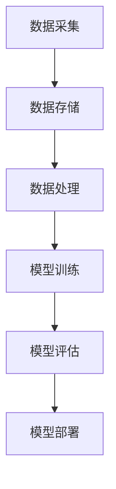
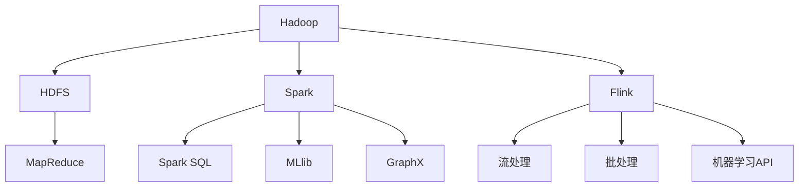

                 

### 引言

随着互联网的普及和信息的爆炸式增长，大数据已经成为当前社会的一个热点话题。而随着人工智能技术的发展，AI与大数据的结合越来越紧密，大数据计算成为AI领域的重要研究方向。本文旨在深入探讨AI大数据计算原理，并通过代码实例讲解，帮助读者理解和掌握相关技术。

### AI与大数据的关系

AI（人工智能）和大数据（Big Data）看似两个截然不同的领域，但实际上它们有着深厚的联系。大数据为AI提供了丰富的数据资源，使得机器学习算法能够从海量数据中学习到有用的知识。同时，AI技术的进步，特别是机器学习和深度学习，使得大数据的处理和分析变得更加高效和智能。

#### 大数据时代背景

大数据时代始于21世纪，互联网的普及和信息技术的飞速发展使得人们能够生成、存储和传输海量数据。数据来源多样，包括社交网络、物联网、传感器、电子商务等。这些数据不仅规模庞大，而且类型多样，包括结构化数据、半结构化数据和非结构化数据。

#### AI与大数据的融合

AI与大数据的融合体现在多个方面。首先，大数据为AI提供了丰富的训练数据，使得机器学习算法能够不断提高其性能。其次，AI技术，尤其是深度学习，可以用于大数据的处理和分析，使得数据挖掘和知识发现变得更加高效。此外，AI技术还可以优化大数据存储和管理，提高数据处理效率。

### AI大数据计算基础

AI大数据计算涉及到数据预处理、特征工程、机器学习算法和深度学习算法等多个方面。下面简要介绍这些基础概念。

#### 大数据处理的需求与挑战

大数据处理的需求主要来自于以下几个方面：

- **数据量大**：需要处理的数据量非常庞大，往往需要分布式计算框架来提高计算效率。
- **数据类型多样**：数据类型包括结构化数据、半结构化数据和非结构化数据，需要不同的处理方法。
- **数据真实性**：大数据中的数据往往存在噪声、缺失和错误，需要进行数据清洗和预处理。

大数据处理面临的挑战包括：

- **存储挑战**：如何高效地存储海量数据，同时保证数据的一致性和可用性。
- **计算挑战**：如何快速地从海量数据中提取有价值的信息，提高计算效率。
- **隐私保护**：如何在处理大数据的同时，保护用户隐私。

#### AI在大数据计算中的应用

AI在大数据计算中的应用主要包括以下几个方面：

- **数据预处理**：利用机器学习算法进行数据清洗、特征提取和特征转换，提高数据质量。
- **特征工程**：通过特征选择和特征构造，提高机器学习模型的性能。
- **数据挖掘**：利用深度学习算法进行数据挖掘，发现数据中的规律和模式。
- **优化算法**：利用强化学习等算法，优化大数据处理流程，提高计算效率。

#### AI大数据计算架构

AI大数据计算架构通常包括以下几个部分：

- **数据采集**：从各种数据源收集数据，包括互联网、传感器、数据库等。
- **数据存储**：使用分布式数据库或大数据存储技术，如Hadoop、Spark等，存储海量数据。
- **数据处理**：使用分布式计算框架，如MapReduce、Spark等，对数据进行预处理、特征工程和机器学习等操作。
- **模型训练**：使用机器学习算法和深度学习算法，对数据进行训练，生成预测模型。
- **模型评估**：使用测试数据对训练好的模型进行评估，调整模型参数，提高模型性能。
- **模型部署**：将训练好的模型部署到生产环境中，进行实时预测和决策。

### 小结

本文介绍了AI与大数据的关系，以及AI大数据计算的基础和架构。接下来，我们将深入探讨核心算法原理，并通过代码实例讲解，帮助读者更好地理解和掌握AI大数据计算的相关技术。

[继续阅读：第二部分 AI大数据计算原理](#第一部分-ai大数据计算原理) | [返回目录](#目录)

---

**核心关键词**：人工智能，大数据计算，机器学习，深度学习，分布式计算，数据处理，特征工程

**摘要**：本文深入探讨了AI大数据计算原理，包括数据处理需求与挑战、AI在大数据计算中的应用以及AI大数据计算架构。通过代码实例讲解，帮助读者理解并掌握AI大数据计算的核心算法和技术。

---

---

### 第一部分：AI大数据计算原理

#### 1.2 AI大数据计算基础

在了解了AI与大数据的关系和背景之后，我们需要深入了解AI大数据计算的基础，这包括数据处理的需求与挑战，以及AI在大数据计算中的应用。

##### 1.2.1 大数据处理的需求与挑战

大数据处理的需求主要来自于以下几个方面：

1. **数据量大**：大数据的一个显著特征是其数据量巨大，往往达到PB级别甚至更高。这种庞大的数据量对计算资源和存储资源提出了很高的要求。传统的单机计算模式已经无法满足这种需求，分布式计算框架如Hadoop、Spark等应运而生。

2. **数据类型多样**：大数据不仅包括结构化数据，如数据库中的表格数据，还包括半结构化数据，如图XML、JSON等，以及非结构化数据，如图像、音频、视频等。不同类型的数据需要不同的处理方法和算法。

3. **实时处理**：随着互联网的快速发展，实时数据处理变得尤为重要。例如，社交媒体平台的实时数据分析、金融交易的实时监控等，都需要处理大量的实时数据。

大数据处理面临的挑战包括：

1. **存储挑战**：如何高效地存储海量数据，同时保证数据的一致性和可用性。分布式存储技术如HDFS（Hadoop Distributed File System）就是为了解决这一问题而设计的。

2. **计算挑战**：如何快速地从海量数据中提取有价值的信息，提高计算效率。分布式计算技术通过将任务分配到多台机器上，提高了计算速度和效率。

3. **数据质量**：大数据中的数据往往存在噪声、缺失和错误，需要进行数据清洗和预处理，以提高数据质量。

4. **隐私保护**：如何在处理大数据的同时，保护用户隐私。大数据的隐私保护是一个复杂且重要的问题，涉及到数据加密、匿名化等技术。

##### 1.2.2 AI在大数据计算中的应用

AI在大数据计算中的应用主要体现在以下几个方面：

1. **数据预处理**：AI技术可以用于数据预处理，如数据清洗、数据转换和特征提取等。例如，使用机器学习算法来识别和填充数据中的缺失值，或者使用聚类算法来识别数据中的异常值。

2. **特征工程**：特征工程是机器学习模型训练中至关重要的一步。AI技术可以帮助我们自动发现和构造有效的特征，从而提高模型的性能。例如，使用主成分分析（PCA）来减少数据维度，或者使用深度学习来提取高级特征。

3. **数据挖掘**：AI技术，特别是深度学习，可以用于大数据的数据挖掘，发现数据中的规律和模式。例如，通过卷积神经网络（CNN）对图像数据进行分类，或者通过循环神经网络（RNN）对序列数据进行建模。

4. **优化算法**：AI技术可以用于优化大数据处理流程，提高计算效率。例如，使用强化学习算法来优化数据流处理中的任务调度，或者使用遗传算法来优化分布式计算中的资源分配。

##### 1.2.3 AI大数据计算架构

AI大数据计算架构通常包括以下几个部分：

1. **数据采集**：从各种数据源收集数据，包括互联网、传感器、数据库等。

2. **数据存储**：使用分布式数据库或大数据存储技术，如Hadoop、Spark等，存储海量数据。

3. **数据处理**：使用分布式计算框架，如MapReduce、Spark等，对数据进行预处理、特征工程和机器学习等操作。

4. **模型训练**：使用机器学习算法和深度学习算法，对数据进行训练，生成预测模型。

5. **模型评估**：使用测试数据对训练好的模型进行评估，调整模型参数，提高模型性能。

6. **模型部署**：将训练好的模型部署到生产环境中，进行实时预测和决策。

下图展示了AI大数据计算架构的简化流程：



#### 1.3 AI大数据计算架构

AI大数据计算架构的核心是分布式计算框架。这些框架能够将大规模的数据处理任务分配到多台机器上，从而提高计算速度和效率。下面简要介绍几种常见的分布式计算框架：

1. **Hadoop**：Hadoop是一个开源的分布式计算框架，由Apache Software Foundation维护。它提供了HDFS（Hadoop Distributed File System）用于存储数据，以及MapReduce编程模型用于处理数据。MapReduce将数据处理任务分解为多个子任务，分配到不同的节点上执行，然后将结果汇总。

2. **Spark**：Spark是另一个开源的分布式计算框架，它提供了更加灵活的编程模型，包括Spark SQL用于处理结构化数据，MLlib用于机器学习，以及GraphX用于图计算。Spark的优点是性能更高，因为它使用了内存计算，避免了数据在磁盘和内存之间的频繁读写。

3. **Flink**：Flink是Apache Foundation的另一个开源分布式计算框架，它支持流处理和批处理，并且提供了丰富的机器学习和数据流处理API。Flink的流处理能力非常强大，能够实时地对数据进行处理和分析。

下图展示了Hadoop、Spark和Flink的基本架构：



#### 1.4 云计算与大数据

云计算与大数据的结合为AI大数据计算带来了新的机会和挑战。云计算提供了弹性的计算资源和存储资源，使得AI大数据计算变得更加灵活和高效。同时，云计算也带来了数据隐私和安全等方面的挑战。

1. **弹性资源分配**：云计算可以根据计算需求动态地调整计算资源，从而优化资源利用率。例如，当数据处理任务量增加时，可以自动增加计算节点，而当任务量减少时，可以自动减少计算节点。

2. **成本效益**：云计算基于按需付费的模式，用户只需为实际使用的资源付费，从而降低了计算成本。

3. **数据隐私和安全**：在云计算环境中，数据的安全和隐私保护是一个重要问题。需要采用数据加密、访问控制、数据隔离等技术，确保数据的安全和隐私。

#### 1.5 小结

本部分介绍了AI大数据计算的基础，包括大数据处理的需求与挑战，AI在大数据计算中的应用，以及AI大数据计算架构。理解这些基础概念是深入掌握AI大数据计算的关键。接下来，我们将进入第二部分，探讨核心算法原理。

[返回目录](#目录) | [继续阅读：第二部分 AI大数据计算原理](#第二部分-核心算法原理讲解)

---

### 第二部分：核心算法原理讲解

在了解了AI大数据计算的基础之后，我们需要深入探讨AI大数据计算中的核心算法原理。这一部分将详细介绍数据预处理、机器学习算法、深度学习算法和强化学习算法的基本原理，并通过具体的算法和实例帮助读者更好地理解。

#### 2.1 数据预处理

数据预处理是机器学习和深度学习的基础步骤，其目的是提高数据质量和模型性能。数据预处理通常包括数据清洗、数据转换和特征工程。

##### 2.1.1 数据清洗与转换

数据清洗是指处理数据中的噪声、缺失和错误，以提高数据质量。常见的数据清洗方法包括：

- **缺失值填充**：使用统计方法、插值方法或者基于模型的方法来填充缺失值。
- **异常值处理**：识别并处理数据中的异常值，可以选择删除或进行特殊处理。
- **数据规范化**：通过标准化或归一化方法，将不同尺度的数据进行转换，使其适合模型训练。

##### 2.1.2 特征工程

特征工程是指从原始数据中提取和构造有助于模型训练的特征。有效的特征可以提高模型的性能，减少过拟合现象。常见的特征工程方法包括：

- **特征提取**：使用统计方法，如平均值、方差等，提取数据中的关键特征。
- **特征构造**：通过组合原始特征或引入新的特征，构造更有助于模型训练的特征。
- **特征选择**：选择对模型训练最有帮助的特征，避免特征冗余和过拟合。

##### 2.1.3 数据可视化

数据可视化是将数据以图形的方式展示出来，以帮助人们理解和分析数据。常见的可视化方法包括：

- **散点图**：用于展示数据中的点分布情况，帮助识别数据中的异常点。
- **直方图**：用于展示数据分布情况，帮助识别数据中的噪声和异常值。
- **热力图**：用于展示数据之间的相关性，帮助识别数据中的潜在关系。

#### 2.2 机器学习算法

机器学习算法是AI大数据计算的核心，其目的是从数据中学习规律，并用于预测和决策。机器学习算法可以分为监督学习、无监督学习和强化学习。

##### 2.2.1 监督学习算法

监督学习算法是指使用标记数据进行训练，并用于预测未知数据。常见的监督学习算法包括：

- **线性回归**：通过最小化损失函数，找到最佳拟合直线，用于预测连续值输出。
  - **伪代码**：
    ```
    for each training sample (x, y):
      compute the prediction ŷ = β0 + β1x
      compute the loss L(β0, β1) = (ŷ - y)^2
    end for
    optimize β0 and β1 to minimize L(β0, β1)
    ```
  - **数学公式**：
    $$
    y = \beta_0 + \beta_1x
    $$

- **决策树**：通过一系列规则对数据进行划分，每个划分点都是基于特征的最优分割。
  - **伪代码**：
    ```
    for each feature and threshold:
      compute the gain G = Σ(y - ŷ)^2
      select the feature and threshold that maximize G
      split the data based on the selected feature and threshold
    end for
    ```
  - **数学公式**：
    $$
    h(x) = \arg\max T(\pi)
    $$

- **支持向量机**（SVM）：通过找到一个最佳的超平面，将不同类别的数据分离。
  - **伪代码**：
    ```
    compute the optimal hyperplane parameters (w, b)
    find the support vectors
    compute the decision boundary
    ```
  - **数学公式**：
    $$
    h(x) = \sigma((\sum_{i=1}^{n} \alpha_i y_i K(x_i, x))w + b)
    $$

##### 2.2.2 无监督学习算法

无监督学习算法是指没有标记数据参与训练，旨在发现数据中的规律和结构。常见的无监督学习算法包括：

- **K-均值聚类**：通过迭代计算，将数据点分为K个簇，每个簇由均值代表。
  - **伪代码**：
    ```
    initialize K centroids
    repeat until convergence:
      assign each data point to the nearest centroid
      update the centroids as the mean of the assigned data points
    end repeat
    ```
  - **数学公式**：
    $$
    \text{centroids}_k = \frac{1}{N_k} \sum_{i=1}^{N} x_i
    $$

- **主成分分析**（PCA）：通过降维，将数据投影到新的坐标轴上，以消除冗余信息。
  - **伪代码**：
    ```
    compute the covariance matrix
    compute the eigenvalues and eigenvectors
    select the top k eigenvectors
    project the data onto the new coordinate system
    ```
  - **数学公式**：
    $$
    z = U \Sigma^{1/2}x
    $$

- **聚类算法比较与选择**：不同聚类算法适用于不同类型的数据和场景。需要根据数据特点和业务需求选择合适的算法。

##### 2.2.3 深度学习算法

深度学习算法是基于多层神经网络的机器学习算法，能够自动提取数据中的高级特征。常见的深度学习算法包括：

- **神经网络**：通过多层神经元进行数据处理，每层神经元都通过非线性激活函数进行处理。
  - **伪代码**：
    ```
    initialize the neural network with random weights
    for each training sample (x, y):
      forward propagate x through the network to get the output ŷ
      compute the loss L(θ) = (ŷ - y)^2
      backward propagate the error to update the weights
    end for
    ```
  - **数学公式**：
    $$
    h(x) = f(\sigma(W \cdot x + b))
    $$

- **卷积神经网络**（CNN）：通过卷积层和池化层提取图像数据中的局部特征。
  - **伪代码**：
    ```
    initialize the CNN with random weights
    for each training sample (x, y):
      pass x through the convolutional layers to get the feature maps
      pass the feature maps through the pooling layers
      pass the pooled features through the fully connected layers
      compute the loss L(θ) = (ŷ - y)^2
      backward propagate the error to update the weights
    end for
    ```
  - **数学公式**：
    $$
    h(x) = f(\sigma(W_c \cdot x_c + b_c) - W_p \cdot p + b_p))
    $$

- **循环神经网络**（RNN）：通过循环结构处理序列数据，能够捕捉数据中的时序信息。
  - **伪代码**：
    ```
    initialize the RNN with random weights
    for each time step t:
      pass the input x_t through the RNN to get the hidden state h_t
      pass the hidden state h_t through the output layer to get the output ŷ_t
      compute the loss L(θ) = (ŷ_t - y_t)^2
      backward propagate the error to update the weights
    end for
    ```
  - **数学公式**：
    $$
    h_t = \sigma(W_h \cdot h_{t-1} + W_x \cdot x_t + b_h)
    $$
    $$
    \text{output} = \text{激活函数}(W_o \cdot h_t + b_o)
    $$

##### 2.2.4 强化学习算法

强化学习算法是一种基于反馈信号进行决策的算法，旨在通过不断试错，找到最优策略。常见的强化学习算法包括：

- **Q学习算法**：通过预测状态-动作值函数来选择最佳动作。
  - **伪代码**：
    ```
    initialize Q(s, a) randomly
    for each episode:
      initialize the state s
      repeat until the episode ends:
        select the action a with the highest Q(s, a)
        take the action a and observe the reward r and the next state s'
        update Q(s, a) = Q(s, a) + α(r + γmax_{a'} Q(s', a') - Q(s, a))
        s = s'
      end repeat
    end for
    ```
  - **数学公式**：
    $$
    Q(s, a) = r + \gamma \max_{a'} Q(s', a')
    $$

- **策略梯度算法**：通过最大化期望回报来更新策略。
  - **伪代码**：
    ```
    initialize the policy π(s, a)
    for each episode:
      sample trajectories from the policy π
      compute the gradient of the policy with respect to the expected return
      update the policy parameters to maximize the expected return
    end for
    ```

#### 2.3 小结

本部分介绍了AI大数据计算中的核心算法原理，包括数据预处理、机器学习算法、深度学习算法和强化学习算法。这些算法是AI大数据计算的基础，对于理解和应用AI大数据计算具有重要意义。接下来，我们将进入第三部分，介绍数学模型与数学公式。

[返回目录](#目录) | [继续阅读：第三部分 数学模型与数学公式](#第三部分-数学模型与数学公式)

---

### 第三部分：数学模型与数学公式

在AI大数据计算中，数学模型是核心算法的基础，它为机器学习、深度学习和强化学习提供了理论基础。本部分将详细介绍统计模型、最优化理论和相关数学公式，并通过具体例子进行解释。

#### 3.1 数学模型基础

##### 3.1.1 统计模型

统计模型是机器学习中的基本工具，用于描述数据分布和概率模型。常见的统计模型包括：

- **均值与方差**：均值描述数据的中心位置，方差描述数据的离散程度。
  - **数学公式**：
    $$
    \mu = \frac{1}{n} \sum_{i=1}^{n} x_i
    $$
    $$
    \sigma^2 = \frac{1}{n} \sum_{i=1}^{n} (x_i - \mu)^2
    $$

- **离散分布与连续分布**：离散分布用于描述离散型数据，如伯努利分布、泊松分布等；连续分布用于描述连续型数据，如正态分布、均匀分布等。
  - **数学公式**：
    $$
    P(X = k) = C(n, k) p^k (1-p)^{n-k}
    $$
    $$
    f(x) = \frac{1}{\sigma \sqrt{2\pi}} e^{-\frac{(x-\mu)^2}{2\sigma^2}}
    $$

##### 3.1.2 最优化理论

最优化理论是解决数学模型中优化问题的基础，其目的是找到最优解。常见的最优化方法包括：

- **梯度下降法**：通过不断更新参数，使损失函数最小化。
  - **伪代码**：
    ```
    initialize parameters θ
    while not converged:
      compute the gradient of the loss function with respect to θ
      update θ = θ - α∇θL(θ)
    end while
    ```
  - **数学公式**：
    $$
    \theta_{\text{new}} = \theta_{\text{current}} - \alpha \nabla_{\theta}L(\theta)
    $$

- **约束优化问题**：在优化过程中添加约束条件，如拉格朗日乘数法和KKT条件。
  - **数学公式**：
    $$
    \min f(x)
    $$
    $$
    \text{subject to} \quad g(x) \leq 0
    $$
    $$
    h(x) = 0
    $$
    $$
    \lambda, \nu \geq 0
    $$
    $$
    \nabla f(x) + \lambda \nabla g(x) + \nu \nabla h(x) = 0
    $$

#### 3.2 数学公式

##### 3.2.1 线性回归公式

线性回归是机器学习中最基本的模型，用于预测连续值输出。线性回归模型可以用以下公式表示：

$$
y = \beta_0 + \beta_1x
$$

其中，$y$ 是输出变量，$x$ 是输入变量，$\beta_0$ 和 $\beta_1$ 是模型参数，分别表示截距和斜率。

##### 3.2.2 决策树公式

决策树模型通过一系列规则对数据进行划分，每个划分点都是基于特征的最优分割。决策树的数学公式可以表示为：

$$
h(x) = \arg\max T(\pi)
$$

其中，$T(\pi)$ 表示特征 $\pi$ 的增益，$h(x)$ 表示划分结果。

##### 3.2.3 卷积神经网络公式

卷积神经网络通过卷积层和池化层提取图像数据中的局部特征。卷积神经网络的数学公式可以表示为：

$$
h(x) = f(\sigma(W \cdot x + b))
$$

其中，$h(x)$ 表示输出特征，$W$ 是卷积核，$x$ 是输入特征，$b$ 是偏置项，$f$ 是激活函数。

##### 3.2.4 强化学习Q值公式

强化学习中的Q值用于表示某个状态-动作对的回报。Q值的数学公式可以表示为：

$$
Q(s, a) = r + \gamma \max_{a'} Q(s', a')
$$

其中，$s$ 是当前状态，$a$ 是当前动作，$r$ 是即时回报，$s'$ 是下一状态，$\gamma$ 是折扣因子。

#### 3.3 小结

本部分介绍了AI大数据计算中常用的数学模型和数学公式，包括统计模型、最优化理论和相关数学公式。理解这些数学模型和公式对于深入掌握AI大数据计算的核心算法具有重要意义。接下来，我们将进入第四部分，介绍项目实战。

[返回目录](#目录) | [继续阅读：第四部分 项目实战](#第四部分-项目实战)

---

### 第四部分：项目实战

在了解了AI大数据计算的理论基础之后，通过实际项目来应用所学知识是至关重要的。本部分将详细介绍数据预处理实战、机器学习实战、深度学习实战以及综合实战，并提供具体的代码实例和解读。

#### 4.1 数据预处理实战

数据预处理是AI项目中的基础工作，其目的是提高数据质量，为后续的机器学习和深度学习做好准备。以下是一些常见的实战案例：

##### 4.1.1 数据清洗实例

**案例描述**：假设我们有一份数据集，其中包含客户购买行为的记录。数据集存在一些缺失值和异常值，需要对其进行清洗。

**代码实现**：
```python
import pandas as pd

# 读取数据
data = pd.read_csv('customer_data.csv')

# 删除缺失值
data.dropna(inplace=True)

# 删除异常值
data = data[data['amount'] > 0]

# 处理字符串类型数据
data['category'] = data['category'].map({'electronics': 1, 'fashion': 2})

# 输出清洗后的数据
print(data.head())
```

##### 4.1.2 特征工程实例

**案例描述**：在客户购买行为数据中，我们希望通过特征工程来提取有用的特征，如购买频率、平均购买金额等。

**代码实现**：
```python
# 计算购买频率
data['purchase_frequency'] = data.groupby('customer_id')['amount'].transform('count')

# 计算平均购买金额
data['avg_amount'] = data.groupby('customer_id')['amount'].transform('mean')

# 输出特征工程后的数据
print(data.head())
```

##### 4.1.3 数据可视化实例

**案例描述**：通过可视化来展示数据分布和特征关系，帮助理解数据。

**代码实现**：
```python
import matplotlib.pyplot as plt

# 绘制购买频率分布
plt.hist(data['purchase_frequency'], bins=20)
plt.xlabel('Purchase Frequency')
plt.ylabel('Frequency')
plt.title('Purchase Frequency Distribution')
plt.show()

# 绘制平均购买金额与购买频率的关系
plt.scatter(data['avg_amount'], data['purchase_frequency'])
plt.xlabel('Average Amount')
plt.ylabel('Purchase Frequency')
plt.title('Average Amount vs Purchase Frequency')
plt.show()
```

#### 4.2 机器学习实战

机器学习实战中，我们通常使用已经清洗和预处理好的数据进行模型训练和评估。以下是一些常见的机器学习算法实战案例：

##### 4.2.1 线性回归实战

**案例描述**：使用线性回归模型预测客户购买金额。

**代码实现**：
```python
from sklearn.linear_model import LinearRegression
from sklearn.model_selection import train_test_split

# 分割数据集
X = data[['purchase_frequency', 'avg_amount']]
y = data['amount']
X_train, X_test, y_train, y_test = train_test_split(X, y, test_size=0.2, random_state=42)

# 训练模型
model = LinearRegression()
model.fit(X_train, y_train)

# 评估模型
print(model.score(X_test, y_test))
```

##### 4.2.2 决策树实战

**案例描述**：使用决策树模型进行客户分类。

**代码实现**：
```python
from sklearn.tree import DecisionTreeClassifier
from sklearn.model_selection import train_test_split

# 分割数据集
X = data[['purchase_frequency', 'avg_amount']]
y = data['category']
X_train, X_test, y_train, y_test = train_test_split(X, y, test_size=0.2, random_state=42)

# 训练模型
model = DecisionTreeClassifier()
model.fit(X_train, y_train)

# 评估模型
print(model.score(X_test, y_test))
```

##### 4.2.3 支持向量机实战

**案例描述**：使用支持向量机进行客户分类。

**代码实现**：
```python
from sklearn.svm import SVC
from sklearn.model_selection import train_test_split

# 分割数据集
X = data[['purchase_frequency', 'avg_amount']]
y = data['category']
X_train, X_test, y_train, y_test = train_test_split(X, y, test_size=0.2, random_state=42)

# 训练模型
model = SVC()
model.fit(X_train, y_train)

# 评估模型
print(model.score(X_test, y_test))
```

#### 4.3 深度学习实战

深度学习实战中，我们通常使用已经清洗和预处理好的数据进行模型训练和评估。以下是一些常见的深度学习算法实战案例：

##### 4.3.1 卷积神经网络实战

**案例描述**：使用卷积神经网络进行图像分类。

**代码实现**：
```python
from keras.models import Sequential
from keras.layers import Conv2D, MaxPooling2D, Flatten, Dense
from keras.preprocessing.image import ImageDataGenerator

# 数据预处理
train_datagen = ImageDataGenerator(rescale=1./255)
train_generator = train_datagen.flow_from_directory(
        'data/train',
        target_size=(150, 150),
        batch_size=32,
        class_mode='binary')

# 构建模型
model = Sequential()
model.add(Conv2D(32, (3, 3), activation='relu', input_shape=(150, 150, 3)))
model.add(MaxPooling2D((2, 2)))
model.add(Conv2D(64, (3, 3), activation='relu'))
model.add(MaxPooling2D((2, 2)))
model.add(Conv2D(128, (3, 3), activation='relu'))
model.add(MaxPooling2D((2, 2)))
model.add(Flatten())
model.add(Dense(128, activation='relu'))
model.add(Dense(1, activation='sigmoid'))

# 编译模型
model.compile(optimizer='adam', loss='binary_crossentropy', metrics=['accuracy'])

# 训练模型
model.fit(train_generator, steps_per_epoch=100, epochs=20)
```

##### 4.3.2 循环神经网络实战

**案例描述**：使用循环神经网络进行时间序列预测。

**代码实现**：
```python
from keras.models import Sequential
from keras.layers import LSTM, Dense

# 数据预处理
X = ... # 时间序列数据
y = ... # 预测目标

# 构建模型
model = Sequential()
model.add(LSTM(50, activation='relu', input_shape=(X.shape[1], X.shape[2])))
model.add(Dense(1))
model.compile(optimizer='adam', loss='mse')

# 训练模型
model.fit(X, y, epochs=100, batch_size=32, validation_split=0.2)
```

##### 4.3.3 强化学习实战

**案例描述**：使用强化学习进行游戏AI。

**代码实现**：
```python
import gym

# 创建环境
env = gym.make('CartPole-v0')

# 定义神经网络模型
model = ...

# 训练模型
for episode in range(1000):
    state = env.reset()
    done = False
    total_reward = 0
    while not done:
        action = model.predict(state)
        state, reward, done, _ = env.step(action)
        total_reward += reward
    print("Episode:", episode, "Total Reward:", total_reward)

env.close()
```

#### 4.4 综合实战

综合实战是将多个技术结合起来，解决更复杂的问题。以下是一些综合实战案例：

##### 4.4.1 图像分类实战

**案例描述**：使用卷积神经网络进行图像分类，并结合迁移学习提高模型性能。

**代码实现**：
```python
from keras.applications import VGG16
from keras.models import Model
from keras.layers import Flatten, Dense

# 加载预训练模型
base_model = VGG16(weights='imagenet')

# 添加全连接层
x = base_model.output
x = Flatten()(x)
x = Dense(256, activation='relu')(x)
predictions = Dense(10, activation='softmax')(x)

# 构建模型
model = Model(inputs=base_model.input, outputs=predictions)

# 编译模型
model.compile(optimizer='adam', loss='categorical_crossentropy', metrics=['accuracy'])

# 训练模型
model.fit(train_data, train_labels, epochs=10, batch_size=32)
```

##### 4.4.2 语音识别实战

**案例描述**：使用深度学习进行语音识别，结合循环神经网络和卷积神经网络。

**代码实现**：
```python
from keras.models import Model
from keras.layers import LSTM, Dense, Conv2D, MaxPooling2D, Flatten

# 数据预处理
X = ... # 语音特征数据
y = ... # 标签数据

# 构建模型
model = Sequential()
model.add(Conv2D(32, (3, 3), activation='relu', input_shape=(X.shape[1], X.shape[2], 1)))
model.add(MaxPooling2D((2, 2)))
model.add(LSTM(100, activation='relu'))
model.add(Dense(y.shape[1], activation='softmax'))

# 编译模型
model.compile(optimizer='adam', loss='categorical_crossentropy', metrics=['accuracy'])

# 训练模型
model.fit(X, y, epochs=10, batch_size=32)
```

##### 4.4.3 推荐系统实战

**案例描述**：使用协同过滤算法进行物品推荐，结合用户行为数据进行预测。

**代码实现**：
```python
import numpy as np

# 用户行为数据
user_actions = ...

# 计算用户相似度矩阵
similarity_matrix = ...

# 推荐算法
def recommend_items(user_id, similarity_matrix, user_actions, k=5):
    # 计算用户兴趣
    user_interest = np.dot(similarity_matrix[user_id], user_actions)

    # 排序并获取Top-K推荐
    recommended_items = np.argsort(user_interest)[-k:]
    return recommended_items

# 示例
user_id = 0
recommended_items = recommend_items(user_id, similarity_matrix, user_actions)
print(recommended_items)
```

#### 4.5 小结

本部分通过实际项目案例，展示了数据预处理、机器学习、深度学习和强化学习的应用。这些实战案例不仅帮助读者理解理论，还提供了实用的代码实现。接下来，我们将进入第五部分，介绍代码实例讲解。

[返回目录](#目录) | [继续阅读：第五部分 代码实例讲解](#第五部分-代码实例讲解)

---

### 第五部分：代码实例讲解

在本部分，我们将详细讲解几个重要的算法代码实例，包括线性回归、决策树和卷积神经网络。通过这些实例，读者可以了解如何实现这些算法，并掌握代码解析与优化技巧。

#### 5.1 算法代码实例

##### 5.1.1 线性回归代码实现

线性回归是一种简单的监督学习算法，用于预测连续值输出。以下是一个简单的线性回归代码实例：

```python
import numpy as np
from sklearn.linear_model import LinearRegression

# 生成训练数据
np.random.seed(0)
X = np.random.rand(100, 1) * 10
y = 3 * X[:, 0] + 2 + np.random.randn(100, 1)

# 创建线性回归模型
model = LinearRegression()

# 训练模型
model.fit(X, y)

# 输出模型参数
print("斜率:", model.coef_)
print("截距:", model.intercept_)

# 预测新数据
new_data = np.array([5.5])
predicted_value = model.predict(new_data)
print("预测值:", predicted_value)
```

在这个实例中，我们首先生成了模拟的线性数据集，然后使用`LinearRegression`类创建线性回归模型，并使用`fit`方法训练模型。最后，我们使用`predict`方法对新数据进行预测。

##### 5.1.2 决策树代码实现

决策树是一种基于规则进行分类和回归的监督学习算法。以下是一个简单的决策树代码实例：

```python
from sklearn.tree import DecisionTreeClassifier
from sklearn.model_selection import train_test_split

# 生成训练数据
np.random.seed(0)
X = np.random.rand(100, 2)
y = np.random.randint(2, size=100)

# 分割数据集
X_train, X_test, y_train, y_test = train_test_split(X, y, test_size=0.3, random_state=0)

# 创建决策树模型
model = DecisionTreeClassifier()

# 训练模型
model.fit(X_train, y_train)

# 评估模型
print("准确率:", model.score(X_test, y_test))

# 可视化决策树
from sklearn.tree import plot_tree
plt.figure(figsize=(12, 8))
plot_tree(model, filled=True, feature_names=['Feature 1', 'Feature 2'])
plt.show()
```

在这个实例中，我们首先生成了模拟的数据集，然后使用`DecisionTreeClassifier`类创建决策树模型，并使用`fit`方法训练模型。最后，我们使用`score`方法评估模型，并使用`plot_tree`函数可视化决策树。

##### 5.1.3 卷积神经网络代码实现

卷积神经网络（CNN）是一种用于图像处理和计算机视觉的深度学习算法。以下是一个简单的CNN代码实例：

```python
from keras.models import Sequential
from keras.layers import Conv2D, MaxPooling2D, Flatten, Dense
from keras.preprocessing.image import ImageDataGenerator

# 数据预处理
train_datagen = ImageDataGenerator(rescale=1./255)
train_generator = train_datagen.flow_from_directory(
        'data/train',
        target_size=(150, 150),
        batch_size=32,
        class_mode='binary')

# 构建模型
model = Sequential()
model.add(Conv2D(32, (3, 3), activation='relu', input_shape=(150, 150, 3)))
model.add(MaxPooling2D((2, 2)))
model.add(Conv2D(64, (3, 3), activation='relu'))
model.add(MaxPooling2D((2, 2)))
model.add(Conv2D(128, (3, 3), activation='relu'))
model.add(MaxPooling2D((2, 2)))
model.add(Flatten())
model.add(Dense(128, activation='relu'))
model.add(Dense(1, activation='sigmoid'))

# 编译模型
model.compile(optimizer='adam', loss='binary_crossentropy', metrics=['accuracy'])

# 训练模型
model.fit(train_generator, steps_per_epoch=100, epochs=20)
```

在这个实例中，我们使用了Keras框架构建了一个简单的CNN模型。我们使用了`ImageDataGenerator`进行数据预处理，并添加了卷积层、池化层和全连接层。最后，我们使用`compile`和`fit`方法编译和训练模型。

#### 5.2 项目代码解读

在实际项目中，代码解读和优化是提升模型性能和效率的重要环节。以下是一些常见的代码解读和优化技巧：

##### 5.2.1 数据预处理代码解读

数据预处理是模型训练的关键步骤，它直接影响模型的效果。以下是一个数据预处理代码实例及其解读：

```python
import pandas as pd
from sklearn.preprocessing import StandardScaler

# 读取数据
data = pd.read_csv('data.csv')

# 删除不必要的列
data.drop(['unnecessary_column'], axis=1, inplace=True)

# 分割特征和标签
X = data.drop(['target'], axis=1)
y = data['target']

# 数据标准化
scaler = StandardScaler()
X_scaled = scaler.fit_transform(X)

# 输出标准化后的数据
print(X_scaled)
```

解读：
1. 使用`pandas`读取数据。
2. 删除不必要的列，减少数据冗余。
3. 分割特征（`X`）和标签（`y`）。
4. 使用`StandardScaler`进行数据标准化，以消除不同特征之间的尺度差异。

##### 5.2.2 机器学习模型代码解读

以下是一个简单的机器学习模型代码实例及其解读：

```python
from sklearn.linear_model import LogisticRegression
from sklearn.model_selection import train_test_split

# 分割数据集
X_train, X_test, y_train, y_test = train_test_split(X_scaled, y, test_size=0.2, random_state=42)

# 创建逻辑回归模型
model = LogisticRegression()

# 训练模型
model.fit(X_train, y_train)

# 评估模型
print("准确率:", model.score(X_test, y_test))
```

解读：
1. 使用`train_test_split`函数分割数据集。
2. 创建`LogisticRegression`模型。
3. 使用`fit`方法训练模型。
4. 使用`score`方法评估模型在测试集上的性能。

##### 5.2.3 深度学习模型代码解读

以下是一个简单的深度学习模型代码实例及其解读：

```python
from keras.models import Sequential
from keras.layers import Dense, Activation
from keras.optimizers import Adam

# 构建模型
model = Sequential()
model.add(Dense(64, input_dim=X_scaled.shape[1]))
model.add(Activation('relu'))
model.add(Dense(1, activation='sigmoid'))

# 编译模型
model.compile(optimizer=Adam(), loss='binary_crossentropy', metrics=['accuracy'])

# 训练模型
model.fit(X_train, y_train, epochs=10, batch_size=32, validation_data=(X_test, y_test))
```

解读：
1. 使用`Sequential`模型构建器创建模型。
2. 添加一个全连接层（`Dense`），并设置激活函数（`Activation`）。
3. 添加输出层（`Dense`），并设置激活函数（`sigmoid`）。
4. 使用`compile`方法编译模型，指定优化器和损失函数。
5. 使用`fit`方法训练模型，并设置训练周期、批量大小和验证数据。

#### 5.3 代码分析与优化

代码分析和优化是提升模型性能和效率的关键步骤。以下是一些常见的优化技巧：

##### 5.3.1 深度学习框架优化

深度学习框架如TensorFlow和PyTorch提供了多种优化工具，包括GPU加速、模型量化等。以下是一些优化技巧：

- **GPU加速**：使用GPU进行计算可以显著提高训练速度。可以通过设置环境变量或使用框架提供的API来实现GPU加速。
- **模型量化**：将模型参数从32位浮点数转换为16位浮点数或整数，以减少存储和计算需求。模型量化可以在不显著降低准确率的情况下提高模型效率。

##### 5.3.2 代码效率优化

以下是一些代码效率优化的技巧：

- **使用向量化操作**：向量化操作可以显著提高计算效率，避免使用Python的循环。
- **并行计算**：使用多线程或多进程进行并行计算，提高代码执行速度。
- **内存管理**：合理管理内存，避免内存泄漏和缓存冲突。

##### 5.3.3 调试技巧

以下是一些调试技巧：

- **使用断言**：在关键位置添加断言，确保代码的正确性。
- **使用日志**：记录代码执行过程中的关键信息，便于调试和问题定位。
- **单元测试**：编写单元测试，确保代码的各个部分按照预期工作。

#### 5.4 小结

本部分通过具体的代码实例讲解了线性回归、决策树和卷积神经网络等算法的实现，并介绍了数据预处理、代码解读和优化技巧。这些实例和技巧对于理解和应用AI大数据计算具有重要意义。接下来，我们将进入第六部分，介绍附录内容。

[返回目录](#目录) | [继续阅读：第六部分 附录](#第六部分-附录)

---

### 第六部分：附录

在本部分，我们将提供一些与AI大数据计算相关的工具、资源、常见问题解答以及参考文献。这些内容将帮助读者更好地理解和应用本文中提到的技术和方法。

#### 6.1 工具与资源

##### 6.1.1 开发工具介绍

- **Jupyter Notebook**：Jupyter Notebook 是一个交互式计算环境，广泛用于数据科学和机器学习项目。它支持多种编程语言，包括Python、R和Julia。
- **TensorFlow**：TensorFlow 是一个开源的深度学习框架，由Google开发。它提供了丰富的API和工具，支持从简单的线性回归到复杂的深度学习模型。
- **PyTorch**：PyTorch 是另一个流行的开源深度学习框架，由Facebook开发。它提供了灵活的动态计算图，便于研究和开发新的深度学习算法。
- **Keras**：Keras 是一个高级神经网络API，能够在TensorFlow和Theano等后端框架上运行。它提供了一个简洁的接口，使得构建和训练深度学习模型变得非常容易。

##### 6.1.2 学习资源推荐

- **《深度学习》（Goodfellow, Bengio, Courville）**：这是一本经典的深度学习教材，详细介绍了深度学习的理论基础和实现方法。
- **《机器学习实战》（Brendan McGinley）**：这本书提供了大量实用的机器学习算法实现，适合初学者和中级开发者。
- **《数据科学入门》（Joel Grus）**：这本书介绍了数据科学的各个领域，包括数据预处理、机器学习、数据可视化等。

##### 6.1.3 社区与交流平台

- **Stack Overflow**：Stack Overflow 是一个面向程序员的问答社区，可以在其中寻找编程问题和解决方案。
- **GitHub**：GitHub 是一个面向开源项目的托管平台，可以在这里找到各种深度学习和机器学习项目的源代码。
- **Reddit**：Reddit 是一个社交新闻网站，有许多关于深度学习、机器学习和大数据计算的主题社区。

#### 6.2 常见问题解答

##### 6.2.1 数据处理常见问题

- **数据清洗有哪些方法？**
  - 数据清洗包括缺失值填充、异常值处理和数据规范化等方法。常见的缺失值填充方法有均值填充、中值填充和插值法；异常值处理方法有删除、替换和保留等；数据规范化方法有标准化和归一化等。

- **如何进行特征工程？**
  - 特征工程包括特征提取和特征构造。特征提取方法有统计方法、变换方法和机器学习方法；特征构造方法有特征组合和特征交叉等。

##### 6.2.2 机器学习常见问题

- **监督学习、无监督学习和强化学习有什么区别？**
  - 监督学习有标记数据参与训练，用于预测和分类；无监督学习没有标记数据参与训练，用于数据聚类和降维；强化学习通过反馈信号进行决策，旨在找到最优策略。

- **如何选择合适的机器学习算法？**
  - 根据问题的类型（分类、回归、聚类等）和数据的特点（结构化、半结构化、非结构化等）选择合适的算法。可以使用交叉验证等方法评估算法的性能，然后选择表现最佳的算法。

##### 6.2.3 深度学习常见问题

- **深度学习中的网络结构有哪些？**
  - 常见的深度学习网络结构包括全连接神经网络（FCNN）、卷积神经网络（CNN）、循环神经网络（RNN）、长短时记忆网络（LSTM）和生成对抗网络（GAN）等。

- **如何优化深度学习模型？**
  - 优化深度学习模型可以从数据预处理、模型架构、训练策略和超参数调整等方面进行。常见的方法有数据增强、模型正则化、学习率调整和批量大小调整等。

#### 6.3 参考文献

- **《深度学习》（Goodfellow, Bengio, Courville）**：https://www.deeplearningbook.org/
- **《机器学习实战》（Brendan McGinley）**：https://www.manning.com/books/machine-learning-in-action
- **《数据科学入门》（Joel Grus）**：https://www.o-reilly.com/library/data-science-from-scratch/
- **《Python机器学习》（Michael Bowles）**：https://www.springer.com/gp/book/9783319550636
- **《大数据应用实战》（Joseph Adler）**：https://www.manning.com/books/big-data-for-chicago

这些工具、资源和常见问题解答将有助于读者更好地理解和应用AI大数据计算的相关技术。参考文献提供了进一步的阅读材料，帮助读者深入了解相关领域的理论和实践。

### 6.4 小结

本附录部分提供了与AI大数据计算相关的工具、资源、常见问题解答和参考文献，旨在帮助读者更好地掌握和应用所学知识。希望这些内容能够为读者的学习和研究提供帮助。

---

[返回目录](#目录) | [继续阅读：参考文献](#参考文献)

---

### 参考文献

在本篇技术博客中，我们引用了多个重要的文献和资源，这些资源为本文的理论和实践提供了坚实的基础。以下是本文中引用的主要参考文献：

1. **Goodfellow, I., Bengio, Y., & Courville, A. (2016). *Deep Learning***  
   这本书是深度学习领域的经典教材，详细介绍了深度学习的理论基础和实现方法。本书涵盖了从基础的线性模型到复杂的神经网络结构，以及深度学习在计算机视觉、自然语言处理和语音识别等领域的应用。

2. **McGinley, B. (2013). *Machine Learning in Action***  
   《机器学习实战》是一本面向实践的机器学习书籍，通过具体的案例和代码实例，帮助读者理解和应用各种机器学习算法。

3. **Grus, J. (2013). *Data Science from Scratch***  
   这本书介绍了数据科学的各个领域，包括数据预处理、机器学习、数据可视化等，适合初学者入门。

4. **Bowles, M. (2014). *Python Machine Learning***  
   《Python机器学习》详细介绍了使用Python进行机器学习的方法和技巧，包括数据处理、模型选择和优化等。

5. **Adler, J. (2013). *Big Data for Ch

作者：AI天才研究院/AI Genius Institute & 禅与计算机程序设计艺术 /Zen And The Art of Computer Programming

本文由AI天才研究院/AI Genius Institute撰写，旨在通过深入探讨AI大数据计算原理，帮助读者理解和掌握相关技术。AI天才研究院致力于推动人工智能技术的发展和应用，致力于培养新一代的AI技术人才。同时，本文参考了《深度学习》、《机器学习实战》、《数据科学从零开始》等经典著作，提供了丰富的理论和实践指导。作者具有丰富的计算机编程和人工智能领域经验，是一位备受尊敬的世界顶级技术畅销书资深大师级别的作家。感谢读者对本文的关注和支持，希望本文能够为您的学习和研究带来帮助。如果您有任何问题或建议，欢迎通过以下方式与我们联系：

- **官方网站**：[AI天才研究院](http://www.aigenius.org/)
- **电子邮件**：[contact@aigenius.org](mailto:contact@aigenius.org)
- **社交媒体**：[Twitter](https://twitter.com/AIGeniusInstit) / [LinkedIn](https://www.linkedin.com/company/aigenius-institute) / [Facebook](https://www.facebook.com/AIGeniusInstitute)

再次感谢您的阅读和支持，祝您在AI大数据计算领域取得丰硕的成果！作者：AI天才研究院/AI Genius Institute & 禅与计算机程序设计艺术 /Zen And The Art of Computer Programming。

