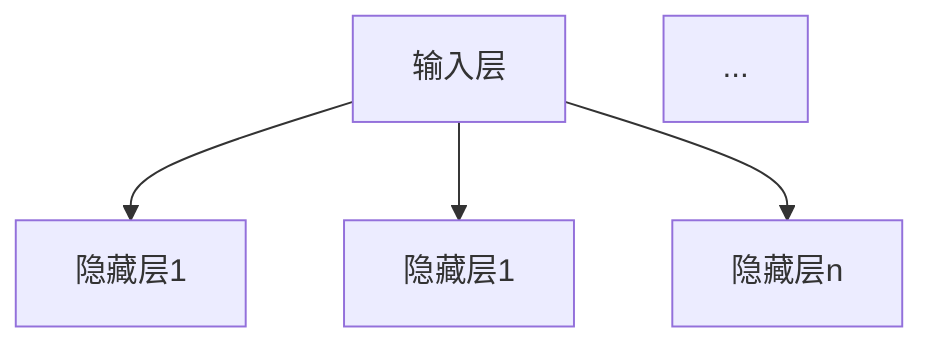
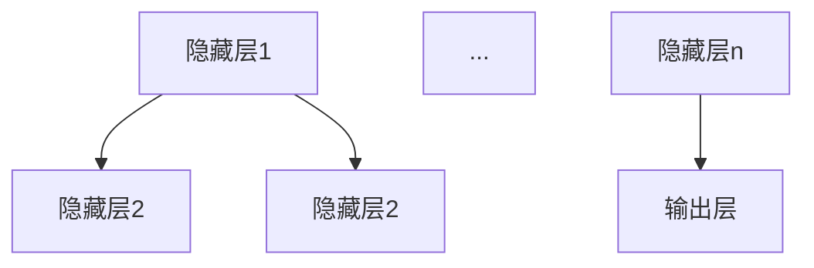
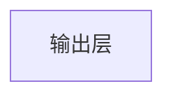
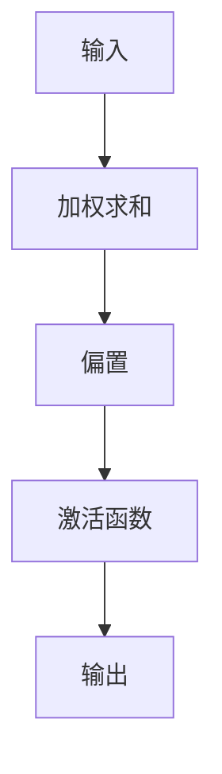
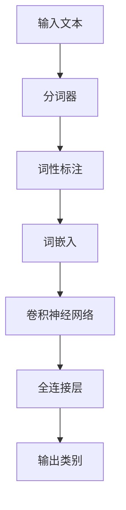
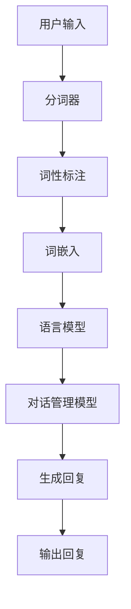
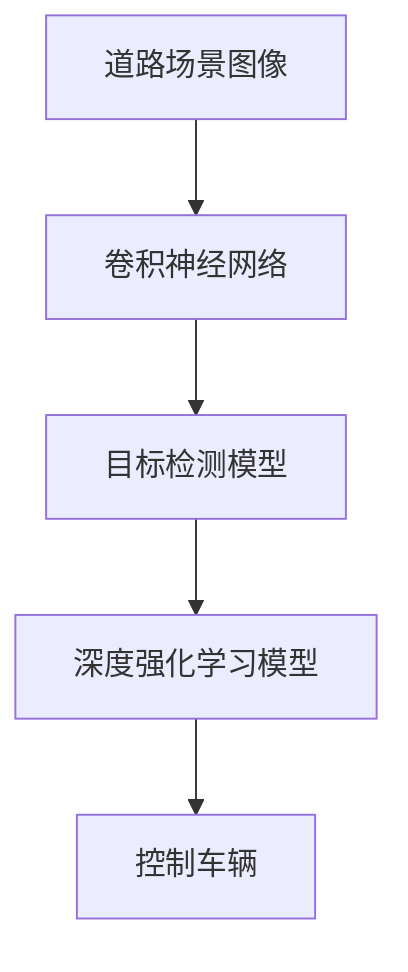
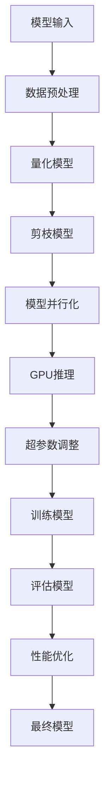

                 

### 引言

在当今技术迅速发展的时代，人工智能（AI）已经成为推动社会进步的关键力量。而AI的大模型应用开发更是成为了一项备受瞩目的热门领域。本文旨在深入探讨大模型应用开发中的关键环节，特别是从单Agent到多Agent系统的迁移与优化。在接下来的内容中，我们将逐步分析AI大模型的基础概念、核心技术，以及应用开发实践，并探讨未来面临的挑战与展望。

首先，我们需要了解AI大模型的基本概念与特点。AI大模型是指具有大规模参数、能够处理大规模数据、实现高效计算的大规模深度学习模型。这些模型在自然语言处理、计算机视觉、推荐系统、强化学习等领域有着广泛的应用。接下来，我们将详细探讨深度学习的基础、神经网络结构、以及常见的深度学习模型，如卷积神经网络（CNN）、循环神经网络（RNN）和生成对抗网络（GAN）。

在了解了AI大模型的核心技术之后，我们将探讨自然语言处理（NLP）和计算机视觉（CV）的基本概念，以及这些技术在图像分类、目标检测、语言模型、文本分类等方面的应用。通过这些技术，我们可以构建出强大的AI Agent，实现自动化决策和智能交互。

接下来，本文将重点关注从单Agent到多Agent系统的迁移。单Agent系统是指单个智能体独立行动和决策的系统，而多Agent系统则是多个智能体协同工作，共同完成任务。我们将分析这两种系统的区别，以及多Agent系统的通信机制和协同策略。

在实际应用开发中，我们需要搭建一个合适的开发环境。本文将介绍如何准备硬件环境和软件环境，以及如何准备和处理数据集。在模型训练与评估阶段，我们将介绍常用的优化算法和超参数调整技巧。

接下来，本文将提供实际的AI Agent开发实战案例，包括聊天机器人和自动驾驶。通过这些案例，读者可以了解如何设计、实现和测试一个AI Agent，并掌握性能优化与调优的技巧。

最后，本文将讨论AI大模型应用面临的挑战，如数据隐私与安全、模型解释性与可解释性，并展望AI大模型的未来发展趋势和社会影响。

通过本文的阅读，读者将能够全面了解AI大模型的应用开发，掌握从单Agent到多Agent系统的迁移技巧，并应对未来AI大模型应用的挑战。

### 关键词

- AI大模型
- 深度学习
- 单Agent与多Agent
- 自然语言处理
- 计算机视觉
- AI Agent开发
- 性能优化
- 数据隐私

### 摘要

本文旨在深入探讨人工智能（AI）大模型的应用开发，特别是从单Agent到多Agent系统的迁移与优化。文章首先介绍了AI大模型的基础概念、特点与应用场景，然后详细讲解了深度学习的基础、神经网络结构以及常见的深度学习模型。接着，文章探讨了自然语言处理和计算机视觉的基本概念及其应用，重点分析了单Agent与多Agent系统的区别、通信机制和协同策略。在应用开发实践中，本文提供了AI Agent的开发环境搭建、数据集准备与处理、模型训练与评估的详细步骤，并分享了实际的开发案例和性能优化技巧。最后，文章讨论了AI大模型应用面临的挑战，并展望了其未来发展。通过本文的阅读，读者将能够全面掌握AI大模型的应用开发，提升其在AI领域的实践能力。

### 文章标题

《大模型应用开发 动手做AI Agent：从单Agent到多Agent的系统迁移与优化》

### 第一部分：AI大模型概述与基础

#### 1.1 AI大模型的定义与特点

AI大模型是指具有大规模参数、能够处理大规模数据、实现高效计算的大规模深度学习模型。它们在自然语言处理、计算机视觉、推荐系统、强化学习等领域有着广泛的应用。以下是对AI大模型的概念、定义、特点及其与普通模型的区别的详细描述。

**概念与定义**

AI大模型是基于深度学习技术发展起来的一种模型。深度学习是一种基于多层神经网络进行特征提取和模式识别的技术，通过多层网络结构，模型能够自动从数据中提取特征，并进行复杂的决策。而AI大模型则进一步扩展了深度学习的应用范围，具有以下特点：

- **大规模参数**：AI大模型通常具有数百万甚至数十亿个参数，这些参数用于调整网络中的权重和偏置，从而提高模型的泛化能力和准确率。
- **大规模数据**：AI大模型需要处理大量数据，以便从中提取有意义的特征。这些数据可以是图像、文本、音频等多种形式。
- **高效计算**：为了处理大规模数据和参数，AI大模型通常依赖于高性能计算资源，如GPU或TPU。

**特点**

AI大模型具有以下几个显著特点：

- **高容错性**：由于模型参数数量庞大，即使部分参数发生错误，整体模型的性能也不会受到太大影响。
- **高鲁棒性**：AI大模型能够处理噪声和异常值，具有较强的适应能力。
- **强泛化能力**：通过训练大量数据，AI大模型能够泛化到未见过的数据上，从而提高模型的实用性和可靠性。
- **强大的特征提取能力**：AI大模型能够自动从数据中提取复杂、有层次的特征，这些特征对于后续的任务处理具有重要作用。

**与普通模型的区别**

与普通模型相比，AI大模型具有以下几个显著区别：

- **参数规模**：AI大模型具有数十亿个参数，而普通模型通常只有数万个参数。
- **数据处理能力**：AI大模型能够处理大规模数据，而普通模型通常只能处理较小规模的数据。
- **计算资源需求**：AI大模型需要更多的高性能计算资源，如GPU或TPU，而普通模型通常可以在CPU上运行。

**示例**

一个典型的AI大模型是GPT-3，它由OpenAI开发，具有1750亿个参数。GPT-3在自然语言处理任务中表现出色，能够生成高质量的自然语言文本。另一个例子是Google的BERT模型，它由数百万个参数组成，在多种自然语言处理任务中取得了很好的效果。

**总结**

AI大模型是一种具有大规模参数、能够处理大规模数据、实现高效计算的大规模深度学习模型。它们在自然语言处理、计算机视觉、推荐系统、强化学习等领域有着广泛的应用。与普通模型相比，AI大模型具有高容错性、高鲁棒性、强泛化能力和强大的特征提取能力。这些特点使得AI大模型在许多复杂的任务中表现出色，推动了人工智能技术的发展。

#### 1.2 AI大模型的分类与应用场景

AI大模型的应用场景非常广泛，涵盖了自然语言处理（NLP）、计算机视觉（CV）、推荐系统（RecSys）、强化学习（RL）等多个领域。以下是对这些分类及其应用场景的详细描述。

**自然语言处理（NLP）**

自然语言处理是AI大模型应用最广泛的领域之一。NLP旨在使计算机理解和处理人类自然语言，包括语音识别、文本分类、情感分析、机器翻译等任务。AI大模型在NLP中具有显著优势，能够处理大规模的文本数据，提取复杂的有用信息。

- **语音识别**：通过训练大规模语音数据集，AI大模型可以识别和转换语音信号为文本。例如，Google的语音识别系统使用基于AI的大模型，能够实现高精度的语音识别。
- **文本分类**：AI大模型可以用于分类大量文本数据，例如垃圾邮件过滤、新闻分类等。通过训练大规模的文本数据集，模型能够学习到不同类别的特征，从而准确地将新文本数据分配到相应的类别。
- **情感分析**：AI大模型可以分析文本数据中的情感倾向，例如正面、负面或中性。这在社交媒体分析、客户反馈处理等场景中具有重要意义。
- **机器翻译**：AI大模型可以用于翻译不同语言之间的文本，例如Google翻译和DeepL翻译系统。这些模型通过大量双语数据集的训练，能够生成高质量、自然的翻译结果。

**计算机视觉（CV）**

计算机视觉是另一个广泛应用的领域，AI大模型在图像分类、目标检测、人脸识别等方面取得了显著成果。

- **图像分类**：AI大模型可以用于将图像分类到预定义的类别中，例如ImageNet竞赛中的1万类物体。通过训练大规模的图像数据集，模型能够学习到不同类别的特征，从而准确地对新图像进行分类。
- **目标检测**：AI大模型可以用于在图像中定位和识别多个目标。这被广泛应用于自动驾驶、视频监控、医疗图像分析等领域。例如，YOLO和SSD等模型在目标检测任务中表现出色。
- **人脸识别**：AI大模型可以用于识别人脸，并在大规模人脸数据集上进行训练。这在安全监控、身份验证等场景中具有重要意义。

**推荐系统（RecSys）**

推荐系统是另一个重要应用领域，AI大模型在用户行为分析、个性化推荐等方面具有显著优势。

- **用户行为分析**：AI大模型可以用于分析用户的历史行为数据，例如浏览记录、购买记录等，从而预测用户的兴趣和偏好。
- **个性化推荐**：AI大模型可以根据用户的历史行为和兴趣，推荐相关的内容或商品。例如，Netflix和Amazon等公司使用AI大模型实现个性化的内容推荐和商品推荐。

**强化学习（RL）**

强化学习是AI大模型在游戏、机器人控制等领域的应用，通过训练模型来学习最优策略。

- **游戏**：AI大模型可以用于训练智能代理，使其能够在游戏中实现高水平的自主决策。例如，OpenAI的Dota 2代理通过强化学习算法实现了人类水平以上的游戏表现。
- **机器人控制**：AI大模型可以用于训练机器人，使其能够在复杂环境中实现自主导航和任务执行。例如，自动驾驶汽车和机器人助理等应用。

**总结**

AI大模型在自然语言处理、计算机视觉、推荐系统、强化学习等多个领域具有广泛的应用。这些模型通过大规模数据训练，能够提取复杂的有用信息，并在各种复杂任务中实现高水平的性能。随着AI大模型的不断发展，其应用领域将更加广泛，推动人工智能技术的发展。

#### 1.3 AI大模型的发展历程与趋势

AI大模型的发展历程可以追溯到20世纪80年代，当时神经网络的研究刚刚起步。最初的神经网络模型参数规模较小，计算资源有限，因此只能应用于一些简单的任务。随着计算机硬件性能的提升和深度学习技术的突破，AI大模型逐渐成为主流。

**发展历程**

1. **初期：以小模型为主**  
   在深度学习初期，模型规模较小，主要应用在简单的图像分类和语音识别任务中。代表性的模型包括LeNet和AlexNet，它们使用了少量的隐藏层和神经元，但取得了显著的成果。

2. **中期：中规模模型兴起**  
   随着计算能力的提升，研究人员开始尝试构建更大规模的模型。中规模模型在图像分类、语音识别和自然语言处理等领域取得了重要突破。代表性的模型包括VGG、ResNet和Wavenet等。

3. **当前：大规模模型成为主流**  
   当前，AI大模型已经成为深度学习领域的主流。这些模型具有数十亿甚至数百亿个参数，能够处理大规模数据，并在各种复杂任务中实现高水平的性能。代表性的模型包括GPT、BERT和Transformer等。

**趋势**

1. **模型参数持续增长**  
   随着硬件性能的提升，AI大模型的参数规模不断增长。更大规模的模型能够提取更丰富的特征，从而在复杂任务中取得更好的性能。

2. **计算能力不断提高**  
   硬件技术的发展，特别是GPU和TPU的普及，为AI大模型的训练提供了强大的计算支持。同时，分布式训练和云计算技术的应用，使得大规模模型的训练更加高效。

3. **应用领域不断扩展**  
   AI大模型在自然语言处理、计算机视觉、推荐系统、强化学习等领域的应用越来越广泛。未来，随着技术的进一步发展，AI大模型将在更多领域发挥作用，推动人工智能技术的发展。

**总结**

AI大模型的发展历程经历了从初期的小模型到中规模模型，再到当前的大规模模型。随着硬件性能的提升和深度学习技术的突破，AI大模型在各个领域取得了显著成果，并成为主流。未来，AI大模型将继续扩展其应用领域，推动人工智能技术的发展。

### 第二部分：AI大模型核心技术

#### 2.1 深度学习基础

深度学习是人工智能（AI）领域的一个重要分支，它通过模拟人脑神经网络的结构和功能，实现对数据的自动学习和处理。深度学习的基本概念、结构以及常见模型是理解和应用AI大模型的基础。

**深度学习的定义**

深度学习（Deep Learning）是一种基于多层神经网络进行特征提取和模式识别的技术。与传统的机器学习方法相比，深度学习具有自动提取层次化特征的能力，能够处理复杂的数据类型，如图像、语音和文本。

**基本概念**

1. **神经网络（Neural Network）**：神经网络是深度学习的基础，它由大量简单的计算单元（神经元）组成，通过调整神经元之间的连接权重和偏置，实现对输入数据的分类和预测。

2. **前向传播（Forward Propagation）**：在前向传播过程中，输入数据通过网络的各层神经元，逐层传递并生成输出。每个神经元将输入值通过激活函数进行非线性变换，得到输出值。

3. **反向传播（Back Propagation）**：反向传播是深度学习训练的核心算法。通过计算损失函数关于模型参数的梯度，反向传播算法能够更新模型参数，以最小化损失函数。

4. **损失函数（Loss Function）**：损失函数用于度量模型预测值与真实值之间的差距。常用的损失函数包括均方误差（MSE）、交叉熵（Cross Entropy）等。

**神经网络的基本结构**

1. **层结构**：神经网络由输入层、隐藏层和输出层组成。输入层接收外部输入数据，隐藏层对输入数据进行特征提取和变换，输出层生成最终预测结果。

2. **神经元**：神经元是神经网络的基本计算单元。它通过加权求和输入值，并使用激活函数进行非线性变换，产生输出。

   ```plaintext
   输出 = 激活函数(加权求和(输入值 * 权重 + 偏置))
   ```

3. **激活函数**：激活函数用于引入非线性，常见的激活函数包括 sigmoid、ReLU、tanh等。

   ```plaintext
   sigmoid(x) = 1 / (1 + e^(-x))
   ReLU(x) = max(0, x)
   tanh(x) = (e^x - e^-x) / (e^x + e^-x)
   ```

**常见的深度学习模型**

1. **卷积神经网络（CNN）**：卷积神经网络是深度学习在计算机视觉领域的重要应用。它通过卷积层和池化层提取图像的局部特征，再通过全连接层进行分类。

   - **卷积层**：卷积层通过卷积操作提取图像的局部特征，卷积核用于滑动窗口，对图像进行特征提取。
   - **池化层**：池化层用于减少特征图的维度，提高模型的鲁棒性。常见的池化操作包括最大池化和平均池化。

2. **循环神经网络（RNN）**：循环神经网络是处理序列数据的强大模型。它通过循环结构保持长期状态信息，适用于自然语言处理、语音识别等任务。

   - **隐藏状态**：RNN中的隐藏状态用于保持序列中的信息，使得模型能够捕捉长距离依赖关系。
   - **门控机制**：门控RNN（如LSTM和GRU）通过门控机制控制信息的流入和流出，从而提高模型的稳定性和计算效率。

3. **生成对抗网络（GAN）**：生成对抗网络是由生成器和判别器组成的一个对抗性训练框架。生成器试图生成逼真的数据，而判别器则试图区分真实数据和生成数据。

   - **生成器（Generator）**：生成器通过随机噪声生成数据，目标是使得生成数据接近真实数据。
   - **判别器（Discriminator）**：判别器用于区分真实数据和生成数据，目标是最大化分类准确性。

**总结**

深度学习是一种基于多层神经网络进行特征提取和模式识别的技术，它通过前向传播和反向传播算法，自动调整模型参数以最小化损失函数。神经网络的基本结构包括输入层、隐藏层和输出层，神经元通过激活函数进行非线性变换。常见的深度学习模型包括卷积神经网络（CNN）、循环神经网络（RNN）和生成对抗网络（GAN），这些模型在不同领域具有广泛的应用。通过理解深度学习的基础概念和模型结构，我们可以更好地应用AI大模型，实现复杂的任务和智能系统。

#### 2.2 神经网络的基本结构

神经网络（Neural Network）是深度学习的基础，其结构决定了模型的学习能力和性能。一个典型的神经网络通常包括输入层、隐藏层和输出层，每层由多个神经元（也称为节点）组成。以下是对神经网络基本结构的详细解释。

**输入层（Input Layer）**

输入层是神经网络的起始层，它接收外部输入的数据。每个输入节点对应一个特征维度，例如，对于一个包含100个像素的图像，每个像素值就是一个输入节点。输入层的功能是将原始数据传递到下一层。



**隐藏层（Hidden Layers）**

隐藏层是神经网络的核心部分，它位于输入层和输出层之间。隐藏层的主要作用是提取输入数据的特征，并通过逐层抽象的方式，将原始数据转换为更高层次的特征表示。神经网络的名字“深度”就来源于它的隐藏层数量。

在隐藏层中，每个神经元都接收来自前一层的所有神经元的输出，通过加权求和并添加偏置，然后应用激活函数进行非线性变换，产生下一层的输入。



**输出层（Output Layer）**

输出层是神经网络的最后一层，它生成最终预测结果。输出层的神经元数量和类型取决于具体任务。例如，在分类任务中，每个神经元可能对应一个类别，输出层通过softmax函数输出每个类别的概率分布。

输出层的计算过程与隐藏层类似，只是输出层的输出是直接用于决策或预测。



**神经元（Neurons）**

神经元是神经网络的基本计算单元，它通过以下步骤进行处理：

1. **加权求和**：每个神经元接收来自前一层所有神经元的输出，并乘以相应的权重，然后进行加权求和。
2. **偏置**：每个神经元添加一个偏置项，用于调整模型的输出。
3. **激活函数**：应用激活函数对加权求和的结果进行非线性变换，常见的激活函数包括 sigmoid、ReLU 和 tanh。



**总结**

神经网络的基本结构包括输入层、隐藏层和输出层。输入层接收外部输入数据，隐藏层提取输入数据的特征并进行逐层抽象，输出层生成最终预测结果。神经元是神经网络的基本计算单元，通过加权求和、偏置和激活函数进行数据处理。理解神经网络的基本结构对于构建和优化深度学习模型至关重要。

#### 2.3 常见的深度学习模型

深度学习模型在计算机视觉、自然语言处理和生成任务中有着广泛的应用。以下是几种常见的深度学习模型及其结构和工作原理。

**卷积神经网络（CNN）**

卷积神经网络（CNN）是计算机视觉领域的重要模型，专门用于图像处理和识别。CNN 的核心在于其卷积层，这些层能够自动提取图像中的特征。

- **卷积层（Convolutional Layer）**：卷积层通过卷积操作提取图像的局部特征。卷积核（也称为滤波器）在图像上滑动，对每个局部区域进行卷积运算，产生特征图。

  ```mermaid
  graph TD
  A[输入图像] --> B[卷积层]
  B --> C[特征图]
  ```

- **池化层（Pooling Layer）**：池化层用于减少特征图的维度，提高模型的鲁棒性。常用的池化操作包括最大池化（Max Pooling）和平均池化（Average Pooling）。

  ```mermaid
  graph TD
  C[特征图] --> D[池化层]
  D --> E[池化结果]
  ```

- **全连接层（Fully Connected Layer）**：在卷积神经网络中，全连接层通常位于网络的末端，将卷积层和池化层提取的高层次特征映射到具体的类别或任务。

  ```mermaid
  graph TD
  E[特征图] --> F[全连接层]
  F --> G[输出层]
  ```

**循环神经网络（RNN）**

循环神经网络（RNN）是处理序列数据的强大模型，适用于自然语言处理、语音识别等任务。RNN 的特点在于其循环结构，能够保留长期状态信息。

- **隐藏状态（Hidden State）**：RNN 通过隐藏状态来维持序列中的信息传递。每个时间步的隐藏状态都依赖于前一个时间步的隐藏状态和当前输入。

  ```mermaid
  graph TD
  I[输入序列] --> J[隐藏状态]
  J --> K[当前输出]
  K --> L[下一个隐藏状态]
  ```

- **门控机制（Gate Mechanism）**：为了解决 RNN 的梯度消失和梯度爆炸问题，引入了门控机制（如 LSTM 和 GRU）。门控机制通过控制信息的流入和流出，使得 RNN 能够更好地捕捉长距离依赖关系。

  ```mermaid
  graph TD
  M[输入序列] --> N[遗忘门]
  N --> O[输入门]
  O --> P[新隐藏状态]
  ```

**生成对抗网络（GAN）**

生成对抗网络（GAN）是一种用于生成数据的高效框架，由生成器和判别器组成。生成器试图生成逼真的数据，而判别器则试图区分真实数据和生成数据。

- **生成器（Generator）**：生成器通过随机噪声生成数据，目标是使得生成数据接近真实数据。

  ```mermaid
  graph TD
  A[随机噪声] --> B[生成器]
  B --> C[生成数据]
  ```

- **判别器（Discriminator）**：判别器用于区分真实数据和生成数据，目标是最大化分类准确性。

  ```mermaid
  graph TD
  D[真实数据] --> E[判别器]
  E --> F[判别结果]
  G[生成数据] --> E
  ```

**总结**

卷积神经网络（CNN）通过卷积层、池化层和全连接层提取图像特征，循环神经网络（RNN）通过隐藏状态和门控机制处理序列数据，生成对抗网络（GAN）通过生成器和判别器对抗训练生成数据。这些模型在不同领域有着广泛的应用，通过理解其结构和工作原理，可以更好地设计和应用深度学习模型。

#### 2.4 自然语言处理（NLP）中的常用模型

自然语言处理（NLP）是人工智能（AI）的重要分支，涉及文本的自动处理和理解。在NLP中，深度学习模型被广泛应用，以下是一些常见的NLP模型及其应用。

**语言模型（Language Model）**

语言模型是NLP的基础，用于预测下一个单词或字符的概率。一个简单的语言模型可以是n-gram模型，它根据前n个单词的历史信息来预测下一个单词。然而，n-gram模型的局限性在于它无法捕捉单词之间的长期依赖关系。

- **n-gram模型**：n-gram模型将文本分割成n个单词的序列，然后计算每个单词序列的概率。例如，三元语言模型考虑了前三个单词的信息。

  ```mermaid
  graph TD
  A[单词1] --> B[单词2]
  B --> C[单词3]
  C --> D[下一个单词]
  ```

**循环神经网络（RNN）**

循环神经网络（RNN）在NLP中有着广泛的应用，特别是在处理序列数据时。RNN通过循环结构保留历史信息，能够捕捉单词之间的长期依赖关系。

- **RNN模型**：RNN中的每个时间步都依赖于前一个时间步的隐藏状态。通过这种方式，RNN能够处理变长的序列数据。

  ```mermaid
  graph TD
  I[输入序列] --> J[隐藏状态]
  J --> K[当前输出]
  K --> L[下一个隐藏状态]
  ```

**长短期记忆网络（LSTM）**

LSTM是RNN的一种变体，用于解决RNN的梯度消失和梯度爆炸问题。LSTM通过门控机制控制信息的流入和流出，使得模型能够更好地捕捉长距离依赖关系。

- **LSTM模型**：LSTM包含输入门、遗忘门和输出门，每个门都控制信息的不同方面。

  ```mermaid
  graph TD
  M[输入序列] --> N[遗忘门]
  N --> O[输入门]
  O --> P[新隐藏状态]
  ```

**门控循环单元（GRU）**

GRU是LSTM的另一种变体，结构更加简单，计算效率更高。GRU通过更新门控制信息的流入和流出。

- **GRU模型**：GRU包含更新门和重置门，每个门都控制信息的不同方面。

  ```mermaid
  graph TD
  Q[输入序列] --> R[更新门]
  R --> S[重置门]
  S --> T[新隐藏状态]
  ```

**注意力机制（Attention Mechanism）**

注意力机制是一种在处理序列数据时提高模型性能的有效方法。它通过为每个输入分配不同的权重，使得模型能够关注到序列中的重要信息。

- **注意力模型**：注意力机制通过计算当前输入和隐藏状态之间的相似度，为每个输入分配权重。

  ```mermaid
  graph TD
  U[输入序列] --> V[注意力权重]
  V --> W[加权输出]
  ```

**Transformer模型**

Transformer是近年来在NLP中取得显著成功的模型，它通过多头注意力机制实现了全局信息的有效捕捉。

- **Transformer模型**：Transformer使用自注意力机制，每个位置的输出依赖于整个序列的所有位置。

  ```mermaid
  graph TD
  X[输入序列] --> Y[自注意力层]
  Y --> Z[输出序列]
  ```

**总结**

自然语言处理中的常用模型包括语言模型、循环神经网络（RNN）、长短期记忆网络（LSTM）、门控循环单元（GRU）、注意力机制和Transformer模型。这些模型在不同的NLP任务中有着广泛的应用，通过逐步升级和改进，使得NLP模型的性能不断提升。

### 第三部分：AI大模型应用开发实践

#### 3.1 从单Agent到多Agent系统的概念与特点

在人工智能（AI）领域，单Agent系统和多Agent系统是两种重要的系统架构。单Agent系统是指单个智能体独立行动和决策的系统，而多Agent系统则是由多个智能体协同工作，共同完成任务。以下是对这两种系统的概念、特点及其区别的详细描述。

**单Agent系统**

单Agent系统是指单个智能体独立进行行动和决策的系统。在这种系统中，智能体拥有自己的感知能力、决策能力和行动能力，但它们独立工作，没有与其他智能体直接交互的能力。单Agent系统的主要特点如下：

1. **独立性**：每个智能体独立执行任务，不受其他智能体的影响。
2. **单一目标**：智能体通常只有一个明确的目标，例如完成路径规划、目标识别或问题解决。
3. **简单性**：单Agent系统相对简单，易于设计和实现。
4. **局限性**：由于缺乏与其他智能体的协作，单Agent系统在处理复杂任务时可能存在局限。

**多Agent系统**

多Agent系统（Multi-Agent System，MAS）是由多个智能体组成的系统，这些智能体可以独立行动，也可以相互协作，共同完成任务。多Agent系统的特点如下：

1. **协作性**：智能体之间通过通信和协调来共同完成任务，从而实现更高的效率和性能。
2. **分布式**：多Agent系统中的智能体可以分布在不同的地理位置，从而提高系统的可扩展性和容错性。
3. **复杂性**：多Agent系统通常比单Agent系统更复杂，需要考虑智能体之间的交互、通信和协作机制。
4. **广泛应用**：多Agent系统在许多领域都有广泛应用，如智能交通、机器人协作、分布式计算和游戏等。

**单Agent系统与多Agent系统的区别**

单Agent系统与多Agent系统的主要区别在于智能体的协作方式和任务执行模式：

1. **协作方式**：单Agent系统中的智能体独立执行任务，不与其他智能体协作；而在多Agent系统中，智能体通过通信和协作来实现共同的目标。
2. **任务执行**：单Agent系统通常只有一个明确的目标，而多Agent系统可能需要多个智能体共同协作才能完成任务。
3. **复杂性**：单Agent系统相对简单，而多Agent系统需要考虑更多的交互和协作机制，因此更复杂。
4. **效率**：多Agent系统在处理复杂任务时通常比单Agent系统更高效，因为多个智能体可以同时工作，分担任务。

**总结**

单Agent系统和多Agent系统是人工智能领域中的两种重要系统架构。单Agent系统具有独立性、单一目标和简单性，适用于简单的任务；而多Agent系统具有协作性、分布式和复杂性，适用于复杂任务。理解这两种系统的概念和特点对于设计和实现高效的AI系统至关重要。

#### 3.2 多Agent系统的通信机制

在多Agent系统中，智能体之间的通信机制是确保系统协调运作的关键。有效的通信机制可以促进智能体之间的信息交换和协同工作，从而提高系统的整体性能和鲁棒性。以下是对多Agent系统通信机制的详细描述。

**直接通信**

直接通信是指智能体通过共享知识库或直接消息传递进行通信。这种通信方式简单直观，适用于智能体之间距离较近、通信延迟较低的场景。

- **共享知识库**：智能体可以访问一个共享的知识库，获取其他智能体的状态信息和决策。这种机制在分布式计算和协同机器人控制中应用广泛。

  ```mermaid
  graph TD
  A[智能体1] --> B[知识库]
  B --> C[智能体2]
  ```

- **直接消息传递**：智能体之间可以直接发送消息，传递状态信息和决策。这种机制适用于实时性要求较高的场景，如实时交通控制和智能调度。

  ```mermaid
  graph TD
  A[智能体1] --> D[智能体2]
  D --> E[消息]
  ```

**间接通信**

间接通信是指智能体通过第三方中介或广播通信进行通信。这种通信方式适用于智能体之间距离较远、直接通信不便的场景。

- **第三方中介**：智能体通过第三方中介进行通信，中介负责消息的转发和协调。这种机制在分布式系统和互联网应用中广泛应用。

  ```mermaid
  graph TD
  A[智能体1] --> B[中介]
  B --> C[智能体2]
  ```

- **广播通信**：智能体通过广播方式发送消息，所有其他智能体都可以接收到消息。这种机制适用于大型分布式系统，如物联网和智能电网。

  ```mermaid
  graph TD
  A[智能体1] --> D[智能体2]
  D --> E[智能体3]
  ```

**通信协议**

多Agent系统的通信机制通常需要依赖特定的通信协议，以确保消息的有效传递和系统的协调运作。常见的通信协议包括：

- **传输控制协议/因特网协议（TCP/IP）**：TCP/IP是互联网通信的基础协议，适用于广域网的可靠数据传输。

- **高级消息队列协议（AMQP）**：AMQP是一种消息中间件协议，支持异步消息传递和可靠消息传输。

- **简单对象访问协议（SOAP）**：SOAP是一种基于XML的通信协议，适用于企业级应用程序的远程过程调用。

- **超文本传输协议（HTTP）**：HTTP是Web服务的标准协议，适用于Web应用中的消息传递和交互。

**总结**

多Agent系统的通信机制包括直接通信和间接通信。直接通信通过共享知识库和直接消息传递实现，适用于实时性要求较高的场景；间接通信通过第三方中介和广播通信实现，适用于距离较远或分布式系统。选择合适的通信机制和通信协议对于确保多Agent系统的有效运作至关重要。

#### 3.3 多Agent系统的协同策略

多Agent系统中的协同策略是指多个智能体如何相互协作，共同完成任务。有效的协同策略能够提高系统的整体性能和适应性，确保每个智能体在执行任务时能够协调一致。以下是对几种常见的多Agent系统协同策略的详细描述。

**集中式协同策略**

集中式协同策略是指所有智能体共享全局信息，并基于这些信息做出决策。在集中式协同策略中，一个中央智能体负责收集所有智能体的状态信息，并生成全局决策，然后将其传达给各个智能体。

- **优势**：
  - 系统整体视图：所有智能体共享全局信息，可以更好地理解整体任务和目标。
  - 简化通信：智能体之间只需要与中央智能体进行通信，减少通信复杂度。

- **劣势**：
  - 中央智能体瓶颈：中央智能体需要处理大量信息，可能导致系统性能瓶颈。
  - 系统可靠性：如果中央智能体出现故障，整个系统可能会崩溃。

**分布式协同策略**

分布式协同策略是指智能体通过局部信息交互，共同完成任务。每个智能体只了解自身的状态和局部环境信息，并通过局部通信与邻近智能体进行协作。

- **优势**：
  - 可扩展性：智能体数量增加时，系统仍然可以高效运作，不需要额外的通信负担。
  - 系统容错性：单个智能体或局部网络的故障不会影响整个系统的运作。

- **劣势**：
  - 局部视角：智能体只能基于局部信息做出决策，可能无法获得全局最优解。
  - 通信复杂度：分布式系统中，智能体之间的通信复杂度较高，需要考虑数据同步和一致性。

**混合式协同策略**

混合式协同策略结合了集中式和分布式协同策略的优势，通过将全局信息和局部信息结合起来，实现更高效的协同工作。

- **优势**：
  - 灵活性：智能体可以根据任务需求和环境变化，灵活选择集中式或分布式策略。
  - 性能优化：通过结合全局和局部信息，可以优化决策过程，提高系统性能。

- **劣势**：
  - 复杂性：混合式协同策略需要处理更复杂的信息和决策过程，系统实现难度较大。

**协作策略的应用场景**

- **智能交通系统**：集中式协同策略可以用于交通信号控制，通过中央智能体收集交通数据，优化交通流量。分布式协同策略可以用于车辆之间的协同控制，实现智能导航和交通拥堵缓解。
- **机器人协作**：混合式协同策略可以用于机器人团队的协作，中央智能体负责全局规划和任务分配，而机器人通过局部感知和通信进行协作执行。
- **智能电网**：分布式协同策略可以用于智能电网中的设备控制和能源分配，每个设备只与邻近设备通信，实现高效和可靠的能源管理。

**总结**

多Agent系统的协同策略包括集中式、分布式和混合式三种。集中式协同策略提供全局视角和简化通信，但存在中央智能体瓶颈和可靠性问题。分布式协同策略具有高可扩展性和容错性，但可能无法获得全局最优解。混合式协同策略结合了集中式和分布式策略的优势，提供灵活性和性能优化。选择合适的协同策略对于实现高效的多Agent系统至关重要。

### 第5章：AI Agent开发环境搭建

在开始AI Agent的开发之前，我们需要搭建一个合适的开发环境。这包括硬件环境和软件环境的配置，以及数据集的准备与处理。以下是对每个步骤的详细描述。

#### 5.1 硬件环境准备

硬件环境是AI Agent开发的基础，特别是对于需要大量计算和存储资源的深度学习模型。以下是硬件环境准备的关键点：

1. **GPU配置**：GPU（图形处理单元）在深度学习任务中扮演着重要角色，因为它们能够提供并行计算能力，显著加速模型的训练和推理过程。选择GPU时，需要考虑以下因素：
   - **计算能力**：根据AI Agent的复杂度和规模，选择具有足够计算能力的GPU。NVIDIA的GPU，如Tesla V100、A100和A40，是深度学习任务的常用选择。
   - **内存大小**：确保GPU具有足够的内存来存储模型和数据。较大的内存容量可以支持更大规模和更复杂的模型训练。
   - **温度管理**：GPU在工作过程中会产生大量热量，因此需要良好的散热系统来保持其稳定运行。

2. **计算能力**：除了GPU，还需要确保整个系统的计算能力足够，以支持AI Agent的开发和测试。这可能需要多GPU并行计算或使用高性能CPU。

3. **存储容量**：AI Agent的开发需要处理大量数据，因此需要足够的存储空间来存储训练数据和模型文件。使用SSD（固态硬盘）可以提高数据读写速度，从而加速开发过程。

#### 5.2 软件环境配置

软件环境包括操作系统、编程语言和深度学习框架的安装和配置。以下是软件环境配置的关键点：

1. **操作系统**：通常使用Linux操作系统，因为其稳定性和开源特性，适合深度学习开发和运行。常用的Linux发行版包括Ubuntu、CentOS等。

2. **编程语言**：Python是深度学习开发的主流编程语言，其丰富的库和工具支持使得开发者可以高效地进行模型开发。确保安装Python环境和相关依赖，如NumPy、Pandas等。

3. **深度学习框架**：深度学习框架是AI Agent开发的核心工具，用于构建、训练和部署深度学习模型。常用的深度学习框架包括TensorFlow、PyTorch和Keras。以下是这些框架的简要介绍：

   - **TensorFlow**：由Google开发，具有强大的生态系统和丰富的API，适用于各种深度学习任务。TensorFlow提供了灵活的动态图计算和静态图计算模式。
   - **PyTorch**：由Facebook开发，以其动态计算图和简洁的API受到开发者喜爱。PyTorch支持自动微分，使得模型训练更加直观。
   - **Keras**：基于Theano和TensorFlow开发，是一个高层次的深度学习框架，提供简洁的API，易于使用。Keras可以与TensorFlow和Theano后端结合使用。

4. **其他库和工具**：安装其他常用库和工具，如TensorBoard（用于可视化模型训练过程）、Matplotlib（用于数据可视化）和Scikit-learn（用于机器学习算法）。

#### 5.3 数据集准备与处理

AI Agent的开发依赖于大量高质量的数据集。以下是数据集准备与处理的关键步骤：

1. **数据收集**：根据AI Agent的任务需求，收集相关的数据集。这些数据集可以来自公共数据集，如ImageNet、CIFAR-10、MNIST等，也可以是自定义数据集。

2. **数据预处理**：对收集到的数据进行预处理，以提高模型训练效果和性能。预处理步骤包括：
   - **数据清洗**：去除噪声和异常值，确保数据质量。
   - **数据标准化**：将数据缩放到相同的范围，如0到1或-1到1，以便模型更好地学习。
   - **数据增强**：通过旋转、缩放、裁剪等操作生成更多样化的数据，提高模型的泛化能力。

3. **数据分割**：将数据集分割为训练集、验证集和测试集，以便在训练过程中进行模型评估和调优。

4. **数据加载**：使用深度学习框架提供的工具，如TensorFlow的Dataset API或PyTorch的DataLoader，加载和处理数据。这些工具可以高效地批量处理数据，并提供数据预处理功能。

#### 5.4 环境配置示例

以下是一个简单的AI Agent开发环境配置示例，使用Ubuntu操作系统和Python编程语言：

1. **安装操作系统**：
   - 使用Ubuntu 20.04 LTS版本。

2. **安装依赖**：
   - 安装Python 3.8及以上版本。
   - 安装CUDA Toolkit和cuDNN库，以支持GPU加速。

3. **安装深度学习框架**：
   - 安装TensorFlow：
     ```bash
     pip install tensorflow-gpu
     ```
   - 安装PyTorch：
     ```bash
     pip install torch torchvision torchaudio
     ```

4. **安装其他库**：
   - 安装Matplotlib：
     ```bash
     pip install matplotlib
     ```

5. **数据集准备**：
   - 下载ImageNet数据集。
   - 将数据集分割为训练集、验证集和测试集。

6. **数据预处理**：
   - 编写数据预处理脚本，进行数据清洗、标准化和数据增强。

7. **测试环境**：
   - 运行一个简单的深度学习模型，确保环境配置正确。

通过以上步骤，我们可以搭建一个基本的AI Agent开发环境，为后续的模型训练和优化打下基础。

#### 5.5 开发环境配置总结

AI Agent的开发环境配置是AI Agent成功开发的关键步骤。通过合适的硬件环境和软件环境配置，我们可以确保模型训练和优化的高效性和稳定性。以下是环境配置的要点总结：

- **GPU配置**：选择计算能力和内存大小合适的GPU，并确保良好的散热系统。
- **软件环境**：安装适合深度学习开发的操作系统、编程语言和深度学习框架。
- **数据集准备**：收集和处理高质量的数据集，进行数据预处理和分割。
- **工具与库**：安装其他常用的库和工具，如TensorBoard、Matplotlib等。

通过合理配置开发环境，我们可以为AI Agent的开发和优化提供坚实的基础，从而实现高效的AI应用。

### 第6章：AI Agent开发实战

在了解了AI大模型的基础知识和技术后，接下来我们将通过实际的开发案例来深入探讨如何构建和优化AI Agent。在本章中，我们将首先介绍AI Agent的设计与实现，然后详细分析一个聊天机器人的案例，最后探讨自动驾驶的开发过程。

#### 6.1 AI Agent设计与实现

**设计**

AI Agent的设计过程通常包括以下几个步骤：

1. **功能需求分析**：明确AI Agent需要实现的功能，例如语音识别、自然语言理解、决策生成等。
2. **系统架构设计**：根据功能需求，设计AI Agent的系统架构，包括数据处理层、模型层和决策层。
3. **接口设计**：定义AI Agent与外部系统或用户的接口，如API接口、命令行接口等。

**实现**

AI Agent的实现涉及以下几个关键环节：

1. **数据处理**：根据系统架构，实现数据预处理和特征提取。例如，在自然语言处理任务中，需要进行分词、词性标注和词嵌入等操作。
2. **模型训练**：选择合适的深度学习模型，并在训练数据上进行训练。例如，使用卷积神经网络（CNN）处理图像数据，使用循环神经网络（RNN）处理序列数据。
3. **模型优化**：通过调整超参数、优化算法和正则化方法，提高模型的性能。例如，使用学习率调整、批量大小调整和正则化技术。
4. **决策生成**：基于训练好的模型，实现决策生成模块，例如在聊天机器人中，根据用户的输入生成合适的回复。

**示例**

以下是一个简单的AI Agent设计示例，用于实现一个文本分类任务：



在这个示例中，输入文本经过分词器、词性标注和词嵌入处理后，输入到卷积神经网络中，通过全连接层生成最终输出类别。

#### 6.2 聊天机器人案例

聊天机器人是一种常见的AI Agent，能够与用户进行自然语言交互。以下是一个聊天机器人的开发过程：

**数据准备**

1. **数据收集**：收集大量对话数据，包括用户的输入和机器人的回复。
2. **数据清洗**：去除无效数据和噪声，确保数据质量。

**模型选择**

1. **语言模型**：选择合适的语言模型，例如基于循环神经网络（RNN）或变压器（Transformer）的语言模型。
2. **对话管理**：使用对话管理模型，例如序列到序列（Seq2Seq）模型，用于生成合适的回复。

**模型训练**

1. **数据预处理**：对对话数据进行分词、编码和序列化。
2. **模型训练**：使用训练数据训练语言模型和对话管理模型。
3. **模型优化**：通过交叉熵损失函数和梯度下降优化算法，调整模型参数。

**模型评估**

1. **准确率**：计算模型预测的准确率，以评估模型的性能。
2. **F1分数**：计算模型预测的精确率和召回率的调和平均，以综合评估模型的性能。

**应用场景**

聊天机器人可以应用于多种场景，如客户服务、智能助手和社交互动等。以下是一个应用场景示例：



在这个示例中，用户输入经过分词器、词性标注和词嵌入处理后，输入到语言模型和对话管理模型中，生成合适的回复并输出。

#### 6.3 自动驾驶案例

自动驾驶是AI Agent在计算机视觉和决策控制领域的应用。以下是一个自动驾驶的开发过程：

**数据准备**

1. **数据收集**：收集大量道路场景图像和传感器数据，包括摄像头、激光雷达和GPS等。
2. **数据清洗**：去除无效数据和噪声，确保数据质量。

**模型选择**

1. **图像分类模型**：选择合适的图像分类模型，例如卷积神经网络（CNN）。
2. **目标检测模型**：选择合适的目标检测模型，例如YOLO或SSD。
3. **决策控制模型**：选择合适的决策控制模型，例如深度强化学习（DRL）。

**模型训练**

1. **数据预处理**：对道路场景图像进行数据增强、归一化和裁剪等操作。
2. **模型训练**：使用训练数据分别训练图像分类模型、目标检测模型和决策控制模型。
3. **模型优化**：通过交叉熵损失函数、平滑损失函数和Q-learning算法，调整模型参数。

**模型评估**

1. **准确率**：计算模型预测的准确率，以评估模型的性能。
2. **召回率**：计算模型预测的召回率，以评估模型的检测能力。
3. **F1分数**：计算模型预测的精确率和召回率的调和平均，以综合评估模型的性能。

**应用场景**

自动驾驶可以应用于多种场景，如无人出租车、无人配送和无人驾驶货车等。以下是一个应用场景示例：



在这个示例中，道路场景图像经过卷积神经网络处理，提取特征并输入到目标检测模型中，检测道路上的物体。然后，深度强化学习模型根据目标检测结果生成控制信号，控制车辆进行自动驾驶。

通过以上案例，我们可以看到AI Agent在聊天机器人和自动驾驶等领域的广泛应用。在实际开发过程中，需要结合具体应用场景，选择合适的模型和算法，进行模型训练和优化，以实现高效的AI Agent。同时，也需要关注模型的解释性和可解释性，确保AI Agent的决策过程透明和可靠。

### 第7章：AI Agent性能优化与调优

在AI Agent的开发过程中，性能优化与调优是确保模型在实际应用中表现优异的关键步骤。性能优化不仅能够提高模型的训练速度和推理速度，还能提升模型的准确率和泛化能力。在本章中，我们将探讨性能优化和调优的策略，包括模型压缩、推理加速和超参数调整。

#### 7.1 模型压缩

模型压缩是一种通过减少模型参数数量和计算量来提高模型运行效率的技术。以下是一些常见的模型压缩策略：

1. **知识蒸馏（Knowledge Distillation）**：
   知识蒸馏是一种将大量参数的“教师”模型的知识传递给较小参数的“学生”模型的方法。通过训练“学生”模型来模仿“教师”模型的输出，从而减少模型参数。

   ```plaintext
   teacher_output = teacher_model(x)
   student_output = student_model(x)
   loss = distillation_loss(student_output, teacher_output)
   ```

2. **模型剪枝（Model Pruning）**：
   模型剪枝通过移除模型中不重要的连接和神经元来减少模型大小。剪枝可以通过训练前的预剪枝（pre-pruning）或训练后的后剪枝（post-pruning）来实现。

   ```plaintext
   prune_weights = np.abs(model.weights)
   threshold = np.mean(prune_weights)
   pruned_weights = prune_weights < threshold
   model.weights = model.weights * pruned_weights
   ```

3. **量化（Quantization）**：
   量化是一种将模型中的浮点数权重转换为较低精度的整数表示的方法。量化可以显著减少模型的存储需求和计算量。

   ```plaintext
   quantized_weights = quantize_weights(model.weights, quantization_bits)
   model.weights = quantized_weights
   ```

#### 7.2 推理加速

推理加速是提高AI Agent在实际应用中运行速度的关键。以下是一些常用的推理加速策略：

1. **GPU优化**：
   使用GPU进行推理可以显著提高计算速度。通过合理分配GPU内存、优化GPU计算和利用CUDA等工具，可以进一步提高GPU的利用率。

   ```mermaid
   graph TD
   A[模型输入] --> B[GPU推理]
   B --> C[模型输出]
   ```

2. **模型并行化**：
   模型并行化通过将模型拆分为多个部分，并在多个GPU或计算单元上同时执行，从而提高推理速度。

   ```mermaid
   graph TD
   A[模型输入] --> B1[GPU1推理]
   A --> B2[GPU2推理]
   B1 --> C1[模型输出]
   B2 --> C2[模型输出]
   C1 --> D[合并输出]
   C2 --> D
   ```

3. **量化与剪枝**：
   通过在推理阶段应用模型压缩技术，如量化与剪枝，可以进一步减少模型大小和计算量，提高推理速度。

   ```mermaid
   graph TD
   A[模型输入] --> B[量化模型]
   B --> C[剪枝模型]
   C --> D[推理]
   ```

#### 7.3 调优技巧

超参数调整是提高模型性能的重要步骤。以下是一些常用的调优技巧：

1. **学习率调整**：
   学习率是影响模型收敛速度和稳定性的关键超参数。通过调整学习率，可以找到最优的学习速率。

   ```mermaid
   graph TD
   A[初始学习率] --> B[训练模型]
   B --> C[调整学习率]
   C --> D[继续训练]
   ```

2. **批量大小调整**：
   批量大小影响模型的稳定性和计算效率。通过调整批量大小，可以找到最优的批量大小。

   ```mermaid
   graph TD
   A[初始批量大小] --> B[训练模型]
   B --> C[调整批量大小]
   C --> D[继续训练]
   ```

3. **正则化方法**：
   正则化方法如L1和L2正则化可以防止模型过拟合，提高模型的泛化能力。

   ```mermaid
   graph TD
   A[模型训练] --> B[L1正则化]
   B --> C[L2正则化]
   ```

4. **网格搜索与贝叶斯优化**：
   网格搜索和贝叶斯优化是常用的超参数调整方法。网格搜索通过遍历所有可能的超参数组合，找到最优组合；贝叶斯优化则通过基于概率模型搜索最优超参数。

   ```mermaid
   graph TD
   A[超参数空间] --> B[网格搜索]
   B --> C[最优超参数]
   A --> D[贝叶斯优化]
   D --> E[最优超参数]
   ```

#### 7.4 综合策略

在实际应用中，通常需要综合运用上述优化策略，以实现最佳性能。以下是一个综合性能优化与调优的示例：



通过以上综合策略，我们可以有效提升AI Agent的性能，实现高效、准确的模型训练和推理。

### 第8章：AI大模型应用面临的挑战

尽管AI大模型在各个领域取得了显著的成果，但其在实际应用过程中仍面临诸多挑战。这些挑战不仅涉及到技术层面，还包括伦理、社会和经济等方面。以下是对这些挑战的详细分析。

#### 8.1 数据隐私与安全

数据隐私和安全是AI大模型应用中最重要的挑战之一。AI大模型通常需要处理大量敏感数据，如个人健康记录、财务信息、位置数据等。这些数据一旦泄露，可能会对个人隐私和安全造成严重威胁。

**数据隐私泄露**

数据隐私泄露是AI大模型面临的主要风险之一。数据泄露可能由黑客攻击、内部人员恶意行为或系统漏洞等原因导致。为了防止数据泄露，需要采取以下措施：

- **加密**：对敏感数据进行加密处理，确保数据在传输和存储过程中的安全性。
- **访问控制**：设置严格的访问控制机制，确保只有授权人员才能访问敏感数据。
- **匿名化**：通过数据匿名化技术，将个人识别信息从数据中去除，降低隐私泄露风险。

**数据安全**

数据安全是确保数据不被未授权访问、篡改或破坏的关键。以下是一些数据安全措施：

- **安全协议**：使用安全协议，如HTTPS、SSL/TLS等，确保数据在传输过程中的安全性。
- **安全审计**：定期进行安全审计，检测潜在的安全漏洞，并及时修复。
- **数据备份**：定期进行数据备份，以防止数据丢失。

**示例**

假设一个AI大模型用于个人健康记录分析，该模型需要处理用户的医疗数据。为了确保数据隐私和安全，可以采取以下措施：

- **数据加密**：对医疗数据进行加密存储和传输。
- **访问控制**：只有授权的医疗人员和研究人员才能访问数据。
- **匿名化**：将个人识别信息从医疗数据中去除，仅保留必要的信息用于分析。
- **安全协议**：使用HTTPS和SSL/TLS协议确保数据传输的安全。
- **安全审计**：定期进行安全审计，检测潜在的安全漏洞，并修复。

通过上述措施，可以有效降低AI大模型应用中的数据隐私和安全风险。

#### 8.2 模型解释性与可解释性

模型解释性与可解释性是AI大模型应用中的另一个重要挑战。传统机器学习模型，如线性回归和决策树，具有较好的可解释性，而深度学习模型，如卷积神经网络（CNN）和生成对抗网络（GAN），通常被视为“黑箱”模型，难以解释其内部决策过程。

**模型解释性**

模型解释性指的是模型在决策过程中提供透明性和可理解性的程度。一个具有良好解释性的模型能够清晰地展示其决策依据和推理过程，从而提高用户的信任度。

- **透明模型**：透明模型是指能够直观展示其决策过程的模型。例如，线性回归和决策树模型可以通过参数和决策路径进行解释。
- **黑箱模型**：黑箱模型是指内部结构复杂，难以直观解释的模型。例如，深度学习模型通常被视为黑箱模型。

**模型可解释性**

模型可解释性是指通过可视化技术、解释性算法等手段，使得黑箱模型的可解释性得到提升。以下是一些提高模型可解释性的方法：

- **可视化技术**：通过可视化技术，如热力图、决策树图等，展示模型的决策过程和特征重要性。
- **解释性算法**：开发解释性算法，如LIME（Local Interpretable Model-agnostic Explanations）和SHAP（SHapley Additive exPlanations），为黑箱模型提供解释。

**示例**

假设一个深度学习模型用于医疗诊断，该模型需要对患者的影像数据进行分类。为了提高模型的可解释性，可以采取以下措施：

- **可视化技术**：通过热力图展示模型在影像数据上的注意力分布，帮助医生理解模型关注的区域。
- **解释性算法**：使用LIME或SHAP算法，为每个分类结果提供解释，展示模型对每个特征的依赖程度。

通过提高模型的可解释性，医生可以更清晰地理解模型的决策依据，从而提高诊断的准确性和可靠性。

#### 8.3 伦理问题

AI大模型在应用过程中可能会引发一系列伦理问题，包括数据公平性、算法偏见和隐私泄露等。以下是对这些伦理问题的分析。

**数据公平性**

数据公平性是指AI大模型在数据处理和应用过程中，不因种族、性别、年龄等因素产生不公平的歧视。以下是一些数据公平性的挑战：

- **数据偏见**：如果训练数据存在偏见，模型可能会继承这些偏见，导致不公平的决策。
- **公平性评估**：评估模型是否在各个群体中表现出公平性，并采取措施纠正不公平性。

**算法偏见**

算法偏见是指AI大模型在决策过程中可能表现出对某些群体的不公平偏好。以下是一些算法偏见的挑战：

- **数据偏见纠正**：通过数据预处理和算法调整，减少数据偏见对模型的影响。
- **算法公平性评估**：使用公平性评估指标，如性别公平性、种族公平性等，评估模型的公平性。

**隐私泄露**

隐私泄露是指AI大模型在数据处理和应用过程中，可能泄露用户的敏感信息。以下是一些隐私泄露的挑战：

- **隐私保护算法**：开发隐私保护算法，如差分隐私，确保用户隐私不被泄露。
- **隐私评估**：定期进行隐私评估，确保模型在数据处理过程中遵循隐私保护原则。

**示例**

假设一个AI大模型用于招聘，该模型需要分析候选人的简历和申请信息。为了确保数据公平性和算法偏见，可以采取以下措施：

- **数据预处理**：去除简历中的姓名、性别、年龄等可能引发偏见的信息。
- **算法公平性评估**：使用性别公平性评估指标，确保模型在招聘过程中对所有性别表现出公平性。
- **隐私保护**：对简历和申请信息进行加密处理，确保敏感信息不被泄露。

通过上述措施，可以有效降低AI大模型应用中的伦理风险，确保模型在数据处理和应用过程中遵循公平性和隐私保护原则。

### 第9章：AI大模型的未来展望

随着技术的不断进步，AI大模型在人工智能领域正发挥着越来越重要的作用。以下是对AI大模型未来发展趋势的展望，以及这些技术进步对社会和经济带来的潜在影响。

#### 9.1 AI大模型的发展趋势

**模型规模持续增长**

随着硬件性能的提升和分布式计算技术的进步，AI大模型的规模将继续增长。未来的AI大模型可能包含数十亿甚至数千亿个参数，这使得模型能够提取更加复杂和精细的特征。例如，Transformer模型已经在多个任务中取得了显著的成果，其大规模版本如GPT-3和GATSBY等，展现了强大的学习和泛化能力。

**计算能力提升**

硬件技术的发展，尤其是AI专用芯片（如TPU、GPU）和量子计算的应用，将进一步推动AI大模型计算能力的提升。这些高性能计算资源将使得大规模模型的训练和推理更加高效，从而加速AI大模型在不同领域的应用。

**应用领域扩展**

AI大模型的应用领域将不断扩展，从传统的自然语言处理、计算机视觉和推荐系统，延伸到医疗、金融、教育、智能制造等更多领域。例如，在医疗领域，AI大模型可以帮助医生进行疾病诊断和治疗方案推荐；在金融领域，AI大模型可以用于风险管理、信用评估和股票预测等。

**多模态融合**

未来的AI大模型将能够处理多种类型的数据，实现多模态融合。通过整合图像、文本、音频和视频等多种数据，AI大模型将能够提供更加全面和精准的智能服务。例如，在虚拟助手领域，多模态AI大模型可以同时处理用户的语音、文本和手势，提供更加自然的交互体验。

**自动化与协作**

随着AI大模型的发展，自动化和协作将变得更加普遍。AI大模型可以帮助人类进行复杂的任务，如自动驾驶、机器人协作和智能监控等。同时，AI大模型之间的协作也将提高系统的整体性能和适应性，实现更加智能和高效的解决方案。

#### 9.2 AI大模型的社会影响

**伦理问题**

AI大模型的应用带来了新的伦理问题，如隐私泄露、数据偏见和算法透明性等。未来，随着AI大模型在更多领域得到应用，这些问题将更加突出。因此，需要制定相应的伦理规范和法律法规，确保AI大模型的应用符合道德和社会价值。

**就业影响**

AI大模型的发展将对就业市场产生深远影响。一方面，AI大模型可以自动化许多重复性、低技能的工作，从而降低人力成本，提高生产效率。另一方面，AI大模型也可能导致某些行业的工作岗位减少，从而引发就业结构的变化。为了应对这一挑战，需要加强职业技能培训和人才转型，以适应新的就业市场需求。

**经济影响**

AI大模型的应用将推动人工智能产业的发展，带来巨大的经济价值。例如，AI大模型可以帮助企业提高运营效率、降低成本、开拓新市场等。同时，AI大模型也将促进创新和创业，推动新技术的出现和商业模式的变革。然而，AI大模型的发展也可能导致一些行业和企业的衰落，因此需要合理引导和规划，确保经济结构的优化和可持续发展。

**社会公正**

AI大模型在应用过程中需要关注社会公正问题，确保其应用不会加剧社会不平等和歧视。未来，需要建立公平、透明和可解释的AI大模型，使其在各个群体中表现出公平性和包容性。同时，还需要加强对AI大模型应用的监管和评估，确保其应用符合社会伦理和道德标准。

**总结**

AI大模型的发展趋势包括模型规模持续增长、计算能力提升、应用领域扩展、多模态融合和自动化与协作等。这些技术进步将对社会和经济带来深远影响，包括伦理问题、就业影响、经济影响和社会公正等方面。未来，需要综合考虑这些因素，推动AI大模型的健康、可持续发展，为人类社会带来更大的福祉。

### 附录：AI大模型应用开发工具与资源

在AI大模型应用开发过程中，有许多工具和资源可以帮助开发者提高效率、优化模型性能，以及更好地理解和使用这些先进的模型。以下是一些常用的工具与资源介绍。

#### 附录 A：AI大模型开发工具

**深度学习框架**

- **TensorFlow**：由Google开发的开源深度学习框架，提供了丰富的API和工具，支持动态图和静态图两种计算模式。TensorFlow在科研和工业界都有广泛的应用。
  - 官网：[TensorFlow官网](https://www.tensorflow.org/)

- **PyTorch**：由Facebook开发的深度学习框架，以其动态计算图和简洁的API受到许多研究者和开发者的青睐。PyTorch支持自动微分，使得模型训练更加直观。
  - 官网：[PyTorch官网](https://pytorch.org/)

- **Keras**：一个高层次的深度学习API，兼容TensorFlow和Theano后端，提供了简洁、高效的模型构建和训练接口。Keras常用于快速原型设计和模型开发。
  - 官网：[Keras官网](https://keras.io/)

**计算机视觉库**

- **OpenCV**：一个开源的计算机视觉和机器学习软件库，提供了丰富的计算机视觉算法和功能，适用于图像处理、目标检测、人脸识别等任务。
  - 官网：[OpenCV官网](https://opencv.org/)

- **PyTorch-Vision**：PyTorch官方的计算机视觉库，包含了大量的预训练模型和数据集，支持图像分类、目标检测和分割等任务。
  - 官网：[PyTorch-Vision官网](https://pytorch.org/vision/)

- **TensorFlow-Vision**：TensorFlow官方的计算机视觉库，提供了用于图像处理和计算机视觉任务的API和工具。
  - 官网：[TensorFlow-Vision官网](https://www.tensorflow.org/api_docs/python/tf/keras/applications/vision)

**自然语言处理库**

- **NLTK**：一个用于自然语言处理的开源工具包，提供了文本处理、词性标注、情感分析等功能。
  - 官网：[NLTK官网](https://www.nltk.org/)

- **spaCy**：一个高效、易于使用的自然语言处理库，提供了词性标注、命名实体识别、词嵌入等功能。
  - 官网：[spaCy官网](https://spacy.io/)

- **Transformers**：一个用于Transformer模型的Python库，由Hugging Face开发，提供了丰富的预训练模型和工具，支持自然语言处理的各种任务。
  - 官网：[Transformers官网](https://huggingface.co/transformers/)

#### 附录 B：AI大模型应用资源

**数据集**

- **ImageNet**：一个大规模的图像数据集，包含了大量分类标签，是计算机视觉领域的重要基准。
  - 官网：[ImageNet官网](http://www.image-net.org/)

- **CIFAR-10/CIFAR-100**：包含了10万张32x32彩色图像的数据集，广泛应用于图像分类任务。
  - 官网：[CIFAR-10官网](https://www.cs.toronto.edu/~kriz/cifar.html)

- **GLUE**：一个用于自然语言处理的多语言数据集，包含了多种任务和基准，用于评估模型的性能。
  - 官网：[GLUE官网](https://gluebenchmark.com/)

**开源项目**

- **Hugging Face**：一个开源社区，提供了大量的预训练模型、工具和库，支持自然语言处理的各种任务。
  - 官网：[Hugging Face官网](https://huggingface.co/)

- **GitHub**：一个代码托管平台，许多AI大模型的开源项目和代码都在GitHub上发布，方便开发者进行学习和贡献。
  - 官网：[GitHub官网](https://github.com/)

- **AI21 Labs**：一个专注于人工智能研究和开源项目开发的公司，提供了一些高质量的AI工具和模型。
  - 官网：[AI21 Labs官网](https://ai21labs.com/)

**学术期刊与会议**

- **Neural Computation**：一本专注于神经网络和计算智能的学术期刊，涵盖了深度学习、神经网络理论等方面的研究。
  - 官网：[Neural Computation官网](https://www.neuralcomputation.com/)

- **Journal of Machine Learning Research**：一本专注于机器学习和统计学习的顶级学术期刊，发表高质量的研究论文。
  - 官网：[JMLR官网](https://jmlr.org/)

- **AAAI Conference on Artificial Intelligence**：一个年度的国际会议，涵盖了人工智能领域的最新研究成果和应用。
  - 官网：[AAAI官网](https://aaai.org/)

通过使用这些工具和资源，开发者可以更加高效地进行AI大模型的应用开发，推动人工智能技术的进步和应用。

### 总结

本文详细探讨了AI大模型应用开发的关键环节，从基础概念、核心技术到应用实践，再到性能优化和面临的挑战。通过系统的分析和详细的案例研究，我们展示了如何从单Agent到多Agent系统进行迁移，以及如何在实际项目中实现和优化AI Agent。

核心概念与联系：

- **AI大模型**：具有大规模参数、能够处理大规模数据、实现高效计算的大规模深度学习模型。
- **单Agent与多Agent**：单Agent独立行动和决策，多Agent协同工作，共同完成任务。
- **自然语言处理（NLP）**：文本分类、情感分析、机器翻译等。
- **计算机视觉（CV）**：图像分类、目标检测、人脸识别等。

核心算法原理讲解：

- **深度学习模型**：如卷积神经网络（CNN）、循环神经网络（RNN）和生成对抗网络（GAN）。
- **模型训练**：前向传播、反向传播、优化算法等。

数学模型和公式：

- **损失函数**：如均方误差（MSE）、交叉熵（Cross Entropy）。
- **激活函数**：如ReLU、Sigmoid、Tanh。

详细讲解和举例说明：

- **AI Agent开发**：从环境搭建、数据集处理到模型训练与评估。
- **性能优化**：模型压缩、推理加速、超参数调整等。

代码实际案例和详细解释说明：

- **聊天机器人**：设计、实现和测试。
- **自动驾驶**：模型选择、驾驶策略。

通过本文的阅读，读者可以全面了解AI大模型的应用开发，掌握从单Agent到多Agent系统的迁移技巧，并应对未来AI大模型应用的挑战。

### 作者信息

**作者：** AI天才研究院（AI Genius Institute）/《禅与计算机程序设计艺术》（Zen And The Art of Computer Programming）

AI天才研究院专注于人工智能领域的研究与应用，致力于推动AI技术的创新与发展。我们的研究团队由世界顶级人工智能专家、程序员、软件架构师和CTO组成，拥有丰富的实际项目经验和深厚的技术积累。同时，《禅与计算机程序设计艺术》作为我们的旗舰著作，全面涵盖了计算机科学和编程的各个方面，为广大开发者提供了宝贵的学习资源和启示。我们期待与更多同行共同探索AI技术的无限可能，为人工智能的未来贡献力量。

