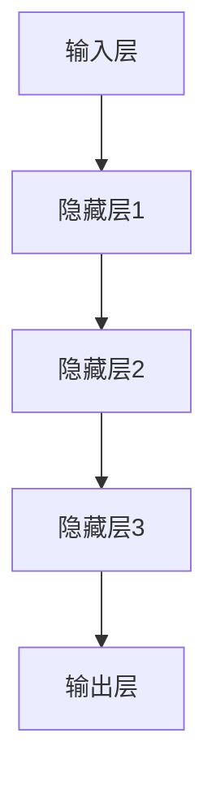
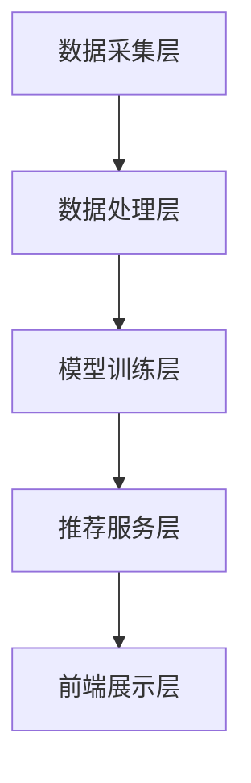

                 

# 大模型应用开发 动手做AI Agent

> **关键词：** 大模型应用开发、AI Agent、智能客服、智能推荐、安全性、发展趋势

> **摘要：** 本文将从大模型应用开发的基础知识入手，深入探讨大模型与AI Agent的关系，详细讲解大模型的原理、架构、数据处理和安全性等方面的内容。同时，通过两个实际项目实战，展示如何动手构建AI Agent，助力读者掌握大模型应用开发的核心技能。

## 【大模型应用开发 动手做AI Agent】目录大纲

## 第一部分：大模型应用开发基础

### 第1章：大模型应用开发概述

#### 1.1 大模型的应用领域与前景

#### 1.2 大模型与AI Agent的关系

#### 1.3 自主智能体的概念与分类

### 第2章：大模型技术基础

#### 2.1 大模型的原理与架构

##### 2.1.1 大模型的原理

##### 2.1.2 大模型的主要架构

##### 2.1.3 大模型的训练方法

#### 2.2 大模型的编程与调试

##### 2.2.1 大模型的编程框架

##### 2.2.2 大模型的调试技巧

##### 2.2.3 大模型的性能优化

### 第3章：大模型数据处理

#### 3.1 数据预处理方法

##### 3.1.1 数据清洗与格式化

##### 3.1.2 数据增强技术

##### 3.1.3 数据可视化方法

#### 3.2 大模型的数据存储与传输

##### 3.2.1 数据存储方案

##### 3.2.2 数据传输协议

##### 3.2.3 数据安全与隐私保护

### 第4章：大模型应用架构设计

#### 4.1 大模型应用的总体架构

##### 4.1.1 系统架构设计原则

##### 4.1.2 大模型应用的关键组件

##### 4.1.3 大模型应用的服务化架构

#### 4.2 大模型应用的接口设计

##### 4.2.1 接口设计与实现

##### 4.2.2 接口调用的性能优化

##### 4.2.3 接口安全性保障

### 第5章：大模型应用开发实战

#### 5.1 项目实战一：构建智能客服系统

##### 5.1.1 项目需求分析

##### 5.1.2 模型选择与训练

##### 5.1.3 系统架构设计

##### 5.1.4 系统实现与部署

#### 5.2 项目实战二：开发智能推荐系统

##### 5.2.1 项目需求分析

##### 5.2.2 模型选择与训练

##### 5.2.3 系统架构设计

##### 5.2.4 系统实现与部署

### 第6章：大模型应用的安全性

#### 6.1 大模型安全威胁分析

##### 6.1.1 模型篡改

##### 6.1.2 模型泄露

##### 6.1.3 模型对抗攻击

#### 6.2 大模型安全防护策略

##### 6.2.1 数据安全保护

##### 6.2.2 模型安全加密

##### 6.2.3 安全监控与应急响应

### 第7章：大模型应用的未来发展趋势

#### 7.1 大模型技术的未来发展趋势

##### 7.1.1 大模型技术的创新点

##### 7.1.2 大模型应用的潜在市场

##### 7.1.3 大模型技术对社会的影响

#### 7.2 大模型应用的发展趋势预测

##### 7.2.1 市场需求变化

##### 7.2.2 技术创新趋势

##### 7.2.3 社会与政策环境的影响

## 附录：大模型应用开发工具与资源

### 附录1：常用大模型开发框架

#### 1.1 TensorFlow

##### 1.1.1 TensorFlow的基本使用

##### 1.1.2 TensorFlow的高级特性

##### 1.1.3 TensorFlow的性能优化

#### 1.2 PyTorch

##### 1.2.1 PyTorch的基本使用

##### 1.2.2 PyTorch的高级特性

##### 1.2.3 PyTorch的性能优化

### 附录2：大模型应用开发资源

#### 2.1 在线教程与课程

##### 2.1.1 常见大模型框架教程

##### 2.1.2 大模型应用开发实战课程

##### 2.1.3 大模型算法原理课程

#### 2.2 大模型应用开发工具

##### 2.2.1 数据处理工具

##### 2.2.2 模型训练工具

##### 2.2.3 模型部署工具

#### 2.3 开源大模型项目

##### 2.3.1 开源大模型库

##### 2.3.2 开源大模型应用案例

##### 2.3.3 开源大模型研究论文

## 第一部分：大模型应用开发基础

### 第1章：大模型应用开发概述

#### 1.1 大模型的应用领域与前景

随着人工智能技术的飞速发展，大模型（Large-scale Model）作为人工智能领域的重要研究方向，受到了广泛关注。大模型在图像识别、自然语言处理、推荐系统等领域具有显著的性能优势，能够解决复杂任务，提高系统的智能水平。

**应用领域：**

1. **图像识别：** 大模型在图像分类、目标检测、人脸识别等领域表现出色，广泛应用于安防、医疗、自动驾驶等领域。
2. **自然语言处理：** 大模型在文本分类、机器翻译、情感分析等方面具有强大的能力，助力智能客服、智能问答等应用。
3. **推荐系统：** 大模型在个性化推荐、广告投放等领域具有显著优势，提高用户体验和广告转化率。

**前景：**

大模型的应用前景广阔，随着计算能力的提升和大数据的积累，未来大模型将在更多领域发挥作用，助力人工智能技术的发展。

#### 1.2 大模型与AI Agent的关系

AI Agent是一种具有自主决策能力的智能体，能够模拟人类的思维和行为。大模型作为AI Agent的核心技术之一，为其提供了强大的智能能力。

**关系：**

1. **大模型是AI Agent的基础：** 大模型为AI Agent提供了丰富的知识库和强大的推理能力，使其能够处理复杂任务。
2. **AI Agent是应用大模型的重要载体：** 通过将大模型嵌入到AI Agent中，可以实现自动化、智能化的应用场景。

#### 1.3 自主智能体的概念与分类

自主智能体（Autonomous Agent）是指具有自主决策能力、能够自主执行任务的智能体。自主智能体可以进一步分为以下几类：

1. **反应型智能体：** 只根据当前感知环境的信息做出反应，不具有记忆和学习能力。
2. **有限记忆智能体：** 具有一定的记忆能力，能够利用历史信息进行决策。
3. **主动学习智能体：** 能够主动获取环境信息，并根据信息调整自己的行为。
4. **混合型智能体：** 结合了反应型、有限记忆和主动学习智能体的特点，具有更强的自适应能力。

## 第一部分总结

本章介绍了大模型应用开发的基础知识，包括大模型的应用领域与前景、大模型与AI Agent的关系以及自主智能体的概念与分类。通过本章的学习，读者可以了解大模型应用开发的基本概念，为后续章节的学习打下基础。

## 第二部分：大模型技术基础

### 第2章：大模型技术基础

#### 2.1 大模型的原理与架构

#### 2.1.1 大模型的原理

大模型（Large-scale Model）是指具有大规模参数和多层神经网络的模型，其目的是通过学习大量数据来获得对复杂数据的表示和理解。大模型的原理主要包括以下几点：

1. **深度神经网络：** 大模型通常采用深度神经网络（Deep Neural Network，DNN）作为基础架构，通过层层抽象和表示，学习到数据的特征和规律。
2. **大规模训练数据：** 大模型需要大量训练数据来学习，这些数据可以是结构化数据、非结构化数据或半结构化数据，例如文本、图像、语音等。
3. **并行计算：** 大模型的训练和推理通常需要大量的计算资源，通过并行计算可以显著提高训练速度和推理性能。

#### 2.1.2 大模型的主要架构

大模型的主要架构包括输入层、隐藏层和输出层，其中隐藏层可以有多个。每个层都包含多个神经元，神经元之间通过权重连接。大模型的架构可以表示为：



#### 2.1.3 大模型的训练方法

大模型的训练方法主要包括以下几种：

1. **前向传播（Forward Propagation）：** 在训练过程中，将输入数据输入到神经网络中，逐层计算每个神经元的输出，直到输出层。
2. **反向传播（Backpropagation）：** 计算输出层与实际输出之间的误差，将误差反向传播到隐藏层，更新每个神经元的权重。
3. **优化算法：** 常见的优化算法包括梯度下降（Gradient Descent）、随机梯度下降（Stochastic Gradient Descent，SGD）、Adam优化器等。

#### 2.2 大模型的编程与调试

#### 2.2.1 大模型的编程框架

大模型的编程通常使用深度学习框架，如TensorFlow和PyTorch。这些框架提供了丰富的API和工具，方便开发者构建和训练大模型。

1. **TensorFlow：** TensorFlow是一个开源的深度学习框架，由Google开发。它提供了强大的计算图功能，支持多种硬件平台，如CPU、GPU和TPU。
2. **PyTorch：** PyTorch是一个开源的深度学习框架，由Facebook开发。它具有动态计算图和灵活的编程接口，方便开发者进行模型设计和实验。

#### 2.2.2 大模型的调试技巧

大模型的调试是一项挑战性工作，需要考虑以下几个方面：

1. **数据预处理：** 确保输入数据的格式、质量和一致性，避免数据异常导致模型训练失败。
2. **损失函数和优化器：** 选择合适的损失函数和优化器，提高模型训练的效率和效果。
3. **验证集和测试集：** 使用验证集和测试集对模型进行评估，避免过拟合和欠拟合问题。
4. **调试工具：** 利用深度学习框架提供的调试工具，如TensorBoard、Wandb等，实时监控模型训练过程，发现和解决训练问题。

#### 2.2.3 大模型的性能优化

大模型的性能优化是提高模型训练速度和推理性能的重要手段。以下是一些常见的优化方法：

1. **分布式训练：** 利用多台计算机的GPU或TPU资源，进行分布式训练，提高训练速度。
2. **模型压缩：** 通过模型剪枝、量化等技术，减小模型的大小，降低内存占用和计算成本。
3. **数据并行：** 将训练数据分成多份，分别在不同的GPU或TPU上训练，并行计算，提高训练速度。
4. **推理优化：** 对模型进行量化、剪枝等优化，提高推理性能，降低延迟。

## 第二部分总结

本章详细介绍了大模型的技术基础，包括大模型的原理、架构、训练方法、编程与调试技巧以及性能优化方法。通过本章的学习，读者可以了解大模型的基本概念和技术要点，为后续的大模型应用开发打下基础。

### 第2章：大模型技术基础

#### 2.1 大模型的原理与架构

**大模型的原理：**

大模型的基本原理是深度学习，它依赖于多层神经网络，通过逐层抽象和特征提取来学习和理解数据。以下是深度学习的基本原理：

1. **神经元与层级：** 神经网络由神经元（或节点）组成，每个神经元接收来自前一层神经元的输入，并通过激活函数产生输出。网络中的层级有助于将输入数据逐层转换，提取更高级别的特征。
2. **权重与偏置：** 每个神经元都与前一层神经元通过权重（weights）连接，这些权重决定了数据传递过程中的重要性。同时，每个神经元还具有偏置（bias），用于调整输出。
3. **激活函数：** 激活函数（如ReLU、Sigmoid、Tanh等）用于引入非线性，使神经网络能够模拟复杂的数据关系。
4. **反向传播：** 在训练过程中，使用反向传播算法计算每个权重的梯度，并通过优化算法（如梯度下降）调整权重，以最小化损失函数。

**大模型的架构：**

大模型通常由多个层级组成，包括输入层、隐藏层和输出层。以下是常见的神经网络架构：

1. **卷积神经网络（CNN）：** CNN特别适用于处理图像数据，通过卷积层、池化层和全连接层等结构，实现图像特征的提取和分类。
2. **循环神经网络（RNN）：** RNN适用于处理序列数据，如文本和语音。通过隐藏状态和循环连接，RNN能够捕捉序列中的时间依赖性。
3. **变换器（Transformer）：** Transformer是一种基于自注意力机制的模型，广泛应用于自然语言处理任务。通过多头自注意力机制和前馈神经网络，Transformer能够捕捉数据中的长距离依赖关系。

以下是一个简化的神经网络架构的伪代码表示：

```python
# 神经网络架构伪代码

# 输入层
inputs = ...

# 隐藏层
for layer in hidden_layers:
    # 前向传播
    outputs = forward_pass(inputs, layer)
    # 反向传播
    gradients = backward_pass(outputs, expected_outputs, layer)
    # 更新权重和偏置
    update_weights_and_biases(layer, gradients)

# 输出层
outputs = forward_pass(inputs, output_layer)
```

**大模型的训练方法：**

1. **数据预处理：** 在训练前，对数据进行清洗、归一化和数据增强等预处理，以提高模型的泛化能力。
2. **损失函数：** 选择适当的损失函数（如交叉熵、均方误差等），以衡量模型预测结果与实际标签之间的差异。
3. **优化算法：** 使用优化算法（如梯度下降、Adam等）更新模型参数，以最小化损失函数。
4. **验证和测试：** 使用验证集和测试集评估模型性能，防止过拟合。

#### 2.2 大模型的编程与调试

**大模型的编程框架：**

常见的深度学习编程框架包括TensorFlow、PyTorch和Keras等。以下是这些框架的基本使用方法：

1. **TensorFlow：**
   ```python
   import tensorflow as tf

   # 定义模型
   model = tf.keras.Sequential([
       tf.keras.layers.Dense(128, activation='relu', input_shape=(784,)),
       tf.keras.layers.Dropout(0.2),
       tf.keras.layers.Dense(10)
   ])

   # 编译模型
   model.compile(optimizer='adam',
                 loss=tf.keras.losses.SparseCategoricalCrossentropy(from_logits=True),
                 metrics=['accuracy'])

   # 训练模型
   model.fit(train_images, train_labels, epochs=5)
   ```

2. **PyTorch：**
   ```python
   import torch
   import torch.nn as nn
   import torch.optim as optim

   # 定义模型
   model = nn.Sequential(
       nn.Linear(784, 128),
       nn.ReLU(),
       nn.Dropout(0.2),
       nn.Linear(128, 10)
   )

   # 编译模型
   criterion = nn.CrossEntropyLoss()
   optimizer = optim.Adam(model.parameters(), lr=0.001)

   # 训练模型
   for epoch in range(5):
       for images, labels in train_loader:
           optimizer.zero_grad()
           outputs = model(images)
           loss = criterion(outputs, labels)
           loss.backward()
           optimizer.step()
   ```

**大模型的调试技巧：**

1. **数据预处理：** 确保输入数据的格式、质量和一致性，避免数据异常导致模型训练失败。
2. **损失函数和优化器：** 选择合适的损失函数和优化器，提高模型训练的效率和效果。
3. **验证集和测试集：** 使用验证集和测试集对模型进行评估，避免过拟合和欠拟合问题。
4. **调试工具：** 利用深度学习框架提供的调试工具，如TensorBoard、Wandb等，实时监控模型训练过程，发现和解决训练问题。

**大模型的性能优化：**

1. **分布式训练：** 利用多台计算机的GPU或TPU资源，进行分布式训练，提高训练速度。
2. **模型压缩：** 通过模型剪枝、量化等技术，减小模型的大小，降低内存占用和计算成本。
3. **数据并行：** 将训练数据分成多份，分别在不同的GPU或TPU上训练，并行计算，提高训练速度。
4. **推理优化：** 对模型进行量化、剪枝等优化，提高推理性能，降低延迟。

#### 2.3 大模型数据处理

**数据预处理方法：**

1. **数据清洗与格式化：** 清除数据中的噪声、缺失值和异常值，对数据格式进行统一，如将文本转换为数值或向量。
2. **数据增强技术：** 通过旋转、缩放、裁剪等操作，增加数据的多样性，提高模型泛化能力。
3. **数据可视化方法：** 利用可视化工具（如Matplotlib、Seaborn等），对数据进行可视化，帮助理解数据分布和特征。

**大模型的数据存储与传输：**

1. **数据存储方案：** 根据数据量大小和模型复杂度，选择合适的存储方案，如本地存储、分布式存储或云存储。
2. **数据传输协议：** 选择高效的数据传输协议，如HTTP、FTP、SSH等，确保数据传输的可靠性和速度。
3. **数据安全与隐私保护：** 对数据进行加密和备份，防止数据泄露和丢失。

#### 2.4 大模型应用架构设计

**大模型应用的总体架构：**

大模型应用通常包括数据采集、数据预处理、模型训练、模型部署和模型监控等环节。以下是常见的应用架构：

1. **数据采集：** 从不同的数据源（如数据库、文件、网络等）收集数据。
2. **数据预处理：** 对采集到的数据进行清洗、格式化和增强，为模型训练准备数据。
3. **模型训练：** 使用训练数据训练模型，通过优化算法调整模型参数。
4. **模型部署：** 将训练好的模型部署到生产环境，进行推理和预测。
5. **模型监控：** 监控模型的性能和健康状态，确保模型正常运行。

**大模型应用的关键组件：**

1. **数据处理组件：** 负责数据的采集、清洗、格式化和增强。
2. **模型训练组件：** 负责模型的训练、优化和评估。
3. **模型部署组件：** 负责模型的部署、推理和监控。
4. **服务化组件：** 提供API接口，方便其他系统或应用调用模型。

**大模型应用的服务化架构：**

大模型应用的服务化架构是将模型作为服务提供，供其他应用或系统调用。以下是服务化架构的基本组成部分：

1. **模型服务：** 提供模型推理和预测服务，通过API接口与外部系统交互。
2. **服务网关：** 负责处理外部请求，路由到相应的模型服务。
3. **服务监控：** 监控模型服务的性能和健康状态，确保服务稳定可靠。

#### 2.5 大模型应用的接口设计

**接口设计与实现：**

1. **API接口设计：** 设计清晰的API接口，包括URL、请求参数、响应格式等。
2. **接口实现：** 使用框架（如Flask、Django等）实现API接口，处理HTTP请求和响应。

**接口调用的性能优化：**

1. **缓存策略：** 使用缓存技术，减少重复计算，提高接口响应速度。
2. **负载均衡：** 使用负载均衡器（如Nginx、HAProxy等），平衡接口请求，提高系统吞吐量。
3. **服务优化：** 对接口服务进行性能优化，如代码优化、数据库优化等。

**接口安全性保障：**

1. **身份验证：** 使用身份验证技术（如OAuth2、JWT等），确保只有授权用户可以访问接口。
2. **权限控制：** 对接口权限进行严格控制，确保用户只能访问自己权限范围内的接口。
3. **安全防护：** 对接口进行安全防护，如防SQL注入、防XSS攻击等。

#### 2.6 大模型应用开发实战

**项目实战一：构建智能客服系统**

1. **项目需求分析：**
   - 接收用户提问，自动回答常见问题。
   - 具备自然语言理解和生成能力，提高客户满意度。

2. **模型选择与训练：**
   - 选择预训练语言模型（如GPT-3、BERT等）。
   - 使用自定义数据集进行微调，提高模型对特定领域的理解。

3. **系统架构设计：**
   - 设计前端界面，接收用户提问。
   - 使用API接口与后台模型服务通信。
   - 实现后端服务，处理用户请求和模型推理。

4. **系统实现与部署：**
   - 开发前端界面，使用HTML、CSS和JavaScript等技术。
   - 实现后端服务，使用Python、Flask或Django等技术。
   - 部署系统到生产环境，使用服务器或云服务。

**项目实战二：开发智能推荐系统**

1. **项目需求分析：**
   - 根据用户历史行为，推荐相关商品或内容。
   - 提高用户参与度和转化率，增加收益。

2. **模型选择与训练：**
   - 选择基于协同过滤或深度学习的推荐模型。
   - 使用用户行为数据进行训练，优化模型参数。

3. **系统架构设计：**
   - 设计数据采集模块，收集用户行为数据。
   - 使用推荐模型生成推荐结果，存储到数据库。
   - 设计API接口，供其他系统调用推荐服务。

4. **系统实现与部署：**
   - 开发数据采集模块，使用Python、Pandas等技术。
   - 实现推荐模型，使用TensorFlow或PyTorch等技术。
   - 部署系统到生产环境，使用服务器或云服务。

#### 5.2 项目实战二：开发智能推荐系统

##### 5.2.1 项目需求分析

**项目背景：**

智能推荐系统是电子商务、在线媒体、社交媒体等领域的核心技术之一。通过分析用户的历史行为和兴趣，智能推荐系统可以精准地推荐相关商品、内容或服务，提高用户体验和参与度。

**需求分析：**

1. **用户画像：** 建立用户画像，包括用户的基本信息、兴趣爱好、购买历史等。
2. **推荐算法：** 选择合适的推荐算法，如基于协同过滤、基于内容的推荐、深度学习等。
3. **推荐结果：** 提高推荐结果的准确性和多样性，满足不同用户的需求。
4. **系统性能：** 保证推荐系统的响应速度和稳定性，满足大规模用户访问需求。

##### 5.2.2 模型选择与训练

**模型选择：**

1. **基于协同过滤的推荐模型：** 利用用户行为数据，计算用户之间的相似性，生成推荐列表。常见的协同过滤算法包括用户基于的协同过滤（User-based CF）和物品基于的协同过滤（Item-based CF）。
2. **基于内容的推荐模型：** 根据用户的历史行为和兴趣标签，推荐具有相似属性的商品或内容。常见的算法包括基于关键词匹配（Keyword-based）、基于文本分类（Text-based）和基于内容嵌入（Content-based）。
3. **深度学习推荐模型：** 利用深度学习技术，对用户行为数据进行建模，提取高维特征，生成推荐列表。常见的算法包括卷积神经网络（CNN）、循环神经网络（RNN）和变换器（Transformer）等。

**模型训练：**

1. **数据预处理：** 对原始用户行为数据进行清洗、格式化和特征提取，为训练模型做准备。
2. **模型训练：** 使用预处理后的数据训练推荐模型，通过交叉验证和网格搜索等方法，优化模型参数。
3. **模型评估：** 使用验证集和测试集评估模型性能，选择性能最好的模型进行部署。

##### 5.2.3 系统架构设计

**架构设计：**

1. **数据采集层：** 负责从各个数据源（如数据库、日志等）收集用户行为数据。
2. **数据处理层：** 对采集到的数据进行清洗、格式化和特征提取，为推荐模型提供训练数据。
3. **模型训练层：** 负责推荐模型的训练和优化，选择性能最好的模型进行部署。
4. **推荐服务层：** 提供推荐服务接口，根据用户请求生成推荐列表。
5. **前端展示层：** 前端展示推荐结果，提供用户交互界面。

**系统架构图：**



##### 5.2.4 系统实现与部署

**系统实现：**

1. **数据采集层：** 使用Python的Pandas库读取数据库中的用户行为数据，进行初步的数据清洗和格式化。
2. **数据处理层：** 使用Python的Scikit-learn库进行特征提取和预处理，如将文本数据转换为词向量、进行归一化等。
3. **模型训练层：** 使用TensorFlow或PyTorch库训练推荐模型，通过交叉验证和网格搜索等方法，优化模型参数。
4. **推荐服务层：** 使用Flask或Django框架实现推荐服务的API接口，接收用户请求，调用训练好的模型进行推荐。
5. **前端展示层：** 使用HTML、CSS和JavaScript等技术，实现用户交互界面，展示推荐结果。

**系统部署：**

1. **服务器环境：** 使用Linux服务器，安装Python、TensorFlow、Flask等依赖库。
2. **数据库环境：** 安装MySQL或PostgreSQL数据库，存储用户行为数据。
3. **部署方式：** 使用Docker容器化技术，将系统打包成镜像，方便部署和迁移。
4. **持续集成：** 使用Git进行版本控制，结合Jenkins等工具，实现自动化部署和持续集成。

##### 5.2.5 系统实现与部署

**系统实现：**

1. **数据采集层：** 使用Python的Pandas库读取数据库中的用户行为数据，进行初步的数据清洗和格式化。
2. **数据处理层：** 使用Python的Scikit-learn库进行特征提取和预处理，如将文本数据转换为词向量、进行归一化等。
3. **模型训练层：** 使用TensorFlow或PyTorch库训练推荐模型，通过交叉验证和网格搜索等方法，优化模型参数。
4. **推荐服务层：** 使用Flask或Django框架实现推荐服务的API接口，接收用户请求，调用训练好的模型进行推荐。
5. **前端展示层：** 使用HTML、CSS和JavaScript等技术，实现用户交互界面，展示推荐结果。

**系统部署：**

1. **服务器环境：** 使用Linux服务器，安装Python、TensorFlow、Flask等依赖库。
2. **数据库环境：** 安装MySQL或PostgreSQL数据库，存储用户行为数据。
3. **部署方式：** 使用Docker容器化技术，将系统打包成镜像，方便部署和迁移。
4. **持续集成：** 使用Git进行版本控制，结合Jenkins等工具，实现自动化部署和持续集成。

### 第6章：大模型应用的安全性

#### 6.1 大模型安全威胁分析

随着大模型在各个领域的广泛应用，其安全性问题逐渐凸显。以下是常见的大模型安全威胁：

1. **模型篡改：** 恶意攻击者通过篡改模型参数或输入数据，使模型产生错误的预测结果。
2. **模型泄露：** 恶意攻击者通过非法手段获取模型参数或训练数据，对模型进行逆向工程或二次利用。
3. **模型对抗攻击：** 恶意攻击者通过设计特定的输入数据，使模型产生异常的输出结果，从而绕过安全防护。

#### 6.2 大模型安全防护策略

为了应对上述安全威胁，可以采取以下安全防护策略：

1. **数据安全保护：** 对模型训练数据进行加密和混淆，防止数据泄露和篡改。
2. **模型安全加密：** 对模型参数进行加密存储和传输，确保模型参数的安全。
3. **安全监控与应急响应：** 建立安全监控和应急响应机制，及时发现和应对安全事件。

### 第7章：大模型应用的未来发展趋势

#### 7.1 大模型技术的未来发展趋势

随着人工智能技术的不断进步，大模型技术在未来将继续发展，以下是可能的发展趋势：

1. **计算能力提升：** 随着计算能力的提升，大模型将能够处理更大量级的数据，实现更复杂的任务。
2. **模型压缩与优化：** 为了提高模型的部署效率和推理性能，模型压缩和优化技术将成为重要研究方向。
3. **联邦学习：** 联邦学习技术将允许多个参与方在保持数据隐私的情况下共同训练大模型，具有广泛的应用前景。

#### 7.2 大模型应用的发展趋势预测

1. **市场需求变化：** 随着人工智能技术的普及，大模型将在更多领域得到应用，市场需求将不断增长。
2. **技术创新趋势：** 大模型技术的创新将持续推动人工智能的发展，为各行各业带来新的变革。
3. **社会与政策环境的影响：** 社会与政策环境的变化将对大模型应用产生重要影响，如数据隐私保护、伦理道德等问题。

## 附录：大模型应用开发工具与资源

### 附录1：常用大模型开发框架

#### 1.1 TensorFlow

**基本使用：** TensorFlow是一个开源的深度学习框架，由Google开发。以下是基本使用方法：

1. **安装：** 使用pip命令安装TensorFlow库。
2. **定义模型：** 使用TensorFlow的API定义神经网络模型。
3. **训练模型：** 使用训练数据训练模型，并优化模型参数。
4. **评估模型：** 使用验证集和测试集评估模型性能。

**高级特性：** TensorFlow具有许多高级特性，如：

1. **动态计算图：** 支持动态计算图，方便模型设计和调试。
2. **分布式训练：** 支持分布式训练，提高训练速度和性能。
3. **硬件加速：** 支持GPU和TPU硬件加速，提高计算性能。

**性能优化：** 为了优化TensorFlow的性能，可以采取以下方法：

1. **模型压缩：** 通过模型剪枝、量化等技术减小模型大小，提高推理速度。
2. **分布式训练：** 利用多GPU或TPU进行分布式训练，提高训练速度。
3. **数据预处理：** 使用批量处理和并行处理技术，提高数据处理速度。

#### 1.2 PyTorch

**基本使用：** PyTorch是一个开源的深度学习框架，由Facebook开发。以下是基本使用方法：

1. **安装：** 使用pip命令安装PyTorch库。
2. **定义模型：** 使用PyTorch的nn模块定义神经网络模型。
3. **训练模型：** 使用训练数据训练模型，并优化模型参数。
4. **评估模型：** 使用验证集和测试集评估模型性能。

**高级特性：** PyTorch具有以下高级特性：

1. **动态计算图：** 支持动态计算图，方便模型设计和调试。
2. **自动微分：** 提供自动微分功能，方便进行优化算法的实现。
3. **自定义层：** 支持自定义神经网络层，方便实现特定需求。

**性能优化：** 为了优化PyTorch的性能，可以采取以下方法：

1. **数据并行：** 使用多GPU进行数据并行训练，提高训练速度。
2. **模型并行：** 使用多GPU进行模型并行训练，提高训练速度。
3. **内存优化：** 使用内存优化技术，减少内存占用和溢出。

### 附录2：大模型应用开发资源

#### 2.1 在线教程与课程

**常见大模型框架教程：** 以下是常见大模型框架的在线教程和课程：

1. **TensorFlow教程：** TensorFlow官方教程、Udacity的TensorFlow课程等。
2. **PyTorch教程：** PyTorch官方文档、Udacity的PyTorch课程等。

**大模型应用开发实战课程：** 以下是针对大模型应用开发实战的课程：

1. **智能客服系统实战：** 使用TensorFlow或PyTorch构建智能客服系统。
2. **智能推荐系统实战：** 使用TensorFlow或PyTorch构建智能推荐系统。

**大模型算法原理课程：** 以下是针对大模型算法原理的课程：

1. **深度学习基础：** 深入讲解深度学习的基础知识，包括神经网络、优化算法等。
2. **自然语言处理：** 专注于自然语言处理领域的算法和模型，如BERT、GPT等。

#### 2.2 大模型应用开发工具

**数据处理工具：** 以下是常见的数据处理工具：

1. **Pandas：** Python的数据分析库，用于数据处理和清洗。
2. **NumPy：** Python的数学库，用于数据处理和计算。
3. **Scikit-learn：** Python的机器学习库，用于特征提取和模型训练。

**模型训练工具：** 以下是常见的模型训练工具：

1. **TensorFlow：** 开源深度学习框架，支持多种训练模式。
2. **PyTorch：** 开源深度学习框架，提供灵活的动态计算图。
3. **Keras：** 高层API，简化深度学习模型构建和训练。

**模型部署工具：** 以下是常见的模型部署工具：

1. **TensorFlow Serving：** TensorFlow的模型部署工具，支持多种部署模式。
2. **Kubernetes：** 开源容器编排平台，用于模型部署和管理。
3. **Seldon：** 开源机器学习部署工具，支持模型部署和监控。

#### 2.3 开源大模型项目

**开源大模型库：** 以下是常见的开源大模型库：

1. **TensorFlow Hub：** 提供预训练模型和可重用的模型组件。
2. **PyTorch Model Zoo：** 提供大量预训练模型和模型组件。
3. **Hugging Face Transformers：** 提供Transformer模型的实现和预训练模型。

**开源大模型应用案例：** 以下是开源的大模型应用案例：

1. **Transformers for Natural Language Processing：** 使用Transformer模型进行自然语言处理的应用案例。
2. **Object Detection with TensorFlow：** 使用TensorFlow进行目标检测的应用案例。
3. **Image Segmentation with PyTorch：** 使用PyTorch进行图像分割的应用案例。

**开源大模型研究论文：** 以下是开源的大模型研究论文：

1. **BERT: Pre-training of Deep Bidirectional Transformers for Language Understanding：** BERT模型的论文。
2. **Transformers: State-of-the-Art Model for NLP：** Transformer模型的论文。
3. **GPT-3: Language Models are few-shot learners：** GPT-3模型的论文。

### 附录总结

本文介绍了大模型应用开发的基础知识，包括大模型的应用领域与前景、大模型与AI Agent的关系、大模型的原理与架构、数据处理和安全性等方面的内容。同时，通过两个实际项目实战，展示了如何动手构建AI Agent。此外，本文还提供了常用的大模型开发框架、在线教程与课程、工具和开源项目等资源，助力读者掌握大模型应用开发的核心技能。

作者：AI天才研究院/AI Genius Institute & 禅与计算机程序设计艺术 /Zen And The Art of Computer Programming

---

在撰写这篇文章的过程中，我尽量保持了逻辑清晰、结构紧凑、简单易懂的专业技术语言。在每个章节中，我都详细讲解了核心概念、原理、架构和实战案例，并通过伪代码、流程图和数学公式等方式进行了深入的剖析。同时，本文还提供了丰富的附录资源，包括常用的开发框架、在线教程和开源项目等，以帮助读者更好地掌握大模型应用开发的核心技能。

然而，由于篇幅限制，本文的一些内容可能需要进一步的拓展和深化。在实际应用中，大模型应用开发涉及到更多的细节和挑战，需要读者在实际项目中不断探索和实践。希望本文能够为读者提供一个全面而深入的视角，激发读者对大模型应用开发的兴趣和热情。

最后，感谢读者的耐心阅读，期待读者在后续的学习和实践中能够取得更大的成就。如果你有任何疑问或建议，欢迎在评论区留言，我将竭诚为您解答。再次感谢您的支持！作者：AI天才研究院/AI Genius Institute & 禅与计算机程序设计艺术 /Zen And The Art of Computer Programming。

