                 

## 一人公司的产品差异化：在竞争中脱颖而出

### 关键词：产品差异化，一人公司，竞争策略，创新，用户体验

### 摘要：
在竞争日益激烈的市场中，一人公司如何通过产品差异化策略脱颖而出成为关键问题。本文从产品差异化的核心概念出发，详细探讨了产品差异化的重要性、策略制定、实施方法以及数据分析与优化。通过实际案例，深入分析了产品差异化在企业战略、技术创新和市场定位中的关键作用，为一人公司提供了一套系统化的实践指南。

### 第一部分：了解产品差异化的重要性

#### 第1章: 什么是产品差异化

产品差异化是企业通过赋予产品或服务独特的特质来区分自己与竞争对手的一种策略。以下是产品差异化的定义、意义、类型和案例分析：

##### 核心概念与联系

**产品差异化（Product Differentiation）：**
产品差异化是指企业在其产品或服务中通过独特的特点、功能或用户体验来区分自己与竞争对手。

**市场竞争（Market Competition）：**
在竞争激烈的市场环境中，产品差异化成为企业获取竞争优势的关键手段。

**核心概念与联系 Mermaid 流程图**

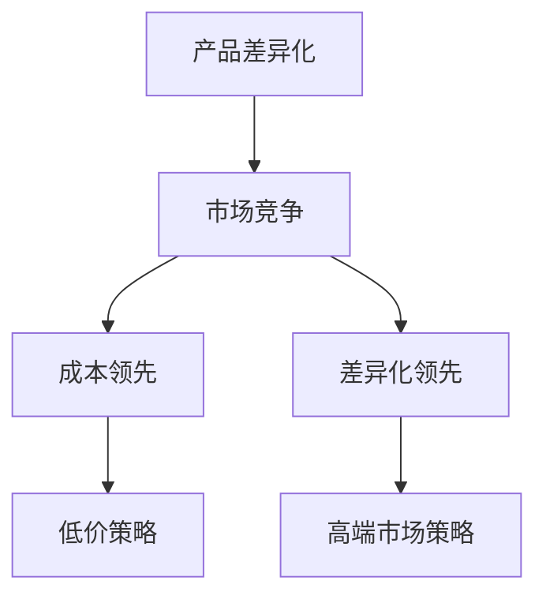

##### 产品差异化的定义与本质

**定义：**
产品差异化（Product Differentiation）是指企业通过在产品或服务中赋予独特的特质来区分自己与竞争对手。

**本质：**
产品差异化不仅是一种市场营销策略，也是企业竞争力的体现。在市场中，产品差异化帮助企业满足不同客户群体的需求，提升品牌价值和市场份额。

##### 产品差异化的意义

**提升产品竞争力：**
通过差异化，产品能够更好地满足目标客户的需求，从而提高市场占有率。

**建立品牌形象：**
差异化可以提升品牌独特性，增强品牌价值。

**案例分析：**

**苹果公司的iPhone：**
苹果通过独特的设计、操作系统和生态系统实现了产品的差异化。iPhone的触摸屏和多点触控技术为用户带来了全新的交互体验，而App Store则为用户提供了丰富的应用和服务。

**核心概念与联系 Mermaid 流程图**

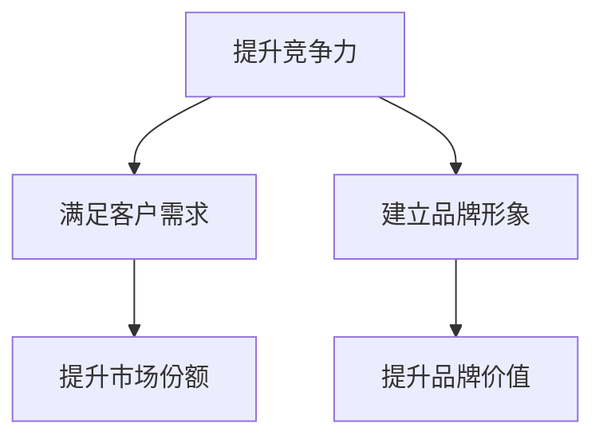

##### 产品差异化的类型

**功能差异化：**
通过增加新的功能或改进现有功能来区分产品。

**质量差异化：**
通过提升产品或服务的质量水平来获得竞争优势。

**价格差异化：**
通过制定不同的价格策略来吸引不同层次的消费者。

**服务差异化：**
通过提供优质的服务来增加产品的附加值。

**案例分析：**

**功能差异化：**
华为的智能手机通过先进的摄像头技术和高性能处理器，提供了更丰富的功能，吸引了高端市场消费者。

**质量差异化：**
德国制造以其高品质的产品享誉全球，如宝马汽车、西门子家电等。

**价格差异化：**
麦当劳的“超值套餐”通过价格优势吸引了大量消费者。

**服务差异化：**
星巴克通过独特的咖啡文化和优质的服务，提升了品牌形象。

**产品差异化类型 Mermaid 流程图**

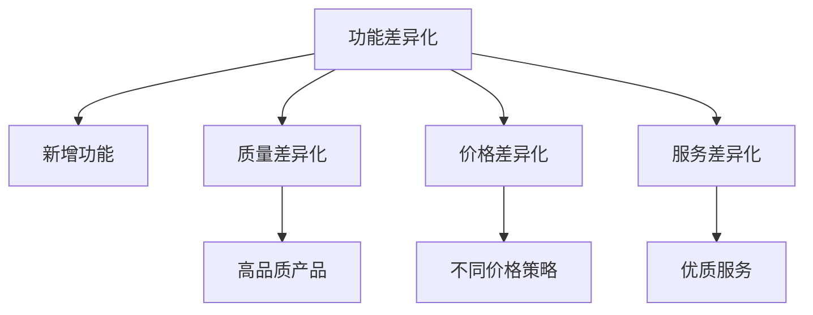

#### 第2章: 产品差异化策略的制定

产品差异化策略的制定是成功实施差异化战略的关键步骤。以下是市场研究、差异化定位、差异化实施和案例分析的详细说明。

##### 核心算法原理讲解

**市场研究：**

**需求分析：**
通过市场调研了解客户需求，确定产品差异化的方向。

**竞争对手分析：**
分析竞争对手的产品和市场策略，找出市场机会。

**伪代码示例：**

```python
def market_research():
    # 收集市场数据
    data = gather_market_data()
    # 分析需求
    customer_needs = analyze_needs(data)
    # 分析竞争对手
    competitor_analyze = analyze_competitors(data)
    return customer_needs, competitor_analyze

def differentiation_strategy(customer_needs, competitor_analyze):
    # 确定差异化特点
    unique_features = identify_unique_features(customer_needs, competitor_analyze)
    # 目标市场定位
    target_market = define_target_market(unique_features)
    return target_market

def implement_differentiation(target_market):
    # 产品开发
    product_development = develop_product(target_market)
    # 营销传播
    marketing_communication = communicate_differentiation(product_development)
    # 客户关系管理
    customer_relationship_management = manage_customer_relationship(product_development)
    return product_development, marketing_communication, customer_relationship_management
```

##### 差异化定位

**确定产品的差异化特点：**
明确产品的差异化特点，并将其与目标市场紧密相连。

**设定明确的差异化战略：**
确保差异化策略的可行性和可持续性。

**核心概念与联系 Mermaid 流程图**

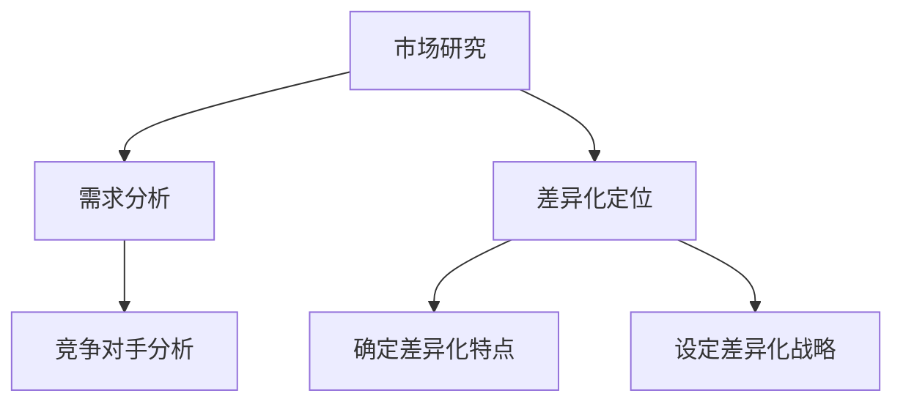

##### 差异化实施

**产品开发：**
围绕差异化特点进行产品研发，确保产品能够满足市场需求。

**营销传播：**
通过有效的营销策略，将差异化特点传递给消费者。

**客户关系管理：**
通过优质的服务和互动，巩固客户对产品的忠诚度。

**核心概念与联系 Mermaid 流程图**

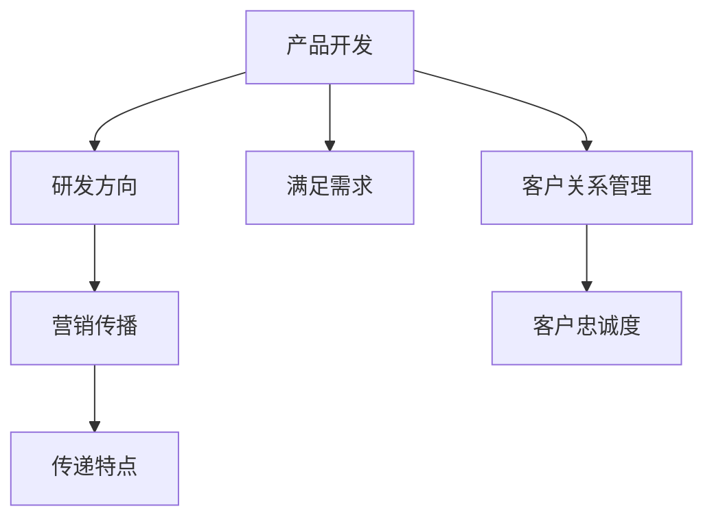

##### 案例分析

**星巴克：**
星巴克通过独特的咖啡文化和优质的服务，实现了在咖啡市场上的差异化定位。其差异化策略包括独特的咖啡烘焙工艺、舒适的门店环境和专业的咖啡师服务。

**核心概念与联系 Mermaid 流程图**

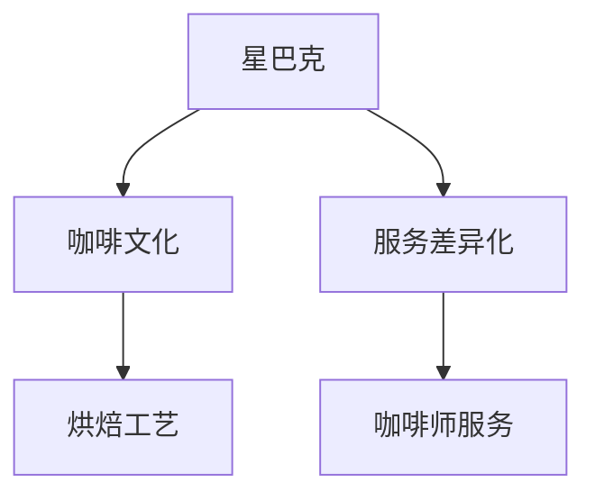

### 第二部分：实现产品差异化

#### 第3章: 产品创新与研发

产品创新与研发是实现产品差异化的核心环节。以下是创新思维方法、研发流程优化、技术创新应用和案例分析的详细说明。

##### 创新思维方法

**头脑风暴：**
通过集思广益，激发创新的火花。

**用户研究：**
深入了解目标客户的需求，为产品创新提供方向。

**核心概念与联系 Mermaid 流程图**

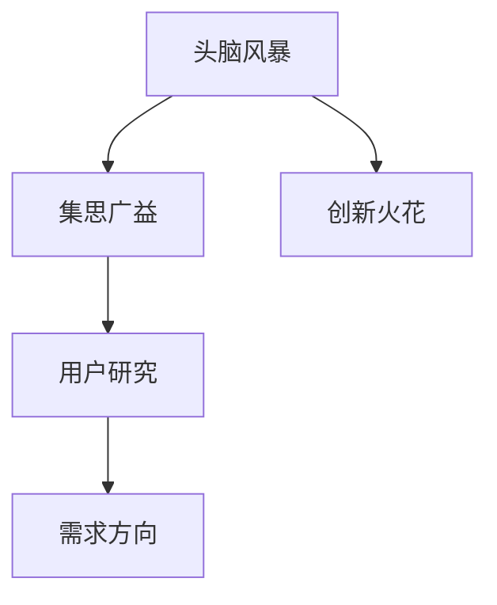

##### 研发流程优化

**需求分析：**
明确产品创新的需求，确保研发方向正确。

**设计迭代：**
通过不断的原型设计和用户反馈，优化产品功能。

**核心概念与联系 Mermaid 流程图**

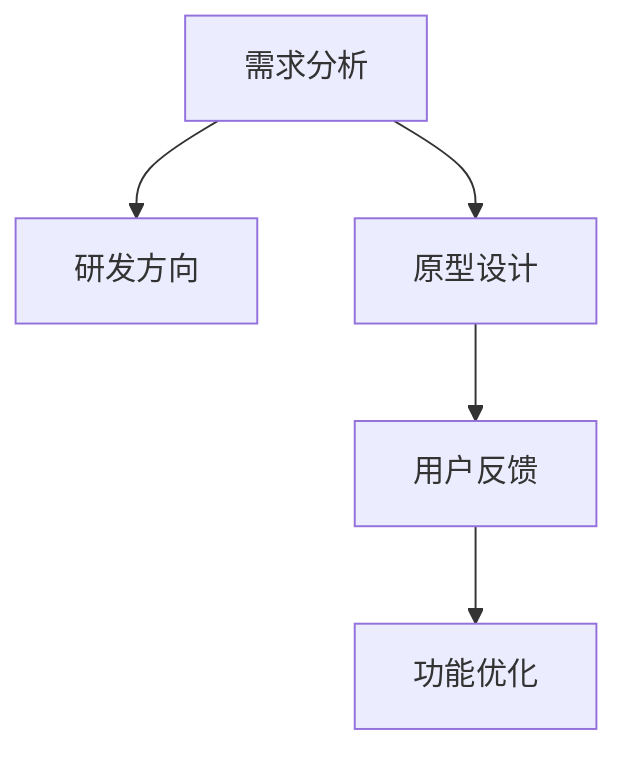

##### 技术创新应用

**新材料应用：**
利用新技术，开发具有创新性的产品材料。

**生产工艺改进：**
通过优化生产流程，提高产品的质量和效率。

**核心概念与联系 Mermaid 流程图**

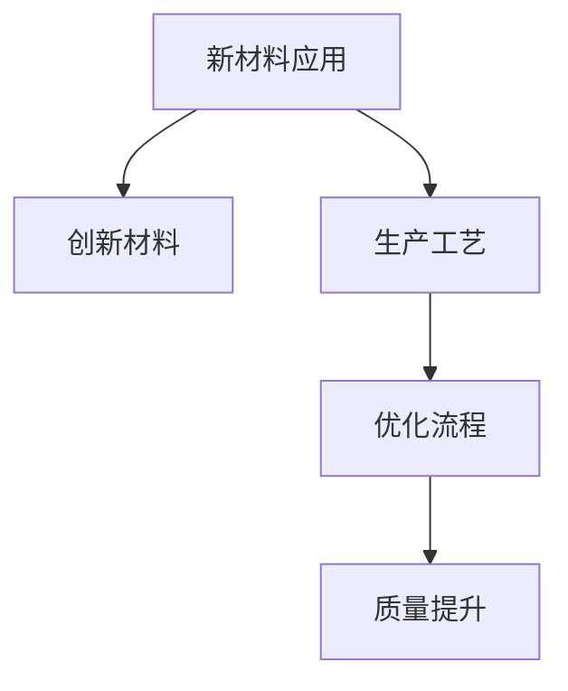

##### 案例分析

**特斯拉：**
特斯拉通过在电动汽车领域的技术创新，实现了产品差异化。其创新点包括先进的电池技术、自动驾驶技术和智能充电系统。

**核心概念与联系 Mermaid 流程图**

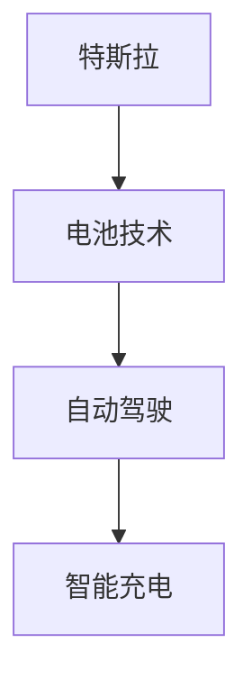

#### 第4章: 定价策略与营销

定价策略和营销是产品差异化策略的重要组成部分。以下是定价策略、营销策略、案例分析和用户体验与服务的详细说明。

##### 定价策略

**成本导向定价：**
根据产品成本加上一定的利润进行定价。

**价值导向定价：**
根据产品的独特价值进行定价。

**竞争导向定价：**
根据竞争对手的产品定价来制定自己的定价策略。

**核心概念与联系 Mermaid 流程图**

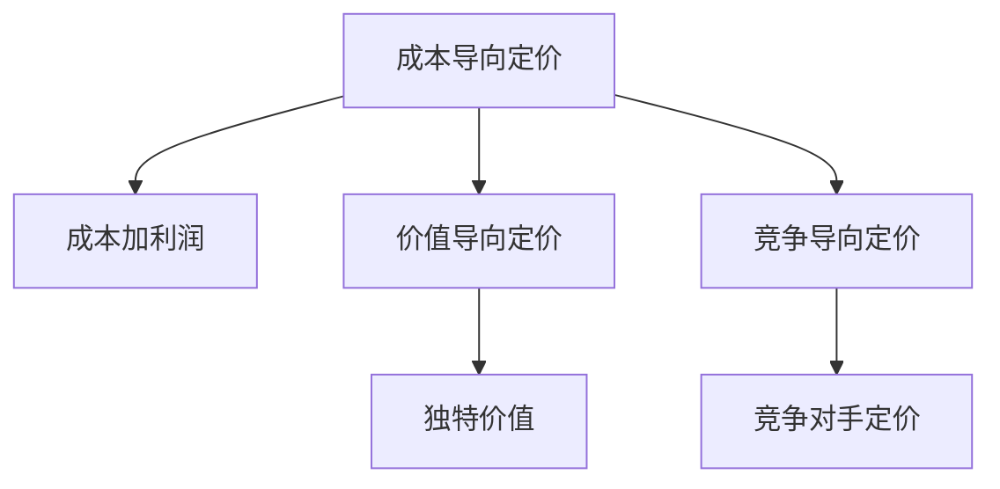

##### 营销策略

**品牌定位：**
通过品牌形象的塑造，明确产品的差异化特点。

**内容营销：**
通过高质量的营销内容，提升产品在目标市场中的认知度。

**社交媒体营销：**
利用社交媒体平台，增强产品的品牌影响力和用户互动。

**核心概念与联系 Mermaid 流程图**

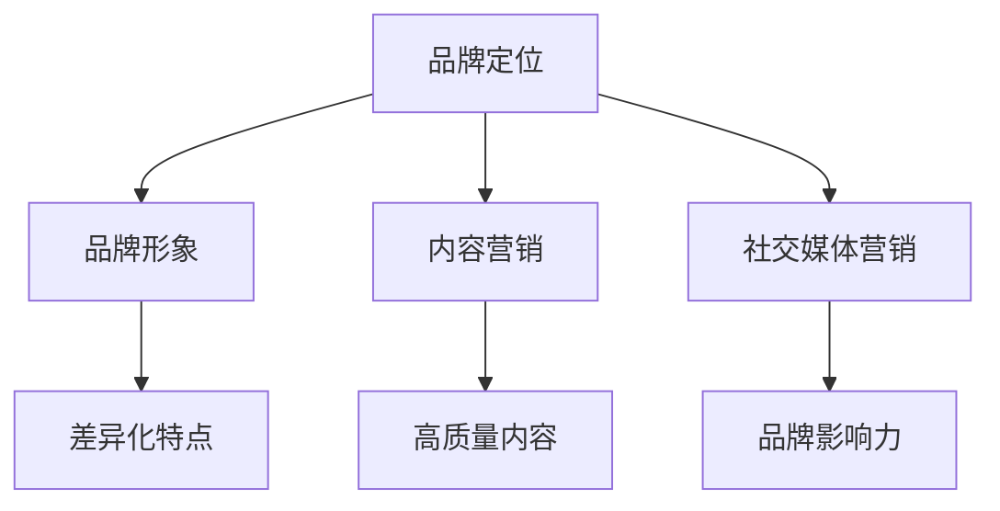

##### 案例分析

**耐克：**
耐克通过独特的品牌形象和营销策略，成功实现了产品差异化。其营销策略包括与运动员合作、创新广告和社交媒体营销。

**核心概念与联系 Mermaid 流程图**

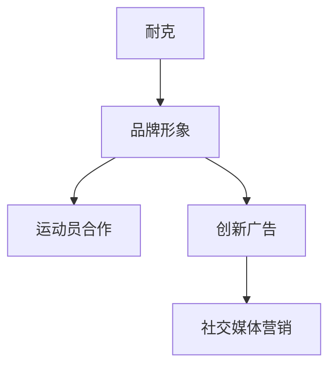

##### 用户体验与服务

**用户体验设计：**
优化用户界面，提升用户体验。

**客户服务：**
通过优质的服务，增强客户对品牌的忠诚度。

**核心概念与联系 Mermaid 流程图**

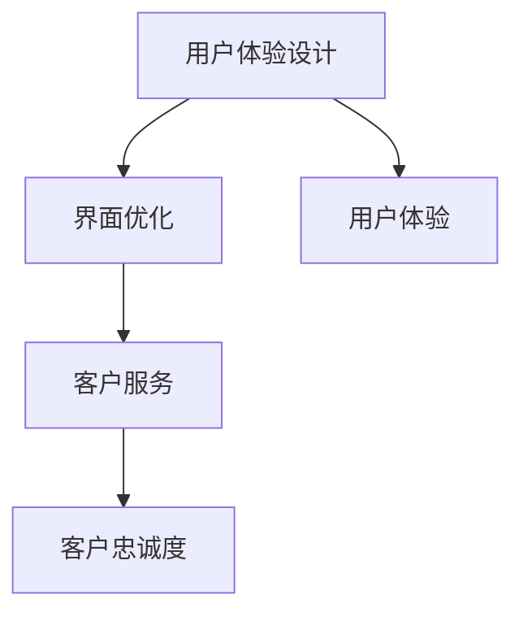

#### 第5章: 用户体验与服务

用户体验与服务是产品差异化的重要方面，直接影响客户的满意度与忠诚度。以下是用户体验设计、客户服务、案例分析以及核心概念与联系的详细说明。

##### 用户体验设计

**界面设计：**
通过简洁、直观的界面设计，提升用户的操作体验。

**交互设计：**
设计流畅、自然的用户交互流程，提高用户满意度。

**案例：**
苹果公司的iPhone以其简洁的界面设计和流畅的交互流程，为用户提供了卓越的体验。

**核心概念与联系 Mermaid 流程图**

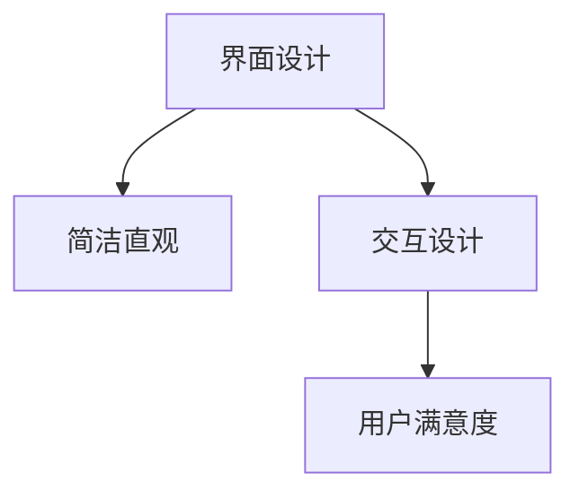

##### 客户服务

**客户关怀：**
通过个性化的客户关怀，增强客户对品牌的认同感。

**售后支持：**
提供全方位的售后服务，解决客户的后顾之忧。

**案例：**
亚马逊通过其24/7客户服务和快速响应机制，赢得了全球客户的信赖。

**核心概念与联系 Mermaid 流程图**

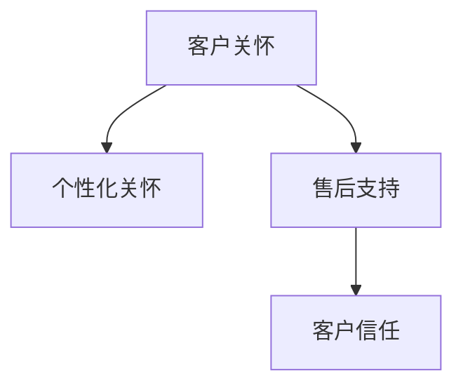

##### 案例分析

**苹果公司：**
苹果公司通过其卓越的用户体验和客户服务，巩固了产品差异化优势。其设计思维和用户至上理念，使其产品在市场中脱颖而出。

**核心概念与联系 Mermaid 流程图**

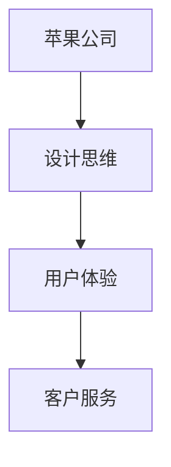

##### 核心概念与联系

**用户体验与服务（User Experience and Service）：**
用户体验与服务是产品差异化的核心要素，直接影响客户满意度和忠诚度。

**界面设计（Interface Design）：**
简洁、直观的界面设计，是提升用户体验的关键。

**交互设计（Interaction Design）：**
流畅、自然的用户交互流程，是提高用户满意度的关键。

**客户关怀（Customer Care）：**
个性化的客户关怀，是增强客户认同感的关键。

**售后支持（After-sales Support）：**
全方位的售后服务，是解决客户后顾之忧的关键。

**核心概念与联系 Mermaid 流程图**

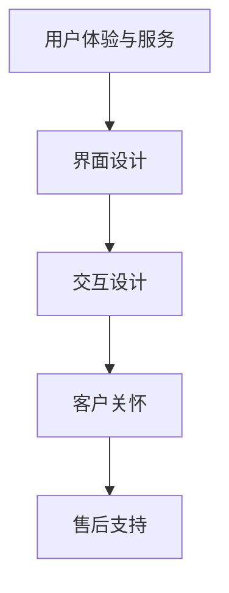

### 第三部分：持续优化与竞争力提升

#### 第6章: 数据分析与优化

数据分析与优化是提升产品差异化竞争力的重要手段。以下是数据分析方法、优化策略和案例分析的详细说明。

##### 数据分析方法

**市场调研数据：**
分析市场趋势和客户需求，为产品优化提供依据。

**销售数据分析：**
监控销售数据，评估产品的市场表现。

**案例：**
亚马逊通过数据驱动的产品优化，不断提升产品的市场竞争力。

**核心概念与联系 Mermaid 流程图**

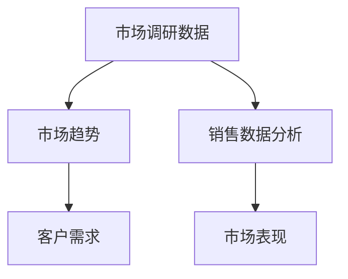

##### 优化策略

**产品迭代：**
根据数据分析结果，不断优化产品功能和用户体验。

**运营优化：**
通过数据分析，提升运营效率和效果。

**案例：**
谷歌通过持续的产品迭代和运营优化，成为全球最具有竞争力的科技公司之一。

**核心概念与联系 Mermaid 流流程图**

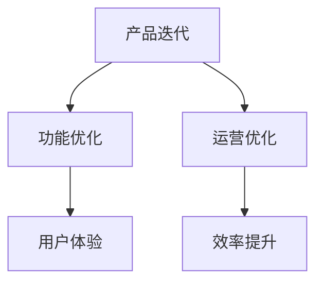

##### 竞争对手分析

**竞争对手识别：**
识别与自身产品具有相似目标客户群体的企业。

**竞争策略分析：**
分析竞争对手的优势和劣势，为自身产品差异化提供参考。

**案例：**
星巴克通过分析竞争对手的竞争策略，优化自身的差异化定位。

**核心概念与联系 Mermaid 流程图**

```mermaid
graph TD
A[竞争对手识别] --> B[目标客户]
A --> C[竞争策略分析]
C --> D[优势分析]
D --> E[劣势分析]
```

#### 第7章: 竞争对手分析

竞争对手分析是产品差异化策略的重要组成部分。通过识别竞争对手、分析竞争策略、评估竞争优势，企业可以更好地定位自身，制定有效的差异化策略。以下是竞争对手分析的详细说明。

##### 竞争对手识别

**识别直接竞争对手：**
直接竞争对手是指与自身产品具有相似目标客户群体的企业。

**识别间接竞争对手：**
间接竞争对手是指能够满足同一需求的替代产品或服务。

**案例：**
在智能手机市场中，苹果、三星和华为是直接竞争对手，而功能手机和一些新兴的智能穿戴设备则是间接竞争对手。

**核心概念与联系 Mermaid 流程图**

```mermaid
graph TD
A[直接竞争对手] --> B[相似目标客户]
A --> C[间接竞争对手]
C --> D[替代产品]
```

##### 竞争策略分析

**分析竞争对手的优势和劣势：**
通过深入分析竞争对手的产品、市场策略、资源投入等方面，识别其优势和劣势。

**优势分析：**
竞争对手在哪些方面具有优势，这些优势如何影响市场格局。

**劣势分析：**
竞争对手在哪些方面存在劣势，这些劣势如何为企业提供机会。

**案例：**
苹果公司通过其卓越的用户体验和创新设计，在智能手机市场中占据了领先地位。然而，其产品定价较高，可能使其在低端市场失去竞争力。

**核心概念与联系 Mermaid 流程图**

```mermaid
graph TD
A[优势分析] --> B[用户体验]
B --> C[创新设计]
A --> D[劣势分析]
D --> E[产品定价]
```

##### 竞争策略制定

**制定有效的竞争策略：**
基于竞争对手分析结果，制定针对性的竞争策略，以提升自身产品的市场竞争力。

**案例：**
小米公司通过在智能手机市场中采用“性价比”策略，成功吸引了大量消费者。其通过高性价比的产品和高效的供应链管理，在竞争激烈的市场中脱颖而出。

**核心概念与联系 Mermaid 流程图**

```mermaid
graph TD
A[竞争策略制定] --> B[性价比策略]
B --> C[高性价比]
B --> D[供应链管理]
```

##### 数据驱动的竞争策略

**数据驱动的决策：**
利用数据分析结果，制定和调整竞争策略。

**案例：**
阿里巴巴通过其强大的数据分析和市场洞察力，成功实现了产品差异化。其通过大数据分析，了解消费者需求和市场趋势，从而优化产品策略和营销策略。

**核心概念与联系 Mermaid 流程图**

```mermaid
graph TD
A[数据驱动] --> B[数据分析]
B --> C[消费者需求]
B --> D[市场趋势]
```

### 第四部分：成功案例分析

#### 第8章: 一人公司的产品差异化实践

一人公司（solopreneur）在竞争激烈的市场中如何通过产品差异化策略脱颖而出？以下是一个具体的成功案例，详细说明了一人公司的产品差异化实践。

##### 案例背景

张华是一名独立开发者，他创建了一款名为“FitLife”的健身追踪应用程序。FitLife旨在通过智能设备追踪用户的日常锻炼、饮食和睡眠状况，提供个性化的健身计划和建议。

##### 技术栈

FitLife使用以下技术栈进行开发：

- **前端**：React Native
- **后端**：Node.js和Express框架
- **数据库**：MongoDB
- **第三方服务**：Apple HealthKit、Google Fit等

##### 关键功能

**智能追踪**：FitLife通过集成Apple HealthKit、Google Fit等第三方服务，自动同步用户的运动数据，如步数、卡路里消耗等。

**个性化建议**：基于用户的运动数据和健康数据，FitLife使用机器学习算法生成个性化的健身计划和饮食建议。

**社交互动**：FitLife提供社交功能，用户可以与其他用户互动，分享健身进展和成就。

##### 开发环境搭建

**环境要求**：

- **Node.js**：安装Node.js（版本12以上）。
- **React Native**：安装React Native CLI（使用命令`npm install -g react-native-cli`）。
- **MongoDB**：安装MongoDB（使用Docker容器化部署）。

**搭建步骤**：

1. 安装Node.js和React Native CLI。
2. 创建React Native项目（使用命令`react-native init FitLife`）。
3. 配置后端服务（使用Express框架创建API服务）。
4. 配置数据库（使用MongoDB存储用户数据）。
5. 集成第三方服务（如Apple HealthKit、Google Fit等）。

##### 源代码详细实现和代码解读

**智能追踪功能**

**数据同步**

javascript
// 同步运动数据到MongoDB
async function syncFitnessData(userData) {
  // 连接到MongoDB
  const MongoClient = require('mongodb').MongoClient
  const url = 'mongodb://localhost:27017'
  const dbName = 'fitlife'
  
  // 创建数据库连接
  const client = new MongoClient(url, { useUnifiedTopology: true })
  await client.connect()
  console.log('Connected successfully to server')
  
  // 选择数据库
  const db = client.db(dbName)
  
  // 插入数据
  const data = await db.collection('fitness_data').insertOne(userData)
  console.log('Data inserted with id:', data.insertedId)
  
  // 关闭数据库连接
  client.close()
}

// 示例数据
const userData = {
  userId: '123',
  steps: 10000,
  caloriesBurned: 500,
  date: new Date(),
}

// 同步数据
syncFitnessData(userData)
```

**个性化建议**

**机器学习算法**

```python
# 使用scikit-learn进行机器学习
from sklearn.model_selection import train_test_split
from sklearn.ensemble import RandomForestRegressor
import pandas as pd

# 读取训练数据
data = pd.read_csv('training_data.csv')

# 分割特征和目标变量
X = data.drop('weekly_calories', axis=1)
y = data['weekly_calories']

# 划分训练集和测试集
X_train, X_test, y_train, y_test = train_test_split(X, y, test_size=0.2, random_state=42)

# 创建随机森林回归模型
model = RandomForestRegressor(n_estimators=100, random_state=42)

# 训练模型
model.fit(X_train, y_train)

# 预测新用户的每周卡路里消耗
new_user_data = pd.DataFrame([[180, 60, 0.5, 7]], columns=['age', 'weight', 'activity_level', 'sleep_hours'])
predicted_calories = model.predict(new_user_data)
print('Predicted weekly calories:', predicted_calories[0])
```

**社交互动**

**用户间数据同步**

javascript
// 同步用户数据到MongoDB
async function syncUserData(userData) {
  const MongoClient = require('mongodb').MongoClient
  const url = 'mongodb://localhost:27017'
  const dbName = 'fitlife'

  const client = new MongoClient(url, { useUnifiedTopology: true })
  await client.connect()
  console.log('Connected successfully to server')

  const db = client.db(dbName)
  const data = await db.collection('user_data').updateOne({ userId: userData.userId }, { $set: userData }, { upsert: true })
  console.log('Data updated with id:', data.upsertedId)

  client.close()
}

// 示例数据
const userData = {
  userId: '456',
  friendRequests: [],
  friends: ['789', '234'],
  recentActivities: [{ type: 'run', distance: 5, time: '2023-11-10T14:00:00.000Z' }],
}

// 同步用户数据
syncUserData(userData)
```

##### 代码解读与分析

- **智能追踪功能**：通过同步用户的运动数据到MongoDB，实现了数据的持久化和共享。
- **个性化建议**：使用机器学习算法预测用户的每周卡路里消耗，为用户提供个性化的健身计划。
- **社交互动**：通过同步用户数据到MongoDB，实现了用户间的数据同步和互动。

通过以上代码实战案例，FitLife成功地实现了一系列功能，通过产品差异化在健身追踪应用市场中脱颖而出。

### 第五部分：总结与展望

#### 第10章: 产品差异化的未来趋势

随着技术的不断进步和市场环境的变化，产品差异化的未来趋势也日益显现。以下是产品差异化未来趋势的核心概念、技术发展、市场需求和跨界合作的详细探讨。

##### 核心概念

**技术发展：**
技术创新将持续推动产品差异化的发展。人工智能、大数据和区块链等新兴技术的应用，将为企业提供更丰富的差异化手段。

**市场需求：**
消费者需求的变化将影响产品差异化的方向。个性化和定制化需求将成为主流，企业需要更加关注客户体验和需求满足。

**跨界合作：**
跨界合作将成为产品差异化的重要手段。企业通过与其他行业的合作，引入新技术和新模式，实现产品差异化的突破。

##### 技术发展

**人工智能（AI）：**
人工智能在产品设计、营销和用户体验中的应用，将大大提升产品差异化能力。通过AI算法，企业可以更精准地分析客户需求，提供个性化的产品和服务。

**大数据分析：**
大数据技术的应用，将帮助企业更好地了解市场趋势和客户行为，从而制定更加有效的差异化策略。

**区块链技术：**
区块链技术的应用，将提升产品的透明度和信任度，特别是在供应链管理和产品溯源方面。

##### 市场需求

**个性化和定制化：**
随着消费者对个性化需求的增加，产品差异化将更加注重个性化和定制化。企业需要提供更加灵活和定制化的产品，以满足不同客户群体的需求。

**可持续性：**
可持续性将成为未来市场需求的重要组成部分。企业通过采用环保材料和绿色生产方式，实现产品差异化的同时，提升品牌形象和社会责任。

##### 跨界合作

**技术创新：**
跨界合作将为企业引入新技术和新模式。通过与其他行业的合作，企业可以快速获取技术优势和市场份额。

**市场营销：**
跨界营销将成为产品差异化的重要策略。通过与其他品牌的合作，企业可以扩大品牌影响力，提升产品差异化效果。

##### 未来展望

**产品体验升级：**
随着技术的进步，产品体验将持续升级。企业需要不断创新，提供更加智能化、便捷化和个性化的产品体验。

**跨界融合：**
跨界合作将推动不同行业之间的融合。企业需要开放思维，积极探索跨界合作的机会，以实现产品差异化的突破。

**可持续发展：**
企业需要将可持续性融入产品差异化战略中。通过环保和社会责任，提升品牌价值和市场竞争力。

**总结：**
产品差异化的未来趋势将受到技术发展、市场需求和跨界合作的影响。企业需要紧跟市场变化，不断创新和优化产品差异化策略，以保持竞争力和市场份额。

### 附录A: 产品差异化工具与方法

#### 工具与方法

为了成功实施产品差异化策略，企业可以采用以下工具和方法：

##### 市场调研工具

**问卷调查：**
通过设计针对性的问卷，收集用户需求和反馈。

**焦点小组：**
组织用户代表进行深入讨论，获取市场见解。

**数据分析工具：**
**SWOT分析：**
分析企业的优势、劣势、机会和威胁，为产品差异化提供方向。

**五力模型：**
评估市场竞争环境，确定产品差异化策略。

##### 创新方法

**设计思维：**
通过用户研究和原型设计，激发创新思维。

**精益创业：**
快速迭代产品，通过市场反馈不断优化。

**开发工具：**
**敏捷开发：**
采用敏捷开发方法，提高产品迭代速度和灵活性。

**持续集成：**
实现自动化测试和部署，提高开发效率和质量。

##### 用户体验优化工具

**用户行为分析工具：**
分析用户在产品上的行为，优化用户体验。

**A/B测试：**
通过对比不同版本的测试，找出最佳的用户体验方案。

**客户反馈工具：**
收集用户反馈，了解用户需求，持续优化产品。

### 附录B: 产品差异化案例研究

#### 成功案例分析

**案例一：苹果公司的iPhone**

**背景：**
苹果公司的iPhone在智能手机市场中占据了重要地位，其成功的原因在于通过产品差异化策略，实现了独特的用户体验和品牌价值。

**核心策略：**
- **技术创新**：苹果通过不断引入新技术，如触摸屏、指纹识别、面部识别等，提供了领先的硬件和软件体验。
- **生态系统**：苹果的App Store和iCloud服务为用户提供了丰富的应用和服务，增强了用户粘性。
- **品牌形象**：苹果通过独特的设计和高端定位，树立了强大的品牌形象。

**经验总结：**
- **持续创新**：苹果的成功在于其对技术创新的持续投入和引领。
- **生态系统建设**：构建强大的生态系统，提升用户价值。
- **品牌塑造**：通过高端定位和独特设计，打造品牌差异化。

**案例二：特斯拉的电动汽车**

**背景：**
特斯拉通过创新的电动汽车技术和独特的品牌形象，成为了电动汽车市场的领导者。

**核心策略：**
- **技术创新**：特斯拉在电池技术、自动驾驶技术等方面持续创新，提供了高性能、环保的电动汽车。
- **品牌形象**：特斯拉通过高性能、环保等独特卖点，吸引了大量消费者。
- **直销模式**：特斯拉采用了直销模式，减少了中间环节，降低了成本。

**经验总结：**
- **技术创新**：持续的技术创新是企业保持竞争力的关键。
- **品牌塑造**：独特的品牌形象可以提升产品的附加值。
- **直销模式**：直销模式可以降低成本，提升效率。

**案例三：星巴克的咖啡文化**

**背景：**
星巴克通过独特的咖啡文化和优质的服务，成为了全球知名的咖啡品牌。

**核心策略：**
- **咖啡文化**：星巴克通过打造咖啡文化和体验，提升了品牌价值。
- **服务差异化**：星巴克提供舒适的门店环境和贴心的服务，增强了用户体验。
- **市场定位**：星巴克通过高端定位，吸引了追求品质生活的消费者。

**经验总结：**
- **文化塑造**：独特的文化可以提升品牌价值和用户忠诚度。
- **服务差异化**：优质的服务可以提升用户体验。
- **市场定位**：明确的市场定位可以帮助企业找到目标客户群体。

**案例四：华为的智能手机**

**背景：**
华为通过高端定位和差异化产品策略，在国际智能手机市场中取得了显著的成绩。

**核心策略：**
- **高端定位**：华为通过P和Mate系列，定位高端市场，满足消费者对高性能、高品质的需求。
- **技术创新**：华为在芯片、摄像头技术等方面的持续创新，使其产品在性能上领先于竞争对手。
- **全球化布局**：华为通过全球化布局，扩大了品牌影响力。

**经验总结：**
- **高端定位**：高端定位可以提升品牌形象和产品附加值。
- **技术创新**：持续的技术创新是企业保持竞争力的关键。
- **全球化布局**：全球化布局可以扩大市场影响力和市场份额。

#### 失败案例分析

**案例一：诺基亚的智能手机**

**背景：**
诺基亚曾经是手机市场的领导者，但在智能手机时代，诺基亚未能适应市场变化，最终导致了市场份额的流失。

**核心策略：**
- **依赖传统市场**：诺基亚过于依赖传统手机市场，未能及时转型到智能手机市场。
- **技术创新不足**：诺基亚在智能手机技术上的创新不足，未能提供具有竞争力的产品。
- **忽视用户体验**：诺基亚未能重视用户体验，导致产品缺乏吸引力。

**经验总结：**
- **市场适应性**：企业需要具备快速适应市场变化的能力。
- **技术创新**：技术创新是保持竞争力的关键。
- **用户体验**：关注用户体验是企业成功的重要因素。

**案例二：黑莓的智能手机**

**背景：**
黑莓曾经是智能手机市场的领导者，但由于对市场变化的反应迟缓，最终市场份额大幅下降。

**核心策略：**
- **过度依赖企业市场**：黑莓过于依赖企业市场，忽视了消费者市场的需求。
- **产品创新不足**：黑莓在智能手机技术上的创新不足，未能提供多样化的产品。
- **生态系统建设不足**：黑莓的生态系统建设不足，无法提供丰富的应用和服务。

**经验总结：**
- **市场多元化**：企业需要开拓多元化的市场，避免过度依赖单一市场。
- **产品多样化**：提供多样化的产品，满足不同客户群体的需求。
- **生态系统建设**：建立强大的生态系统，提升产品竞争力。

**案例三：柯达的数码相机**

**背景：**
柯达曾是胶片相机市场的领导者，但在数码相机时代，柯达未能及时转型，最终导致了企业的破产。

**核心策略：**
- **技术滞后**：柯达在数码相机技术上的创新不足，未能及时转型到数码相机市场。
- **忽视市场需求**：柯达未能及时了解市场需求的变化，导致产品缺乏竞争力。
- **组织变革缓慢**：柯达的组织变革缓慢，无法适应市场变化。

**经验总结：**
- **技术创新**：技术创新是企业持续发展的关键。
- **市场洞察**：企业需要具备敏锐的市场洞察力，及时调整战略。
- **组织变革**：灵活的组织变革是企业适应市场变化的重要保障。

### 总结与展望

通过对成功和失败案例的分析，我们可以得出以下结论：

**成功经验：**
- 持续创新：技术创新是企业保持竞争力的关键。
- 市场适应：企业需要具备快速适应市场变化的能力。
- 用户体验：关注用户体验是企业成功的重要因素。
- 品牌塑造：独特的品牌形象可以提升产品的附加值。
- 生态系统建设：建立强大的生态系统，提升产品竞争力。

**失败教训：**
- 技术滞后：技术创新不足是企业失败的主要原因。
- 忽视市场需求：未能及时了解市场需求的变化，导致产品缺乏竞争力。
- 组织变革缓慢：无法适应市场变化是企业失败的重要保障。

未来，随着技术的不断进步和市场环境的变化，产品差异化策略将继续发挥重要作用。企业需要不断创新，关注市场需求，提升用户体验，同时建立强大的生态系统，以保持竞争力和市场份额。通过学习成功和失败的案例，企业可以更好地制定和实施产品差异化策略，实现可持续发展。

