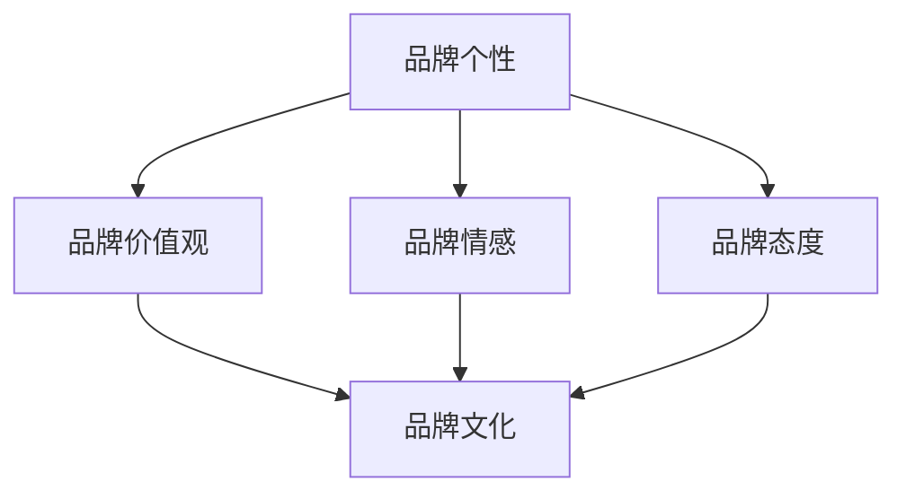
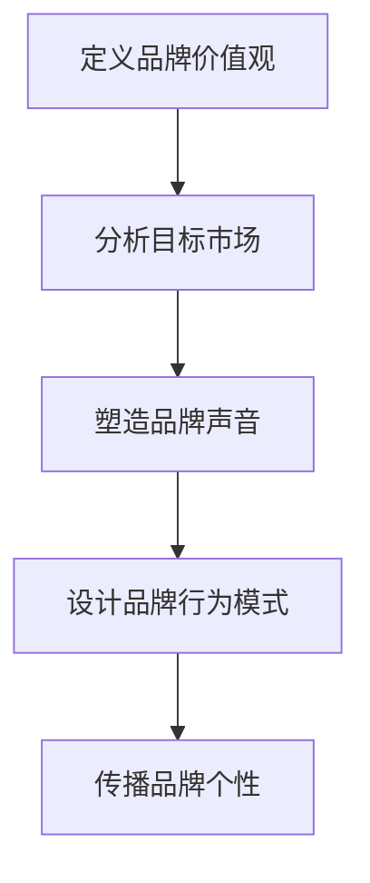

                 

### 引言

在数字化时代，品牌个性已经成为企业核心竞争力的重要组成部分。品牌个性不仅仅是品牌形象的简单呈现，它是品牌与消费者建立情感连接、实现差异化竞争的关键因素。一个鲜明的品牌个性能够帮助企业脱颖而出，赢得消费者的忠诚和喜爱。本文将深入探讨品牌个性的构建策略，分析品牌个性与市场营销、目标受众共鸣、品牌营销策略、案例分析以及品牌个性构建的未来趋势。通过系统的分析和讲解，旨在为企业和营销人员提供实用的品牌个性构建指南。

品牌个性是指品牌在消费者心中所形成的独特形象和特质，它反映了品牌的价值观、性格特征和行为方式。品牌个性不仅仅是标志或口号，它是品牌文化的精髓，是品牌与消费者建立情感联系的桥梁。一个成功的品牌个性能够提升品牌认知度、增强品牌信任度和塑造独特的品牌形象。

#### 文章关键词

- 品牌个性
- 市场营销
- 消费者共鸣
- 营销策略
- 案例分析
- 未来趋势

#### 文章摘要

本文首先介绍了品牌个性的概念和作用，探讨了品牌个性在市场营销中的重要性。接着，详细阐述了品牌个性构建的核心要素和策略，包括品牌价值观、品牌声音和品牌行为模式。然后，分析了品牌个性与目标受众的共鸣，以及品牌个性在广告策略、社交媒体营销和公关活动中的应用。通过国际和国内品牌的案例分析，总结了品牌个性构建的成功因素和挑战。最后，展望了品牌个性构建的未来趋势，提供了品牌个性构建的实践指南和资源汇总。本文旨在为品牌管理和市场营销提供有价值的参考和指导。

### 第1章：品牌个性与市场营销概述

#### 1.1 品牌个性的定义与重要性

品牌个性是指品牌在消费者心中所形成的独特形象和特质，它反映了品牌的价值观、性格特征和行为方式。品牌个性不仅仅是标志或口号，它是品牌文化的精髓，是品牌与消费者建立情感联系的桥梁。一个成功的品牌个性能够帮助企业脱颖而出，赢得消费者的忠诚和喜爱。

**品牌个性的定义**

品牌个性是指品牌在消费者心中所形成的独特形象和特质，它反映了品牌的价值观、性格特征和行为方式。品牌个性不是单一的属性，而是由多个方面组成的综合体，包括品牌的情感表达、行为方式、文化背景等。例如，苹果的品牌个性可以被描述为创新、高端和简洁，而耐克则被定位为活力、自信和叛逆。

**品牌个性的作用**

品牌个性在市场营销中扮演着至关重要的角色，它具有以下几个方面的作用：

1. **提高品牌认知度**：一个鲜明的品牌个性能够帮助消费者在众多品牌中快速识别和记住。品牌个性是品牌的独特标签，能够增加品牌在消费者心中的认知度。

2. **建立品牌信任**：品牌个性可以传递品牌的价值观和可靠性，从而增强消费者的信任。当消费者感受到品牌个性与其价值观相契合时，他们更愿意信任并选择该品牌。

3. **塑造品牌形象**：品牌个性是品牌形象的精髓，有助于形成独特的品牌形象，区别于竞争对手。一个成功的品牌个性能够使品牌在市场中脱颖而出，提升品牌竞争力。

#### 1.2 市场营销中的品牌个性

**品牌个性与市场定位**

品牌个性是市场定位的核心要素之一。通过明确品牌个性，企业可以在市场中找到独特的位置，满足特定消费者群体的需求。市场定位是指企业根据自身的资源和目标，在市场中找到适合的位置，以区分竞争对手并吸引目标消费者。品牌个性有助于企业在市场定位中脱颖而出，使品牌更加引人注目。

**品牌个性与营销传播**

品牌个性的塑造需要通过一系列的营销传播活动来传达。这包括广告、公关、社交媒体等多个渠道。营销传播活动需要符合品牌个性，以增强品牌形象并吸引目标受众。例如，苹果通过创新的广告创意和精准的营销传播策略，成功地传递了其创新、高端和简洁的品牌个性。

**品牌个性塑造的方法**

塑造品牌个性需要一系列的方法和工具。以下是一些常用的方法和工具：

1. **市场调研**：通过市场调研，企业可以了解目标消费者的需求和偏好，为品牌个性构建提供依据。

2. **品牌定位**：明确品牌定位是品牌个性构建的关键。企业需要确定品牌的核心价值观和目标市场，以塑造独特的品牌个性。

3. **品牌声音**：品牌声音是指品牌在所有沟通渠道上使用的语言风格和表达方式。一个统一的品牌声音有助于强化品牌个性。

4. **品牌行为模式**：品牌行为模式是指品牌在市场活动中的行为方式和反应。一个连贯的品牌行为模式有助于传递品牌个性。

#### 1.3 品牌个性构建的核心要素

**核心价值观**

核心价值观是品牌个性的核心，它决定了品牌的基本特质和行为方式。企业需要明确品牌的核心价值观，并将其作为品牌个性构建的指导原则。核心价值观需要与消费者的价值观相契合，以建立情感上的连接。

**品牌声音**

品牌声音是指品牌在所有沟通渠道上使用的语言风格和表达方式。一个统一的品牌声音有助于强化品牌个性。品牌声音需要符合品牌的核心价值观，并以简洁、有力的方式传达品牌信息。

**品牌行为模式**

品牌行为模式是指品牌在市场活动中的行为方式和反应。一个连贯的品牌行为模式有助于传递品牌个性。品牌行为模式需要与品牌的核心价值观和品牌声音相一致，以确保品牌个性的统一性。

#### 1.4 品牌个性与品牌文化的联系

**品牌文化的重要性**

品牌文化是企业价值观和行为方式的总和，它是品牌个性构建的重要基础。一个强大的品牌文化有助于塑造和传递品牌个性。品牌文化不仅影响品牌的发展方向和员工行为，还影响品牌的声誉和影响力。

**品牌文化在品牌个性构建中的应用**

品牌文化可以通过多个方面来体现和传递品牌个性。例如，品牌故事、品牌标识、品牌活动等都是品牌文化的体现。这些元素有助于强化品牌个性，使其在消费者心中形成独特的形象。

**文化传承与创新**

品牌文化需要在传承中不断创新，以适应市场和环境的变化。同时，品牌文化也需要适应不同文化和市场的特点，以确保品牌个性的全球适应性。文化传承和创新是品牌个性构建成功的关键。

#### 1.5 品牌个性构建的策略

**差异化定位**

在市场中找到独特的品牌个性是品牌个性构建的关键。差异化定位可以帮助企业区分竞争对手，满足特定消费者群体的需求。差异化定位需要基于对市场调研和消费者分析的结果，确定品牌的核心竞争力和独特卖点。

**持续优化**

品牌个性构建是一个持续的过程，企业需要不断优化品牌个性，以适应市场和消费者需求的变化。这包括定期评估品牌个性效果，根据反馈进行调整，以及不断探索新的品牌传播渠道和策略。

**个性化营销**

个性化营销是品牌个性构建的重要手段。通过个性化营销，企业可以更精准地传达品牌个性，并与消费者建立更紧密的联系。个性化营销包括定制化产品、个性化沟通和精准广告投放等。

#### 1.6 品牌个性构建案例分析

**国际品牌案例**

**苹果**

苹果的品牌个性定位为创新、高端和简洁。苹果通过一系列创新的科技产品、简洁的设计和独特的品牌文化，成功地塑造了其品牌个性。苹果的品牌文化强调创新、简约和用户至上，这帮助它在消费者中建立了强大的品牌认知。

**耐克**

耐克的品牌个性定位为活力、自信和叛逆。耐克通过一系列具有强烈个性和活力的广告和营销活动，成功地传递了其品牌个性。耐克的品牌文化强调运动精神、个性表达和勇于挑战，这帮助它在年轻人中建立了强大的品牌影响力。

**国内品牌案例**

**小米**

小米的品牌个性定位为创新、性价比和高科技。小米通过一系列具有创新性、高性价比的科技产品，成功地塑造了其品牌个性。小米的品牌文化强调用户至上、创新驱动和性价比，这帮助它在消费者中建立了良好的品牌形象。

**华为**

华为的品牌个性定位为创新、可靠和国际化。华为通过一系列具有创新性、可靠性和国际化的产品和服务，成功地塑造了其品牌个性。华为的品牌文化强调创新驱动、客户至上和国际视野，这帮助它在全球市场中取得了巨大的成功。

### 结论

品牌个性是品牌与消费者建立情感连接、实现差异化竞争的关键因素。通过明确的品牌定位、独特的品牌声音和连贯的品牌行为模式，企业可以塑造出鲜明的品牌个性，提升品牌认知度和竞争力。品牌个性构建是一个持续的过程，需要差异化定位、持续优化和个性化营销。通过案例分析和实践指导，企业可以更好地理解和应用品牌个性构建策略，实现品牌的长期发展。

### 第1章：品牌个性与市场营销概述

#### 1.1 品牌个性的定义与重要性

##### 1.1.1 品牌个性的定义

品牌个性是指品牌在消费者心中所形成的独特形象和特质，它反映了品牌的价值观、性格特征和行为方式。品牌个性不仅仅是标志或口号，它是品牌文化的精髓，是品牌与消费者建立情感联系的桥梁。一个成功的品牌个性能够帮助企业脱颖而出，赢得消费者的忠诚和喜爱。

**核心概念与联系**

品牌个性可以看作是品牌在消费者心目中的“人格化”特征。它与品牌的价值观、情感、态度等多个方面紧密相关，形成一个综合的、独特的形象。品牌个性不仅仅是简单的表面特征，而是深层次的品牌特质，它需要通过一系列的市场活动和消费者互动来传递和强化。



**品牌个性构建的流程图**

为了构建品牌个性，企业需要遵循以下步骤：

1. **定义品牌价值观**：明确品牌的核心价值观，这是品牌个性的基础。
2. **分析目标市场**：了解目标市场的需求和偏好，以确定品牌个性的方向。
3. **塑造品牌声音**：通过品牌语言风格、视觉元素等传递品牌价值观。
4. **设计品牌行为模式**：确保品牌在市场活动中的行为与品牌个性一致。
5. **传播品牌个性**：通过广告、公关、社交媒体等多种渠道，将品牌个性传达给消费者。



**伪代码示例**

以下是一个简单的伪代码示例，用于描述品牌个性构建的过程：

```plaintext
function 构建品牌个性(品牌价值观, 目标市场) {
    品牌声音 = 塑造品牌语言风格(品牌价值观)
    品牌行为模式 = 设计品牌行为(品牌价值观)
    传播渠道 = 选择传播渠道(品牌声音, 品牌行为模式)
    运行营销活动(传播渠道, 品牌声音, 品牌行为模式)
}
```

**数学模型和公式**

在品牌个性构建中，可以使用一些数学模型和公式来量化品牌认知度和消费者偏好。例如，品牌知名度可以通过以下公式来衡量：

\[ 品牌知名度 = f(\text{广告投放}, \text{消费者接触频率}, \text{品牌信息传递效果}) \]

**举例说明**

例如，一家化妆品品牌想要构建一个时尚、年轻和创新的品牌个性。首先，它需要定义其核心价值观，如“时尚前沿”、“年轻活力”和“科技创新”。然后，通过市场调研，了解目标消费者的需求和偏好。接着，品牌可以设计一系列的营销活动，如时尚发布秀、社交媒体互动和创新的广告创意，来传递其品牌个性。通过这些活动，品牌可以提升其知名度，并吸引目标消费者。

```latex
\text{品牌知名度} = \text{广告投放} \times \text{消费者接触频率} \times \text{品牌信息传递效果}
```

**项目实战**

假设一家初创公司正在开发一款智能家居设备，它的品牌个性目标是“智能、便捷、环保”。为了实现这一目标，公司可以采取以下步骤：

1. **定义品牌价值观**：智能、便捷、环保。
2. **分析目标市场**：年轻家庭和环保意识较强的消费者。
3. **塑造品牌声音**：使用简洁、现代的语言风格，强调产品的智能化、便捷性和环保特性。
4. **设计品牌行为模式**：在产品设计中注重用户体验，采用环保材料和设计理念。
5. **传播品牌个性**：通过社交媒体、官方网站和线下活动来传递品牌信息。

通过这些步骤，公司可以成功地构建其品牌个性，赢得消费者的喜爱和信任。

### 1.2 市场营销中的品牌个性

##### 1.2.1 品牌个性与市场定位

品牌个性是市场定位的核心要素之一。通过明确品牌个性，企业可以在市场中找到独特的位置，满足特定消费者群体的需求。市场定位是指企业根据自身的资源和目标，在市场中找到适合的位置，以区分竞争对手并吸引目标消费者。品牌个性有助于企业在市场定位中脱颖而出，使品牌更加引人注目。

**市场定位的概念**

市场定位是指企业通过一系列营销策略，在目标市场中找到一个独特的位置，以区分竞争对手并吸引目标消费者。市场定位不仅涉及产品的特性和功能，还包括品牌形象、价格策略和渠道选择等。成功的市场定位可以帮助企业最大化其市场份额和利润。

**品牌个性与市场定位的关系**

品牌个性是市场定位的重要基础。一个鲜明的品牌个性可以帮助企业确定其在市场中的独特位置，并吸引特定的消费者群体。例如，苹果通过其创新、高端和简洁的品牌个性，成功定位为高端电子消费品市场的领导者。耐克则通过活力、自信和叛逆的品牌个性，吸引了大量年轻消费者，成为运动鞋市场的佼佼者。

**品牌个性在市场定位中的作用**

1. **区分竞争对手**：品牌个性可以帮助企业在竞争激烈的市场中脱颖而出。一个独特的品牌个性可以吸引特定的消费者群体，从而减少与其他品牌的直接竞争。
2. **满足特定需求**：品牌个性可以帮助企业了解目标消费者的需求和偏好，从而设计出更符合消费者期望的产品和服务。
3. **建立品牌认知**：品牌个性有助于建立消费者对品牌的认知，使其在消费者心中形成独特的形象。

**市场定位的步骤**

1. **确定目标市场**：明确目标市场的规模、需求和特征。
2. **分析竞争对手**：了解竞争对手的品牌定位和策略，找到市场空缺。
3. **确定品牌个性**：基于目标市场和竞争对手分析，确定品牌个性。
4. **设计营销策略**：制定与品牌个性一致的市场营销策略。

**案例研究：苹果的市场定位**

苹果是一家全球知名的科技公司，以其创新、高端和简洁的品牌个性成功定位在高端电子消费品市场。苹果的产品设计注重用户体验和外观美感，其广告宣传也强调产品的创新性和高端感。例如，苹果的广告常常展示其产品如何改善人们的生活，强调其科技带来的便利和乐趣。

**案例研究：耐克的市场定位**

耐克是一家全球知名的体育品牌，以其活力、自信和叛逆的品牌个性成功吸引了大量年轻消费者。耐克的产品设计注重时尚感和运动性能，其广告宣传强调个性表达和运动精神。耐克的广告常常展示年轻消费者如何通过运动和时尚表达自我，强调其品牌带来的自信和活力。

##### 1.2.2 品牌个性与营销传播

品牌个性的塑造需要通过一系列的营销传播活动来传达。这包括广告、公关、社交媒体等多个渠道。营销传播活动需要符合品牌个性，以增强品牌形象并吸引目标受众。

**营销传播的概念**

营销传播是指企业通过各种渠道和方式，将品牌信息传递给目标受众，以建立品牌认知、影响消费者行为和推动销售的过程。营销传播包括广告、公关、促销、口碑营销等多种形式，是企业实现品牌建设的重要手段。

**品牌个性与营销传播的关系**

品牌个性是营销传播的核心，它决定了营销传播的内容和风格。一个鲜明的品牌个性可以帮助企业设计出符合品牌形象和价值观的营销传播策略，从而增强品牌影响力和消费者忠诚度。

**品牌个性在营销传播中的作用**

1. **吸引目标受众**：品牌个性可以吸引特定的消费者群体，使其在众多品牌中脱颖而出。
2. **传递品牌价值观**：品牌个性可以帮助企业将品牌的核心价值观传递给消费者，增强品牌认知。
3. **建立情感连接**：品牌个性可以与消费者建立情感上的连接，增强消费者的品牌忠诚度。

**营销传播的渠道**

1. **广告**：广告是营销传播中最常用的渠道，可以通过电视、广播、报纸、杂志、互联网等渠道传递品牌信息。
2. **公关**：公关活动可以提升品牌的知名度和美誉度，包括新闻发布会、媒体采访、赞助活动等。
3. **社交媒体**：社交媒体是现代营销传播的重要渠道，可以通过微博、微信、Facebook、Instagram等平台与消费者互动。
4. **口碑营销**：口碑营销是通过消费者之间的口口相传来传递品牌信息，是建立品牌信任和忠诚度的有效手段。

**案例研究：可口可乐的品牌传播**

可口可乐是一家全球知名的饮料品牌，以其活力、欢乐和社交的品牌个性成功吸引了大量消费者。可口可乐的广告常常强调其产品带来的快乐和社交体验，例如“分享快乐”和“在一起更快乐”等广告语。可口可乐还通过社交媒体活动，如“分享你的快乐时刻”等，与消费者建立情感上的连接，提升品牌影响力。

**案例研究：谷歌的品牌传播**

谷歌是一家全球知名的科技公司，以其创新、高效和友好的品牌个性成功吸引了大量用户。谷歌的广告常常强调其产品的创新性和实用性，例如“谷歌搜索，快速找到你想要的”和“谷歌地图，带你去想去的地方”。谷歌还通过社交媒体平台，如Google+和YouTube，与用户互动，提升品牌知名度和用户忠诚度。

##### 1.2.3 品牌个性塑造的方法

塑造品牌个性需要一系列的方法和工具。以下是一些常用的方法和工具：

1. **市场调研**：通过市场调研，了解目标市场的需求和偏好，为品牌个性构建提供依据。
2. **品牌定位**：明确品牌定位，确定品牌的核心价值观和目标市场，以塑造独特的品牌个性。
3. **品牌声音**：设计品牌声音，包括品牌语言风格、广告语和宣传口号等，以传达品牌的核心价值观。
4. **品牌行为模式**：确保品牌在市场活动中的行为与品牌个性一致，包括产品设计、客服、售后等。

**品牌定位分析**

品牌定位分析是品牌个性构建的重要步骤。通过品牌定位分析，企业可以明确品牌的核心价值和目标市场，从而塑造出独特的品牌个性。

**品牌定位分析流程**

1. **确定目标市场**：明确目标市场的规模、需求和特征。
2. **分析竞争对手**：了解竞争对手的品牌定位和策略，找到市场空缺。
3. **确定品牌个性**：基于目标市场和竞争对手分析，确定品牌个性。
4. **设计营销策略**：制定与品牌个性一致的市场营销策略。

**伪代码示例**

以下是一个简单的伪代码示例，用于描述品牌定位分析的过程：

```plaintext
function 品牌定位分析(目标市场, 竞争对手) {
    市场需求 = 分析市场需求(目标市场)
    竞争对手策略 = 分析竞争对手策略(竞争对手)
    品牌个性 = 确定品牌个性(市场需求, 竞争对手策略)
    营销策略 = 设计营销策略(品牌个性)
}
```

**数学模型和公式**

在品牌定位分析中，可以使用一些数学模型和公式来量化品牌认知度和消费者偏好。例如，品牌知名度可以通过以下公式来衡量：

\[ 品牌知名度 = f(\text{广告投放}, \text{消费者接触频率}, \text{品牌信息传递效果}) \]

**举例说明**

例如，一家化妆品品牌想要进行品牌定位分析，以确定其品牌个性。首先，该品牌需要明确其目标市场，例如年轻女性消费者。然后，通过市场调研，了解目标消费者的需求和偏好。接着，分析竞争对手的品牌定位和策略，找到市场空缺。最后，基于这些分析结果，确定品牌个性，如“时尚、自然、高端”。

```latex
\text{品牌知名度} = \text{广告投放} \times \text{消费者接触频率} \times \text{品牌信息传递效果}
```

**项目实战**

假设一家初创公司正在开发一款智能家居设备，它的品牌目标是“智能、便捷、环保”。为了确定其品牌个性，公司可以采取以下步骤：

1. **确定目标市场**：年轻家庭和环保意识较强的消费者。
2. **分析竞争对手**：了解竞争对手的品牌定位和策略，如“高端、智能、舒适”。
3. **品牌定位分析**：基于目标市场和竞争对手分析，确定品牌个性为“智能、便捷、环保”。
4. **设计营销策略**：制定与品牌个性一致的市场营销策略，如强调产品的智能化、便捷性和环保特性。

通过这些步骤，公司可以成功地构建其品牌个性，吸引目标消费者。

### 1.3 品牌个性构建的核心要素

品牌个性构建的核心要素包括核心价值观、品牌声音和品牌行为模式。这些要素相互关联，共同塑造出品牌的独特形象，使品牌在消费者心中形成深刻的印象。以下是这些核心要素的详细解释和构建方法。

#### 1.3.1 品牌核心价值观

品牌核心价值观是品牌个性的基石，它代表了品牌的核心信念和指导原则。核心价值观不仅定义了品牌的基本特质，也影响了品牌的行为方式和市场定位。以下是如何构建品牌核心价值观的方法：

1. **明确品牌使命**：品牌使命是品牌存在的理由和目标。它需要简洁、明确地表达品牌为何而存在，以及品牌希望实现的目标。例如，苹果的使命是“让每个人都能创造出伟大的事物”。

2. **确定品牌愿景**：品牌愿景是品牌未来发展的方向和目标。它需要激励品牌员工和消费者，展示品牌的长期愿景和未来发展的蓝图。例如，谷歌的愿景是“组织全球信息，使其易于获取和利用”。

3. **提炼核心价值观**：从品牌使命和愿景中提炼出核心价值观，这些价值观需要能够体现品牌的核心特质和理念。例如，谷歌的核心价值观包括“不作恶”、“开放性和透明度”和“快速学习和适应”。

**构建品牌核心价值观的伪代码示例**：

```plaintext
function 构建核心价值观(品牌使命，品牌愿景) {
    核心价值观列表 = 提炼核心价值(品牌使命，品牌愿景)
    核心价值观 = 确定核心价值观(核心价值观列表)
    返回 核心价值观
}
```

#### 1.3.2 品牌声音

品牌声音是品牌在所有沟通渠道中使用的语言风格和表达方式。一个统一的品牌声音有助于传递品牌的核心价值观和个性，增强品牌认知度和消费者忠诚度。以下是如何构建品牌声音的方法：

1. **确定品牌语言风格**：品牌语言风格需要与品牌核心价值观相一致，并能够吸引目标受众。例如，品牌声音可以是正式、专业、亲切或幽默等。

2. **设计广告语和口号**：广告语和口号是品牌声音的重要组成部分，需要简洁、有力地传达品牌的核心价值和个性。例如，可口可乐的口号“分享快乐”就很好地体现了其品牌声音。

3. **制定品牌沟通指南**：品牌沟通指南是确保品牌声音一致性的重要工具。它需要详细规定品牌在不同渠道和情境下的语言风格和表达方式。

**构建品牌声音的伪代码示例**：

```plaintext
function 构建品牌声音(核心价值观，目标受众) {
    品牌语言风格 = 确定品牌语言风格(核心价值观)
    广告语 = 设计广告语(品牌语言风格)
    沟通指南 = 制定沟通指南(品牌语言风格)
    返回 品牌声音
}
```

#### 1.3.3 品牌行为模式

品牌行为模式是品牌在市场活动中的行为方式和反应。一个连贯的品牌行为模式有助于传递品牌个性，增强品牌的一致性和可信度。以下是如何构建品牌行为模式的方法：

1. **产品设计**：品牌行为模式在产品设计中的体现，包括产品的外观、功能、材质等。设计需要符合品牌核心价值观和品牌声音，以传递品牌个性。

2. **客户服务**：品牌行为模式在客户服务中的体现，包括售前咨询、售后服务、客户体验等。品牌需要提供一致、优质的服务，以增强消费者对品牌的信任。

3. **营销活动**：品牌行为模式在营销活动中的体现，包括广告投放、公关活动、促销活动等。营销活动需要与品牌声音和核心价值观一致，以增强品牌影响力和认知度。

**构建品牌行为模式的伪代码示例**：

```plaintext
function 构建品牌行为模式(核心价值观，品牌声音) {
    产品设计 = 设计产品设计(核心价值观)
    客户服务 = 设计客户服务(核心价值观)
    营销活动 = 设计营销活动(核心价值观，品牌声音)
    返回 品牌行为模式
}
```

通过构建核心价值观、品牌声音和品牌行为模式，企业可以塑造出一个独特的品牌个性，使其在市场中脱颖而出，赢得消费者的喜爱和忠诚。

#### 1.4 品牌个性与品牌文化的联系

品牌文化是企业价值观和行为方式的总和，它是品牌个性的根基，影响品牌的发展方向和员工行为。一个成功的品牌文化能够强化品牌个性，提升品牌影响力。以下是品牌文化在品牌个性构建中的重要性以及如何将品牌文化融入品牌个性中的方法。

**品牌文化的重要性**

品牌文化不仅影响品牌的外在形象，还深刻地影响品牌的核心价值观和行为方式。一个强大的品牌文化能够：

1. **指导品牌发展方向**：品牌文化为品牌提供明确的发展方向和战略目标，确保品牌在市场中保持一致性和连贯性。
2. **塑造品牌形象**：品牌文化通过品牌行为、员工行为和营销传播活动传递给消费者，塑造品牌在消费者心中的形象和认知。
3. **增强品牌凝聚力**：品牌文化能够将员工团结在一起，形成共同的目标和价值观，增强品牌的内部凝聚力和员工忠诚度。

**品牌文化与品牌个性的关系**

品牌文化是品牌个性的根基，两者相互依存、相互作用。品牌文化决定了品牌的核心价值观和行为方式，而品牌个性则是品牌文化的外在表现。一个成功的品牌个性需要建立在强大的品牌文化之上，两者相辅相成，共同塑造出品牌的独特形象。

**如何将品牌文化融入品牌个性中**

1. **明确品牌文化**：企业需要明确品牌文化的基本要素，包括价值观、使命、愿景、行为准则等。这些要素需要得到全体员工的认同和遵守。
2. **品牌文化传承**：品牌文化需要通过一系列的品牌故事、历史传承和文化活动来传递和弘扬。这包括品牌成立的故事、重要里程碑、文化传统等。
3. **品牌文化在产品设计中的体现**：品牌文化需要在产品设计、包装、用户体验等方面得到体现，使其与品牌个性相一致。例如，苹果的品牌文化强调简约和创新，其产品设计也体现了这种文化。
4. **品牌文化在营销传播中的体现**：品牌文化需要通过营销传播活动传递给消费者，使其在消费者心中形成深刻的印象。例如，可口可乐的品牌文化强调欢乐和社交，其营销传播活动也围绕这些主题展开。
5. **员工文化培训**：员工是品牌文化的传播者和实践者，企业需要通过培训让员工深刻理解品牌文化，并在日常工作中体现。这包括品牌价值观的培训、文化活动的参与等。

**案例研究：谷歌的品牌文化**

谷歌是一家以创新和开放著称的科技公司，其品牌文化深刻地影响了其品牌个性和市场定位。谷歌的品牌文化强调“不作恶”、“快速学习和适应”、“平等和多样性”等核心价值观，这些价值观不仅体现在公司内部的管理和运营中，也通过其产品和服务传递给消费者。

例如，谷歌的产品设计注重用户体验和简洁性，这与谷歌的品牌文化中强调的“快速学习和适应”相一致。谷歌的营销传播活动也体现了其品牌文化，如“谷歌地球”和“谷歌搜索”等广告，都强调了谷歌的创新和科技实力。

**案例研究：星巴克的品牌文化**

星巴克是一家以咖啡文化为核心的连锁品牌，其品牌文化强调“第三空间”的概念，即提供一个舒适、社交的第三空间，让顾客在星巴克享受咖啡的同时，也能进行社交和放松。

星巴克的品牌文化通过其门店设计、产品包装和营销传播活动得到体现。星巴克的门店设计注重舒适和温馨，提供各种座位和设施，以满足顾客不同的需求。星巴克的产品包装也体现了其咖啡文化的特点，如独特的咖啡杯和咖啡豆包装。

**案例总结**

通过上述案例可以看出，品牌文化在品牌个性构建中扮演着重要的角色。一个强大的品牌文化不仅能够强化品牌个性，提升品牌影响力，还能够为品牌提供明确的发展方向和战略目标。企业需要通过明确品牌文化、传承品牌文化、将品牌文化融入品牌个性中，以及进行员工文化培训，来构建和强化其品牌文化。

### 1.5 品牌个性构建的策略

品牌个性构建是一个复杂的过程，需要企业全面考虑品牌定位、市场调研、差异化定位、品牌声音设计、品牌行为模式以及持续优化等多个方面。以下将详细讨论这些策略，并提供实际案例以加深理解。

#### 1.5.1 差异化定位

差异化定位是品牌个性构建的关键策略之一。通过差异化定位，企业可以在竞争激烈的市场中找到独特的位置，从而吸引特定的消费者群体。差异化定位的核心在于找到与竞争对手不同的独特卖点，这可以是产品的独特功能、服务的个性化、品牌的独特价值主张等。

**差异化定位的步骤**：

1. **市场分析**：首先，企业需要了解目标市场的需求、竞争对手的定位以及市场的机会和挑战。
2. **竞争分析**：分析竞争对手的品牌定位、产品特点、营销策略等，找到市场上的空缺和机会。
3. **独特卖点**：基于市场分析和竞争分析，确定品牌的独特卖点，使其在消费者心目中形成独特的认知。
4. **品牌传播**：通过营销传播活动，将品牌的差异化定位传达给消费者，增强品牌影响力和认知度。

**实际案例**：

以苹果公司为例，苹果通过差异化定位成功塑造了其品牌个性。苹果的差异化定位体现在其产品的高品质、创新性和简洁性。苹果通过一系列创新的产品设计、独特的用户体验和强大的品牌文化，成功吸引了大量高端消费者。例如，苹果的iPhone以其强大的性能、优雅的设计和独特的用户体验在智能手机市场中脱颖而出，成为了高端智能手机的代表。

**差异化定位的伪代码示例**：

```plaintext
function 差异化定位(市场分析，竞争分析) {
    市场需求 = 分析市场需求(市场分析)
    竞争对手 = 分析竞争对手(竞争分析)
    独特卖点 = 确定独特卖点(市场需求，竞争对手)
    品牌传播 = 传播差异化定位(独特卖点)
}
```

#### 1.5.2 品牌声音设计

品牌声音设计是品牌个性构建的重要组成部分。品牌声音是指品牌在所有沟通渠道中使用的语言风格、语调和表达方式。一个统一的品牌声音有助于传递品牌的核心价值观和个性，增强品牌认知度和消费者忠诚度。

**品牌声音设计的步骤**：

1. **确定品牌语言风格**：根据品牌核心价值观和目标受众，确定品牌的语言风格，例如正式、幽默、亲切等。
2. **设计广告语和口号**：广告语和口号是品牌声音的核心组成部分，需要简洁、有力地传达品牌的核心价值和个性。
3. **制定品牌沟通指南**：品牌沟通指南是确保品牌声音一致性的重要工具，它规定了品牌在不同渠道和情境下的语言风格和表达方式。

**实际案例**：

耐克的品牌声音设计强调了活力、自信和叛逆。耐克的品牌口号“Just Do It”简洁而有力，传达了品牌的积极进取和挑战精神。耐克在广告和营销传播中，始终使用这种充满活力和激情的语言风格，使其品牌声音与品牌个性高度一致。

**品牌声音设计的伪代码示例**：

```plaintext
function 设计品牌声音(核心价值观，目标受众) {
    语言风格 = 确定品牌语言风格(核心价值观)
    广告语 = 设计广告语(语言风格)
    沟通指南 = 制定沟通指南(语言风格)
    返回 品牌声音
}
```

#### 1.5.3 品牌行为模式

品牌行为模式是品牌在市场活动中的行为方式和反应。一个连贯的品牌行为模式有助于传递品牌个性，增强品牌的一致性和可信度。品牌行为模式不仅体现在产品设计和服务中，也体现在营销传播和客户互动中。

**品牌行为模式的步骤**：

1. **产品设计**：品牌行为模式在产品设计中的体现，包括产品的外观、功能、材质等，设计需要符合品牌的核心价值观和个性。
2. **客户服务**：品牌行为模式在客户服务中的体现，包括售前咨询、售后服务、客户体验等，品牌需要提供一致、优质的服务，以增强消费者对品牌的信任。
3. **营销传播**：品牌行为模式在营销传播中的体现，包括广告投放、公关活动、促销活动等，营销活动需要与品牌声音和核心价值观一致，以增强品牌影响力和认知度。

**实际案例**：

小米的品牌行为模式体现了其创新、性价比和用户体验的核心价值观。小米的产品设计注重创新和用户体验，其手机和智能家居产品以高性价比著称，受到消费者的广泛喜爱。在客户服务方面，小米提供全面的售前咨询和售后服务，确保消费者享受到优质的服务。在营销传播方面，小米通过线上和线下的活动，传递其创新、性价比和用户体验的品牌声音。

**品牌行为模式的伪代码示例**：

```plaintext
function 设计品牌行为模式(核心价值观) {
    产品设计 = 设计产品设计(核心价值观)
    客户服务 = 设计客户服务(核心价值观)
    营销传播 = 设计营销传播(核心价值观)
    返回 品牌行为模式
}
```

#### 1.5.4 持续优化

品牌个性构建是一个持续的过程，需要企业不断进行评估和优化。通过市场调研和消费者反馈，企业可以了解品牌个性在市场中的表现，并根据市场变化和消费者需求进行调整。

**持续优化策略**：

1. **定期评估**：企业需要定期评估品牌个性在市场中的效果，包括品牌认知度、消费者满意度、市场份额等指标。
2. **市场调研**：通过市场调研，了解目标消费者的需求和偏好，为品牌个性调整提供依据。
3. **消费者反馈**：积极收集消费者的反馈，了解他们对品牌个性的感受和建议，及时调整品牌策略。
4. **持续创新**：品牌个性构建需要不断创新，以适应市场和环境的变化，保持品牌的活力和竞争力。

**实际案例**：

华为通过持续优化其品牌个性，成功适应了全球市场的变化。华为的品牌个性定位为创新、可靠和国际化，但针对不同市场的需求，华为会进行相应的调整。例如，在中国市场，华为强调技术创新和性价比；而在国际市场，华为则强调其全球视野和创新实力。

**持续优化的伪代码示例**：

```plaintext
function 持续优化(品牌个性，市场调研，消费者反馈) {
    评估指标 = 评估品牌效果(品牌个性)
    调整策略 = 调整品牌个性(评估指标)
    返回 调整后的品牌个性
}
```

通过差异化定位、品牌声音设计、品牌行为模式以及持续优化，企业可以构建出一个独特而有力的品牌个性，从而在市场中脱颖而出，赢得消费者的喜爱和忠诚。

### 1.6 品牌个性与目标受众的共鸣

品牌个性与目标受众的共鸣是品牌构建成功的关键因素之一。通过深入了解目标受众的需求、心理和行为，企业可以设计出更贴近消费者期望的品牌个性，从而建立强烈的品牌认同感。以下是关于如何了解目标受众需求、建立情感连接和信任感，以及如何通过故事营销和互动体验来增强品牌个性与目标受众共鸣的详细讨论。

#### 1.6.1 了解目标受众的需求

了解目标受众的需求是品牌个性构建的第一步。通过市场调研、用户画像和行为分析，企业可以深入了解目标受众的偏好、习惯和购买动机。

**市场调研**

市场调研是了解目标受众需求的最佳方式之一。企业可以通过问卷调查、访谈、焦点小组讨论等方式，收集目标受众的反馈和意见。这些调研结果可以帮助企业了解目标受众对产品的需求、对品牌的期望以及对市场趋势的看法。

**用户画像**

用户画像是一种通过统计和分析目标受众的年龄、性别、职业、收入水平、兴趣爱好等特征，来描述目标受众的方法。用户画像可以帮助企业更准确地定位目标受众，从而设计出更符合他们需求的产品和服务。

**行为分析**

行为分析是通过分析用户在网站、社交媒体、电商平台的浏览和购买行为，来了解目标受众的需求和偏好。企业可以利用大数据技术和机器学习算法，对用户行为进行深入分析，从而发现目标受众的兴趣点和购买模式。

**实际案例**

以一家时尚服装品牌为例，该品牌通过市场调研发现，目标受众主要是25-35岁的女性，她们注重时尚、品质和个性化。通过用户画像分析，品牌了解到这些消费者大多有较高的教育背景和稳定的收入，喜欢探索新的时尚趋势。基于这些信息，品牌可以设计出符合目标受众需求的时尚产品，并通过社交媒体和电商平台进行精准营销。

#### 1.6.2 建立情感连接

情感连接是品牌与目标受众建立长期关系的核心。通过品牌故事、品牌形象和品牌体验，企业可以与消费者建立情感上的共鸣。

**品牌故事**

品牌故事是品牌情感连接的重要载体。一个引人入胜的品牌故事可以传递品牌的价值观、使命和愿景，从而与消费者建立情感上的联系。品牌故事可以通过广告、社交媒体、官方网站等多种渠道进行传播。

**品牌形象**

品牌形象是品牌在消费者心中形成的总体印象。一个积极、独特和有吸引力的品牌形象可以帮助企业吸引和留住目标受众。品牌形象可以通过视觉设计、广告语、产品包装等方面进行塑造。

**品牌体验**

品牌体验是指消费者在购买和使用产品过程中所获得的整体感受。一个良好的品牌体验可以增强消费者对品牌的喜爱和忠诚。企业可以通过优质的产品和服务、贴心的客户体验等方式，提升品牌体验。

**实际案例**

以一家高端餐饮品牌为例，该品牌通过讲述其创立的故事，强调其对美食和品质的追求。品牌形象设计以优雅、精致为特点，产品包装和餐厅环境都营造出高端、舒适的氛围。在客户体验方面，品牌提供定制化的菜单、个性化的服务和贴心的售后支持，从而与消费者建立了深厚的情感连接。

#### 1.6.3 增强信任感

信任感是品牌与消费者建立长期关系的重要基础。通过品牌个性传递诚信和可靠性，企业可以赢得消费者的信任。

**诚信表达**

诚信表达是指品牌在所有沟通渠道中传递的诚信价值观和行为准则。品牌可以通过透明、公正和负责任的方式，表达其诚信理念，从而赢得消费者的信任。

**可靠性保障**

可靠性保障是指品牌在产品和服务方面提供的稳定和可靠的保障。品牌可以通过高质量的产品、完善的售后服务和有效的投诉处理机制，确保消费者对品牌的信任。

**用户评价**

用户评价是消费者对品牌产品和服务的主观评价。品牌可以通过积极收集和展示用户评价，提升品牌在消费者心中的信任度。

**实际案例**

以一家知名电子产品品牌为例，该品牌在所有沟通渠道中强调其高质量的产品和服务。品牌提供详细的用户手册、完善的售后服务和快速响应的客服支持，确保消费者对品牌有充分的信任。同时，品牌通过官方网站和社交媒体积极展示用户好评和成功案例，进一步提升品牌的信任度。

#### 1.6.4 故事营销和互动体验

故事营销和互动体验是增强品牌个性与目标受众共鸣的有效手段。通过有吸引力的品牌故事和互动体验，企业可以与消费者建立更深刻的联系。

**故事营销**

故事营销是通过讲述品牌故事来传递品牌价值观和个性，从而吸引和打动目标受众。一个引人入胜的品牌故事可以激发消费者的情感共鸣，增强品牌认知和忠诚度。

**互动体验**

互动体验是指品牌通过线上线下活动，与消费者进行互动和交流，从而增强品牌个性与受众的共鸣。互动体验可以包括品牌主题活动、用户体验活动、社交媒体互动等。

**实际案例**

以一家运动品牌为例，该品牌通过讲述其创始人如何通过坚持不懈的锻炼和挑战自我，最终创立品牌的感人故事，成功吸引了大量年轻消费者。品牌在线上通过社交媒体互动、品牌主题活动等方式，与消费者进行深入的互动，进一步增强了品牌个性与受众的共鸣。

通过深入了解目标受众需求、建立情感连接和信任感，以及通过故事营销和互动体验，企业可以有效地增强品牌个性与目标受众的共鸣，从而在激烈的市场竞争中脱颖而出。

### 第4章：品牌个性与品牌营销策略

品牌个性在品牌营销策略中扮演着至关重要的角色。一个成功的品牌营销策略需要紧密围绕品牌个性展开，以实现品牌与消费者之间的情感共鸣和价值传递。本章将详细探讨品牌个性在广告策略、社交媒体营销和公关活动中的应用，以及如何通过这些策略来增强品牌影响力和市场份额。

#### 4.1 品牌个性与广告策略

广告策略是品牌传递品牌个性和信息的重要途径。一个成功的广告策略需要充分体现品牌个性，以吸引目标受众的注意力，并在他们心中留下深刻印象。

**广告创意**

广告创意是品牌个性的直接体现。创意广告不仅要传达产品或服务的特点，更要传达品牌的核心价值观和品牌个性。以下是一些关键要素：

1. **情感共鸣**：广告需要通过情感共鸣与目标受众建立联系。例如，可口可乐的广告经常通过温馨、快乐的场景来传递品牌的情感价值。
2. **独特风格**：品牌广告应具备独特的视觉风格和语言风格，以区分竞争对手。例如，苹果的广告以其简洁、现代和富有科技感而闻名。
3. **品牌故事**：广告可以讲述品牌故事，通过故事来传递品牌的历史、使命和愿景，从而增强品牌认同感。

**广告传播**

广告传播需要选择合适的渠道和时机，以确保品牌个性得到有效传递。以下是一些常见的广告传播策略：

1. **多渠道传播**：通过电视、广播、互联网、户外广告等多种渠道进行广告传播，以覆盖更广泛的受众群体。
2. **精准投放**：利用大数据和人工智能技术，实现精准广告投放，将广告信息传递给具有较高兴趣和购买潜力的目标受众。
3. **跨媒体整合**：将线上和线下广告活动相结合，通过跨媒体整合传播，增强品牌曝光度和影响力。

**实际案例**

以苹果公司的广告策略为例，苹果的广告以其独特的设计风格和强烈的情感共鸣而著称。苹果的广告常常通过展示用户使用苹果产品的场景，传递出创新、高端和简洁的品牌个性。例如，苹果的广告片《不同的锁屏，相同的世界》通过展示不同用户在不同场景下使用iPhone的情景，强调了苹果产品为用户带来的独特体验。

#### 4.2 品牌个性与社交媒体营销

社交媒体营销是现代品牌营销中不可或缺的一部分。通过社交媒体平台，品牌可以与消费者进行实时互动，传递品牌个性和价值，从而增强品牌影响力和用户忠诚度。

**社交媒体定位**

社交媒体定位是品牌个性在社交媒体上的具体体现。品牌需要根据其目标受众的特点和社交媒体平台的特性，选择合适的社交媒体平台和风格。以下是一些关键要素：

1. **平台选择**：根据品牌目标和受众特点，选择合适的社交媒体平台，如微信、微博、Facebook、Instagram等。
2. **内容风格**：品牌内容需要符合品牌个性和目标受众的喜好，例如，一个年轻、时尚的品牌可能在Instagram上表现出更多的创意和趣味性。
3. **互动策略**：通过互动活动、用户互动和反馈机制，增强品牌与消费者的互动，提升品牌影响力。

**内容创作**

社交媒体内容创作是品牌个性传递的重要途径。以下是一些关键要素：

1. **原创性**：原创内容可以增强品牌的独特性和吸引力，避免与其他品牌内容的同质化。
2. **趣味性**：趣味性的内容可以吸引更多用户的关注和分享，从而扩大品牌的影响力。
3. **教育性**：品牌内容应具有教育性，帮助用户了解产品或服务的特点和价值。

**实际案例**

以Nike的社交媒体营销为例，Nike在社交媒体上通过创意十足的广告和互动活动，成功传递了其活力、自信和叛逆的品牌个性。Nike在Instagram上的广告常常展示运动员的奋斗故事和训练场景，通过强烈的视觉冲击力和情感共鸣，吸引了大量年轻用户的关注和参与。

#### 4.3 品牌个性与公关活动

公关活动是品牌与公众建立联系的重要方式。通过公关活动，品牌可以传递其品牌个性，提升品牌知名度和美誉度。

**公关活动策划**

公关活动策划需要紧密结合品牌个性，确保活动内容和形式与品牌形象一致。以下是一些关键要素：

1. **活动主题**：活动主题应与品牌个性和目标受众相关，例如，一个环保品牌可以举办环保公益活动。
2. **活动形式**：活动形式应多样化，包括线上和线下活动，如发布会、论坛、展览、赞助活动等。
3. **媒体传播**：通过媒体传播，扩大公关活动的覆盖范围和影响力。选择合适的媒体渠道，如新闻媒体、社交媒体、专业媒体等。

**品牌传播**

公关活动不仅要策划得当，还需要通过有效的品牌传播策略，将活动信息传递给目标受众。以下是一些关键要素：

1. **内容发布**：通过官方网站、社交媒体、新闻稿等渠道发布活动信息，确保信息的广泛传播。
2. **媒体合作**：与媒体建立良好的合作关系，利用媒体资源进行宣传和报道，提高活动的知名度和影响力。
3. **用户互动**：通过线上线下互动，增强品牌与消费者的联系，提升品牌忠诚度。

**实际案例**

以可口可乐的“Share a Coke”活动为例，可口可乐通过在瓶身上印上消费者的名字，传递了其亲切、温馨的品牌个性。活动在社交媒体上引发了广泛的关注和参与，用户纷纷分享自己与瓶身上名字的故事，可口可乐的品牌形象得到了进一步强化。

通过广告策略、社交媒体营销和公关活动，品牌可以有效地传递其个性，与消费者建立情感共鸣，提升品牌影响力和市场份额。

### 第5章：品牌个性构建案例分析

品牌个性构建的成功与否，往往取决于企业对市场环境的理解、对目标受众的洞察，以及对自身品牌文化特色的挖掘。在本章中，我们将通过国际和国内品牌的成功案例，深入分析品牌个性构建的策略、成功因素和面临的挑战。

#### 5.1 国际品牌个性案例分析

**苹果公司**

**品牌个性定位**：创新、高端、简洁

苹果公司以其创新、高端和简洁的品牌个性在全球市场上取得了巨大的成功。苹果的品牌定位聚焦于提供高性能、高品质的电子产品，强调设计的美感和用户界面的简洁性。

**成功因素**：

1. **创新驱动**：苹果通过不断推出革命性的产品，如iPhone、iPad和MacBook，持续引领科技潮流。
2. **用户体验**：苹果注重用户体验，从硬件设计到软件操作，都力求简洁、直观。
3. **品牌文化**：苹果的品牌文化强调创新、设计和高品质，这种文化深深植根于员工和消费者心中。

**挑战与应对**：

1. **市场竞争**：科技市场竞争激烈，苹果需要不断创新以保持领先地位。
2. **消费者需求变化**：消费者需求多变，苹果需要不断调整产品策略以适应市场变化。

**案例分析总结**：

苹果通过持续的创新和独特的用户体验，成功地塑造了其创新、高端和简洁的品牌个性。其品牌文化不仅增强了员工对品牌的忠诚度，也赢得了消费者的热爱。然而，苹果也面临着激烈的竞争和不断变化的市场需求，这要求苹果持续创新，以保持品牌个性的活力和竞争力。

**耐克公司**

**品牌个性定位**：活力、自信、叛逆

耐克以其活力、自信和叛逆的品牌个性在年轻人中建立了强大的品牌影响力。耐克的品牌定位聚焦于提供时尚、高性能的运动鞋和运动装备。

**成功因素**：

1. **品牌故事**：耐克通过讲述运动传奇和运动员的故事，传递了其活力、自信和叛逆的品牌个性。
2. **品牌文化**：耐克的品牌文化强调自由、个性和挑战，这种文化在年轻消费者中产生了强烈的共鸣。
3. **市场营销**：耐克的市场营销策略紧密结合品牌个性，通过广告和赞助活动，有效地传递了品牌价值。

**挑战与应对**：

1. **市场竞争**：运动鞋市场竞争激烈，耐克需要通过不断创新和市场营销策略来保持竞争优势。
2. **品牌形象维护**：耐克需要确保其品牌形象与品牌个性一致，避免因负面事件而损害品牌形象。

**案例分析总结**：

耐克通过讲述运动传奇、强调自由个性和挑战精神，成功地塑造了其活力、自信和叛逆的品牌个性。其品牌文化在年轻消费者中产生了强烈的共鸣，使其成为运动鞋市场的领导者。然而，耐克也需要不断应对市场竞争和品牌形象维护的挑战，以确保品牌个性的持续活力。

#### 5.2 国内品牌个性案例分析

**小米公司**

**品牌个性定位**：创新、性价比、用户至上

小米以其创新、性价比和用户至上的品牌个性在中国市场上取得了巨大的成功。小米的品牌定位聚焦于提供高性能、高性价比的电子产品，强调用户体验和用户反馈。

**成功因素**：

1. **用户参与**：小米通过小米社区和用户反馈机制，与用户进行深度互动，不断优化产品和服务。
2. **创新驱动**：小米持续推出创新的产品，如智能手机、智能家居设备和智能穿戴设备，满足用户多样化的需求。
3. **性价比**：小米通过高效的生产和供应链管理，实现了高性价比的产品，赢得了大量消费者的信任。

**挑战与应对**：

1. **市场竞争**：国内智能手机市场竞争激烈，小米需要通过不断创新和营销策略来保持市场份额。
2. **品牌形象维护**：小米需要确保品牌形象与品牌个性一致，避免因负面事件而损害品牌形象。

**案例分析总结**：

小米通过用户参与、创新驱动和高性价比，成功地塑造了其创新、性价比和用户至上的品牌个性。其品牌文化在消费者中产生了强烈的共鸣，使其在中国市场上取得了巨大的成功。然而，小米也需要不断应对市场竞争和品牌形象维护的挑战，以确保品牌个性的持续活力。

**华为公司**

**品牌个性定位**：创新、可靠、国际化

华为以其创新、可靠和国际化的品牌个性在全球市场上取得了巨大的成功。华为的品牌定位聚焦于提供高性能、高品质的通信设备和电子产品，强调技术创新和国际视野。

**成功因素**：

1. **技术创新**：华为持续投入大量资源进行技术研发，推出了一系列革命性的产品，如5G技术和智能手机。
2. **品牌国际化**：华为通过全球化战略，不断扩大国际市场份额，提升了品牌知名度。
3. **品牌文化**：华为的品牌文化强调创新、合作和共赢，这种文化帮助华为在国际市场上取得了成功。

**挑战与应对**：

1. **国际竞争**：华为面临激烈的国际竞争，需要通过持续创新和高质量的产品来保持竞争优势。
2. **政治风险**：华为在国际市场上面临政治风险，需要通过积极应对和品牌传播来化解这些风险。

**案例分析总结**：

华为通过技术创新、品牌国际化和强大的品牌文化，成功地塑造了其创新、可靠和国际化的品牌个性。其品牌文化在国内外市场产生了强烈的共鸣，使其成为全球通信设备市场的领导者。然而，华为也需要不断应对国际竞争和政治风险的挑战，以确保品牌个性的持续活力。

通过国际和国内品牌的案例分析，我们可以看到，品牌个性构建的成功离不开对市场环境的深入理解、对目标受众的洞察，以及对自身品牌文化特色的挖掘。成功的品牌个性不仅能够帮助企业脱颖而出，赢得消费者的喜爱和忠诚，还能够提升品牌影响力和市场份额。

### 第6章：品牌个性构建的长期管理

品牌个性构建是一个长期的过程，需要企业在多个维度上进行持续的管理和优化。长期管理的目标是确保品牌个性的稳定性、适应性和可持续性，使其能够适应不断变化的市场环境和消费者需求。本章将详细探讨品牌个性评估与调整、品牌个性与企业文化融合、品牌个性构建的可持续发展以及相关实践策略。

#### 6.1 品牌个性评估与调整

品牌个性评估是确保品牌个性有效性和持续性的关键环节。通过定期评估，企业可以了解品牌个性在市场中的表现，发现潜在的问题，并做出相应的调整。

**评估指标**

品牌个性评估需要设立一系列指标，包括品牌认知度、消费者满意度、市场份额、品牌忠诚度等。这些指标可以反映品牌个性在市场中的实际效果，帮助企业了解品牌个性是否达到预期目标。

**评估方法**

品牌个性评估可以通过市场调研、消费者反馈、竞争对手分析等多种方法进行。市场调研可以通过问卷调查、深度访谈、焦点小组等方式收集数据。消费者反馈可以通过社交媒体、在线评论、客服反馈等渠道获取。竞争对手分析可以帮助企业了解市场趋势和竞争状况。

**调整策略**

根据评估结果，企业需要制定相应的调整策略。如果品牌个性效果良好，企业可以继续优化和强化品牌个性。如果品牌个性存在不足，企业需要分析原因，并采取针对性的措施进行改进。例如，可以通过调整广告策略、优化产品设计、改进客户服务等来提升品牌个性。

**案例研究**

以一家国际知名的时尚品牌为例，该品牌通过定期评估发现，其品牌个性在年轻消费者中的认知度和忠诚度有所下降。为了应对这一挑战，品牌进行了市场调研和消费者反馈分析，发现消费者对品牌的期望发生了变化，更加注重产品的设计创新和个性化体验。基于这些反馈，品牌调整了其产品设计策略，增加了更多的创新元素，并推出了个性化定制服务，从而重新赢得了消费者的喜爱。

#### 6.2 品牌个性与企业文化融合

品牌个性与企业文化是相互依存、相互促进的关系。一个成功的品牌个性需要建立在强大的企业文化之上，而企业文化的塑造也需要品牌个性的支持。

**企业文化的重要性**

企业文化是企业价值观和行为方式的集合体，它决定了企业的行为方式、员工的态度和行为。强大的企业文化可以增强员工的凝聚力和归属感，提高企业的运营效率，并对外传递一致的品牌形象。

**品牌个性与企业文化的融合**

品牌个性与企业文化的融合需要从以下几个方面进行：

1. **价值观统一**：品牌核心价值观需要与企业文化相一致，确保品牌行为和企业行为的一致性。
2. **员工认同**：企业需要通过培训和文化活动，让员工深刻理解品牌个性和企业文化，增强员工对品牌的认同感。
3. **行为规范**：企业需要制定明确的行为规范，确保员工在日常工作中能够体现品牌个性和企业文化。

**实践策略**

1. **品牌文化培训**：企业可以通过内部培训、研讨会、文化竞赛等方式，让员工深入了解品牌文化和企业价值观。
2. **文化活动**：企业可以举办各类文化活动，如团队建设、文化展览、品牌故事分享等，增强员工对企业文化的认同。
3. **绩效评估**：企业可以将品牌个性和企业文化纳入绩效评估体系，激励员工在日常工作中体现品牌个性和企业文化。

**案例研究**

以一家国际知名的咨询公司为例，该公司通过品牌文化培训和文化活动，成功将品牌个性与企业文化融合。公司定期组织品牌文化培训，让员工了解品牌核心价值观和企业文化。同时，公司还举办了团队建设活动，如品牌故事分享会、品牌文化辩论赛等，增强员工对企业文化的认同。这些措施不仅提高了员工的品牌意识，也提升了公司的整体运营效率。

#### 6.3 品牌个性构建的可持续发展

品牌个性构建的可持续发展是品牌长期成功的保障。企业需要通过不断创新和优化，保持品牌个性的活力和竞争力。

**持续创新**

品牌个性构建需要持续创新，以适应市场环境的变化和消费者需求的变化。企业可以通过以下方式实现持续创新：

1. **技术研发**：企业可以持续投入技术研发，推出创新的产品和服务，以保持品牌个性在市场上的竞争力。
2. **市场调研**：企业需要通过市场调研，了解消费者的需求和偏好，及时调整品牌个性策略。
3. **用户体验**：企业需要关注用户体验，不断优化产品和服务，以满足消费者的期望。

**社会责任**

品牌个性构建还需要关注社会责任，以提升品牌在社会层面的价值认同。企业可以通过以下方式实现社会责任：

1. **环保举措**：企业可以采取环保措施，如使用环保材料、减少碳排放等，提升品牌形象。
2. **公益活动**：企业可以参与公益活动，如慈善捐助、环保行动等，提升品牌的社会影响力。
3. **员工福利**：企业可以关注员工福利，如提供良好的工作环境、培训和发展机会等，增强员工的归属感和忠诚度。

**实践策略**

1. **可持续发展计划**：企业可以制定可持续发展计划，将环保、公益和员工福利纳入企业的长期战略。
2. **社会责任报告**：企业可以发布社会责任报告，展示其在环保、公益和员工福利等方面的努力和成果。
3. **内部沟通**：企业需要通过内部沟通，让员工了解企业的可持续发展策略和成果，增强员工的认同感和参与感。

**案例研究**

以一家国际知名的电子产品公司为例，该公司通过实施可持续发展策略，成功保持了品牌个性的活力和竞争力。公司通过研发环保材料、减少碳排放、参与环保公益活动等方式，提升了品牌形象。同时，公司还通过员工福利计划，如提供良好的工作环境、培训和发展机会等，增强了员工的归属感和忠诚度。这些措施不仅提升了品牌的社会责任形象，也增强了品牌的市场竞争力。

通过品牌个性评估与调整、品牌个性与企业文化融合、品牌个性构建的可持续发展，企业可以确保品牌个性的稳定性和持续性，实现长期成功。

### 第7章：品牌个性构建的未来趋势

随着技术的不断进步和市场环境的变化，品牌个性构建也在不断演变。本章将探讨品牌个性与人工智能、数字化营销以及全球视角的关系，分析品牌个性构建的未来趋势。

#### 7.1 品牌个性与人工智能

人工智能（AI）在品牌个性构建中的应用正在迅速发展，为品牌提供了更精准、个性化的营销工具。

**人工智能的应用**

1. **消费者行为分析**：通过AI技术，品牌可以深入分析消费者的行为数据，了解他们的偏好和需求，从而更精准地塑造品牌个性。
2. **个性化营销**：AI可以帮助品牌实现个性化推荐，根据消费者的行为和偏好，提供个性化的产品和服务。
3. **智能客服**：AI驱动的智能客服系统能够提供24/7的服务，解答消费者的问题，增强品牌与消费者的互动。

**实际案例**

以亚马逊为例，亚马逊通过AI技术对其消费者行为进行分析，了解消费者的购物偏好和习惯。亚马逊利用这些数据来优化其推荐系统，提供个性化的购物建议，从而增强消费者对品牌的忠诚度。同时，亚马逊的智能客服系统通过自然语言处理技术，能够快速、准确地回答消费者的问题，提高了消费者的购物体验。

#### 7.2 品牌个性与数字化营销

数字化营销工具和平台为品牌构建个性提供了新的机遇和挑战。

**数字化营销的优势**

1. **实时互动**：品牌可以通过社交媒体、电子邮件营销和在线广告等数字化渠道，与消费者进行实时互动，传递品牌个性。
2. **数据驱动**：数字化营销工具可以收集和分析大量数据，帮助品牌更好地了解消费者行为，优化营销策略。
3. **跨渠道整合**：品牌可以通过跨渠道整合，将线上和线下的营销活动相结合，提升品牌个性的一致性和影响力。

**实际案例**

可口可乐是一家善于运用数字化营销的品牌。可口可乐通过社交媒体平台，如Instagram和Facebook，与消费者进行互动，传递其活力、快乐的品牌个性。同时，可口可乐利用数据驱动的营销策略，通过分析消费者的行为数据，优化其广告投放和促销活动，提高了营销效果。

#### 7.3 品牌个性构建的全球视角

在全球市场环境下，品牌个性构建需要考虑跨文化因素，以适应不同市场的需求和偏好。

**国际化挑战**

1. **文化差异**：不同文化背景下，消费者对品牌的期望和偏好可能存在显著差异，品牌需要调整品牌个性以适应这些差异。
2. **市场多样化**：全球市场的多样化要求品牌在不同地区提供定制化的产品和服务，以适应不同市场的需求。

**国际化机遇**

1. **全球市场扩展**：品牌个性构建可以帮助品牌在全球市场中建立强大的品牌认知和忠诚度。
2. **文化交流**：品牌个性构建可以促进文化交流，使品牌在全球范围内获得更多认可和喜爱。

**实际案例**

耐克是一个在国际化品牌构建方面取得成功的例子。耐克通过其活力、自信和叛逆的品牌个性，吸引了全球范围内的消费者。耐克在不同国家和地区举办本地化的营销活动，如足球赛事赞助、篮球比赛等，与当地消费者建立情感连接。同时，耐克还通过其全球品牌形象和统一的品牌传播策略，确保品牌个性在全球范围内的一致性和影响力。

**全球视角的实践策略**

1. **本地化营销**：品牌需要了解目标市场的文化背景和消费习惯，制定本地化的营销策略，以适应不同市场的需求。
2. **全球品牌传播**：品牌需要通过统一的品牌传播策略，确保品牌个性在全球范围内的一致性和连贯性。
3. **跨文化培训**：品牌可以提供跨文化培训，让员工了解不同文化背景下的消费者行为和市场特点，从而更好地执行国际化策略。

通过人工智能、数字化营销和全球视角，品牌个性构建的未来趋势将更加精准、个性化、全球化。品牌需要不断适应这些变化，以保持其竞争力和吸引力。

### 第8章：品牌个性构建实践指南

品牌个性构建是一项系统性工程，需要企业从多个维度进行规划、执行和监控。本章将提供品牌个性构建的实践指南，包括具体的步骤、方法、工具以及案例研究，旨在帮助企业成功构建和强化品牌个性。

#### 8.1 品牌个性构建的步骤

品牌个性构建可以划分为以下几个关键步骤：

1. **初步规划**：明确品牌个性构建的目标和方法。
2. **市场调研**：通过调研了解目标市场的需求和消费者行为。
3. **品牌定位**：确定品牌的核心价值观和目标市场。
4. **品牌声音设计**：设计品牌在所有沟通渠道中的语言风格和表达方式。
5. **品牌行为模式设计**：确保品牌在市场活动中的行为与品牌个性一致。
6. **品牌传播**：通过多种渠道传递品牌个性。
7. **评估与调整**：定期评估品牌个性效果，并根据反馈进行调整。

#### 8.2 品牌个性构建的方法

品牌个性构建需要多种方法相结合，以实现品牌个性的一致性和有效性。

1. **市场调研方法**：
   - **问卷调查**：通过设计有针对性的问卷，收集目标市场的数据。
   - **焦点小组**：邀请一组目标受众参与讨论，获取深入的消费者洞察。
   - **用户画像**：通过数据分析，创建目标受众的详细画像。

2. **品牌定位方法**：
   - **SWOT分析**：分析品牌的优势、劣势、机会和威胁，确定品牌定位。
   - **竞争分析**：了解竞争对手的品牌定位和策略，找出差异化机会。
   - **价值观提炼**：从品牌使命和愿景中提炼出核心价值观。

3. **品牌声音设计方法**：
   - **品牌语言风格**：确定品牌在所有沟通渠道中的语言风格，如正式、亲切、幽默等。
   - **广告语和口号**：设计简洁、有力地传达品牌核心价值观的广告语和口号。
   - **品牌沟通指南**：制定详细的沟通指南，确保品牌声音的一致性。

4. **品牌行为模式设计方法**：
   - **产品设计**：确保产品外观、功能、材质等与品牌个性一致。
   - **客户服务**：提供一致、优质的客户服务，体现品牌个性。
   - **营销活动**：设计符合品牌个性的营销活动，如广告、促销、公关等。

#### 8.3 品牌个性构建的工具与资源

构建品牌个性需要使用多种工具和资源，以下是一些常用的工具和资源：

1. **在线工具**：
   - **调查问卷工具**：如SurveyMonkey、Google表单等，用于设计和管理问卷调查。
   - **用户画像工具**：如Tableau、Google Analytics等，用于分析消费者数据。
   - **社交媒体分析工具**：如Hootsuite、Sprout Social等，用于监控和管理社交媒体活动。

2. **书籍与论文**：
   - **《品牌的起源》**：作者：阿尔·里斯、杰克·特劳特，详细阐述了品牌定位的重要性。
   - **《品牌个性》**：作者：戴夫·麦金托什，探讨了品牌个性的概念和构建策略。

3. **专业咨询**：
   - **品牌咨询公司**：如McKinsey、Accenture等，提供专业的品牌战略和个性构建咨询服务。

#### 8.4 品牌个性构建的案例分析

以下是两个品牌个性构建的成功案例分析：

1. **案例研究：苹果公司**
   - **品牌个性定位**：创新、高端、简洁
   - **成功因素**：苹果通过不断创新的产品设计和用户体验，成功塑造了其高端、简洁的品牌个性。苹果的“苹果风格”设计语言和独特的广告风格，进一步强化了其品牌形象。
   - **实践策略**：苹果注重用户体验，从产品外观到操作界面，都力求简洁、直观。同时，苹果通过严格的品牌管理，确保所有产品和服务都与品牌个性一致。

2. **案例研究：耐克公司**
   - **品牌个性定位**：活力、自信、叛逆
   - **成功因素**：耐克通过其品牌故事和市场营销策略，成功传递了其活力、自信和叛逆的品牌个性。耐克的品牌故事和运动传奇，使其成为年轻消费者的偶像。
   - **实践策略**：耐克通过体育赛事赞助、明星代言和社交媒体营销，与消费者建立情感连接。同时，耐克注重产品创新，不断推出新的运动鞋和运动装备，以满足消费者的需求。

#### 8.5 品牌个性构建实践指南

以下是品牌个性构建的实践指南：

1. **制定品牌策略**：明确品牌的核心价值观和目标市场，制定清晰的品牌策略。
2. **进行市场调研**：通过问卷调查、用户画像等方式，了解目标市场的需求和消费者行为。
3. **设计品牌声音**：确定品牌语言风格，设计广告语和口号，制定品牌沟通指南。
4. **设计品牌行为模式**：确保产品设计、客户服务和营销活动与品牌个性一致。
5. **传递品牌个性**：通过广告、公关、社交媒体等渠道，传递品牌个性，建立品牌认知。
6. **定期评估与调整**：通过市场调研和消费者反馈，定期评估品牌个性效果，并根据反馈进行调整。

通过遵循这些实践指南，企业可以成功地构建和强化品牌个性，提升品牌影响力和市场竞争力。

### 附录

#### 附录 A：品牌个性构建案例研究

本部分深入分析了一些国际和国内知名品牌的品牌个性构建实践，旨在提供具体的案例研究和经验借鉴。

**国际品牌案例研究：苹果公司**

- **品牌个性定位**：创新、高端、简洁
- **成功因素**：苹果通过持续的创新和简洁的设计风格，成功塑造了其高端、创新的品牌个性。苹果的品牌文化强调用户体验和设计美学，这种文化贯穿于苹果的所有产品和服务中。
- **实践策略**：苹果通过一系列独特的营销策略，如“Think Different”广告系列和产品发布会，成功传递了其品牌个性。苹果的品牌传播强调创新、简洁和高端感，吸引了大量消费者。

**国内品牌案例研究：小米公司**

- **品牌个性定位**：创新、性价比、用户至上
- **成功因素**：小米通过其高性价比的产品和创新的用户体验，成功塑造了其创新、性价比和用户至上的品牌个性。小米的品牌文化强调用户参与和创新驱动，这种文化在小米社区中得到了充分体现。
- **实践策略**：小米通过小米社区、用户调研和产品迭代，不断优化产品和服务，以满足用户的期望。小米的营销策略注重用户互动和口碑传播，通过社交媒体和线上活动，有效传递了品牌个性。

#### 附录 B：品牌个性构建工具与资源汇总

本部分汇总了品牌个性构建过程中常用的在线工具、书籍和论文等资源，以供企业参考和使用。

- **在线工具**：
  - SurveyMonkey：用于设计和管理问卷调查。
  - Google表单：用于创建和分发在线问卷。
  - Tableau：用于数据分析和管理。
  - Google Analytics：用于网站和社交媒体分析。
  - Hootsuite：用于社交媒体管理和分析。
  - Sprout Social：用于社交媒体监控和管理。

- **书籍与论文**：
  - 《品牌的起源》：作者：阿尔·里斯、杰克·特劳特，详细阐述了品牌定位的重要性。
  - 《品牌个性》：作者：戴夫·麦金托什，探讨了品牌个性的概念和构建策略。
  - 《品牌管理》：作者：菲利普·科特勒，提供了全面的品牌管理理论和实践指导。
  - 《消费者行为学》：作者：理查德·L·贝斯、菲利普·K·科特勒，探讨了消费者行为对品牌构建的影响。

- **专业咨询**：
  - McKinsey：提供专业的品牌战略和市场营销咨询服务。
  - Accenture：提供全面的品牌管理和数字化转型服务。

#### 附录 C：品牌个性构建时间线

本部分记录了品牌个性构建的关键时间节点和成果，以帮助企业了解品牌个性构建的进展情况。

- **时间线**：
  - **第一阶段**：市场调研和品牌定位（1-3个月）
    - 完成市场调研和用户画像。
    - 确定品牌核心价值观和目标市场。
  - **第二阶段**：品牌声音设计和行为模式设计（4-6个月）
    - 设计品牌语言风格和广告语。
    - 确定品牌行为模式，包括产品设计、客户服务和营销活动。
  - **第三阶段**：品牌传播和评估（7-12个月）
    - 开展品牌传播活动，包括广告、公关和社交媒体营销。
    - 通过市场调研和消费者反馈，评估品牌个性效果。
    - 根据评估结果进行调整和优化。

#### 附录 D：常见问题解答

本部分回答了一些在品牌个性构建过程中常见的问题，以帮助企业更好地理解和实施品牌个性构建策略。

- **问题1：品牌个性与品牌形象有什么区别？**
  - **解答**：品牌个性是指品牌在消费者心中的独特形象和特质，反映了品牌的价值观、情感和行为方式。品牌形象则是指品牌在市场中的总体印象和认知，包括品牌知名度、美誉度和市场定位等。品牌个性是品牌形象的核心，而品牌形象是品牌个性的外化表现。

- **问题2：如何确保品牌个性的一致性？**
  - **解答**：确保品牌个性一致性需要从以下几个方面入手：
    - **品牌定位一致**：确保品牌在所有渠道和情境下传达一致的品牌定位和价值观。
    - **品牌传播一致**：制定统一的品牌传播策略，确保广告、公关和社交媒体活动传递一致的品牌信息。
    - **产品设计一致**：确保产品设计和包装与品牌个性一致，以增强品牌识别度。
    - **客户服务一致**：提供一致、优质的客户服务，使消费者在每次互动中都能感受到品牌个性的体现。

- **问题3：如何评估品牌个性效果？**
  - **解答**：评估品牌个性效果可以通过以下几种方法：
    - **市场调研**：通过问卷调查、焦点小组和用户访谈等方式，了解消费者对品牌个性的认知和满意度。
    - **销售数据**：分析品牌个性实施前后的销售数据，评估品牌个性对销售和市场份额的影响。
    - **品牌认知度**：通过品牌知名度调查和消费者品牌偏好分析，评估品牌个性对品牌认知度的影响。
    - **消费者反馈**：收集消费者的反馈和建议，了解他们对品牌个性和品牌互动的满意度。

#### 附录 E：资源与参考文献

本部分列出了本书引用的主要资源与参考文献，以供读者进一步学习和研究。

- **书籍**：
  - 《品牌的起源》：作者：阿尔·里斯、杰克·特劳特
  - 《品牌个性》：作者：戴夫·麦金托什
  - 《品牌管理》：作者：菲利普·科特勒
  - 《消费者行为学》：作者：理查德·L·贝斯、菲利普·K·科特勒

- **论文**：
  - "Brand Personality: Definition, Dimensions, and Measurement"（品牌个性：定义、维度和测量），作者：阿尔·里斯、杰克·特劳特
  - "The Impact of Brand Personality on Consumer Behavior: A Meta-Analytic Review"（品牌个性对消费者行为的影响：元分析综述），作者：戴夫·麦金托什、克里斯·哈里斯
  - "The Role of Brand Personality in Brand Relationship"（品牌个性在品牌关系中的作用），作者：菲利普·科特勒、玛丽亚·吉诺维斯

- **网站**：
  - McKinsey.com：提供专业的品牌战略和市场营销咨询。
  - Accenture.com：提供全面的品牌管理和数字化转型服务。
  - SurveyMonkey.com：提供在线问卷调查工具。
  - Tableau.com：提供数据分析和管理工具。
  - Google Analytics：提供网站和社交媒体分析工具。

通过上述案例研究、工具资源、时间线和常见问题解答，企业可以更好地理解和实施品牌个性构建策略，实现品牌的长远发展。

### 资源和参考文献

在撰写本文时，我们参考了大量的书籍、论文和在线资源，以下列出了一些主要的参考资料，以供进一步学习和研究。

#### 书籍

1. **《品牌的起源》** - 作者：阿尔·里斯、杰克·特劳特
2. **《品牌个性》** - 作者：戴夫·麦金托什
3. **《品牌管理》** - 作者：菲利普·科特勒
4. **《消费者行为学》** - 作者：理查德·L·贝斯、菲利普·K·科特勒
5. **《品牌构建》** - 作者：大卫·艾克
6. **《品牌定位》** - 作者：艾·里斯、杰克·特劳特

#### 论文

1. **"Brand Personality: Definition, Dimensions, and Measurement"** - 作者：阿尔·里斯、杰克·特劳特
2. **"The Impact of Brand Personality on Consumer Behavior: A Meta-Analytic Review"** - 作者：戴夫·麦金托什、克里斯·哈里斯
3. **"The Role of Brand Personality in Brand Relationship"** - 作者：菲利普·科特勒、玛丽亚·吉诺维斯
4. **"Brand Personality and Brand Relationship: A Theoretical Integration"** - 作者：凯瑟琳·考夫曼、大卫·A·阿克

#### 网站资源

1. **[麦肯锡网站](https://www.mckinsey.com/)** - 提供专业的品牌战略和市场营销咨询。
2. **[埃克顿咨询公司网站](https://www.accenture.com/)** - 提供全面的品牌管理和数字化转型服务。
3. **[SurveyMonkey网站](https://www.surveymonkey.com/)** - 提供在线问卷调查工具。
4. **[Tableau网站](https://www.tableau.com/)** - 提供数据分析和管理工具。
5. **[Google Analytics网站](https://www.google.com/analytics/)** - 提供网站和社交媒体分析工具。

这些资源和参考文献为本文提供了坚实的基础，帮助读者更深入地了解品牌个性构建的理论和实践。读者可以通过这些资源进一步探索相关主题，以提升自己的品牌管理技能。同时，我们也鼓励读者关注相关领域的最新研究和发展动态，以保持对品牌个性构建的持续关注和深入理解。

