                 

# 《一人公司的品牌重塑：应对市场变化的策略》

> **关键词：**一人公司、品牌重塑、市场变化、策略、案例分析、法律与伦理、数字化时代、未来趋势。

> **摘要：**本文将探讨一人公司的品牌重塑策略，分析市场变化对品牌的影响，并详细介绍品牌重塑的理论基础、步骤方法、实施监控以及未来趋势。通过实际案例，帮助读者理解和应用品牌重塑策略，提升公司竞争力。

### 《一人公司的品牌重塑：应对市场变化的策略》目录大纲

#### 第一部分：品牌重塑理论基础

#### 第1章：品牌与市场变化的关联

##### 1.1 品牌的概念与内涵

###### 1.1.1 品牌的定义

品牌是一个公司或者产品在消费者心目中的独特形象和认知。它不仅仅是一个商标或名称，更是企业价值观、文化、产品特性以及服务承诺的集合体。

###### 1.1.2 品牌的价值

品牌价值体现在多个方面，包括增强消费者忠诚度、提升产品溢价、扩大市场份额等。一个强大的品牌能够在激烈的市场竞争中脱颖而出。

##### 1.2 市场变化对品牌的影响

###### 1.2.1 市场环境的变化趋势

市场环境的变化趋势包括消费者需求的变化、技术进步、行业竞争加剧等。这些因素都直接影响到品牌的发展和定位。

###### 1.2.2 市场变化对品牌竞争力的挑战

市场变化对品牌竞争力的挑战主要体现在如何持续创新、如何适应新的消费者需求、如何应对竞争对手的挑战等。

###### 1.2.3 品牌如何应对市场变化

品牌应对市场变化的方法包括市场调研、品牌定位调整、产品创新、渠道拓展等。通过这些策略，品牌可以更好地适应市场变化，提升竞争力。

#### 第2章：品牌重塑的步骤与方法

##### 2.1 品牌诊断与分析

###### 2.1.1 品牌现状评估

品牌现状评估是品牌重塑的第一步，通过市场调研、消费者反馈等方式，了解品牌在市场上的现状。

###### 2.1.2 品牌问题识别

品牌问题识别是品牌诊断的重要环节，通过分析品牌现状，找出品牌存在的问题和挑战。

###### 2.1.3 品牌诊断工具与方法

品牌诊断工具与方法包括SWOT分析、PEST分析、品牌价值评估等，这些工具可以帮助企业全面了解品牌现状。

##### 2.2 制定品牌重塑策略

###### 2.2.1 品牌定位与目标

品牌定位与目标是品牌重塑的核心，通过明确品牌在市场中的定位和目标，为品牌重塑提供方向。

###### 2.2.2 品牌核心价值提炼

品牌核心价值提炼是品牌重塑的重要步骤，通过提炼品牌的核心价值，明确品牌的核心竞争力。

###### 2.2.3 品牌传播策略设计

品牌传播策略设计是品牌重塑的关键，通过制定有效的传播策略，提升品牌的知名度和影响力。

#### 第3章：品牌重塑的执行与监控

##### 3.1 品牌重塑的实施

###### 3.1.1 品牌重塑项目规划

品牌重塑项目规划是品牌重塑的重要环节，通过制定详细的项目计划，确保品牌重塑的顺利进行。

###### 3.1.2 品牌重塑实施步骤

品牌重塑实施步骤包括品牌定位调整、产品创新、渠道拓展、传播推广等，通过这些步骤，实现品牌重塑的目标。

###### 3.1.3 品牌重塑资源调配

品牌重塑资源调配是品牌重塑的关键，通过合理调配资源，确保品牌重塑的顺利进行。

##### 3.2 品牌重塑效果监控

###### 3.2.1 品牌重塑效果评估指标

品牌重塑效果评估指标包括品牌知名度、消费者满意度、市场份额等，通过这些指标，评估品牌重塑的效果。

###### 3.2.2 品牌重塑效果监控方法

品牌重塑效果监控方法包括数据监测、消费者反馈、市场调研等，通过这些方法，实时监控品牌重塑的效果。

###### 3.2.3 品牌重塑效果持续优化

品牌重塑效果持续优化是品牌重塑的重要环节，通过不断调整和优化品牌策略，提升品牌竞争力。

#### 第二部分：品牌重塑案例与实践

#### 第4章：知名企业品牌重塑案例

##### 4.1 品牌重塑案例1：苹果公司

###### 4.1.1 苹果公司品牌重塑的背景

###### 4.1.2 苹果公司品牌重塑的策略

###### 4.1.3 苹果公司品牌重塑的成果

##### 4.2 品牌重塑案例2：星巴克

###### 4.2.1 星巴克品牌重塑的背景

###### 4.2.2 星巴克品牌重塑的策略

###### 4.2.3 星巴克品牌重塑的成果

#### 第5章：小型企业品牌重塑实践

##### 5.1 小型企业品牌重塑的特点与挑战

###### 5.1.1 小型企业品牌重塑的特点

###### 5.1.2 小型企业品牌重塑的挑战

##### 5.2 小型企业品牌重塑实战

###### 5.2.1 小型企业品牌重塑的步骤

###### 5.2.2 小型企业品牌重塑的案例解析

###### 5.2.3 小型企业品牌重塑的实战建议

#### 第6章：品牌重塑中的法律与伦理问题

##### 6.1 品牌重塑中的法律问题

###### 6.1.1 品牌重塑与商标法

###### 6.1.2 品牌重塑与消费者权益保护法

###### 6.1.3 品牌重塑与商业秘密保护

##### 6.2 品牌重塑中的伦理问题

###### 6.2.1 品牌重塑中的诚信问题

###### 6.2.2 品牌重塑中的社会责任问题

###### 6.2.3 品牌重塑中的道德准则

#### 第7章：未来品牌重塑趋势与策略

##### 7.1 数字化时代品牌重塑的趋势

###### 7.1.1 数字化对品牌重塑的影响

###### 7.1.2 社交媒体对品牌重塑的作用

###### 7.1.3 数据驱动在品牌重塑中的应用

##### 7.2 未来品牌重塑策略展望

###### 7.2.1 品牌重塑与可持续发展

###### 7.2.2 品牌重塑与用户共创

###### 7.2.3 品牌重塑与创新

#### 附录：品牌重塑工具与方法

##### 附录1：品牌重塑工具汇总

###### 1.1 品牌诊断工具

###### 1.2 品牌定位工具

###### 1.3 品牌传播工具

##### 附录2：品牌重塑案例资料

###### 2.1 苹果公司品牌重塑资料

###### 2.2 星巴克品牌重塑资料

###### 2.3 其他知名企业品牌重塑资料

---

**接下来，我们将深入探讨品牌重塑的理论基础，分析市场变化对品牌的影响，以及品牌重塑的步骤与方法。**

---

### 第一部分：品牌重塑理论基础

#### 第1章：品牌与市场变化的关联

品牌与市场变化之间存在着紧密的联系。一个成功的品牌不仅需要建立强大的品牌形象，还需要不断适应市场变化，以保持其竞争力和市场地位。本章节将深入探讨品牌与市场变化的关联，分析市场环境的变化趋势，以及市场变化对品牌竞争力的影响。

##### 1.1 品牌的概念与内涵

品牌是一个公司在消费者心目中的独特形象和认知。它不仅仅是一个商标或名称，更是企业价值观、文化、产品特性以及服务承诺的集合体。品牌的核心价值是品牌的灵魂，它决定了品牌在消费者心目中的地位和认知。

品牌的价值体现在多个方面。首先，品牌可以增强消费者的忠诚度。一个强大的品牌会让消费者产生信任和依赖，从而愿意长期购买品牌产品。其次，品牌可以提升产品的溢价。品牌效应可以使得品牌产品的价格高于同类产品，从而获得更高的利润。最后，品牌可以扩大市场份额。一个成功的品牌可以吸引更多的消费者，从而占据更大的市场份额。

##### 1.2 市场环境的变化趋势

市场环境的变化趋势是多方面的，包括消费者需求的变化、技术进步、行业竞争加剧等。

首先，消费者需求的变化是市场环境变化的重要趋势。随着社会的进步和人们生活水平的提高，消费者对产品的需求也在不断变化。消费者更加注重产品的品质、品牌形象和售后服务，对品牌的认知和期望也在不断提升。

其次，技术进步也是市场环境变化的重要因素。技术的不断发展带来了产品创新和变革，使得市场环境发生了巨大的变化。例如，移动互联网和社交媒体的兴起，改变了消费者的购物习惯和信息获取方式，对品牌传播和营销策略产生了深远影响。

最后，行业竞争的加剧也是市场环境变化的重要趋势。随着市场的开放和竞争的加剧，品牌面临着更大的竞争压力。如何在竞争激烈的市场中脱颖而出，保持品牌的市场地位，成为品牌重塑的重要课题。

##### 1.3 市场变化对品牌竞争力的挑战

市场变化对品牌竞争力的挑战主要体现在以下几个方面：

首先，市场变化使得消费者需求变得更加多样化和个性化。消费者对产品的需求不再局限于功能和质量，更加注重品牌形象、价值观和情感认同。品牌需要不断调整和优化产品和服务，以满足消费者不断变化的需求。

其次，技术进步带来的产品创新和变革，使得市场竞争更加激烈。品牌需要不断创新，推出具有竞争力的新产品，以保持市场竞争力。

最后，行业竞争的加剧也对品牌提出了更高的要求。品牌需要提高内部效率，降低成本，提升产品和服务质量，以在竞争中获得优势。

##### 1.4 品牌如何应对市场变化

为了应对市场变化，品牌需要采取一系列策略：

首先，品牌需要进行市场调研，了解消费者需求和市场动态，及时调整品牌定位和产品策略。

其次，品牌需要进行品牌诊断，识别品牌存在的问题和挑战，制定相应的品牌重塑策略。

此外，品牌需要进行产品创新，不断提升产品品质和用户体验，以满足消费者需求。

最后，品牌需要进行渠道拓展和传播推广，提高品牌知名度和影响力，扩大市场份额。

通过以上策略，品牌可以更好地应对市场变化，提升品牌竞争力，保持市场地位。

### 第2章：品牌重塑的步骤与方法

品牌重塑是一项复杂而系统的工程，需要明确的目标、科学的步骤和有效的策略。本章节将详细介绍品牌重塑的步骤与方法，包括品牌诊断与分析、制定品牌重塑策略、品牌重塑的实施与监控等。

##### 2.1 品牌诊断与分析

品牌诊断与分析是品牌重塑的第一步，它有助于企业全面了解品牌现状，识别品牌存在的问题和挑战。以下是品牌诊断与分析的几个关键步骤：

###### 2.1.1 品牌现状评估

品牌现状评估是品牌诊断的开端，旨在了解品牌在市场中的表现和地位。企业可以通过市场调研、消费者反馈、销售数据分析等方式，收集关于品牌知名度、消费者满意度、市场份额等关键指标的数据。

**核心概念与联系：**

品牌现状评估的核心概念包括品牌知名度、品牌美誉度、品牌忠诚度等。这些指标相互关联，共同构成了品牌在市场中的整体表现。下面是一个简化的 Mermaid 流程图，展示品牌现状评估的关键步骤和概念：

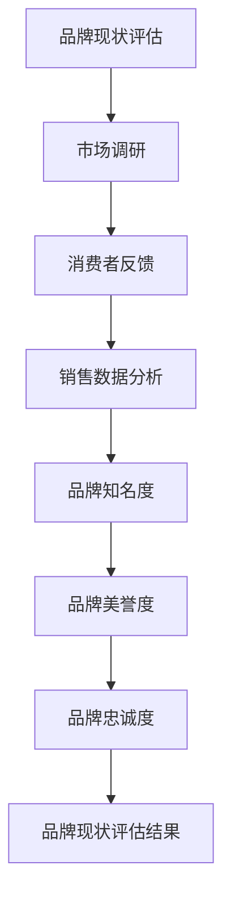

**核心算法原理讲解：**

品牌现状评估可以通过以下算法进行：

```python
# 市场调研得分
market_research_score = calculate_market_research_score(data)

# 消费者反馈得分
consumer_feedback_score = calculate_consumer_feedback_score(data)

# 销售数据分析得分
sales_data_score = calculate_sales_data_score(data)

# 总得分
total_score = market_research_score + consumer_feedback_score + sales_data_score

# 输出品牌现状评估结果
print("品牌现状评估结果：", total_score)
```

**举例说明：**

假设某品牌通过市场调研、消费者反馈和销售数据分析，得出以下得分：

- 市场调研得分：80分
- 消费者反馈得分：75分
- 销售数据分析得分：90分

则品牌现状评估总得分为：80 + 75 + 90 = 245分。

###### 2.1.2 品牌问题识别

品牌问题识别是品牌诊断的核心环节，通过分析品牌现状评估结果，找出品牌存在的问题和挑战。常见的问题包括品牌知名度不高、消费者满意度较低、市场份额下降等。

**核心概念与联系：**

品牌问题识别的核心概念包括问题分类、问题严重程度评估等。下面是一个简化的 Mermaid 流程图，展示品牌问题识别的关键步骤和概念：

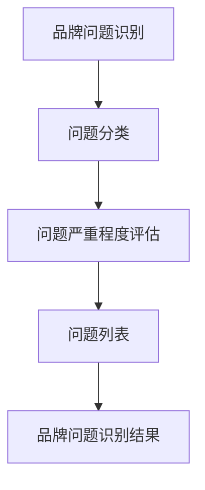

**核心算法原理讲解：**

品牌问题识别可以通过以下算法进行：

```python
# 问题分类
def classify_issues(issues):
    categories = []
    for issue in issues:
        if "知名度" in issue:
            categories.append("知名度问题")
        elif "满意度" in issue:
            categories.append("满意度问题")
        elif "市场份额" in issue:
            categories.append("市场份额问题")
        else:
            categories.append("其他问题")
    return categories

# 问题严重程度评估
def assess_severity(issues):
    severities = []
    for issue in issues:
        if "高" in issue:
            severities.append("高")
        elif "中" in issue:
            severities.append("中")
        else:
            severities.append("低")
    return severities

# 输出品牌问题识别结果
print("品牌问题识别结果：", classify_issues(issues), assess_severity(issues))
```

**举例说明：**

假设某品牌识别出以下问题：

- 知名度问题：低
- 满意度问题：中
- 市场份额问题：高

则品牌问题识别结果为：知名度问题（低），满意度问题（中），市场份额问题（高）。

###### 2.1.3 品牌诊断工具与方法

品牌诊断工具与方法包括SWOT分析、PEST分析、品牌价值评估等，这些工具可以帮助企业全面了解品牌现状，识别品牌问题。

**SWOT分析**

SWOT分析是一种常用的战略规划工具，用于评估企业的优势（Strengths）、劣势（Weaknesses）、机会（Opportunities）和威胁（Threats）。通过SWOT分析，企业可以识别自身的优劣势，并制定相应的品牌重塑策略。

**PEST分析**

PEST分析是一种宏观环境分析工具，用于分析企业所处的政治（Political）、经济（Economic）、社会（Social）和技术（Technological）环境。通过PEST分析，企业可以了解外部环境的变化趋势，制定相应的品牌重塑策略。

**品牌价值评估**

品牌价值评估是衡量品牌经济价值的一种方法，通过评估品牌的市场影响力、消费者忠诚度、品牌溢价等因素，确定品牌的实际价值。品牌价值评估有助于企业了解品牌的价值，为品牌重塑提供依据。

##### 2.2 制定品牌重塑策略

品牌重塑策略是品牌诊断的结果，旨在解决品牌存在的问题，提升品牌竞争力。制定品牌重塑策略需要明确品牌定位与目标、品牌核心价值提炼、品牌传播策略设计等。

###### 2.2.1 品牌定位与目标

品牌定位是品牌重塑的核心，它决定了品牌在市场中的定位和目标。品牌定位需要明确品牌的核心价值和目标消费者群体，为品牌重塑提供方向。

品牌目标是指品牌在短期内和长期内要实现的战略目标。短期目标包括提高品牌知名度、提升消费者满意度、扩大市场份额等；长期目标包括建立强大的品牌形象、成为行业领导者等。

**核心概念与联系：**

品牌定位与目标和品牌的核心价值、目标消费者群体密切相关。下面是一个简化的 Mermaid 流程图，展示品牌定位与目标的关键步骤和概念：

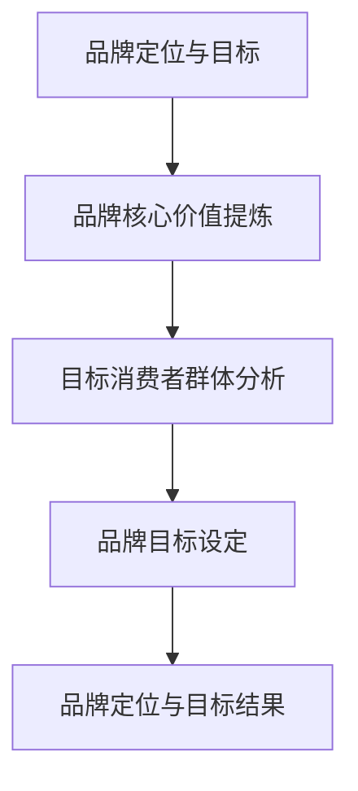

**核心算法原理讲解：**

品牌定位与目标可以通过以下算法进行：

```python
# 品牌核心价值提炼
def extract_brand_values(issues):
    values = []
    for issue in issues:
        if "品牌价值" in issue:
            values.append(issue)
    return values

# 目标消费者群体分析
def analyze_target_consumers(values):
    consumers = []
    for value in values:
        if "年轻" in value:
            consumers.append("年轻人")
        elif "专业" in value:
            consumers.append("专业人士")
        else:
            consumers.append("普通消费者")
    return consumers

# 品牌目标设定
def set_brand_goals(consumers):
    goals = []
    for consumer in consumers:
        if "年轻人" in consumer:
            goals.append("提高品牌在年轻人中的知名度")
        elif "专业人士" in consumer:
            goals.append("提升品牌在专业人士中的认可度")
        else:
            goals.append("扩大普通消费者群体")
    return goals

# 输出品牌定位与目标结果
print("品牌定位与目标结果：", extract_brand_values(issues), analyze_target_consumers(values), set_brand_goals(consumers))
```

**举例说明：**

假设某品牌在品牌诊断中识别出以下问题：

- 品牌价值：创新、高品质、专业
- 目标消费者群体：年轻人、专业人士

则品牌定位与目标结果为：品牌核心价值（创新、高品质、专业），目标消费者群体（年轻人、专业人士），品牌目标（提高品牌在年轻人中的知名度，提升品牌在专业人士中的认可度）。

###### 2.2.2 品牌核心价值提炼

品牌核心价值是品牌重塑的基石，它代表了品牌的核心竞争力。提炼品牌核心价值需要从品牌的历史、文化、产品特性等方面进行分析，找出品牌独特的价值所在。

**核心概念与联系：**

品牌核心价值提炼的核心概念包括品牌历史、品牌文化、产品特性等。下面是一个简化的 Mermaid 流程图，展示品牌核心价值提炼的关键步骤和概念：

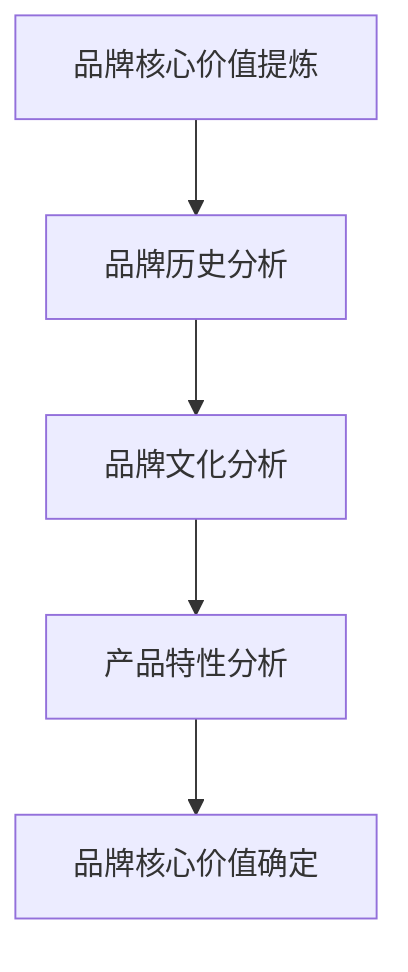

**核心算法原理讲解：**

品牌核心价值提炼可以通过以下算法进行：

```python
# 品牌历史分析
def analyze_brand_history(history):
    values = []
    for event in history:
        if "创新" in event:
            values.append("创新")
        elif "高品质" in event:
            values.append("高品质")
        elif "专业" in event:
            values.append("专业")
        else:
            values.append("其他")
    return values

# 品牌文化分析
def analyze_brand_culture(culture):
    values = []
    for aspect in culture:
        if "创新" in aspect:
            values.append("创新")
        elif "高品质" in aspect:
            values.append("高品质")
        elif "专业" in aspect:
            values.append("专业")
        else:
            values.append("其他")
    return values

# 产品特性分析
def analyze_product_characteristics(products):
    values = []
    for product in products:
        if "创新" in product:
            values.append("创新")
        elif "高品质" in product:
            values.append("高品质")
        elif "专业" in product:
            values.append("专业")
        else:
            values.append("其他")
    return values

# 品牌核心价值确定
def determine_brand_values(values):
    unique_values = []
    for value in values:
        if value not in unique_values:
            unique_values.append(value)
    return unique_values

# 输出品牌核心价值
print("品牌核心价值：", determine_brand_values(values))
```

**举例说明：**

假设某品牌在品牌诊断中识别出以下信息：

- 品牌历史：多次产品创新、高品质产品
- 品牌文化：鼓励创新、追求卓越
- 产品特性：创新技术、高品质设计

则品牌核心价值为：创新、高品质。

###### 2.2.3 品牌传播策略设计

品牌传播策略设计是品牌重塑的关键环节，它决定了品牌如何将品牌核心价值传递给目标消费者，提高品牌知名度和影响力。品牌传播策略包括广告宣传、公关活动、社交媒体营销等。

**核心概念与联系：**

品牌传播策略设计的核心概念包括品牌核心价值、目标消费者、传播渠道等。下面是一个简化的 Mermaid 流程图，展示品牌传播策略设计的关键步骤和概念：

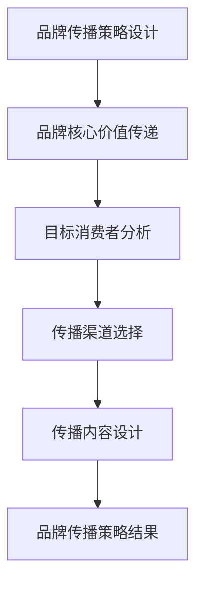

**核心算法原理讲解：**

品牌传播策略设计可以通过以下算法进行：

```python
# 品牌核心价值传递
def transmit_brand_values(values):
    messages = []
    for value in values:
        if "创新" in value:
            messages.append("我们的品牌以创新为核心，为您带来领先的体验。")
        elif "高品质" in value:
            messages.append("我们的品牌以高品质为标准，为您呈现卓越的产品。")
        else:
            messages.append("我们的品牌秉承专业精神，为您提供专业的服务。")
    return messages

# 目标消费者分析
def analyze_target_consumers(values):
    segments = []
    for value in values:
        if "年轻人" in value:
            segments.append("年轻人群体")
        elif "专业人士" in value:
            segments.append("专业人士群体")
        else:
            segments.append("普通消费者群体")
    return segments

# 传播渠道选择
def select_communication_channels(segments):
    channels = []
    for segment in segments:
        if "年轻人" in segment:
            channels.append("社交媒体平台")
        elif "专业人士" in segment:
            channels.append("专业论坛、博客")
        else:
            channels.append("传统广告、公关活动")
    return channels

# 传播内容设计
def design_communication_content(messages, channels):
    content = []
    for message in messages:
        for channel in channels:
            content.append(f"在{channel}上，我们传递{message}。")
    return content

# 输出品牌传播策略结果
print("品牌传播策略结果：", transmit_brand_values(values), analyze_target_consumers(values), select_communication_channels(segments), design_communication_content(messages, channels))
```

**举例说明：**

假设某品牌在品牌诊断中识别出以下信息：

- 品牌核心价值：创新、高品质
- 目标消费者群体：年轻人、专业人士

则品牌传播策略结果为：

- 传递核心价值：我们的品牌以创新为核心，为您带来领先的体验；我们的品牌以高品质为标准，为您呈现卓越的产品。
- 目标消费者群体：年轻人、专业人士
- 传播渠道：社交媒体平台、专业论坛、博客、传统广告、公关活动
- 传播内容：在社交媒体平台上，我们传递“我们的品牌以创新为核心，为您带来领先的体验”；在专业论坛、博客上，我们传递“我们的品牌以高品质为标准，为您呈现卓越的产品”；在传统广告、公关活动中，我们传递“我们的品牌秉承专业精神，为您提供专业的服务”。

##### 2.3 品牌重塑策略的执行与监控

品牌重塑策略的执行与监控是品牌重塑的关键环节，它决定了品牌重塑策略是否能够得到有效实施，并达到预期效果。

###### 2.3.1 品牌重塑项目规划

品牌重塑项目规划是品牌重塑策略执行的第一步，它包括项目目标、项目范围、项目进度、资源分配等方面的规划。品牌重塑项目规划需要明确品牌重塑的目标和预期成果，确定项目的关键节点和里程碑，以确保品牌重塑策略的顺利实施。

**核心概念与联系：**

品牌重塑项目规划的核心概念包括项目目标、项目范围、项目进度和资源分配等。下面是一个简化的 Mermaid 流程图，展示品牌重塑项目规划的关键步骤和概念：

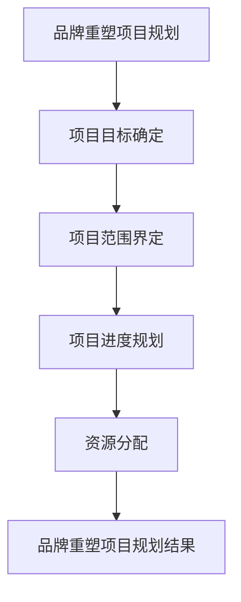

**核心算法原理讲解：**

品牌重塑项目规划可以通过以下算法进行：

```python
# 项目目标确定
def define_project_goals(goals):
    project_goals = []
    for goal in goals:
        if "提高品牌知名度" in goal:
            project_goals.append("提高品牌知名度")
        elif "提升消费者满意度" in goal:
            project_goals.append("提升消费者满意度")
        elif "扩大市场份额" in goal:
            project_goals.append("扩大市场份额")
        else:
            project_goals.append("其他目标")
    return project_goals

# 项目范围界定
def define_project_scope(scope):
    project_scope = []
    for aspect in scope:
        if "品牌传播" in aspect:
            project_scope.append("品牌传播")
        elif "产品创新" in aspect:
            project_scope.append("产品创新")
        elif "渠道拓展" in aspect:
            project_scope.append("渠道拓展")
        else:
            project_scope.append("其他范围")
    return project_scope

# 项目进度规划
def plan_project_progress(progress):
    milestones = []
    for step in progress:
        if "品牌传播策略设计" in step:
            milestones.append("品牌传播策略设计完成")
        elif "产品创新方案确定" in step:
            milestones.append("产品创新方案确定")
        elif "渠道拓展计划制定" in step:
            milestones.append("渠道拓展计划制定")
        else:
            milestones.append("其他里程碑")
    return milestones

# 资源分配
def allocate_resources(resources):
    resource_plan = []
    for resource in resources:
        if "人力资源" in resource:
            resource_plan.append("人力资源计划")
        elif "资金资源" in resource:
            resource_plan.append("资金资源计划")
        elif "技术资源" in resource:
            resource_plan.append("技术资源计划")
        else:
            resource_plan.append("其他资源计划")
    return resource_plan

# 输出品牌重塑项目规划结果
print("品牌重塑项目规划结果：", define_project_goals(goals), define_project_scope(scope), plan_project_progress(progress), allocate_resources(resources))
```

**举例说明：**

假设某品牌在品牌诊断和策略制定中确定了以下信息：

- 项目目标：提高品牌知名度、提升消费者满意度、扩大市场份额
- 项目范围：品牌传播、产品创新、渠道拓展
- 项目进度：品牌传播策略设计完成、产品创新方案确定、渠道拓展计划制定
- 资源分配：人力资源计划、资金资源计划、技术资源计划

则品牌重塑项目规划结果为：

- 项目目标：提高品牌知名度、提升消费者满意度、扩大市场份额
- 项目范围：品牌传播、产品创新、渠道拓展
- 项目进度：品牌传播策略设计完成、产品创新方案确定、渠道拓展计划制定
- 资源分配：人力资源计划、资金资源计划、技术资源计划

###### 2.3.2 品牌重塑实施步骤

品牌重塑实施步骤是将品牌重塑策略转化为具体行动的过程。它包括品牌定位调整、产品创新、渠道拓展、传播推广等具体措施。

**品牌定位调整**

品牌定位调整是品牌重塑的核心步骤，它需要根据品牌诊断的结果和品牌重塑策略，对品牌定位进行优化和调整。品牌定位调整包括明确品牌核心价值、调整品牌形象和品牌传播策略等。

**产品创新**

产品创新是提升品牌竞争力的关键，它需要根据市场变化和消费者需求，不断推出具有竞争力的新产品。产品创新包括产品研发、产品设计和产品测试等环节。

**渠道拓展**

渠道拓展是扩大品牌影响力的关键，它需要根据品牌定位和产品特性，选择合适的渠道进行拓展。渠道拓展包括线上渠道拓展和线下渠道拓展等。

**传播推广**

传播推广是将品牌核心价值和品牌形象传递给目标消费者的关键，它需要根据品牌传播策略，选择合适的传播渠道和传播内容。传播推广包括广告宣传、公关活动、社交媒体营销等。

**核心概念与联系：**

品牌重塑实施步骤的核心概念包括品牌定位调整、产品创新、渠道拓展、传播推广等。下面是一个简化的 Mermaid 流程图，展示品牌重塑实施步骤的关键步骤和概念：

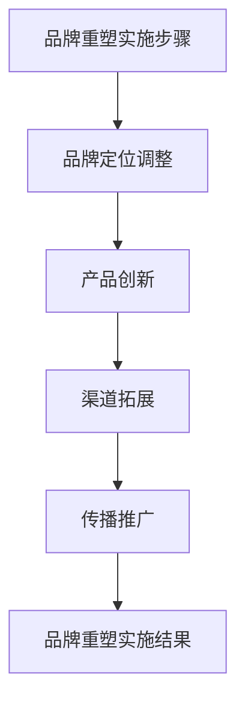

**核心算法原理讲解：**

品牌重塑实施步骤可以通过以下算法进行：

```python
# 品牌定位调整
def adjust_brand_position(values):
    new_values = []
    for value in values:
        if "创新" in value:
            new_values.append("创新领导者")
        elif "高品质" in value:
            new_values.append("高品质代表")
        else:
            new_values.append("专业服务商")
    return new_values

# 产品创新
def innovate_products(products):
    new_products = []
    for product in products:
        if "技术领先" in product:
            new_products.append("技术领先产品")
        elif "设计独特" in product:
            new_products.append("设计独特产品")
        else:
            new_products.append("实用功能产品")
    return new_products

# 渠道拓展
def expand_channels(channels):
    new_channels = []
    for channel in channels:
        if "线上" in channel:
            new_channels.append("线上电商平台")
        elif "线下" in channel:
            new_channels.append("线下专卖店")
        else:
            new_channels.append("多渠道整合")
    return new_channels

# 传播推广
def promote_brand(values, channels):
    promotions = []
    for value in values:
        for channel in channels:
            if "创新" in value:
                promotions.append("创新产品线上推广活动")
            elif "高品质" in value:
                promotions.append("高品质产品线下展示活动")
            else:
                promotions.append("专业服务社交媒体宣传")
    return promotions

# 输出品牌重塑实施结果
print("品牌重塑实施结果：", adjust_brand_position(values), innovate_products(products), expand_channels(channels), promote_brand(values, channels))
```

**举例说明：**

假设某品牌在品牌诊断和策略制定中确定了以下信息：

- 品牌核心价值：创新、高品质、专业
- 产品：技术领先产品、设计独特产品、实用功能产品
- 渠道：线上电商平台、线下专卖店、多渠道整合
- 传播渠道：社交媒体、传统广告、公关活动

则品牌重塑实施结果为：

- 品牌定位调整：创新领导者、高品质代表、专业服务商
- 产品创新：技术领先产品、设计独特产品、实用功能产品
- 渠道拓展：线上电商平台、线下专卖店、多渠道整合
- 传播推广：创新产品线上推广活动、高品质产品线下展示活动、专业服务社交媒体宣传

###### 2.3.3 品牌重塑资源调配

品牌重塑资源调配是确保品牌重塑策略顺利实施的关键，它需要根据品牌重塑项目规划，合理分配人力资源、资金资源和技术资源等。

**人力资源调配**

人力资源调配包括组建品牌重塑项目团队、确定团队成员职责和任务分配等。品牌重塑项目团队通常由市场营销、产品研发、销售和运营等部门的员工组成，每个团队成员都有明确的职责和任务。

**资金资源调配**

资金资源调配包括品牌重塑项目的预算分配、资金使用计划和监控等。品牌重塑项目的预算需要根据项目目标、项目范围和项目进度等因素进行科学规划和合理分配。

**技术资源调配**

技术资源调配包括确定品牌重塑项目所需的技术资源、技术资源的获取方式和使用等。品牌重塑项目所需的技术资源可能包括技术平台、技术工具、技术人才等。

**核心概念与联系：**

品牌重塑资源调配的核心概念包括人力资源、资金资源和技术资源等。下面是一个简化的 Mermaid 流程图，展示品牌重塑资源调配的关键步骤和概念：

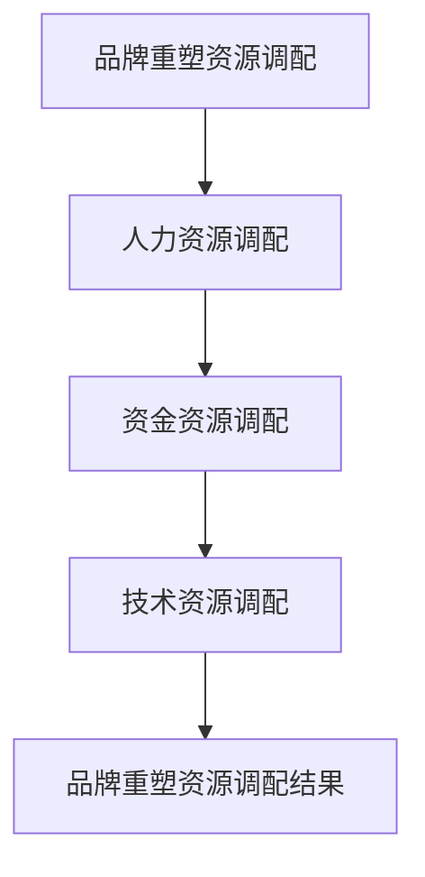

**核心算法原理讲解：**

品牌重塑资源调配可以通过以下算法进行：

```python
# 人力资源调配
def allocate_human_resources(team_members):
    roles = []
    for member in team_members:
        if "市场营销" in member:
            roles.append("市场营销负责人")
        elif "产品研发" in member:
            roles.append("产品研发负责人")
        elif "销售" in member:
            roles.append("销售负责人")
        else:
            roles.append("运营负责人")
    return roles

# 资金资源调配
def allocate_financial_resources(budget):
    allocations = []
    for aspect in budget:
        if "品牌传播" in aspect:
            allocations.append("品牌传播预算")
        elif "产品研发" in aspect:
            allocations.append("产品研发预算")
        elif "渠道拓展" in aspect:
            allocations.append("渠道拓展预算")
        else:
            allocations.append("其他预算")
    return allocations

# 技术资源调配
def allocate_technical_resources(technologies):
    resources = []
    for technology in technologies:
        if "技术平台" in technology:
            resources.append("技术平台资源")
        elif "技术工具" in technology:
            resources.append("技术工具资源")
        elif "技术人才" in technology:
            resources.append("技术人才资源")
        else:
            resources.append("其他技术资源")
    return resources

# 输出品牌重塑资源调配结果
print("品牌重塑资源调配结果：", allocate_human_resources(team_members), allocate_financial_resources(budget), allocate_technical_resources(technologies))
```

**举例说明：**

假设某品牌在品牌重塑项目规划中确定了以下信息：

- 项目团队：市场营销负责人、产品研发负责人、销售负责人、运营负责人
- 项目预算：品牌传播预算、产品研发预算、渠道拓展预算
- 项目所需技术资源：技术平台资源、技术工具资源、技术人才资源

则品牌重塑资源调配结果为：

- 人力资源调配：市场营销负责人、产品研发负责人、销售负责人、运营负责人
- 资金资源调配：品牌传播预算、产品研发预算、渠道拓展预算
- 技术资源调配：技术平台资源、技术工具资源、技术人才资源

##### 2.4 品牌重塑效果监控

品牌重塑效果监控是确保品牌重塑策略取得预期效果的关键，它需要通过设置评估指标、监控效果和持续优化等步骤，对品牌重塑过程进行实时监控。

###### 2.4.1 品牌重塑效果评估指标

品牌重塑效果评估指标包括品牌知名度、消费者满意度、市场份额、品牌溢价等。这些指标可以反映品牌重塑策略的实施效果，帮助企业了解品牌重塑的成果。

**核心概念与联系：**

品牌重塑效果评估指标的核心概念包括品牌知名度、消费者满意度、市场份额、品牌溢价等。下面是一个简化的 Mermaid 流程图，展示品牌重塑效果评估指标的关键步骤和概念：

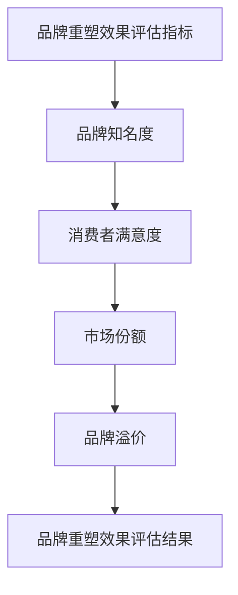

**核心算法原理讲解：**

品牌重塑效果评估指标可以通过以下算法进行：

```python
# 品牌知名度评估
def assess_brand_awareness(awareness):
    score = awareness / 100
    return score

# 消费者满意度评估
def assess_consumer_satisfaction(satisfaction):
    score = satisfaction / 100
    return score

# 市场份额评估
def assess_market_share(share):
    score = share / 100
    return score

# 品牌溢价评估
def assess_brand_ Premium(price):
    premium = (price - average_price) / average_price
    return premium

# 输出品牌重塑效果评估结果
print("品牌重塑效果评估结果：", assess_brand_awareness(awareness), assess_consumer_satisfaction(satisfaction), assess_market_share(share), assess_brand_Premium(price))
```

**举例说明：**

假设某品牌在品牌重塑后，收集到以下数据：

- 品牌知名度：80%
- 消费者满意度：90%
- 市场份额：15%
- 品牌溢价：20%

则品牌重塑效果评估结果为：

- 品牌知名度评估：0.8
- 消费者满意度评估：0.9
- 市场份额评估：0.15
- 品牌溢价评估：0.2

###### 2.4.2 品牌重塑效果监控方法

品牌重塑效果监控方法包括数据监测、消费者反馈和市场调研等。

**数据监测**

数据监测是品牌重塑效果监控的重要手段，通过收集和分析相关数据，可以实时了解品牌重塑的效果。数据监测的方法包括销售数据监测、网站流量监测、社交媒体监测等。

**消费者反馈**

消费者反馈是品牌重塑效果监控的重要来源，通过收集消费者的意见和建议，可以了解消费者对品牌重塑的满意度和认可度。消费者反馈的方法包括在线调查、电话调查、面对面访谈等。

**市场调研**

市场调研是品牌重塑效果监控的重要手段，通过收集市场数据和分析市场趋势，可以了解品牌在市场上的地位和竞争力。市场调研的方法包括问卷调查、深度访谈、竞争分析等。

**核心概念与联系：**

品牌重塑效果监控方法的核心概念包括数据监测、消费者反馈和市场调研等。下面是一个简化的 Mermaid 流程图，展示品牌重塑效果监控方法的关键步骤和概念：

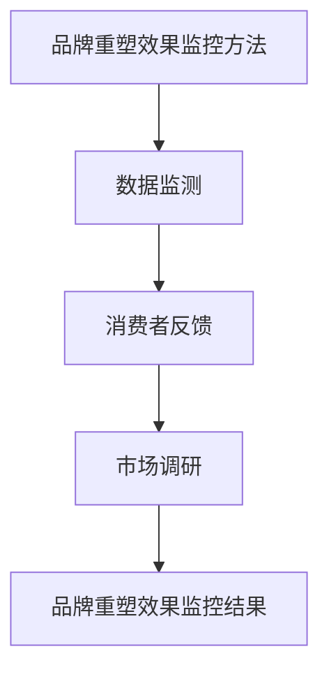

**核心算法原理讲解：**

品牌重塑效果监控方法可以通过以下算法进行：

```python
# 数据监测
def monitor_data(data):
    metrics = []
    for key in data:
        if "销售数据" in key:
            metrics.append("销售数据")
        elif "网站流量" in key:
            metrics.append("网站流量")
        elif "社交媒体监测" in key:
            metrics.append("社交媒体监测")
        else:
            metrics.append("其他数据")
    return metrics

# 消费者反馈
def collect_consumer_feedback(feedback):
    suggestions = []
    for comment in feedback:
        if "建议" in comment:
            suggestions.append("消费者建议")
        elif "投诉" in comment:
            suggestions.append("消费者投诉")
        else:
            suggestions.append("其他反馈")
    return suggestions

# 市场调研
def conduct_market_research(research):
    insights = []
    for result in research:
        if "市场趋势" in result:
            insights.append("市场趋势")
        elif "竞争分析" in result:
            insights.append("竞争分析")
        else:
            insights.append("其他调研结果")
    return insights

# 输出品牌重塑效果监控结果
print("品牌重塑效果监控结果：", monitor_data(data), collect_consumer_feedback(feedback), conduct_market_research(research))
```

**举例说明：**

假设某品牌在品牌重塑过程中，收集到以下数据：

- 数据监测：销售数据、网站流量、社交媒体监测
- 消费者反馈：消费者建议、消费者投诉
- 市场调研：市场趋势、竞争分析

则品牌重塑效果监控结果为：

- 数据监测：销售数据、网站流量、社交媒体监测
- 消费者反馈：消费者建议、消费者投诉
- 市场调研：市场趋势、竞争分析

###### 2.4.3 品牌重塑效果持续优化

品牌重塑效果持续优化是品牌重塑策略的重要组成部分，它需要根据品牌重塑效果监控的结果，对品牌重塑策略进行调整和优化，以实现品牌重塑的目标。

**核心概念与联系：**

品牌重塑效果持续优化的核心概念包括效果评估、策略调整和持续优化等。下面是一个简化的 Mermaid 流程图，展示品牌重塑效果持续优化的关键步骤和概念：

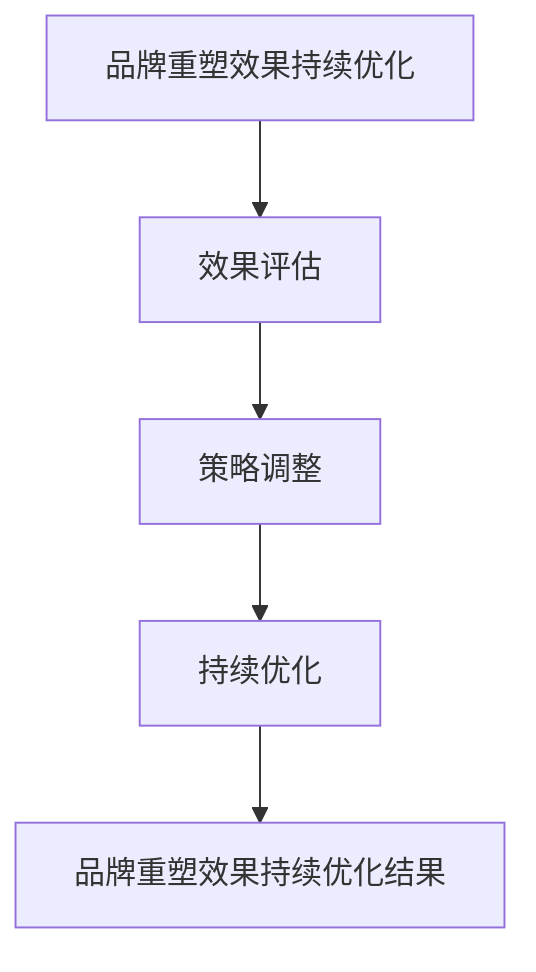

**核心算法原理讲解：**

品牌重塑效果持续优化可以通过以下算法进行：

```python
# 效果评估
def evaluate_effects(results):
    improvements = []
    for result in results:
        if "品牌知名度提高" in result:
            improvements.append("品牌知名度提高")
        elif "消费者满意度提升" in result:
            improvements.append("消费者满意度提升")
        elif "市场份额增加" in result:
            improvements.append("市场份额增加")
        else:
            improvements.append("其他改进")
    return improvements

# 策略调整
def adjust_strategies(strategies, improvements):
    adjusted_strategies = []
    for strategy in strategies:
        if "品牌传播" in strategy:
            if "品牌知名度提高" in improvements:
                adjusted_strategies.append("加大品牌传播力度")
            else:
                adjusted_strategies.append("调整品牌传播策略")
        elif "产品创新" in strategy:
            if "消费者满意度提升" in improvements:
                adjusted_strategies.append("继续推进产品创新")
            else:
                adjusted_strategies.append("重新评估产品创新方向")
        elif "渠道拓展" in strategy:
            if "市场份额增加" in improvements:
                adjusted_strategies.append("扩大渠道拓展范围")
            else:
                adjusted_strategies.append("优化渠道拓展策略")
        else:
            adjusted_strategies.append("其他策略调整")
    return adjusted_strategies

# 持续优化
def continue_optimization(optimized_strategies):
    ongoing_improvements = []
    for strategy in optimized_strategies:
        if "加大品牌传播力度" in strategy:
            ongoing_improvements.append("持续监测品牌知名度变化")
        elif "调整品牌传播策略" in strategy:
            ongoing_improvements.append("定期评估品牌传播效果")
        elif "继续推进产品创新" in strategy:
            ongoing_improvements.append("持续跟踪产品创新进展")
        elif "重新评估产品创新方向" in strategy:
            ongoing_improvements.append("定期评估产品创新效果")
        elif "扩大渠道拓展范围" in strategy:
            ongoing_improvements.append("持续扩大市场份额")
        elif "优化渠道拓展策略" in strategy:
            ongoing_improvements.append("定期评估渠道拓展效果")
        else:
            ongoing_improvements.append("持续优化其他策略")
    return ongoing_improvements

# 输出品牌重塑效果持续优化结果
print("品牌重塑效果持续优化结果：", evaluate_effects(results), adjust_strategies(strategies, improvements), continue_optimization(optimized_strategies))
```

**举例说明：**

假设某品牌在品牌重塑效果监控中收集到以下结果：

- 效果评估：品牌知名度提高、消费者满意度提升、市场份额增加
- 策略调整：加大品牌传播力度、继续推进产品创新、扩大渠道拓展范围
- 持续优化：持续监测品牌知名度变化、定期评估品牌传播效果、持续跟踪产品创新进展、定期评估产品创新效果、持续扩大市场份额、定期评估渠道拓展效果

则品牌重塑效果持续优化结果为：

- 效果评估：品牌知名度提高、消费者满意度提升、市场份额增加
- 策略调整：加大品牌传播力度、继续推进产品创新、扩大渠道拓展范围
- 持续优化：持续监测品牌知名度变化、定期评估品牌传播效果、持续跟踪产品创新进展、定期评估产品创新效果、持续扩大市场份额、定期评估渠道拓展效果

### 第3章：品牌重塑的执行与监控

品牌重塑是一项复杂的工程，它不仅需要精心策划和设计，还需要有效的执行和监控。在这一章中，我们将详细讨论品牌重塑的执行过程，包括项目规划、实施步骤和资源调配，以及品牌重塑效果的监控和持续优化。

#### 3.1 品牌重塑的实施

品牌重塑的实施是品牌重塑策略转化为实际操作的关键阶段。为了确保品牌重塑能够顺利实施，我们需要进行细致的项目规划，并制定明确的实施步骤。

##### 3.1.1 品牌重塑项目规划

品牌重塑项目规划是品牌重塑实施的起点。项目规划需要明确项目的目标、范围、进度和资源需求。

**项目目标：** 品牌重塑的目标可能包括提高品牌知名度、提升消费者满意度、扩大市场份额等。这些目标应该具体、可衡量和可达成。

**项目范围：** 品牌重塑的项目范围可能涉及品牌形象重塑、产品和服务创新、营销策略调整等。明确项目范围有助于确保资源的合理分配和项目的有效执行。

**项目进度：** 项目进度需要根据品牌重塑的目标和范围，制定详细的计划和时间表，确保每个阶段的工作都能按时完成。

**资源需求：** 品牌重塑需要各种资源，包括人力资源、财务资源和技术资源。资源需求的分析和规划是确保项目顺利执行的重要环节。

**核心概念与联系：**

项目规划的核心概念包括项目目标、项目范围、项目进度和资源需求。下面是一个简化的 Mermaid 流程图，展示项目规划的关键步骤和概念：

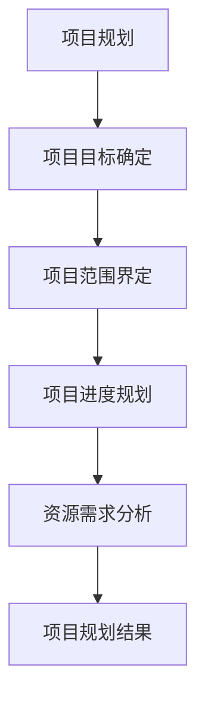

**核心算法原理讲解：**

项目规划可以通过以下算法进行：

```python
# 项目目标确定
def define_project_goals(goals):
    specific_goals = []
    for goal in goals:
        if "提高品牌知名度" in goal:
            specific_goals.append("提高品牌知名度")
        elif "提升消费者满意度" in goal:
            specific_goals.append("提升消费者满意度")
        elif "扩大市场份额" in goal:
            specific_goals.append("扩大市场份额")
        else:
            specific_goals.append("其他目标")
    return specific_goals

# 项目范围界定
def define_project_scope(scope):
    project_activities = []
    for activity in scope:
        if "品牌形象重塑" in activity:
            project_activities.append("品牌形象重塑")
        elif "产品和服务创新" in activity:
            project_activities.append("产品和服务创新")
        elif "营销策略调整" in activity:
            project_activities.append("营销策略调整")
        else:
            project_activities.append("其他活动")
    return project_activities

# 项目进度规划
def plan_project_progress(activities):
    milestones = []
    for activity in activities:
        if "品牌形象重塑" in activity:
            milestones.append("品牌形象重塑完成")
        elif "产品和服务创新" in activity:
            milestones.append("产品和服务创新完成")
        elif "营销策略调整" in activity:
            milestones.append("营销策略调整完成")
        else:
            milestones.append("其他里程碑")
    return milestones

# 资源需求分析
def analyze_resources.resources需求的类型
    resource需求的类型 = []
    for type in resources:
        if "人力资源" in type:
            resource需求的类型.append("人力资源")
        elif "财务资源" in type:
            resource需求的类型.append("财务资源")
        elif "技术资源" in type:
            resource需求的类型.append("技术资源")
        else:
            resource需求的的类型.append("其他资源")
    return resource需求的类型

# 输出项目规划结果
print("项目规划结果：", define_project_goals(goals), define_project_scope(scope), plan_project_progress(activities), analyze_resources.resources需求的类型)
```

**举例说明：**

假设某品牌在品牌重塑项目中确定了以下信息：

- 项目目标：提高品牌知名度、提升消费者满意度、扩大市场份额
- 项目范围：品牌形象重塑、产品和服务创新、营销策略调整
- 项目进度：品牌形象重塑完成、产品和服务创新完成、营销策略调整完成
- 资源需求：人力资源、财务资源、技术资源

则项目规划结果为：

- 项目目标：提高品牌知名度、提升消费者满意度、扩大市场份额
- 项目范围：品牌形象重塑、产品和服务创新、营销策略调整
- 项目进度：品牌形象重塑完成、产品和服务创新完成、营销策略调整完成
- 资源需求：人力资源、财务资源、技术资源

##### 3.1.2 品牌重塑实施步骤

品牌重塑实施步骤是将项目规划转化为具体操作的过程。以下是品牌重塑实施的主要步骤：

**步骤1：品牌诊断**

品牌诊断是品牌重塑的第一步，它包括对当前品牌状况的评估，识别品牌存在的问题和挑战。品牌诊断可以通过市场调研、消费者反馈、销售数据分析等方法进行。

**步骤2：品牌定位与目标设定**

在品牌诊断的基础上，确定品牌的新定位和目标。品牌定位应该明确品牌的核心价值和目标消费者群体，为目标设定提供指导。

**步骤3：品牌核心价值提炼**

品牌核心价值提炼是品牌重塑的核心环节，它需要从品牌的历史、文化、产品特性等方面，提炼出品牌独特的价值主张。

**步骤4：品牌传播策略设计**

品牌传播策略设计是品牌重塑的重要一环，它需要制定具体的品牌传播计划，包括广告宣传、公关活动、社交媒体营销等。

**步骤5：实施品牌重塑策略**

实施品牌重塑策略是将品牌重塑计划付诸实践的过程，包括品牌形象重塑、产品和服务创新、营销策略调整等。

**步骤6：效果监控与持续优化**

在品牌重塑实施过程中，需要实时监控品牌重塑的效果，并根据监控结果进行调整和优化，以确保品牌重塑目标的实现。

**核心概念与联系：**

品牌重塑实施步骤的核心概念包括品牌诊断、品牌定位与目标设定、品牌核心价值提炼、品牌传播策略设计、实施品牌重塑策略和效果监控与持续优化。下面是一个简化的 Mermaid 流程图，展示品牌重塑实施步骤的关键步骤和概念：

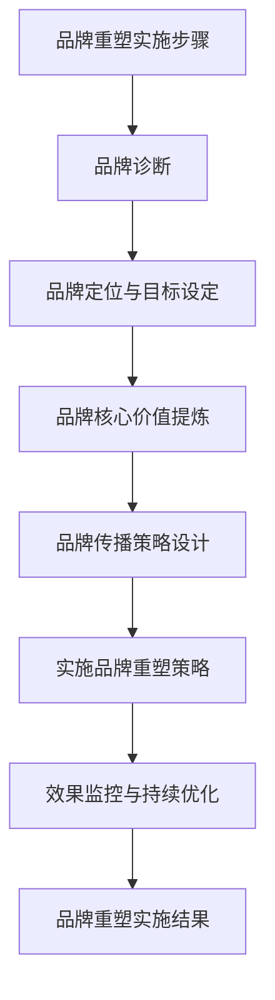

**核心算法原理讲解：**

品牌重塑实施步骤可以通过以下算法进行：

```python
# 品牌诊断
def diagnose_brand(issues):
    diagnosed_issues = []
    for issue in issues:
        if "品牌知名度低" in issue:
            diagnosed_issues.append("品牌知名度低")
        elif "消费者满意度不高" in issue:
            diagnosed_issues.append("消费者满意度不高")
        elif "市场份额下降" in issue:
            diagnosed_issues.append("市场份额下降")
        else:
            diagnosed_issues.append("其他问题")
    return diagnosed_issues

# 品牌定位与目标设定
def set_brand_position(values):
    brand_position = []
    for value in values:
        if "创新" in value:
            brand_position.append("创新领导者")
        elif "高品质" in value:
            brand_position.append("高品质代表")
        elif "专业" in value:
            brand_position.append("专业服务商")
        else:
            brand_position.append("其他定位")
    return brand_position

# 品牌核心价值提炼
def extract_brand_values(values):
    core_values = []
    for value in values:
        if "创新" in value:
            core_values.append("创新")
        elif "高品质" in value:
            core_values.append("高品质")
        elif "专业" in value:
            core_values.append("专业")
        else:
            core_values.append("其他价值")
    return core_values

# 品牌传播策略设计
def design_brand_communication(values):
    communication_strategies = []
    for value in values:
        if "创新" in value:
            communication_strategies.append("创新产品发布会")
        elif "高品质" in value:
            communication_strategies.append("高品质体验活动")
        elif "专业" in value:
            communication_strategies.append("专业研讨会")
        else:
            communication_strategies.append("其他传播活动")
    return communication_strategies

# 实施品牌重塑策略
def implement_brand_remodeling(steps):
    implemented_steps = []
    for step in steps:
        if "品牌诊断" in step:
            implemented_steps.append("完成品牌诊断")
        elif "品牌定位与目标设定" in step:
            implemented_steps.append("完成品牌定位与目标设定")
        elif "品牌核心价值提炼" in step:
            implemented_steps.append("完成品牌核心价值提炼")
        elif "品牌传播策略设计" in step:
            implemented_steps.append("完成品牌传播策略设计")
        else:
            implemented_steps.append("其他步骤")
    return implemented_steps

# 效果监控与持续优化
def monitor_and_optimize_effects(results):
    optimization_actions = []
    for result in results:
        if "品牌知名度提高" in result:
            optimization_actions.append("加大品牌宣传力度")
        elif "消费者满意度提升" in result:
            optimization_actions.append("优化消费者体验")
        elif "市场份额增加" in result:
            optimization_actions.append("扩大市场覆盖范围")
        else:
            optimization_actions.append("其他优化措施")
    return optimization_actions

# 输出品牌重塑实施结果
print("品牌重塑实施结果：", diagnose_brand(issues), set_brand_position(values), extract_brand_values(values), design_brand_communication(values), implement_brand_remodeling(steps), monitor_and_optimize_effects(results))
```

**举例说明：**

假设某品牌在品牌重塑过程中确定了以下信息：

- 品牌诊断问题：品牌知名度低、消费者满意度不高、市场份额下降
- 品牌定位与目标：创新领导者、高品质代表、专业服务商
- 品牌核心价值：创新、高品质、专业
- 品牌传播策略：创新产品发布会、高品质体验活动、专业研讨会
- 实施步骤：完成品牌诊断、完成品牌定位与目标设定、完成品牌核心价值提炼、完成品牌传播策略设计
- 效果监控结果：品牌知名度提高、消费者满意度提升、市场份额增加

则品牌重塑实施结果为：

- 品牌诊断问题：品牌知名度低、消费者满意度不高、市场份额下降
- 品牌定位与目标：创新领导者、高品质代表、专业服务商
- 品牌核心价值：创新、高品质、专业
- 品牌传播策略：创新产品发布会、高品质体验活动、专业研讨会
- 实施步骤：完成品牌诊断、完成品牌定位与目标设定、完成品牌核心价值提炼、完成品牌传播策略设计
- 效果监控结果：品牌知名度提高、消费者满意度提升、市场份额增加

##### 3.1.3 品牌重塑资源调配

品牌重塑资源调配是确保品牌重塑策略顺利实施的关键环节。资源调配需要合理分配人力资源、财务资源和技术资源等。

**人力资源调配**

人力资源调配包括组建品牌重塑项目团队、确定团队成员的职责和任务分配等。品牌重塑项目团队通常由市场营销、产品研发、销售和运营等部门的专家组成。

**财务资源调配**

财务资源调配包括品牌重塑项目的预算分配、资金使用计划和监控等。品牌重塑项目的预算需要根据项目目标、范围和进度等因素进行科学规划和合理分配。

**技术资源调配**

技术资源调配包括确定品牌重塑项目所需的技术资源、技术资源的获取方式和使用等。品牌重塑项目所需的技术资源可能包括技术平台、技术工具和技术人才等。

**核心概念与联系：**

品牌重塑资源调配的核心概念包括人力资源、财务资源和技术资源等。下面是一个简化的 Mermaid 流程图，展示品牌重塑资源调配的关键步骤和概念：


**核心算法原理讲解：**

品牌重塑资源调配可以通过以下算法进行：

```python
# 人力资源调配
def allocate_human_resources(team_members):
    roles = []
    for member in team_members:
        if "市场营销" in member:
            roles.append("市场营销负责人")
        elif "产品研发" in member:
            roles.append("产品研发负责人")
        elif "销售" in member:
            roles.append("销售负责人")
        else:
            roles.append("运营负责人")
    return roles

# 财务资源调配
def allocate_financial_resources(budget):
    allocations = []
    for aspect in budget:
        if "品牌传播" in aspect:
            allocations.append("品牌传播预算")
        elif "产品研发" in aspect:
            allocations.append("产品研发预算")
        elif "渠道拓展" in aspect:
            allocations.append("渠道拓展预算")
        else:
            allocations.append("其他预算")
    return allocations

# 技术资源调配
def allocate_technical_resources(technologies):
    resources = []
    for technology in technologies:
        if "技术平台" in technology:
            resources.append("技术平台资源")
        elif "技术工具" in technology:
            resources.append("技术工具资源")
        elif "技术人才" in technology:
            resources.append("技术人才资源")
        else:
            resources.append("其他技术资源")
    return resources

# 输出品牌重塑资源调配结果
print("品牌重塑资源调配结果：", allocate_human_resources(team_members), allocate_financial_resources(budget), allocate_technical_resources(technologies))
```

**举例说明：**

假设某品牌在品牌重塑项目中确定了以下信息：

- 项目团队：市场营销负责人、产品研发负责人、销售负责人、运营负责人
- 项目预算：品牌传播预算、产品研发预算、渠道拓展预算
- 项目所需技术资源：技术平台资源、技术工具资源、技术人才资源

则品牌重塑资源调配结果为：

- 人力资源调配：市场营销负责人、产品研发负责人、销售负责人、运营负责人
- 财务资源调配：品牌传播预算、产品研发预算、渠道拓展预算
- 技术资源调配：技术平台资源、技术工具资源、技术人才资源

#### 3.2 品牌重塑效果监控

品牌重塑效果监控是确保品牌重塑策略取得预期效果的重要手段。通过设置评估指标、实时监控效果和进行效果分析，可以及时发现问题和进行调整。

##### 3.2.1 品牌重塑效果评估指标

品牌重塑效果评估指标包括品牌知名度、消费者满意度、市场份额、品牌溢价等。这些指标可以反映品牌重塑策略的实施效果，帮助企业了解品牌重塑的成果。

**品牌知名度评估指标：** 品牌知名度可以通过市场调研、广告曝光度、社交媒体关注度等指标进行评估。

**消费者满意度评估指标：** 消费者满意度可以通过消费者调查、在线评论、口碑传播等指标进行评估。

**市场份额评估指标：** 市场份额可以通过销售数据、市场份额分析、竞争对手分析等指标进行评估。

**品牌溢价评估指标：** 品牌溢价可以通过产品价格与同类产品价格的比较、消费者购买意愿等指标进行评估。

**核心概念与联系：**

品牌重塑效果评估指标的核心概念包括品牌知名度、消费者满意度、市场份额、品牌溢价等。下面是一个简化的 Mermaid 流程图，展示品牌重塑效果评估指标的关键步骤和概念：

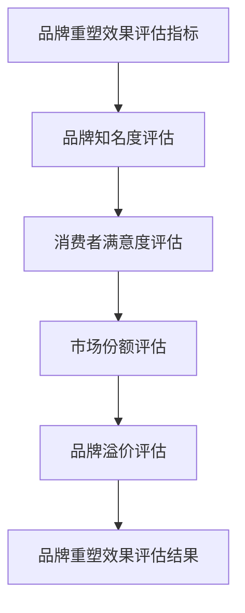

**核心算法原理讲解：**

品牌重塑效果评估指标可以通过以下算法进行：

```python
# 品牌知名度评估
def assess_brand_awareness(awareness):
    score = awareness / 100
    return score

# 消费者满意度评估
def assess_consumer_satisfaction(satisfaction):
    score = satisfaction / 100
    return score

# 市场份额评估
def assess_market_share(share):
    score = share / 100
    return score

# 品牌溢价评估
def assess_brand_premium(price):
    premium = (price - average_price) / average_price
    return premium

# 输出品牌重塑效果评估结果
print("品牌重塑效果评估结果：", assess_brand_awareness(awareness), assess_consumer_satisfaction(satisfaction), assess_market_share(share), assess_brand_premium(price))
```

**举例说明：**

假设某品牌在品牌重塑后，收集到以下数据：

- 品牌知名度：80%
- 消费者满意度：90%
- 市场份额：15%
- 品牌溢价：20%

则品牌重塑效果评估结果为：

- 品牌知名度评估：0.8
- 消费者满意度评估：0.9
- 市场份额评估：0.15
- 品牌溢价评估：0.2

##### 3.2.2 品牌重塑效果监控方法

品牌重塑效果监控方法包括数据监测、消费者反馈和市场调研等。

**数据监测：** 数据监测是品牌重塑效果监控的重要手段，通过收集和分析相关数据，可以实时了解品牌重塑的效果。数据监测的方法包括销售数据监测、网站流量监测、社交媒体监测等。

**消费者反馈：** 消费者反馈是品牌重塑效果监控的重要来源，通过收集消费者的意见和建议，可以了解消费者对品牌重塑的满意度和认可度。消费者反馈的方法包括在线调查、电话调查、面对面访谈等。

**市场调研：** 市场调研是品牌重塑效果监控的重要手段，通过收集市场数据和分析市场趋势，可以了解品牌在市场上的地位和竞争力。市场调研的方法包括问卷调查、深度访谈、竞争分析等。

**核心概念与联系：**

品牌重塑效果监控方法的核心概念包括数据监测、消费者反馈和市场调研等。下面是一个简化的 Mermaid 流程图，展示品牌重塑效果监控方法的关键步骤和概念：


**核心算法原理讲解：**

品牌重塑效果监控方法可以通过以下算法进行：

```python
# 数据监测
def monitor_data(data):
    metrics = []
    for key in data:
        if "销售数据" in key:
            metrics.append("销售数据")
        elif "网站流量" in key:
            metrics.append("网站流量")
        elif "社交媒体监测" in key:
            metrics.append("社交媒体监测")
        else:
            metrics.append("其他数据")
    return metrics

# 消费者反馈
def collect_consumer_feedback(feedback):
    suggestions = []
    for comment in feedback:
        if "建议" in comment:
            suggestions.append("消费者建议")
        elif "投诉" in comment:
            suggestions.append("消费者投诉")
        else:
            suggestions.append("其他反馈")
    return suggestions

# 市场调研
def conduct_market_research(research):
    insights = []
    for result in research:
        if "市场趋势" in result:
            insights.append("市场趋势")
        elif "竞争分析" in result:
            insights.append("竞争分析")
        else:
            insights.append("其他调研结果")
    return insights

# 输出品牌重塑效果监控结果
print("品牌重塑效果监控结果：", monitor_data(data), collect_consumer_feedback(feedback), conduct_market_research(research))
```

**举例说明：**

假设某品牌在品牌重塑过程中，收集到以下数据：

- 数据监测：销售数据、网站流量、社交媒体监测
- 消费者反馈：消费者建议、消费者投诉
- 市场调研：市场趋势、竞争分析

则品牌重塑效果监控结果为：

- 数据监测：销售数据、网站流量、社交媒体监测
- 消费者反馈：消费者建议、消费者投诉
- 市场调研：市场趋势、竞争分析

##### 3.2.3 品牌重塑效果持续优化

品牌重塑效果持续优化是品牌重塑策略的重要组成部分，它需要根据品牌重塑效果监控的结果，对品牌重塑策略进行调整和优化，以实现品牌重塑的目标。

**核心概念与联系：**

品牌重塑效果持续优化的核心概念包括效果评估、策略调整和持续优化等。下面是一个简化的 Mermaid 流程图，展示品牌重塑效果持续优化的关键步骤和概念：


**核心算法原理讲解：**

品牌重塑效果持续优化可以通过以下算法进行：

```python
# 效果评估
def evaluate_effects(results):
    improvements = []
    for result in results:
        if "品牌知名度提高" in result:
            improvements.append("品牌知名度提高")
        elif "消费者满意度提升" in result:
            improvements.append("消费者满意度提升")
        elif "市场份额增加" in result:
            improvements.append("市场份额增加")
        else:
            improvements.append("其他改进")
    return improvements

# 策略调整
def adjust_strategies(strategies, improvements):
    adjusted_strategies = []
    for strategy in strategies:
        if "品牌传播" in strategy:
            if "品牌知名度提高" in improvements:
                adjusted_strategies.append("加大品牌传播力度")
            else:
                adjusted_strategies.append("调整品牌传播策略")
        elif "产品创新" in strategy:
            if "消费者满意度提升" in improvements:
                adjusted_strategies.append("继续推进产品创新")
            else:
                adjusted_strategies.append("重新评估产品创新方向")
        elif "渠道拓展" in strategy:
            if "市场份额增加" in improvements:
                adjusted_strategies.append("扩大渠道拓展范围")
            else:
                adjusted_strategies.append("优化渠道拓展策略")
        else:
            adjusted_strategies.append("其他策略调整")
    return adjusted_strategies

# 持续优化
def continue_optimization(optimized_strategies):
    ongoing_improvements = []
    for strategy in optimized_strategies:
        if "加大品牌传播力度" in strategy:
            ongoing_improvements.append("持续监测品牌知名度变化")
        elif "调整品牌传播策略" in strategy:
            ongoing_improvements.append("定期评估品牌传播效果")
        elif "继续推进产品创新" in strategy:
            ongoing_improvements.append("持续跟踪产品创新进展")
        elif "重新评估产品创新方向" in strategy:
            ongoing_improvements.append("定期评估产品创新效果")
        elif "扩大渠道拓展范围" in strategy:
            ongoing_improvements.append("持续扩大市场份额")
        elif "优化渠道拓展策略" in strategy:
            ongoing_improvements.append("定期评估渠道拓展效果")
        else:
            ongoing_improvements.append("持续优化其他策略")
    return ongoing_improvements

# 输出品牌重塑效果持续优化结果
print("品牌重塑效果持续优化结果：", evaluate_effects(results), adjust_strategies(strategies, improvements), continue_optimization(optimized_strategies))
```

**举例说明：**

假设某品牌在品牌重塑效果监控中收集到以下结果：

- 效果评估：品牌知名度提高、消费者满意度提升、市场份额增加
- 策略调整：加大品牌传播力度、继续推进产品创新、扩大渠道拓展范围
- 持续优化：持续监测品牌知名度变化、定期评估品牌传播效果、持续跟踪产品创新进展、定期评估产品创新效果、持续扩大市场份额、定期评估渠道拓展效果

则品牌重塑效果持续优化结果为：

- 效果评估：品牌知名度提高、消费者满意度提升、市场份额增加
- 策略调整：加大品牌传播力度、继续推进产品创新、扩大渠道拓展范围
- 持续优化：持续监测品牌知名度变化、定期评估品牌传播效果、持续跟踪产品创新进展、定期评估产品创新效果、持续扩大市场份额、定期评估渠道拓展效果

### 第二部分：品牌重塑案例与实践

#### 第4章：知名企业品牌重塑案例

在品牌重塑的历史中，有许多知名企业的成功案例。这些案例不仅展示了品牌重塑的理论和实践，还为其他企业提供了宝贵的经验。在本章中，我们将分析两个知名企业的品牌重塑案例：苹果公司和星巴克。

##### 4.1 品牌重塑案例1：苹果公司

**4.1.1 苹果公司品牌重塑的背景**

苹果公司成立于1976年，自成立以来，一直以其创新的产品和技术领导着全球科技行业。然而，在2010年前后，苹果公司面临着一系列挑战，包括竞争对手的激烈竞争、产品线过于冗长以及消费者对产品创新放缓的抱怨。

**4.1.2 苹果公司品牌重塑的策略**

为了应对这些挑战，苹果公司在2010年启动了一项全面的品牌重塑计划。品牌重塑的策略主要包括以下几个方面：

1. **产品创新**：苹果公司加大了研发投入，推出了多款创新产品，如iPhone 4、iPad和Apple Watch等。这些产品不仅技术上领先，而且在设计上也极具创新性，为苹果公司赢得了消费者的青睐。

2. **品牌形象重塑**：苹果公司对品牌形象进行了更新，推出了全新的Logo，并加强了品牌故事和品牌文化的传播。苹果公司强调其创新、设计和用户体验的核心价值观，使品牌形象更加鲜明。

3. **渠道拓展**：苹果公司积极拓展了在线销售渠道，推出了Apple Store在线商店，为消费者提供了更便捷的购买方式。同时，苹果公司在全球范围内建立了大量的零售店，提升了品牌的可及性。

4. **市场营销**：苹果公司采用了更加聚焦和创新的营销策略，通过精心设计的广告和公关活动，强化了品牌的独特性和市场地位。

**4.1.3 苹果公司品牌重塑的成果**

通过一系列品牌重塑策略的实施，苹果公司取得了显著的成果：

- 品牌知名度和美誉度显著提升，消费者对苹果品牌的忠诚度增强。
- 产品销售额和市场份额持续增长，尤其是在智能手机和平板电脑市场，苹果公司占据了领先地位。
- 苹果公司的市值大幅上涨，成为全球最有价值的科技公司之一。

**4.1.4 苹果公司品牌重塑的经验与启示**

苹果公司的品牌重塑案例提供了以下经验和启示：

1. **持续创新是品牌重塑的核心**：苹果公司通过不断推出创新产品，保持了品牌的活力和竞争力。
2. **品牌形象重塑需要多方面的努力**：不仅仅是产品创新，品牌形象的重塑也需要在品牌故事、品牌文化和市场营销等方面进行全面更新。
3. **渠道拓展和市场营销策略的调整**：通过线上线下渠道的拓展和创新的营销策略，品牌可以更好地接触到目标消费者。

##### 4.2 品牌重塑案例2：星巴克

**4.2.1 星巴克品牌重塑的背景**

星巴克成立于1971年，是全球最大的咖啡连锁品牌之一。然而，在2014年，星巴克面临着销售额下滑、市场份额下降和消费者满意度下降等挑战。为了应对这些挑战，星巴克启动了一项全面的品牌重塑计划。

**4.2.2 星巴克品牌重塑的策略**

星巴克的品牌重塑策略主要包括以下几个方面：

1. **产品创新**：星巴克推出了多种新口味的咖啡和茶饮，以满足不同消费者的需求。同时，星巴克还加强了食品和甜点的创新，为消费者提供更丰富的选择。

2. **品牌体验**：星巴克加强了门店的装修和设计，营造了更加舒适和温馨的咖啡体验环境。星巴克还推出了“第三空间”理念，强调门店不仅是咖啡消费的场所，更是人们社交和工作的空间。

3. **社会责任**：星巴克加强了其社会责任项目的宣传，包括咖啡农的支持、环境保护和社区参与等。这有助于提升品牌形象，增强消费者对品牌的认同感。

4. **数字营销**：星巴克加强了数字营销和社交媒体的投入，通过线上活动、社交媒体互动和移动应用等手段，提升了品牌的影响力和消费者参与度。

**4.2.3 星巴克品牌重塑的成果**

通过品牌重塑策略的实施，星巴克取得了以下成果：

- 销售额和市场份额逐步回升，消费者满意度显著提升。
- 星巴克的品牌形象得到了重新塑造，消费者对品牌的认同感和忠诚度增强。
- 星巴克在全球市场的扩张步伐加快，门店数量和收入持续增长。

**4.2.4 星巴克品牌重塑的经验与启示**

星巴克的品牌重塑案例提供了以下经验和启示：

1. **产品创新是提升品牌竞争力的重要手段**：星巴克通过推出多种新产品，满足了消费者的不同需求，增强了品牌的市场竞争力。
2. **品牌体验和顾客互动至关重要**：星巴克通过打造温馨的门店环境和“第三空间”理念，提升了顾客体验，增强了品牌与消费者的联系。
3. **社会责任项目的宣传有助于提升品牌形象**：星巴克通过加强社会责任项目的宣传，提升了品牌的社会形象，增强了消费者对品牌的认同感。

#### 第5章：小型企业品牌重塑实践

对于小型企业来说，品牌重塑同样具有重要意义。尽管资源有限，小型企业也可以通过有效的策略和实践，实现品牌重塑，提升市场竞争力。

##### 5.1 小型企业品牌重塑的特点与挑战

**5.1.1 小型企业品牌重塑的特点**

1. **资源有限**：小型企业通常在人力资源、财务资源和市场资源方面有限，因此品牌重塑策略需要更加精简和高效。
2. **灵活性高**：小型企业决策过程相对简单，能够快速响应市场变化，调整品牌策略。
3. **专注于本地市场**：小型企业往往专注于本地市场，品牌重塑策略需要针对本地消费者的特点和需求进行设计。

**5.1.2 小型企业品牌重塑的挑战**

1. **资金不足**：小型企业在财务资源方面有限，难以投入大量资金进行品牌重塑。
2. **市场认知度低**：小型企业在市场中的知名度相对较低，品牌重塑需要花费更多时间和精力来提升品牌认知度。
3. **竞争激烈**：小型企业面临来自大企业的竞争，需要通过品牌重塑来增强自身的市场竞争力。

##### 5.2 小型企业品牌重塑实战

**5.2.1 小型企业品牌重塑的步骤**

1. **市场调研**：了解目标市场和目标消费者的需求，为品牌重塑提供依据。
2. **品牌诊断**：分析当前品牌存在的问题和挑战，为品牌重塑制定策略。
3. **品牌定位**：确定品牌的核心价值和目标消费者群体，为品牌重塑提供方向。
4. **品牌传播**：设计并实施品牌传播策略，提升品牌知名度和影响力。
5. **效果监控**：通过数据监测和消费者反馈，评估品牌重塑的效果，并进行持续优化。

**5.2.2 小型企业品牌重塑的案例解析**

**案例：某小型咖啡店的品牌重塑**

某小型咖啡店在开业初期，面临以下挑战：

- 市场认知度低：消费者对咖啡店的了解有限，顾客流量较低。
- 品牌形象不鲜明：咖啡店的装修风格和品牌形象较为普通，难以吸引顾客。
- 产品创新不足：咖啡店的菜单较为单一，缺乏特色和创新。

为了应对这些挑战，咖啡店采取了以下品牌重塑策略：

1. **市场调研**：通过问卷调查和访谈，了解目标消费者的需求和喜好，发现消费者对有机咖啡和特色饮品有较高需求。

2. **品牌诊断**：分析当前品牌存在的问题，确定品牌重塑的目标和方向。

3. **品牌定位**：将品牌定位为“有机、特色、温馨”的咖啡店，以有机咖啡和特色饮品为主要卖点，打造温馨的咖啡体验环境。

4. **品牌传播**：通过社交媒体、线上线下广告和口碑传播，提升品牌知名度和影响力。

5. **效果监控**：通过销售数据、顾客反馈和社交媒体互动，评估品牌重塑的效果，并根据反馈进行持续优化。

通过品牌重塑，咖啡店的销售额和顾客满意度显著提升，品牌知名度也逐步提高。

**5.2.3 小型企业品牌重塑的实战建议**

1. **明确品牌定位**：小型企业在品牌重塑过程中，需要明确品牌的核心价值和目标消费者群体，确保品牌策略的精准和有效。

2. **注重产品创新**：通过不断推出特色产品和创新服务，满足消费者的多样化需求，提升品牌竞争力。

3. **加强品牌传播**：利用社交媒体、线上线下广告和口碑传播等手段，提升品牌知名度和影响力。

4. **持续优化品牌策略**：通过数据监测和消费者反馈，不断评估品牌重塑的效果，并根据反馈进行调整和优化。

### 第6章：品牌重塑中的法律与伦理问题

品牌重塑是一个复杂的过程，涉及到多方面的法律和伦理问题。正确处理这些问题，不仅有助于品牌重塑的顺利进行，还能提升品牌的信誉和消费者信任。本章将讨论品牌重塑中的法律和伦理问题，包括商标法、消费者权益保护法、商业秘密保护以及诚信和社会责任。

##### 6.1 品牌重塑中的法律问题

**6.1.1 品牌重塑与商标法**

商标法是品牌重塑过程中必须遵守的重要法律。商标是品牌的重要资产，具有识别产品或服务来源的功能。在进行品牌重塑时，企业需要确保新的品牌名称、标志或设计不侵犯他人的商标权。

**商标侵权**：如果企业的新品牌名称、标志或设计与他人注册的商标相似或相同，可能导致商标侵权。企业应进行商标查询和风险评估，避免侵犯他人的商标权。

**商标注册**：企业应积极申请注册商标，以保护品牌权益。商标注册不仅可以防止他人恶意抢注，还能提高品牌的法律地位和市场竞争力。

**核心概念与联系：**

商标法的核心概念包括商标侵权、商标注册和保护。下面是一个简化的 Mermaid 流程图，展示商标法的关键步骤和概念：

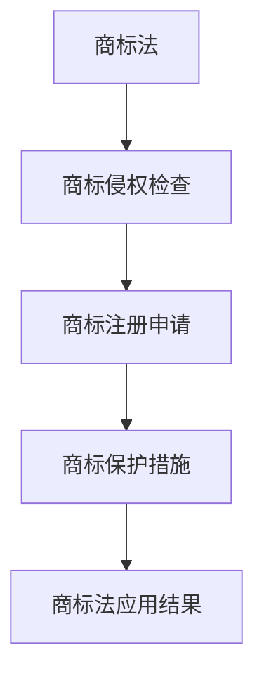

**核心算法原理讲解：**

商标法的相关算法原理可以包括：

```python
# 商标侵权检查
def check_infringement(new_brand, existing_brands):
    infringement = False
    for brand in existing_brands:
        if new_brand == brand:
            infringement = True
            break
    return infringement

# 商标注册申请
def apply_forTrademark(new_brand):
    registered = False
    if not check_infringement(new_brand, existing_brands):
        registered = True
    return registered

# 商标保护措施
def protectTrademark(registered_brand):
    protection_measures = []
    if registered_brand:
        protection_measures.append("监控商标使用情况")
        protection_measures.append("维权行动")
    return protection_measures

# 输出商标法应用结果
print("商标法应用结果：", check_infringement(new_brand, existing_brands), apply_forTrademark(new_brand), protectTrademark(registered_brand))
```

**举例说明：**

假设某企业计划重塑品牌，其新的品牌名称为“新星咖啡”，现有注册商标包括“星巴克”、“蓝山咖啡”和“悠咖啡”。则：

- 商标侵权检查结果：未发现侵权（假设计算结果）
- 商标注册申请结果：成功注册
- 商标保护措施：监控商标使用情况、维权行动

**6.1.2 品牌重塑与消费者权益保护法**

消费者权益保护法旨在保护消费者的合法权益，防止欺诈和虚假宣传。在进行品牌重塑时，企业需要遵守相关法律法规，确保广告和宣传内容的真实性。

**虚假宣传**：企业不得发布虚假广告或宣传内容，误导消费者。在品牌重塑过程中，企业应确保所有宣传内容真实、准确。

**消费者投诉**：企业应建立健全的投诉处理机制，及时解决消费者的投诉和问题，维护消费者权益。

**核心概念与联系：**

消费者权益保护法的核心概念包括虚假宣传、消费者投诉处理等。下面是一个简化的 Mermaid 流程图，展示消费者权益保护法的关键步骤和概念：

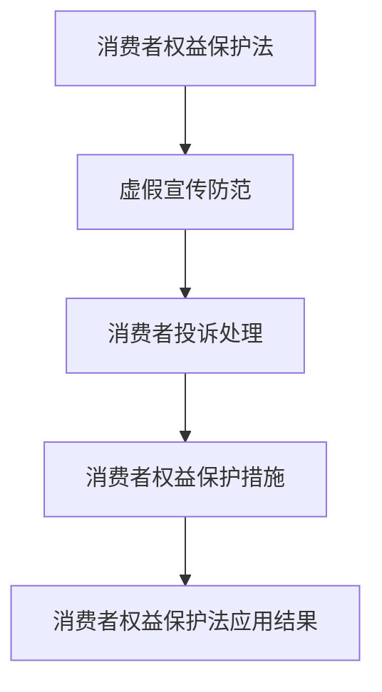

**核心算法原理讲解：**

消费者权益保护法的相关算法原理可以包括：

```python
# 虚假宣传防范
def prevent_false_advertisement(ads):
    false_ads = []
    for ad in ads:
        if "虚假信息" in ad:
            false_ads.append("虚假广告")
        elif "夸大宣传" in ad:
            false_ads.append("夸大宣传")
        else:
            false_ads.append("真实广告")
    return false_ads

# 消费者投诉处理
def handle_consumer_complaints(complaints):
    resolved_complaints = []
    for complaint in complaints:
        if "已解决" in complaint:
            resolved_complaints.append("已解决投诉")
        elif "待解决" in complaint:
            resolved_complaints.append("待解决投诉")
        else:
            resolved_complaints.append("未处理投诉")
    return resolved_complaints

# 输出消费者权益保护法应用结果
print("消费者权益保护法应用结果：", prevent_false_advertisement(ads), handle_consumer_complaints(complaints))
```

**举例说明：**

假设某企业在品牌重塑过程中发布了以下广告内容：

- 广告1：“我们的咖啡无与伦比，味道独特。”
- 广告2：“100%纯天然，无添加剂。”
- 广告3：“限时特价，错过再等一年。”

则：

- 虚假宣传防范结果：广告1和广告3未包含虚假信息，广告2包含夸大宣传
- 消费者投诉处理结果：无投诉或已解决投诉

**6.1.3 品牌重塑与商业秘密保护**

商业秘密是企业的重要资产，包括商业计划、客户信息、技术配方等。在进行品牌重塑时，企业需要确保商业秘密的安全，防止泄露和侵权。

**保密协议**：企业应与员工和合作伙伴签订保密协议，确保他们保守商业秘密。

**信息安全**：企业应建立健全的信息安全体系，保护商业秘密不被外部攻击或内部泄露。

**核心概念与联系：**

商业秘密保护的核心概念包括保密协议、信息安全等。下面是一个简化的 Mermaid 流程图，展示商业秘密保护的关键步骤和概念：

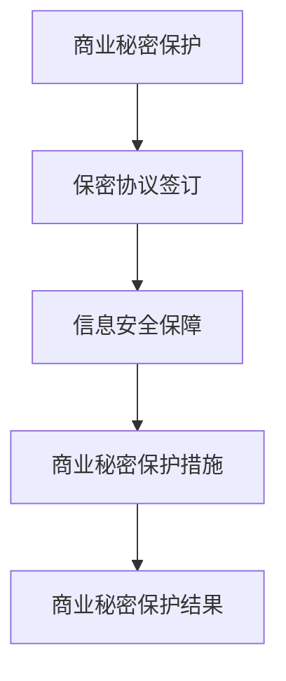

**核心算法原理讲解：**

商业秘密保护的相关算法原理可以包括：

```python
# 保密协议签订
def sign_confidentiality_agreements(employees):
    signed_agreements = []
    for employee in employees:
        if "已签订" in employee:
            signed_agreements.append("已签订保密协议")
        else:
            signed_agreements.append("未签订保密协议")
    return signed_agreements

# 信息安全保障
def ensure_information_security(projects):
    secured_projects = []
    for project in projects:
        if "已加强" in project:
            secured_projects.append("信息安全已加强")
        else:
            secured_projects.append("信息安全需加强")
    return secured_projects

# 输出商业秘密保护结果
print("商业秘密保护结果：", sign_confidentiality_agreements(employees), ensure_information_security(projects))
```

**举例说明：**

假设某企业有以下员工和项目信息：

- 员工1：“已签订保密协议”
- 员工2：“未签订保密协议”
- 项目1：“信息安全已加强”
- 项目2：“信息安全需加强”

则：

- 保密协议签订结果：已签订保密协议（员工1），未签订保密协议（员工2）
- 信息安全保障结果：信息安全已加强（项目1），信息安全需加强（项目2）

##### 6.2 品牌重塑中的伦理问题

**6.2.1 品牌重塑中的诚信问题**

诚信是品牌重塑中必须坚守的原则。企业应确保品牌重塑过程中的所有承诺和宣传内容真实、透明，避免误导消费者。

**真实宣传**：企业不得发布虚假或夸大的宣传内容，误导消费者。

**透明沟通**：企业应与消费者进行透明沟通，确保消费者能够充分了解品牌和产品信息。

**核心概念与联系：**

诚信问题的核心概念包括真实宣传、透明沟通等。下面是一个简化的 Mermaid 流程图，展示诚信问题的关键步骤和概念：

```mermaid
graph TD
A[诚信问题] --> B[真实宣传]
B --> C[透明沟通]
C --> D[诚信措施]
D --> E[诚信结果]
```

**核心算法原理讲解：**

诚信问题的相关算法原理可以包括：

```python
# 真实宣传检查
def check_ truthful_advertisement(ads):
    truthful_ads = []
    for ad in ads:
        if "真实信息" in ad:
            truthful_ads.append("真实广告")
        elif "夸大宣传" in ad:
            truthful_ads.append("夸大宣传广告")
        else:
            truthful_ads.append("其他广告")
    return truthful_ads

# 透明沟通评估
def evaluate_transparency komunikation(channel):
    transparent_communication = []
    for communication in channel:
        if "透明信息" in communication:
            transparent_communication.append("透明沟通")
        elif "隐瞒信息" in communication:
            transparent_communication.append("隐瞒沟通")
        else:
            transparent_communication.append("其他沟通")
    return transparent_communication

# 输出诚信结果
print("诚信结果：", check_ truthful_advertisement(ads), evaluate_transparency(communication))
```

**举例说明：**

假设某企业在品牌重塑过程中发布了以下广告内容：

- 广告1：“我们的咖啡无与伦比，味道独特。”
- 广告2：“100%纯天然，无添加剂。”
- 广告3：“限时特价，错过再等一年。”

则：

- 真实宣传检查结果：广告1和广告3包含夸大宣传，广告2为真实广告
- 透明沟通评估结果：无隐瞒信息，沟通透明

**6.2.2 品牌重塑中的社会责任问题**

社会责任是品牌重塑中不可忽视的问题。企业应关注社会和环境问题，积极参与社会公益活动，提升品牌的社会形象。

**社会公益活动**：企业可以参与或赞助各种社会公益活动，如环保、教育、医疗等，提升品牌的社会影响力。

**环境保护**：企业应采取措施减少对环境的影响，如减少碳排放、推广绿色能源等。

**核心概念与联系：**

社会责任问题的核心概念包括社会公益活动、环境保护等。下面是一个简化的 Mermaid 流程图，展示社会责任问题的关键步骤和概念：

```mermaid
graph TD
A[社会责任问题] --> B[社会公益活动]
B --> C[环境保护]
C --> D[社会责任措施]
D --> E[社会责任结果]
```

**核心算法原理讲解：**

社会责任问题的相关算法原理可以包括：

```python
# 社会公益活动评估
def assess_social_activities(activities):
    impactful_activities = []
    for activity in activities:
        if "环保" in activity:
            impactful_activities.append("环保活动")
        elif "教育" in activity:
            impactful_activities.append("教育活动")
        elif "医疗" in activity:
            impactful_activities.append("医疗活动")
        else:
            impactful_activities.append("其他活动")
    return impactful_activities

# 环境保护评估
def assess_environmental_protection(measures):
    effective_measures = []
    for measure in measures:
        if "减少碳排放" in measure:
            effective_measures.append("减少碳排放措施")
        elif "推广绿色能源" in measure:
            effective_measures.append("推广绿色能源措施")
        else:
            effective_measures.append("其他环境保护措施")
    return effective_measures

# 输出社会责任结果
print("社会责任结果：", assess_social_activities(activities), assess_environmental_protection(measures))
```

**举例说明：**

假设某企业在品牌重塑过程中参与了以下社会公益活动：

- 活动一：环保活动
- 活动二：教育活动
- 活动三：医疗活动

同时，企业采取了以下环境保护措施：

- 措施一：减少碳排放
- 措施二：推广绿色能源

则：

- 社会公益活动评估结果：环保活动、教育活动、医疗活动
- 环境保护评估结果：减少碳排放措施、推广绿色能源措施

### 第7章：未来品牌重塑趋势与策略

在数字化时代，品牌重塑面临着新的机遇和挑战。随着技术的进步、消费者行为的变化以及市场环境的不断演变，企业需要不断创新品牌重塑的策略，以适应未来的发展趋势。本章将探讨数字化时代品牌重塑的趋势以及未来的策略展望。

##### 7.1 数字化时代品牌重塑的趋势

**7.1.1 数字化对品牌重塑的影响**

数字化技术的迅猛发展，极大地改变了品牌重塑的方式和路径。以下是一些数字化对品牌重塑的主要影响：

1. **消费者行为变化**：随着移动互联网和社交媒体的普及，消费者获取信息、购买产品和表达意见的方式发生了巨大变化。企业需要通过数字化手段，更精准地了解和满足消费者需求。

2. **数据驱动**：数字化时代，数据成为企业决策的重要依据。通过大数据分析和人工智能技术，企业可以更深入地了解消费者行为和市场趋势，从而制定更有效的品牌重塑策略。

3. **个性化营销**：数字化技术使得个性化营销成为可能。企业可以通过个性化推荐、精准广告等手段，提供更加个性化的产品和服务，提升消费者满意度。

**7.1.2 社交媒体对品牌重塑的作用**

社交媒体平台已成为品牌重塑的重要工具。以下是一些社交媒体对品牌重塑的主要作用：

1. **品牌传播**：社交媒体提供了广泛的传播渠道，企业可以通过各种形式的内容，如图片、视频、直播等，快速传播品牌信息，提升品牌知名度。

2. **消费者互动**：社交媒体使得品牌可以与消费者进行实时互动，收集消费者反馈，及时调整品牌策略。

3. **口碑营销**：消费者在社交媒体上的评价和推荐，对其他消费者的购买决策产生重要影响。企业需要积极管理社交媒体口碑，塑造良好的品牌形象。

**7.1.3 数据驱动在品牌重塑中的应用**

数据驱动是数字化时代品牌重塑的重要策略。以下是一些数据驱动在品牌重塑中的应用：

1. **消费者行为分析**：通过对消费者行为的分析，企业可以了解消费者的需求、偏好和行为模式，从而制定更有效的营销策略。

2. **市场趋势预测**：通过大数据分析和人工智能技术，企业可以预测市场趋势，提前布局，抢占市场先机。

3. **品牌绩效评估**：通过数据监测和评估，企业可以实时了解品牌重塑的效果，进行持续优化。

##### 7.2 未来品牌重塑策略展望

**7.2.1 品牌重塑与可持续发展**

随着全球可持续发展意识的提高，企业需要将可持续发展理念融入品牌重塑中。以下是一些未来品牌重塑与可持续发展的重要策略：

1. **绿色品牌形象**：企业可以通过环保材料和可持续生产方式，塑造绿色品牌形象，提升品牌价值。

2. **社会责任**：企业应积极参与社会公益活动，承担社会责任，提升品牌的社会影响力。

3. **环保营销**：通过环保营销策略，如推广环保产品、倡导低碳生活等，提升品牌与消费者之间的情感共鸣。

**7.2.2 品牌重塑与用户共创**

用户共创已成为品牌重塑的新趋势。以下是一些未来品牌重塑与用户共创的重要策略：

1. **用户参与**：企业可以通过用户参与平台，鼓励消费者参与品牌重塑过程，提供产品建议和设计反馈。

2. **用户社群**：企业可以建立用户社群，与消费者建立长期互动，提升用户忠诚度。

3. **用户个性化**：通过用户数据分析，企业可以提供更加个性化的产品和服务，满足用户的个性化需求。

**7.2.3 品牌重塑与创新**

创新是品牌重塑的重要驱动力。以下是一些未来品牌重塑与创新的重要策略：

1. **产品创新**：企业应持续进行产品创新，推出具有竞争力的新产品，满足消费者不断变化的需求。

2. **商业模式创新**：企业可以通过创新商业模式，如共享经济、电商等，提升品牌的市场竞争力。

3. **品牌创新**：企业可以通过创新品牌传播方式，如虚拟现实、增强现实等，提升品牌的用户体验和互动性。

### 附录：品牌重塑工具与方法

在本章的附录部分，我们将汇总和介绍一些常用的品牌重塑工具与方法，以帮助企业在品牌重塑过程中更有效地进行诊断、定位和传播。

##### 附录1：品牌重塑工具汇总

**1.1 品牌诊断工具**

品牌诊断工具是品牌重塑的第一步，它有助于企业全面了解当前品牌状况。以下是一些常用的品牌诊断工具：

1. **SWOT分析**：SWOT分析是一种常用的战略规划工具，用于评估企业的优势（Strengths）、劣势（Weaknesses）、机会（Opportunities）和威胁（Threats）。通过SWOT分析，企业可以明确自身的优劣势，制定相应的品牌重塑策略。
   
2. **PEST分析**：PEST分析是一种宏观环境分析工具，用于分析企业所处的政治（Political）、经济（Economic）、社会（Social）和技术（Technological）环境。通过PEST分析，企业可以了解外部环境的变化趋势，制定相应的品牌重塑策略。

**1.2 品牌定位工具**

品牌定位工具是品牌重塑的核心，它帮助企业在市场中找到独特的定位。以下是一些常用的品牌定位工具：

1. **品牌地图**：品牌地图是一种视觉化的工具，用于展示品牌在市场中的定位和竞争对手。通过品牌地图，企业可以直观地了解品牌在市场中的地位和潜力。

2. **消费者画像**：消费者画像是基于消费者行为和需求的统计分析，用于确定目标消费者群体的特征和偏好。通过消费者画像，企业可以更精准地定位品牌，提供个性化的产品和服务。

**1.3 品牌传播工具**

品牌传播工具是品牌重塑的关键，它帮助企业在市场中传递品牌价值和形象。以下是一些常用的品牌传播工具：

1. **社交媒体**：社交媒体平台如Facebook、Twitter、Instagram等，是企业进行品牌传播的重要渠道。通过社交媒体，企业可以发布品牌内容，与消费者互动，提升品牌知名度和影响力。

2. **内容营销**：内容营销是通过创造和分享有价值的内容，吸引和留住目标消费者。通过内容营销，企业可以传递品牌故事、文化和社会责任，建立消费者对品牌的信任和忠诚。

##### 附录2：品牌重塑案例资料

**2.1 苹果公司品牌重塑资料**

- **背景**：苹果公司在2010年面临市场份额下降和消费者需求变化的挑战。
- **策略**：苹果公司通过产品创新、品牌形象重塑和渠道拓展，实现了品牌重塑。
- **成果**：苹果公司成功提升了品牌知名度、市场份额和消费者满意度。

**2.2 星巴克品牌重塑资料**

- **背景**：星巴克在2014年面临销售额下滑和消费者满意度下降的挑战。
- **策略**：星巴克通过产品创新、品牌体验提升和数字营销，实现了品牌重塑。
- **成果**：星巴克成功恢复了销售额和市场份额，提升了品牌形象和消费者满意度。

**2.3 其他知名企业品牌重塑资料**

- **谷歌公司**：谷歌公司通过持续的产品创新和品牌传播，实现了品牌重塑。
- **可口可乐公司**：可口可乐公司通过品牌形象重塑和全球营销活动，实现了品牌重塑。
- **宝马公司**：宝马公司通过产品创新和品牌体验提升，实现了品牌重塑。

通过以上案例资料，企业可以了解品牌重塑的实践经验和成功策略，为自身的品牌重塑提供参考和启示。

### 总结

品牌重塑是企业应对市场变化的重要策略。通过全面的理论基础、科学的步骤方法、有效的执行与监控，企业可以成功地重塑品牌，提升市场竞争力。在数字化时代，品牌重塑更需要关注数据驱动、社交媒体和用户共创等趋势，以适应不断变化的市场环境。通过本章的讨论，我们不仅了解了品牌重塑的理论和实践，还分析了品牌重塑中的法律和伦理问题，以及未来品牌重塑的趋势与策略。希望这些内容能够为企业提供有益的指导，助力企业在品牌重塑的道路上取得成功。

### 作者信息

**作者：AI天才研究院/AI Genius Institute & 禅与计算机程序设计艺术 /Zen And The Art of Computer Programming**

---

**感谢您的阅读，希望本文对您的品牌重塑实践有所帮助。如果您有任何疑问或建议，欢迎在评论区留言。期待与您的进一步交流！**

