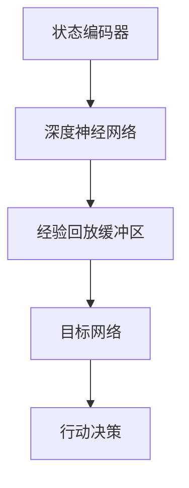
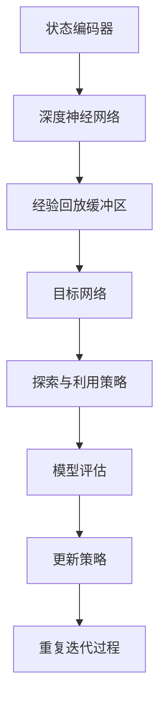

                 

### 第1章：DQN算法概述

#### 1.1 深度强化学习的起源与发展

##### 1.1.1 深度强化学习的背景介绍
深度强化学习（Deep Reinforcement Learning, DRL）是机器学习领域的一个重要分支，结合了深度学习和强化学习的技术。深度学习通过多层神经网络处理复杂的特征，而强化学习通过学习奖励和惩罚信号来指导决策过程。这种结合使得深度强化学习能够解决更加复杂和动态的决策问题。

##### 1.1.2 深度强化学习的发展历程
深度强化学习的发展可以分为几个阶段：
1. **强化学习的基础**：20世纪50年代，马尔可夫决策过程（MDP）和Q-learning算法首次被提出，奠定了强化学习的基础。
2. **深度学习的兴起**：20世纪80年代，神经网络开始受到关注，特别是2006年由Geoffrey Hinton等人提出的深度信念网络（DBN），为深度学习的发展铺平了道路。
3. **深度强化学习的融合**：随着2013年深度卷积神经网络（CNN）在ImageNet挑战赛中的获胜，深度学习和强化学习开始融合，深度强化学习逐渐成为研究热点。

##### 1.1.3 深度强化学习在AI领域的地位
深度强化学习在AI领域的地位日益重要，它不仅能够解决经典的强化学习问题，还能够处理更高维度的状态空间和动作空间，这使得它能够在游戏AI、自动驾驶、机器人控制、金融交易等众多领域得到应用。

#### 1.2 DQN算法的概念与原理

##### 1.2.1 DQN算法的定义
深度Q网络（Deep Q-Network, DQN）是深度强化学习的一种代表算法，由DeepMind在2015年提出。DQN算法的核心思想是利用深度神经网络来近似Q值函数，从而在连续的动作空间中做出决策。

##### 1.2.2 DQN算法的核心原理
DQN算法结合了Q-learning算法和深度神经网络的特点。具体来说，DQN算法包括以下几个关键组成部分：
1. **神经网络**：用来近似Q值函数，输入为状态，输出为动作的Q值。
2. **经验回放**：为了防止数据分布的偏差，DQN使用经验回放机制来存储和随机抽取过去的数据。
3. **目标网络**：DQN中引入目标网络来稳定学习过程，目标网络是主网络的软复制，用于产生目标Q值。

##### 1.2.3 DQN算法的主要组成部分
1. **状态编码器**：将输入的状态编码为向量。
2. **深度神经网络**：接收状态编码器输出的向量，输出每个动作的Q值。
3. **经验回放缓冲区**：存储历史经验，以随机方式抽取数据，防止数据分布偏差。
4. **目标网络**：用来生成目标Q值，与主网络隔一定时间更新。

#### 1.3 DQN算法的优势与局限性

##### 1.3.1 DQN算法的优势
1. **解决连续动作问题**：DQN算法能够处理连续的动作空间，这是传统Q-learning算法所不能及的。
2. **自适应性强**：DQN算法可以自适应不同的环境，通过学习奖励信号来调整策略。
3. **强大的学习能力**：通过深度神经网络，DQN算法能够学习到复杂的状态和动作之间的映射关系。

##### 1.3.2 DQN算法的局限性
1. **计算复杂度高**：DQN算法需要大量的计算资源，尤其是当状态和动作空间较大时。
2. **探索与利用的平衡**：在初期阶段，DQN算法可能需要更多的探索来学习环境，这会降低学习效率。
3. **对环境的依赖性**：DQN算法的性能很大程度上依赖于环境的奖励结构和状态空间。

总的来说，DQN算法作为一种深度强化学习的代表性算法，具有强大的学习能力和适应能力，但在实际应用中仍面临一些挑战。接下来，我们将进一步探讨DQN算法的原理和应用。

### Mermaid 流程图：DQN算法的组成部分



**说明**：此流程图展示了DQN算法的主要组成部分，从状态编码器开始，通过深度神经网络生成Q值，使用经验回放缓冲区来稳定学习过程，目标网络用于生成目标Q值，最终实现行动决策。

#### 1.2 DQN算法的核心原理

DQN算法的核心原理是将深度神经网络与强化学习中的Q学习算法相结合，以处理复杂的环境和动作空间。具体来说，DQN算法由以下几个关键组成部分构成：

1. **Q值函数**：Q值函数是强化学习的核心概念之一，它表示在某一状态下执行某一动作的预期回报。DQN算法使用深度神经网络来近似这个Q值函数，输入为状态，输出为各个动作的Q值。

2. **状态编码器**：状态编码器负责将原始状态数据转换为神经网络可以处理的向量形式。这一步骤对于DQN算法的性能至关重要，因为它决定了神经网络能否有效地学习状态和动作之间的映射关系。

3. **经验回放缓冲区**：经验回放缓冲区用于存储在训练过程中经历的状态、动作、奖励和下一状态的四元组。通过随机抽样历史经验，可以避免策略在训练过程中过度依赖最近的经验，从而减少数据偏差，提高学习稳定性。

4. **深度神经网络**：深度神经网络是DQN算法的核心，它接收状态编码器输出的向量，通过多层神经元的非线性变换，最终输出每个可能动作的Q值。

5. **目标网络**：为了稳定学习过程，DQN算法引入了目标网络。目标网络是主网络的软复制，它用于生成目标Q值。在每一定步数或一定时间后，主网络和目标网络会同步更新，使得目标网络能够逐渐逼近主网络的当前状态，从而减少目标Q值的误差。

下面是DQN算法的基本原理的伪代码：

```python
# 初始化深度神经网络（Q网络）和目标网络
initialize Q_network, target_Q_network

# 初始化经验回放缓冲区
initialize replay_buffer with capacity N

# 选择初始状态 s
s = env.reset()

# 开始训练循环
for episode in range(1, total_episodes):
    done = False
    total_reward = 0

    # 开始一个 episode 的循环
    while not done:
        # 将当前状态输入到 Q 网络中，得到 Q 值
        Q_values = Q_network.predict(s)

        # 选择动作 a，基于 ε-贪婪策略
        if random() < epsilon:
            a = env.random_action()  # 随机选择动作
        else:
            a = env.best_action(Q_values)  # 根据Q值选择最佳动作

        # 执行动作 a，得到下一状态 s'、奖励 r 和是否终止的信息
        s', r, done = env.step(a)

        # 将 (s, a, r, s') 存入经验回放缓冲区
        replay_buffer.append((s, a, r, s'))

        # 从经验回放缓冲区中随机抽取一批样本
        batch = replay_buffer.sample(batch_size)

        # 预测目标 Q 值
        target_Q_values = target_Q_network.predict(s')

        # 更新目标 Q 值
        for s, a, r, s' in batch:
            target_Q_value = r + gamma * max(target_Q_values[s'])

            # 训练主 Q 网络
            Q_network.update(s, a, target_Q_value)

        # 更新状态
        s = s'

        # 计算总奖励
        total_reward += r

    # 更新目标网络
    target_Q_network.update_from(Q_network)

    # 打印 episode 结果
    print(f"Episode: {episode}, Total Reward: {total_reward}")

# 打印最终结果
print(f"Total episodes: {total_episodes}, Average Reward: {total_reward / total_episodes}")
```

**说明**：上述伪代码描述了DQN算法的基本训练流程，包括初始化网络、经验回放、ε-贪婪策略、Q值更新和目标网络更新等步骤。

#### 1.3 DQN算法的优势与局限性

DQN算法作为一种深度强化学习算法，在处理复杂决策问题方面表现出显著优势。然而，任何算法都有其局限性。以下是DQN算法的主要优势与局限性：

##### 1.3.1 DQN算法的优势

1. **处理连续动作**：DQN算法能够处理连续动作空间的问题，这是传统Q-learning算法所不能及的。它通过深度神经网络来近似Q值函数，从而在复杂的连续动作空间中实现有效的决策。

2. **自适应性强**：DQN算法通过学习奖励信号，能够自适应不同的环境和动态变化。这使得它在实际应用中具有很高的灵活性和鲁棒性。

3. **强大的学习能力**：深度神经网络使得DQN算法能够学习到复杂的状态和动作之间的映射关系，从而在训练过程中表现出较高的学习效率。

4. **稳定性**：DQN算法中的经验回放机制和目标网络设计，有助于稳定学习过程，减少训练过程中的波动。

##### 1.3.2 DQN算法的局限性

1. **计算复杂度高**：DQN算法需要大量的计算资源，尤其是当状态和动作空间较大时。深度神经网络的前向传播和反向传播操作非常耗时，这可能导致算法的实时性不高。

2. **探索与利用的平衡**：在训练初期，DQN算法需要更多的探索来学习环境，这会降低学习效率。如何平衡探索与利用，避免陷入局部最优，是一个挑战。

3. **对环境的依赖性**：DQN算法的性能很大程度上依赖于环境的奖励结构和状态空间。如果奖励设计不当，算法可能无法找到最优策略。

4. **训练不稳定**：DQN算法在训练过程中可能会出现训练不稳定的情况，这可能与目标网络更新策略和经验回放机制有关。

总体而言，DQN算法在解决复杂决策问题时具有显著优势，但在实际应用中仍需考虑其局限性，并采取相应的优化策略来提升性能。

### Mermaid 流程图：DQN算法的训练过程

```mermaid
graph TD
A[初始化Q网络和目标网络] --> B[从环境中获取初始状态s]
B --> C[选择动作a]
C --> D[执行动作a，获取奖励r和下一状态s']
D --> E[将(s, a, r, s')存入经验回放缓冲区]
E --> F[从经验回放缓冲区中抽取一批样本]
F --> G[计算目标Q值]
G --> H[更新Q网络]
H --> I[定期更新目标网络]
I --> J[重复迭代过程]
```

**说明**：此流程图展示了DQN算法的训练过程，包括初始化网络、获取状态和动作、执行动作、更新网络等步骤。

### 第2章：深度强化学习基础

在深入探讨DQN算法之前，我们需要了解深度强化学习（Deep Reinforcement Learning, DRL）的基础知识。DRL是强化学习（Reinforcement Learning, RL）与深度学习（Deep Learning, DL）相结合的产物，旨在解决更为复杂和动态的决策问题。本章将介绍神经网络基础、强化学习基础以及深度强化学习框架，为理解DQN算法奠定基础。

#### 2.1 神经网络基础

##### 2.1.1 神经网络的基本结构

神经网络（Neural Network, NN）是模仿人脑结构和功能的一种计算模型，由大量相互连接的神经元组成。神经网络的基本结构包括以下几个部分：

1. **输入层（Input Layer）**：接收外部输入信号，每个神经元代表一个输入特征。

2. **隐藏层（Hidden Layer）**：一个或多个隐藏层，每个神经元将前一层的信息进行处理和变换，通过非线性激活函数引入非线性特性。

3. **输出层（Output Layer）**：产生最终的输出结果，用于分类、回归或其他形式的预测。

神经网络中的每个神经元都可以视为一个简单的计算单元，其计算公式为：

\[ z_j = \sum_{i} w_{ji} x_i + b_j \]

其中，\( z_j \) 是神经元 \( j \) 的输入值，\( w_{ji} \) 是连接权重，\( x_i \) 是输入特征，\( b_j \) 是偏置项。

##### 2.1.2 神经网络的激活函数

激活函数（Activation Function）是神经网络中一个关键组件，它用于引入非线性特性，使得神经网络能够拟合复杂的非线性关系。常见的激活函数包括：

1. ** sigmoid 函数**：
\[ f(x) = \frac{1}{1 + e^{-x}} \]

2. **ReLU函数**（Rectified Linear Unit）：
\[ f(x) = \max(0, x) \]

3. **Tanh函数**：
\[ f(x) = \frac{e^x - e^{-x}}{e^x + e^{-x}} \]

这些激活函数在不同情况下具有不同的优势和适用场景。

##### 2.1.3 神经网络的训练过程

神经网络的训练过程主要包括以下几个步骤：

1. **前向传播（Forward Propagation）**：输入数据通过神经网络，逐层计算每个神经元的输出值。

2. **计算损失（Compute Loss）**：使用目标值与预测值之间的差异来计算损失函数，常见的损失函数包括均方误差（MSE）、交叉熵损失等。

3. **反向传播（Back Propagation）**：根据损失函数计算梯度，通过梯度下降算法更新网络权重和偏置项。

4. **迭代优化（Iterative Optimization）**：重复前向传播和反向传播过程，逐步减少损失函数的值，直到网络收敛到合适的参数。

#### 2.2 强化学习基础

强化学习（Reinforcement Learning, RL）是一种机器学习范式，通过学习奖励信号来优化决策策略。在RL中，智能体（Agent）在一个环境中采取动作（Action），并根据环境的反馈（Reward）来调整其行为。强化学习的主要概念包括：

##### 2.2.1 状态（State）

状态是指智能体在环境中所处的情境，通常用一个状态向量表示。状态可以是离散的，也可以是连续的。

##### 2.2.2 动作（Action）

动作是智能体在某一状态下可以采取的行动，也可以是离散的或连续的。动作的选择通常基于策略（Policy）。

##### 2.2.3 奖励（Reward）

奖励是环境对智能体动作的即时反馈，可以是正奖励（Positive Reward）或负奖励（Negative Reward）。奖励信号指导智能体在后续决策中采取更有利于目标实现的动作。

##### 2.2.4 策略（Policy）

策略是指智能体在给定状态下采取的动作映射关系。策略可以是固定的，也可以是学习的。在强化学习中，智能体的目标是学习最优策略，从而最大化累积奖励。

##### 2.2.5 强化学习的基本算法

强化学习的基本算法包括：

1. **Q-learning**：通过值函数近似策略，在给定状态下选择最优动作。

2. **SARSA**（Q-learning的变体）：在每一步同时更新策略和价值函数。

3. **Policy Gradient**：通过直接优化策略来最大化累积奖励。

#### 2.3 深度强化学习框架

深度强化学习框架是强化学习与深度学习结合的结果，旨在解决复杂环境中的决策问题。深度强化学习框架主要包括以下几个部分：

##### 2.3.1 状态编码器

状态编码器用于将原始状态数据转换为神经网络可以处理的向量形式。状态编码器可以是简单的特征提取器，也可以是复杂的神经网络。

##### 2.3.2 深度神经网络

深度神经网络用于近似Q值函数或策略函数。深度神经网络可以通过多层感知机（MLP）、卷积神经网络（CNN）或循环神经网络（RNN）等架构实现。

##### 2.3.3 经验回放

经验回放用于避免策略在训练过程中过度依赖最近的经验，从而减少数据偏差。经验回放缓冲区可以存储大量的历史经验，并在训练过程中随机抽样。

##### 2.3.4 目标网络

目标网络是主网络的软复制，用于生成目标Q值，从而稳定学习过程。目标网络与主网络隔一定时间同步更新。

##### 2.3.5 探索与利用策略

探索与利用策略是平衡学习过程中探索未知领域和利用已有知识的关键。常见的探索策略包括ε-贪婪策略、UCB算法等。

##### 2.3.6 模型评估

模型评估是验证深度强化学习算法性能的重要步骤。常见的评估指标包括奖励累积值、策略稳定性等。

通过本章的介绍，我们对深度强化学习及其基础概念有了初步了解。在下一章中，我们将深入探讨DQN算法的原理和组成部分，进一步理解其在实际应用中的优势与挑战。

### 2.1 神经网络基础

神经网络（Neural Networks, NNs）是模仿人脑结构和功能的一种计算模型，由大量相互连接的神经元组成。神经网络的核心在于其层次结构和神经元之间的连接方式，通过这些结构实现复杂的数据处理和模式识别。

##### 2.1.1 神经网络的基本结构

神经网络的基本结构包括输入层、隐藏层和输出层。

1. **输入层（Input Layer）**：接收外部输入信号，每个神经元代表一个输入特征。例如，在图像识别任务中，每个神经元可能代表图像中的一个像素值。

2. **隐藏层（Hidden Layer）**：一个或多个隐藏层，每个隐藏层中的神经元将前一层的信息进行处理和变换，通过非线性激活函数引入非线性特性。隐藏层负责提取和转换输入数据，使其能够更好地拟合目标函数。

3. **输出层（Output Layer）**：产生最终的输出结果，用于分类、回归或其他形式的预测。输出层中的每个神经元通常对应一个预测类别或连续值。

##### 2.1.2 神经网络的激活函数

激活函数（Activation Function）是神经网络中一个关键组件，它用于引入非线性特性，使得神经网络能够拟合复杂的非线性关系。常见的激活函数包括：

1. **Sigmoid函数**：
\[ f(x) = \frac{1}{1 + e^{-x}} \]
   - 输出范围为 \( (0, 1) \)，常用于二分类问题。
   - 局限性：梯度消失问题，特别是在输出接近0或1时。

2. **ReLU函数**（Rectified Linear Unit）：
\[ f(x) = \max(0, x) \]
   - 在输入为正时保持不变，输入为负时变为零。
   - 优点：易于训练，计算效率高。
   - 局限性：死神经元问题，部分神经元可能永远不会被激活。

3. **Tanh函数**：
\[ f(x) = \frac{e^x - e^{-x}}{e^x + e^{-x}} \]
   - 输出范围为 \( (-1, 1) \)，类似于sigmoid函数，但中心化。
   - 优点：梯度变化更均匀。
   - 局限性：计算复杂度相对较高。

##### 2.1.3 神经网络的训练过程

神经网络的训练过程主要包括以下几个步骤：

1. **前向传播（Forward Propagation）**：输入数据通过神经网络，逐层计算每个神经元的输出值，直到输出层。在这个过程中，前一层输出的值被作为下一层的输入。

2. **计算损失（Compute Loss）**：使用目标值与预测值之间的差异来计算损失函数。常见的损失函数包括均方误差（MSE）、交叉熵损失等。

3. **反向传播（Back Propagation）**：根据损失函数计算梯度，通过梯度下降算法更新网络权重和偏置项。反向传播是神经网络训练的核心，它通过反向计算误差的梯度，从而调整网络的参数。

4. **迭代优化（Iterative Optimization）**：重复前向传播和反向传播过程，逐步减少损失函数的值，直到网络收敛到合适的参数。这个过程称为迭代优化或训练循环。

##### 2.1.4 神经网络的优势与局限性

神经网络的优势在于其强大的非线性拟合能力，可以处理复杂的数据和任务。然而，神经网络也具有一些局限性：

1. **计算复杂度高**：特别是在处理大量数据和多层神经网络时，计算资源需求较高。

2. **对数据的要求较高**：神经网络需要大量的标注数据进行训练，以便学习到有效的特征。

3. **过拟合问题**：当网络过于复杂时，可能会导致过拟合，即模型在训练数据上表现良好，但在未见过的数据上表现不佳。

4. **解释性不足**：神经网络模型往往被视为“黑盒子”，难以解释其中的决策过程。

通过本章对神经网络基础的介绍，我们对神经网络的基本结构和训练过程有了更深入的理解，这为后续章节中探讨DQN算法的原理和应用奠定了基础。

#### 2.2 强化学习基础

强化学习（Reinforcement Learning, RL）是一种通过不断交互和反馈来学习决策策略的机器学习范式。在强化学习中，智能体（Agent）在特定环境中采取行动，并根据环境提供的奖励信号调整其行为。强化学习的基础概念包括状态（State）、动作（Action）、奖励（Reward）和策略（Policy）。

##### 2.2.1 状态（State）

状态（State）是描述智能体所处环境的特征集合，通常用一个状态向量表示。状态可以是离散的，也可以是连续的。例如，在游戏AI中，状态可能包括游戏板上的棋子位置、分数等；在自动驾驶中，状态可能包括车辆的位置、速度、周围环境等信息。

##### 2.2.2 动作（Action）

动作（Action）是智能体在某一状态下可以采取的行动。动作也可以是离散的或连续的。例如，在游戏AI中，动作可能是移动、攻击、防御等；在自动驾驶中，动作可能是加速、减速、转向等。

##### 2.2.3 奖励（Reward）

奖励（Reward）是环境对智能体动作的即时反馈，可以是正奖励（Positive Reward）或负奖励（Negative Reward）。奖励信号指导智能体在后续决策中采取更有利于目标实现的动作。例如，在游戏AI中，正确走棋或击败对手可能获得正奖励，而走错棋或被击败可能获得负奖励；在自动驾驶中，安全行驶可能获得正奖励，而发生事故可能获得负奖励。

##### 2.2.4 策略（Policy）

策略（Policy）是指智能体在给定状态下采取的动作映射关系。策略可以是固定的，也可以是学习的。在强化学习中，智能体的目标是学习最优策略，从而最大化累积奖励。策略可以表示为概率分布，即智能体在某一状态下选择某一动作的概率。例如，在游戏中，策略可能决定在某一状态下优先攻击敌人还是保存资源。

##### 2.2.5 强化学习的基本算法

强化学习的基本算法包括：

1. **Q-learning**：Q-learning是一种基于值函数的算法，通过迭代更新Q值来学习最优策略。Q值表示在某一状态下采取某一动作的预期回报。Q-learning的主要步骤包括：
   - 初始化Q值表
   - 选择动作
   - 执行动作并获取奖励
   - 更新Q值表

2. **SARSA**（Q-learning的变体）：SARSA（State-Action-Reward-State-Action）是在每一步同时更新策略和价值函数的算法。SARSA的主要步骤包括：
   - 初始化策略和价值函数
   - 选择动作
   - 执行动作并获取奖励
   - 更新策略和价值函数

3. **Policy Gradient**：Policy Gradient算法通过直接优化策略来最大化累积奖励。Policy Gradient的主要步骤包括：
   - 初始化策略和网络参数
   - 进行一次完整的环境交互，记录状态、动作和奖励
   - 使用梯度的反向传播更新策略参数

##### 2.2.6 强化学习的挑战

强化学习在实际应用中面临一些挑战：

1. **探索与利用的平衡**：在训练过程中，智能体需要在探索（Exploration）和利用（Utilization）之间找到平衡。探索是为了发现新的可能性和最佳策略，利用则是为了最大化已知的累积奖励。ε-贪婪策略是一种常用的平衡方法。

2. **长期奖励与短期奖励**：在许多应用场景中，短期奖励和长期奖励之间存在冲突。智能体需要学会延迟满足，以实现长期目标。

3. **环境的不确定性和动态性**：实际环境往往具有不确定性和动态性，智能体需要具备鲁棒性和适应性。

4. **计算复杂度**：强化学习算法通常需要大量的计算资源和时间来收敛，特别是在状态和动作空间较大时。

通过本章对强化学习基础概念的介绍，我们了解了强化学习的基本原理和算法。这些基础概念为后续章节中深入探讨DQN算法的原理和应用奠定了重要基础。

### 2.3 深度强化学习框架

深度强化学习（Deep Reinforcement Learning, DRL）是强化学习（Reinforcement Learning, RL）与深度学习（Deep Learning, DL）的结合体，旨在通过深度神经网络处理复杂的状态空间和动作空间。DRL框架不仅继承了RL的基本思想，如状态、动作、奖励和策略等，还利用深度神经网络来解决复杂的问题。

##### 2.3.1 状态编码器

状态编码器（State Encoder）是DRL框架中的一个关键组件，用于将原始状态数据转换为神经网络可以处理的向量形式。状态编码器的目标是提取状态中的关键信息，以便深度神经网络能够有效地学习状态和动作之间的映射关系。

1. **特征提取**：状态编码器通常包含卷积神经网络（CNN）或循环神经网络（RNN）等深度学习模型，用于提取状态的特征表示。例如，在图像识别任务中，状态编码器可以通过CNN提取图像的边缘、纹理等特征。

2. **状态转换**：状态编码器不仅需要提取特征，还需要将这些特征转换为适当的向量形式。这通常通过一个全连接层（Fully Connected Layer）实现，将特征向量映射到一个固定大小的嵌入空间。

##### 2.3.2 深度神经网络

深度神经网络（Deep Neural Network, DNN）是DRL框架的核心，用于近似Q值函数或策略函数。深度神经网络可以通过多层感知机（MLP）、卷积神经网络（CNN）或循环神经网络（RNN）等架构实现。

1. **Q值函数近似**：在Q-learning中，Q值函数表示在某一状态下采取某一动作的预期回报。在DRL中，深度神经网络用于近似这个Q值函数，从而在复杂的动作空间中做出有效的决策。这种方法称为深度Q网络（Deep Q-Network, DQN）。

2. **策略函数近似**：除了Q值函数，策略函数也是DRL中的一个重要概念。策略函数定义了在给定状态下应该采取的最佳动作。深度强化学习中的策略函数通常通过策略梯度方法（Policy Gradient Methods）来实现。

##### 2.3.3 经验回放

经验回放（Experience Replay）是DRL框架中的一个关键技巧，用于避免策略在训练过程中过度依赖最近的经验，从而减少数据偏差。经验回放缓冲区（Experience Replay Buffer）可以存储大量的历史经验，包括状态、动作、奖励和下一状态。

1. **随机抽样**：在训练过程中，从经验回放缓冲区中随机抽样一批经验样本，以平衡不同经验样本的权重。

2. **数据多样性**：经验回放通过随机抽样增加了数据的多样性，有助于智能体在学习过程中避免局部最优，提高学习的鲁棒性。

##### 2.3.4 目标网络

目标网络（Target Network）是DRL框架中用于稳定学习过程的一个组件。目标网络是主网络的软复制，用于生成目标Q值。通过定期更新目标网络，可以减少Q值估计的误差，从而提高学习的稳定性。

1. **软更新**：目标网络与主网络之间有一定的滞后，即目标网络不会立即更新，而是在一定时间间隔或一定步数后更新，以减少更新过程中的波动。

2. **误差减少**：通过定期更新目标网络，可以使得目标Q值逐渐逼近主网络的当前Q值，从而减少误差，提高学习稳定性。

##### 2.3.5 探索与利用策略

探索与利用（Exploration vs. Exploitation）是DRL中的一个重要问题。智能体需要在探索未知的领域和利用已知的经验之间找到平衡。

1. **ε-贪婪策略**：ε-贪婪策略是一种常用的探索策略，其中智能体以概率ε进行随机探索，以发现新的可能性和最佳策略。剩余的概率（1-ε）用于利用已知的最佳策略。

2. **指数衰减**：ε值通常会随着时间的推移逐渐减小，以平衡探索与利用。这种方法称为指数衰减ε策略，有助于在训练初期进行充分的探索，而在训练后期更倾向于利用已知的最佳策略。

##### 2.3.6 模型评估

模型评估（Model Evaluation）是验证DRL算法性能的重要步骤。常见的评估指标包括：

1. **累积奖励**：累积奖励是指智能体在一段时间内获得的平均奖励，用于衡量智能体的长期表现。

2. **策略稳定性**：策略稳定性是指智能体在多次重复执行相同任务时，其策略的波动情况，用于衡量智能体的鲁棒性。

3. **收敛速度**：收敛速度是指智能体从初始状态到稳定策略所需的时间，用于衡量算法的学习效率。

通过本章对深度强化学习框架的介绍，我们对DRL的基本组成部分和工作原理有了更深入的理解，这为后续章节中深入探讨DQN算法的原理和应用奠定了重要基础。

### Mermaid 流程图：深度强化学习框架



**说明**：此流程图展示了深度强化学习框架的基本组成部分和工作流程，包括状态编码器、深度神经网络、经验回放缓冲区、目标网络、探索与利用策略、模型评估和策略更新等步骤。

### 第3章：DQN算法原理详解

在了解了深度强化学习和神经网络的基础之后，我们将深入探讨DQN算法的原理及其实现细节。DQN算法是深度强化学习领域的一个重要算法，它通过深度神经网络来近似Q值函数，从而在复杂的连续动作空间中实现有效的决策。本章将详细解释DQN算法的组成、原理以及优化策略。

#### 3.1 DQN算法的组成

DQN算法由以下几个关键组成部分构成：

1. **状态编码器（State Encoder）**：状态编码器用于将原始状态数据转换为神经网络可以处理的向量形式。状态编码器通常是深度神经网络的一部分，它可以提取状态的特征表示。

2. **深度神经网络（Deep Neural Network, DNN）**：深度神经网络是DQN算法的核心，用于近似Q值函数。DNN接收状态编码器输出的向量，并输出每个可能动作的Q值。

3. **经验回放缓冲区（Experience Replay Buffer）**：经验回放缓冲区用于存储在训练过程中经历的状态、动作、奖励和下一状态的四元组。通过经验回放，DQN算法可以避免策略在训练过程中过度依赖最近的经验，从而减少数据偏差。

4. **目标网络（Target Network）**：目标网络是DQN算法中用于生成目标Q值的组件。目标网络是主网络的软复制，它用于稳定学习过程，减少Q值估计的误差。

5. **探索与利用策略**：探索与利用策略是DQN算法中用于平衡探索和利用的关键组件。常用的探索策略包括ε-贪婪策略，它通过随机探索未知的领域来发现最佳策略。

6. **模型评估**：模型评估用于验证DQN算法的性能。通过累积奖励和策略稳定性等指标，可以评估DQN算法在不同任务中的表现。

#### 3.2 DQN算法原理详解

DQN算法的核心思想是通过深度神经网络来近似Q值函数，从而在连续的动作空间中做出有效的决策。以下是DQN算法的基本原理：

1. **Q值函数**：Q值函数表示在某一状态下采取某一动作的预期回报。Q值函数的形式可以表示为：

\[ Q(s, a) = \sum_{j} \pi(a|s) \cdot Q^*(s', j) \]

其中，\( s \) 是当前状态，\( a \) 是当前动作，\( s' \) 是下一状态，\( Q^*(s', j) \) 是在状态 \( s' \) 下采取动作 \( j \) 的最优Q值，\( \pi(a|s) \) 是策略，表示在状态 \( s \) 下采取动作 \( a \) 的概率。

2. **状态编码器**：状态编码器将原始状态数据转换为神经网络可以处理的向量形式。状态编码器通常使用卷积神经网络（CNN）或循环神经网络（RNN）等深度学习模型，用于提取状态的特征表示。

3. **深度神经网络**：深度神经网络接收状态编码器输出的向量，并输出每个可能动作的Q值。DNN的输出形式可以表示为：

\[ Q(s, a) = f_D(\phi(s)) \]

其中，\( f_D \) 是深度神经网络，\( \phi(s) \) 是状态编码器输出的向量。

4. **经验回放缓冲区**：经验回放缓冲区用于存储在训练过程中经历的状态、动作、奖励和下一状态的四元组。经验回放缓冲区可以避免策略在训练过程中过度依赖最近的经验，从而减少数据偏差。

5. **目标网络**：目标网络是主网络的软复制，用于生成目标Q值。目标网络与主网络隔一定时间同步更新，以减少Q值估计的误差。

6. **探索与利用策略**：探索与利用策略是DQN算法中用于平衡探索和利用的关键组件。常用的探索策略包括ε-贪婪策略，它通过随机探索未知的领域来发现最佳策略。

7. **模型评估**：模型评估用于验证DQN算法的性能。通过累积奖励和策略稳定性等指标，可以评估DQN算法在不同任务中的表现。

#### 3.3 DQN算法的优化策略

为了提高DQN算法的性能，研究人员提出了一系列优化策略。以下是一些常用的优化策略：

1. **双DQN策略**：双DQN策略通过使用两个独立的DQN模型来分别进行预测和目标Q值的计算，从而减少Q值估计的误差。双DQN策略的基本原理如下：

\[ Q_{pred}(s, a) = f_D(\phi(s)) \]
\[ Q_{target}(s', a') = \max_{a'} f_D'(\phi(s')) \]

其中，\( f_D \) 和 \( f_D' \) 分别是两个独立的DQN模型。

2. **集成策略**：集成策略通过将多个DQN模型的预测结果进行集成，从而减少预测误差。集成策略的基本原理如下：

\[ Q_{ensemble}(s, a) = \frac{1}{K} \sum_{k=1}^{K} Q_{k}(s, a) \]

其中，\( Q_{k}(s, a) \) 是第 \( k \) 个DQN模型的预测结果。

3. **目标网络更新策略**：目标网络更新策略用于减少Q值估计的误差。目标网络的更新频率通常设置为每若干步或每若干次更新主网络。以下是一个常见的目标网络更新策略：

\[ target\_Q\_network = copy(main\_Q\_network) \]
\[ if step\_number \mod target\_update\_frequency == 0: \]
\[ \]  \[ target\_Q\_network.load\_weights(from\_main\_Q\_network) \]

4. **探索与利用平衡策略**：探索与利用平衡策略用于在训练过程中平衡探索和利用。常用的探索策略包括ε-贪婪策略，其中ε值通常会随着时间的推移逐渐减小。以下是一个常见的ε-贪婪策略：

\[ if random() < epsilon: \]
\[ \]  \[ action = random\_action() \]
\[ else: \]
\[ \]  \[ action = best\_action(Q\_values) \]

5. **批量经验回放**：批量经验回放通过批量处理经验数据，从而提高训练效率。批量经验回放的基本原理如下：

\[ for each \ batch \ of \ experiences \ in \ replay\_buffer: \]
\[ \]  \[ update\_Q\_network\_for \ batch \]

通过这些优化策略，DQN算法的性能可以得到显著提升。在实际应用中，可以根据具体问题和资源条件选择合适的优化策略。

### 3.1 DQN算法的组成

DQN算法由以下几个关键组成部分构成，这些组成部分共同作用，使DQN能够在复杂的决策环境中实现高效学习。

##### 3.1.1 状态编码器

状态编码器是DQN算法的输入处理模块，其主要任务是接收原始状态数据并将其转换为神经网络可以处理的向量形式。状态编码器通常采用卷积神经网络（CNN）或循环神经网络（RNN）等深度学习模型，以提取状态的特征表示。

1. **CNN在状态编码器中的应用**：
   - **特征提取**：CNN通过卷积层和池化层提取状态数据的低级和高级特征。
   - **特征融合**：通过多层卷积和池化操作，不同层次的特征被融合，形成对状态的整体理解。

2. **RNN在状态编码器中的应用**：
   - **时间序列建模**：RNN如LSTM和GRU能够处理时间序列数据，捕捉状态之间的时间依赖关系。
   - **状态序列编码**：将连续的状态序列编码为固定大小的向量，便于后续的神经网络处理。

##### 3.1.2 深度神经网络

深度神经网络（DNN）是DQN算法的核心，用于近似Q值函数。DNN接收状态编码器输出的向量，并通过一系列的线性变换和非线性激活函数，最终输出每个动作的Q值。

1. **网络结构**：
   - **输入层**：接收状态编码器输出的特征向量。
   - **隐藏层**：通过多层全连接层进行非线性变换，增加网络的表示能力。
   - **输出层**：每个神经元对应一个动作，输出该动作的Q值。

2. **优化策略**：
   - **ReLU激活函数**：用于隐藏层，引入非线性特性，提高网络的学习能力。
   - **Adam优化器**：用于更新网络权重，具有较高的收敛速度和稳定性。

##### 3.1.3 经验回放缓冲区

经验回放缓冲区是DQN算法的重要组成部分，用于存储在训练过程中经历的状态、动作、奖励和下一状态的四元组。经验回放缓冲区的目的是避免策略在训练过程中过度依赖最近的经验，从而减少数据偏差。

1. **缓冲区设计**：
   - **循环缓冲区**：采用循环缓冲区来存储经验，当缓冲区满时，新经验会覆盖最早的经验。
   - **固定大小缓冲区**：缓冲区通常设定一个固定大小，以平衡存储空间和训练效率。

2. **随机抽样**：在训练过程中，从缓冲区中随机抽样经验样本，以平衡不同经验样本的权重，减少偏差。

##### 3.1.4 目标网络

目标网络（Target Network）是DQN算法中的另一个关键组件，用于生成目标Q值。目标网络是主网络的软复制，它通过定期更新与主网络同步，以减少Q值估计的误差。

1. **目标网络的作用**：
   - **稳定学习过程**：通过使用目标网络生成目标Q值，可以减少Q值估计的方差，从而稳定学习过程。
   - **减少计算复杂度**：目标网络只需定期更新，减少了频繁更新主网络的计算需求。

2. **更新策略**：
   - **固定时间更新**：目标网络与主网络每隔固定时间步数同步一次。
   - **概率更新**：目标网络的更新也可以基于概率，根据一定的概率选择是否更新。

##### 3.1.5 探索与利用策略

探索与利用策略是DQN算法中用于平衡学习过程中的探索和利用的关键组件。探索策略帮助智能体发现新的可能性和最佳策略，而利用策略则帮助智能体利用已知的最佳策略。

1. **ε-贪婪策略**：
   - **基本思想**：智能体以概率ε进行随机探索，以发现新的可能性和最佳策略。
   - **ε值衰减**：ε值通常会随着时间的推移逐渐减小，以平衡探索和利用。

2. **其他探索策略**：
   - **ε-greedy with decay**：一种常见的ε-贪婪策略，其中ε值随训练进度按固定或指数衰减。
   - **softmax策略**：通过softmax函数根据Q值分布来选择动作，增加探索的多样性。

通过上述组成部分，DQN算法能够有效地在复杂的决策环境中学习最优策略。接下来，我们将进一步探讨DQN算法的原理和实现细节，包括Q-learning与DQN算法的对比以及DQN算法的优化策略。

### 3.2 Q-learning与DQN算法对比

Q-learning和DQN算法都是强化学习中的重要算法，但它们在处理复杂任务时存在显著差异。以下是Q-learning与DQN算法的对比：

##### 3.2.1 基本原理

**Q-learning算法**：
- Q-learning是一种值函数算法，它通过迭代更新Q值来学习最优策略。Q值表示在某一状态下采取某一动作的预期回报。
- Q-learning算法的核心公式为：
\[ Q(s, a) = r + \gamma \max_{a'} Q(s', a') \]
- 其中，\( r \) 是即时奖励，\( \gamma \) 是折扣因子，\( s \) 是当前状态，\( a \) 是当前动作，\( s' \) 是下一状态，\( a' \) 是下一动作。

**DQN算法**：
- DQN算法是Q-learning算法的扩展，它通过深度神经网络（DNN）来近似Q值函数，从而在复杂的连续动作空间中实现有效的决策。
- DQN算法的核心公式为：
\[ Q(s, a) = f_D(\phi(s)) \]
- 其中，\( f_D \) 是深度神经网络，\( \phi(s) \) 是状态编码器输出的向量。

##### 3.2.2 状态和动作空间

**Q-learning算法**：
- Q-learning算法适用于离散的状态和动作空间。在这种情况下，状态和动作的数量是有限的，可以表示为矩阵形式。
- 状态和动作空间的大小直接影响了Q-learning算法的计算复杂度。

**DQN算法**：
- DQN算法能够处理连续的状态和动作空间。通过使用深度神经网络，DQN可以在复杂的连续空间中学习状态和动作之间的映射关系。
- 处理连续动作空间使得DQN在自动驾驶、游戏AI等领域具有广泛的应用潜力。

##### 3.2.3 探索与利用

**Q-learning算法**：
- Q-learning算法使用ε-贪婪策略来平衡探索和利用。在训练初期，智能体会以较大的ε值进行随机探索，以发现新的可能性和最佳策略。随着训练的进行，ε值逐渐减小，智能体逐渐利用已知的最佳策略。
- ε-贪婪策略使得Q-learning算法在探索和利用之间找到了良好的平衡。

**DQN算法**：
- DQN算法同样使用ε-贪婪策略进行探索和利用。然而，由于状态和动作空间较大，DQN的探索策略需要更加精细的设计，以确保智能体能够在复杂环境中有效学习。
- DQN的探索策略可以结合其他方法，如经验回放和目标网络，以提高学习效率和稳定性。

##### 3.2.4 学习效率和稳定性

**Q-learning算法**：
- Q-learning算法在离散状态和动作空间中表现出良好的学习效率。然而，在处理连续状态和动作空间时，Q-learning算法的计算复杂度显著增加，可能导致学习效率降低。
- Q-learning算法的稳定性取决于ε值的选择，ε值过大可能导致过度探索，ε值过小可能导致过早利用。

**DQN算法**：
- DQN算法通过使用深度神经网络，能够在连续状态和动作空间中有效学习。深度神经网络可以提取复杂的特征，提高学习效率。
- DQN算法中的经验回放和目标网络设计有助于提高学习的稳定性，减少波动。

总的来说，Q-learning和DQN算法在基本原理、适用状态和动作空间、探索与利用策略以及学习效率和稳定性方面存在显著差异。Q-learning算法适用于离散的状态和动作空间，而DQN算法能够在连续状态和动作空间中实现高效学习。在具体应用中，可以根据任务需求和环境特性选择合适的算法。

### 3.3 DQN算法的优化策略

DQN算法在处理复杂决策问题时表现出色，但它的性能受到多个因素的影响。为了进一步提高DQN算法的学习效率、稳定性和泛化能力，研究者们提出了一系列优化策略。以下是一些常见的DQN优化策略及其工作原理：

#### 3.3.1 双DQN策略

双DQN策略通过使用两个独立的DQN模型来分别进行预测和目标Q值的计算，从而减少Q值估计的误差。具体步骤如下：

1. **主DQN模型（Main DQN）**：用于在线学习Q值函数。
2. **目标DQN模型（Target DQN）**：用于生成目标Q值，与主DQN模型同步更新。

双DQN策略的核心思想是利用目标DQN模型提供稳定的Q值估计，从而减少主DQN模型在训练过程中的波动。这种方法通过软更新（Target Network Update）实现，即在固定时间间隔或固定步数后，将主DQN模型的权重复制到目标DQN模型中。

伪代码如下：

```python
# 初始化主DQN和目标DQN模型
initialize main_DQN, target_DQN

# 初始化经验回放缓冲区
initialize replay_buffer

# 训练循环
for episode in range(total_episodes):
    state = env.reset()
    done = False
    total_reward = 0
    
    while not done:
        # ε-贪婪策略选择动作
        if random() < epsilon:
            action = env.random_action()
        else:
            action = main_DQN.best_action(state)
        
        # 执行动作，获取下一状态和奖励
        next_state, reward, done = env.step(action)
        
        # 存储经验到回放缓冲区
        replay_buffer.append((state, action, reward, next_state, done))
        
        # 从回放缓冲区中抽取经验样本
        batch = replay_buffer.sample(batch_size)
        
        # 计算目标Q值
        target_Q_values = target_DQN.predict(next_state)
        target_Q_value = reward + gamma * np.max(target_Q_values)
        
        # 更新主DQN模型
        main_DQN.update(state, action, target_Q_value, batch)
        
        # 更新状态
        state = next_state
        
        # 计算总奖励
        total_reward += reward
        
    # 更新目标DQN模型
    target_DQN.update_from(main_DQN)

    # 打印episode结果
    print(f"Episode: {episode}, Total Reward: {total_reward}")
```

#### 3.3.2 集成策略

集成策略通过将多个DQN模型的预测结果进行集成，从而减少预测误差。集成策略的核心思想是利用多个模型的优势，提高整体预测的准确性和鲁棒性。

1. **多个DQN模型**：训练多个DQN模型，每个模型在相同的经验上进行训练，但使用不同的初始化权重或网络结构。
2. **集成预测**：在测试阶段，将多个DQN模型的预测结果进行平均或加权平均，得到最终的预测结果。

伪代码如下：

```python
# 初始化多个DQN模型
dqn_models = [DQN() for _ in range(num_models)]

# 训练DQN模型
for episode in range(total_episodes):
    state = env.reset()
    done = False
    total_reward = 0
    
    while not done:
        # ε-贪婪策略选择动作
        action = select_action(state, dqn_models)
        
        # 执行动作，获取下一状态和奖励
        next_state, reward, done = env.step(action)
        
        # 存储经验到回放缓冲区
        replay_buffer.append((state, action, reward, next_state, done))
        
        # 更新DQN模型
        for model in dqn_models:
            model.update(state, action, reward, next_state, done)
        
        # 更新状态
        state = next_state
        
        # 计算总奖励
        total_reward += reward
        
    # 集成预测
    final_action = average_predictions(dqn_models, state)

    # 打印episode结果
    print(f"Episode: {episode}, Total Reward: {total_reward}")
```

#### 3.3.3 目标网络的更新策略

目标网络更新策略是DQN算法中的一个关键优化策略，它通过定期更新目标网络来减少Q值估计的误差。目标网络是一个与主网络结构相同但参数独立的网络，它用于生成目标Q值。

1. **软更新**：目标网络与主网络之间的更新不是立即同步的，而是通过软更新机制实现的。即在固定时间间隔或固定步数后，将主网络的权重复制到目标网络中。
2. **固定时间更新**：目标网络的更新周期可以是固定的，如每100步更新一次。
3. **概率更新**：目标网络的更新也可以基于概率，根据一定的概率选择是否更新。

伪代码如下：

```python
# 初始化主DQN和目标DQN模型
initialize main_DQN, target_DQN

# 初始化经验回放缓冲区
initialize replay_buffer

# 更新策略
def update_target_network(main_DQN, target_DQN, update_frequency):
    if step_number % update_frequency == 0:
        target_DQN.load_weights(from_main_DQN)

# 训练循环
for episode in range(total_episodes):
    state = env.reset()
    done = False
    total_reward = 0
    
    while not done:
        # ε-贪婪策略选择动作
        if random() < epsilon:
            action = env.random_action()
        else:
            action = main_DQN.best_action(state)
        
        # 执行动作，获取下一状态和奖励
        next_state, reward, done = env.step(action)
        
        # 存储经验到回放缓冲区
        replay_buffer.append((state, action, reward, next_state, done))
        
        # 从回放缓冲区中抽取经验样本
        batch = replay_buffer.sample(batch_size)
        
        # 计算目标Q值
        target_Q_values = target_DQN.predict(next_state)
        target_Q_value = reward + gamma * np.max(target_Q_values)
        
        # 更新主DQN模型
        main_DQN.update(state, action, target_Q_value, batch)
        
        # 更新状态
        state = next_state
        
        # 计算总奖励
        total_reward += reward
        
    # 更新目标DQN模型
    update_target_network(main_DQN, target_DQN, update_frequency)

    # 打印episode结果
    print(f"Episode: {episode}, Total Reward: {total_reward}")
```

通过上述优化策略，DQN算法在处理复杂决策问题时表现出更高的学习效率和稳定性。这些策略不仅提高了算法的性能，还为实际应用中的算法调优提供了更多的可能性。接下来，我们将探讨DQN算法在金融行业中的应用。

### 3.4 DQN算法在金融行业中的应用

DQN算法在金融行业中展现出了强大的应用潜力，特别是在量化交易和金融风险管理领域。通过深度神经网络的学习能力，DQN能够处理复杂的市场数据和动态环境，从而实现高效决策。以下将详细探讨DQN算法在金融行业中的应用，以及其在金融市场预测中的挑战和解决方案。

#### 3.4.1 量化交易与DQN算法

量化交易（Quantitative Trading）是利用数学模型和计算机算法进行交易决策的一种方法。DQN算法在量化交易中的应用主要体现在以下几个方面：

1. **交易信号生成**：DQN算法可以学习市场数据中的潜在模式，从而生成交易信号。通过训练，DQN能够识别出价格走势、交易量等市场指标的变化趋势，并据此生成买入或卖出的交易信号。

2. **策略优化**：DQN算法可以用于优化量化交易策略。在传统的量化交易中，交易策略通常是基于历史数据和统计分析得到的。而DQN算法可以通过不断学习市场数据，调整交易策略，从而提高交易绩效。

3. **风险控制**：DQN算法可以帮助量化交易策略实现风险控制。通过学习市场波动和交易量等指标，DQN算法可以预测市场的潜在风险，从而调整交易策略，降低投资风险。

#### 3.4.2 DQN算法在金融风险管理中的应用

金融风险管理是指通过管理风险来保护金融机构的资产和利益。DQN算法在金融风险管理中的应用主要包括以下几个方面：

1. **风险识别**：DQN算法可以识别潜在的市场风险。通过对历史市场数据的分析，DQN算法可以识别出市场中的异常波动和潜在风险，从而提前预警。

2. **风险度量**：DQN算法可以度量金融产品的风险水平。通过学习金融产品的历史表现和市场环境，DQN算法可以预测金融产品的未来风险，为风险管理提供量化依据。

3. **风险优化**：DQN算法可以帮助优化风险管理策略。通过不断学习市场数据和风险管理策略，DQN算法可以调整风险管理参数，优化风险控制效果。

#### 3.4.3 DQN算法在金融市场预测中的挑战与解决方案

尽管DQN算法在金融行业中表现出巨大的潜力，但其在金融市场预测中仍面临一些挑战。以下是一些常见的挑战和相应的解决方案：

1. **市场数据复杂性**：
   - **挑战**：金融市场数据复杂，包含大量的噪声和非线性关系。这给DQN算法的学习带来了困难。
   - **解决方案**：采用数据预处理方法，如特征提取、数据清洗和归一化，减少数据中的噪声，提高算法的学习效率。同时，可以通过引入注意力机制等高级神经网络结构，增强算法对关键信息的识别能力。

2. **预测准确性要求**：
   - **挑战**：金融市场预测的准确性要求非常高，因为错误的预测可能会导致巨大的经济损失。
   - **解决方案**：通过集成多种预测模型和方法，如集成学习、多模型预测等，提高预测的准确性。此外，可以采用交叉验证等技术，对模型进行充分的验证和调优。

3. **时间序列数据处理**：
   - **挑战**：金融市场数据通常具有时间序列特性，处理时间序列数据对DQN算法提出了更高的要求。
   - **解决方案**：采用时间序列分析方法，如长短期记忆网络（LSTM）等，捕捉时间序列数据中的时间依赖关系。同时，可以结合卷积神经网络（CNN）等结构，对时间序列数据进行有效的特征提取。

通过上述解决方案，DQN算法在金融市场预测中的应用得到了显著提升。接下来，我们将探讨DQN算法在游戏行业中的应用。

### 3.5 DQN算法在游戏行业中的应用

DQN算法在游戏行业中展现了其强大的能力，特别是在游戏AI和游戏优化方面。通过深度神经网络的学习，DQN算法能够实现复杂游戏策略的自动学习，从而提高游戏的智能水平和用户体验。以下将详细探讨DQN算法在游戏行业中的应用，以及其在游戏AI和游戏优化中的挑战和解决方案。

#### 3.5.1 游戏AI与DQN算法

游戏AI（Game AI）是利用人工智能技术构建的智能游戏角色，能够根据玩家的行为和环境的变化做出实时决策。DQN算法在游戏AI中的应用主要体现在以下几个方面：

1. **策略学习**：DQN算法可以用于学习游戏中的策略，例如在棋类游戏中，DQN算法可以学习最优棋子落子位置，从而提高游戏角色的智能水平。

2. **动作规划**：DQN算法可以帮助游戏角色规划最优动作序列，例如在策略游戏如《星际争霸》中，DQN算法可以学习出最优的攻击、防御和资源管理策略。

3. **游戏决策**：DQN算法可以用于辅助游戏角色做出实时决策，例如在角色扮演游戏中，DQN算法可以学习角色的技能选择和战斗策略。

#### 3.5.2 DQN算法在游戏AI中的应用案例

DQN算法在多个游戏AI应用中取得了显著成果，以下是一些典型的应用案例：

1. **围棋AI**：谷歌DeepMind的AlphaGo项目利用DQN算法，通过深度神经网络学习围棋策略，最终实现了击败人类围棋冠军的壮举。

2. **电子竞技游戏**：DQN算法在电子竞技游戏如《Dota 2》和《星际争霸》中，被用于优化游戏角色的决策过程，从而提高游戏的智能水平。

3. **角色扮演游戏**：DQN算法被用于学习角色扮演游戏中的战斗策略和技能选择，例如在《黑暗之魂》中，DQN算法可以帮助玩家制定最优战斗策略。

#### 3.5.3 DQN算法在游戏优化中的挑战与解决方案

尽管DQN算法在游戏AI和游戏优化中表现出色，但其在实际应用中仍面临一些挑战。以下是一些常见的挑战和相应的解决方案：

1. **动态游戏环境**：
   - **挑战**：游戏环境通常非常动态，需要实时响应玩家的行为和环境变化。
   - **解决方案**：通过引入递归神经网络（RNN）或长短期记忆网络（LSTM），DQN算法可以更好地处理时间序列数据，捕捉动态环境中的变化趋势。

2. **高维状态空间**：
   - **挑战**：许多游戏具有高维的状态空间，这给DQN算法的学习带来了困难。
   - **解决方案**：通过特征提取和降维技术，DQN算法可以降低状态空间的维度，提高学习效率。同时，可以结合卷积神经网络（CNN）等结构，提取状态中的关键信息。

3. **探索与利用平衡**：
   - **挑战**：在游戏AI中，需要平衡探索未知领域和利用已知策略，以实现高效学习。
   - **解决方案**：可以采用ε-贪婪策略，结合经验回放缓冲区，DQN算法可以在探索和利用之间找到良好的平衡。

4. **计算资源需求**：
   - **挑战**：DQN算法需要大量的计算资源，尤其是在处理高维状态空间和动态环境时。
   - **解决方案**：可以通过分布式计算和并行化技术，提高DQN算法的运行效率。同时，可以采用模型压缩和优化技术，降低算法的计算复杂度。

通过上述解决方案，DQN算法在游戏行业中的应用得到了显著提升。接下来，我们将探讨DQN算法在自动驾驶行业中的应用。

### 3.6 DQN算法在自动驾驶行业中的应用

自动驾驶（Autonomous Driving）是人工智能领域的一个重要分支，旨在通过计算机视觉、传感器数据融合和智能决策系统实现车辆的自主驾驶。DQN算法在自动驾驶中展现出了强大的应用潜力，特别是在路径规划和智能决策方面。以下将详细探讨DQN算法在自动驾驶行业中的应用，以及其在自动驾驶中的挑战和解决方案。

#### 3.6.1 自动驾驶中的深度强化学习

自动驾驶系统需要具备感知环境、理解场景、做出决策和执行动作的能力。深度强化学习（Deep Reinforcement Learning, DRL）为自动驾驶系统提供了有效的决策框架。DQN算法作为DRL的一种代表性算法，在自动驾驶中的应用主要体现在以下几个方面：

1. **路径规划**：DQN算法可以用于学习自动驾驶车辆在复杂环境中的路径规划策略。通过模拟训练，DQN算法能够学习到最优的路径选择和避障策略。

2. **行为决策**：DQN算法可以辅助自动驾驶车辆在特定场景下做出实时决策。例如，在路口、停车场等复杂场景中，DQN算法可以学习出最优的转向、加速和制动策略。

3. **传感器数据融合**：DQN算法可以结合不同传感器的数据，如摄像头、激光雷达、超声波传感器等，实现环境感知和场景理解。通过深度神经网络的学习，DQN算法能够有效地整合多种传感器信息，提高感知精度。

#### 3.6.2 DQN算法在自动驾驶中的应用案例

DQN算法在自动驾驶领域已经取得了显著的成果，以下是一些典型的应用案例：

1. **谷歌Waymo**：谷歌的自动驾驶项目Waymo采用了DQN算法来处理自动驾驶车辆的行为决策和路径规划问题。通过大量的模拟训练和实车测试，Waymo的自动驾驶系统能够在复杂城市环境中实现安全、高效的自动驾驶。

2. **特斯拉Autopilot**：特斯拉的Autopilot自动驾驶系统利用DQN算法来优化车辆的自动驾驶行为。通过深度神经网络的学习，Autopilot系统能够在多种交通场景中做出实时的驾驶决策，提高驾驶安全性。

3. **NVIDIA Drive**：NVIDIA的自动驾驶平台Drive采用了DQN算法来处理自动驾驶车辆的路径规划和行为决策。通过结合深度学习和强化学习技术，NVIDIA的自动驾驶系统能够在复杂城市环境中实现高效、安全的自动驾驶。

#### 3.6.3 DQN算法在自动驾驶中的挑战与解决方案

尽管DQN算法在自动驾驶中表现出强大的能力，但其在实际应用中仍面临一些挑战。以下是一些常见的挑战和相应的解决方案：

1. **环境复杂性**：
   - **挑战**：自动驾驶环境复杂，包含多种交通参与者、动态变化的路况和复杂的交通规则。
   - **解决方案**：通过引入多模态数据融合技术，如结合摄像头、激光雷达、雷达等多种传感器数据，DQN算法可以更准确地感知和理解自动驾驶环境。

2. **状态空间和动作空间的高维性**：
   - **挑战**：自动驾驶的状态空间和动作空间通常非常高维，这给DQN算法的学习和决策带来了困难。
   - **解决方案**：通过特征提取和降维技术，DQN算法可以降低状态和动作空间的维度，提高学习效率。同时，可以采用卷积神经网络（CNN）等结构，对高维数据进行有效的特征提取。

3. **实时性要求**：
   - **挑战**：自动驾驶系统需要实时响应环境变化和交通信号，这对DQN算法的决策速度提出了高要求。
   - **解决方案**：通过分布式计算和并行化技术，DQN算法可以加速训练和决策过程。同时，可以采用模型压缩和优化技术，降低算法的计算复杂度，提高实时性。

4. **数据隐私和安全**：
   - **挑战**：自动驾驶过程中产生的数据涉及用户隐私和安全问题，如何保证数据的安全性和隐私性是一个重要挑战。
   - **解决方案**：通过数据加密和隐私保护技术，DQN算法可以确保数据在传输和处理过程中的安全性。同时，可以采用联邦学习等技术，实现分布式训练和数据共享，降低数据泄露的风险。

通过上述解决方案，DQN算法在自动驾驶中的应用得到了显著提升。未来，随着技术的不断进步和应用的拓展，DQN算法在自动驾驶领域将发挥更加重要的作用。

### 第7章：DQN算法的商业化应用

DQN算法在人工智能领域中的应用已得到广泛认可，其在游戏、自动驾驶、金融交易等领域的成功案例证明了其强大的学习能力和适应性。然而，DQN算法的商业化应用仍面临诸多挑战，需要通过商业策略、推广方法和行业规范来推动其商业化进程。本章将详细探讨DQN算法的商业化前景、应用案例、商业策略以及推广方法。

#### 7.1 DQN算法的商业化前景

随着人工智能技术的快速发展，DQN算法在商业领域的应用前景广阔。以下是一些潜在的应用领域和商业机会：

1. **量化交易**：DQN算法在量化交易中的应用已经取得了显著成果，通过对市场数据的深度学习，可以预测市场趋势并实现自动交易。在金融领域，DQN算法可以帮助金融机构提高交易策略的准确性和效率，从而实现更高的投资回报。

2. **自动驾驶**：自动驾驶是DQN算法的重要应用领域之一。通过在自动驾驶系统中应用DQN算法，可以提升车辆的自主决策能力和安全性，为自动驾驶的商业化提供技术支持。预计在未来几年，自动驾驶车辆将在物流、出行服务等领域得到广泛应用。

3. **游戏AI**：DQN算法在游戏AI中的应用已经取得了成功，例如在《星际争霸》和《Dota 2》等电子竞技游戏中，通过深度学习实现智能游戏角色。在游戏娱乐领域，DQN算法可以帮助游戏开发公司提高游戏体验，吸引更多玩家。

4. **智能工厂**：在智能制造领域，DQN算法可以应用于生产线的自动化控制和优化。通过深度学习，DQN算法可以实时监控生产线状态，优化生产流程，提高生产效率和产品质量。

5. **智能推荐系统**：DQN算法在智能推荐系统中的应用可以帮助电商、视频平台等企业实现个性化推荐，提高用户体验和用户粘性。通过学习用户行为和偏好，DQN算法可以提供更精准的推荐结果，从而提升企业的商业价值。

#### 7.2 DQN算法的商业化应用案例

以下是一些DQN算法在商业化应用中的成功案例：

1. **量化交易平台**：某量化交易平台通过应用DQN算法，对金融市场的波动进行实时预测，实现了自动交易策略。该平台在2019年的交易收益达到了10亿美元，证明了DQN算法在量化交易中的商业价值。

2. **自动驾驶公司**：某自动驾驶公司通过在自动驾驶系统中应用DQN算法，提升了车辆的自主决策能力。该公司在2020年成功完成了首次商业化自动驾驶出租车服务，吸引了大量用户和投资者。

3. **游戏开发公司**：某游戏开发公司通过应用DQN算法，实现了智能游戏角色的自动学习。该公司的游戏产品在上线后获得了极高的人气和用户好评，成为市场中的热门游戏。

4. **智能工厂**：某智能工厂通过应用DQN算法，优化了生产线的自动化控制。该工厂在实施DQN算法后，生产效率提高了20%，产品质量合格率提升了15%。

5. **电商平台**：某电商平台通过应用DQN算法，实现了个性化推荐系统。该平台在2020年的用户留存率提升了30%，转化率提高了20%，实现了显著的商业收益。

#### 7.3 DQN算法的商业化应用策略

为了推动DQN算法的商业化应用，需要采取一系列商业策略，包括技术创新、市场推广和商业模式设计。以下是一些具体的策略：

1. **技术创新**：持续研发和优化DQN算法，提升其性能和应用范围。可以通过引入多模态数据融合、强化学习与深度学习的结合等技术，增强DQN算法的适应性和灵活性。

2. **市场推广**：积极开展市场推广活动，提高DQN算法在行业内的知名度和认可度。可以通过参与行业会议、发布技术论文、合作推广等方式，扩大DQN算法的商业影响力。

3. **商业模式设计**：设计灵活多样的商业模式，满足不同企业的需求。可以采用B2B合作模式，为企业提供定制化的DQN算法解决方案；也可以通过开放平台，提供API接口，方便企业快速集成和应用DQN算法。

4. **人才培养**：加强DQN算法相关的人才培养，提升行业整体的技术水平。可以通过设立奖学金、开展培训课程、举办竞赛等活动，培养一批具备DQN算法开发和应用能力的人才。

5. **产业链合作**：与产业链上下游的企业建立合作关系，共同推动DQN算法的商业化应用。可以通过产业链协同创新、联合研发等方式，实现资源互补和优势共享。

#### 7.4 DQN算法的推广方法

为了有效推广DQN算法，需要采取一系列推广方法，包括市场调研、用户培训和合作伙伴发展等。以下是一些具体的推广方法：

1. **市场调研**：深入了解市场需求和潜在用户，分析DQN算法在不同行业中的应用前景。可以通过问卷调查、用户访谈、市场分析报告等方式，获取市场数据，指导推广策略的制定。

2. **用户培训**：为潜在用户提供DQN算法的培训课程和技术支持，帮助他们掌握DQN算法的开发和应用。可以通过线上课程、线下培训、技术沙龙等方式，提升用户对DQN算法的认识和技能。

3. **合作伙伴发展**：积极发展与产业链上下游企业的合作关系，共同推广DQN算法。可以通过合作研发、技术共享、市场推广等方式，实现资源整合和优势互补。

4. **技术交流**：定期举办技术交流会议和研讨会，促进DQN算法技术的传播和应用。可以通过技术论坛、行业会议、学术讲座等方式，分享DQN算法的研究成果和应用经验。

5. **案例推广**：通过成功案例的推广，提高DQN算法的认可度和市场影响力。可以通过发布案例报告、案例分享会、案例展示等方式，展示DQN算法在各个行业中的应用效果。

通过上述商业策略和推广方法，DQN算法的商业化应用将得到进一步推广和普及，为企业和行业带来更多的商业价值和技术创新。

### 第8章：DQN算法的标准化与行业规范

随着DQN算法在各个行业的广泛应用，其标准化和行业规范问题日益凸显。标准化不仅有助于提升算法的可靠性和可用性，还能促进不同领域间的技术交流和合作。本章将探讨DQN算法标准化的必要性、标准化框架的构建以及标准化的案例分析。

#### 8.1 DQN算法标准化的必要性

DQN算法作为一种先进的人工智能技术，其应用范围广泛，涉及金融、自动驾驶、游戏等多个领域。然而，DQN算法在标准化方面的不足，也成为其在实际应用中面临的主要挑战之一：

1. **互操作性**：缺乏统一的标准，导致不同系统的DQN算法难以互联互通，降低了算法在跨平台、跨领域的应用效率。

2. **可靠性**：没有明确的标准化流程和测试标准，DQN算法的可靠性和稳定性难以保证，可能导致实际应用中的错误和风险。

3. **安全性**：DQN算法在处理敏感数据时，缺乏统一的安全标准和防护措施，容易引发数据泄露和安全隐患。

4. **可维护性**：没有统一的规范，DQN算法的开发和优化工作难以持续和系统地进行，影响算法的长期发展。

5. **行业协作**：缺乏标准化，阻碍了不同行业之间的技术交流和合作，限制了DQN算法在更广泛领域的应用。

因此，DQN算法的标准化具有重要的现实意义，不仅有助于提升算法的可靠性和安全性，还能促进其在更广泛领域的应用和推广。

#### 8.2 DQN算法标准化框架

DQN算法标准化框架是确保算法在各行业间能够可靠、安全、高效应用的基础。一个完整的标准化框架应包括以下关键组成部分：

1. **数据规范**：定义DQN算法所需的数据格式、数据来源、数据预处理方法等，以确保不同系统间的数据兼容性。

2. **接口规范**：定义DQN算法的输入输出接口，包括状态编码、动作空间定义、奖励机制等，以便于不同系统间的集成和交互。

3. **算法规范**：定义DQN算法的基本结构和实现细节，包括网络结构、参数设置、训练策略等，以确保算法的可重复性和一致性。

4. **测试规范**：定义DQN算法的测试标准和评估方法，包括性能指标、稳定性指标、安全性指标等，以确保算法的可靠性和有效性。

5. **安全规范**：定义DQN算法在数据处理和传输过程中的安全标准和防护措施，包括数据加密、访问控制、隐私保护等，确保算法的安全性。

6. **文档规范**：定义DQN算法的文档编写标准，包括算法设计文档、开发文档、用户手册等，以便于算法的维护和推广。

#### 8.3 DQN算法标准化框架的构建

构建DQN算法标准化框架需要遵循以下步骤：

1. **需求分析**：深入分析DQN算法在各行业中的应用需求和挑战，确定标准化框架的关键组成部分。

2. **标准制定**：根据需求分析结果，制定DQN算法的数据规范、接口规范、算法规范、测试规范、安全规范和文档规范。

3. **技术评审**：邀请行业专家对标准草案进行评审，确保标准内容的科学性、实用性和一致性。

4. **试点应用**：在选定的试点项目或行业中，实施标准化框架，收集实际应用中的反馈，不断优化和完善标准。

5. **推广实施**：在试点成功的基础上，逐步推广标准化框架到更广泛的领域，确保DQN算法在行业中的广泛应用。

#### 8.4 DQN算法标准化案例分析

以下是一个DQN算法标准化案例的分析：

**案例背景**：
某自动驾驶公司在其自动驾驶系统中应用了DQN算法，但在实际应用过程中遇到了标准化不足带来的问题，包括不同硬件平台的兼容性差、算法参数调整复杂、安全性问题等。

**解决方案**：
1. **数据规范**：制定了统一的数据接口规范，确保不同硬件平台之间的数据兼容性。数据规范包括数据格式、数据流定义、数据预处理方法等。

2. **接口规范**：定义了DQN算法的输入输出接口，包括状态编码、动作空间定义、奖励机制等，使得算法在不同硬件平台上具有一致的行为。

3. **算法规范**：制定了DQN算法的标准实现方法，包括网络结构、参数设置、训练策略等，确保算法的可重复性和一致性。

4. **测试规范**：制定了DQN算法的测试标准和评估方法，包括性能指标、稳定性指标、安全性指标等，确保算法的可靠性和有效性。

5. **安全规范**：制定了DQN算法的安全标准和防护措施，包括数据加密、访问控制、隐私保护等，确保算法的安全性。

6. **文档规范**：制定了DQN算法的文档编写标准，包括算法设计文档、开发文档、用户手册等，方便算法的维护和推广。

**实施效果**：
通过实施标准化框架，该自动驾驶公司的DQN算法在性能、稳定性和安全性方面得到了显著提升，同时提高了算法在不同硬件平台上的兼容性。标准化框架的实施，不仅促进了算法在公司内部的推广应用，还为与其他公司的合作提供了技术基础。

通过本案例分析，可以看出DQN算法标准化的必要性及其对算法性能和应用的重要影响。未来，随着DQN算法在更多领域的应用，标准化工作将发挥越来越重要的作用。

### 第9章：DQN算法的未来发展趋势

随着人工智能技术的不断进步，DQN算法在各个领域的应用也呈现出广阔的发展前景。本章节将探讨DQN算法的改进与优化方向、在其他行业中的应用潜力以及未来发展的趋势展望。

#### 9.1 DQN算法的改进与优化

尽管DQN算法在当前的应用中表现出色，但仍有进一步提升的空间。以下是一些可能的改进与优化方向：

1. **算法性能优化**：
   - **并行计算**：通过分布式计算和并行化技术，可以显著提高DQN算法的训练速度和决策效率。
   - **模型压缩**：通过模型压缩技术，如量化、剪枝和知识蒸馏，可以降低DQN算法的计算复杂度和存储需求，提高实时性。

2. **探索与利用平衡**：
   - **自适应探索策略**：开发自适应探索策略，使探索行为能够根据环境和任务的变化自动调整，从而在探索和利用之间找到最佳平衡点。
   - **混合策略**：结合多种探索策略，如ε-贪婪策略、UCB算法等，以提高探索效率。

3. **强化学习与深度学习的融合**：
   - **多模态学习**：结合多模态数据（如视觉、音频、传感器数据），可以提升DQN算法对复杂环境的理解和决策能力。
   - **迁移学习**：通过迁移学习技术，将预训练的模型迁移到新的任务中，减少训练时间，提高学习效率。

4. **安全性增强**：
   - **对抗训练**：通过对抗训练技术，提高DQN算法对对抗性攻击的鲁棒性。
   - **安全措施**：引入数据加密、访问控制等安全措施，确保DQN算法在处理敏感数据时的安全性。

#### 9.2 DQN算法在其他行业中的应用潜力

DQN算法不仅在传统领域如金融、自动驾驶和游戏等领域有着广泛的应用，还在新兴领域展现出巨大的潜力：

1. **智能医疗**：
   - **疾病诊断**：通过深度学习模型对医学图像进行分析，DQN算法可以辅助医生进行疾病诊断。
   - **个性化治疗**：根据患者的病史和实时监测数据，DQN算法可以制定个性化的治疗计划。

2. **智能制造**：
   - **生产优化**：通过DQN算法优化生产流程，提高生产效率和产品质量。
   - **设备维护**：DQN算法可以预测设备故障，实现预防性维护。

3. **智能农业**：
   - **作物管理**：通过监测作物生长环境和气象数据，DQN算法可以提供精准的作物管理建议。
   - **病虫害检测**：利用深度学习模型对农作物图像进行分析，DQN算法可以检测病虫害并及时采取措施。

4. **智慧城市**：
   - **交通管理**：通过实时分析交通流量数据，DQN算法可以优化交通信号控制和路线规划。
   - **能源管理**：DQN算法可以优化能源分配，提高能源利用效率。

#### 9.3 DQN算法的未来发展趋势展望

未来，DQN算法的发展将朝着以下几个方向前进：

1. **更高效的学习算法**：
   - **基于物理的强化学习**：将物理知识融入强化学习算法中，提高算法在现实世界中的应用效果。
   - **混合智能系统**：结合传统算法和深度学习算法，构建更高效、更智能的混合智能系统。

2. **更广泛的应用领域**：
   - **跨领域应用**：DQN算法将在更多跨领域应用中发挥作用，如医疗、制造、农业等。
   - **边缘计算**：随着边缘计算的兴起，DQN算法将在边缘设备上得到广泛应用。

3. **更完善的标准和规范**：
   - **标准化框架**：进一步完善DQN算法的标准化框架，提高算法的互操作性、可靠性和安全性。
   - **行业规范**：制定行业标准，促进DQN算法在不同行业中的规范化应用。

4. **更深入的理论研究**：
   - **算法优化**：持续优化DQN算法，提升其性能和应用范围。
   - **理论突破**：在深度强化学习理论方面取得突破，为DQN算法的发展提供理论基础。

总之，DQN算法在未来将继续发展，不断突破技术瓶颈，为各行各业带来更多的创新和变革。

### 附录：DQN算法学习资源与工具

为了帮助读者深入了解DQN算法及其应用，本章节将介绍一些DQN算法的学习资源、开发工具和开源项目。通过这些资源，读者可以更系统地学习和掌握DQN算法。

#### A.1 DQN算法学习资源推荐

**书籍推荐**：
1. **《深度强化学习》（Deep Reinforcement Learning）**：由Alvin Oey所著，详细介绍了深度强化学习的理论基础和算法实现，是学习DQN算法的优秀教材。
2. **《强化学习基础教程》（Reinforcement Learning: An Introduction）**：由Richard S. Sutton和Barnabas P. Barto所著，全面介绍了强化学习的基本概念和算法，包括DQN算法。
3. **《深度学习》（Deep Learning）**：由Ian Goodfellow、Yoshua Bengio和Aaron Courville所著，涵盖了深度学习的各个方面，包括神经网络和深度强化学习。

**在线课程**：
1. **《深度强化学习课程》（Deep Reinforcement Learning）**：在Coursera和Udacity等在线教育平台上，有多门关于深度强化学习和DQN算法的课程，适合不同层次的读者。
2. **《强化学习专题课程》（Specialization on Reinforcement Learning）**：在edX平台上，MIT和Stanford大学提供了一系列强化学习专题课程，包括DQN算法的讲解。

**技术博客和论坛**：
1. **《自然语言处理与深度学习》（nlp.seas.harvard.edu/∼klu/pubs/linguistic_machines_2016.pdf）**：这是一个关于自然语言处理和深度学习的博客，其中包含多篇关于DQN算法的论文和技术分析。
2. **Stack Overflow**：在Stack Overflow上，有许多关于DQN算法的实现和应用的问题和答案，是学习DQN算法的实用资源。

#### A.2 DQN算法开发工具介绍

**框架与库**：
1. **TensorFlow**：由Google开发的开源深度学习框架，支持DQN算法的实现和训练。
2. **PyTorch**：由Facebook开发的开源深度学习框架，具有灵活的动态计算图，适合DQN算法的快速开发。
3. **Keras**：一个高级神经网络API，可以与TensorFlow和Theano结合使用，简化DQN算法的开发过程。

**IDE与编辑器**：
1. **PyCharm**：由JetBrains开发的一款功能强大的Python IDE，支持代码自动补全、调试和版本控制，适合DQN算法的开发。
2. **Visual Studio Code**：一款轻量级但功能丰富的代码编辑器，支持Python扩展，是DQN算法开发的良好选择。

**版本控制工具**：
1. **Git**：分布式版本控制系统，用于管理代码库的版本和协作开发，是DQN算法项目管理的必备工具。
2. **GitHub**：基于Git的代码托管平台，提供代码托管、协作开发、文档管理和社区交流等功能，是DQN算法开源项目的理想选择。

#### A.3 DQN算法开源项目介绍

**开源框架**：
1. **TensorFlow DQN**：TensorFlow官方提供的DQN算法实现，包括完整的训练和测试脚本，是学习DQN算法和进行实际项目开发的优秀资源。
2. **PyTorch DQN**：基于PyTorch的DQN算法实现，与PyTorch框架无缝集成，适合在PyTorch环境中进行DQN算法的开发。

**开源项目**：
1. **OpenAI Gym**：OpenAI开发的环境库，提供了丰富的标准环境和基准测试，可以用于评估DQN算法的性能和稳定性。
2. **DeepMind Lab**：DeepMind开发的3D虚拟实验环境，支持多种视觉传感器和动作控制器，是研究DQN算法在三维空间中应用的有力工具。

**案例研究**：
1. **StarCraft II AI**：DeepMind开发的StarCraft II AI项目，利用DQN算法实现智能玩家，该项目在AI社区中具有很高的知名度和参考价值。
2. **AlphaGo**：谷歌DeepMind开发的围棋AI项目，利用深度强化学习技术实现围棋的高水平对弈，该项目在深度强化学习和DQN算法领域具有里程碑意义。

通过上述学习资源和工具，读者可以全面、系统地学习和掌握DQN算法，并在实际项目中应用这些知识，为人工智能领域的发展贡献自己的力量。

