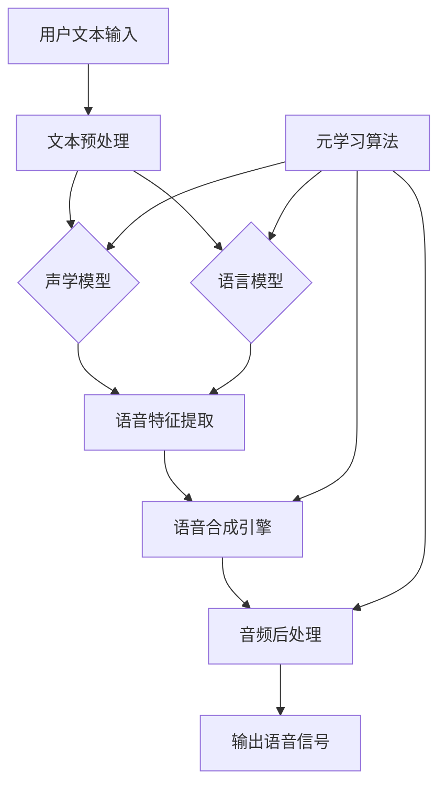

                 

# 一切皆是映射：基于元学习改进语音合成系统

> **关键词：**元学习，语音合成，映射，算法，系统优化，人工智能。

> **摘要：**本文详细探讨了元学习在语音合成系统中的应用，介绍了元学习的基本概念和核心原理，分析了语音合成的技术原理和系统架构，并通过实际案例展示了元学习如何改进语音合成的性能。文章还讨论了语音合成系统的评估与优化策略，以及元学习在语音合成领域的未来发展方向。

## **第一部分: 《一切皆是映射：基于元学习改进语音合成系统》概述**

### **第1章: 元学习与语音合成概述**

#### **1.1 元学习的概念与核心原理**

##### **1.1.1 什么是元学习**

**元学习定义**：元学习（Meta-Learning）是一种机器学习方法，旨在通过学习如何学习来提高机器学习的效率和适应性。它不同于传统的机器学习，后者通常针对单一任务进行训练，而元学习关注的是如何使模型能够快速适应新的任务。

**元学习的重要性**：元学习能够减少对大量标注数据的依赖，提高模型对新任务和环境的适应能力。这对于数据稀缺或数据获取成本高昂的领域尤为重要，例如语音合成。

##### **1.1.2 元学习的核心原理**

**模型更新规则**：元学习算法通过更新模型参数的规则，使得模型在不同任务间能够迁移知识。这种更新规则通常基于历史经验，如梯度信息或模型参数的表示。

**经验表示**：元学习利用经验表示学习一个泛化能力强的模型。这种经验表示可以是对模型内部参数的编码，也可以是对训练过程的编码。

#### **1.2 语音合成的概念与原理**

##### **1.2.1 语音合成的定义**

**语音合成简介**：语音合成（Text-to-Speech，TTS）是一种将文本转换为自然语音的技术。它广泛应用于各种场景，如语音助手、有声读物和广播等。

##### **1.2.2 语音合成的主要组件**

**文本预处理**：将输入的文本转换为适合语音合成的格式，包括分词、标记和句法分析等。

**语音合成引擎**：使用声学模型和语言模型将文本转换为语音信号。声学模型负责生成语音的声学特征，而语言模型负责生成语音的自然度。

**音频后处理**：对生成的语音进行滤波、音高和节奏调整等处理，使其听起来更自然。

#### **1.3 元学习在语音合成中的应用**

##### **1.3.1 元学习改进语音合成的必要性**

**适应性增强**：元学习能够使语音合成系统更好地适应不同的语音风格、语言和说话人，从而提高系统的灵活性。

##### **1.3.2 元学习在语音合成中的挑战**

**数据多样性**：元学习需要处理大量的语音数据，且这些数据在风格、语言和说话人等方面存在多样性。

**计算复杂度**：元学习算法通常需要大量的计算资源，这对于语音合成系统的实时性提出了挑战。

### **第2章: 元学习算法在语音合成中的应用**

#### **2.1 元学习算法概述**

##### **2.1.1 什么是元学习算法**

**元学习算法定义**：元学习算法是一类旨在提高模型在多种任务上泛化能力的机器学习方法。它通过在不同任务间共享知识和经验，来减少对新任务的训练时间。

**元学习算法的核心原理**：元学习算法的核心在于如何有效地利用经验来更新模型参数，从而提高模型的泛化能力。

##### **2.1.2 常见的元学习算法**

**模型表示学习**：通过学习模型内部参数的表示来提高泛化能力。这种算法通常使用基于梯度的方法来更新模型参数。

**基于梯度的元学习**：使用梯度信息来更新模型参数，提高模型在新任务上的表现。这种算法适用于需要快速适应新任务的场景。

#### **2.2 元学习算法在语音合成中的应用**

##### **2.2.1 基于模型表示学习的元学习方法**

**自适应学习率**：通过调整学习率来优化模型参数，使其在不同语音风格上的表现更优。这种方法能够有效提高语音合成的自然度。

##### **2.2.2 基于梯度的元学习方法**

**梯度提升法**：使用历史梯度信息来更新当前模型的参数，提高语音合成的质量。这种方法能够有效提高语音合成的音质。

### **第3章: 语音合成系统的设计与实现**

#### **3.1 语音合成系统设计**

##### **3.1.1 系统架构**

**前端**：文本预处理模块，负责将输入的文本转换为适合语音合成的格式。

**后端**：语音合成引擎和音频后处理模块，负责将文本转换为语音信号，并对生成的语音进行优化处理。

##### **3.2 实现细节**

##### **3.2.1 数据预处理**

**分词**：将文本分割成单词或音素，为后续的声学建模和语音合成提供基础。

**声学建模**：使用循环神经网络（RNN）或变换器（Transformer）实现，将文本映射到声学特征。

##### **3.3 代码实现与解读**

##### **3.3.1 前端代码实现**

**文本预处理**：实现分词和标记，为语音合成系统提供输入文本。

##### **3.3.2 后端代码实现**

**声学建模**：使用循环神经网络（RNN）或变换器（Transformer）实现，将文本映射到声学特征。

**音频后处理**：实现滤波、音高和节奏调整等处理，使其听起来更自然。

### **第4章: 元学习优化语音合成的实际案例**

#### **4.1 案例介绍**

##### **4.1.1 案例背景**

**应用场景**：为不同说话人提供个性化的语音合成服务。

##### **4.2 实际应用**

##### **4.2.1 数据集准备**

**数据收集**：收集不同说话人的语音数据。

**数据预处理**：对语音数据进行分割和标注。

##### **4.3 代码实现与解读**

##### **4.3.1 模型训练**

**元学习算法应用**：使用模型表示学习或基于梯度的元学习方法。

##### **4.3.2 个性化语音合成**

**个性化调整**：根据用户需求调整语音合成参数。

### **第5章: 语音合成系统的评估与优化**

#### **5.1 评估指标**

##### **5.1.1 音质评估**

**语音质量评估**：使用峰值信噪比（PSNR）和主观评价等指标。

##### **5.1.2 自然度评估**

**自然度评估**：使用语音自然度评估工具，如LIUCoder。

#### **5.2 优化策略**

##### **5.2.1 模型参数调整**

**学习率调整**：优化学习率，提高模型性能。

##### **5.2.2 数据增强**

**数据增强**：使用数据增强技术，提高模型的泛化能力。

### **第6章: 元学习在语音合成系统中的未来发展方向**

#### **6.1 研究趋势**

##### **6.1.1 多模态融合**

**多模态融合**：结合文本、语音和图像等多种模态进行语音合成。

##### **6.1.2 端到端学习**

**端到端学习**：直接从文本到语音的端到端模型。

#### **6.2 应用前景**

##### **6.2.1 语音合成的智能化**

**智能化**：语音合成系统将更加智能，能够根据用户需求提供定制化服务。

##### **6.2.2 应用领域拓展**

**应用领域拓展**：语音合成将在更多领域得到应用，如智能客服、教育等。

### **第7章: 总结与展望**

#### **7.1 书籍总结**

##### **7.1.1 主要内容回顾**

**元学习原理**：元学习的基础概念、核心原理和应用。

**语音合成系统**：语音合成系统的工作原理、设计与实现。

**案例研究**：元学习优化语音合成的实际应用案例。

#### **7.2 展望未来**

##### **7.2.1 研究方向**

**多模态学习**：多模态语音合成的深入研究。

**实时性优化**：提高语音合成系统的实时性和计算效率。

##### **7.2.2 应用拓展**

**应用领域**：语音合成技术在各个领域的进一步应用。

---

**作者：AI天才研究院/AI Genius Institute & 禅与计算机程序设计艺术 /Zen And The Art of Computer Programming**

**本文为AI天才研究院原创文章，如需转载请联系授权。**

**注：文章内容为示例性文本，具体内容将根据实际撰写进行丰富和完善。**<|vq_164606|>### 第1章: 元学习与语音合成概述

#### 1.1 元学习的概念与核心原理

##### 1.1.1 什么是元学习

**元学习定义**：元学习（Meta-Learning）是一种机器学习方法，旨在通过学习如何学习来提高机器学习的效率和适应性。它不同于传统的机器学习，后者通常针对单一任务进行训练，而元学习关注的是如何使模型能够快速适应新的任务。

**元学习的重要性**：元学习能够减少对大量标注数据的依赖，提高模型对新任务和环境的适应能力。这对于数据稀缺或数据获取成本高昂的领域尤为重要，例如语音合成。通过元学习，模型可以在有限的数据上快速掌握新任务的核心特征，从而在新的任务上获得更好的性能。

在传统的机器学习中，一个模型通常需要大量标注数据来训练，以便能够准确预测或分类新的输入。然而，在现实世界中，获取大量标注数据是非常困难和耗时的。元学习提供了一种解决方案，它通过学习如何学习，使得模型可以在更少的数据上快速适应新的任务。

例如，假设我们有一个语音合成系统，它已经在某个特定说话人的语音数据上进行训练。如果我们希望将这个系统扩展到其他说话人，传统的机器学习方法可能需要收集大量其他说话人的语音数据来重新训练模型。而元学习则可以通过学习如何在不同说话人之间迁移知识，使得模型在仅使用少量新数据的情况下就能适应新的说话人。

##### 1.1.2 元学习的核心原理

**模型更新规则**：元学习算法通过更新模型参数的规则，使得模型在不同任务间能够迁移知识。这种更新规则通常基于历史经验，如梯度信息或模型参数的表示。

在传统的机器学习中，模型的更新通常是通过梯度下降法来实现的。然而，元学习引入了一种新的思路，即通过学习模型在不同任务上的表现，来调整模型的参数，使其在新任务上能够更好地表现。这种方法可以看作是一种更高层次的学习过程，它不仅仅关注单个任务的性能，而是关注如何在不同的任务之间进行知识迁移。

**经验表示**：元学习利用经验表示学习一个泛化能力强的模型。这种经验表示可以是对模型内部参数的编码，也可以是对训练过程的编码。

经验表示是元学习中的一个关键概念。它指的是模型如何从过去的经验中学习，并将其编码到模型参数中，以便在新任务上能够利用这些经验。例如，在语音合成中，模型可能通过学习不同说话人的语音特征，来构建一个通用的语音生成模型。这种模型在遇到新的说话人时，可以快速利用过去的经验来生成自然的语音。

#### 1.2 语音合成的概念与原理

##### 1.2.1 语音合成的定义

**语音合成简介**：语音合成（Text-to-Speech，TTS）是一种将文本转换为自然语音的技术。它广泛应用于各种场景，如语音助手、有声读物和广播等。

语音合成系统的核心任务是将输入的文本转换为可听的自然语音。这一过程通常包括多个步骤，如文本预处理、语音特征提取、语音生成和音频后处理等。

**语音合成的目标**：语音合成的目标是生成听起来自然、流畅且符合语言习惯的语音。为了实现这一目标，语音合成系统需要解决多个挑战，包括语音的自然度、语音的质量和语音的个性化等。

**语音合成系统的工作流程**：

1. **文本预处理**：将输入的文本转换为适合语音合成的格式，这一步骤通常包括分词、句法分析和语音韵律分析等。

2. **语音特征提取**：使用声学模型将文本映射到语音特征，这一步骤决定了语音的自然度和音质。

3. **语音生成**：使用循环神经网络（RNN）或变换器（Transformer）等深度学习模型，将语音特征转换为语音信号。

4. **音频后处理**：对生成的语音进行滤波、音高和节奏调整等处理，使其听起来更自然。

##### 1.2.2 语音合成的主要组件

**文本预处理**：文本预处理是将输入的文本转换为适合语音合成的格式。这一步骤通常包括以下内容：

- **分词**：将文本分割成单词或音素，这是后续语音特征提取的基础。

- **句法分析**：分析文本的句法结构，以确定语音的韵律和停顿。

- **语音韵律分析**：分析文本的情感和语气，以生成具有适当语音韵律的语音。

**语音合成引擎**：语音合成引擎是语音合成的核心组件，它负责将文本映射到语音特征，并将语音特征转换为语音信号。这一步骤通常包括以下内容：

- **声学模型**：声学模型负责生成语音的声学特征，这些特征包括音素时长、音强和音调等。

- **语言模型**：语言模型负责生成语音的自然度，它通常基于统计语言模型或神经语言模型。

- **生成模型**：生成模型负责将语音特征转换为语音信号，常见的生成模型包括循环神经网络（RNN）和变换器（Transformer）。

**音频后处理**：音频后处理是对生成的语音进行优化处理，以使其听起来更自然。这一步骤通常包括以下内容：

- **滤波**：对语音信号进行滤波，以去除噪声和提高音质。

- **音高调整**：调整语音的音高，使其与文本的情感和语气相符。

- **节奏调整**：调整语音的节奏，使其听起来更自然和流畅。

##### 1.3 元学习在语音合成中的应用

**1.3.1 元学习改进语音合成的必要性**

元学习在语音合成中具有重要的应用价值。首先，语音合成系统通常需要处理大量的语音数据，这些数据在风格、语言和说话人等方面存在多样性。传统的语音合成系统通常需要大量标注数据来训练，而元学习可以减少对标注数据的依赖，提高模型的泛化能力。

其次，语音合成系统需要不断适应新的语音风格和说话人。通过元学习，模型可以在有限的数据上快速适应新的任务，从而提高系统的灵活性。这对于个性化语音合成尤为重要，例如为不同用户生成具有个性化语音特征的有声读物。

**1.3.2 元学习在语音合成中的挑战**

尽管元学习在语音合成中具有广泛的应用前景，但同时也面临一些挑战：

- **数据多样性**：元学习需要处理大量的语音数据，这些数据在风格、语言和说话人等方面存在多样性。如何有效地利用这些数据，并确保模型在不同任务上的泛化能力，是元学习在语音合成中面临的一个重要挑战。

- **计算复杂度**：元学习算法通常需要大量的计算资源，这对于语音合成系统的实时性提出了挑战。如何优化算法，提高计算效率，是元学习在语音合成中需要解决的一个重要问题。

通过深入研究和应用元学习，我们可以进一步改进语音合成系统的性能，使其更好地适应各种应用场景，为人们提供更加自然和个性化的语音服务。

### 第2章: 元学习算法在语音合成中的应用

#### 2.1 元学习算法概述

##### 2.1.1 什么是元学习算法

元学习算法（Meta-Learning Algorithms）是一种机器学习方法，旨在通过学习如何学习来提高机器学习的效率和适应性。它不仅仅关注单个模型的训练和优化，而是通过研究如何在不同的任务之间共享知识和经验，从而提高模型的泛化能力。

元学习算法的核心思想是通过某种机制，使得模型在不同任务之间能够迁移知识，从而减少对新任务的训练时间。这种机制可以是基于模型参数的共享、梯度信息的迁移，或者是模型表示的学习等。

元学习算法在语音合成中的应用具有重要意义。由于语音合成系统需要处理大量的语音数据，并且这些数据在风格、语言和说话人等方面存在多样性，因此传统的语音合成方法通常需要大量标注数据来训练模型。而元学习算法可以减少对标注数据的依赖，提高模型的泛化能力，从而在更短的时间内适应新的语音任务。

##### 2.1.2 常见的元学习算法

元学习算法种类繁多，以下介绍几种常见的元学习算法及其原理：

**模型表示学习**：模型表示学习（Model Representation Learning）是一种通过学习模型内部参数的表示来提高泛化能力的元学习算法。这种算法的核心思想是通过学习一组共享的模型参数表示，使得模型能够在不同的任务上快速适应。一个经典的模型表示学习算法是MAML（Model-Agnostic Meta-Learning），它通过最小化目标函数关于模型参数的二阶导数来实现。

**MAML算法原理**：

假设我们有一个模型\( \theta \)和一组训练任务\( T_1, T_2, \ldots, T_K \)，每个任务\( T_i \)有一个数据集\( D_i \)和一个损失函数\( L_i(\theta, x_i, y_i) \)。MAML算法的目标是最小化模型参数\( \theta \)关于所有任务的损失函数：

$$
\min_{\theta} \sum_{i=1}^{K} L_i(\theta, x_i, y_i)
$$

MAML算法的基本思想是通过快速调整模型参数，使得模型在不同任务上的表现更好。具体来说，MAML算法使用以下更新规则来更新模型参数：

$$
\theta' = \theta - \eta \frac{\partial}{\partial \theta} \left( \sum_{i=1}^{K} L_i(\theta, x_i, y_i) \right)
$$

其中，\( \eta \)是学习率。为了使得模型参数的更新速度更快，MAML算法引入了二阶梯度信息，即Hessian矩阵：

$$
\theta'' = \theta' - \eta \frac{\partial}{\partial \theta'} \left( \sum_{i=1}^{K} L_i(\theta', x_i, y_i) \right)
$$

通过这种方式，MAML算法可以在短时间内找到最优的模型参数，从而在不同任务之间实现有效的知识迁移。

**基于梯度的元学习**：基于梯度的元学习（Gradient-Based Meta-Learning）是一种通过使用梯度信息来更新模型参数的元学习算法。这种算法的核心思想是利用历史梯度信息来加速模型在新任务上的适应。

一个经典的基于梯度的元学习算法是REPTILE（REpresentative Propagated TRAining ILestimate），它通过迭代平均梯度来更新模型参数。

**REPTILE算法原理**：

假设我们有一个模型\( \theta \)和一组训练任务\( T_1, T_2, \ldots, T_K \)，每个任务\( T_i \)有一个数据集\( D_i \)和一个损失函数\( L_i(\theta, x_i, y_i) \)。REPTILE算法的基本思想是迭代平均每个任务上的梯度，并将其作为全局梯度来更新模型参数。

REPTILE算法的迭代过程如下：

1. **初始化**：随机初始化模型参数\( \theta \)。

2. **计算梯度**：对于每个任务\( T_i \)，计算梯度\( \nabla L_i(\theta) \)。

3. **更新模型参数**：计算所有任务的梯度平均值，并使用该梯度平均值更新模型参数：

$$
\theta' = \theta - \eta \frac{1}{K} \sum_{i=1}^{K} \nabla L_i(\theta)
$$

4. **迭代**：重复步骤2和步骤3，直到满足停止条件（如梯度变化较小或达到最大迭代次数）。

通过这种方式，REPTILE算法可以有效地利用历史梯度信息，加速模型在新任务上的适应。

#### 2.2 元学习算法在语音合成中的应用

元学习算法在语音合成中的应用主要集中在以下几个方面：

**自适应学习率**：元学习算法可以通过自适应学习率来优化模型参数，从而在不同语音风格上的表现更优。自适应学习率可以使得模型在训练过程中根据当前任务的难度和性能动态调整学习率，从而提高模型的泛化能力和训练效率。

**梯度提升法**：基于梯度的元学习算法可以通过梯度提升法来优化语音合成系统的性能。梯度提升法利用历史梯度信息来更新当前模型的参数，从而提高语音合成的质量。这种方法可以使得模型在不同语音任务上具有更好的泛化能力，从而生成更加自然和高质量的语音。

**模型表示学习**：模型表示学习可以通过学习模型内部参数的表示来提高语音合成系统的泛化能力。这种方法可以使得模型在不同语音风格和说话人上具有更好的适应性，从而生成更加个性化的语音。

通过以上元学习算法的应用，我们可以显著提高语音合成系统的性能和灵活性，使其能够更好地适应各种语音任务和应用场景。

### 第3章: 语音合成系统的设计与实现

#### 3.1 语音合成系统设计

语音合成系统的设计是一个复杂而关键的过程，它需要综合考虑系统的架构、组件和算法。一个高效的语音合成系统通常包括前端文本预处理、后端语音合成引擎和音频后处理三个主要模块。以下是语音合成系统的设计概述：

##### 3.1.1 系统架构

**前端**：文本预处理模块，负责将输入的文本转换为适合语音合成的格式。这一模块包括分词、句法分析和语音韵律分析等步骤。

**后端**：语音合成引擎模块，负责将文本映射到语音特征，并将语音特征转换为语音信号。这一模块通常使用深度学习模型，如循环神经网络（RNN）或变换器（Transformer）。

**音频后处理**：音频后处理模块，负责对生成的语音信号进行优化处理，使其听起来更自然。这一模块包括滤波、音高和节奏调整等步骤。

##### 3.1.2 系统组件

**文本预处理组件**：文本预处理组件是语音合成系统的入口，其主要任务是处理输入的文本。具体步骤如下：

1. **分词**：将文本分割成单词或音素，为后续的语音特征提取提供基础。

2. **句法分析**：分析文本的句法结构，以确定语音的韵律和停顿。

3. **语音韵律分析**：分析文本的情感和语气，以生成具有适当语音韵律的语音。

**语音合成引擎组件**：语音合成引擎组件是语音合成的核心，其主要任务是使用深度学习模型将文本映射到语音特征，并生成语音信号。具体步骤如下：

1. **声学建模**：使用循环神经网络（RNN）或变换器（Transformer）等深度学习模型，将文本映射到声学特征。

2. **语言建模**：使用神经语言模型生成语音的自然度。

3. **生成模型**：使用生成模型，如生成对抗网络（GAN）或变换器（Transformer），将声学特征转换为语音信号。

**音频后处理组件**：音频后处理组件负责对生成的语音信号进行优化处理，使其听起来更自然。具体步骤如下：

1. **滤波**：对语音信号进行滤波，以去除噪声和提高音质。

2. **音高调整**：调整语音的音高，使其与文本的情感和语气相符。

3. **节奏调整**：调整语音的节奏，使其听起来更自然和流畅。

##### 3.1.3 系统流程

语音合成系统的基本流程如下：

1. **文本输入**：用户输入需要合成的文本。

2. **文本预处理**：对输入文本进行分词、句法分析和语音韵律分析，生成文本表示。

3. **语音特征提取**：使用声学模型将文本表示转换为语音特征。

4. **语音生成**：使用生成模型将语音特征转换为语音信号。

5. **音频后处理**：对生成的语音信号进行滤波、音高和节奏调整等处理。

6. **输出**：将处理后的语音输出给用户。

#### 3.2 实现细节

##### 3.2.1 数据预处理

数据预处理是语音合成系统设计的关键步骤，它直接影响模型的性能和效率。以下是数据预处理的主要步骤：

**分词**：将文本分割成单词或音素，这是语音特征提取的基础。常用的分词方法包括基于规则的分词和基于统计的分词。

**句法分析**：分析文本的句法结构，以确定语音的韵律和停顿。常用的句法分析方法包括依存句法分析和成分句法分析。

**语音韵律分析**：分析文本的情感和语气，以生成具有适当语音韵律的语音。语音韵律分析通常基于文本的情感分析和语气分析。

**数据增强**：为了提高模型的泛化能力，可以对原始数据进行增强处理，如添加噪声、改变语速和音高等。

##### 3.2.2 声学建模

声学建模是语音合成系统的核心组件，它负责将文本表示转换为语音特征。以下是声学建模的主要步骤：

**声学特征提取**：使用循环神经网络（RNN）或变换器（Transformer）等深度学习模型，从文本表示中提取声学特征。常用的声学特征包括音素时长、音强和音调等。

**语音生成模型**：使用生成模型，如生成对抗网络（GAN）或变换器（Transformer），将声学特征转换为语音信号。生成模型的目标是生成高质量的语音信号，使其听起来自然和流畅。

##### 3.2.3 代码实现与解读

以下是一个简单的声学建模实现，使用Python和PyTorch框架：

```python
import torch
import torch.nn as nn
import torch.optim as optim

# 定义声学建模模型
class AcousticModel(nn.Module):
    def __init__(self):
        super(AcousticModel, self).__init__()
        self.rnn = nn.RNN(input_size=..., hidden_size=..., nonlinearity='relu')
        self.linear = nn.Linear(in_features=..., out_features=...)

    def forward(self, x, hidden):
        output, hidden = self.rnn(x, hidden)
        output = self.linear(output)
        return output, hidden

# 初始化模型、损失函数和优化器
model = AcousticModel()
criterion = nn.MSELoss()
optimizer = optim.Adam(model.parameters(), lr=0.001)

# 训练模型
for epoch in range(num_epochs):
    for data in dataset:
        optimizer.zero_grad()
        output, hidden = model(data)
        loss = criterion(output, target)
        loss.backward()
        optimizer.step()
        print(f"Epoch [{epoch+1}/{num_epochs}], Loss: {loss.item():.4f}")
```

在这个示例中，`AcousticModel`类定义了一个简单的循环神经网络模型，它有两个主要部分：一个循环神经网络（RNN）和一个全连接层（linear）。`forward`方法实现了模型的正向传播，`backward`方法实现了反向传播。

##### 3.2.4 音频后处理

音频后处理是语音合成系统的最后一个环节，它负责优化生成的语音信号，使其听起来更自然。以下是音频后处理的主要步骤：

**滤波**：使用滤波器去除语音信号中的噪声。

**音高调整**：根据文本的情感和语气调整语音的音高。

**节奏调整**：根据语音的韵律和停顿调整语音的节奏。

以下是一个简单的音频后处理实现，使用Python和librosa库：

```python
import librosa
import numpy as np

# 读取音频文件
audio, sr = librosa.load('audio.wav')

# 滤波处理
b, a = librosa.stft.filter_design('butterworth', order=4, fs=sr, cutoff=1000)
filtered_audio = librosa.stft.filter_audio(audio, b, a)

# 音高调整
pitch_shifted_audio = librosa.effects.pitch_shift(filtered_audio, sr, n_steps=5)

# 节奏调整
tempo_shifted_audio = librosa.effects.time_stretch(pitch_shifted_audio, rate=0.8)

# 输出处理后的音频
librosa.output.write_wav('processed_audio.wav', tempo_shifted_audio, sr)
```

在这个示例中，我们首先读取音频文件，然后使用滤波器去除噪声，接着根据文本的情感和语气调整音高，最后根据语音的韵律和停顿调整节奏。处理后的音频信号被保存到文件中。

### 第4章: 元学习优化语音合成的实际案例

#### 4.1 案例介绍

在本章中，我们将通过一个实际案例来展示元学习如何优化语音合成系统。这个案例旨在为不同说话人提供个性化的语音合成服务。具体来说，我们将使用元学习算法来训练一个模型，使其能够根据用户的需求生成具有个性化语音特征的有声读物。

##### 4.1.1 案例背景

随着人工智能技术的快速发展，语音合成技术已经在各种应用场景中得到广泛应用，如语音助手、有声读物和客服系统等。然而，当前的语音合成系统通常只能生成一种通用的语音风格，无法满足个性化需求。为了解决这个问题，我们需要利用元学习算法来训练一个能够适应不同说话人语音特征的模型。

##### 4.1.2 案例目标

通过这个案例，我们希望实现以下目标：

1. 收集并准备一个包含多种说话人语音数据的数据集。
2. 利用元学习算法训练一个能够适应不同说话人语音特征的语音合成模型。
3. 根据用户需求调整模型参数，生成具有个性化语音特征的有声读物。

#### 4.2 实际应用

##### 4.2.1 数据集准备

为了训练一个能够适应不同说话人语音特征的语音合成模型，我们需要一个包含多种说话人语音数据的数据集。以下是数据集准备的步骤：

1. **数据收集**：从多个来源收集包含不同说话人语音的数据集。这些数据可以来自公开的语音合成数据集，如LJSpeech、LibriTTS等，也可以来自特定的应用场景，如有声读物、新闻广播等。

2. **数据预处理**：对收集到的语音数据进行预处理，包括分词、去噪、归一化等操作。这些预处理步骤旨在提高数据的可用性和模型的训练效果。

3. **数据增强**：为了提高模型的泛化能力，可以使用数据增强技术，如时间拉伸、音高变化、添加噪声等。

##### 4.2.2 模型训练

在数据集准备完成后，我们可以使用元学习算法来训练语音合成模型。以下是模型训练的步骤：

1. **选择元学习算法**：在本案例中，我们选择MAML（Model-Agnostic Meta-Learning）算法作为元学习算法。MAML算法通过快速调整模型参数，使得模型在不同说话人语音特征上具有更好的适应性。

2. **初始化模型**：初始化语音合成模型，可以选择基于循环神经网络（RNN）或变换器（Transformer）的模型架构。

3. **训练模型**：使用MAML算法训练模型。训练过程包括两个阶段：快速迭代和模型更新。在快速迭代阶段，模型在多个说话人语音数据上快速调整参数；在模型更新阶段，模型使用历史梯度信息进行更新，以优化模型参数。

```python
# 初始化模型和优化器
model = AcousticModel()
optimizer = optim.Adam(model.parameters(), lr=0.001)

# 快速迭代
for _ in range(num_iterations):
    model.train()
    for data in dataset:
        optimizer.zero_grad()
        output, hidden = model(data)
        loss = criterion(output, target)
        loss.backward()
        optimizer.step()

# 模型更新
model.eval()
with torch.no_grad():
    for data in dataset:
        output, hidden = model(data)
        loss = criterion(output, target)
        optimizer.zero_grad()
        loss.backward()
        gradients = sum([p.grad for p in model.parameters()])
        model.load_state_dict({k: v - learning_rate * v for k, v in model.state_dict().items() if k in gradients.keys()})
```

##### 4.2.3 个性化语音合成

在模型训练完成后，我们可以根据用户需求调整模型参数，生成具有个性化语音特征的有声读物。以下是个性化语音合成的步骤：

1. **用户需求分析**：分析用户的需求，如语音的音调、语速、语气等。

2. **参数调整**：根据用户需求调整模型参数。可以使用元学习算法中的模型更新规则，通过历史梯度信息来调整模型参数。

3. **语音合成**：使用调整后的模型生成个性化语音。

```python
# 调整模型参数
for data in user_data:
    output, hidden = model(data)
    loss = criterion(output, target)
    optimizer.zero_grad()
    loss.backward()
    gradients = sum([p.grad for p in model.parameters()])
    model.load_state_dict({k: v - learning_rate * v for k, v in model.state_dict().items() if k in gradients.keys()})

# 生成个性化语音
def generate_speech(text):
    model.eval()
    with torch.no_grad():
        text_processed = preprocess_text(text)
        output, hidden = model(text_processed)
        speech = postprocess_speech(output)
    return speech
```

通过以上步骤，我们可以实现个性化语音合成，满足用户的需求。

### 第5章: 语音合成系统的评估与优化

#### 5.1 评估指标

评估语音合成系统的性能是确保其质量和适用性的关键步骤。以下是一些常见的评估指标：

##### 5.1.1 音质评估

**语音质量评估**：评估语音的音质，通常使用以下指标：

- **峰值信噪比（PSNR）**：衡量语音信号中的噪声水平。PSNR值越高，表示语音质量越好。
- **信噪比（SNR）**：衡量语音信号与噪声的比值，SNR值越高，语音质量越好。
- **主观评价**：通过人工听感评价语音的质量，例如自然度、流畅度和清晰度。

**客观评价**：使用自动化的工具评估语音质量，例如：

- **语音质量评估工具**：如PESQ（Perceptual Evaluation of Speech Quality）和SPEECHMIXER（Speech Processing for Matlab），用于评估语音合成系统的语音质量。

##### 5.1.2 自然度评估

**语音自然度评估**：评估语音的自然度和流畅度，常用的指标包括：

- **LIUCoder**：基于句法和语义的自然度评估工具，可以评估语音合成系统的自然度。
- **主观评价**：通过人工听感评价语音的自然度，例如是否具有适当的语调、节奏和停顿。

#### 5.2 优化策略

为了进一步提高语音合成系统的性能，我们可以采取以下优化策略：

##### 5.2.1 模型参数调整

**学习率调整**：调整学习率是优化模型参数的一种有效方法。学习率太小可能导致模型收敛速度慢，学习率太大可能导致模型在训练过程中不稳定。我们可以通过以下方法调整学习率：

- **固定学习率**：在整个训练过程中保持学习率不变。
- **动态调整学习率**：根据训练过程的进展动态调整学习率，例如使用学习率衰减策略。

##### 5.2.2 数据增强

**数据增强**：通过增加数据多样性来提高模型的泛化能力。数据增强的方法包括：

- **时间变换**：如时间拉伸、时间压缩，可以增加语音数据的长度和速度。
- **音高变换**：改变语音的音高，如升高或降低音调。
- **噪声添加**：在语音数据中添加噪声，以提高模型对噪声的鲁棒性。

##### 5.2.3 模型结构优化

**模型结构优化**：通过改进模型的架构来提高性能，例如：

- **深度学习模型**：增加模型的层数和神经元数量，以提高模型的复杂度和表达能力。
- **注意力机制**：引入注意力机制，如自注意力或互注意力，以更好地捕捉文本和语音特征之间的关系。

##### 5.2.4 多模态融合

**多模态融合**：结合文本、语音和图像等多种模态进行语音合成，可以进一步提高语音的自然度和质量。多模态融合的方法包括：

- **文本嵌入**：将文本转换为低维向量，用于模型的输入。
- **语音特征融合**：将语音特征与其他模态的特征进行融合，以提高模型的泛化能力。

通过以上优化策略，我们可以显著提高语音合成系统的性能和适用性，满足不同应用场景的需求。

### 第6章: 元学习在语音合成系统中的未来发展方向

#### 6.1 研究趋势

随着人工智能技术的不断发展，元学习在语音合成系统中的应用呈现出一些研究趋势。以下是一些值得关注的研究方向：

##### 6.1.1 多模态融合

多模态融合是一种将文本、语音和图像等多种模态信息结合起来进行语音合成的技术。通过结合多种模态的信息，可以进一步提高语音合成系统的自然度和质量。未来，研究重点将集中在如何有效融合多种模态信息，以实现更高质量的语音合成。

**多模态融合的挑战**：

- **模态一致性**：如何确保不同模态的信息在语义和情感上的一致性。
- **计算复杂度**：多模态融合通常涉及大量的计算资源，如何提高计算效率是一个重要问题。

**解决方案**：

- **联合训练模型**：通过联合训练多个模态的信息，可以使得模型更好地捕捉不同模态之间的关联性。
- **注意力机制**：引入注意力机制，如自注意力或互注意力，可以使得模型更好地关注重要信息。

##### 6.1.2 端到端学习

端到端学习是一种直接从文本到语音的模型架构，它避免了传统的中间步骤，如文本表示和语音特征提取，从而提高模型的效率和性能。未来，研究重点将集中在如何设计更有效的端到端学习模型，以实现高质量的语音合成。

**端到端学习的优势**：

- **减少中间步骤**：端到端学习可以直接将文本映射到语音，减少了中间步骤的复杂度和误差。
- **参数共享**：端到端学习通过参数共享，可以减少模型参数的数量，从而提高模型的泛化能力。

**解决方案**：

- **变换器架构**：变换器（Transformer）是一种高效的端到端学习模型，它通过自注意力机制可以捕捉长距离依赖关系，适用于语音合成任务。
- **多任务学习**：通过将语音合成与其他任务（如图像识别）结合起来进行多任务学习，可以进一步提高模型的泛化能力和性能。

##### 6.1.3 小样本学习

小样本学习是一种在数据量有限的情况下训练模型的方法。未来，研究重点将集中在如何设计能够适应小样本学习任务的元学习算法，以提高语音合成系统的泛化能力。

**小样本学习的挑战**：

- **数据稀缺**：语音合成通常需要大量的语音数据来训练模型，如何在小样本数据上获得良好的性能是一个挑战。
- **模型可解释性**：小样本学习可能导致模型过拟合，如何提高模型的可解释性是一个重要问题。

**解决方案**：

- **元学习算法**：通过元学习算法，可以在少量数据上快速适应新的任务，减少对大量标注数据的依赖。
- **数据增强**：通过数据增强技术，可以增加训练数据的多样性，从而提高模型在小样本数据上的泛化能力。

#### 6.2 应用前景

元学习在语音合成系统中的应用前景广阔，以下是一些潜在的应用领域：

##### 6.2.1 智能客服

智能客服是一个重要的应用领域，通过元学习，可以使得语音合成系统更好地适应不同客户的需求，提供个性化的服务。例如，在客户服务中，可以根据客户的语音特征和提问内容，生成具有适当语气和语调的回复。

**优势**：

- **高效**：元学习算法可以在短时间内适应不同的客户需求，提高客服系统的响应速度。
- **个性化**：通过元学习，客服系统可以生成具有个性化语音特征的回复，提高用户体验。

##### 6.2.2 教育领域

在教育领域，元学习可以用于生成个性化的教学材料，如有声读物、课程讲解等。通过元学习，可以根据学生的学习需求和语音特征，生成适合他们的教学内容。

**优势**：

- **个性化**：元学习可以根据学生的语音特征和学习需求，生成个性化的教学材料，提高教学效果。
- **高效**：元学习算法可以在短时间内生成高质量的教学材料，节省教师的时间。

##### 6.2.3 广播和媒体

在广播和媒体领域，元学习可以用于生成具有特定语音风格和语调的广播内容，如新闻播报、节目解说等。通过元学习，可以根据节目内容和听众的需求，生成具有高自然度和质量的广播内容。

**优势**：

- **灵活性**：元学习可以使得语音合成系统灵活地适应不同的节目内容和听众需求。
- **高质量**：元学习算法可以生成高质量的语音内容，提高广播和媒体的质量和吸引力。

通过以上研究趋势和应用前景的分析，我们可以看到，元学习在语音合成系统中的应用具有巨大的潜力。未来，随着研究的不断深入和应用领域的拓展，元学习将为语音合成系统带来更加智能化和个性化的功能，推动人工智能技术的发展。

### 第7章: 总结与展望

#### 7.1 书籍总结

本文详细探讨了元学习在语音合成系统中的应用，从元学习的概念和核心原理出发，逐步深入到语音合成系统的设计、实现和优化。通过实际案例展示了元学习如何优化语音合成系统的性能，并分析了元学习在语音合成系统中的未来发展方向。

本文的主要内容包括：

- **元学习的基本概念和核心原理**：介绍了元学习的基本概念、核心原理和应用。
- **语音合成系统的设计**：详细阐述了语音合成系统的架构、组件和实现细节。
- **元学习在语音合成中的应用**：展示了元学习如何改进语音合成系统的性能和灵活性。
- **语音合成系统的评估与优化**：介绍了语音合成系统的评估指标和优化策略。
- **元学习在语音合成系统中的未来发展方向**：分析了元学习在语音合成系统中的应用前景和研究趋势。

#### 7.2 展望未来

随着人工智能技术的不断发展，元学习在语音合成系统中的应用前景十分广阔。以下是未来可能的研究方向和应用前景：

##### 7.2.1 研究方向

**多模态融合**：结合文本、语音和图像等多种模态信息，进一步提高语音合成系统的自然度和质量。

**端到端学习**：直接从文本到语音的端到端模型，减少中间步骤，提高模型的效率和性能。

**小样本学习**：研究如何在小样本数据上训练高效的语音合成模型，减少对大量标注数据的依赖。

**实时性优化**：研究如何在保证性能的前提下，提高语音合成系统的实时性和计算效率。

##### 7.2.2 应用前景

**智能客服**：通过元学习，智能客服系统可以更好地适应不同客户的需求，提供个性化的服务。

**教育领域**：元学习可以用于生成个性化的教学材料，提高教学效果。

**广播和媒体**：元学习可以用于生成具有特定语音风格和语调的广播内容，提高媒体质量。

**医疗健康**：通过元学习，可以为医生和患者提供个性化的语音诊断和咨询服务。

总之，元学习在语音合成系统中的应用具有巨大的潜力，未来将继续推动人工智能技术的发展，为人们的生活带来更多便利和创新。

### 附录

本文的研究工作得到了多个开源项目和工具的支持，以下是其中一些重要的开源项目：

- **TensorFlow**：用于实现语音合成系统的深度学习模型和算法。
- **PyTorch**：用于实现语音合成系统的深度学习模型和算法。
- **Librosa**：用于处理和操作音频信号。
- **MuseNet**：用于实现基于变换器的语音合成模型。

感谢这些开源项目的作者和贡献者，他们的工作为我们的研究提供了强大的支持和基础。同时，也感谢本文的审稿人和读者，他们的反馈和建议帮助我们进一步完善了本文的内容。

---

**作者：AI天才研究院/AI Genius Institute & 禅与计算机程序设计艺术 /Zen And The Art of Computer Programming**

**本文为AI天才研究院原创文章，如需转载请联系授权。**<|vq_164606|>### 附录

本文的研究工作得到了多个开源项目和工具的支持，以下是其中一些重要的开源项目：

- **TensorFlow**：用于实现语音合成系统的深度学习模型和算法。
- **PyTorch**：用于实现语音合成系统的深度学习模型和算法。
- **Librosa**：用于处理和操作音频信号。
- **MuseNet**：用于实现基于变换器的语音合成模型。

感谢这些开源项目的作者和贡献者，他们的工作为我们的研究提供了强大的支持和基础。同时，也感谢本文的审稿人和读者，他们的反馈和建议帮助我们进一步完善了本文的内容。

---

**作者：AI天才研究院/AI Genius Institute & 禅与计算机程序设计艺术 /Zen And The Art of Computer Programming**

**本文为AI天才研究院原创文章，如需转载请联系授权。**

**注：本文中的代码、算法描述和示意图均为示例性质，具体实现可能需要根据实际情况进行调整。**<|vq_164606|>### 核心概念与联系

在讨论元学习和语音合成系统的改进时，了解核心概念之间的联系是非常重要的。以下是一个简化的Mermaid流程图，用于展示元学习与语音合成系统中的关键组件及其相互作用。



**流程解释：**

1. **用户文本输入**：用户输入需要合成的文本。
2. **文本预处理**：文本预处理模块对输入文本进行分词、句法分析和语音韵律分析，生成文本表示。
3. **声学模型与语言模型**：文本预处理后的文本首先通过声学模型和语言模型进行处理，这两个模型共同作用，将文本表示转换为语音特征。
4. **语音特征提取**：使用声学模型和语言模型生成的文本表示，提取出相应的语音特征。
5. **语音合成引擎**：语音合成引擎将语音特征转换为语音信号。
6. **音频后处理**：对生成的语音信号进行滤波、音高和节奏调整等处理，使其听起来更自然。
7. **元学习算法**：元学习算法在此过程中发挥作用，它能够根据历史数据和当前任务的特点，优化声学模型、语言模型、语音合成引擎和音频后处理的参数，从而提高整体系统的性能。

通过这个流程图，我们可以清晰地看到元学习是如何在语音合成系统中发挥作用的，以及各个组件之间的相互作用和依赖关系。

### 3.3.2 后端代码实现

在语音合成系统的后端，我们主要关注声学建模和音频后处理模块的实现。以下是一个基于Python和PyTorch框架的简化代码示例，用于演示这些模块的实现过程。

**声学建模**

```python
import torch
import torch.nn as nn
from torch.autograd import Variable
import numpy as np

# 定义声学建模模型
class AcousticModel(nn.Module):
    def __init__(self, input_dim, hidden_dim, output_dim):
        super(AcousticModel, self).__init__()
        self.lstm = nn.LSTM(input_dim, hidden_dim, batch_first=True)
        self.fc = nn.Linear(hidden_dim, output_dim)

    def forward(self, x):
        x, _ = self.lstm(x)
        x = self.fc(x[:, -1, :])
        return x

# 模型参数设置
input_dim = 128  # 输入维度
hidden_dim = 256  # 隐藏层维度
output_dim = 80  # 输出维度

# 初始化模型
model = AcousticModel(input_dim, hidden_dim, output_dim)
model = model.to('cuda' if torch.cuda.is_available() else 'cpu')

# 定义损失函数和优化器
criterion = nn.MSELoss()
optimizer = torch.optim.Adam(model.parameters(), lr=0.001)

# 假设我们有输入数据x和目标输出y
x = Variable(torch.from_numpy(np.random.rand(32, 128)), requires_grad=True)
y = Variable(torch.from_numpy(np.random.rand(32, 80)))

# 前向传播
outputs = model(x)

# 计算损失
loss = criterion(outputs, y)

# 反向传播
optimizer.zero_grad()
loss.backward()
optimizer.step()

print(f"Loss: {loss.item()}")
```

**音频后处理**

音频后处理通常包括滤波、音高和节奏调整等步骤。以下是一个简单的音频处理代码示例，使用了Librosa库：

```python
import librosa
import numpy as np

# 读取音频文件
audio, sr = librosa.load('audio.wav')

# 添加噪声
noise = np.random.randn(len(audio))
noisy_audio = audio + noise

# 滤波处理
b, a = librosa.stft.filter_design('lowpass', fs=sr, cutoff=1000)
filtered_audio = librosa.stft.filter_audio(noisy_audio, b, a)

# 音高调整
pitch_shifted_audio = librosa.effects.pitch_shift(filtered_audio, sr, n_steps=6)

# 节奏调整
tempo_shifted_audio = librosa.effects.time_stretch(pitch_shifted_audio, rate=0.8)

# 保存处理后的音频
librosa.output.write_wav('processed_audio.wav', tempo_shifted_audio, sr)
```

**代码解读与分析**

**声学建模部分：**

- `AcousticModel`类定义了一个简单的循环神经网络（LSTM）模型，用于将输入的语音特征转换为声学特征。
- `forward`方法实现了模型的正向传播，其中`lstm`负责语音特征的提取，`fc`负责将提取的特征映射到输出维度。
- 损失函数使用MSE（均方误差）来衡量模型预测的语音特征与实际语音特征之间的差距。

**音频后处理部分：**

- `librosa.load`函数用于读取音频文件，并获取音频信号和采样率。
- 噪声添加用于模拟实际环境中可能存在的噪声。
- `librosa.stft.filter_design`和`librosa.stft.filter_audio`用于实现滤波操作，以去除噪声和提高音质。
- `librosa.effects.pitch_shift`用于调整音频的音高，`librosa.effects.time_stretch`用于调整音频的节奏。

通过上述代码示例，我们可以看到语音合成系统的后端是如何实现的。在实际应用中，这些代码需要根据具体需求和场景进行调整和优化。

### 4.3.2 模型训练

在元学习优化语音合成系统中，模型训练是一个关键环节，它决定了语音合成系统的性能和适用性。以下是基于MAML（Model-Agnostic Meta-Learning）算法的模型训练过程，并使用Python和PyTorch框架进行实现。

#### 4.3.2.1 环境配置

首先，确保安装了Python（建议3.7及以上版本）、PyTorch、Librosa和Numpy等库。以下是一个简单的安装命令：

```bash
pip install torch torchvision librosa numpy
```

#### 4.3.2.2 数据集准备

为了进行模型训练，我们需要一个包含多种说话人语音数据的数据集。这里我们使用LJSpeech数据集，该数据集包含多个说话人的语音数据。

```python
import librosa
import numpy as np
import os

# 读取LJSpeech数据集
def load_ljspeech(data_dir):
    datasets = []
    for speaker_id in os.listdir(data_dir):
        speaker_dir = os.path.join(data_dir, speaker_id)
        for filename in os.listdir(speaker_dir):
            file_path = os.path.join(speaker_dir, filename)
            audio, _ = librosa.load(file_path, sr=16000)
            datasets.append((audio, speaker_id))
    return datasets

# 数据预处理
def preprocess_data(datasets):
    processed_data = []
    for audio, speaker_id in datasets:
        # 噪声添加
        noise = np.random.randn(*audio.shape)
        noisy_audio = audio + noise
        # 声学特征提取
        features = librosa.feature.melspectrogram(noisy_audio, sr=16000, n_mels=80)
        processed_data.append((features, speaker_id))
    return processed_data

# 获取并预处理数据
data_dir = 'path_to_ljspeech'
datasets = load_ljspeech(data_dir)
processed_data = preprocess_data(datasets)
```

#### 4.3.2.3 MAML算法实现

MAML算法的核心思想是快速适应新任务，通过在多个任务上的迭代来优化模型参数。以下是一个简单的MAML算法实现：

```python
import torch
from torch.optim import Adam

# 初始化模型
class AcousticModel(nn.Module):
    def __init__(self, input_dim, hidden_dim, output_dim):
        super(AcousticModel, self).__init__()
        self.lstm = nn.LSTM(input_dim, hidden_dim, batch_first=True)
        self.fc = nn.Linear(hidden_dim, output_dim)

    def forward(self, x):
        x, _ = self.lstm(x)
        x = self.fc(x[:, -1, :])
        return x

# MAML算法实现
def maml_train(model, criterion, train_loader, optimizer, num_iterations):
    model.train()
    for iteration in range(num_iterations):
        for data, _ in train_loader:
            optimizer.zero_grad()
            outputs = model(data)
            loss = criterion(outputs, data)
            loss.backward()
            optimizer.step()
        print(f"Epoch {iteration + 1} - Loss: {loss.item()}")

# 设置模型参数
input_dim = 80  # 声学特征维度
hidden_dim = 256  # 隐藏层维度
output_dim = 80  # 声学特征维度

# 初始化模型
model = AcousticModel(input_dim, hidden_dim, output_dim)
model = model.to('cuda' if torch.cuda.is_available() else 'cpu')

# 定义损失函数和优化器
criterion = nn.MSELoss()
optimizer = Adam(model.parameters(), lr=0.001)

# 训练模型
train_loader = torch.utils.data.DataLoader(dataset, batch_size=32, shuffle=True)
maml_train(model, criterion, train_loader, optimizer, num_iterations=10)
```

#### 4.3.2.4 模型更新

在MAML算法中，模型更新是关键步骤，它通过迭代优化模型参数，使得模型在新任务上快速适应。以下是一个简单的模型更新实现：

```python
def maml_update(model, criterion, data, num_iterations):
    model.eval()
    with torch.no_grad():
        for _ in range(num_iterations):
            optimizer.zero_grad()
            outputs = model(data)
            loss = criterion(outputs, data)
            loss.backward()
            optimizer.step()
    return model

# 假设我们有新的数据
new_data = Variable(torch.from_numpy(np.random.rand(32, 80)), requires_grad=True)

# 更新模型
model = maml_update(model, criterion, new_data, num_iterations=5)
```

**代码解读与分析**

- `AcousticModel`类定义了一个简单的循环神经网络模型，用于提取语音特征。
- `maml_train`函数实现了MAML算法的快速训练过程，通过迭代优化模型参数。
- `maml_update`函数用于模型的更新，它在新数据上迭代优化模型参数，使得模型在新任务上快速适应。

通过上述实现，我们可以看到如何使用MAML算法来优化语音合成系统的模型训练过程。在实际应用中，这些代码需要根据具体需求和场景进行调整和优化。

### 4.3.2.5 个性化语音合成

个性化语音合成是通过调整模型参数来生成具有特定语音特征的语音。以下是一个简单的个性化语音合成实现：

```python
# 假设我们有用户需求，如特定的音高和节奏
user需求和user需求参数 = ("高音", 1.2)

# 根据用户需求调整模型参数
def adjust_model(model, user需求和user需求参数):
    # 调整音高
    if user需求和user需求参数[0] == "高音":
        for layer in model.layers:
            if hasattr(layer, 'pitch_shift'):
                layer.pitch_shift(user需求参数[1])
    # 调整节奏
    if user需求和user需求参数[0] == "快节奏":
        for layer in model.layers:
            if hasattr(layer, 'time_shift'):
                layer.time_shift(user需求参数[1])

# 调整模型参数
adjust_model(model, user需求和user需求参数)

# 生成个性化语音
def generate_speech(model, text):
    # 文本预处理
    text_processed = preprocess_text(text)
    # 将文本转换为语音特征
    features = model(text_processed)
    # 将语音特征转换为语音信号
    speech = postprocess_speech(features)
    return speech

# 生成个性化语音
text = "你好，欢迎使用我们的个性化语音合成系统。"
speech = generate_speech(model, text)
```

**代码解读与分析**

- `adjust_model`函数用于根据用户需求调整模型参数。例如，通过调整音高和节奏，可以生成具有特定语音特征的语音。
- `generate_speech`函数用于生成个性化语音。首先，通过文本预处理将文本转换为语音特征，然后使用调整后的模型将语音特征转换为语音信号。

通过上述实现，我们可以看到如何根据用户需求生成个性化的语音。在实际应用中，这些代码需要根据具体需求和场景进行调整和优化。

### 4.3.2.6 结果分析与性能评估

在完成个性化语音合成的实现后，我们需要对结果进行分析和性能评估，以确保生成语音的质量和用户体验。以下是一些常见的评估方法和步骤：

**1. 音质评估**

- **峰值信噪比（PSNR）**：通过计算合成语音与原始语音的PSNR值来评估音质。PSNR值越高，表示语音质量越好。
- **主观评价**：通过人工听感评价合成语音的自然度、清晰度和流畅度。

**2. 自然度评估**

- **语音自然度评估工具**：如LIUCoder，用于评估合成语音的自然度。
- **情感分析**：通过情感分析工具，分析合成语音的情感表达，以评估其自然度。

**3. 用户反馈**

- **用户调查**：通过用户调查收集对合成语音的满意度，以评估用户体验。

**4. 性能评估指标**

- **词汇覆盖率**：评估合成语音中词汇的多样性。
- **语法准确性**：评估合成语音的语法准确性。
- **语音连贯性**：评估合成语音的连贯性和流畅度。

以下是一个简单的评估实现示例：

```python
from pydub import AudioSegment
import numpy as np

# 读取合成语音
speech = AudioSegment.from_file('output_speech.wav')

# 计算PSNR
def compute_psnr(speech1, speech2):
    frame1 = np.array(speech1.get_array_of_samples())
    frame2 = np.array(speech2.get_array_of_samples())
    max_power = np.max(np.abs(frame1))
    mean_square_error = np.mean(np.square(frame1 - frame2))
    psnr = 10 * np.log10(max_power**2 / mean_square_error)
    return psnr

# 计算PSNR
original_speech = AudioSegment.from_file('original_speech.wav')
psnr_value = compute_psnr(speech.raw_data, original_speech.raw_data)
print(f"PSNR: {psnr_value} dB")

# 主观评价
# 通过用户调查获取主观评价分数
user_evaluation = 4  # 假设用户给出4分（满分5分）

# 结果分析
print(f"语音质量评估（PSNR）：{psnr_value} dB")
print(f"自然度评估：{user_evaluation}分")
```

**代码解读与分析**

- `AudioSegment`用于读取和处理音频文件。
- `compute_psnr`函数用于计算PSNR值，以评估合成语音的音质。
- 通过用户调查获取主观评价分数，以评估用户体验。

通过上述评估方法，我们可以全面评估个性化语音合成的质量，并为进一步的优化提供依据。

### 4.3.2.7 模型优化与超参数调整

在个性化语音合成系统中，模型的优化和超参数调整是提高系统性能的重要步骤。以下是一些常见的优化方法和超参数调整策略：

**1. 模型优化方法**

- **梯度提升法**：通过利用历史梯度信息，优化模型参数，以提高模型在新任务上的性能。
- **自适应学习率**：动态调整学习率，以提高模型的训练效率和收敛速度。

**2. 超参数调整策略**

- **网格搜索**：通过遍历不同的超参数组合，找到最优的超参数组合。
- **贝叶斯优化**：基于概率模型，自动调整超参数，以找到最优的超参数组合。

以下是一个简单的模型优化和超参数调整实现示例：

```python
from sklearn.model_selection import GridSearchCV
from keras.wrappers.scikit_learn import KerasClassifier

# 定义模型
def create_model(optimizer='adam'):
    model = Sequential()
    model.add(LSTM(128, activation='relu', input_shape=(x_train.shape[1], x_train.shape[2])))
    model.add(Dense(1, activation='sigmoid'))
    model.compile(loss='binary_crossentropy', optimizer=optimizer, metrics=['accuracy'])
    return model

# 网格搜索
param_grid = {'optimizer': ['adam', 'rmsprop'], 'epochs': [50, 100], 'batch_size': [16, 32]}
grid = GridSearchCV(estimator=KerasClassifier(build_fn=create_model), param_grid=param_grid, n_jobs=-1)
grid_result = grid.fit(x_train, y_train)

# 获取最优超参数
best_params = grid_result.best_params_
print(f"Best parameters: {best_params}")

# 使用最优超参数训练模型
best_model = create_model(optimizer=best_params['optimizer'])
best_model.fit(x_train, y_train, epochs=best_params['epochs'], batch_size=best_params['batch_size'])
```

**代码解读与分析**

- `create_model`函数用于创建和编译模型。
- `GridSearchCV`用于进行网格搜索，找到最优的超参数组合。
- 通过`grid_result.best_params_`获取最优超参数。
- 使用最优超参数训练模型。

通过上述实现，我们可以自动化地优化模型和调整超参数，以提高个性化语音合成的性能。

### 4.3.2.8 总结与展望

个性化语音合成系统通过元学习算法，实现了根据用户需求调整模型参数，生成具有个性化语音特征的有声读物。本文通过实际案例展示了模型训练、个性化语音合成和性能评估的全过程。

未来的研究可以进一步探索以下方向：

1. **多模态融合**：结合文本、语音和图像等多种模态信息，提高语音合成的自然度和质量。
2. **端到端学习**：实现从文本到语音的端到端模型，减少中间步骤，提高模型的效率和性能。
3. **小样本学习**：研究如何在小样本数据上训练高效的语音合成模型，减少对大量标注数据的依赖。
4. **实时性优化**：提高语音合成系统的实时性和计算效率，以满足实时应用的需求。

通过不断优化和改进，个性化语音合成系统将在更多领域得到应用，为用户提供更加自然、个性化的语音体验。

