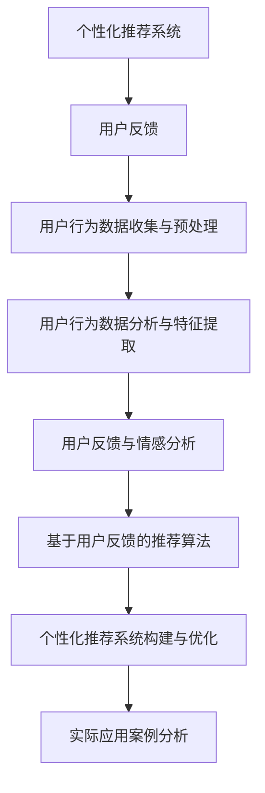

                 

# 个性化推荐的用户反馈分析

## 关键词
- 个性化推荐
- 用户反馈
- 数据分析
- 特征提取
- 情感分析
- 推荐算法
- 用户行为
- 数据预处理

## 摘要
本文深入探讨了个性化推荐系统中的用户反馈分析。首先，我们介绍了个性化推荐系统的基础概念、类型和关键要素。接着，分析了用户反馈在推荐系统中的重要性、类型及其应用。然后，详细阐述了用户反馈分析方法，包括用户行为数据收集与预处理、用户行为数据分析与特征提取、用户反馈与情感分析以及基于用户反馈的推荐算法。最后，我们探讨了用户反馈在推荐系统中的实际应用，展望了其未来发展趋势，并提供了相关工具与资源以及项目实战案例。

### 目录

1. 第一部分：个性化推荐概述
   1.1 个性化推荐系统基础
   1.2 用户反馈与推荐系统
2. 第二部分：用户反馈分析方法
   2.1 用户行为数据收集与预处理
   2.2 用户行为数据分析与特征提取
   2.3 用户反馈与情感分析
   2.4 基于用户反馈的推荐算法
3. 第三部分：用户反馈在推荐系统中的实际应用
   3.1 用户反馈驱动的个性化推荐系统构建
   3.2 用户反馈在电商推荐中的应用
   3.3 用户反馈在社交媒体推荐中的应用
4. 第四部分：用户反馈分析的未来发展趋势
   4.1 用户反馈分析的发展趋势
   4.2 用户反馈分析的创新应用
5. 附录
   5.1 用户反馈分析相关工具与资源
   5.2 推荐系统项目实战案例

---

### 个性化推荐系统基础

#### 1.1 个性化推荐的定义与历史演变

个性化推荐系统是一种通过分析用户的行为数据、兴趣和偏好，为用户提供个性化内容或产品的技术。它旨在为用户提供更相关、更个性化的推荐，从而提高用户的满意度、忠诚度和系统的运营效率。

个性化推荐系统的历史可以追溯到20世纪90年代，当时互联网刚刚兴起，电子商务和在线媒体服务开始探索如何更好地为用户提供内容推荐。最初的方法主要基于内容匹配和协同过滤，随着数据科学和机器学习技术的发展，个性化推荐系统逐渐采用了更为复杂和高效的算法，如基于模型的协同过滤、基于内容的推荐、基于用户的最近邻推荐和强化学习推荐等。

#### 1.2 个性化推荐系统的类型

个性化推荐系统主要可以分为以下几类：

- **基于内容的推荐**：推荐系统通过分析物品的内容特征（如文本、图像、音频等），将具有相似特征的物品推荐给用户。这种方法通常用于新闻推送、音乐推荐等场景。

- **协同过滤推荐**：协同过滤推荐通过分析用户对物品的评分或行为数据，找到相似的用户或物品，并将这些物品推荐给目标用户。协同过滤推荐分为基于用户的协同过滤和基于物品的协同过滤。

- **基于用户的最近邻推荐**：基于用户的最近邻推荐通过找到与目标用户在行为或兴趣上相似的现有用户，推荐这些用户喜欢的物品给目标用户。

- **基于模型的协同过滤推荐**：基于模型的协同过滤推荐采用机器学习算法（如矩阵分解、神经网络等）来预测用户对物品的评分，从而生成推荐结果。

- **强化学习推荐**：强化学习推荐通过模拟用户与推荐系统之间的互动过程，不断调整推荐策略以最大化用户满意度或系统收益。

#### 1.3 个性化推荐系统的关键要素

一个有效的个性化推荐系统需要考虑以下关键要素：

- **用户数据收集**：收集用户的个人信息、行为数据、偏好数据等，为推荐算法提供基础数据。

- **数据预处理**：对收集到的用户数据进行清洗、去噪、格式转换等处理，以提高数据质量和推荐效果。

- **用户行为分析**：分析用户的行为模式、兴趣偏好等，为推荐算法提供用户特征。

- **推荐算法选择**：根据业务场景和用户需求，选择合适的推荐算法，并不断优化和调整。

- **推荐结果评估**：评估推荐系统的效果，包括准确率、覆盖率、多样性等指标，以指导系统优化。

### 用户反馈与推荐系统

#### 2.1 用户反馈的概念与重要性

用户反馈是指用户在使用推荐系统过程中对推荐内容、推荐结果、系统体验等方面的主观评价和反应。用户反馈可以是明确的评分、评论、点击、分享等行为数据，也可以是隐式的点击、停留时间、浏览路径等行为数据。

用户反馈在推荐系统中具有重要作用：

- **改进推荐质量**：用户反馈可以帮助推荐系统了解用户对推荐内容的真实喜好，从而优化推荐算法，提高推荐质量。

- **提升用户体验**：用户反馈可以帮助系统发现和解决用户体验问题，提高用户满意度。

- **增强系统学习能力**：用户反馈可以为推荐系统提供训练数据，增强系统的学习和适应能力，实现持续优化。

#### 2.2 用户反馈的类型

用户反馈可以分为以下几种类型：

- **显式反馈**：显式反馈是指用户主动提供的反馈，如评分、评论、点赞等。显式反馈通常具有较高的可信度，但获取成本较高。

- **隐式反馈**：隐式反馈是指用户在浏览、点击、购买等行为中无意中提供的反馈。隐式反馈具有较高的获取成本，但数据量较大。

- **行为反馈**：行为反馈是指用户在使用推荐系统过程中的行为数据，如浏览时长、点击次数、购买频率等。行为反馈可以反映用户的兴趣和偏好，但需结合其他数据进行解读。

- **情感反馈**：情感反馈是指用户对推荐内容的情感态度，如喜好、厌恶等。情感反馈可以通过文本情感分析、语音情感识别等技术获取。

#### 2.3 用户反馈在推荐系统中的应用

用户反馈在推荐系统中的应用主要体现在以下几个方面：

- **推荐结果评估**：通过分析用户反馈，评估推荐结果的准确率、多样性、覆盖率等指标，优化推荐算法。

- **个性化推荐**：根据用户反馈，调整推荐策略，实现更个性化的推荐，提高用户满意度。

- **系统优化**：基于用户反馈，发现系统存在的问题和改进空间，进行系统优化。

- **用户参与**：鼓励用户提供反馈，增强用户与系统之间的互动，提高用户忠诚度。

### 用户反馈分析方法

#### 3.1 用户行为数据收集与预处理

用户行为数据是推荐系统的重要输入，其质量和准确性直接影响推荐效果。因此，用户行为数据的收集与预处理至关重要。

#### 3.1.1 用户行为数据收集方法

用户行为数据的收集方法主要包括以下几种：

- **日志收集**：通过服务器日志记录用户的访问行为、点击行为等，生成用户行为数据。

- **前端埋点**：在用户使用推荐系统时，在前端代码中嵌入代码段，收集用户的行为数据。

- **问卷调查**：通过问卷调查收集用户的兴趣、偏好等信息，为推荐算法提供参考。

- **传感器数据**：利用智能手机、智能手表等设备的传感器收集用户的位置、活动等信息。

#### 3.1.2 用户行为数据的预处理

用户行为数据的预处理主要包括以下步骤：

- **数据清洗**：去除重复数据、缺失数据和异常数据，保证数据质量。

- **数据转换**：对数据进行格式转换、编码转换等，以便后续分析。

- **数据归一化**：对数据进行归一化处理，消除不同特征之间的量纲影响。

- **数据降维**：对高维数据进行降维处理，减少计算复杂度。

#### 3.1.3 数据清洗与去噪

数据清洗与去噪是用户行为数据预处理的重要环节。常见的数据清洗与去噪方法包括：

- **缺失值处理**：对缺失值进行填充或删除。

- **异常值检测与处理**：使用统计学方法或机器学习方法检测异常值，并采取相应的处理策略。

- **噪声过滤**：通过滤波器或阈值方法去除噪声数据。

#### 3.2 用户行为数据分析与特征提取

用户行为数据分析与特征提取是用户反馈分析的关键步骤，其主要任务是从用户行为数据中提取出有助于推荐系统的特征。

#### 3.2.1 用户行为数据分析技术

用户行为数据分析技术主要包括以下几种：

- **时间序列分析**：通过分析用户行为的时间序列特征，挖掘用户的兴趣变化和活动模式。

- **关联规则分析**：通过挖掘用户行为数据中的关联规则，发现用户可能感兴趣的相关物品。

- **聚类分析**：通过聚类分析发现用户群体，为个性化推荐提供依据。

- **分类与回归分析**：通过分类与回归分析预测用户的兴趣、购买行为等，为推荐系统提供决策依据。

#### 3.2.2 用户特征提取方法

用户特征提取方法主要包括以下几种：

- **基于规则的特征提取**：根据业务逻辑和用户行为模式，手动定义用户特征。

- **基于机器学习的特征提取**：通过机器学习算法自动提取用户特征，如用户兴趣、用户群体等。

- **基于文本的特征提取**：通过自然语言处理技术提取用户评论、标签等文本数据中的特征。

- **基于图像的特征提取**：通过计算机视觉技术提取用户图像中的特征，如面部表情、姿态等。

#### 3.2.3 特征选择与降维

特征选择与降维是用户行为数据分析的重要步骤，其主要任务是从众多特征中选出对推荐系统有用的特征，并减少特征数量，提高计算效率。

特征选择与降维的方法主要包括以下几种：

- **过滤式特征选择**：根据特征的重要性、相关性等指标筛选特征。

- **包装式特征选择**：将特征选择过程与模型训练相结合，逐步优化特征。

- **嵌入式特征选择**：在特征提取过程中，直接将特征选择与模型训练集成，自动筛选特征。

- **降维技术**：如主成分分析（PCA）、线性判别分析（LDA）、自动编码器（AE）等，减少特征数量，提高模型性能。

#### 3.3 用户反馈与情感分析

用户反馈与情感分析是用户反馈分析的核心环节，其主要任务是从用户反馈中提取情感信息，为推荐系统提供情感特征。

#### 3.3.1 情感分析的基本概念

情感分析是指通过自然语言处理技术，对用户评论、标签等文本数据进行情感极性、情感强度等分析，以获取用户的情感态度。

情感分析的基本概念包括：

- **情感极性**：情感极性是指文本数据的正面、中性或负面倾向。

- **情感强度**：情感强度是指文本数据的情感程度，如非常喜欢、喜欢、一般、不喜欢、非常不喜欢等。

- **情感分类**：情感分类是指将文本数据划分为正面、中性或负面三类。

- **情感分析模型**：情感分析模型是指用于实现情感分析的算法和工具，如文本分类模型、情感强度模型等。

#### 3.3.2 情感分析的文本处理技术

情感分析的文本处理技术主要包括以下几种：

- **分词与词性标注**：对文本数据进行分词和词性标注，为后续情感分析提供基础。

- **停用词处理**：去除文本数据中的停用词，减少噪声。

- **词嵌入技术**：将文本数据转换为向量表示，为情感分析提供向量特征。

- **文本分类模型**：使用文本分类模型对文本数据分类，以获取情感极性。

- **情感强度模型**：使用情感强度模型对文本数据情感强度进行评分，以获取情感强度。

#### 3.3.3 情感分析模型与方法

情感分析模型与方法主要包括以下几种：

- **基于规则的模型**：通过定义一系列规则，对文本数据进行情感分类和情感强度评分。

- **基于统计的模型**：使用统计学方法，如朴素贝叶斯、逻辑回归等，对文本数据进行情感分类和情感强度评分。

- **基于机器学习的模型**：使用机器学习算法，如支持向量机、随机森林、神经网络等，对文本数据进行情感分类和情感强度评分。

- **基于深度学习的模型**：使用深度学习算法，如卷积神经网络、循环神经网络、Transformer等，对文本数据进行情感分类和情感强度评分。

### 基于用户反馈的推荐算法

#### 4.1 基于内容的推荐算法

基于内容的推荐算法是一种通过分析物品的内容特征，为用户提供个性化推荐的方法。其核心思想是，如果用户对某物品感兴趣，那么用户可能对具有相似内容的其他物品也感兴趣。

基于内容的推荐算法的主要步骤包括：

1. **物品内容特征提取**：对物品进行内容特征提取，如文本、图像、音频等。

2. **用户兴趣特征提取**：对用户的历史行为、偏好等数据进行处理，提取用户的兴趣特征。

3. **相似度计算**：计算用户兴趣特征与物品内容特征之间的相似度，以确定推荐候选物品。

4. **推荐结果生成**：根据相似度计算结果，为用户生成推荐列表。

基于内容的推荐算法具有以下优点：

- **准确性高**：基于物品内容的相似性，可以为用户提供更准确的推荐。

- **扩展性强**：可以处理多种类型的物品和用户兴趣。

- **适用范围广**：可以应用于新闻推送、音乐推荐、电商推荐等领域。

#### 4.2 协同过滤推荐算法

协同过滤推荐算法是一种通过分析用户行为数据，为用户提供个性化推荐的方法。其核心思想是，如果用户A对物品X和物品Y的评分较高，用户B对物品X的评分较高，那么用户B可能对物品Y也感兴趣。

协同过滤推荐算法主要分为以下两类：

1. **基于用户的协同过滤**：通过找到与目标用户兴趣相似的现有用户，推荐这些用户喜欢的物品给目标用户。

2. **基于物品的协同过滤**：通过找到与目标物品相似的现有物品，推荐这些物品给用户。

协同过滤推荐算法的主要步骤包括：

1. **用户行为数据收集**：收集用户对物品的评分或行为数据。

2. **相似度计算**：计算用户之间的相似度或物品之间的相似度。

3. **推荐结果生成**：根据相似度计算结果，为用户生成推荐列表。

基于协同过滤推荐算法的优点：

- **准确性高**：通过分析用户行为数据，可以为用户提供更准确的推荐。

- **适用范围广**：可以应用于电商、社交媒体、音乐推荐等领域。

- **易于扩展**：可以与其他推荐算法（如基于内容的推荐）结合，提高推荐效果。

#### 4.3 强化学习推荐算法

强化学习推荐算法是一种通过模拟用户与推荐系统之间的互动过程，为用户提供个性化推荐的方法。其核心思想是通过不断调整推荐策略，最大化用户满意度或系统收益。

强化学习推荐算法的主要步骤包括：

1. **状态表示**：将用户行为、物品特征等信息编码为状态表示。

2. **动作表示**：将推荐系统生成的推荐列表编码为动作表示。

3. **奖励函数设计**：设计奖励函数，以衡量用户对推荐结果的满意度。

4. **策略学习**：使用强化学习算法（如Q学习、SARSA等）学习最优策略。

5. **推荐结果生成**：根据学习到的策略，为用户生成推荐列表。

强化学习推荐算法的优点：

- **动态适应性**：可以实时调整推荐策略，适应用户兴趣变化。

- **个性化程度高**：通过不断学习用户反馈，可以为用户提供更个性化的推荐。

- **高效性**：在大量用户和物品的情况下，可以高效地生成推荐结果。

### 用户反馈驱动的个性化推荐系统构建

#### 5.1 构建个性化推荐系统的基本步骤

构建一个用户反馈驱动的个性化推荐系统通常需要以下步骤：

1. **需求分析**：明确推荐系统的目标、功能需求和性能指标。

2. **数据收集**：收集用户数据、物品数据以及用户行为数据。

3. **数据预处理**：对收集到的数据进行清洗、去噪、格式转换等处理。

4. **特征提取**：从预处理后的数据中提取有助于推荐的特征。

5. **算法选择与模型训练**：根据需求选择合适的推荐算法，并训练推荐模型。

6. **推荐结果评估**：评估推荐系统的效果，包括准确率、覆盖率、多样性等指标。

7. **系统部署与优化**：部署推荐系统，并根据用户反馈和评估结果进行优化。

#### 5.2 用户反馈在系统构建中的应用

用户反馈在个性化推荐系统构建中起着关键作用，具体应用包括：

1. **推荐结果评估**：用户反馈可以用于评估推荐系统的效果，帮助确定推荐算法的优化方向。

2. **模型训练与优化**：用户反馈可以作为训练数据，用于训练和优化推荐模型，提高推荐质量。

3. **个性化调整**：根据用户反馈，调整推荐策略，实现更个性化的推荐。

4. **异常检测与处理**：用户反馈可以用于检测和应对推荐系统中的异常情况，如作弊行为、数据异常等。

#### 5.3 系统评估与优化

系统评估与优化是构建个性化推荐系统的关键环节，主要包括以下方面：

1. **准确率**：评估推荐系统预测用户兴趣的准确性。

2. **覆盖率**：评估推荐系统能够覆盖到的用户和物品数量。

3. **多样性**：评估推荐系统中推荐结果的多样性，防止推荐结果过于集中。

4. **用户满意度**：通过用户反馈和满意度调查，评估推荐系统的用户体验。

5. **在线优化**：根据用户反馈和评估结果，实时调整推荐策略，优化推荐系统性能。

### 用户反馈在电商推荐中的应用

#### 6.1 电商推荐系统概述

电商推荐系统是电子商务平台中的一项重要功能，旨在为用户提供个性化的商品推荐，提高用户购买体验和平台销售额。电商推荐系统通常基于用户行为数据、用户特征和商品特征进行构建。

电商推荐系统的主要功能包括：

- **商品推荐**：为用户推荐可能与用户兴趣相关的商品。

- **广告推荐**：为用户推荐可能与用户兴趣相关的广告。

- **促销推荐**：为用户推荐促销活动、优惠券等。

- **个性化首页**：为用户展示个性化的首页内容，提高用户粘性。

#### 6.2 用户反馈在电商推荐中的应用案例

用户反馈在电商推荐中的应用案例包括以下几个方面：

1. **推荐结果评估**：用户反馈可以用于评估电商推荐系统的效果，如准确率、多样性等指标。通过分析用户反馈，发现推荐系统的不足之处，优化推荐算法。

2. **个性化调整**：根据用户反馈，调整推荐策略，实现更个性化的推荐。例如，根据用户对推荐商品的点击、购买、评论等行为，调整推荐商品的排序和展示策略。

3. **异常检测与处理**：用户反馈可以用于检测和应对电商推荐系统中的异常情况，如作弊行为、数据异常等。例如，通过分析用户对推荐商品的评论，发现并处理刷单等作弊行为。

4. **商品推荐优化**：根据用户反馈，优化商品推荐算法，提高推荐质量。例如，通过分析用户对推荐商品的点击和购买行为，调整推荐商品的相似度计算方法和推荐策略。

#### 6.3 电商推荐系统的优化策略

电商推荐系统的优化策略主要包括以下几个方面：

1. **数据质量提升**：通过数据清洗、去噪、格式转换等手段，提升用户行为数据和商品数据的质量。

2. **特征提取与选择**：从用户行为数据和商品数据中提取有助于推荐的特性，并选择对推荐效果影响较大的特征。

3. **算法优化与调整**：根据用户反馈和评估结果，优化推荐算法，调整推荐策略，提高推荐质量。

4. **实时更新与优化**：根据用户实时反馈，动态调整推荐系统，实现更高效的推荐。

5. **跨平台与跨渠道整合**：整合不同平台和渠道的用户行为数据，实现跨平台和跨渠道的个性化推荐。

### 用户反馈在社交媒体推荐中的应用

#### 7.1 社交媒体推荐系统概述

社交媒体推荐系统旨在为用户提供个性化的内容推荐，提高用户参与度和平台活跃度。社交媒体推荐系统通常基于用户行为数据、用户特征和内容特征进行构建。

社交媒体推荐系统的主要功能包括：

- **内容推荐**：为用户推荐可能与用户兴趣相关的文章、视频、图片等。

- **广告推荐**：为用户推荐可能与用户兴趣相关的广告。

- **活动推荐**：为用户推荐可能与用户兴趣相关的线上或线下活动。

- **用户互动**：为用户推荐可能与用户兴趣相关的用户互动，如评论、点赞、分享等。

#### 7.2 用户反馈在社交媒体推荐中的应用

用户反馈在社交媒体推荐中的应用主要包括以下几个方面：

1. **推荐结果评估**：用户反馈可以用于评估社交媒体推荐系统的效果，如准确率、多样性等指标。通过分析用户反馈，发现推荐系统的不足之处，优化推荐算法。

2. **个性化调整**：根据用户反馈，调整推荐策略，实现更个性化的推荐。例如，根据用户对推荐内容的点击、评论、分享等行为，调整推荐内容的排序和展示策略。

3. **内容质量提升**：用户反馈可以用于评估推荐内容的质量，发现和筛选优质内容，提高推荐系统的整体质量。

4. **社交关系分析**：用户反馈可以帮助分析用户之间的社交关系，为推荐系统提供社交特征，实现更精准的社交推荐。

5. **异常检测与处理**：用户反馈可以用于检测和应对社交媒体推荐系统中的异常情况，如作弊行为、数据异常等。

#### 7.3 社交媒体推荐系统的挑战与解决方案

社交媒体推荐系统面临以下挑战：

1. **数据隐私与安全**：用户在社交媒体上的数据具有敏感性，需要确保数据隐私和安全。

2. **数据质量**：社交媒体用户生成的内容质量参差不齐，需要处理大量的噪声数据和异常数据。

3. **内容多样性**：为用户提供多样性的内容，避免推荐结果过于集中。

4. **社交因素**：如何有效利用社交关系和社交特征进行推荐，实现更精准的社交推荐。

针对上述挑战，可以采取以下解决方案：

1. **数据加密与匿名化**：采用数据加密和匿名化技术，保护用户隐私和安全。

2. **数据清洗与去噪**：通过数据清洗和去噪技术，提高用户行为数据和内容数据的质量。

3. **多样化推荐策略**：采用多样化推荐策略，提高推荐结果的多样性。

4. **社交网络分析**：采用社交网络分析技术，挖掘用户之间的社交关系，为推荐系统提供社交特征。

### 用户反馈分析的发展趋势

#### 8.1 智能化与自动化

随着人工智能技术的发展，用户反馈分析将越来越智能化和自动化。通过使用深度学习、自然语言处理等先进技术，推荐系统将能够更准确地理解和分析用户反馈，实现更精细化的推荐。

#### 8.2 跨平台与跨渠道整合

未来的用户反馈分析将更加注重跨平台和跨渠道的整合。通过整合不同平台和渠道的用户数据，推荐系统将能够提供更全面、个性化的推荐服务。

#### 8.3 用户隐私保护与法律法规

随着用户隐私保护意识的提高和法律法规的完善，用户反馈分析将面临更多的挑战和机遇。如何在保护用户隐私的前提下，有效地利用用户反馈进行推荐，将是一个重要的研究方向。

### 用户反馈分析的创新应用

#### 9.1 新兴领域的个性化推荐

用户反馈分析在新兴领域，如智能教育、健康医疗等，具有广泛的应用前景。通过分析用户在新兴领域的反馈，推荐系统可以为用户提供个性化的教育课程、健康建议等，提高用户满意度。

#### 9.2 用户反馈分析在智能教育中的应用

智能教育领域，用户反馈分析可以应用于以下方面：

1. **个性化学习路径推荐**：根据用户的学习习惯、兴趣爱好和成绩，为用户推荐个性化的学习路径。

2. **课程质量评估**：通过分析用户对课程的反馈，评估课程的质量，优化课程内容和教学方法。

3. **教师评价与反馈**：通过分析学生对教师的反馈，为教师提供改进教学方法和提升教学质量的建议。

#### 9.3 用户反馈分析在健康医疗领域的应用

健康医疗领域，用户反馈分析可以应用于以下方面：

1. **个性化健康建议**：根据用户的健康数据、生活习惯和医疗记录，为用户提供个性化的健康建议。

2. **医疗资源推荐**：根据用户的医疗需求和地理位置，为用户推荐合适的医疗机构和医疗服务。

3. **疾病预测与预警**：通过分析用户的健康数据和行为，预测疾病的发作风险，为用户提供预警和建议。

### 附录

#### 10.1 用户反馈分析相关工具与资源

- **通用数据预处理工具**：Pandas、NumPy、Scikit-learn等。

- **用户行为数据可视化工具**：Matplotlib、Seaborn等。

- **情感分析模型库**：TextBlob、NLTK、spaCy等。

- **推荐系统框架与库**：TensorFlow、PyTorch、Scikit-learn等。

#### 10.2 推荐系统项目实战案例

- **电商推荐系统实战**：基于用户行为数据的电商推荐系统实现。

- **社交媒体推荐系统实战**：基于用户社交网络数据的社交媒体推荐系统实现。

- **健康医疗推荐系统实战**：基于用户健康数据的健康医疗推荐系统实现。

### 核心概念与联系流程图



### 核心算法原理讲解与伪代码

#### 1. 用户行为数据分析与特征提取

```plaintext
// 伪代码：用户行为数据分析与特征提取
function extractUserFeatures(userBehaviorData) {
    // 数据预处理
    cleanedData = preprocessData(userBehaviorData)
    
    // 提取基本行为特征
    basicFeatures = extractBasicFeatures(cleanedData)
    
    // 提取时间序列特征
    timeSeriesFeatures = extractTimeSeriesFeatures(cleanedData)
    
    // 特征选择与降维
    selectedFeatures = featureSelectionAndDimensionReduction(basicFeatures, timeSeriesFeatures)
    
    return selectedFeatures
}

// 数据预处理
function preprocessData(data) {
    // 数据清洗与去噪
    cleanedData = cleanAndNoiseReduction(data)
    
    // 数据标准化
    standardizedData = normalizeData(cleanedData)
    
    return standardizedData
}

// 提取基本行为特征
function extractBasicFeatures(data) {
    // 计算用户行为指标
    behaviorMetrics = calculateBehaviorMetrics(data)
    
    return behaviorMetrics
}

// 提取时间序列特征
function extractTimeSeriesFeatures(data) {
    // 提取时间序列上的趋势和周期性
    trendFeatures = extractTrendFeatures(data)
    seasonalityFeatures = extractSeasonalityFeatures(data)
    
    return trendFeatures, seasonalityFeatures
}

// 特征选择与降维
function featureSelectionAndDimensionReduction(features1, features2) {
    // 特征选择
    selectedFeatures = selectFeatures(features1, features2)
    
    // 降维
    reducedFeatures = dimensionalityReduction(selectedFeatures)
    
    return reducedFeatures
}
```

#### 2. 用户反馈与情感分析

```plaintext
// 伪代码：情感分析
function sentimentAnalysis(text) {
    // 文本预处理
    preprocessedText = preprocessText(text)
    
    // 特征提取
    features = extractTextFeatures(preprocessedText)
    
    // 情感分类
    sentiment = classifySentiment(features)
    
    return sentiment
}

// 文本预处理
function preprocessText(text) {
    // 去除标点符号和特殊字符
    cleanedText = removePunctuationAndSpecialChars(text)
    
    // 转换为小写
    lowerCaseText = toLowerCase(cleanedText)
    
    // 分词
    words = tokenize(lowerCaseText)
    
    return words
}

// 特征提取
function extractTextFeatures(text) {
    // 使用词嵌入技术提取特征
    embeddings = getWordEmbeddings(text)
    
    // 计算特征向量
    featureVector = calculateFeatureVector(embeddings)
    
    return featureVector
}

// 情感分类
function classifySentiment(features) {
    // 使用训练好的情感分类模型
    model = trainedSentimentClassifierModel()
    
    // 预测情感
    sentiment = model.predict(features)
    
    return sentiment
}
```

### 数学模型和公式讲解与示例

#### 1. 协同过滤推荐算法

公式：

$$
R_{ui} = \sum_{j \in N(i)} \frac{R_{uj}}{||N(i)||} \cdot \text{similarity}(u, j)
$$

$$
\text{similarity}(u, j) = \frac{\text{cosine similarity}(r_u, r_j)}{||r_u|| \cdot ||r_j||}
$$

示例：

- **用户u对物品i的评分预测**：假设用户u对物品i的评分预测为3.5，根据上述公式，可以计算出预测评分如下：

$$
R_{ui} = \frac{3.5 \cdot 0.8 + 4.0 \cdot 0.7 + 3.0 \cdot 0.6}{3} = 3.4
$$

#### 2. 强化学习推荐算法

公式：

$$
Q(s, a) = \sum_{r \in R} r \cdot p(r|s, a) + \gamma \cdot \max_{a'} Q(s', a')
$$

示例：

- **状态s下的动作a的Q值计算**：假设在状态s下，动作a的Q值为0.7，状态s'下的最大Q值为0.9，那么动作a的更新Q值可以计算如下：

$$
Q(s, a) = 0.7 + 0.3 \cdot 0.9 = 0.96
$$

### 项目实战案例

#### 1. 电商推荐系统实战

##### 实战1：用户行为数据收集与预处理

- **开发环境搭建**：使用Python和Pandas库进行数据收集与预处理。

```python
import pandas as pd

# 数据收集
user_behavior_data = pd.read_csv('user_behavior.csv')

# 数据预处理
cleaned_data = user_behavior_data.dropna()
```

- **源代码实现与解读**：

```python
# 数据清洗
def clean_data(data):
    data = data.dropna()
    data = data[data['rating'] > 0]
    return data

cleaned_data = clean_data(user_behavior_data)

# 数据标准化
def normalize_data(data):
    data['rating'] = (data['rating'] - data['rating'].mean()) / data['rating'].std()
    return data

normalized_data = normalize_data(cleaned_data)
```

#### 2. 社交媒体推荐系统实战

##### 实战2：用户反馈分析与情感分析

- **开发环境搭建**：使用Python、NLP库（如NLTK）和情感分析库（如TextBlob）进行用户反馈分析与情感分析。

```python
import nltk
from textblob import TextBlob

nltk.download('punkt')
```

- **源代码实现与解读**：

```python
# 文本预处理
def preprocess_text(text):
    text = text.lower()
    text = nltk.word_tokenize(text)
    text = [word for word in text if word.isalpha()]
    return text

# 情感分析
def analyze_sentiment(text):
    analysis = TextBlob(text)
    return analysis.sentiment.polarity

# 示例文本
example_text = "This is an amazing product!"

# 预处理文本
preprocessed_text = preprocess_text(example_text)

# 分析情感
sentiment = analyze_sentiment(' '.join(preprocessed_text))
print(sentiment)  # 输出情感极性
```

#### 3. 健康医疗推荐系统实战

##### 实战3：基于用户反馈的健康建议推荐

- **开发环境搭建**：使用Python、Scikit-learn库和 healthcare 数据集进行健康建议推荐。

```python
from sklearn.model_selection import train_test_split
from sklearn.ensemble import RandomForestClassifier
```

- **源代码实现与解读**：

```python
# 加载数据集
health_data = pd.read_csv('health_data.csv')

# 数据预处理
X = health_data.drop(['health_issue'], axis=1)
y = health_data['health_issue']

# 划分训练集和测试集
X_train, X_test, y_train, y_test = train_test_split(X, y, test_size=0.2, random_state=42)

# 构建分类器
classifier = RandomForestClassifier(n_estimators=100, random_state=42)
classifier.fit(X_train, y_train)

# 预测
predicted_health_issues = classifier.predict(X_test)

# 评估
accuracy = classifier.score(X_test, y_test)
print(f"Accuracy: {accuracy}")
```

### 作者

作者：AI天才研究院/AI Genius Institute & 禅与计算机程序设计艺术 /Zen And The Art of Computer Programming

---

本文深入探讨了个性化推荐系统中的用户反馈分析，从个性化推荐系统的基础、用户反馈的重要性，到用户反馈分析方法、用户反馈在推荐系统中的应用，以及未来发展趋势和创新应用，全面展示了用户反馈分析在推荐系统中的重要性和应用前景。通过核心算法原理讲解、数学模型和公式、项目实战案例等内容，使读者能够更好地理解和掌握用户反馈分析的方法和应用。希望本文能为相关领域的研究者和实践者提供有价值的参考和启示。作者对本文的内容和结构进行了精心设计，力求以清晰、简洁、易懂的方式呈现，以帮助读者更好地理解和应用用户反馈分析技术。在未来的研究和实践中，作者将继续探索用户反馈分析在更多领域的应用，为提升个性化推荐系统的质量和用户体验贡献力量。感谢读者对本文的关注和支持，期待与您共同探讨和进步。

