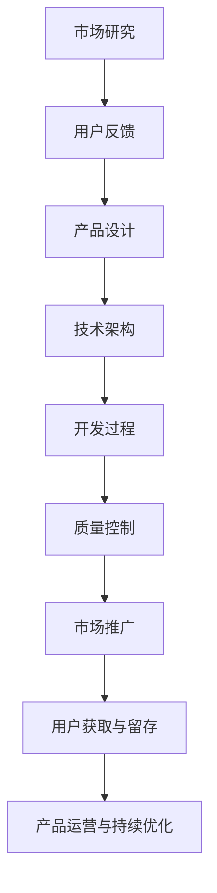

                 

# 产品或服务开发：从MVP到完整解决方案

> **关键词：** 产品开发、MVP、敏捷开发、市场研究、用户反馈、技术架构、质量控制、市场推广、用户留存、产品运营

> **摘要：** 本文将深入探讨产品或服务开发的过程，从最小可行产品（MVP）的构建到完整解决方案的开发，涵盖市场研究、用户反馈收集、敏捷开发方法、技术架构设计、质量控制和市场推广等关键环节。通过一步步的分析和推理，本文旨在帮助读者理解和掌握产品开发的本质，实现从概念到市场的完美过渡。

### 第一部分：产品或服务开发的基础知识

在产品或服务开发的初始阶段，我们需要理解一些基础知识，这些知识将为我们后续的工作奠定坚实的基础。本部分将介绍MVP的概念与构建方法、市场研究与用户反馈、以及敏捷开发与迭代改进的核心概念。

#### 第1章：MVP的概念与构建方法

**1.1 MVP的定义与重要性**

MVP（最小可行产品）是指具有足够功能，能够在真实用户环境中进行测试和验证的最小产品版本。它不是最终产品，而是用于验证产品概念、获取用户反馈和快速迭代的基础。

- **定义**：MVP是一个包含核心功能的产品版本，足以展示其价值，但不需要包含所有预期功能。
- **重要性**：MVP的重要性在于它能够帮助团队快速验证产品概念，降低研发成本和风险。

**1.2 如何构建MVP**

构建MVP的步骤如下：

1. **确定核心功能**：首先，我们需要确定产品最核心的功能，这些功能必须能够解决用户的主要问题。
2. **最小化非必要功能**：删除所有非必要的功能，以降低开发成本和时间。
3. **设计用户界面**：设计一个简单直观的用户界面，确保用户能够轻松使用产品。
4. **快速开发**：采用敏捷开发方法，快速构建MVP原型。
5. **测试与反馈**：在真实用户环境中测试MVP，收集用户反馈，进行迭代改进。

**MVP的关键要素**：

- **可行性**：确保MVP能够在实际环境中运行。
- **可验证性**：MVP必须能够验证产品的核心价值。
- **灵活性**：MVP的设计应该允许快速迭代和改进。

**实例分析：如何通过MVP验证产品概念**

假设我们想要开发一款在线教育平台。在构建MVP时，我们可以首先提供一个简单的课程列表和在线支付功能，让用户可以在线购买课程。通过这个简单的功能，我们可以验证以下几个关键问题：

1. 是否有用户愿意为在线课程支付费用？
2. 用户对课程内容和购买流程是否满意？
3. 是否有用户愿意推荐给其他潜在用户？

通过这些问题，我们可以快速了解产品的市场需求和潜在问题，从而为后续的开发工作提供重要参考。

#### 第2章：市场研究与用户反馈

**2.1 市场研究的步骤与方法**

市场研究是产品开发的重要环节，它有助于我们了解市场需求和潜在用户，从而为产品设计和开发提供指导。

- **核心目的**：市场研究的主要目的是确定目标市场、用户需求和竞争对手情况。
- **步骤**：

  1. **确定研究目标**：明确市场研究的具体目标，如了解市场需求、用户喜好、竞争对手分析等。
  2. **设计研究方法**：根据研究目标选择合适的研究方法，如问卷调查、访谈、焦点小组讨论等。
  3. **收集数据**：通过设计的研究方法收集相关数据。
  4. **分析数据**：对收集到的数据进行统计分析，得出有意义的结论。

- **方法**：

  - **定量研究**：通过问卷调查、在线调查等方法收集大量数据，进行统计分析。
  - **定性研究**：通过访谈、焦点小组讨论等方法深入了解用户的想法和需求。

**2.2 用户反馈的收集与分析**

用户反馈是产品改进的重要依据，通过分析用户反馈，我们可以了解产品的优点和不足，从而进行有针对性的优化。

- **重要性**：用户反馈能够帮助我们了解用户的需求和满意度，从而改进产品。

- **收集渠道**：

  1. **用户调研**：通过问卷调查、访谈等方式收集用户反馈。
  2. **用户行为数据**：通过分析用户行为数据（如使用频率、用户留存率等）了解用户对产品的使用情况。
  3. **社交媒体和社区**：通过社交媒体和用户社区收集用户反馈。

- **分析方法**：

  1. **统计分析**：对收集到的用户反馈进行统计分析，识别常见问题和趋势。
  2. **文本分析**：对用户反馈文本进行情感分析和主题分析，了解用户的情感和需求。
  3. **案例研究**：针对特定用户案例进行深入分析，了解用户的实际需求和问题。

#### 第3章：敏捷开发与迭代改进

**3.1 敏捷开发方法论**

敏捷开发是一种以用户需求为核心的软件开发方法，其核心理念是快速响应变化，持续交付有价值的软件。

- **核心原则**：

  1. **以用户为中心**：始终关注用户需求和满意度。
  2. **快速迭代**：通过频繁的迭代和交付，确保产品持续改进。
  3. **团队协作**：强调团队成员之间的沟通和合作。
  4. **适应性**：灵活应对变化，快速调整计划和策略。

- **主要流程**：

  1. **需求收集**：与用户和利益相关者沟通，收集产品需求。
  2. **规划与优先级排序**：根据需求制定开发计划和优先级。
  3. **迭代开发**：按照计划进行迭代开发，每个迭代周期通常为1-4周。
  4. **测试与反馈**：在每个迭代结束时进行测试，收集用户反馈，为下一轮迭代提供改进方向。

**3.2 迭代改进的关键技巧**

- **快速响应市场变化**：

  1. **短期规划**：制定短期开发计划，确保产品能够快速迭代。
  2. **灵活调整**：根据市场需求和用户反馈，及时调整开发计划。

- **持续优化产品功能**：

  1. **定期回顾**：在每个迭代结束时进行回顾，总结经验和教训，持续改进开发流程。
  2. **用户反馈**：积极收集用户反馈，根据用户需求调整产品功能。

通过以上分析，我们可以看到产品或服务开发的基础知识对于整个开发过程至关重要。在下一部分中，我们将深入探讨从MVP到完整解决方案的开发过程，进一步了解产品开发的实际操作。在接下来的内容中，我们将继续分析MVP验证成功的标准、从MVP到完整解决方案的扩展，以及产品设计与功能规划、技术架构与系统设计等关键环节。请继续关注接下来的内容。

---

**下一篇：从MVP到完整解决方案的开发过程**

- **第4章：MVP到完整解决方案的过渡**
- **第5章：产品设计与功能规划**
- **第6章：技术架构与系统设计**

在下一篇文章中，我们将继续深入探讨产品开发的过程，详细分析每个阶段的实施方法和关键技巧。敬请期待！<|assistant|>### 第二部分：从MVP到完整解决方案的开发过程

在成功验证了产品概念并获得了初步的用户反馈后，我们需要将MVP扩展为完整的解决方案。这一部分将介绍MVP到完整解决方案的过渡、产品设计与功能规划、技术架构与系统设计等关键环节，帮助读者了解如何将一个初步的原型转变为一个成熟的产品。

#### 第4章：MVP到完整解决方案的过渡

**4.1 MVP验证成功的标准**

在将MVP扩展为完整解决方案之前，我们需要确保MVP已经验证了其成功的关键指标。

- **成功的MVP指标**：

  1. **用户满意度**：用户对MVP的满意度是否高，是否有积极的反馈。
  2. **市场需求**：MVP是否满足了市场需求，是否有足够的用户量。
  3. **商业可行性**：MVP是否具备商业可行性，是否能够带来预期的收入。
  4. **技术可行性**：MVP的技术实现是否可行，是否能够扩展到更复杂的功能。

- **如何评估MVP的成果**：

  1. **用户调研**：通过问卷调查、访谈等方式收集用户对MVP的评价。
  2. **数据分析**：分析用户行为数据，如使用频率、留存率等。
  3. **财务分析**：评估MVP带来的收入和成本，确定其商业可行性。

**4.2 从MVP到完整解决方案的扩展**

MVP的成功验证是扩展为完整解决方案的起点。以下步骤可以帮助我们实现这一过渡：

- **扩展MVP的核心步骤**：

  1. **确定扩展方向**：根据用户反馈和市场分析，确定产品需要扩展的功能和特性。
  2. **优先级排序**：根据用户需求和商业目标，对扩展功能进行优先级排序。
  3. **设计扩展方案**：制定详细的设计方案，包括技术选型、功能实现等。
  4. **开发与测试**：按照设计方案进行开发，并进行严格的测试，确保新功能的稳定性和可靠性。
  5. **用户反馈**：在扩展功能上线后，收集用户反馈，进行迭代优化。

- **如何制定扩展计划**：

  1. **制定时间表**：根据扩展功能的重要性和优先级，制定详细的开发时间表。
  2. **资源分配**：合理分配开发资源，确保项目按计划进行。
  3. **风险管理**：识别项目风险，制定相应的应对措施。
  4. **监控与评估**：在整个扩展过程中，定期监控项目进展，评估扩展效果。

#### 第5章：产品设计与功能规划

完整的解决方案需要清晰的产品设计和功能规划。这一部分将介绍产品设计的核心原则、功能规划的方法以及功能优先级排序的关键因素。

**5.1 产品设计的核心原则**

- **以用户为中心的设计**：

  产品设计应该始终围绕用户的需求和体验进行。以下是一些关键原则：

  1. **用户体验**：确保产品的用户体验简单、直观和愉悦。
  2. **用户需求**：深入了解用户需求，确保产品满足用户的实际需求。
  3. **用户反馈**：积极收集用户反馈，并根据用户反馈进行产品改进。

- **设计的流程**：

  1. **需求分析**：收集和分析用户需求，确定产品功能。
  2. **原型设计**：基于需求分析，设计产品原型。
  3. **用户测试**：在原型设计阶段进行用户测试，收集用户反馈。
  4. **迭代优化**：根据用户反馈，对设计进行迭代优化。

**5.2 功能规划与优先级排序**

功能规划是确保产品开发有序进行的关键步骤。以下方法可以帮助我们进行功能规划和优先级排序：

- **功能规划的方法**：

  1. **用户故事地图**：通过用户故事地图，将用户需求转化为具体的功能。
  2. **需求文档**：编写详细的需求文档，明确每个功能的需求和实现细节。
  3. **产品路线图**：制定产品的发展路线图，明确每个阶段的目标和任务。

- **功能优先级排序的关键因素**：

  1. **用户需求**：优先考虑用户最迫切的需求。
  2. **商业价值**：优先考虑具有较高商业价值的特性。
  3. **技术实现**：考虑功能实现的技术难度和成本。
  4. **风险因素**：考虑功能实现可能带来的风险。

#### 第6章：技术架构与系统设计

技术架构与系统设计是确保产品稳定性和可扩展性的关键。以下部分将介绍技术选型与架构设计的关键要素、系统设计的要点以及如何确保系统的稳定性和可扩展性。

**6.1 技术选型与架构设计**

- **技术选型的考虑因素**：

  1. **业务需求**：选择能够满足业务需求的技术。
  2. **性能要求**：选择高性能的技术，确保产品能够处理高并发和大数据。
  3. **可扩展性**：选择可扩展的技术，确保产品能够支持未来增长。
  4. **安全性**：选择安全可靠的技术，确保产品的数据安全和用户隐私。
  5. **社区与支持**：选择有活跃社区和良好支持的技术。

- **架构设计的关键要素**：

  1. **模块化**：将系统划分为多个模块，每个模块负责特定的功能。
  2. **松耦合**：模块之间保持松耦合，降低模块之间的依赖性。
  3. **高内聚**：每个模块内部保持高内聚，确保模块功能的完整性。
  4. **冗余设计**：设计冗余机制，确保系统在部分组件故障时仍能正常运行。

**6.2 系统设计要点**

- **系统的模块划分**：

  根据业务需求和技术特点，将系统划分为多个模块，如数据层、业务逻辑层、表示层等。

- **系统的稳定性与可扩展性**：

  1. **稳定性**：通过冗余设计、故障转移和负载均衡等手段，确保系统的稳定性。
  2. **可扩展性**：通过分布式架构、缓存、数据库分片等手段，确保系统的高扩展性。

通过以上分析，我们可以看到从MVP到完整解决方案的开发过程是一个系统性和复杂性的工作。在下一部分中，我们将继续探讨开发过程管理与质量控制、团队协作与项目管理等关键环节，帮助读者更深入地了解产品开发的实际操作。请继续关注接下来的内容。

---

**下一篇：开发过程管理与质量控制**

- **第7章：开发过程管理与质量控制**

在开发过程中，如何有效地管理项目和保证产品质量是每个开发团队都需要面对的挑战。在下一篇文章中，我们将详细探讨开发过程管理、团队协作、项目管理以及质量控制与测试等方面的关键技术和方法。敬请期待！

---

### 第三部分：从完整解决方案到市场推广

完成产品开发后，如何将产品推向市场并获取用户是每个企业面临的关键任务。这一部分将详细介绍市场策略与推广计划、用户获取与留存策略，以及产品运营与持续优化等关键环节，帮助读者了解如何将一个成熟的产品成功推向市场，并保持用户的持续关注和忠诚度。

#### 第8章：市场策略与推广计划

在产品成功开发并经过内部测试后，下一步是将其推向市场。市场策略与推广计划是成功推向市场的重要环节。

**8.1 市场定位与目标用户分析**

- **市场定位**：

  市场定位是确定产品在市场中的位置，包括目标市场和目标用户群体。以下方法可以帮助进行市场定位：

  1. **竞争分析**：分析竞争对手的产品和市场策略，找到差异化的定位点。
  2. **用户需求**：深入了解目标用户的需求和痛点，确定产品的核心价值点。
  3. **资源与能力**：根据企业的资源与能力，确定合适的市场定位。

- **目标用户分析**：

  目标用户分析是确定产品的主要用户群体，以下方法可以帮助进行目标用户分析：

  1. **用户画像**：通过问卷调查、用户调研等方式，构建目标用户的画像。
  2. **用户行为**：分析目标用户的行为习惯、使用场景等，了解他们的需求和偏好。
  3. **市场数据**：利用市场数据和第三方研究，了解目标用户群体的市场规模和增长趋势。

**8.2 推广策略与渠道选择**

- **推广策略**：

  推广策略是确定如何将产品信息传递给目标用户。以下策略可以帮助进行有效的推广：

  1. **内容营销**：通过制作高质量的内容（如博客文章、视频、案例研究等）吸引目标用户。
  2. **社交媒体营销**：利用社交媒体平台（如微博、微信、Facebook等）推广产品。
  3. **广告投放**：在目标用户经常出没的渠道进行广告投放，如搜索引擎广告、展示广告等。
  4. **合作伙伴**：与行业内的合作伙伴建立合作关系，通过互惠互利的方式推广产品。

- **渠道选择**：

  选择合适的推广渠道是推广成功的关键。以下方法可以帮助进行渠道选择：

  1. **目标用户行为**：根据目标用户的行为习惯和偏好，选择适合的推广渠道。
  2. **渠道效果**：通过数据分析，评估不同渠道的推广效果，选择效果最好的渠道。
  3. **预算与资源**：根据企业的预算和资源，选择可行的推广渠道。

#### 第9章：用户获取与留存策略

用户获取与留存是产品成功的关键因素。有效的用户获取与留存策略可以确保产品在市场中持续发展。

**9.1 用户获取渠道**

- **付费渠道**：

  1. **广告**：通过搜索引擎广告、展示广告、社交媒体广告等方式吸引用户。
  2. **赞助**：通过赞助相关活动或内容，提升品牌知名度，吸引用户关注。
  3. **付费推广**：通过付费推广渠道（如广告联盟、内容平台等）吸引用户。

- **免费渠道**：

  1. **社交媒体**：通过社交媒体平台发布内容，吸引目标用户关注和互动。
  2. **内容营销**：通过制作高质量的内容（如博客、视频、案例研究等）吸引目标用户。
  3. **口碑营销**：通过用户推荐和口碑传播，吸引用户关注和试用产品。

**9.2 用户留存策略**

- **产品互动**：

  1. **用户引导**：通过用户引导功能，帮助新用户快速上手产品，提高留存率。
  2. **用户激励**：通过积分、奖励等方式激励用户持续使用产品。

- **用户反馈**：

  1. **用户调研**：定期进行用户调研，了解用户需求和痛点，及时进行产品改进。
  2. **反馈渠道**：提供多种反馈渠道，如在线问卷、用户论坛、客服等，鼓励用户提出意见和建议。

- **用户社区**：

  1. **建立用户社区**：建立一个用户社区，让用户能够交流和分享经验，增强用户归属感。
  2. **活动策划**：定期举办线上或线下活动，增强用户粘性。

#### 第10章：产品运营与持续优化

产品运营是确保产品在市场中持续发展的关键。持续优化产品功能和体验是产品运营的核心任务。

**10.1 产品运营的核心任务**

- **数据分析**：

  1. **用户行为分析**：通过数据分析，了解用户行为和偏好，为产品改进提供数据支持。
  2. **业务指标监控**：监控关键业务指标（如用户留存率、转化率等），评估产品运营效果。

- **用户体验改进**：

  1. **用户调研**：定期进行用户调研，了解用户需求和痛点，及时进行产品改进。
  2. **A/B测试**：通过A/B测试，验证产品改进的效果，确保改进方向正确。

**10.2 持续优化产品**

- **用户反馈处理**：

  1. **快速响应**：对于用户反馈，及时进行处理和回复，确保用户感受到重视。
  2. **优先级排序**：根据用户反馈的严重程度和影响范围，对反馈进行优先级排序，确保关键问题得到及时解决。

- **产品迭代与更新**：

  1. **迭代计划**：根据业务需求和用户反馈，制定迭代计划，确保产品持续改进。
  2. **版本更新**：定期发布产品更新，添加新功能、修复漏洞，提升用户体验。

通过以上分析，我们可以看到从完整解决方案到市场推广是一个系统性和复杂性的工作。在下一部分中，我们将详细介绍开发工具与资源推荐、核心概念与联系、核心算法原理讲解、数学模型与公式讲解，以及项目实战等内容。敬请期待！

---

**下一篇：开发工具与资源推荐**

- **附录A：开发工具与资源推荐**
- **附录B：核心概念与联系（Mermaid流程图）**
- **附录C：核心算法原理讲解（伪代码）**
- **附录D：数学模型与公式讲解**
- **附录E：项目实战**

在附录部分，我们将为读者提供丰富的开发工具与资源，详细讲解核心概念与联系，使用伪代码展示核心算法原理，解析数学模型与公式，并通过实际项目实战案例，帮助读者更好地理解和应用所学的知识。敬请期待！

---

### 附录

在本文的最后，我们将提供一些附录内容，包括开发工具与资源推荐、核心概念与联系（使用Mermaid流程图）、核心算法原理讲解（伪代码）、数学模型与公式讲解，以及项目实战。这些内容将帮助读者更深入地理解和应用产品开发的相关知识。

#### 附录A：开发工具与资源推荐

在进行产品开发时，选择合适的开发工具和资源是至关重要的。以下是一些推荐的工具和资源：

- **开发工具**：

  1. **集成开发环境（IDE）**：如Visual Studio Code、IntelliJ IDEA等，提供代码编辑、调试和版本控制等功能。
  2. **代码版本控制工具**：如Git，用于管理代码版本，确保代码库的安全和一致性。
  3. **持续集成工具**：如Jenkins、Travis CI，用于自动化构建和测试代码，提高开发效率。

- **学习资源**：

  1. **在线课程**：如Coursera、Udemy、edX等，提供各种编程语言和技术的在线课程。
  2. **技术书籍**：如《Effective Java》、《深入理解计算机系统》等，提供深入的技术知识和实践经验。
  3. **开源项目与社区资源**：如GitHub、Stack Overflow等，提供丰富的开源项目和技术社区，方便开发者学习和交流。

#### 附录B：核心概念与联系（Mermaid流程图）

为了更好地理解产品开发的核心概念和它们之间的联系，我们使用Mermaid流程图进行了展示。以下是一个简单的Mermaid流程图示例：



这个流程图展示了从市场研究到产品运营与持续优化的整个产品开发过程，以及各个环节之间的相互关系。

#### 附录C：核心算法原理讲解（伪代码）

在产品开发中，算法设计是关键环节之一。以下是一个简单的用户反馈分析算法的伪代码示例：

```pseudo
function analyzeFeedback(feedbackList):
    sentiments = initializeSentimentCounter()
    keywords = initializeKeywordSet()

    for feedback in feedbackList:
        sentiment = classifySentiment(feedback)
        updateSentimentCounter(sentiments, sentiment)
        extractKeywords(feedback, keywords)

    sentimentScore = calculateSentimentScore(sentiments)
    keywordFrequency = calculateKeywordFrequency(keywords)

    return sentimentScore, keywordFrequency
```

这个伪代码展示了如何分析用户反馈，包括情感分类、关键词提取和频率计算等步骤。

#### 附录D：数学模型与公式讲解

在产品开发过程中，有时需要使用数学模型和公式来分析和解决问题。以下是一个简单的费舍尔精确检验公式的示例：

$$
p = \frac{N_1 \times N_2}{(N_1 + N_2)!}
$$

其中，$N_1$ 和 $N_2$ 分别为两个分类中的样本数量，$p$ 为两个分类的概率。

这个公式用于计算两个分类之间的概率，可以用于统计分析和假设检验。在实际应用中，可以根据具体情况调整公式中的参数。

#### 附录E：项目实战

为了更好地展示产品开发的全过程，我们提供了一个实际项目的案例，包括开发环境搭建、源代码详细实现和代码解读与分析。

**项目名称**：一个简单的在线书店平台

**开发环境搭建**：

1. **操作系统**：Ubuntu 20.04
2. **编程语言**：Python 3.8
3. **框架**：Flask
4. **数据库**：MySQL
5. **前端框架**：Bootstrap

**源代码详细实现**：

以下是项目的主要源代码片段：

```python
# app.py
from flask import Flask, render_template, request
from book import Book

app = Flask(__name__)

@app.route('/')
def index():
    books = Book.query.all()
    return render_template('index.html', books=books)

@app.route('/book/<int:book_id>')
def book_details(book_id):
    book = Book.query.get(book_id)
    return render_template('book_details.html', book=book)

if __name__ == '__main__':
    app.run(debug=True)
```

**代码解读与分析**：

1. **主文件（app.py）**：定义了Flask应用程序的基本结构和路由规则。
2. **模型（book.py）**：定义了书籍类和数据库操作方法。
3. **模板文件**：包括首页模板（index.html）和书籍详情页模板（book_details.html）。

通过这个实际项目，读者可以了解到如何搭建开发环境、编写源代码以及进行代码解读与分析，从而更好地理解产品开发的过程。

通过本文的附录部分，我们为读者提供了丰富的技术知识和实际操作经验。希望这些附录内容能够帮助读者更好地理解和应用产品开发的相关知识，实现从概念到市场的完美过渡。

---

### 总结

本文从产品或服务开发的基础知识、MVP到完整解决方案的开发过程、市场策略与推广计划，以及用户获取与留存策略等方面，详细探讨了产品开发的整个过程。通过一步步的分析和推理，我们了解了如何构建MVP、如何进行市场研究和用户反馈收集、如何进行敏捷开发与迭代改进，以及如何将MVP扩展为完整解决方案。

在产品开发的每个阶段，我们都强调了以用户为中心的设计理念，从用户需求出发，确保产品能够满足市场需求。同时，我们还介绍了技术架构与系统设计的关键要素，以及如何确保系统的稳定性和可扩展性。

在推向市场的过程中，我们探讨了市场策略与推广计划的制定，以及用户获取与留存策略的实施。通过有效的市场推广和用户运营，我们可以确保产品在市场中取得成功。

最后，附录部分提供了丰富的开发工具与资源、核心概念与联系、核心算法原理讲解、数学模型与公式讲解，以及实际项目实战。这些内容将为读者提供进一步的学习和应用指导。

通过本文的学习，我们希望能够帮助读者深入理解产品开发的过程和关键环节，实现从概念到市场的完美过渡。在未来的产品开发中，我们期待读者能够运用所学知识，不断创新和优化，打造出更加优秀的产品。

### 作者信息

**作者：AI天才研究院/AI Genius Institute & 禅与计算机程序设计艺术 /Zen And The Art of Computer Programming**

感谢您的阅读，希望本文能够对您在产品开发领域的学习和实践有所帮助。如果您有任何疑问或建议，欢迎在评论区留言，我们将持续为您解答和改进。再次感谢您的支持！

