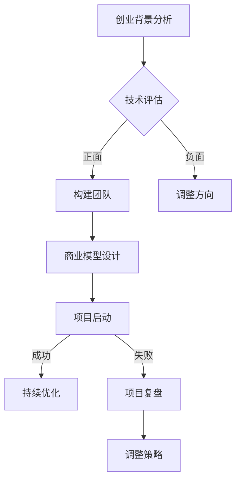

                 

### 第1章: 人工智能创业概述

在当今这个数字化和信息化的时代，人工智能（AI）技术已经成为推动企业创新和增长的关键驱动力。随着AI技术的不断成熟和应用范围的扩大，越来越多的创业者和企业家看到了在人工智能领域创业的巨大机遇。本章将简要介绍人工智能创业的背景与趋势，以及创业者在人工智能领域所面临的机遇与挑战。

#### 1.1 人工智能创业背景与趋势

人工智能（AI）技术的发展历程可以追溯到20世纪50年代，当时人工智能的早期概念和研究开始出现。自那时以来，人工智能经历了多个发展阶段，从早期的符号主义和知识表示，到基于规则的系统，再到基于统计学习和机器学习的现代方法，人工智能技术取得了长足的进步。

近年来，人工智能技术取得了显著的突破，尤其是深度学习算法的广泛应用，使得计算机在图像识别、自然语言处理、语音识别等领域达到了惊人的准确度。这一趋势在2012年AlexNet在ImageNet竞赛中取得的巨大成功后尤为明显。此后，深度学习成为了人工智能领域的主流研究方向。

随着技术的进步，人工智能的应用领域也在不断拓展。从最初的工业自动化、机器人技术，到如今在医疗、金融、零售、交通等多个行业的广泛应用，人工智能已经成为企业数字化转型和提升竞争力的重要工具。

#### 1.1.1 人工智能技术的发展历程

- **早期研究**：20世纪50年代，人工智能的概念首次被提出。初期的人工智能研究主要集中在符号主义和知识表示，试图通过计算机模拟人类的思维过程。

- **早期突破**：20世纪80年代，专家系统作为一种基于规则的智能系统得到了广泛应用，尤其在医疗、金融等领域取得了显著成果。

- **数据驱动时代**：20世纪90年代至21世纪初，机器学习和数据挖掘技术的发展，使得人工智能从基于规则的系统向基于数据的模型转变。

- **深度学习时代**：2012年，AlexNet在ImageNet竞赛中取得的突破性成果，标志着深度学习时代的到来。深度学习算法在图像识别、自然语言处理等领域取得了巨大成功。

- **应用扩展**：近年来，人工智能技术逐渐渗透到各行各业，从医疗影像分析、金融风险评估，到自动驾驶、智能家居，人工智能的应用场景不断拓展。

#### 1.1.2 人工智能行业发展趋势

- **技术成熟度**：人工智能技术已逐渐成熟，尤其是在深度学习、计算机视觉和自然语言处理领域。随着算法的改进和计算资源的提升，人工智能在更多领域的应用潜力得到释放。

- **行业应用深化**：人工智能在医疗、金融、零售、交通等行业的应用不断深化，从提高效率、降低成本，到优化决策、提升用户体验，人工智能正成为企业创新的重要驱动力。

- **跨界融合**：人工智能与物联网、5G、区块链等新兴技术的结合，将进一步推动产业的融合与创新。例如，物联网设备与人工智能结合，可以实现智能监控、智能安防等应用；5G技术的高带宽、低延迟特性，将推动人工智能在实时应用场景中的普及。

- **开源生态**：随着人工智能技术的开源生态不断完善，更多的开发者可以参与到人工智能技术的创新和应用中，推动技术的普及和进步。

#### 1.1.3 创业者在人工智能领域的机遇与挑战

- **机遇**：
  - **技术红利**：人工智能技术处于快速发展阶段，创业企业有机会在技术层面取得突破，形成竞争优势。
  - **市场需求**：随着人工智能应用的普及，市场对人工智能技术和服务有着巨大的需求，创业企业有机会抓住这一市场机会。
  - **政策支持**：各国政府对人工智能技术的支持力度不断加大，为企业提供了良好的政策环境。

- **挑战**：
  - **技术门槛**：人工智能技术具有一定的技术门槛，创业企业需要具备一定的技术积累和研发能力。
  - **数据资源**：人工智能技术的发展依赖于大量高质量的数据，创业企业需要解决数据来源和数据质量的问题。
  - **人才短缺**：人工智能领域人才短缺，创业企业需要吸引和培养高素质的人才。
  - **竞争激烈**：人工智能领域的竞争日益激烈，创业企业需要不断创新，以保持市场竞争力。

#### 1.2 人工智能创业案例分析

为了更好地理解人工智能创业的实际情况，本节将分析一些成功和失败的案例，从中提取启示，为创业者提供有益的策略。

##### 1.2.1 成功案例分析

**案例一：DeepMind的AlphaGo**

DeepMind是一家成立于2010年的英国人工智能公司，其最著名的成就之一是开发了AlphaGo，一款击败世界围棋冠军李世石的人工智能程序。AlphaGo的成功展示了深度学习和强化学习在复杂决策领域的潜力。

**成功原因**：
- **技术创新**：DeepMind采用了深度学习和强化学习相结合的方法，解决了围棋这一复杂决策问题。
- **团队合作**：DeepMind拥有一支经验丰富的团队，包括人工智能科学家、程序员和领域专家。
- **市场需求**：围棋作为一项高端竞技运动，拥有广泛的粉丝基础，AlphaGo的成功吸引了大量的关注和投资。

**启示**：
- **技术创新**：在人工智能创业中，技术创新是关键。创业者需要紧跟技术前沿，勇于探索新方法。
- **市场需求**：了解市场需求和用户痛点，开发能够解决实际问题的产品。

##### 1.2.2 失败案例分析

**案例二：Watson Health**

Watson Health是IBM旗下的一个医疗人工智能项目，旨在利用IBM的Watson超级计算机分析医学影像和患者数据，以辅助医生做出更好的诊断和治疗决策。尽管Watson Health在技术和市场宣传上投入巨大，但实际应用效果并不理想。

**失败原因**：
- **技术落地难**：Watson Health在医学影像分析上的技术尽管先进，但在实际临床应用中，医生对机器的依赖程度不高。
- **市场定位不准确**：Watson Health在推广过程中未能准确把握市场需求，忽视了医生和医院在实际应用中的顾虑和需求。
- **人才短缺**：在医疗领域，Watson Health缺乏足够的医学专家和临床医生参与，导致产品无法真正落地。

**启示**：
- **技术落地**：技术再先进，如果不能很好地落地应用，就无法产生实际价值。
- **市场定位**：深入了解目标市场，准确把握用户需求，避免盲目推广。

##### 1.2.3 案例启示与创业策略

通过以上案例分析，我们可以得出以下启示，以帮助创业者制定有效的创业策略。

- **技术创新**：在人工智能创业中，技术创新是核心竞争力。创业者需要关注技术前沿，不断探索新的方法和应用场景。
- **市场需求**：了解市场需求和用户痛点，开发能够解决实际问题的产品。
- **团队建设**：构建一支经验丰富的团队，包括技术专家、业务专家和市场营销人才。
- **数据资源**：确保有足够的高质量数据支持，以推动人工智能技术的有效应用。
- **落地应用**：注重技术的实际应用效果，解决用户在实际应用中的问题。
- **持续创新**：在市场竞争中，持续创新是保持竞争优势的关键。

#### 1.3 创业准备与团队建设

在决定踏入人工智能创业领域之前，创业者需要进行充分的准备工作，包括个人素质要求、团队建设和资金筹措等方面。以下是创业准备和团队建设的关键要素。

##### 1.3.1 创业者个人素质要求

作为一名人工智能创业者，以下个人素质至关重要：

- **技术背景**：具备一定的技术基础，特别是对人工智能相关技术有深入理解。
- **领导能力**：具备领导团队、管理项目和协调各方资源的能力。
- **创新能力**：能够不断探索新技术、新方法，解决实际问题和创造新价值。
- **市场洞察力**：能够准确把握市场需求和用户痛点，找到商业机会。
- **沟通能力**：具备良好的沟通技巧，能够与技术团队、业务团队和合作伙伴有效沟通。

##### 1.3.2 团队建设与人才招募

团队是人工智能创业成功的关键，创业者需要组建一支专业、高效的团队。以下是团队建设的关键要素：

- **技术团队**：组建一支包括算法工程师、软件工程师、数据工程师等在内的技术团队，确保技术实现。
- **业务团队**：招募有经验的业务经理、产品经理和市场营销人才，负责产品研发、市场推广和销售。
- **合作伙伴**：寻找合适的合作伙伴，如科研机构、高校、行业专家等，共同推动项目进展。

在人才招募过程中，创业者需要注意以下几点：

- **技能匹配**：确保招聘的人才与团队需求相匹配，尤其是关键岗位的人才。
- **团队合作**：重视团队成员之间的合作精神和团队文化，避免个人英雄主义。
- **持续培养**：为团队成员提供培训和成长机会，提升团队整体能力。

##### 1.3.3 创业初期资金筹措与管理

资金是人工智能创业的命脉，创业者需要合理安排资金，确保项目的顺利推进。以下是创业初期资金筹措和管理的关键要素：

- **天使投资**：寻找天使投资人，通过股权融资获取启动资金。
- **风险投资**：在项目进入快速发展阶段时，寻求风险投资，以扩大业务规模。
- **政府资助**：了解国家和地方政府针对人工智能创业的政策和补贴，申请相关资金支持。
- **内部积累**：通过项目收入和利润进行内部积累，为后续发展提供资金保障。

在资金管理方面，创业者需要注意以下几点：

- **预算控制**：制定详细的预算计划，严格控制项目支出。
- **资金流动性**：保持良好的资金流动性，确保项目在不同阶段有足够的资金支持。
- **风险防范**：建立风险防范机制，应对可能出现的资金风险。

##### 1.3.4 创业项目规划与商业模型

在创业初期，项目规划与商业模型是关键。以下是项目规划和商业模型设计的关键要素：

- **项目规划**：
  - **目标明确**：明确项目目标和预期成果。
  - **阶段划分**：将项目划分为不同的阶段，明确每个阶段的任务和目标。
  - **时间规划**：为每个阶段设定合理的时间表，确保项目按时推进。

- **商业模型**：
  - **价值主张**：明确产品的核心价值，解决用户的实际问题。
  - **盈利模式**：设计合理的盈利模式，确保项目的可持续性。
  - **市场定位**：确定目标市场和目标用户，制定针对性的市场营销策略。

通过科学的项目规划和商业模型设计，创业者可以更好地把握创业方向，降低创业风险，提高成功率。

### 第2章: 数据管理基础

在人工智能创业中，数据管理是关键的一环。数据不仅是人工智能算法的基础，也是企业决策和运营的重要依据。本章将介绍数据管理的基础概念，包括数据、信息与知识的定义，数据类型与数据质量，以及数据管理的基本原则。

#### 2.1 数据管理核心概念

**数据（Data）**：数据是数字化的信息，可以是数值、文字、图像、音频等形式。数据本身并没有意义，只有通过处理和解释，数据才能转化为信息。

**信息（Information）**：信息是经过处理和解释后的数据，能够对决策和行动产生影响的数字化的知识。

**知识（Knowledge）**：知识是经过积累、整合和内化的信息，是人们从经验中获得的认知和理解。

在数据管理过程中，数据、信息和知识之间是相互关联、相互转化的。数据是原始材料，通过处理和整合，转化为信息；信息通过进一步的分析和应用，转化为知识。有效的数据管理能够确保数据的完整性、准确性和可用性，从而为企业带来实际的价值。

#### 2.1.1 数据类型与数据质量

**数据类型**：根据数据的不同特点，可以分为以下几种类型：

- **结构化数据**：结构化数据是有组织、有固定格式的数据，如数据库中的记录、Excel表格等。
- **半结构化数据**：半结构化数据是部分组织化、格式相对自由的数据，如XML文件、JSON数据等。
- **非结构化数据**：非结构化数据是没有固定格式、难以组织的数据，如文本、图片、视频、音频等。

**数据质量**：数据质量是数据管理的重要方面，直接影响到数据的价值和应用效果。高质量的数据应具备以下特征：

- **准确性**：数据真实、可靠，与实际情况相符。
- **完整性**：数据完整，没有缺失值或错误值。
- **一致性**：数据在不同来源、不同时间点上保持一致。
- **及时性**：数据及时更新，能够反映当前状态。
- **可用性**：数据易于访问和使用，能够满足业务需求。

为了确保数据质量，企业需要建立数据质量控制机制，包括数据采集、清洗、验证和存储等环节。此外，还需要定期对数据质量进行评估和改进。

#### 2.1.2 数据管理的基本原则

**数据治理（Data Governance）**：数据治理是指建立一套制度、流程和规则，确保数据的完整性、准确性和合规性。数据治理包括以下基本原则：

- **数据标准化**：通过制定统一的数据标准，确保数据格式、命名和存储的一致性。
- **数据分类**：根据数据的重要性和敏感性，对数据进行分类，实施不同的管理策略。
- **数据安全与隐私保护**：确保数据的安全和隐私，防止数据泄露和滥用。
- **数据生命周期管理**：对数据从创建、存储、处理到销毁的全过程进行管理，确保数据的合规性和可用性。

**数据质量管理**：数据质量管理是确保数据质量的重要手段，包括以下原则：

- **数据准确性**：确保数据准确，与实际情况相符。
- **数据完整性**：确保数据完整，没有缺失值或错误值。
- **数据一致性**：确保数据在不同来源、不同时间点上保持一致。
- **数据及时性**：确保数据及时更新，能够反映当前状态。
- **数据可用性**：确保数据易于访问和使用，能够满足业务需求。

**数据共享与协作**：在数据管理过程中，需要建立有效的数据共享和协作机制，确保不同部门、不同团队之间的数据可以方便地共享和协作。这包括：

- **数据共享平台**：建立统一的数据共享平台，实现数据的集中管理和便捷访问。
- **协作机制**：制定协作流程和规则，确保团队成员可以高效地共享和利用数据。

通过遵循以上基本原则，企业可以建立高效、可靠的数据管理体系，为人工智能创业提供坚实的数据支持。

### 第3章: 数据存储与处理技术

在人工智能创业中，数据存储与处理技术的选择至关重要。本章将介绍数据库技术、大数据技术和实时数据处理，探讨这些技术在数据管理中的应用和优势。

#### 3.1 数据库技术

数据库技术是数据存储和管理的基础。根据数据模型的不同，数据库可以分为关系型数据库和非关系型数据库。

**关系型数据库**：关系型数据库使用SQL（结构化查询语言）进行数据操作，数据以表格形式存储。关系型数据库的特点是数据结构清晰、易于管理，适用于处理结构化数据。常见的开源关系型数据库包括MySQL、PostgreSQL和SQLite。

**非关系型数据库**：非关系型数据库（NoSQL）适用于处理非结构化数据和高并发访问场景。NoSQL数据库不依赖于固定的表格结构，可以根据数据的特点进行优化。常见的NoSQL数据库包括MongoDB、Redis和Cassandra。

**应用场景**：
- **结构化数据存储**：关系型数据库适用于存储和处理结构化数据，如用户信息、订单数据等。
- **高并发场景**：NoSQL数据库适用于高并发访问场景，如社交媒体平台的实时数据存储和查询。
- **大数据处理**：在处理大规模数据时，NoSQL数据库可以提供更高的性能和扩展性。

#### 3.2 大数据技术

大数据技术包括数据采集、存储、处理和分析等多个环节。随着数据量的不断增加，大数据技术在人工智能创业中发挥着越来越重要的作用。

**数据采集**：数据采集是大数据技术的第一步，包括从各种来源（如传感器、网站、社交媒体等）收集数据。数据采集需要确保数据的质量和完整性。

**数据存储**：大数据存储技术包括分布式文件系统（如Hadoop的HDFS）和分布式数据库（如Hadoop的HBase和Cassandra）。这些技术能够处理海量数据，并提供高可用性和高性能。

**数据处理**：数据处理包括数据清洗、转换和聚合等步骤。大数据处理技术需要能够处理大规模数据，并提高数据处理的速度和效率。常见的处理工具包括Spark、MapReduce和Flink。

**数据分析**：数据分析是大数据技术的核心，通过分析大量数据，可以发现有价值的信息和模式。数据分析技术包括统计分析、数据挖掘和机器学习等。

**应用场景**：
- **数据驱动决策**：大数据技术可以帮助企业实时收集和分析海量数据，为决策提供数据支持。
- **个性化服务**：通过分析用户数据，可以提供个性化推荐和服务，提升用户体验。
- **智能监控**：大数据技术可以实时监控系统运行状态，预测潜在故障，提高系统稳定性。

#### 3.3 实时数据处理

实时数据处理是大数据技术的重要应用方向，能够在数据产生的第一时间进行处理和分析。实时数据处理技术包括流处理和实时分析。

**流处理**：流处理技术（如Apache Kafka、Apache Flink）适用于处理实时数据流，能够实现数据的实时采集、传输和处理。流处理技术可以用于实时监控、实时数据分析等应用场景。

**实时分析**：实时分析技术（如Apache Storm、Apache Spark Streaming）可以对实时数据进行快速分析和处理，提供即时的洞察和决策支持。实时分析技术可以用于实时推荐、实时广告投放等应用场景。

**应用场景**：
- **实时监控**：实时数据处理技术可以用于监控网络流量、服务器状态等，及时发现异常情况。
- **实时推荐**：通过实时分析用户行为数据，可以为用户提供个性化的推荐服务。
- **实时决策**：在金融、医疗等领域，实时数据处理技术可以帮助企业快速做出决策，提高业务效率。

通过选择合适的数据存储与处理技术，人工智能创业企业可以高效地管理海量数据，为业务创新和运营优化提供数据支持。

### 第4章: 数据分析与挖掘

在人工智能创业中，数据分析和数据挖掘是关键环节。本章将介绍数据分析方法、数据挖掘技术和数据可视化，探讨这些技术在数据管理中的应用和优势。

#### 4.1 数据分析方法

数据分析是指使用统计学、计算机科学和业务知识来分析数据，提取有价值的信息和知识。数据分析方法可以分为以下几类：

**描述性分析**：描述性分析用于总结和描述数据的基本特征，如平均值、中位数、标准差等。描述性分析可以帮助企业了解数据的分布和趋势。

**推断性分析**：推断性分析用于根据样本数据推断总体数据的特征和规律。推断性分析包括假设检验、置信区间、回归分析等。

**预测性分析**：预测性分析基于历史数据，预测未来的趋势和变化。预测性分析包括时间序列分析、回归分析、机器学习模型等。

**关联性分析**：关联性分析用于发现数据之间的关联和依赖关系。关联性分析包括关联规则学习、聚类分析等。

**文本分析**：文本分析用于处理文本数据，提取关键词、主题和情感等。文本分析可以用于舆情分析、客户反馈分析等。

**应用场景**：
- **业务运营优化**：通过描述性分析，了解业务运营的各个环节，发现问题和改进点。
- **市场预测**：通过推断性分析，预测市场趋势和客户需求，制定营销策略。
- **风险控制**：通过预测性分析，预测潜在风险，制定风险控制策略。
- **用户行为分析**：通过关联性分析，发现用户行为模式，优化用户体验。

#### 4.2 数据挖掘技术

数据挖掘是指从大量数据中自动发现有价值的信息和知识的过程。数据挖掘技术包括以下几种：

**分类**：分类是将数据划分为不同的类别。常见的分类算法包括决策树、随机森林、支持向量机等。

**聚类**：聚类是将相似的数据聚集在一起。常见的聚类算法包括K-均值、层次聚类、DBSCAN等。

**关联规则学习**：关联规则学习用于发现数据之间的关联关系。常见的算法包括Apriori算法、FP-Growth算法等。

**异常检测**：异常检测用于发现数据中的异常值和异常模式。常见的算法包括基于统计的方法、基于聚类的方法、基于神经网络的方法等。

**预测**：预测是基于历史数据预测未来的趋势和变化。常见的预测算法包括时间序列预测、回归预测、机器学习预测等。

**文本挖掘**：文本挖掘用于处理和分析文本数据，提取关键词、主题和情感等。常见的文本挖掘算法包括TF-IDF、Word2Vec、BERT等。

**应用场景**：
- **客户细分**：通过分类和聚类算法，将客户划分为不同的群体，制定针对性的营销策略。
- **商品推荐**：通过关联规则学习，发现商品之间的关联关系，为用户提供个性化的推荐。
- **风险控制**：通过异常检测算法，发现异常交易和异常行为，防范风险。
- **舆情分析**：通过文本挖掘算法，分析社交媒体和新闻数据，了解公众观点和情感。

#### 4.3 数据可视化

数据可视化是将数据以图形化的方式展示出来，帮助用户更好地理解和分析数据。数据可视化包括以下几种类型：

**图表**：图表是将数据以图形形式展示，如柱状图、折线图、饼图等。图表可以直观地展示数据的分布和趋势。

**地图**：地图是将数据以地理位置的形式展示，如热力图、区域图等。地图可以直观地展示数据的空间分布和变化。

**交互式可视化**：交互式可视化是通过用户与数据的交互，动态展示数据和分析结果。交互式可视化可以提供更深入的数据探索和分析。

**应用场景**：
- **业务分析**：通过图表和地图，直观地展示业务数据，帮助管理层了解业务状况和趋势。
- **数据报告**：通过交互式可视化，制作详细的数据报告，为决策提供数据支持。
- **用户行为分析**：通过图表和地图，展示用户行为数据，发现用户行为模式和趋势。
- **数据监控**：通过实时数据可视化，监控系统运行状态和数据变化，及时发现问题和异常。

通过数据分析、数据挖掘和数据可视化，人工智能创业企业可以深入挖掘数据的价值，为业务创新和运营优化提供有力支持。

### 第5章: 人工智能在创业中的应用

在人工智能创业的浪潮中，人工智能技术在业务流程优化、客户服务、市场营销和产品研发等方面展现出了巨大的潜力和应用价值。本章将探讨人工智能在这些领域中的应用，以及如何通过人工智能技术提升创业企业的竞争力。

#### 5.1 人工智能在业务流程优化中的应用

业务流程优化是创业企业提高运营效率和降低成本的重要手段。人工智能技术可以通过自动化、智能决策和数据分析，对业务流程进行优化。

**5.1.1 业务流程自动化**

通过人工智能技术，创业企业可以实现业务流程的自动化，减少人工干预，提高效率。自动化技术主要包括以下几个方面：

- **机器人流程自动化（RPA）**：RPA技术通过模拟人类操作，自动化完成重复性的工作任务。例如，企业可以部署RPA机器人，自动处理订单处理、发票生成等流程，减少人工操作错误，提高处理速度。
- **智能调度系统**：智能调度系统利用人工智能算法，优化资源分配和任务调度。例如，物流公司可以利用智能调度系统，自动安排运输路线，提高运输效率，降低成本。

**5.1.2 智能决策支持系统**

智能决策支持系统（IDSS）利用人工智能技术，为企业提供数据驱动的决策支持。IDSS可以通过数据分析、机器学习等技术，帮助企业做出更明智的决策。

- **预测分析**：通过历史数据和趋势分析，预测未来的业务状况。例如，零售企业可以通过预测分析，预测商品销售量，优化库存管理，减少库存积压。
- **优化建议**：根据数据和业务规则，为企业提供优化建议。例如，制造企业可以通过优化建议，调整生产计划，提高生产效率。

**5.1.3 业务流程数据分析**

业务流程数据分析是利用人工智能技术，对业务流程中的数据进行分析和挖掘，发现问题和改进点。业务流程数据分析主要包括以下几个方面：

- **流程监控**：实时监控业务流程的运行状态，发现异常情况。例如，金融服务企业可以通过流程监控，及时发现和处理欺诈交易。
- **流程优化**：通过分析业务流程中的数据，发现流程中的瓶颈和改进点，优化流程。例如，物流企业可以通过流程优化，提高运输效率，降低成本。

通过业务流程优化，创业企业可以提升运营效率，降低成本，提高竞争力。

#### 5.2 人工智能在客户服务中的应用

客户服务是创业企业的重要组成部分，人工智能技术可以帮助企业提升客户服务质量，提高客户满意度。

**5.2.1 智能客服机器人**

智能客服机器人是利用人工智能技术，模拟人类与客户进行交互，解答客户问题，提供服务的自动化系统。智能客服机器人具有以下优势：

- **高效响应**：智能客服机器人可以24小时不间断工作，快速响应用户需求，提高客户满意度。
- **减少人力成本**：智能客服机器人可以自动化处理大量常见问题，减少人工客服的工作量，降低人力成本。
- **个性化服务**：智能客服机器人可以根据客户的历史数据和偏好，提供个性化的服务和建议。

**5.2.2 客户行为分析**

客户行为分析是利用人工智能技术，分析客户的购买行为、浏览行为等，了解客户需求和偏好。客户行为分析可以帮助企业实现以下目标：

- **精准营销**：通过分析客户行为数据，企业可以精准定位目标客户，制定个性化的营销策略，提高营销效果。
- **客户关系管理**：通过分析客户行为数据，企业可以了解客户需求和满意度，提供更优质的服务，提高客户忠诚度。
- **风险控制**：通过分析客户行为数据，企业可以识别异常行为，防范潜在风险。

**5.2.3 客户体验优化**

通过人工智能技术，企业可以优化客户体验，提升客户满意度。用户体验优化包括以下几个方面：

- **个性化推荐**：通过分析客户行为数据，企业可以提供个性化的产品推荐，提高客户购买转化率。
- **智能客服**：智能客服机器人可以快速响应客户问题，提供专业、高效的服务，提高客户满意度。
- **反馈机制**：通过收集客户反馈数据，企业可以不断优化产品和服务，提升客户体验。

通过人工智能技术在客户服务中的应用，创业企业可以提升客户服务质量，提高客户满意度，增强竞争力。

#### 5.3 人工智能在市场营销中的应用

市场营销是创业企业获取客户和扩大市场份额的重要手段。人工智能技术可以帮助企业实现精准营销、数据驱动的营销策略，提高营销效果。

**5.3.1 智能营销策略**

智能营销策略是利用人工智能技术，实现精准营销和个性化营销。智能营销策略包括以下几个方面：

- **用户画像**：通过分析用户数据，构建用户画像，了解用户需求和偏好。企业可以根据用户画像，制定个性化的营销策略。
- **内容推荐**：通过分析用户行为数据，推荐符合用户兴趣的内容，提高内容曝光率和用户参与度。
- **广告投放优化**：通过分析广告投放效果，优化广告投放策略，提高广告效果和投资回报率。

**5.3.2 社交媒体数据分析**

社交媒体数据分析是利用人工智能技术，分析社交媒体上的用户行为和舆情。通过社交媒体数据分析，企业可以了解市场趋势、用户需求和竞争对手情况，制定相应的营销策略。

- **舆情监测**：通过分析社交媒体上的评论、讨论等，监测品牌口碑和用户情绪，及时应对负面舆情。
- **用户画像**：通过分析社交媒体用户数据，构建用户画像，了解用户需求和偏好，优化产品和服务。
- **社交媒体营销**：通过分析社交媒体数据，制定针对性的社交媒体营销策略，提高营销效果。

**5.3.3 数据驱动营销策略**

数据驱动营销策略是利用大数据和人工智能技术，实现营销决策的智能化。数据驱动营销策略包括以下几个方面：

- **用户行为分析**：通过分析用户行为数据，了解用户需求和偏好，制定个性化的营销策略。
- **效果评估**：通过分析营销活动的效果数据，评估营销策略的有效性，优化营销策略。
- **自动化营销**：通过自动化技术，实现营销流程的自动化，提高营销效率。

通过人工智能技术在市场营销中的应用，创业企业可以实现精准营销、个性化营销，提高营销效果和投资回报率。

#### 5.4 人工智能在产品研发中的应用

人工智能技术在产品研发中的应用，可以帮助企业提升产品研发效率，优化产品设计，提高产品竞争力。

**5.4.1 智能设计工具**

智能设计工具是利用人工智能技术，辅助产品设计和优化。智能设计工具包括以下几个方面：

- **自动生成设计**：通过人工智能算法，自动生成产品外观和结构设计，提高设计效率。
- **优化设计**：通过分析产品性能和用户需求，优化产品设计，提高产品性能和用户体验。
- **协同设计**：通过人工智能技术，实现设计师之间的协同设计，提高设计质量和效率。

**5.4.2 智能预测分析**

智能预测分析是利用人工智能技术，预测产品需求和市场趋势。智能预测分析包括以下几个方面：

- **需求预测**：通过分析历史数据和用户行为，预测产品需求，优化产品生产和库存管理。
- **市场趋势预测**：通过分析市场数据和用户反馈，预测市场趋势，指导产品研发和营销策略。
- **竞争分析**：通过分析竞争对手的产品和策略，预测竞争对手的发展趋势，制定相应的竞争策略。

**5.4.3 产品优化与迭代**

通过人工智能技术，企业可以实现产品的持续优化和迭代，提高产品竞争力。产品优化与迭代包括以下几个方面：

- **用户反馈分析**：通过分析用户反馈数据，了解用户需求和使用体验，优化产品设计和服务。
- **性能优化**：通过分析产品性能数据，优化产品功能和性能，提高产品竞争力。
- **迭代开发**：通过快速迭代开发，不断优化产品，满足用户需求，提升用户满意度。

通过人工智能技术在产品研发中的应用，创业企业可以提升产品研发效率，优化产品设计，提高产品竞争力。

通过在业务流程优化、客户服务、市场营销和产品研发中的应用，人工智能技术为创业企业带来了新的发展机遇。创业企业应充分利用人工智能技术，提升运营效率，优化产品设计，提高客户满意度，增强市场竞争力。

### 第6章: 数据安全与隐私保护

在人工智能创业中，数据安全和隐私保护是至关重要的。随着数据量的大幅增加和应用的广泛普及，数据泄露和隐私侵犯事件也日益增多。本章将探讨数据安全的基本概念、隐私保护法律法规，以及企业在数据安全与隐私保护方面的策略和技术。

#### 6.1 数据安全基本概念

**数据泄露与数据安全威胁**：数据泄露是指未经授权的第三方访问、获取、篡改或破坏企业数据的行为。常见的数据安全威胁包括：

- **网络攻击**：黑客通过网络攻击手段，如SQL注入、跨站脚本（XSS）等，获取企业数据。
- **内部威胁**：企业内部员工或合作伙伴因滥用权限或恶意操作，导致数据泄露。
- **社会工程学攻击**：黑客通过欺骗手段，如钓鱼邮件、电话诈骗等，获取企业数据。

**数据安全策略**：企业需要制定全面的数据安全策略，以保护数据的安全性和完整性。数据安全策略包括：

- **访问控制**：通过身份验证、权限管理和审计等手段，限制只有授权用户可以访问数据。
- **加密技术**：使用加密技术对敏感数据进行加密，防止未经授权的访问。
- **备份与恢复**：定期备份数据，确保在数据丢失或损坏时可以快速恢复。

**数据加密技术**：数据加密技术是保护数据安全的重要手段，包括：

- **对称加密**：使用相同的密钥进行加密和解密，如AES算法。
- **非对称加密**：使用不同的密钥进行加密和解密，如RSA算法。
- **哈希函数**：将数据转换为固定长度的字符串，用于验证数据的完整性，如MD5、SHA-256等。

#### 6.2 隐私保护法律法规

**全球隐私保护法律法规概述**：随着数据隐私问题的日益突出，全球各国纷纷制定了隐私保护法律法规。以下是一些主要的隐私保护法律法规：

- **欧盟通用数据保护条例（GDPR）**：GDPR是欧盟最具影响力的隐私保护法律，规定了数据处理的合法性、数据主体权利、数据泄露通知等。
- **加州消费者隐私法案（CCPA）**：CCPA是美国加州的一项隐私保护法案，规定了消费者对个人数据的知情权和控制权。
- **个人信息保护法（PIPL）**：PIPL是中国的一项隐私保护法律，规定了个人信息处理的基本原则和保护措施。

**我国隐私保护法律法规**：我国也在逐步完善隐私保护法律法规体系，包括：

- **网络安全法**：网络安全法规定了网络运营者的数据安全保护义务，对数据收集、存储、处理、传输等进行了规范。
- **个人信息保护法**：个人信息保护法规定了个人信息处理的基本原则和保护措施，明确了个人信息主体的权利和责任。
- **数据安全法**：数据安全法从国家安全角度出发，对数据安全保护进行了全面规定，包括数据分类、风险评估、安全保护措施等。

**企业隐私保护合规要求**：企业在进行数据收集和处理时，需要遵守相关法律法规的要求，包括：

- **合法、正当、必要原则**：在收集和处理个人信息时，必须遵循合法、正当、必要的原则，不得超出服务提供的必要范围。
- **告知同意原则**：在收集个人信息前，必须告知个人信息的收集目的、使用方式、存储地点等，并取得个人同意。
- **安全保护原则**：采取技术和管理措施，确保个人信息的安全，防止数据泄露、篡改和滥用。
- **合规审计**：定期进行合规审计，确保企业数据处理活动符合法律法规要求。

通过了解和遵守隐私保护法律法规，企业可以降低数据泄露和隐私侵犯的风险，保护自身和客户的合法权益。

#### 6.3 数据安全防护技术

**数据访问控制**：数据访问控制是通过身份验证、权限管理和审计等手段，控制数据访问权限。技术手段包括：

- **身份验证**：使用用户名、密码、指纹、面部识别等技术，验证用户的身份。
- **权限管理**：根据用户的角色和职责，分配不同的数据访问权限。
- **审计**：记录用户的操作行为，监控数据访问情况，及时发现和防范异常行为。

**数据审计与监控**：数据审计与监控是确保数据安全的重要手段。技术手段包括：

- **日志记录**：记录数据访问、修改和删除等操作日志，以便追踪和审计。
- **实时监控**：通过实时监控系统，及时发现和响应数据泄露和安全事件。
- **安全分析**：使用数据分析技术，对数据访问和操作行为进行分析，识别潜在的安全威胁。

**数据安全测试与评估**：数据安全测试与评估是确保数据安全的有效手段。技术手段包括：

- **渗透测试**：模拟黑客攻击，测试系统漏洞和弱点，发现潜在的安全威胁。
- **安全评估**：对系统的安全性进行评估，识别安全风险和改进点。
- **安全培训**：定期对员工进行安全培训，提高员工的安全意识和防范能力。

通过数据安全防护技术，企业可以建立全面的数据安全体系，保护数据的安全性和隐私。

### 第7章: 人工智能创业成功案例分析

为了更好地理解人工智能创业的成功路径，本章将分析三个具体案例，分别来自金融科技、电子商务和制造行业。这些案例将展示如何通过数据管理、人工智能技术和有效的创业策略实现业务成功。

#### 案例一：某金融科技公司的数据驱动物流管理

**公司背景与业务场景**：

某金融科技公司（以下简称“公司”）致力于为物流行业提供智能化解决方案。公司成立之初，便意识到物流管理中的痛点，如运输成本高、物流效率低、库存管理复杂等。公司决定通过数据管理和人工智能技术，优化物流管理流程。

**数据管理策略**：

公司首先建立了一套完善的数据管理体系，包括数据采集、存储、处理和分析等环节。具体措施如下：

- **数据采集**：通过物联网设备、传感器和GPS等手段，实时采集运输车辆的位置信息、运输时间、货物状态等数据。
- **数据存储**：使用分布式数据库技术，存储海量物流数据，确保数据的安全性和可靠性。
- **数据处理**：采用大数据处理技术，对采集到的数据进行清洗、转换和聚合，为后续分析提供基础数据。
- **数据分析**：利用机器学习和数据挖掘技术，分析物流数据，提取有价值的信息和模式。

**人工智能技术应用**：

公司通过人工智能技术，实现了物流管理的智能化和自动化，具体应用如下：

- **路径优化**：使用机器学习算法，分析历史运输数据，预测最优运输路线，提高运输效率。
- **库存管理**：基于数据分析和预测模型，优化库存管理，减少库存积压和物流成本。
- **异常检测**：利用实时数据处理和机器学习技术，监控运输过程，及时发现和处理异常情况。

**案例成效分析**：

通过数据管理和人工智能技术的应用，公司在多个方面取得了显著成效：

- **运输效率提升**：优化运输路线，提高运输效率，降低了运输成本。
- **库存管理优化**：通过精准的库存预测和管理，减少了库存积压，提高了资金利用率。
- **服务质量提升**：通过实时监控和异常检测，提高了运输过程的安全性和可靠性，提升了客户满意度。

**总结**：

该案例展示了金融科技公司如何通过数据管理和人工智能技术，优化物流管理流程，提高运输效率和服务质量。公司成功的关键在于对数据的深入挖掘和应用，以及对人工智能技术的有效利用。

#### 案例二：某电子商务平台的数据驱动营销策略

**公司背景与业务场景**：

某电子商务平台（以下简称“平台”）是一家专注于零售业务的企业。随着市场竞争的加剧，平台意识到需要通过数据驱动的营销策略，提高用户转化率和销售额。

**数据管理策略**：

平台建立了一套完善的数据管理体系，包括用户行为数据的采集、存储和处理，具体措施如下：

- **数据采集**：通过网站日志、点击流数据、用户反馈等手段，全面采集用户行为数据。
- **数据存储**：采用分布式数据库技术，存储海量用户行为数据，确保数据的安全性和可靠性。
- **数据处理**：使用大数据处理技术，对用户行为数据进行清洗、转换和聚合，为后续分析提供基础数据。
- **数据分析**：利用机器学习和数据挖掘技术，分析用户行为数据，提取有价值的信息和模式。

**人工智能技术应用**：

平台通过人工智能技术，实现了数据驱动的营销策略，具体应用如下：

- **用户画像**：通过用户行为数据分析，构建用户画像，了解用户需求和偏好。
- **个性化推荐**：利用用户画像和推荐算法，为用户提供个性化的产品推荐，提高用户转化率。
- **广告投放优化**：通过实时数据处理和预测模型，优化广告投放策略，提高广告效果和投资回报率。

**案例成效分析**：

通过数据管理和人工智能技术的应用，平台在多个方面取得了显著成效：

- **用户转化率提升**：个性化推荐和广告投放优化，提高了用户转化率，增加了销售额。
- **用户满意度提升**：通过精准的用户画像和个性化推荐，提升了用户体验，增强了用户忠诚度。
- **营销成本降低**：通过优化广告投放策略，降低了营销成本，提高了营销效果。

**总结**：

该案例展示了电子商务平台如何通过数据管理和人工智能技术，实现数据驱动的营销策略，提高用户转化率和销售额。平台成功的关键在于对用户行为数据的深入挖掘和应用，以及对人工智能技术的有效利用。

#### 案例三：某制造企业的智能生产管理

**公司背景与业务场景**：

某制造企业（以下简称“企业”）是一家专注于高端制造的企业。随着市场竞争的加剧和生产成本的提高，企业意识到需要通过智能化生产管理，提高生产效率和产品质量。

**数据管理策略**：

企业建立了一套完善的数据管理体系，包括生产数据的采集、存储和处理，具体措施如下：

- **数据采集**：通过传感器、PLC（可编程逻辑控制器）等设备，实时采集生产数据，如设备状态、生产进度、产品质量等。
- **数据存储**：采用分布式数据库技术，存储海量生产数据，确保数据的安全性和可靠性。
- **数据处理**：使用大数据处理技术，对生产数据进行清洗、转换和聚合，为后续分析提供基础数据。
- **数据分析**：利用机器学习和数据挖掘技术，分析生产数据，提取有价值的信息和模式。

**人工智能技术应用**：

企业通过人工智能技术，实现了智能生产管理，具体应用如下：

- **设备监控**：通过实时数据处理和预测模型，监控设备状态，预测设备故障，提高设备利用率。
- **生产优化**：通过数据分析，优化生产流程，提高生产效率和产品质量。
- **质量检测**：利用机器学习算法，分析生产数据，实时监控产品质量，确保产品合格率。

**案例成效分析**：

通过数据管理和人工智能技术的应用，企业在多个方面取得了显著成效：

- **生产效率提升**：通过设备监控和生产优化，提高了生产效率，降低了生产成本。
- **产品质量提升**：通过实时监控和质量检测，提高了产品质量，增强了产品竞争力。
- **设备利用率提升**：通过设备监控和预测模型，提高了设备利用率，减少了设备故障率。

**总结**：

该案例展示了制造企业如何通过数据管理和人工智能技术，实现智能生产管理，提高生产效率和产品质量。企业成功的关键在于对生产数据的深入挖掘和应用，以及对人工智能技术的有效利用。

通过以上三个案例，我们可以看到，数据管理和人工智能技术在各个行业的创业中都有着广泛的应用和显著的效果。创业企业通过深入挖掘数据价值，利用人工智能技术优化业务流程，实现了业务成功和竞争优势。

### 第8章: 人工智能创业的未来展望

随着人工智能技术的不断成熟和应用领域的扩展，人工智能创业在未来将继续迎来新的发展机遇和挑战。本章将探讨人工智能创业领域的新兴趋势、面临的挑战和应对策略，以及未来发展的机遇。

#### 8.1 人工智能创业领域的新兴趋势

**人工智能与5G技术的融合**：5G技术的高带宽、低延迟特性，将推动人工智能在实时应用场景中的普及。例如，在自动驾驶、远程医疗和智能监控等领域，5G技术将使人工智能系统的实时性和可靠性得到大幅提升。

**人工智能与区块链技术的结合**：区块链技术的分布式账本和智能合约特性，与人工智能技术的数据分析和决策支持功能相结合，有望在金融、供应链管理和数据安全等领域创造新的应用场景。

**人工智能在物联网中的应用**：物联网（IoT）设备的大量数据为人工智能技术提供了丰富的数据来源。人工智能技术可以分析物联网数据，实现智能监控、设备预测维护和能效优化等应用。

**人工智能在生物医疗领域的应用**：人工智能技术在医疗影像分析、疾病预测和个性化治疗等方面展现出巨大潜力。随着基因编辑、精准医疗等技术的发展，人工智能在生物医疗领域的应用前景广阔。

**人工智能在金融服务中的应用**：人工智能技术可以提高金融服务的效率，降低运营成本。例如，在风险管理、信用评估和投资决策等领域，人工智能技术可以提供更加精准和高效的服务。

#### 8.2 人工智能创业的挑战与应对策略

**技术挑战与解决方案**：

- **算法复杂性和计算资源需求**：随着人工智能算法的复杂度增加，对计算资源的需求也不断上升。创业企业需要通过分布式计算、云计算等技术，提高计算效率，降低成本。
- **数据质量和数据安全**：高质量的数据是人工智能应用的基础，创业企业需要建立完善的数据采集、存储和处理机制，确保数据的质量和安全。同时，需要采取数据加密、访问控制等安全措施，保护数据免受泄露和滥用。

**法律法规与伦理道德挑战**：

- **隐私保护**：在人工智能应用中，数据隐私保护成为重要议题。创业企业需要遵守相关法律法规，采取隐私保护措施，保护用户数据隐私。
- **算法偏见和公平性**：人工智能算法的偏见问题引发广泛关注。创业企业需要在算法设计和应用中，充分考虑公平性和透明性，避免算法偏见对用户产生不利影响。

**市场竞争与行业壁垒挑战**：

- **市场竞争加剧**：随着人工智能技术的普及，市场竞争将更加激烈。创业企业需要不断创新，提升技术水平和产品竞争力。
- **行业壁垒**：一些传统行业对人工智能技术的接受度和应用能力存在差异，创业企业需要深入了解行业需求，提供定制化的解决方案，以突破行业壁垒。

针对上述挑战，创业企业可以采取以下应对策略：

- **技术创新**：持续关注技术前沿，积极投入研发，提升技术水平和创新能力。
- **数据治理**：建立完善的数据管理体系，确保数据的质量和安全。
- **合规经营**：遵守相关法律法规，注重伦理道德，树立良好的企业形象。
- **跨界合作**：与行业专家、科研机构等建立合作关系，共同推动技术发展和应用落地。

#### 8.3 人工智能创业的发展机遇

**市场需求增长**：随着人工智能技术的不断成熟和应用领域的拓展，市场需求持续增长。创业企业可以抓住这一机遇，开发满足市场需求的产品和服务。

**投资者关注**：人工智能技术受到投资者的广泛关注，为企业提供了丰富的融资机会。创业企业可以通过吸引风险投资，加速技术发展和市场拓展。

**全球化布局与国际化**：人工智能技术的全球化布局和国际化发展，为创业企业提供了广阔的市场空间。企业可以通过拓展海外市场，实现全球化布局，提升国际竞争力。

**政策支持**：各国政府对人工智能技术的支持力度不断加大，为企业提供了良好的政策环境。创业企业可以充分利用政策优势，推动技术发展和业务拓展。

**人才培养与引进**：人工智能技术的发展离不开专业人才的支持。创业企业可以通过培养和引进高端人才，提升团队整体实力，推动技术创新和应用落地。

总之，人工智能创业在未来将继续迎来新的发展机遇。创业企业需要积极应对挑战，抓住机遇，通过技术创新、合规经营和全球化布局，实现可持续发展。

### 附录 A: 人工智能与数据管理工具

在本章中，我们将介绍一些常用的人工智能与数据管理工具，包括人工智能开发工具和数据管理工具，以及如何在实际项目中使用这些工具。

#### A.1 人工智能开发工具

**TensorFlow**

TensorFlow是由Google开源的一款人工智能框架，广泛应用于机器学习、深度学习和计算机视觉等领域。其核心优势包括：

- **灵活性和可扩展性**：TensorFlow支持多种编程语言，如Python、C++和Java，提供了丰富的API和工具。
- **丰富的生态系统**：TensorFlow拥有庞大的社区支持和丰富的第三方库，如TensorFlow Lite、TensorFlow.js等。
- **跨平台支持**：TensorFlow可以在各种平台上运行，包括CPU、GPU和移动设备。

**PyTorch**

PyTorch是另一个流行的开源人工智能框架，由Facebook的FAIR实验室开发。其核心优势包括：

- **动态计算图**：PyTorch采用动态计算图，使得调试和开发更加灵活。
- **易于使用**：PyTorch提供了简洁的API和丰富的内置功能，使得机器学习模型的开发更加高效。
- **与Python紧密集成**：PyTorch与Python紧密集成，可以方便地调用Python库和模块。

**Keras**

Keras是一个高级神经网络API，构建在TensorFlow和Theano之上。其核心优势包括：

- **简单易用**：Keras提供了简洁的API，使得机器学习模型的开发更加简单。
- **模块化**：Keras支持模块化开发，可以方便地组合和扩展。
- **兼容性**：Keras可以与TensorFlow和Theano兼容，提供了统一的开发体验。

#### A.2 数据管理工具

**数据库技术**

**关系型数据库**

- **MySQL**：MySQL是一种流行的开源关系型数据库，适用于处理结构化数据，具有高性能和高可靠性。
- **PostgreSQL**：PostgreSQL是一种强大的开源关系型数据库，支持多种数据类型和复杂的查询需求。

**非关系型数据库**

- **MongoDB**：MongoDB是一种流行的开源非关系型数据库，适用于处理半结构化和非结构化数据，提供了丰富的查询和索引功能。
- **Redis**：Redis是一种开源的内存数据库，适用于处理高速缓存和实时数据存储。

**大数据平台**

- **Hadoop**：Hadoop是一种分布式大数据处理平台，包括HDFS（分布式文件系统）和MapReduce（分布式数据处理框架）。
- **Spark**：Spark是一种高速的分布式数据处理引擎，提供了丰富的API和工具，适用于批处理和实时数据处理。

**数据仓库与数据湖**

- **数据仓库**：数据仓库是一种用于存储、管理和分析大规模结构化数据的系统，如Oracle Exadata、Microsoft SQL Server等。
- **数据湖**：数据湖是一种用于存储大规模非结构化和半结构化数据的系统，如Amazon S3、Google Cloud Storage等。

**数据治理与数据安全工具**

- **数据治理**：数据治理工具用于管理数据生命周期、数据质量和数据安全，如Informatica PowerCenter、Talend等。
- **数据加密**：数据加密工具用于对敏感数据进行加密，如Symantec Data Loss Prevention、RSA Data Protection Manager等。

在实际项目中，选择合适的人工智能与数据管理工具非常重要。以下是使用这些工具的一些实践建议：

1. **需求分析**：根据项目需求，选择适合的人工智能框架和数据管理工具。
2. **环境搭建**：配置开发环境，安装所需库和依赖。
3. **数据采集与处理**：使用数据库和数据管理工具，进行数据采集、存储和处理。
4. **模型训练与优化**：使用人工智能框架，训练和优化机器学习模型。
5. **部署与监控**：将模型部署到生产环境，并进行监控和评估。

通过合理选择和使用人工智能与数据管理工具，可以提升项目的开发效率，确保数据的安全性和可靠性，为业务创新和运营优化提供坚实支持。

### 附录 B: Mermaid 流程图

在本附录中，我们将展示一个使用Mermaid语法编写的流程图示例，以展示人工智能在创业中的应用流程。



此流程图描述了人工智能创业的基本流程。以下是流程图的详细说明：

- **创业背景分析（A）**：分析创业背景，评估技术可行性。
- **技术评估（B）**：对技术进行详细评估，确定项目方向。
- **构建团队（C）**：组建合适的团队，确保项目顺利推进。
- **调整方向（D）**：在评估过程中，如果遇到技术难题或市场环境变化，需要调整项目方向。
- **商业模型设计（E）**：设计商业模型，明确项目的商业模式和盈利方式。
- **项目启动（F）**：启动项目，进入实施阶段。
- **持续优化（G）**：在项目实施过程中，不断优化产品和服务，提高市场竞争力。
- **项目复盘（H）**：项目结束后，进行复盘和总结，分析项目成功和失败的原因。
- **调整策略（I）**：根据复盘结果，调整项目策略，为下一阶段的项目提供指导。

通过使用Mermaid流程图，我们可以清晰地展示人工智能创业的流程，有助于团队理解和协作。

### 附录 C: 人工智能核心算法原理与伪代码

在本附录中，我们将介绍人工智能领域的一些核心算法原理，并使用伪代码进行详细阐述。这些算法包括决策树、支持向量机、神经网络等。

#### 决策树算法原理及伪代码

**决策树算法**是一种用于分类和回归分析的机器学习算法，通过一系列的决策规则将数据划分为不同的类别或数值。

**原理**：
决策树算法通过递归分割数据集，在每个节点上选择具有最高信息增益的属性进行分割。递归过程直到满足停止条件（如叶节点数量达到阈值）。

**伪代码**：

```latex
// 决策树算法伪代码
DecisionTreealgorithm(trainset):
    if trainset is pure:
        return the majority class of trainset
    else:
        select the best attribute to split trainset
        split trainset into subsets based on the selected attribute
        create a branch for each subset
        for each subset:
            recursively apply DecisionTreealgorithm to the subset
        return the constructed decision tree
```

#### 支持向量机算法原理及伪代码

**支持向量机（SVM）**是一种用于分类问题的机器学习算法，其目标是找到最佳的超平面，使得分类边界最大化。

**原理**：
SVM通过求解一个最优化问题，找到最佳的超平面，使得数据点到超平面的距离最大化。在存在噪声的情况下，SVM还引入了软边缘，允许一定的分类错误。

**伪代码**：

```latex
// 支持向量机算法伪代码
SVMalgorithm(trainset, labels):
    solve the optimization problem:
        maximize 1/2 \|w\|^2
        subject to  y_i (w \* x_i + b) >= 1 for all i
    return the optimal weight vector w and bias term b
```

#### 神经网络算法原理及伪代码

**神经网络（Neural Networks）**是一种模拟人脑神经元之间连接的机器学习模型，通过多层神经元实现数据的非线性变换。

**原理**：
神经网络包括输入层、隐藏层和输出层。每个层中的神经元通过权重连接，并使用激活函数进行非线性变换。通过反向传播算法，调整权重和偏置，使模型能够拟合训练数据。

**伪代码**：

```latex
// 神经网络算法伪代码
NeuralNetwork(trainset, labels):
    initialize weights and biases
    for each epoch:
        for each example in trainset:
            forward propagation:
                compute input to each neuron
                apply activation function
            compute loss
            backward propagation:
                compute gradients
                update weights and biases
    return the trained neural network
```

通过了解这些核心算法原理及其伪代码，读者可以更深入地理解人工智能的基础，并在实际项目中应用这些算法。

### 附录 D: 数学模型讲解与公式

在本附录中，我们将讲解人工智能领域中常用的数学模型及其公式。这些数学模型在算法设计和优化过程中发挥着重要作用。

#### 决策树中信息增益的数学模型

信息增益（Information Gain）是决策树算法中的一个重要概念，用于评估特征对分类的增益。

**信息增益的数学模型**：

$$
IG(D, A) = I(D) - \sum_{v \in Values(A)} p(v) \cdot I(D|A=v)
$$

其中：

- \(IG(D, A)\) 是以特征 \(A\) 为分割的信息增益。
- \(I(D)\) 是数据集 \(D\) 的信息熵。
- \(p(v)\) 是特征 \(A\) 取值 \(v\) 的概率。
- \(I(D|A=v)\) 是在特征 \(A\) 取值为 \(v\) 时，数据集 \(D\) 的条件信息熵。

#### 神经网络中激活函数的数学模型

在神经网络中，激活函数用于引入非线性变换，使得神经网络能够对非线性问题进行建模。

**常见的激活函数及其数学模型**：

1. **Sigmoid函数**：

$$
f(x) = \frac{1}{1 + e^{-x}}
$$

2. **ReLU函数**：

$$
f(x) = \max(0, x)
$$

3. **Tanh函数**：

$$
f(x) = \frac{e^x - e^{-x}}{e^x + e^{-x}}
$$

这些激活函数在神经网络中有着广泛的应用，不同的激活函数具有不同的特性，如非线性变换能力、梯度计算等。

#### 机器学习中损失函数的数学模型

损失函数是评估模型预测性能的重要指标，机器学习算法的目标是优化模型参数，使得损失函数的值最小。

**常见的损失函数及其数学模型**：

1. **均方误差（MSE）**：

$$
MSE(y, \hat{y}) = \frac{1}{n} \sum_{i=1}^{n} (y_i - \hat{y}_i)^2
$$

其中，\(y\) 是真实值，\(\hat{y}\) 是预测值，\(n\) 是样本数量。

2. **交叉熵（Cross-Entropy）**：

$$
Cross-Entropy(y, \hat{y}) = - \sum_{i=1}^{n} y_i \cdot \log(\hat{y}_i)
$$

其中，\(y\) 是真实值，\(\hat{y}\) 是预测概率分布。

通过了解这些数学模型和公式，读者可以更好地理解人工智能算法的原理和实现，为实际应用提供理论基础。

### 附录 E: 项目实战

在本附录中，我们将以一个电子商务平台的个性化推荐系统为例，详细讲解项目实战的整个过程，包括开发环境搭建、源代码实现和代码解读与分析。

#### 1. 环境搭建

**步骤 1**：安装Python环境

在Ubuntu 20.04系统中，首先需要安装Python 3及其相关依赖库。

```bash
sudo apt update
sudo apt install python3 python3-pip
```

**步骤 2**：安装TensorFlow和Scikit-learn库

TensorFlow和Scikit-learn是构建个性化推荐系统的重要库，用于实现机器学习和深度学习模型。

```bash
pip3 install tensorflow scikit-learn
```

**步骤 3**：安装其他依赖库

除了TensorFlow和Scikit-learn，还需要安装其他常用库，如pandas和numpy。

```bash
pip3 install pandas numpy matplotlib
```

**步骤 4**：验证环境

安装完成后，可以通过以下命令验证环境是否安装成功。

```python
import tensorflow as tf
import sklearn
print(tf.__version__)
print(sklearn.__version__)
```

#### 2. 代码实现

**步骤 1**：数据预处理

首先，我们需要读取数据集，并对数据进行预处理，包括数据清洗、特征工程和归一化等。

```python
import pandas as pd
from sklearn.model_selection import train_test_split
from sklearn.preprocessing import StandardScaler

# 读取数据集
data = pd.read_csv('ecommerce_data.csv')

# 划分特征和目标变量
X = data.drop('target', axis=1)
y = data['target']

# 数据清洗和特征工程
# 例如，缺失值处理、异常值处理、特征转换等

# 归一化处理
scaler = StandardScaler()
X_scaled = scaler.fit_transform(X)

# 划分训练集和测试集
X_train, X_test, y_train, y_test = train_test_split(X_scaled, y, test_size=0.2, random_state=42)
```

**步骤 2**：构建推荐模型

在本示例中，我们使用随机森林分类器构建个性化推荐模型。

```python
from sklearn.ensemble import RandomForestClassifier

# 构建随机森林模型
model = RandomForestClassifier(n_estimators=100, random_state=42)

# 模型训练
model.fit(X_train, y_train)

# 模型评估
predictions = model.predict(X_test)
accuracy = accuracy_score(y_test, predictions)
print(f'Accuracy: {accuracy:.2f}')
```

**步骤 3**：个性化推荐

通过训练好的模型，我们可以对用户进行个性化推荐。

```python
# 对用户进行个性化推荐
def recommend_products(user_data):
    user_data_scaled = scaler.transform([user_data])
    predicted_products = model.predict(user_data_scaled)
    return predicted_products

# 示例：为用户ID为1的用户推荐产品
user_data = {'feature1': value1, 'feature2': value2, ...}
recommended_products = recommend_products(user_data)
print(f'Recommended products: {recommended_products}')
```

#### 3. 代码解读与分析

**代码解读**：

- **数据预处理**：数据预处理是机器学习项目的重要步骤。在本示例中，我们首先读取数据集，并划分特征和目标变量。然后，我们使用StandardScaler进行归一化处理，将特征值缩放到相同的尺度，以提高模型的性能。

- **模型构建**：在本示例中，我们使用随机森林分类器构建个性化推荐模型。随机森林是一种基于决策树的集成学习方法，具有较好的分类性能和泛化能力。

- **模型训练**：使用训练集数据进行模型训练。在训练过程中，模型会根据特征和目标变量，调整内部参数，以最小化损失函数。

- **模型评估**：使用测试集数据对模型进行评估，计算模型的准确率。在本示例中，我们使用accuracy_score函数计算准确率。

- **个性化推荐**：通过训练好的模型，我们可以对用户进行个性化推荐。在本示例中，我们定义了一个recommend_products函数，用于根据用户特征，预测用户可能感兴趣的产品。

**代码分析**：

- **数据预处理**：数据预处理是确保模型性能的关键。在本示例中，我们使用了StandardScaler进行归一化处理，将特征值缩放到相同的尺度。这种处理方法可以提高模型的性能，减少过拟合现象。

- **模型选择**：在本示例中，我们选择了随机森林分类器。随机森林是一种常见的集成学习方法，具有较好的分类性能和泛化能力。在实际项目中，可以根据具体需求和数据特点，选择其他模型，如决策树、支持向量机等。

- **模型评估**：模型评估是验证模型性能的重要步骤。在本示例中，我们使用测试集数据对模型进行评估，计算模型的准确率。在实际项目中，还可以使用其他评估指标，如精确率、召回率等。

通过这个示例，我们可以看到，构建一个个性化推荐系统需要经历多个步骤，包括数据预处理、模型构建、模型训练和模型评估等。在实际项目中，还需要根据具体需求，调整和优化模型参数，以提高推荐效果。

### 附录 F: 开发环境搭建

在本附录中，我们将详细介绍如何在Ubuntu 20.04上搭建人工智能与数据管理开发环境，包括安装Python环境、TensorFlow和Scikit-learn库，以及其他依赖库。

#### 1. 安装Python环境

首先，我们需要安装Python 3及其相关依赖库。

```bash
sudo apt update
sudo apt install python3 python3-pip
```

#### 2. 安装TensorFlow和Scikit-learn库

TensorFlow和Scikit-learn是构建人工智能与数据管理项目的重要库，用于实现机器学习和深度学习模型。

```bash
pip3 install tensorflow scikit-learn
```

#### 3. 安装其他依赖库

除了TensorFlow和Scikit-learn，我们还需要安装其他常用库，如pandas、numpy、matplotlib等。

```bash
pip3 install pandas numpy matplotlib
```

#### 4. 验证环境

安装完成后，可以通过以下命令验证环境是否安装成功。

```python
import tensorflow as tf
import sklearn
print(tf.__version__)
print(sklearn.__version__)
```

如果环境变量正确安装，会输出TensorFlow和Scikit-learn的版本信息。

通过以上步骤，我们成功搭建了人工智能与数据管理开发环境，可以开始进行项目开发。

### 附录 G: 人工智能与数据管理领域的资源推荐

在本附录中，我们将推荐一些优秀的人工智能与数据管理领域的学习资源，包括书籍、在线课程、行业报告和白皮书，以及社交媒体和社群推荐，以帮助读者深入了解相关领域。

#### 书籍推荐

1. **《人工智能：一种现代方法》**（Artificial Intelligence: A Modern Approach） - Stuart J. Russell & Peter Norvig
   - 本书是人工智能领域的经典教材，内容全面，涵盖了从基础知识到高级应用的各个方面。

2. **《Python机器学习》**（Python Machine Learning） - Sebastian Raschka & Vahid Mirjalili
   - 本书深入讲解了Python在机器学习中的应用，适合初学者和有一定基础的读者。

3. **《深度学习》（Deep Learning）** - Ian Goodfellow、Yoshua Bengio和Aaron Courville
   - 本书是深度学习领域的权威教材，详细介绍了深度学习的基础理论、算法和应用。

4. **《数据科学入门：Python实践》**（Data Science from Scratch） - Joel Grus
   - 本书以Python编程语言为基础，介绍了数据科学的核心概念和技术。

#### 在线课程与学习资源

1. **Coursera** - 人工智能和机器学习
   - Coursera提供了大量优质的人工智能和机器学习课程，包括吴恩达的《机器学习》课程等。

2. **edX** - 人工智能和数据科学
   - edX提供了多个与人工智能和数据科学相关的在线课程，包括麻省理工学院、斯坦福大学等名校的课程。

3. **Udacity** - 人工智能纳米学位
   - Udacity的人工智能纳米学位提供了从基础知识到高级应用的全面课程，适合初学者和进阶者。

4. **Kaggle** - 机器学习和数据科学竞赛
   - Kaggle是一个数据科学竞赛平台，提供了丰富的机器学习和数据科学实战项目。

#### 行业报告与白皮书

1. **Gartner** - 人工智能市场趋势报告
   - Gartner发布了关于人工智能市场的趋势报告，分析了人工智能领域的最新发展动态。

2. **IDC** - 人工智能行业研究报告
   - IDC发布了关于人工智能行业的深度研究报告，涵盖了人工智能在各个行业中的应用和影响。

3. **IBM** - 人工智能白皮书
   - IBM发布了关于人工智能的白皮书，介绍了人工智能技术的最新发展、应用场景和商业价值。

#### 社交媒体与社群推荐

1. **Twitter** - #AI #ML #DataScience
   - 通过关注Twitter上的相关话题标签，可以了解人工智能与数据科学领域的最新动态和研究成果。

2. **LinkedIn** - AI and Machine Learning Groups
   - 在LinkedIn上加入人工智能与数据科学的社群，与同行交流经验和观点。

3. **Reddit** - r/MachineLearning、r/DataScience
   - Reddit上的MachineLearning和DataScience板块是学习者和专业人士讨论问题的热门区域。

通过以上资源推荐，读者可以系统学习人工智能与数据管理领域的知识，不断提升自己的专业能力。

### 附录 H: 人工智能与数据管理领域的未来趋势

人工智能与数据管理领域的未来发展趋势预示着技术创新与行业变革将不断交织，带来前所未有的机遇与挑战。以下是一些关键趋势：

#### 1. 人工智能与边缘计算的融合

随着物联网（IoT）设备的普及，边缘计算成为了数据处理的重要环节。未来，人工智能将与边缘计算深度融合，实现实时数据处理和智能决策，从而提升系统响应速度和性能。例如，自动驾驶汽车、智能城市等应用场景将受益于边缘计算与人工智能的结合。

#### 2. 人工智能与量子计算的结合

量子计算具有处理大量数据和复杂问题的潜力，未来将与人工智能技术相结合，解决传统计算难以处理的难题。量子机器学习算法的提出和开发，将推动人工智能在优化、预测和设计等领域的突破。

#### 3. 大数据与隐私保护的平衡

随着数据隐私问题的日益凸显，如何在保证数据安全的前提下，充分利用大数据的价值，将成为重要的研究课题。未来，隐私保护技术如差分隐私、联邦学习等将得到广泛应用，以实现大数据与隐私保护的平衡。

#### 4. 人工智能与区块链技术的融合

区块链技术具有去中心化、不可篡改等特性，与人工智能技术的结合将推动新商业模式的发展。例如，智能合约的执行、数据共享与安全等领域，人工智能与区块链的结合将提供更高效、安全的解决方案。

#### 5. 人工智能在生物医疗领域的深度应用

人工智能在生物医疗领域的应用前景广阔，包括基因组学、药物发现、个性化医疗等。未来，人工智能技术将进一步提升医疗诊断、治疗和药物研发的效率，助力生物医疗行业的发展。

#### 6. 人工智能与可持续发展

人工智能技术将助力实现可持续发展目标，例如，通过智能监控和优化能源消耗，降低碳排放；通过农业智能管理，提高粮食产量和减少资源浪费。人工智能将在环境保护和资源管理方面发挥重要作用。

#### 7. 人工智能与人类共创

未来，人工智能将与人类共同创造价值，而不是替代人类工作。人工智能将更多地承担辅助决策、自动化执行等任务，提高人类工作效率，同时为人类创造新的工作机会和生活方式。

总之，人工智能与数据管理领域的未来将充满机遇与挑战。随着技术的不断进步和应用的拓展，这一领域将继续推动各行各业的创新与发展。创业者和技术专家应密切关注这些趋势，积极布局，以抓住新的发展机遇。

