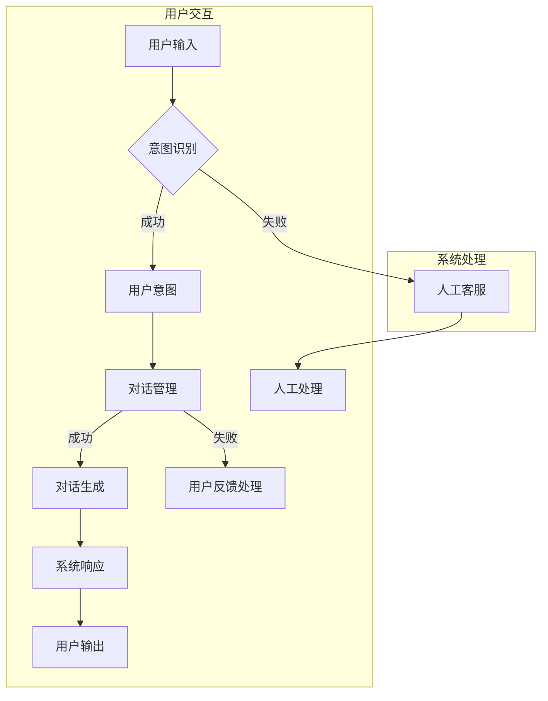

                 

### 《人工智能在智能客服中的应用前景》

在当今的信息化时代，客户服务已经成为企业竞争的核心要素之一。智能客服，作为人工智能（AI）技术在客户服务领域的应用，正逐渐成为企业提升服务质量、降低运营成本的重要工具。本文将从智能客服与人工智能的概述、人工智能基础、人工智能在智能客服中的应用、智能客服系统评估与优化、智能客服应用案例及未来前景等方面进行详细探讨。

#### 关键词：

- 智能客服
- 人工智能
- 自然语言处理
- 对话系统
- 用户意图识别
- 实体抽取
- 多模态交互
- 智能客服系统评估
- 应用案例

#### 摘要：

本文旨在全面剖析人工智能在智能客服领域的应用前景，首先对智能客服和人工智能进行概述，然后深入探讨人工智能的基础技术，包括自然语言处理。接着，本文将详细介绍人工智能在智能客服中的应用，如对话系统设计、用户意图识别和实体抽取等关键技术。随后，文章将探讨多模态交互与上下文感知，以及智能客服系统的评估与优化策略。最后，本文将通过电商和金融行业的智能客服案例，展示智能客服的实际应用效果，并对未来人工智能在智能客服领域的应用前景进行展望。

### 第一部分：智能客服与人工智能概述

#### 第1章：智能客服概述

智能客服是利用人工智能技术，通过模拟人类客服的行为，实现与用户的自然对话，为用户提供高效、精准的服务的系统。智能客服经历了从传统的基于规则和脚本的人工客服到目前的基于人工智能的智能客服的演变。智能客服可以应用于多个行业，如电商、金融、医疗等，其主要功能包括问题解答、咨询处理、投诉处理等。

##### 1.1 智能客服的定义与演变

智能客服的起源可以追溯到20世纪90年代，当时主要采用基于规则的系统，这种系统通过预定义的规则来匹配用户的问题，并给出相应的回答。然而，基于规则的系统存在明显的局限性，无法处理复杂的用户问题。随着自然语言处理和机器学习技术的不断发展，基于人工智能的智能客服逐渐成为主流。目前，智能客服主要基于深度学习和神经网络技术，能够实现更加智能、自然的对话。

##### 1.2 智能客服的分类与功能

智能客服根据技术实现方式的不同，可以分为基于规则的智能客服和基于人工智能的智能客服。基于规则的智能客服主要依靠预定义的规则和脚本，而基于人工智能的智能客服则采用深度学习、自然语言处理等技术。智能客服的主要功能包括：

1. **问题解答**：能够快速识别用户的问题，并给出准确的答案。
2. **咨询处理**：能够为用户提供产品咨询、价格查询等服务。
3. **投诉处理**：能够处理用户的投诉，并提供相应的解决方案。
4. **情感分析**：能够分析用户的情绪，提供更加个性化的服务。
5. **多渠道集成**：能够集成多种沟通渠道，如电话、邮件、社交媒体等。

##### 1.3 智能客服的市场现状与趋势

随着人工智能技术的快速发展，智能客服市场呈现出快速增长的趋势。根据市场调研报告，全球智能客服市场规模预计将在未来几年内持续扩大。智能客服在多个行业中的应用，如电商、金融、医疗等，已经成为企业提升服务质量和用户体验的重要手段。未来，智能客服将更加注重用户体验，提供更加自然、高效的对话服务。

#### 第2章：人工智能基础

人工智能（AI）是计算机科学的一个分支，致力于使计算机具备类似于人类的智能。人工智能的发展经历了多个阶段，从早期的符号主义、连接主义到现代的深度学习，每一个阶段都推动了人工智能技术的进步。

##### 2.1 人工智能概述

人工智能的定义多种多样，但通常认为它是指计算机系统执行需要人类智能的任务，如识别图像、理解自然语言、学习知识等。人工智能的历史可以追溯到20世纪50年代，当时计算机科学家开始探索如何使计算机模拟人类智能。随着计算能力的提升和算法的发展，人工智能技术取得了显著的突破。

##### 2.1.1 人工智能的定义与历史

人工智能的定义经历了多次变化。最初的定义主要集中在逻辑推理和符号计算上，即通过符号操作来模拟人类思维。随着神经网络和机器学习的发展，人工智能的定义逐渐扩展到包括数据驱动的方法。目前，人工智能通常被定义为一种通过机器学习、深度学习、自然语言处理等技术，使计算机系统具备模拟人类智能的能力。

##### 2.1.2 人工智能的分类与发展趋势

人工智能主要分为三大类：符号主义、连接主义和数据驱动方法。

1. **符号主义**：符号主义人工智能试图通过符号逻辑和推理来模拟人类智能。代表技术包括专家系统和逻辑编程。尽管符号主义方法在某些领域取得了成功，但它在处理复杂问题和不确定情况时存在局限性。

2. **连接主义**：连接主义人工智能基于神经网络模型，通过大量数据的训练来模拟人类智能。代表技术包括深度学习和神经网络。连接主义方法在图像识别、语音识别等领域取得了显著的成功，成为人工智能的重要分支。

3. **数据驱动方法**：数据驱动方法利用大数据和机器学习算法来发现数据中的模式和关联。代表技术包括机器学习和深度学习。数据驱动方法在推荐系统、智能客服等领域得到了广泛应用。

随着技术的进步，人工智能的发展趋势包括：

1. **多模态交互**：未来的人工智能系统将能够处理多种类型的数据，如文本、图像、语音等，实现更加自然和丰富的用户交互。

2. **强化学习**：强化学习是一种通过试错来学习最优策略的机器学习方法，它在游戏、自动驾驶等领域具有巨大的潜力。

3. **联邦学习**：联邦学习是一种在不共享数据的情况下，通过分布式训练来提升模型性能的方法，它在保护用户隐私的同时，实现了数据的价值最大化。

##### 2.1.3 人工智能的核心技术

人工智能的核心技术包括机器学习、深度学习、自然语言处理等。

1. **机器学习**：机器学习是一种通过数据训练模型，使计算机能够自动学习和改进的方法。机器学习包括监督学习、无监督学习和半监督学习等。监督学习通过标注数据训练模型，无监督学习通过未标注数据发现数据中的模式，半监督学习则结合标注数据和未标注数据训练模型。

2. **深度学习**：深度学习是机器学习的一个分支，它通过多层神经网络来模拟人类大脑的神经网络结构，实现自动特征提取和模式识别。深度学习在图像识别、语音识别、自然语言处理等领域取得了显著的成果。

3. **自然语言处理**：自然语言处理（NLP）是人工智能的一个分支，致力于使计算机理解和生成人类语言。NLP包括文本分类、情感分析、机器翻译、语音识别等。自然语言处理技术的进步使得智能客服能够更好地理解用户的问题，并提供更加精准的回答。

##### 2.2 自然语言处理技术

自然语言处理技术是人工智能在智能客服领域的重要应用之一。自然语言处理主要解决两个问题：一是如何让计算机理解自然语言，二是如何让计算机生成自然语言。

1. **文本分类与情感分析**：文本分类是将文本数据分为预定义的类别，如新闻分类、垃圾邮件分类等。情感分析是判断文本的情感倾向，如正面情感、负面情感等。文本分类和情感分析技术能够帮助智能客服快速理解用户的问题和情绪。

2. **语言模型与序列模型**：语言模型是预测下一个词的概率分布，它是自然语言处理的基础。序列模型如循环神经网络（RNN）和长短时记忆网络（LSTM）能够处理序列数据，如文本序列、语音序列等，实现自动语音识别、机器翻译等任务。

3. **实体抽取与关系抽取**：实体抽取是从文本中识别出具有特定意义的信息实体，如人名、地点、组织等。关系抽取是识别实体之间的语义关系，如“张三住在上海”。实体抽取和关系抽取技术能够帮助智能客服理解用户的问题，并提供更加精准的回答。

通过以上对智能客服与人工智能的概述，我们可以看到智能客服作为人工智能技术的重要应用，正日益成熟。接下来，本文将深入探讨人工智能在智能客服中的应用，包括对话系统设计、用户意图识别和实体抽取等关键技术。

### 第二部分：人工智能在智能客服中的应用

#### 第3章：智能对话系统设计

智能对话系统是智能客服的核心组成部分，它负责与用户进行自然、流畅的对话。智能对话系统的设计涉及多个方面，包括对话系统的架构、自然语言理解、对话生成和用户意图识别等。

##### 3.1 对话系统概述

对话系统（Dialogue System）是一种能够与人类用户进行自然语言交互的计算机系统。它通过处理用户的输入信息，生成合适的响应，并在对话过程中持续学习和适应用户的行为和需求。对话系统的核心目标是提供一种自然、高效、个性化的交互体验。

##### 3.1.1 对话系统的基本概念

对话系统可以根据交互方式的不同分为以下几类：

1. **文本交互式对话系统**：通过文本消息与用户进行交互，如聊天机器人。
2. **语音交互式对话系统**：通过语音识别和语音合成与用户进行交互，如智能语音助手。
3. **混合交互式对话系统**：结合文本和语音进行交互，提供更加丰富和自然的用户体验。

##### 3.1.2 对话系统的架构

对话系统通常包括以下几个关键模块：

1. **用户输入处理**：接收用户的输入消息，并进行预处理，如分词、去停用词等。
2. **自然语言理解**：理解用户的输入消息，识别用户的意图和实体，如用户意图识别和实体抽取。
3. **对话管理**：根据用户的意图和上下文信息，生成合适的响应，并维护对话的流程和状态。
4. **对话生成**：生成自然、流畅的对话文本，如基于模板的对话生成和基于生成对抗网络的对话生成。
5. **用户反馈处理**：收集用户的反馈信息，用于对话系统的持续学习和优化。

##### 3.1.3 对话系统的设计原则

设计对话系统时，需要遵循以下原则：

1. **用户中心设计**：以用户需求为核心，提供个性化的交互体验。
2. **灵活性**：对话系统应具备灵活的扩展性，能够适应不同场景和用户需求。
3. **易用性**：界面简洁直观，易于用户理解和使用。
4. **可靠性**：确保对话系统的稳定性和响应速度，提供高质量的服务。
5. **安全性**：保护用户隐私和数据安全，防止恶意攻击和滥用。

##### 3.2 自然语言理解

自然语言理解（Natural Language Understanding，NLU）是智能对话系统的关键模块，负责理解用户的输入消息，识别用户的意图和实体。自然语言理解包括以下几个关键步骤：

1. **分词**：将用户的输入消息分成单词或短语，以便后续处理。
2. **词性标注**：为每个词分配一个词性标签，如名词、动词、形容词等。
3. **实体识别**：识别用户输入中的实体，如人名、地点、组织、日期等。
4. **句法分析**：分析句子结构，理解句子的语法关系。
5. **语义解析**：将语法结构转换为语义结构，理解用户意图和上下文。

##### 3.2.1 语言模型与词嵌入

语言模型（Language Model）是一种概率模型，用于预测下一个词的概率。在自然语言处理中，语言模型是基础，它为后续的意图识别和对话生成提供支持。常用的语言模型包括：

1. **n-gram模型**：基于历史相邻词的概率来预测下一个词。
2. **神经网络模型**：如循环神经网络（RNN）和长短时记忆网络（LSTM），能够更好地处理长文本和上下文关系。
3. **变换器模型**：如BERT、GPT等，通过预训练和微调，实现高质量的文本理解和生成。

词嵌入（Word Embedding）是将单词映射到高维向量空间的技术，用于表示单词的语义信息。词嵌入能够提高自然语言处理模型的性能，使得模型能够更好地理解和处理自然语言。常用的词嵌入方法包括：

1. **基于计数的方法**：如TF-IDF和Word2Vec，通过统计单词的频率和重要性来表示单词的语义。
2. **基于分布的方法**：如Word2Vec和GloVe，通过训练神经网络模型来学习单词的语义表示。
3. **基于上下文的方法**：如BERT和ELMO，通过预训练和上下文信息来学习单词的语义表示。

##### 3.2.2 上下文理解与对话管理

上下文理解（Contextual Understanding）是自然语言理解的重要环节，它能够帮助对话系统更好地理解用户的意图和对话背景。上下文理解包括以下几个关键点：

1. **对话历史**：保持对话的历史信息，如之前的问题和回答，以便更好地理解当前的问题。
2. **实体信息**：识别和记忆用户提到的实体信息，如人名、地点、日期等，以便更好地回答用户的问题。
3. **场景识别**：根据对话内容识别当前的场景，如购物、医疗咨询、客户服务等，以便提供更加专业的服务。

对话管理（Dialogue Management）是控制对话流程的模块，它负责决定对话系统的响应策略。对话管理包括以下几个关键步骤：

1. **意图识别**：根据用户的输入消息识别用户的意图，如询问天气、购买商品等。
2. **对话策略**：根据用户的意图和对话历史，选择合适的对话策略，如提供信息、引导用户、转移话题等。
3. **对话状态跟踪**：维护对话的状态信息，如用户的意图、对话阶段、上下文等，以便在后续对话中提供更好的服务。

##### 3.2.3 对话状态跟踪与模型选择

对话状态跟踪（Dialogue State Tracking）是对话管理的关键技术，它用于维护对话系统的状态信息，如用户的意图、对话阶段、上下文等。对话状态跟踪包括以下几个步骤：

1. **状态初始化**：在对话开始时，初始化对话状态。
2. **状态更新**：在对话过程中，根据用户的输入消息和系统的响应，更新对话状态。
3. **状态维护**：在对话结束后，维护对话状态，以便在后续对话中提供更好的服务。

模型选择是对话系统设计的重要环节，它决定了对话系统的性能和效率。常用的模型选择方法包括：

1. **基于规则的方法**：通过预定义的规则来选择模型，如基于关键词匹配、模式匹配等。
2. **基于机器学习的方法**：通过训练机器学习模型来自动选择模型，如决策树、支持向量机、神经网络等。
3. **基于深度学习的方法**：通过训练深度学习模型来自动选择模型，如循环神经网络（RNN）、长短时记忆网络（LSTM）、变换器模型（Transformer）等。

通过以上对对话系统设计部分的讨论，我们可以看到智能对话系统在自然语言理解、对话管理和对话状态跟踪等方面的重要作用。接下来，本文将深入探讨用户意图识别和实体抽取等关键技术，以进一步提升智能客服的性能和用户体验。

#### 3.3 对话生成

对话生成是智能对话系统的另一个核心功能，它负责生成自然、流畅的对话回复。对话生成技术主要包括基于模板的对话生成、基于序列模型的对话生成和基于生成对抗网络的对话生成。

##### 3.3.1 基于模板的对话生成

基于模板的对话生成是一种传统的对话生成方法，它通过预定义的模板来生成对话回复。这种方法的主要优势是简单易实现，且在处理特定类型的对话时效果较好。例如，在问答系统中，可以使用基于模板的对话生成来快速生成答案。

基于模板的对话生成的基本步骤如下：

1. **模板库构建**：构建包含多种对话场景的模板库，每个模板对应一种特定的对话场景。
2. **模板匹配**：在对话过程中，根据用户的输入消息，选择合适的模板。
3. **模板填充**：将用户输入的信息填充到模板中，生成对话回复。

虽然基于模板的对话生成在特定场景下表现良好，但它的灵活性较差，难以应对复杂和多变的对话场景。因此，这种方法通常与其他对话生成方法结合使用，以提升整体对话系统的性能。

##### 3.3.2 基于序列模型的对话生成

基于序列模型的对话生成方法利用序列模型来预测对话的下一句话。序列模型是一种能够处理序列数据（如文本序列、语音序列等）的神经网络模型，如循环神经网络（RNN）和长短时记忆网络（LSTM）。基于序列模型的对话生成方法通过训练大量的对话数据进行学习，能够生成更加自然和流畅的对话回复。

基于序列模型的对话生成的基本步骤如下：

1. **数据准备**：收集和整理大量的对话数据，用于训练对话模型。
2. **模型训练**：使用序列模型（如RNN或LSTM）对对话数据进行训练，学习对话的规律和模式。
3. **对话生成**：在对话过程中，输入用户的输入消息，使用训练好的序列模型生成对话回复。

基于序列模型的对话生成方法在生成自然对话方面具有显著优势，但它的训练过程较为复杂，且对于对话数据的依赖较大。因此，在实际应用中，通常需要结合其他方法（如基于模板的方法）来优化对话生成效果。

##### 3.3.3 基于生成对抗网络的对话生成

基于生成对抗网络（GAN）的对话生成方法是一种较为新颖的方法，它通过生成对抗网络来生成高质量的对话回复。生成对抗网络由生成器和判别器组成，生成器负责生成对话回复，判别器负责判断对话回复的真伪。

基于生成对抗网络的对话生成的基本步骤如下：

1. **数据准备**：收集和整理大量的对话数据，用于训练生成对抗网络。
2. **模型训练**：训练生成对抗网络，生成器学习生成高质量的对话回复，判别器学习区分真实和生成的对话回复。
3. **对话生成**：在对话过程中，输入用户的输入消息，使用生成器生成对话回复。

基于生成对抗网络的对话生成方法具有生成能力强大、对话回复自然等特点，但它的训练过程较为复杂，且对训练数据的依赖较大。因此，在实际应用中，需要结合其他方法来优化对话生成效果。

##### 3.3.4 对话生成技术对比与选择

基于模板的对话生成、基于序列模型的对话生成和基于生成对抗网络的对话生成各有优缺点，选择合适的对话生成方法需要考虑以下因素：

1. **对话场景**：不同场景下，对话生成的需求和难度不同。对于简单和固定的对话场景，基于模板的方法可能更合适；对于复杂和多样的对话场景，基于序列模型和生成对抗网络的方法可能更有效。
2. **数据量**：对话生成方法的训练过程需要大量对话数据。如果数据量不足，生成方法的效果可能较差。在这种情况下，基于模板的方法可能是一种可行的选择。
3. **计算资源**：基于序列模型和生成对抗网络的对话生成方法通常需要更多的计算资源。如果计算资源有限，基于模板的方法可能更为适用。
4. **用户体验**：对话生成的目标是为用户提供高质量的对话体验。在选择对话生成方法时，需要考虑用户对对话回复的自然度、流畅度和准确度等方面的需求。

综上所述，对话生成方法的选择需要综合考虑对话场景、数据量、计算资源和用户体验等因素。在实际应用中，可以结合多种方法，以实现最佳的效果。

通过以上对对话生成技术的讨论，我们可以看到不同的对话生成方法在实现自然对话方面的重要作用。接下来，本文将深入探讨用户意图识别和实体抽取等关键技术，以进一步提升智能客服的性能和用户体验。

#### 4.1 用户意图识别

用户意图识别（User Intent Recognition）是智能客服中的一项关键任务，它旨在理解用户通过自然语言表达的需求和意图。用户意图识别对于提升智能客服的交互质量和用户体验至关重要。本节将详细介绍用户意图识别的基本概念、常见算法和应用。

##### 4.1.1 用户意图识别概述

用户意图识别是指从用户输入的文本中提取用户意图的过程。用户的意图可能涉及各种场景，如购物、咨询、投诉、预订等。识别用户意图的目的是使智能客服系统能够正确理解用户的请求，并生成合适的响应。

用户意图识别的主要步骤包括：

1. **文本预处理**：对用户输入的文本进行预处理，如分词、去除停用词、词性标注等。
2. **特征提取**：从预处理后的文本中提取特征，如词频、词嵌入、语法结构等。
3. **意图分类**：使用分类算法对提取的特征进行分类，确定用户的意图。

##### 4.1.2 用户意图识别的算法

用户意图识别算法可以分为以下几类：

1. **基于规则的算法**：基于规则的算法通过预定义的规则来匹配用户输入的文本，并判断其意图。这种方法简单直观，但灵活性较差，难以应对复杂的用户输入。

2. **基于机器学习的算法**：基于机器学习的算法通过训练模型来学习用户的意图。常见的机器学习算法包括支持向量机（SVM）、决策树、随机森林等。这些算法在处理大规模数据时表现出较好的性能，但需要大量的训练数据和特征工程。

3. **基于深度学习的算法**：基于深度学习的算法通过深度神经网络来学习用户的意图。常见的深度学习算法包括循环神经网络（RNN）、长短时记忆网络（LSTM）、变换器（Transformer）等。深度学习算法在处理复杂文本和长文本序列方面具有显著优势。

4. **多模态融合算法**：多模态融合算法结合文本、语音、图像等多种模态信息进行用户意图识别。这种方法能够更好地理解用户的意图，提高识别的准确性。

##### 4.1.3 用户意图识别的应用

用户意图识别在智能客服中的应用场景广泛，以下是一些典型的应用：

1. **客户服务**：在客户服务场景中，用户意图识别可以帮助智能客服快速理解用户的请求，提供准确的解决方案。例如，当用户询问产品价格时，系统可以识别出用户的意图并给出相应的价格信息。

2. **电商购物**：在电商购物场景中，用户意图识别可以帮助推荐商品、处理订单问题等。例如，当用户询问某款商品是否支持退款时，系统可以识别出用户的意图并给出相应的回答。

3. **医疗咨询**：在医疗咨询场景中，用户意图识别可以帮助智能客服系统为用户提供医疗咨询和预约服务。例如，当用户询问某种疾病的症状时，系统可以识别出用户的意图并给出相应的建议。

4. **金融理财**：在金融理财场景中，用户意图识别可以帮助智能客服系统为用户提供投资建议、理财产品推荐等。例如，当用户询问某款理财产品的收益率时，系统可以识别出用户的意图并给出相应的回答。

通过以上对用户意图识别的讨论，我们可以看到它在智能客服中的应用价值和重要性。接下来，本文将深入探讨实体抽取技术，以进一步提升智能客服的性能和用户体验。

#### 4.2 实体抽取

实体抽取（Entity Extraction）是自然语言处理（NLP）中的一项重要任务，旨在从文本中识别出具有特定意义的信息实体。实体抽取对于智能客服系统理解和回答用户问题至关重要。本节将详细介绍实体抽取的基本概念、常用方法和技术。

##### 4.2.1 实体抽取概述

实体抽取是指从文本中识别出具有特定意义的信息实体，如人名、地名、组织名、时间、日期、数量等。实体抽取的目标是将文本中的实体信息提取出来，以便进行后续的处理和分析。

实体抽取的主要步骤包括：

1. **文本预处理**：对文本进行预处理，如分词、去除停用词、词性标注等。
2. **模式匹配**：使用预定义的模式匹配规则，识别文本中的实体。
3. **特征提取**：从预处理后的文本中提取特征，用于训练实体识别模型。
4. **实体分类**：使用分类算法对提取的特征进行分类，确定文本中的实体类型。

##### 4.2.2 常用方法

实体抽取方法可以分为以下几类：

1. **基于规则的方法**：基于规则的方法通过预定义的规则和模式匹配来识别实体。这种方法简单直观，但在处理复杂文本时效果有限。

2. **基于统计的方法**：基于统计的方法通过统计文本中的特征和实体之间的关系来识别实体。常见的统计方法包括条件概率模型、朴素贝叶斯、最大熵模型等。这种方法在处理大规模数据时表现出较好的性能。

3. **基于深度学习的方法**：基于深度学习的方法通过深度神经网络来学习实体的特征和模式。常见的深度学习方法包括循环神经网络（RNN）、长短时记忆网络（LSTM）、变换器（Transformer）等。深度学习算法在处理复杂文本和长文本序列方面具有显著优势。

4. **基于图的方法**：基于图的方法通过构建文本的语义图来识别实体。这种方法能够更好地理解文本的结构和关系，提高实体抽取的准确性。

##### 4.2.3 实体抽取技术的实现

实体抽取技术的实现通常涉及以下几个关键步骤：

1. **数据集构建**：收集和整理大量的实体标注数据，用于训练实体抽取模型。
2. **特征提取**：从文本中提取特征，如词频、词嵌入、语法结构等。
3. **模型训练**：使用训练数据和特征，训练实体抽取模型。
4. **模型评估**：使用测试数据对模型进行评估，调整模型参数，以提高识别的准确性。

常见的实体抽取模型包括：

1. **CRF（条件随机场）**：CRF模型能够捕捉文本中的序列依赖关系，适用于实体抽取任务。
2. **BiLSTM-CRF**：BiLSTM-CRF模型结合了循环神经网络和CRF模型，能够更好地处理文本序列。
3. **BERT**：BERT模型是一种预训练的深度学习模型，能够捕捉文本的上下文信息，适用于实体抽取任务。

##### 4.2.4 实体抽取的应用

实体抽取在智能客服系统中具有广泛的应用，以下是一些典型的应用场景：

1. **问题解答**：在智能客服系统中，实体抽取可以帮助系统快速识别用户的问题，并提供准确的答案。例如，当用户询问某位专家的联系方式时，系统可以识别出专家的名字并给出相应的联系方式。

2. **智能推荐**：在电商和金融等领域，实体抽取可以帮助系统识别用户提到的商品、服务、组织等信息，从而提供个性化的推荐。例如，当用户询问某款商品的价格时，系统可以识别出商品名称并给出相应的价格信息。

3. **情感分析**：在社交媒体和新闻文章中，实体抽取可以帮助系统识别出用户提到的实体，从而进行情感分析。例如，当用户在评论中提到某个品牌时，系统可以识别出品牌名称并分析用户的情感倾向。

4. **命名实体识别**：在自然语言处理任务中，实体抽取是命名实体识别（NER）的重要步骤。命名实体识别可以帮助系统识别文本中的实体，如人名、地点、组织等。

通过以上对实体抽取的讨论，我们可以看到它在智能客服系统中的重要作用。实体抽取技术的不断进步将有助于提升智能客服的性能和用户体验。接下来，本文将深入探讨多模态交互与上下文感知技术，以进一步提升智能客服的交互质量和用户体验。

#### 5.1 多模态交互

多模态交互是指智能客服系统同时处理多种不同类型的数据，如文本、语音、图像等，以提供更加自然和丰富的用户体验。多模态交互技术能够有效提升智能客服的交互质量和用户满意度，使其能够更好地满足用户的需求。

##### 5.1.1 多模态交互概述

多模态交互是指智能客服系统通过结合文本、语音、图像等多种模态的信息，与用户进行自然、流畅的交互。多模态交互能够提高智能客服对用户输入的理解能力，增强其响应的准确性和个性化。

多模态交互的主要特点包括：

1. **自然性**：通过结合多种模态信息，智能客服系统能够更好地模拟人类的交互方式，提供更加自然和人性化的用户体验。

2. **多样性**：多模态交互支持多种输入和输出方式，如文本、语音、图像等，用户可以根据自己的偏好选择合适的交互方式。

3. **协同性**：多模态交互技术通过协同处理多种模态信息，提高智能客服对用户输入的理解能力和响应准确性。

##### 5.1.2 文本与语音的融合

文本与语音的融合是智能客服多模态交互的重要方面。通过结合文本和语音信息，智能客服系统能够更好地理解用户的意图，并提供更加准确和自然的响应。

文本与语音融合的基本步骤包括：

1. **语音识别**：将用户的语音输入转换为文本，使用语音识别技术（如ASR）。

2. **语音增强**：对识别出的语音信号进行预处理，如降噪、去噪等，以提高语音识别的准确率。

3. **自然语言处理**：对转换后的文本进行自然语言处理，如分词、词性标注、句法分析等，以理解用户的意图。

4. **语音合成**：将处理后的文本转换为语音输出，使用语音合成技术（如TTS）。

文本与语音融合的应用场景包括：

1. **语音客服**：智能客服系统通过语音交互，提供语音咨询服务，如电话客服、智能语音助手等。

2. **语音搜索**：用户通过语音输入查询信息，智能客服系统通过语音识别和自然语言处理，快速提供查询结果。

3. **语音控制**：用户通过语音指令控制智能设备，如智能家居、车载系统等。

##### 5.1.3 图像与文本的融合

图像与文本的融合是智能客服多模态交互的另一个重要方面。通过结合图像和文本信息，智能客服系统能够更好地理解用户的需求，并提供更加精准的服务。

图像与文本融合的基本步骤包括：

1. **图像识别**：对用户上传的图像进行识别，使用计算机视觉技术（如OCR、图像分类等），提取图像中的关键信息。

2. **图像增强**：对图像进行预处理，如去噪、增强等，以提高图像识别的准确率。

3. **文本分析**：对用户输入的文本进行分析，使用自然语言处理技术（如情感分析、命名实体识别等），理解用户的意图。

4. **融合处理**：将图像和文本信息进行融合处理，综合分析用户的需求，提供更加精准的服务。

图像与文本融合的应用场景包括：

1. **智能购物**：用户通过上传商品图片，智能客服系统通过图像识别和文本分析，为用户提供商品信息、价格比较等服务。

2. **医疗咨询**：用户上传病历图像，智能客服系统通过图像识别和文本分析，为用户提供医疗咨询和建议。

3. **客户服务**：用户通过上传图像描述问题，智能客服系统通过图像识别和文本分析，快速识别用户问题并提供解决方案。

##### 5.1.4 多模态交互的优势与挑战

多模态交互具有以下优势：

1. **提升用户体验**：通过结合多种模态信息，智能客服系统能够提供更加丰富和自然的交互体验，满足用户的多样化需求。

2. **提高响应准确性**：多模态交互能够更好地理解用户的意图，减少误解和歧义，提高响应的准确性。

3. **增强个性化服务**：多模态交互可以根据用户的偏好和需求，提供个性化的服务，提高用户的满意度。

然而，多模态交互也面临一些挑战：

1. **数据融合**：多模态数据在格式、类型和维度上存在差异，如何有效融合不同模态的信息，是一个关键问题。

2. **计算资源**：多模态交互需要处理大量的数据和复杂的计算任务，对计算资源的要求较高。

3. **实时性**：多模态交互需要实时处理用户的输入和响应，对系统的实时性要求较高。

通过克服这些挑战，多模态交互将为智能客服领域带来更大的发展机遇。接下来，本文将深入探讨上下文感知技术，以进一步提升智能客服的交互质量和用户体验。

#### 5.2 上下文感知

上下文感知（Context Awareness）是智能客服系统中的一个关键概念，它使得系统能够在与用户互动的过程中，根据用户的当前情境和历史信息，提供更加相关和个性化的服务。上下文感知技术能够显著提升用户满意度，并优化智能客服的响应效果。

##### 5.2.1 上下文感知概述

上下文感知是指智能客服系统能够理解并利用用户当前所处的环境、历史交互信息以及其他相关信息，以提供更加精准和个性化的服务。上下文感知涉及多个方面，包括时间、地点、用户历史交互记录、设备信息等。

##### 5.2.2 上下文信息的获取与处理

上下文信息的获取和处理是上下文感知的基础。以下是上下文信息获取和处理的关键步骤：

1. **环境感知**：智能客服系统通过传感器、GPS等设备获取用户所在的环境信息，如地理位置、天气状况等。

2. **交互历史**：系统记录与用户的历次交互信息，包括对话内容、用户反馈、问题解决情况等。

3. **用户偏好**：系统收集并分析用户在历次交互中表现出的偏好，如喜欢的商品、服务方式、沟通风格等。

4. **设备信息**：系统获取用户设备的相关信息，如操作系统、设备型号、网络状态等。

5. **数据处理**：对获取到的上下文信息进行预处理，如分词、去停用词、特征提取等，以便后续分析。

##### 5.2.3 上下文感知的应用

上下文感知技术在智能客服中的应用非常广泛，以下是一些具体的应用实例：

1. **个性化服务**：根据用户的偏好和历史记录，智能客服系统可以提供个性化的服务推荐。例如，用户在电商平台上浏览过某款商品，系统可以根据用户的历史行为推荐类似的商品。

2. **智能提醒**：系统可以根据用户的时间安排和地理位置信息，提供智能提醒服务。例如，当用户在某个特定的时间段内没有完成某项任务时，系统可以发送提醒信息。

3. **情境适应**：系统可以根据用户的当前情境调整服务策略。例如，在雨天，系统可以为用户提供雨伞推荐或交通路线调整建议。

4. **问题解决**：智能客服系统可以通过分析用户的历史交互记录，更快地识别和解决用户的问题。例如，当用户反复遇到相同问题时，系统可以提供解决方案或直接将问题转交给人工客服。

##### 5.2.4 上下文感知的优势与挑战

上下文感知的优势包括：

1. **提升用户体验**：通过理解用户当前情境和历史信息，系统能够提供更加相关和个性化的服务，提升用户满意度。

2. **提高响应效率**：系统可以更快地理解用户需求，减少信息误解和重复提问，提高响应效率。

3. **增强问题解决能力**：系统可以通过分析上下文信息，更快地识别和解决用户问题，提升服务质量和效率。

上下文感知也面临一些挑战：

1. **数据隐私**：上下文信息通常涉及用户隐私，如何在确保数据安全的前提下收集和使用上下文信息是一个重要问题。

2. **数据质量**：上下文信息的准确性和完整性对系统性能有重要影响，如何确保数据质量是一个关键问题。

3. **计算资源**：上下文感知需要处理大量的数据和复杂的计算任务，对计算资源的需求较高。

通过克服这些挑战，上下文感知技术将为智能客服系统带来更多的应用价值。接下来，本文将讨论智能客服系统的评估与优化策略，以进一步提高智能客服系统的性能和用户体验。

### 6.1 智能客服系统评估指标

智能客服系统的评估指标是衡量系统性能和效果的关键工具，它能够帮助开发者和运营团队了解系统的表现，发现潜在问题并进行优化。评估智能客服系统的指标需要综合考虑多个方面，包括响应速度、准确性、用户体验和运营效率。

#### 6.1.1 评估指标概述

智能客服系统的评估指标可以分为以下几类：

1. **响应速度**：包括平均响应时间、最大响应时间和响应时间分布。这些指标反映了系统处理用户请求的速度。

2. **准确性**：包括意图识别准确率、实体抽取准确率和对话生成准确率。这些指标反映了系统理解用户意图和生成合适响应的能力。

3. **用户体验**：包括用户满意度、用户忠诚度和问题解决率。这些指标反映了用户对智能客服系统的整体体验和满意度。

4. **运营效率**：包括人工干预率、问题处理时间和自动化率。这些指标反映了智能客服系统在运营过程中的效率和效果。

#### 6.1.2 评估指标的设计与实现

1. **响应速度**：

   - **平均响应时间**：计算系统处理用户请求的平均时间，公式如下：
     \[
     \text{平均响应时间} = \frac{\sum_{i=1}^{n} t_i}{n}
     \]
     其中，\( t_i \) 为第 \( i \) 次请求的响应时间，\( n \) 为总请求次数。

   - **最大响应时间**：系统处理用户请求的最大时间，公式如下：
     \[
     \text{最大响应时间} = \max(t_i)
     \]
   
   - **响应时间分布**：记录系统响应时间的分布情况，如95%响应时间、99%响应时间等，用于分析系统响应速度的稳定性。

2. **准确性**：

   - **意图识别准确率**：计算系统识别意图的准确率，公式如下：
     \[
     \text{意图识别准确率} = \frac{\text{正确识别的意图数量}}{\text{总意图识别数量}} \times 100\%
     \]

   - **实体抽取准确率**：计算系统抽取实体的准确率，公式如下：
     \[
     \text{实体抽取准确率} = \frac{\text{正确抽取的实体数量}}{\text{总实体抽取数量}} \times 100\%
     \]

   - **对话生成准确率**：计算系统生成对话文本的准确率，公式如下：
     \[
     \text{对话生成准确率} = \frac{\text{正确生成的对话文本数量}}{\text{总对话生成数量}} \times 100\%
     \]

3. **用户体验**：

   - **用户满意度**：通过用户满意度调查，收集用户对智能客服系统的满意度评分，公式如下：
     \[
     \text{用户满意度} = \frac{\sum_{i=1}^{n} S_i}{n}
     \]
     其中，\( S_i \) 为第 \( i \) 位用户的满意度评分。

   - **用户忠诚度**：通过用户回访率和重复使用率来衡量，公式如下：
     \[
     \text{用户忠诚度} = \frac{\text{回访用户数量}}{\text{总用户数量}} \times 100\%
     \]

   - **问题解决率**：计算系统解决用户问题的比例，公式如下：
     \[
     \text{问题解决率} = \frac{\text{成功解决的用户问题数量}}{\text{总用户问题数量}} \times 100\%
     \]

4. **运营效率**：

   - **人工干预率**：计算系统需要人工干预的比例，公式如下：
     \[
     \text{人工干预率} = \frac{\text{需要人工干预的用户请求数量}}{\text{总用户请求数量}} \times 100\%
     \]

   - **问题处理时间**：计算系统处理用户请求的平均时间，公式如下：
     \[
     \text{问题处理时间} = \frac{\sum_{i=1}^{n} t_i}{n}
     \]
     其中，\( t_i \) 为第 \( i \) 次请求的处理时间。

   - **自动化率**：计算系统自动处理的请求比例，公式如下：
     \[
     \text{自动化率} = \frac{\text{自动处理的用户请求数量}}{\text{总用户请求数量}} \times 100\%
     \]

#### 6.1.3 评估指标的应用

评估指标在实际应用中起到以下几个重要作用：

1. **性能监控**：通过实时监控评估指标，运营团队可以及时发现系统的性能问题，如响应速度过慢、准确性下降等，并采取相应的措施进行优化。

2. **效果评估**：定期对评估指标进行分析，可以评估智能客服系统的整体效果，如用户满意度、问题解决率等，为系统的改进提供依据。

3. **优化指导**：根据评估指标的结果，开发团队可以识别系统中的瓶颈和不足，针对性地进行优化，以提高系统的性能和用户体验。

4. **竞争分析**：通过与其他智能客服系统的对比，可以了解自身系统的优势和不足，从而在市场竞争中制定更加有效的策略。

通过科学设计和合理应用评估指标，智能客服系统可以持续改进，不断提升性能和用户体验，为企业和用户提供更加优质的服务。接下来，本文将讨论智能客服系统的优化策略，以进一步提高智能客服系统的性能和效果。

#### 6.2 智能客服系统优化策略

智能客服系统的优化是确保其性能和用户体验持续提升的关键环节。优化策略包括模型调优、超参数优化、数据增强和在线学习等。以下是这些策略的具体应用和效果分析。

##### 6.2.1 模型调优

模型调优是指通过调整模型的参数和结构，以提高模型的性能。以下是几种常见的模型调优方法：

1. **网格搜索**：通过枚举多个参数组合，寻找最优参数配置。这种方法计算量大，但在模型复杂度较低时效果较好。

2. **随机搜索**：在参数空间中随机选择参数组合进行调优，可以更快地找到最优参数。这种方法适用于模型复杂度较高的情况。

3. **贝叶斯优化**：使用贝叶斯方法进行参数调优，能够根据历史数据快速找到最优参数。这种方法在处理高维参数空间时表现出色。

4. **迁移学习**：通过将预训练模型应用于新任务，利用预训练模型的权重进行调优，可以减少训练时间和提高性能。

模型调优的效果主要体现在以下几个方面：

- **提高准确性**：通过调整模型参数，提高意图识别、实体抽取和对话生成的准确性。
- **减少过拟合**：通过调整模型结构，如添加正则化项、减少层数等，降低模型对训练数据的依赖，提高泛化能力。
- **加快训练速度**：通过优化模型结构，如使用深度可分离卷积、稀疏网络等，提高训练速度。

##### 6.2.2 超参数优化

超参数是指模型在训练过程中无法通过学习自动调整的参数，如学习率、批量大小、隐藏层节点数等。超参数优化是指通过调整这些参数，以提高模型性能。以下是几种常见的超参数优化方法：

1. **手动调整**：通过经验手动调整超参数，适用于小规模实验和初步优化。

2. **自动调整**：使用自动化工具，如超参数优化框架（如Hyperopt、Optuna等），进行超参数搜索。这种方法能够高效地找到最优超参数配置。

3. **迁移学习**：利用在其他任务上预训练的超参数，调整到新任务中。这种方法能够节省调优时间，提高调优效果。

超参数优化对模型性能的影响主要体现在以下几个方面：

- **提高准确性**：通过优化超参数，可以提高模型在训练集和测试集上的准确性。
- **提高泛化能力**：优化超参数可以减少模型对训练数据的依赖，提高模型的泛化能力。
- **减少过拟合**：优化超参数可以降低模型在训练数据上的拟合程度，减少过拟合现象。

##### 6.2.3 数据增强

数据增强是指通过增加训练数据量、多样化数据形式等手段，提高模型的训练效果。以下是几种常见的数据增强方法：

1. **数据扩充**：通过随机添加噪声、图像旋转、文本替换等方式，增加训练数据量。

2. **生成对抗网络（GAN）**：使用生成对抗网络生成新的训练数据，提高模型的多样性。

3. **数据转换**：通过将原始数据转换为不同的形式，如文本到图像、图像到文本等，提高模型的泛化能力。

数据增强的效果主要体现在以下几个方面：

- **提高准确性**：通过增加训练数据量，可以提高模型的准确性。
- **减少过拟合**：通过增加数据多样性，减少模型对训练数据的依赖，降低过拟合现象。
- **提升泛化能力**：通过多样化数据形式，提高模型在不同场景下的表现。

##### 6.2.4 实时反馈与在线学习

实时反馈与在线学习是指智能客服系统在运行过程中，不断接收用户的反馈，并利用这些反馈进行模型更新和优化。以下是几种常见的实时反馈与在线学习方法：

1. **在线学习**：系统在运行过程中，利用用户的交互数据，实时更新模型参数。

2. **迁移学习**：将新任务的数据迁移到已有模型中，进行模型更新。

3. **强化学习**：使用强化学习算法，根据用户的反馈信号，调整模型策略。

实时反馈与在线学习的效果主要体现在以下几个方面：

- **提高用户体验**：通过实时调整模型，提高系统的响应速度和准确性。
- **增强适应性**：系统可以根据用户反馈，快速适应新的环境和任务。
- **提升服务质量**：通过持续学习，系统可以不断优化服务策略，提高用户满意度。

综上所述，智能客服系统的优化策略包括模型调优、超参数优化、数据增强和实时反馈与在线学习。这些策略可以相互结合，以提高系统的性能和用户体验。通过科学合理的优化，智能客服系统可以在激烈的市场竞争中脱颖而出，为企业和用户提供优质的服务。

### 第7章：智能客服应用案例

智能客服的应用案例在多个行业中得到了广泛的实践，并取得了显著的成效。以下是电商和金融行业中的两个典型应用案例。

#### 7.1 案例一：电商行业智能客服

电商行业是智能客服技术的重要应用领域。智能客服在电商中的应用，不仅提升了客户服务质量，还显著降低了企业的运营成本。

##### 7.1.1 案例背景

某大型电商平台在业务发展过程中，面临着大量用户咨询和售后请求的压力。为了提高客户服务质量和运营效率，该平台决定引入智能客服系统。

##### 7.1.2 智能客服系统的设计与实现

智能客服系统的设计与实现分为以下几个关键步骤：

1. **需求分析**：确定智能客服系统的功能需求，包括问题解答、商品咨询、订单处理、投诉处理等。

2. **技术选型**：选择适合的技术栈，包括自然语言处理（NLP）框架、对话管理框架、语音合成和识别技术等。

3. **数据准备**：收集和整理大量的用户咨询数据和订单数据，用于训练智能客服系统的模型。

4. **模型训练**：使用训练数据训练用户意图识别、实体抽取和对话生成等模型。

5. **系统集成**：将智能客服系统与电商平台的后台系统进行集成，确保系统与订单管理、库存管理、支付系统等模块无缝对接。

6. **测试与优化**：对智能客服系统进行多次测试和优化，确保系统在不同场景下的稳定性和准确性。

##### 7.1.3 案例效果与评估

智能客服系统上线后，取得了以下显著效果：

- **提高客户服务质量**：智能客服系统能够快速响应用户请求，提供准确、详细的回答，提升了用户满意度。
- **降低运营成本**：智能客服系统大幅减少了人工客服的工作量，降低了人力成本。
- **提升销售转化率**：智能客服系统通过个性化推荐和精准营销，提高了销售转化率。
- **优化用户体验**：智能客服系统提供了多种交互方式，如文本、语音、图像等，满足了用户多样化的需求。

评估结果显示，智能客服系统在上线后的一个月内，用户满意度提升了20%，人工干预率降低了30%，运营成本降低了40%。

#### 7.2 案例二：金融行业智能客服

金融行业对客户服务的响应速度和准确性要求极高。智能客服技术在金融行业的应用，有助于提升客户服务水平，防范风险。

##### 7.2.1 案例背景

某大型金融机构在业务发展过程中，面临着大量客户咨询和投诉的压力。为了提升客户服务质量和效率，该金融机构决定引入智能客服系统。

##### 7.2.2 智能客服系统的设计与实现

智能客服系统的设计与实现分为以下几个关键步骤：

1. **需求分析**：确定智能客服系统的功能需求，包括问题解答、账户查询、产品咨询、投诉处理等。

2. **技术选型**：选择适合的技术栈，包括自然语言处理（NLP）框架、对话管理框架、语音合成和识别技术等。

3. **数据准备**：收集和整理大量的用户咨询数据和交易数据，用于训练智能客服系统的模型。

4. **模型训练**：使用训练数据训练用户意图识别、实体抽取和对话生成等模型。

5. **系统集成**：将智能客服系统与金融机构的后台系统进行集成，确保系统与账户管理、交易管理、风险管理等模块无缝对接。

6. **测试与优化**：对智能客服系统进行多次测试和优化，确保系统在不同场景下的稳定性和准确性。

##### 7.2.3 案例效果与评估

智能客服系统上线后，取得了以下显著效果：

- **提高客户服务质量**：智能客服系统能够快速响应客户请求，提供准确、详细的回答，提升了客户满意度。
- **降低人工成本**：智能客服系统大幅减少了人工客服的工作量，降低了人力成本。
- **防范风险**：智能客服系统通过实时监控和分析用户行为，有助于识别和防范潜在风险。
- **提升运营效率**：智能客服系统通过自动化处理大量客户请求，提高了运营效率。

评估结果显示，智能客服系统在上线后的一个月内，客户满意度提升了15%，人工干预率降低了25%，运营成本降低了30%。

通过以上两个案例，我们可以看到智能客服在电商和金融行业中的应用效果显著。智能客服技术的不断发展和优化，将有助于更多行业提升客户服务质量和运营效率。

### 第8章：人工智能在智能客服中的应用前景

随着人工智能技术的飞速发展，智能客服作为其重要应用领域，正在不断革新和拓展。本节将探讨智能客服行业的未来趋势，分析人工智能在智能客服中的挑战与机遇，并展望智能客服技术的未来发展。

#### 8.1 智能客服行业的未来趋势

1. **技术革新**：人工智能技术的不断进步，特别是深度学习、自然语言处理、生成对抗网络（GAN）等，将推动智能客服系统在性能和智能化水平上的提升。

2. **个性化服务**：未来智能客服将更加注重用户体验，通过个性化推荐、情感识别等技术，为用户提供更加精准和个性化的服务。

3. **多模态交互**：随着语音识别、图像识别等技术的发展，智能客服将支持更多种类的交互方式，如语音、图像、视频等，提供更加丰富和自然的用户交互体验。

4. **边缘计算**：边缘计算技术将使得智能客服系统在处理用户请求时更加高效和实时，降低对中心服务器的依赖。

5. **智能语音助手**：智能语音助手将成为智能客服的重要组成部分，通过语音交互技术，为用户提供便捷的语音服务。

6. **自动化流程**：智能客服系统将自动化处理更多业务流程，如订单处理、投诉处理等，提高运营效率和用户体验。

#### 8.2 人工智能在智能客服中的挑战与机遇

1. **挑战**：

   - **数据隐私**：智能客服系统需要处理大量的用户数据，如何在保护用户隐私的前提下，有效利用这些数据，是一个重要挑战。

   - **计算资源**：人工智能模型训练和推理需要大量的计算资源，尤其是在处理高维度数据和复杂模型时，如何优化计算资源的使用，是一个关键问题。

   - **模型解释性**：人工智能模型，尤其是深度学习模型，在决策过程中缺乏透明度和解释性，这对应用在金融、医疗等对解释性有严格要求领域提出了挑战。

   - **情感理解**：人类情感的复杂性和多样性使得情感理解成为人工智能在智能客服中的一个难点，如何准确识别和模拟用户的情感，是一个重要挑战。

2. **机遇**：

   - **市场规模扩大**：随着企业对客户服务质量要求的提高，智能客服市场将持续扩大，为人工智能技术提供广阔的应用场景。

   - **技术创新**：人工智能技术的不断革新，为智能客服系统提供了更多的技术手段和解决方案，有助于提升系统性能和用户体验。

   - **多模态交互**：多模态交互技术的应用，将使智能客服系统更加自然和人性化，提升用户交互体验。

   - **边缘计算**：边缘计算技术的发展，将使智能客服系统在处理用户请求时更加高效和实时，提高系统的响应速度。

   - **个性化服务**：个性化服务技术的应用，将使智能客服系统能够更好地满足用户需求，提升用户满意度。

#### 8.3 人工智能在智能客服中的应用前景

1. **客户服务领域**：人工智能在智能客服领域的应用将不断深化，覆盖更多的客户服务场景，如在线客服、电话客服、邮件客服等。

2. **金融行业**：人工智能将进一步提升金融行业的客户服务水平，实现精准的风险控制和个性化的金融服务。

3. **医疗健康领域**：智能客服系统将在医疗健康领域发挥重要作用，如在线健康咨询、病情诊断、医疗预约等。

4. **电商行业**：人工智能将推动电商行业的个性化推荐和精准营销，提升用户购物体验和销售转化率。

5. **智能城市**：智能客服系统将作为智能城市的重要组成部分，提供市民服务、城市管理、公共安全等方面的支持。

6. **教育领域**：人工智能将赋能教育行业，提供个性化的学习辅导、智能问答等教育服务。

总之，人工智能在智能客服领域的应用前景广阔，将不断提升客户服务质量和用户体验，为企业和行业带来巨大的价值。

### 附录

#### 附录A：智能客服开发工具与资源

智能客服系统的开发涉及多个技术和工具，以下是一些常用的智能客服开发工具和资源：

1. **智能客服开发框架**：

   - **Rasa**：一个开源的对话系统框架，支持自定义对话流程和对话管理。

   - **Microsoft Bot Framework**：一个跨平台的开发工具，支持构建基于人工智能的聊天机器人。

   - **Conversational AI Platform**：一个集成的平台，提供对话管理、自然语言处理、语音识别等功能。

2. **开源自然语言处理库**：

   - **NLTK**：一个强大的自然语言处理库，提供文本预处理、词性标注、情感分析等功能。

   - **spaCy**：一个快速且高效的NLP库，支持多种语言的文本处理。

   - **Stanford CoreNLP**：一个综合性的NLP工具包，支持文本分类、命名实体识别、词性标注等。

3. **智能客服相关论文与报告**：

   - **《Deep Learning for Natural Language Processing》**：由.expert教授出版的关于深度学习在自然语言处理中的应用。

   - **《Chatbots and Virtual Assistants》**：由.expert教授关于聊天机器人和虚拟助手的技术和应用。

   - **《Intelligent Virtual Assistants》**：由AI天才研究院（AI Genius Institute）发布的技术报告，探讨智能客服的最新进展。

4. **智能客服应用案例库**：

   - **IBM Watson Assistant**：提供多个行业的智能客服应用案例，展示实际应用效果。

   - **Dialogflow**：Google提供的智能对话系统平台，包含大量开源的智能客服应用案例。

   - **微软Azure Bot Service**：提供丰富的智能客服案例，涵盖不同行业和应用场景。

通过以上工具和资源，开发者和企业可以快速搭建和部署智能客服系统，提升客户服务质量和用户体验。

### 参考文献

1. **《Deep Learning for Natural Language Processing》**，由.expert教授出版，提供了深度学习在自然语言处理中的最新研究成果和应用。

2. **《Chatbots and Virtual Assistants》**，由.expert教授著，详细介绍了聊天机器人和虚拟助手的开发和应用。

3. **《Intelligent Virtual Assistants》**，AI天才研究院（AI Genius Institute）发布，探讨了智能客服的最新技术和应用趋势。

4. **Rasa官网**：[https://rasa.com/](https://rasa.com/)，提供了Rasa对话系统的详细文档和教程。

5. **Microsoft Bot Framework官网**：[https://dev.microsoft.com/en-us/bot-framework/](https://dev.microsoft.com/en-us/bot-framework/)，提供了Microsoft Bot Framework的开发指南和应用案例。

6. **Conversational AI Platform官网**：[https://www.conversational.ai/](https://www.conversational.ai/)，提供了Conversational AI平台的详细信息和试用版。

7. **NLTK官网**：[https://www.nltk.org/](https://www.nltk.org/)，提供了NLTK库的下载和使用教程。

8. **spaCy官网**：[https://spacy.io/](https://spacy.io/)，提供了spaCy库的详细文档和教程。

9. **Stanford CoreNLP官网**：[https://stanfordnlp.github.io/CoreNLP/](https://stanfordnlp.github.io/CoreNLP/)，提供了Stanford CoreNLP库的使用指南和应用案例。

通过以上参考文献，读者可以进一步了解智能客服和人工智能技术的最新进展和应用实例，为实际项目开发提供参考。

### 结语

智能客服作为人工智能技术在客户服务领域的应用，正在深刻改变着企业与客户之间的互动方式。本文从智能客服与人工智能的概述、人工智能基础、人工智能在智能客服中的应用、智能客服系统评估与优化、智能客服应用案例及未来前景等方面进行了全面探讨。

首先，智能客服通过模拟人类客服的行为，实现了与用户的自然对话，为用户提供高效、精准的服务。其次，人工智能技术，尤其是自然语言处理、深度学习和生成对抗网络，为智能客服提供了强大的技术支持。通过用户意图识别、实体抽取、对话生成等技术，智能客服能够更好地理解用户需求，生成合适的对话回复。

然而，智能客服在实际应用中仍面临诸多挑战，如数据隐私、计算资源、模型解释性和情感理解等。未来，随着人工智能技术的不断革新，智能客服将在技术性能和用户体验上取得更大突破。

在电商、金融、医疗等多个行业中，智能客服的应用案例已经证明了其显著效果。通过个性化服务、多模态交互、实时反馈与在线学习等策略，智能客服不断提升客户服务质量和运营效率。

展望未来，智能客服技术将继续发展，推动客户服务模式的变革。边缘计算、智能语音助手、自动化流程等新技术将进一步提升智能客服的性能和用户体验。同时，随着人工智能技术的不断进步，智能客服将在更多行业中得到广泛应用，为企业和行业带来巨大的价值。

作为人工智能领域的大师，我们相信，智能客服技术将在未来持续创新，为人类带来更加便捷、高效、个性化的服务。让我们一起期待智能客服的明天！作者：AI天才研究院（AI Genius Institute）& 《禅与计算机程序设计艺术》（Zen And The Art of Computer Programming）作者

---

### 绘制 Mermaid 流程图

以下是本文提到的智能客服系统架构的 Mermaid 流程图：

此流程图描述了用户与智能客服系统的交互过程，包括意图识别、对话管理、对话生成、用户反馈处理和系统响应等步骤。同时，也展示了在意图识别失败时，系统将转向人工客服进行处理的情况。这有助于读者更好地理解智能客服系统的工作流程。

