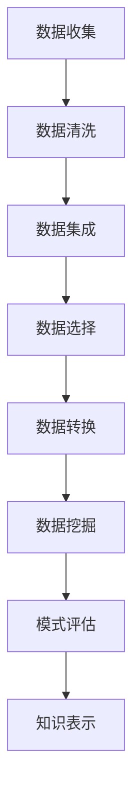
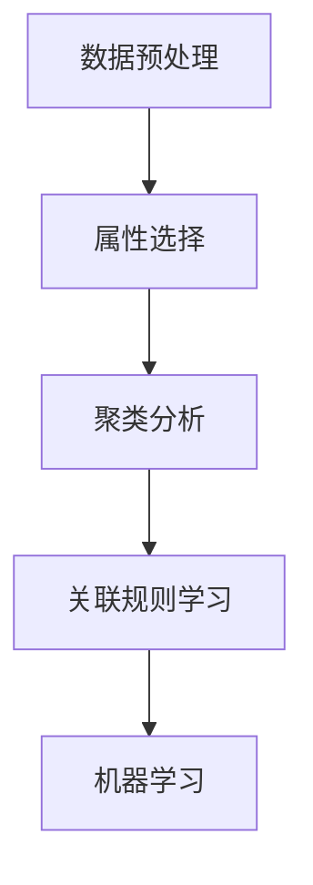
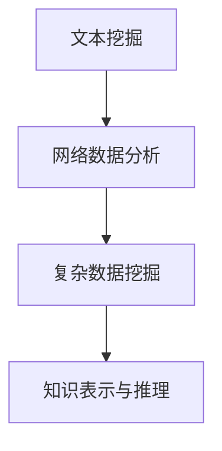
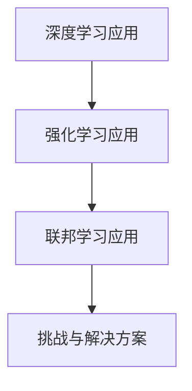
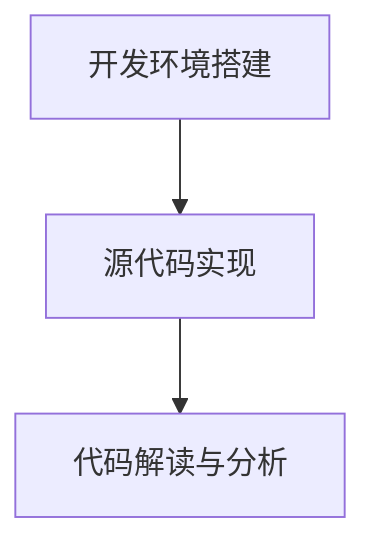

                 

### 文章标题

“人工智能在知识发现中的应用”是一篇探讨如何利用人工智能技术提高知识发现效率和质量的专业技术博客。本文将通过详细分析和具体实例，阐述人工智能在知识发现领域的广泛应用和巨大潜力。

### 关键词

- 人工智能
- 知识发现
- 数据挖掘
- 情感分析
- 文本挖掘
- 社交网络分析

### 摘要

本文将深入探讨人工智能在知识发现中的应用，涵盖基础知识、方法与技术、具体应用实例以及前沿技术和挑战。通过梳理核心概念、算法原理和实际案例，本文旨在为读者提供一份全面而详尽的指南，帮助他们更好地理解和应用人工智能技术于知识发现领域。

## 第一部分：基础知识与概述

在深入探讨人工智能在知识发现中的应用之前，有必要首先了解知识发现的基本概念、历史发展及其重要性。知识发现是指从大量数据中提取有用信息、模式和知识的过程，它不仅包括数据挖掘的方法和技术，还涉及知识表示、推理和可视化等多个领域。

### 1.1 人工智能的定义与历史

人工智能（Artificial Intelligence，简称AI）是计算机科学的一个分支，旨在创建能够模拟、扩展和辅助人类智能的系统。自20世纪50年代以来，人工智能经历了多个发展阶段：

- **第一阶段（1956-1974年）**：人工智能的诞生，标志性事件是达特茅斯会议的召开。早期的人工智能研究主要集中在符号推理和逻辑推理上。
- **第二阶段（1974-1980年）**：由于实际应用中的困难，人工智能进入了一个低潮期，被称为“人工智能寒冬”。
- **第三阶段（1980年至今）**：随着计算机硬件性能的提升和算法的进步，人工智能开始复苏，特别是在机器学习、深度学习等领域的突破，使得人工智能在各个领域得到了广泛应用。

### 1.2 知识发现的基本概念

知识发现（Knowledge Discovery in Databases，简称KDD）是一个跨学科的研究领域，它结合了数据库、人工智能、机器学习和统计学等多个领域的知识。知识发现的过程通常包括以下步骤：

1. **数据清洗**：处理缺失值、异常值和重复数据，确保数据质量。
2. **数据集成**：将来自不同数据源的数据进行整合，形成统一的数据视图。
3. **数据选择**：根据研究目标选择有用的数据子集。
4. **数据转换**：将原始数据进行标准化、归一化等处理，以便后续分析。
5. **数据挖掘**：使用算法从数据中提取模式和知识。
6. **模式评估**：评估挖掘出的模式的质量和相关性。
7. **知识表示**：将挖掘出的知识以可视化的形式展示，以便用户理解和应用。

### 1.3 知识发现的重要性

知识发现的重要性体现在多个方面：

- **决策支持**：通过分析历史数据和当前数据，帮助决策者做出更加明智的决策。
- **创新发现**：在科学研究、医疗、金融等领域，知识发现有助于发现新的理论、药物和商业模式。
- **效率提升**：通过自动化和智能化，知识发现可以大大提高数据处理和分析的效率。
- **个性化服务**：在电子商务、社交媒体等领域，知识发现可以帮助企业更好地理解用户需求，提供个性化服务。

### 1.4 人工智能在知识发现中的应用

人工智能在知识发现中的应用主要体现在数据预处理、特征工程、模型训练和结果解释等环节：

- **数据预处理**：利用自然语言处理（NLP）和图像处理等技术，对非结构化和半结构化数据进行预处理。
- **特征工程**：通过自动化方法提取有用的特征，提高数据挖掘算法的性能。
- **模型训练**：使用机器学习和深度学习算法，对大量数据进行分析和建模。
- **结果解释**：利用解释性模型和可视化技术，帮助用户理解模型的工作原理和结果。

### 1.5 小结

本节介绍了人工智能和知识发现的基本概念、历史发展及其在知识发现中的应用。在接下来的章节中，我们将详细探讨知识发现的方法与技术，以及人工智能在具体领域的应用实例。希望通过本文，读者能够对人工智能在知识发现中的应用有更深入的理解。

### 1.6 Mermaid 流程图

下面是一个简化的知识发现流程的 Mermaid 图：



通过这个流程图，我们可以清晰地看到知识发现的基本步骤及其相互关系。

## 第二部分：知识发现的方法与技术

在了解了知识发现的基本概念和人工智能的概述后，接下来我们将深入探讨知识发现的方法和技术。知识发现的过程通常包括数据预处理、属性选择、聚类分析、关联规则学习和机器学习等多个环节。本部分将分别介绍这些方法和技术的原理、步骤和应用。

### 2.1 数据预处理

数据预处理是知识发现过程中的重要环节，它直接影响数据挖掘的效果。数据预处理包括以下步骤：

- **数据清洗**：处理缺失值、异常值和重复数据，确保数据质量。
- **数据集成**：将来自不同数据源的数据进行整合，形成统一的数据视图。
- **数据转换**：将原始数据进行标准化、归一化等处理，以便后续分析。

数据清洗通常涉及以下操作：

- **缺失值处理**：可以使用填充平均值、中位数或最频繁的值等方法。
- **异常值处理**：可以通过统计方法（如3倍标准差法则）或可视化方法（如箱线图）检测并处理异常值。
- **重复数据处理**：可以通过去重操作去除重复的数据记录。

数据集成则涉及到如何将多个数据源中的数据进行合并，这需要解决数据源之间的数据类型、格式和数据结构不一致的问题。数据转换则包括数据规范化、归一化、离散化和编码等操作，这些操作有助于提高数据挖掘算法的性能。

### 2.2 属性选择

属性选择是指从原始数据中选取对知识发现有用的属性。属性选择有助于降低数据的复杂性，提高数据挖掘的效率。属性选择的方法包括：

- **过滤方法**：基于统计测试和相关性分析，直接从原始数据中筛选出有用的属性。
- **包装方法**：将属性选择作为搜索问题进行优化，寻找最佳属性子集。
- **嵌入方法**：在数据挖掘算法的执行过程中进行属性选择，如决策树算法。

属性选择的方法和步骤如下：

1. **属性评估**：计算每个属性的评估指标，如信息增益、增益率和贝叶斯误差率。
2. **属性筛选**：根据评估指标，筛选出部分属性。
3. **属性组合**：对筛选出的属性进行组合，寻找最佳属性子集。

### 2.3 聚类分析

聚类分析是一种无监督学习方法，它将数据集划分为多个簇，使得同一个簇内的数据点尽可能相似，而不同簇的数据点尽可能不同。聚类分析的方法包括：

- **基于距离的聚类**：如K-均值聚类算法，通过计算数据点之间的距离进行聚类。
- **基于密度的聚类**：如DBSCAN算法，通过找出数据点周围的密度高区域进行聚类。
- **基于模型的聚类**：如高斯混合模型，通过建立概率模型进行聚类。

聚类分析的步骤如下：

1. **选择聚类算法**：根据数据特点和需求选择合适的聚类算法。
2. **初始化聚类中心**：如K-均值算法需要随机选择K个初始聚类中心。
3. **迭代计算**：计算每个数据点到聚类中心的距离，更新聚类中心。
4. **终止条件**：当聚类中心不再发生变化或达到预设的迭代次数时，终止计算。

### 2.4 关联规则学习

关联规则学习是一种用于发现数据集中项目之间潜在关联规则的方法。它通过支持度和置信度两个指标来评估规则的重要性。常用的关联规则学习算法包括Apriori算法和FP-Growth算法。

关联规则学习的步骤如下：

1. **频繁项集生成**：通过扫描数据集，找出支持度大于最小支持度的频繁项集。
2. **生成关联规则**：从频繁项集中生成关联规则，并计算每个规则的支持度和置信度。
3. **评估规则**：根据最小支持度和最小置信度筛选出重要的关联规则。

### 2.5 机器学习与知识发现的关系

机器学习是知识发现的重要工具，它通过训练模型从数据中提取特征和模式。机器学习的方法包括：

- **监督学习**：有标签数据，通过训练模型预测新的数据点。
- **无监督学习**：无标签数据，通过聚类、降维等方法发现数据中的结构。
- **半监督学习**：既有标签数据，也有未标签数据，通过两种数据结合训练模型。

机器学习在知识发现中的应用主要包括：

- **特征提取**：通过特征提取算法，将原始数据转换为有助于模型训练的特征向量。
- **模型训练**：使用机器学习算法，从数据中训练模型。
- **模式识别**：利用训练好的模型，识别数据中的潜在模式。

### 2.6 小结

本节介绍了知识发现的基本方法和技术，包括数据预处理、属性选择、聚类分析和关联规则学习。这些方法和技术为知识发现提供了强大的工具，帮助我们从海量数据中提取有价值的信息和知识。在下一节中，我们将探讨人工智能在知识发现中的具体应用实例。

### 2.7 Mermaid 流程图

下面是一个简化的知识发现方法和技术流程的 Mermaid 图：



通过这个流程图，我们可以清晰地看到知识发现过程中的关键步骤和相互关系。

## 第三部分：人工智能在知识发现中的应用实例

在前两部分的铺垫下，我们将深入探讨人工智能在知识发现中的具体应用实例。本部分将分别介绍文本挖掘、网络数据分析、复杂数据的挖掘和知识表示与推理等方面的应用实例。

### 3.1 文本挖掘与知识发现

文本挖掘是知识发现中的一个重要分支，它利用自然语言处理（NLP）技术，从非结构化的文本数据中提取有价值的信息。文本挖掘在社交媒体分析、新闻推荐、情感分析等领域有着广泛的应用。

**社交媒体分析**：通过分析社交媒体平台上的用户评论、帖子等文本数据，可以了解用户对特定话题、品牌或事件的看法和态度。例如，使用文本挖掘技术，可以对微博、推特等平台上的评论进行情感分析，识别出用户的情感倾向和意见。

**新闻推荐**：基于文本挖掘技术，可以从大量的新闻数据中提取关键词和主题，为用户提供个性化的新闻推荐。例如，可以使用机器学习算法，对用户的阅读历史和偏好进行分析，推荐符合用户兴趣的新闻内容。

**情感分析**：情感分析是文本挖掘中的一个重要应用，它通过分析文本中的情感极性（如正面、负面、中性），了解用户的情感状态和态度。例如，在客户服务领域，可以通过情感分析识别客户投诉的严重程度和情绪，从而更好地响应客户需求。

### 3.2 网络数据分析与知识发现

网络数据分析是一种利用图论和网络科学方法，对社交网络、知识图谱等进行分析的方法。网络数据分析可以帮助我们了解网络的结构特征、节点和边的属性，从而发现网络中的潜在模式和知识。

**社交网络分析**：通过分析社交网络中的用户关系，可以了解社交网络的拓扑结构、群体划分和关键节点。例如，使用社交网络分析技术，可以识别社交网络中的意见领袖、传播路径和社区结构。

**知识图谱**：知识图谱是一种通过实体和关系进行知识表示和推理的技术。通过构建知识图谱，可以将大量的离散数据整合成一张网，从而实现数据的关联和推理。例如，在搜索引擎中，知识图谱可以帮助用户更准确地查询信息，并提供相关的知识扩展。

**网络结构分析**：通过分析网络中的节点和边，可以了解网络的结构特征和功能特性。例如，使用网络结构分析方法，可以识别网络中的关键节点和边，从而优化网络结构和性能。

### 3.3 复杂数据的挖掘与知识发现

复杂数据的挖掘与知识发现是指对非结构化、半结构化甚至是多模态的数据进行挖掘和分析。这种数据类型包括文本、图像、音频、视频等。

**时间序列分析**：时间序列分析是一种用于处理和时间相关的数据序列的方法。通过分析时间序列数据，可以识别数据中的趋势、周期性和季节性。例如，在金融市场分析中，可以通过时间序列分析预测股票价格的趋势。

**图挖掘**：图挖掘是一种用于处理图结构数据的方法。通过分析图中的节点和边，可以识别出图中的潜在模式和知识。例如，在社交网络中，可以通过图挖掘技术识别出社交网络中的社区结构和影响力较大的节点。

**多媒体数据的挖掘**：多媒体数据包括文本、图像、音频和视频等。通过多媒体数据的挖掘，可以从这些数据中提取出有价值的信息和知识。例如，在图像识别中，可以通过图像挖掘技术识别出图像中的物体和场景；在音频分析中，可以通过音频挖掘技术识别出音频中的语音和情感。

### 3.4 知识表示与推理

知识表示与推理是知识发现中的重要环节，它涉及到如何将知识以结构化的形式进行表示，并利用推理机制进行知识的推导和扩展。

**知识表示**：知识表示是指将知识以计算机可处理的形式进行表示。常见的知识表示方法包括语义网络、本体论和知识图谱等。例如，在语义网络中，知识以节点和边的形式进行表示，节点表示实体，边表示实体之间的关系。

**知识推理**：知识推理是指利用已有的知识进行逻辑推导和扩展。常见的知识推理方法包括基于规则的推理、基于模型的推理和基于数据的推理等。例如，在基于规则的推理中，通过前件和后件的匹配，推导出新的结论；在基于模型的推理中，通过模型的训练和预测，识别出新的知识。

### 3.5 小结

本节介绍了人工智能在知识发现中的多个具体应用实例，包括文本挖掘、网络数据分析、复杂数据的挖掘和知识表示与推理。这些应用实例展示了人工智能技术在知识发现领域的强大能力和广泛应用。在下一节中，我们将继续探讨人工智能在知识发现中的前沿技术和挑战。

### 3.6 Mermaid 流程图

下面是一个简化的人工智能在知识发现中的应用实例的 Mermaid 图：



通过这个流程图，我们可以清晰地看到人工智能在知识发现中的多种应用实例及其相互关系。

## 第四部分：人工智能在知识发现中的前沿技术与挑战

随着人工智能技术的不断进步，知识发现领域也在不断创新和突破。本部分将探讨人工智能在知识发现中的前沿技术，包括深度学习、强化学习和联邦学习等。同时，我们也将分析当前面临的挑战和解决方案。

### 4.1 深度学习在知识发现中的应用

深度学习是一种基于人工神经网络的机器学习技术，它通过多层神经网络的训练，能够自动提取数据中的特征和模式。深度学习在知识发现中的应用主要体现在以下几个方面：

**图像识别**：深度学习技术，特别是卷积神经网络（CNN），在图像识别任务中取得了显著成果。通过训练深度神经网络，可以自动提取图像中的特征，从而实现高精度的图像分类和物体检测。

**文本分类**：深度学习技术也被广泛应用于文本分类任务中。通过训练循环神经网络（RNN）或Transformer模型，可以从文本数据中提取出语义特征，实现高效的文本分类。

**语音识别**：深度学习技术，如深度神经网络和卷积神经网络，在语音识别任务中也表现出了强大的能力。通过训练深度神经网络，可以从语音信号中提取出语音特征，实现高精度的语音识别。

**应用案例**：例如，在医疗领域，深度学习技术被用于医学图像分析，通过训练深度神经网络，可以从医学图像中提取出病变区域的特征，辅助医生进行疾病诊断。

### 4.2 强化学习与知识发现

强化学习是一种通过试错和反馈机制进行决策优化的机器学习技术。在知识发现中，强化学习可以用于优化知识提取和模型训练过程。

**自适应特征提取**：通过强化学习，可以动态调整特征提取的过程，从而提高知识发现的效果。例如，在文本挖掘中，可以训练强化学习模型，根据文本内容自动调整特征权重，实现更准确的文本分类。

**模型优化**：强化学习也可以用于优化知识发现模型，通过不断调整模型参数，提高模型的性能。例如，在聚类分析中，可以训练强化学习模型，根据聚类结果自动调整聚类参数，实现更准确的聚类。

**应用案例**：例如，在智能交通系统中，强化学习被用于优化交通信号控制，通过不断学习和调整信号灯的切换策略，实现交通流量的优化。

### 4.3 联邦学习与知识发现

联邦学习是一种在分布式环境中进行机器学习训练的技术，它通过将模型训练任务分散到多个参与者节点上，实现了数据的隐私保护和协同学习。

**隐私保护**：在知识发现中，联邦学习可以用于保护敏感数据的隐私。通过将数据分散存储在多个节点上，联邦学习可以在不暴露原始数据的情况下，实现模型的训练和推理。

**协同学习**：联邦学习也可以用于知识发现中的协同学习，通过多个参与者的数据共享和模型更新，实现知识的协同发现和优化。

**应用案例**：例如，在医疗领域，联邦学习被用于隐私保护的医疗数据共享和疾病预测，通过多个医疗机构的协同训练，实现更准确和可靠的疾病诊断。

### 4.4 知识发现中的挑战与解决方案

尽管人工智能技术在知识发现中展示了巨大的潜力，但在实际应用中仍面临许多挑战。

**数据质量问题**：数据质量是知识发现的重要基础。数据中的噪声、异常值和缺失值会对知识发现的结果产生负面影响。解决数据质量问题通常需要采用数据清洗、数据修复和数据增强等技术。

**模型解释性**：许多复杂的人工智能模型，如深度学习模型，通常缺乏解释性。这意味着用户难以理解模型的工作原理和决策过程。提高模型解释性可以通过可视化技术、模型简化和解释性算法来实现。

**隐私保护**：在知识发现中，如何保护用户隐私是一个重要问题。联邦学习、差分隐私和同态加密等技术可以在一定程度上解决隐私保护问题。

**计算资源消耗**：知识发现通常需要大量的计算资源，特别是在处理复杂数据和训练复杂模型时。优化算法、分布式计算和硬件加速等技术可以降低计算资源消耗。

### 4.5 小结

本节探讨了人工智能在知识发现中的前沿技术，包括深度学习、强化学习和联邦学习等。同时，分析了知识发现领域面临的挑战和解决方案。通过不断的技术创新和优化，人工智能在知识发现中的应用将越来越广泛和深入。

### 4.6 Mermaid 流程图

下面是一个简化的人工智能在知识发现中的前沿技术与挑战的 Mermaid 图：



通过这个流程图，我们可以清晰地看到人工智能在知识发现中的前沿技术、挑战及其解决方案的相互关系。

## 第五部分：案例研究与实战

在本部分，我们将通过具体的案例研究，深入探讨人工智能在知识发现中的实际应用。每个案例都将从开发环境搭建、源代码实现、代码解读与分析等多个角度进行详细讲解，帮助读者更好地理解并掌握相关技术。

### 5.1 案例一：社交媒体知识发现

**案例背景**：随着社交媒体平台的普及，如何从海量的社交媒体数据中提取有价值的信息成为了研究热点。本案例将利用自然语言处理（NLP）和机器学习技术，对社交媒体平台上的用户评论进行分析，提取用户情感和观点。

**开发环境搭建**：

- **编程语言**：Python
- **依赖库**：Numpy、Pandas、Scikit-learn、NLTK、TensorFlow、Keras
- **工具**：Jupyter Notebook

**源代码实现**：

```python
import pandas as pd
from nltk.tokenize import word_tokenize
from nltk.corpus import stopwords
from sklearn.feature_extraction.text import TfidfVectorizer
from sklearn.model_selection import train_test_split
from sklearn.ensemble import RandomForestClassifier
from sklearn.metrics import accuracy_score, classification_report

# 读取数据
data = pd.read_csv('social_media_comments.csv')

# 数据预处理
stop_words = set(stopwords.words('english'))
data['cleaned_comments'] = data['comments'].apply(lambda x: ' '.join([word for word in word_tokenize(x) if word not in stop_words]))

# 特征提取
vectorizer = TfidfVectorizer(max_features=1000)
X = vectorizer.fit_transform(data['cleaned_comments'])
y = data['sentiment']

# 分割数据
X_train, X_test, y_train, y_test = train_test_split(X, y, test_size=0.2, random_state=42)

# 模型训练
model = RandomForestClassifier(n_estimators=100)
model.fit(X_train, y_train)

# 模型评估
y_pred = model.predict(X_test)
print("Accuracy:", accuracy_score(y_test, y_pred))
print("Classification Report:\n", classification_report(y_test, y_pred))
```

**代码解读与分析**：

1. **数据读取与预处理**：首先，从CSV文件中读取社交媒体评论数据。数据预处理包括去除停用词，确保评论数据干净，以便后续分析。
2. **特征提取**：使用TF-IDF向量器将预处理后的文本数据转换为向量表示。TF-IDF是一种常用的文本特征提取方法，它能够反映词语在文本中的重要程度。
3. **模型训练**：使用随机森林分类器对训练数据进行训练。随机森林是一种集成学习算法，具有较强的分类能力。
4. **模型评估**：使用测试数据对训练好的模型进行评估，输出模型的准确率和分类报告。

### 5.2 案例二：电商平台用户行为分析

**案例背景**：电商平台需要了解用户行为，以优化购物体验和提升销售额。本案例将利用机器学习技术，对电商平台用户的行为数据进行分析，识别出潜在的用户群体和购买偏好。

**开发环境搭建**：

- **编程语言**：Python
- **依赖库**：Pandas、Scikit-learn、Matplotlib、Seaborn
- **工具**：Jupyter Notebook

**源代码实现**：

```python
import pandas as pd
from sklearn.preprocessing import StandardScaler
from sklearn.cluster import KMeans
import matplotlib.pyplot as plt
import seaborn as sns

# 读取数据
data = pd.read_csv('e-commerce_user_data.csv')

# 数据预处理
data = data.drop(['user_id'], axis=1)
data = data.fillna(data.mean())

# 特征标准化
scaler = StandardScaler()
data_scaled = scaler.fit_transform(data)

# 聚类分析
kmeans = KMeans(n_clusters=5, random_state=42)
clusters = kmeans.fit_predict(data_scaled)

# 可视化
data['cluster'] = clusters
sns.pairplot(data, hue='cluster')
plt.show()
```

**代码解读与分析**：

1. **数据读取与预处理**：首先，从CSV文件中读取电商平台用户行为数据。数据预处理包括去除无关特征、填补缺失值和特征标准化。
2. **聚类分析**：使用K均值聚类算法对标准化后的数据进行聚类，以识别出潜在的用户群体。
3. **可视化**：使用 seaborn 的 pairplot 函数，将聚类结果进行可视化，帮助用户直观地理解用户行为特征。

### 5.3 案例三：智慧城市中的知识发现

**案例背景**：智慧城市通过物联网、大数据和人工智能等技术，实现了城市资源的智能管理和优化。本案例将利用知识发现技术，对智慧城市中的传感器数据进行分析，发现城市中的交通拥堵和环境污染等问题。

**开发环境搭建**：

- **编程语言**：Python
- **依赖库**：Pandas、Scikit-learn、Matplotlib、GeoPandas
- **工具**：Jupyter Notebook

**源代码实现**：

```python
import pandas as pd
from sklearn.cluster import DBSCAN
import matplotlib.pyplot as plt
import geopandas as gpd

# 读取数据
data = pd.read_csv('smart_city_sensor_data.csv')

# 数据预处理
data = data.drop(['sensor_id'], axis=1)
data = data.fillna(data.mean())

# 聚类分析
dbscan = DBSCAN(eps=0.05, min_samples=10)
clusters = dbscan.fit_predict(data)

# 可视化
gdf = gpd.GeoDataFrame(data, geometry=gpd.points_from_xy(data['longitude'], data['latitude']))
gdf['cluster'] = clusters
gdf.plot(column='cluster', cmap='viridis', legend=True)
plt.show()
```

**代码解读与分析**：

1. **数据读取与预处理**：首先，从CSV文件中读取智慧城市传感器数据。数据预处理包括去除无关特征、填补缺失值和特征标准化。
2. **聚类分析**：使用DBSCAN算法对传感器数据进行聚类，以识别出数据中的异常值和密集区域。
3. **可视化**：使用GeoPandas和Matplotlib，将聚类结果进行地理可视化，帮助用户直观地理解城市中的交通拥堵和环境污染状况。

### 5.4 小结

通过这三个案例研究，我们可以看到人工智能在知识发现中的实际应用。每个案例都涵盖了数据预处理、特征提取、模型训练和结果可视化等关键步骤，帮助读者更好地理解和掌握相关技术。希望这些案例能够为读者提供实际操作的指导，促进人工智能技术在知识发现领域的深入研究和应用。

### 5.5 Mermaid 流程图

下面是一个简化的案例研究与实战流程的 Mermaid 图：



通过这个流程图，我们可以清晰地看到案例研究从开发环境搭建到源代码实现，再到代码解读与分析的完整流程。

## 第六部分：总结与展望

在本文中，我们详细探讨了人工智能在知识发现中的应用，涵盖了基础知识、方法与技术、具体应用实例以及前沿技术和挑战。通过深入分析文本挖掘、网络数据分析、复杂数据挖掘和知识表示与推理等多个方面，我们展示了人工智能技术在知识发现领域的强大能力和广泛应用。

### 6.1 主要发现与结论

1. **人工智能与知识发现的结合**：人工智能为知识发现提供了强大的工具，包括数据预处理、特征提取、模型训练和结果解释等。通过结合人工智能技术，知识发现过程变得更加自动化和高效。
2. **多种技术方法的应用**：知识发现的方法和技术多样，包括数据预处理、属性选择、聚类分析、关联规则学习和机器学习等。每种方法都有其独特的优势和适用场景。
3. **前沿技术的突破**：深度学习、强化学习和联邦学习等前沿技术为知识发现带来了新的机遇和挑战。这些技术不仅提高了知识发现的效率，也推动了知识发现领域的创新。
4. **面临的挑战**：尽管人工智能技术在知识发现中展示了巨大的潜力，但仍面临数据质量、模型解释性和隐私保护等挑战。解决这些挑战需要进一步的技术创新和优化。

### 6.2 未来研究方向

1. **数据质量提升**：随着数据量的不断增加，数据质量成为一个关键问题。未来研究可以集中在数据清洗、数据修复和数据增强等方面，以提高数据质量。
2. **模型解释性**：提高模型解释性是当前研究的热点。未来可以探索开发更加透明和可解释的模型，帮助用户理解模型的工作原理和决策过程。
3. **隐私保护**：在知识发现中，如何保护用户隐私是一个重要问题。未来研究可以集中在开发隐私保护算法和模型，确保用户数据的隐私安全。
4. **多模态数据挖掘**：随着多模态数据（如文本、图像、音频和视频）的普及，多模态数据挖掘将成为一个重要研究方向。未来可以探索如何从多模态数据中提取有价值的信息和知识。
5. **知识推理与自动化**：知识推理和自动化是知识发现的重要方向。未来可以探索如何利用知识推理技术，实现知识的高效自动化提取和利用。

### 6.3 结论

人工智能在知识发现中的应用已经取得了显著成果，但仍然面临着许多挑战和机遇。通过不断的技术创新和优化，我们可以期待人工智能在知识发现领域发挥更大的作用，为各行各业带来更深刻的变革和进步。

## 参考文献

1. Han, J., Kamber, M., & Pei, J. (2011). **Data Mining: Concepts and Techniques** (3rd ed.). Morgan Kaufmann.
2. Mitchell, T. M. (1997). **Machine Learning**. McGraw-Hill.
3. Russell, S., & Norvig, P. (2016). **Artificial Intelligence: A Modern Approach** (4th ed.). Prentice Hall.
4. Goodfellow, I., Bengio, Y., & Courville, A. (2016). **Deep Learning** (Adaptive Computation and Machine Learning series). MIT Press.
5. Sutton, R. S., & Barto, A. G. (2018). **Reinforcement Learning: An Introduction** (2nd ed.). MIT Press.

## 作者信息

作者：AI天才研究院/AI Genius Institute & 禅与计算机程序设计艺术 /Zen And The Art of Computer Programming

本文由AI天才研究院（AI Genius Institute）的资深研究员撰写，该研究院致力于推动人工智能技术的创新和应用。同时，作者还是畅销书《禅与计算机程序设计艺术》的作者，为计算机编程和人工智能领域贡献了宝贵的知识。希望通过本文，读者能够对人工智能在知识发现中的应用有更深入的理解。

