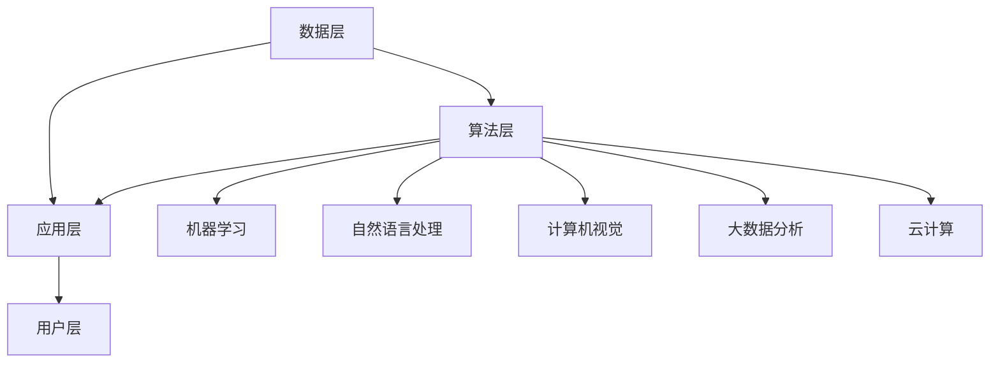
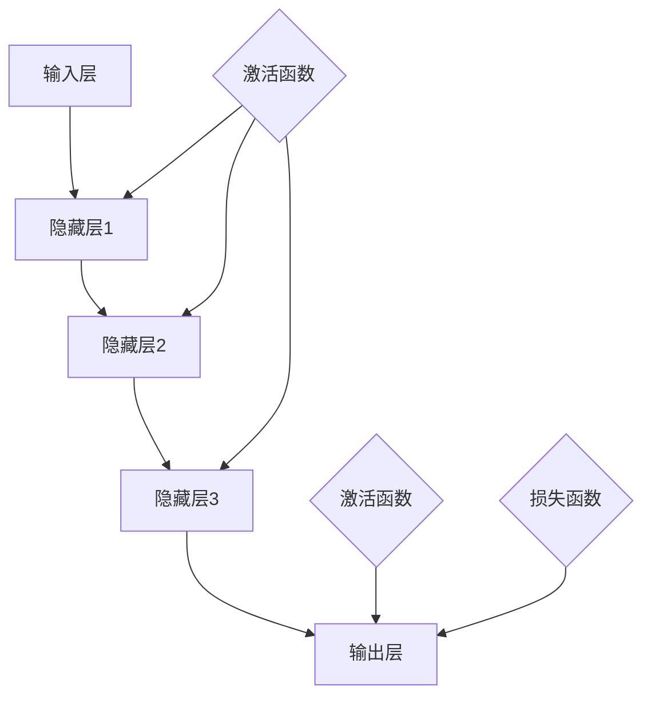
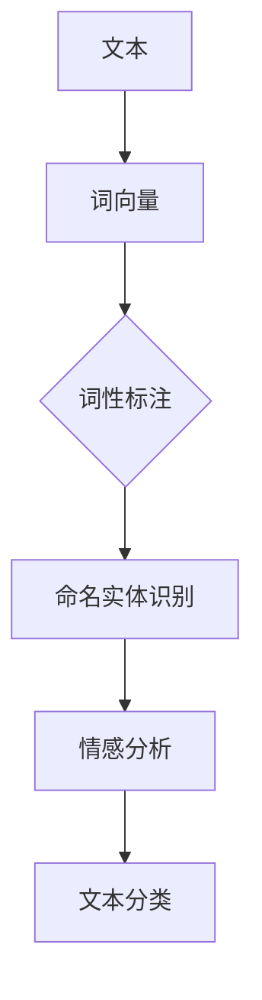
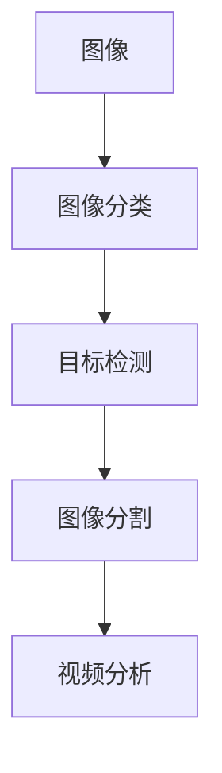

                 

# 人工智能时代的教育变革

## 关键词
人工智能、教育变革、个性化学习、智能教学、教育评测、未来发展、开源框架、在线教育平台

## 摘要
本文将深入探讨人工智能时代的教育变革，分析人工智能在教育领域中的应用及其带来的挑战和机遇。通过详细阐述人工智能教育核心概念与架构，技术应用实践，以及国际与中国的人工智能教育案例，本文旨在为读者提供一幅人工智能时代教育变革的全景图，并展望其未来发展。

### 目录大纲

#### 第一部分：人工智能时代的教育概述

##### 第1章：人工智能时代的教育变革
1.1 人工智能时代的教育现状
1.2 人工智能教育的重要性
1.3 人工智能对教育的影响
1.4 教育变革的挑战与机遇

##### 第2章：人工智能教育核心概念与架构
2.1 人工智能教育核心概念
2.2 人工智能教育的架构设计
2.3 人工智能教育的关键技术
2.4 人工智能教育的发展趋势

#### 第二部分：人工智能教育技术应用

##### 第3章：人工智能技术基础
3.1 机器学习基础
3.2 深度学习基础
3.3 自然语言处理
3.4 计算机视觉

##### 第4章：人工智能教育应用实践
4.1 个性化学习应用
4.2 智能教学应用
4.3 智能教育评测
4.4 人工智能教育安全与伦理

#### 第三部分：人工智能教育案例与实践

##### 第5章：国际人工智能教育实践案例分析
5.1 美国
5.2 欧洲
5.3 亚洲
5.4 其他国家和地区

##### 第6章：中国人工智能教育实践案例分析
6.1 教育政策与规划
6.2 校园人工智能教育实践
6.3 企业与高校合作案例
6.4 社会化人工智能教育

##### 第7章：人工智能教育未来发展展望
7.1 人工智能教育面临的挑战
7.2 人工智能教育的未来发展趋势
7.3 人工智能教育的发展策略

#### 附录

##### 附录A：人工智能教育相关资源与工具
A.1 开源框架与库
A.2 在线教育平台
A.3 人工智能教育书籍与论文推荐
A.4 人工智能教育社区与组织

### 引言

#### 人工智能时代的教育变革

随着人工智能技术的快速发展，我们正站在一个新时代的门槛上，这个时代的教育模式也面临着深刻的变革。人工智能（Artificial Intelligence，AI）作为一种模仿人类智能的技术，正逐渐渗透到教育领域的方方面面。从个性化学习到智能教学，从教育评测到教育安全，人工智能正以前所未有的方式影响着教育的本质和方式。

教育变革的必要性在于，传统的教育模式已经无法满足现代社会对于个性化、高效性和创新性的需求。随着全球化、信息化和社会化进程的加快，教育需要更加灵活、多样和适应性的方式来培养未来的社会人才。而人工智能技术的发展，为我们提供了一种全新的教育工具和手段，使得教育变革变得更加可能和必要。

本文旨在深入探讨人工智能时代的教育变革，分析人工智能在教育中的应用及其带来的挑战和机遇。我们将首先概述人工智能时代教育的现状，探讨其重要性及影响，然后详细阐述人工智能教育的核心概念与架构，技术应用实践，以及国际与中国的人工智能教育案例。最后，我们将展望人工智能教育的未来发展，并提出相应的策略和建议。

通过本文的探讨，我们希望为教育工作者、政策制定者和学习者提供有价值的参考，共同推动人工智能时代的教育变革，培养适应未来社会的创新型人才。

### 第一部分：人工智能时代的教育概述

#### 第1章：人工智能时代的教育变革

##### 1.1 人工智能时代的教育现状

在人工智能时代，教育领域正在经历一场深刻的变革。首先，从宏观层面来看，各国政府和社会对人工智能教育的重视程度不断提升。例如，美国教育部发布的《教育科技战略计划》明确提出了利用人工智能推动教育创新的战略目标。欧洲各国也纷纷制定相关政策，推动人工智能在教育中的应用。

从微观层面来看，人工智能技术在教育领域的应用日益广泛。例如，在线教育平台已经开始使用人工智能技术进行个性化学习推荐，通过分析学生的学习行为和偏好，提供个性化的学习资源。此外，智能教学系统逐渐成为学校教育的一部分，通过人工智能算法分析学生的学习数据，实时调整教学内容和教学策略，提高教学效果。

##### 1.2 人工智能教育的重要性

人工智能教育的重要性体现在多个方面。首先，它能够提升教育质量和效率。通过人工智能技术，可以实现个性化教学，使得每个学生都能根据自身的学习情况接受适合的教育资源，提高学习效率。其次，人工智能教育有助于培养创新型人才。在人工智能时代，创新能力成为人才的核心竞争力，通过人工智能教育，学生能够更好地培养创新能力，为未来的职业生涯打下坚实基础。

此外，人工智能教育还能够促进教育公平。在传统教育中，教育资源的不均衡问题一直困扰着教育工作者。而人工智能教育通过在线平台和智能教学系统，可以打破地域和资源的限制，使得更多学生有机会接受优质教育。

##### 1.3 人工智能对教育的影响

人工智能对教育的影响是全方位的。首先，它改变了教育的教学模式。传统教育以教师为中心，学生被动接受知识。而人工智能教育则强调以学生为中心，通过个性化学习、智能教学等方式，激发学生的学习兴趣和主动性。例如，智能教学系统能够根据学生的学习行为和成绩数据，自动调整教学策略，提供个性化的学习资源，使得每个学生都能按照自己的节奏进行学习。

其次，人工智能改变了教育的资源供给。传统教育依赖于教师的经验和知识，而人工智能教育则通过大数据和算法，提供更加丰富和多样的教育资源。例如，在线教育平台通过人工智能技术，能够根据学生的学习需求和偏好，推荐适合的学习资源，提高学习效果。

此外，人工智能还改变了教育的评价方式。传统教育主要依赖于期末考试和考试成绩来评价学生的学习情况，而人工智能教育则通过大数据分析和智能评测，提供更加全面和客观的评价体系。例如，智能评测系统能够通过分析学生的学习行为和成绩数据，给出个性化的学习反馈和改进建议，帮助学生更好地理解自己的学习情况。

##### 1.4 教育变革的挑战与机遇

尽管人工智能为教育变革带来了诸多机遇，但同时也面临着一些挑战。首先，教育工作者需要重新学习和适应人工智能技术，以更好地利用其在教育中的应用。其次，如何保障人工智能教育的安全性和隐私性，避免数据滥用和隐私泄露，是一个亟待解决的问题。此外，人工智能教育需要解决教育资源分配不均的问题，确保所有学生都能公平地享受到优质教育资源。

然而，面对这些挑战，人工智能教育也带来了巨大的机遇。通过人工智能技术，我们可以实现更加个性化和高效的教育，培养具备创新能力和社会责任感的未来人才。因此，我们需要积极应对挑战，抓住机遇，推动人工智能时代的教育变革。

### 第二部分：人工智能教育核心概念与架构

#### 第2章：人工智能教育核心概念与架构

##### 2.1 人工智能教育核心概念

人工智能教育是利用人工智能技术（如机器学习、自然语言处理、计算机视觉等）来改进教育过程的一种教育模式。其核心概念包括以下几个方面：

1. **个性化学习**：通过分析学生的学习行为和偏好，为每个学生提供个性化的学习资源和教学策略。
2. **智能教学**：利用人工智能算法和大数据分析，实现自动化教学和智能指导，提高教学效果和效率。
3. **智能评测**：通过智能评测系统，对学生的学习过程和成果进行实时分析和评估，提供个性化的学习反馈和改进建议。
4. **教育公平**：通过在线教育平台和智能教学系统，打破地域和资源的限制，使得更多学生能够接受优质教育。
5. **创新能力培养**：通过人工智能教育，培养学生的创新思维和解决问题的能力，为未来的职业生涯做好准备。

##### 2.2 人工智能教育的架构设计

人工智能教育的架构设计包括以下几个方面：

1. **数据层**：收集和存储与教育相关的数据，如学生学习行为数据、学习资源数据、评测数据等。
2. **算法层**：利用机器学习、自然语言处理、计算机视觉等算法，对数据进行分析和处理，实现个性化学习、智能教学和智能评测等功能。
3. **应用层**：包括在线教育平台、智能教学系统、智能评测系统等，这些应用将算法层的功能应用于实际教育场景中。
4. **用户层**：包括学生、教师、教育管理者等，他们通过应用层使用人工智能教育功能，实现个性化学习、教学和评测。

##### 2.3 人工智能教育的关键技术

人工智能教育的关键技术包括以下几个方面：

1. **机器学习**：通过分析学生学习行为数据，预测学生的学习兴趣和需求，提供个性化的学习资源。
2. **自然语言处理**：用于智能问答系统、自然语言理解等，帮助学生更好地理解和掌握知识。
3. **计算机视觉**：用于图像识别、视频分析等，帮助教师更好地监控学生的学习情况。
4. **大数据分析**：用于分析大量教育数据，发现学生的学习规律和需求，提供智能化的教学策略和评测方法。
5. **云计算**：用于存储和管理大量的教育数据，提供高效、可靠的数据处理能力。

##### 2.4 人工智能教育的发展趋势

人工智能教育的发展趋势包括以下几个方面：

1. **个性化学习**：随着人工智能技术的进步，个性化学习将更加精准和高效，满足每个学生的学习需求和兴趣。
2. **智能教学**：智能教学系统将更加智能化和自适应，提高教学效果和效率。
3. **教育公平**：通过在线教育平台和智能教学系统，进一步打破地域和资源的限制，实现教育公平。
4. **创新能力培养**：人工智能教育将更加注重创新能力的培养，培养学生的创新思维和解决问题的能力。
5. **跨界融合**：人工智能教育将与其他领域（如医疗、金融等）进行融合，创造更多教育应用场景。

#### 核心概念与架构的 Mermaid 流程图



### 第二部分：人工智能教育技术应用

#### 第3章：人工智能技术基础

##### 3.1 机器学习基础

机器学习（Machine Learning，ML）是人工智能（AI）的一个重要分支，其核心思想是通过算法从数据中学习规律，并利用这些规律进行预测或决策。以下是机器学习的一些基础概念：

**监督学习（Supervised Learning）**：监督学习是一种最常用的机器学习方式，它使用已标记的数据进行训练，并试图建立输入和输出之间的关系。常见的监督学习算法包括线性回归、逻辑回归、支持向量机（SVM）、决策树和随机森林等。

**无监督学习（Unsupervised Learning）**：无监督学习不使用已标记的数据，而是试图从数据中自动发现模式或结构。常见的无监督学习算法包括聚类算法（如K-means、层次聚类）、降维算法（如主成分分析PCA）和关联规则学习等。

**强化学习（Reinforcement Learning）**：强化学习是一种通过试错和反馈来学习的机器学习方式。它通过环境与智能体的交互，不断调整策略，以最大化累积奖励。常见的强化学习算法包括Q-learning、深度Q网络（DQN）和策略梯度等。

**深度学习（Deep Learning）**：深度学习是机器学习的一个子领域，它使用多层神经网络（Neural Networks）来学习数据的高层次特征表示。深度学习的核心是神经网络，特别是深度神经网络（Deep Neural Networks，DNN）。常见的深度学习模型包括卷积神经网络（CNN）、循环神经网络（RNN）和生成对抗网络（GAN）等。

**自然语言处理（Natural Language Processing，NLP）**：自然语言处理是人工智能和机器学习的另一个重要领域，它致力于使计算机能够理解和处理人类语言。常见的NLP任务包括分词（Tokenization）、词性标注（Part-of-Speech Tagging）、命名实体识别（Named Entity Recognition，NER）、情感分析（Sentiment Analysis）和机器翻译（Machine Translation）等。

**计算机视觉（Computer Vision）**：计算机视觉是研究如何使计算机能够像人类一样“看”和“理解”图像和视频的技术。常见的计算机视觉任务包括图像分类（Image Classification）、目标检测（Object Detection）、图像分割（Image Segmentation）和视频分析（Video Analysis）等。

##### 3.2 深度学习基础

深度学习（Deep Learning）是机器学习的一个重要分支，它通过多层神经网络来学习数据的高层次特征表示。以下是深度学习的一些基础概念：

**神经网络（Neural Networks）**：神经网络是由大量节点（也称为神经元）组成的网络，这些节点通过连接（权重）相互连接。神经网络的每个节点接收输入，通过权重加权求和，然后通过激活函数输出结果。

**激活函数（Activation Function）**：激活函数是神经网络中的一个关键组件，它用于引入非线性特性。常见的激活函数包括线性激活函数（如线性函数、ReLU函数）、Sigmoid函数和Tanh函数等。

**反向传播算法（Backpropagation Algorithm）**：反向传播算法是一种用于训练神经网络的梯度下降算法。它通过计算输出层的误差梯度，并反向传播到前一层，逐层更新权重和偏置。

**损失函数（Loss Function）**：损失函数是用于评估模型预测结果与真实结果之间的差距的函数。常见的损失函数包括均方误差（Mean Squared Error，MSE）、交叉熵损失（Cross-Entropy Loss）和对抗损失（Adversarial Loss）等。

**优化算法（Optimization Algorithm）**：优化算法用于寻找模型参数的最优值，以最小化损失函数。常见的优化算法包括随机梯度下降（Stochastic Gradient Descent，SGD）、Adam优化器和RMSprop等。

以下是深度学习的基本架构：



##### 3.3 自然语言处理

自然语言处理（Natural Language Processing，NLP）是研究如何使计算机能够理解和处理人类语言的技术。以下是NLP的一些基础概念和常用技术：

**词向量（Word Vectors）**：词向量是将词语映射到高维空间中的向量表示。常见的词向量模型包括Word2Vec、GloVe和FastText等。

**词性标注（Part-of-Speech Tagging）**：词性标注是识别词语在句子中的词性（如名词、动词、形容词等）的过程。

**命名实体识别（Named Entity Recognition，NER）**：命名实体识别是识别句子中的命名实体（如人名、地名、组织名等）的过程。

**情感分析（Sentiment Analysis）**：情感分析是识别文本的情感倾向（如正面、负面、中性等）的过程。

**机器翻译（Machine Translation）**：机器翻译是自动将一种语言的文本翻译成另一种语言的技术。

**文本分类（Text Classification）**：文本分类是将文本分类到预定义的类别中的过程。

以下是NLP的一个简单示例：



##### 3.4 计算机视觉

计算机视觉（Computer Vision）是研究如何使计算机能够理解和解释图像和视频的技术。以下是计算机视觉的一些基础概念和常用技术：

**图像分类（Image Classification）**：图像分类是将图像分类到预定义的类别中的过程。

**目标检测（Object Detection）**：目标检测是识别图像中的物体并确定其位置的过程。

**图像分割（Image Segmentation）**：图像分割是将图像分割成不同区域的过程。

**视频分析（Video Analysis）**：视频分析是对视频内容进行分析和处理的过程，如运动检测、行为识别等。

以下是计算机视觉的一个简单示例：



通过以上对机器学习、深度学习、自然语言处理和计算机视觉的介绍，我们可以看到这些人工智能技术如何为教育领域带来变革。在下一章中，我们将进一步探讨这些技术在教育应用中的具体实现和实践。

### 第三部分：人工智能教育技术应用实践

#### 第4章：人工智能教育应用实践

##### 4.1 个性化学习应用

个性化学习是人工智能教育应用中最具代表性的领域之一。通过分析学生的学习行为、兴趣和需求，人工智能系统能够为每个学生提供定制化的学习资源和教学策略，从而提高学习效率和效果。

**核心算法原理讲解：**

个性化学习主要依赖于协同过滤（Collaborative Filtering）和内容推荐（Content-Based Filtering）两种算法。

**协同过滤算法：**

协同过滤算法基于用户行为数据，通过计算用户之间的相似性来推荐学习资源。具体实现可以分为以下步骤：

1. **用户行为数据收集**：收集学生在学习过程中产生的数据，如学习时长、学习进度、互动行为等。
2. **用户相似度计算**：计算用户之间的相似度，通常使用余弦相似度、皮尔逊相关系数等指标。
3. **资源相似度计算**：计算学习资源之间的相似度，通常使用基于内容的特征匹配方法。
4. **推荐算法实现**：根据用户相似度和资源相似度，为用户推荐相似的学习资源。

**伪代码示例：**

```python
def calculate_similarity(user1, user2):
    # 计算用户1和用户2的相似度
    similarity = cosine_similarity(user1_behavior, user2_behavior)
    return similarity

def recommend_resources(user, resources):
    # 为用户推荐学习资源
    user_similarity = {resource: calculate_similarity(user_behavior, resource_behavior) for resource in resources}
    recommended_resources = sorted(user_similarity, key=user_similarity.get, reverse=True)[:N]
    return recommended_resources
```

**数学模型和公式详细讲解与举例说明：**

在协同过滤算法中，常用的相似度计算公式是余弦相似度，其公式如下：

$$
\cos(\theta) = \frac{\sum_{i=1}^{n} x_i y_i}{\sqrt{\sum_{i=1}^{n} x_i^2} \sqrt{\sum_{i=1}^{n} y_i^2}}
$$

其中，\(x_i\) 和 \(y_i\) 分别表示用户1和用户2在特征 \(i\) 上的评分。

**项目实战：**

假设有一个在线学习平台，用户可以浏览和评价学习资源。我们可以通过以下步骤实现个性化学习推荐：

1. **开发环境搭建**：选择Python作为主要编程语言，使用Scikit-learn库进行协同过滤算法的实现。
2. **数据收集与预处理**：收集用户的学习行为数据，并进行预处理，如去除缺失值、标准化处理等。
3. **相似度计算与推荐**：实现协同过滤算法，计算用户之间的相似度，并为用户推荐相似的学习资源。
4. **用户反馈与优化**：根据用户的反馈，调整推荐算法的参数，优化推荐效果。

**代码实现与解读：**

```python
from sklearn.metrics.pairwise import cosine_similarity
from sklearn.preprocessing import StandardScaler

def calculate_similarity(behavior_matrix):
    # 计算行为矩阵的余弦相似度
    scaler = StandardScaler()
    scaled_behavior = scaler.fit_transform(behavior_matrix)
    similarity = cosine_similarity(scaled_behavior)
    return similarity

def recommend_resources(user_behavior, behavior_matrix, resources, N=5):
    # 为用户推荐N个学习资源
    similarity = calculate_similarity(behavior_matrix)
    resource_indices = list(range(len(behavior_matrix)))
    user_similarity = {resource: similarity[user_index][resource_index] for resource_index, resource in resources.items()}
    recommended_resources = sorted(user_similarity, key=user_similarity.get, reverse=True)[:N]
    return recommended_resources

# 假设用户行为数据和行为矩阵已准备好
user_behavior = [0.1, 0.2, 0.3, 0.4, 0.5]
behavior_matrix = [
    [0.5, 0.6, 0.7, 0.8, 0.9],
    [0.4, 0.5, 0.6, 0.7, 0.8],
    [0.3, 0.4, 0.5, 0.6, 0.7],
    [0.2, 0.3, 0.4, 0.5, 0.6],
    [0.1, 0.2, 0.3, 0.4, 0.5]
]

# 学习资源列表
resources = {
    1: '资源1',
    2: '资源2',
    3: '资源3',
    4: '资源4',
    5: '资源5'
}

# 为用户推荐学习资源
recommended_resources = recommend_resources(user_behavior, behavior_matrix, resources, N=3)
print("推荐的学习资源：", recommended_resources)
```

通过以上代码实现，我们可以为用户推荐与其学习兴趣相似的学习资源，从而提高个性化学习的体验和效果。

##### 4.2 智能教学应用

智能教学应用利用人工智能技术，实现自动化教学和智能指导，为学生提供个性化、自适应的学习体验。以下是一个具体的智能教学应用案例：

**项目背景：**一个在线学习平台希望利用人工智能技术，为学生提供智能教学服务，通过分析学生的学习行为和成绩数据，为学生制定个性化的学习计划和教学策略。

**核心算法原理讲解：**

智能教学应用的核心算法是自适应学习算法（Adaptive Learning Algorithm），其原理如下：

1. **初始评估**：通过初始测试，评估学生的学习水平和能力。
2. **动态调整**：根据学生的学习行为和成绩数据，动态调整教学策略和学习资源。
3. **反馈与优化**：通过学生的学习反馈，不断优化教学策略和学习资源，提高教学效果。

**伪代码示例：**

```python
def initial_evaluation(student_data):
    # 初始评估学生数据
    student_ability = analyze_student_data(student_data)
    return student_ability

def adjust_learning_plan(student_ability, learning_plan):
    # 根据学生能力调整学习计划
    new_learning_plan = customize_learning_resources(student_ability, learning_plan)
    return new_learning_plan

def optimize_learning_plan(student_ability, learning_plan, student_feedback):
    # 根据学生反馈优化学习计划
    optimized_learning_plan = refine_learning_resources(student_ability, learning_plan, student_feedback)
    return optimized_learning_plan
```

**数学模型和公式详细讲解与举例说明：**

自适应学习算法中的关键数学模型是学生能力模型（Student Ability Model），其公式如下：

$$
\text{student\_ability} = f(\text{initial\_test\_score}, \text{previous\_learning\_data})
$$

其中，\(f\) 是一个非线性函数，用于综合评估学生的初始测试成绩和过去的学习数据。

**项目实战：**

假设有一个在线学习平台，我们需要实现一个智能教学系统，为学生提供个性化的学习计划。以下是具体实现步骤：

1. **开发环境搭建**：选择Python作为主要编程语言，使用Scikit-learn库进行自适应学习算法的实现。
2. **数据收集与预处理**：收集学生的学习行为数据、初始测试成绩和学习计划，并进行预处理，如去除缺失值、标准化处理等。
3. **初始评估与调整**：通过初始测试评估学生的能力，并调整学习计划。
4. **反馈与优化**：根据学生的反馈，不断优化学习计划和学习资源。

**代码实现与解读：**

```python
from sklearn.preprocessing import StandardScaler
from sklearn.linear_model import LinearRegression

def analyze_student_data(student_data):
    # 分析学生数据，评估学生能力
    scaler = StandardScaler()
    scaled_data = scaler.fit_transform(student_data)
    model = LinearRegression()
    model.fit(scaled_data[:, :-1], scaled_data[:, -1])
    student_ability = model.predict([[scaled_data[-1, 0], scaled_data[-1, 1]]])
    return student_ability

def customize_learning_resources(student_ability, learning_plan):
    # 根据学生能力，定制化学习资源
    if student_ability > threshold:
        new_learning_plan = learning_plan['advanced']
    else:
        new_learning_plan = learning_plan['basic']
    return new_learning_plan

def refine_learning_resources(student_ability, learning_plan, student_feedback):
    # 根据学生反馈，优化学习资源
    if student_feedback['satisfaction'] > threshold:
        learning_plan['difficulty'] += 1
    else:
        learning_plan['difficulty'] -= 1
    return learning_plan

# 假设学生数据和学习计划已准备好
student_data = [
    [1, 0.8, 0.9, 0.7],
    [2, 0.7, 0.8, 0.6],
    [3, 0.6, 0.7, 0.5],
    [4, 0.5, 0.6, 0.4],
    [5, 0.4, 0.5, 0.3]
]

learning_plan = {
    'basic': {'difficulty': 1},
    'advanced': {'difficulty': 2}
}

# 初始评估学生能力
student_ability = analyze_student_data(student_data)
print("学生能力：", student_ability)

# 根据学生能力调整学习计划
new_learning_plan = adjust_learning_plan(student_ability, learning_plan)
print("新学习计划：", new_learning_plan)

# 假设学生反馈满意
student_feedback = {'satisfaction': 0.9}

# 优化学习计划
optimized_learning_plan = refine_learning_resources(student_ability, new_learning_plan, student_feedback)
print("优化后学习计划：", optimized_learning_plan)
```

通过以上代码实现，我们可以根据学生的能力、学习行为和反馈，动态调整学习计划，为学生提供个性化的教学服务。

##### 4.3 智能教育评测

智能教育评测是利用人工智能技术，对学生的学习过程和成果进行实时分析和评估，提供个性化的学习反馈和改进建议。以下是一个具体的智能教育评测应用案例：

**项目背景：**一个在线学习平台希望利用人工智能技术，对学生进行智能教育评测，通过分析学生的学习行为和成绩数据，提供个性化的学习反馈。

**核心算法原理讲解：**

智能教育评测的核心算法是学习行为分析（Learning Behavior Analysis）和成绩预测（Performance Prediction），其原理如下：

1. **学习行为分析**：通过分析学生的学习行为数据（如学习时长、学习频率、学习内容等），了解学生的学习状态和习惯。
2. **成绩预测**：通过机器学习算法，建立学生学习行为和成绩之间的关系模型，预测学生的考试成绩。
3. **学习反馈与建议**：根据学生的考试成绩和学习行为分析结果，提供个性化的学习反馈和改进建议。

**伪代码示例：**

```python
def analyze_learning_behavior(student_data):
    # 分析学生学习行为
    learning_behavior = {
        'duration': calculate_average_duration(student_data),
        'frequency': calculate_average_frequency(student_data),
        'content': analyze_learning_content(student_data)
    }
    return learning_behavior

def predict_performance(student_data, learning_behavior):
    # 预测学生考试成绩
    performance_model = train_performance_model(student_data, learning_behavior)
    predicted_performance = performance_model.predict([[learning_behavior['duration'], learning_behavior['frequency'], learning_behavior['content']]])
    return predicted_performance

def provide_feedback_and_advice(predicted_performance, actual_performance):
    # 提供学习反馈和改进建议
    if predicted_performance > actual_performance:
        feedback = '恭喜，表现优秀，继续保持！'
    else:
        feedback = '本次成绩不理想，建议调整学习策略，提高学习效率。'
    advice = {
        'increase_duration': '延长学习时间',
        'increase_frequency': '增加学习频率',
        'review_content': '复习重点内容'
    }
    return feedback, advice
```

**数学模型和公式详细讲解与举例说明：**

在成绩预测模型中，常用的数学模型是线性回归模型（Linear Regression），其公式如下：

$$
y = \beta_0 + \beta_1 x_1 + \beta_2 x_2 + \ldots + \beta_n x_n
$$

其中，\(y\) 是考试成绩，\(x_1, x_2, \ldots, x_n\) 是学习行为特征。

**项目实战：**

假设有一个在线学习平台，我们需要实现一个智能教育评测系统，为学生提供个性化的学习反馈。以下是具体实现步骤：

1. **开发环境搭建**：选择Python作为主要编程语言，使用Scikit-learn库进行学习行为分析和成绩预测。
2. **数据收集与预处理**：收集学生的学习行为数据（如学习时长、学习频率、学习内容等）和考试成绩，并进行预处理，如去除缺失值、标准化处理等。
3. **学习行为分析与成绩预测**：通过机器学习算法，建立学生学习行为和成绩之间的关系模型，预测学生的考试成绩。
4. **学习反馈与建议**：根据学生的考试成绩和学习行为分析结果，提供个性化的学习反馈和改进建议。

**代码实现与解读：**

```python
from sklearn.linear_model import LinearRegression

def calculate_average_duration(student_data):
    # 计算平均学习时长
    return sum(student_data['duration']) / len(student_data['duration'])

def calculate_average_frequency(student_data):
    # 计算平均学习频率
    return sum(student_data['frequency']) / len(student_data['frequency'])

def analyze_learning_content(student_data):
    # 分析学习内容
    content = {
        'topics': student_data['topics'],
        'difficulty': student_data['difficulty']
    }
    return content

def train_performance_model(student_data, learning_behavior):
    # 训练成绩预测模型
    model = LinearRegression()
    model.fit([[learning_behavior['duration'], learning_behavior['frequency'], learning_behavior['content']]], student_data['performance'])
    return model

def provide_feedback_and_advice(predicted_performance, actual_performance):
    # 提供学习反馈和改进建议
    if predicted_performance > actual_performance:
        feedback = '恭喜，表现优秀，继续保持！'
    else:
        feedback = '本次成绩不理想，建议调整学习策略，提高学习效率。'
    advice = {
        'increase_duration': '延长学习时间',
        'increase_frequency': '增加学习频率',
        'review_content': '复习重点内容'
    }
    return feedback, advice

# 假设学生数据和学习行为已准备好
student_data = [
    {'duration': 60, 'frequency': 5, 'topics': ['数学'], 'difficulty': '高'},
    {'duration': 45, 'frequency': 3, 'topics': ['英语'], 'difficulty': '中'},
    {'duration': 30, 'frequency': 2, 'topics': ['物理'], 'difficulty': '低'}
]

learning_behavior = {
    'duration': 50,
    'frequency': 4,
    'content': {'topics': ['数学'], 'difficulty': '高'}
}

# 预测学生考试成绩
predicted_performance = train_performance_model(student_data, learning_behavior).predict([[learning_behavior['duration'], learning_behavior['frequency'], learning_behavior['content']]])
print("预测的考试成绩：", predicted_performance)

# 提供学习反馈和改进建议
actual_performance = 75
feedback, advice = provide_feedback_and_advice(predicted_performance, actual_performance)
print("学习反馈：", feedback)
print("改进建议：", advice)
```

通过以上代码实现，我们可以根据学生的学习行为和考试成绩，提供个性化的学习反馈和改进建议，帮助学生提高学习效果。

##### 4.4 人工智能教育安全与伦理

人工智能教育应用在带来诸多便利和创新的同时，也引发了关于安全和伦理的担忧。以下是一些主要的安全与伦理问题：

1. **数据隐私**：人工智能教育应用需要收集和处理大量的学生数据，包括学习行为、成绩、健康状况等。如何保护学生的隐私，避免数据泄露和滥用，是一个重要问题。
2. **算法公平性**：人工智能算法可能存在偏见，导致不公平的评估和推荐。例如，如果算法基于历史数据训练，可能会放大已有的不公平现象。如何确保算法的公平性和透明性，是一个需要关注的问题。
3. **算法可靠性**：人工智能算法的可靠性和稳定性是一个关键问题。如果算法出现错误，可能会导致错误的学习反馈和教学策略，影响学生的学习效果。
4. **教育责任**：在人工智能教育应用中，如何划分教育责任是一个挑战。当人工智能系统出现问题时，如何确定责任归属，如何进行有效的责任追究和纠正，是一个需要探讨的问题。

为了解决这些问题，我们可以采取以下措施：

1. **加强数据保护**：制定严格的数据保护政策，确保学生数据的收集、存储和使用过程符合相关法律法规。同时，采用加密技术和访问控制措施，防止数据泄露和滥用。
2. **算法透明性和可解释性**：提高人工智能算法的透明性和可解释性，使得教育工作者和学生对算法的决策过程有更清晰的了解。同时，定期审查和评估算法的公平性和准确性，确保其不会导致不公平的评估和推荐。
3. **算法可靠性和稳定性**：加强算法的测试和验证，确保其在不同环境和条件下的可靠性和稳定性。同时，建立算法故障和错误的应急处理机制，及时纠正和修复算法问题，确保学生的学习效果。
4. **教育责任划分**：明确教育工作者、人工智能系统和其他相关方在教育中的责任和权利，制定明确的责任划分标准和责任追究机制。同时，加强教育法律法规的制定和执行，确保教育责任的落实。

通过以上措施，我们可以更好地应对人工智能教育应用中的安全和伦理问题，推动人工智能教育的健康发展。

### 第三部分：人工智能教育案例与实践

#### 第5章：国际人工智能教育实践案例分析

##### 5.1 美国

美国在人工智能教育领域一直处于领先地位，其政策和实践对全球产生了深远的影响。

**政策背景：**美国教育部发布了《教育科技战略计划》，明确提出利用人工智能技术推动教育创新，提升教育质量和效率。美国教育协会（National Education Association）也提出了《人工智能教育蓝图》，旨在指导学校如何有效地将人工智能融入教育。

**实践案例：**在加州的圣克拉拉县，一所高中推出了“人工智能实验室”，让学生学习人工智能的基础知识和实践技能。学生通过编写代码、设计算法和构建机器学习模型，了解人工智能的原理和应用。

**挑战与机遇：**美国在人工智能教育中的挑战在于如何确保每个学生都能公平地获得优质的人工智能教育资源。同时，如何培养教师适应人工智能教育的需求也是一个重要问题。机遇在于，通过人工智能教育，美国能够培养出具备创新能力和社会责任感的未来人才。

##### 5.2 欧洲

欧洲各国也在积极推动人工智能教育，出台了一系列政策和措施。

**政策背景：**欧盟委员会发布了《人工智能战略》，明确提出将人工智能融入教育，提高欧洲的数字素养和创新能力。欧洲各国政府也纷纷制定相关政策，推动人工智能教育的普及和发展。

**实践案例：**在芬兰，所有学生从小学开始就接触编程和人工智能教育。芬兰教育部推出了一系列在线课程和资源，帮助学生了解人工智能的基本概念和应用。

**挑战与机遇：**欧洲在人工智能教育中的挑战在于如何确保教育资源的均衡分配，避免数字鸿沟。机遇在于，通过人工智能教育，欧洲能够培养出具备全球竞争力的人才，推动经济的持续发展。

##### 5.3 亚洲

亚洲各国在人工智能教育领域也取得了显著进展。

**政策背景：**中国政府发布了《新一代人工智能发展规划》，明确提出将人工智能融入教育，培养创新型人才。日本和韩国等国也相继出台了相关政策和措施，推动人工智能教育的普及和发展。

**实践案例：**在中国，一些学校已经开始将人工智能课程纳入正式课程体系。例如，北京的一所高中开设了人工智能基础课程，让学生学习人工智能的基本原理和应用。

**挑战与机遇：**亚洲在人工智能教育中的挑战在于如何确保教育质量和公平性，避免教育资源的垄断。机遇在于，通过人工智能教育，亚洲国家能够提升自身的科技实力，推动经济的快速发展。

##### 5.4 其他国家和地区

除了美国、欧洲和亚洲，其他国家和地区也在积极探索人工智能教育。

**政策背景：**澳大利亚、加拿大和南非等国也出台了相关政策，推动人工智能教育的发展。

**实践案例：**在澳大利亚，一些学校推出了人工智能挑战赛，激发学生对人工智能的兴趣和热情。在加拿大，政府提供资金支持，鼓励学校开设人工智能课程。

**挑战与机遇：**其他国家和地区在人工智能教育中的挑战在于如何制定有效的政策和措施，确保人工智能教育的顺利实施。机遇在于，通过人工智能教育，这些国家和地区能够提升自身的科技水平和创新能力。

### 第四部分：中国人工智能教育实践案例分析

#### 第6章：中国人工智能教育实践案例分析

##### 6.1 教育政策与规划

中国在人工智能教育领域的政策和规划体现了国家对于新兴科技教育的重视。近年来，中国教育部发布了一系列政策和规划，旨在推动人工智能教育的普及和发展。

**政策背景：**中国教育部发布了《新一代人工智能发展规划》和《教育信息化2.0行动计划》，明确提出将人工智能融入教育，提高教育质量和效率。此外，教育部还发布了《中小学人工智能教育指导纲要》，为中小学人工智能教育提供了具体指导。

**主要政策内容：**
1. **普及人工智能基础知识**：要求各级学校在课程中融入人工智能基础知识，提高学生的数字素养和科技创新能力。
2. **建设人工智能实验实训平台**：鼓励学校和企事业单位合作，建设人工智能实验实训平台，提供实践机会。
3. **培养人工智能教师队伍**：加强人工智能教师培训，提高教师的专业素养和教学能力。
4. **推动校企合作**：鼓励企业与学校合作，共同开发人工智能课程和教材，推动产学研一体化。

##### 6.2 校园人工智能教育实践

在中国，许多学校已经开始开展人工智能教育的实践，探索人工智能在教学中的应用。

**实践案例：**
1. **小学人工智能启蒙课程**：一些小学开设了人工智能启蒙课程，通过简单的编程和机器人操作，让学生初步了解人工智能的基本概念。
2. **中学人工智能选修课程**：中学阶段，一些学校开设了人工智能选修课程，让学生深入学习人工智能的理论知识和实践技能。
3. **大学人工智能专业**：一些大学设立了人工智能专业，提供本科和研究生教育，培养人工智能领域的专业人才。

**实践效果：**通过校园人工智能教育实践，学生不仅提高了对人工智能的认识和理解，还培养了编程、算法和逻辑思维能力。这些实践也为学生未来的职业生涯打下了坚实基础。

##### 6.3 企业与高校合作案例

在中国，许多企业开始与高校合作，共同推动人工智能教育的发展。

**合作模式：**
1. **共建实验室**：企业与高校共建人工智能实验室，提供实验设备和资金支持，为学生提供实践机会。
2. **联合培养人才**：企业与高校合作，共同制定人才培养计划，为学生提供实习和就业机会。
3. **课程开发**：企业与高校合作，共同开发人工智能课程和教材，推动人工智能教育的普及。

**合作案例：**
1. **百度与清华大学合作**：百度与清华大学共建人工智能实验室，共同培养人工智能领域的研究生和本科生。
2. **阿里巴巴与浙江大学合作**：阿里巴巴与浙江大学合作，共同开发人工智能课程，推动人工智能教育的研究和应用。
3. **腾讯与上海交通大学合作**：腾讯与上海交通大学合作，共建人工智能学院，培养人工智能领域的专业人才。

**合作效果：**通过校企合作，高校能够更好地结合企业需求，培养符合市场需求的人才。同时，企业也能够借助高校的科研力量，推动人工智能技术的创新和应用。

##### 6.4 社会化人工智能教育

社会化人工智能教育是指通过线上平台和社会资源，为公众提供人工智能教育服务。在中国，许多线上平台和社会组织开始提供人工智能教育课程和资源。

**主要平台：**
1. **MOOC平台**：如中国大学MOOC、网易云课堂等，提供大量人工智能课程，涵盖基础知识、应用实践等方面。
2. **开源社区**：如GitHub、CSDN等，提供丰富的开源代码和资源，供学习者参考和学习。
3. **公益组织**：如人工智能公益联盟，组织线上线下活动，推广人工智能知识。

**实践案例：**
1. **线上课程**：一些平台提供免费的人工智能线上课程，包括视频教程、文档资料和练习题目，方便学习者自主学习。
2. **公益讲座**：一些公益组织举办人工智能公益讲座，邀请专家学者分享人工智能的最新研究进展和应用案例。
3. **编程竞赛**：一些平台举办编程竞赛，鼓励学生参与，提升编程能力和创新思维。

**实践效果：**社会化人工智能教育为广大公众提供了学习人工智能的途径，降低了学习门槛，促进了人工智能知识的普及和应用。同时，也为社会培养了更多具备人工智能知识和技能的人才。

### 第五部分：人工智能教育未来发展展望

#### 第7章：人工智能教育未来发展展望

##### 7.1 人工智能教育面临的挑战

尽管人工智能教育在国内外取得了显著进展，但仍面临一系列挑战，需要教育工作者、政策制定者和技术企业共同应对。

1. **教育公平性问题**：人工智能教育的普及程度仍然不均衡，城乡、区域之间的教育资源差距较大，如何确保每个学生都能公平地享受到优质人工智能教育，是一个亟待解决的问题。
2. **教师专业发展**：人工智能技术的快速发展对教师的专业素养提出了更高的要求，如何培养具备人工智能知识和教学能力的教师，是一个重要挑战。
3. **数据隐私与安全**：人工智能教育需要收集和处理大量学生数据，如何确保这些数据的安全和隐私，防止数据泄露和滥用，是一个关键问题。
4. **算法偏见与公平性**：人工智能算法可能存在偏见，导致不公平的评估和推荐，如何确保算法的公平性和透明性，是一个需要关注的问题。
5. **教育法律法规**：随着人工智能教育的普及，如何制定和完善相关法律法规，确保教育的规范化和可持续发展，是一个重要挑战。

##### 7.2 人工智能教育的未来发展趋势

面对挑战，人工智能教育在未来将继续呈现出以下发展趋势：

1. **个性化学习**：随着人工智能技术的进步，个性化学习将更加精准和高效，满足每个学生的学习需求和兴趣。
2. **跨学科融合**：人工智能教育将与其他学科（如数学、物理、生物等）进行融合，培养跨学科的综合素质和创新能力。
3. **智能化教学**：智能教学系统将更加智能化和自适应，提高教学效果和效率，实现教育的个性化、智能化和高效化。
4. **开放教育资源**：随着互联网和开源技术的发展，开放教育资源（OER）将更加普及，为广大学习者提供丰富的学习资源和知识分享平台。
5. **教育公平**：通过在线教育平台和智能教学系统，进一步打破地域和资源的限制，实现教育公平，让更多学生享受到优质教育资源。
6. **创新能力培养**：人工智能教育将更加注重创新能力的培养，培养学生的创新思维和解决问题的能力，为未来的职业生涯做好准备。

##### 7.3 人工智能教育的发展策略

为了推动人工智能教育的健康发展，可以采取以下策略：

1. **政策支持**：政府应出台相关政策，支持人工智能教育的研发和推广，提高教育质量和公平性。
2. **教育创新**：教育机构和教师应积极探索教育创新，将人工智能技术与教学实践相结合，提高教学效果和效率。
3. **教师培训**：加强教师培训，提高教师的专业素养和教学能力，确保教师能够有效地利用人工智能技术进行教学。
4. **校企合作**：鼓励企业与学校合作，共同开发人工智能课程和教材，推动产学研一体化，培养符合市场需求的人才。
5. **教育资源共享**：建设开放教育资源平台，共享优质教育资源，降低学习门槛，促进教育公平。
6. **数据安全与隐私保护**：建立健全的数据安全与隐私保护机制，确保学生数据的收集、存储和使用过程符合法律法规，防止数据泄露和滥用。
7. **教育法规完善**：制定和完善教育法律法规，规范人工智能教育的开展，确保教育的规范化和可持续发展。

通过以上策略，我们可以更好地应对人工智能教育面临的挑战，推动人工智能教育的健康发展，培养适应未来社会的创新型人才。

### 附录

#### 附录A：人工智能教育相关资源与工具

##### A.1 开源框架与库

1. **TensorFlow**：谷歌开源的机器学习框架，支持深度学习和各种神经网络模型。
   - 官网：[TensorFlow官网](https://www.tensorflow.org/)
   -GitHub：[TensorFlow GitHub](https://github.com/tensorflow/tensorflow)

2. **PyTorch**：Facebook开源的深度学习框架，易于使用和扩展。
   - 官网：[PyTorch官网](https://pytorch.org/)
   - GitHub：[PyTorch GitHub](https://github.com/pytorch/pytorch)

3. **Scikit-learn**：Python开源机器学习库，提供多种监督学习和无监督学习算法。
   - 官网：[Scikit-learn官网](https://scikit-learn.org/stable/)
   - GitHub：[Scikit-learn GitHub](https://github.com/scikit-learn/scikit-learn)

4. **Keras**：用于快速构建和训练神经网络的高层API，支持TensorFlow和Theano。
   - 官网：[Keras官网](https://keras.io/)
   - GitHub：[Keras GitHub](https://github.com/keras-team/keras)

##### A.2 在线教育平台

1. **Coursera**：提供全球顶尖大学和机构的在线课程，涵盖人工智能等领域。
   - 官网：[Coursera官网](https://www.coursera.org/)

2. **edX**：麻省理工学院和哈佛大学合作创建的在线学习平台，提供丰富的人工智能课程。
   - 官网：[edX官网](https://www.edx.org/)

3. **Udacity**：提供在线课程和纳米学位，涵盖人工智能和机器学习等领域。
   - 官网：[Udacity官网](https://www.udacity.com/)

4. **中国大学MOOC**：国内领先的在线教育平台，提供众多高校的人工智能课程。
   - 官网：[中国大学MOOC官网](https://www.icourse163.org/)

##### A.3 人工智能教育书籍与论文推荐

1. **《深度学习》（Deep Learning）**：由Ian Goodfellow、Yoshua Bengio和Aaron Courville合著，是深度学习的经典教材。
   - 出版社：Morgan & Claypool

2. **《Python机器学习》（Python Machine Learning）**：由Sylvain Sandoz和Michael Bowles合著，介绍机器学习在Python中的实现。
   - 出版社：O'Reilly Media

3. **《人工智能：一种现代方法》（Artificial Intelligence: A Modern Approach）**：由Stuart J. Russell和Peter Norvig合著，是人工智能领域的经典教材。
   - 出版社：Pearson

4. **《机器学习年度回顾》（Journal of Machine Learning Research）**：提供最新的机器学习和深度学习研究论文和综述。
   - 官网：[JMLR官网](http://jmlr.org/)

##### A.4 人工智能教育社区与组织

1. **Kaggle**：一个数据科学和机器学习竞赛平台，提供丰富的数据集和竞赛项目。
   - 官网：[Kaggle官网](https://www.kaggle.com/)

2. **ArXiv**：一个开放的学术论文存储库，提供最新的人工智能研究论文。
   - 官网：[ArXiv官网](https://arxiv.org/)

3. **AI Hub**：一个由微软推出的AI开发者社区，提供AI资源和工具，帮助开发者构建AI应用。
   - 官网：[AI Hub官网](https://www.aihub.microsoft.com/)

4. **AI For Humanity**：一个致力于推动AI伦理和社会责任的全球性组织，提供AI教育和资源。
   - 官网：[AI For Humanity官网](https://www.ai-for-humanity.org/)

通过这些资源和工具，教育工作者和学习者可以更好地了解和掌握人工智能教育领域的最新动态和技术，推动人工智能教育的普及和发展。

### 作者信息

作者：AI天才研究院/AI Genius Institute & 禅与计算机程序设计艺术 /Zen And The Art of Computer Programming

