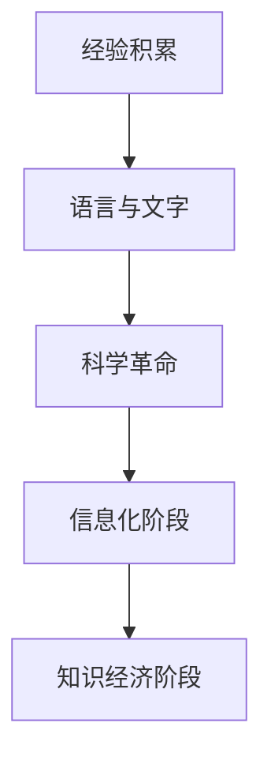
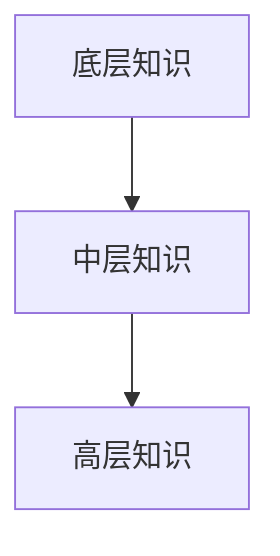

                 

### 文章标题

### 人类知识的传承：一代代人的接力赛跑

> **关键词**：知识传承、创新、全球化、人工智能、教育变革

**摘要**：
本文深入探讨了人类知识的传承问题，将其比喻为一项代代相传的接力赛跑。文章首先介绍了知识的起源与发展，探讨了知识的定义、类型、体系以及传承方式。接着，文章分析了知识传承面临的挑战与机遇，以及知识创新的重要性。随后，文章探讨了知识在现代科技中的应用，如人工智能、大数据和互联网。最后，文章展望了知识经济的崛起、知识社会的未来趋势、知识的全球化传播以及知识传承与创新的政策与法律。通过这些分析，本文旨在为读者提供一个全面而深入的理解，使读者能够更好地把握知识传承与创新的脉搏，为未来的发展贡献力量。

---

### 目录大纲

## 第一部分：知识的起源与发展

### 第1章：知识的概念与历史背景
#### 1.1 知识的定义
#### 1.2 知识的起源
#### 1.3 知识的发展历程

### 第2章：知识的类型与体系
#### 2.1 知识的类型
#### 2.2 知识的体系结构
#### 2.3 知识的层次结构

### 第3章：知识传承的方式
#### 3.1 口头传承
#### 3.2 文字传承
#### 3.3 科技传承
#### 3.4 教育传承

### 第4章：知识传承的挑战与机遇
#### 4.1 知识传承的挑战
#### 4.2 知识传承的机遇
#### 4.3 知识传承的未来展望

## 第二部分：知识的创新与应用

### 第5章：知识的创新机制
#### 5.1 创新的定义与类型
#### 5.2 创新的过程
#### 5.3 创新的影响因素

### 第6章：知识的跨领域应用
#### 6.1 跨领域知识整合
#### 6.2 知识的跨领域传播
#### 6.3 跨领域知识应用案例分析

### 第7章：知识在现代科技中的应用
#### 7.1 人工智能与知识
#### 7.2 大数据和知识
#### 7.3 互联网与知识传播

### 第8章：知识管理与实践
#### 8.1 知识管理的定义与目标
#### 8.2 知识管理的框架与工具
#### 8.3 知识管理的实践与应用

## 第三部分：知识的未来与发展

### 第9章：知识经济的崛起
#### 9.1 知识经济的概念与特征
#### 9.2 知识经济的影响与挑战
#### 9.3 知识经济与可持续发展

### 第10章：知识社会的未来趋势
#### 10.1 知识社会的概念与特征
#### 10.2 知识社会的发展趋势
#### 10.3 知识社会下的教育变革

### 第11章：知识的全球化传播
#### 11.1 知识全球化的概念与意义
#### 11.2 知识全球化的挑战与机遇
#### 11.3 知识全球化的路径与策略

### 第12章：知识传承与创新的政策与法律
#### 12.1 知识传承与创新的法律法规
#### 12.2 知识产权保护与知识传承
#### 12.3 政策环境对知识传承与创新的影响

## 附录

### 附录 A：知识传承与创新的经典案例
#### A.1 人类基因组计划
#### A.2 教育领域的知识传承与创新
#### A.3 科技企业的知识传承与创新

### 附录 B：知识传承与创新的参考资料
#### B.1 经典书籍推荐
#### B.2 学术期刊与论文资源
#### B.3 知识传承与创新的相关网站与论坛

## 结束语
### 知识传承与创新的重要性与未来展望

---

### 第一部分：知识的起源与发展

#### 第1章：知识的概念与历史背景

**1.1 知识的定义**

知识是人类通过学习、观察、实践等方式获得的对客观世界的理解和认识。它包括信息、技能、经验、价值观等。知识不仅是人类智慧和文明的结晶，也是推动社会进步和发展的关键因素。

在哲学领域，知识通常被定义为“通过理性思考和经验积累所获得的对现实世界的准确认识”。这种定义强调了知识的主观性和客观性，即知识既是个人意识的产物，也是对客观现实的反映。

**1.2 知识的起源**

知识的起源可以追溯到人类社会的早期。在原始社会中，人类通过直接的观察和实践来获取知识。例如，通过观察自然现象，人类学会了预测天气、识别食物来源等。随着人类社会的发展，知识逐渐从原始经验中抽象出来，并通过语言、符号等形式进行传承。

语言是知识传承的重要工具。通过语言，人类可以表达和传递思想、经验和知识。文字的出现使得知识可以以持久的形式记录下来，从而推动了知识的积累和传承。

**1.3 知识的发展历程**

知识的发展历程可以分为以下几个阶段：

1. **经验积累阶段**：在原始社会中，人类通过直接的观察和实践来积累知识。这种知识主要依赖于个人的经验和观察，具有一定的局限性。

2. **语言与文字阶段**：随着语言的发明和文字的出现，知识开始以更系统和持久的形式进行传承。人们可以通过书籍、文章等文字形式记录和保存知识，从而实现知识的跨代传承。

3. **科学革命阶段**：在科学革命时期，科学方法的出现使得知识系统化、精确化。通过实验、观察和推理，科学家们能够发现自然规律，并形成科学理论。这一阶段的代表性事件包括牛顿的物理学、达尔文的进化论等。

4. **信息化阶段**：随着计算机技术和互联网的发展，知识传播速度大大加快。人们可以通过网络轻松地获取和共享各种知识资源，从而推动了知识的全球化和普及化。

5. **知识经济阶段**：在知识经济时代，知识成为社会经济发展的核心驱动力。知识产业、知识服务等新兴行业迅速崛起，知识创新和知识传播成为经济增长的重要动力。

**Mermaid 流程图**：

通过以上流程图，我们可以清晰地看到知识的发展历程，从最初的实践经验到现代的知识经济，知识在不同阶段以不同的形式存在和传播。

#### 第2章：知识的类型与体系

**2.1 知识的类型**

知识可以根据不同的标准进行分类。以下是几种常见的知识分类方法：

1. **根据来源分类**：

   - **直接知识**：通过个人的直接观察、实践和经验获得的知识。
   - **间接知识**：通过他人或前人的经验和知识获得的。
   
2. **根据形式分类**：

   - **显性知识**：以文字、图像、符号等可编码的形式存在的知识。
   - **隐性知识**：难以用语言或符号直接表达的知识，如直觉、洞察力和情感等。

3. **根据性质分类**：

   - **科学知识**：通过科学研究得出的规律性知识。
   - **技术知识**：关于如何应用科学知识进行实际操作的知识。
   - **人文知识**：关于人类社会、文化、艺术等方面的知识。

**2.2 知识的体系结构**

知识的体系结构可以分为以下几个层次：

1. **底层知识**：包括基本的原理、概念、方法等，是知识的基石。
2. **中层知识**：包括具体的技术、应用等，是对底层知识的扩展和应用。
3. **高层知识**：包括战略、规划、管理等，是对中层知识的进一步抽象和整合。

**2.3 知识的层次结构**

知识的层次结构可以分为以下几个部分：

1. **底层知识**：包括基本的原理、概念、方法等，如数学、物理学、化学等基础科学知识。
2. **中层知识**：包括具体的技术、应用等，如工程学、医学、计算机科学等应用科学知识。
3. **高层知识**：包括战略、规划、管理等，如管理学、经济学、社会学等跨学科知识。

**Mermaid 流程图**：

通过以上流程图，我们可以看到知识的层次结构，从底层知识到高层知识，每个层次的知识都在不同层面上对世界进行理解和解释。

#### 第3章：知识传承的方式

**3.1 口头传承**

口头传承是知识传承的原始形式，主要通过口头讲述、传授等方式进行。在人类社会的早期，口头传承是知识传递的主要方式。通过故事、传说、仪式等形式，知识得以代代相传。

口头传承的优点在于灵活性和可传递性，但缺点是知识的准确性和完整性容易受到记忆误差的影响。此外，口头传承难以记录和保存，限制了知识的积累和传承。

**3.2 文字传承**

文字传承是知识传承的重要方式，主要通过书籍、文章、论文等文字形式进行。文字的出现使得知识可以以持久的形式记录下来，从而实现了跨代传承。

文字传承的优点在于准确性和持久性，知识可以长期保存和传递。此外，文字传承使得知识可以系统化和结构化，有利于知识的积累和传承。

然而，文字传承也存在一些缺点。首先，文字传承需要一定的文化素养，限制了知识的普及。其次，文字传承的过程可能涉及翻译和解释，增加了知识的复杂性和歧义性。

**3.3 科技传承**

科技传承是现代知识传承的重要方式，主要通过互联网、数据库、计算机系统等科技手段进行。科技传承的优点在于速度快、范围广，可以实现全球范围内的知识共享和传播。

互联网的发展极大地改变了知识传播的方式。通过互联网，人们可以随时随地获取和分享知识。数据库和计算机系统则提供了知识存储、管理和检索的工具，使得知识可以高效地被利用。

科技传承的优点还包括知识的可检索性和可重复性。通过互联网，知识可以被反复阅读和验证，从而提高了知识的准确性和可靠性。

然而，科技传承也存在一些挑战。首先，互联网的匿名性和去中心化特点可能带来信息的虚假和误导。其次，数据的隐私和安全问题需要得到重视，以防止知识的滥用和泄露。

**3.4 教育传承**

教育传承是通过学校、培训机构等教育机构进行的知识传授和培养。教育传承的优点在于系统性和规范性，可以确保知识得到有效的传授和传承。

学校教育是教育传承的主要形式，通过课程设置和教学方法，学生可以系统地学习各种知识。培训机构则提供了专业化的知识和技能培训，满足不同人群的需求。

教育传承的优点还包括培养学生的批判性思维和创新能力，使他们能够更好地适应社会的变化和发展。

然而，教育传承也存在一些挑战。首先，教育资源的分配不均可能导致不同地区和人群之间的知识差距。其次，教育模式的变革需要跟上知识发展的步伐，以培养适应未来社会的人才。

通过以上对知识传承方式的探讨，我们可以看到，不同的传承方式各有优缺点，但都是为了实现知识的积累和传承。在现代社会，多种传承方式相互补充，共同推动知识的进步和社会的发展。

#### 第4章：知识传承的挑战与机遇

**4.1 知识传承的挑战**

知识传承面临着诸多挑战，这些挑战在一定程度上影响了知识的传播和积累。以下是知识传承的主要挑战：

1. **知识碎片化**：随着信息技术的快速发展，知识呈现出碎片化的趋势。大量零散的信息充斥在互联网上，使得知识的系统性受到影响。知识碎片化使得人们难以形成全面、系统的知识体系，增加了知识学习和传承的难度。

2. **知识保密**：一些重要的知识可能因为保密原因无法广泛传播。在科研、企业等领域，知识保密是一种常见的现象，目的是保护商业秘密或国家机密。然而，过度保密可能导致知识的封闭和垄断，限制了知识的传播和应用。

3. **知识更新速度**：知识更新速度加快，传统知识难以跟上。在信息技术和科技进步的推动下，知识更新速度显著加快。新知识、新技术层出不穷，传统知识可能很快过时。这种快速变化的知识环境给知识传承带来了巨大的压力，如何有效地更新和传承知识成为一大挑战。

4. **知识获取难度**：知识获取难度增加，特别是对于一些专业性和技术性较强的知识。随着知识的复杂性和专业性增加，获取和掌握这些知识需要更高的学历和技能。这导致知识获取的不平等现象，使得部分人群难以获得高质量的知识资源。

5. **知识传播障碍**：知识传播过程中可能面临各种障碍，如语言障碍、文化差异、传播渠道受限等。这些障碍使得知识在跨地区、跨文化间的传播变得复杂和困难。

**4.2 知识传承的机遇**

尽管知识传承面临诸多挑战，但同时也存在许多机遇，这些机遇为知识传承提供了新的动力和可能性。以下是知识传承的主要机遇：

1. **互联网的发展**：互联网的普及和发展为知识传承提供了新的平台和途径。通过互联网，人们可以方便地获取和共享各种知识资源，打破了时间和空间的限制。互联网使得知识传播更加高效、便捷，有利于知识的普及和传承。

2. **知识共享平台**：知识共享平台的出现为知识传承提供了新的载体和手段。这些平台通常提供丰富的知识资源和交流空间，鼓励用户分享知识、讨论问题、共同进步。知识共享平台有助于构建一个开放、互动的知识社区，促进知识的传播和积累。

3. **人工智能的应用**：人工智能技术在知识传承中发挥了重要作用。通过自然语言处理、机器学习等技术，人工智能可以自动整理、分类和推荐知识，提高知识检索和获取的效率。此外，人工智能还可以辅助教师教学、学生学习，提高教育质量，促进知识传承。

4. **终身学习理念的普及**：随着知识经济时代的到来，终身学习理念逐渐普及。人们意识到学习不再是一段特定时间内的任务，而是一个持续的过程。终身学习理念的普及鼓励人们不断学习新知识、新技能，为知识传承提供了持续的动力。

5. **知识全球化**：知识全球化为知识传承提供了更广阔的舞台。在全球化的背景下，不同国家和地区的知识可以更方便地相互交流、借鉴和应用。知识全球化促进了全球范围内的知识共享和合作，有助于构建一个更加开放、包容的知识社会。

**4.3 知识传承的未来展望**

面对挑战和机遇，知识传承的未来发展趋势值得期待。以下是知识传承的未来展望：

1. **知识体系的完善**：随着信息技术的进步，知识体系将越来越完善和系统。通过人工智能和大数据技术，知识可以更加精准地分类、整理和推荐，帮助人们更高效地获取和应用知识。

2. **知识传播的多元化**：知识传播的方式将越来越多样化，不仅限于传统的文字和口头形式，还包括视频、音频、虚拟现实等。这种多元化的传播方式将使得知识更加生动、有趣，提高知识传播的效果。

3. **知识教育的变革**：知识教育将越来越注重个性化、实用性和创新能力。未来的教育将更加注重培养学生的综合素质和创新能力，推动知识传承向深度和广度发展。

4. **知识共享的深化**：知识共享将进一步深化，知识在全社会范围内的传播和共享将更加便捷和高效。通过知识共享平台和互联网，知识可以更快速地传播到全球各地，促进知识的全球共享和合作。

5. **知识传承的法律保障**：知识传承需要更加完善的法律保障。政府和企业应加强对知识传承的法律保护，确保知识创造者的权益得到有效维护，激发知识传承的积极性。

总之，知识传承面临着挑战和机遇，未来将朝着更加完善、高效和多元化的方向发展。通过利用新技术、推动教育变革和加强法律保障，我们可以更好地传承和利用知识，为社会的持续进步和发展贡献力量。

### 第5章：知识的创新机制

#### 5.1 创新的定义与类型

创新是指在现有知识和资源的基础上，通过新的方法、技术、策略等创造新的产品、服务或解决方案的过程。创新不仅包括技术层面的创新，还包括管理、商业模式、市场策略等多方面的创新。

创新的类型可以根据不同的标准进行分类。以下是几种常见的创新类型：

1. **技术性创新**：技术性创新是指通过引入新技术或改进现有技术来提高产品或服务的性能、效率或功能。例如，移动通信技术的发展推动了智能手机的普及和功能的增强。

2. **管理性创新**：管理性创新是指通过新的管理理念、方法或工具来提高组织的管理效率、决策质量和运营效果。例如，精益生产管理方法的应用显著提高了制造业的生产效率和产品质量。

3. **市场性创新**：市场性创新是指通过新的市场策略、商业模式或营销手段来开拓新市场、满足新需求或创造新价值。例如，电商平台的兴起改变了传统的零售模式，为消费者提供了更便捷的购物体验。

4. **组织性创新**：组织性创新是指通过改变组织的结构、流程或文化来提高组织的适应性和创新能力。例如，跨国公司的全球化战略使得企业能够更好地应对全球市场的变化。

#### 5.2 创新的过程

创新是一个复杂的过程，通常包括以下几个阶段：

1. **问题识别**：创新始于识别问题和机会。这可以通过市场调研、用户反馈、技术趋势分析等方式实现。问题识别是创新过程的关键，它决定了创新的方向和目标。

2. **创意生成**：在问题识别之后，创新团队需要产生创意来解决问题。创意生成可以通过头脑风暴、思维导图、用户访谈等方式实现。创意的多样性是创新成功的关键。

3. **筛选与评估**：在生成多个创意后，需要对创意进行筛选和评估。筛选和评估的标准通常包括可行性、成本效益、市场需求等。这一阶段的目标是确定最有潜力的创意进行深入开发。

4. **实施与推广**：一旦确定了创意，创新团队需要将其转化为实际的产品、服务或解决方案。实施阶段包括设计、开发、测试和部署等步骤。推广阶段则是将创新产品或服务推向市场，并通过营销策略提高其知名度和接受度。

#### 5.3 创新的影响因素

创新的成功受到多种因素的影响，以下是几个关键因素：

1. **技术因素**：技术创新是创新的核心驱动力。技术的进步不仅提供了新的可能性，也改变了竞争格局。例如，互联网技术的发展推动了电子商务的兴起。

2. **市场因素**：市场需求是创新的导向。创新必须解决市场问题或满足市场需求。了解用户需求、分析市场趋势对于创新至关重要。

3. **政策因素**：政府的政策支持对创新具有重要作用。政府可以通过税收优惠、资金支持、知识产权保护等政策激励创新活动。

4. **社会因素**：社会文化、价值观等也对创新产生影响。开放、包容和创新型的社会文化有助于激发创新思维和创业精神。

5. **组织因素**：组织内部的创新文化和机制对于创新的成功至关重要。一个支持创新、鼓励试错和持续学习的组织环境能够促进创新活动的开展。

#### 5.4 创新的成功案例

创新的成功案例无处不在，以下是几个典型的创新案例：

1. **苹果公司**：苹果公司通过一系列技术性创新和设计创新，推出了iPhone、iPad等革命性产品，改变了人们的生活方式。

2. **特斯拉**：特斯拉通过在电动汽车领域的创新，推动了电动车技术的发展，并改变了传统汽车行业的格局。

3. **谷歌**：谷歌通过搜索引擎技术的创新，建立了全球最大的信息检索平台，极大地改变了信息获取和知识传播的方式。

4. **阿里巴巴**：阿里巴巴通过电商平台的创新，改变了中国的零售模式，推动了电子商务的发展。

这些成功案例表明，创新不仅需要技术上的突破，还需要对市场和用户需求的深刻理解，以及良好的政策支持和组织环境。

通过以上对知识创新机制的探讨，我们可以看到，创新是一个复杂而动态的过程，涉及到多个方面的因素。了解创新的定义、类型、过程和影响因素，有助于我们更好地推动知识的创新和应用，为社会的进步和发展贡献力量。

### 第6章：知识的跨领域应用

#### 6.1 跨领域知识整合

跨领域知识整合是指将不同领域或学科的知识进行结合和整合，以产生新的知识或创新。跨领域知识整合在当今知识经济时代具有重要意义，它能够促进知识的创新和进步，推动各领域的发展。

跨领域知识整合的关键在于识别和发现不同领域之间的共通点和互补性。例如，生物技术与信息技术相结合，可以推动生物信息学的发展；经济学与心理学相结合，可以研究行为经济学，更好地理解市场行为。

跨领域知识整合的实现途径包括：

1. **多学科研究**：通过建立跨学科的研究团队，促进不同领域专家之间的交流和合作，共同研究跨领域的问题。

2. **知识图谱**：构建跨领域知识图谱，将不同领域的关键概念、术语和关系进行映射和整合，为跨领域研究提供知识基础。

3. **开放数据与平台**：通过开放数据和共享平台，促进不同领域的数据和知识资源互通，为跨领域研究提供丰富的数据支持。

4. **跨学科教育**：在高等教育和继续教育中，注重跨学科教育，培养具有跨领域知识和能力的复合型人才。

#### 6.2 知识的跨领域传播

知识的跨领域传播是指知识在不同领域之间的传递和交流。知识的跨领域传播有助于促进知识的普及和深入，推动各领域的发展。

知识的跨领域传播途径包括：

1. **学术交流**：通过学术会议、研讨会、讲座等形式，促进不同领域专家之间的交流，分享研究成果和经验。

2. **出版物与媒体**：通过学术论文、专著、期刊、新闻媒体等渠道，将知识在不同领域之间传播。

3. **在线教育**：通过在线课程、在线论坛等平台，提供跨领域知识的普及和教育。

4. **跨学科研究项目**：通过跨学科研究项目，将不同领域的研究者联合起来，共同研究和解决跨领域的问题。

#### 6.3 跨领域知识应用案例分析

以下是一个跨领域知识应用的案例：

**案例：人工智能在医疗领域的应用**

人工智能（AI）在医疗领域的应用是一个典型的跨领域知识整合和应用案例。人工智能结合了计算机科学、医学、统计学等多个领域的知识，为医疗诊断、治疗和健康管理提供了新的手段和工具。

1. **医学图像分析**：人工智能技术在医学图像分析中发挥着重要作用。通过深度学习和计算机视觉技术，人工智能可以自动分析医学图像，如X光片、CT扫描、MRI等，辅助医生进行诊断。例如，谷歌的DeepMind团队开发了一种AI系统，能够准确识别皮肤病，其准确性甚至超过了专业医生。

2. **个性化治疗**：人工智能可以帮助医生制定个性化的治疗方案。通过分析患者的基因信息、病史、生活习惯等数据，人工智能可以预测患者的疾病风险，并提供相应的治疗建议。例如，IBM的Watson for Oncology系统能够根据患者的具体病情，提供针对每位患者的个性化治疗方案。

3. **健康管理**：人工智能还可以在健康管理中发挥重要作用。通过智能手环、健康APP等设备，收集患者的健康数据，人工智能可以实时监测患者的健康状况，提供健康建议和预警。例如，苹果公司的HealthKit平台可以通过智能设备收集用户健康数据，并提供健康分析和建议。

通过这个案例，我们可以看到，跨领域知识整合和应用在医疗领域带来了巨大的变革。人工智能技术不仅提高了医疗诊断的准确性，还促进了个性化治疗和健康管理的发展。这一跨领域知识应用的案例展示了知识整合和传播的重要性，也为其他领域提供了借鉴和启示。

总之，跨领域知识整合和应用是知识社会发展的重要趋势。通过跨领域知识整合和传播，我们可以更好地利用各领域的知识和资源，推动创新和进步，为社会的可持续发展贡献力量。

### 第7章：知识在现代科技中的应用

#### 7.1 人工智能与知识

人工智能（AI）作为现代科技的前沿领域，正在深刻改变知识的生成、处理和传播方式。人工智能与知识的结合，不仅提升了知识的获取效率和准确性，还推动了知识创新和应用的发展。

1. **知识挖掘**：人工智能技术在知识挖掘中发挥着重要作用。通过机器学习、自然语言处理等技术，人工智能可以从大量非结构化和半结构化数据中提取出有价值的信息和知识。例如，利用深度学习算法，可以自动分析大量文献，提取关键信息，从而实现知识的自动化挖掘。

2. **知识表示**：人工智能技术还用于知识表示，将抽象的知识转化为计算机可以理解和处理的形式。例如，利用知识图谱技术，可以将复杂的关系和概念表示为网络结构，便于计算机进行推理和计算。

3. **知识推理**：人工智能还可以通过推理机制，从已知的知识中推导出新的结论。例如，基于逻辑推理和规则引擎，人工智能可以自动推导出新的科学发现或技术解决方案。

#### 7.2 大数据和知识

大数据技术的兴起，为知识的生成、存储、处理和分析提供了新的手段。大数据与知识的结合，使得知识的生产和传播更加高效和精准。

1. **数据采集与存储**：大数据技术能够高效地采集和存储海量数据，为知识的生成提供丰富的数据资源。例如，通过传感器网络、社交平台等，可以实时采集大量的环境、社会和经济数据。

2. **数据分析与挖掘**：大数据技术提供了强大的数据分析工具，可以挖掘数据中的潜在知识和规律。例如，利用数据挖掘算法，可以从大数据中提取出市场趋势、用户行为等信息，为企业决策提供支持。

3. **知识可视化**：大数据技术还支持知识可视化，将复杂的数据和知识以直观的形式展示出来。例如，利用数据可视化工具，可以将大规模数据以图表、地图等形式呈现，帮助用户更好地理解和分析数据。

#### 7.3 互联网与知识传播

互联网的普及和发展，为知识的传播提供了全新的渠道和方式。互联网与知识的结合，使得知识的获取和传播更加便捷和广泛。

1. **在线教育**：互联网为在线教育提供了平台，使得学习不再受时间和地点的限制。通过在线课程、直播教学、教育APP等，用户可以随时随地获取知识。

2. **知识共享平台**：互联网上存在大量的知识共享平台，如维基百科、知乎等，用户可以方便地分享和获取知识。这些平台为知识的传播和共享提供了便捷的途径。

3. **社交媒体**：社交媒体如微博、微信等，使得知识的传播更加迅速和广泛。通过分享、评论、转发等功能，用户可以快速传播知识和信息。

4. **在线搜索**：互联网搜索引擎如百度、谷歌等，提供了强大的信息检索功能，用户可以快速找到所需的知识和信息。

通过以上对知识在现代科技中的应用的探讨，我们可以看到，现代科技为知识的生成、处理和传播提供了强大的支持。人工智能、大数据和互联网等技术的结合，使得知识的生产和传播更加高效和精准，为知识的创新和应用开辟了新的可能性。未来，随着科技的不断发展，知识在现代科技中的应用将会更加广泛和深入，为人类社会的进步和发展做出更大的贡献。

### 第8章：知识管理与实践

#### 8.1 知识管理的定义与目标

知识管理是指通过系统的方法和工具，对知识进行识别、获取、组织、存储、共享和应用，以提高组织的知识利用效率和创新能力。知识管理的核心目标是：

1. **提高知识利用率**：通过知识管理，将隐性知识和显性知识有效地转化为可利用的知识资源，提高组织的知识利用率。

2. **增强创新能力**：通过知识管理，促进知识的创新和整合，为组织的创新活动提供知识支持。

3. **提高组织效率**：通过知识管理，减少知识重复劳动，提高组织的工作效率和协同效果。

知识管理的实现需要以下几个方面：

1. **知识识别**：识别组织内的知识资源，包括员工的经验、客户需求、技术文档等。

2. **知识获取**：通过各种渠道获取外部知识，如行业报告、学术论文、市场资讯等。

3. **知识组织**：对获取到的知识进行分类、标签化、归档，便于知识的检索和利用。

4. **知识存储**：建立知识库，将组织内的知识资源进行系统化存储，确保知识的可访问性和可维护性。

5. **知识共享**：通过知识共享平台和机制，促进知识的传播和交流，提高知识的共享效率。

6. **知识应用**：将知识应用于组织的管理、决策和创新活动，实现知识的实际价值。

#### 8.2 知识管理的框架与工具

知识管理的框架通常包括以下几个关键组件：

1. **知识基础设施**：包括知识库、知识门户、知识管理系统等基础设施，为知识管理提供技术支持。

2. **知识流程**：定义知识生成、获取、存储、共享和应用的过程，确保知识管理的系统性和持续性。

3. **知识策略**：制定知识管理策略，包括知识管理目标、知识管理方针、知识管理政策等，为知识管理提供指导。

4. **知识文化**：建立知识共享、知识创新的组织文化，鼓励员工积极参与知识管理活动。

5. **知识团队**：建立知识管理团队，负责知识管理的规划、实施和监督。

知识管理的工具包括：

1. **知识库**：用于存储和组织知识资源，支持知识的检索和利用。

2. **知识门户**：提供知识共享和交流的平台，方便员工获取所需的知识。

3. **知识管理系统**：用于知识管理的过程自动化，提高知识管理的效率和效果。

4. **知识地图**：展示知识的结构关系和流动路径，帮助员工更好地理解和利用知识。

5. **知识共享平台**：如论坛、社交媒体、在线协作工具等，促进知识的传播和交流。

#### 8.3 知识管理的实践与应用

知识管理的实践与应用包括以下几个方面：

1. **企业知识管理**：企业通过知识管理，提高员工的知识共享和创新能力，提升组织的核心竞争力。例如，华为公司通过建立知识管理系统，实现知识的系统化存储和高效利用，促进了企业的持续创新和发展。

2. **学术知识管理**：学术机构通过知识管理，提高学术资源的共享和利用，推动学术研究的深入和发展。例如，剑桥大学图书馆通过建立知识门户，提供了丰富的学术资源，方便师生进行学术研究。

3. **公共知识管理**：政府部门通过知识管理，提高公共服务的质量和效率，提升政府形象。例如，美国政府的“开放政府”计划，通过知识共享平台，提供了大量的政府数据资源，方便公众获取和使用。

4. **社区知识管理**：社区组织通过知识管理，促进社区成员的知识交流和合作，提升社区的整体素质。例如，一些社区通过建立知识共享平台，为社区居民提供学习、交流、分享的空间。

总之，知识管理在各个领域都发挥着重要作用，通过有效的知识管理，可以提升组织的知识利用效率，增强创新能力，提高组织效率，为组织的持续发展提供强大的知识支持。

### 第9章：知识经济的崛起

#### 9.1 知识经济的概念与特征

知识经济是一种以知识为主要生产要素的经济形态，与传统的资源经济和劳动力经济相比，具有以下几个显著特征：

1. **知识主导**：知识经济强调知识和信息的价值，知识成为经济增长的主要驱动力。
2. **创新驱动**：知识经济以创新为核心，通过不断的科技创新和知识创新推动经济发展。
3. **全球化**：知识经济是全球化的，知识的流动和传播不受地域和时间的限制。
4. **虚拟化**：知识经济中的生产和服务过程更加虚拟化，依赖于信息技术和互联网。
5. **不确定性**：知识经济中的技术变革和市场需求变化迅速，具有较高的不确定性。

知识经济的主要特征包括：

1. **高附加值**：知识经济以高附加值的产品和服务为主，如信息技术、生物技术、金融服务等。
2. **知识密集**：知识经济依赖于知识的创造、传播和应用，知识的生产和传播成为经济增长的主要动力。
3. **高度信息化**：知识经济依赖于信息技术的支持，互联网、大数据、人工智能等技术在知识经济中发挥着关键作用。
4. **灵活性和适应性**：知识经济强调企业的灵活性和适应性，能够迅速响应市场变化和技术创新。

#### 9.2 知识经济的影响与挑战

知识经济对人类社会产生了深远的影响，同时也带来了一系列挑战：

**影响：**

1. **经济增长**：知识经济推动了全球经济的快速增长，提高了生产效率和经济增长的质量。
2. **就业结构**：知识经济改变了传统的就业结构，知识型工作比例增加，对劳动者的素质提出了更高的要求。
3. **生活方式**：知识经济改变了人们的生活方式，知识的获取和传播变得更加便捷，信息爆炸现象加剧。
4. **社会治理**：知识经济对社会治理提出了新的要求，需要建立适应知识经济的政策和法律体系。

**挑战：**

1. **知识鸿沟**：知识经济可能加剧发达国家和发展中国家之间的知识鸿沟，导致发展不平衡。
2. **文化冲突**：知识经济中的文化冲突和价值观念碰撞可能引发社会矛盾和冲突。
3. **知识产权保护**：知识经济需要有效的知识产权保护机制，以保护知识创造者的权益。
4. **人才培养**：知识经济对人才的需求提出了更高的要求，需要加强人才培养和知识教育。

#### 9.3 知识经济与可持续发展

知识经济与可持续发展之间存在密切关系。知识经济为可持续发展提供了技术和管理支持，而可持续发展目标可以促进知识经济的发展。具体体现在以下几个方面：

1. **技术创新**：知识经济推动了技术创新，为可持续发展提供了技术支持，如可再生能源技术、环保技术等。
2. **知识共享**：知识共享是实现可持续发展的重要手段，通过知识共享可以促进资源的合理利用和环境保护。
3. **教育变革**：知识经济要求加强教育改革，培养具备创新能力和可持续发展意识的人才。
4. **政策支持**：政府需要制定有利于知识经济与可持续发展结合的政策，如知识产权保护、知识共享机制等。

总之，知识经济是推动可持续发展的重要力量。在知识经济时代，我们需要更加重视知识传承与创新，以实现经济、社会和环境的可持续发展。

### 第10章：知识社会的未来趋势

#### 10.1 知识社会的概念与特征

知识社会是指以知识为主要资源、以知识创新为主要动力、以知识传播为主要手段的社会形态。在知识社会中，知识成为社会发展的核心要素，对经济、政治、文化等各个方面产生深远影响。知识社会的特征包括：

1. **知识主导**：知识成为社会发展的主导力量，知识的生产、传播和应用成为经济增长的主要驱动力。
2. **创新驱动**：知识社会强调创新，创新成为社会进步和经济发展的重要动力。
3. **共享开放**：知识在全社会范围内共享和开放，知识传播的速度和范围显著提高。
4. **跨界融合**：知识社会的各领域之间相互融合，跨领域的知识整合和创新成为常态。
5. **数字化**：知识社会的各个方面都依赖于数字化技术，互联网、大数据、人工智能等成为知识传播和共享的重要工具。
6. **终身学习**：知识社会要求人们具备持续学习的能力，终身学习成为个人发展的必备条件。

#### 10.2 知识社会的发展趋势

知识社会的发展趋势体现在以下几个方面：

1. **知识经济深化**：知识经济将继续深化，知识在生产和服务中的比重将进一步提高，推动经济结构的升级和转型。
2. **知识传播加速**：随着信息技术的不断进步，知识传播的速度和范围将进一步扩大，知识获取变得更加便捷。
3. **知识治理加强**：知识社会的治理需要加强，包括知识产权保护、知识共享机制、知识安全等方面。
4. **跨界知识整合**：知识社会的跨界知识整合将更加频繁，跨领域的知识创新将成为社会发展的重要动力。
5. **智能化**：人工智能和大数据技术将在知识社会中发挥重要作用，推动知识管理、知识服务、知识传播的智能化。
6. **教育变革**：知识社会要求教育更加注重知识的应用和创新能力的培养，教育模式将发生深刻变革。

#### 10.3 知识社会下的教育变革

知识社会下的教育变革主要体现在以下几个方面：

1. **终身教育**：知识社会要求人们具备终身学习的能力，教育将贯穿个人的一生，从摇篮到坟墓。
2. **个性化教育**：教育将更加注重个性化，满足个体的多样化需求，培养具有创新精神和实践能力的人才。
3. **跨界教育**：教育将打破学科界限，实现跨领域的知识整合和创新，培养具有跨学科能力和综合素质的人才。
4. **数字化教育**：信息技术的发展将推动教育数字化，在线教育、远程教育、虚拟现实教育等将成为教育的新形式。
5. **教育资源共享**：教育资源共享将更加普及，知识社会下的教育将更加开放，教育资源将在全球范围内共享。
6. **教育公平**：知识社会要求实现教育公平，消除教育差距，使每个人都能获得优质教育资源。

总之，知识社会对教育提出了新的要求和挑战，教育变革将成为知识社会发展的关键。通过终身教育、个性化教育、跨界教育、数字化教育等方式，教育将更好地适应知识社会的需求，培养具有创新能力和综合素质的人才，推动社会进步和发展。

### 第11章：知识的全球化传播

#### 11.1 知识全球化的概念与意义

知识全球化是指知识在全球范围内的流动、传播和应用。随着信息技术的迅猛发展，知识的全球化趋势日益明显。知识全球化不仅仅是知识的跨国界流动，还包括知识的传播、共享和应用，是全球化进程中的重要组成部分。

知识全球化的意义主要体现在以下几个方面：

1. **知识共享**：知识全球化促进了全球范围内的知识共享，使各国能够共享世界各地的知识和资源，推动全球知识的繁荣。
2. **技术进步**：知识全球化加速了技术的传播和创新，不同国家和地区之间的技术交流和合作有助于推动全球科技的发展。
3. **经济发展**：知识全球化为各国提供了更多的发展机遇，通过知识资源的全球配置，可以提高生产效率，推动经济增长。
4. **文化融合**：知识全球化促进了文化的融合和交流，不同国家和地区之间的文化碰撞和融合有助于丰富人类文明。

#### 11.2 知识全球化的挑战与机遇

知识全球化既带来了巨大的机遇，也面临诸多挑战：

**机遇：**

1. **知识共享**：知识全球化使得知识传播更加便捷，各国可以共享世界各地的先进知识和科研成果，提高自身的发展水平。
2. **技术创新**：知识全球化促进了技术交流和合作，不同国家和地区的企业和科研机构可以共同开展研发活动，推动全球技术创新。
3. **经济增长**：知识全球化为各国提供了更多的发展机遇，通过知识资源的全球配置，可以提高生产效率，推动经济增长。
4. **文化多样性**：知识全球化促进了不同文化之间的交流与融合，有助于丰富人类文明的多样性。

**挑战：**

1. **知识鸿沟**：知识全球化可能加剧发达国家和发展中国家之间的知识鸿沟，导致知识资源分配不均，影响全球公平发展。
2. **文化冲突**：知识全球化可能引发文化冲突和价值观念的碰撞，不同文化之间的差异可能引发误解和矛盾。
3. **知识产权保护**：知识全球化需要建立有效的知识产权保护机制，以保护知识创造者的权益，防止知识滥用和侵权。
4. **网络安全**：知识全球化使得网络成为知识传播的主要渠道，同时也带来了网络安全问题，需要加强网络安全保护。

#### 11.3 知识全球化的路径与策略

为了充分利用知识全球化的机遇，应对面临的挑战，各国可以采取以下路径与策略：

1. **加强国际合作**：各国应加强在知识全球化领域的国际合作，通过多边机制和双边协议，促进知识资源的共享和交流。
2. **提升创新能力**：各国应加大对科技创新的投入，提升自主创新能力，以适应知识全球化的需求。
3. **优化教育体系**：各国应优化教育体系，提高人才培养质量，培养具有全球视野和创新能力的专业人才。
4. **保护知识产权**：各国应加强知识产权保护，建立完善的知识产权法律体系，为知识创造者提供强有力的法律保障。
5. **促进知识传播**：各国应积极推动知识传播，通过建立知识共享平台、举办国际会议等方式，促进知识的全球流动和应用。
6. **加强网络安全**：各国应加强网络安全保护，确保知识全球化过程中的信息安全，防止网络犯罪和网络攻击。

总之，知识全球化是当今世界的重要趋势，各国应积极参与和推动知识全球化进程，通过国际合作、科技创新、人才培养等措施，实现知识共享、技术创新和经济增长，为人类社会的繁荣发展贡献力量。

### 第12章：知识传承与创新的政策与法律

#### 12.1 知识传承与创新的法律法规

知识传承与创新的法律法规是保障知识创造、传播和应用的重要基础。这些法律法规主要包括以下几个方面：

1. **知识产权法律**：知识产权法律是保护知识成果的重要法律体系，包括专利法、商标法、著作权法等。这些法律为知识创造者提供了法律保障，激励知识的创新和传承。

2. **教育法律**：教育法律规范了知识传承的方式和内容，保障教育的质量和公平性。例如，《中华人民共和国教育法》明确了教育的目的、管理体制、教师权益等。

3. **科技法律**：科技法律规范了科技创新的过程和行为，包括科技进步法、科技成果转化法等。这些法律为科技创新提供了法律支持，保障科技成果的合理应用和传承。

4. **信息法律**：信息法律主要涉及信息收集、存储、处理和传播等方面的法律规范，如《中华人民共和国网络安全法》、《中华人民共和国数据安全法》等。这些法律为知识传播提供了法律保障，确保信息安全和知识共享。

#### 12.2 知识产权保护与知识传承

知识产权保护与知识传承之间存在密切的关系。知识产权保护不仅能够激励知识创新，还能够促进知识的传播和应用。

1. **激励创新**：知识产权法律为知识创造者提供了法律保障，使其在知识创造过程中能够获得经济回报。这种经济激励有助于激发更多的创新活动，推动知识的积累和传承。

2. **保障传承**：知识产权法律保护了知识创造者的权益，防止未经授权的复制、使用和传播。这种保护有助于确保知识在传承过程中的合法性和安全性。

3. **促进应用**：知识产权保护鼓励知识创造者将知识转化为实际应用，促进知识的商业化和社会化。这种应用不仅有助于知识的传承，还能够推动经济的发展和社会的进步。

#### 12.3 政策环境对知识传承与创新的影响

政策环境是影响知识传承与创新的重要因素。良好的政策环境能够为知识传承与创新提供支持，促进知识的发展和应用。

1. **知识产权政策**：知识产权政策是影响知识传承与创新的关键。政府应制定有利于知识产权保护的政策，鼓励知识创造和传承。

2. **教育政策**：教育政策对知识传承与创新具有重要影响。政府应加大对教育的投入，优化教育体系，培养具有创新能力和实践能力的人才。

3. **科技创新政策**：科技创新政策是推动知识传承与创新的重要手段。政府应制定支持科技创新的政策，鼓励企业、科研机构和个人进行知识创新。

4. **产业政策**：产业政策对知识传承与创新也具有重要影响。政府应制定有利于产业发展的政策，推动知识在产业中的应用和传承。

5. **国际政策**：国际合作和知识共享政策对于知识传承与创新具有重要作用。政府应积极参与国际知识合作，推动全球知识共享和传承。

总之，知识传承与创新需要良好的政策环境支持。通过制定和实施有利于知识创造、保护、传播和应用的法律法规和政策，政府可以为知识传承与创新提供有力保障，推动知识的发展和利用，促进社会的进步和繁荣。

### 附录 A：知识传承与创新的经典案例

#### A.1 人类基因组计划

人类基因组计划（Human Genome Project，HGP）是一项旨在解码人类基因组的国际科学项目，始于1986年，于2003年完成。该计划

