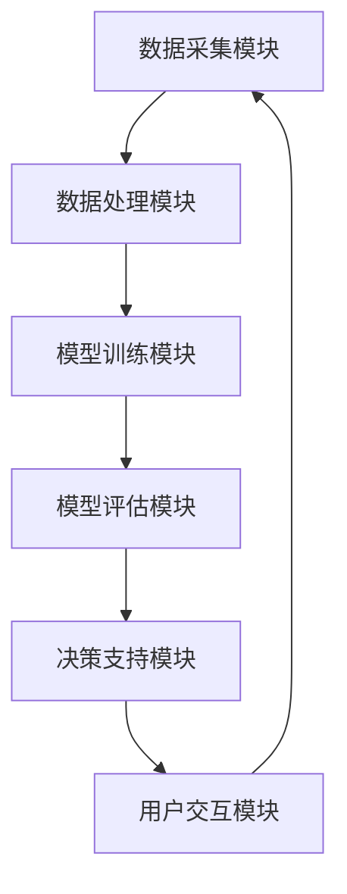

                 

# 人类计算：创造一个更加公平、公正和可持续的未来

## 关键词
- 人类计算
- 公平
- 公正
- 可持续发展
- 人工智能
- 算法
- 伦理

## 摘要
本文探讨了人类计算的概念、重要性、发展历程以及其在现代社会中的应用。通过分析人类计算的核心概念、架构和算法原理，我们揭示了人类计算如何帮助创造一个更加公平、公正和可持续的未来。同时，本文还探讨了人类计算在实践中的应用，以及其在伦理、法律和政策框架中的挑战和机遇。最后，我们总结了人类计算的重要意义，并展望了其未来的发展趋势。

### 第一部分：引言与背景

## 1.1 人类计算的概念与重要性

### 1.1.1 人类计算的定义
人类计算是一种将人类智能与计算机技术相结合的计算方式。它利用人类专家的知识、经验和创造力，结合计算机的运算能力和数据处理能力，以解决复杂问题、创造新的解决方案和提升系统性能。

### 1.1.2 人类计算的价值
人类计算的价值在于其独特的优势，主要包括：
- **高效性**：通过利用人类专家的知识和经验，人类计算可以快速解决复杂问题，提高计算效率。
- **创新性**：人类计算能够激发人类创造力，产生新的思想、方法和技术，推动科技进步。
- **适应性强**：人类计算可以根据不同领域和场景的需求，灵活调整和优化算法和模型，提高适用性。
- **伦理和公正**：人类计算能够引入伦理和公正的考虑，解决人工智能可能带来的不公正问题。

### 1.1.3 人类计算与传统计算的区别
传统计算主要依赖于计算机硬件和软件，通过编程和算法实现自动化和优化。而人类计算则更加强调人类智能的参与，通过结合人类专家的知识、经验和创造力，实现更高效、创新和适应性的计算。

## 1.2 人类计算的发展历程

### 1.2.1 早期人类计算的发展
早期人类计算可以追溯到古代，如使用算盘、计算尺等计算工具。随着计算机技术的发展，人类计算逐渐进入数字化时代。20世纪中叶，计算机的出现为人类计算提供了强大的计算能力和数据处理能力，促进了人类计算的发展。

### 1.2.2 计算机革命对人类计算的影响
计算机革命为人类计算带来了巨大的变革。计算机的运算速度、存储容量和数据处理能力的提升，使得人类计算能够处理更加复杂的数据和问题。同时，计算机的普及和应用也推动了人类计算在社会各个领域的广泛应用。

### 1.2.3 人工智能与人类计算的结合
人工智能（AI）的发展为人类计算注入了新的活力。人工智能技术，如机器学习、深度学习等，使得计算机能够自主学习和优化，提高计算效率和准确性。人类计算与人工智能的结合，使得人类计算能够更好地发挥计算机和人类智能的优势，实现更高效、创新和智能的计算。

## 1.3 人类计算面临的挑战与机遇

### 1.3.1 当前人类计算面临的挑战
当前人类计算面临以下挑战：
- **数据隐私与安全**：人类计算涉及到大量数据的使用和处理，如何保护数据隐私和安全成为一个重要问题。
- **伦理与道德**：人类计算的应用涉及到伦理和道德问题，如何确保计算过程的公正和道德成为挑战。
- **技术依赖**：人类计算依赖于计算机技术和人工智能技术，如何减少技术依赖，提高自主性和可控性是一个问题。

### 1.3.2 人类计算带来的机遇
人类计算带来的机遇包括：
- **创新与进步**：人类计算能够激发人类创造力，推动科技和社会的进步。
- **行业变革**：人类计算在医疗、金融、教育、工业等领域具有巨大的应用潜力，能够带来行业变革。
- **可持续发展**：人类计算通过优化资源利用和提升效率，有助于实现可持续发展目标。

### 1.3.3 创造公平、公正和可持续的未来
人类计算的发展目标之一是创造一个更加公平、公正和可持续的未来。通过人类计算的智能决策和优化，可以减少社会不平等和资源浪费，促进社会公平和可持续发展。同时，人类计算还可以引入伦理和道德约束，确保计算过程的公正性和道德性。

### 第二部分：人类计算的核心概念与架构

## 2.1 人类计算的核心概念

### 2.1.1 人类计算的基础理论
人类计算的基础理论主要包括以下几个核心概念：
- **计算思维**：计算思维是一种解决复杂问题的思维方式，它强调通过抽象、建模和算法设计来解决问题。
- **知识表示**：知识表示是将人类知识以计算机可处理的形式表示和存储，以便计算机能够利用这些知识进行计算和推理。
- **推理与决策**：推理与决策是人类计算的核心，通过逻辑推理和决策算法，计算机能够模拟人类专家的思维过程，实现智能决策。
- **人机协作**：人机协作是利用人类专家和计算机的优势，实现高效、创新和智能的计算。

### 2.1.2 人类计算的基本原理
人类计算的基本原理主要包括以下几个方面：
- **数据驱动**：人类计算依赖于大量数据，通过数据驱动的方式，计算机能够学习和优化算法和模型。
- **模型驱动**：人类计算通过建立数学模型和算法模型，模拟人类专家的思维过程，实现智能计算。
- **协作优化**：人类计算通过人机协作，充分利用人类专家和计算机的优势，实现优化计算和智能决策。
- **伦理约束**：人类计算引入伦理约束，确保计算过程和结果的公正性和道德性。

### 2.1.3 人类计算的技术体系
人类计算的技术体系包括以下几个主要组成部分：
- **人工智能技术**：人工智能技术，如机器学习、深度学习、自然语言处理等，是实现人类计算的关键技术。
- **大数据技术**：大数据技术，如数据存储、数据挖掘、数据分析等，为人类计算提供了数据支撑。
- **云计算技术**：云计算技术，如云平台、云计算服务、云存储等，为人类计算提供了计算资源和基础设施。
- **人机交互技术**：人机交互技术，如语音识别、图像识别、自然语言交互等，为人类计算提供了人机交互接口。

### 2.2 人类计算的架构设计

#### 2.2.1 人类计算的系统架构
人类计算的系统架构主要包括以下几个层次：
- **数据层**：数据层负责数据的采集、存储和管理，为人类计算提供数据支持。
- **模型层**：模型层负责建立数学模型和算法模型，模拟人类专家的思维过程，实现智能计算。
- **决策层**：决策层负责根据模型层的结果进行决策和优化，实现智能决策。
- **用户层**：用户层负责与用户进行交互，接收用户输入和反馈，提供计算结果和服务。

#### 2.2.2 人类计算的模块与接口
人类计算的架构设计包括以下几个主要模块：
- **数据采集模块**：数据采集模块负责采集各种数据源的数据，如传感器数据、社交媒体数据、医疗数据等。
- **数据处理模块**：数据处理模块负责对采集到的数据进行预处理、清洗和转换，为模型层提供高质量的数据。
- **模型训练模块**：模型训练模块负责建立数学模型和算法模型，并通过训练优化模型参数，提高计算准确性。
- **模型评估模块**：模型评估模块负责评估模型的效果和性能，通过交叉验证和性能指标评估，确保模型的可靠性和有效性。
- **决策支持模块**：决策支持模块负责根据模型层的结果进行决策和优化，提供智能化的决策支持。
- **用户交互模块**：用户交互模块负责与用户进行交互，接收用户输入和反馈，提供计算结果和服务。

#### 2.2.3 人类计算的扩展性与可维护性
人类计算的架构设计需要考虑扩展性和可维护性，以满足不同场景和应用的需求。以下是一些设计原则：
- **模块化设计**：将系统划分为多个模块，每个模块负责特定的功能，模块之间通过接口进行通信，提高系统的灵活性和可维护性。
- **可扩展性**：系统应支持模块的扩展和升级，以便适应新的需求和变化。
- **可维护性**：系统应具备良好的文档和代码注释，方便维护和优化。

### 2.3 人类计算的 Mermaid 流程图



#### 2.3.1 人类计算的全流程展示
该流程图展示了人类计算的全流程，包括数据采集、数据处理、模型训练、模型评估、决策支持和用户交互等环节。

#### 2.3.2 人类计算的关键节点分析
- **数据采集模块**：负责从各种数据源采集数据，如传感器数据、社交媒体数据、医疗数据等。
- **数据处理模块**：负责对采集到的数据进行预处理、清洗和转换，为模型层提供高质量的数据。
- **模型训练模块**：负责建立数学模型和算法模型，并通过训练优化模型参数，提高计算准确性。
- **模型评估模块**：负责评估模型的效果和性能，通过交叉验证和性能指标评估，确保模型的可靠性和有效性。
- **决策支持模块**：负责根据模型层的结果进行决策和优化，提供智能化的决策支持。
- **用户交互模块**：负责与用户进行交互，接收用户输入和反馈，提供计算结果和服务。

#### 2.3.3 人类计算的价值流分析
价值流分析是指分析人类计算过程中各个节点对整体价值的贡献。通过分析价值流，可以识别出价值增值环节和浪费环节，优化系统流程，提高整体价值。

### 第三部分：人类计算的核心算法原理

## 3.1 人类计算的核心算法概述

### 3.1.1 人类计算的主要算法类型
人类计算涉及多种算法类型，主要包括以下几种：
- **机器学习算法**：机器学习算法是一种通过训练数据自动学习和优化模型参数的算法，主要包括监督学习、无监督学习和强化学习。
- **深度学习算法**：深度学习算法是一种基于人工神经网络进行深度学习的算法，如卷积神经网络（CNN）、循环神经网络（RNN）和生成对抗网络（GAN）。
- **自然语言处理算法**：自然语言处理算法是一种处理和解析自然语言文本的算法，如词向量模型、语言模型和序列标注模型。
- **优化算法**：优化算法是一种通过求解优化问题，找到最优解或近似最优解的算法，如线性规划、梯度下降和遗传算法。

### 3.1.2 人类计算算法的选择原则
选择人类计算算法时，需要考虑以下几个原则：
- **问题特性**：根据问题的特性，选择适合的算法类型。例如，对于分类问题，可以选择监督学习算法；对于聚类问题，可以选择无监督学习算法。
- **数据质量**：根据数据的量和质量，选择合适的算法。例如，对于大量数据，可以选择深度学习算法；对于小数据集，可以选择传统机器学习算法。
- **计算资源**：根据计算资源的限制，选择计算效率和精度合适的算法。例如，对于实时计算需求，可以选择简单高效的算法；对于高精度计算需求，可以选择复杂但精度更高的算法。

### 3.1.3 人类计算算法的评估方法
评估人类计算算法的方法主要包括以下几个方面：
- **准确率**：准确率是评估分类算法的主要指标，表示模型正确分类的样本数占总样本数的比例。
- **召回率**：召回率是评估分类算法的主要指标，表示模型正确分类的样本数占实际为正样本的样本数的比例。
- **F1值**：F1值是准确率和召回率的加权平均，用于综合评估分类算法的性能。
- **ROC曲线**：ROC曲线是评估二分类算法性能的重要工具，通过计算真阳性率与假阳性率的关系，评估算法的分类能力。
- **交叉验证**：交叉验证是一种评估算法性能的方法，通过将数据集划分为多个子集，循环进行训练和验证，评估算法的泛化能力。

## 3.2 人类计算的关键算法详解

### 3.2.1 机器学习算法原理

#### 3.2.1.1 机器学习基础
机器学习是一种通过训练数据自动学习和优化模型参数的方法。机器学习算法可以分为以下几类：
- **监督学习**：监督学习是一种有监督的学习方法，通过已标记的数据集训练模型，并在新的数据上进行预测。
- **无监督学习**：无监督学习是一种无监督的学习方法，通过未标记的数据集训练模型，用于发现数据中的结构和模式。
- **半监督学习**：半监督学习是一种结合有监督学习和无监督学习的方法，通过少量已标记数据和大量未标记数据训练模型。
- **强化学习**：强化学习是一种通过奖励和惩罚机制训练模型的方法，使模型能够自主学习和优化行为。

#### 3.2.1.2 监督学习算法
监督学习算法包括以下几种：
- **线性回归**：线性回归是一种基于线性模型的预测方法，通过最小化损失函数，找到最优的线性模型参数。
- **逻辑回归**：逻辑回归是一种基于逻辑函数的分类方法，通过最小化损失函数，找到最优的分类模型参数。
- **支持向量机（SVM）**：支持向量机是一种基于最大间隔的分类方法，通过求解二次规划问题，找到最优的分类边界。
- **决策树**：决策树是一种基于树结构的分类方法，通过递归划分特征，找到最优的分类规则。
- **随机森林**：随机森林是一种基于决策树的集成方法，通过构建多个决策树并投票，提高分类性能。

#### 3.2.1.3 无监督学习算法
无监督学习算法包括以下几种：
- **K-均值聚类**：K-均值聚类是一种基于距离度量的聚类方法，通过迭代更新聚类中心，找到最优的聚类结果。
- **主成分分析（PCA）**：主成分分析是一种降维方法，通过将高维数据投影到低维空间，降低数据复杂度。
- **自编码器**：自编码器是一种基于神经网络的无监督学习算法，通过编码和解码过程，自动学习和提取数据的特征表示。

#### 3.2.1.4 强化学习算法
强化学习算法包括以下几种：
- **Q-学习**：Q-学习是一种基于值函数的强化学习算法，通过更新Q值，找到最优的动作策略。
- **深度Q网络（DQN）**：深度Q网络是一种基于深度神经网络的强化学习算法，通过将Q值网络参数化，提高学习效率和泛化能力。
- **策略梯度算法**：策略梯度算法是一种基于策略优化的强化学习算法，通过优化策略参数，找到最优的动作策略。

### 3.2.2 深度学习算法原理

#### 3.2.2.1 深度学习基础
深度学习是一种基于多层神经网络进行深度学习的算法。深度学习的基本组成部分包括：
- **神经元**：神经元是神经网络的基本单元，通过激活函数进行非线性变换。
- **层**：层是神经网络的结构单元，包括输入层、隐藏层和输出层。
- **连接**：连接是神经元之间的连接，用于传递信息和计算输出。
- **激活函数**：激活函数是神经网络中的非线性变换，用于增加模型的表达能力。

#### 3.2.2.2 神经网络架构
神经网络架构包括以下几种：
- **全连接神经网络（FCNN）**：全连接神经网络是一种最常见的神经网络架构，每个神经元都与其他神经元相连。
- **卷积神经网络（CNN）**：卷积神经网络是一种专门用于处理图像数据的神经网络，通过卷积操作和池化操作提取图像特征。
- **循环神经网络（RNN）**：循环神经网络是一种专门用于处理序列数据的神经网络，通过递归连接和隐藏状态，处理长序列依赖关系。
- **生成对抗网络（GAN）**：生成对抗网络是一种基于生成器和判别器的对抗性神经网络，通过生成真实数据和判别真实数据和生成数据的差异，生成高质量的数据。

#### 3.2.2.3 卷积神经网络（CNN）
卷积神经网络是一种专门用于处理图像数据的神经网络，通过卷积操作和池化操作提取图像特征。卷积神经网络的基本组成部分包括：
- **卷积层**：卷积层通过卷积操作提取图像特征，卷积核滑动图像，计算卷积结果。
- **激活函数**：激活函数是卷积层中的非线性变换，常用的激活函数有ReLU（Rectified Linear Unit）和Sigmoid。
- **池化层**：池化层通过池化操作降低图像分辨率，常用的池化操作有最大池化和平均池化。
- **全连接层**：全连接层通过全连接操作将卷积特征映射到分类结果。

卷积神经网络的工作原理可以概括为：
1. 输入层接收图像数据。
2. 通过卷积层和激活函数，提取图像特征。
3. 通过池化层降低图像分辨率，减少计算复杂度。
4. 通过全连接层将特征映射到分类结果。

#### 3.2.2.4 循环神经网络（RNN）
循环神经网络是一种专门用于处理序列数据的神经网络，通过递归连接和隐藏状态，处理长序列依赖关系。循环神经网络的基本组成部分包括：
- **输入层**：输入层接收序列数据。
- **隐藏层**：隐藏层通过递归连接和激活函数，处理序列数据，更新隐藏状态。
- **输出层**：输出层通过全连接层和激活函数，输出序列结果。

循环神经网络的工作原理可以概括为：
1. 输入层接收序列数据。
2. 隐藏层通过递归连接，处理序列数据，更新隐藏状态。
3. 输出层通过全连接层和激活函数，输出序列结果。

循环神经网络可以处理各种序列数据，如时间序列数据、文本数据和语音数据。

#### 3.2.2.5 生成对抗网络（GAN）
生成对抗网络是一种基于生成器和判别器的对抗性神经网络，通过生成真实数据和判别真实数据和生成数据的差异，生成高质量的数据。生成对抗网络的基本组成部分包括：
- **生成器**：生成器通过随机噪声生成数据，目标是生成与真实数据相似的数据。
- **判别器**：判别器通过输入真实数据和生成数据，判断数据的真实性，目标是提高判别能力。

生成对抗网络的工作原理可以概括为：
1. 生成器生成数据。
2. 判别器判断数据的真实性。
3. 生成器和判别器进行对抗性训练，优化模型参数，使生成器生成更真实的数据。

生成对抗网络可以应用于图像生成、语音合成、文本生成等领域。

### 3.2.3 人类计算算法的伪代码示例

#### 3.2.3.1 监督学习算法伪代码
```python
# 输入：训练数据集 X，标签数据集 Y
# 输出：训练好的模型参数 θ

# 初始化模型参数 θ
θ = initialize_parameters()

# 设置迭代次数和步长
num_iterations = 1000
learning_rate = 0.01

# 迭代训练模型
for i in range(num_iterations):
    # 计算损失函数
    loss = compute_loss(X, Y, θ)
    
    # 更新模型参数
    θ = update_parameters(θ, loss, learning_rate)
    
    # 输出训练结果
    print("Iteration", i, ": Loss =", loss)

# 输出最终模型参数
print("Final model parameters:", θ)
```

#### 3.2.3.2 无监督学习算法伪代码
```python
# 输入：训练数据集 X
# 输出：聚类结果

# 初始化聚类中心
centers = initialize_centers(X)

# 设置迭代次数和收敛阈值
num_iterations = 1000
convergence_threshold = 0.001

# 迭代聚类过程
for i in range(num_iterations):
    # 更新聚类中心
    centers = update_centers(X, centers)
    
    # 计算聚类中心的变化
    center_change = compute_center_change(centers)
    
    # 判断是否收敛
    if center_change < convergence_threshold:
        break
    
    # 输出聚类结果
    print("Iteration", i, ": Clustering centers =", centers)

# 输出最终聚类结果
print("Final clustering results:", compute_clustering_results(X, centers))
```

#### 3.2.3.3 强化学习算法伪代码
```python
# 输入：环境模型，初始状态 S，初始策略 π
# 输出：最优策略 π*

# 初始化策略参数
π = initialize_strategy_parameters()

# 设置迭代次数
num_iterations = 1000

# 迭代策略优化
for i in range(num_iterations):
    # 计算策略梯度
    gradient = compute_strategy_gradient(π)
    
    # 更新策略参数
    π = update_strategy_parameters(π, gradient)
    
    # 输出策略结果
    print("Iteration", i, ": Strategy parameters =", π)

# 输出最优策略
print("Optimal strategy:", π)
```

#### 3.2.3.4 深度学习算法伪代码
```python
# 输入：训练数据集 X，标签数据集 Y
# 输出：训练好的模型参数 θ

# 初始化模型参数 θ
θ = initialize_parameters()

# 设置迭代次数和步长
num_iterations = 1000
learning_rate = 0.01

# 迭代训练模型
for i in range(num_iterations):
    # 计算损失函数
    loss = compute_loss(X, Y, θ)
    
    # 计算梯度
    gradient = compute_gradient(X, Y, θ)
    
    # 更新模型参数
    θ = update_parameters(θ, gradient, learning_rate)
    
    # 输出训练结果
    print("Iteration", i, ": Loss =", loss)

# 输出最终模型参数
print("Final model parameters:", θ)
```

### 第三部分：人类计算的核心算法原理（续）

#### 3.2.4 机器学习算法的数学模型和公式

##### 3.2.4.1 线性回归
线性回归的数学模型可以表示为：
$$
y = \theta_0 + \theta_1 \cdot x
$$
其中，$y$ 是输出变量，$x$ 是输入变量，$\theta_0$ 和 $\theta_1$ 是模型参数。

损失函数可以表示为：
$$
J(\theta_0, \theta_1) = \frac{1}{2m} \sum_{i=1}^{m} (y_i - (\theta_0 + \theta_1 \cdot x_i))^2
$$
其中，$m$ 是样本数量。

梯度下降法更新模型参数的公式为：
$$
\theta_0 = \theta_0 - \alpha \cdot \frac{\partial J(\theta_0, \theta_1)}{\partial \theta_0}
$$
$$
\theta_1 = \theta_1 - \alpha \cdot \frac{\partial J(\theta_0, \theta_1)}{\partial \theta_1}
$$
其中，$\alpha$ 是学习率。

##### 3.2.4.2 逻辑回归
逻辑回归的数学模型可以表示为：
$$
\hat{y} = \frac{1}{1 + e^{-(\theta_0 + \theta_1 \cdot x)}}
$$
其中，$\hat{y}$ 是预测概率，$y$ 是实际标签，$\theta_0$ 和 $\theta_1$ 是模型参数。

损失函数可以表示为：
$$
J(\theta_0, \theta_1) = -\frac{1}{m} \sum_{i=1}^{m} [y_i \cdot \ln(\hat{y}) + (1 - y_i) \cdot \ln(1 - \hat{y})]
$$
其中，$m$ 是样本数量。

梯度下降法更新模型参数的公式为：
$$
\theta_0 = \theta_0 - \alpha \cdot \frac{\partial J(\theta_0, \theta_1)}{\partial \theta_0}
$$
$$
\theta_1 = \theta_1 - \alpha \cdot \frac{\partial J(\theta_0, \theta_1)}{\partial \theta_1}
$$
其中，$\alpha$ 是学习率。

##### 3.2.4.3 支持向量机（SVM）
支持向量机的数学模型可以表示为：
$$
y_i (\boldsymbol{\omega} \cdot \boldsymbol{x}_i + b) \geq 1
$$
其中，$y_i$ 是标签，$\boldsymbol{x}_i$ 是特征向量，$\boldsymbol{\omega}$ 是权重向量，$b$ 是偏置项。

损失函数可以表示为：
$$
J(\boldsymbol{\omega}, b) = \frac{1}{2} \|\boldsymbol{\omega}\|^2 - C \cdot \sum_{i=1}^{m} [1 - y_i (\boldsymbol{\omega} \cdot \boldsymbol{x}_i + b)]
$$
其中，$C$ 是惩罚参数，$m$ 是样本数量。

梯度下降法更新模型参数的公式为：
$$
\boldsymbol{\omega} = \boldsymbol{\omega} - \alpha \cdot (\boldsymbol{\omega} \cdot \boldsymbol{x}_i - y_i)
$$
$$
b = b + \alpha \cdot (1 - y_i)
$$
其中，$\alpha$ 是学习率。

##### 3.2.4.4 决策树
决策树的数学模型可以表示为：
$$
y = f(\boldsymbol{x}, \theta)
$$
其中，$y$ 是输出变量，$\boldsymbol{x}$ 是特征向量，$\theta$ 是模型参数。

决策树的构建过程可以表示为：
1. 计算特征向量的特征值和特征向量。
2. 根据特征值选择最优的特征分割。
3. 递归构建决策树，直到满足停止条件。

#### 3.2.5 深度学习算法的数学模型和公式

##### 3.2.5.1 全连接神经网络（FCNN）
全连接神经网络的数学模型可以表示为：
$$
\hat{y} = \sigma(\boldsymbol{W} \cdot \boldsymbol{a} + b)
$$
其中，$\hat{y}$ 是输出变量，$\sigma$ 是激活函数，$\boldsymbol{W}$ 是权重矩阵，$\boldsymbol{a}$ 是输入向量，$b$ 是偏置项。

损失函数可以表示为：
$$
J(\boldsymbol{W}, b) = -\frac{1}{m} \sum_{i=1}^{m} [y_i \cdot \ln(\hat{y}) + (1 - y_i) \cdot \ln(1 - \hat{y})]
$$
其中，$m$ 是样本数量。

梯度下降法更新模型参数的公式为：
$$
\boldsymbol{W} = \boldsymbol{W} - \alpha \cdot \frac{\partial J(\boldsymbol{W}, b)}{\partial \boldsymbol{W}}
$$
$$
b = b - \alpha \cdot \frac{\partial J(\boldsymbol{W}, b)}{\partial b}
$$
其中，$\alpha$ 是学习率。

##### 3.2.5.2 卷积神经网络（CNN）
卷积神经网络的数学模型可以表示为：
$$
\hat{y} = \sigma(\boldsymbol{W} \cdot \boldsymbol{a} + b)
$$
其中，$\hat{y}$ 是输出变量，$\sigma$ 是激活函数，$\boldsymbol{W}$ 是权重矩阵，$\boldsymbol{a}$ 是输入向量，$b$ 是偏置项。

损失函数可以表示为：
$$
J(\boldsymbol{W}, b) = -\frac{1}{m} \sum_{i=1}^{m} [y_i \cdot \ln(\hat{y}) + (1 - y_i) \cdot \ln(1 - \hat{y})]
$$
其中，$m$ 是样本数量。

梯度下降法更新模型参数的公式为：
$$
\boldsymbol{W} = \boldsymbol{W} - \alpha \cdot \frac{\partial J(\boldsymbol{W}, b)}{\partial \boldsymbol{W}}
$$
$$
b = b - \alpha \cdot \frac{\partial J(\boldsymbol{W}, b)}{\partial b}
$$
其中，$\alpha$ 是学习率。

##### 3.2.5.3 循环神经网络（RNN）
循环神经网络的数学模型可以表示为：
$$
\hat{y}_t = \sigma(\boldsymbol{W} \cdot [\boldsymbol{h}_{t-1}, \boldsymbol{x}_t] + b)
$$
其中，$\hat{y}_t$ 是输出变量，$\sigma$ 是激活函数，$\boldsymbol{W}$ 是权重矩阵，$\boldsymbol{h}_{t-1}$ 是前一时刻的隐藏状态，$\boldsymbol{x}_t$ 是当前时刻的输入向量，$b$ 是偏置项。

损失函数可以表示为：
$$
J(\boldsymbol{W}, b) = -\frac{1}{m} \sum_{t=1}^{T} [y_t \cdot \ln(\hat{y}_t) + (1 - y_t) \cdot \ln(1 - \hat{y}_t)]
$$
其中，$m$ 是样本数量，$T$ 是序列长度。

梯度下降法更新模型参数的公式为：
$$
\boldsymbol{W} = \boldsymbol{W} - \alpha \cdot \frac{\partial J(\boldsymbol{W}, b)}{\partial \boldsymbol{W}}
$$
$$
b = b - \alpha \cdot \frac{\partial J(\boldsymbol{W}, b)}{\partial b}
$$
其中，$\alpha$ 是学习率。

##### 3.2.5.4 生成对抗网络（GAN）
生成对抗网络的数学模型可以表示为：
$$
\hat{y} = \sigma(\boldsymbol{G}(\boldsymbol{z}) + b)
$$
$$
\hat{x} = \sigma(\boldsymbol{D}(\boldsymbol{x}) + b)
$$
其中，$\hat{y}$ 是生成器的输出，$\hat{x}$ 是判别器的输出，$\sigma$ 是激活函数，$\boldsymbol{G}$ 是生成器，$\boldsymbol{D}$ 是判别器，$\boldsymbol{z}$ 是噪声向量，$b$ 是偏置项。

损失函数可以表示为：
$$
J_G(\boldsymbol{G}, \boldsymbol{D}) = \frac{1}{m} \sum_{i=1}^{m} \ln(1 - \hat{x}_i)
$$
$$
J_D(\boldsymbol{D}) = \frac{1}{m} \sum_{i=1}^{m} \ln(\hat{x}_i)
$$
其中，$m$ 是样本数量。

梯度下降法更新模型参数的公式为：
$$
\boldsymbol{G} = \boldsymbol{G} - \alpha_G \cdot \frac{\partial J_G(\boldsymbol{G}, \boldsymbol{D})}{\partial \boldsymbol{G}}
$$
$$
\boldsymbol{D} = \boldsymbol{D} - \alpha_D \cdot \frac{\partial J_D(\boldsymbol{D})}{\partial \boldsymbol{D}}
$$
其中，$\alpha_G$ 和 $\alpha_D$ 分别是生成器和判别器的学习率。

### 第四部分：人类计算在实践中的应用

## 4.1 人类计算在医疗领域的应用

### 4.1.1 医疗诊断与预测
人类计算在医疗诊断与预测领域有着广泛的应用。通过利用机器学习和深度学习算法，人类计算可以帮助医生进行疾病诊断和病情预测。以下是一些具体应用场景：

#### 4.1.1.1 疾病诊断
- **皮肤病变诊断**：利用深度学习算法，如卷积神经网络（CNN），对皮肤病变图像进行自动分类和诊断，帮助医生快速检测皮肤癌等疾病。
- **胸部X光片分析**：通过卷积神经网络对胸部X光片进行分析，自动识别肺结节和其他异常情况，辅助医生进行肺癌筛查。
- **眼科疾病诊断**：利用卷积神经网络对眼科图像进行分析，如眼底病变图像，帮助医生进行糖尿病视网膜病变等疾病的早期诊断。

#### 4.1.1.2 病情预测
- **住院时间预测**：通过分析患者的临床数据，利用机器学习算法预测患者的住院时间，帮助医院合理分配医疗资源，提高医疗效率。
- **疾病进展预测**：利用深度学习算法对患者的电子病历数据进行分析，预测疾病的进展情况，为医生制定个性化的治疗方案提供依据。

### 4.1.2 医疗影像分析
医疗影像分析是医疗领域的一个重要应用方向。通过人类计算，可以对医学影像数据进行自动分析，辅助医生进行疾病诊断和治疗方案制定。

#### 4.1.2.1 图像分割
图像分割是将图像划分为不同区域的过程，可以帮助医生更好地理解医学影像。利用深度学习算法，如卷积神经网络和生成对抗网络（GAN），可以对医学影像进行自动分割，如肝脏肿瘤分割、血管分割等。

#### 4.1.2.2 形态分析
形态分析是对医学影像中的特定结构进行定量分析，如测量血管直径、器官体积等。利用机器学习算法，可以对医学影像中的形态结构进行自动分析和测量，提高测量精度和效率。

### 4.1.3 药物研发与设计
人类计算在药物研发与设计领域也有着广泛的应用。通过分析大量的药物分子结构和生物信息，人类计算可以帮助研究人员进行药物筛选和设计。

#### 4.1.3.1 药物分子设计
利用机器学习算法，如分子对接和虚拟筛选，可以快速筛选和设计具有潜在药物活性的分子。通过分析药物分子与生物靶点的相互作用，研究人员可以优化药物分子的结构和活性。

#### 4.1.3.2 药物不良反应预测
通过分析大量的药物不良反应报告，利用机器学习算法，可以预测药物可能出现的不良反应，为药物的安全使用提供参考。

## 4.2 人类计算在金融领域的应用

### 4.2.1 信用评分与风险评估
人类计算在金融领域的信用评分与风险评估方面具有重要作用。通过分析大量的金融数据和用户信息，人类计算可以预测用户的信用风险，为金融机构提供决策支持。

#### 4.2.1.1 信用评分
利用机器学习算法，如逻辑回归和支持向量机（SVM），可以对用户的信用评分进行预测。通过对用户的历史行为、财务状况和信用记录进行分析，金融机构可以评估用户的信用风险。

#### 4.2.1.2 风险评估
利用深度学习算法，如循环神经网络（RNN）和生成对抗网络（GAN），可以对金融市场的风险进行预测和评估。通过分析市场数据、经济指标和用户行为，金融机构可以及时发现潜在的风险，并采取相应的措施。

### 4.2.2 量化交易与算法交易
量化交易与算法交易是金融领域的一种新兴交易模式。通过利用人类计算，可以构建高效的交易策略和算法模型，实现自动化交易。

#### 4.2.2.1 量化交易策略
利用机器学习算法，如决策树和随机森林，可以构建量化交易策略。通过对历史市场数据进行分析和建模，交易者可以制定高效的交易策略，实现自动交易。

#### 4.2.2.2 算法交易模型
利用深度学习算法，如卷积神经网络（CNN）和循环神经网络（RNN），可以构建算法交易模型。通过分析大量的市场数据，交易者可以预测市场的走势和价格变动，制定相应的交易策略。

### 4.2.3 金融欺诈检测
金融欺诈检测是金融领域的一个重要应用方向。通过利用人类计算，可以对金融交易行为进行分析和监控，及时发现潜在的欺诈行为。

#### 4.2.3.1 欺诈检测模型
利用机器学习算法，如逻辑回归和支持向量机（SVM），可以构建欺诈检测模型。通过对交易数据进行特征提取和建模，模型可以识别出异常的交易行为，并报警。

#### 4.2.3.2 欺诈行为分析
利用深度学习算法，如循环神经网络（RNN）和生成对抗网络（GAN），可以对金融交易行为进行深入分析。通过对大量的交易数据进行训练和建模，模型可以识别出复杂的欺诈行为，提高检测准确性。

## 4.3 人类计算在教育领域的应用

### 4.3.1 智能学习系统
智能学习系统是教育领域的一种新兴教学模式。通过利用人类计算，可以构建个性化的学习系统和智能辅导系统，提高学生的学习效果和兴趣。

#### 4.3.1.1 个性化学习
利用机器学习算法，如协同过滤和基于内容的推荐，可以构建个性化学习系统。通过对学生的学习行为、历史成绩和兴趣进行分析，系统可以为学生推荐合适的学习内容和资源。

#### 4.3.1.2 智能辅导
利用自然语言处理算法，如对话系统和语音识别，可以构建智能辅导系统。通过与学生的交互，系统可以提供个性化的学习指导和解答学生的疑问，提高学习效果。

### 4.3.2 教育数据分析
教育数据分析是教育领域的一种重要研究方法。通过利用人类计算，可以对教育数据进行分析和挖掘，发现教育规律和改进教学方法。

#### 4.3.2.1 学生成绩分析
利用机器学习算法，如聚类分析和回归分析，可以分析学生成绩数据，发现学生的学习特点和规律。通过对成绩数据的分析，教育工作者可以制定更有针对性的教学策略。

#### 4.3.2.2 教学质量评估
利用深度学习算法，如卷积神经网络（CNN）和循环神经网络（RNN），可以构建教学质量评估模型。通过对教学过程的监控和分析，模型可以评估教学质量，为教育工作者提供改进建议。

### 4.3.3 课程设计与推荐
人类计算在教育领域的课程设计与推荐方面具有重要作用。通过利用人类计算，可以构建智能的课程推荐系统和课程优化算法。

#### 4.3.3.1 课程推荐
利用机器学习算法，如协同过滤和基于内容的推荐，可以构建课程推荐系统。通过对学生的历史学习数据和分析，系统可以为学生推荐合适的课程。

#### 4.3.3.2 课程优化
利用深度学习算法，如生成对抗网络（GAN）和强化学习，可以构建课程优化算法。通过对课程数据进行分析和优化，算法可以为教育工作者提供更高效的教学方案。

## 4.4 人类计算在工业自动化与智能制造中的应用

### 4.4.1 工业数据分析与优化
人类计算在工业自动化与智能制造中可以用于工业数据分析与优化，提高生产效率和质量。

#### 4.4.1.1 生产过程监控
利用机器学习算法，如异常检测和故障诊断，可以监控生产过程，及时发现异常情况和故障，提高生产稳定性。

#### 4.4.1.2 能源管理
利用深度学习算法，如神经网络和优化算法，可以优化能源使用，减少能源浪费，提高能源利用效率。

### 4.4.2 智能监控与预警
人类计算在工业自动化与智能制造中可以用于智能监控与预警，提高生产安全和可靠性。

#### 4.4.2.1 设备维护
利用机器学习算法，如故障预测和设备健康管理，可以预测设备故障，提前进行维护，降低设备故障率和停机时间。

#### 4.4.2.2 安全监控
利用深度学习算法，如图像识别和语音识别，可以监控生产环境，及时发现安全隐患，提高生产安全。

### 4.4.3 智能制造与生产线优化
人类计算在智能制造与生产线优化方面具有重要作用，可以提高生产效率和灵活性。

#### 4.4.3.1 生产线规划
利用优化算法，如线性规划和遗传算法，可以优化生产线的布局和调度，提高生产效率。

#### 4.4.3.2 智能生产
利用人工智能技术，如机器人控制和自动化控制，可以实现智能生产，提高生产自动化水平和灵活性。

### 第五部分：人类计算的公平、公正与可持续发展

## 5.1 人类计算的伦理与社会责任

### 5.1.1 人类计算的伦理问题
人类计算在发展过程中面临一系列伦理问题，主要包括以下几个方面：

#### 5.1.1.1 数据隐私与安全
随着人类计算技术的发展，数据隐私和安全问题日益凸显。人类计算涉及大量数据的收集和处理，如何保护用户的隐私和数据安全成为一个重要问题。例如，人脸识别技术、医疗数据等敏感数据的泄露可能导致严重的隐私侵犯和安全风险。

#### 5.1.1.2 道德与公正
人类计算的决策和算法可能存在偏见和不公正。例如，在信用评分、招聘等领域，算法可能基于历史数据中的偏见进行决策，导致某些群体受到不公平对待。此外，人类计算可能放大社会不平等，加剧贫困和歧视问题。

#### 5.1.1.3 透明性与解释性
人类计算的决策过程和算法结果往往缺乏透明性和解释性。用户难以理解算法是如何做出决策的，这可能导致用户对算法的不信任和抵触情绪。此外，算法的不可解释性也可能导致错误的决策，难以追踪和纠正。

### 5.1.2 人类计算的公平与公正
为了确保人类计算的公平与公正，需要采取一系列措施：

#### 5.1.2.1 数据公平性
在数据收集和处理过程中，需要确保数据的公平性和代表性，避免数据偏见和不公正。例如，在信用评分中，应避免仅依赖某些特定特征进行决策，而应综合考虑多种因素。

#### 5.1.2.2 算法公平性
在算法设计和应用过程中，应确保算法的公平性和透明性。例如，通过算法解释性和可解释性技术，使算法的决策过程和结果对用户可理解。

#### 5.1.2.3 伦理审查与监管
对人类计算项目进行伦理审查和监管，确保计算过程和结果符合伦理和法律要求。建立独立的伦理审查委员会，对计算项目的伦理问题进行评估和监督。

### 5.1.3 人类计算的可持续发展
人类计算的可持续发展是保障其长期发展和社会责任的重要方面，主要包括以下几个方面：

#### 5.1.3.1 资源优化
通过人类计算，可以实现资源优化和节能减排。例如，在能源管理、生产优化等领域，利用深度学习和优化算法可以提高资源利用效率，减少能源消耗。

#### 5.1.3.2 环境保护
人类计算可以应用于环境保护和生态监测。例如，通过遥感技术和人工智能算法，可以实时监测环境变化，预测污染趋势，为环境保护决策提供科学依据。

#### 5.1.3.3 社会责任
企业和社会应承担人类计算的社会责任，通过公益项目和技术应用，促进社会公平和发展。例如，通过人工智能技术，可以帮助贫困地区改善教育、医疗和基础设施建设。

## 5.2 人类计算的法律与政策框架

### 5.2.1 人类计算的法律挑战
随着人类计算技术的发展，其应用领域不断扩大，也带来了新的法律挑战。以下是一些主要法律挑战：

#### 5.2.1.1 数据保护法律
人类计算涉及大量数据的收集、存储和处理，如何保护用户的隐私和数据安全成为法律关注的重点。例如，欧盟的《通用数据保护条例》（GDPR）对个人数据的收集、使用和保护提出了严格的要求。

#### 5.2.1.2 算法透明性与责任
人类计算算法的透明性和解释性不足，可能导致决策不透明和责任归属不清。如何确保算法的透明性和可解释性，以及明确算法开发者和应用者的法律责任，成为法律需要解决的问题。

#### 5.2.1.3 欺诈与滥用
人类计算可能被用于欺诈、非法活动等不良目的。例如，利用深度学习生成虚假新闻、图片和音频，进行网络攻击和诈骗活动。如何防范和打击这些违法行为，成为法律的重要任务。

### 5.2.2 人类计算的政策框架
为了促进人类计算的健康发展和应用，政府和企业需要建立相应的政策框架。以下是一些政策框架的方面：

#### 5.2.2.1 法律法规
制定相关法律法规，明确人类计算的法律地位和规范计算行为。例如，制定数据保护法、算法伦理法等，为人类计算提供法律依据。

#### 5.2.2.2 政策支持
政府可以出台优惠政策，支持人类计算研究和应用。例如，提供科研经费、税收减免等政策支持，鼓励企业和研究机构投入人类计算领域。

#### 5.2.2.3 国际合作与标准
人类计算是一个全球性的问题，需要国际合作和标准制定。政府可以积极参与国际组织和标准化组织的工作，推动人类计算的国际合作和标准化进程。

### 5.2.3 人类计算的国际合作与标准
为了推动人类计算的可持续发展，国际合作和标准制定至关重要。以下是一些国际合作与标准的方面：

#### 5.2.3.1 国际合作
通过国际合作，各国可以分享人类计算的研究成果和应用经验，共同应对人类计算面临的挑战。例如，成立国际人类计算研究中心，推动人类计算的技术创新和应用。

#### 5.2.3.2 标准制定
国际标准制定对于人类计算的发展具有重要意义。通过制定统一的计算标准，可以促进技术交流和互操作，提高人类计算的可靠性和安全性。

#### 5.2.3.3 伦理与法律
国际合作还应关注人类计算的伦理和法律问题，共同制定伦理准则和法律规范，确保人类计算的发展符合伦理和法律要求。

### 第六部分：案例研究与未来发展

## 6.1 人类计算的经典案例研究

### 6.1.1 案例一：医疗诊断系统的开发与应用
医疗诊断系统是一个典型的人类计算应用案例。通过结合医学知识和人工智能算法，医疗诊断系统可以辅助医生进行疾病诊断和预测。以下是一个具体的案例研究：

#### 6.1.1.1 案例背景
某大型医疗中心希望开发一个智能诊断系统，用于辅助医生进行肺癌筛查。该系统需要利用患者的临床数据、影像数据和基因数据等信息，对肺癌进行早期诊断。

#### 6.1.1.2 案例实施
1. 数据收集与预处理：收集患者的临床数据、影像数据和基因数据，并进行数据清洗、预处理和标准化。
2. 模型训练与优化：利用机器学习和深度学习算法，构建肺癌诊断模型。通过训练数据和验证数据，优化模型参数，提高诊断准确性。
3. 模型评估与部署：对训练好的模型进行评估，包括准确率、召回率等指标。将模型部署到医疗诊断系统中，实现肺癌的自动诊断。
4. 用户反馈与迭代优化：收集医生和患者的反馈，不断优化诊断模型，提高系统性能。

#### 6.1.1.3 案例效果
通过实际应用，该医疗诊断系统在肺癌筛查中取得了显著的诊断效果。医生可以根据系统的诊断结果，制定更精准的治疗方案，提高治疗效果。同时，系统降低了医生的工作负担，提高了医疗效率。

### 6.1.2 案例二：金融风险管理的创新实践
金融风险管理是一个复杂且重要的领域，通过人类计算可以创新风险管理方法，提高风险预测和防范能力。以下是一个具体的案例研究：

#### 6.1.2.1 案例背景
某金融机构希望提高其风险管理能力，特别是对市场风险和信用风险的预测和防范。该金融机构希望利用人类计算技术，构建一个智能风险管理平台。

#### 6.1.2.2 案例实施
1. 数据收集与处理：收集金融机构的市场数据、交易数据、客户数据和风险指标等，进行数据清洗、预处理和标准化。
2. 算法开发与优化：利用机器学习和深度学习算法，开发市场风险预测模型和信用风险评估模型。通过训练数据和验证数据，优化模型参数，提高预测准确性。
3. 风险评估与预警：将训练好的模型应用于实际数据，对市场风险和信用风险进行实时评估和预警。根据评估结果，金融机构可以及时采取风险控制措施。
4. 用户反馈与迭代优化：收集风险管理人员的反馈，不断优化模型和算法，提高风险管理能力。

#### 6.1.2.3 案例效果
通过实际应用，该智能风险管理平台在市场风险和信用风险预测中取得了显著的成果。金融机构可以根据平台的预警信息，及时调整投资策略和信用政策，降低风险暴露。同时，平台降低了人工风险管理的成本，提高了风险管理效率。

### 6.1.3 案例三：教育智能化的探索与成果
教育智能化是教育领域的一个重要发展方向，通过人类计算可以创新教育模式，提高教学质量和学习效果。以下是一个具体的案例研究：

#### 6.1.3.1 案例背景
某教育机构希望提高其教育智能化水平，为学生提供个性化学习体验和高效的学习支持。该教育机构希望利用人类计算技术，构建一个智能教育平台。

#### 6.1.3.2 案例实施
1. 数据收集与处理：收集学生的学习数据、考试成绩、学习习惯等信息，进行数据清洗、预处理和标准化。
2. 模型开发与优化：利用机器学习和深度学习算法，开发学生画像和学习行为预测模型。通过训练数据和验证数据，优化模型参数，提高预测准确性。
3. 个性化学习推荐：根据学生的学习数据和预测结果，为学生推荐合适的学习内容和教学方法，提高学习效果。
4. 教学反馈与迭代优化：收集教师和学生的反馈，不断优化模型和算法，提高教育智能化水平。

#### 6.1.3.3 案例效果
通过实际应用，该智能教育平台取得了显著的教学效果。学生可以根据平台的推荐，选择适合自己的学习内容和方式，提高学习兴趣和效果。同时，教师可以根据平台的反馈，调整教学策略和方法，提高教学质量。

## 6.2 人类计算的挑战与未来发展

### 6.2.1 当前人类计算面临的挑战
尽管人类计算在各个领域取得了显著成果，但仍面临一系列挑战：

#### 6.2.1.1 数据隐私与安全
随着人类计算技术的发展，数据隐私和安全问题日益凸显。如何保护用户的隐私和数据安全，成为人类计算需要解决的重要挑战。

#### 6.2.1.2 算法偏见与公平性
人类计算算法可能存在偏见和不公平性，导致某些群体受到不公平对待。如何确保算法的公平性和透明性，成为人类计算需要解决的重要问题。

#### 6.2.1.3 技术依赖与可控性
人类计算依赖于计算机技术和人工智能技术，如何减少技术依赖，提高自主性和可控性，成为人类计算需要解决的重要挑战。

### 6.2.2 人类计算的技术趋势
随着科技的不断发展，人类计算也呈现出一些技术趋势：

#### 6.2.2.1 增强学习与自适应计算
增强学习和自适应计算是未来人类计算的重要发展方向。通过不断学习和适应环境变化，人类计算可以更好地应对复杂问题和动态环境。

#### 6.2.2.2 跨领域融合与集成计算
跨领域融合与集成计算是未来人类计算的发展趋势。通过整合不同领域的知识和方法，人类计算可以更好地解决复杂问题，提供更全面的解决方案。

#### 6.2.2.3 增强人机交互与智能助理
增强人机交互与智能助理是未来人类计算的重要发展方向。通过提高人机交互的便捷性和智能化，人类计算可以更好地满足用户需求，提供更优质的服务。

### 6.2.3 人类计算的潜在应用领域
未来，人类计算将在更多领域得到广泛应用，以下是一些潜在的应用领域：

#### 6.2.3.1 环境保护与可持续发展
人类计算可以应用于环境保护和可持续发展领域，如气候变化预测、能源管理、生态监测等，为可持续发展提供科学依据和技术支持。

#### 6.2.3.2 社会治理与公共安全
人类计算可以应用于社会治理和公共安全领域，如智慧城市、网络安全、犯罪预测等，提高社会治理效率和安全水平。

#### 6.2.3.3 文化创意与娱乐
人类计算可以应用于文化创意和娱乐领域，如虚拟现实、增强现实、游戏设计等，创造更加丰富和多样化的娱乐体验。

### 第七部分：总结与展望

## 7.1 人类计算的重要意义

### 7.1.1 人类计算在现代社会中的作用
人类计算在现代社会中发挥着重要作用，主要包括以下几个方面：

#### 7.1.1.1 提高生产力
通过人类计算，可以自动化和优化生产过程，提高生产效率和产品质量。例如，在制造业中，人类计算可以用于生产线的自动化控制、质量控制等，提高生产效率。

#### 7.1.1.2 改善生活质量
人类计算可以应用于医疗、教育、金融等领域，提高生活质量和公共服务水平。例如，在医疗领域，人类计算可以用于疾病诊断、治疗建议等，提高医疗服务的效率和质量。

#### 7.1.1.3 促进科技创新
人类计算可以激发人类创造力，推动科技和社会的进步。通过人类计算，可以解决复杂问题、发现新的知识和技术，促进科技创新和发展。

### 7.1.2 人类计算的全球影响力
随着人类计算技术的不断发展和应用，其全球影响力也在不断扩大。以下是一些方面：

#### 7.1.2.1 经济增长
人类计算技术的应用可以推动经济增长，创造新的就业机会和产业。例如，在金融领域，人类计算可以用于量化交易、风险管理等，促进金融业的繁荣和发展。

#### 7.1.2.2 社会进步
人类计算可以应用于社会治理、公共安全等领域，提高社会效率和公共服务水平。例如，在公共安全领域，人类计算可以用于犯罪预测、紧急响应等，提高社会安全性。

#### 7.1.2.3 科技竞争
人类计算技术的发展和应用已经成为全球科技竞争的重要领域。各国纷纷加大对人类计算技术的投入和研究，争夺全球科技制高点。

### 7.1.3 人类计算的未来发展趋势
未来，人类计算将继续快速发展，呈现以下趋势：

#### 7.1.3.1 融合与集成
人类计算将与其他技术（如物联网、区块链等）进行融合与集成，形成更加智能和高效的计算体系，推动社会的智能化和数字化转型。

#### 7.1.3.2 增强人机协作
人类计算将更加注重人机协作，提高人机交互的便捷性和智能化。通过人类计算技术，人类将更好地利用计算机的运算能力和数据处理能力，实现更高效和创新的工作方式。

#### 7.1.3.3 伦理与可持续发展
随着人类计算技术的不断发展，其伦理和可持续发展问题将越来越受到关注。人类计算将更加注重伦理和社会责任，确保计算过程的公正性和道德性，推动社会的可持续发展。

## 7.2 总结与展望

### 7.2.1 人类计算的核心成果
通过本文的探讨，我们可以总结出人类计算的核心成果如下：

#### 7.2.1.1 核心概念与架构
人类计算的核心概念和架构为理解和应用人类计算提供了理论基础和框架。通过分析人类计算的基础理论、核心概念、架构设计和算法原理，我们更好地理解了人类计算的本质和优势。

#### 7.2.1.2 算法与模型
人类计算涉及多种算法和模型，包括机器学习、深度学习、自然语言处理等。通过详细介绍这些算法和模型的原理、数学模型和公式，我们更好地掌握了人类计算的核心技术。

#### 7.2.1.3 实践应用
通过分析人类计算在医疗、金融、教育、工业等领域的实际应用案例，我们了解了人类计算如何解决实际问题、提高效率和创造价值。

### 7.2.2 人类计算的未来方向
未来，人类计算将继续向以下方向发展：

#### 7.2.2.1 融合与创新
人类计算将与其他技术领域（如物联网、区块链、5G等）进行融合与创新，形成更加智能和高效的计算体系，推动社会的智能化和数字化转型。

#### 7.2.2.2 可持续发展
人类计算将更加注重可持续发展，通过优化资源利用和提升效率，实现社会、经济和环境的三重效益。

#### 7.2.2.3 伦理与公平
人类计算将更加注重伦理和社会责任，确保计算过程的公正性和道德性，推动社会的公平和可持续发展。

### 7.2.3 人类计算的社会责任与使命
作为一项重要的技术，人类计算承担着重要的社会责任和使命。通过本文的探讨，我们认识到：

#### 7.2.3.1 伦理与道德
人类计算在发展过程中应注重伦理和道德，确保计算过程和结果的公正性和道德性，尊重用户的隐私和数据安全。

#### 7.2.3.2 公平与公正
人类计算应致力于消除社会不平等和歧视，推动社会的公平和公正，为所有人提供平等的机会和福利。

#### 7.2.3.3 可持续发展
人类计算应注重可持续发展，通过优化资源利用和提升效率，实现经济、社会和环境的协调发展。

### 附录

## 附录 A：人类计算工具与资源

### A.1 人类计算开发工具对比
- **编程语言**：Python、R、Java等。
- **深度学习框架**：TensorFlow、PyTorch、Keras等。
- **自然语言处理库**：NLTK、spaCy、jieba等。
- **大数据处理工具**：Hadoop、Spark、Flink等。

### A.2 人类计算开源框架介绍
- **TensorFlow**：由Google开发，支持深度学习和机器学习，具有丰富的API和工具。
- **PyTorch**：由Facebook开发，具有灵活的动态计算图和强大的GPU支持。
- **Keras**：基于TensorFlow和Theano的Python深度学习库，易于使用和扩展。

### A.3 人类计算研究资源推荐
- **在线课程**：Coursera、edX、Udacity等。
- **开源项目**：GitHub、GitLab等。
- **技术博客**：Medium、Towards Data Science、AI Generated Content等。

## 附录 B：参考文献

### B.1 基础理论参考
- Mitchell, T. M. (1997). Machine Learning. McGraw-Hill.
- Goodfellow, I., Bengio, Y., & Courville, A. (2016). Deep Learning. MIT Press.

### B.2 算法研究参考
- Bishop, C. M. (2006). Pattern Recognition and Machine Learning. Springer.
- LeCun, Y., Bengio, Y., & Hinton, G. (2015). Deep Learning. Nature.

### B.3 应用案例参考
- Ng, A. Y. (2013). Machine Learning in Real-world Applications. Springer.
- Russell, S., & Norvig, P. (2016). Artificial Intelligence: A Modern Approach. Prentice Hall.

### B.4 法律与政策参考
- EU General Data Protection Regulation (GDPR).
- California Consumer Privacy Act (CCPA).
- AI Policy by the National Science and Technology Council of the United States.

