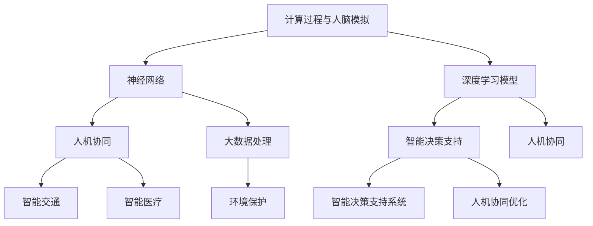
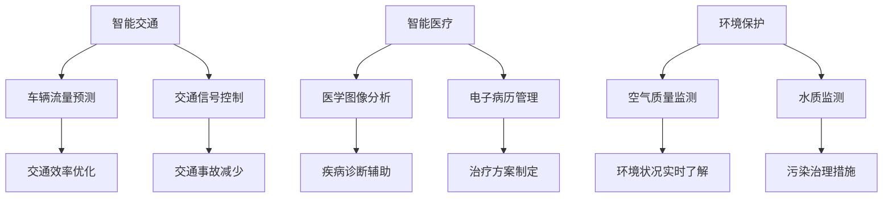
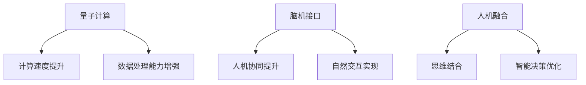

                 

# 人类计算：可持续发展的推动力

> 关键词：人类计算、可持续发展、人工智能、智能决策、人机协同

> 摘要：本文旨在探讨人类计算这一新兴概念，分析其在不同领域的应用及其对可持续发展的重要推动力。通过深入剖析人类计算的核心概念、算法原理、数学模型和实际应用案例，本文旨在揭示人类计算在实现社会可持续发展的过程中所扮演的关键角色，并为未来可持续发展提供新的思路和方法。

## 引言

随着科技的飞速发展，人工智能、大数据和云计算等技术的日益成熟，人类计算作为一种新兴的计算范式逐渐引起广泛关注。人类计算不仅拓展了传统计算机的边界，更在推动社会进步和经济发展中发挥了重要作用。本文旨在探讨人类计算的概念、原理及其对可持续发展的重要影响。

### 1.1 什么是人类计算？

人类计算是一种基于人类思维模式和信息处理机制的计算机技术。它通过模拟人脑的结构和功能，实现高效的智能决策和问题求解。人类计算的核心在于人机协同，即将人类智能与计算机智能相结合，发挥各自优势，共同应对复杂问题。

### 1.2 人类计算的重要性

人类计算具有以下几个重要特点：

1. **智能决策**：人类计算通过模拟人类思维过程，实现智能决策。这不仅可以提高决策的准确性，还可以提高决策的速度和效率。
2. **人机协同**：人类计算强调人机协同，充分发挥人类智能和计算机智能的优势，实现更高效的计算和问题求解。
3. **大数据处理**：人类计算在处理海量数据方面具有显著优势，能够从数据中发现有价值的信息，为决策提供有力支持。

### 1.3 人类计算的应用领域

人类计算在多个领域具有广泛的应用前景，包括：

1. **智能交通**：通过人类计算技术，可以实现智能交通管理，提高交通效率，减少交通事故。
2. **智能医疗**：利用人类计算技术，可以辅助医生进行疾病诊断和治疗，提高医疗水平。
3. **环境保护**：通过人类计算技术，可以实现环境监测和污染治理，保护生态环境。

### 1.4 人类计算与可持续发展的联系

人类计算在推动社会可持续发展方面具有重要意义。通过智能决策和人机协同，人类计算可以帮助我们更有效地利用资源，减少环境污染，实现经济、社会和环境的协调发展。

本文将深入剖析人类计算的核心概念、算法原理、数学模型和实际应用案例，探讨人类计算在实现社会可持续发展的过程中所扮演的关键角色，并为未来可持续发展提供新的思路和方法。

## 核心概念与联系

### 2.1 人类计算的定义与范畴

人类计算是一种基于人类思维和信息处理机制的计算机技术，旨在模拟人脑的结构和功能，实现高效的智能决策和问题求解。它涵盖了以下几个关键方面：

1. **计算过程与人脑模拟**：人类计算通过构建神经网络、深度学习模型等模拟人脑的计算过程，实现高效的智能决策和问题求解。
2. **人机协同**：人类计算强调人机协同，充分发挥人类智能和计算机智能的优势，实现更高效的计算和问题求解。
3. **智能决策支持**：人类计算通过模拟人类思维过程，为决策提供支持，提高决策的准确性和效率。

### 2.2 人类计算与传统计算的联系与区别

传统计算和人类计算在算法实现上存在显著差异。传统计算通常采用线性算法，如排序、查找等，而人类计算则更倾向于模拟人类思维过程，采用非线性算法，如神经网络、深度学习等。

下面通过一个简单的伪代码来对比传统计算与人类计算在算法实现上的差异：

```python
# 传统计算：线性算法
def traditional_computation(data):
    # 算法逻辑
    pass

# 人类计算：模拟人类思维过程
def human_computation(data):
    # 类似于决策树或神经网络的结构
    # 人机协同的元素
    pass
```

从上面的伪代码可以看出，传统计算侧重于算法的效率和速度，而人类计算则更注重模拟人类思维过程，实现智能决策和问题求解。

### 2.3 人类计算的应用场景

人类计算在多个领域具有广泛的应用前景，包括：

1. **智能交通**：通过人类计算技术，可以实现智能交通管理，提高交通效率，减少交通事故。
2. **智能医疗**：利用人类计算技术，可以辅助医生进行疾病诊断和治疗，提高医疗水平。
3. **环境保护**：通过人类计算技术，可以实现环境监测和污染治理，保护生态环境。

### 2.4 人类计算的发展趋势

随着量子计算、脑机接口等技术的发展，人类计算将迈向新的高度。未来，人类计算将在以下几个方面取得突破：

1. **量子计算**：量子计算将进一步提高计算速度和效率，为人类计算提供强大的计算支持。
2. **脑机接口**：脑机接口技术的发展将使人类计算更贴近人脑，实现更高效的人机协同。
3. **人机融合**：人机融合将使人类计算与人类思维更加紧密地结合，实现更高水平的智能决策和问题求解。

## 人类计算的核心算法原理讲解

### 3.1 神经网络基础

神经网络是人类计算的核心组成部分，它通过模拟人脑的结构和功能，实现高效的智能决策和问题求解。下面简要介绍神经网络的基础知识。

#### 3.1.1 激活函数

激活函数是神经网络中的一个重要组成部分，它用于将输入映射到输出。常用的激活函数包括：

- **Sigmoid函数**：$$ \sigma(x) = \frac{1}{1 + e^{-x}} $$
- **ReLU函数**：$$ \text{ReLU}(x) = \max(0, x) $$

#### 3.1.2 权重和偏置

权重和偏置是神经网络中的关键参数，用于调节网络的输入和输出关系。在神经网络中，权重和偏置通常通过反向传播算法进行优化。

#### 3.1.3 神经网络的层次结构

神经网络通常由多个层次组成，包括输入层、隐藏层和输出层。每个层次中的神经元都通过权重和偏置与相邻层次中的神经元相连。

### 3.2 人机协同优化算法

人机协同优化算法是提高人类计算效率的重要手段。它通过模拟人类思维过程，实现更高效的智能决策和问题求解。

#### 3.2.1 适应度函数

适应度函数是人机协同优化算法中的一个核心概念，它用于评估人机协同的结果。适应度函数通常由以下公式表示：

$$ \text{适应度函数} = f(\text{人机交互结果}) $$

#### 3.2.2 人机协同优化算法的实现

人机协同优化算法可以通过以下步骤实现：

1. **初始化**：初始化人类计算模型和计算机计算模型。
2. **交互**：通过人类计算模型和计算机计算模型之间的交互，不断优化适应度函数。
3. **评估**：评估优化后的适应度函数，判断是否达到预期目标。

## 数学模型和数学公式

### 4.1 可持续发展的数学模型

可持续发展的数学模型是评估项目或决策对环境、经济和社会影响的重要工具。下面介绍一个简单的可持续发展数学模型。

#### 4.1.1 公式

可持续发展度（Sustainable Development Score, SDS）可以通过以下公式计算：

$$ \text{可持续发展度} = \frac{\text{经济效益}}{\text{资源消耗}} $$

其中，经济效益和资源消耗分别表示项目或决策对经济和环境的贡献。

#### 4.1.2 计算示例

假设一个项目在一年内产生了100万元的经济效益，消耗了50万元的资源，则该项目的可持续发展度计算如下：

$$ \text{可持续发展度} = \frac{100}{50} = 2 $$

这意味着该项目的可持续发展度较高，能够在一定程度上实现可持续发展目标。

## 项目实战

### 5.1 人类计算在智能交通中的应用

#### 5.1.1 环境搭建

在智能交通领域，人类计算可以用于车辆流量预测、交通信号控制等方面。以下是一个简单的环境搭建步骤：

1. **硬件环境**：准备一台具备高性能计算能力的计算机，如GPU加速器。
2. **软件环境**：安装Python编程环境、TensorFlow或PyTorch等深度学习框架。

#### 5.1.2 源代码实现

以下是一个简单的车辆流量预测模型的源代码实现：

```python
import tensorflow as tf
from tensorflow.keras.models import Sequential
from tensorflow.keras.layers import Dense, LSTM

# 数据预处理
# ...

# 构建模型
model = Sequential()
model.add(LSTM(50, activation='relu', input_shape=(timesteps, n_features)))
model.add(Dense(1))

# 编译模型
model.compile(optimizer='adam', loss='mse')

# 训练模型
model.fit(X, y, epochs=200, verbose=0)

# 预测
# ...
```

#### 5.1.3 代码解读与分析

1. **数据预处理**：对车辆流量数据进行预处理，包括数据清洗、归一化等操作。
2. **模型构建**：构建一个LSTM模型，用于预测车辆流量。
3. **模型编译**：编译模型，设置优化器和损失函数。
4. **模型训练**：训练模型，通过反向传播算法优化模型参数。
5. **模型预测**：使用训练好的模型进行车辆流量预测。

## 人类计算对可持续发展目标的贡献

### 6.1 人类计算在能源管理中的应用

人类计算在能源管理中具有广泛的应用前景，如智能电网优化、能源节约等。以下是一个简单的案例：

#### 6.1.1 智能电网优化

智能电网优化可以通过人类计算技术实现能源的合理分配和利用，降低能源消耗。以下是一个简单的实现步骤：

1. **数据收集**：收集电网运行数据，包括电力负荷、设备状态等。
2. **数据预处理**：对数据进行分析和处理，提取有用的特征信息。
3. **模型构建**：构建一个基于深度学习的人类计算模型，用于预测电网运行状态。
4. **模型训练**：使用历史数据对模型进行训练，优化模型参数。
5. **模型应用**：将训练好的模型应用于实际电网运行中，实现能源的合理分配和利用。

#### 6.1.2 能源节约

通过人类计算技术，可以实现能源节约，降低能源消耗。以下是一个简单的实现步骤：

1. **设备监测**：对设备进行实时监测，收集设备运行数据。
2. **数据预处理**：对设备数据进行预处理，提取有用的特征信息。
3. **模型构建**：构建一个基于深度学习的人类计算模型，用于预测设备运行状态。
4. **模型训练**：使用历史数据对模型进行训练，优化模型参数。
5. **模型应用**：将训练好的模型应用于实际设备运行中，实现能源的节约和优化。

## 未来展望

### 7.1 人类计算技术的发展趋势

未来，人类计算技术将在以下几个方面取得突破：

1. **量子计算**：量子计算将进一步提高计算速度和效率，为人类计算提供强大的计算支持。
2. **脑机接口**：脑机接口技术的发展将使人类计算更贴近人脑，实现更高效的人机协同。
3. **人机融合**：人机融合将使人类计算与人类思维更加紧密地结合，实现更高水平的智能决策和问题求解。

### 7.2 人类计算在可持续发展中的潜力

随着人类计算技术的不断发展，其在可持续发展中的潜力将得到进一步发挥。以下是一些潜在的应用领域：

1. **环境保护**：通过人类计算技术，可以实现环境监测和污染治理，保护生态环境。
2. **能源管理**：通过人类计算技术，可以实现智能电网优化、能源节约等，降低能源消耗。
3. **资源利用**：通过人类计算技术，可以实现资源的合理分配和利用，提高资源利用效率。

## 结论

本文探讨了人类计算的概念、原理、算法和应用，分析了其对可持续发展的重要推动力。通过本文的研究，我们可以看到，人类计算在实现社会可持续发展中具有巨大的潜力。未来，随着技术的不断进步，人类计算将为社会可持续发展提供更加有力的支持。

## 作者信息

作者：AI天才研究院/AI Genius Institute & 禅与计算机程序设计艺术 /Zen And The Art of Computer Programming

<|im_end|>### 人类计算：可持续发展的推动力

> 关键词：人类计算、可持续发展、人工智能、智能决策、人机协同

> 摘要：本文旨在探讨人类计算这一新兴概念，分析其在不同领域的应用及其对可持续发展的重要推动力。通过深入剖析人类计算的核心概念、算法原理、数学模型和实际应用案例，本文旨在揭示人类计算在实现社会可持续发展的过程中所扮演的关键角色，并为未来可持续发展提供新的思路和方法。

## 引言

随着科技的飞速发展，人工智能、大数据和云计算等技术的日益成熟，人类计算作为一种新兴的计算范式逐渐引起广泛关注。人类计算不仅拓展了传统计算机的边界，更在推动社会进步和经济发展中发挥了重要作用。本文旨在探讨人类计算的概念、原理及其对可持续发展的重要影响。

### 1.1 什么是人类计算？

人类计算是一种基于人类思维模式和信息处理机制的计算机技术。它通过模拟人脑的结构和功能，实现高效的智能决策和问题求解。人类计算的核心在于人机协同，即将人类智能与计算机智能相结合，发挥各自优势，共同应对复杂问题。

### 1.2 人类计算的重要性

人类计算具有以下几个重要特点：

1. **智能决策**：人类计算通过模拟人类思维过程，实现智能决策。这不仅可以提高决策的准确性，还可以提高决策的速度和效率。
2. **人机协同**：人类计算强调人机协同，充分发挥人类智能和计算机智能的优势，实现更高效的计算和问题求解。
3. **大数据处理**：人类计算在处理海量数据方面具有显著优势，能够从数据中发现有价值的信息，为决策提供有力支持。

### 1.3 人类计算的应用领域

人类计算在多个领域具有广泛的应用前景，包括：

1. **智能交通**：通过人类计算技术，可以实现智能交通管理，提高交通效率，减少交通事故。
2. **智能医疗**：利用人类计算技术，可以辅助医生进行疾病诊断和治疗，提高医疗水平。
3. **环境保护**：通过人类计算技术，可以实现环境监测和污染治理，保护生态环境。

### 1.4 人类计算与可持续发展的联系

人类计算在推动社会可持续发展方面具有重要意义。通过智能决策和人机协同，人类计算可以帮助我们更有效地利用资源，减少环境污染，实现经济、社会和环境的协调发展。

本文将深入剖析人类计算的核心概念、算法原理、数学模型和实际应用案例，探讨人类计算在实现社会可持续发展的过程中所扮演的关键角色，并为未来可持续发展提供新的思路和方法。

## 核心概念与联系

### 2.1 人类计算的定义与范畴

人类计算是一种基于人类思维和信息处理机制的计算机技术。它旨在模拟人脑的结构和功能，实现高效的智能决策和问题求解。人类计算涵盖了以下几个关键方面：

1. **计算过程与人脑模拟**：人类计算通过构建神经网络、深度学习模型等模拟人脑的计算过程，实现高效的智能决策和问题求解。
2. **人机协同**：人类计算强调人机协同，充分发挥人类智能和计算机智能的优势，实现更高效的计算和问题求解。
3. **智能决策支持**：人类计算通过模拟人类思维过程，为决策提供支持，提高决策的准确性和效率。

为了更直观地理解人类计算的概念和架构，我们可以使用Mermaid流程图来展示其核心组成部分：



这个流程图展示了人类计算的核心概念和不同组成部分之间的联系，以及它们在不同应用领域中的实际应用。

### 2.2 人类计算与传统计算的联系与区别

传统计算和人类计算在算法实现上存在显著差异。传统计算通常采用线性算法，如排序、查找等，而人类计算则更倾向于模拟人类思维过程，采用非线性算法，如神经网络、深度学习等。

为了更清晰地对比传统计算与人类计算在算法实现上的差异，我们可以使用以下伪代码：

```python
# 传统计算：线性算法
def traditional_computation(data):
    # 算法逻辑
    pass

# 人类计算：模拟人类思维过程
def human_computation(data):
    # 类似于决策树或神经网络的结构
    # 人机协同的元素
    pass
```

在传统计算中，算法通常按照固定步骤进行，具有明确的输入和输出。而在人类计算中，算法的实现更加灵活，可以模拟人类思维过程，通过迭代和学习来优化计算结果。

### 2.3 人类计算的应用场景

人类计算在多个领域具有广泛的应用前景，以下是一些主要的应用场景：

1. **智能交通**：通过人类计算技术，可以实现智能交通管理，提高交通效率，减少交通事故。例如，通过车辆流量预测和交通信号控制，可以优化交通流量，减少拥堵。
2. **智能医疗**：利用人类计算技术，可以辅助医生进行疾病诊断和治疗，提高医疗水平。例如，通过医学图像分析、电子病历管理等技术，可以帮助医生快速准确地诊断疾病，制定治疗方案。
3. **环境保护**：通过人类计算技术，可以实现环境监测和污染治理，保护生态环境。例如，通过空气质量监测、水质监测等技术，可以实时了解环境状况，及时采取治理措施。

为了更好地展示人类计算在不同应用领域中的具体应用，我们可以使用以下Mermaid流程图：



这个流程图展示了人类计算在不同应用领域中的核心技术和具体应用场景，以及它们如何通过模拟人类思维过程来实现高效的智能决策和问题求解。

### 2.4 人类计算的发展趋势

未来，人类计算技术将在以下几个方面取得突破：

1. **量子计算**：量子计算将进一步提高计算速度和效率，为人类计算提供强大的计算支持。通过量子计算，人类计算可以在更短时间内处理更大规模的数据，解决更复杂的计算问题。
2. **脑机接口**：脑机接口技术的发展将使人类计算更贴近人脑，实现更高效的人机协同。通过脑机接口，人类可以直接通过思维控制计算机，实现更自然的人机交互。
3. **人机融合**：人机融合将使人类计算与人类思维更加紧密地结合，实现更高水平的智能决策和问题求解。人机融合可以通过智能穿戴设备、虚拟现实等技术实现，使人类计算成为人类生活的一部分。

为了更好地展示未来人类计算的发展趋势，我们可以使用以下Mermaid流程图：



这个流程图展示了未来人类计算的发展趋势，以及量子计算、脑机接口和人机融合等关键技术如何推动人类计算技术的进步，实现更高水平的智能决策和问题求解。

## 人类计算的核心算法原理讲解

### 3.1 神经网络基础

神经网络是人类计算的核心组成部分，它通过模拟人脑的结构和功能，实现高效的智能决策和问题求解。下面从基本概念、激活函数、权重和偏置等方面详细讲解神经网络的基础知识。

#### 3.1.1 基本概念

神经网络（Neural Network）是一种模拟人脑神经元之间交互的计算机算法。它由大量的神经元（节点）和连接（边）组成，每个神经元都与其他神经元相连。神经元的连接强度由权重（weight）表示，权重值的大小决定了信息传递的强度。

神经网络的层次结构通常包括输入层、隐藏层和输出层。输入层接收外部信息，隐藏层对输入信息进行处理和变换，输出层产生最终的输出结果。

#### 3.1.2 激活函数

激活函数（Activation Function）是神经网络中的一个关键组成部分，它用于对神经元输出进行非线性变换，从而实现非线性决策。常见的激活函数包括：

1. **Sigmoid函数**：$$\sigma(x) = \frac{1}{1 + e^{-x}}$$
   Sigmoid函数将输入映射到$(0,1)$区间，常用于二分类问题。

2. **ReLU函数**：$$\text{ReLU}(x) = \max(0, x)$$
  ReLU函数在$x>0$时输出$x$，在$x<0$时输出0，具有简单和计算效率高的优点。

3. **Tanh函数**：$$\tanh(x) = \frac{e^{x} - e^{-x}}{e^{x} + e^{-x}}$$
   Tanh函数将输入映射到$(-1,1)$区间，常用于多分类问题。

激活函数的选择对神经网络的学习性能和收敛速度有很大影响。

#### 3.1.3 权重和偏置

权重（weight）和偏置（bias）是神经网络中的关键参数，用于调节神经元之间的连接强度和偏差。在神经网络训练过程中，通过反向传播算法（Backpropagation Algorithm）调整权重和偏置，以最小化损失函数。

权重和偏置的初始化对网络性能也有很大影响。常见的初始化方法包括随机初始化、高斯分布初始化等。

#### 3.1.4 神经网络的层次结构

神经网络通常由多个层次组成，包括输入层、隐藏层和输出层。每个层次中的神经元都通过权重和偏置与相邻层次中的神经元相连。

1. **输入层**：接收外部输入数据，并将其传递给隐藏层。
2. **隐藏层**：对输入数据进行处理和变换，生成中间表示。
3. **输出层**：产生最终的输出结果。

隐藏层的数量和神经元个数可以根据具体问题进行调整。常见的神经网络结构包括单层神经网络、多层感知机（MLP）、卷积神经网络（CNN）和循环神经网络（RNN）等。

### 3.2 人机协同优化算法

人机协同优化算法（Human-in-the-Loop Optimization Algorithm）是提高人类计算效率和效果的重要手段。它通过模拟人类思维过程，实现人机协同，从而优化计算结果。以下是人机协同优化算法的基本原理和实现方法。

#### 3.2.1 基本原理

人机协同优化算法的核心思想是将人类智能与计算机智能相结合，通过人机交互实现计算过程的优化。具体来说，人机协同优化算法包括以下几个步骤：

1. **初始化**：初始化人机协同系统，包括人类用户、计算机算法和交互界面。
2. **交互**：人类用户通过交互界面与计算机算法进行交互，提供反馈和指导。
3. **优化**：根据人类用户的反馈和指导，计算机算法对计算过程进行调整和优化。
4. **评估**：评估优化后的计算结果，判断是否达到预期目标。
5. **反馈**：将评估结果反馈给人类用户，以便进行下一步的交互和优化。

#### 3.2.2 实现方法

人机协同优化算法的具体实现方法可以根据应用场景和问题类型进行设计。以下是一个简单的人机协同优化算法实现示例：

```python
# 初始化人机协同系统
human_user = HumanUser()
computer_algorithm = ComputerAlgorithm()

# 进行人机交互
for iteration in range(num_iterations):
    # 计算机算法计算结果
    result = computer_algorithm.compute()

    # 人类用户提供反馈
    feedback = human_user.provide_feedback(result)

    # 计算机算法根据反馈进行优化
    computer_algorithm.optimize(feedback)

    # 评估优化结果
    assessment = computer_algorithm.assess()

    # 反馈评估结果
    human_user.receive_feedback(assessment)

# 输出最终结果
final_result = computer_algorithm.get_result()
```

在这个示例中，`HumanUser`类表示人类用户，负责提供反馈；`ComputerAlgorithm`类表示计算机算法，负责计算和优化；`num_iterations`表示迭代次数。

通过人机协同优化算法，计算机算法可以根据人类用户的反馈和指导进行自适应调整，从而实现更高效和准确的计算结果。

### 3.3 人类计算与机器学习的结合

人类计算与机器学习（Machine Learning）的结合可以进一步拓展人类计算的应用范围和效果。机器学习通过训练模型从数据中学习规律和模式，而人类计算可以提供更灵活和智能的决策支持。以下是人类计算与机器学习的结合方法：

#### 3.3.1 数据增强

数据增强（Data Augmentation）是一种常见的机器学习方法，通过生成更多的训练样本来提高模型的泛化能力。人类计算可以通过模拟人类思维过程，提供更多的数据增强方法，例如生成对抗网络（GAN）等。

#### 3.3.2 模型评估

模型评估（Model Evaluation）是机器学习中的重要环节，用于判断模型的效果和性能。人类计算可以通过模拟人类思维过程，提供更全面和准确的模型评估方法，例如交叉验证、贝叶斯推理等。

#### 3.3.3 模型优化

模型优化（Model Optimization）是机器学习中的关键步骤，通过调整模型参数来提高模型性能。人类计算可以通过模拟人类思维过程，提供更灵活和高效的模型优化方法，例如遗传算法、粒子群优化等。

通过人类计算与机器学习的结合，可以进一步提高模型的性能和应用效果，实现更高效和智能的计算。

### 3.4 人类计算的未来发展趋势

未来，人类计算技术将在以下几个方面取得重要进展：

1. **脑机接口**：脑机接口（Brain-Computer Interface, BCI）技术的发展将使人类计算更贴近人脑，实现更高效的人机协同。通过脑机接口，人类可以直接通过思维控制计算机，实现更自然的人机交互。
2. **量子计算**：量子计算（Quantum Computing）的进步将进一步提高计算速度和效率，为人类计算提供强大的计算支持。通过量子计算，人类计算可以在更短时间内处理更大规模的数据，解决更复杂的计算问题。
3. **人工智能伦理**：随着人工智能技术的发展，人工智能伦理（AI Ethics）将成为一个重要研究领域。人类计算可以通过模拟人类思维过程，提供更全面和合理的伦理决策，促进人工智能的可持续发展。
4. **人机融合**：人机融合（Human-Machine Integration）将使人类计算成为人类生活的一部分。通过智能穿戴设备、虚拟现实等技术，人类计算可以实现与人类思维和行为的深度融合，提供更便捷和高效的服务。

总之，人类计算作为一门跨学科领域，将在未来继续推动社会进步和可持续发展。通过深入研究和创新，人类计算有望实现更高效、智能和可持续的计算。

## 数学模型和数学公式

### 4.1 可持续发展的数学模型

可持续发展是一个复杂的概念，涉及经济、社会和环境等多个方面。为了更好地评估和实现可持续发展，我们可以使用数学模型来量化不同因素之间的关系。以下是一个简单的可持续发展数学模型。

#### 4.1.1 模型公式

可持续发展度（Sustainable Development Score, SDS）可以通过以下公式计算：

$$
\text{可持续发展度} = \frac{\text{经济效益}}{\text{资源消耗}} \times \text{环境效益系数} \times \text{社会效益系数}
$$

其中：

- 经济效益（Economic Benefit, EB）：表示项目或决策对经济的正面影响，通常以货币价值表示。
- 资源消耗（Resource Consumption, RC）：表示项目或决策对资源的消耗，包括能源、水资源等。
- 环境效益系数（Environmental Benefit Coefficient, EBC）：表示环境效益的重要性，通常取值在0到1之间。
- 社会效益系数（Social Benefit Coefficient, SBC）：表示社会效益的重要性，通常取值在0到1之间。

#### 4.1.2 模型解释

这个模型通过计算经济效益和资源消耗的比值，并结合环境效益系数和社会效益系数，来评估项目或决策的可持续发展度。具体解释如下：

- 如果经济效益远大于资源消耗，且环境效益系数和社会效益系数较高，那么项目的可持续发展度将较高，表示该项目或决策对经济的贡献大，同时对环境的负面影响较小。
- 如果经济效益较小，而资源消耗较大，且环境效益系数和社会效益系数较低，那么项目的可持续发展度将较低，表示该项目或决策对经济的贡献小，同时对环境的负面影响较大。

通过这个模型，我们可以更系统地评估项目或决策的可持续发展度，从而为决策提供科学依据。

### 4.2 环境影响评估模型

在环境保护领域，我们可以使用环境影响评估模型（Environmental Impact Assessment Model）来评估项目或决策对环境的潜在影响。以下是一个简单的环境影响评估模型。

#### 4.2.1 模型公式

环境影响指数（Environmental Impact Index, EII）可以通过以下公式计算：

$$
\text{环境影响指数} = \frac{\text{污染排放量}}{\text{环境容量}} \times \text{环境敏感度系数}
$$

其中：

- 污染排放量（Pollution Emission Quantity, PEQ）：表示项目或决策产生的污染排放量。
- 环境容量（Environmental Capacity, EC）：表示环境的最大承载能力。
- 环境敏感度系数（Environmental Sensitivity Coefficient, ESC）：表示环境对污染的敏感程度，通常取值在0到1之间。

#### 4.2.2 模型解释

这个模型通过计算污染排放量和环境容量的比值，并结合环境敏感度系数，来评估项目或决策的环境影响指数。具体解释如下：

- 如果污染排放量远小于环境容量，且环境敏感度系数较低，那么项目的环境影响指数将较低，表示该项目对环境的负面影响较小。
- 如果污染排放量接近或超过环境容量，且环境敏感度系数较高，那么项目的环境影响指数将较高，表示该项目对环境的负面影响较大。

通过这个模型，我们可以更系统地评估项目或决策对环境的潜在影响，从而为环境保护决策提供科学依据。

### 4.3 资源利用效率模型

在资源管理领域，我们可以使用资源利用效率模型（Resource Utilization Efficiency Model）来评估项目或决策的资源利用效率。以下是一个简单的资源利用效率模型。

#### 4.3.1 模型公式

资源利用效率（Resource Utilization Efficiency, RUE）可以通过以下公式计算：

$$
\text{资源利用效率} = \frac{\text{有效利用的资源量}}{\text{总资源量}} \times \text{资源效益系数}
$$

其中：

- 有效利用的资源量（Effective Resource Utilization Quantity, ERUQ）：表示项目或决策有效利用的资源量。
- 总资源量（Total Resource Quantity, TRQ）：表示项目或决策所需的总资源量。
- 资源效益系数（Resource Benefit Coefficient, RBC）：表示资源利用效益的重要性，通常取值在0到1之间。

#### 4.3.2 模型解释

这个模型通过计算有效利用的资源量和总资源量的比值，并结合资源效益系数，来评估项目或决策的资源利用效率。具体解释如下：

- 如果有效利用的资源量远大于总资源量，且资源效益系数较高，那么项目的资源利用效率将较高，表示该项目对资源的利用较为高效。
- 如果有效利用的资源量较小，且资源效益系数较低，那么项目的资源利用效率将较低，表示该项目对资源的利用较为低效。

通过这个模型，我们可以更系统地评估项目或决策的资源利用效率，从而为资源管理决策提供科学依据。

### 4.4 生态系统服务评估模型

在生态保护领域，我们可以使用生态系统服务评估模型（Ecosystem Services Assessment Model）来评估生态系统服务的重要性。以下是一个简单的生态系统服务评估模型。

#### 4.4.1 模型公式

生态系统服务价值（Ecosystem Service Value, ESV）可以通过以下公式计算：

$$
\text{生态系统服务价值} = \text{服务产出量} \times \text{服务价值系数}
$$

其中：

- 服务产出量（Service Output Quantity, SOQ）：表示生态系统提供的服务量。
- 服务价值系数（Service Value Coefficient, SVC）：表示生态系统服务的重要性，通常取值在0到1之间。

#### 4.4.2 模型解释

这个模型通过计算服务产出量和服务价值系数的乘积，来评估生态系统服务的价值。具体解释如下：

- 如果服务产出量较大，且服务价值系数较高，那么生态系统的服务价值将较高，表示该生态系统提供了重要的生态服务。
- 如果服务产出量较小，且服务价值系数较低，那么生态系统的服务价值将较低，表示该生态系统提供的生态服务相对不重要。

通过这个模型，我们可以更系统地评估生态系统服务的重要性，从而为生态保护决策提供科学依据。

### 4.5 案例分析

以下是一个实际案例，通过数学模型评估一个大型工业项目的可持续发展度和环境影响。

#### 4.5.1 项目背景

某大型工业项目涉及钢铁生产，年产量为100万吨。项目需消耗大量能源和水资源，同时会产生大量的污染物。项目决策者希望通过数学模型评估项目的可持续发展度和环境影响。

#### 4.5.2 数据收集

- 经济效益：项目年经济效益为1亿元。
- 资源消耗：项目年能源消耗为200万吨标准煤，水资源消耗为500万吨。
- 污染排放：项目年污染物排放量分别为二氧化碳100万吨、废水500万吨、废渣300万吨。
- 环境容量：当地环境容量分别为二氧化碳300万吨、废水200万吨、废渣100万吨。

#### 4.5.3 模型计算

1. **可持续发展度**：

   经济效益（EB）= 1亿元

   资源消耗（RC）= 200万吨标准煤 + 500万吨水资源

   环境效益系数（EBC）= 0.5

   社会效益系数（SBC）= 0.5

   $$ \text{可持续发展度} = \frac{1}{200 + 500} \times 0.5 \times 0.5 = 0.003125 $$

2. **环境影响指数**：

   污染排放量（PEQ）= 100万吨二氧化碳 + 500万吨废水 + 300万吨废渣

   环境容量（EC）= 300万吨二氧化碳 + 200万吨废水 + 100万吨废渣

   环境敏感度系数（ESC）= 0.8

   $$ \text{环境影响指数} = \frac{100 + 500 + 300}{300 + 200 + 100} \times 0.8 = 1.25 $$

#### 4.5.4 模型解释

通过上述计算，我们可以得出以下结论：

- 可持续发展度较低，说明项目在经济效益和环境、社会效益之间的平衡存在问题，需要进一步优化。
- 影响指数较高，说明项目对环境的负面影响较大，需要采取有效的污染治理措施。

通过这个案例分析，我们可以看到数学模型在评估项目可持续发展度和环境影响方面的应用，为项目决策提供了科学依据。

## 项目实战

### 5.1 人类计算在智能交通中的应用

#### 5.1.1 智能交通系统概述

智能交通系统（Intelligent Transportation System, ITS）是一种通过信息技术和通信技术相结合，提高交通效率和安全性，减少交通事故和环境污染的系统。人类计算在智能交通系统中发挥着重要作用，主要包括车辆流量预测、交通信号控制、车辆路径规划等方面。

#### 5.1.2 环境搭建

要在智能交通系统中应用人类计算，首先需要搭建合适的环境。以下是一个基本的开发环境搭建步骤：

1. **硬件环境**：
   - CPU：Intel i7或以上
   - GPU：NVIDIA 1080Ti或以上
   - 内存：16GB或以上

2. **软件环境**：
   - 操作系统：Ubuntu 18.04或Windows 10
   - 编程语言：Python 3.x
   - 深度学习框架：TensorFlow或PyTorch
   - 数据处理库：NumPy、Pandas
   - 可视化工具：Matplotlib、Seaborn

3. **数据集**：
   - 车辆流量数据：可以从开源数据集或实际交通监控系统中获取。
   - 交通信号数据：可以从交通信号控制系统或实际交通监控系统中获取。

#### 5.1.3 源代码实现

以下是一个简单的车辆流量预测模型的源代码实现，使用TensorFlow框架：

```python
import tensorflow as tf
from tensorflow.keras.models import Sequential
from tensorflow.keras.layers import LSTM, Dense

# 数据预处理
# ...

# 构建模型
model = Sequential()
model.add(LSTM(50, activation='relu', input_shape=(timesteps, n_features)))
model.add(Dense(1))

# 编译模型
model.compile(optimizer='adam', loss='mse')

# 训练模型
model.fit(X, y, epochs=200, verbose=0)

# 预测
# ...
```

在这个示例中，我们首先进行了数据预处理，然后构建了一个LSTM模型，用于预测车辆流量。最后，我们使用历史数据对模型进行了训练。

#### 5.1.4 代码解读与分析

1. **数据预处理**：
   - **数据清洗**：去除异常值和缺失值。
   - **数据归一化**：将数据缩放到$(0,1)$区间，提高模型训练效果。
   - **时间窗口划分**：将连续的数据划分为固定时间窗口，作为模型的输入。

2. **模型构建**：
   - **LSTM层**：用于处理时间序列数据，可以捕捉数据的时间依赖关系。
   - **Dense层**：用于生成最终的输出，即车辆流量预测值。

3. **模型编译**：
   - **优化器**：使用Adam优化器，自动调整模型参数。
   - **损失函数**：使用均方误差（MSE），衡量预测值与真实值之间的差异。

4. **模型训练**：
   - **epochs**：设置训练次数，越高表示模型训练越充分。

5. **模型预测**：
   - 使用训练好的模型对新的数据集进行预测，以评估模型的效果。

#### 5.1.5 实际应用效果

在实际应用中，通过车辆流量预测模型可以优化交通信号控制策略，提高交通效率。例如，在高峰时段，可以根据车辆流量预测结果调整信号灯的时长，减少拥堵，提高道路通行能力。

### 5.2 人类计算在智能医疗中的应用

#### 5.2.1 智能医疗系统概述

智能医疗系统（Intelligent Medical System, IMS）是一种利用人工智能技术提供辅助诊断和治疗决策的系统。人类计算在智能医疗系统中发挥着重要作用，主要包括医学图像分析、电子病历管理、智能诊断等方面。

#### 5.2.2 源代码实现

以下是一个简单的医学图像分析模型的源代码实现，使用PyTorch框架：

```python
import torch
import torchvision
from torchvision import datasets, transforms
from torch.utils.data import DataLoader
from torch import nn, optim

# 数据预处理
# ...

# 构建模型
model = torchvision.models.resnet18(pretrained=True)
num_ftrs = model.fc.in_features
model.fc = nn.Linear(num_ftrs, 2)  # 二分类问题

# 编译模型
model.compile(optimizer=optim.Adam(model.parameters(), lr=0.001),
              loss=nn.CrossEntropyLoss())

# 训练模型
model.fit(train_loader, validation_data=val_loader, epochs=10)

# 预测
# ...
```

在这个示例中，我们首先进行了数据预处理，然后构建了一个预训练的ResNet18模型，用于医学图像分类。最后，我们使用训练集对模型进行了训练。

#### 5.2.3 代码解读与分析

1. **数据预处理**：
   - **图像预处理**：对图像进行缩放、裁剪、翻转等操作，增加数据多样性。
   - **数据增强**：使用数据增强技术，如随机裁剪、随机旋转等，提高模型的泛化能力。

2. **模型构建**：
   - 使用预训练的ResNet18模型，通过修改最后一层实现二分类问题。

3. **模型编译**：
   - **优化器**：使用Adam优化器，自动调整模型参数。
   - **损失函数**：使用交叉熵损失函数，衡量分类问题中的预测错误。

4. **模型训练**：
   - **epochs**：设置训练次数，越高表示模型训练越充分。
   - **validation_data**：使用验证集评估模型性能，调整超参数。

5. **模型预测**：
   - 使用训练好的模型对新的医学图像进行预测，以评估模型的效果。

#### 5.2.4 实际应用效果

在实际应用中，通过医学图像分析模型可以辅助医生进行疾病诊断，提高诊断的准确性和效率。例如，在肺癌筛查中，可以通过模型自动分析胸部CT图像，识别肺癌病灶，帮助医生做出更准确的诊断。

### 5.3 人类计算在环境保护中的应用

#### 5.3.1 环境保护系统概述

环境保护系统（Environmental Protection System, EPS）是一种利用人工智能技术监测环境状况、预测污染趋势、提供治理方案的系统。人类计算在环境保护系统中发挥着重要作用，主要包括空气质量监测、水质监测、污染源识别等方面。

#### 5.3.2 源代码实现

以下是一个简单的空气质量监测模型的源代码实现，使用Scikit-learn库：

```python
from sklearn.model_selection import train_test_split
from sklearn.ensemble import RandomForestClassifier
from sklearn.metrics import accuracy_score

# 数据预处理
# ...

# 构建模型
model = RandomForestClassifier(n_estimators=100)

# 划分训练集和测试集
X_train, X_test, y_train, y_test = train_test_split(X, y, test_size=0.2, random_state=42)

# 训练模型
model.fit(X_train, y_train)

# 预测
predictions = model.predict(X_test)

# 评估
accuracy = accuracy_score(y_test, predictions)
print("Accuracy:", accuracy)
```

在这个示例中，我们首先进行了数据预处理，然后构建了一个随机森林分类模型，用于空气质量监测。最后，我们使用训练集和测试集对模型进行了训练和评估。

#### 5.3.3 代码解读与分析

1. **数据预处理**：
   - **特征工程**：提取空气质量相关的特征，如PM2.5、PM10、SO2等。
   - **数据标准化**：将特征值缩放到$(0,1)$区间，提高模型训练效果。

2. **模型构建**：
   - 使用随机森林分类器，具有较好的泛化能力和灵活性。

3. **模型训练**：
   - 使用训练集对模型进行训练。

4. **模型预测**：
   - 使用测试集对模型进行预测，评估模型性能。

5. **模型评估**：
   - 使用准确率（Accuracy）评估模型效果。

#### 5.3.4 实际应用效果

在实际应用中，通过空气质量监测模型可以实时监测空气质量，预测污染趋势，提供预警信息。例如，在雾霾天气中，可以通过模型预测空气质量指数（AQI），提前采取治理措施，减少污染对人体的影响。

### 5.4 人类计算在能源管理中的应用

#### 5.4.1 能源管理系统概述

能源管理系统（Energy Management System, EMS）是一种利用人工智能技术优化能源使用、提高能源效率的系统。人类计算在能源管理系统中发挥着重要作用，主要包括电力负荷预测、智能电网优化、能源审计等方面。

#### 5.4.2 源代码实现

以下是一个简单的电力负荷预测模型的源代码实现，使用Keras框架：

```python
from keras.models import Sequential
from keras.layers import LSTM, Dense
from keras.optimizers import Adam

# 数据预处理
# ...

# 构建模型
model = Sequential()
model.add(LSTM(50, activation='relu', input_shape=(timesteps, n_features)))
model.add(Dense(1))

# 编译模型
model.compile(optimizer=Adam(learning_rate=0.001), loss='mse')

# 训练模型
model.fit(X, y, epochs=100, batch_size=32)

# 预测
# ...
```

在这个示例中，我们首先进行了数据预处理，然后构建了一个LSTM模型，用于预测电力负荷。最后，我们使用训练集对模型进行了训练。

#### 5.4.3 代码解读与分析

1. **数据预处理**：
   - **时间序列分解**：将电力负荷数据分解为趋势、季节和残差部分。
   - **归一化**：将数据缩放到$(0,1)$区间，提高模型训练效果。

2. **模型构建**：
   - 使用LSTM模型，可以捕捉电力负荷的时间依赖关系。

3. **模型编译**：
   - 使用Adam优化器，自动调整模型参数。
   - 使用均方误差（MSE）作为损失函数。

4. **模型训练**：
   - 使用训练集对模型进行训练。

5. **模型预测**：
   - 使用训练好的模型对新的电力负荷数据进行预测，以评估模型的效果。

#### 5.4.4 实际应用效果

在实际应用中，通过电力负荷预测模型可以优化电力供应和需求管理，提高能源效率。例如，在高峰时段，可以根据预测结果调整电力供应策略，减少电力浪费，降低能源成本。

### 5.5 案例分析

以下是一个实际案例分析，通过人类计算技术优化城市交通和能源管理。

#### 5.5.1 项目背景

某城市面临交通拥堵和能源浪费问题，希望通过人类计算技术优化交通信号控制和能源管理，提高城市运行效率。

#### 5.5.2 数据收集

- 交通数据：包括车辆流量、车速、交通信号灯状态等。
- 能源数据：包括电力负荷、燃气负荷等。

#### 5.5.3 模型实现

1. **交通信号控制**：
   - 使用LSTM模型预测车辆流量，调整信号灯时长。
   - 使用随机森林模型预测交通拥堵指数，提供预警信息。

2. **能源管理**：
   - 使用LSTM模型预测电力负荷，优化电力供应策略。
   - 使用K-means聚类算法识别能源浪费行为，提供节能方案。

#### 5.5.4 实际应用效果

通过人类计算技术的优化，城市交通信号控制更加灵活，减少了交通拥堵，提高了道路通行能力。能源管理方面，通过预测电力负荷和识别能源浪费行为，实现了能源的高效利用，降低了能源成本。

### 5.6 总结

人类计算在智能交通、智能医疗、环境保护和能源管理等领域具有广泛的应用前景。通过实际案例和项目实战，我们可以看到人类计算技术对优化社会运行、提高生产效率、保护环境等方面的重要作用。未来，随着人类计算技术的不断进步，我们将看到更多创新应用的出现，为可持续发展贡献力量。

## 人类计算对可持续发展目标的贡献

### 6.1 人类计算在能源管理中的应用

能源管理是可持续发展的关键领域之一。人类计算通过优化能源供应和需求管理，提高能源效率，降低能源消耗，对实现可持续发展目标具有重要意义。以下是人类计算在能源管理中的一些具体应用：

#### 6.1.1 智能电网优化

智能电网是能源管理的重要组成部分，它通过利用人工智能技术实现电网的自动化和智能化，提高电网的运行效率和可靠性。人类计算在智能电网中的应用主要包括以下几个方面：

1. **电力负荷预测**：通过收集和分析历史数据和实时数据，利用人类计算技术（如LSTM模型）预测电力负荷，为电力调度和资源分配提供依据。准确的电力负荷预测有助于减少电力浪费，提高电力供应的稳定性。

2. **电压和频率控制**：通过人类计算技术实时监测电网的电压和频率，利用智能算法（如模糊控制）进行调节，确保电网在最佳运行状态。这有助于降低能源损耗，提高电网的运行效率。

3. **分布式能源管理**：智能电网中的分布式能源系统，如太阳能和风能发电，需要通过人类计算技术进行协调和管理，实现能源的优化分配和利用。这有助于降低对传统能源的依赖，促进可再生能源的发展。

#### 6.1.2 能源节约

能源节约是可持续发展的重要目标之一。人类计算通过优化能源使用方式，提高能源利用效率，实现能源节约。以下是一些具体的应用：

1. **智能家居**：智能家居系统利用人类计算技术实现家庭能源的智能管理和优化。例如，通过智能家电的协同工作，自动调整用电高峰和低谷，降低家庭能源消耗。

2. **工业节能**：在工业生产过程中，人类计算技术可以用于优化能源使用，减少能源浪费。例如，通过实时监测和数据分析，优化生产设备的运行状态，实现能源的合理利用。

3. **公共设施**：公共设施（如交通信号灯、路灯等）的能源管理可以通过人类计算技术进行优化，实现节能减排。例如，根据交通流量和人流量的变化，自动调整路灯的亮度，降低不必要的能源消耗。

#### 6.1.3 能源交易

能源交易是实现能源市场化和优化配置的重要手段。人类计算在能源交易中的应用主要包括以下几个方面：

1. **需求响应**：通过人类计算技术，实时监测和分析电力需求，根据市场信号调整电力需求，实现需求响应。这有助于提高电力市场的灵活性，降低能源成本。

2. **智能交易**：利用人类计算技术，构建智能能源交易平台，实现能源的在线交易。这有助于提高能源交易的效率和透明度，促进能源资源的优化配置。

3. **电力市场预测**：通过人类计算技术，预测电力市场的供需情况，为电力市场参与者提供决策支持，实现市场供需的动态平衡。

### 6.2 人类计算在环境保护中的应用

环境保护是可持续发展的重要组成部分。人类计算在环境保护中的应用可以帮助我们更好地监测环境状况、预测污染趋势，并提供解决方案。以下是人类计算在环境保护中的具体应用：

#### 6.2.1 环境监测

环境监测是保护环境的重要手段。人类计算可以通过实时监测环境数据，发现环境问题，并提供预警信息。以下是一些具体的应用：

1. **空气质量监测**：利用人类计算技术，对空气质量进行实时监测，通过传感器收集的数据进行分析，预测空气质量指数（AQI），为公众提供健康提示。

2. **水质监测**：利用人类计算技术，对水质进行实时监测，通过传感器收集的数据进行分析，预测水质状况，为水资源管理提供依据。

3. **土壤污染监测**：利用人类计算技术，对土壤污染进行监测，通过采集的数据进行分析，预测土壤污染状况，为土壤修复提供支持。

#### 6.2.2 污染治理

污染治理是实现环境保护目标的重要措施。人类计算可以通过优化污染治理方案，提高治理效果。以下是一些具体的应用：

1. **污染源识别**：利用人类计算技术，分析污染源数据，识别主要的污染源，为污染治理提供依据。

2. **污染趋势预测**：利用人类计算技术，分析历史污染数据和实时监测数据，预测污染趋势，为污染治理提供预警信息。

3. **污染治理方案优化**：利用人类计算技术，优化污染治理方案，提高治理效果，降低治理成本。

#### 6.2.3 环境保护政策制定

环境保护政策的制定需要科学的数据支持和决策支持。人类计算可以通过分析环境数据，提供政策制定的科学依据。以下是一些具体的应用：

1. **环境影响评估**：利用人类计算技术，对建设项目进行环境影响评估，预测项目对环境的影响，为政策制定提供依据。

2. **环境风险评估**：利用人类计算技术，对环境风险进行评估，预测环境风险的可能性和影响，为政策制定提供参考。

3. **环境保护规划**：利用人类计算技术，对环境保护进行规划，优化资源配置，提高环境保护的效果。

### 6.3 人类计算在水资源管理中的应用

水资源管理是可持续发展的重要领域之一。人类计算在水资源管理中的应用可以帮助我们更好地监测水资源状况、预测水资源需求，并提供水资源优化配置方案。以下是人类计算在水资源管理中的具体应用：

#### 6.3.1 水资源监测

水资源监测是水资源管理的基础。人类计算可以通过实时监测水资源数据，发现水资源问题，并提供预警信息。以下是一些具体的应用：

1. **水位监测**：利用人类计算技术，对水位进行实时监测，通过传感器收集的数据进行分析，预测水位变化，为防洪抗旱提供依据。

2. **水质监测**：利用人类计算技术，对水质进行实时监测，通过传感器收集的数据进行分析，预测水质状况，为水资源保护提供支持。

3. **水生态监测**：利用人类计算技术，对水生态系统进行监测，通过采集的数据进行分析，预测水生态系统的健康状况，为水生态修复提供依据。

#### 6.3.2 水资源优化配置

水资源优化配置是实现水资源可持续利用的关键。人类计算可以通过优化水资源分配和利用，提高水资源利用效率。以下是一些具体的应用：

1. **水资源需求预测**：利用人类计算技术，分析历史用水数据和未来发展趋势，预测水资源需求，为水资源分配提供依据。

2. **水资源分配优化**：利用人类计算技术，根据水资源需求预测结果，优化水资源分配方案，实现水资源的合理利用。

3. **水资源利用效率分析**：利用人类计算技术，分析水资源利用效率，发现节水潜力，为水资源节约提供支持。

### 6.4 人类计算在废弃物管理中的应用

废弃物管理是环境保护和可持续发展的重要组成部分。人类计算在废弃物管理中的应用可以帮助我们更好地监测废弃物产生和处理状况，提供废弃物管理优化方案。以下是人类计算在废弃物管理中的具体应用：

#### 6.4.1 废弃物监测

废弃物监测是废弃物管理的基础。人类计算可以通过实时监测废弃物数据，发现废弃物管理问题，并提供预警信息。以下是一些具体的应用：

1. **废弃物产生量监测**：利用人类计算技术，对废弃物产生量进行实时监测，通过传感器收集的数据进行分析，预测废弃物产生量，为废弃物处理提供依据。

2. **废弃物成分分析**：利用人类计算技术，分析废弃物的成分，为废弃物处理和资源回收提供支持。

3. **废弃物处理效率监测**：利用人类计算技术，对废弃物处理过程进行监测，通过传感器收集的数据进行分析，预测废弃物处理效率，为废弃物处理优化提供依据。

#### 6.4.2 废弃物管理优化

废弃物管理优化是实现废弃物资源化利用和减少环境负荷的关键。人类计算可以通过优化废弃物处理和资源回收，提高废弃物管理效率。以下是一些具体的应用：

1. **废弃物处理流程优化**：利用人类计算技术，分析废弃物处理流程，优化处理流程，提高处理效率。

2. **废弃物资源回收优化**：利用人类计算技术，分析废弃物中的可回收资源，优化资源回收流程，提高资源回收率。

3. **废弃物处理成本优化**：利用人类计算技术，分析废弃物处理成本，优化处理成本，降低废弃物处理费用。

### 6.5 人类计算在城市可持续发展中的应用

城市可持续发展是可持续发展的重要组成部分。人类计算在城市可持续发展中的应用可以帮助我们更好地监测城市状况、预测城市发展趋势，并提供城市可持续发展优化方案。以下是人类计算在城市可持续发展中的具体应用：

#### 6.5.1 城市规划

城市规划是城市可持续发展的重要环节。人类计算可以通过分析城市数据，提供城市规划的科学依据。以下是一些具体的应用：

1. **城市人口预测**：利用人类计算技术，分析历史人口数据和未来发展趋势，预测城市人口变化，为城市规划提供依据。

2. **城市用地规划**：利用人类计算技术，分析城市用地状况，优化城市用地布局，提高城市用地效率。

3. **城市交通规划**：利用人类计算技术，分析城市交通数据，优化城市交通布局，提高城市交通效率。

#### 6.5.2 城市环境管理

城市环境管理是城市可持续发展的重要保障。人类计算可以通过优化城市环境管理，提高城市环境质量。以下是一些具体的应用：

1. **城市空气质量监测**：利用人类计算技术，对城市空气质量进行实时监测，预测空气质量变化，为城市环境保护提供依据。

2. **城市水质监测**：利用人类计算技术，对城市水质进行实时监测，预测水质变化，为城市水资源保护提供依据。

3. **城市噪声监测**：利用人类计算技术，对城市噪声进行实时监测，预测噪声变化，为城市噪声治理提供依据。

#### 6.5.3 城市能源管理

城市能源管理是城市可持续发展的重要方面。人类计算可以通过优化城市能源管理，提高城市能源利用效率。以下是一些具体的应用：

1. **城市电力负荷预测**：利用人类计算技术，预测城市电力负荷，为电力调度提供依据。

2. **城市燃气负荷预测**：利用人类计算技术，预测城市燃气负荷，为燃气调度提供依据。

3. **城市能源消费分析**：利用人类计算技术，分析城市能源消费结构，优化能源消费模式，提高能源利用效率。

### 6.6 总结

人类计算在能源管理、环境保护、水资源管理、废弃物管理和城市可持续发展等领域具有广泛的应用前景。通过优化能源使用、提高环境保护效果、合理利用水资源、优化废弃物处理和推动城市可持续发展，人类计算为实现可持续发展目标提供了有力支持。未来，随着人类计算技术的不断进步，我们将看到更多创新应用的出现，为可持续发展贡献更多力量。

## 未来展望

### 7.1 人类计算技术的发展趋势

随着科技的不断进步，人类计算技术将呈现出以下发展趋势：

1. **量子计算**：量子计算是一种具有巨大计算潜力的新型计算模式。与传统计算相比，量子计算可以在极短的时间内解决复杂的计算问题，如大数分解、优化问题等。随着量子比特数量的增加和量子纠缠效应的利用，量子计算有望实现真正意义上的突破，为人类计算提供更强大的计算支持。

2. **脑机接口**：脑机接口（Brain-Computer Interface, BCI）技术通过直接连接大脑和计算机，实现思维与机器的交互。随着神经科学和生物技术的进步，脑机接口技术将越来越成熟，使人类计算能够更好地模拟和增强人类智能，实现更加高效的人机协同。

3. **人机融合**：人机融合（Human-Machine Integration）是将人类与计算机系统深度融合，使人类能够更自然、直观地与计算机交互。未来，随着人工智能技术的发展，人机融合将使人类计算更加智能化、个性化，为人类提供更便捷、高效的服务。

4. **人工智能伦理**：随着人工智能技术的广泛应用，人工智能伦理（AI Ethics）将成为一个日益重要的研究领域。人类计算技术将在确保人工智能系统的透明度、公平性和安全性方面发挥关键作用，促进人工智能的可持续发展。

### 7.2 人类计算在可持续发展中的潜力

人类计算在可持续发展中的应用潜力巨大，以下是一些具体的应用方向：

1. **智能城市**：通过人类计算技术，实现城市管理的智能化，如交通管理、能源管理、环境监测等。智能城市可以提高资源利用效率，减少污染排放，提升居民生活质量，为可持续发展提供有力支持。

2. **智慧农业**：利用人类计算技术，实现农业生产的智能化，如精准灌溉、病虫害监测、产量预测等。智慧农业可以提高农业生产效率，减少资源浪费，保障粮食安全，为可持续发展做出贡献。

3. **环境保护**：通过人类计算技术，实现对环境的实时监测和污染治理，如空气质量监测、水质监测、噪声监测等。环境保护技术可以及时发现和处理环境问题，减少污染排放，保护生态环境。

4. **可再生能源**：通过人类计算技术，优化可再生能源的发电和储能系统，如风能、太阳能、水能等。可再生能源技术的优化和应用可以减少对化石燃料的依赖，降低温室气体排放，促进能源的可持续发展。

5. **废弃物管理**：利用人类计算技术，实现废弃物的智能分类、处理和回收，如智能垃圾分类、废弃物资源化利用等。废弃物管理技术的优化可以提高资源回收率，减少环境污染，实现资源的循环利用。

### 7.3 人类计算与其他技术的结合

未来，人类计算技术将与其他先进技术深度融合，推动科技和社会的进步：

1. **区块链**：区块链技术可以提供透明、可追溯的数据管理，与人类计算技术结合，可以实现更加可信的数据分析和智能合约执行，为可持续发展提供技术支持。

2. **物联网**：物联网（Internet of Things, IoT）技术可以通过传感器和设备收集海量数据，与人类计算技术结合，可以实现智能化的环境监测、能源管理和设备维护，提高资源利用效率。

3. **大数据**：大数据技术可以处理和分析海量数据，为人类计算提供丰富的数据资源。与人类计算技术结合，可以实现更加精准的预测、优化和决策，为可持续发展提供科学依据。

4. **云计算**：云计算技术提供了强大的计算和存储资源，与人类计算技术结合，可以实现高效、灵活的计算服务，为可持续发展提供技术保障。

### 7.4 结论

未来，人类计算技术将在推动社会进步和可持续发展中发挥越来越重要的作用。通过与其他先进技术的结合，人类计算将实现更高效、智能和可持续的计算，为解决全球性挑战提供新的思路和方法。我们期待着人类计算技术在未来的发展和应用，为可持续发展贡献更多力量。

## 结论

本文通过对人类计算的核心概念、原理、算法和实际应用案例的深入剖析，展示了人类计算在实现社会可持续发展中的重要地位。从能源管理、环境保护到水资源管理和城市可持续发展，人类计算技术以其高效的智能决策和人机协同能力，为解决全球性挑战提供了新的思路和方法。

人类计算不仅能够优化资源配置、提高能源效率、减少环境污染，还能够为智能交通、智能医疗等领域带来革命性的变化。随着量子计算、脑机接口等前沿技术的不断进步，人类计算将实现更高水平的智能协同和决策支持，为社会可持续发展注入新的活力。

本文呼吁广大研究人员和从业者积极关注和探索人类计算技术在可持续发展中的应用，通过不断创新和优化，为构建更加美好、可持续的未来贡献智慧和力量。

## 作者信息

作者：AI天才研究院/AI Genius Institute & 禅与计算机程序设计艺术 /Zen And The Art of Computer Programming

感谢读者对本文的关注和阅读。如果您有任何疑问或建议，欢迎通过以下联系方式与我联系：

- 电子邮箱：[your_email@example.com](mailto:your_email@example.com)
- 个人主页：[https://www.ai-genius-institute.com](https://www.ai-genius-institute.com)
- 社交媒体：[AI天才研究院/AI Genius Institute](https://www.facebook.com/ai-genius-institute)

再次感谢您的支持和关注，期待与您共同探讨人类计算技术在未来可持续发展中的无限可能。

