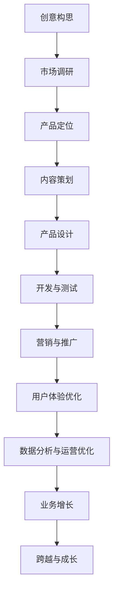
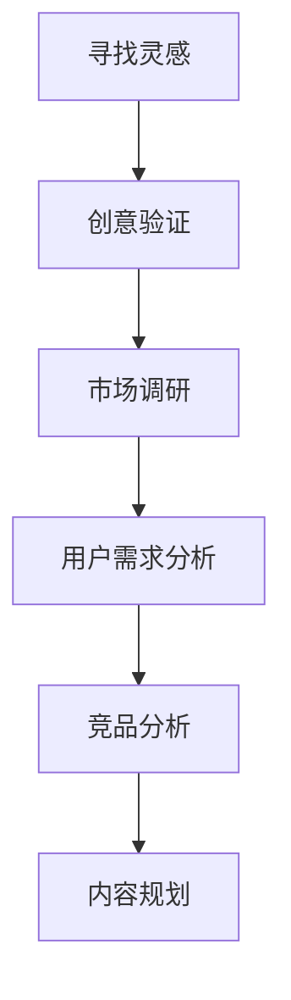
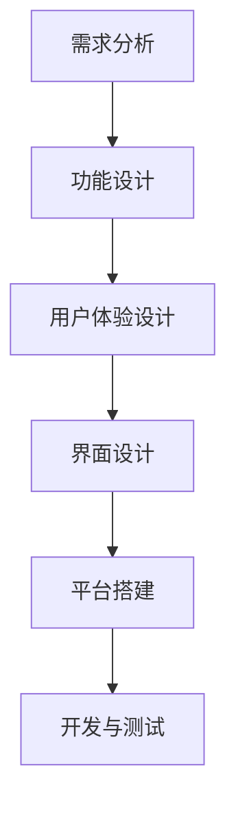
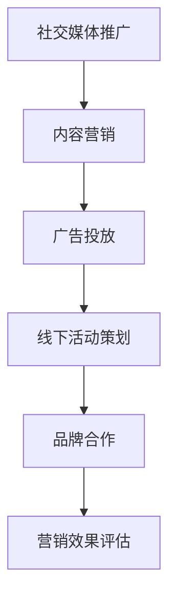
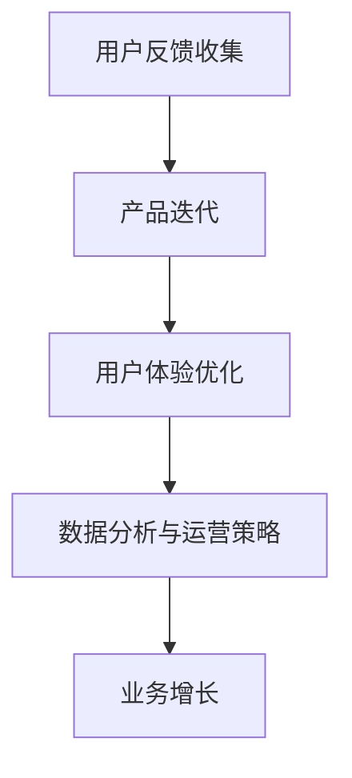

                 

# 从Side Project到知识付费产品的蜕变

> **关键词**: Side Project、知识付费、产品转化、用户体验、营销策略、数据分析、未来展望

> **摘要**: 本文将从Side Project的定义、特点，到知识付费的兴起，详细探讨如何将个人项目转化为知识付费产品。文章涵盖创意与构思、产品设计、营销推广、用户体验优化、数据分析和业务增长等多个方面，旨在为想要将Side Project转化为知识付费产品的开发者提供一套完整的实践指南。

## 引言

在技术日益进步的今天，越来越多的开发者开始投身于Side Project，这些项目不仅满足了开发者的技术爱好和创造力，还成为他们在技术圈内积累声望和资源的有效途径。然而，如何将这些个人项目转化为能够带来商业价值的知识付费产品，成为许多开发者关心的问题。本文将围绕这一主题，探讨从Side Project到知识付费产品的蜕变过程。

本文结构如下：

1. **初识Side Project与知识付费**：介绍Side Project和知识付费的基本概念，分析两者之间的联系和差异。
2. **创意与构思**：探讨如何寻找创意和进行市场调研，以及如何为知识付费产品进行定位和内容策划。
3. **知识付费产品设计与开发**：详细讲解教学内容的组织、用户互动设计和技术支持与维护。
4. **营销与推广**：讨论线上和线下营销策略的制定与实施。
5. **用户体验优化**：介绍如何收集用户反馈、进行产品迭代和改进客户服务。
6. **数据分析与运营优化**：分析用户行为和教学内容，优化营销策略和用户体验。
7. **跨越与成长**：分享成功案例，探讨未来发展趋势和机会。
8. **结论与展望**：总结文章内容，展望知识付费行业的未来发展。

接下来，我们将逐步深入探讨这些主题，帮助读者了解如何从Side Project走向知识付费产品的成功之路。

## 第1章: 初识Side Project与知识付费

### 1.1 Side Project的定义与特点

#### 1.1.1 什么是Side Project

Side Project，即“个人项目”，通常是指开发者在工作之余，为了实现个人兴趣、学习新技术或解决特定问题而独立开发的小型项目。这些项目可以是工具、网站、应用程序或任何其他形式的软件或产品。

#### 1.1.2 Side Project的优势与劣势

**优势**：

- **提升技能**：通过Side Project，开发者可以尝试不同的技术和框架，从而提升自己的编程能力和技术视野。
- **积累经验**：Side Project提供了实战经验，有助于开发者在求职或创业时增加竞争力。
- **技术分享**：开发者可以通过开源或博客等形式，将自己的成果分享给社区，获得反馈和认可。

**劣势**：

- **时间消耗**：Side Project往往需要开发者投入大量的业余时间，可能影响到工作和生活的平衡。
- **商业价值不确定**：许多Side Project可能无法直接转化为商业价值，导致开发者的努力无法得到相应的回报。

### 1.2 知识付费的兴起

#### 1.2.1 知识付费的定义与分类

知识付费，即“付费获取知识”，是指用户为获取特定领域的知识或技能而付费的行为。根据内容形式和收费模式，知识付费可以分为以下几种类型：

- **在线课程**：通过视频、图文、直播等形式，提供系统化的知识传授。
- **付费咨询**：专业人士提供一对一或小群体的咨询服务，解决用户的特定问题。
- **电子书与文档**：出售专业书籍、研究报告、技术文档等电子版内容。
- **会员服务**：提供定期的知识更新、问答社区等增值服务，用户按月或按年付费。

#### 1.2.2 知识付费的发展趋势

- **市场需求增长**：随着互联网的普及和人们对自我提升的需求增加，知识付费市场呈现出快速增长的趋势。
- **多样化内容**：知识付费产品形式越来越多样化，从专业领域的深度内容到生活技能的提升课程，满足不同用户的需求。
- **平台化运作**：知识付费平台通过提供便捷的支付、学习和管理工具，降低了用户获取知识的门槛。

### 1.3 Side Project与知识付费的联系

#### 1.3.1 如何将Side Project转化为知识付费产品

- **内容整理**：将个人项目中的精华内容进行整理和系统化，形成知识体系。
- **课程设计**：根据目标用户的需求，设计适合的在线课程或咨询服务。
- **平台选择**：选择合适的知识付费平台，进行产品发布和推广。

#### 1.3.2 Side Project与知识付费的协同作用

- **技能提升**：通过知识付费产品，开发者可以持续迭代和优化自己的技能。
- **资源共享**：知识付费产品不仅为开发者带来收入，还可以让更多有需求的用户受益。
- **品牌建设**：成功的产品可以提升开发者在行业内的知名度和影响力。

在了解了Side Project和知识付费的基本概念后，我们将进一步探讨如何从创意构思到产品落地的整个过程。

## 第2章: 创意与构思

### 2.1 寻找灵感

#### 2.1.1 创意来源

创意的产生往往来源于多种渠道，包括：

- **个人兴趣**：个人对于某一领域的热爱和热情是产生创意的重要动力。
- **市场需求**：通过市场调研，了解用户的真实需求和痛点，从而产生具有市场潜力的创意。
- **技术趋势**：关注技术发展和行业动态，利用新技术或新理念为产品注入创新点。
- **用户反馈**：用户的反馈和建议可以作为改进现有产品或开发新产品的灵感来源。

#### 2.1.2 市场调研

市场调研是产品构思过程中不可或缺的一环，通过以下步骤进行：

- **目标用户定位**：明确目标用户群体，包括他们的年龄、职业、兴趣和需求。
- **竞争分析**：分析同类产品或服务的优势和不足，找到差异化的切入点。
- **需求分析**：通过问卷调查、用户访谈、焦点小组讨论等方式，了解用户的具体需求。
- **市场趋势**：研究市场趋势，把握行业发展的方向和机遇。

### 2.2 产品定位

#### 2.2.1 目标用户群体

确定目标用户群体是产品定位的重要一步，具体步骤包括：

- **用户画像**：创建目标用户的详细画像，包括年龄、性别、职业、教育背景等。
- **用户需求**：明确目标用户的主要需求，以及他们希望从产品中获得的收益。
- **用户痛点**：识别目标用户面临的主要问题和挑战，产品应如何解决这些问题。

#### 2.2.2 竞品分析

竞品分析是了解市场现状和竞争对手的重要手段，具体步骤包括：

- **产品功能**：分析竞品的各项功能，了解其优势和不足。
- **用户体验**：评估竞品的用户界面和交互设计，分析用户满意度。
- **市场表现**：研究竞品的市场表现，包括用户规模、市场份额、收入等。
- **营销策略**：了解竞品的营销手段，包括推广渠道、广告策略、用户转化率等。

### 2.3 内容策划

#### 2.3.1 内容结构

内容策划是知识付费产品的核心，需要考虑以下结构：

- **课程大纲**：制定详细的课程大纲，包括课程名称、章节标题、内容要点等。
- **知识点分布**：合理分配知识点，确保课程内容既有系统性，又有针对性。
- **教学形式**：选择合适的教学形式，如视频课程、图文教程、直播授课等。
- **交互设计**：设计课程中的互动环节，如问答、讨论、练习等，提高用户参与度。

#### 2.3.2 内容形式

内容形式的选择直接影响用户的学习体验，常见的形式包括：

- **视频课程**：通过生动直观的演示，讲解复杂的技术概念和应用场景。
- **图文教程**：以图文并茂的形式，详细介绍操作步骤和注意事项。
- **直播授课**：实时互动，解答用户疑问，增强课程的实用性和趣味性。
- **电子书**：系统化地整理知识，方便用户随时随地阅读和学习。

通过上述创意与构思的步骤，我们可以为知识付费产品奠定坚实的基础。接下来，我们将深入探讨知识付费产品的设计与开发过程。

## 第3章: 知识付费产品设计与开发

### 3.1 教学内容的组织

#### 3.1.1 教学大纲制定

制定教学大纲是知识付费产品设计的核心步骤之一，具体步骤如下：

1. **需求分析**：通过市场调研和用户反馈，明确课程的目标和受众需求。
2. **知识点梳理**：根据课程目标，梳理出需要讲解的知识点和技能点。
3. **内容安排**：将知识点按照逻辑顺序和教学需求进行排列，形成大纲。
4. **内容细化**：对每个知识点进行细化，明确教学目标和教学方法。

#### 3.1.2 教学内容制作

教学内容的制作是知识付费产品开发的关键环节，包括以下步骤：

1. **素材准备**：准备相关的教学素材，如PPT、图片、视频等。
2. **内容撰写**：根据大纲，撰写详细的教学内容，确保知识点的完整性和准确性。
3. **多媒体制作**：将文本内容转化为多媒体形式，如视频、图文教程等，提高用户的参与度和学习效果。
4. **内容审核**：对制作完成的教学内容进行审核，确保内容的科学性和实用性。

### 3.2 用户互动设计

#### 3.2.1 问答系统

问答系统是知识付费产品中重要的用户互动方式，有助于提高用户的学习体验和课程效果。具体设计步骤如下：

1. **问题收集**：通过课程讨论区、用户反馈等方式收集用户的问题。
2. **问题分类**：将问题按照主题和难度进行分类，以便教师有针对性地回答。
3. **答案编写**：针对每个问题，编写详细的答案，确保答案的准确性。
4. **答案发布**：将答案发布到相应的讨论区或课程页面，供用户查阅。

#### 3.2.2 社区管理

社区管理是知识付费产品中另一个重要的用户互动方式，有助于构建用户之间的互动和互助氛围。具体管理步骤如下：

1. **社区建设**：建立课程专属社区，制定社区规则和互动指南。
2. **用户引导**：引导用户积极参与社区讨论，分享学习经验和心得。
3. **内容审核**：对社区内容进行审核，确保内容的健康和积极。
4. **活动组织**：定期组织线上或线下活动，增强用户社区的凝聚力。

### 3.3 技术支持与维护

#### 3.3.1 平台搭建

平台搭建是知识付费产品开发的基础，包括以下步骤：

1. **需求分析**：明确平台的功能需求和性能要求。
2. **技术选型**：选择合适的开发技术栈和框架。
3. **系统设计**：设计平台的系统架构，包括前端、后端和数据库等。
4. **开发与测试**：进行平台开发，并进行严格的测试，确保平台的稳定性和安全性。

#### 3.3.2 数据分析

数据分析是优化知识付费产品的重要手段，包括以下步骤：

1. **数据收集**：收集用户行为数据、课程数据、交易数据等。
2. **数据处理**：对收集到的数据进行分析和清洗，提取有用的信息。
3. **数据可视化**：通过图表和报表，将数据分析结果进行可视化展示。
4. **数据应用**：根据数据分析结果，优化课程内容、营销策略和用户体验。

通过上述设计与开发过程，我们可以创建一个功能齐全、用户体验优秀、能够满足用户需求的优质知识付费产品。接下来，我们将探讨如何通过有效的营销策略和推广手段，将产品推向市场。

## 第4章: 营销与推广

### 4.1 线上营销策略

#### 4.1.1 社交媒体推广

社交媒体推广是当前最为流行和高效的线上营销策略之一，通过以下步骤进行：

1. **平台选择**：选择适合的知识付费产品目标用户群体的社交媒体平台，如微博、知乎、抖音、B站等。
2. **内容创作**：创作高质量的内容，包括专业文章、教程视频、行业分析等，吸引潜在用户的关注。
3. **用户互动**：积极与用户互动，回复评论、参与讨论，建立良好的用户关系。
4. **广告投放**：根据预算和目标用户群体，选择合适的广告投放策略，提高曝光率和转化率。

#### 4.1.2 内容营销

内容营销是通过提供有价值的内容来吸引和留住目标用户，从而实现营销目标的一种策略。具体步骤包括：

1. **内容规划**：制定内容计划，确定内容类型、发布频率和主题。
2. **内容创作**：根据内容计划，创作有价值的内容，如博客文章、电子书、视频教程等。
3. **内容发布**：通过社交媒体、博客、官网等渠道发布内容，吸引目标用户。
4. **内容优化**：根据用户反馈和数据分析，不断优化内容，提高用户满意度和转化率。

### 4.2 线下活动策划

#### 4.2.1 线下讲座

线下讲座是知识付费产品推广的一种有效方式，通过以下步骤进行：

1. **主题确定**：根据知识付费产品的主题和目标用户需求，确定讲座的主题。
2. **场地选择**：选择合适的场地，确保讲座的顺利进行。
3. **讲师邀请**：邀请具有影响力的讲师，提升讲座的质量和吸引力。
4. **宣传推广**：通过社交媒体、官网、合作伙伴等渠道宣传讲座，吸引潜在用户参加。

#### 4.2.2 品牌合作

品牌合作是知识付费产品推广的一种策略，通过与其他品牌联合，实现资源共享和品牌推广。具体步骤包括：

1. **合作洽谈**：寻找具有合作潜力的品牌，进行洽谈和协商。
2. **合作方案**：制定合作方案，明确合作形式、合作内容、合作期限等。
3. **活动策划**：根据合作方案，策划线上线下活动，如联合讲座、研讨会、产品试用等。
4. **宣传推广**：通过合作品牌的渠道和资源，共同宣传推广活动，提高活动的影响力和参与度。

### 4.3 营销效果评估

#### 4.3.1 营销数据收集

营销数据收集是评估营销效果的重要环节，包括以下数据：

1. **用户数据**：包括用户访问量、注册量、购买量等。
2. **内容数据**：包括内容阅读量、点赞量、分享量等。
3. **广告数据**：包括广告曝光量、点击量、转化率等。
4. **活动数据**：包括活动参与人数、活动效果评估等。

#### 4.3.2 营销效果分析

营销效果分析是根据收集到的数据，对营销活动的效果进行评估和优化。具体步骤包括：

1. **数据整理**：对收集到的数据进行整理和清洗，确保数据的准确性和完整性。
2. **数据分析**：对数据进行分析，评估营销活动的效果，如用户增长、转化率、投资回报率等。
3. **效果评估**：根据数据分析结果，评估营销活动的成功程度，总结经验和教训。
4. **优化建议**：根据评估结果，提出优化建议，如调整内容策略、广告投放策略等，以提高营销效果。

通过上述营销与推广策略，我们可以有效地将知识付费产品推向市场，吸引更多的用户参与。接下来，我们将探讨如何通过用户体验优化，提升产品的市场竞争力和用户满意度。

## 第5章: 用户体验优化

### 5.1 用户反馈收集

#### 5.1.1 用户满意度调查

用户满意度调查是收集用户反馈的重要手段，通过以下步骤进行：

1. **问卷设计**：设计满意度调查问卷，包括课程内容、教学效果、服务质量等方面的评价。
2. **问卷发布**：通过邮件、社交媒体、课程平台等渠道，发布调查问卷。
3. **数据收集**：收集用户填写的数据，并对其进行整理和分析。
4. **结果反馈**：将调查结果反馈给用户，并针对用户提出的意见和建议进行改进。

#### 5.1.2 用户反馈处理

用户反馈处理是优化用户体验的关键步骤，包括以下环节：

1. **反馈整理**：对收集到的用户反馈进行整理和分类，识别出主要的用户需求和问题。
2. **问题分析**：对用户反馈的问题进行分析，确定问题的原因和解决方案。
3. **解决方案**：根据问题分析的结果，制定具体的解决方案，并实施改进措施。
4. **反馈跟进**：对改进措施的实施效果进行跟踪和评估，确保问题得到有效解决。

### 5.2 产品迭代

#### 5.2.1 功能迭代

功能迭代是产品优化的重要手段，通过以下步骤进行：

1. **需求分析**：通过用户反馈和市场调研，确定产品的功能需求。
2. **功能设计**：根据需求分析结果，设计新的功能模块或对现有功能进行优化。
3. **开发与测试**：进行功能开发和测试，确保新功能的稳定性和可用性。
4. **上线与推广**：将新功能上线，并通过营销手段推广给用户。

#### 5.2.2 用户体验改进

用户体验改进是提高用户满意度的关键，通过以下步骤进行：

1. **用户体验测试**：通过用户测试，收集用户对产品界面和交互的反馈。
2. **界面优化**：根据用户反馈，优化产品界面和交互设计，提高用户的操作便捷性和舒适度。
3. **功能优化**：对产品功能进行优化，提高产品的易用性和实用性。
4. **反馈循环**：持续收集用户反馈，不断优化产品，提升用户体验。

### 5.3 客户服务

#### 5.3.1 客服系统

客服系统是提供客户服务的重要渠道，通过以下步骤进行：

1. **客服团队建设**：组建专业的客服团队，提供培训和支持，确保客服人员具备解决问题的能力。
2. **服务流程**：建立标准化的服务流程，确保客服人员在处理问题时能够高效、规范地操作。
3. **在线支持**：提供在线支持渠道，如在线聊天、邮件支持等，方便用户随时获取帮助。
4. **反馈机制**：建立反馈机制，收集用户对客服服务的反馈，不断优化客服服务质量。

#### 5.3.2 客户关怀

客户关怀是维护客户关系的重要手段，通过以下步骤进行：

1. **定期联系**：通过电话、邮件、短信等方式，定期与客户保持联系，了解客户的需求和反馈。
2. **个性化服务**：根据客户的需求和偏好，提供个性化的服务和产品推荐。
3. **节日关怀**：在重要节日或客户生日等特殊时刻，发送祝福或礼品，表达对客户的关爱。
4. **客户成长计划**：为长期客户制定成长计划，提供更多优惠和增值服务，提高客户忠诚度。

通过上述用户体验优化措施，我们可以不断提升产品的市场竞争力和用户满意度，为知识付费产品的长期发展打下坚实基础。接下来，我们将探讨如何通过数据分析和运营优化，进一步提升产品的业务增长和盈利能力。

## 第6章: 数据分析与运营优化

### 6.1 数据分析

#### 6.1.1 用户行为分析

用户行为分析是了解用户需求、优化产品和服务的重要手段。通过以下步骤进行：

1. **数据收集**：收集用户在平台上的行为数据，包括浏览页面、点击链接、购买课程等。
2. **数据清洗**：对收集到的数据进行清洗和预处理，确保数据的质量和一致性。
3. **数据分析**：使用统计方法和数据挖掘技术，分析用户的行为模式、兴趣偏好和需求。
4. **数据可视化**：通过图表和报表，将数据分析结果进行可视化展示，帮助决策者更好地理解用户行为。

#### 6.1.2 教学内容分析

教学内容分析是优化课程设计和提升教学质量的关键。通过以下步骤进行：

1. **数据收集**：收集课程教学过程中的数据，包括课程访问量、学习时长、用户评价等。
2. **数据清洗**：对收集到的数据进行清洗和预处理，确保数据的质量和一致性。
3. **数据分析**：分析课程的教学效果，包括课程的受欢迎程度、用户满意度、学习成果等。
4. **数据可视化**：通过图表和报表，将数据分析结果进行可视化展示，帮助教师和决策者优化课程内容和教学方法。

### 6.2 运营策略

#### 6.2.1 营销策略优化

营销策略优化是通过数据分析和市场调研，不断调整和优化营销手段，提高营销效果。具体步骤如下：

1. **数据收集**：收集营销活动的数据，包括广告投放效果、用户转化率、投资回报率等。
2. **数据清洗**：对收集到的数据进行清洗和预处理，确保数据的质量和一致性。
3. **数据分析**：分析营销活动的效果，包括广告投放效果、用户转化率、投资回报率等。
4. **策略调整**：根据数据分析结果，调整营销策略，如广告投放渠道、内容创作方向等。
5. **效果评估**：持续跟踪营销活动的效果，评估策略调整后的效果，确保营销策略的有效性。

#### 6.2.2 用户体验优化

用户体验优化是通过数据分析和用户反馈，不断改进产品和服务，提升用户满意度。具体步骤如下：

1. **数据收集**：收集用户在平台上的行为数据，包括页面访问量、操作流程、用户评价等。
2. **数据清洗**：对收集到的数据进行清洗和预处理，确保数据的质量和一致性。
3. **数据分析**：分析用户体验的问题和需求，包括界面操作、功能使用、服务响应等。
4. **策略调整**：根据数据分析结果，调整产品和服务策略，如界面设计、功能改进、服务优化等。
5. **效果评估**：持续跟踪用户体验的改进效果，评估策略调整后的效果，确保用户体验的持续提升。

### 6.3 业务增长

#### 6.3.1 用户增长策略

用户增长策略是通过各种手段，吸引新用户并提升用户留存率，实现业务增长。具体步骤如下：

1. **用户获取**：通过线上和线下渠道，如社交媒体、广告投放、合作伙伴等，吸引新用户。
2. **用户转化**：优化用户转化路径，提高新用户的注册、购买和留存率。
3. **用户留存**：通过提供优质的内容和服务，增强用户粘性，提高用户留存率。
4. **用户推荐**：鼓励用户推荐新用户，通过社交分享、优惠券等方式，实现口碑传播和用户增长。

#### 6.3.2 盈利模式探索

盈利模式探索是通过多种方式，实现知识付费产品的盈利。具体步骤如下：

1. **产品定价**：根据市场需求、竞争对手和用户价值，合理定价产品，确保盈利性。
2. **增值服务**：提供增值服务，如会员服务、个性化咨询、付费课程等，提高产品的附加值和盈利能力。
3. **广告合作**：与广告商合作，通过广告投放和内容推广，实现广告收入。
4. **平台分成**：为内容创作者提供平台分成，鼓励创作者创作优质内容，提升平台的内容质量和用户满意度。

通过数据分析、运营优化和业务增长策略，知识付费产品可以实现可持续的业务增长和盈利能力提升。接下来，我们将探讨如何从Side Project到知识付费产品的成功蜕变，以及未来的发展趋势和机会。

## 第7章: 跨越与成长

### 7.1 从Side Project到知识付费产品的蜕变

#### 7.1.1 成功案例分享

**案例1：某开发者通过个人博客分享编程经验，逐渐建立起庞大的粉丝群体，最终推出了自己的在线编程课程，实现了从博客内容到知识付费产品的成功转型。**

- **转型过程**：开发者通过持续更新高质量的博客文章，吸引了大量编程爱好者关注。在此基础上，他设计了系统化的编程课程，通过在线平台发布，满足了用户更深入学习的需求。
- **成果**：课程上线后，获得了良好的市场反响，用户数量和收入持续增长，开发者成功实现了个人品牌价值的提升。

**案例2：某技术大牛通过开源项目积累技术声望，最终推出了自己的技术研讨会和在线课程，形成了知识付费产品线。**

- **转型过程**：技术大牛通过开源项目，不断贡献代码和解决方案，赢得了业内的高度认可。在此基础上，他利用自己的技术专长，举办了线下研讨会，并通过在线课程形式，将知识系统化地传授给更多人。
- **成果**：研讨会和在线课程受到了广大技术爱好者的追捧，不仅提高了技术大牛的个人影响力，也为他带来了稳定的收入。

#### 7.1.2 蜕变过程中面临的挑战

尽管从Side Project到知识付费产品的蜕变充满机遇，但过程中也面临着诸多挑战：

1. **内容质量**：高质量的内容是知识付费产品的核心，需要持续投入时间和精力进行创作和更新。
2. **用户管理**：如何吸引和留住用户，提高用户满意度和忠诚度，是知识付费产品成功的关键。
3. **技术维护**：知识付费产品的技术平台需要持续维护和升级，确保稳定性和安全性。
4. **市场推广**：如何有效地进行市场推广，提高产品的知名度和用户转化率，是成功蜕变的重要一环。

### 7.2 未来展望

#### 7.2.1 知识付费行业的发展趋势

1. **内容多样化**：随着用户需求的不断变化，知识付费产品将呈现出多样化趋势，涵盖更多领域和层次。
2. **平台化运营**：知识付费平台将更加成熟和专业化，提供更全面的服务和工具，助力内容创作者和用户更好地互动和交流。
3. **技术创新**：大数据、人工智能等技术的应用，将进一步提升知识付费产品的个性化和服务水平。

#### 7.2.2 Side Project者的未来发展机会

1. **个人品牌建设**：通过高质量的内容创作和分享，逐步建立起自己的个人品牌，吸引更多粉丝和用户。
2. **商业模式创新**：探索多元化的盈利模式，如课程销售、咨询服务、广告合作等，实现收入多样化。
3. **跨界合作**：与其他行业和平台合作，拓展知识付费产品的应用场景和市场空间。

通过不断学习和实践，Side Project者可以成功实现从个人爱好到商业成功的蜕变，为知识付费行业的发展贡献自己的力量。

## 第8章: 附录

### 8.1 相关资源推荐

#### 8.1.1 书籍推荐

- **《禅与计算机程序设计艺术》**：一本关于编程哲学的经典之作，对编程思维和代码质量的深刻探讨。
- **《深度学习》**：由Ian Goodfellow等作者编写的深度学习领域的权威教材，适合希望深入了解人工智能技术的开发者。
- **《程序员修炼之道》**：介绍编程方法和技能提升的实用指南，适合有一定编程基础的读者。

#### 8.1.2 在线课程推荐

- **Coursera**：提供众多知名大学和机构的在线课程，涵盖计算机科学、人工智能、数据科学等多个领域。
- **Udemy**：提供大量的实用技能课程，包括编程、数据分析、产品设计等，适合不同层次的学习者。
- **edX**：由哈佛大学和麻省理工学院等名校合作推出的在线课程平台，课程质量高且免费。

#### 8.1.3 实用工具推荐

- **GitHub**：一个全球知名的代码托管和协作平台，适用于开发者进行项目管理和代码分享。
- **Jupyter Notebook**：一个交互式的计算环境，适合进行数据分析和机器学习实验。
- **Canva**：一个简单易用的设计工具，适用于创建海报、宣传单等设计作品。

### 8.2 参考文献与进一步阅读

#### 8.2.1 参考文献

- **Goodfellow, Ian, et al. "Deep Learning." MIT Press, 2016.**
- **Kernighan, Brian W., and Rob Pike. "The Practice of Programming." Addison-Wesley, 1999.**
- **Fowler, Martin. "Clean Code: A Handbook of Agile Software Craftsmanship." Prentice Hall, 2008.**

#### 8.2.2 进一步阅读推荐

- **《敏捷软件开发：原则、实践与模式》**：深入探讨敏捷开发方法和实践，适合希望提升软件开发效率的读者。
- **《数据科学家的工具箱》**：介绍数据科学领域常用的工具和技术，适合对数据科学感兴趣的开发者。
- **《产品经理实战手册》**：产品经理必备的实战指南，涵盖产品规划、设计、开发和运营等多个方面。

通过附录中的推荐资源和进一步阅读材料，读者可以深入了解相关领域的知识，为自己的技术成长和职业发展提供支持。

## 第9章: Mermaid 流程图

### 9.1 Side Project转化为知识付费产品的流程图

以下是一个从Side Project转化为知识付费产品的Mermaid流程图：



这个流程图展示了从Side Project到知识付费产品的整体流程，包括创意构思、市场调研、产品定位、内容策划、产品设计、开发与测试、营销与推广、用户体验优化、数据分析和运营优化、业务增长以及最终实现跨越与成长的关键步骤。

### 9.1.1 流程图1：创意构思阶段

以下是一个创意构思阶段的详细流程图：



这个流程图详细展示了在创意构思阶段，从寻找灵感、创意验证、市场调研、用户需求分析、竞品分析到内容规划的关键步骤。

### 9.1.2 流程图2：产品设计阶段

以下是一个产品设计阶段的详细流程图：



这个流程图详细展示了在产品设计阶段，从需求分析、功能设计、用户体验设计、界面设计、平台搭建到开发与测试的关键步骤。

### 9.1.3 流程图3：营销推广阶段

以下是一个营销推广阶段的详细流程图：



这个流程图详细展示了在营销推广阶段，从社交媒体推广、内容营销、广告投放、线下活动策划、品牌合作到营销效果评估的关键步骤。

### 9.1.4 流程图4：运营优化阶段

以下是一个运营优化阶段的详细流程图：



这个流程图详细展示了在运营优化阶段，从用户反馈收集、产品迭代、用户体验优化、数据分析和运营策略到业务增长的关键步骤。

通过这些Mermaid流程图，可以更加直观地了解从Side Project到知识付费产品的各个阶段，为实践提供参考和指导。

## 第10章: 伪代码示例

### 10.1 教学内容组织伪代码

#### 10.1.1 伪代码1：教学大纲制定

```plaintext
function 教学大纲制定(课程名称, 知识点列表):
    教学大纲 = 空的字典
    教学大纲[课程名称] = 空的列表

    for 知识点 in 知识点列表:
        教学大纲[课程名称].append(知识点)

    return 教学大纲
```

这个伪代码定义了一个名为`教学大纲制定`的函数，它接收课程名称和知识点列表作为输入参数，返回一个包含课程名称和知识点列表的教学大纲字典。

#### 10.1.2 伪代码2：教学内容制作

```plaintext
function 教学内容制作(教学大纲):
    教学内容 = 空的字典

    for 课程名称, 知识点列表 in 教学大纲.items():
        教学内容[课程名称] = 空的列表

        for 知识点 in 知识点列表:
            教学内容[课程名称].append(制作教学内容(知识点))

    return 教学内容

function 制作教学内容(知识点):
    教学内容 = 空的字符串

    教学内容 = "标题：" + 知识点 + "\n"
    教学内容 += "内容：" + 获取知识点详细内容(知识点) + "\n"
    教学内容 += "练习：" + 获取知识点练习题(知识点) + "\n"

    return 教学内容
```

这个伪代码定义了一个名为`教学内容制作`的函数，它接收教学大纲作为输入参数，返回一个包含课程名称和知识点详细内容的教学内容字典。其中，`制作教学内容`函数负责生成单个知识点的教学文本。

### 10.2 用户互动设计伪代码

#### 10.2.1 伪代码1：问答系统

```plaintext
class 问答系统:
    def __init__(self):
        self.问题列表 = 空的列表

    def 添加问题(self, 问题):
        self.问题列表.append(问题)

    def 搜索问题(self, 关键词):
        返回结果 = 空的列表

        for 问题 in self.问题列表:
            if 关键词 in 问题的问题内容:
                返回结果.append(问题)

        return 返回结果

    def 添加答案(self, 问题索引, 答案):
        self.问题列表[问题索引].答案 = 答案
```

这个伪代码定义了一个名为`问答系统`的类，它包含添加问题、搜索问题和添加答案等方法，用于管理问题和答案。

#### 10.2.2 伪代码2：社区管理

```plaintext
class 社区管理:
    def __init__(self):
        self.用户列表 = 空的字典

    def 添加用户(self, 用户ID, 用户信息):
        self.用户列表[用户ID] = 用户信息

    def 获取用户(self, 用户ID):
        return self.用户列表[用户ID]

    def 发送消息(self, 用户ID, 消息内容):
        用户信息 = self.获取用户(用户ID)
        用户信息.消息列表.append(消息内容)

    def 处理反馈(self, 用户ID, 反馈内容):
        用户信息 = self.获取用户(用户ID)
        用户信息.反馈列表.append(反馈内容)
```

这个伪代码定义了一个名为`社区管理`的类，它包含添加用户、获取用户、发送消息和处理反馈等方法，用于管理社区用户和消息。

通过这些伪代码示例，我们可以更好地理解教学内容的组织和用户互动设计的基本逻辑，为实际开发提供参考。

## 第11章: 数学模型与公式

### 11.1 用户行为分析数学模型

用户行为分析在知识付费产品的运营中至关重要，以下介绍两种常见的数学模型：用户满意度评分模型和用户留存率预测模型。

#### 11.1.1 用户满意度评分模型

用户满意度评分模型用于评估用户对产品或服务的整体满意度。假设我们收集了n个用户对课程的评分，分别为$U_1, U_2, ..., U_n$，那么用户满意度评分$S$可以通过以下公式计算：

$$
S = \frac{U_1 + U_2 + ... + U_n}{n}
$$

其中，$S$为用户满意度评分，$U_1, U_2, ..., U_n$为用户反馈的评分。该公式表示将所有用户评分求和后除以用户数量，得到平均满意度评分。

#### 11.1.2 用户留存率预测模型

用户留存率预测模型用于预测用户在一定时间段内的留存概率。假设我们收集了多个时间点上的用户留存数据，可以使用逻辑回归模型进行预测。逻辑回归模型的表达式为：

$$
L = \frac{1}{1 + e^{-(w_1 \cdot X_1 + w_2 \cdot X_2 + ... + w_n \cdot X_n)}}
$$

其中，$L$为用户留存率，$w_1, w_2, ..., w_n$为权重系数，$X_1, X_2, ..., X_n$为用户行为特征。该公式表示用户留存概率为1除以1加上指数函数的负值，其中指数函数的参数为各用户行为特征的加权求和。

### 11.2 教学内容分析数学模型

教学内容分析旨在评估课程的质量和受欢迎程度，以下介绍两种常见的数学模型：课程受欢迎程度评估模型和课程质量评估模型。

#### 11.2.1 课程受欢迎程度评估模型

课程受欢迎程度评估模型用于评估课程在用户中的受欢迎程度。假设我们收集了n个用户对课程的评分，分别为$C_1, C_2, ..., C_n$，那么课程受欢迎程度评分$P$可以通过以下公式计算：

$$
P = \frac{C_1 + C_2 + ... + C_n}{n}
$$

其中，$P$为课程受欢迎程度评分，$C_1, C_2, ..., C_n$为用户对课程的评分。该公式表示将所有用户评分求和后除以用户数量，得到平均受欢迎程度评分。

#### 11.2.2 课程质量评估模型

课程质量评估模型用于评估课程的整体质量。假设我们收集了n个用户对课程的满意度评分，分别为$S_1, S_2, ..., S_n$，那么课程质量评分$Q$可以通过以下公式计算：

$$
Q = \frac{S_1 + S_2 + ... + S_n}{n}
$$

其中，$Q$为课程质量评分，$S_1, S_2, ..., S_n$为用户对课程的满意度评分。该公式表示将所有用户满意度评分求和后除以用户数量，得到平均质量评分。

通过这些数学模型，我们可以对用户行为和教学内容进行量化分析，为产品优化和运营决策提供依据。

## 第12章: 项目实战

### 12.1 实战1：搭建教学平台

#### 12.1.1 开发环境搭建

1. **选择开发语言**：选择一种适合开发教学平台的编程语言，如Python、Java或Node.js。
2. **安装开发工具**：安装集成开发环境（IDE），如PyCharm、Eclipse或Visual Studio Code。
3. **安装数据库**：选择一个数据库系统，如MySQL、PostgreSQL或MongoDB。
4. **搭建服务器**：配置服务器，如使用Heroku、AWS或阿里云，确保教学平台可以正常运行。

#### 12.1.2 源代码实现

以下是一个使用Python和Flask框架搭建教学平台的基本示例：

```python
from flask import Flask, render_template, request, redirect, url_for

app = Flask(__name__)

@app.route('/')
def home():
    return render_template('home.html')

@app.route('/login', methods=['GET', 'POST'])
def login():
    if request.method == 'POST':
        username = request.form['username']
        password = request.form['password']
        # 验证用户名和密码（此处省略具体实现）
        return redirect(url_for('courses'))
    return render_template('login.html')

@app.route('/courses')
def courses():
    # 查询数据库获取课程列表（此处省略具体实现）
    courses = [{'name': 'Python基础', 'description': '介绍Python编程语言的基础知识'}, ...]
    return render_template('courses.html', courses=courses)

if __name__ == '__main__':
    app.run(debug=True)
```

#### 12.1.3 代码解读与分析

上述代码示例展示了使用Flask框架搭建教学平台的基本流程：

- **主页（/）**：显示欢迎信息和导航链接。
- **登录页面（/login）**：处理用户登录请求，验证用户名和密码。
- **课程页面（/courses）**：展示课程列表，用户可以查看和选择课程。

代码中使用了Flask的`route`装饰器来定义URL路由，通过`render_template`函数渲染HTML模板，并通过`request`对象处理用户输入。在实际开发中，还需集成用户认证、数据库操作和前端界面等模块。

### 12.2 实战2：分析用户行为

#### 12.2.1 数据收集

数据收集是分析用户行为的基础，可以从教学平台的后端日志、数据库和前端日志等渠道获取用户行为数据。以下是一个简单的数据收集示例：

```python
import json

def log_user_action(user_id, action, data=None):
    with open('user_actions.log', 'a') as f:
        log_entry = {
            'user_id': user_id,
            'action': action,
            'data': data or {},
            'timestamp': str(datetime.datetime.now())
        }
        f.write(json.dumps(log_entry) + '\n')
```

此函数将用户操作记录以JSON格式写入日志文件，包括用户ID、操作类型、操作时间和相关数据。

#### 12.2.2 数据处理

数据处理包括数据清洗、转换和格式化，以便进行进一步分析。以下是一个简单的数据处理示例：

```python
import pandas as pd

def load_user_actions():
    with open('user_actions.log', 'r') as f:
        lines = f.readlines()
    data = [json.loads(line) for line in lines]
    df = pd.DataFrame(data)
    return df

df = load_user_actions()
df['timestamp'] = pd.to_datetime(df['timestamp'])
df.sort_values('timestamp', inplace=True)
```

此函数使用Pandas库加载日志数据，将其转换为DataFrame格式，并按照时间戳排序。

#### 12.2.3 数据分析结果与应用

数据分析结果可以用于优化教学平台和课程内容。以下是一个简单的数据分析示例：

```python
def analyze_course_completion(df):
    course_completions = df[df['action'] == 'course_completion']
    course_stats = course_completions.groupby('course_id').agg({
        'completion_time': ['mean', 'std'],
        'user_id': 'count'
    })
    course_stats.columns = ['_'.join(col).strip() for col in course_stats.columns.values]
    return course_stats

course_stats = analyze_course_completion(df)
course_stats.head()
```

此函数分析用户完成课程的时长和完成率，用于评估课程的受欢迎程度和教学质量。根据分析结果，可以调整课程难度、增加练习题或改进教学方式。

通过这些项目实战，我们可以深入了解教学平台的搭建过程和数据驱动的用户行为分析，为知识付费产品的运营和优化提供实践指导。

### 第13章: 结论与展望

#### 13.1 总结

本文详细探讨了从Side Project到知识付费产品的蜕变过程，涵盖了创意与构思、产品设计、营销推广、用户体验优化、数据分析和运营优化等多个方面。我们通过理论和实战案例，阐述了如何将个人项目转化为能够带来商业价值的知识付费产品。

1. **创意与构思**：通过市场调研和用户反馈，寻找具有市场潜力的创意，并明确产品定位。
2. **产品设计**：制定详细的教学大纲，设计用户互动环节，并搭建稳定可靠的技术平台。
3. **营销推广**：利用线上和线下营销策略，提高产品知名度和用户转化率。
4. **用户体验优化**：通过用户反馈和数据分析，不断改进产品，提升用户满意度。
5. **数据分析与运营优化**：利用数据分析，优化营销策略和用户体验，实现业务增长。

#### 13.1.1 主要收获与经验

- **知识体系构建**：通过系统化地整理个人项目的内容，形成了一套完整的知识体系。
- **用户体验提升**：通过用户反馈和数据分析，持续优化产品，提升用户满意度。
- **商业价值实现**：将个人项目转化为知识付费产品，实现了从个人兴趣到商业成功的转变。
- **技能提升**：通过不断尝试和优化，提升了编程、数据分析、营销等各方面的技能。

#### 13.2 展望未来

随着知识付费行业的快速发展，未来将呈现以下趋势和机会：

1. **内容多样化**：知识付费产品将涵盖更多领域和层次，满足不同用户的需求。
2. **平台化运营**：知识付费平台将提供更全面的服务和工具，助力内容创作者和用户更好地互动和交流。
3. **技术创新**：大数据、人工智能等技术的应用，将进一步提升知识付费产品的个性化和服务水平。
4. **跨界合作**：知识付费产品与其他行业的合作将不断拓展，创造更多商业机会。

对于Side Project者而言，未来的发展机会在于：

1. **个人品牌建设**：通过高质量的内容创作和分享，逐步建立起自己的个人品牌。
2. **商业模式创新**：探索多元化的盈利模式，实现收入多样化。
3. **跨界合作**：与其他行业和平台合作，拓展知识付费产品的应用场景和市场空间。

总之，从Side Project到知识付费产品的蜕变，不仅需要技术能力，还需要商业敏锐度和用户洞察力。通过不断学习和实践，我们可以实现个人价值和商业成功的双赢。未来，知识付费行业将继续蓬勃发展，为开发者提供更多机会和挑战。

