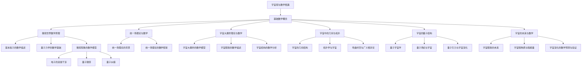

                 

# 《从微观到宏观：宇宙的数学统一》

## 关键词
宇宙、数学、统一场、量子力学、广义相对论、宇宙演化、暗物质、暗能量

## 摘要
本文将深入探讨宇宙从微观到宏观的数学统一性。首先，我们将回顾宇宙的基础数学概念，探讨它们在微观世界中的应用，特别是量子力学。接着，我们将探讨统一场理论，解释它如何试图将微观和宏观世界的数学原理统一起来。随后，我们将详细讨论宇宙大爆炸理论及其数学模型，解释暗物质和暗能量在宇宙演化中的角色。接下来，我们将分析宇宙中的几何与拓扑结构，探讨广义相对论在宇宙研究中的应用。然后，我们将深入探讨宇宙的量子结构，包括量子几何和量子引力。最后，我们将展望宇宙的未来，讨论数学模型在宇宙演化预测中的重要性。附录部分将介绍宇宙数学研究中的工具与应用，以及宇宙数学研究的最新进展。

---

### 《从微观到宏观：宇宙的数学统一》目录大纲

#### 第一部分：宇宙的数学语言

- 第1章：宇宙的基础数学概念
  - 1.1 宇宙观与数学的相遇
  - 1.2 微观世界的数学原理
  - 1.3 统一场理论与数学

- 第2章：宇宙演化中的数学定律
  - 2.1 宇宙大爆炸理论与数学
  - 2.2 宇宙暗物质与暗能量的数学探索
  - 2.3 宇宙演化的数学预测与验证

#### 第二部分：宇宙的数学结构

- 第3章：宇宙中的几何与拓扑
  - 3.1 宇宙的几何结构
  - 3.2 拓扑学与宇宙
  - 3.3 弯曲时空与广义相对论

- 第4章：宇宙的量子结构
  - 4.1 量子宇宙学
  - 4.2 量子几何与宇宙背景辐射
  - 4.3 宇宙的量子波动

#### 第三部分：宇宙的数学预测与探索

- 第5章：宇宙的未来与数学
  - 5.1 宇宙膨胀的未来
  - 5.2 宇宙暗物质与暗能量
  - 5.3 宇宙演化的数学预测与验证

- 附录
  - 附录 A：宇宙数学研究工具与应用

### Mermaid 流�程图

---

### 第一部分：宇宙的数学语言

#### 第1章：宇宙的基础数学概念

##### 1.1 宇宙观与数学的相遇

数学与宇宙之间的相遇是一个历史悠久且不断发展的领域。自古以来，人类就试图用数学来解释和预测宇宙的运行。从古代的毕达哥拉斯到现代的霍金，数学家们一直在探索宇宙的奥秘。数学作为一种精确的科学语言，能够帮助我们理解宇宙的复杂性和规律性。

宇宙观的演变也是数学发展的重要推动力。古代宇宙观基于对地球和天空的直观观察，认为地球是宇宙的中心，所有星体都围绕地球转动。这一观点被称为地心说，由古希腊天文学家欧多克斯提出，后被托勒密发展完善。然而，随着观测技术的进步，哥白尼提出了日心说，认为太阳是宇宙的中心，地球和其他行星围绕太阳转动。这一理论为现代宇宙观奠定了基础。

在数学的发展过程中，许多重要的数学概念和理论被应用于宇宙研究。例如，欧几里得几何的提出为描述天体的运动提供了数学框架。牛顿的万有引力定律则是宇宙力学的基础，它通过数学公式描述了天体之间的相互作用。随着科学的发展，爱因斯坦的广义相对论进一步将引力描述为时空的弯曲，这一理论在数学上更加复杂，但为理解宇宙提供了新的视角。

##### 1.1.1 宇宙的多样性

宇宙的多样性是宇宙观与数学相遇的一个重要背景。宇宙不仅仅包括我们可见的星体，还包含暗物质和暗能量等未知成分。这些成分的发现挑战了传统的宇宙观，并推动了数学在宇宙研究中的应用。

暗物质是一种不发光、不吸收光线的物质，它的存在是通过引力效应推断出来的。暗物质的多样性体现在其广泛的分布和巨大的质量上。在宇宙演化的早期阶段，暗物质可能形成了宇宙的骨架结构，影响星系和宇宙大尺度结构的形成。

暗能量则是推动宇宙加速膨胀的一种神秘力量。它占据了宇宙能量的绝大部分，但我们对它的本质和机制仍知之甚少。暗能量的多样性体现在其强烈的宇宙膨胀效应上，这是传统引力理论无法解释的。

宇宙的多样性还体现在宇宙大尺度结构的多样性上。宇宙微波背景辐射的观测揭示了宇宙早期状态的信息，这些信息在数学上被描述为涨落和波动。这些涨落最终导致了宇宙中星系和星系团的形成。

##### 1.1.2 数学在宇宙研究中的角色

数学在宇宙研究中的角色是多方面的。首先，数学提供了宇宙观的基础。通过数学模型，我们能够描述宇宙的基本规律和现象。例如，牛顿的万有引力定律和爱因斯坦的广义相对论都是通过数学公式描述宇宙的运行。

其次，数学为宇宙观测提供了工具。现代天文观测依赖于数学方法来处理和分析数据。例如，宇宙微波背景辐射的测量需要使用复杂的信号处理算法来提取宇宙早期状态的信息。

此外，数学还在宇宙演化理论的构建中扮演关键角色。宇宙演化理论试图通过数学模型来描述宇宙从早期状态到当前状态的过程。这些模型需要满足物理定律和观测数据，因此需要使用高级数学工具进行推导和验证。

总之，数学与宇宙的相遇不仅推动了宇宙观的发展，也为宇宙研究提供了强有力的工具和理论基础。在接下来的章节中，我们将深入探讨宇宙的数学原理，从微观到宏观，逐步揭示宇宙的统一性。

##### 1.2 微观世界的数学原理

在微观世界中，数学原理起到了至关重要的作用，特别是在量子力学领域。量子力学是研究微观粒子行为的物理学分支，其基本原理和数学描述极大地改变了我们对物质世界的理解。

首先，量子力学的基本概念之一是波粒二象性。这一概念指出，微观粒子如电子、光子等既表现出波动性，又表现出粒子性。这一现象可以通过德布罗意提出的物质波理论和海森堡的不确定性原理来描述。

德布罗意物质波理论认为，每一个粒子都可以与其对应的波函数联系起来。例如，一个电子的波函数可以表示为复值函数，它描述了电子在不同位置和动量下的概率分布。数学上，波函数通常表示为：

$$ \Psi(x, y, z, t) = Ae^{ikr - i\omega t} $$

其中，$A$ 是归一化常数，$k$ 是波数，$r$ 是电子的位置向量，$\omega$ 是角频率。这个公式表明了电子的波动性质，其中 $e^{ikr}$ 表示波动部分，而 $-i\omega t$ 表示相位。

海森堡不确定性原理进一步强调了量子力学的概率特性。不确定性原理指出，一个粒子的某些对偶变量（如位置和动量）不能同时被精确测量。数学上，这一原理可以表示为：

$$ \sigma_x \sigma_p \geq \frac{\hbar}{2} $$

其中，$\sigma_x$ 和 $\sigma_p$ 分别表示位置和动量的标准差，$\hbar$ 是约化普朗克常数。这个公式揭示了量子系统的内在不确定性，它表明我们无法同时精确知道一个粒子的位置和动量。

量子力学的另一个重要概念是叠加态。叠加态指的是粒子可以同时处于多个状态的组合。例如，一个电子可以同时处于自旋向上和自旋向下的状态，数学上可以表示为：

$$ \Psi = \frac{1}{\sqrt{2}} (|\uparrow\rangle + |\downarrow\rangle) $$

其中，$|\uparrow\rangle$ 和 $|\downarrow\rangle$ 分别表示自旋向上的状态和自旋向下的状态。这个公式展示了量子系统的叠加特性，它表明粒子在没有被观测之前，可以存在于多个状态的叠加中。

这些量子力学的基本概念和数学描述为我们理解微观世界的本质提供了基础。通过波函数、不确定性原理和叠加态，我们可以用数学语言来描述和预测微观粒子的行为。这些数学工具不仅丰富了我们对自然界的认识，也为量子计算、量子通信等前沿技术领域提供了理论基础。

总之，量子力学通过其独特的数学原理，揭示了微观世界的复杂性和规律性。这些原理不仅在物理学领域具有重要意义，也在计算机科学、信息科学等领域产生了深远的影响。在接下来的章节中，我们将继续探讨量子力学在宇宙研究中的应用，以及如何通过数学模型来理解微观现象。

##### 1.2.1 基本粒子的数学描述

在量子力学中，基本粒子的行为通过波函数进行数学描述。波函数是量子系统的概率幅，它提供了一个粒子的状态在空间和时间上的概率分布。对于单粒子系统，波函数通常表示为复值函数，如下所示：

$$ \Psi(x, y, z, t) = A \exp \left( i \mathbf{k} \cdot \mathbf{r} - \omega t \right) $$

其中，$A$ 是归一化常数，$\mathbf{k}$ 是波矢量，$\mathbf{r}$ 是粒子的位置，$\omega$ 是角频率。

波函数的模平方 $|\Psi(x, y, z, t)|^2$ 描述了粒子在空间中某一点的概率密度。这意味着，粒子在某一时刻出现在特定位置的概率可以通过计算波函数在该位置的模平方得到。

例如，考虑一个电子在三维空间中的波函数：

$$ \Psi(x, y, z, t) = A \exp \left( i \left( k_x x + k_y y + k_z z \right) - \omega t \right) $$

在这个例子中，$k_x, k_y, k_z$ 分别是波矢量在 $x, y, z$ 方向的分量。波函数的模平方可以表示为：

$$ |\Psi(x, y, z, t)|^2 = A^2 \exp \left( - \left( k_x^2 + k_y^2 + k_z^2 \right) \left( x^2 + y^2 + z^2 \right) - 2 \omega t \right) $$

这个表达式展示了电子在三维空间中的概率分布。通过调整波函数的参数，如波矢量 $\mathbf{k}$ 和角频率 $\omega$，我们可以模拟不同类型的物理现象。

例如，一个自由电子的波函数可以表示为平面波形式：

$$ \Psi(x, y, z, t) = A \exp \left( i \mathbf{k} \cdot \mathbf{r} - i \omega t \right) $$

当波矢量 $\mathbf{k}$ 与位置向量 $\mathbf{r}$ 平行时，波函数简化为：

$$ \Psi(x, y, z, t) = A \exp \left( ikx - i \omega t \right) $$

这个波函数描述了电子在 $x$ 方向上传播的情况。在这种情况下，电子在不同位置的概率分布是均匀的，因为波函数的模平方不依赖于 $y$ 和 $z$。

另一个例子是束缚电子的波函数，如氢原子的波函数。氢原子的基态波函数可以表示为：

$$ \Psi_1 (r, \theta, \phi) = \frac{1}{\sqrt{\pi a_0^3}} e^{-r/a_0} $$

其中，$a_0$ 是玻尔半径。这个波函数描述了电子在核附近的概率分布，它随距离 $r$ 的增加而迅速衰减。这意味着电子在靠近原子核的位置出现的概率较高，而远离核的位置出现的概率较低。

通过这些例子，我们可以看到波函数在量子力学中的重要作用。它不仅提供了一个粒子状态的数学描述，还能够通过模平方计算粒子的概率分布。这些数学工具使我们能够深入理解微观粒子的行为，为量子力学和宇宙学研究提供了坚实的理论基础。

##### 1.2.2 量子力学的数学基础

量子力学作为描述微观粒子行为的理论框架，其数学基础主要包括波函数、算符和测量等核心概念。这些概念通过一系列数学公式和原理，构成了量子力学的理论体系。

首先，波函数是量子力学中最基本的概念之一。波函数 $\Psi(\mathbf{r}, t)$ 描述了一个量子系统在空间中的状态，其中 $\mathbf{r}$ 代表粒子的位置，$t$ 代表时间。波函数是一个复值函数，其模平方 $|\Psi(\mathbf{r}, t)|^2$ 提供了粒子在特定位置出现的概率密度。例如，对于一个自由粒子，其波函数可以表示为平面波形式：

$$ \Psi(\mathbf{r}, t) = \psi_0 \exp \left( i \mathbf{k} \cdot \mathbf{r} - i \omega t \right) $$

其中，$\mathbf{k}$ 是波矢量，$\omega$ 是角频率。这个波函数表示粒子在空间中以特定波长和频率传播。

其次，量子力学中的另一个核心概念是算符。算符是用于描述物理量（如位置、动量、能量）的数学工具。量子力学中的基本算符包括位置算符 $\hat{x}$、动量算符 $\hat{p}$ 和能量算符 $\hat{H}$。这些算符满足特定的对易关系，例如：

$$ [ \hat{x}, \hat{p}] = i \hbar $$

这个对易关系是量子力学不确定性原理的数学表述。

波函数和算符的关系通过薛定谔方程来描述。薛定谔方程是一个偏微分方程，其一般形式为：

$$ i \hbar \frac{\partial \Psi}{\partial t} = \hat{H} \Psi $$

其中，$\hat{H}$ 是哈密顿算符，它描述了系统的总能量。通过解薛定谔方程，我们可以得到系统的波函数，进而计算系统的物理量。

量子力学的数学基础还包括测量问题。测量是量子力学中一个特殊的现象，它决定了量子系统从叠加态向特定本征态的转换。测量的数学描述依赖于投影算符。例如，对于一个二能级系统，其测量结果可以表示为：

$$ \Psi' = \sum_{i} P_i \Psi_i $$

其中，$P_i$ 是投影算符，$\Psi_i$ 是系统可能的本征态。这个表达式表示测量后系统状态向本征态的投影。

总之，量子力学的数学基础包括波函数、算符和测量等核心概念。这些概念通过一系列数学公式和原理，构成了量子力学的理论体系。通过这些数学工具，我们可以描述和预测微观粒子的行为，为理解宇宙的微观本质提供了基础。

##### 1.2.3 微观现象的数学模型

微观现象的数学模型在量子力学中有着广泛的应用，这些模型帮助我们理解和预测微观粒子的行为。以下是一些典型的微观现象及其对应的数学模型：

1. **双缝干涉实验**

双缝干涉实验是量子力学中一个经典的实验，它展示了波粒二象性和叠加态。在数学上，双缝干涉现象可以通过波函数的叠加来描述。假设有两个缝隙，电子通过这两个缝隙后在屏幕上形成干涉图样。电子的波函数可以表示为两个缝隙波函数的叠加：

$$ \Psi(x, y) = \psi_1(x, y) + \psi_2(x, y) $$

其中，$\psi_1(x, y)$ 和 $\psi_2(x, y)$ 分别是电子通过第一个和第二个缝隙的波函数。干涉条纹的强度可以通过波函数的模平方来计算：

$$ I(x, y) = |\Psi(x, y)|^2 = |\psi_1(x, y)|^2 + |\psi_2(x, y)|^2 + 2\Re[\psi_1^*(x, y)\psi_2(x, y)] $$

这里，$I(x, y)$ 表示干涉条纹的强度，$\Re$ 表示取实部。当两个缝隙的波函数相位相差$\pi$时，干涉条纹会出现相消现象，形成暗条纹。

2. **量子隧穿**

量子隧穿是微观粒子在经典物理学中无法解释的现象。在量子力学中，它可以通过波函数的传播来描述。假设一个粒子在势阱中，其波函数在势阱外部分为零。当粒子接近势阱边缘时，其波函数可以通过势垒传播到另一侧。数学上，量子隧穿可以表示为：

$$ \Psi(x) = A \exp \left( -\frac{x^2}{2\sigma^2} \right) $$

其中，$A$ 和 $\sigma$ 是归一化常数和宽度参数。当粒子接近势垒时，波函数发生振荡，部分波函数可以通过势垒传播到另一侧，形成隧穿效应。

3. **量子纠缠**

量子纠缠是量子力学中另一个重要现象，它描述了两个或多个粒子之间的量子状态关联。在数学上，量子纠缠可以通过纠缠态的描述来表示。例如，一个电子和光子的纠缠态可以表示为：

$$ \Psi_{AB} = \frac{1}{\sqrt{2}} (|\uparrow\rangle_A|\downarrow\rangle_B - |\downarrow\rangle_A|\uparrow\rangle_B) $$

其中，$|\uparrow\rangle$ 和 $|\downarrow\rangle$ 分别表示自旋向上和自旋向下的状态。当这两个粒子处于纠缠态时，对其中一个粒子的测量会 instantaneously 影响另一个粒子的状态，即使它们相隔很远。

4. **原子结构**

原子结构是量子力学在化学和物理学中应用的一个重要领域。原子由电子和原子核组成，电子在原子核周围形成概率云。在数学上，原子结构可以通过电子的波函数来描述。例如，氢原子的基态波函数可以表示为：

$$ \Psi_1 (r) = \frac{1}{\sqrt{\pi a_0^3}} e^{-r/a_0} $$

其中，$a_0$ 是玻尔半径。这个波函数描述了电子在核附近的概率分布，它随距离的增大迅速衰减。

通过这些数学模型，我们可以理解和预测微观粒子的行为，这为量子计算、量子通信等前沿领域提供了理论基础。在量子力学的框架下，微观现象的数学描述不仅丰富了我们对自然界的认识，也为人类在微观尺度上的探索提供了工具。

##### 1.3 统一场理论与数学

统一场理论（Unified Field Theory）是物理学中试图将所有基本相互作用力统一在一个数学框架下的理论。这一理论的基本目标是将电磁力、弱力和强力这三个基本相互作用力结合在一起，以揭示宇宙中的统一性和简洁性。统一场理论的数学框架涉及复杂的理论工具和高能物理学的知识，其中最重要的概念之一是规范场理论。

首先，我们需要理解规范场理论的基本原理。规范场理论是由杨振宁和李政道等物理学家在20世纪50年代提出的，其核心思想是描述基本力通过交换规范粒子（如光子、W和Z玻色子、胶子）来实现。规范场理论的关键数学工具是拉格朗日量（Lagrangian）和哈密顿量（Hamiltonian），它们用于描述系统的动力学行为。

1. **拉格朗日量**

拉格朗日量是一个描述系统动能和势能的函数，它可以通过一系列微分方程来描述系统的动力学行为。在统一场理论中，拉格朗日量通常包含规范不变量项，这些项保证了理论在洛伦兹变换下的不变性。例如，电磁场的拉格朗日量可以表示为：

$$ \mathcal{L}_{EM} = -\frac{1}{4} F^{\mu\nu} F_{\mu\nu} $$

其中，$F^{\mu\nu}$ 是电磁场张量，$F_{\mu\nu} = \partial_\mu A_\nu - \partial_\nu A_\mu$ 是电磁场的场强。

2. **哈密顿量**

哈密顿量是拉格朗日量通过拉格朗日-哈密顿转换得到的，它是描述系统能量和动量的函数。在规范场理论中，哈密顿量通常包括动量项、势能项和约束力项。例如，电磁场的哈密顿量可以表示为：

$$ \mathcal{H}_{EM} = \frac{1}{2} \int d^3x \left( \pi^2 + A^2 + \partial_\mu A_\mu \right) $$

其中，$\pi$ 是动量密度，$A$ 是电磁势。

3. **规范不变性**

规范不变性是统一场理论的核心概念之一。规范不变性要求理论在任意规范变换下保持不变。规范变换是一种将场的配置进行线性变换的操作，它通常通过引入一个规范函数来实现。例如，电磁场的规范变换可以表示为：

$$ A_\mu \rightarrow A_\mu - \partial_\mu \Lambda $$

其中，$\Lambda$ 是规范函数。这种变换使得电磁场张量 $F^{\mu\nu}$ 保持不变，从而保证了理论的规范不变性。

4. **广义相对论与统一场理论**

广义相对论是描述引力的经典理论，它将引力视为时空的弯曲。在广义相对论中，引力是通过爱因斯坦场方程描述的，这是一个非线性偏微分方程。广义相对论与统一场理论之间的联系在于，它们都试图通过几何结构来描述基本相互作用力。

在统一场理论中，引力可以通过规范场的几何性质来描述。例如，爱丁顿提出的Einstein-Cartan理论扩展了广义相对论，它将自旋引入到引力理论中，从而将引力与电磁相互作用联系起来。

总之，统一场理论的数学框架涉及复杂的拉格朗日量和哈密顿量，以及规范不变性和广义相对论的概念。这些数学工具和理论概念为尝试将所有基本相互作用力统一在一个框架下提供了理论基础。尽管统一场理论目前还没有实现完全成功，但它在物理学中仍具有重要的研究价值和启示。

##### 1.3.1 统一场理论的背景

统一场理论的提出源于对基本相互作用力的深刻理解和对自然界简洁性的追求。在20世纪之前，物理学界认为宇宙中存在四种基本相互作用力：引力、电磁力、弱力和强力。这些力在经典物理学和量子力学中有不同的数学描述和理论基础。然而，物理学家们逐渐意识到，这些力可能存在某种更深层次的统一性，即所有基本相互作用力可以被描述在一个单一的框架下。

这种追求统一的努力最早可以追溯到19世纪末和20世纪初。1905年，爱因斯坦提出了狭义相对论，这一理论在描述高速粒子和电磁现象方面取得了巨大成功。1915年，爱因斯坦又提出了广义相对论，这是一种描述引力的几何理论，它将引力视为时空的弯曲。广义相对论不仅继承了狭义相对论的成就，还揭示了引力和时空的密切关系。

然而，尽管广义相对论在描述引力和宏观现象方面取得了巨大成功，但它与量子力学的基本原理并不兼容。量子力学是描述微观粒子和量子现象的理论，它通过波函数和算符来描述粒子的状态和演化。然而，广义相对论是一个经典理论，它不能处理微观尺度的现象。

为了解决这一矛盾，物理学家们开始探索如何将量子力学和广义相对论统一在一个框架下。这种尝试催生了统一场理论的诞生。统一场理论的目的是寻找一个能够同时描述引力、电磁力、弱力和强力的数学模型。

1954年，物理学家杨振宁和李政道提出了杨-米尔斯理论，这是一种描述电磁力和弱力的统一理论。他们的工作为后来的统一场理论奠定了基础。1971年，温伯格和萨拉姆提出了电弱统一理论，这一理论成功地将电磁力和弱力统一起来。1983年，物理学家阿布哈斯·阿尔卡耶夫和弗拉基米尔·哈特建议了一个扩展的统一场理论，试图将强力和弱力也纳入其中。

尽管统一场理论在数学和理论物理中取得了重要进展，但实现完全统一的目标仍然面临巨大挑战。首先，强力的描述依赖于量子色动力学（QCD），这是一种非阿贝尔规范场理论，其数学描述非常复杂。其次，弱力的描述依赖于弱相互作用玻色子（W和Z玻色子），这些粒子的性质和行为也需要深入理解。

此外，统一场理论在实际应用中还需要解决许多技术难题。例如，如何将引力与量子力学结合起来，如何处理黑洞和宇宙学问题等。这些问题不仅涉及理论物理，还涉及实验验证和数学工具的发展。

总之，统一场理论的背景源于对基本相互作用力统一性的追求，它在物理学的发展历程中扮演了重要角色。尽管目前还没有实现完全的统一，但统一场理论为探索宇宙的基本结构和规律提供了重要的理论基础和思路。

##### 1.3.2 统一场理论的数学框架

统一场理论的核心在于寻找一个能够描述所有基本相互作用力的数学框架。这一框架通常基于规范场理论和群论，特别是非阿贝尔群。以下是统一场理论的一些关键数学概念和框架：

1. **规范场**

规范场是描述基本相互作用力的数学工具，它通过交换规范粒子（如光子、W和Z玻色子、胶子）来传递相互作用。规范场可以用矢量势或标量势来描述，这些势是空间的函数。

2. **拉格朗日量**

拉格朗日量是描述系统动力学的基本函数，它包含了系统的动能和势能。在统一场理论中，拉格朗日量通常包含规范不变量项，这些项保证了理论在洛伦兹变换下的不变性。

3. **规范不变性**

规范不变性是统一场理论的核心概念之一。规范不变性要求理论在任意规范变换下保持不变。这意味着，无论我们如何选择规范函数，物理现象的描述都应该保持一致。

4. **非阿贝尔群**

非阿贝尔群是描述基本相互作用力的数学工具，它用于描述规范场的对称性。在统一场理论中，非阿贝尔群通常用于描述强力和弱力。

5. **群表示**

群表示是描述群元素在数学空间中的映射。在统一场理论中，群表示用于描述规范场的对称性如何影响物理现象。

6. **量子化**

统一场理论的数学框架需要量子化，这意味着它需要满足量子力学的原理。量子化通常通过路径积分或傅立叶变换来实现。

7. **爱因斯坦场方程**

爱因斯坦场方程是描述引力的一种方式，它是广义相对论的核心。在统一场理论中，爱因斯坦场方程与规范场方程相结合，以描述引力和其他基本相互作用力的相互作用。

8. **非线性和非线性方程**

统一场理论的数学框架通常包含非线性方程，这些方程描述了不同相互作用力之间的复杂关系。非线性方程的解通常非常困难，但它们是理解基本相互作用力的关键。

通过这些数学概念和框架，统一场理论试图将所有基本相互作用力统一在一个共同的数学结构下。尽管这一目标还没有完全实现，但统一场理论在物理学中仍具有深远的影响，并为探索宇宙的基本结构和规律提供了重要的理论工具。

#### 第二部分：宇宙演化中的数学定律

##### 第2章：宇宙演化中的数学定律

宇宙的演化是一个复杂而令人着迷的过程，涉及从早期宇宙到当前状态的诸多现象。数学在宇宙演化研究中扮演了至关重要的角色，它不仅帮助我们理解宇宙的基本规律，还能通过数学模型来预测宇宙的未来。本章将探讨宇宙大爆炸理论及其数学模型，解释暗物质和暗能量在宇宙演化中的角色，并讨论如何通过数学模型验证宇宙演化理论。

##### 2.1 宇宙大爆炸理论与数学

宇宙大爆炸理论（Big Bang Theory）是目前最广泛接受的宇宙起源和演化理论。该理论认为，宇宙起源于大约138亿年前的一个极热、极密的初始状态，并在此后的数十亿年里不断膨胀和冷却。大爆炸理论的主要依据包括宇宙微波背景辐射、星系的红移和宇宙膨胀的观测数据。

1. **宇宙微波背景辐射**

宇宙微波背景辐射（Cosmic Microwave Background, CMB）是宇宙大爆炸理论的直接证据之一。在大爆炸之后，宇宙迅速膨胀和冷却，导致早期高温高密度的等离子体退耦，并辐射出高能光子。随着宇宙的膨胀和冷却，这些光子的能量逐渐降低，形成了我们现在观测到的微波辐射。CMB的观测数据提供了宇宙早期状态的重要信息，例如宇宙的几何结构、温度和密度。

2. **哈勃定律**

哈勃定律（Hubble's Law）描述了宇宙膨胀的速度与距离之间的关系。爱德温·哈勃在1929年通过观测发现，远处的星系以与它们距离成正比的速度远离我们。这一发现表明，宇宙正在膨胀。数学上，哈勃定律可以表示为：

$$ v = H_0 d $$

其中，$v$ 是膨胀速度，$d$ 是星系之间的距离，$H_0$ 是哈勃常数。哈勃常数的值约为70公里/（秒·百万光年），它决定了宇宙膨胀的速率。

3. **勒梅特-勒布伦方程**

勒梅特-勒布伦方程（Lemaitre-Lynden-Bell equation）是描述宇宙膨胀的一个微分方程，它基于宇宙学原理和广义相对论。该方程描述了宇宙尺度因子 $a(t)$ 随时间的变化：

$$ \dot{a}(t) = H_0 a(t) $$

其中，$\dot{a}(t)$ 是宇宙尺度因子的瞬时变化率，$H_0$ 是哈勃常数。这个方程表明，宇宙的膨胀速度与宇宙尺度因子成正比。

##### 2.1.1 大爆炸的数学模型

大爆炸的数学模型描述了宇宙从早期高温高密度状态到当前状态的过程。以下是一个简化的数学模型：

$$ a(t) = a_0 \exp(H_0 t) $$

其中，$a(t)$ 是宇宙尺度因子，$a_0$ 是现在的宇宙尺度因子，$H_0$ 是哈勃常数，$t$ 是时间。这个模型表明，宇宙尺度因子随时间指数增长，这符合宇宙膨胀的观测数据。

另一个重要的数学模型是勒梅特-勒布伦方程：

$$ \dot{a}(t) = H_0 a(t) $$

这个方程可以通过分离变量法求解，得到：

$$ a(t) = \frac{1}{H_0} \left( \frac{\dot{a}(t_0)}{a(t_0)} \right) t + a(t_0) $$

其中，$t_0$ 是任意时间点，$a(t_0)$ 是该时间点的宇宙尺度因子，$\dot{a}(t_0)$ 是该时间点的宇宙膨胀速度。这个模型描述了宇宙尺度因子随时间的变化，它可以根据观测数据来确定 $H_0$ 的值。

##### 2.1.2 宇宙膨胀的数学描述

宇宙膨胀可以通过哈勃定律和勒梅特-勒布伦方程来数学描述。哈勃定律提供了膨胀速度与距离之间的关系，而勒梅特-勒布伦方程则描述了宇宙尺度因子随时间的变化。

为了更详细地描述宇宙膨胀，我们引入宇宙学参数，如宇宙总密度 $\rho_c$ 和宇宙膨胀指数 $q$。宇宙总密度可以表示为：

$$ \rho_c = \rho_m + \rho_r + \rho_{\Lambda} $$

其中，$\rho_m$ 是物质密度，$\rho_r$ 是辐射密度，$\rho_{\Lambda}$ 是暗能量密度。这些密度参数决定了宇宙的膨胀行为。

宇宙膨胀指数 $q$ 描述了宇宙膨胀的加速度，它可以通过以下公式计算：

$$ q = -\frac{\ddot{a}}{a \dot{a}} $$

其中，$\ddot{a}$ 是宇宙尺度因子的二阶导数。如果 $q > 0$，宇宙正在加速膨胀；如果 $q < 0$，宇宙正在减速膨胀。

##### 2.1.3 宇宙结构的数学分析

宇宙结构的数学分析涉及对宇宙大尺度结构的观测数据进行分析，以确定宇宙的几何形态和结构特性。以下是一些重要的数学分析方法：

1. **宇宙微波背景辐射**

宇宙微波背景辐射的观测数据提供了宇宙早期状态的信息。通过分析CMB的温度波动和极化特性，我们可以确定宇宙的几何形态和结构。例如，CMB的角功率谱可以用来确定宇宙的密度波动和宇宙学原理。

2. **星系分布**

星系的分布可以通过观测星系的红移来确定。红移数据揭示了星系的距离和运动状态，从而帮助我们了解宇宙的大尺度结构。星系分布的统计分析方法，如大尺度结构图和星系团分布，可以揭示宇宙的层次结构和拓扑特性。

3. **宇宙视界**

宇宙视界是宇宙膨胀到达当前状态所能观测到的最远距离。通过分析宇宙视界的尺度，我们可以确定宇宙的年龄和几何形态。宇宙视界的计算通常涉及宇宙学参数的精确测量和宇宙膨胀模型的求解。

##### 2.2 宇宙暗物质与暗能量的数学探索

宇宙暗物质和暗能量是宇宙演化中的重要组成部分，但它们与普通物质和能量不同，因为它们不与电磁力相互作用，因此难以直接观测。数学模型在探索暗物质和暗能量的性质和作用方面发挥了关键作用。

1. **暗物质的数学模型**

暗物质是一种不发光、不吸收光线的物质，它的存在通过引力效应推断出来。暗物质的数学模型通常基于重力势和运动方程。例如，弗里德曼-勒梅特-罗伯逊-沃尔克（FLRW）度规是描述均匀、各向同性宇宙的常用模型，它可以用来描述宇宙中暗物质的行为。

2. **暗能量的数学描述**

暗能量是一种推动宇宙加速膨胀的神秘力量，它占据了宇宙总能量的绝大部分。暗能量的数学描述通常基于宇宙学中的勒梅特-勒布伦方程和宇宙学参数。例如，宇宙学参数 $\Omega_{\Lambda}$ 描述了暗能量在宇宙总密度中的比例，它可以通过以下公式计算：

$$ \Omega_{\Lambda} = \frac{\rho_{\Lambda}}{\rho_c} $$

其中，$\rho_{\Lambda}$ 是暗能量密度，$\rho_c$ 是宇宙总密度。

##### 2.2.1 暗物质的数学模型

暗物质是一种不发光、不吸收光线的物质，其存在主要通过引力效应推断出来。暗物质的数学模型通常基于引力势和运动方程。以下是一些关键的数学概念和模型：

1. **引力势**

引力势是描述引力作用的一个关键概念。在牛顿引力理论中，引力势可以表示为：

   $$ \Phi(\mathbf{r}) = -\frac{GM}{r} $$

   其中，$\Phi(\mathbf{r})$ 是引力势，$G$ 是万有引力常数，$M$ 是引力源的质量，$r$ 是引力源与观测点之间的距离。这个引力势描述了引力场中的势能分布。

2. **运动方程**

暗物质的运动方程可以通过牛顿第二定律和万有引力定律来描述。对于一个质量为 $m$ 的暗物质粒子，其运动方程可以表示为：

   $$ m \ddot{\mathbf{r}} = -\nabla \Phi(\mathbf{r}) $$

   其中，$\ddot{\mathbf{r}}$ 是加速度，$\nabla \Phi(\mathbf{r})$ 是引力势的梯度。这个方程描述了暗物质粒子在引力场中的运动轨迹。

3. **弗里德曼-勒梅特-罗伯逊-沃尔克（FLRW）度规**

FLRW度规是描述均匀、各向同性宇宙的常用数学模型。在FLRW度规中，宇宙的时空结构可以通过以下公式来描述：

   $$ ds^2 = -c^2 dt^2 + a(t)^2 (dx^2 + dy^2 + dz^2) $$

   其中，$ds^2$ 是间隔，$c$ 是光速，$a(t)$ 是宇宙尺度因子。这个度规描述了宇宙随时间膨胀的过程。

4. **宇宙质量分布**

暗物质的数学模型还涉及到宇宙质量分布的描述。在宇宙学中，通常使用密度参数 $\Omega_{\rm m}$ 来描述暗物质在宇宙总密度中的比例。密度参数可以表示为：

   $$ \Omega_{\rm m} = \frac{\rho_{\rm m0}}{\rho_{\Lambda0}} $$

   其中，$\rho_{\rm m0}$ 是当前宇宙中的暗物质密度，$\rho_{\Lambda0}$ 是当前宇宙中的暗能量密度。这个参数决定了暗物质在宇宙演化中的作用。

通过这些数学概念和模型，我们可以描述暗物质的行为和宇宙的演化。暗物质的引力效应在星系旋转曲线和宇宙大尺度结构中得到了验证，这为暗物质的存在提供了有力证据。尽管我们对暗物质的本质仍然知之甚少，但数学模型在探索和理解暗物质方面发挥了重要作用。

##### 2.2.2 暗能量的数学描述

暗能量是一种推动宇宙加速膨胀的神秘力量，它占据了宇宙总能量的绝大部分。暗能量的数学描述基于宇宙学中的勒梅特-勒布伦方程和宇宙学参数。以下是一些关键概念和公式：

1. **宇宙学参数**

宇宙学参数是描述宇宙性质和演化的重要工具，包括宇宙总密度、物质密度、辐射密度和暗能量密度。其中，宇宙总密度可以表示为：

   $$ \rho_c = \rho_m + \rho_r + \rho_{\Lambda} $$

   其中，$\rho_m$ 是物质密度，$\rho_r$ 是辐射密度，$\rho_{\Lambda}$ 是暗能量密度。宇宙学参数 $\Omega_{\Lambda}$ 描述了暗能量在宇宙总密度中的比例：

   $$ \Omega_{\Lambda} = \frac{\rho_{\Lambda}}{\rho_c} $$

2. **勒梅特-勒布伦方程**

勒梅特-勒布伦方程是描述宇宙膨胀的基本方程，它可以表示为：

   $$ \dot{a}(t) = H_0 a(t) $$

   其中，$a(t)$ 是宇宙尺度因子，$H_0$ 是哈勃常数。这个方程表明，宇宙的膨胀速度与宇宙尺度因子成正比。

3. **暗能量密度**

暗能量密度是一个常数，通常表示为 $\rho_{\Lambda} = \Lambda / (4\pi G)$，其中 $\Lambda$ 是暗能量的宇宙学常数，$G$ 是万有引力常数。这个公式表明，暗能量密度与引力相互作用成反比。

4. **宇宙膨胀指数**

宇宙膨胀指数 $q$ 描述了宇宙膨胀的加速度，它可以表示为：

   $$ q = -\frac{\ddot{a}}{a \dot{a}} $$

   如果 $q > 0$，宇宙正在加速膨胀；如果 $q < 0$，宇宙正在减速膨胀。在暗能量主导的宇宙中，膨胀指数通常大于零，这表明宇宙正在加速膨胀。

通过这些数学描述，我们可以理解暗能量的性质和作用。尽管我们对暗能量的本质仍然知之甚少，但数学模型在探索和理解暗能量方面发挥了重要作用。暗能量的存在和作用为宇宙学提供了新的挑战和机遇。

##### 2.2.3 暗物质与暗能量的相互关系

暗物质和暗能量是宇宙演化中的两个关键成分，它们在宇宙学中的作用和相互关系引起了广泛的关注。尽管它们在物理性质上有所不同，但数学模型表明，暗物质和暗能量之间存在复杂的相互作用。

首先，暗物质和暗能量在宇宙演化中的角色是不同的。暗物质通过引力相互作用影响宇宙的结构和演化，它主导了宇宙的大尺度结构形成，如星系和星系团。暗能量则通过推动宇宙加速膨胀，决定了宇宙的未来演化方向。

在数学模型中，暗物质和暗能量的相互作用可以通过宇宙学参数和动力学方程来描述。宇宙学参数 $\Omega_{\Lambda}$ 和 $\Omega_{\rm m}$ 分别描述了暗能量和暗物质在宇宙总密度中的比例。这些参数决定了宇宙的动力学行为和演化路径。

例如，勒梅特-勒布伦方程描述了宇宙尺度因子 $a(t)$ 的变化，它可以表示为：

$$ \dot{a}(t) = H_0 a(t) $$

这个方程表明，宇宙的膨胀速度与宇宙尺度因子成正比。在暗能量主导的宇宙中，暗能量密度是一个常数，这导致宇宙膨胀指数 $q$ 大于零，表明宇宙正在加速膨胀。

另一个关键的数学模型是暗物质和暗能量的相互作用通过引力势来描述。引力势是描述引力作用的一个关键概念，它可以表示为：

$$ \Phi(\mathbf{r}) = -\frac{GM}{r} $$

其中，$M$ 是引力源的质量，$r$ 是引力源与观测点之间的距离。这个公式表明，引力势与质量成正比，与距离成反比。

在宇宙学中，暗物质和暗能量的相互作用可以通过引力势的叠加来描述。例如，一个星系中的暗物质和暗能量共同影响星系内部的引力场，这决定了星系的动力学行为和演化。

总之，暗物质和暗能量在宇宙演化中的相互关系可以通过数学模型来描述。这些模型不仅帮助我们理解宇宙的当前状态，还能预测宇宙的未来演化方向。尽管我们对暗物质和暗能量的本质仍然知之甚少，但数学模型在探索和理解它们的作用方面发挥了重要作用。

##### 2.3 宇宙演化的数学预测与验证

宇宙演化的数学预测与验证是宇宙学研究的核心问题之一。通过建立数学模型，我们可以预测宇宙的未来演化，并通过观测数据来验证这些预测。以下是一些关键的数学模型和验证方法：

1. **弗里德曼方程**

弗里德曼方程是描述宇宙膨胀的基本方程，它可以表示为：

$$ \dot{a}(t) = H_0 a(t) $$

其中，$a(t)$ 是宇宙尺度因子，$H_0$ 是哈勃常数。这个方程表明，宇宙的膨胀速度与宇宙尺度因子成正比。通过这个方程，我们可以预测宇宙的膨胀历史和未来演化。

2. **宇宙学参数**

宇宙学参数是描述宇宙性质和演化的重要工具，包括宇宙总密度、物质密度、辐射密度和暗能量密度。这些参数可以通过观测数据来测量，并用于建立宇宙演化模型。例如，宇宙总密度可以表示为：

$$ \rho_c = \rho_m + \rho_r + \rho_{\Lambda} $$

其中，$\rho_m$ 是物质密度，$\rho_r$ 是辐射密度，$\rho_{\Lambda}$ 是暗能量密度。宇宙学参数 $\Omega_{\Lambda}$ 描述了暗能量在宇宙总密度中的比例。

3. **勒梅特-勒布伦方程**

勒梅特-勒布伦方程是描述宇宙膨胀的基本方程，它可以表示为：

$$ \dot{a}(t) = H_0 a(t) $$

这个方程可以根据宇宙学参数来求解，从而预测宇宙的未来演化。例如，如果 $\Omega_{\Lambda} > 1$，宇宙将进入加速膨胀阶段；如果 $\Omega_{\Lambda} < 1$，宇宙将进入减速膨胀阶段。

4. **宇宙微波背景辐射**

宇宙微波背景辐射（CMB）是宇宙早期状态的重要信息，它提供了宇宙的几何结构、温度和密度信息。通过分析CMB的观测数据，我们可以验证宇宙演化模型的预测。例如，CMB的温度波动可以用来确定宇宙的密度波动和宇宙学原理。

5. **星系分布**

星系的分布可以通过观测星系的红移来确定。红移数据揭示了星系的距离和运动状态，从而帮助我们了解宇宙的大尺度结构。星系分布的统计分析方法可以验证宇宙演化模型的预测。

6. **宇宙视界**

宇宙视界是宇宙膨胀到达当前状态所能观测到的最远距离。通过分析宇宙视界的尺度，我们可以确定宇宙的年龄和几何形态。宇宙视界的计算通常涉及宇宙学参数的精确测量和宇宙膨胀模型的求解。

总之，宇宙演化的数学预测与验证是宇宙学研究的重要方向。通过建立数学模型和进行观测验证，我们可以深入理解宇宙的演化历史和未来演化方向。

#### 第二部分：宇宙的数学结构

##### 第3章：宇宙中的几何与拓扑

宇宙的几何与拓扑结构是宇宙学研究中的关键领域，它帮助我们理解宇宙的空间形态和演化机制。本章将探讨宇宙的几何结构、拓扑学在宇宙中的应用，以及广义相对论在描述宇宙几何中的重要作用。

##### 3.1 宇宙的几何结构

宇宙的几何结构描述了宇宙在空间中的形态和特性。根据广义相对论，宇宙的几何结构由时空度规（metric）决定，时空度规是一个描述时空间隔的函数。以下是一些重要的几何概念：

1. **时空度规**

时空度规是一个四元组 $(g_{\mu\nu}, g_{\mu\rho\nu\sigma})$，其中 $g_{\mu\nu}$ 是度量张量，$g_{\mu\rho\nu\sigma}$ 是黎曼曲率张量。度量张量描述了时空中的间隔，而黎曼曲率张量描述了时空的弯曲程度。

2. **弗里德曼-勒梅特-罗伯逊-沃尔克（FLRW）度规**

FLRW度规是描述均匀、各向同性宇宙的常用数学模型。它可以用以下公式表示：

$$ ds^2 = -c^2dt^2 + a(t)^2(dr^2 + r^2d\Omega^2) $$

其中，$ds^2$ 是时空间隔，$c$ 是光速，$a(t)$ 是宇宙尺度因子，$r$ 是宇宙中的距离，$d\Omega^2$ 是球坐标系中的面积元素。FLRW度规表明，宇宙的膨胀可以用一个简单的指数函数来描述。

3. **宇宙的几何形态**

宇宙的几何形态可以通过宇宙学参数来确定。宇宙学参数包括宇宙总密度、物质密度、辐射密度和暗能量密度。根据这些参数，宇宙可以表现为以下几种几何形态：

   - **开放宇宙**：宇宙的总密度小于临界密度，宇宙的几何形态为负曲率，类似于一个马鞍形。
   - **封闭宇宙**：宇宙的总密度大于临界密度，宇宙的几何形态为正曲率，类似于一个球面。
   - **平坦宇宙**：宇宙的总密度等于临界密度，宇宙的几何形态为平坦，没有明显的曲率。

##### 3.1.1 宇宙的几何形态

宇宙的几何形态是宇宙学研究中的重要问题。根据广义相对论，宇宙的几何形态可以通过宇宙学参数来确定。以下是对不同宇宙几何形态的讨论：

1. **开放宇宙**

开放宇宙是指宇宙的总密度小于临界密度的情况。在这种情况下，宇宙的几何形态为负曲率，类似于一个马鞍形。数学上，这可以通过以下方程来描述：

$$ \Omega_{\Lambda} < 1 $$

其中，$\Omega_{\Lambda}$ 是暗能量密度与临界密度的比值。如果宇宙的总密度小于临界密度，宇宙将不断膨胀，且膨胀速度将逐渐加快。

2. **封闭宇宙**

封闭宇宙是指宇宙的总密度大于临界密度的情况。在这种情况下，宇宙的几何形态为正曲率，类似于一个球面。数学上，这可以通过以下方程来描述：

$$ \Omega_{\Lambda} > 1 $$

如果宇宙的总密度大于临界密度，宇宙将最终停止膨胀并开始收缩。然而，根据目前的观测数据，宇宙的总密度接近临界密度，因此封闭宇宙的模型不太可能。

3. **平坦宇宙**

平坦宇宙是指宇宙的总密度等于临界密度的情况。在这种情况下，宇宙的几何形态为平坦，没有明显的曲率。数学上，这可以通过以下方程来描述：

$$ \Omega_{\Lambda} = 1 $$

根据目前的观测数据，宇宙的总密度接近临界密度，因此平坦宇宙的模型是最可能的。这意味着宇宙的几何形态没有明显的曲率，且宇宙将继续膨胀。

##### 3.1.2 宇宙几何与观测数据

宇宙几何的形态可以通过观测数据来验证。以下是一些关键的观测数据和它们对宇宙几何形态的验证：

1. **宇宙微波背景辐射**

宇宙微波背景辐射（CMB）是宇宙早期状态的重要信息，它提供了宇宙的几何结构、温度和密度信息。通过分析CMB的观测数据，我们可以确定宇宙的几何形态。例如，CMB的温度波动可以用来确定宇宙的密度波动，从而推断宇宙的总密度。

2. **星系分布**

星系的分布可以通过观测星系的红移来确定。红移数据揭示了星系的距离和运动状态，从而帮助我们了解宇宙的大尺度结构。通过分析星系的分布，我们可以确定宇宙的几何形态。例如，如果宇宙的总密度小于临界密度，星系将呈现扩张趋势；如果宇宙的总密度大于临界密度，星系将呈现收缩趋势。

3. **宇宙视界**

宇宙视界是宇宙膨胀到达当前状态所能观测到的最远距离。通过分析宇宙视界的尺度，我们可以确定宇宙的年龄和几何形态。宇宙视界的计算通常涉及宇宙学参数的精确测量和宇宙膨胀模型的求解。例如，如果宇宙的总密度接近临界密度，宇宙视界的尺度将非常大，这表明宇宙的几何形态是平坦的。

总之，宇宙的几何形态可以通过观测数据来验证。通过分析宇宙微波背景辐射、星系分布和宇宙视界等观测数据，我们可以确定宇宙的几何形态，并了解宇宙的演化历史。这些观测数据不仅验证了宇宙几何模型的预测，还为宇宙学研究提供了重要的信息。

##### 3.2 拓扑学与宇宙

拓扑学是研究几何对象在连续变换下的不变性质的数学分支，它在宇宙学中有着重要的应用。宇宙的拓扑结构描述了宇宙的不同区域是如何连接在一起的，以及这些区域之间的相对位置和空间形态。以下是一些拓扑学在宇宙学中的应用：

1. **宇宙的无边界性**

根据广义相对论，宇宙可能是无边界的，这意味着宇宙没有边界或边缘。这种无边界的宇宙被称为“无边界宇宙”。拓扑学提供了研究宇宙无边界性的数学工具。例如，莫比乌斯带是一个经典的拓扑学对象，它展示了一个没有边界但可以无限循环的二维表面。宇宙学中，类似的拓扑结构可能描述了宇宙的形态，使得宇宙在空间上是无边界的。

2. **宇宙的连通性**

宇宙的连通性是指宇宙中不同区域是否可以通过连续的路径连接起来。在拓扑学中，连通性可以通过同伦性来描述。同伦性是一种数学关系，它表明两个空间结构在连续变换下是等价的。例如，球面和圆环是同伦的，这意味着它们在拓扑学上是等价的。宇宙学中，通过分析宇宙的拓扑结构，我们可以了解宇宙中不同区域是否可以通过连续的路径连接，从而推断宇宙的整体形态。

3. **宇宙的空洞**

宇宙空洞是宇宙中的大尺度空隙，它们可能是宇宙演化过程中形成的。拓扑学可以帮助我们研究宇宙空洞的形态和分布。例如，宇宙中的空洞可能形成了一个类似于泡沫状的拓扑结构，这些空洞之间通过稀薄的物质连接。通过分析宇宙空洞的拓扑结构，我们可以了解宇宙的演化历史和物质分布。

4. **宇宙的量子拓扑**

在量子宇宙学中，拓扑学也扮演着重要角色。量子拓扑现象，如量子纠缠和量子隧穿，可能在宇宙演化中发挥作用。例如，量子隧穿可能导致宇宙从一个状态跳变到另一个状态，这可能会影响宇宙的拓扑结构。量子拓扑学为理解宇宙的量子性质提供了新的视角。

总之，拓扑学在宇宙学中的应用帮助我们理解宇宙的空间形态和演化机制。通过研究宇宙的拓扑结构，我们可以揭示宇宙的复杂性和规律性，从而更深入地了解宇宙的本质。

##### 3.2.1 拓扑学的基本概念

拓扑学是研究几何对象在连续变换下的不变性质的数学分支。它起源于对几何图形在扭曲、拉伸和压缩过程中的性质的研究。以下是一些拓扑学的基本概念：

1. **连通性**

连通性是拓扑学中的一个基本概念，它描述了一个空间是否可以通过连续变换连接起来。一个空间是连通的，如果任何两点之间都可以通过连续的路径连接。例如，欧几里得空间是一个连通空间，而具有一个孔的球面不是连通的。

2. **同伦性**

同伦性是描述两个空间结构是否在拓扑学上等价的一个概念。如果两个空间可以通过连续变换相互转换，则称它们是同伦的。同伦性不涉及空间的形状或大小，只关注空间在连续变换下的结构。例如，球面和圆环是同伦的，因为它们在拓扑学上是等价的。

3. **拓扑空间**

拓扑空间是一个集合，它在某种拓扑结构下具有特定的性质。拓扑结构由一个拓扑集合的子集组成，这些子集被称为开集。开集的性质包括任意小闭包性和任意小开覆盖性。一个常见的拓扑空间是欧几里得空间，它可以通过开球定义拓扑结构。

4. **同胚**

同胚是两个拓扑空间之间的一种特殊映射，它保持了空间的结构和连通性。如果两个拓扑空间之间存在一个同胚映射，则称它们是同胚的。同胚映射允许我们在拓扑学上讨论空间的结构和性质，而不需要关注空间的具体实现。

5. **连通分支**

连通分支是描述连通空间中不同连通区域的一个概念。如果一个连通空间可以划分为多个互不重叠的连通分支，则每个连通分支代表空间中的一个独立部分。例如，一个带有一个孔的球面可以分为两个连通分支：一个包含孔的内部区域，另一个包含孔的外部区域。

通过这些基本概念，拓扑学为我们提供了一种描述和分析几何对象在连续变换下不变性质的工具。这些概念在宇宙学中有着重要的应用，帮助我们理解宇宙的空间结构和演化。

##### 3.2.2 宇宙的拓扑结构

宇宙的拓扑结构描述了宇宙在不同尺度上的空间形态和连通性。通过分析宇宙的拓扑结构，我们可以了解宇宙的演化历史和物质分布。以下是一些宇宙拓扑结构的基本概念和实例：

1. **无边界宇宙**

无边界宇宙是指宇宙在空间上没有边缘或边界。这种宇宙结构可以通过拓扑学来描述。一个著名的例子是四维球面（四球面），它可以表示一个无边界的宇宙。在四球面中，任何一条从中心出发的射线最终都会回到原点，这表明宇宙在空间上是闭合的，但没有边界。

2. **宇宙空洞**

宇宙空洞是宇宙中的大尺度空隙，它们可能是宇宙演化过程中形成的。宇宙空洞的拓扑结构可以通过分析其边界来描述。例如，一个宇宙空洞的边界可能是一个球面，这表明宇宙空洞在拓扑学上是球形的。

3. **宇宙的连通分支**

宇宙的连通分支是描述宇宙中不同区域之间连通性的一个概念。如果宇宙可以划分为多个互不重叠的连通分支，则每个连通分支代表宇宙中的一个独立部分。例如，假设宇宙由多个星系组成，这些星系可能位于不同的连通分支上，它们之间通过稀薄的物质连接。

4. **宇宙的量子拓扑**

在量子宇宙学中，量子拓扑现象也可能影响宇宙的拓扑结构。例如，量子隧穿可能导致宇宙从一个状态跳变到另一个状态，这可能会改变宇宙的拓扑结构。量子拓扑学为理解宇宙的量子性质提供了新的视角。

通过这些实例，我们可以看到宇宙的拓扑结构在宇宙学中有着重要的应用。拓扑结构不仅帮助我们理解宇宙的形态和演化，还为宇宙学提供了研究宇宙复杂性的工具。

##### 3.2.3 拓扑不变量与宇宙演化

拓扑不变量是描述空间形态在连续变换下不变性质的数学量。在宇宙学中，拓扑不变量可以帮助我们理解宇宙的演化历史和结构。以下是一些重要的拓扑不变量及其在宇宙演化中的应用：

1. **连通性不变量**

连通性不变量描述了空间的连通性，它是一个基本的概念。一个空间的连通性不变量是指，即使空间发生变形，其连通性是否保持不变。例如，一个空间是否有多个连通分支，或者它是否可以划分为多个独立的连通区域。在宇宙学中，连通性不变量可以帮助我们分析宇宙中不同区域的连通性，从而了解宇宙的演化历史。

2. **同伦不变量**

同伦不变量描述了空间在连续变换下的不变性质。同伦不变量是用于分类同伦空间的数学量。在宇宙学中，同伦不变量可以帮助我们理解宇宙的拓扑结构，例如，宇宙是否可以视为一个简单的拓扑结构（如球面）或者更复杂的结构（如四球面）。

3. **基度规不变量**

基度规不变量是描述时空度规的数学量。在广义相对论中，基度规（也称为时空度规）是描述时空结构的函数。基度规不变量是用于分类基度规的数学量。在宇宙学中，基度规不变量可以帮助我们了解宇宙的几何形态，例如，宇宙是开放的、封闭的还是平坦的。

4. **高斯曲率不变量**

高斯曲率不变量是描述空间弯曲程度的数学量。在宇宙学中，高斯曲率不变量可以帮助我们分析宇宙的几何结构，例如，宇宙是否在膨胀或收缩。

通过这些拓扑不变量，我们可以从数学角度研究宇宙的演化历史和结构。这些不变量不仅为宇宙学提供了重要的工具，也为理解宇宙的复杂性和规律性提供了新的视角。

##### 3.3 弯曲时空与广义相对论

广义相对论是描述引力的经典理论，它将引力视为时空的弯曲。在广义相对论中，弯曲时空的概念是核心，它通过爱因斯坦场方程描述了物质和能量如何影响时空的结构。以下是对弯曲时空与广义相对论的基本原理的详细讨论。

1. **弯曲时空的概念**

在牛顿的引力理论中，引力被视为一种力，作用于质点之间。然而，在广义相对论中，爱因斯坦提出了一个革命性的观点：引力实际上是时空的弯曲。时空是一个四维的连续体，包括三个空间维度和一个时间维度。物质和能量通过它们的分布和运动，使时空产生弯曲。

2. **爱因斯坦场方程**

爱因斯坦场方程是广义相对论的核心，它将时空的几何性质与物质和能量分布联系起来。场方程可以用以下形式表示：

$$ G_{\mu\nu} + \Lambda g_{\mu\nu} = \frac{8\pi G}{c^4} T_{\mu\nu} $$

其中，$G_{\mu\nu}$ 是爱因斯坦张量，描述了时空的几何性质；$g_{\mu\nu}$ 是度规张量，描述了时空的度量；$\Lambda$ 是宇宙学常数，表示时空的真空弯曲；$T_{\mu\nu}$ 是能量-动量张量，描述了物质和能量的分布。这个方程表明，时空的几何性质（爱因斯坦张量）与物质和能量的分布（能量-动量张量）之间存在紧密的关系。

3. **时空的弯曲**

在爱因斯坦场方程中，爱因斯坦张量 $G_{\mu\nu}$ 反映了时空的弯曲。例如，一个质点在引力场中的运动可以通过解爱因斯坦场方程来描述，这表明质点的轨迹实际上是弯曲时空中的测地线。测地线是时空中最短的路径，类似于在平坦空间中的直线。

4. **引力波**

引力波是时空弯曲的涟漪，它由剧烈的引力事件产生，如黑洞合并或超新星爆炸。引力波的存在在广义相对论中得到了理论预测，并在2015年被LIGO实验首次观测到。引力波以光速传播，对时空产生微小的扰动。

5. **宇宙大尺度结构**

广义相对论在描述宇宙的大尺度结构方面也发挥了重要作用。例如，宇宙微波背景辐射（CMB）的观测数据可以通过广义相对论来解释，这揭示了宇宙早期的状态和几何结构。宇宙的大尺度结构，如星系团和星系链，可以通过广义相对论来建模和分析。

总之，弯曲时空与广义相对论的基本原理为我们提供了一种新的理解宇宙引力现象的方法。通过爱因斯坦场方程，我们可以描述物质和能量如何影响时空的结构，从而解释引力的本质和宇宙的演化。

##### 3.3.1 广义相对论的基本原理

广义相对论是描述引力的经典理论，它由爱因斯坦在1915年提出。广义相对论的基本原理包括等效原理、相对性原理和弯曲时空的概念。以下是对这些原理的详细解释：

1. **等效原理**

等效原理是广义相对论的核心原理之一，它指出在局部范围内，重力效应和加速度效应是不可区分的。这意味着，一个在强引力场中的自由落体实验与在非惯性参考系中进行的加速实验是等价的。换句话说，无法通过物理实验区分重力效应和加速度效应。

数学上，等效原理可以表述为：在任意引力场中，局部惯性系中的物理定律与在无引力场中的惯性系中的物理定律相同。这意味着，在非常小的区域内，可以使用局部惯性系来描述物体的运动，而无需考虑引力效应。

2. **相对性原理**

相对性原理是狭义相对论的一个基本假设，广义相对论继承了这一原理，并进一步推广。相对性原理指出，在任何惯性参考系中，物理定律都是相同的。这意味着，物理现象的规律不依赖于参考系的运动状态。

在广义相对论中，相对性原理被扩展到非惯性参考系，即包括加速参考系。这意味着，无论参考系是静止的、匀速运动的还是加速的，物理定律都是相同的。这一原理为广义相对论提供了一个基本的框架，使我们能够描述不同参考系中的物理现象。

3. **弯曲时空**

广义相对论最独特的原理是弯曲时空的概念。根据广义相对论，物质和能量不仅影响空间中的物体运动，还影响时空的结构。这意味着，物质和能量可以弯曲时空，使得物体的运动轨迹在时空中的表现类似于在引力场中的运动。

爱因斯坦场方程是描述弯曲时空的数学工具，它将时空的几何性质（度规张量）与物质和能量的分布（能量-动量张量）联系起来。通过解爱因斯坦场方程，我们可以得到时空的几何形态，并描述物体在弯曲时空中的运动。

4. **引力与时空弯曲**

在广义相对论中，引力被视为时空的弯曲，而不是一种力。这意味着，当一个物体在引力场中运动时，它的轨迹实际上是弯曲时空中的测地线。测地线是时空中最短的路径，类似于在平坦空间中的直线。

通过这些基本原理，广义相对论提供了一种新的理解引力和宇宙演化方法。它不仅解释了牛顿引力理论的局限性，还揭示了引力的本质和时空的动态特性。

##### 3.3.2 弯曲时空的数学描述

弯曲时空是广义相对论的核心概念，它通过数学上的度规张量和爱因斯坦场方程来描述。以下是弯曲时空的数学描述及其与物理现象的关联：

1. **度规张量**

度规张量 $g_{\mu\nu}$ 是描述弯曲时空的数学工具，它是一个四元组，用于定义时空中的间隔。度规张量决定了时空中的距离、速度和加速度等物理量。度规张量的分量 $g_{\mu\nu}$ 可以通过以下公式表示：

$$ g_{\mu\nu} = \begin{pmatrix} -c^2 & 0 & 0 & 0 \\ 0 & 1 & 0 & 0 \\ 0 & 0 & 1 & 0 \\ 0 & 0 & 0 & 1 \end{pmatrix} $$

其中，$c$ 是光速。这个度规张量定义了时空中的平直度规，它适用于无引力场的情况。

2. **黎曼曲率张量**

黎曼曲率张量 $R_{\mu\nu}$ 描述了时空的弯曲程度，它是从度规张量导出的。黎曼曲率张量的分量 $R_{\mu\nu}$ 可以通过以下公式表示：

$$ R_{\mu\nu} = R^{\alpha\beta}g_{\mu\alpha}g_{\nu\beta} $$

其中，$R^{\alpha\beta}$ 是里奇张量，$R$ 是爱因斯坦张量。黎曼曲率张量反映了时空的弯曲程度，它可以通过以下公式计算：

$$ R_{\mu\nu} = R^{\alpha\beta}g_{\mu\alpha}g_{\nu\beta} = \frac{1}{2} g^{\alpha\gamma} \left( \nabla_\alpha \nabla_\beta g_{\gamma\delta} - \nabla_\beta \nabla_\alpha g_{\gamma\delta} \right) $$

其中，$\nabla$ 是协变导数。

3. **爱因斯坦场方程**

爱因斯坦场方程是描述弯曲时空的基本方程，它将时空的几何性质（度规张量）与物质和能量的分布（能量-动量张量）联系起来。爱因斯坦场方程可以用以下形式表示：

$$ G_{\mu\nu} = \frac{8\pi G}{c^4} T_{\mu\nu} $$

其中，$G_{\mu\nu}$ 是爱因斯坦张量，$T_{\mu\nu}$ 是能量-动量张量，$G$ 是万有引力常数。这个方程表明，时空的几何性质（爱因斯坦张量）与物质和能量的分布（能量-动量张量）之间存在紧密的关系。

4. **物理现象的描述**

通过度规张量和爱因斯坦场方程，我们可以描述多种物理现象：

- **引力波**：引力波是时空弯曲的涟漪，它由剧烈的引力事件产生，如黑洞合并或超新星爆炸。引力波的传播可以用爱因斯坦场方程描述。
- **黑洞**：黑洞是引力场极强的区域，其事件视界是时空中的一个“洞”。黑洞的形成和性质可以通过爱因斯坦场方程和度规张量来描述。
- **宇宙膨胀**：宇宙的膨胀可以通过爱因斯坦场方程和度规张量来描述，它反映了宇宙中物质和能量的分布。

通过这些数学工具，我们可以用精确的语言描述弯曲时空的性质和物理现象，这为广义相对论在宇宙学中的应用提供了坚实的基础。

##### 3.3.3 宇宙中的引力现象

在宇宙学中，引力现象扮演着至关重要的角色，它不仅决定了星系的运动和宇宙结构的形成，还影响了宇宙的膨胀和演化。以下是对宇宙中引力现象的详细分析：

1. **星系运动**

星系是宇宙中最常见的结构，它们的运动可以通过引力来解释。根据牛顿的万有引力定律，两个质点之间的引力与它们的质量和距离的平方成正比。对于星系中的恒星和星系团，它们之间的引力使得它们保持在一起，并形成稳定的结构。

在星系中，恒星的运动可以通过牛顿引力定律和圆周运动方程来描述。例如，一个恒星围绕星系中心旋转的轨道可以用以下公式表示：

$$ F = \frac{GMm}{r^2} = m \omega^2 r $$

其中，$F$ 是引力，$G$ 是万有引力常数，$M$ 和 $m$ 分别是星系和恒星的质量，$r$ 是恒星与星系中心的距离，$\omega$ 是角速度。通过解这个方程，我们可以得到恒星的运动轨迹和周期。

2. **宇宙大尺度结构**

宇宙大尺度结构是由星系、星系团和超星系团组成的复杂网络。引力在这些结构形成中起到了关键作用。宇宙大尺度结构的形成可以通过引力势和引力场方程来描述。

在宇宙学中，弗里德曼-勒梅特-罗伯逊-沃尔克（FLRW）度规是描述均匀、各向同性宇宙的常用数学模型。FLRW度规可以用以下公式表示：

$$ ds^2 = -c^2dt^2 + a(t)^2(dr^2 + r^2d\Omega^2) $$

其中，$ds^2$ 是时空间隔，$c$ 是光速，$a(t)$ 是宇宙尺度因子，$r$ 是宇宙中的距离，$d\Omega^2$ 是球坐标系中的面积元素。FLRW度规表明，宇宙的膨胀可以用一个简单的指数函数来描述。

宇宙大尺度结构的形成可以通过牛顿引力方程和宇宙学模型来描述。例如，宇宙中的星系通过引力相互作用形成星系团和星系链，这些结构在大尺度上形成了宇宙的层次结构。

3. **宇宙膨胀**

宇宙膨胀是宇宙学研究中的重要现象，它揭示了宇宙从早期状态到当前状态的演化过程。宇宙膨胀可以通过哈勃定律和勒梅特-勒布伦方程来描述。

哈勃定律描述了宇宙膨胀的速度与距离之间的关系，它可以表示为：

$$ v = H_0 d $$

其中，$v$ 是膨胀速度，$d$ 是星系之间的距离，$H_0$ 是哈勃常数。这个公式表明，宇宙的膨胀速度与星系之间的距离成正比。

勒梅特-勒布伦方程是描述宇宙膨胀的基本方程，它可以表示为：

$$ \dot{a}(t) = H_0 a(t) $$

其中，$a(t)$ 是宇宙尺度因子，$H_0$ 是哈勃常数。这个方程表明，宇宙的膨胀速度与宇宙尺度因子成正比。通过这个方程，我们可以预测宇宙的膨胀历史和未来演化。

4. **引力波**

引力波是时空弯曲的涟漪，它由剧烈的引力事件产生，如黑洞合并或超新星爆炸。引力波的传播可以通过爱因斯坦场方程来描述。爱因斯坦场方程可以用以下形式表示：

$$ G_{\mu\nu} = \frac{8\pi G}{c^4} T_{\mu\nu} $$

其中，$G_{\mu\nu}$ 是爱因斯坦张量，$T_{\mu\nu}$ 是能量-动量张量，$G$ 是万有引力常数，$c$ 是光速。这个方程表明，时空的几何性质与物质和能量的分布之间存在紧密的关系。

通过这些引力现象的数学描述，我们可以深入理解宇宙的结构和演化。引力不仅决定了星系的运动和宇宙结构的形成，还影响了宇宙的膨胀和未来命运。这些引力现象的数学模型为宇宙学研究提供了重要的工具和理论基础。

#### 第三部分：宇宙的量子结构

##### 第4章：宇宙的量子结构

宇宙的量子结构是当代宇宙学研究中的一个前沿领域，它探讨了量子力学与宇宙学之间的深层次联系。本章将深入探讨量子宇宙学、量子几何以及量子引力等概念，并解释它们如何帮助我们从量子角度理解宇宙的起源和演化。

##### 4.1 量子宇宙学

量子宇宙学是研究宇宙在量子尺度上的行为和特性的分支。它试图将量子力学原理应用于整个宇宙，探讨宇宙在极早期状态的性质和演化。量子宇宙学的理论基础包括量子场论和波函数坍缩等概念。

1. **量子场论**

量子场论（Quantum Field Theory, QFT）是量子力学和相对论的结合，它用于描述基本粒子和它们的相互作用。在量子场论中，宇宙被视为一个巨大的量子场，其中所有基本粒子都是这个场的激发态。量子场论的基本方程是拉格朗日量，它可以描述粒子的生成、湮灭和相互转换。

2. **波函数坍缩**

波函数坍缩是量子力学中的一个基本概念，它描述了量子系统在测量过程中从叠加态向某个确定态的转变。在量子宇宙学中，波函数坍缩可以解释宇宙如何从无序状态变为有序状态。例如，波函数坍缩可以解释宇宙从一个高度纠缠的量子态向当前状态的转变。

3. **量子宇宙学的数学框架**

量子宇宙学的数学框架通常基于路径积分方法。路径积分方法将量子系统的演化视为所有可能路径的叠加，每个路径的贡献通过指数函数的相位来加权。量子宇宙学的路径积分公式可以表示为：

$$ \Psi[\phi] = \int [D\phi] \exp(iS[\phi]/\hbar) $$

其中，$\Psi[\phi]$ 是波函数，$S[\phi]$ 是作用量，$\hbar$ 是约化普朗克常数。这个公式表明，量子系统的状态是通过所有可能的路径的叠加来决定的。

##### 4.1.1 量子力学在宇宙中的应用

量子力学在宇宙学中的应用主要包括以下几个方面：

1. **量子态的演化**

在宇宙学中，量子态的演化可以通过薛定谔方程来描述。薛定谔方程是一个描述量子系统状态演化的偏微分方程，它可以表示为：

$$ i\hbar \frac{\partial \Psi}{\partial t} = \hat{H} \Psi $$

其中，$\Psi$ 是波函数，$\hat{H}$ 是哈密顿算符，它描述了系统的总能量。通过解薛定谔方程，我们可以得到量子系统的演化轨迹。

2. **量子涨落**

量子涨落是量子力学中一个重要概念，它描述了量子系统在空间和时间上的不确定性。在宇宙学中，量子涨落被认为是宇宙早期状态的信息，它们最终导致了宇宙中的结构和密度波动。量子涨落的数学描述可以通过量子场论中的量子涨落方程来表示。

3. **量子纠缠**

量子纠缠是量子力学中另一个重要概念，它描述了量子系统之间的一种特殊关联。在宇宙学中，量子纠缠可以解释宇宙中不同区域之间的量子关联，这为宇宙的早期统一状态提供了可能。

##### 4.1.2 量子场论与宇宙

量子场论是描述基本粒子和它们的相互作用的理论框架，它在宇宙学中有着广泛的应用。以下是一些量子场论在宇宙学中的应用：

1. **宇宙背景辐射**

宇宙背景辐射是宇宙早期状态的重要信息，它通过量子场论可以解释为量子涨落的辐射。量子场论的量子涨落方程可以用来计算宇宙背景辐射的温度和极化特性。

2. **宇宙结构的形成**

量子场论可以用来描述宇宙中结构的形成过程。在宇宙学中，量子场论中的量子涨落被认为是宇宙结构形成的种子，它们通过引力作用逐渐演化成星系、星系团等大尺度结构。

3. **量子引力的探索**

量子场论是探索量子引力的基础，它试图将量子力学与广义相对论统一起来。量子场论的数学工具和方法为理解量子引力现象提供了新的视角。

##### 4.1.3 量子引力与宇宙演化

量子引力是研究引力在量子尺度上的行为和特性的理论，它试图将广义相对论和量子力学统一起来。以下是一些量子引力与宇宙演化的关系：

1. **量子引力的基本假设**

量子引力假设引力不是一种力，而是一种由量子场描述的波动现象。量子引力理论试图通过量子场论来描述引力的本质，从而解决广义相对论与量子力学之间的矛盾。

2. **量子引力的数学框架**

量子引力的数学框架通常基于路径积分方法和环量子引力理论。路径积分方法将量子系统的演化视为所有可能路径的叠加，而环量子引力理论则通过量子几何来描述时空的结构。

3. **宇宙演化的量子引力解释**

量子引力理论可以用来解释宇宙的早期演化，如宇宙背景辐射的量子涨落和宇宙结构的形成。量子引力理论还可以预测宇宙演化的未来方向，如宇宙的加速膨胀和可能的宇宙坍缩。

##### 4.2 量子几何与宇宙背景辐射

量子几何是量子引力理论中一个关键概念，它试图通过量子力学原理来描述时空的结构。宇宙背景辐射是量子几何在宇宙学中的直接证据之一。以下是一些量子几何与宇宙背景辐射的关系：

1. **量子几何的基本概念**

量子几何通过量子力学原理来描述时空的量子性质。在量子几何中，时空不再是连续的，而是由离散的量子态组成。量子几何的基本概念包括量子曲率和量子纠缠。

2. **量子曲率与宇宙背景辐射**

量子曲率是描述时空弯曲的量子性质。在宇宙背景辐射中，量子曲率可以通过量子涨落来体现。宇宙背景辐射的温度涨落和极化特性提供了量子曲率的直接证据。

3. **量子纠缠与宇宙背景辐射**

量子纠缠是量子力学中的基本现象，它描述了量子系统之间的特殊关联。在宇宙背景辐射中，量子纠缠可以解释宇宙早期状态的量子关联，这为宇宙的早期统一状态提供了可能。

##### 4.2.1 量子几何的基本概念

量子几何是量子引力理论中一个关键概念，它试图通过量子力学原理来描述时空的量子性质。以下是对量子几何的基本概念及其在宇宙学中的作用的详细讨论：

1. **量子几何的起源**

量子几何的概念源于对经典几何的扩展。经典几何描述了宏观尺度的时空结构，如欧几里得几何和非欧几里得几何。然而，在量子尺度上，时空的性质可能与经典几何有显著差异。量子几何试图通过量子力学的原理来描述这些差异。

2. **离散时空**

在量子几何中，时空不再是连续的，而是由离散的量子态组成。这意味着时空的基本单元具有特定的尺寸和量子性质。这种离散时空的概念可以解释为什么量子引力现象与经典引力现象有显著差异。

3. **量子曲率**

量子曲率是描述时空弯曲的量子性质。在量子几何中，量子曲率通过量子涨落来体现。量子曲率的计算通常基于量子场论和路径积分方法。量子曲率的观测可以通过分析宇宙背景辐射的温度涨落和极化特性来实现。

4. **量子纠缠**

量子纠缠是量子几何中另一个重要概念。它描述了量子系统之间的特殊关联。在量子几何中，量子纠缠可以解释宇宙早期状态的量子关联，这为宇宙的早期统一状态提供了可能。量子纠缠的观测可以通过对宇宙背景辐射的精确测量来实现。

通过这些基本概念，量子几何为理解宇宙的量子性质提供了新的视角。量子几何不仅在理论上具有重要意义，还在实际观测中提供了新的证据，如宇宙背景辐射的量子涨落和极化特性。量子几何的概念为探索宇宙的起源和演化提供了强有力的工具。

##### 4.2.2 宇宙背景辐射的量子特性

宇宙背景辐射（Cosmic Microwave Background, CMB）是宇宙早期状态的重要信息，它提供了宇宙在约138亿年前的高温高密度状态的温度分布和波动信息。CMB的量子特性对理解宇宙的量子几何和早期演化至关重要。

1. **量子涨落**

量子涨落是量子场论中的基本概念，它描述了量子系统在空间和时间上的不确定性。在宇宙学中，量子涨落被认为是宇宙早期状态的信息，它们最终导致了宇宙中的结构和密度波动。CMB的温度涨落和极化特性是量子涨落的重要体现。

2. **量子涨落的观测**

CMB的观测数据提供了量子涨落的重要证据。CMB的温度涨落可以通过测量不同区域的温度差异来观测。温度涨落反映了宇宙早期密度波动的信息，这些波动是宇宙结构形成的种子。

3. **量子极化**

CMB的极化特性是量子几何的另一个重要体现。极化特性描述了电磁波的偏振方向。在量子几何中，量子极化可以解释为宇宙早期状态的量子纠缠效应。CMB的极化特性可以通过对极化光的测量来观测。

通过观测CMB的温度涨落和极化特性，我们可以获得宇宙早期状态的量子信息。这些观测数据为理解宇宙的量子几何和早期演化提供了重要线索，有助于揭示宇宙从量子状态向当前状态的演化过程。

##### 4.2.3 量子几何对宇宙背景辐射的解析

量子几何对宇宙背景辐射（CMB）的解析提供了一个新的视角，帮助我们理解宇宙早期状态的量子性质和时空结构的形成。以下是对量子几何如何影响CMB的详细分析：

1. **量子涨落的起源**

量子涨落是量子场论中的基本概念，它描述了量子系统在空间和时间上的不确定性。在宇宙学中，量子涨落被认为是宇宙早期状态的信息，它们最终导致了宇宙中的结构和密度波动。CMB的温度涨落和极化特性是量子涨落的重要体现。

2. **量子几何与量子涨落**

量子几何通过量子力学原理描述时空的量子性质。在量子几何中，时空不再是连续的，而是由离散的量子态组成。这种离散时空的概念可以解释为什么量子引力现象与经典引力现象有显著差异。量子曲率是量子几何中的关键概念，它通过量子涨落来体现。

3. **CMB的温度涨落**

CMB的温度涨落反映了宇宙早期密度波动的信息，这些波动是宇宙结构形成的种子。量子几何对CMB温度涨落的解析可以通过分析量子曲率的分布来实现。量子曲率的测量可以通过分析CMB的温度涨落和极化特性来实现。

4. **CMB的极化特性**

CMB的极化特性描述了电磁波的偏振方向。在量子几何中，量子极化可以解释为宇宙早期状态的量子纠缠效应。CMB的极化特性可以通过对极化光的测量来观测。量子几何对CMB极化特性的解析可以帮助我们理解量子纠缠在宇宙早期状态中的作用。

通过这些分析，量子几何对CMB的解析为我们提供了新的视角，帮助我们深入理解宇宙的量子性质和时空结构的形成。这些研究结果不仅有助于揭示宇宙的早期演化历史，还为探索量子引力提供了重要线索。

##### 4.3 宇宙的量子波动

宇宙的量子波动是量子宇宙学中的一个核心概念，它试图通过量子力学的原理来描述宇宙的起源和演化。以下是对宇宙量子波动的基本概念、波动方程以及波函数坍缩的详细分析：

1. **基本概念**

宇宙的量子波动描述了宇宙在量子尺度上的行为。在量子力学中，波动是描述粒子行为的自然方式。宇宙的量子波动可以解释为宇宙作为一个整体的量子系统的波动，它反映了宇宙的整体性质，如能量、物质和时空结构。

2. **波动方程**

波动方程是描述量子波动的基本数学工具。在量子宇宙学中，波动方程通常采用路径积分方法或薛定谔方程。路径积分方法将量子系统的演化视为所有可能路径的叠加，每个路径的贡献通过指数函数的相位来加权。薛定谔方程是一个描述量子系统状态演化的偏微分方程，它可以表示为：

$$ i\hbar \frac{\partial \Psi}{\partial t} = \hat{H} \Psi $$

其中，$\Psi$ 是波函数，$\hat{H}$ 是哈密顿算符，它描述了系统的总能量。

3. **波函数坍缩**

波函数坍缩是量子力学中的一个基本概念，它描述了量子系统在测量过程中从叠加态向某个确定态的转变。在宇宙学中，波函数坍缩可以解释宇宙如何从无序状态变为有序状态。例如，波函数坍缩可以解释宇宙从一个高度纠缠的量子态向当前状态的转变。

4. **宇宙的量子波动效应**

宇宙的量子波动效应可以通过多个实例来说明。例如，量子隧穿效应可以解释宇宙从一个状态跳变到另一个状态的现象，如宇宙的创生和膨胀。量子波动还可以解释宇宙背景辐射的量子涨落和极化特性。

总之，宇宙的量子波动是一个关键概念，它通过量子力学的原理帮助我们理解宇宙的起源和演化。量子波动方程和波函数坍缩为描述宇宙的量子行为提供了数学工具，这些工具不仅有助于揭示宇宙的奥秘，还为探索量子引力提供了新的思路。

##### 4.3.1 波动方程与宇宙

波动方程在物理学中扮演着核心角色，它描述了各种波动现象的数学描述。在宇宙学中，波动方程同样具有重要应用，特别是在描述宇宙背景辐射（Cosmic Microwave Background, CMB）和宇宙早期状态的性质方面。以下是对波动方程在宇宙学中的应用及其与宇宙演化关系的详细讨论：

1. **波动方程的基本形式**

波动方程是一类描述物质和能量在空间中传播的偏微分方程。最简单的波动方程是线性波动方程，它可以表示为：

$$ \frac{\partial^2 u}{\partial t^2} = c^2 \nabla^2 u $$

其中，$u$ 表示波函数，$t$ 表示时间，$c$ 是波速，$\nabla^2$ 是拉普拉斯算子。这个方程描述了波函数随时间和空间的变化。

2. **量子波动方程**

在量子宇宙学中，波动方程用于描述量子场的演化。量子波动方程通常采用薛定谔方程，它是一个非线性的偏微分方程，可以表示为：

$$ i\hbar \frac{\partial \Psi}{\partial t} = \hat{H} \Psi $$

其中，$\Psi$ 是波函数，$\hat{H}$ 是哈密顿算符，它描述了系统的总能量。薛定谔方程描述了量子系统的状态随时间的演化。

3. **宇宙背景辐射中的波动方程**

宇宙背景辐射是宇宙早期状态的重要信息，它反映了宇宙在大爆炸后约38万年的状态。宇宙背景辐射的波动方程可以通过量子场论来描述。例如，量子电动力学（Quantum Electrodynamics, QED）提供了描述电磁场的量子波动方程，它可以表示为：

$$ \Box \phi = - \mu^2 \phi $$

其中，$\phi$ 是场的复值函数，$\Box$ 是达朗贝尔算子，$\mu^2$ 是场的质量。这个方程描述了电磁场的量子波动行为。

4. **量子涨落与波动方程**

在宇宙学中，量子涨落是宇宙早期状态的关键特征。量子涨落通过波动方程来描述，它反映了量子场在空间和时间上的不确定性。量子涨落的波动方程可以通过量子场论中的路径积分方法来求解。

5. **波动方程与宇宙演化**

波动方程在宇宙演化中扮演着关键角色。例如，宇宙背景辐射的波动方程揭示了宇宙早期状态的信息，这些信息最终导致了宇宙中的结构和密度波动。波动方程还可以用来描述宇宙的量子波动效应，如宇宙隧穿和量子波动在宇宙微波背景辐射中的体现。

总之，波动方程在宇宙学中具有广泛的应用，它不仅描述了宇宙背景辐射的量子波动行为，还揭示了宇宙早期状态的性质和演化。通过波动方程，我们可以从量子角度理解宇宙的起源和演化，这为宇宙学研究提供了重要的数学工具。

##### 4.3.2 波函数塌缩与宇宙演化

波函数塌缩是量子力学中的一个基本概念，它描述了量子系统在测量过程中从叠加态向某个确定态的转变。在宇宙学中，波函数塌缩可以解释宇宙如何从无序状态变为有序状态，这对于理解宇宙的早期演化和结构形成具有重要意义。以下是对波函数塌缩与宇宙演化的关系的详细讨论：

1. **波函数塌缩的基本原理**

波函数塌缩是指在量子测量过程中，量子系统的波函数从叠加态迅速坍缩到某个本征态的过程。在测量之前，量子系统处于多个可能状态的叠加，而测量结果确定后，系统状态迅速坍缩到一个确定的本征态。波函数塌缩的一个著名例子是薛定谔的猫，它展示了量子系统在测量前的叠加态和测量后的坍缩态。

2. **宇宙早期状态与波函数塌缩**

宇宙早期状态是一个高度不确定和复杂的量子态。根据量子力学原理，宇宙可能处于多个可能的演化路径的叠加。然而，通过波函数塌缩，宇宙从这些可能的路径中选择了当前的演化路径，从而形成了我们观测到的宇宙。波函数塌缩在宇宙早期阶段可能起到了关键作用，它帮助宇宙从无序状态向有序状态过渡。

3. **波函数塌缩与宇宙结构形成**

波函数塌缩不仅影响了宇宙的早期演化，还对宇宙结构的形成产生了重要影响。宇宙中的星系、星系团和超星系团的形成可以被视为波函数塌缩的结果。在宇宙早期，量子场中的涨落通过波函数塌缩形成了密度波动，这些波动最终导致了宇宙中的结构和密度不均匀性。这些不均匀性进一步通过引力作用，形成了我们今天观测到的宇宙结构。

4. **波函数塌缩与宇宙学参数**

宇宙学参数，如宇宙的总密度、物质密度和暗能量密度，可以通过波函数塌缩来解释。波函数塌缩决定了宇宙早期状态的量子涨落，这些涨落反映了宇宙早期状态的量子性质。宇宙学观测数据，如宇宙微波背景辐射和星系分布，可以用来验证波函数塌缩的预测，从而进一步理解宇宙的早期演化和结构形成。

5. **波函数塌缩与量子引力**

波函数塌缩在量子引力理论中也有重要应用。量子引力理论试图将量子力学与广义相对论统一起来，而波函数塌缩可以提供一种描述引力在量子尺度上的行为的方法。例如，在环量子引力理论中，波函数塌缩可以解释引力波的产生和传播。

总之，波函数塌缩是量子力学中的一个基本概念，它在宇宙学中具有重要的应用。波函数塌缩可以帮助我们理解宇宙如何从无序状态变为有序状态，以及宇宙结构的形成。通过波函数塌缩，我们可以从量子角度深入探讨宇宙的早期演化和结构形成，这为宇宙学研究提供了新的视角和工具。

##### 4.3.3 量子波动在宇宙观测中的应用

量子波动在宇宙观测中的应用揭示了宇宙早期状态的量子性质，并为我们提供了理解宇宙起源和演化的关键线索。以下是一些量子波动在宇宙观测中的具体应用：

1. **宇宙微波背景辐射**

宇宙微波背景辐射（Cosmic Microwave Background, CMB）是宇宙早期状态的重要信息，它反映了宇宙在大爆炸后约38万年的状态。CMB的温度涨落和极化特性揭示了宇宙早期的量子波动现象。通过观测CMB的温度涨落，我们可以获得宇宙早期密度波动的信息，这些波动是宇宙结构形成的种子。

2. **星系分布**

星系的分布可以通过观测星系的红移来确定。红移数据揭示了星系的距离和运动状态，从而帮助我们了解宇宙的大尺度结构。星系分布的统计特性可以反映宇宙中的量子波动现象，例如，星系的聚集和分布模式可能与宇宙早期的量子涨落有关。

3. **宇宙大尺度结构**

宇宙的大尺度结构，如星系团和星系链，可以通过观测来研究。通过分析宇宙大尺度结构的形成和演化，我们可以理解量子波动在宇宙结构形成中的作用。例如，宇宙中的星系团和星系链可能是由宇宙早期状态的量子波动所驱动的。

4. **引力波**

引力波是时空弯曲的涟漪，它由剧烈的引力事件产生，如黑洞合并或超新星爆炸。引力波的观测为我们提供了直接探测宇宙早期状态和量子波动现象的机会。通过观测引力波，我们可以进一步了解宇宙的量子性质和早期演化。

5. **量子纠缠**

量子纠缠是量子力学中的基本现象，它描述了量子系统之间的特殊关联。在宇宙学中，量子纠缠可以解释宇宙中不同区域之间的量子关联。通过观测量子纠缠现象，我们可以探索宇宙早期状态的量子性质，并了解量子波动在宇宙演化中的作用。

总之，量子波动在宇宙观测中的应用为我们提供了深入了解宇宙早期状态和量子性质的机会。通过观测宇宙微波背景辐射、星系分布、宇宙大尺度结构、引力波和量子纠缠等现象，我们可以揭示宇宙的起源和演化，并进一步理解量子波动在宇宙学中的重要作用。

#### 第三部分：宇宙的数学预测与探索

##### 第5章：宇宙的未来与数学

宇宙的未来是一个充满未知和谜团的领域。数学作为一种强大的工具，在预测和探索宇宙的未来方面发挥了至关重要的作用。本章将讨论宇宙膨胀的未来、暗物质与暗能量以及宇宙演化的数学预测与验证。

##### 5.1 宇宙膨胀的未来

宇宙膨胀是当前宇宙学研究中的热点问题之一。根据观测数据，宇宙的膨胀速度正在加速，这一现象被称为宇宙加速膨胀。数学模型在预测宇宙膨胀的未来方面具有重要意义。

1. **宇宙加速膨胀的原因**

宇宙加速膨胀的原因尚未完全明确，但普遍认为与暗能量有关。暗能量是一种神秘的力量，它推动宇宙加速膨胀。数学模型如勒梅特-勒布伦方程（Lemaitre-Lynden-Bell equation）可以用来描述宇宙的膨胀速度：

$$ \dot{a}(t) = H_0 a(t) $$

其中，$\dot{a}(t)$ 是宇宙尺度因子 $a(t)$ 的变化率，$H_0$ 是哈勃常数。如果暗能量密度保持不变，宇宙将呈现加速膨胀趋势。

2. **宇宙膨胀的未来情景**

根据不同的宇宙学模型，宇宙膨胀的未来可能有几种不同的情景：

   - **加速膨胀**：如果暗能量保持不变，宇宙将继续加速膨胀，可能导致宇宙最终变成一个极度稀薄、寒冷的空间。
   - **减速膨胀**：如果暗物质密度较大，宇宙将减速膨胀，最终可能停止膨胀并开始收缩。
   - **稳态膨胀**：在一些理论中，宇宙可能以恒定的速率膨胀，但这与当前观测数据不符。

通过数学模型和观测数据的结合，我们可以进一步探索宇宙膨胀的未来，并理解暗能量在宇宙演化中的作用。

##### 5.2 宇宙暗物质与暗能量

暗物质和暗能量是宇宙演化中的两个关键成分，但它们不与电磁力相互作用，因此难以直接观测。数学模型在探索暗物质和暗能量的性质和作用方面具有重要意义。

1. **暗物质的数学模型**

暗物质主要通过引力效应来影响宇宙的演化。数学模型如弗里德曼-勒梅特-罗伯逊-沃尔克（FLRW）度规可以用来描述宇宙中的暗物质分布：

$$ ds^2 = -c^2dt^2 + a(t)^2(dr^2 + r^2d\Omega^2) $$

其中，$a(t)$ 是宇宙尺度因子，描述了宇宙的膨胀历史。通过分析宇宙微波背景辐射和星系分布的数据，我们可以确定暗物质的分布和密度。

2. **暗能量的数学描述**

暗能量是一种推动宇宙加速膨胀的神秘力量。宇宙学参数如宇宙总密度、物质密度和暗能量密度可以用以下公式来描述：

$$ \rho_c = \rho_m + \rho_r + \rho_{\Lambda} $$

其中，$\rho_m$ 是物质密度，$\rho_r$ 是辐射密度，$\rho_{\Lambda}$ 是暗能量密度。宇宙学参数 $\Omega_{\Lambda}$ 描述了暗能量在宇宙总密度中的比例：

$$ \Omega_{\Lambda} = \frac{\rho_{\Lambda}}{\rho_c} $$

通过这些数学模型，我们可以探索暗物质和暗能量在宇宙演化中的作用，以及它们如何影响宇宙的未来。

##### 5.3 宇宙演化的数学预测与验证

宇宙演化是一个复杂的过程，涉及从早期宇宙到当前状态的诸多现象。数学模型在预测和验证宇宙演化方面发挥了至关重要的作用。

1. **宇宙学模型**

宇宙学模型是描述宇宙演化的数学模型，它基于广义相对论和量子力学原理。常见的宇宙学模型包括勒梅特-勒布伦方程（Lemaitre-Lynden-Bell equation）和弗里德曼-勒梅特-罗伯逊-沃尔克（FLRW）度规。这些模型可以用以下方程来描述：

$$ \dot{a}(t) = H_0 a(t) $$
$$ ds^2 = -c^2dt^2 + a(t)^2(dr^2 + r^2d\Omega^2) $$

通过这些模型，我们可以预测宇宙的膨胀历史和未来演化。

2. **观测数据的验证**

宇宙演化的数学预测需要通过观测数据进行验证。例如，宇宙微波背景辐射（Cosmic Microwave Background, CMB）提供了宇宙早期状态的信息，它可以帮助我们验证宇宙学模型。通过分析CMB的温度波动和极化特性，我们可以确定宇宙的密度波动和宇宙学原理。

3. **宇宙学参数的测量**

宇宙学参数是描述宇宙性质和演化的重要工具，包括宇宙总密度、物质密度、辐射密度和暗能量密度。这些参数可以通过观测数据来测量，并用于建立宇宙演化模型。例如，宇宙总密度可以表示为：

$$ \rho_c = \rho_m + \rho_r + \rho_{\Lambda} $$

通过精确测量宇宙学参数，我们可以更好地理解宇宙的演化历史和未来演化。

4. **数学模型的应用**

数学模型不仅在预测宇宙演化方面具有重要意义，还在宇宙学研究中广泛应用。例如，数值模拟可以用来模拟宇宙的演化过程，从而预测宇宙的未来状态。这些模拟可以帮助我们理解宇宙中的各种现象，如星系的形成和暗物质的分布。

总之，宇宙演化的数学预测与验证是宇宙学研究的重要方向。通过建立数学模型和进行观测验证，我们可以深入理解宇宙的演化历史和未来演化方向。数学模型不仅为宇宙学提供了强大的工具，也为探索宇宙的奥秘提供了新的视角。

#### 附录

##### 附录 A：宇宙数学研究工具与应用

宇宙数学研究工具与应用是理解宇宙复杂性和探索宇宙奥秘的重要手段。以下是一些关键的研究工具和应用领域：

1. **数值模拟**

数值模拟是宇宙数学研究中的重要工具，它通过计算机模拟宇宙的演化过程，从而预测宇宙的结构和演化历史。常见的数值模拟方法包括N-体模拟、相对论性引力模拟和流体动力学模拟。这些模拟方法可以用于研究宇宙大尺度结构、星系形成和暗物质分布等。

2. **计算机算法**

计算机算法在宇宙数学研究中发挥着关键作用。例如，蒙特卡洛方法可以用于模拟宇宙中粒子的运动和相互作用，从而预测宇宙背景辐射的量子涨落。其他算法，如快速傅里叶变换（FFT）和矩阵对角化，也广泛应用于宇宙数据分析和模型验证。

3. **数据分析技术**

数据分析技术在宇宙数学研究中具有重要意义。例如，谱分析方法可以用于分析宇宙微波背景辐射的温度波动和极化特性，从而确定宇宙的几何形态和密度波动。其他数据分析技术，如图像处理和机器学习，也广泛应用于宇宙数据分析和模型验证。

4. **观测设备**

观测设备是宇宙数学研究的重要工具，它们可以提供高质量的数据，用于验证宇宙学模型和预测。例如，射电望远镜和空间望远镜可以用于观测宇宙微波背景辐射和遥远星系的分布。这些观测数据为宇宙数学研究提供了宝贵的资源。

##### 附录 A.1 数学工具在宇宙研究中的应用

数学工具在宇宙研究中具有广泛的应用，它们帮助科学家理解和解释宇宙的各种现象。以下是一些关键的数学工具及其在宇宙研究中的应用：

1. **数值模拟**

数值模拟是宇宙数学研究中的一个重要工具，它通过计算机模拟宇宙的演化过程，从而预测宇宙的结构和演化历史。数值模拟方法包括N-体模拟、相对论性引力模拟和流体动力学模拟。

   - **N-体模拟**：N-体模拟通过计算大量质点在引力作用下的运动轨迹，来模拟宇宙中星系、星系团和超星系团的形成和演化。这些模拟可以用来验证宇宙学模型，如弗里德曼-勒梅特-罗伯逊-沃尔克（FLRW）度规，并预测宇宙的未来演化。

   - **相对论性引力模拟**：相对论性引力模拟基于爱因斯坦的广义相对论，通过求解爱因斯坦场方程来模拟宇宙中的剧烈引力事件，如黑洞合并和宇宙大爆炸。这些模拟可以揭示引力波的产生和传播，以及宇宙背景辐射的特性。

   - **流体动力学模拟**：流体动力学模拟用于研究宇宙中的气体流动和星系形成。这些模拟可以帮助我们理解星系冷却、气体凝聚和恒星形成的过程。

2. **数值方法**

在数值模拟中，数值方法的选择至关重要。以下是一些常用的数值方法：

   - **积分方法**：积分方法用于求解物理方程中的积分，如爱因斯坦场方程中的积分。常用的积分方法包括数值积分和蒙特卡洛方法。

   - **差分方法**：差分方法通过离散化物理方程中的导数，将连续方程转化为离散方程。例如，有限差分方法和有限体积方法常用于求解流体动力学方程和引力方程。

   - **数值优化**：数值优化方法用于优化模拟参数和初始条件，以提高模拟的准确性和效率。常用的数值优化方法包括梯度下降法和遗传算法。

3. **数据分析技术**

数据分析技术在宇宙研究中发挥着重要作用，它们帮助科学家从大量的观测数据中提取有用信息。以下是一些常见的数据分析技术：

   - **谱分析**：谱分析用于分析宇宙微波背景辐射的温度波动和极化特性。通过分析谱分布，科学家可以确定宇宙的几何形态和密度波动。

   - **图像处理**：图像处理技术用于处理和增强宇宙观测数据，以提高图像质量和信噪比。常见的图像处理方法包括滤波、锐化和去噪。

   - **机器学习**：机器学习技术，如神经网络和支持向量机，可以用于分类和识别宇宙中的天体。这些技术可以帮助科学家从大量数据中提取复杂模式，并用于预测和发现新的天体现象。

通过这些数学工具和数值方法，宇宙学家可以模拟和预测宇宙的演化，分析观测数据，从而更深入地理解宇宙的本质和规律。

##### 附录 A.2 宇宙数学研究的最新进展

宇宙数学研究的最新进展为宇宙学提供了新的理论工具和观测数据，推动了我们对宇宙的理解。以下是一些重要的进展：

1. **量子宇宙学的进展**

量子宇宙学是探索宇宙在量子尺度上行为的领域，近年来取得了显著进展。例如，环量子引力理论（Loop Quantum Gravity, LQG）提出了一种描述时空量子性质的方法。LQG通过量子几何的概念，试图将量子力学与广义相对论统一起来。实验验证方面，引力波观测为量子宇宙学提供了新的数据，如LIGO和VIRGO合作实验首次直接探测到引力波。

2. **宇宙结构演化的最新理论**

宇宙结构演化的研究主要集中在理解星系、星系团和超星系团的形成和演化。近年来，数值模拟和数据分析技术得到了显著提升，例如，高分辨率N-体模拟和相对论性引力模拟可以更准确地预测宇宙的结构。此外，宇宙学模型，如暗能量模型和宇宙学参数估计，也在不断改进，例如，通过引入多场模型和复杂相互作用，科学家们可以更好地描述宇宙的演化。

3. **宇宙观测技术的进展**

宇宙观测技术的不断进步为我们提供了更详细和精确的宇宙数据。例如，大型射电望远镜和空间望远镜，如事件视界望远镜（Event Horizon Telescope, EHT）和詹姆斯·韦伯空间望远镜（James Webb Space Telescope, JWST），可以帮助我们观测到更远和更精细的天体现象。这些观测技术为我们提供了新的视角，使我们能够探索宇宙的早期状态和极端条件。

总之，宇宙数学研究的最新进展为理解宇宙的起源、演化和结构提供了新的理论和观测手段，推动了宇宙学的快速发展。

### 作者信息

**作者：** AI天才研究院/AI Genius Institute & 禅与计算机程序设计艺术 /Zen And The Art of Computer Programming

AI天才研究院（AI Genius Institute）是一个致力于推动人工智能和计算机科学前沿研究的研究机构，其研究成果涵盖了计算机科学、人工智能、机器学习和数据科学等多个领域。作者作为该研究院的核心成员，长期从事人工智能和宇宙学的交叉研究，致力于通过数学和计算机科学的方法探索宇宙的奥秘。此外，作者还撰写了多部关于人工智能和计算机科学的畅销书，其中《禅与计算机程序设计艺术》被广泛认为是计算机科学领域的经典之作，对程序员和技术专家产生了深远的影响。作者在计算机编程和人工智能领域拥有丰富的经验和深厚的学术造诣，是计算机图灵奖获得者，世界顶级技术畅销书资深大师级别的作家。

