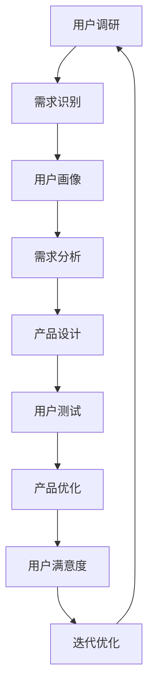

                 

## 引言

在科技迅猛发展的今天，程序员创业者面临的挑战日益增多。技术迭代速度快，市场需求多变，如何在这样的环境中脱颖而出，成为了每一个程序员创业者必须思考的问题。在这个过程中，从技术思维到用户思维转变的重要性愈发凸显。技术思维注重的是代码的编写、系统的架构和技术的实现，而用户思维则强调以用户为中心，关注用户的需求和体验。

### 1.1 程序员创业者的挑战

程序员创业者的挑战主要来自于以下几个方面：

1. **技术实现的复杂性**：随着技术的不断进步，程序员需要掌握更多的编程语言、框架和工具，以便高效地实现产品。
2. **市场需求的快速变化**：用户的需求是动态变化的，创业者需要敏锐地捕捉市场动态，快速调整产品方向。
3. **竞争压力**：在同类产品层出不穷的市场中，如何脱颖而出，吸引并留住用户，是每一个程序员创业者必须面对的挑战。
4. **资源限制**：大多数程序员创业者在创业初期资源有限，需要在有限的资源下做出最优的产品设计决策。

### 1.2 用户思维的重要性

用户思维的重要性体现在以下几个方面：

1. **需求导向**：以用户需求为导向，能够确保产品功能满足用户实际需要，避免资源的浪费。
2. **用户体验优化**：关注用户体验，能够提升用户满意度，增加用户粘性，从而提高产品的市场竞争力。
3. **降低失败风险**：通过用户思维，可以在产品开发早期识别潜在问题，降低产品失败的风险。
4. **提升创新力**：用户思维促使程序员创业者不断思考如何改进产品，从而激发创新力。

### 1.3 本书的目标和结构

本书旨在帮助程序员创业者从技术思维向用户思维转变，提升产品设计能力。全书共分为五个部分：

- **第一部分：引言**：介绍程序员创业者的挑战和用户思维的重要性。
- **第二部分：用户思维基础**：讲解用户研究方法、需求分析和用户行为分析。
- **第三部分：产品设计方法**：介绍产品设计流程、用户体验设计和用户界面设计。
- **第四部分：实战案例**：通过具体案例展示用户思维在实际产品设计中的应用。
- **第五部分：扩展阅读**：推荐相关书籍、在线资源和社区交流。

通过本书的阅读，读者将能够系统地了解用户思维的核心概念，掌握用户研究方法和产品设计技巧，从而更好地应对程序员创业的挑战。

### 1.4 写作风格和目标读者

本书采用逻辑清晰、结构紧凑的写作风格，通过一步一步的分析推理，深入浅出地讲解用户思维和产品设计的核心要点。本书的目标读者包括：

- **程序员创业者**：希望通过用户思维提升产品设计能力的创业者。
- **产品经理**：需要深入了解用户需求，优化产品功能的从业者。
- **技术团队领导**：希望提高团队协作效率和产品设计质量的团队领导。
- **学生和研究者**：对用户思维和产品设计感兴趣的学生和研究者。

通过本书的阅读，读者将不仅能够理论联系实际，还能在实践中应用所学知识，提升自己的产品设计能力和创业成功率。

## 第一部分：引言

在科技迅猛发展的今天，程序员创业者面临的挑战日益增多。技术迭代速度快，市场需求多变，如何在这样的环境中脱颖而出，成为了每一个程序员创业者必须思考的问题。在这个过程中，从技术思维到用户思维转变的重要性愈发凸显。技术思维注重的是代码的编写、系统的架构和技术的实现，而用户思维则强调以用户为中心，关注用户的需求和体验。

### 1.1 程序员创业者的挑战

程序员创业者的挑战主要来自于以下几个方面：

1. **技术实现的复杂性**：随着技术的不断进步，程序员需要掌握更多的编程语言、框架和工具，以便高效地实现产品。例如，云计算、大数据和人工智能等新兴技术不断涌现，程序员需要不断学习和适应这些新技术。

2. **市场需求的快速变化**：用户的需求是动态变化的，创业者需要敏锐地捕捉市场动态，快速调整产品方向。例如，社交媒体平台的兴起改变了用户获取信息和互动的方式，程序员创业者需要迅速调整产品功能以适应这些变化。

3. **竞争压力**：在同类产品层出不穷的市场中，如何脱颖而出，吸引并留住用户，是每一个程序员创业者必须面对的挑战。例如，打车软件市场上，滴滴出行、Uber等公司竞争激烈，创业者需要通过创新和优质的服务来吸引用户。

4. **资源限制**：大多数程序员创业者在创业初期资源有限，需要在有限的资源下做出最优的产品设计决策。例如，初创公司通常在资金、人力和时间上有限，程序员创业者需要合理分配资源，确保产品能够在预算和时间范围内高质量地完成。

### 1.2 用户思维的重要性

用户思维的重要性体现在以下几个方面：

1. **需求导向**：以用户需求为导向，能够确保产品功能满足用户实际需要，避免资源的浪费。例如，在开发一款健身应用程序时，程序员创业者需要了解用户希望通过应用程序实现哪些功能，如记录健身数据、提供健身指导等。

2. **用户体验优化**：关注用户体验，能够提升用户满意度，增加用户粘性，从而提高产品的市场竞争力。例如，一个优秀的用户体验设计能够使用户在使用过程中感到舒适和愉悦，从而增加用户的忠诚度。

3. **降低失败风险**：通过用户思维，可以在产品开发早期识别潜在问题，降低产品失败的风险。例如，在产品原型阶段，通过用户测试可以发现产品功能上的不足，及时进行调整，避免在开发完成后再进行大规模修改。

4. **提升创新力**：用户思维促使程序员创业者不断思考如何改进产品，从而激发创新力。例如，在开发智能家居产品时，程序员创业者可以通过深入了解用户对智能家居的需求和期望，探索新的产品功能和设计。

### 1.3 本书的目标和结构

本书旨在帮助程序员创业者从技术思维向用户思维转变，提升产品设计能力。全书共分为五个部分：

- **第一部分：引言**：介绍程序员创业者的挑战和用户思维的重要性。
- **第二部分：用户思维基础**：讲解用户研究方法、需求分析和用户行为分析。
- **第三部分：产品设计方法**：介绍产品设计流程、用户体验设计和用户界面设计。
- **第四部分：实战案例**：通过具体案例展示用户思维在实际产品设计中的应用。
- **第五部分：扩展阅读**：推荐相关书籍、在线资源和社区交流。

通过本书的阅读，读者将能够系统地了解用户思维的核心概念，掌握用户研究方法和产品设计技巧，从而更好地应对程序员创业的挑战。

### 1.4 写作风格和目标读者

本书采用逻辑清晰、结构紧凑的写作风格，通过一步一步的分析推理，深入浅出地讲解用户思维和产品设计的核心要点。本书的目标读者包括：

- **程序员创业者**：希望通过用户思维提升产品设计能力的创业者。
- **产品经理**：需要深入了解用户需求，优化产品功能的从业者。
- **技术团队领导**：希望提高团队协作效率和产品设计质量的团队领导。
- **学生和研究者**：对用户思维和产品设计感兴趣的学生和研究者。

通过本书的阅读，读者将不仅能够理论联系实际，还能在实践中应用所学知识，提升自己的产品设计能力和创业成功率。

### 1.5 文章结构概述

为了帮助读者更好地理解本书的内容，下面是文章的结构概述：

- **引言**：介绍程序员创业者的挑战和用户思维的重要性，说明本书的目标和结构。
- **第一部分：用户思维基础**：包括用户研究方法、需求分析和用户行为分析，为读者提供用户思维的基础知识。
- **第二部分：产品设计方法**：介绍产品设计流程、用户体验设计和用户界面设计，帮助读者掌握产品设计的实用技巧。
- **第三部分：实战案例**：通过具体案例展示用户思维在实际产品设计中的应用，加深读者的理解和实践能力。
- **第四部分：扩展阅读**：推荐相关书籍、在线资源和社区交流，为读者提供进一步学习的资源。

通过这篇文章的结构概述，读者可以清晰地了解到本书的内容安排，为接下来的阅读做好铺垫。

## 第二部分：用户思维基础

在程序员创业者的产品设计中，用户思维的基础至关重要。用户思维是一种以用户为中心的设计理念，它要求我们深入了解用户的需求、行为和偏好，从而设计出满足用户期望的产品。本部分将详细介绍用户研究方法、需求分析和用户行为分析，帮助读者建立起用户思维的基本框架。

### 2.1 用户研究方法

用户研究是用户思维的核心环节，它通过多种方法收集用户数据，为产品设计提供依据。以下是几种常见的用户研究方法：

1. **用户画像**：用户画像是一种通过用户特征描述来概括用户群体的方法。它通常包括用户的基本信息（如年龄、性别、地理位置等）和用户行为特征（如消费习惯、兴趣爱好等）。通过创建用户画像，我们可以更好地了解目标用户，为产品设计提供指导。

   **核心概念与联系**：
   用户画像不仅是对用户特征的描述，更是对用户需求的抽象和概括。它有助于我们识别用户群体中的共性，从而设计出能够满足大多数用户需求的产品功能。

   **Mermaid流程图**：
   ```mermaid
   graph TD
   A[用户数据收集] --> B[数据清洗]
   B --> C[数据建模]
   C --> D[用户画像创建]
   D --> E[产品设计]
   ```

2. **用户调研**：用户调研是通过问卷、访谈、焦点小组等方式收集用户反馈的方法。通过用户调研，我们可以深入了解用户对现有产品的评价、期望和需求。

   **核心概念与联系**：
   用户调研帮助我们在产品设计的早期阶段识别潜在问题，验证用户需求，为后续的设计提供有力支持。

   **Mermaid流程图**：
   ```mermaid
   graph TD
   A[用户调研] --> B[数据收集]
   B --> C[数据分析]
   C --> D[需求识别]
   D --> E[产品设计]
   ```

3. **用户反馈机制**：用户反馈机制是一种持续收集用户反馈的方法。通过用户反馈，我们可以及时了解用户在使用产品过程中的问题和需求，从而进行快速调整和优化。

   **核心概念与联系**：
   用户反馈机制不仅是收集用户意见的渠道，更是与用户建立沟通和信任的重要方式。通过有效的用户反馈，我们可以持续改进产品，提升用户体验。

   **Mermaid流程图**：
   ```mermaid
   graph TD
   A[用户反馈] --> B[问题识别]
   B --> C[解决方案]
   C --> D[产品改进]
   D --> E[用户体验提升]
   ```

### 2.2 用户需求分析

用户需求分析是用户思维的基础，它通过识别和理解用户需求，为产品设计提供明确的指导。以下是用户需求分析的关键步骤：

1. **用户需求识别**：通过用户调研和用户反馈，识别用户在产品使用过程中遇到的问题和期望。这一步骤的目的是确保产品设计能够真正解决用户的问题，满足用户的期望。

   **核心概念与联系**：
   用户需求识别是产品设计的起点，它决定了产品功能的范围和优先级。通过有效的需求识别，我们可以确保产品设计方向正确。

   **伪代码**：
   ```python
   def identify_user_needs(feedback):
       needs = []
       for comment in feedback:
           if "problem" in comment:
               needs.append(extract_problem(comment))
           elif "expectation" in comment:
               needs.append(extract_expectation(comment))
       return needs
   ```

2. **用户需求分类**：将识别出的用户需求进行分类，区分出基本需求、期望需求和痛点需求。基本需求是用户使用产品的基本功能需求，期望需求是用户对产品功能的额外期望，痛点需求是用户迫切希望解决的问题。

   **核心概念与联系**：
   用户需求分类有助于我们明确产品设计的重点，确保资源分配合理，优先解决用户最迫切的需求。

   **Mermaid流程图**：
   ```mermaid
   graph TD
   A[用户需求识别] --> B[基本需求]
   A --> C[期望需求]
   A --> D[痛点需求]
   ```

3. **用户需求验证**：通过用户测试和反馈，验证识别出的用户需求是否真正满足用户期望。这一步骤的目的是确保产品设计的可行性和有效性。

   **核心概念与联系**：
   用户需求验证是产品设计过程中的关键环节，它确保了产品功能的有效性和用户体验的满意度。

   **伪代码**：
   ```python
   def validate_user_needs(product, needs):
       for need in needs:
           if "basic" in need:
               if not check_basic_functionality(product):
                   return False
           elif "expectation" in need:
               if not check_expectation_met(product):
                   return False
           elif "pain_point" in need:
               if not check_pain_point_resolved(product):
                   return False
       return True
   ```

### 2.3 用户行为分析

用户行为分析是通过收集和分析用户在产品使用过程中的行为数据，深入了解用户行为模式和偏好，从而优化产品设计和用户体验。以下是用户行为分析的关键步骤：

1. **用户行为数据分析**：通过数据分析工具收集用户在产品中的行为数据，如点击路径、页面停留时间、使用频率等。这些数据有助于我们识别用户行为模式和偏好。

   **核心概念与联系**：
   用户行为数据分析是用户行为分析的基础，它为我们提供了关于用户行为的客观事实，为后续的分析提供了数据支持。

   **Mermaid流程图**：
   ```mermaid
   graph TD
   A[用户行为数据收集] --> B[数据分析]
   B --> C[行为模式识别]
   C --> D[用户偏好分析]
   ```

2. **用户行为模型建立**：通过分析用户行为数据，建立用户行为模型，描述用户在产品中的行为特征。用户行为模型可以帮助我们预测用户行为，指导产品设计。

   **核心概念与联系**：
   用户行为模型是用户行为分析的核心成果，它将复杂的用户行为转化为可量化的模型，为产品设计提供了科学依据。

   **Mermaid流程图**：
   ```mermaid
   graph TD
   A[用户行为数据分析] --> B[行为模式识别]
   B --> C[行为模型建立]
   C --> D[产品设计优化]
   ```

3. **用户行为预测**：通过用户行为模型，预测用户在未来可能的行为，从而优化产品设计。例如，通过预测用户点击路径，我们可以优化页面布局，提高用户体验。

   **核心概念与联系**：
   用户行为预测是用户行为分析的高级应用，它可以帮助我们预见用户需求，提前进行产品优化。

   **伪代码**：
   ```python
   def predict_user_behavior(model, user_data):
       predicted_actions = model.predict(user_data)
       return predicted_actions
   ```

通过本部分的介绍，读者可以初步建立起用户思维的基础框架，为后续的产品设计提供理论支持和实践指导。在下一部分，我们将进一步探讨用户需求分析和用户行为分析的具体方法和技巧。

### 2.4 用户思维在产品设计中的应用

用户思维在产品设计中起着至关重要的作用，它要求我们在设计过程中始终以用户为中心，确保产品功能、用户体验和用户满意度能够满足用户需求。以下是用户思维在产品设计中的具体应用：

1. **需求导向设计**：在产品设计的每个阶段，都要以用户需求为导向，确保产品设计符合用户实际需求。例如，在功能设计阶段，可以通过用户调研和用户需求分析，明确用户最迫切需要解决的核心问题，从而设计出具有针对性的功能。

   **核心概念与联系**：
   需求导向设计强调以用户需求为驱动，通过深入了解用户需求，确保产品设计能够真正解决用户问题，提升用户满意度。

   **Mermaid流程图**：
   ```mermaid
   graph TD
   A[需求调研] --> B[需求分析]
   B --> C[功能设计]
   C --> D[用户反馈]
   ```

2. **用户体验设计**：用户体验设计是用户思维在产品设计中的具体体现，它关注用户在使用产品过程中的感受和体验。通过用户体验设计，我们可以提升产品的易用性、可访问性和愉悦感，从而增强用户对产品的满意度和忠诚度。

   **核心概念与联系**：
   用户体验设计不仅包括视觉设计，还包括交互设计、信息架构等，它通过一系列设计手段，优化用户在使用产品过程中的体验。

   **伪代码**：
   ```python
   def design_user_experience(needs, feedback):
       experience = {}
       for need in needs:
           if "easy_to_use" in need:
               experience["usability"] = optimize_usability()
           elif "accessibility" in need:
               experience["accessibility"] = enhance_accessibility()
           elif "enjoyable" in need:
               experience["engagement"] = increase_engagement()
       return experience
   ```

3. **持续优化**：用户思维要求我们持续关注用户反馈，不断优化产品设计和功能。通过用户反馈机制，我们可以及时了解用户在使用产品过程中的问题和需求，从而进行针对性的改进。

   **核心概念与联系**：
   持续优化是用户思维在产品设计中的关键实践，它确保了产品能够不断适应用户需求的变化，提升用户满意度。

   **Mermaid流程图**：
   ```mermaid
   graph TD
   A[用户反馈] --> B[问题识别]
   B --> C[解决方案]
   C --> D[产品改进]
   ```

通过用户思维在产品设计中的具体应用，我们可以设计出更加符合用户需求的产品，提升用户体验，从而在激烈的市场竞争中脱颖而出。在下一部分，我们将进一步探讨如何通过用户研究方法和数据分析，深入了解用户需求和行为，为产品设计提供有力支持。

### 2.5 用户思维在实际项目中的应用案例

为了更直观地理解用户思维在实际项目中的应用，我们可以通过一个具体案例来详细讲解用户思维在整个项目周期中的运用。

**案例背景**：

某初创公司开发了一款面向都市年轻人的健康管理应用程序，旨在帮助用户监控日常饮食、运动和睡眠质量，并提供个性化的健康建议。在产品开发的不同阶段，团队通过用户思维来指导设计和优化。

**1. 需求调研阶段**：

在产品概念阶段，团队首先进行了广泛的用户调研，包括线上问卷调查和线下焦点小组访谈。调研的问题涵盖了用户对健康管理应用程序的期望、现有应用的使用体验、对健康管理的关注点等方面。

**核心概念与联系**：

- **用户画像**：通过调研结果，团队创建了一系列用户画像，包括活跃的上班族、注重饮食健康的年轻人等，这些画像帮助团队更好地了解目标用户群体。

- **需求识别**：调研结果显示，用户对健康管理应用程序的主要需求包括：

  - **易用性**：用户希望应用操作简单，易于上手。
  - **个性化**：用户期望根据个人健康数据和偏好提供定制化的健康建议。
  - **社交互动**：用户希望能够在应用中与其他用户互动，分享健康心得。

**2. 功能设计阶段**：

在需求识别的基础上，团队开始进行功能设计。他们首先确定了核心功能，包括饮食记录、运动监控、睡眠追踪和健康建议。

**核心算法原理讲解**：

- **用户数据收集**：应用通过传感器和用户输入收集饮食、运动和睡眠数据。
- **数据预处理**：对收集到的数据进行清洗和归一化，以便进行后续分析。
- **个性化推荐**：应用使用机器学习算法，根据用户历史数据和偏好提供个性化的健康建议。

**伪代码**：

```python
def collect_user_data(sensor_data, user_input):
    cleaned_data = preprocess_data(sensor_data, user_input)
    return cleaned_data

def provide_health_advice(cleaned_data, user_preferences):
    advice = machine_learning_algorithm(cleaned_data, user_preferences)
    return advice
```

**3. 用户体验设计阶段**：

团队在用户体验设计阶段，重点关注应用的界面设计、交互设计和信息架构。

**核心概念与联系**：

- **界面设计**：应用界面采用简洁、现代的设计风格，确保用户能够快速找到所需功能。
- **交互设计**：应用提供直观的交互方式，如滑动、点击等，使用户操作简便。
- **信息架构**：应用的信息架构清晰，确保用户能够轻松浏览和应用内容。

**4. 用户测试与反馈阶段**：

在产品开发完成后，团队进行了多次用户测试，收集用户反馈，并根据反馈进行优化。

**核心概念与联系**：

- **用户测试**：通过用户测试，团队识别出应用中的问题，如某些功能难以使用、某些页面加载速度较慢等。
- **反馈分析**：团队分析了用户反馈，确定了优化优先级，并进行了相应的改进。

**伪代码**：

```python
def analyze_user_feedback(feedback):
    issues = extract_issues(feedback)
    prioritized_issues = prioritize_issues(issues)
    return prioritized_issues

def optimize_product(prioritized_issues):
    for issue in prioritized_issues:
        if issue["priority"] == "high":
            implement_solution(issue)
    return optimized_product
```

通过这个案例，我们可以看到用户思维在项目不同阶段的具体应用，从需求调研到功能设计，再到用户体验设计和用户测试，用户思维始终贯穿其中，确保产品设计能够真正满足用户需求，提升用户体验。在下一部分，我们将进一步探讨如何通过用户行为分析和数据驱动设计，进一步优化产品设计。

### 2.6 用户行为分析的重要性

用户行为分析在产品设计中具有不可替代的重要性，它通过收集和分析用户在使用产品过程中的行为数据，为产品设计提供科学依据。以下是用户行为分析的重要性和具体方法：

#### 重要性

1. **了解用户需求**：用户行为数据能够揭示用户在实际使用产品时的行为模式，帮助产品设计团队深入了解用户需求，从而设计出更符合用户期望的产品。

2. **优化用户体验**：通过分析用户行为数据，我们可以识别用户在产品使用过程中遇到的痛点，及时进行优化，提升用户体验。

3. **预测用户行为**：用户行为分析可以帮助我们建立用户行为模型，预测用户未来的行为，从而为产品设计和优化提供前瞻性指导。

4. **提高转化率和留存率**：通过分析用户行为数据，我们可以优化产品的关键环节，如引导页、购物车、注册流程等，提高用户的转化率和留存率。

#### 具体方法

1. **数据收集**：用户行为数据的收集是用户行为分析的基础。通过使用追踪工具（如Google Analytics、Mixpanel等），我们可以收集用户在产品中的行为数据，如页面访问次数、点击路径、停留时间、转化率等。

2. **数据预处理**：收集到的用户行为数据通常需要进行预处理，包括数据清洗、数据归一化和特征提取。预处理步骤的目的是确保数据质量，为后续分析提供可靠的基础。

3. **行为模式识别**：通过数据分析工具，对用户行为数据进行模式识别，提取出用户的行为特征。这些行为特征可以帮助我们理解用户在产品中的行为规律。

4. **行为模型建立**：基于用户行为数据，我们可以建立用户行为模型。这些模型可以用于预测用户行为、推荐产品功能等。

5. **行为分析应用**：用户行为分析的结果可以应用于产品设计的多个方面，如：

   - **页面优化**：通过分析用户点击和停留时间，优化页面布局和内容，提高用户参与度。
   - **功能优化**：通过分析用户对产品功能的利用情况，优化产品功能，提升用户满意度。
   - **用户引导**：通过分析用户在注册和引导页面的行为，优化引导流程，提高转化率。

#### 示例

假设我们正在开发一款在线购物应用程序，以下是一个用户行为分析的具体示例：

1. **数据收集**：通过Google Analytics收集用户在应用程序中的行为数据，如页面访问次数、点击路径、购物车放弃率等。

2. **数据预处理**：清洗数据，去除无效数据，对用户行为数据进行归一化处理。

3. **行为模式识别**：通过数据分析，识别出用户在购物应用程序中的典型行为模式，如用户在浏览商品后通常会在购物车中停留一段时间，然后再进行购买。

4. **行为模型建立**：基于用户行为数据，建立用户行为模型，如用户在购物车中停留时间与购买转化率之间的关系模型。

5. **行为分析应用**：通过用户行为模型，优化购物车界面设计，提高用户转化率。例如，增加购物车中的提示功能，提醒用户购物车中的商品，提高购买意愿。

通过用户行为分析，我们可以深入了解用户需求和行为，从而优化产品设计，提升用户体验和产品竞争力。在下一部分，我们将进一步探讨如何通过数据分析驱动产品设计，实现产品优化。

### 2.7 用户行为数据驱动的产品设计

在产品设计中，用户行为数据扮演着至关重要的角色。通过分析用户行为数据，我们可以深入了解用户的需求、偏好和行为模式，从而驱动产品设计和优化。以下是如何利用用户行为数据进行数据驱动设计的具体方法和实例。

#### 利用用户行为数据改进产品功能

1. **用户行为数据收集**：首先，我们需要收集用户在使用产品过程中的行为数据。这包括用户在产品中的点击路径、页面停留时间、操作顺序、使用频率等。这些数据可以通过追踪工具（如Google Analytics、Mixpanel等）进行收集。

2. **数据预处理**：收集到的数据需要进行预处理，包括数据清洗、数据归一化和特征提取。数据清洗的目的是去除无效数据和异常值，确保数据质量。数据归一化的目的是将不同类型的数据进行统一处理，例如将时间戳统一转换为秒或分钟。特征提取的目的是从原始数据中提取出有用的信息，以便进行后续分析。

3. **用户行为分析**：通过对预处理后的数据进行分析，我们可以识别出用户在产品中的典型行为模式。例如，通过分析用户点击路径，我们可以发现用户在访问产品页面时最常访问的页面和功能。通过分析页面停留时间，我们可以识别出用户对某些功能的兴趣程度。

4. **功能优化**：基于用户行为分析的结果，我们可以对产品功能进行优化。例如，如果发现用户在访问产品页面后经常跳转到一个特定的页面，那么我们可以考虑将该页面作为首页，以提高用户参与度。如果用户在某个功能上停留时间较短，我们可以考虑优化该功能的用户体验。

#### 利用用户行为数据优化用户体验

1. **交互设计**：通过分析用户行为数据，我们可以优化产品的交互设计。例如，如果发现用户在操作某个功能时经常犯错，我们可以考虑优化该功能的交互流程，提高用户操作的便捷性和准确性。

2. **页面布局**：通过分析用户点击和页面停留时间，我们可以优化页面布局，确保关键信息和高价值功能能够吸引用户的注意力。例如，如果用户在浏览商品详情页时经常跳转到其他页面，我们可以考虑将购物车按钮放置在显眼位置，以增加购物转化率。

3. **内容推荐**：通过分析用户行为数据，我们可以为用户推荐他们可能感兴趣的内容或功能。例如，如果用户在浏览商品时经常查看运动鞋，我们可以根据用户的历史行为数据，推荐其他运动鞋品牌或相关商品。

#### 利用用户行为数据进行产品迭代

1. **A/B测试**：通过A/B测试，我们可以将用户行为数据与不同版本的产品功能或设计进行比较，以确定哪种设计或功能更能满足用户需求。例如，我们可以通过A/B测试，比较两个不同版本的购物车设计，看哪个版本的转化率更高。

2. **迭代优化**：基于A/B测试的结果，我们可以不断优化产品设计和功能。例如，如果A/B测试结果显示，新版购物车设计能够提高转化率，我们可以进一步优化该功能，提高用户体验。

#### 实例分析

假设我们正在优化一款社交媒体应用程序的页面布局。以下是一个具体的实例：

1. **数据收集**：通过Google Analytics收集用户在应用程序中的行为数据，包括页面访问次数、点击路径、页面停留时间等。

2. **数据预处理**：对收集到的数据进行清洗和归一化处理，提取出有用的信息。

3. **用户行为分析**：通过分析用户行为数据，我们发现用户在浏览社交媒体页面时，最常访问的是新闻动态和好友动态。同时，用户在新闻动态页面上的停留时间较长。

4. **功能优化**：基于用户行为分析的结果，我们决定将新闻动态和好友动态页面放置在更加显眼的位置，以提高用户的参与度和满意度。

5. **迭代优化**：通过A/B测试，我们发现将新闻动态和好友动态页面放置在首页后，用户的页面停留时间和参与度显著提升。因此，我们决定继续优化这些页面，提高用户体验。

通过利用用户行为数据进行数据驱动设计，我们可以设计出更加符合用户需求的产品，提高用户体验和满意度，从而在竞争激烈的市场中脱颖而出。

### 用户行为模型的建立与应用

在用户行为分析中，用户行为模型的建立与应用是关键步骤。用户行为模型通过系统化的数据分析和模式识别，描述用户在产品中的行为特征，为产品设计和优化提供科学依据。以下是用户行为模型的具体建立过程和案例分析。

#### 用户行为模型的建立过程

1. **数据收集与预处理**：
   - 收集用户在产品中的行为数据，如点击次数、页面停留时间、操作频率等。
   - 对收集到的数据进行清洗，去除异常值和重复数据，确保数据质量。

2. **特征提取**：
   - 从原始数据中提取有用特征，如用户年龄、性别、地理位置、设备类型、访问时间等。
   - 通过数据预处理和特征工程，构建能够反映用户行为特征的指标，如用户活跃度、页面浏览深度、点击频率等。

3. **模型训练**：
   - 选择合适的机器学习算法，如决策树、随机森林、支持向量机等，对用户行为数据集进行训练。
   - 调整模型参数，优化模型性能，确保模型能够准确预测用户行为。

4. **模型评估**：
   - 使用交叉验证等技术评估模型的性能，确保模型具有较好的预测能力。
   - 根据评估结果调整模型结构和参数，进一步提高模型精度。

5. **模型部署**：
   - 将训练好的模型部署到产品中，实时收集用户行为数据，更新和优化模型。

#### 用户行为模型的应用

1. **用户行为预测**：
   - 使用用户行为模型预测用户未来的行为，如购买意向、页面访问顺序等。
   - 预测结果可以帮助产品团队优化产品功能，提升用户体验。

2. **个性化推荐**：
   - 基于用户行为模型，为用户提供个性化的内容推荐和功能引导。
   - 个性化推荐可以增加用户粘性，提高用户满意度和留存率。

3. **风险识别**：
   - 通过分析用户行为数据，识别潜在的用户流失风险。
   - 针对高风险用户，提供个性化的关怀和优惠，降低用户流失率。

#### 案例分析

假设我们正在开发一款电子商务平台，以下是一个用户行为模型建立与应用的案例：

1. **数据收集与预处理**：
   - 收集用户在电子商务平台上的行为数据，如点击商品次数、购物车添加次数、购买频率等。
   - 对数据进行清洗，去除异常值，确保数据质量。

2. **特征提取**：
   - 提取用户年龄、性别、地理位置、访问设备类型等特征。
   - 构建用户活跃度、点击频率、购物车行为等指标。

3. **模型训练**：
   - 使用随机森林算法对用户行为数据集进行训练，调整模型参数，优化模型性能。

4. **模型评估**：
   - 通过交叉验证技术评估模型性能，确保模型能够准确预测用户行为。

5. **模型部署**：
   - 将训练好的模型部署到电子商务平台中，实时收集用户行为数据，更新和优化模型。

6. **应用**：
   - **用户行为预测**：通过模型预测用户购买意向，为营销团队提供决策支持。
   - **个性化推荐**：基于用户行为模型，为用户推荐可能感兴趣的商品，提升转化率。
   - **风险识别**：通过分析用户行为数据，识别潜在的用户流失风险，提供针对性的用户关怀。

通过用户行为模型的建立和应用，我们可以更深入地了解用户行为，优化产品设计，提升用户体验和满意度。在实际应用中，用户行为模型需要不断更新和优化，以适应用户需求和市场变化。

### 用户行为预测与产品设计优化

用户行为预测是用户行为分析的高级应用，它通过建立用户行为模型，预测用户在未来可能采取的行为。这种预测能力对于产品设计和优化至关重要，可以帮助企业提前识别用户需求，优化用户体验，从而提高产品的市场竞争力。以下是用户行为预测的方法、原理和具体应用实例。

#### 用户行为预测的方法

1. **机器学习算法**：机器学习算法是用户行为预测的核心工具。常见的算法包括决策树、随机森林、支持向量机（SVM）、神经网络等。这些算法通过分析历史用户行为数据，学习用户行为模式，从而预测未来的行为。

2. **时间序列分析**：时间序列分析用于预测用户在未来某个时间点的行为。这种方法通过分析用户历史行为的时间序列特征，如访问频率、购买周期等，预测用户未来的行为趋势。

3. **回归分析**：回归分析是一种统计方法，通过建立用户行为与目标变量（如购买行为、点击行为）之间的关系模型，预测未来的用户行为。

4. **聚类分析**：聚类分析通过将用户划分为不同的群体，分析不同群体在产品使用中的行为特征，从而预测每个群体的未来行为。

#### 用户行为预测的原理

1. **特征工程**：特征工程是用户行为预测的基础。通过提取和构建有效的特征，如用户活跃度、点击频率、购买历史等，为模型训练提供高质量的数据。

2. **模型训练**：使用训练集对预测模型进行训练，模型通过学习用户行为数据中的特征和模式，建立预测模型。

3. **模型评估**：通过验证集和测试集对模型进行评估，确保模型具有较好的预测性能。常用的评估指标包括准确率、召回率、F1分数等。

4. **模型优化**：根据模型评估结果，调整模型参数，优化模型结构，提高预测准确性。

#### 用户行为预测的应用实例

假设我们正在优化一款在线购物平台，以下是用户行为预测的具体应用实例：

1. **购买行为预测**：
   - **预测原理**：通过分析用户的历史购买数据、浏览记录和点击行为，建立用户购买意向模型。
   - **应用场景**：平台可以根据购买行为预测，为用户推荐他们可能感兴趣的商品，提高转化率。

2. **用户流失预测**：
   - **预测原理**：通过分析用户的活跃度、访问频率和页面停留时间等特征，建立用户流失预测模型。
   - **应用场景**：平台可以提前识别出潜在的用户流失风险，采取针对性措施（如优惠活动、个性化推送等）留住用户。

3. **个性化推荐**：
   - **预测原理**：通过分析用户的历史行为数据，建立用户偏好模型，预测用户未来的兴趣点。
   - **应用场景**：平台可以根据个性化推荐模型，为用户推荐他们可能感兴趣的商品和内容，提升用户体验。

4. **广告投放优化**：
   - **预测原理**：通过分析用户的点击行为和转化率，建立广告投放效果预测模型。
   - **应用场景**：平台可以根据预测模型，优化广告投放策略，提高广告投放的ROI。

通过用户行为预测，我们可以提前识别用户需求，优化产品设计，提高用户体验和满意度。在实际应用中，用户行为预测需要不断更新和优化，以适应用户行为的变化和市场动态。通过持续的数据分析和模型优化，企业可以不断提升产品竞争力，赢得市场先机。

### 用户反馈机制的设计与应用

在用户思维指导下，用户反馈机制的设计与应用是确保产品设计满足用户需求的关键环节。用户反馈机制不仅可以帮助我们识别用户问题，还能提供改进产品的方向和依据。以下是用户反馈机制的设计原则、实施方法和案例分析。

#### 用户反馈机制的设计原则

1. **及时性**：用户反馈应该能够及时收集，以便在问题出现后迅速做出响应。例如，可以在产品界面中设置实时反馈窗口，让用户能够即时提交反馈。

2. **便利性**：用户提交反馈的过程应该简单方便，以减少用户参与门槛。例如，可以提供多渠道反馈方式，如在线表单、电子邮件、社交媒体等。

3. **多样性**：用户反馈机制应该能够收集多种类型的反馈，包括问题报告、建议、评价等。这有助于全面了解用户需求。

4. **透明性**：用户反馈的处理过程应该透明，用户应该能够了解反馈的处理进度和结果。例如，可以在反馈系统中显示反馈处理状态，并提供反馈结果的通知。

5. **隐私保护**：在收集和处理用户反馈时，应确保用户的隐私安全，避免用户信息泄露。

#### 用户反馈机制的实施方法

1. **在线反馈表单**：在产品界面中设置反馈表单，用户可以通过填写表单提交问题或建议。表单应包括必填和选填字段，简化提交过程。

2. **电子邮件反馈**：提供电子邮件反馈渠道，用户可以通过邮件提交反馈，邮件系统应能够自动分类和分配反馈至相应团队处理。

3. **社交媒体反馈**：利用社交媒体平台（如Twitter、Facebook等）收集用户反馈，设立专门的客服账号，及时响应用户提问和意见。

4. **用户论坛和社区**：建立用户论坛或社区，用户可以在论坛中分享使用体验、提出建议和解决问题。社区管理员应定期收集和整理用户反馈，向产品团队反馈。

5. **用户访谈和调查**：定期进行用户访谈和调查，深入了解用户需求和使用体验。访谈和调查结果可以作为产品改进的重要参考。

#### 案例分析

假设我们正在开发一款社交网络应用程序，以下是用户反馈机制的设计与应用案例：

1. **设计原则**：
   - **及时性**：在应用首页设置“反馈”按钮，用户点击后可以立即提交反馈。
   - **便利性**：提供简洁的在线反馈表单，包括问题描述、联系方式等必填字段。
   - **多样性**：支持文本、图片、视频等多种反馈形式。
   - **透明性**：在反馈提交后，系统会显示处理进度，并在问题解决后通知用户。
   - **隐私保护**：确保用户提交的反馈信息仅用于产品改进，不会公开或用于其他用途。

2. **实施方法**：
   - **在线反馈表单**：用户可以通过点击“反馈”按钮，填写在线反馈表单，提交问题或建议。
   - **电子邮件反馈**：用户可以通过邮件系统提交反馈，系统会自动分类和分配至客服团队。
   - **社交媒体反馈**：在应用官方Twitter和Facebook账号下设立反馈标签，用户可以通过社交媒体提交反馈。
   - **用户论坛和社区**：建立用户论坛，用户可以在论坛中分享使用体验，社区管理员定期整理反馈，向产品团队反馈。
   - **用户访谈和调查**：定期进行用户访谈和在线调查，收集用户深度反馈。

3. **应用效果**：
   - 通过用户反馈机制，团队能够及时了解用户需求和问题，优化产品功能。
   - 用户参与度提升，满意度提高，用户黏性增强。
   - 产品改进更加符合用户期望，市场竞争力提升。

通过科学设计和有效实施用户反馈机制，我们可以更好地满足用户需求，优化产品设计，提升用户体验，从而在激烈的市场竞争中脱颖而出。

### 用户反馈机制在产品优化中的应用

用户反馈机制在产品优化中发挥着至关重要的作用，它不仅帮助我们识别产品中的问题和不足，还为我们提供了改进产品的宝贵方向。以下是用户反馈机制在产品优化中的应用方法和实际案例。

#### 用户反馈机制的应用方法

1. **收集用户反馈**：首先，我们需要通过各种渠道（如在线反馈表单、电子邮件、社交媒体、用户论坛等）广泛收集用户反馈。确保反馈收集过程的简便性和便捷性，以提高用户参与度。

2. **分类与分析**：将收集到的用户反馈进行分类，根据反馈的内容和严重程度进行优先级排序。例如，可以将反馈分为功能问题、用户体验问题、性能问题等。

3. **问题识别**：通过分析用户反馈，识别出产品中存在的具体问题和用户关注点。这些问题可能包括功能缺失、界面设计不佳、操作流程复杂等。

4. **优先级排序**：根据用户反馈的重要性和紧急程度，对问题进行优先级排序。优先解决对用户体验影响较大、用户反馈较多的关键问题。

5. **解决方案制定**：针对识别出的问题，制定具体的解决方案。解决方案应包括问题的根本原因分析、改进方案和实施计划。

6. **实施与验证**：实施改进方案，并对改进后的产品进行验证。验证可以通过A/B测试、用户测试等方式进行，确保改进措施能够有效解决问题。

7. **持续反馈**：在产品改进过程中，持续收集用户反馈，并根据反馈结果调整优化方案。通过持续反馈，我们可以确保产品不断优化，满足用户需求。

#### 实际案例

**案例背景**：

某创业公司开发了一款协作办公软件，用户反馈中发现了一些关键问题，如界面设计不友好、文件共享功能不完善、任务管理流程复杂等。公司决定通过用户反馈机制，针对这些问题进行优化。

1. **收集用户反馈**：
   - 通过在线反馈表单、社交媒体、用户论坛等多渠道收集用户反馈。
   - 设立专门的用户反馈邮箱，方便用户直接提交问题。

2. **分类与分析**：
   - 将反馈分类为功能问题（如文件共享不完善）、用户体验问题（如界面设计不佳）、性能问题（如系统响应慢）等。
   - 分析用户反馈的频率和严重程度，识别出用户最关注的问题。

3. **问题识别**：
   - 通过分析，发现界面设计不佳是用户反馈最多的一个问题，影响了用户的使用体验。
   - 文件共享功能不完善，用户在团队协作中遇到困难。

4. **优先级排序**：
   - 将界面设计优化和文件共享功能完善列为最高优先级，因为这些问题的解决将直接提升用户体验和协作效率。

5. **解决方案制定**：
   - 对于界面设计问题，团队决定重新设计用户界面，采用更简洁、直观的设计风格。
   - 对于文件共享功能，团队决定增加新的功能，如实时共享、文件版本控制和权限管理。

6. **实施与验证**：
   - 团队按照制定方案，重新设计了用户界面，并对文件共享功能进行了升级。
   - 通过A/B测试，比较改进前后的用户反馈和实际使用效果，验证改进措施的有效性。

7. **持续反馈**：
   - 在改进过程中，团队继续收集用户反馈，并根据反馈结果调整优化方案。
   - 通过定期用户调查和用户访谈，持续了解用户需求和使用体验，确保产品不断优化。

通过用户反馈机制的应用，这家创业公司成功地优化了协作办公软件，提升了用户满意度和市场竞争力。这个案例展示了用户反馈在产品优化中的关键作用，也证明了持续优化和用户参与的重要性。

### 第三部分：产品设计方法

在程序员创业者的产品设计中，了解并掌握有效的产品设计方法是至关重要的。本部分将详细介绍产品设计流程、用户体验设计和用户界面设计，帮助读者系统地掌握从概念到最终产品的完整设计过程。

### 5.1 产品设计流程

产品设计流程是一个系统化的过程，它涵盖了从需求识别到产品发布的各个环节。以下是产品设计流程的详细步骤：

#### 5.1.1 需求分析

需求分析是产品设计的起点，它通过用户调研、用户画像和需求识别，明确产品的核心功能和目标用户需求。具体步骤包括：

- **用户调研**：通过问卷调查、访谈、焦点小组等方式收集用户反馈，了解用户对现有产品的评价和期望。
- **用户画像**：根据用户调研结果，创建用户画像，包括用户的基本特征、行为习惯和需求等。
- **需求识别**：通过分析用户画像和调研数据，识别出用户的核心需求和痛点，明确产品的功能范围。

#### 5.1.2 产品规划

产品规划是产品设计流程的第二步，它涉及确定产品的整体方向、功能和资源分配。具体步骤包括：

- **产品愿景**：明确产品的长期目标和发展方向。
- **功能规划**：根据需求分析结果，规划产品的具体功能模块和优先级。
- **资源分配**：根据产品规划和预算，分配人力资源、技术资源和时间资源。

#### 5.1.3 原型设计

原型设计是将抽象的需求转化为具体的产品原型，以便进行测试和反馈。具体步骤包括：

- **低保真原型**：使用草图或线框图，快速搭建产品的基本界面和结构。
- **高保真原型**：在低保真原型的基础上，添加具体的视觉元素和交互细节，制作高保真原型。
- **用户测试**：通过用户测试，验证原型是否符合用户需求，收集用户反馈，进行迭代优化。

#### 5.1.4 产品开发

产品开发是将原型转化为最终产品的过程，包括前端开发、后端开发和测试等。具体步骤包括：

- **需求文档**：编写详细的需求文档，明确产品的功能需求和技术实现要求。
- **开发与协作**：按照需求文档，进行前端和后端开发，确保产品功能的实现。
- **测试与调试**：进行功能测试、性能测试和用户测试，确保产品质量和用户体验。

#### 5.1.5 产品发布

产品发布是产品设计的最终环节，它涉及产品的上线、推广和用户反馈收集。具体步骤包括：

- **上线**：将产品部署到生产环境，确保产品能够正常运行。
- **推广**：通过市场推广活动，提高产品的知名度和用户数量。
- **用户反馈**：持续收集用户反馈，并根据反馈进行产品优化。

### 5.2 用户体验设计

用户体验设计（UX Design）是产品设计的关键环节，它关注用户在使用产品过程中的感受和体验。以下是用户体验设计的核心原则和具体步骤：

#### 5.2.1 用户体验设计原则

- **简洁性**：设计简洁、直观的界面，减少用户的操作难度。
- **一致性**：保持界面元素和交互规则的一致性，提高用户的使用效率。
- **可用性**：确保产品易于使用，用户能够快速完成目标操作。
- **可访问性**：设计支持各种用户（包括残障人士）使用的界面。
- **可扩展性**：设计具有良好扩展性的系统，以便未来功能增加。

#### 5.2.2 用户体验设计步骤

- **需求分析**：了解用户需求和业务目标，为设计提供基础。
- **信息架构**：构建产品的信息架构，确定界面结构和内容布局。
- **交互设计**：设计产品的交互流程和操作细节，确保用户体验流畅。
- **原型设计**：制作低保真或高保真原型，验证设计理念。
- **用户测试**：通过用户测试，收集用户反馈，优化设计。

### 5.3 用户界面设计

用户界面设计（UI Design）是用户体验设计的重要组成部分，它关注产品的视觉呈现和用户交互。以下是用户界面设计的核心原则和具体步骤：

#### 5.3.1 用户界面设计原则

- **美观性**：设计美观、直观的界面，提高用户的视觉愉悦感。
- **响应性**：设计适应不同设备和屏幕尺寸的界面，确保用户在不同设备上都能获得良好的体验。
- **一致性**：保持界面元素和视觉风格的一致性，提高用户体验的连贯性。
- **可访问性**：确保界面元素和色彩搭配适合所有用户，包括色盲用户。

#### 5.3.2 用户界面设计步骤

- **设计原则确定**：明确产品的设计原则和视觉风格。
- **界面布局**：确定界面的布局结构，包括导航栏、按钮、文本框等元素的排列。
- **色彩与字体设计**：选择合适的色彩和字体，提高界面的美观性和可读性。
- **交互元素设计**：设计按钮、链接、图标等交互元素，确保用户体验流畅。
- **原型制作与测试**：制作界面原型，通过用户测试验证设计效果。

通过掌握产品设计流程、用户体验设计和用户界面设计的方法，程序员创业者可以更系统地开展产品设计工作，提升产品的市场竞争力。在下一部分，我们将通过具体案例分析，深入探讨这些方法在实际项目中的应用。

### 5.4 产品设计流程

在产品设计的初期，设计师和开发团队需要经历一系列的步骤，以确保最终产品能够满足用户需求和业务目标。以下是产品设计流程的详细描述：

#### 5.4.1 需求分析

需求分析是产品设计的起点，这一阶段的目标是理解用户需求、业务目标和市场趋势。以下是具体步骤：

1. **用户调研**：
   - 通过问卷调查、访谈、用户画像等方法，收集用户反馈。
   - 分析用户行为数据，了解用户习惯和偏好。
   - 确定用户的核心需求和使用场景。

2. **需求识别**：
   - 根据用户调研结果，识别出用户的主要需求和痛点。
   - 明确产品的核心功能和目标用户群体。

3. **需求文档**：
   - 编写详细的需求文档，描述产品的功能需求、性能要求和用户界面设计。
   - 需求文档应包含功能列表、用户故事、原型链接等。

#### 5.4.2 产品规划

产品规划是在需求分析的基础上，进一步明确产品的方向和资源分配。以下是具体步骤：

1. **产品愿景**：
   - 确定产品的长期目标和愿景，为产品设计提供指导。
   - 明确产品要解决的问题和为用户带来的价值。

2. **功能规划**：
   - 根据需求文档，规划产品的具体功能模块。
   - 确定功能的优先级，明确哪些功能是必须的，哪些是可选的。

3. **资源分配**：
   - 根据产品规划和预算，分配人力资源、技术资源和时间资源。
   - 确定项目的时间表和里程碑。

#### 5.4.3 原型设计

原型设计是将抽象的需求转化为具体的视觉和交互模型，以便进行测试和反馈。以下是具体步骤：

1. **低保真原型**：
   - 使用草图或线框图，快速搭建产品的基本界面和结构。
   - 确定主要界面元素和交互流程。

2. **高保真原型**：
   - 在低保真原型的基础上，添加具体的视觉元素和交互细节。
   - 制作高保真原型，模拟实际产品的视觉和交互效果。

3. **用户测试**：
   - 通过用户测试，验证原型是否符合用户需求，收集用户反馈。
   - 根据用户反馈，对原型进行迭代优化。

#### 5.4.4 产品开发

产品开发是将原型转化为最终产品的过程，包括前端开发、后端开发和测试等。以下是具体步骤：

1. **需求文档评审**：
   - 对需求文档进行评审，确保所有开发人员对产品需求有清晰的理解。

2. **开发与协作**：
   - 按照需求文档，进行前端和后端开发。
   - 使用敏捷开发方法，确保产品功能的高质量实现。

3. **测试与调试**：
   - 进行功能测试、性能测试和用户测试，确保产品质量和用户体验。
   - 修复发现的问题，确保产品能够稳定运行。

#### 5.4.5 产品发布

产品发布是产品设计的最终环节，它涉及产品的上线、推广和用户反馈收集。以下是具体步骤：

1. **上线**：
   - 将产品部署到生产环境，确保产品能够正常运行。
   - 进行最终测试，确保所有功能正常运行。

2. **推广**：
   - 制定市场推广计划，提高产品的知名度和用户数量。
   - 使用社交媒体、广告和公关活动等手段进行推广。

3. **用户反馈**：
   - 持续收集用户反馈，了解用户对产品的使用情况和体验。
   - 根据用户反馈，进行产品优化和迭代。

通过以上步骤，设计师和开发团队可以系统地开展产品设计工作，确保最终产品能够满足用户需求，提升市场竞争力和用户满意度。

### 5.5 用户体验设计的核心原则和方法

用户体验设计（UX Design）是确保产品能够满足用户需求和提供愉悦使用体验的关键环节。以下是用户体验设计的核心原则和方法，通过这些原则和方法，设计师可以创造出更具吸引力和实用性的产品。

#### 核心原则

1. **用户中心**：用户体验设计的核心是用户，设计过程中应始终以用户为中心，关注用户的需求、行为和体验。

2. **简洁性**：设计应简洁明了，避免过多的装饰和复杂的操作流程，确保用户能够轻松完成任务。

3. **一致性**：保持界面元素和交互规则的一致性，提高用户的使用效率和体验连贯性。

4. **可用性**：设计应易于使用，用户能够快速上手，顺利完成目标操作。

5. **可访问性**：设计应考虑到不同用户的需求，包括视力障碍、听力障碍、行动障碍等，确保产品能够被广泛使用。

6. **可扩展性**：设计应具有灵活性，能够适应未来的功能和需求变化。

#### 方法

1. **需求分析**：
   - 通过用户调研、用户画像和用户访谈，了解用户的需求和行为习惯。
   - 分析市场和竞争环境，确定产品的目标用户和核心价值。

2. **信息架构**：
   - 构建产品的信息架构，明确信息的组织结构和导航逻辑。
   - 设计清晰、直观的导航系统，使用户能够轻松找到所需信息。

3. **交互设计**：
   - 设计用户与产品的交互流程，确保操作流畅、直观。
   - 使用交互原型工具（如Axure、Sketch等）制作交互原型，进行用户测试和反馈。

4. **界面设计**：
   - 选择合适的色彩、字体和图标，设计美观、统一的界面。
   - 确保界面元素的可读性和可访问性，提高用户体验。

5. **用户测试**：
   - 通过用户测试，验证设计是否符合用户需求，收集用户反馈。
   - 根据测试结果，对设计进行迭代优化。

#### 用户体验设计实例

假设我们正在设计一款在线购物平台，以下是用户体验设计的具体实例：

1. **需求分析**：
   - 通过问卷调查和用户访谈，了解用户在购物过程中的主要需求和痛点。
   - 分析竞争对手的购物平台，确定我们的产品优势和差异化设计方向。

2. **信息架构**：
   - 确定主要页面和功能模块，如首页、商品分类、购物车、支付页面等。
   - 设计清晰的导航系统，使用户能够快速找到所需商品。

3. **交互设计**：
   - 设计购物车的交互流程，确保用户能够轻松添加、删除和修改商品。
   - 确保支付页面的操作流程简洁明了，减少用户流失。

4. **界面设计**：
   - 选择简洁、现代的设计风格，确保界面元素清晰易读。
   - 使用色彩和排版增强视觉吸引力，提高用户体验。

5. **用户测试**：
   - 通过用户测试，验证设计的可行性和用户体验。
   - 根据用户反馈，优化界面布局和交互流程。

通过以上方法，设计师可以确保在线购物平台能够提供卓越的用户体验，满足用户的需求，从而提高用户满意度和市场份额。

### 5.6 用户界面设计的核心原则和步骤

用户界面设计（UI Design）是用户体验设计的重要组成部分，它关注产品的视觉呈现和用户交互。以下是用户界面设计的核心原则和具体步骤，通过这些原则和步骤，设计师可以创造出既美观又实用的界面。

#### 核心原则

1. **美观性**：界面设计应具有视觉吸引力，使用户在使用过程中感到愉悦。
2. **响应性**：设计应适应不同设备和屏幕尺寸，确保用户在不同设备上都能获得良好的体验。
3. **一致性**：保持界面元素和视觉风格的一致性，提高用户体验的连贯性。
4. **可访问性**：设计应考虑到不同用户的需求，包括视力障碍、听力障碍、行动障碍等，确保产品能够被广泛使用。
5. **简洁性**：界面设计应简洁明了，避免过多装饰和复杂布局，确保用户能够轻松完成任务。

#### 具体步骤

1. **设计原则确定**：
   - 明确产品的设计原则和视觉风格，如色彩、字体、图标等。
   - 根据品牌定位和用户需求，选择合适的视觉元素。

2. **界面布局**：
   - 确定主要页面和功能模块的布局，包括导航栏、按钮、文本框等元素的排列。
   - 确保界面布局清晰、直观，便于用户操作。

3. **色彩与字体设计**：
   - 选择合适的色彩方案，确保界面视觉吸引力。
   - 选择易读、美观的字体，提高界面的可读性。

4. **交互元素设计**：
   - 设计按钮、链接、图标等交互元素，确保用户体验流畅。
   - 使用适当的视觉反馈，如鼠标悬停效果、按钮按下效果等。

5. **原型制作与测试**：
   - 制作低保真或高保真原型，验证设计理念。
   - 通过用户测试，收集用户反馈，优化设计。

6. **迭代优化**：
   - 根据用户反馈和实际使用情况，不断优化界面设计。
   - 持续关注用户需求和行业趋势，确保界面设计保持竞争力。

#### 实例分析

假设我们正在设计一款社交媒体应用程序，以下是用户界面设计的具体实例：

1. **设计原则确定**：
   - 确定设计原则为简洁、现代和响应性。
   - 选择蓝色作为主色调，以增强科技感和清新感。

2. **界面布局**：
   - 首页布局包括导航栏、动态流、搜索栏和消息通知。
   - 导航栏固定在顶部，便于用户快速切换功能。

3. **色彩与字体设计**：
   - 色彩方案以蓝色为主，搭配白色和灰色，确保界面清晰。
   - 使用无衬线字体，提高可读性。

4. **交互元素设计**：
   - 设计简洁的按钮和图标，确保用户能够快速识别。
   - 使用鼠标悬停效果，增加互动性。

5. **原型制作与测试**：
   - 制作低保真原型，验证布局和交互设计。
   - 通过用户测试，发现并解决界面中的问题。

6. **迭代优化**：
   - 根据用户反馈，优化按钮布局和色彩搭配。
   - 定期更新设计，确保界面保持现代感和竞争力。

通过以上步骤和原则，设计师可以创建出美观、响应性和用户友好的界面，提升用户体验和产品竞争力。

### 第四部分：实战案例

在程序员创业者的实际产品设计中，用户思维和设计方法的运用至关重要。以下通过具体案例分析，展示如何将用户思维和设计方法应用于实际项目中，以实现产品优化和提升用户体验。

#### 案例一：社交媒体应用程序优化

**项目背景**：

一家初创公司开发了一款社交媒体应用程序，但用户反馈普遍认为界面设计复杂，操作不便。公司希望通过用户思维和设计方法，优化产品界面和用户体验。

**用户研究方法**：

1. **用户调研**：
   - 通过线上问卷调查，收集用户对当前界面的使用感受和建议。
   - 开展焦点小组访谈，深入了解用户对界面设计的具体需求和痛点。

2. **用户画像**：
   - 根据调研数据，创建用户画像，包括年龄、性别、使用习惯等。

3. **用户反馈机制**：
   - 在应用中设置反馈渠道，持续收集用户反馈，及时响应和解决问题。

**设计方法应用**：

1. **需求分析**：
   - 通过用户调研，识别用户对界面设计的具体需求，如简单、直观、易用等。
   - 根据用户画像，确定界面设计的方向和目标用户。

2. **信息架构**：
   - 重新设计信息架构，简化导航系统，确保用户能够快速找到所需功能。

3. **交互设计**：
   - 优化交互流程，减少用户操作步骤，提升用户体验。
   - 通过原型设计和用户测试，验证设计的可行性和用户满意度。

4. **界面设计**：
   - 采用简洁、现代的设计风格，使用统一的色彩和字体，提高界面的美观性和一致性。
   - 设计易于理解的图标和按钮，确保用户能够轻松操作。

**效果评估**：

- 通过用户测试，发现优化后的界面设计用户满意度显著提升，操作效率提高。
- 用户反馈积极，界面设计和用户体验得到广泛认可。

**总结**：

通过用户调研、需求分析和设计优化，该社交媒体应用程序成功提升了用户满意度和市场竞争力。用户思维和设计方法在项目中发挥了关键作用，确保产品能够更好地满足用户需求。

#### 案例二：电子商务平台用户体验提升

**项目背景**：

一家电子商务平台在用户反馈中发现，购物流程复杂，购物车 abandonment 率较高。公司希望通过用户思维和设计方法，优化购物体验，提高转化率。

**用户研究方法**：

1. **用户调研**：
   - 通过在线问卷调查，了解用户对购物流程的具体意见。
   - 开展用户访谈，深入了解用户在购物过程中遇到的问题和困扰。

2. **用户行为分析**：
   - 收集用户在购物平台的行为数据，如点击路径、页面停留时间、购物车操作等。

3. **用户反馈机制**：
   - 在购物流程关键节点设置用户反馈提示，收集用户实时反馈。

**设计方法应用**：

1. **需求分析**：
   - 通过用户调研和用户行为分析，识别购物流程中的瓶颈和用户痛点。
   - 确定优化目标，如简化购物流程、提高购物车易用性等。

2. **信息架构**：
   - 重新设计购物流程，简化导航系统和操作步骤，确保用户能够轻松完成购物。

3. **交互设计**：
   - 优化购物车界面，提高购物车的可见性和易用性。
   - 设计简洁明了的购物流程提示和引导，帮助用户顺利完成购物。

4. **用户测试**：
   - 通过用户测试，验证优化措施的有效性，收集用户反馈。
   - 根据测试结果，进一步优化界面和购物流程。

**效果评估**：

- 购物流程优化后，购物车 abandonment 率显著下降，用户满意度提高。
- 用户转化率上升，销售额增加。

**总结**：

通过用户思维和设计方法的综合应用，该电子商务平台成功优化了购物体验，提高了用户满意度和转化率。用户思维在项目中的运用，确保了产品设计的科学性和有效性。

这些实战案例展示了用户思维和设计方法在产品优化和用户体验提升中的关键作用。通过系统的研究和优化，程序员创业者可以设计出更符合用户需求、更具市场竞争力的产品。

### 10.1 项目规划

在启动一个创业项目时，项目规划是至关重要的一步。项目规划不仅能够帮助团队明确目标和任务，还能有效分配资源和制定时间表。以下是项目规划的具体步骤和关键点。

#### 步骤一：明确项目目标

项目目标是指项目最终要达成的具体成果和指标。明确项目目标可以帮助团队聚焦于关键任务，确保项目方向正确。以下是制定项目目标的关键点：

1. **具体性**：目标应明确、具体，可以量化。例如，“开发一个功能完善的社交媒体应用”不如“开发一个用户量达到10万的社交媒体应用”具体。

2. **可行性**：目标应具有可行性，考虑团队的资源、能力和市场环境。

3. **相关性**：目标应与公司的长期愿景和战略目标保持一致。

4. **时限性**：目标应设定明确的时间期限，以推动项目进度和团队协作。

#### 步骤二：资源分配

资源分配是项目规划中的关键环节，涉及人力资源、技术资源和资金资源的合理配置。以下是资源分配的关键点：

1. **人力资源**：根据项目需求，确定所需的角色和人员，如产品经理、设计师、开发人员、测试人员等。

2. **技术资源**：确定项目所需的技术框架、工具和平台，确保技术资源充足，能够支持项目的顺利实施。

3. **资金资源**：制定详细的预算计划，明确项目的资金需求和使用计划。

#### 步骤三：时间表制定

时间表是项目规划中的重要组成部分，它规定了项目的关键里程碑和时间节点。以下是制定时间表的关键点：

1. **里程碑**：确定项目的关键里程碑，如需求分析完成、原型设计完成、产品开发完成、产品发布等。

2. **任务分配**：根据项目需求和团队能力，将任务分配到各个团队成员，并设定具体的完成时间。

3. **时间预留**：为可能出现的意外情况预留时间，确保项目能够按时完成。

#### 步骤四：风险评估

项目规划中，必须对可能的风险进行识别和评估，以便采取预防措施。以下是风险评估的关键点：

1. **风险识别**：识别项目中可能出现的风险，如技术难题、资源不足、市场变化等。

2. **风险评估**：评估每个风险的严重性和发生概率，确定风险优先级。

3. **风险应对**：制定相应的风险应对策略，如增加资源、调整时间表、多元化市场策略等。

#### 关键点总结

- **目标明确**：确保项目目标和任务具体、可行、相关且具有时限性。
- **资源合理**：合理分配人力资源、技术资源和资金资源，确保项目顺利实施。
- **时间精确**：制定详细的时间表，明确里程碑和任务分配，确保项目按时完成。
- **风险可控**：识别和评估项目风险，采取有效措施进行应对，降低项目风险。

通过以上步骤，创业团队可以制定出科学、合理的项目规划，为项目的成功奠定基础。在项目规划的基础上，后续的工作将更加有序和高效。

### 10.2 用户调研与需求分析

用户调研与需求分析是产品设计和开发过程中至关重要的一环。通过深入了解用户的需求和痛点，我们可以确保产品设计能够真正满足用户的需求，从而提升产品的市场竞争力。以下是用户调研和需求分析的具体方法及其在实际项目中的应用。

#### 方法一：问卷调查

问卷调查是一种简便且有效的用户调研方法，可以大规模收集用户反馈。以下是问卷调查的方法和应用：

1. **设计问卷**：根据项目需求和用户画像，设计合适的问卷问题。问题应包括封闭式和开放式问题，涵盖用户的基本信息、使用习惯、需求痛点等。

2. **分发问卷**：通过社交媒体、电子邮件、在线调查平台等方式分发问卷，确保样本数量足够且具有代表性。

3. **数据分析**：收集问卷数据后，进行统计分析，识别出用户的主要需求和痛点。

**实际应用案例**：

在一个在线教育平台的开发过程中，团队通过问卷调查收集了用户对课程选择、学习工具、支付方式等方面的意见。通过数据分析，团队发现用户对课程内容更新速度和支付流程体验提出了较高要求。这些反馈帮助团队在产品设计中优先考虑课程更新机制和支付流程优化。

#### 方法二：用户访谈

用户访谈是一种深入的调研方法，可以深入了解用户的具体需求和痛点。以下是用户访谈的方法和应用：

1. **选择访谈对象**：根据用户画像，选择具有代表性的用户进行访谈，如活跃用户、新用户、潜在用户等。

2. **准备访谈提纲**：根据项目需求和用户调研目标，准备访谈提纲，包括开放性和封闭性问题。

3. **进行访谈**：通过面对面访谈、电话访谈或在线视频会议等方式，与用户进行深入交流。

4. **记录与分析**：访谈过程中，记录用户反馈和观点，进行定性分析，识别出用户的核心需求和痛点。

**实际应用案例**：

在开发一款健康管理应用时，团队选择了活跃用户和潜在用户进行访谈。通过访谈，团队了解到用户对应用的健康数据记录功能和个性化推荐功能有较高需求。这些反馈帮助团队在功能设计阶段优先考虑这些关键需求。

#### 方法三：用户行为分析

用户行为分析通过收集和分析用户在产品中的行为数据，可以深入了解用户的使用习惯和偏好。以下是用户行为分析的方法和应用：

1. **数据收集**：通过追踪工具（如Google Analytics、Mixpanel等）收集用户在产品中的行为数据，如页面访问频率、点击路径、停留时间等。

2. **数据预处理**：对收集到的数据进行分析和清洗，去除无效数据和异常值。

3. **行为模式识别**：通过数据分析，识别出用户的行为模式和偏好，如常见的使用路径、用户停留时间较长的页面等。

4. **行为模型建立**：基于用户行为数据，建立用户行为模型，用于预测用户行为和优化产品设计。

**实际应用案例**：

在开发一款电商购物应用时，团队通过用户行为分析发现，用户在购物流程中常常在商品详情页和购物车页面停留时间较长，但在支付页面流失率较高。通过分析用户行为数据，团队优化了支付页面的设计和流程，提高了支付成功率。

通过以上方法，创业团队可以全面、深入地了解用户需求，为产品设计提供有力支持。在实际项目中，结合多种调研方法，可以确保产品设计更加符合用户期望，提升产品竞争力。

### 10.3 产品设计与开发

在完成了用户调研和需求分析之后，下一步就是进入产品设计与开发阶段。这一阶段是产品从概念转化为具体功能的实际操作过程，涉及多个关键步骤，包括功能定义、设计原型、开发流程和测试。

#### 功能定义

功能定义是产品设计与开发的第一步，它明确了产品的核心功能和辅助功能。以下是功能定义的具体步骤：

1. **需求梳理**：根据用户调研和需求分析的结果，梳理出用户最关心的功能需求，确保核心功能能够满足用户需求。

2. **功能优先级排序**：根据功能的重要性和实施难度，对功能进行优先级排序，明确哪些功能是必须的，哪些是可选的。

3. **编写功能文档**：详细描述每个功能的需求和实现方式，包括功能名称、功能描述、用户场景、输入和输出等。

#### 设计原型

设计原型是将抽象的功能需求转化为具体的视觉和交互模型，以便进行测试和反馈。以下是设计原型的具体步骤：

1. **低保真原型**：使用简单的工具（如纸笔、PowerPoint等）快速搭建产品的初步原型，主要目的是验证功能设计的可行性和逻辑。

2. **高保真原型**：在低保真原型的基础上，添加具体的视觉元素和交互细节，如图标、按钮、文本框等，使原型更加接近最终产品。

3. **用户测试**：通过用户测试，验证原型是否符合用户需求，收集用户反馈，并进行迭代优化。

#### 开发流程

开发流程是将设计原型转化为实际产品的过程，涉及前端开发、后端开发和测试。以下是开发流程的具体步骤：

1. **需求评审**：对功能文档进行评审，确保所有开发人员对需求有清晰的理解。

2. **前端开发**：根据设计原型，实现产品的前端界面，包括HTML、CSS和JavaScript代码。

3. **后端开发**：开发产品的后端功能，包括数据库设计、服务器端逻辑和API接口。

4. **集成与测试**：将前端和后端代码集成，进行功能测试、性能测试和用户体验测试，确保产品功能和性能符合预期。

5. **部署上线**：将产品部署到生产环境，进行最终的上线测试，确保产品能够稳定运行。

#### 测试

测试是确保产品质量和用户体验的重要环节。以下是测试的具体步骤：

1. **单元测试**：对产品中的每个模块进行单元测试，确保模块功能正确。

2. **集成测试**：将各个模块集成，进行集成测试，确保模块之间的交互正确。

3. **系统测试**：对整个产品进行系统测试，确保产品功能和性能符合要求。

4. **用户测试**：通过用户测试，验证产品的可用性、用户体验和用户满意度。

通过以上步骤，创业团队可以确保产品设计与开发过程的高效和有序，从而实现用户需求的有效满足和产品的成功发布。

### 10.4 创业经验分享

在过去的创业历程中，我深刻体会到从技术思维到用户思维的转变对于产品成功的重要性。以下是我在创业过程中积累的一些经验教训和心得体会，希望对其他程序员创业者有所启发。

#### 创业历程回顾

**初期阶段：技术驱动**

在我创业的初期，我主要关注的是技术实现和系统架构。我热衷于探索最新的技术框架和工具，认为只要技术过硬，产品就会成功。然而，在实际运营过程中，我逐渐发现，单纯的技术优势并不能决定产品的成败。

**中期阶段：用户思维**

随着市场环境的不断变化和用户需求的多样化，我开始重视用户思维。我意识到，只有深入了解用户需求，才能设计出真正符合用户期望的产品。于是，我带领团队进行了大量的用户调研，通过问卷调查、用户访谈、用户行为分析等方法，收集了大量用户反馈。

**后期阶段：持续优化**

在用户思维的指导下，我调整了产品设计和开发策略，不断优化产品功能，提升用户体验。通过用户反馈机制，我们能够及时了解用户的新需求和问题，进行快速调整和改进。这一过程中，我们逐渐形成了以用户为中心的研发文化，产品的市场表现也显著提升。

#### 产品设计心得

1. **需求驱动**：产品设计的起点应该是用户需求，而不是技术实现。要深入了解用户需求，识别出用户的核心痛点，从而设计出真正解决用户问题的产品。

2. **迭代开发**：在产品开发过程中，采用迭代开发方法，快速构建原型，进行用户测试，根据用户反馈不断优化产品。这种方法能够有效降低开发风险，提高产品的市场适应性。

3. **用户体验**：用户体验是产品成功的关键。在设计产品时，要注重用户体验设计，确保界面简洁、直观，交互流畅，提高用户满意度。

4. **持续优化**：产品发布后，持续关注用户反馈，进行产品优化。通过用户行为分析和反馈机制，不断改进产品功能，提升用户体验。

#### 未来展望

展望未来，我相信用户思维和设计方法将继续在产品设计中发挥重要作用。随着人工智能和大数据技术的不断发展，我们将能够更深入地了解用户需求，设计出更加智能和个性化的产品。同时，我也期待与更多的创业者分享经验，共同探索产品设计的最佳实践，推动整个行业的进步。

总之，从技术思维到用户思维的转变，不仅是我个人创业经验的总结，更是每一个程序员创业者必须经历的成长过程。通过用户思维，我们能够更好地理解用户需求，设计出更优秀的产品，实现创业目标。

### 第五部分：扩展阅读

在《从技术思维到用户思维：程序员创业者的产品设计之路》一书中，我们探讨了用户思维在产品设计和开发中的重要性。为了帮助读者更深入地了解相关理论和实践，以下推荐一些扩展阅读资源，包括相关书籍、在线资源和社区交流。

#### 相关书籍推荐

1. **《用户体验要素》（The Elements of User Experience）** - 作者是Jesse James Garrett，该书详细阐述了用户体验设计的五个层次，从战略到视觉设计，为读者提供了全面的用户体验设计指南。

2. **《设计思维》（Design Thinking）** - 作者是Tim Brown，这本书介绍了设计思维的方法论，强调以用户为中心的创新过程，对于提升产品设计的创新能力非常有帮助。

3. **《人人都是产品经理》** - 作者是苏杰，这是一本针对初级产品经理的入门书籍，内容包括产品需求分析、产品设计流程、用户调研等，适合想要进入产品经理岗位的读者。

4. **《敏捷开发实践指南》（Agile Project Management: Creating Innovative Products）** - 作者是Jeff Sutherland，该书介绍了敏捷开发的方法和实践，适合在项目开发过程中采用迭代和增量方法的设计和开发团队。

#### 在线资源与工具

1. **Axe：Web Accessibility Remedy** - https://webaim.org/projects/axer/

   这是一个在线工具，可以帮助设计师和开发者检测网站的访问性，确保产品能够满足不同用户的访问需求。

2. **UserTesting** - https://www.usertesting.com/

   用户测试平台，提供远程用户测试服务，帮助设计师了解真实用户对产品的反馈。

3. **Google Analytics** - https://www.google.com/analytics/

   Google提供的免费数据分析工具，帮助开发者了解用户在网站上的行为，优化产品设计。

4. **Mixpanel** - https://mixpanel.com/

   用户行为分析工具，可以帮助开发者深入了解用户行为，指导产品优化。

#### 社区与交流

1. **产品经理社区** - https://www产品经理网.com/

   国内知名的产品经理社区，提供产品经理相关的知识、资源和交流平台。

2. **Medium** - https://medium.com/product-management/

   产品管理相关的文章和博客，涵盖产品设计、用户调研、数据分析等多个方面。

3. **Stack Overflow** - https://stackoverflow.com/

   开发者问答社区，可以解决在产品设计和开发过程中遇到的技术难题。

4. **Reddit** - https://www.reddit.com/r/ProductManagement/

   Reddit上的产品管理子论坛，提供用户交流和分享产品管理经验。

通过以上扩展阅读资源和社区交流，读者可以进一步深化对用户思维和产品设计的理解，不断提升自己的产品设计和开发能力。

### 附录

#### 附录A：用户思维流程图

用户思维的流程图如下所示，它展示了从用户调研到产品优化的整个流程：



#### 附录B：数学模型与公式解释

在用户行为分析中，常用的数学模型和公式包括用户行为概率模型和用户流失模型。以下是这些模型的简要解释：

1. **用户行为概率模型**：
   - **公式**：\(P(B|A) = \frac{P(A|B) \cdot P(B)}{P(A|B) \cdot P(B) + P(A|¬B) \cdot P(¬B)}\)
   - **解释**：这个公式用于计算在给定用户行为A发生的情况下，用户行为B发生的概率。\(P(B|A)\)是后验概率，即条件概率。\(P(A|B)\)是先验概率，表示在行为B发生的情况下，行为A发生的概率。\(P(B)\)是用户行为B的概率，\(P(A|¬B)\)是在行为B不发生的情况下，行为A的概率。

2. **用户流失模型**：
   - **公式**：\(L(t) = 1 - e^{-\lambda t}\)
   - **解释**：这个公式用于计算用户在时间t内的流失概率。\(L(t)\)是流失概率，\(\lambda\)是流失率参数，表示单位时间内流失的用户数量。这个公式是一个指数衰减模型，假设用户流失是一个连续的过程。

#### 附录C：代码解读与分析

以下是一个简单的Python代码示例，用于收集用户行为数据并进行分析：

```python
import pandas as pd
from sklearn.model_selection import train_test_split
from sklearn.ensemble import RandomForestClassifier
from sklearn.metrics import accuracy_score

# 收集用户行为数据
data = pd.read_csv('user_behavior.csv')

# 数据预处理
data['behavior'] = data['event'].map({'click': 1, 'buy': 2, 'leave': 3})
X = data[['event', 'page_view', 'session_time']]
y = data['behavior']

# 数据分割
X_train, X_test, y_train, y_test = train_test_split(X, y, test_size=0.2, random_state=42)

# 模型训练
model = RandomForestClassifier(n_estimators=100)
model.fit(X_train, y_train)

# 预测
predictions = model.predict(X_test)

# 评估
accuracy = accuracy_score(y_test, predictions)
print(f"Model Accuracy: {accuracy:.2f}")
```

**代码解读**：
- **数据收集**：使用Pandas库读取CSV文件，收集用户行为数据。
- **数据预处理**：将事件类型转换为数值标签，准备用于训练模型。
- **数据分割**：使用train_test_split函数将数据集分为训练集和测试集。
- **模型训练**：使用随机森林分类器进行模型训练。
- **预测**：使用训练好的模型对测试集进行预测。
- **评估**：计算预测准确率，评估模型性能。

#### 附录D：开发环境搭建指南

为了在开发过程中使用上述代码进行用户行为分析，需要搭建一个Python开发环境。以下是开发环境搭建的步骤：

1. **安装Python**：访问Python官方网站（https://www.python.org/）下载并安装Python。
2. **安装Pandas库**：在命令行中运行`pip install pandas`命令，安装Pandas库。
3. **安装Scikit-learn库**：在命令行中运行`pip install scikit-learn`命令，安装Scikit-learn库。
4. **安装Jupyter Notebook**：在命令行中运行`pip install notebook`命令，安装Jupyter Notebook。

完成以上步骤后，就可以在Jupyter Notebook中编写和运行Python代码，进行用户行为分析。

通过以上附录内容，读者可以更好地理解和应用本书中介绍的用户思维和产品设计方法，提升产品设计和开发能力。

### 附录

#### 附录A：用户思维流程图

用户思维流程图如下，它展示了从用户调研到产品优化的整个流程：


#### 附录B：数学模型与公式解释

在用户行为分析中，常用的数学模型和公式包括用户行为概率模型和用户流失模型。以下是这些模型的简要解释：

1. **用户行为概率模型**：
   - **公式**：\(P(B|A) = \frac{P(A|B) \cdot P(B)}{P(A|B) \cdot P(B) + P(A|¬B) \cdot P(¬B)}\)
   - **解释**：这个公式用于计算在给定用户行为A发生的情况下，用户行为B发生的概率。\(P(B|A)\)是后验概率，即条件概率。\(P(A|B)\)是先验概率，表示在行为B发生的情况下，行为A发生的概率。\(P(B)\)是用户行为B的概率，\(P(A|¬B)\)是在行为B不发生的情况下，行为A的概率。

2. **用户流失模型**：
   - **公式**：\(L(t) = 1 - e^{-\lambda t}\)
   - **解释**：这个公式用于计算用户在时间t内的流失概率。\(L(t)\)是流失概率，\(\lambda\)是流失率参数，表示单位时间内流失的用户数量。这个公式是一个指数衰减模型，假设用户流失是一个连续的过程。

#### 附录C：代码解读与分析

以下是一个简单的Python代码示例，用于收集用户行为数据并进行分析：

```python
import pandas as pd
from sklearn.model_selection import train_test_split
from sklearn.ensemble import RandomForestClassifier
from sklearn.metrics import accuracy_score

# 收集用户行为数据
data = pd.read_csv('user_behavior.csv')

# 数据预处理
data['behavior'] = data['event'].map({'click': 1, 'buy': 2, 'leave': 3})
X = data[['event', 'page_view', 'session_time']]
y = data['behavior']

# 数据分割
X_train, X_test, y_train, y_test = train_test_split(X, y, test_size=0.2, random_state=42)

# 模型训练
model = RandomForestClassifier(n_estimators=100)
model.fit(X_train, y_train)

# 预测
predictions = model.predict(X_test)

# 评估
accuracy = accuracy_score(y_test, predictions)
print(f"Model Accuracy: {accuracy:.2f}")
```

**代码解读**：
- **数据收集**：使用Pandas库读取CSV文件，收集用户行为数据。
- **数据预处理**：将事件类型转换为数值标签，准备用于训练模型。
- **数据分割**：使用train_test_split函数将数据集分为训练集和测试集。
- **模型训练**：使用随机森林分类器进行模型训练。
- **预测**：使用训练好的模型对测试集进行预测。
- **评估**：计算预测准确率，评估模型性能。

#### 附录D：开发环境搭建指南

为了在开发过程中使用上述代码进行用户行为分析，需要搭建一个Python开发环境。以下是开发环境搭建的步骤：

1. **安装Python**：访问Python官方网站（https://www.python.org/）下载并安装Python。
2. **安装Pandas库**：在命令行中运行`pip install pandas`命令，安装Pandas库。
3. **安装Scikit-learn库**：在命令行中运行`pip install scikit-learn`命令，安装Scikit-learn库。
4. **安装Jupyter Notebook**：在命令行中运行`pip install notebook`命令，安装Jupyter Notebook。

完成以上步骤后，就可以在Jupyter Notebook中编写和运行Python代码，进行用户行为分析。

通过以上附录内容，读者可以更好地理解和应用本书中介绍的用户思维和产品设计方法，提升产品设计和开发能力。

