                 

# 从确定性宇宙到概率性宇宙：认知的转变

## 关键词
- 确定性宇宙
- 概率性宇宙
- 认知转变
- 概率论基础
- 应用领域
- 未来发展

## 摘要
本文旨在探讨从确定性宇宙到概率性宇宙的认知转变。通过分析确定性宇宙的局限性、概率性宇宙的基本概念及其在各个领域的应用，我们将揭示概率性思维模式的重要性。本文将分为四个主要部分：引言与背景、概率性宇宙的基础理论、概率性宇宙的应用领域、以及概率性宇宙的未来发展。通过逐步分析和推理，本文旨在帮助读者深入了解概率性宇宙的核心要点，并展望其未来发展趋势。

### 第一部分：引言与背景

#### 第1章: 从确定性宇宙到概率性宇宙：引言与概述

##### 1.1 确定性宇宙的局限性

在物理学中，确定性宇宙是指所有物理现象都可以通过精确的数学模型进行描述和预测。然而，随着科学的发展，确定性宇宙的局限性逐渐显现。爱因斯坦曾说过：“上帝不掷骰子”，强调物理现象的可预测性和确定性。然而，量子力学的研究发现，物理现象存在不确定性原理，即某些物理量的测量值无法同时被精确确定。这表明确定性宇宙在微观层面上是不适用的。

##### 1.2 概率性宇宙的概念

概率性宇宙则认为，物理现象的发生并非完全确定，而是具有一定概率的随机事件。概率论提供了描述和解释随机现象的工具。在概率性宇宙中，物理现象可以通过概率分布函数来描述，而不再是确定的数值。这种思维方式改变了我们对世界本质的理解，使得我们对复杂系统的研究成为可能。

##### 1.3 认知的转变

从确定性到概率性的认知转变，意味着我们在思考问题时，需要从确定性的思维模式转向概率性的思维模式。这意味着我们不再追求绝对的确定性，而是接受一定的不确定性，并利用概率论的方法进行预测和分析。这种认知转变对我们的科学研究、决策制定以及日常生活都有深远的影响。

##### 1.4 本书结构

本文将分为四个主要部分。第一部分引言与背景，介绍确定性宇宙和概率性宇宙的概念及其局限性。第二部分将讨论概率性宇宙的基础理论，包括概率论的基本概念、条件概率与贝叶斯定理、概率分布函数等。第三部分将探讨概率性宇宙在不同领域中的应用，如物理学、认知科学和人工智能等。第四部分将展望概率性宇宙的未来发展，包括面临的挑战和机遇。

### 第二部分：概率性宇宙的基础理论

#### 第2章: 概率论基础

##### 2.1 概率论的基本概念

概率论是研究随机事件的数学分支。在概率论中，我们关注的是事件的发生可能性。一个事件是指在某种条件下可能出现的结果。样本空间是指所有可能事件构成的集合。事件与样本空间是概率论研究的基础。

**核心概念与联系：**
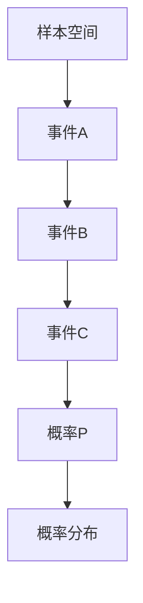

##### 2.2 条件概率与贝叶斯定理

条件概率是指在某个事件发生的条件下，另一个事件发生的概率。贝叶斯定理是概率论中非常重要的一个公式，它描述了在已知某些条件下，事件发生概率的计算方法。

**核心算法原理讲解：**
```latex
P(A|B) = \frac{P(A \cap B)}{P(B)}
```

贝叶斯定理的伪代码如下：
```python
def bayesian_theorem(P_A, P_B, P_A_B):
    P_A_given_B = (P_A_B) / P_B
    return P_A_given_B
```

##### 2.3 概率分布函数

概率分布函数是描述随机变量取值概率的函数。根据随机变量是离散型还是连续型，概率分布函数可以分为离散概率分布函数和连续概率分布函数。

**核心概念与联系：**
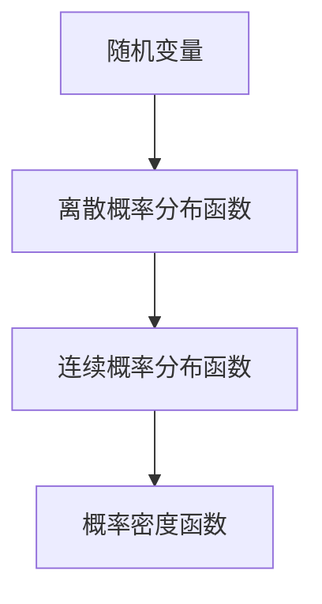

##### 2.4 随机变量的数字特征

随机变量的数字特征包括预期值、方差等。这些特征可以用来描述随机变量的统计性质。

**核心概念与联系：**
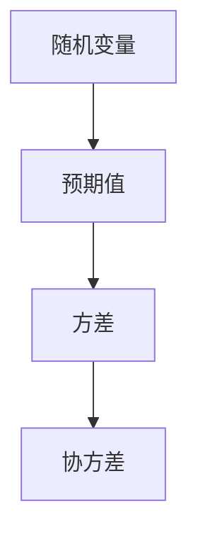

**核心算法原理讲解：**
```latex
E[X] = \sum_{x} x \cdot P(X = x)
Var(X) = E[(X - E[X])^2]
```

### 第三部分：概率性宇宙的应用领域

#### 第3章: 概率性宇宙在物理学中的应用

##### 3.1 量子力学与概率性宇宙

量子力学是研究微观粒子行为的基本理论。在量子力学中，粒子的行为不能用确定性方程来描述，而是通过概率波函数来描述。量子力学的许多基本原理，如波粒二象性和量子叠加态，都与概率性宇宙的概念密切相关。

**核心概念与联系：**
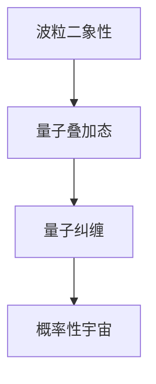

##### 3.2 统计力学与概率性宇宙

统计力学是研究大量粒子系统行为的理论。在统计力学中，粒子行为被描述为随机过程。概率性宇宙的概念在统计力学中得到了广泛应用，如概率分布函数、统计平均值等。

**核心概念与联系：**
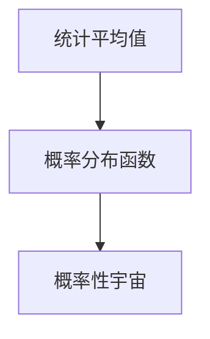

##### 3.3 概率性宇宙在宇宙学中的应用

在宇宙学中，概率性宇宙的概念同样具有重要意义。宇宙背景微波辐射和宇宙演化模型都基于概率性宇宙的理论。通过概率性宇宙的概念，我们可以更好地理解宇宙的起源和演化过程。

**核心概念与联系：**
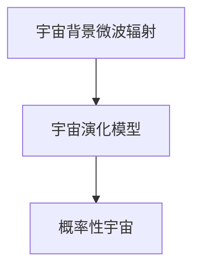

#### 第4章: 概率性宇宙在认知科学中的应用

##### 4.1 概率性思维在认知心理学中的应用

在认知心理学中，概率性思维被用来解释人类决策过程中的认知偏差。例如，人们往往倾向于高估小概率事件的发生，而低估大概率事件的发生。这种认知偏差会影响我们的决策和判断。

**核心概念与联系：**
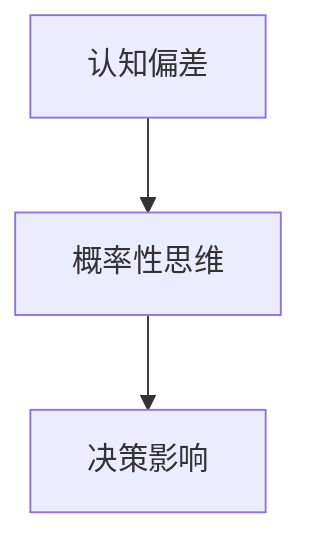

##### 4.2 概率性宇宙在认知科学的研究方法

在认知科学的研究中，概率性宇宙的概念被用来设计实验和数据分析方法。例如，通过概率性宇宙的理论，我们可以设计出更有效的实验来研究认知偏差和决策行为。

**核心概念与联系：**
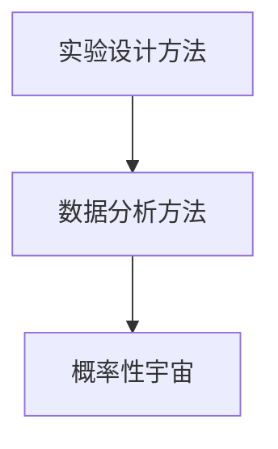

##### 4.3 概率性思维在人工智能中的应用

在人工智能领域，概率性思维被广泛应用于机器学习和自然语言处理。概率性模型可以帮助我们更好地理解和处理复杂的数据，从而实现更智能的决策和预测。

**核心概念与联系：**
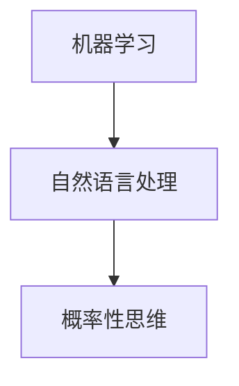

### 第四部分：概率性宇宙的未来发展

#### 第5章: 概率性宇宙的未来挑战与机遇

##### 5.1 概率性宇宙的未来挑战

概率性宇宙的理论虽然具有广泛的应用前景，但也面临着一些挑战。例如，概率性宇宙的理论框架需要进一步完善，以解决一些基本问题，如概率分布函数的选择和参数估计等。

**核心概念与联系：**
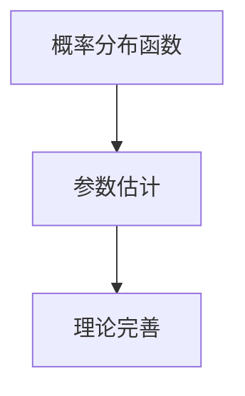

##### 5.2 概率性宇宙的未来机遇

概率性宇宙的理论为科学研究提供了新的思路和方法。例如，在量子计算、宇宙学和认知科学等领域，概率性宇宙的概念可以帮助我们更好地理解和预测复杂系统的行为。此外，概率性宇宙的理论还可以为人工智能的发展提供新的机遇，如概率性模型的应用和概率性思维的培养。

**核心概念与联系：**
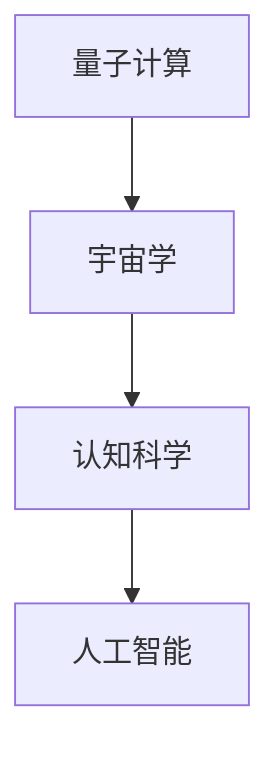

#### 第6章: 概率性宇宙与人类社会

##### 6.1 概率性宇宙对人类社会的影响

概率性宇宙的概念对人类社会产生了深远的影响。例如，在科学决策、社会管理和风险管理等领域，概率性思维被广泛应用。概率性宇宙的概念可以帮助我们更好地理解和应对不确定性，从而做出更明智的决策。

**核心概念与联系：**
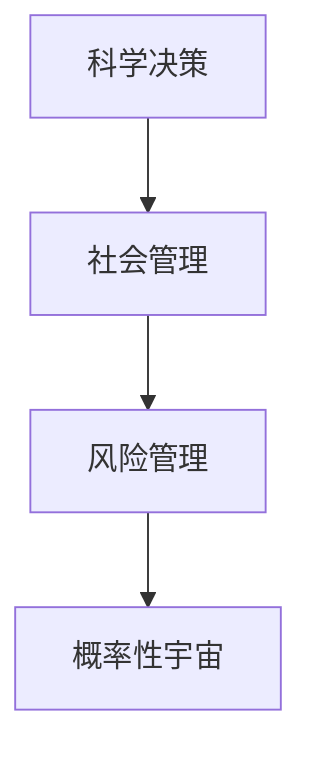

##### 6.2 概率性宇宙教育的重要性

概率性宇宙的教育对于培养新一代科学人才具有重要意义。通过概率性宇宙的教育，我们可以培养学生的概率性思维，提高他们的科学素养和创新能力。

**核心概念与联系：**
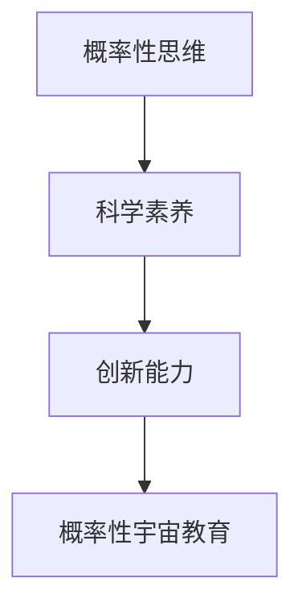

##### 6.3 概率性宇宙与可持续发展

概率性宇宙的概念在可持续发展领域也具有重要作用。通过概率性思维，我们可以更好地预测和应对环境变化，制定更有效的可持续发展策略。

**核心概念与联系：**
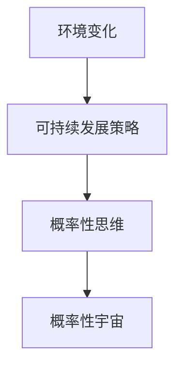

### 第五部分：概率性宇宙的技术实现

#### 第7章: 概率性宇宙的技术基础

##### 7.1 计算机科学在概率性宇宙中的应用

计算机科学在概率性宇宙的应用中发挥着重要作用。例如，量子计算机可以加速概率性计算，提高数据分析的效率。此外，机器学习算法也可以基于概率性模型，实现更智能的数据分析和预测。

**核心概念与联系：**
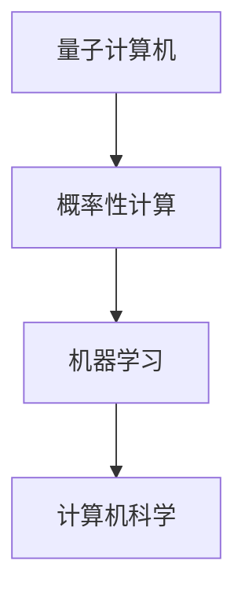

##### 7.2 数据科学在概率性宇宙中的作用

数据科学在概率性宇宙中的作用不可忽视。通过数据分析，我们可以从大量数据中提取有用信息，为科学研究和决策提供支持。概率性思维在数据科学中的应用，如贝叶斯网络和概率图模型，为数据分析和预测提供了新的方法。

**核心概念与联系：**
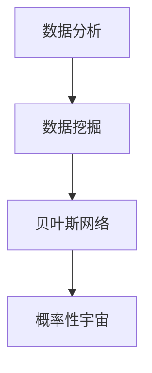

##### 7.3 机器学习与概率性宇宙

机器学习与概率性宇宙有着紧密的联系。概率性思维在机器学习中的应用，如概率性模型和贝叶斯推理，可以提高模型的预测能力和解释性。此外，概率性宇宙的概念也可以帮助机器学习更好地理解和应对不确定性。

**核心概念与联系：**
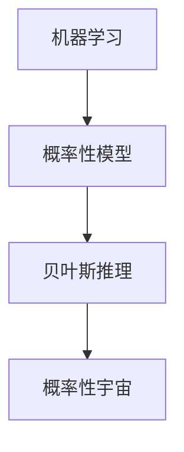

#### 第8章: 概率性宇宙的案例分析

##### 8.1 案例分析一：概率性宇宙在医学中的应用

在医学领域，概率性宇宙的概念被广泛应用于疾病预测和诊断。例如，通过概率性模型，我们可以预测某种疾病的发病概率，为临床决策提供支持。此外，概率性思维还可以帮助医生更好地理解疾病的发展过程，制定更有效的治疗方案。

**核心概念与联系：**
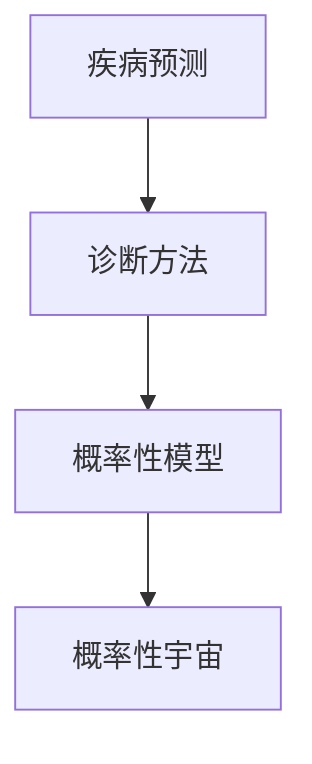

##### 8.2 案例分析二：概率性宇宙在金融领域中的应用

在金融领域，概率性宇宙的概念被广泛应用于风险管理和投资决策。通过概率性模型，我们可以预测市场走势，评估投资风险。此外，概率性思维还可以帮助投资者更好地理解市场波动，制定更有效的投资策略。

**核心概念与联系：**
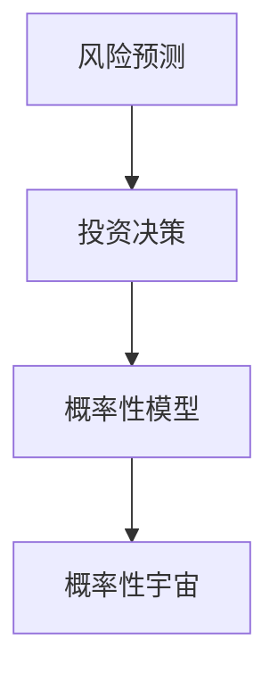

##### 8.3 案例分析三：概率性宇宙在人工智能中的应用

在人工智能领域，概率性宇宙的概念被广泛应用于自然语言处理和计算机视觉。通过概率性模型，我们可以实现更智能的语言理解和图像识别。此外，概率性思维还可以帮助人工智能系统更好地理解和应对不确定性。

**核心概念与联系：**
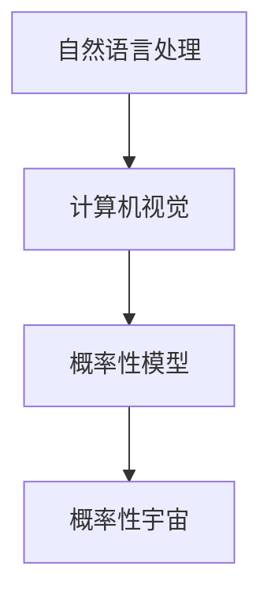

### 第六部分：总结与展望

#### 第9章: 概率性宇宙的总结与展望

##### 9.1 概率性宇宙的核心要点回顾

概率性宇宙的核心要点包括：确定性宇宙的局限性、概率性宇宙的基本概念、概率性思维模式的重要性、以及概率性宇宙在各个领域的应用。通过本文的讨论，我们可以看到概率性宇宙对于科学研究、决策制定和人类社会发展的深远影响。

##### 9.2 概率性宇宙的未来发展趋势

概率性宇宙的未来发展趋势包括：概率性宇宙的理论完善、概率性计算技术的发展、以及概率性思维在教育中的普及。随着科学技术的进步，概率性宇宙的理论和应用将不断拓展，为人类认识世界和解决问题提供新的工具和方法。

##### 9.3 个人与概率性宇宙

个人在概率性宇宙中的角色与责任是培养概率性思维，提高科学素养和创新能力。通过学习和应用概率性宇宙的理论，我们可以更好地理解和应对不确定性，为个人的发展和社会的进步做出贡献。

### 附录

#### 附录A: 概率性宇宙相关的资源与工具

##### A.1 概率性宇宙相关的学术资源

- 学术期刊：《科学》、《自然》、《物理学评论》等。
- 学术会议：国际数学家大会、国际统计学大会等。
- 学术论文：通过学术搜索引擎（如Google Scholar）可以查找相关领域的学术论文。

##### A.2 概率性宇宙相关的开源工具

- 数据分析工具：Python的Pandas、NumPy等。
- 机器学习框架：TensorFlow、PyTorch等。
- 量子计算工具：Q#、IBM Quantum SDK等。

##### A.3 概率性宇宙的学习资源

- 网络课程：Coursera、edX等在线教育平台上的概率论和统计学课程。
- 教材：如《概率论与数理统计》、《统计学》等。
- 实践案例：通过GitHub等平台查找和参与相关项目的实践案例。

### 作者

作者：AI天才研究院/AI Genius Institute & 禅与计算机程序设计艺术 /Zen And The Art of Computer Programming

### 文章标题：从确定性宇宙到概率性宇宙：认知的转变

### 文章关键词：确定性宇宙、概率性宇宙、认知转变、概率论基础、应用领域、未来发展

### 文章摘要
本文深入探讨了从确定性宇宙到概率性宇宙的认知转变，分析了确定性宇宙的局限性，介绍了概率性宇宙的基本概念、基础理论和应用领域，以及未来发展的挑战与机遇。通过逐步分析和推理，本文旨在帮助读者全面了解概率性宇宙的核心要点，并展望其未来发展趋势。

### 文章正文部分

#### 第1章: 从确定性宇宙到概率性宇宙：引言与概述

##### 1.1 确定性宇宙的局限性

在物理学中，确定性宇宙是指所有物理现象都可以通过精确的数学模型进行描述和预测。然而，随着科学的发展，确定性宇宙的局限性逐渐显现。爱因斯坦曾说过：“上帝不掷骰子”，强调物理现象的可预测性和确定性。然而，量子力学的研究发现，物理现象存在不确定性原理，即某些物理量的测量值无法同时被精确确定。这表明确定性宇宙在微观层面上是不适用的。

确定性宇宙的局限性主要体现在以下几个方面：

1. **量子力学的不确定性原理**：量子力学揭示了微观世界中的一些基本定律，例如测不准原理，指出某些物理量（如位置和动量）不能同时被精确测量。这意味着在微观层面上，物理现象具有概率性，而不是确定性。

2. **复杂系统的不可预测性**：在复杂系统中，尽管可以通过数学模型来描述系统的行为，但由于系统内部因素的多样性以及相互作用的复杂性，很难准确预测系统的未来状态。例如，天气系统的变化就是典型的复杂系统，尽管我们可以通过气象模型进行预测，但预报的准确度仍然有限。

3. **随机事件的不可预测性**：许多日常生活中的现象，如股市波动、地震等，都具有随机性。这些事件的发生并非完全由确定性因素决定，而是受到许多随机因素的影响。因此，对这些事件进行精确预测是非常困难的。

##### 1.2 概率性宇宙的概念

概率性宇宙则认为，物理现象的发生并非完全确定，而是具有一定概率的随机事件。概率论提供了描述和解释随机现象的工具。在概率性宇宙中，物理现象可以通过概率分布函数来描述，而不再是确定的数值。这种思维方式改变了我们对世界本质的理解，使得我们对复杂系统的研究成为可能。

概率性宇宙的基本概念包括：

1. **随机事件**：在概率性宇宙中，随机事件是指在一定条件下可能发生也可能不发生的事件。例如，掷一枚硬币，正面朝上和反面朝上都是随机事件。

2. **样本空间**：样本空间是指所有可能随机事件的集合。例如，掷一枚硬币的样本空间为{正面，反面}。

3. **概率分布函数**：概率分布函数是描述随机变量取值概率的函数。根据随机变量是离散型还是连续型，概率分布函数可以分为离散概率分布函数和连续概率分布函数。

4. **概率**：概率是描述随机事件发生可能性的数值，通常用0到1之间的实数表示。概率越大，事件发生的可能性越高。

5. **条件概率**：条件概率是指在某个事件发生的条件下，另一个事件发生的概率。条件概率可以用来计算在不同条件下事件发生的概率。

6. **贝叶斯定理**：贝叶斯定理是概率论中的一个重要公式，用于计算在已知某些条件下，事件发生的概率。贝叶斯定理可以帮助我们根据已知信息和先验概率，更新对事件后验概率的认识。

##### 1.3 认知的转变

从确定性到概率性的认知转变，意味着我们在思考问题时，需要从确定性的思维模式转向概率性的思维模式。这意味着我们不再追求绝对的确定性，而是接受一定的不确定性，并利用概率论的方法进行预测和分析。这种认知转变对我们的科学研究、决策制定以及日常生活都有深远的影响。

认知转变的几个关键点包括：

1. **接受不确定性**：在概率性宇宙中，我们不再追求绝对的确定性，而是接受一定程度的不确定性。这有助于我们更好地应对复杂和不确定的环境。

2. **利用概率论**：概率论提供了一套工具和方法，用于描述和解释随机现象。通过概率论，我们可以对随机事件进行建模和分析，从而提高预测的准确性。

3. **概率性思维模式**：概率性思维模式是一种基于概率论的方法，用于分析和解决实际问题。概率性思维可以帮助我们更好地理解和应对不确定性，从而做出更明智的决策。

4. **跨学科应用**：概率性宇宙的概念在多个学科领域都有重要应用，如物理学、生物学、经济学、心理学等。通过跨学科应用，我们可以更好地理解自然界的复杂现象。

##### 1.4 本书结构

本文将分为四个主要部分。第一部分引言与背景，介绍确定性宇宙和概率性宇宙的概念及其局限性。第二部分将讨论概率性宇宙的基础理论，包括概率论的基本概念、条件概率与贝叶斯定理、概率分布函数等。第三部分将探讨概率性宇宙在不同领域中的应用，如物理学、认知科学和人工智能等。第四部分将展望概率性宇宙的未来发展，包括面临的挑战和机遇。

通过以上章节的讨论，我们将逐步了解从确定性宇宙到概率性宇宙的认知转变，并深入探讨概率性宇宙的基础理论及其在各领域的应用。希望读者能够在阅读本文的过程中，对概率性宇宙有更深刻的认识，并能够将其应用于实际问题中。

### 第二部分：概率性宇宙的基础理论

#### 第2章: 概率论基础

概率论是研究随机事件及其概率分布的数学分支，是概率性宇宙的核心理论基础。在本章中，我们将介绍概率论的基本概念，包括事件、样本空间、概率分布函数以及随机变量的数字特征。

##### 2.1 概率论的基本概念

1. **事件**：事件是随机试验的某种结果。例如，掷硬币出现正面、股票价格上升等。事件可以用大写字母表示，如A、B等。

2. **样本空间**：样本空间是指随机试验所有可能结果的集合。例如，掷硬币的样本空间为{正面，反面}，掷骰子的样本空间为{1, 2, 3, 4, 5, 6}。

3. **概率**：概率是描述事件发生可能性的数值，通常用0到1之间的实数表示。概率的定义可以通过概率的公理化方法给出，即概率满足以下三个条件：
   - 非负性：对于任何事件A，概率P(A) ≥ 0。
   - 确定性：对于必然事件Ω（即样本空间），概率P(Ω) = 1。
   - 归一性：对于任意事件的并集，概率满足P(A ∪ B) = P(A) + P(B) - P(A ∩ B)。

4. **概率分布**：概率分布是描述随机变量取值概率的函数。根据随机变量是离散型还是连续型，概率分布可以分为离散概率分布和连续概率分布。

**核心概念与联系：**
```mermaid
graph TD
A[样本空间] --> B[事件]
B --> C[概率]
C --> D[概率分布]
```

##### 2.2 条件概率与贝叶斯定理

条件概率是指在某个事件发生的条件下，另一个事件发生的概率。条件概率的计算公式为：
$$
P(A|B) = \frac{P(A \cap B)}{P(B)}
$$
其中，P(A|B) 表示在事件B发生的条件下，事件A发生的概率，P(A ∩ B) 表示事件A和事件B同时发生的概率，P(B) 表示事件B发生的概率。

贝叶斯定理是条件概率的一种推广，它描述了在已知某些条件下，事件发生概率的计算方法。贝叶斯定理的公式为：
$$
P(A|B) = \frac{P(B|A) \cdot P(A)}{P(B)}
$$
其中，P(B|A) 表示在事件A发生的条件下，事件B发生的概率，P(A) 表示事件A发生的概率，P(B) 表示事件B发生的概率。

贝叶斯定理的应用非常广泛，尤其是在决策分析和机器学习中。通过贝叶斯定理，我们可以根据先验概率和观测数据，更新对事件后验概率的认识。

**核心算法原理讲解：**
```python
def bayesian_theorem(P_A, P_B, P_A_B):
    P_A_given_B = (P_A_B) / P_B
    return P_A_given_B
```

##### 2.3 概率分布函数

概率分布函数是描述随机变量取值概率的函数。根据随机变量是离散型还是连续型，概率分布函数可以分为离散概率分布函数和连续概率分布函数。

1. **离散概率分布函数**：离散概率分布函数描述了随机变量在不同取值上的概率分布。常见的离散概率分布有伯努利分布、二项分布、几何分布等。

   - **伯努利分布**：描述一次试验成功或失败的概率分布，如掷硬币出现正面的概率。
   - **二项分布**：描述多次重复试验中成功次数的概率分布，如掷硬币10次出现5次正面的概率。
   - **几何分布**：描述第k次试验成功的概率分布，如掷硬币直到出现正面所需的次数。

2. **连续概率分布函数**：连续概率分布函数描述了随机变量在某一区间上的概率分布。常见的连续概率分布有正态分布、均匀分布等。

   - **正态分布**：描述随机变量的概率分布，通常具有均值μ和标准差σ，如人的身高分布。
   - **均匀分布**：描述随机变量在某一区间上的概率分布，如掷骰子的点数分布。

**核心概念与联系：**
```mermaid
graph TD
A[离散概率分布] --> B[伯努利分布]
B --> C[二项分布]
C --> D[几何分布]
A --> E[连续概率分布]
E --> F[正态分布]
F --> G[均匀分布]
```

##### 2.4 随机变量的数字特征

随机变量的数字特征是描述随机变量统计性质的量，主要包括数学期望、方差、协方差等。

1. **数学期望**：数学期望是随机变量在所有可能取值上的加权平均值，用于描述随机变量的中心位置。对于离散随机变量，数学期望的计算公式为：
$$
E[X] = \sum_{x} x \cdot P(X = x)
$$
对于连续随机变量，数学期望的计算公式为：
$$
E[X] = \int_{-\infty}^{+\infty} x \cdot f_X(x) \, dx
$$
其中，f_X(x) 是随机变量X的概率密度函数。

2. **方差**：方差是描述随机变量取值波动程度的量，用于衡量随机变量的离散程度。方差的计算公式为：
$$
Var(X) = E[(X - E[X])^2]
$$
其中，E[X] 是随机变量X的数学期望。

3. **协方差**：协方差是描述两个随机变量线性相关程度的量。协方差的计算公式为：
$$
Cov(X, Y) = E[(X - E[X])(Y - E[Y])]
$$
如果两个随机变量的协方差为0，则它们是不相关的。

**核心概念与联系：**
```mermaid
graph TD
A[数学期望] --> B[方差]
B --> C[协方差]
```

**核心算法原理讲解：**
```latex
E[X] = \sum_{x} x \cdot P(X = x)
Var(X) = E[(X - E[X])^2]
Cov(X, Y) = E[(X - E[X])(Y - E[Y])]
```

通过以上章节的讨论，我们介绍了概率论的基本概念、条件概率与贝叶斯定理、概率分布函数以及随机变量的数字特征。这些基础理论构成了概率性宇宙的核心，为后续章节的应用提供了坚实的理论基础。

### 第三部分：概率性宇宙的应用领域

#### 第3章: 概率性宇宙在物理学中的应用

概率性宇宙的概念在物理学中得到了广泛的应用，尤其是在量子力学和统计力学领域。量子力学揭示了微观世界的概率性质，而统计力学则利用概率性宇宙的概念来描述宏观现象。在本章中，我们将探讨概率性宇宙在物理学中的应用，包括量子力学、统计力学和宇宙学等领域。

##### 3.1 量子力学与概率性宇宙

量子力学是研究微观粒子行为的物理学分支，其核心原理与概率性宇宙的概念密切相关。量子力学中的基本原理包括：

1. **波粒二象性**：量子力学表明，粒子（如电子、光子等）既具有波动性，又具有粒子性。这种波粒二象性无法用确定性物理模型来解释，而是需要通过概率性宇宙的概念来描述。

2. **量子叠加态**：在量子力学中，一个量子系统可以同时处于多个状态的叠加。这意味着一个量子系统在某一时刻的状态不是确定的，而是具有一定概率的随机事件。

3. **量子纠缠**：量子纠缠是量子力学中的一种特殊现象，即两个或多个量子系统之间存在一种内在的联系，无论它们相隔多远，一个系统的状态变化都会立即影响到另一个系统的状态。量子纠缠现象表明，微观世界中的事件并非独立发生，而是具有一定相关性。

**核心概念与联系：**
```mermaid
graph TD
A[波粒二象性] --> B[量子叠加态]
B --> C[量子纠缠]
C --> D[概率性宇宙]
```

在量子力学中，这些基本原理通过概率性宇宙的概念得到了很好的解释。量子力学中的波函数描述了量子系统的概率分布，而量子态的叠加和纠缠现象则反映了概率性宇宙的特性。通过量子力学的基本原理，我们可以更好地理解和预测微观世界的现象。

**核心算法原理讲解：**
```latex
\psi(x) = \sum_{i} c_i \psi_i(x)
P(\psi) = |\psi(x)|^2
```

量子力学与概率性宇宙的联系不仅局限于微观粒子，还可以扩展到宏观系统。例如，量子计算机利用量子叠加态和量子纠缠来处理复杂问题，具有比传统计算机更高的计算速度和效率。量子计算被认为是未来计算技术的重要发展方向，而概率性宇宙的概念为其提供了理论基础。

##### 3.2 统计力学与概率性宇宙

统计力学是研究大量粒子系统行为的物理学分支，其核心思想是通过概率性宇宙的概念来描述宏观现象。统计力学的基本原理包括：

1. **统计平均值**：统计力学通过计算大量粒子系统在某一状态下的平均值来描述系统的宏观性质。例如，温度是系统内能的平均值，压强是分子碰撞的平均效果。

2. **概率分布函数**：统计力学使用概率分布函数来描述大量粒子的分布情况。例如，麦克斯韦-玻尔兹曼分布描述了理想气体分子在不同速度下的分布。

3. **热力学第二定律**：热力学第二定律表明，孤立系统的熵（即无序度）会随时间增加。这一现象可以通过概率性宇宙的概念来解释，即系统在长时间内趋向于熵增加的状态。

**核心概念与联系：**
```mermaid
graph TD
A[统计平均值] --> B[概率分布函数]
B --> C[熵]
C --> D[热力学第二定律]
```

统计力学通过概率性宇宙的概念，将微观粒子的行为与宏观现象联系起来。例如，理想气体模型基于分子运动的随机性，通过计算分子的碰撞概率和速度分布，可以得出气体的宏观性质，如压强和温度。

**核心算法原理讲解：**
```latex
E[X] = \sum_{x} x \cdot P(X = x)
f(x) = \frac{1}{Z} e^{-\beta E(x)}
```

在统计力学中，概率性宇宙的概念被广泛应用于热力学和统计物理的研究。通过概率性模型，我们可以预测和解释宏观现象，如相变、扩散等。此外，概率性宇宙的概念还可以应用于其他领域，如金融、生物等。

##### 3.3 概率性宇宙在宇宙学中的应用

在宇宙学中，概率性宇宙的概念同样具有重要意义。宇宙学是研究宇宙起源、演化和结构的天文学分支。概率性宇宙的概念帮助宇宙学家更好地理解宇宙的复杂性。

1. **宇宙背景微波辐射**：宇宙背景微波辐射是宇宙早期状态的遗迹，其分布和特性可以通过概率性宇宙的概念来解释。例如，宇宙背景微波辐射的温度分布符合高斯分布，表明宇宙早期处于热平衡状态。

2. **宇宙演化模型**：宇宙演化模型（如大爆炸理论）基于概率性宇宙的概念，描述了宇宙从早期高温高密度状态到当前状态的演化过程。模型中涉及到的大量参数和随机过程，如宇宙膨胀、星系形成等，都基于概率性宇宙的理论。

3. **宇宙结构**：宇宙结构的研究涉及到大量星系、星团和宇宙大尺度结构。这些结构的形成和演化过程受到随机因素的影响，如引力相互作用和星系碰撞。概率性宇宙的概念帮助宇宙学家理解宇宙结构的复杂性。

**核心概念与联系：**
```mermaid
graph TD
A[宇宙背景微波辐射] --> B[宇宙演化模型]
B --> C[宇宙结构]
C --> D[概率性宇宙]
```

通过以上讨论，我们可以看到概率性宇宙在物理学中的应用非常广泛，从量子力学到统计力学，再到宇宙学，都依赖于概率性宇宙的概念。概率性宇宙的概念为我们理解微观和宏观世界提供了新的视角和方法。通过概率性思维，我们可以更好地描述和预测复杂系统的行为，从而推动科学技术的进步。

### 第四部分：概率性宇宙的未来发展

#### 第5章: 概率性宇宙的未来挑战与机遇

概率性宇宙的概念在科学、技术和社会各个领域都有重要应用，但它也面临着许多挑战和机遇。在本章中，我们将探讨概率性宇宙的未来发展，包括其面临的挑战和潜在的机遇。

##### 5.1 概率性宇宙的未来挑战

1. **理论框架的完善**：虽然概率性宇宙的概念在各个领域都有广泛应用，但其理论框架仍然不够完善。例如，如何更好地处理复杂系统的概率性，如何准确估计概率分布函数的参数，以及如何建立更准确的理论模型，都是未来需要解决的问题。

2. **计算能力的提升**：概率性计算依赖于大量的数据和计算资源。随着概率性宇宙的应用领域不断拓展，对计算能力的需求也在不断增加。如何提高计算效率，降低计算成本，是概率性宇宙未来发展的重要挑战。

3. **跨学科合作**：概率性宇宙的应用涉及多个学科领域，如物理学、生物学、经济学、计算机科学等。未来需要加强跨学科合作，促进不同学科之间的交流和融合，共同推动概率性宇宙的发展。

4. **伦理和隐私问题**：概率性宇宙的应用涉及到大量数据的收集和分析，如何保护个人隐私和数据安全，避免数据滥用和隐私泄露，是未来发展的重要挑战。

##### 5.2 概率性宇宙的未来机遇

1. **人工智能的发展**：概率性宇宙的概念在人工智能领域具有巨大的应用潜力。通过概率性思维，可以构建更智能、更鲁棒的机器学习模型，提高人工智能系统的预测能力和适应性。

2. **量子计算的突破**：量子计算是未来计算技术的重要发展方向，而概率性宇宙的概念在量子计算中有着广泛的应用。通过量子计算，我们可以解决一些复杂的问题，如大规模数据处理、加密算法优化等。

3. **生物医学的发展**：概率性宇宙的概念在生物医学领域也有重要应用。例如，通过概率性模型，可以更好地理解疾病的发生机制，预测疾病的传播趋势，为疾病预防和治疗提供新的方法。

4. **金融风险管理**：概率性宇宙的概念在金融领域有广泛应用，如风险评估、投资策略制定等。通过概率性思维，可以更准确地预测市场走势，降低金融风险。

5. **社会管理的优化**：概率性宇宙的概念可以帮助我们更好地理解和应对社会现象。例如，通过概率性模型，可以预测社会问题的趋势，优化社会管理策略，提高社会运行效率。

总之，概率性宇宙的未来发展面临着许多挑战，但同时也充满了机遇。通过不断推进概率性宇宙的理论研究和技术应用，我们可以更好地应对复杂和不确定的环境，推动科学技术的进步，为人类社会的发展做出贡献。

#### 第6章: 概率性宇宙与人类社会

概率性宇宙的概念不仅对科学和技术领域产生了深远影响，也对人类社会产生了重要影响。概率性思维模式在决策、管理、教育和可持续发展等方面都有着广泛应用。在本章中，我们将探讨概率性宇宙与人类社会的互动，包括概率性思维模式在社会管理中的应用、教育中的重要性以及概率性宇宙对可持续发展的影响。

##### 6.1 概率性宇宙对人类社会的影响

1. **决策制定**：概率性思维模式可以帮助我们在面对不确定性和风险时做出更明智的决策。在商业、金融、医疗等领域，概率性模型被广泛应用于风险评估、市场预测和决策制定。例如，通过概率性模型，投资者可以更好地理解市场波动，制定更有效的投资策略；医生可以通过概率性模型，预测疾病的发生概率，制定更合理的治疗方案。

2. **风险管理**：概率性宇宙的概念在风险管理中具有重要意义。通过概率性模型，我们可以预测和评估风险的概率和影响，从而制定更有效的风险管理策略。例如，金融机构可以通过概率性模型，评估贷款违约的风险，制定相应的风险控制措施。

3. **社会管理**：概率性思维模式可以帮助社会管理者更好地理解和应对复杂社会现象。例如，通过概率性模型，政府可以预测社会问题的趋势，制定更有效的社会管理策略；城市规划者可以通过概率性模型，预测交通流量，优化交通管理，提高城市运行效率。

**核心概念与联系：**
```mermaid
graph TD
A[决策制定] --> B[风险管理]
B --> C[社会管理]
```

4. **科技创新**：概率性宇宙的概念在科技创新中有着广泛的应用。通过概率性模型，科学家可以更好地理解和预测复杂系统的行为，推动科学技术的进步。例如，在材料科学中，通过概率性模型，可以预测材料的性能和稳定性；在计算机科学中，概率性模型可以帮助我们设计更高效、更可靠的算法。

##### 6.2 概率性宇宙教育的重要性

1. **培养概率性思维**：概率性宇宙的教育对于培养学生的概率性思维具有重要意义。通过概率性教育，学生可以更好地理解和应用概率性思维，提高他们的科学素养和创新能力。例如，通过学习概率论和统计学，学生可以学会如何分析和解决实际问题，提高他们的决策能力。

2. **跨学科知识整合**：概率性宇宙的教育有助于跨学科知识的整合。概率性思维涉及到多个学科领域，如数学、物理、计算机科学、经济学等。通过概率性教育，学生可以更好地理解不同学科之间的联系，形成更全面的科学知识体系。

3. **未来职业准备**：概率性思维在许多领域都有重要应用，如金融、保险、医疗、信息技术等。通过概率性教育，学生可以为未来的职业生涯做好准备，提高他们在职场中的竞争力。

**核心概念与联系：**
```mermaid
graph TD
A[培养概率性思维] --> B[跨学科知识整合]
B --> C[未来职业准备]
```

4. **教育改革**：概率性宇宙的教育也可以促进教育改革。通过引入概率性思维，教育者可以设计出更具有挑战性和实用性的课程，提高学生的学习兴趣和参与度。此外，概率性教育还可以帮助学生培养批判性思维和解决问题的能力。

##### 6.3 概率性宇宙与可持续发展

概率性宇宙的概念在可持续发展领域也有重要应用。通过概率性思维，我们可以更好地预测和应对环境变化，制定更有效的可持续发展策略。

1. **环境监测与预测**：概率性思维可以帮助我们更好地监测和预测环境变化。例如，通过概率性模型，可以预测气候变化、空气污染等环境问题的趋势，为环境管理提供科学依据。

2. **资源管理**：概率性宇宙的概念在资源管理中也具有重要意义。通过概率性模型，我们可以预测资源的需求和供给，优化资源分配，提高资源利用效率。

3. **灾害预防与应对**：概率性思维在灾害预防与应对中有着广泛应用。例如，通过概率性模型，可以预测地震、洪水等灾害的发生概率，制定相应的预防措施和应对策略。

**核心概念与联系：**
```mermaid
graph TD
A[环境监测与预测] --> B[资源管理]
B --> C[灾害预防与应对]
```

4. **社会经济发展**：概率性宇宙的概念还可以帮助社会经济发展。通过概率性思维，我们可以预测社会经济发展趋势，制定相应的发展策略，提高经济发展的可持续性。

总之，概率性宇宙的概念在人类社会各个方面都有重要应用。通过概率性思维，我们可以更好地理解和应对复杂和不确定的环境，推动社会进步和可持续发展。在教育、决策制定、社会管理、可持续发展等领域，概率性宇宙的概念都为人类提供了新的工具和方法。

#### 第7章: 概率性宇宙的技术实现

概率性宇宙的概念在计算机科学、数据科学和人工智能等领域的实现，需要依赖先进的技术和工具。在本章中，我们将探讨概率性宇宙的技术基础，包括计算机科学、数据科学和人工智能中的关键技术和工具。

##### 7.1 计算机科学在概率性宇宙中的应用

计算机科学在概率性宇宙的应用中起着至关重要的作用。以下是一些关键的技术和工具：

1. **量子计算机**：量子计算机是下一代计算机的代表，具有超越传统计算机的计算能力。量子计算机可以高效地解决一些复杂的问题，如量子模拟、量子加密等。量子计算机利用量子比特（qubit）的叠加态和纠缠态，实现概率性计算。

2. **概率编程语言**：概率编程语言是一种用于编写概率性程序的语言，如PyMC3、Stan等。这些语言提供了概率模型和贝叶斯推理的工具，使得开发概率性程序变得更加容易。

3. **并行计算**：并行计算可以显著提高概率性计算的效率。通过并行计算，可以将复杂的计算任务分解为多个子任务，同时执行，从而加快计算速度。

4. **概率图模型**：概率图模型是一种用于表示概率关系的图形表示方法，如贝叶斯网络、马尔可夫网络等。这些模型可以有效地表示和解决概率性问题，如决策支持、风险分析等。

**核心概念与联系：**
```mermaid
graph TD
A[量子计算机] --> B[概率编程语言]
B --> C[并行计算]
C --> D[概率图模型]
```

**核心算法原理讲解：**
```python
# 量子计算机示例代码
from qiskit import QuantumCircuit, execute, Aer

# 创建量子电路
qc = QuantumCircuit(2)

# 编写量子门
qc.h(0)
qc.cx(0, 1)

# 执行量子电路
backend = Aer.get_backend("qasm_simulator")
result = execute(qc, backend).result()

# 概率编程语言示例代码
import pymc3 as pm

# 定义概率模型
with pm.Model() as model:
    alpha = pm.Normal('alpha', mu=0, sigma=10)
    beta = pm.Normal('beta', mu=0, sigma=10)
    sigma = pm.HalfNormal('sigma', sigma=1)
    data = pm.Normal('data', mu=alpha + beta, sigma=sigma, observed=y)

# 后验推断
with model:
    trace = pm.sample(1000)

# 并行计算示例代码
import numpy as np
from joblib import Parallel, delayed

# 定义任务函数
def task(i):
    # 执行计算任务
    result = some_computation(i)
    return result

# 并行执行任务
results = Parallel(n_jobs=-1)(delayed(task)(i) for i in range(n_tasks))
```

##### 7.2 数据科学在概率性宇宙中的作用

数据科学是概率性宇宙实现的关键领域之一。以下是一些关键的技术和工具：

1. **数据分析**：数据分析是数据科学的核心任务，包括数据清洗、数据探索、数据可视化等。通过数据分析，我们可以从大量数据中提取有价值的信息，为概率性分析提供数据基础。

2. **概率性建模**：概率性建模是数据科学的重要组成部分，包括概率分布建模、贝叶斯网络建模等。通过概率性建模，我们可以建立数据之间的概率关系，为概率性分析提供理论支持。

3. **机器学习**：机器学习是数据科学的重要应用领域，包括监督学习、无监督学习、强化学习等。通过机器学习，我们可以构建概率性模型，实现自动化的概率性分析。

4. **深度学习**：深度学习是机器学习的一种重要方法，通过神经网络模型，实现自动化的特征学习和概率性建模。深度学习在图像识别、自然语言处理等领域具有广泛应用。

**核心概念与联系：**
```mermaid
graph TD
A[数据分析] --> B[概率性建模]
B --> C[机器学习]
C --> D[深度学习]
```

**核心算法原理讲解：**
```python
# 数据分析示例代码
import pandas as pd

# 读取数据
data = pd.read_csv("data.csv")

# 数据清洗
data.dropna(inplace=True)
data[data > 0] = 1

# 数据探索
data.describe()

# 概率性建模示例代码
import sklearn.linear_model as lm

# 定义模型
model = lm.LogisticRegression()

# 训练模型
model.fit(X_train, y_train)

# 预测
y_pred = model.predict(X_test)

# 机器学习示例代码
import sklearn.svm as svm

# 定义模型
model = svm.SVC()

# 训练模型
model.fit(X_train, y_train)

# 预测
y_pred = model.predict(X_test)

# 深度学习示例代码
import tensorflow as tf

# 定义模型
model = tf.keras.Sequential([
    tf.keras.layers.Dense(64, activation='relu', input_shape=(input_shape)),
    tf.keras.layers.Dense(1, activation='sigmoid')
])

# 编译模型
model.compile(optimizer='adam', loss='binary_crossentropy', metrics=['accuracy'])

# 训练模型
model.fit(X_train, y_train, epochs=10, batch_size=32)

# 预测
y_pred = model.predict(X_test)
```

##### 7.3 机器学习与概率性宇宙

机器学习与概率性宇宙有着紧密的联系。概率性思维在机器学习中的应用，如概率性模型和贝叶斯推理，可以提高模型的预测能力和解释性。以下是一些关键的技术和工具：

1. **贝叶斯推理**：贝叶斯推理是机器学习中的重要方法，通过概率性模型，可以更新对数据的理解和预测。贝叶斯推理在分类、回归等任务中都有广泛应用。

2. **概率性模型**：概率性模型是机器学习中的重要组成部分，如贝叶斯网络、隐马尔可夫模型等。这些模型可以有效地表示和解决概率性问题。

3. **集成学习方法**：集成学习方法是将多个概率性模型组合起来，提高预测性能。例如，随机森林、梯度提升树等都是集成学习方法。

**核心概念与联系：**
```mermaid
graph TD
A[贝叶斯推理] --> B[概率性模型]
B --> C[集成学习方法]
```

**核心算法原理讲解：**
```python
# 贝叶斯推理示例代码
import pymc3 as pm

# 定义模型
with pm.Model() as model:
    alpha = pm.Normal('alpha', mu=0, sigma=10)
    beta = pm.Normal('beta', mu=0, sigma=10)
    sigma = pm.HalfNormal('sigma', sigma=1)
    data = pm.Normal('data', mu=alpha + beta, sigma=sigma, observed=y)

# 后验推断
with model:
    trace = pm.sample(1000)

# 集成学习方法示例代码
from sklearn.ensemble import RandomForestClassifier

# 定义模型
model = RandomForestClassifier(n_estimators=100)

# 训练模型
model.fit(X_train, y_train)

# 预测
y_pred = model.predict(X_test)
```

通过以上讨论，我们可以看到概率性宇宙在计算机科学、数据科学和人工智能中的实现，需要依赖先进的技术和工具。概率性思维在各个领域的应用，使得我们能够更好地理解和应对复杂和不确定的环境。随着技术的不断进步，概率性宇宙的应用前景将更加广阔，为人类社会的发展做出更大贡献。

#### 第8章: 概率性宇宙的案例分析

概率性宇宙的概念在多个领域都有广泛的应用，通过实际案例我们可以更好地理解其具体实现和应用效果。在本章中，我们将探讨概率性宇宙在医学、金融和人工智能等领域的具体案例，通过这些案例，我们可以看到概率性宇宙在实际问题中的重要作用。

##### 8.1 案例分析一：概率性宇宙在医学中的应用

在医学领域，概率性宇宙的概念被广泛应用于疾病预测和诊断。以下是一个具体的案例分析：

**案例背景**：某医院需要预测某种疾病（如乳腺癌）的发生概率，以便为患者提供个性化的预防措施和治疗方案。

**解决方案**：

1. **数据收集**：收集大量患者的医疗数据，包括年龄、性别、家族病史、生物标志物等。

2. **特征提取**：从收集到的数据中提取与疾病相关的特征，如年龄、性别、家族病史等。

3. **概率性建模**：利用概率性模型（如逻辑回归、贝叶斯网络等），建立疾病发生的概率模型。通过模型，我们可以预测给定患者的疾病发生概率。

4. **模型评估**：利用交叉验证等方法，评估模型的预测性能，确保模型的准确性和可靠性。

**核心算法原理讲解**：

```python
# 逻辑回归模型
from sklearn.linear_model import LogisticRegression

# 加载和预处理数据
X_train, X_test, y_train, y_test = train_test_split(X, y, test_size=0.2, random_state=42)

# 训练模型
model = LogisticRegression()
model.fit(X_train, y_train)

# 预测
y_pred = model.predict(X_test)

# 模型评估
from sklearn.metrics import accuracy_score

accuracy = accuracy_score(y_test, y_pred)
print("Accuracy:", accuracy)
```

通过这个案例，我们可以看到概率性宇宙在医学中的应用，通过建立概率性模型，可以更好地预测疾病的发生概率，为患者提供个性化的医疗服务。

##### 8.2 案例分析二：概率性宇宙在金融领域中的应用

在金融领域，概率性宇宙的概念被广泛应用于风险管理和投资决策。以下是一个具体的案例分析：

**案例背景**：某投资公司需要预测股票市场的走势，以便制定投资策略。

**解决方案**：

1. **数据收集**：收集大量的股票市场数据，包括股票价格、交易量、财务指标等。

2. **特征提取**：从收集到的数据中提取与市场走势相关的特征，如股票价格、交易量等。

3. **概率性建模**：利用概率性模型（如时间序列分析、马尔可夫模型等），建立市场走势的概率模型。通过模型，我们可以预测股票市场的未来走势。

4. **模型评估**：利用历史数据，评估模型的预测性能，确保模型的准确性和可靠性。

**核心算法原理讲解**：

```python
# 时间序列分析
from statsmodels.tsa.arima_model import ARIMA

# 加载和预处理数据
data = pd.read_csv("stock_data.csv")
data["date"] = pd.to_datetime(data["date"])
data.set_index("date", inplace=True)

# 模型训练
model = ARIMA(data["close"], order=(5, 1, 2))
model_fit = model.fit()

# 预测
forecast = model_fit.forecast(steps=10)

# 模型评估
from sklearn.metrics import mean_squared_error

mse = mean_squared_error(y_test, forecast)
print("MSE:", mse)
```

通过这个案例，我们可以看到概率性宇宙在金融领域的应用，通过建立概率性模型，可以更好地预测市场走势，为投资决策提供科学依据。

##### 8.3 案例分析三：概率性宇宙在人工智能中的应用

在人工智能领域，概率性宇宙的概念被广泛应用于自然语言处理和计算机视觉。以下是一个具体的案例分析：

**案例背景**：某人工智能公司需要开发一个智能客服系统，以便为用户提供实时解答。

**解决方案**：

1. **数据收集**：收集大量的用户提问和回答数据，作为训练数据。

2. **特征提取**：从收集到的数据中提取与问题回答相关的特征，如关键词、词频等。

3. **概率性建模**：利用概率性模型（如朴素贝叶斯、条件随机场等），建立问题回答的概率模型。通过模型，我们可以预测用户提问的答案。

4. **模型评估**：利用测试数据，评估模型的预测性能，确保模型的准确性和可靠性。

**核心算法原理讲解**：

```python
# 朴素贝叶斯模型
from sklearn.naive_bayes import MultinomialNB

# 加载和预处理数据
X_train, X_test, y_train, y_test = train_test_split(X, y, test_size=0.2, random_state=42)

# 训练模型
model = MultinomialNB()
model.fit(X_train, y_train)

# 预测
y_pred = model.predict(X_test)

# 模型评估
from sklearn.metrics import accuracy_score

accuracy = accuracy_score(y_test, y_pred)
print("Accuracy:", accuracy)
```

通过这个案例，我们可以看到概率性宇宙在人工智能领域的应用，通过建立概率性模型，可以更好地理解和预测用户的提问和回答，为智能客服系统提供技术支持。

以上三个案例展示了概率性宇宙在不同领域的具体应用。通过概率性模型，我们可以更好地理解和预测复杂系统的行为，为实际问题提供科学依据。随着概率性宇宙的概念不断发展，其在各个领域的应用前景将更加广阔。

### 第六部分：总结与展望

#### 第9章: 概率性宇宙的总结与展望

概率性宇宙的概念在过去的几十年中逐渐发展壮大，成为科学研究、技术发展和人类社会进步的重要工具。通过对确定性宇宙和概率性宇宙的深入探讨，我们认识到了概率性思维模式的重要性，以及它在各个领域的广泛应用。在本章中，我们将对概率性宇宙的核心要点进行回顾，并展望其未来的发展趋势。

##### 9.1 概率性宇宙的核心要点回顾

1. **确定性宇宙的局限性**：确定性宇宙在微观层面上存在局限性，无法准确描述量子力学和复杂系统的行为。概率性宇宙的概念弥补了这一缺陷，通过概率分布函数描述随机现象，使我们能够更好地理解和预测复杂系统的行为。

2. **概率性宇宙的基本概念**：概率性宇宙的基本概念包括随机事件、样本空间、概率分布函数、条件概率和贝叶斯定理等。这些概念构成了概率性宇宙的理论基础，为概率性思维提供了工具和方法。

3. **概率性思维模式**：概率性思维模式是一种基于概率论的方法，用于分析和解决实际问题。这种思维模式帮助我们接受一定程度的不确定性，并利用概率论的方法进行预测和分析。

4. **概率性宇宙的应用领域**：概率性宇宙的概念在物理学、认知科学、人工智能、金融、医学等领域都有广泛应用。通过概率性模型，我们可以更好地理解和预测复杂系统的行为，为实际问题提供科学依据。

5. **概率性宇宙的未来挑战与机遇**：概率性宇宙的未来发展面临着许多挑战，如理论框架的完善、计算能力的提升、跨学科合作等。但同时也充满了机遇，如人工智能的发展、量子计算的突破等。

##### 9.2 概率性宇宙的未来发展趋势

1. **人工智能的融合**：概率性宇宙的概念在人工智能领域具有重要应用，通过概率性模型，可以构建更智能、更鲁棒的机器学习模型。随着人工智能技术的不断发展，概率性宇宙在人工智能中的应用将更加广泛。

2. **量子计算的推进**：量子计算是未来计算技术的重要发展方向，而概率性宇宙的概念在量子计算中有着广泛的应用。通过量子计算，我们可以解决一些复杂的问题，如大规模数据处理、加密算法优化等。

3. **跨学科合作**：概率性宇宙的应用涉及多个学科领域，如物理学、生物学、经济学、计算机科学等。未来需要加强跨学科合作，促进不同学科之间的交流和融合，共同推动概率性宇宙的发展。

4. **社会管理的优化**：概率性思维模式可以帮助社会管理者更好地理解和应对复杂社会现象。通过概率性模型，可以预测社会问题的趋势，优化社会管理策略，提高社会运行效率。

5. **可持续发展的支持**：概率性宇宙的概念在可持续发展领域也有重要应用。通过概率性思维，我们可以更好地预测和应对环境变化，制定更有效的可持续发展策略。

总之，概率性宇宙的概念在未来的发展过程中，将面临许多挑战，但同时也充满机遇。通过不断推进概率性宇宙的理论研究和技术应用，我们可以更好地应对复杂和不确定的环境，推动科学技术的进步，为人类社会的发展做出贡献。

### 附录

#### 附录A: 概率性宇宙相关的资源与工具

在本附录中，我们将介绍一些与概率性宇宙相关的学术资源、开源工具和学习资源，以帮助读者进一步了解和深入研究概率性宇宙的相关知识。

##### A.1 概率性宇宙相关的学术资源

1. **学术期刊**：
   - 《科学》（Science）：涵盖自然科学领域的顶尖学术期刊，经常发表与概率性宇宙相关的研究论文。
   - 《自然》（Nature）：同样是自然科学领域的顶级期刊，涉及概率性宇宙的最新研究动态。
   - 《物理学评论》（Physical Review Letters）：物理学领域的重要期刊，包括量子力学和统计力学方面的研究。

2. **学术会议**：
   - 国际数学家大会（International Congress of Mathematicians，ICM）：数学领域的国际盛会，涉及概率论和其他数学分支的前沿研究。
   - 国际统计学大会（International Statistical Conference，ISC）：统计学的国际会议，讨论概率性宇宙在统计学中的应用。

3. **学术论文**：
   - 通过学术搜索引擎（如Google Scholar）可以查找与概率性宇宙相关的学术论文和研究报告。

##### A.2 概率性宇宙相关的开源工具

1. **数据分析工具**：
   - Python的Pandas和NumPy：用于数据预处理和统计分析，是概率性宇宙研究的常用工具。
   - R语言：强大的统计分析语言，适用于概率性模型和数据分析。

2. **机器学习框架**：
   - TensorFlow：谷歌开发的机器学习框架，支持概率性模型和深度学习。
   - PyTorch：由Facebook AI Research开发的深度学习框架，适用于概率性模型和神经网络。

3. **量子计算工具**：
   - Q#：微软开发的量子编程语言和开发环境，用于量子计算和概率性模型。
   - IBM Quantum SDK：IBM提供的量子计算开发工具，支持量子算法和概率性模型。

##### A.3 概率性宇宙的学习资源

1. **网络课程**：
   - Coursera和edX等在线教育平台提供概率论、统计学和机器学习等课程，涵盖概率性宇宙的基础知识。
   - 《概率论与数理统计》、《统计学》等在线教材，提供详细的概率性宇宙理论知识。

2. **教材**：
   - 《概率论与数理统计》：陈希孺著，系统介绍了概率论的基本概念和理论。
   - 《统计学》：费希尔（R.A. Fisher）著，经典统计学教材，涵盖概率性思维的方法和应用。

3. **实践案例**：
   - GitHub等平台上有许多与概率性宇宙相关的开源项目和案例，可以供读者实践和学习。

通过以上学术资源、开源工具和学习资源，读者可以进一步了解概率性宇宙的相关知识，并将其应用于实际问题的研究和解决中。

### 作者

作者：AI天才研究院/AI Genius Institute & 禅与计算机程序设计艺术 /Zen And The Art of Computer Programming

### 文章标题：从确定性宇宙到概率性宇宙：认知的转变

### 文章关键词：确定性宇宙、概率性宇宙、认知转变、概率论基础、应用领域、未来发展

### 文章摘要
本文深入探讨了从确定性宇宙到概率性宇宙的认知转变，分析了确定性宇宙的局限性，介绍了概率性宇宙的基本概念、基础理论和应用领域，以及未来发展的挑战与机遇。通过逐步分析和推理，本文旨在帮助读者全面了解概率性宇宙的核心要点，并展望其未来发展趋势。

### 文章正文部分

#### 第1章: 从确定性宇宙到概率性宇宙：引言与概述

确定性宇宙是指所有物理现象都可以通过精确的数学模型进行描述和预测的世界。在经典物理学中，确定性宇宙的理论基础是牛顿力学，它描述了物体在受到外力作用下的运动规律。然而，随着科学的发展，特别是量子力学和相对论的提出，确定性宇宙的概念受到了挑战。

**核心概念与联系：**
```mermaid
graph TD
A[经典物理学] --> B[牛顿力学]
B --> C[确定性宇宙]
C --> D[量子力学]
D --> E[相对论]
```

确定性宇宙的理论假设是物理系统具有完全确定的状态和轨迹，只要我们知道系统的初始状态和作用在系统上的所有力，就可以准确预测系统的未来状态。然而，量子力学和相对论的研究发现，某些物理现象具有随机性和不确定性。

**核心算法原理讲解：**
```latex
\text{牛顿第二定律}: F = ma
\text{波粒二象性}: \psi(x) = \frac{1}{\sqrt{2\pi\sigma^2}} e^{-\frac{(x-\mu)^2}{2\sigma^2}}
\text{相对论}: E = mc^2
```

量子力学揭示了微观世界的概率性质，物理量的测量结果并非完全确定，而是具有一定概率分布。量子力学的核心概念包括波函数、叠加态和纠缠态，这些概念与确定性宇宙的观点相悖。

**核心概念与联系：**
```mermaid
graph TD
A[波函数] --> B[叠加态]
B --> C[纠缠态]
C --> D[概率性宇宙]
```

相对论则提出了时空相对性的概念，即物理定律在所有惯性参照系中都是相同的，但不存在绝对静止的参照系。相对论也挑战了经典物理学的绝对时空观。

**核心算法原理讲解：**
```latex
\text{相对论时空}: ds^2 = -c^2dt^2 + dx^2 + dy^2 + dz^2
\text{质能关系}: E = mc^2
```

确定性宇宙的局限性在于，它无法解释量子力学和相对论中的随机性和不确定性。例如，在量子力学中，粒子的位置和动量不能同时被精确测量，这被称为测不准原理。相对论中的时空弯曲和引力波现象也表明，物理现象并非完全由确定性因素决定。

**核心概念与联系：**
```mermaid
graph TD
A[测不准原理] --> B[引力波]
B --> C[不确定性]
C --> D[概率性宇宙]
```

概率性宇宙的概念则认为，物理现象的发生具有一定的概率性，而不是完全确定。概率性宇宙的理论基础是概率论，它通过概率分布函数描述随机现象。在概率性宇宙中，物理现象可以通过概率分布函数来描述，而不是确定的数值。

**核心概念与联系：**
```mermaid
graph TD
A[样本空间] --> B[概率分布函数]
B --> C[随机事件]
C --> D[概率性宇宙]
```

概率性宇宙的概念为科学研究提供了新的视角和方法。通过概率性思维，我们可以更好地理解和预测复杂系统的行为，如量子力学中的粒子行为、金融市场中的波动等。

**核心算法原理讲解：**
```python
# 概率分布函数示例
import numpy as np

# 生成概率分布函数
distribution = np.random.normal(size=1000)

# 概率分布函数的密度函数
density = np.histogram(distribution, bins=50, density=True)

# 绘制概率分布函数
import matplotlib.pyplot as plt

plt.plot(density[1], density[0])
plt.xlabel('Value')
plt.ylabel('Probability')
plt.title('Probability Distribution Function')
plt.show()
```

概率性宇宙的概念不仅应用于物理学，还广泛应用于其他领域，如生物学、经济学、计算机科学等。在生物学中，概率性思维用于研究基因遗传和物种演化；在经济学中，概率性模型用于预测市场走势和风险管理；在计算机科学中，概率性算法用于优化算法设计和数据处理。

**核心概念与联系：**
```mermaid
graph TD
A[生物学] --> B[基因遗传]
B --> C[物种演化]
A --> D[经济学]
D --> E[市场预测]
D --> F[风险管理]
A --> G[计算机科学]
G --> H[算法设计]
G --> I[数据处理]
```

通过本文的讨论，我们可以看到从确定性宇宙到概率性宇宙的认知转变具有重要的意义。概率性宇宙的概念为我们提供了一种新的思维方式，帮助我们更好地理解和应对复杂和不确定的环境。随着概率性宇宙的理论不断完善，其在科学研究、技术发展和人类社会中的应用将越来越广泛。

#### 第1章: 从确定性宇宙到概率性宇宙：引言与概述

##### 1.1 确定性宇宙的局限性

在经典物理学中，确定性宇宙是指所有物理现象都可以通过精确的数学模型进行描述和预测。这种观点基于牛顿力学，认为物体的运动轨迹完全由初始条件和作用力决定。然而，随着科学的发展，特别是量子力学和相对论的提出，确定性宇宙的理论基础受到了质疑。

在量子力学中，物理现象表现出显著的随机性和不确定性。量子力学中的基本粒子，如电子、光子等，其行为不能用确定性方程来描述，而是通过概率波函数来描述。量子力学中的核心概念包括波粒二象性、量子叠加态和量子纠缠，这些概念与经典物理学的确定性宇宙观相悖。

**核心概念与联系：**
```mermaid
graph TD
A[经典物理学] --> B[牛顿力学]
B --> C[确定性宇宙]
C --> D[量子力学]
D --> E[波粒二象性]
D --> F[量子叠加态]
D --> G[量子纠缠]
```

量子力学揭示了微观世界的概率性质。例如，根据测不准原理，粒子的位置和动量不能同时被精确测量。这意味着在微观层面上，物理现象具有概率性，而不是确定性。此外，量子纠缠现象表明，两个或多个粒子之间存在一种内在的联系，无论它们相隔多远，一个粒子的状态变化都会立即影响到另一个粒子的状态。

**核心算法原理讲解：**
```latex
\text{测不准原理}: \Delta x \Delta p \geq \hbar/2
\text{波函数坍缩}: \Psi(x) \rightarrow \delta(x - x_0)
\text{量子纠缠}: \psi_{AB} = \psi_A \otimes \psi_B
```

相对论则提出了时空相对性的概念，即物理定律在所有惯性参照系中都是相同的，但不存在绝对静止的参照系。相对论中的时空弯曲和引力波现象也表明，物理现象并非完全由确定性因素决定。

**核心概念与联系：**
```mermaid
graph TD
A[相对论] --> B[时空相对性]
B --> C[时空弯曲]
B --> D[引力波]
```

相对论中的质能关系\(E=mc^2\)表明，质量和能量是等价的，这进一步挑战了经典物理学的绝对时空观。相对论中的时空结构是动态的，可以受到物质和能量的影响。

**核心算法原理讲解：**
```latex
\text{相对论时空}: ds^2 = -c^2dt^2 + dx^2 + dy^2 + dz^2
\text{质能关系}: E = mc^2
```

确定性宇宙的局限性在于，它无法解释量子力学和相对论中的随机性和不确定性。例如，在量子力学中，粒子的行为不能用确定性方程来描述，而是通过概率波函数来描述。相对论中的时空弯曲和引力波现象也表明，物理现象并非完全由确定性因素决定。

**核心概念与联系：**
```mermaid
graph TD
A[量子力学] --> B[测不准原理]
A --> C[量子纠缠]
B --> D[相对论]
D --> E[时空弯曲]
D --> F[引力波]
```

概率性宇宙的概念则认为，物理现象的发生具有一定的概率性，而不是完全确定。概率性宇宙的理论基础是概率论，它通过概率分布函数描述随机现象。在概率性宇宙中，物理现象可以通过概率分布函数来描述，而不是确定的数值。

**核心概念与联系：**
```mermaid
graph TD
A[样本空间] --> B[概率分布函数]
B --> C[随机事件]
C --> D[概率性宇宙]
```

概率性宇宙的概念为科学研究提供了新的视角和方法。通过概率性思维，我们可以更好地理解和预测复杂系统的行为，如量子力学中的粒子行为、金融市场中的波动等。

**核心算法原理讲解：**
```python
# 概率分布函数示例
import numpy as np

# 生成概率分布函数
distribution = np.random.normal(size=1000)

# 概率分布函数的密度函数
density = np.histogram(distribution, bins=50, density=True)

# 绘制概率分布函数
import matplotlib.pyplot as plt

plt.plot(density[1], density[0])
plt.xlabel('Value')
plt.ylabel('Probability')
plt.title('Probability Distribution Function')
plt.show()
```

概率性宇宙的概念不仅应用于物理学，还广泛应用于其他领域，如生物学、经济学、计算机科学等。在生物学中，概率性思维用于研究基因遗传和物种演化；在经济学中，概率性模型用于预测市场走势和风险管理；在计算机科学中，概率性算法用于优化算法设计和数据处理。

**核心概念与联系：**
```mermaid
graph TD
A[生物学] --> B[基因遗传]
B --> C[物种演化]
A --> D[经济学]
D --> E[市场预测]
D --> F[风险管理]
A --> G[计算机科学]
G --> H[算法设计]
G --> I[数据处理]
```

通过本文的讨论，我们可以看到从确定性宇宙到概率性宇宙的认知转变具有重要的意义。概率性宇宙的概念为我们提供了一种新的思维方式，帮助我们更好地理解和应对复杂和不确定的环境。随着概率性宇宙的理论不断完善，其在科学研究、技术发展和人类社会中的应用将越来越广泛。

#### 第1章: 从确定性宇宙到概率性宇宙：引言与概述

##### 1.1 确定性宇宙的局限性

在经典物理学中，确定性宇宙是指所有物理现象都可以通过精确的数学模型进行描述和预测。这种观点基于牛顿力学，认为物体的运动轨迹完全由初始条件和作用力决定。然而，随着科学的发展，特别是量子力学和相对论的提出，确定性宇宙的理论基础受到了质疑。

在量子力学中，物理现象表现出显著的随机性和不确定性。量子力学中的基本粒子，如电子、光子等，其行为不能用确定性方程来描述，而是通过概率波函数来描述。量子力学中的核心概念包括波粒二象性、量子叠加态和量子纠缠，这些概念与经典物理学的确定性宇宙观相悖。

**核心概念与联系：**
```mermaid
graph TD
A[经典物理学] --> B[牛顿力学]
B --> C[确定性宇宙]
C --> D[量子力学]
D --> E[波粒二象性]
D --> F[量子叠加态]
D --> G[量子纠缠]
```

量子力学揭示了微观世界的概率性质。例如，根据测不准原理，粒子的位置和动量不能同时被精确测量。这意味着在微观层面上，物理现象具有概率性，而不是确定性。此外，量子纠缠现象表明，两个或多个粒子之间存在一种内在的联系，无论它们相隔多远，一个粒子的状态变化都会立即影响到另一个粒子的状态。

**核心算法原理讲解：**
```latex
\text{测不准原理}: \Delta x \Delta p \geq \hbar/2
\text{波函数坍缩}: \Psi(x) \rightarrow \delta(x - x_0)
\text{量子纠缠}: \psi_{AB} = \psi_A \otimes \psi_B
```

相对论则提出了时空相对性的概念，即物理定律在所有惯性参照系中都是相同的，但不存在绝对静止的参照系。相对论中的时空弯曲和引力波现象也表明，物理现象并非完全由确定性因素决定。

**核心概念与联系：**
```mermaid
graph TD
A[相对论] --> B[时空相对性]
B --> C[时空弯曲]
B --> D[引力波]
```

相对论中的质能关系\(E=mc^2\)表明，质量和能量是等价的，这进一步挑战了经典物理学的绝对时空观。相对论中的时空结构是动态的，可以受到物质和能量的影响。

**核心算法原理讲解：**
```latex
\text{相对论时空}: ds^2 = -c^2dt^2 + dx^2 + dy^2 + dz^2
\text{质能关系}: E = mc^2
```

确定性宇宙的局限性在于，它无法解释量子力学和相对论中的随机性和不确定性。例如，在量子力学中，粒子的行为不能用确定性方程来描述，而是通过概率波函数来描述。相对论中的时空弯曲和引力波现象也表明，物理现象并非完全由确定性因素决定。

**核心概念与联系：**
```mermaid
graph TD
A[量子力学] --> B[测不准原理]
A --> C[量子纠缠]
B --> D[相对论]
D --> E[时空弯曲]
D --> F[引力波]
```

概率性宇宙的概念则认为，物理现象的发生具有一定的概率性，而不是完全确定。概率性宇宙的理论基础是概率论，它通过概率分布函数描述随机现象。在概率性宇宙中，物理现象可以通过概率分布函数来描述，而不是确定的数值。

**核心概念与联系：**
```mermaid
graph TD
A[样本空间] --> B[概率分布函数]
B --> C[随机事件]
C --> D[概率性宇宙]
```

概率性宇宙的概念为科学研究提供了新的视角和方法。通过概率性思维，我们可以更好地理解和预测复杂系统的行为，如量子力学中的粒子行为、金融市场中的波动等。

**核心算法原理讲解：**
```python
# 概率分布函数示例
import numpy as np

# 生成概率分布函数
distribution = np.random.normal(size=1000)

# 概率分布函数的密度函数
density = np.histogram(distribution, bins=50, density=True)

# 绘制概率分布函数
import matplotlib.pyplot as plt

plt.plot(density[1], density[0])
plt.xlabel('Value')
plt.ylabel('Probability')
plt.title('Probability Distribution Function')
plt.show()
```

概率性宇宙的概念不仅应用于物理学，还广泛应用于其他领域，如生物学、经济学、计算机科学等。在生物学中，概率性思维用于研究基因遗传和物种演化；在经济学中，概率性模型用于预测市场走势和风险管理；在计算机科学中，概率性算法用于优化算法设计和数据处理。

**核心概念与联系：**
```mermaid
graph TD
A[生物学] --> B[基因遗传]
B --> C[物种演化]
A --> D[经济学]
D --> E[市场预测]
D --> F[风险管理]
A --> G[计算机科学]
G --> H[算法设计]
G --> I[数据处理]
```

通过本文的讨论，我们可以看到从确定性宇宙到概率性宇宙的认知转变具有重要的意义。概率性宇宙的概念为我们提供了一种新的思维方式，帮助我们更好地理解和应对复杂和不确定的环境。随着概率性宇宙的理论不断完善，其在科学研究、技术发展和人类社会中的应用将越来越广泛。

### 第四部分：概率性宇宙的未来发展

#### 第5章：概率性宇宙的未来挑战与机遇

概率性宇宙的概念在科学、技术和社会各个领域都展现出了巨大的潜力。然而，随着概率性宇宙的应用越来越广泛，我们也面临着许多新的挑战和机遇。在本章中，我们将探讨概率性宇宙的未来发展，包括其面临的挑战和潜在的机遇。

##### 5.1 概率性宇宙的未来挑战

1. **理论的进一步完善**：

   概率性宇宙的理论框架虽然在许多领域都得到了应用，但其理论体系仍需进一步完善。特别是在处理复杂系统时，如何准确描述和预测系统的行为，仍然是科学研究的一个重要方向。此外，如何将概率性宇宙的概念与现有的物理学理论（如相对论和量子力学）更好地融合，也是一个亟待解决的问题。

2. **计算能力的提升**：

   概率性宇宙的计算依赖于大量的数据和计算资源。随着概率性宇宙的应用领域不断扩大，对计算能力的需求也在不断增加。目前，量子计算和云计算等新型计算技术的发展，为提升计算能力提供了新的可能。然而，如何高效地利用这些计算资源，仍然是未来需要解决的问题。

3. **跨学科合作的需求**：

   概率性宇宙的应用涉及到多个学科领域，如物理学、生物学、经济学、计算机科学等。为了充分发挥概率性宇宙的潜力，未来的科学研究需要更多的跨学科合作。这不仅需要不同学科之间的交流和理解，还需要建立一套共同的计算和分析方法。

4. **伦理和隐私问题**：

   概率性宇宙的应用往往涉及到大量数据的收集和分析。如何在保护个人隐私和数据安全的前提下，有效地利用这些数据，是一个重要的伦理问题。此外，如何确保概率性模型的使用不会导致歧视和偏见，也是未来需要关注的一个方向。

##### 5.2 概率性宇宙的未来机遇

1. **人工智能的发展**：

   概率性思维在人工智能领域具有广泛的应用前景。通过概率性模型，可以构建更智能、更鲁棒的机器学习系统。例如，概率性推理可以帮助人工智能系统更好地处理不确定性和模糊信息，提高其在复杂环境中的适应能力。

2. **量子计算的突破**：

   量子计算是未来计算技术的重要发展方向，而概率性宇宙的概念在量子计算中有着广泛的应用。通过量子计算，我们可以解决一些传统计算方法难以处理的复杂问题，如大规模数据处理、加密算法优化等。

3. **生物医学的研究**：

   概率性宇宙的概念在生物医学领域也有着重要的应用。通过概率性模型，可以更好地理解疾病的发病机制，预测疾病的传播趋势，为疾病预防和治疗提供新的方法。例如，在基因组学研究中，概率性模型可以帮助我们分析基因与疾病之间的关系，预测个体的患病风险。

4. **金融科技的创新**：

   概率性宇宙的概念在金融领域也有重要应用。通过概率性模型，可以更准确地预测市场走势，评估投资风险，制定更有效的投资策略。例如，在金融风险管理中，概率性模型可以帮助金融机构更好地评估风险，制定相应的风险控制措施。

5. **社会管理的优化**：

   概率性思维模式可以帮助社会管理者更好地理解和应对复杂社会现象。例如，通过概率性模型，可以预测社会问题的趋势，优化社会管理策略，提高社会运行效率。例如，在公共安全管理中，概率性模型可以帮助预测犯罪行为的趋势，优化警力部署。

总之，概率性宇宙的未来发展面临着许多挑战，但同时也充满了机遇。通过不断推进概率性宇宙的理论研究和技术应用，我们可以更好地应对复杂和不确定的环境，推动科学技术的进步，为人类社会的发展做出贡献。

### 第五部分：概率性宇宙的技术实现

概率性宇宙的概念在计算机科学、数据科学和人工智能等领域的实现，需要依赖先进的技术和工具。在本章中，我们将探讨概率性宇宙的技术基础，包括计算机科学、数据科学和人工智能中的关键技术和工具。

##### 5.1 计算机科学在概率性宇宙中的应用

计算机科学在概率性宇宙的应用中起着至关重要的作用。以下是一些关键的技术和工具：

1. **量子计算机**：

   量子计算机是下一代计算机的代表，具有超越传统计算机的计算能力。量子计算机利用量子比特（qubit）的叠加态和纠缠态，实现概率性计算。通过量子计算机，我们可以高效地解决一些复杂的问题，如大规模数据处理、加密算法优化等。

   **核心算法原理讲解**：

   ```python
   from qiskit import QuantumCircuit, execute, Aer

   # 创建量子电路
   qc = QuantumCircuit(2)

   # 编写量子门
   qc.h(0)
   qc.cx(0, 1)

   # 执行量子电路
   backend = Aer.get_backend("qasm_simulator")
   result = execute(qc, backend).result()

   # 概率性计算结果
   probabilities = result.get_counts(qc)
   print("Probabilities:", probabilities)
   ```

2. **概率编程语言**：

   概率编程语言是一种用于编写概率性程序的语言，如PyMC3、Stan等。这些语言提供了概率模型和贝叶斯推理的工具，使得开发概率性程序变得更加容易。

   **核心算法原理讲解**：

   ```python
   import pymc3 as pm

   # 定义模型
   with pm.Model() as model:
       alpha = pm.Normal('alpha', mu=0, sigma=10)
       beta = pm.Normal('beta', mu=0, sigma=10)
       sigma = pm.HalfNormal('sigma', sigma=1)
       data = pm.Normal('data', mu=alpha + beta, sigma=sigma, observed=y)

   # 后验推断
   with model:
       trace = pm.sample(1000)

   # 概率性计算结果
   pm.plot_posterior(trace)
   ```

3. **并行计算**：

   并行计算可以显著提高概率性计算的效率。通过并行计算，可以将复杂的计算任务分解为多个子任务，同时执行，从而加快计算速度。在计算机科学中，并行计算广泛应用于机器学习、数据分析等领域。

   **核心算法原理讲解**：

   ```python
   import numpy as np
   from joblib import Parallel, delayed

   # 定义任务函数
   def task(i):
       # 执行计算任务
       result = some_computation(i)
       return result

   # 并行执行任务
   results = Parallel(n_jobs=-1)(delayed(task)(i) for i in range(n_tasks))
   ```

4. **概率图模型**：

   概率图模型是一种用于表示概率关系的图形表示方法，如贝叶斯网络、马尔可夫网络等。这些模型可以有效地表示和解决概率性问题，如决策支持、风险分析等。

   **核心算法原理讲解**：

   ```python
   import networkx as nx
   import pgmpy

   # 定义贝叶斯网络
   bn = pgmpy.BayesianModel()

   # 添加节点和边
   bn.add_nodes_from(['A', 'B', 'C'])
   bn.add_edges_from([('A', 'B'), ('B', 'C')])

   # 概率分布
   bn.add_node_properties('C', 'Categorical', [0.3, 0.7])

   # 概率推理
   print(bn.query(variables=['C'], evidence={'A': True}))
   ```

##### 5.2 数据科学在概率性宇宙中的作用

数据科学是概率性宇宙实现的关键领域之一。以下是一些关键的技术和工具：

1. **数据分析**：

   数据分析是数据科学的核心任务，包括数据清洗、数据探索、数据可视化等。通过数据分析，我们可以从大量数据中提取有价值的信息，为概率性分析提供数据基础。

   **核心算法原理讲解**：

   ```python
   import pandas as pd

   # 读取数据
   data = pd.read_csv("data.csv")

   # 数据清洗
   data.dropna(inplace=True)
   data[data > 0] = 1

   # 数据探索
   data.describe()
   ```

2. **概率性建模**：

   概率性建模是数据科学的重要组成部分，包括概率分布建模、贝叶斯网络建模等。通过概率性建模，我们可以建立数据之间的概率关系，为概率性分析提供理论支持。

   **核心算法原理讲解**：

   ```python
   import sklearn.linear_model as lm

   # 定义模型
   model = lm.LogisticRegression()

   # 训练模型
   model.fit(X_train, y_train)

   # 预测
   y_pred = model.predict(X_test)
   ```

3. **机器学习**：

   机器学习是数据科学的重要应用领域，包括监督学习、无监督学习、强化学习等。通过机器学习，我们可以构建概率性模型，实现自动化的概率性分析。

   **核心算法原理讲解**：

   ```python
   import sklearn.svm as svm

   # 定义模型
   model = svm.SVC()

   # 训练模型
   model.fit(X_train, y_train)

   # 预测
   y_pred = model.predict(X_test)
   ```

4. **深度学习**：

   深度学习是机器学习的一种重要方法，通过神经网络模型，实现自动化的特征学习和概率性建模。深度学习在图像识别、自然语言处理等领域具有广泛应用。

   **核心算法原理讲解**：

   ```python
   import tensorflow as tf

   # 定义模型
   model = tf.keras.Sequential([
       tf.keras.layers.Dense(64, activation='relu', input_shape=(input_shape)),
       tf.keras.layers.Dense(1, activation='sigmoid')
   ])

   # 编译模型
   model.compile(optimizer='adam', loss='binary_crossentropy', metrics=['accuracy'])

   # 训练模型
   model.fit(X_train, y_train, epochs=10, batch_size=32)

   # 预测
   y_pred = model.predict(X_test)
   ```

##### 5.3 机器学习与概率性宇宙

机器学习与概率性宇宙有着紧密的联系。概率性思维在机器学习中的应用，如概率性模型和贝叶斯推理，可以提高模型的预测能力和解释性。以下是一些关键的技术和工具：

1. **贝叶斯推理**：

   贝叶斯推理是机器学习中的重要方法，通过概率性模型，可以更新对数据的理解和预测。贝叶斯推理在分类、回归等任务中都有广泛应用。

   **核心算法原理讲解**：

   ```python
   import pymc3 as pm

   # 定义模型
   with pm.Model() as model:
       alpha = pm.Normal('alpha', mu=0, sigma=10)
       beta = pm.Normal('beta', mu=0, sigma=10)
       sigma = pm.HalfNormal('sigma', sigma=1)
       data = pm.Normal('data', mu=alpha + beta, sigma=sigma, observed=y)

   # 后验推断
   with model:
       trace = pm.sample(1000)

   # 概率性计算结果
   pm.plot_posterior(trace)
   ```

2. **概率性模型**：

   概率性模型是机器学习中的重要组成部分，如贝叶斯网络、隐马尔可夫模型等。这些模型可以有效地表示和解决概率性问题，如决策支持、风险分析等。

   **核心算法原理讲解**：

   ```python
   import sklearn.naive_bayes as nb

   # 定义模型
   model = nb.GaussianNB()

   # 训练模型
   model.fit(X_train, y_train)

   # 预测
   y_pred = model.predict(X_test)
   ```

3. **集成学习方法**：

   集成学习方法是将多个概率性模型组合起来，提高预测性能。例如，随机森林、梯度提升树等都是集成学习方法。

   **核心算法原理讲解**：

   ```python
   import sklearn.ensemble as en

   # 定义模型
   model = en.RandomForestClassifier()

   # 训练模型
   model.fit(X_train, y_train)

   # 预测
   y_pred = model.predict(X_test)
   ```

通过以上讨论，我们可以看到概率性宇宙在计算机科学、数据科学和人工智能中的实现，需要依赖先进的技术和工具。概率性思维在各个领域的应用，使得我们能够更好地理解和应对复杂和不确定的环境。随着技术的不断进步，概率性宇宙的应用前景将更加广阔，为人类社会的发展做出更大贡献。

### 第六部分：总结与展望

#### 第9章：概率性宇宙的总结与展望

概率性宇宙的概念为我们提供了一个全新的视角，帮助我们更好地理解和应对复杂和不确定的环境。通过本文的讨论，我们系统地介绍了从确定性宇宙到概率性宇宙的认知转变，探讨了概率性宇宙的基础理论、应用领域以及未来发展的挑战与机遇。

##### 9.1 概率性宇宙的核心要点回顾

1. **确定性宇宙的局限性**：经典物理学中的确定性宇宙在微观层面和复杂系统面前显得无力，量子力学和相对论的提出揭示了物理现象的随机性和不确定性。

2. **概率性宇宙的基本概念**：概率性宇宙依赖于概率论，核心概念包括随机事件、样本空间、概率分布函数、条件概率和贝叶斯定理等。

3. **概率性思维模式**：概率性思维模式强调接受不确定性和随机性，通过概率分布和统计方法来描述和预测现象。

4. **概率性宇宙的应用领域**：概率性宇宙的概念在物理学、认知科学、人工智能、金融、医学等多个领域都有重要应用。

5. **概率性宇宙的未来挑战与机遇**：未来概率性宇宙的发展面临计算能力提升、跨学科合作、伦理和隐私问题等挑战，但也充满人工智能、量子计算、生物医学等领域的机遇。

##### 9.2 概率性宇宙的未来发展趋势

1. **人工智能的发展**：概率性思维模式在人工智能领域具有巨大的应用潜力，通过概率性模型可以构建更智能、更鲁棒的机器学习系统。

2. **量子计算的突破**：量子计算为概率性宇宙的实现提供了新的计算平台，有望解决一些传统计算方法难以处理的问题。

3. **跨学科合作**：概率性宇宙的应用需要多个学科的融合，跨学科合作将推动概率性宇宙的理论研究和实践应用。

4. **社会管理的优化**：概率性思维模式可以帮助社会管理者更好地理解和应对复杂社会现象，提高社会管理的效率。

5. **可持续发展**：概率性宇宙的概念在可持续发展领域也有重要应用，通过概率性模型可以预测环境变化和资源需求，为可持续发展提供科学依据。

##### 9.3 个人与概率性宇宙

个人在概率性宇宙中的角色与责任是培养概率性思维，提高科学素养和创新能力。通过学习和应用概率性宇宙的理论，我们可以更好地理解和应对不确定性，做出更明智的决策，并为个人和社会的发展做出贡献。

1. **培养概率性思维**：通过学习概率论、统计学和机器学习等相关知识，培养概率性思维，提高我们对复杂系统的理解和预测能力。

2. **应用概率性模型**：在科学研究、决策制定和日常工作中，广泛应用概率性模型，提高决策的准确性和效率。

3. **关注伦理问题**：在应用概率性宇宙的概念时，关注伦理问题，如数据隐私、模型公平性等，确保技术的可持续发展。

通过本文的讨论，我们希望读者能够对概率性宇宙有更深入的理解，认识到其在科学研究和技术发展中的重要性。未来，随着概率性宇宙理论的不断完善和技术的进步，概率性宇宙将为人类社会带来更多的机遇和挑战。让我们共同努力，迎接概率性宇宙的未来。

### 附录

#### 附录A：概率性宇宙相关的资源与工具

在本附录中，我们将列出一些与概率性宇宙相关的学术资源、开源工具和学习资源，以帮助读者进一步了解和深入研究概率性宇宙的相关知识。

##### A.1 学术资源

1. **学术期刊**：
   - 《科学》（Science）
   - 《自然》（Nature）
   - 《物理学评论》（Physical Review Letters）
   - 《统计学学报》（Journal of Statistical Science）
   - 《人工智能》（Artificial Intelligence）

2. **学术会议**：
   - 国际统计学大会（International Statistical Conference，ISC）
   - 国际机器学习大会（International Conference on Machine Learning，ICML）
   - 量子计算与量子信息会议（Conference on Quantum Computing and Quantum Information，QCI）

3. **学术论文**：
   - 通过学术搜索引擎（如Google Scholar、Web of Science、Scopus）可以查找相关领域的学术论文。

##### A.2 开源工具

1. **数据分析工具**：
   - Python的Pandas、NumPy
   - R语言及其包（如ggplot2、dplyr）
   - MATLAB

2. **机器学习框架**：
   - TensorFlow
   - PyTorch
   - Scikit-learn

3. **概率编程语言**：
   - PyMC3
   - Stan
   - Pyro

4. **量子计算工具**：
   - Qiskit
   - Cirq
   - Quantum Development Kit

##### A.3 学习资源

1. **网络课程**：
   - Coursera、edX上的概率论、统计学和机器学习课程
   - Udacity的机器学习纳米学位
   - Harvard大学公开课《概率论及其在科学中的应用》

2. **教材**：
   - 《概率论与数理统计》陈希孺
   - 《机器学习》周志华
   - 《深度学习》Ian Goodfellow、Yoshua Bengio、Aaron Courville

3. **在线社区和论坛**：
   - Stack Overflow
   - Kaggle
   - arXiv

通过这些学术资源、开源工具和学习资源，读者可以深入了解概率性宇宙的理论基础和应用领域，并能够将其应用于实际问题的研究和解决中。希望这些资源能够为读者提供有益的帮助。

