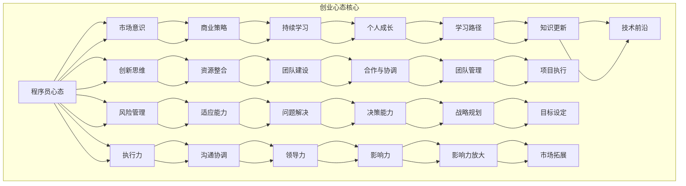

                 

### 文章标题

“从程序员到创业者的心态转变”

关键词：程序员，创业者，心态转变，创业思维，商业策略

摘要：本文将深入探讨程序员在转变为创业者时所面临的心态转变。我们将分析程序员与创业者思维模式的差异，并逐步讲解创业心态的核心概念、算法原理和数学模型。通过实际创业项目案例，我们将展示如何将理论知识应用到实践中，并提供创业者成长策略。本文旨在帮助程序员理解并逐步适应创业者的心态，为他们的创业之路奠定坚实基础。

### 目录大纲

**第一部分：认识创业者的心态**

**第1章：程序员与创业者的思维差异**

1.1 程序员的思维模式

1.2 创业者的思维模式

1.3 从程序员到创业者的心态转变过程

**第2章：核心概念与联系**

2.1 创业者心态的Mermaid流程图

2.2 创业者心态的核心要素

**第3章：核心算法原理讲解**

3.1 市场调研与分析算法

3.2 团队建设与管理算法

3.3 风险管理与决策算法

**第4章：数学模型和数学公式**

4.1 投资收益模型

4.2 市场份额模型

4.3 人力成本模型

**第5章：项目实战**

5.1 创业项目实战案例介绍

5.2 创业项目环境搭建

5.3 创业项目源代码实现与解读

**第二部分：实践创业者的心态**

**第6章：构建创业团队**

6.1 团队组建的原则

6.2 团队成员的角色与职责

6.3 团队管理的方法

**第7章：执行创业计划**

7.1 创业计划的制定

7.2 创业计划的执行与调整

7.3 创业计划的评估与反馈

**第8章：应对创业挑战**

8.1 市场竞争策略

8.2 资金管理策略

8.3 法律风险防控策略

**第9章：持续成长与学习**

9.1 创业者的心态调整

9.2 创业者的学习路径

9.3 创业者的成长策略

**附录**

**附录A：创业资源与工具推荐**

A.1 创业相关的书籍和文章

A.2 创业相关的网站和社区

A.3 创业相关的工具和平台

**附录B：参考公式与伪代码**

B.1 投资收益模型公式

B.2 市场份额模型公式

B.3 人力成本模型公式

B.4 市场调研与分析算法伪代码

B.5 团队建设与管理算法伪代码

B.6 风险管理与决策算法伪代码

## 第1章：程序员与创业者的思维差异

### 1.1 程序员的思维模式

程序员通常具备以下几种思维模式：

1. **逻辑思维**：程序员的日常工作依赖于逻辑思维，从问题定义到解决方案的设计，再到代码的实现，每一步都需要逻辑严密。

2. **抽象思维**：程序员擅长将复杂的现实问题抽象为计算机可以处理的数据结构和算法。

3. **系统思维**：程序员在面对复杂系统时，能够从整体上理解系统的各个组成部分及其相互作用。

4. **迭代思维**：程序员的开发流程通常是迭代的，通过不断的测试和反馈来优化解决方案。

5. **细节关注**：程序员在编码过程中非常注重细节，追求代码的可读性、可维护性和性能优化。

### 1.2 创业者的思维模式

与程序员不同，创业者通常具备以下几种思维模式：

1. **市场思维**：创业者注重市场需求，他们的思维更偏向于商业机会的发现和利用。

2. **创新思维**：创业者不断寻找创新点，以区别于竞争对手，并在市场中获得优势。

3. **风险意识**：创业者知道创业过程中充满不确定性，因此具备较高的风险意识。

4. **执行力**：创业者具有强烈的执行力，能够将想法迅速转化为行动。

5. **沟通协调能力**：创业者需要与各种利益相关者沟通协调，如团队成员、投资者和客户等。

### 1.3 从程序员到创业者的心态转变过程

从程序员到创业者，心态转变是一个逐步的过程，包括以下几个阶段：

1. **意识到差距**：程序员首先需要认识到自身与创业者的思维模式差异，并意识到这种差异对创业的影响。

2. **学习与适应**：程序员可以通过阅读相关书籍、参加创业培训课程等方式，学习创业者的思维方式和心态。

3. **实践与反思**：在实际创业过程中，程序员需要不断实践，并从失败和成功中反思，逐步形成自己的创业心态。

4. **持续成长**：创业心态并非一成不变，创业者需要持续学习和适应，以应对不断变化的市场环境。

在接下来的章节中，我们将深入探讨创业心态的核心概念、算法原理和数学模型，并通过实际案例展示如何将理论知识应用到创业实践中。## 第2章：核心概念与联系

在从程序员到创业者的转变过程中，理解并掌握一系列核心概念对于构建成功的心态至关重要。本章将详细探讨这些核心概念，并通过Mermaid流程图来展示它们之间的联系。

### 2.1 创业者心态的Mermaid流程图

首先，我们可以使用Mermaid来绘制一个简化的创业者心态流程图。以下是一个基本的Mermaid图示例，描述了从程序员到创业者的心态转变过程。



上图中，每个节点代表一个核心概念，箭头表示它们之间的联系。例如，从程序员心态到市场意识的转变，意味着程序员需要从技术导向转向市场导向。创新思维与资源整合相连，表明创业者需要不断创新并有效地整合资源。

### 2.2 创业者心态的核心要素

以下是创业心态的一些核心要素，每个要素都将在后续章节中详细讨论：

1. **市场意识**：创业者需要深入了解市场需求，了解目标客户，并不断调整产品和服务以适应市场变化。

2. **创新思维**：创业者应具备独特的创新视角，能够发现市场中的空白点，并通过创新来满足客户需求。

3. **风险管理**：创业者需要具备风险意识和管理能力，能够预见并应对各种潜在风险。

4. **执行力**：创业者应具备强烈的执行力，能够迅速行动并确保创业计划的实施。

5. **商业策略**：创业者需要制定有效的商业策略，包括市场定位、竞争策略和营销策略等。

6. **资源整合**：创业者应具备整合各种资源的能力，包括人力、资本和合作伙伴等。

7. **适应能力**：创业者需要灵活适应市场变化和环境变化，以保持企业的竞争力。

8. **沟通协调能力**：创业者需要与各种利益相关者有效沟通，并协调各方利益。

9. **领导力**：创业者应具备领导能力，能够激励和引导团队，实现共同的目标。

10. **持续学习**：创业者应保持持续学习的态度，不断提升自己的知识和技能。

通过本章的学习，程序员可以初步了解创业心态的核心要素及其相互关系。在接下来的章节中，我们将进一步探讨这些核心概念的具体实现方法和策略。

## 第3章：核心算法原理讲解

### 3.1 市场调研与分析算法

市场调研与分析是创业过程中至关重要的一环，它帮助创业者了解市场需求、竞争态势和目标客户。以下是一个简单的市场调研与分析算法的伪代码：

```python
# 市场调研与分析算法伪代码

def market_research与分析(目标市场):
    # 步骤1：定义目标市场
    market = 目标市场
    
    # 步骤2：收集市场数据
    data = collect_market_data(market)
    
    # 步骤3：分析市场数据
    insights = analyze_data(data)
    
    # 步骤4：生成市场报告
    report = generate_report(insights)
    
    return report

def collect_market_data(market):
    # 收集市场数据的函数实现
    # 可以通过在线调查、问卷调查、社交媒体分析等方式收集数据
    pass

def analyze_data(data):
    # 分析数据的函数实现
    # 可以通过数据分析、统计方法、机器学习模型等方法进行分析
    pass

def generate_report(insights):
    # 生成市场报告的函数实现
    # 报告应包括市场趋势、客户需求、竞争态势等内容
    pass
```

### 3.2 团队建设与管理算法

团队建设与管理是创业者成功的关键之一。以下是一个简单的团队建设与管理算法的伪代码：

```python
# 团队建设与管理算法伪代码

def build_management_team(团队成员列表):
    # 步骤1：初始化团队
    team = 初始化团队成员列表
    
    # 步骤2：确定团队目标
    team_goal = 确定团队目标
    
    # 步骤3：分配任务和角色
    assign_tasks_and_roles(team, team_goal)
    
    # 步骤4：培训团队成员
    train_team_members(team)
    
    # 步骤5：管理团队绩效
    manage_team_performance(team)

def assign_tasks_and_roles(team, team_goal):
    # 分配任务和角色的函数实现
    # 应根据团队成员的技能和经验来分配任务
    pass

def train_team_members(team):
    # 培训团队成员的函数实现
    # 可以通过内部培训、外部培训、在线课程等方式培训成员
    pass

def manage_team_performance(team):
    # 管理团队绩效的函数实现
    # 可以通过定期评估、反馈、激励等方式管理团队绩效
    pass
```

### 3.3 风险管理与决策算法

在创业过程中，风险管理至关重要。以下是一个简单的风险管理与决策算法的伪代码：

```python
# 风险管理与决策算法伪代码

def risk_management_and_decision-making(风险列表):
    # 步骤1：评估风险
    assessed_risks = assess_risks(风险列表)
    
    # 步骤2：制定风险应对策略
    risk_strategies = develop_risk_strategies(assessed_risks)
    
    # 步骤3：执行风险应对策略
    execute_risk_strategies(risk_strategies)
    
    # 步骤4：监控和调整
    monitor_and_adjust()

def assess_risks(risk_list):
    # 评估风险的函数实现
    # 可以通过定量分析和定性分析等方法评估风险
    pass

def develop_risk_strategies(assessed_risks):
    # 制定风险应对策略的函数实现
    # 根据风险评估结果，制定相应的风险应对策略
    pass

def execute_risk_strategies(risk_strategies):
    # 执行风险应对策略的函数实现
    # 将风险应对策略转化为具体的行动方案并执行
    pass

def monitor_and_adjust():
    # 监控和调整的函数实现
    # 定期检查风险应对策略的执行情况，并根据实际情况进行调整
    pass
```

通过以上算法的讲解，程序员可以初步了解市场调研与分析、团队建设与管理以及风险管理与决策的基本原理和方法。在实际创业过程中，这些算法将帮助创业者更好地应对市场变化和风险，从而提高创业成功的概率。

## 第4章：数学模型和数学公式

在创业过程中，数学模型和公式能够帮助我们更精确地量化和管理业务决策。以下将介绍几个关键的数学模型和公式，并通过具体的例子来说明它们的用法。

### 4.1 投资收益模型

投资收益模型是评估创业项目财务可行性的重要工具。以下是一个简单的投资收益模型公式：

\[ \text{投资收益} = \text{总收益} - \text{总成本} - \text{投资成本} \]

假设一个创业项目初始投资为50万元，预计在第一年可以带来100万元的总收益，总成本为70万元，那么第一年的投资收益为：

\[ \text{投资收益} = 100\text{万元} - 70\text{万元} - 50\text{万元} = -20\text{万元} \]

这是一个亏损，但如果项目在第二年开始盈利，并且总收益逐年增加，则投资收益将会改变。例如，第二年总收益为150万元，总成本为80万元，则第二年的投资收益为：

\[ \text{投资收益} = 150\text{万元} - 80\text{万元} - 50\text{万元} = 20\text{万元} \]

### 4.2 市场份额模型

市场份额模型用于预测和评估产品在市场上的占有率。一个简单的市场份额模型公式如下：

\[ \text{市场份额} = \frac{\text{产品销售额}}{\text{市场总销售额}} \]

假设一个市场总销售额为1000万元，你的产品销售额为200万元，则市场份额为：

\[ \text{市场份额} = \frac{200\text{万元}}{1000\text{万元}} = 0.2 \text{或} 20\% \]

如果市场份额逐年增加，则说明产品在市场上受到认可，如果下降则可能需要调整市场策略。

### 4.3 人力成本模型

人力成本模型用于估算企业的人力成本，包括员工工资、培训费用和其他相关费用。以下是一个人力成本模型公式：

\[ \text{人力成本} = \text{员工数量} \times \text{人均工资} + \text{培训费用} + \text{其他费用} \]

假设一个企业有100名员工，人均工资为1万元/月，每月的培训费用为2万元，其他费用为1万元，则每月的人力成本为：

\[ \text{人力成本} = 100 \times 1\text{万元} + 2\text{万元} + 1\text{万元} = 103\text{万元} \]

### 举例说明

为了更好地理解这些模型和公式的应用，我们可以看一个具体的例子。

**例子：一个创业公司预计在未来五年内达到财务平衡**

假设：

- 初始投资：100万元
- 每年的固定运营成本：50万元
- 预计年收益：100万元
- 年均市场份额增长：5%
- 年均人力成本增长：3%

我们可以使用上述模型来预测五年的财务状况：

**第一年：**

- 投资收益：100 - 50 - 100 = -50万元
- 市场份额：20%
- 人力成本：103万元

**第二年：**

- 投资收益：100 - 50 - 100 \* (1 + 5%) \* 0.2 = -53.5万元
- 市场份额：20% + 5% = 25%
- 人力成本：103 \* (1 + 3%) = 106.29万元

**第三年：**

- 投资收益：100 - 50 - 100 \* (1 + 5%)^2 \* 0.2 = -57.45万元
- 市场份额：25% + 5% = 30%
- 人力成本：106.29 \* (1 + 3%) = 109.41万元

**第四年：**

- 投资收益：100 - 50 - 100 \* (1 + 5%)^3 \* 0.2 = -61.48万元
- 市场份额：30% + 5% = 35%
- 人力成本：109.41 \* (1 + 3%) = 112.64万元

**第五年：**

- 投资收益：100 - 50 - 100 \* (1 + 5%)^4 \* 0.2 = -65.56万元
- 市场份额：35% + 5% = 40%
- 人力成本：112.64 \* (1 + 3%) = 115.90万元

通过上述计算，我们可以看出，虽然每年都有亏损，但随着市场份额的增加，投资收益逐年改善。因此，企业可能需要调整策略，增加市场份额或减少成本，以确保在五年内达到财务平衡。

通过这个例子，我们可以看到数学模型和公式在创业决策中的重要性。理解和运用这些模型可以帮助创业者更好地预测和管理业务，从而提高创业的成功率。

## 第5章：项目实战

### 5.1 创业项目实战案例介绍

在本章中，我们将介绍一个具体的创业项目——一款基于人工智能的智能客服系统。该系统旨在通过自然语言处理和机器学习技术，为企业和客户提供高效、智能的在线客服解决方案。

项目目标：  
1. 提高客户满意度，通过快速响应和准确解决问题。  
2. 减轻人工客服的工作负担，提高客服效率。  
3. 通过数据分析和用户反馈，不断优化客服系统。

项目背景：  
随着互联网的普及，越来越多的企业开始提供在线客服服务。然而，人工客服的成本较高，且在处理大量问题时效率低下。因此，开发一款智能客服系统成为创业的契机。

### 5.2 创业项目环境搭建

在开始项目开发前，我们需要搭建一个合适的环境。以下是一个基本的开发环境搭建步骤：

1. **硬件要求**：选择一台性能较好的服务器，用于部署应用程序。

2. **软件要求**：安装Linux操作系统，如Ubuntu Server。选择Python作为开发语言，并安装相关开发工具，如Python解释器、pip等。

3. **框架选择**：选择一个合适的Web框架，如Flask或Django，用于构建Web应用程序。

4. **数据库**：选择一个关系型数据库，如MySQL，用于存储用户数据和会话信息。

5. **人工智能库**：安装和配置相关的机器学习库，如TensorFlow和Scikit-learn，用于自然语言处理和模型训练。

6. **开发工具**：安装集成开发环境（IDE），如PyCharm或Visual Studio Code，以提高开发效率。

### 5.3 创业项目源代码实现与解读

以下是一个简单的智能客服系统的源代码实现，我们将逐步解读其中的关键部分。

```python
# 导入所需的库
from flask import Flask, request, jsonify
import numpy as np
from sklearn.feature_extraction.text import TfidfVectorizer
from sklearn.naive_bayes import MultinomialNB
from sklearn.pipeline import make_pipeline
from sklearn.model_selection import train_test_split

# 初始化 Flask 应用程序
app = Flask(__name__)

# 定义模型训练函数
def train_model():
    # 加载数据集（这里使用示例数据）
    data = [
        ("你好，我想咨询一下产品的售后服务", "售后服务"),
        ("我购买的产品出了故障，怎么办？", "售后服务"),
        ("请问贵公司的联系方式是多少？", "联系我们"),
        # ... 更多数据
    ]

    # 切分数据为特征和标签
    X, y = zip(*data)

    # 初始化向量器
    vectorizer = TfidfVectorizer()

    # 初始化分类器
    classifier = MultinomialNB()

    # 创建管道
    model = make_pipeline(vectorizer, classifier)

    # 切分数据为训练集和测试集
    X_train, X_test, y_train, y_test = train_test_split(X, y, test_size=0.2, random_state=42)

    # 训练模型
    model.fit(X_train, y_train)

    # 测试模型
    print("模型准确率：", model.score(X_test, y_test))

    return model

# 定义预测函数
def predict(model, message):
    return model.predict([message])[0]

# 定义接口
@app.route('/predict', methods=['POST'])
def predict_route():
    message = request.form['message']
    prediction = predict(model, message)
    return jsonify({"prediction": prediction})

# 启动应用程序
if __name__ == '__main__':
    model = train_model()
    app.run(debug=True)
```

**关键部分解读：**

1. **数据加载与预处理**：我们使用示例数据集，每个数据项是一个包含问题和分类标签的元组。通过TfidfVectorizer对文本进行向量化处理，将文本转换为机器学习模型可以处理的数字形式。

2. **模型选择与训练**：这里我们选择了朴素贝叶斯分类器（MultinomialNB）进行训练。朴素贝叶斯是一种简单但有效的文本分类方法。我们使用make_pipeline将向量化处理和分类器结合在一起，简化了模型训练过程。

3. **模型测试**：在训练完成后，我们使用测试集对模型进行评估，输出模型的准确率。

4. **预测接口**：定义了一个Flask接口，允许前端通过POST请求发送消息，模型将返回预测的分类标签。

通过这个简单的示例，我们可以看到如何搭建一个基本的智能客服系统，并了解其中的关键组成部分。在实际应用中，这个系统可以进一步优化和扩展，以提供更全面的客户服务功能。

### 5.4 代码解读与分析

在上面的代码中，我们首先导入了必要的库，包括Flask用于Web开发、scikit-learn用于机器学习模型训练和评估。接下来，我们定义了Flask应用实例`app`。

**数据加载与预处理：**
```python
data = [
    ("你好，我想咨询一下产品的售后服务", "售后服务"),
    ("我购买的产品出了故障，怎么办？", "售后服务"),
    ("请问贵公司的联系方式是多少？", "联系我们"),
    # ... 更多数据
]

X, y = zip(*data)
vectorizer = TfidfVectorizer()
model = make_pipeline(vectorizer, MultinomialNB())
```
这一部分代码用于加载数据集和预处理。数据集包含问题和对应的分类标签。我们使用`TfidfVectorizer`将文本转换为TF-IDF特征向量，这是文本分类任务中常用的特征提取方法。`MultinomialNB`是一个朴素贝叶斯分类器，它适合处理具有多项式分布的数据。

**模型训练与测试：**
```python
X_train, X_test, y_train, y_test = train_test_split(X, y, test_size=0.2, random_state=42)
model.fit(X_train, y_train)
print("模型准确率：", model.score(X_test, y_test))
```
在这一部分，我们使用`train_test_split`函数将数据集分为训练集和测试集。然后，我们使用`fit`方法对模型进行训练，并使用`score`方法评估模型的准确率。

**预测接口：**
```python
@app.route('/predict', methods=['POST'])
def predict_route():
    message = request.form['message']
    prediction = predict(model, message)
    return jsonify({"prediction": prediction})
```
最后，我们定义了一个Flask路由，处理POST请求，接收用户输入的消息，并调用`predict`函数进行预测。预测结果以JSON格式返回。

通过这个简单的代码示例，我们可以看到如何构建一个基本的文本分类模型，并将其部署为一个Web服务。在实际应用中，这个模型可以通过大量的数据训练和优化，以提高预测的准确性和性能。

## 第6章：构建创业团队

在创业过程中，构建一个高效的团队至关重要。一个成功的团队可以极大地推动项目的发展，并帮助创业者克服各种挑战。以下是一些关键步骤和策略，用于构建一个强大的创业团队。

### 6.1 团队组建的原则

1. **明确目标**：在组建团队之前，创业者应明确团队的目标和愿景。这有助于确保团队成员都对项目的目标有清晰的理解。

2. **多元化**：一个多元化的团队可以带来不同的视角和技能，从而增强团队的创新能力。多元化不仅包括技能背景，还包括性别、文化背景和年龄等。

3. **互补性**：团队成员应在技能和经验上互补。例如，如果创业者擅长技术，可能需要招募一位擅长市场和销售的团队成员。

4. **共同价值观**：团队成员应共享相同的价值观和公司文化。这有助于建立信任和协作，减少内部冲突。

5. **透明沟通**：建立开放的沟通环境，鼓励团队成员之间坦诚交流，是构建高效团队的关键。

### 6.2 团队成员的角色与职责

一个高效的创业团队通常由以下角色组成：

1. **领导者**：领导者负责制定团队目标和战略，指导团队成员，并处理外部关系。

2. **技术专家**：技术专家负责产品的技术实现，包括研发、测试和维护。

3. **市场营销专家**：市场营销专家负责市场调研、产品推广和客户关系管理。

4. **财务专家**：财务专家负责预算管理、财务报告和资金筹集。

5. **运营专家**：运营专家负责项目的日常运营，包括供应链管理和客户服务。

6. **人力资源专家**：人力资源专家负责招聘、培训和员工福利。

### 6.3 团队管理的方法

1. **明确职责**：确保每个团队成员都清楚自己的职责和期望。

2. **定期会议**：定期举行团队会议，讨论项目进展、问题和解决方案。

3. **透明沟通**：鼓励团队成员之间的透明沟通，建立信任和协作。

4. **激励与反馈**：通过正面激励和定期反馈，鼓励团队成员发挥最佳水平。

5. **灵活管理**：根据项目需求，灵活调整团队成员的职责和工作时间。

6. **持续培训**：定期为团队成员提供培训，帮助他们提升技能和知识。

通过以上原则和策略，创业者可以构建一个高效的创业团队，为项目的成功奠定基础。

## 第7章：执行创业计划

### 7.1 创业计划的制定

制定创业计划是创业过程中至关重要的一步，它为企业的未来发展提供了明确的指导和方向。以下是一个典型的创业计划制定流程：

1. **确定愿景和使命**：明确企业的长远目标和核心价值观，这将成为制定创业计划的基石。

2. **市场调研**：深入了解市场需求、目标客户和竞争对手。通过市场调研，确定企业的市场定位和独特卖点。

3. **产品/服务定义**：根据市场调研结果，明确产品或服务的特性、功能和目标市场。

4. **商业模型**：制定商业模型，包括收入来源、成本结构和利润预测。商业模型应具备可行性，能够支持企业的长期发展。

5. **财务规划**：制定详细的财务计划，包括预算、现金流预测和资金需求。确保计划中的财务目标现实且可达成。

6. **团队建设**：明确团队成员的职责和角色，制定团队组建和培训计划。

7. **时间表和里程碑**：设定项目的时间表和关键里程碑，确保项目按计划推进。

8. **风险评估**：识别潜在的风险和挑战，制定相应的风险应对策略。

9. **撰写创业计划书**：将上述内容整理成一份详细的创业计划书，以便向投资者、合作伙伴或团队成员进行展示和沟通。

### 7.2 创业计划的执行与调整

制定创业计划只是第一步，执行计划并持续调整以适应市场变化是成功的关键。以下是一些执行创业计划的步骤：

1. **项目分解**：将创业计划分解为具体的任务和活动，明确每个任务的负责人和时间表。

2. **资源分配**：确保团队拥有实现计划所需的资源，包括资金、人力和技术支持。

3. **监控进度**：定期检查项目进度，确保任务按计划推进。使用项目管理工具（如Trello、Jira等）帮助跟踪任务和进度。

4. **沟通协调**：保持团队成员之间的有效沟通，确保项目信息透明。定期举行会议，讨论项目进展、问题和解决方案。

5. **灵活调整**：根据实际情况和市场反馈，灵活调整计划。如果遇到重大变化或挑战，及时调整策略，确保项目依然能够达成目标。

6. **反馈与改进**：收集团队成员和客户的反馈，持续改进产品和流程。通过不断的迭代和优化，提高项目的成功概率。

### 7.3 创业计划的评估与反馈

创业计划的评估和反馈是确保项目成功的重要环节。以下是一些评估和反馈的方法：

1. **关键绩效指标（KPI）**：设定关键绩效指标，用于衡量项目进展和成果。例如，销售额、客户满意度、市场份额等。

2. **定期评估**：定期对项目进行评估，检查实际进展与计划之间的差距。评估应包括财务表现、市场反馈和团队表现等方面。

3. **反馈机制**：建立有效的反馈机制，鼓励团队成员和客户提供意见和建议。这有助于发现问题和改进机会。

4. **报告和总结**：定期撰写项目报告，总结项目进展、成果和挑战。报告应包括实际数据、分析结果和改进建议。

5. **持续改进**：根据评估和反馈结果，持续改进创业计划。这包括调整战略、优化流程和提升团队技能。

通过执行创业计划并持续调整，创业者可以更好地应对市场变化和挑战，提高项目的成功率。评估和反馈机制则确保项目始终保持在高效率和高成长路径上。

## 第8章：应对创业挑战

在创业过程中，面对各种挑战是不可避免的。以下是一些常见的创业挑战及其应对策略：

### 8.1 市场竞争策略

市场竞争激烈，创业者需要制定有效的策略来应对。以下是一些应对市场竞争的策略：

1. **差异化定位**：找到市场的独特卖点（USP），并通过营销传播突出自己的优势。

2. **价格策略**：根据产品定位和成本结构，选择合适的价格策略。例如，高端定位可以采用高价位策略，性价比高可以采用中低价位策略。

3. **品牌建设**：建立强大的品牌形象，提升品牌知名度和认可度。

4. **技术创新**：不断进行技术创新，提供具有竞争力的产品或服务。

5. **合作与联盟**：与其他企业建立合作或联盟关系，共享资源和市场。

### 8.2 资金管理策略

资金管理是创业过程中的一大挑战。以下是一些资金管理策略：

1. **预算编制**：制定详细的预算计划，合理分配资金，确保资金使用的透明和高效。

2. **现金流管理**：密切关注现金流状况，确保企业能够持续运营。

3. **融资策略**：根据企业需求和市场情况，选择合适的融资方式，如天使投资、风险投资、银行贷款等。

4. **成本控制**：严格控制成本，提高资金使用效率。

5. **风险准备金**：设立风险准备金，应对突发情况和市场变化。

### 8.3 法律风险防控策略

法律风险对于创业企业来说是不可忽视的问题。以下是一些法律风险防控策略：

1. **合规性检查**：确保企业的运营符合相关法律法规，避免法律纠纷。

2. **合同管理**：重视合同管理，确保合同条款清晰、公正，并在签订前进行法律审核。

3. **知识产权保护**：积极申请专利、商标和版权，保护企业的知识产权。

4. **合规培训**：定期为员工提供法律知识和合规培训，提高员工的合规意识和法律风险防范能力。

5. **法律咨询**：在重大决策或法律纠纷时，寻求专业法律咨询，确保企业利益最大化。

通过以上策略，创业者可以更好地应对创业过程中的各种挑战，提高企业的生存和发展能力。## 第9章：持续成长与学习

在创业的道路上，持续成长和学习是确保企业成功和持续发展的关键。创业者需要不断更新自己的知识和技能，以适应快速变化的市场环境。以下是一些策略和步骤，帮助创业者实现持续成长。

### 9.1 创业者的心态调整

1. **保持开放心态**：创业过程中，创业者需要保持开放的心态，接受新的观念和思维方式。这有助于发现新的商业机会和解决方案。

2. **接受失败**：创业不可避免地会遇到失败，创业者应学会从失败中汲取经验教训，而不是沉溺于失败的阴影中。

3. **保持乐观**：面对挑战和困难，创业者应保持乐观的心态，坚信自己的能力和决心。

4. **持续反思**：定期反思自己的行为和决策，评估其有效性，并根据反馈进行调整。

### 9.2 创业者的学习路径

1. **专业知识**：不断学习与创业相关的基础知识，包括市场营销、财务管理、法律知识等。

2. **行业动态**：关注行业动态，了解市场趋势和竞争对手的动向。

3. **领导力培训**：参加领导力培训课程，提升管理团队和领导团队的能力。

4. **技术技能**：不断学习新技术，保持技术前沿的知识储备。

5. **跨界学习**：跨学科学习，拓展自己的知识面，以便在多个领域找到创新的结合点。

### 9.3 创业者的成长策略

1. **设立明确目标**：为自己设定短期和长期的目标，明确成长的方向。

2. **持续学习**：利用在线课程、专业书籍、研讨会和培训等资源，不断充实自己的知识库。

3. **建立导师网络**：寻找有经验的导师，获取他们的指导和建议。

4. **实践与反思**：通过实践将理论知识转化为实际能力，并不断反思和调整自己的行为和策略。

5. **建立学习型团队**：鼓励团队成员不断学习和成长，打造一个学习型组织。

6. **投资自我**：将部分利润用于个人和团队的学习和发展，提升企业的整体竞争力。

通过持续的学习和成长，创业者可以不断提升自己的能力，适应不断变化的市场环境，从而确保企业的长期成功。

### 附录A：创业资源与工具推荐

#### A.1 创业相关的书籍和文章

**书籍推荐：**
1. 《创业维艰》（"Hard Things About Hard Things" by Ben Horowitz）
2. 《精益创业》（"The Lean Startup" by Eric Ries）
3. 《从零到一》（"Zero to One" by Peter Thiel）
4. 《创业革命》（"The Startup of You" by Reid Hoffman）
5. 《创业心理学》（"Entrepreneurship" by Andrew J. Sherman）

**文章推荐：**
1. "The Lean Startup" - Eric Ries 的博客和文章
2. "Startup Life" - Paul Graham 的博客文章
3. "HBR's Startup Revolution" - Harvard Business Review 的相关文章
4. "The Art of the Start" - Guy Kawasaki 的博客和文章

#### A.2 创业相关的网站和社区

**网站推荐：**
1. AngelList - 寻找投资人和创业机会的平台
2. TechCrunch - 创业新闻和趋势分析
3. Medium - 分享创业经验和见解的文章平台
4. Crunchbase - 创业公司数据库和投资者信息
5. Reddit - 众多创业相关的子版块，如r/startups、r/entrepreneur等

**社区推荐：**
1. Y Combinator - 全球知名的创业孵化器
2. Techstars - 创业孵化器和加速器
3. Startup Weekend - 全球性的创业比赛和社区
4. Entrepreneurs' Organization - 创业者组织，提供网络和支持
5. TED Talks - 创业和创新的演讲视频

#### A.3 创业相关的工具和平台

**工具推荐：**
1. Trello - 项目管理工具，帮助团队协作
2. Asana - 项目管理平台，任务和进度跟踪
3. Slack - 团队沟通工具
4. Google Workspace - 办公和协作工具，如Gmail、Google Docs、Google Sheets等
5. GitHub - 代码托管和协作平台

**平台推荐：**
1. Kickstarter - 创业项目众筹平台
2. Indiegogo - 创业项目众筹平台
3. Stripe - 在线支付解决方案
4. Shopify - 在线商店构建平台
5. HubSpot - 销售和营销自动化工具

通过这些资源和工具，创业者可以获取丰富的知识和信息，建立强大的支持网络，并有效地管理项目，从而提高创业成功的概率。

### 附录B：参考公式与伪代码

#### B.1 投资收益模型公式

\[ \text{投资收益} = \text{总收益} - \text{总成本} - \text{投资成本} \]

#### B.2 市场份额模型公式

\[ \text{市场份额} = \frac{\text{产品销售额}}{\text{市场总销售额}} \]

#### B.3 人力成本模型公式

\[ \text{人力成本} = \text{员工数量} \times \text{人均工资} + \text{培训费用} + \text{其他费用} \]

#### B.4 市场调研与分析算法伪代码

```python
# 市场调研与分析算法伪代码

def market_research与分析(目标市场):
    # 步骤1：定义目标市场
    market = 目标市场
    
    # 步骤2：收集市场数据
    data = collect_market_data(market)
    
    # 步骤3：分析市场数据
    insights = analyze_data(data)
    
    # 步骤4：生成市场报告
    report = generate_report(insights)
    
    return report

def collect_market_data(market):
    # 收集市场数据的函数实现
    # 可以通过在线调查、问卷调查、社交媒体分析等方式收集数据
    pass

def analyze_data(data):
    # 分析数据的函数实现
    # 可以通过数据分析、统计方法、机器学习模型等方法进行分析
    pass

def generate_report(insights):
    # 生成市场报告的函数实现
    # 报告应包括市场趋势、客户需求、竞争态势等内容
    pass
```

#### B.5 团队建设与管理算法伪代码

```python
# 团队建设与管理算法伪代码

def build_management_team(团队成员列表):
    # 步骤1：初始化团队
    team = 初始化团队成员列表
    
    # 步骤2：确定团队目标
    team_goal = 确定团队目标
    
    # 步骤3：分配任务和角色
    assign_tasks_and_roles(team, team_goal)
    
    # 步骤4：培训团队成员
    train_team_members(team)
    
    # 步骤5：管理团队绩效
    manage_team_performance(team)

def assign_tasks_and_roles(team, team_goal):
    # 分配任务和角色的函数实现
    # 应根据团队成员的技能和经验来分配任务
    pass

def train_team_members(team):
    # 培训团队成员的函数实现
    # 可以通过内部培训、外部培训、在线课程等方式培训成员
    pass

def manage_team_performance(team):
    # 管理团队绩效的函数实现
    # 可以通过定期评估、反馈、激励等方式管理团队绩效
    pass
```

#### B.6 风险管理与决策算法伪代码

```python
# 风险管理与决策算法伪代码

def risk_management_and_decision-making(风险列表):
    # 步骤1：评估风险
    assessed_risks = assess_risks(风险列表)
    
    # 步骤2：制定风险应对策略
    risk_strategies = develop_risk_strategies(assessed_risks)
    
    # 步骤3：执行风险应对策略
    execute_risk_strategies(risk_strategies)
    
    # 步骤4：监控和调整
    monitor_and_adjust()

def assess_risks(risk_list):
    # 评估风险的函数实现
    # 可以通过定量分析和定性分析等方法评估风险
    pass

def develop_risk_strategies(assessed_risks):
    # 制定风险应对策略的函数实现
    # 根据风险评估结果，制定相应的风险应对策略
    pass

def execute_risk_strategies(risk_strategies):
    # 执行风险应对策略的函数实现
    # 将风险应对策略转化为具体的行动方案并执行
    pass

def monitor_and_adjust():
    # 监控和调整的函数实现
    # 定期检查风险应对策略的执行情况，并根据实际情况进行调整
    pass
```

通过附录中的公式和伪代码，创业者可以更好地理解和应用相关的数学模型和算法，从而提高创业决策的科学性和有效性。这些资源将有助于创业者更好地管理企业风险、优化团队建设和执行创业计划。

