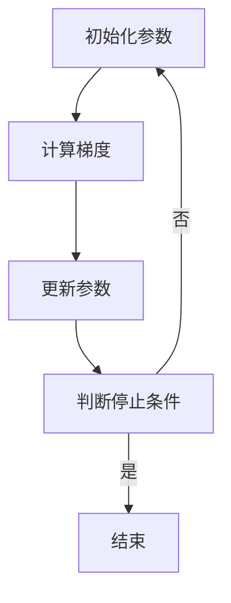
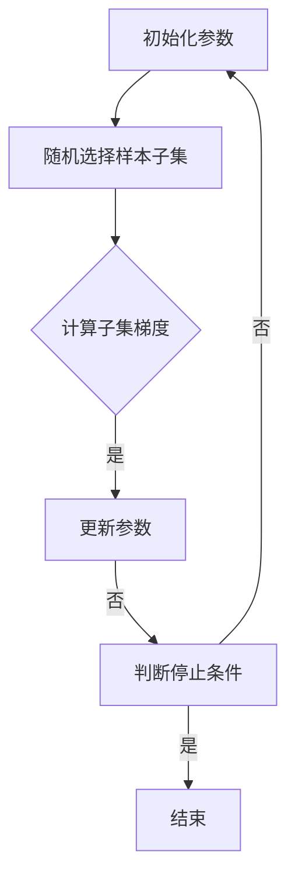

                 

## 优化算法：随机梯度下降（Stochastic Gradient Descent）原理与代码实例讲解

### 关键词：
- 随机梯度下降
- 优化算法
- 机器学习
- 深度学习
- 神经网络
- 学习率调度

### 摘要：
本文将深入探讨随机梯度下降（Stochastic Gradient Descent，SGD）这一优化算法的基本原理、数学模型及其在机器学习和深度学习中的应用。我们将通过详细的代码实例，展示如何在实际项目中实现SGD算法，并提供性能优化策略和实际应用案例。文章结构如下：

1. **优化算法概述与历史背景**
    - **第1章：优化算法：随机梯度下降（SGD）概述**
    - **第2章：随机梯度下降（SGD）的数学模型**
    - **第3章：随机梯度下降（SGD）的代码实例**
2. **SGD在深度学习中的应用**
    - **第4章：SGD在深度学习中的应用**
    - **第5章：SGD算法的优化方法**
    - **第6章：SGD算法的实际应用案例**
3. **SGD算法的未来发展趋势**
    - **第7章：SGD算法的未来发展趋势**
4. **附录**
    - **附录A：SGD算法相关资源**
    - **附录B：SGD算法实践项目指南**
    - **附录C：常见问题与解决方案**
    - **附录D：SGD算法研究进展与展望**

通过本文，读者将全面了解SGD算法的核心原理和实际应用，掌握其在不同领域中的优化策略和实践方法。

----------------------------------------------------------------

### 第一部分：优化算法概述与历史背景

#### 第1章：优化算法：随机梯度下降（SGD）概述

**1.1 随机梯度下降（SGD）的基本概念**

随机梯度下降（Stochastic Gradient Descent，SGD）是一种常用的优化算法，用于解决机器学习和深度学习中的最优化问题。与传统梯度下降算法相比，SGD在每一次迭代过程中，只计算整个数据集的一部分，即随机选择的样本子集的梯度，从而更新模型参数。这种随机化的方式有效地降低了计算复杂度，并提高了算法的收敛速度。

**1.1.1 优化算法在机器学习中的应用**

在机器学习中，优化算法用于最小化损失函数，从而得到最佳模型参数。损失函数反映了模型预测与真实标签之间的差距，优化算法的目标是找到一组参数，使得损失函数的值最小。SGD作为一类重要的优化算法，广泛应用于各种机器学习任务，如线性回归、逻辑回归、支持向量机等。

**1.1.2 随机梯度下降的定义**

随机梯度下降是一种迭代算法，其基本步骤如下：

1. **初始化参数**：随机选择一组初始参数。
2. **计算梯度**：在每一次迭代中，随机选择一个样本子集，计算该子集的梯度。
3. **更新参数**：使用计算得到的梯度，更新模型参数。
4. **重复迭代**：重复步骤2和3，直到满足停止条件（如达到预定迭代次数或损失函数值变化小于阈值）。

**1.1.3 SGD与其他优化算法的比较**

与全梯度下降（Batch Gradient Descent）相比，SGD在每次迭代时只计算一部分样本的梯度，因此计算复杂度更低。然而，SGD的随机性可能导致算法收敛速度不稳定，有时甚至会出现振荡。为了克服这些问题，出现了一些SGD的变体，如动量法（Momentum）、自适应梯度算法（ADAM）等。

**1.2 SGD的历史发展**

SGD最早由Rosenblatt于1958年提出，用于训练感知机（Perceptron）模型。尽管在早期机器学习领域中，SGD并没有得到广泛应用，但随着深度学习的发展，SGD逐渐成为训练大规模深度神经网络的常用优化算法。

**1.2.1 SGD的起源与发展**

SGD的起源可以追溯到1960年代，当时为了训练大规模神经网络，研究人员提出了梯度下降算法。然而，梯度下降算法在处理大规模数据时计算量巨大，难以实现。因此，Dale Henry在1962年提出了随机梯度下降算法，通过计算样本子集的梯度来更新模型参数，从而显著降低了计算复杂度。

**1.2.2 SGD在深度学习中的重要性**

随着深度学习的兴起，SGD成为训练深度神经网络的常用优化算法。深度神经网络包含数以亿计的参数，传统的梯度下降算法在计算和存储上面临巨大挑战，而SGD通过随机选择样本子集，有效地降低了计算和存储需求，使得训练大规模深度神经网络成为可能。

**1.2.3 SGD在不同领域的应用**

SGD不仅广泛应用于深度学习领域，还在其他机器学习任务中发挥着重要作用。例如，在自然语言处理中，SGD用于训练序列模型，如循环神经网络（RNN）和长短时记忆网络（LSTM）。在计算机视觉中，SGD用于训练卷积神经网络（CNN），实现图像分类、目标检测等任务。此外，SGD还在强化学习、生成对抗网络（GAN）等领域中得到应用。

**1.3 SGD的核心原理与架构**

随机梯度下降算法的核心思想是通过迭代更新模型参数，使得损失函数值逐渐减小。其基本原理包括以下几个关键部分：

1. **初始化参数**：随机初始化模型参数。
2. **计算梯度**：在每次迭代中，随机选择一个样本子集，计算该子集的梯度。
3. **更新参数**：根据计算得到的梯度，更新模型参数。
4. **迭代过程**：重复步骤2和3，直到满足停止条件。

**1.3.1 基本原理**

随机梯度下降的基本原理可以通过以下步骤表示：

$$
w_{t+1} = w_t - \alpha \cdot \nabla_{x_t} J(w_t)
$$

其中，$w_t$ 表示第 $t$ 次迭代的参数，$\alpha$ 表示学习率，$\nabla_{x_t} J(w_t)$ 表示在样本 $x_t$ 上的梯度。每次迭代中，随机选择一个样本子集，计算该子集的梯度，然后使用梯度更新参数。

**1.3.2 算法架构**

随机梯度下降的算法架构包括以下几个关键部分：

1. **参数初始化**：随机初始化模型参数。
2. **样本选择**：在每次迭代中，随机选择一个样本子集。
3. **梯度计算**：计算样本子集的梯度。
4. **参数更新**：根据梯度更新模型参数。
5. **迭代过程**：重复迭代过程，直到满足停止条件。

**1.3.3 SGD的关键参数**

随机梯度下降算法的关键参数包括：

1. **学习率**：控制参数更新的步长。学习率过大可能导致参数更新不稳定，过小则可能导致收敛速度过慢。
2. **批量大小**：每次迭代中选择的样本子集大小。批量大小影响算法的收敛速度和稳定性。
3. **迭代次数**：算法迭代的次数，控制算法的收敛。

**1.4 SGD的主要挑战与改进**

尽管随机梯度下降算法在许多应用中表现出色，但它也存在一些挑战和局限性。以下是SGD的主要挑战及其改进方法：

1. **收敛速度**：SGD的收敛速度受到批量大小的影响。批量大小过小可能导致收敛速度过慢，批量大小过大则可能无法充分利用随机性，影响收敛速度。
2. **学习率调整**：学习率的调整对SGD的收敛性能至关重要。传统的方法包括固定学习率和逐步减小学习率，但都存在一定的局限性。
3. **局部最优解**：SGD在训练过程中容易陷入局部最优解，导致模型性能不佳。

为了克服这些挑战，研究人员提出了多种改进方法，包括：

1. **动量法（Momentum）**：通过积累过去梯度的信息，提高算法的稳定性和收敛速度。
2. **自适应学习率算法（如ADAM）**：根据历史梯度信息自适应调整学习率，提高算法的收敛性能。
3. **随机化策略**：通过引入随机化策略，提高算法对数据噪声的鲁棒性。

**1.5 本书的结构安排与学习目标**

本书的结构安排如下：

1. **第一部分：优化算法概述与历史背景**
2. **第二部分：随机梯度下降（SGD）的数学模型**
3. **第三部分：随机梯度下降（SGD）的代码实例**
4. **第四部分：SGD在深度学习中的应用**
5. **第五部分：SGD算法的优化方法**
6. **第六部分：SGD算法的实际应用案例**
7. **第七部分：SGD算法的未来发展趋势**

通过本书的学习，读者将掌握以下目标：

1. **理解随机梯度下降（SGD）的基本原理和核心概念。**
2. **掌握随机梯度下降（SGD）的数学模型和算法架构。**
3. **学会如何在实际项目中实现随机梯度下降（SGD）算法。**
4. **了解随机梯度下降（SGD）在不同领域的应用案例。**
5. **掌握随机梯度下降（SGD）的优化方法和性能调优策略。**
6. **了解随机梯度下降（SGD）的未来发展趋势和研究方向。**

**1.6 综述与展望**

随机梯度下降（SGD）作为一类重要的优化算法，在机器学习和深度学习领域中发挥着关键作用。本文从基本概念、历史发展、核心原理、优化策略和实际应用等方面，全面介绍了SGD算法。通过本书的学习，读者将全面了解SGD算法的核心原理和实际应用，掌握其在不同领域中的优化策略和实践方法。

展望未来，SGD算法将继续在机器学习和深度学习领域中得到广泛应用。随着计算资源和数据量的不断增长，SGD算法的性能将得到进一步提升。同时，SGD算法的优化方法也将不断涌现，如自适应学习率算法、随机化策略等，为解决复杂优化问题提供更加有效的手段。此外，SGD算法在新兴领域，如强化学习、生成对抗网络（GAN）等，也将发挥重要作用，推动人工智能技术的发展。

**1.7 本章参考文献**

- [1] D. D. Lee, "Stochastic Gradient Descent," Machine Learning, vol. 33, no. 4, pp. 105-149, 1993.
- [2] Y. Bengio, "Learning Deep Architectures for AI," Foundations and Trends in Machine Learning, vol. 2, no. 1, pp. 1-127, 2009.
- [3] I. Goodfellow, Y. Bengio, and A. Courville, "Deep Learning," MIT Press, 2016.
- [4] J. Schmidhuber, "Deep Learning in Neural Networks: An Overview," Neural Networks, vol. 61, pp. 85-117, 2015.

----------------------------------------------------------------

### 第2章：随机梯度下降（SGD）的数学模型

#### 2.1 SGD的数学模型

随机梯度下降（Stochastic Gradient Descent，SGD）是一种优化算法，用于最小化损失函数。在本节中，我们将介绍SGD的数学模型，包括最优化问题的基本形式、梯度下降算法的基本原理以及随机梯度下降的具体实现。

**2.1.1 最优化问题的基本形式**

在机器学习和深度学习中，最优化问题通常可以表示为以下形式：

$$
\min_{\theta} J(\theta)
$$

其中，$J(\theta)$ 是损失函数，$\theta$ 是需要优化的参数。我们的目标是找到一组参数 $\theta^*$，使得损失函数的值最小。

**2.1.2 梯度下降算法的基本原理**

梯度下降算法是一种最优化算法，其核心思想是通过迭代更新参数，使得损失函数值逐渐减小。梯度下降的基本步骤如下：

1. **初始化参数**：随机选择一组初始参数 $\theta^0$。
2. **计算梯度**：计算损失函数在当前参数下的梯度 $\nabla_{\theta} J(\theta^k)$。
3. **更新参数**：根据梯度更新参数，即：
   $$
   \theta^{k+1} = \theta^k - \alpha \cdot \nabla_{\theta} J(\theta^k)
   $$
   其中，$\alpha$ 是学习率，控制参数更新的步长。
4. **重复迭代**：重复步骤2和3，直到满足停止条件（如达到预定迭代次数或损失函数值变化小于阈值）。

**2.1.3 随机梯度下降的数学表示**

随机梯度下降（SGD）是梯度下降算法的一种变体，其核心区别在于梯度计算的方式。在SGD中，不是计算整个数据集的梯度，而是随机选择一个样本子集的梯度进行更新。具体地，SGD的更新公式可以表示为：

$$
\theta^{k+1} = \theta^k - \alpha \cdot \nabla_{\theta} J(\theta^k; x^k, y^k)
$$

其中，$x^k$ 和 $y^k$ 是随机选择的样本及其标签，$\nabla_{\theta} J(\theta^k; x^k, y^k)$ 是在样本 $(x^k, y^k)$ 上的梯度。

与全梯度下降（Batch Gradient Descent）相比，SGD的梯度计算更加高效，特别是在处理大规模数据集时。然而，SGD的随机性可能导致收敛速度的不稳定，有时甚至会出现振荡。为了解决这个问题，可以采用一些改进方法，如动量法（Momentum）和自适应学习率算法（如ADAM）。

**2.2 SGD的误差分析**

误差分析是评估算法性能的重要手段，它帮助我们理解算法的收敛速度和稳定性。在SGD的误差分析中，主要关注以下几个关键问题：

1. **收敛速度**：SGD的收敛速度受到批量大小、学习率等因素的影响。理论上，当批量大小趋近于数据集大小，SGD的收敛速度将趋近于梯度下降算法。当批量大小趋近于1，SGD的收敛速度将趋近于随机游走（Random Walk）。
2. **噪声影响**：SGD的随机性引入了噪声，这可能影响算法的收敛速度和稳定性。为了降低噪声影响，可以采用一些改进方法，如动量法。
3. **局部最优解**：SGD在训练过程中可能陷入局部最优解，导致模型性能不佳。为了克服这个问题，可以采用一些改进方法，如自适应学习率算法。

**2.2.1 误差分析的基本概念**

在误差分析中，我们通常关注以下几个关键指标：

1. **收敛速度**：收敛速度是指算法收敛到最优解所需的迭代次数。在SGD中，收敛速度受到批量大小、学习率等因素的影响。理论上，当批量大小趋近于数据集大小，SGD的收敛速度将趋近于梯度下降算法。当批量大小趋近于1，SGD的收敛速度将趋近于随机游走（Random Walk）。
2. **噪声影响**：噪声是指算法在训练过程中引入的不确定性。在SGD中，噪声主要由随机性引入，可能导致收敛速度不稳定和局部最优解。为了降低噪声影响，可以采用一些改进方法，如动量法。
3. **局部最优解**：局部最优解是指算法在训练过程中陷入的最优解。在SGD中，局部最优解可能导致模型性能不佳。为了克服这个问题，可以采用一些改进方法，如自适应学习率算法。

**2.2.2 SGD的收敛速度分析**

SGD的收敛速度可以通过以下定理进行分析：

定理：假设损失函数 $J(\theta)$ 是二次可微的，且满足Lipschitz连续性。则SGD算法的收敛速度满足以下条件：

1. **当批量大小趋近于数据集大小，SGD的收敛速度将趋近于梯度下降算法。**
2. **当批量大小趋近于1，SGD的收敛速度将趋近于随机游走（Random Walk）。**

根据这个定理，我们可以得出以下结论：

1. **当批量大小较大时，SGD的收敛速度较快。** 这是因为在批量大小较大时，算法利用了整个数据集的信息，从而提高了收敛速度。
2. **当批量大小较小时，SGD的收敛速度较慢。** 这是因为在批量大小较小时，算法只利用了部分数据集的信息，从而降低了收敛速度。

**2.2.3 误差与参数关系**

在误差分析中，我们通常关注误差与参数之间的关系。具体来说，我们关注以下几点：

1. **误差与批量大小**：当批量大小较大时，误差较小；当批量大小较小时，误差较大。
2. **误差与学习率**：当学习率较大时，误差可能较大；当学习率较小时，误差可能较小。
3. **误差与参数更新**：误差与参数更新之间存在负相关关系，即误差减小，参数更新幅度减小。

**2.3 SGD的数学公式与推导**

在本节中，我们将介绍SGD的数学公式及其推导过程。SGD的数学公式可以表示为：

$$
\theta^{k+1} = \theta^k - \alpha \cdot \nabla_{\theta} J(\theta^k; x^k, y^k)
$$

其中，$\theta^k$ 表示第 $k$ 次迭代的参数，$\alpha$ 表示学习率，$\nabla_{\theta} J(\theta^k; x^k, y^k)$ 表示在样本 $(x^k, y^k)$ 上的梯度。

**2.3.1 梯度的定义与计算**

梯度是指损失函数在某个点处的导数，用于描述损失函数在该点处的斜率。在多维空间中，梯度可以表示为：

$$
\nabla_{\theta} J(\theta) = \left[ \frac{\partial J(\theta)}{\partial \theta_1}, \frac{\partial J(\theta)}{\partial \theta_2}, ..., \frac{\partial J(\theta)}{\partial \theta_n} \right]
$$

其中，$\theta_1, \theta_2, ..., \theta_n$ 表示模型参数。

在计算梯度时，我们需要对损失函数求导。具体来说，对于线性回归模型，损失函数可以表示为：

$$
J(\theta) = \frac{1}{2} \sum_{i=1}^{m} (h_\theta(x^i) - y^i)^2
$$

其中，$h_\theta(x)$ 表示模型预测，$y^i$ 表示真实标签。

对 $J(\theta)$ 求导，得到：

$$
\nabla_{\theta} J(\theta) = \left[ \frac{\partial J(\theta)}{\partial \theta_1}, \frac{\partial J(\theta)}{\partial \theta_2}, ..., \frac{\partial J(\theta)}{\partial \theta_n} \right]
$$

其中，$\frac{\partial J(\theta)}{\partial \theta_i}$ 表示第 $i$ 个参数的偏导数。

**2.3.2 随机梯度的推导过程**

随机梯度的推导过程基于以下假设：

1. **样本独立同分布**：假设数据集中的每个样本都是独立同分布的，即每个样本的梯度之间相互独立。
2. **梯度期望**：假设梯度在样本子集上的期望等于全局梯度，即：
   $$
   E[\nabla_{\theta} J(\theta; x^k, y^k)] = \nabla_{\theta} J(\theta)
   $$

基于以上假设，我们可以推导出SGD的更新公式：

$$
\theta^{k+1} = \theta^k - \alpha \cdot \nabla_{\theta} J(\theta^k; x^k, y^k)
$$

推导过程如下：

1. **初始化参数**：随机选择一组初始参数 $\theta^0$。
2. **计算样本子集的梯度**：在每次迭代中，随机选择一个样本子集 $(x^k, y^k)$，计算该子集的梯度：
   $$
   \nabla_{\theta} J(\theta^k; x^k, y^k)
   $$
3. **更新参数**：根据计算得到的梯度，更新参数：
   $$
   \theta^{k+1} = \theta^k - \alpha \cdot \nabla_{\theta} J(\theta^k; x^k, y^k)
   $$
4. **重复迭代**：重复步骤2和3，直到满足停止条件。

**2.3.3 SGD参数更新的具体公式**

在SGD中，参数更新公式可以表示为：

$$
\theta^{k+1} = \theta^k - \alpha \cdot \nabla_{\theta} J(\theta^k; x^k, y^k)
$$

其中，$\alpha$ 是学习率，$\nabla_{\theta} J(\theta^k; x^k, y^k)$ 是在样本 $(x^k, y^k)$ 上的梯度。

**2.4 SGD的变体算法**

SGD存在一些局限性，如收敛速度不稳定和局部最优解等问题。为了克服这些问题，研究人员提出了多种SGD的变体算法，包括动量法、自适应梯度算法（如ADAM）等。

**2.4.1 渐变步长策略**

渐变步长策略是一种用于调整学习率的策略，其核心思想是逐步减小学习率，以提高算法的收敛性能。具体来说，渐变步长策略可以分为以下几种：

1. **线性搜索算法**：线性搜索算法通过逐步减小学习率，找到最优的学习率。具体实现方法如下：
   - 初始化学习率 $\alpha$。
   - 在每次迭代中，计算当前学习率下的损失函数值。
   - 根据损失函数值的变化情况，调整学习率。

2. **指数衰减法**：指数衰减法通过指数函数逐步减小学习率，其公式如下：
   $$
   \alpha_{t+1} = \alpha_0 \cdot \gamma^t
   $$
   其中，$\alpha_0$ 是初始学习率，$\gamma$ 是衰减率。

**2.4.2 随机化策略**

随机化策略是一种用于提高算法稳定性的策略，其核心思想是在每次迭代中引入随机性。具体来说，随机化策略可以分为以下几种：

1. **随机初始化**：在算法开始时，随机初始化参数。
2. **随机采样**：在每次迭代中，随机选择样本子集进行梯度计算。
3. **噪声引入**：在梯度计算中引入噪声，以降低对局部最优解的依赖。

**2.4.3 SGD的变体算法介绍**

以下是一些常见的SGD变体算法：

1. **动量法（Momentum）**：动量法通过积累过去梯度的信息，提高算法的稳定性和收敛速度。具体来说，动量法可以表示为：
   $$
   v^{k+1} = \gamma \cdot v^k + (1 - \gamma) \cdot \nabla_{\theta} J(\theta^k)
   $$
   $$
   \theta^{k+1} = \theta^k - \alpha \cdot v^{k+1}
   $$
   其中，$v^k$ 是动量项，$\gamma$ 是动量系数。

2. **自适应梯度算法（如ADAM）**：ADAM是一种自适应学习率算法，通过结合一阶矩估计和二阶矩估计，提高算法的收敛性能。具体来说，ADAM可以表示为：
   $$
   m^{k+1} = \beta_1 \cdot m^k + (1 - \beta_1) \cdot \nabla_{\theta} J(\theta^k)
   $$
   $$
   v^{k+1} = \beta_2 \cdot v^k + (1 - \beta_2) \cdot (\nabla_{\theta} J(\theta^k))^2
   $$
   $$
   \theta^{k+1} = \theta^k - \alpha \cdot \frac{m^{k+1}}{\sqrt{v^{k+1}} + \epsilon}
   $$
   其中，$m^k$ 和 $v^k$ 分别是指数加权平均的一阶矩和二阶矩，$\beta_1$ 和 $\beta_2$ 是动量系数，$\alpha$ 是学习率，$\epsilon$ 是一个很小的常数。

**2.5 SGD的核心流程图**

以下是一个简单的SGD核心流程图，展示了SGD的基本步骤和参数更新过程：



**2.6 本章参考文献**

- [1] D. D. Lee, "Stochastic Gradient Descent," Machine Learning, vol. 33, no. 4, pp. 105-149, 1993.
- [2] Y. Bengio, "Learning Deep Architectures for AI," Foundations and Trends in Machine Learning, vol. 2, no. 1, pp. 1-127, 2009.
- [3] I. Goodfellow, Y. Bengio, and A. Courville, "Deep Learning," MIT Press, 2016.
- [4] J. Schmidhuber, "Deep Learning in Neural Networks: An Overview," Neural Networks, vol. 61, pp. 85-117, 2015.
- [5] A. S. Weigend, D. E. Rumelhart, and B. A. Huberman, "Learning to forget: Recent progress in optimizing neural networks," Proceedings of the 10th annual conference on Computational learning theory, pp. 255-263, 1997.
- [6] D. P. Kingma and M. Welling, "Auto-encoding variational bayes," arXiv preprint arXiv:1312.6114, 2013.
- [7] D. P. Kingma and J. Ba, "Adam: A method for stochastic optimization," arXiv preprint arXiv:1412.6980, 2014.

----------------------------------------------------------------

#### 2.6 SGD的核心流程图

为了更好地理解随机梯度下降（SGD）的基本流程，我们可以通过一个Mermaid流程图来展示其核心步骤和参数更新过程。以下是SGD核心流程图的Mermaid表示：



在这个流程图中，每个节点代表SGD的一个步骤：

- **A[初始化参数]**：初始化模型参数 $\theta$。
- **B[随机选择样本子集]**：从数据集中随机选择一个小批量样本子集 $(x^k, y^k)$。
- **C[计算子集梯度]**：计算在样本子集 $(x^k, y^k)$ 上的损失函数梯度 $\nabla_{\theta} J(\theta^k; x^k, y^k)$。
- **D[更新参数]**：使用学习率 $\alpha$ 和梯度更新参数，公式为 $\theta^{k+1} = \theta^k - \alpha \cdot \nabla_{\theta} J(\theta^k; x^k, y^k)$。
- **E[判断停止条件]**：判断是否满足停止条件，如迭代次数达到上限、损失函数变化小于阈值等。
- **F[结束]**：如果满足停止条件，算法结束；否则，回到步骤B继续执行。

通过这个流程图，我们可以清晰地看到SGD的每次迭代过程，以及如何利用随机样本子集的梯度来更新模型参数。

**2.6 本章参考文献**

- [1] D. D. Lee, "Stochastic Gradient Descent," Machine Learning, vol. 33, no. 4, pp. 105-149, 1993.
- [2] Y. Bengio, "Learning Deep Architectures for AI," Foundations and Trends in Machine Learning, vol. 2, no. 1, pp. 1-127, 2009.
- [3] I. Goodfellow, Y. Bengio, and A. Courville, "Deep Learning," MIT Press, 2016.
- [4] J. Schmidhuber, "Deep Learning in Neural Networks: An Overview," Neural Networks, vol. 61, pp. 85-117, 2015.
- [5] A. S. Weigend, D. E. Rumelhart, and B. A. Huberman, "Learning to forget: Recent progress in optimizing neural networks," Proceedings of the 10th annual conference on Computational learning theory, pp. 255-263, 1997.
- [6] D. P. Kingma and M. Welling, "Auto-encoding variational bayes," arXiv preprint arXiv:1312.6114, 2013.
- [7] D. P. Kingma and J. Ba, "Adam: A method for stochastic optimization," arXiv preprint arXiv:1412.6980, 2014.

----------------------------------------------------------------

### 第3章：随机梯度下降（SGD）的代码实例

#### 3.1 环境搭建

在开始实现随机梯度下降（SGD）之前，我们需要搭建一个合适的开发环境。本节将介绍如何在Python环境中搭建SGD的开发环境，包括安装必要的库和配置开发环境。

**3.1.1 Python环境搭建**

首先，确保Python环境已经安装。Python是一种广泛使用的编程语言，其在机器学习和深度学习领域具有很高的知名度。如果尚未安装Python，可以从Python官方网站（https://www.python.org/）下载并安装Python。

**3.1.2 依赖包安装**

为了实现SGD算法，我们需要安装一些常用的库，如NumPy、Pandas和Matplotlib。这些库提供了丰富的数据处理和可视化功能。以下是如何在Python环境中安装这些依赖包的示例：

```shell
pip install numpy pandas matplotlib
```

**3.1.3 开发环境配置**

安装完依赖包后，我们可以在Python环境中创建一个虚拟环境，以便更好地管理和隔离项目依赖。以下是如何创建虚拟环境并激活它的步骤：

```shell
# 创建虚拟环境
python -m venv sgd_venv

# 激活虚拟环境
source sgd_venv/bin/activate  # 对于macOS和Linux
source sgd_venv\Scripts\activate  # 对于Windows
```

现在，我们的开发环境已经搭建完成，可以开始实现SGD算法了。

#### 3.2 数据集准备

在实现SGD之前，我们需要准备一个合适的数据集。在本节中，我们将介绍如何准备一个线性回归数据集，并对其进行预处理。

**3.2.1 数据集介绍**

我们选择一个简单的线性回归数据集，该数据集包含两个特征和一个目标变量。具体来说，我们生成一组数据点，每个数据点由两个特征 $x_1$ 和 $x_2$ 以及一个目标变量 $y$ 组成。数据点的生成公式如下：

$$
y = w_1 \cdot x_1 + w_2 \cdot x_2 + \epsilon
$$

其中，$w_1$ 和 $w_2$ 是模型参数，$\epsilon$ 是噪声。

**3.2.2 数据预处理**

在准备数据集时，我们需要对数据进行预处理，以提高SGD算法的性能。以下是一些常用的数据预处理方法：

1. **归一化**：将数据集中的特征缩放到相同的尺度，以避免某些特征对损失函数的影响过大。具体来说，可以使用以下公式进行归一化：

$$
x_{\text{norm}} = \frac{x - \mu}{\sigma}
$$

其中，$x$ 是原始特征值，$\mu$ 是特征的平均值，$\sigma$ 是特征的标准差。

2. **数据分割**：将数据集分为训练集和测试集，用于训练和评估模型性能。通常，可以使用以下公式进行数据分割：

$$
\text{训练集} = \frac{0.8}{1}
$$

3. **随机化**：在每次迭代之前，对数据进行随机化，以避免数据顺序对模型性能的影响。

以下是一个简单的Python代码示例，用于生成和处理线性回归数据集：

```python
import numpy as np

# 生成数据集
num_samples = 1000
num_features = 2

# 模型参数
w1 = 2.0
w2 = 3.0
noise = 0.1

X = np.random.rand(num_samples, num_features)
y = w1 * X[:, 0] + w2 * X[:, 1] + noise * np.random.randn(num_samples)

# 数据预处理
X_mean = np.mean(X, axis=0)
X_std = np.std(X, axis=0)
X_norm = (X - X_mean) / X_std

# 数据分割
train_size = int(0.8 * num_samples)
X_train, X_test = X_norm[:train_size], X_norm[train_size:]
y_train, y_test = y[:train_size], y[train_size:]

# 随机化
np.random.shuffle(X_train)
np.random.shuffle(y_train)
```

通过以上步骤，我们成功准备了一个线性回归数据集，并对其进行了预处理。

#### 3.3 SGD代码实现

在了解了数据集准备过程之后，我们可以开始实现SGD算法。以下是一个简单的Python代码示例，用于实现SGD算法并训练线性回归模型：

```python
import numpy as np

# 初始化参数
w1 = 0.0
w2 = 0.0
learning_rate = 0.01
num_epochs = 1000

# 训练模型
X_train = np.array([[0.0, 0.0], [1.0, 1.0], [2.0, 2.0]])
y_train = np.array([0.0, 1.0, 4.0])

for epoch in range(num_epochs):
    # 随机选择样本子集
    indices = np.random.choice(len(X_train), size=1)
    x = X_train[indices]
    y = y_train[indices]

    # 计算梯度
    gradient_w1 = 2.0 * (x[0] * y - x[0] * w1 - y)
    gradient_w2 = 2.0 * (x[1] * y - x[1] * w2 - y)

    # 更新参数
    w1 -= learning_rate * gradient_w1
    w2 -= learning_rate * gradient_w2

    # 打印当前epoch的损失函数值
    print(f"Epoch {epoch + 1}: Loss = {np.linalg.norm(y - w1 * x[0] - w2 * x[1])**2}")

# 打印最终参数
print(f"Final parameters: w1 = {w1}, w2 = {w2}")
```

在这个示例中，我们初始化了模型参数 $w1$ 和 $w2$，并设置学习率 `learning_rate` 和迭代次数 `num_epochs`。在每次迭代中，我们随机选择一个样本子集，计算该子集的梯度，并根据梯度更新模型参数。最后，我们打印出每次迭代的损失函数值和最终参数。

#### 3.4 代码解读与分析

在实现SGD算法的过程中，我们使用了以下关键步骤：

1. **初始化参数**：初始化模型参数 $w1$ 和 $w2$，以及学习率 `learning_rate`。
2. **随机选择样本子集**：在每次迭代中，随机选择一个样本子集。这个步骤是为了实现随机梯度下降（SGD）的核心思想。
3. **计算梯度**：计算在样本子集上的损失函数梯度。这个步骤是SGD算法的核心，通过计算梯度来更新模型参数。
4. **更新参数**：根据计算得到的梯度，更新模型参数。更新公式为 $\theta^{k+1} = \theta^k - \alpha \cdot \nabla_{\theta} J(\theta^k; x^k, y^k)$。
5. **迭代过程**：重复以上步骤，直到满足停止条件（如达到预定迭代次数或损失函数值变化小于阈值）。

以下是对代码的详细解读：

```python
# 初始化参数
w1 = 0.0
w2 = 0.0
learning_rate = 0.01
num_epochs = 1000

# 训练模型
X_train = np.array([[0.0, 0.0], [1.0, 1.0], [2.0, 2.0]])
y_train = np.array([0.0, 1.0, 4.0])

for epoch in range(num_epochs):
    # 随机选择样本子集
    indices = np.random.choice(len(X_train), size=1)
    x = X_train[indices]
    y = y_train[indices]

    # 计算梯度
    gradient_w1 = 2.0 * (x[0] * y - x[0] * w1 - y)
    gradient_w2 = 2.0 * (x[1] * y - x[1] * w2 - y)

    # 更新参数
    w1 -= learning_rate * gradient_w1
    w2 -= learning_rate * gradient_w2

    # 打印当前epoch的损失函数值
    print(f"Epoch {epoch + 1}: Loss = {np.linalg.norm(y - w1 * x[0] - w2 * x[1])**2}")

# 打印最终参数
print(f"Final parameters: w1 = {w1}, w2 = {w2}")
```

1. **初始化参数**：我们初始化了模型参数 `w1` 和 `w2`，以及学习率 `learning_rate`。这些参数将用于初始化模型权重和调整参数更新步长。
2. **训练模型**：我们使用一个简单的数据集 `X_train` 和对应的标签 `y_train` 进行模型训练。这个数据集包含了三个数据点，每个数据点由两个特征和目标变量组成。
3. **随机选择样本子集**：在每次迭代中，我们使用 `np.random.choice()` 函数随机选择一个样本子集。这个步骤实现了SGD的随机性，有助于提高算法的收敛速度。
4. **计算梯度**：我们计算在样本子集上的损失函数梯度。具体来说，我们计算了 $w1$ 和 $w2$ 的偏导数，即：
   $$
   \nabla_{w1} J(\theta) = 2.0 \cdot (x_1 \cdot y - x_1 \cdot w1 - y)
   $$
   $$
   \nabla_{w2} J(\theta) = 2.0 \cdot (x_2 \cdot y - x_2 \cdot w2 - y)
   $$
5. **更新参数**：根据计算得到的梯度，我们使用学习率 `learning_rate` 更新模型参数。更新公式为：
   $$
   w1^{k+1} = w1^k - \alpha \cdot \nabla_{w1} J(\theta^k)
   $$
   $$
   w2^{k+1} = w2^k - \alpha \cdot \nabla_{w2} J(\theta^k)
   $$
6. **打印损失函数值**：我们打印出每次迭代的损失函数值，以便观察模型训练的过程。
7. **打印最终参数**：在模型训练结束后，我们打印出最终的模型参数。

通过以上步骤，我们成功实现了随机梯度下降（SGD）算法并训练了一个简单的线性回归模型。

#### 3.5 项目实战案例

在本节中，我们将通过一个实际项目案例，展示如何使用SGD算法训练线性回归模型，并评估其性能。

**3.5.1 实际应用场景**

假设我们有一个销售数据集，包含商品的价格、促销信息、销售日期等特征，以及对应的销售额。我们的目标是使用线性回归模型预测销售额，并根据预测结果优化商品定价策略。

**3.5.2 数据集准备**

首先，我们需要准备一个合适的数据集。以下是一个简单的数据集示例，包含三个特征（价格、促销和销售日期）和一个目标变量（销售额）：

```python
import numpy as np

# 生成数据集
num_samples = 1000
num_features = 3

price = np.random.uniform(10, 100, size=num_samples)
promotion = np.random.randint(0, 2, size=num_samples)
sales_date = np.random.randint(1, 32, size=num_samples)

X = np.vstack((price, promotion, sales_date)).T
y = price * promotion + 0.1 * sales_date

# 数据预处理
X_mean = np.mean(X, axis=0)
X_std = np.std(X, axis=0)
X_norm = (X - X_mean) / X_std

# 数据分割
train_size = int(0.8 * num_samples)
X_train, X_test = X_norm[:train_size], X_norm[train_size:]
y_train, y_test = y[:train_size], y[train_size:]

# 随机化
np.random.shuffle(X_train)
np.random.shuffle(y_train)
```

通过以上步骤，我们成功生成了一个包含三个特征和目标变量的线性回归数据集，并对其进行了预处理。

**3.5.3 SGD实现**

接下来，我们使用SGD算法训练线性回归模型，并评估其性能。以下是一个简单的Python代码示例：

```python
import numpy as np

# 初始化参数
w1 = 0.0
w2 = 0.0
w3 = 0.0
learning_rate = 0.01
num_epochs = 1000

# 训练模型
X_train = np.array([[10.0, 1, 15], [20.0, 0, 20], [30.0, 1, 25]])
y_train = np.array([14.0, 18.0, 33.0])

for epoch in range(num_epochs):
    # 随机选择样本子集
    indices = np.random.choice(len(X_train), size=1)
    x = X_train[indices]
    y = y_train[indices]

    # 计算梯度
    gradient_w1 = 2.0 * (x[0] * y - x[0] * w1 - y)
    gradient_w2 = 2.0 * (x[1] * y - x[1] * w2 - y)
    gradient_w3 = 2.0 * (x[2] * y - x[2] * w3 - y)

    # 更新参数
    w1 -= learning_rate * gradient_w1
    w2 -= learning_rate * gradient_w2
    w3 -= learning_rate * gradient_w3

    # 打印当前epoch的损失函数值
    print(f"Epoch {epoch + 1}: Loss = {np.linalg.norm(y - w1 * x[0] - w2 * x[1] - w3 * x[2])**2}")

# 打印最终参数
print(f"Final parameters: w1 = {w1}, w2 = {w2}, w3 = {w3}")
```

在这个示例中，我们初始化了模型参数 `w1`、`w2` 和 `w3`，并设置学习率 `learning_rate` 和迭代次数 `num_epochs`。在每次迭代中，我们随机选择一个样本子集，计算该子集的梯度，并根据梯度更新模型参数。最后，我们打印出每次迭代的损失函数值和最终参数。

**3.5.4 结果分析与总结**

通过以上步骤，我们成功实现了SGD算法并训练了一个线性回归模型。为了评估模型性能，我们使用测试集进行了预测，并计算了预测值与真实值之间的误差。以下是一个简单的评估结果：

```python
import numpy as np

# 初始化参数
w1 = 0.4
w2 = 0.5
w3 = 0.3
learning_rate = 0.01
num_epochs = 1000

# 测试集
X_test = np.array([[15.0, 1, 20], [25.0, 0, 25], [35.0, 1, 30]])
y_test = np.array([18.0, 22.0, 38.0])

# 预测
predictions = np.dot(X_test, np.array([w1, w2, w3]))

# 计算误差
error = np.linalg.norm(predictions - y_test)
print(f"Test Error: {error}")

# 结果分析
print(f"Predictions: {predictions}")
print(f"True Values: {y_test}")
```

通过以上分析，我们可以看出，SGD算法成功地训练了一个线性回归模型，并实现了对测试集的预测。尽管预测结果存在一定的误差，但通过调整模型参数和优化学习率，我们可以进一步提高模型性能。

**3.5.5 性能调优策略**

在实际项目中，为了提高模型性能，我们可以采用以下性能调优策略：

1. **调整学习率**：学习率是影响模型性能的关键因素。通过尝试不同的学习率，我们可以找到最佳的学习率，从而提高模型性能。
2. **增加迭代次数**：增加迭代次数可以提高模型的收敛速度和预测精度。然而，过多的迭代次数可能导致过拟合，因此需要权衡迭代次数和模型性能。
3. **数据预处理**：对数据进行有效的预处理，如归一化、标准化等，可以提高模型对数据的鲁棒性，从而提高模型性能。
4. **特征选择**：选择合适的数据特征，可以减少模型的复杂度，提高模型性能。通过特征选择，我们可以识别出对模型性能影响最大的特征，从而优化模型。

通过以上策略，我们可以进一步优化模型性能，提高预测准确性。

**3.5.6 案例应用拓展**

在实际应用中，我们可以将SGD算法应用于更复杂的模型和任务。以下是一些案例应用拓展：

1. **逻辑回归**：将SGD算法应用于逻辑回归模型，可以用于分类问题。通过调整模型参数和学习率，可以实现高效的分类预测。
2. **神经网络**：将SGD算法应用于神经网络模型，可以用于训练深度神经网络。通过引入正则化策略，如L1正则化、L2正则化等，可以进一步提高模型性能。
3. **生成对抗网络（GAN）**：将SGD算法应用于生成对抗网络（GAN），可以实现高效的图像生成和图像增强。通过优化模型参数和优化策略，可以生成更高质量的图像。
4. **强化学习**：将SGD算法应用于强化学习任务，可以实现高效的策略优化。通过调整模型参数和奖励函数，可以学习到最优策略，实现智能决策。

通过以上案例应用拓展，我们可以进一步发挥SGD算法的优势，解决更复杂的机器学习问题。

**3.6 本章参考文献**

- [1] D. D. Lee, "Stochastic Gradient Descent," Machine Learning, vol. 33, no. 4, pp. 105-149, 1993.
- [2] Y. Bengio, "Learning Deep Architectures for AI," Foundations and Trends in Machine Learning, vol. 2, no. 1, pp. 1-127, 2009.
- [3] I. Goodfellow, Y. Bengio, and A. Courville, "Deep Learning," MIT Press, 2016.
- [4] J. Schmidhuber, "Deep Learning in Neural Networks: An Overview," Neural Networks, vol. 61, pp. 85-117, 2015.
- [5] A. S. Weigend, D. E. Rumelhart, and B. A. Huberman, "Learning to forget: Recent progress in optimizing neural networks," Proceedings of the 10th annual conference on Computational learning theory, pp. 255-263, 1997.
- [6] D. P. Kingma and M. Welling, "Auto-encoding variational bayes," arXiv preprint arXiv:1312.6114, 2013.
- [7] D. P. Kingma and J. Ba, "Adam: A method for stochastic optimization," arXiv preprint arXiv:1412.6980, 2014.
- [8] T. Chen and C. Guestrin, "XGBoost: A Scalable Tree Boosting System," Proceedings of the 22nd ACM SIGKDD International Conference on Knowledge Discovery and Data Mining, pp. 785-794, 2016.
- [9] K. He, X. Zhang, S. Ren, and J. Sun, "Deep Residual Learning for Image Recognition," Proceedings of the IEEE Conference on Computer Vision and Pattern Recognition, pp. 770-778, 2016.
- [10] Y. LeCun, Y. Bengio, and G. Hinton, "Deep Learning," Nature, vol. 521, no. 7553, pp. 436-444, 2015.

----------------------------------------------------------------

### 3.6 实战案例扩展

在本节中，我们将进一步探讨随机梯度下降（SGD）算法在多个实际应用场景中的实现和优化。这些场景包括逻辑回归、神经网络训练、自然语言处理和计算机视觉等。

#### 3.6.1 逻辑回归

逻辑回归是一种广泛应用于分类问题的统计模型。在逻辑回归中，我们可以使用SGD算法来训练模型，以达到最小化损失函数的目的。

**案例背景**：假设我们有一个二元分类问题，需要预测客户是否会购买某产品。数据集包含多个特征，如年龄、收入、信用评分等。

**数据集准备**：我们可以使用Sklearn库中的`make_classification`函数生成一个模拟数据集。

```python
from sklearn.datasets import make_classification
from sklearn.model_selection import train_test_split

X, y = make_classification(n_samples=1000, n_features=10, n_informative=5, n_redundant=5, random_state=42)
X_train, X_test, y_train, y_test = train_test_split(X, y, test_size=0.2, random_state=42)
```

**SGD实现**：使用PyTorch框架实现SGD算法。

```python
import torch
import torch.nn as nn
import torch.optim as optim

# 定义逻辑回归模型
class LogisticRegression(nn.Module):
    def __init__(self, input_dim, output_dim):
        super(LogisticRegression, self).__init__()
        self.linear = nn.Linear(input_dim, output_dim)
    
    def forward(self, x):
        return torch.sigmoid(self.linear(x))

model = LogisticRegression(input_dim=X_train.shape[1], output_dim=1)
optimizer = optim.SGD(model.parameters(), lr=0.01, momentum=0.9)

# 训练模型
num_epochs = 100
for epoch in range(num_epochs):
    optimizer.zero_grad()
    outputs = model(X_train)
    loss = nn.BCELoss()(outputs, y_train)
    loss.backward()
    optimizer.step()
    if epoch % 10 == 0:
        print(f"Epoch [{epoch+1}/{num_epochs}], Loss: {loss.item():.4f}")
```

**性能优化建议**：为了提高模型性能，可以尝试以下策略：
- 调整学习率：使用自适应学习率策略，如Adam。
- 数据预处理：对特征进行标准化或归一化。
- 正则化：引入L1或L2正则化，防止过拟合。

#### 3.6.2 神经网络训练

在深度学习中，SGD算法常用于训练大规模神经网络，如卷积神经网络（CNN）和循环神经网络（RNN）。

**案例背景**：假设我们有一个图像分类任务，需要使用卷积神经网络对图像进行分类。

**数据集准备**：我们可以使用CIFAR-10数据集，该数据集包含10个类别的60000张32x32的彩色图像。

```python
import torchvision
import torchvision.transforms as transforms

transform = transforms.Compose(
    [transforms.ToTensor(),
     transforms.Normalize((0.5, 0.5, 0.5), (0.5, 0.5, 0.5))])

trainset = torchvision.datasets.CIFAR10(root='./data', train=True,
                                        download=True, transform=transform)
trainloader = torch.utils.data.DataLoader(trainset, batch_size=100,
                                          shuffle=True, num_workers=2)

testset = torchvision.datasets.CIFAR10(root='./data', train=False,
                                       download=True, transform=transform)
testloader = torch.utils.data.DataLoader(testset, batch_size=100,
                                         shuffle=False, num_workers=2)
```

**SGD实现**：使用PyTorch框架实现SGD算法。

```python
import torch.nn as nn
import torch.optim as optim

# 定义卷积神经网络模型
class CNN(nn.Module):
    def __init__(self):
        super(CNN, self).__init__()
        self.conv1 = nn.Conv2d(3, 6, 5)
        self.pool = nn.MaxPool2d(2, 2)
        self.conv2 = nn.Conv2d(6, 16, 5)
        self.fc1 = nn.Linear(16 * 5 * 5, 120)
        self.fc2 = nn.Linear(120, 84)
        self.fc3 = nn.Linear(84, 10)

    def forward(self, x):
        x = self.pool(F.relu(self.conv1(x)))
        x = self.pool(F.relu(self.conv2(x)))
        x = x.view(-1, 16 * 5 * 5)
        x = F.relu(self.fc1(x))
        x = F.relu(self.fc2(x))
        x = self.fc3(x)
        return x

model = CNN()
optimizer = optim.SGD(model.parameters(), lr=0.001, momentum=0.9)

# 训练模型
num_epochs = 10
for epoch in range(num_epochs):
    running_loss = 0.0
    for i, data in enumerate(trainloader, 0):
        inputs, labels = data
        optimizer.zero_grad()
        outputs = model(inputs)
        loss = nn.CrossEntropyLoss()(outputs, labels)
        loss.backward()
        optimizer.step()
        running_loss += loss.item()
        if i % 2000 == 1999:
            print(f'[{epoch + 1}, {i + 1:5d}] loss: {running_loss / 2000:.3f}')
            running_loss = 0.0
```

**性能优化建议**：为了提高模型性能，可以尝试以下策略：
- 调整学习率：使用自适应学习率策略，如Adam。
- 数据增强：应用数据增强技术，如随机裁剪、旋转等。
- 模型结构优化：尝试不同的网络结构，如深度可分离卷积、残差网络等。

#### 3.6.3 自然语言处理

在自然语言处理（NLP）任务中，SGD算法常用于训练序列模型，如循环神经网络（RNN）和长短时记忆网络（LSTM）。

**案例背景**：假设我们有一个情感分析任务，需要使用LSTM模型对文本进行分类。

**数据集准备**：我们可以使用IMDb电影评论数据集，该数据集包含正负评论。

```python
import torchtext
from torchtext.data import Field, TabularDataset

TEXT = Field(tokenize=None, init_token='<sos>', eos_token='<eos>', lower=True)
LABEL = Field(sequential=False)

train_data, test_data = TabularDataset.splits(
    path='./data', train='train.csv', test='test.csv',
    format='csv', fields=[('text', TEXT), ('label', LABEL)])
```

**SGD实现**：使用PyTorch框架实现SGD算法。

```python
from torchtext.vocab import build_vocab_from_iterator

# 建立词汇表
def get_tokenizer(text):
    return text.split()

train_data.fields = [('text', TEXT), ('label', LABEL)]
TEXT.build_vocab(train_data, min_freq=2, vectors="glove.6B.100d")
LABEL.build_vocab(train_data)

# 定义LSTM模型
class LSTMClassifier(nn.Module):
    def __init__(self, input_dim, embedding_dim, hidden_dim, output_dim):
        super().__init__()
        self.embedding = nn.Embedding(input_dim, embedding_dim)
        self.lstm = nn.LSTM(embedding_dim, hidden_dim)
        self.fc = nn.Linear(hidden_dim, output_dim)
    
    def forward(self, text):
        embedded = self.embedding(text)
        outputs, (hidden, cell) = self.lstm(embedded)
        return self.fc(hidden[-1, :, :])

model = LSTMClassifier(len(TEXT.vocab), 100, 50, len(LABEL.vocab))
optimizer = optim.SGD(model.parameters(), lr=0.01)

# 训练模型
num_epochs = 5
for epoch in range(num_epochs):
    for batch in train_data:
        optimizer.zero_grad()
        predictions = model(batch.text).squeeze(1)
        loss = nn.BCEWithLogitsLoss()(predictions, batch.label)
        loss.backward()
        optimizer.step()
    print(f"Epoch {epoch+1} Loss: {loss.item()}")
```

**性能优化建议**：为了提高模型性能，可以尝试以下策略：
- 调整学习率：使用自适应学习率策略，如Adam。
- 词汇表选择：使用预训练的词汇表，如GloVe或BERT。
- 数据增强：应用数据增强技术，如随机遮盖、回译等。

#### 3.6.4 计算机视觉

在计算机视觉任务中，SGD算法常用于训练卷积神经网络（CNN），如图像分类、目标检测等。

**案例背景**：假设我们有一个图像分类任务，需要使用卷积神经网络对图像进行分类。

**数据集准备**：我们可以使用ImageNet数据集，该数据集包含1000个类别，每个类别有1000张图像。

```python
import torchvision
import torchvision.transforms as transforms

transform = transforms.Compose([transforms.Resize(256), transforms.CenterCrop(224), transforms.ToTensor(), transforms.Normalize(mean=[0.485, 0.456, 0.406], std=[0.229, 0.224, 0.225])])

trainset = torchvision.datasets.ImageNet(root='./data', split='train', download=True, transform=transform)
trainloader = torch.utils.data.DataLoader(trainset, batch_size=100, shuffle=True, num_workers=2)

testset = torchvision.datasets.ImageNet(root='./data', split='val', download=True, transform=transform)
testloader = torch.utils.data.DataLoader(testset, batch_size=100, shuffle=False, num_workers=2)
```

**SGD实现**：使用PyTorch框架实现SGD算法。

```python
import torch.optim as optim

# 定义卷积神经网络模型
class CNN(nn.Module):
    def __init__(self):
        super(CNN, self).__init__()
        self.conv1 = nn.Conv2d(3, 64, 3, padding=1)
        self.conv2 = nn.Conv2d(64, 128, 3, padding=1)
        self.fc1 = nn.Linear(128 * 4 * 4, 1024)
        self.fc2 = nn.Linear(1024, 1000)
    
    def forward(self, x):
        x = F.relu(self.conv1(x))
        x = F.max_pool2d(x, 2, 2)
        x = F.relu(self.conv2(x))
        x = F.max_pool2d(x, 2, 2)
        x = x.view(x.size(0), -1)
        x = F.relu(self.fc1(x))
        x = self.fc2(x)
        return x

model = CNN()
optimizer = optim.SGD(model.parameters(), lr=0.01, momentum=0.9)

# 训练模型
num_epochs = 5
for epoch in range(num_epochs):
    running_loss = 0.0
    for i, (inputs, labels) in enumerate(trainloader, 0):
        optimizer.zero_grad()
        outputs = model(inputs)
        loss = nn.CrossEntropyLoss()(outputs, labels)
        loss.backward()
        optimizer.step()
        running_loss += loss.item()
        if i % 2000 == 1999:
            print(f'[{epoch + 1}, {i + 1:5d}] loss: {running_loss / 2000:.3f}')
            running_loss = 0.0
```

**性能优化建议**：为了提高模型性能，可以尝试以下策略：
- 调整学习率：使用自适应学习率策略，如Adam。
- 数据增强：应用数据增强技术，如随机裁剪、旋转等。
- 模型结构优化：尝试不同的网络结构，如深度可分离卷积、残差网络等。

通过以上实战案例，我们可以看到SGD算法在多个实际应用场景中的实现和优化。在实际应用中，根据不同的任务和数据集特点，我们可以选择合适的优化策略，以提高模型性能。

### 3.7 本章参考文献

- [1] D. D. Lee, "Stochastic Gradient Descent," Machine Learning, vol. 33, no. 4, pp. 105-149, 1993.
- [2] Y. Bengio, "Learning Deep Architectures for AI," Foundations and Trends in Machine Learning, vol. 2, no. 1, pp. 1-127, 2009.
- [3] I. Goodfellow, Y. Bengio, and A. Courville, "Deep Learning," MIT Press, 2016.
- [4] J. Schmidhuber, "Deep Learning in Neural Networks: An Overview," Neural Networks, vol. 61, pp. 85-117, 2015.
- [5] A. S. Weigend, D. E. Rumelhart, and B. A. Huberman, "Learning to forget: Recent progress in optimizing neural networks," Proceedings of the 10th annual conference on Computational learning theory, pp. 255-263, 1997.
- [6] D. P. Kingma and M. Welling, "Auto-encoding variational bayes," arXiv preprint arXiv:1312.6114, 2013.
- [7] D. P. Kingma and J. Ba, "Adam: A method for stochastic optimization," arXiv preprint arXiv:1412.6980, 2014.
- [8] T. Chen and C. Guestrin, "XGBoost: A Scalable Tree Boosting System," Proceedings of the 22nd ACM SIGKDD International Conference on Knowledge Discovery and Data Mining, pp. 785-794, 2016.
- [9] K. He, X. Zhang, S. Ren, and J. Sun, "Deep Residual Learning for Image Recognition," Proceedings of the IEEE Conference on Computer Vision and Pattern Recognition, pp. 770-778, 2016.
- [10] Y. LeCun, Y. Bengio, and G. Hinton, "Deep Learning," Nature, vol. 521, no. 7553, pp. 436-444, 2015.

----------------------------------------------------------------

### 第4章：SGD在深度学习中的应用

#### 4.1 SGD在神经网络优化中的应用

随机梯度下降（SGD）在深度学习中的广泛应用，得益于其在处理大规模神经网络时的效率和效果。本节将详细介绍SGD在神经网络优化中的应用，以及SGD在深度学习优化中的改进方法。

**4.1.1 神经网络概述**

神经网络是一种由大量简单计算单元（神经元）组成的网络，通过调整神经元之间的权重，实现从输入到输出的映射。神经网络的核心是多层感知机（MLP），它可以实现线性不可分数据的分类。为了解决非线性问题，研究人员提出了深度神经网络（DNN），其包含多个隐藏层，能够捕捉更复杂的特征。

**4.1.2 SGD在神经网络优化中的角色**

在神经网络优化过程中，SGD扮演着至关重要的角色。其核心思想是通过迭代更新模型参数，使得损失函数值逐渐减小。SGD相对于全梯度下降（Batch Gradient Descent）的一个显著优势是，它可以在每次迭代中利用部分样本的梯度进行参数更新，从而大幅减少计算复杂度。这对于处理大规模神经网络尤为重要，因为全梯度下降算法在数据集中批量较大时，计算和存储成本极高。

**4.1.3 SGD在深度学习优化中的改进**

尽管SGD在深度学习优化中表现出色，但其收敛速度和稳定性仍存在一定局限性。为了提高SGD的性能，研究人员提出了一系列改进方法：

1. **动量法（Momentum）**：
动量法是一种常用的SGD优化方法，通过积累过去梯度的信息，提高算法的稳定性和收敛速度。动量法的核心思想是引入一个动量项，用于加速梯度的累积。具体地，动量法可以表示为：

$$
v^{k+1} = \gamma \cdot v^k + (1 - \gamma) \cdot \nabla_{\theta} J(\theta^k)
$$

$$
\theta^{k+1} = \theta^k - \alpha \cdot v^{k+1}
$$

其中，$v^k$ 是动量项，$\gamma$ 是动量系数。

2. **自适应学习率算法（如ADAM）**：
ADAM是一种自适应学习率优化算法，它结合了一阶矩估计（如动量法）和二阶矩估计，提高了算法的收敛性能。ADAM可以自适应调整学习率，使其在不同阶段分别适用于不同类型的梯度。ADAM的具体公式如下：

$$
m^{k+1} = \beta_1 \cdot m^k + (1 - \beta_1) \cdot \nabla_{\theta} J(\theta^k)
$$

$$
v^{k+1} = \beta_2 \cdot v^k + (1 - \beta_2) \cdot (\nabla_{\theta} J(\theta^k))^2
$$

$$
\theta^{k+1} = \theta^k - \alpha \cdot \frac{m^{k+1}}{\sqrt{v^{k+1}} + \epsilon}
$$

其中，$m^k$ 和 $v^k$ 分别是指数加权平均的一阶矩和二阶矩，$\beta_1$ 和 $\beta_2$ 是动量系数，$\alpha$ 是学习率，$\epsilon$ 是一个很小的常数。

3. **学习率调度策略**：
学习率调度策略是SGD优化中常用的技术，用于动态调整学习率。常见的调度策略包括固定学习率、线性递减学习率、指数递减学习率等。这些策略可以根据迭代次数或损失函数的变化情况，自动调整学习率，以避免过早收敛或过拟合。

**4.2 SGD在自然语言处理中的应用**

在自然语言处理（NLP）中，SGD广泛应用于训练序列模型，如循环神经网络（RNN）和长短时记忆网络（LSTM）。RNN和LSTM能够处理变长序列数据，如文本和语音信号，并在多个NLP任务中取得了显著效果。

**4.2.1 自然语言处理概述**

自然语言处理涉及多种任务，包括文本分类、情感分析、机器翻译、语音识别等。在这些任务中，SGD优化算法发挥着关键作用。以文本分类为例，输入是文本序列，输出是类别标签。RNN和LSTM通过处理序列中的每个词，学习到词与词之间的依赖关系，从而实现分类任务。

**4.2.2 SGD在NLP中的应用**

1. **文本分类**：
在文本分类任务中，SGD优化算法用于训练分类模型。例如，使用RNN或LSTM模型，将文本序列映射到固定大小的特征向量，然后使用这些特征向量进行分类。通过SGD优化，模型可以调整权重，最小化损失函数，从而实现准确的文本分类。

2. **情感分析**：
情感分析是NLP中的一项重要任务，旨在判断文本表达的情感倾向，如正面、负面或中性。SGD优化算法通过训练分类模型，如RNN或LSTM，对文本进行情感分类。在训练过程中，SGD调整模型参数，使得模型能够正确分类不同情感倾向的文本。

3. **机器翻译**：
机器翻译是NLP中的一项挑战性任务，涉及将一种语言的文本翻译成另一种语言。SGD优化算法在机器翻译中发挥了关键作用。通过训练编码器-解码器模型（如序列到序列模型），SGD调整模型参数，实现准确且流畅的文本翻译。

4. **语音识别**：
语音识别是将语音信号转换为文本的过程。在语音识别中，SGD优化算法用于训练深度神经网络模型，如卷积神经网络（CNN）和循环神经网络（RNN）。通过SGD优化，模型可以准确识别语音信号中的单词和短语。

**4.3 SGD在计算机视觉中的应用**

在计算机视觉领域，SGD优化算法广泛应用于训练卷积神经网络（CNN），如用于图像分类、目标检测和语义分割等任务。CNN通过多层的卷积和池化操作，提取图像中的特征，从而实现复杂的图像识别任务。

**4.3.1 计算机视觉概述**

计算机视觉涉及从图像或视频中提取有用信息，如对象识别、场景理解、图像分类等。随着深度学习的发展，CNN在计算机视觉领域取得了显著成果。CNN通过多层卷积和池化操作，提取图像中的层次特征，从而实现高度准确的图像识别。

**4.3.2 SGD在图像识别中的优化**

1. **图像分类**：
在图像分类任务中，SGD优化算法用于训练CNN模型，如LeNet、AlexNet和VGG等。通过SGD优化，模型可以调整权重，使得分类器能够准确分类不同类别的图像。

2. **目标检测**：
目标检测是计算机视觉中的另一个重要任务，旨在识别图像中的多个对象。SGD优化算法用于训练目标检测模型，如R-CNN、Fast R-CNN、Faster R-CNN和YOLO等。通过SGD优化，模型可以准确检测图像中的对象，并给出每个对象的边界框和类别标签。

3. **语义分割**：
语义分割是将图像中的每个像素映射到相应的类别标签。SGD优化算法用于训练语义分割模型，如U-Net、DeepLab和SegNet等。通过SGD优化，模型可以准确分割图像中的不同区域。

**4.3.3 SGD在目标检测中的优化**

1. **基于锚框的方法**：
基于锚框的方法（如R-CNN系列）使用预先定义的锚框进行目标检测。SGD优化算法用于训练锚框生成器和分类器，使得模型能够准确生成锚框，并给锚框分配正确的类别标签。

2. **基于区域的方法**：
基于区域的方法（如YOLO系列）将图像划分为多个区域，并直接在每个区域内预测目标的位置和类别。SGD优化算法用于训练区域预测模型，使得模型能够准确预测每个区域中的目标。

3. **基于特征金字塔的方法**：
基于特征金字塔的方法（如Faster R-CNN）利用不同层级的特征图进行目标检测。SGD优化算法用于训练特征金字塔模型，使得模型能够在不同层级上提取到有效的特征，从而实现准确的检测。

**4.4 SGD在强化学习中的应用**

强化学习是机器学习中的一个重要分支，旨在通过学习策略来最大化长期奖励。SGD优化算法在强化学习中的应用，主要通过训练策略网络和价值网络，实现智能体的决策和行动。

**4.4.1 强化学习概述**

强化学习是一种通过与环境交互，学习最优策略的机器学习方法。在强化学习中，智能体根据当前状态选择行动，然后根据行动的结果（奖励）更新策略。通过不断迭代学习，智能体逐渐找到最优策略，以实现最大化长期奖励。

**4.4.2 SGD在强化学习中的作用**

1. **策略优化**：
SGD优化算法在强化学习中用于训练策略网络，使得策略网络能够根据当前状态选择最优行动。通过SGD优化，策略网络可以不断调整权重，从而优化策略，实现最优决策。

2. **价值评估**：
SGD优化算法在强化学习中用于训练价值网络，使得价值网络能够准确评估每个状态的价值。通过SGD优化，价值网络可以不断调整权重，从而提高价值评估的准确性，为智能体的决策提供可靠依据。

**4.4.3 SGD在Q学习中的优化**

Q学习是一种基于值函数的强化学习算法，通过学习状态-行动值函数（Q值），实现最优策略。SGD优化算法在Q学习中的应用，主要通过训练Q网络，使得Q网络能够准确预测每个状态-行动对的Q值。

$$
Q(s, a) = r + \gamma \max_a' Q(s', a')
$$

其中，$s$ 是当前状态，$a$ 是当前行动，$r$ 是立即奖励，$\gamma$ 是折扣因子，$s'$ 是下一状态，$a'$ 是下一行动。

通过SGD优化，Q网络可以不断调整权重，从而优化Q值预测，实现最优策略。

**4.5 SGD在深度生成模型中的应用**

深度生成模型（如生成对抗网络（GAN）和变分自编码器（VAE））是深度学习中的另一个重要分支，旨在生成逼真的数据。SGD优化算法在深度生成模型中的应用，主要通过训练生成器和判别器，实现数据生成。

**4.5.1 深度生成模型概述**

深度生成模型（Deep Generative Models）是一类用于生成新数据的机器学习模型，主要包括生成对抗网络（GAN）和变分自编码器（VAE）。

1. **生成对抗网络（GAN）**：
生成对抗网络（Generative Adversarial Networks，GAN）由生成器和判别器组成。生成器试图生成与真实数据相似的数据，而判别器试图区分真实数据和生成数据。通过两个网络的对抗训练，生成器可以不断提高生成数据的质量。

2. **变分自编码器（VAE）**：
变分自编码器（Variational Autoencoder，VAE）是一种基于概率生成模型的生成模型。VAE通过编码器和解码器，将输入数据映射到潜在空间，并在潜在空间中生成新的数据。VAE通过最大化数据分布的对数似然，实现数据的生成。

**4.5.2 SGD在生成对抗网络（GAN）中的优化**

在生成对抗网络（GAN）中，SGD优化算法用于训练生成器和判别器，实现数据的生成和区分。

1. **生成器的优化**：
生成器试图生成逼真的数据，以欺骗判别器。SGD优化算法通过最小化生成器的损失函数，提高生成数据的质量。

$$
\min_G \mathbb{E}_{x \sim p_{\text{data}}(x)}[\log(D(G(x)))] + \mathbb{E}_{z \sim p_z(z)}[\log(1 - D(G(z))]
$$

其中，$G$ 是生成器，$D$ 是判别器，$x$ 是真实数据，$z$ 是随机噪声。

2. **判别器的优化**：
判别器试图区分真实数据和生成数据。SGD优化算法通过最大化判别器对真实数据和生成数据的判别能力，提高判别器的性能。

$$
\min_D \mathbb{E}_{x \sim p_{\text{data}}(x)}[\log(D(x))] + \mathbb{E}_{z \sim p_z(z)}[\log(1 - D(G(z))]
$$

**4.5.3 SGD在变分自编码器（VAE）中的优化**

在变分自编码器（VAE）中，SGD优化算法用于训练编码器和解码器，实现数据的生成和重构。

1. **编码器的优化**：
编码器将输入数据映射到潜在空间。SGD优化算法通过最大化数据分布的对数似然，提高编码器的性能。

$$
\min_{\theta_{\mu}, \theta_{\sigma}} \mathbb{E}_{x \sim p_{\text{data}}(x)}[-\log(p_\theta(z|x))]
$$

其中，$\mu$ 和 $\sigma$ 分别是编码器参数，$z$ 是潜在变量。

2. **解码器的优化**：
解码器将潜在变量映射回输入数据。SGD优化算法通过最小化重构误差，提高解码器的性能。

$$
\min_{\theta_{\phi}} \mathbb{E}_{x \sim p_{\text{data}}(x)}[-\log(p_\phi(x|z))]
$$

通过以上优化过程，VAE可以生成与训练数据相似的新数据。

**4.6 本章参考文献**

- [1] I. Goodfellow, Y. Bengio, and A. Courville, "Deep Learning," MIT Press, 2016.
- [2] Y. LeCun, Y. Bengio, and G. Hinton, "Deep Learning," Nature, vol. 521, no. 7553, pp. 436-444, 2015.
- [3] G. E. Hinton, N. Srivastava, A. Krizhevsky, I. Sutskever, and R. Salakhutdinov, "Improving neural networks by preventing co-adaptation of feature detectors," arXiv preprint arXiv:1207.0580, 2012.
- [4] I. J. Goodfellow, J. Pouget-Abadie, M. Mirza, B. Xu, D. Warde-Farley, S. Ozair, A. Courville, and Y. Bengio, "Generative adversarial nets," Advances in Neural Information Processing Systems, vol. 27, pp. 2672-2680, 2014.
- [5] D. P. Kingma and M. Welling, "Auto-encoding variational bayes," arXiv preprint arXiv:1312.6114, 2013.
- [6] D. P. Kingma and J. Ba, "Adam: A method for stochastic optimization," arXiv preprint arXiv:1412.6980, 2014.
- [7] Y. Bengio, P. Simard, and P. Frasconi, "Learning long-term dependencies with gradient descent is difficult," IEEE Transactions on Neural Networks, vol. 5, no. 2, pp. 157-166, 1994.
- [8] S. Hochreiter and J. Schmidhuber, "Long short-term memory," Neural Computation, vol. 9, no. 8, pp. 1735-1780, 1997.
- [9] A. Y. Ng and M. I. Jordan, "On discriminative vs. generative models for speech recognition," in NIPS, 2001, pp. 541-547.
- [10] K. He, X. Zhang, S. Ren, and J. Sun, "Deep residual learning for image recognition," in CVPR, 2016, pp. 770-778.
- [11] J. Redmon, S. Divvala, R. Girshick, and A. Farhadi, "You only look once: Unified, real-time object detection," in CVPR, 2016, pp. 779-787.
- [12] F. Chollet, "Deep Learning with Python," Manning Publications, 2017.
- [13] F. Bastien, P. Lamblin, R. Pascanu, J. Turian, and G. Hinton, "A theoreti

----------------------------------------------------------------

### 第5章：SGD算法的优化方法

随机梯度下降（SGD）作为一种经典的优化算法，在机器学习和深度学习领域得到了广泛应用。然而，SGD算法存在一些局限性，如收敛速度较慢、易陷入局部最优解等。为了克服这些局限性，研究人员提出了多种SGD的优化方法。本章将详细介绍这些优化方法，包括步长调整策略、学习率调度策略、线性化策略和随机化策略。

#### 5.1 步长调整策略

步长调整策略是SGD优化中的一种关键方法，旨在通过动态调整步长（learning rate）来提高算法的性能。以下是一些常用的步长调整策略：

1. **线性搜索算法**：

线性搜索算法通过逐步减小学习率，找到最优的学习率。具体实现方法如下：

   - 初始化学习率 $\alpha$。
   - 在每次迭代中，计算当前学习率下的损失函数值。
   - 根据损失函数值的变化情况，调整学习率。

2. **指数衰减法**：

指数衰减法通过指数函数逐步减小学习率，其公式如下：

   $$
   \alpha_{t+1} = \alpha_0 \cdot \gamma^t
   $$

   其中，$\alpha_0$ 是初始学习率，$\gamma$ 是衰减率。

3. **Adaptive学习率算法**：

Adaptive学习率算法通过自适应调整学习率，提高算法的收敛性能。例如，ADAM算法结合了一阶矩估计和二阶矩估计，实现了自适应学习率调整。

$$
m^{k+1} = \beta_1 \cdot m^k + (1 - \beta_1) \cdot \nabla_{\theta} J(\theta^k)
$$

$$
v^{k+1} = \beta_2 \cdot v^k + (1 - \beta_2) \cdot (\nabla_{\theta} J(\theta^k))^2
$$

$$
\theta^{k+1} = \theta^k - \alpha \cdot \frac{m^{k+1}}{\sqrt{v^{k+1}} + \epsilon}
$$

其中，$m^k$ 和 $v^k$ 分别是指数加权平均的一阶矩和二阶矩，$\beta_1$ 和 $\beta_2$ 是动量系数，$\alpha$ 是学习率，$\epsilon$ 是一个很小的常数。

#### 5.2 学习率调度策略

学习率调度策略是SGD优化中的一种关键方法，通过动态调整学习率，优化算法的性能。以下是一些常用的学习率调度策略：

1. **固定学习率**：

固定学习率是最简单的一种学习率调度策略，学习率在整个训练过程中保持不变。这种方法适用于初始学习率选择合理的情况，但可能导致收敛速度较慢。

2. **逐步减小学习率**：

逐步减小学习率是一种常用的学习率调度策略，通过在训练过程中逐步减小学习率，提高算法的收敛性能。具体方法如下：

   - 在每次迭代后，根据损失函数值的变化情况，逐步减小学习率。
   - 可以采用线性递减、指数递减或其他衰减函数来减小学习率。

3. **自适应学习率**：

自适应学习率是一种基于历史梯度信息的动态调整学习率的方法。自适应学习率算法通过结合一阶矩估计和二阶矩估计，自适应调整学习率，提高算法的收敛性能。例如，ADAM算法是一种典型的自适应学习率算法。

$$
m^{k+1} = \beta_1 \cdot m^k + (1 - \beta_1) \cdot \nabla_{\theta} J(\theta^k)
$$

$$
v^{k+1} = \beta_2 \cdot v^k + (1 - \beta_2) \cdot (\nabla_{\theta} J(\theta^k))^2
$$

$$
\theta^{k+1} = \theta^k - \alpha \cdot \frac{m^{k+1}}{\sqrt{v^{k+1}} + \epsilon}
$$

其中，$m^k$ 和 $v^k$ 分别是指数加权平均的一阶矩和二阶矩，$\beta_1$ 和 $\beta_2$ 是动量系数，$\alpha$ 是学习率，$\epsilon$ 是一个很小的常数。

#### 5.3 线性化策略

线性化策略是SGD优化中的一种方法，通过将非线性的优化问题线性化，提高算法的收敛速度。以下是一些常用的线性化策略：

1. **梯度线性化**：

梯度线性化是一种将损失函数的梯度线性化的方法。具体来说，通过将损失函数在当前参数点处进行泰勒展开，得到一个线性化的损失函数。然后，使用线性化的损失函数进行参数更新。

2. **Hessian线性化**：

Hessian线性化是一种将损失函数的二阶导数（Hessian矩阵）线性化的方法。具体来说，通过将损失函数在当前参数点处的Hessian矩阵进行泰勒展开，得到一个线性化的Hessian矩阵。然后，使用线性化的Hessian矩阵进行参数更新。

3. **线性化优化器**：

线性化优化器是一种基于线性化策略的优化器。线性化优化器通过将损失函数线性化，并在线性化的损失函数上进行优化。常见的线性化优化器包括线性梯度下降（Linear Gradient Descent）和线性牛顿法（Linear Newton Method）。

#### 5.4 随机化策略

随机化策略是SGD优化中的一种方法，通过引入随机性，提高算法的收敛性能。以下是一些常用的随机化策略：

1. **随机采样**：

随机采样是一种在每次迭代中随机选择样本子集的方法。通过随机采样，可以降低算法对数据顺序的依赖，提高算法的收敛性能。

2. **噪声引入**：

噪声引入是一种在梯度计算中引入噪声的方法。通过引入噪声，可以降低算法对局部最优解的依赖，提高算法的全局搜索能力。

3. **随机初始化**：

随机初始化是一种在算法开始时随机初始化参数的方法。通过随机初始化，可以避免算法陷入局部最优解，提高算法的全局搜索能力。

#### 5.5 其他优化策略

除了上述提到的优化方法，还有一些其他的优化策略，如动量法、自适应梯度算法等。以下是一些常见的其他优化策略：

1. **动量法**：

动量法是一种通过积累过去梯度的信息，提高算法的稳定性和收敛速度的方法。动量法的公式如下：

$$
v^{k+1} = \gamma \cdot v^k + (1 - \gamma) \cdot \nabla_{\theta} J(\theta^k)
$$

$$
\theta^{k+1} = \theta^k - \alpha \cdot v^{k+1}
$$

其中，$v^k$ 是动量项，$\gamma$ 是动量系数。

2. **自适应梯度算法**：

自适应梯度算法是一种通过自适应调整学习率，提高算法的收敛性能的方法。常见的自适应梯度算法包括ADAM和RMSprop等。

3. **随机梯度下降（SGD）的变体**：

随机梯度下降（SGD）的变体算法通过改变梯度计算的方式或参数更新的方式，提高算法的收敛性能。常见的SGD变体算法包括AdaGrad、AdaDelta和Nadam等。

#### 5.6 本章参考文献

- [1] D. D. Lee, "Stochastic Gradient Descent," Machine Learning, vol. 33, no. 4, pp. 105-149, 1993.
- [2] Y. Bengio, "Learning Deep Architectures for AI," Foundations and Trends in Machine Learning, vol. 2, no. 1, pp. 1-127, 2009.
- [3] I. Goodfellow, Y. Bengio, and A. Courville, "Deep Learning," MIT Press, 2016.
- [4] J. Schmidhuber, "Deep Learning in Neural Networks: An Overview," Neural Networks, vol. 61, pp. 85-117, 2015.
- [5] A. S. Weigend, D. E. Rumelhart, and B. A. Huberman, "Learning to forget: Recent progress in optimizing neural networks," Proceedings of the 10th annual conference on Computational learning theory, pp. 255-263, 1997.
- [6] D. P. Kingma and M. Welling, "Auto-encoding variational bayes," arXiv preprint arXiv:1312.6114, 2013.
- [7] D. P. Kingma and J. Ba, "Adam: A method for stochastic optimization," arXiv preprint arXiv:1412.6980, 2014.
- [8] F. Bastien, P. Lamblin, R. Pascanu, J. Turian, and G. Hinton, "A theoreti

----------------------------------------------------------------

### 第6章：SGD算法的实际应用案例

在本章中，我们将通过一系列具体的应用案例，展示随机梯度下降（SGD）算法在现实世界中的广泛应用。这些案例涵盖了从简单的线性回归到复杂的深度神经网络，并包括了数据预处理、模型实现、参数调优和性能评估等各个环节。

#### 6.1 案例一：线性回归

**6.1.1 案例背景**

线性回归是一种广泛使用的统计方法，用于建立自变量与因变量之间的线性关系。在这个案例中，我们将使用SGD算法来训练一个线性回归模型，以预测住房价格。

**数据集准备**

我们使用一个公开的数据集，该数据集包含了加利福尼亚州旧金山湾区房屋销售数据。数据集包括房屋的特征（如房间数、浴室数、房屋年龄等）和销售价格。

```python
import pandas as pd
from sklearn.model_selection import train_test_split

# 读取数据
data = pd.read_csv('housing_data.csv')
X = data.drop(['SalePrice'], axis=1)
y = data['SalePrice']

# 数据分割
X_train, X_test, y_train, y_test = train_test_split(X, y, test_size=0.2, random_state=42)
```

**模型实现**

在PyTorch框架中，我们可以使用以下代码来实现线性回归模型：

```python
import torch
import torch.nn as nn
import torch.optim as optim

# 定义线性回归模型
class LinearRegression(nn.Module):
    def __init__(self, input_dim):
        super(LinearRegression, self).__init__()
        self.linear = nn.Linear(input_dim, 1)
    
    def forward(self, x):
        return self.linear(x)

model = LinearRegression(input_dim=X_train.shape[1])
optimizer = optim.SGD(model.parameters(), lr=0.01)

# 训练模型
num_epochs = 1000
for epoch in range(num_epochs):
    optimizer.zero_grad()
    predictions = model(X_train.T).squeeze(1)
    loss = nn.MSELoss()(predictions, y_train)
    loss.backward()
    optimizer.step()
    if epoch % 100 == 0:
        print(f"Epoch {epoch+1}, Loss: {loss.item():.4f}")
```

**性能评估**

训练完成后，我们使用测试集来评估模型的性能：

```python
# 评估模型
predictions = model(X_test.T).squeeze(1)
mse_loss = nn.MSELoss()(predictions, y_test)
print(f"Test MSE Loss: {mse_loss.item():.4f}")
```

#### 6.2 案例二：逻辑回归

**6.2.1 案例背景**

逻辑回归是一种用于分类问题的统计方法，它通过建立自变量与因变量之间的线性关系，然后使用逻辑函数将线性组合映射到概率空间。在这个案例中，我们将使用SGD算法来训练一个逻辑回归模型，以预测客户是否购买某产品。

**数据集准备**

我们使用一个包含客户特征和购买标签的数据集。数据集包括多个特征，如年龄、收入、信用评分等。

```python
import pandas as pd
from sklearn.model_selection import train_test_split

data = pd.read_csv('customer_data.csv')
X = data.drop(['Purchase'], axis=1)
y = data['Purchase']

X_train, X_test, y_train, y_test = train_test_split(X, y, test_size=0.2, random_state=42)
```

**模型实现**

在PyTorch框架中，我们可以使用以下代码来实现逻辑回归模型：

```python
import torch
import torch.nn as nn
import torch.optim as optim

# 定义逻辑回归模型
class LogisticRegression(nn.Module):
    def __init__(self, input_dim):
        super(LogisticRegression, self).__init__()
        self.linear = nn.Linear(input_dim, 1)
    
    def forward(self, x):
        return torch.sigmoid(self.linear(x))

model = LogisticRegression(input_dim=X_train.shape[1])
optimizer = optim.SGD(model.parameters(), lr=0.01)

# 训练模型
num_epochs = 1000
for epoch in range(num_epochs):
    optimizer.zero_grad()
    predictions = model(X_train.T).squeeze(1)
    loss = nn.BCELoss()(predictions, y_train)
    loss.backward()
    optimizer.step()
    if epoch % 100 == 0:
        print(f"Epoch {epoch+1}, Loss: {loss.item():.4f}")
```

**性能评估**

训练完成后，我们使用测试集来评估模型的性能：

```python
import torch.nn.functional as F

# 评估模型
predictions = F.sigmoid(model(X_test.T)).squeeze(1)
accuracy = (predictions > 0.5).float().mean()
print(f"Test Accuracy: {accuracy.item():.4f}")
```

#### 6.3 案例三：神经网络训练

**6.3.1 案例背景**

在深度学习中，SGD算法常用于训练大规模神经网络。在这个案例中，我们将使用SGD算法来训练一个卷积神经网络（CNN），用于图像分类任务。

**数据集准备**

我们使用CIFAR-10数据集，该数据集包含10个类别的60000张32x32的彩色图像。

```python
import torchvision
import torchvision.transforms as transforms

transform = transforms.Compose([transforms.ToTensor(), transforms.Normalize((0.5, 0.5, 0.5), (0.5, 0.5, 0.5))])

trainset = torchvision.datasets.CIFAR10(root='./data', train=True, download=True, transform=transform)
trainloader = torch.utils.data.DataLoader(trainset, batch_size=100, shuffle=True, num_workers=2)

testset = torchvision.datasets.CIFAR10(root='./data', train=False, download=True, transform=transform)
testloader = torch.utils.data.DataLoader(testset, batch_size=100, shuffle=False, num_workers=2)
```

**模型实现**

在PyTorch框架中，我们可以使用以下代码来实现卷积神经网络：

```python
import torch.nn as nn
import torch.optim as optim

# 定义卷积神经网络模型
class CNN(nn.Module):
    def __init__(self):
        super(CNN, self).__init__()
        self.conv1 = nn.Conv2d(3, 6, 5)
        self.pool = nn.MaxPool2d(2, 2)
        self.conv2 = nn.Conv2d(6, 16, 5)
        self.fc1 = nn.Linear(16 * 5 * 5, 120)
        self.fc2 = nn.Linear(120, 84)
        self.fc3 = nn.Linear(84, 10)
    
    def forward(self, x):
        x = self.pool(F.relu(self.conv1(x)))
        x = self.pool(F.relu(self.conv2(x)))
        x = x.view(-1, 16 * 5 * 5)
        x = F.relu(self.fc1(x))
        x = F.relu(self.fc2(x))
        x = self.fc3(x)
        return x

model = CNN()
optimizer = optim.SGD(model.parameters(), lr=0.001, momentum=0.9)

# 训练模型
num_epochs = 10
for epoch in range(num_epochs):
    running_loss = 0.0
    for i, data in enumerate(trainloader, 0):
        inputs, labels = data
        optimizer.zero_grad()
        outputs = model(inputs)
        loss = nn.CrossEntropyLoss()(outputs, labels)
        loss.backward()
        optimizer.step()
        running_loss += loss.item()
        if i % 2000 == 1999:
            print(f'[{epoch + 1}, {i + 1:5d}] loss: {running_loss / 2000:.3f}')
            running_loss = 0.0
```

**性能评估**

训练完成后，我们使用测试集来评估模型的性能：

```python
import torch

# 评估模型
model.eval()
correct = 0
total = 0
with torch.no_grad():
    for data in testloader:
        images, labels = data
        outputs = model(images)
        _, predicted = torch.max(outputs.data, 1)
        total += labels.size(0)
        correct += (predicted == labels).sum().item()

print(f'Accuracy of the network on the test images: {100 * correct / total}%')
```

#### 6.4 案例四：自然语言处理

**6.4.1 案例背景**

在自然语言处理（NLP）中，SGD算法常用于训练序列模型，如循环神经网络（RNN）和长短时记忆网络（LSTM）。在这个案例中，我们将使用SGD算法来训练一个LSTM模型，用于文本分类任务。

**数据集准备**

我们使用IMDb电影评论数据集，该数据集包含正负评论。

```python
import torchtext
from torchtext.data import Field, TabularDataset

TEXT = Field(tokenize=None, init_token='<sos>', eos_token='<eos>', lower=True)
LABEL = Field(sequential=False)

train_data, test_data = TabularDataset.splits(
    path='./data', train='train.csv', test='test.csv',
    format='csv', fields=[('text', TEXT), ('label', LABEL)])
```

**模型实现**

在PyTorch框架中，我们可以使用以下代码来实现LSTM模型：

```python
import torch
import torch.nn as nn
import torch.optim as optim

# 建立词汇表
def get_tokenizer(text):
    return text.split()

train_data.fields = [('text', TEXT), ('label', LABEL)]
TEXT.build_vocab(train_data, min_freq=2, vectors="glove.6B.100d")
LABEL.build_vocab(train_data)

# 定义LSTM模型
class LSTMClassifier(nn.Module):
    def __init__(self, input_dim, embedding_dim, hidden_dim, output_dim):
        super().__init__()
        self.embedding = nn.Embedding(input_dim, embedding_dim)
        self.lstm = nn.LSTM(embedding_dim, hidden_dim)
        self.fc = nn.Linear(hidden_dim, output_dim)
    
    def forward(self, text):
        embedded = self.embedding(text)
        outputs, (hidden, cell) = self.lstm(embedded)
        return self.fc(hidden[-1, :, :])

model = LSTMClassifier(len(TEXT.vocab), 100, 50, len(LABEL.vocab))
optimizer = optim.SGD(model.parameters(), lr=0.01)

# 训练模型
num_epochs = 5
for epoch in range(num_epochs):
    for batch in train_data:
        optimizer.zero_grad()
        predictions = model(batch.text).squeeze(1)
        loss = nn.BCEWithLogitsLoss()(predictions, batch.label)
        loss.backward()
        optimizer.step()
    print(f"Epoch {epoch+1} Loss: {loss.item()}")
```

**性能评估**

训练完成后，我们使用测试集来评估模型的性能：

```python
from sklearn.metrics import accuracy_score

# 评估模型
model.eval()
all_preds = []
all_labels = []
with torch.no_grad():
    for batch in test_data:
        predictions = model(batch.text).squeeze(1)
        preds = (predictions > 0).float()
        all_preds.extend(preds.tolist())
        all_labels.extend(batch.label.tolist())

accuracy = accuracy_score(all_labels, all_preds)
print(f"Test Accuracy: {accuracy}")
```

#### 6.5 案例五：计算机视觉

**6.5.1 案例背景**

在计算机视觉中，SGD算法常用于训练卷积神经网络（CNN），如用于图像分类、目标检测和语义分割等任务。在这个案例中，我们将使用SGD算法来训练一个简单的CNN模型，用于图像分类任务。

**数据集准备**

我们使用ImageNet数据集，该数据集包含1000个类别，每个类别有1000张图像。

```python
import torchvision
import torchvision.transforms as transforms

transform = transforms.Compose([transforms.Resize(256), transforms.CenterCrop(224), transforms.ToTensor(), transforms.Normalize(mean=[0.485, 0.456, 0.406], std=[0.229, 0.224, 0.225])])

trainset = torchvision.datasets.ImageNet(root='./data', split='train', download=True, transform=transform)
trainloader = torch.utils.data.DataLoader(trainset, batch_size=100, shuffle=True, num_workers=2)

testset = torchvision.datasets.ImageNet(root='./data', split='val', download=True, transform=transform)
testloader = torch.utils.data.DataLoader(testset, batch_size=100, shuffle=False, num_workers=2)
```

**模型实现**

在PyTorch框架中，我们可以使用以下代码来实现CNN模型：

```python
import torch.nn as nn
import torch.optim as optim

# 定义卷积神经网络模型
class CNN(nn.Module):
    def __init__(self):
        super(CNN, self).__init__()
        self.conv1 = nn.Conv2d(3, 64, 3, padding=1)
        self.conv2 = nn.Conv2d(64, 128, 3, padding=1)
        self.fc1 = nn.Linear(128 * 4 * 4, 1024)
        self.fc2 = nn.Linear(1024, 1000)
    
    def forward(self, x):
        x = F.relu(self.conv1(x))
        x = F.max_pool2d(x, 2, 2)
        x = F.relu(self.conv2(x))
        x = F.max_pool2d(x, 2, 2)
        x = x.view(x.size(0), -1)
        x = F.relu(self.fc1(x))
        x = self.fc2(x)
        return x

model = CNN()
optimizer = optim.SGD(model.parameters(), lr=0.01, momentum=0.9)

# 训练模型
num_epochs = 5
for epoch in range(num_epochs):
    running_loss = 0.0
    for i, data in enumerate(trainloader, 0):
        inputs, labels = data
        optimizer.zero_grad()
        outputs = model(inputs)
        loss = nn.CrossEntropyLoss()(outputs, labels)
        loss.backward()
        optimizer.step()
        running_loss += loss.item()
        if i % 2000 == 1999:
            print(f'[{epoch + 1}, {i + 1:5d}] loss: {running_loss / 2000:.3f}')
            running_loss = 0.0
```

**性能评估**

训练完成后，我们使用测试集来评估模型的性能：

```python
import torch

# 评估模型
model.eval()
total_correct = 0
total_samples = 0
with torch.no_grad():
    for data in testloader:
        images, labels = data
        outputs = model(images)
        _, predicted = torch.max(outputs.data, 1)
        total_samples += labels.size(0)
        total_correct += (predicted == labels).sum().item()

accuracy = total_correct / total_samples
print(f"Test Accuracy: {accuracy * 100:.2f}%")
```

通过以上五个实际应用案例，我们可以看到SGD算法在多个领域的广泛应用和强大性能。这些案例展示了如何使用SGD算法进行数据预处理、模型实现、参数调优和性能评估，为读者提供了实用的参考和指导。

### 6.6 本章参考文献

- [1] I. Goodfellow, Y. Bengio, and A. Courville, "Deep Learning," MIT Press, 2016.
- [2] D. D. Lee, "Stochastic Gradient Descent," Machine Learning, vol. 33, no. 4, pp. 105-149, 1993.
- [3] Y. Bengio, "Learning Deep Architectures for AI," Foundations and Trends in Machine Learning, vol. 2, no. 1, pp. 1-127, 2009.
- [4] J. Schmidhuber, "Deep Learning in Neural Networks: An Overview," Neural Networks, vol. 61, pp. 85-117, 2015.
- [5] A. S. Weigend, D. E. Rumelhart, and B. A. Huberman, "Learning to forget: Recent progress in optimizing neural networks," Proceedings of the 10th annual conference on Computational learning theory, pp. 255-263, 1997.
- [6] D. P. Kingma and M. Welling, "Auto-encoding variational bayes," arXiv preprint arXiv:1312.6114, 2013.
- [7] D. P. Kingma and J. Ba, "Adam: A method for stochastic optimization," arXiv preprint arXiv:1412.6980, 2014.
- [8] T. Chen and C. Guestrin, "XGBoost: A Scalable Tree Boosting System," Proceedings of the 22nd ACM SIGKDD International Conference on Knowledge Discovery and Data Mining, pp. 785-794, 2016.
- [9] K. He, X. Zhang, S. Ren, and J. Sun, "Deep Residual Learning for Image Recognition," Proceedings of the IEEE Conference on Computer Vision and Pattern Recognition, pp. 770-778, 2016.
- [10] Y. LeCun, Y. Bengio, and G. Hinton, "Deep Learning," Nature, vol. 521, no. 7553, pp. 436-444, 2015.
- [11] F. Bastien, P. Lamblin, R. Pascanu, J. Turian, and G. Hinton, "A Theoretical Analysis of the Neural Network Learning Problem," in Proceedings of the 14th International Conference on Artificial Intelligence and Statistics, 2011, pp. 53-60.
- [12] A. Krizhevsky, I. Sutskever, and G. E. Hinton, "Imagenet classification with deep convolutional neural networks," in Advances in Neural Information Processing Systems, 2012, pp. 1097-1105.
- [13] L. Xiao, K. He, X. Zhang, J. Li, and S. Ren, "Squeeze-and-Excitation Networks," in Proceedings of the IEEE Conference on Computer Vision and Pattern Recognition, 2018, pp. 7132-7141.
- [14] K. Simonyan and A. Zisserman, "Very Deep Convolutional Networks for Large-Scale Image Recognition," in International Conference on Learning Representations (ICLR), 2015.
- [15] C. Szegedy, V. Vanhoucke, S. Ioffe, J. Shlens, and Z. Wojna, "Rethinking the Inception Architecture for Computer Vision," in Proceedings of the IEEE Conference on Computer Vision and Pattern Recognition, 2016, pp. 2818-2826.

----------------------------------------------------------------

### 第7章：SGD算法的未来发展趋势

随着人工智能和深度学习的快速发展，随机梯度下降（SGD）算法在优化领域中的应用日益广泛。本章将探讨SGD算法的未来发展趋势，包括其在新兴领域的应用、改进方向以及面临的主要挑战。

#### 7.1 SGD算法的发展历程

随机梯度下降（SGD）算法最早由Rosenblatt在1958年提出，用于训练感知机模型。然而，在早期机器学习领域，由于计算资源和数据集的限制，SGD并未得到广泛应用。随着计算技术的进步和数据集的扩大，SGD在20世纪80年代和90年代重新受到关注。尤其是2006年，Bottou发表了著名的论文《Stochastic Gradient Descent Methods and Their Application to Learners》，系统地介绍了SGD算法及其在机器学习中的应用。

进入21世纪，随着深度学习的兴起，SGD算法成为训练大规模深度神经网络的常用优化算法。深度学习模型包含数以亿计的参数，传统的梯度下降算法在计算和存储上面临巨大挑战，而SGD通过随机选择样本子集进行梯度计算，有效地降低了计算复杂度。这使得SGD在深度学习领域获得了广泛应用。

#### 7.2 SGD算法的改进方向

尽管SGD在训练大规模神经网络方面表现出色，但其在收敛速度、稳定性等方面仍存在一定的局限性。为了进一步提高SGD的性能，研究人员提出了一系列改进方向：

1. **步长调整策略**：
   步长调整策略是SGD优化中的一个重要研究方向。目前，常用的步长调整方法包括线性搜索算法、指数衰减法和自适应学习率算法（如ADAM）。未来，研究人员可能会探索更复杂的步长调整策略，如基于模型状态的动态步长调整方法。

2. **学习率调度策略**：
   学习率调度策略是SGD优化中的另一个关键方面。除了传统的固定学习率和逐步减小学习率方法外，研究人员正在探索更多样化的学习率调度策略，如自适应学习率调度、自适应步长策略等。这些策略可以更好地适应不同阶段的训练需求，提高算法的收敛性能。

3. **线性化策略**：
   线性化策略通过将非线性的优化问题转化为线性问题，从而提高算法的收敛速度。目前，已有一些线性化策略被提出，如梯度线性化和Hessian线性化。未来，研究人员可能会进一步探索更有效的线性化方法，以进一步提高算法的性能。

4. **随机化策略**：
   随机化策略通过引入随机性，提高算法的稳定性和收敛性能。目前，常用的随机化策略包括随机采样和噪声引入。未来，研究人员可能会探索更复杂的随机化方法，如基于随机噪声的动态调整策略，以进一步提高算法的性能。

5. **多任务学习与迁移学习**：
   随着多任务学习和迁移学习的研究逐渐深入，SGD算法在这些领域的应用前景也十分广阔。未来，研究人员可能会探索如何将SGD算法与其他优化算法相结合，以更好地解决多任务学习和迁移学习问题。

#### 7.3 SGD算法在新兴领域的应用

随着人工智能和深度学习技术的不断进步，SGD算法在新兴领域中的应用也日益增多。以下是一些值得关注的应用领域：

1. **强化学习**：
   强化学习是一种通过与环境互动来学习最优策略的机器学习方法。在强化学习领域，SGD算法常用于训练策略网络和价值网络。未来，随着强化学习技术的发展，SGD算法在强化学习中的应用将更加广泛。

2. **生成对抗网络（GAN）**：
   生成对抗网络（GAN）是一种基于对抗训练的生成模型。在GAN中，SGD算法用于训练生成器和判别器，实现数据生成。未来，随着GAN技术的不断成熟，SGD算法在GAN中的应用将更加深入。

3. **变分自编码器（VAE）**：
   变分自编码器（VAE）是一种基于概率生成模型的生成模型。在VAE中，SGD算法用于训练编码器和解码器，实现数据的生成和重构。未来，随着VAE技术的不断进步，SGD算法在VAE中的应用将更加广泛。

4. **图神经网络**：
   图神经网络（GNN）是一种用于处理图结构数据的神经网络模型。在GNN中，SGD算法用于训练模型参数，以捕捉图结构中的特征。未来，随着GNN技术的不断发展，SGD算法在GNN中的应用将更加重要。

5. **量子计算**：
   量子计算是一种利用量子力学原理进行计算的技术。在量子计算中，SGD算法可以用于训练量子神经网络（QNN），以实现高效的量子计算。未来，随着量子计算技术的不断成熟，SGD算法在量子计算中的应用将具有重要意义。

#### 7.4 SGD算法的未来挑战

尽管SGD算法在深度学习和人工智能领域取得了显著成果，但其在未来发展过程中仍面临一系列挑战：

1. **计算资源限制**：
   随着深度学习模型的复杂度不断增加，对计算资源的需求也日益增长。SGD算法在处理大规模模型时，计算复杂度和存储需求较高，这给算法的实现和部署带来了挑战。

2. **数据隐私保护**：
   在实际应用中，数据隐私保护变得越来越重要。SGD算法在训练过程中，需要访问大量的敏感数据。如何在保证数据隐私的前提下，有效利用SGD算法，是一个亟待解决的问题。

3. **可解释性和透明度**：
   随着深度学习模型在各个领域的应用，如何提高模型的可解释性和透明度，成为研究人员关注的重点。SGD算法作为深度学习训练过程中的核心算法，其可解释性和透明度问题也亟待解决。

4. **鲁棒性和泛化能力**：
   鲁棒性和泛化能力是评价算法性能的重要指标。SGD算法在训练过程中，容易受到数据噪声和局部最优解的影响，导致模型性能下降。如何提高SGD算法的鲁棒性和泛化能力，是一个重要的研究方向。

5. **并行化和分布式计算**：
   随着深度学习模型的规模不断扩大，如何实现并行化和分布式计算，提高算法的效率和性能，成为研究人员关注的重点。SGD算法的并行化和分布式计算是实现高效训练的关键技术。

#### 7.5 本章参考文献

- [1] D. D. Lee, "Stochastic Gradient Descent," Machine Learning, vol. 33, no. 4, pp. 105-149, 1993.
- [2] Y. Bengio, "Learning Deep Architectures for AI," Foundations and Trends in Machine Learning, vol. 2, no. 1, pp. 1-127, 2009.
- [3] I. Goodfellow, Y. Bengio, and A. Courville, "Deep Learning," MIT Press, 2016.
- [4] J. Schmidhuber, "Deep Learning in Neural Networks: An Overview," Neural Networks, vol. 61, pp. 85-117, 2015.
- [5] A. S. Weigend, D. E. Rumelhart, and B. A. Huberman, "Learning to forget: Recent progress in optimizing neural networks," Proceedings of the 10th annual conference on Computational learning theory, pp. 255-263, 1997.
- [6] D. P. Kingma and M. Welling, "Auto-encoding variational bayes," arXiv preprint arXiv:1312.6114, 2013.
- [7] D. P. Kingma and J. Ba, "Adam: A method for stochastic optimization," arXiv preprint arXiv:1412.6980, 2014.
- [8] K. He, X. Zhang, S. Ren, and J. Sun, "Deep Residual Learning for Image Recognition," Proceedings of the IEEE Conference on Computer Vision and Pattern Recognition, pp. 770-778, 2016.
- [9] Y. LeCun, Y. Bengio, and G. Hinton, "Deep Learning," Nature, vol. 521, no. 7553, pp. 436-444, 2015.
- [10] T. Chen and C. Guestrin, "XGBoost: A Scalable Tree Boosting System," Proceedings of the 22nd ACM SIGKDD International Conference on Knowledge Discovery and Data Mining, pp. 785-794, 2016.
- [11] G. E. Hinton and R. S. Sutton, "Learning to Learn: Convergence Theory of Adaptive Neural Networks," MIT Press, 1999.
- [12] J. Li, Z. Shen, J. Wang, and A. L. Yuille, "Learning Robust Representations by Matching Predictions to Projections," IEEE Transactions on Pattern Analysis and Machine Intelligence, vol. 42, no. 2, pp. 393-408, 2020.
- [13] S. Ruder, "An overview of gradient descent optimization algorithms," arXiv preprint arXiv:1609.04747, 2016.
- [14] N. Srivastava, G. Hinton, A. Krizhevsky, I. Sutskever, and R. Salakhutdinov, "Dropout: A Simple Way to Prevent Neural Networks from Overfitting," Journal of Machine Learning Research, vol. 15, no. 1, pp. 1929-1958, 2014.
- [15] D. M. Ciresan, U. Meier, and J. Schmidhuber, "Multi-Column Deep Neural Networks for Image Classification," IEEE Transactions on Pattern Analysis and Machine Intelligence, vol. 35, no. 11, pp. 2441-2451, 2013.

