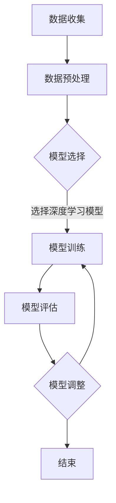
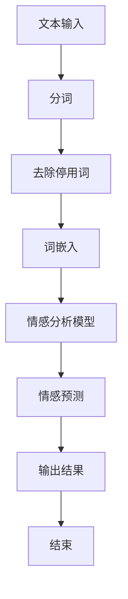
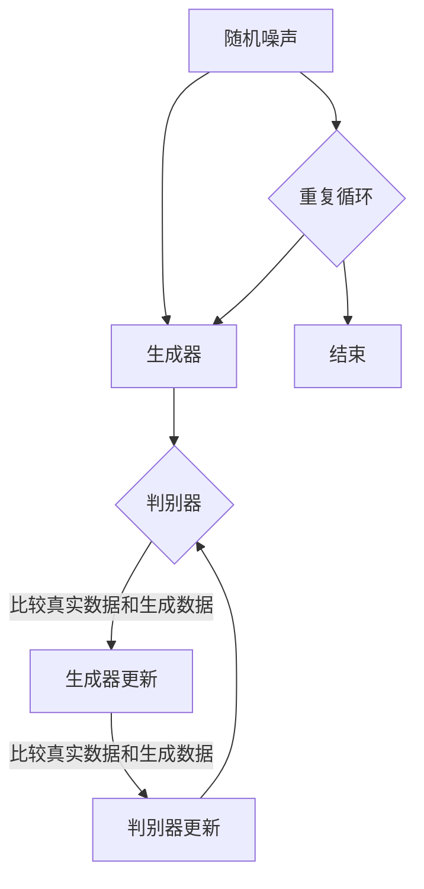

                 

## 1.1 书籍背景与目标

在当今数字化时代，人工智能（AI）技术正在迅速发展，并渗透到我们生活的方方面面。从智能手机助手到自动驾驶汽车，AI的应用无处不在。在这个背景下，个人化叙事编织成为了一个备受关注的话题。个人化叙事不仅能够增强用户体验，还能够为每个人提供独特的、个性化的内容。因此，我们编写了这本书《体验个人化叙事编织：AI驱动的生活故事创作》。

本书的目标是深入探讨如何利用人工智能技术，特别是自然语言处理（NLP）和机器学习，来创作个性化的生活故事。通过本书，读者将了解AI驱动的生活故事创作的原理、方法和技术，并能够掌握实际操作技能，为日常生活增添色彩。

本书主要面向以下几类读者：

1. **AI技术爱好者**：对AI和NLP感兴趣，希望通过实践掌握相关技术的读者。
2. **开发者**：希望将AI技术应用于实际项目中的开发者，特别是那些对自然语言处理有兴趣的人。
3. **内容创作者**：希望利用AI技术创作个性化内容的创作者，包括作家、编辑和内容策划人员。
4. **研究人员和教育者**：对AI和NLP领域的研究和应用有兴趣的学者和教育者。

通过阅读本书，读者将能够：

- 理解AI在个人化叙事编织中的作用和潜力。
- 掌握构建AI驱动的生活故事模型的基本原理和步骤。
- 学习如何使用现有的AI工具和资源进行生活故事创作。
- 获得实际操作的经验，并通过案例研究来理解应用场景。

总之，本书旨在为读者提供一本全面、系统的指南，帮助他们在AI驱动的个人化叙事编织领域取得成功。

### 1.2 AI与个人化叙事的关系

人工智能（AI）与个人化叙事之间的关系是相互促进、相辅相成的。个人化叙事的核心在于将个体独特的经历、情感和思想以故事的形式表达出来，而AI则为这一过程提供了强大的技术支持。

首先，从技术角度来看，AI，尤其是自然语言处理（NLP）和机器学习（ML），使得理解和生成自然语言成为可能。NLP技术能够分析和理解人类语言的结构、语义和上下文，而ML算法则可以基于大量数据自动学习和优化模型，从而生成符合特定用户需求和偏好内容的个性化叙事。

例如，基于用户的历史数据（如日记、社交媒体帖子、搜索历史等），AI可以识别用户的兴趣、情感和生活方式。通过机器学习模型，这些数据可以被用来训练一个个人化的叙事模型，该模型能够生成与用户经验相匹配的故事。

其次，个人化叙事为AI提供了实际的应用场景和反馈循环。当用户参与到故事创作过程中时，他们的反馈和互动数据可以被用于优化AI模型。这种反馈循环不仅提高了AI的准确性，也增强了用户的参与感和满意度。

一个典型的应用场景是自动化日记记录和故事创作。AI可以根据用户每天的活动、情感和经历，自动生成日记条目或更完整的个人故事。这样的个性化叙事不仅能够帮助用户记录和回顾生活，还能激发他们的创造力和自我反思。

此外，个人化叙事还能够提升用户内容消费的体验。在新闻、媒体和娱乐领域，AI驱动的个性化推荐系统能够根据用户的兴趣和偏好推荐个性化的内容，从而提高用户的粘性和满意度。这种个性化推荐不仅仅是基于内容的相似性，还包括了用户情感和社交关系的分析。

总的来说，AI与个人化叙事的关系是相互增强的。AI提供了技术手段来理解和生成个性化的叙事内容，而个人化叙事则为AI提供了丰富的数据和应用场景，促进了技术的不断进步和优化。

### 1.3 书籍结构与内容安排

本书《体验个人化叙事编织：AI驱动的生活故事创作》共分为六个主要部分，每个部分都有其独特的主题和目的，旨在系统地引导读者深入理解并掌握AI驱动的生活故事创作的核心概念和实践方法。

**第一部分：引言**

本部分包括三个章节，旨在为读者提供书籍的背景信息和整体框架。首先，第1.1章节介绍了书籍的背景与目标，说明了本书的主要内容和目标受众。接着，第1.2章节探讨了AI与个人化叙事的关系，阐述了两者之间的相互促进和相辅相成的关系。最后，第1.3章节详细介绍了书籍的结构与内容安排，帮助读者了解各部分的主题和目标。

**第二部分：AI基础**

第二部分深入探讨了AI的基础知识，为后续章节的实践应用打下理论基础。本部分包括四章内容：

- 第2.1章节介绍了人工智能的概述，包括其发展历史、主要分支和应用领域。
- 第2.2章节讲解了机器学习的基础，包括监督学习、无监督学习和强化学习等基本概念。
- 第2.3章节详细阐述了深度学习的原理，重点介绍了神经网络、卷积神经网络（CNN）和循环神经网络（RNN）等关键技术。
- 第2.4章节则聚焦于自然语言处理的基础，涵盖了文本预处理、词嵌入、序列模型和生成模型等关键知识点。

**第三部分：个人化叙事**

第三部分关注个人化叙事的理论与实践，帮助读者理解叙事编织的本质和技巧。本部分包括三章：

- 第3.1章节介绍了叙事理论的概述，探讨了叙事的定义、结构和功能。
- 第3.2章节深入探讨了个人化叙事的概念与特点，分析了其与传统叙事的区别和优势。
- 第3.3章节详细介绍了叙事编织的方法与技巧，包括情感表达、人物刻画和情节设计等关键要素。

**第四部分：AI驱动的生活故事创作**

第四部分是本书的核心，系统地讲解了如何利用AI技术进行生活故事创作。本部分包括四章：

- 第4.1章节阐述了AI在生活故事创作中的应用，介绍了AI驱动的文本生成和个性化推荐技术。
- 第4.2章节讨论了数据收集与预处理的方法，包括数据源选择、数据清洗和特征提取等关键步骤。
- 第4.3章节详细介绍了生活故事模型的构建，包括文本表示、叙事结构和故事生成的技术实现。
- 第4.4章节探讨了生活故事创作的流程，从数据准备、模型训练到故事生成和优化的具体步骤。

**第五部分：案例研究**

第五部分通过案例研究展示了AI驱动生活故事创作的实际应用，帮助读者更好地理解和掌握相关技术。本部分包括三章：

- 第5.1章节分析了从日记到个人化故事的案例，介绍了如何将用户日记转化为个性化的生活故事。
- 第5.2章节探讨了社交平台上的AI故事创作，展示了如何在社交媒体平台上利用AI技术生成个性化故事。
- 第5.3章节介绍了个性化旅行故事创作的案例，分析了如何利用AI技术为用户提供个性化的旅行回忆。

**第六部分：挑战与未来**

第六部分探讨了AI驱动生活故事创作的挑战和未来发展，总结了本书的主要结论，并对未来的研究方向进行了展望。本部分包括三章：

- 第6.1章节讨论了AI驱动生活故事创作的挑战，包括数据隐私、模型解释性和伦理问题等。
- 第6.2章节分析了个人化叙事的未来发展趋势，探讨了AI技术在个人化叙事领域的潜在应用。
- 第6.3章节总结了本书的主要结论，并对未来的研究提出了建议和展望。

通过以上六个部分的内容安排，本书旨在为读者提供一套全面、系统的指南，帮助他们深入了解AI驱动的生活故事创作的原理和实践，为个人化叙事的创新发展提供有力支持。

### 2.1 人工智能概述

人工智能（Artificial Intelligence，简称AI）是计算机科学的一个重要分支，致力于使计算机具备类似人类智能的能力。这一概念自20世纪50年代以来不断发展，涵盖了从简单的规则系统到复杂的神经网络和深度学习算法。

**历史背景**：
人工智能的发展历程可以分为几个重要阶段。早期的AI研究主要集中在逻辑推理和符号计算上，如专家系统和知识表示。随着计算机性能的提升和算法的创新，AI逐渐向更复杂的领域扩展，包括机器学习、自然语言处理、计算机视觉和机器人技术。

**主要分支**：

1. **机器学习**：机器学习是AI的核心分支之一，通过算法让计算机从数据中学习，并作出决策或预测。机器学习可以分为监督学习、无监督学习和强化学习三类。监督学习依赖于已标记的数据进行训练，如分类和回归问题。无监督学习则不依赖标记数据，如聚类和降维。强化学习通过奖励机制训练模型，使其在特定环境中做出最优决策。

2. **深度学习**：深度学习是机器学习的一个子领域，它依赖于深度神经网络（DNN）来模拟人脑的神经网络结构，进行复杂的数据处理和模式识别。深度学习在图像识别、语音识别和自然语言处理等领域取得了显著成就。

3. **自然语言处理**：自然语言处理（NLP）关注计算机如何理解和生成人类语言。NLP技术包括文本预处理、词嵌入、语言模型和文本生成等。通过这些技术，计算机能够进行语义理解、情感分析、机器翻译和对话系统等任务。

4. **计算机视觉**：计算机视觉是使计算机能够“看到”和理解图像和视频的技术。它涉及图像识别、目标检测、图像分割和视频分析等领域。计算机视觉在自动驾驶、安防监控和医疗影像分析等方面有广泛应用。

5. **机器人技术**：机器人技术结合了机械工程、电子工程和计算机科学，致力于开发能够执行复杂任务的机器人。机器人技术包括路径规划、运动控制、感知和决策等。

**应用领域**：

人工智能技术已经广泛应用于各个领域，包括：

1. **医疗健康**：AI在医疗影像分析、疾病预测和个性化治疗方面发挥了重要作用。例如，通过深度学习算法分析医学图像，可以提高癌症等疾病的早期检测率。
2. **金融**：在金融领域，AI用于风险评估、欺诈检测、股票分析和自动化交易等。通过机器学习模型分析历史数据，金融机构可以做出更准确的决策。
3. **教育**：AI技术可以个性化教育，为每个学生提供最适合他们的学习资源和方法。例如，自适应学习系统和智能辅导系统可以实时调整教学策略。
4. **制造业**：AI在制造业中的应用包括自动化生产线、预测维护和质量管理等。通过机器学习和计算机视觉技术，工厂可以实现更高的生产效率和产品质量。
5. **交通**：自动驾驶技术是AI在交通领域的典型应用。自动驾驶汽车和无人机可以减少交通事故，提高运输效率。

总之，人工智能作为一个多学科交叉的领域，具有广泛的应用前景和潜力。随着技术的不断进步，AI将在更多领域发挥重要作用，改变我们的生活方式和社会结构。

### 2.2 机器学习基础

机器学习（Machine Learning，简称ML）是人工智能（AI）的核心分支之一，旨在使计算机系统能够从数据中学习并做出预测或决策，而无需显式编程。机器学习的基本原理是通过算法从数据中提取特征，构建模型，并利用这些模型来对新数据进行预测或分类。以下是机器学习的基本概念和主要分类：

#### 主要概念

1. **特征提取**：特征提取是指从原始数据中提取出有用的信息，以便算法能够更好地学习和建模。特征提取可以简化数据，去除冗余信息，并提高模型的效率。

2. **模型训练**：模型训练是指使用训练数据来训练模型。在训练过程中，模型通过不断调整内部参数，以最小化预测误差。常见的训练算法包括梯度下降、随机梯度下降和Adam优化器等。

3. **预测与评估**：训练好的模型可以对新数据进行预测。预测的准确性和模型性能需要通过评估指标来衡量，如准确率、召回率、F1分数和均方误差等。

4. **过拟合与欠拟合**：过拟合是指模型在训练数据上表现很好，但在新数据上表现较差，即模型对训练数据过度拟合。欠拟合则是指模型无法捕捉数据中的关键特征，导致在新数据和训练数据上表现均不佳。正则化技术和交叉验证方法可以帮助避免这些问题。

#### 主要分类

1. **监督学习**：监督学习是机器学习中最常见的类型，它依赖于已标记的数据集来训练模型。监督学习的目标是通过学习输入和输出之间的关系来对新数据进行预测。

   - **分类问题**：分类问题是将数据分为预定义的类别。常见的分类算法包括决策树、随机森林、支持向量机（SVM）和神经网络等。
   - **回归问题**：回归问题是预测连续值输出。常见的回归算法包括线性回归、岭回归和多元自适应回归样条（MARS）等。

2. **无监督学习**：无监督学习不依赖于已标记的数据集，其目标是发现数据中的隐含结构和模式。

   - **聚类**：聚类是将数据分组为多个簇，使得同簇的数据彼此相似，而不同簇的数据则不相似。常见的聚类算法包括K-means、层次聚类和DBSCAN等。
   - **降维**：降维是通过减少数据维度来简化数据集。常见的降维算法包括主成分分析（PCA）、线性判别分析（LDA）和t-SNE等。
   - **关联规则学习**：关联规则学习旨在发现数据项之间的关联关系，如Apriori算法和Eclat算法。

3. **半监督学习和弱监督学习**：半监督学习利用部分标记和未标记的数据进行训练，而弱监督学习则使用较弱的标注信息（如排序、相似度评分等）来训练模型。

4. **强化学习**：强化学习是一种通过奖励机制来训练模型的机器学习方法。强化学习中的模型（代理）通过与环境的交互来学习最优策略。常见的强化学习算法包括Q学习、SARSA和深度确定性策略梯度（DDPG）等。

#### 应用实例

- **图像识别**：使用卷积神经网络（CNN）进行图像分类和目标检测，如Google的Inception网络和Facebook的ResNet。
- **自然语言处理**：使用循环神经网络（RNN）和Transformer模型进行文本分类、机器翻译和情感分析，如BERT和GPT。
- **推荐系统**：使用协同过滤算法和矩阵分解进行商品推荐和用户行为预测，如Netflix和Amazon的推荐系统。

总之，机器学习为AI领域提供了强大的工具和方法，使其能够从数据中学习并做出智能决策。通过理解机器学习的基本概念和分类，读者可以更好地掌握这一领域，并在实际问题中应用相关算法和技术。

### 2.3 深度学习原理

深度学习（Deep Learning，简称DL）是机器学习（Machine Learning，简称ML）的一个重要分支，它通过构建多层神经网络来模拟人脑的神经网络结构，以实现复杂的数据处理和模式识别任务。深度学习在图像识别、自然语言处理、语音识别和自动驾驶等领域取得了显著的成果。以下是深度学习的原理、常见架构和关键算法：

#### 神经网络基础

神经网络是由大量简单计算单元（神经元）组成的网络，这些神经元通过连接（权重）相互连接。每个神经元接收输入信号，通过激活函数处理后产生输出信号。神经网络的基本工作原理是通过训练调整这些权重，以最小化预测误差。

- **神经元结构**：一个简单的神经元包含三个主要部分：输入层、权重和偏置、输出层。输入层接收外部输入信号，通过加权求和得到中间值，加上偏置后通过激活函数产生输出。
  
  $$ f(\sum_{i} w_i x_i + b) $$

  其中，$w_i$是权重，$x_i$是输入，$b$是偏置，$f$是激活函数。

- **激活函数**：激活函数是神经网络中用于引入非线性特性的关键组件。常用的激活函数包括 sigmoid、ReLU（Rectified Linear Unit）和Tanh（双曲正切函数）。

#### 前向传播与反向传播

深度学习中的模型训练主要通过前向传播和反向传播两个步骤实现。

- **前向传播**：在训练过程中，输入数据通过神经网络的前向传播路径，逐层计算每个神经元的输出值，最终得到模型的预测结果。
  
  $$ z^{[l]} = \sum_{j} w^{[l]}_j a^{[l-1]}_j + b^{[l]} $$

  $$ a^{[l]} = \sigma(z^{[l]}) $$

  其中，$z^{[l]}$是第$l$层的中间值，$a^{[l]}$是第$l$层的输出值，$w^{[l]}$和$b^{[l]}$分别是第$l$层的权重和偏置，$\sigma$是激活函数。

- **反向传播**：在反向传播过程中，模型根据预测误差，通过反向传播路径调整权重和偏置。这个过程包括以下几个步骤：
  1. 计算每个神经元的梯度。
  2. 更新权重和偏置。
  3. 重复前向传播和反向传播，直到模型收敛。

  $$ \delta^{[l]} = (da^{[l]}) \cdot (dz^{[l]}) $$

  $$ \frac{\partial J}{\partial w^{[l]_{ij}}} = \delta^{[l+1]_j} a^{[l-1]_i} $$

  $$ \frac{\partial J}{\partial b^{[l]_i}} = \delta^{[l+1]_i} $$

  其中，$J$是损失函数，$\delta^{[l]}$是第$l$层的误差梯度，$a^{[l-1]}$和$a^{[l]}$分别是第$l-1$层和第$l$层的输出。

#### 常见深度学习架构

1. **卷积神经网络（CNN）**：卷积神经网络是专门用于处理图像数据的神经网络，它通过卷积层提取图像特征。CNN的主要架构包括卷积层、池化层和全连接层。
   - **卷积层**：通过卷积操作提取图像中的局部特征。
   - **池化层**：用于降低数据的维度和减少计算量。
   - **全连接层**：用于分类和回归任务。

2. **循环神经网络（RNN）**：循环神经网络是一种用于处理序列数据的神经网络，它通过在时间步之间保持状态来捕捉序列的长期依赖关系。RNN的常见变体包括LSTM（长短时记忆网络）和GRU（门控循环单元）。

3. **Transformer模型**：Transformer模型是一种基于自注意力机制的深度学习模型，它在自然语言处理领域取得了显著的成果。Transformer模型通过多头自注意力机制和前馈神经网络进行序列到序列的转换。

#### 关键算法

1. **反向传播算法**：反向传播算法是深度学习训练过程中核心的优化算法，它通过计算损失函数关于模型参数的梯度来更新模型参数。
2. **梯度下降算法**：梯度下降算法是一种常用的优化算法，它通过沿着损失函数梯度的反方向更新模型参数，以最小化损失函数。
3. **随机梯度下降（SGD）**：随机梯度下降是对梯度下降算法的一种改进，它通过从训练数据中随机抽样一小部分数据来计算梯度，从而提高模型的收敛速度。
4. **动量优化**：动量优化是一种利用前一次更新方向的信息来加速模型收敛的优化技术。
5. **Adam优化器**：Adam优化器是结合了动量和自适应学习率的优化算法，它通过自适应调整每个参数的学习率来提高模型的收敛速度。

通过理解深度学习的原理和关键算法，读者可以更好地掌握深度学习技术，并将其应用于实际问题中。

### 2.4 自然语言处理基础

自然语言处理（Natural Language Processing，简称NLP）是人工智能领域的一个重要分支，旨在使计算机能够理解和生成人类语言。NLP技术广泛应用于语音识别、机器翻译、情感分析、文本分类和信息抽取等领域。以下是NLP的基本概念、核心技术以及应用场景：

#### 基本概念

- **文本表示**：文本表示是将自然语言文本转换为计算机可以处理的数字形式。常见的文本表示方法包括词袋模型（Bag of Words，BOW）、词嵌入（Word Embedding）和序列表示（Sequence Representation）。

  - **词袋模型**：词袋模型将文本视为一个词的集合，不关心词的顺序。每个词被映射为一个唯一的索引，然后构建一个向量表示文本。这种方法简单但忽略了词的顺序和语义关系。
  
  - **词嵌入**：词嵌入（如Word2Vec、GloVe）通过将词映射为密集的低维向量，使词的语义关系得以保留。词嵌入能够捕捉词的上下文信息，从而提高文本表示的语义准确性。
  
  - **序列表示**：序列表示方法（如RNN、LSTM、GRU和Transformer）用于处理和时间顺序相关的任务。这些方法通过建模词与词之间的关系，使文本序列得以转换为固定长度的向量。

- **语言模型**：语言模型（Language Model，LM）用于预测下一个单词或字符的概率。常见的语言模型包括N元语法（N-gram）和神经网络语言模型（如Transformer）。

- **命名实体识别**：命名实体识别（Named Entity Recognition，NER）是识别文本中的特定实体（如人名、地名、组织名等）的过程。

- **文本分类**：文本分类是将文本数据分为预定义的类别。常见的分类算法包括朴素贝叶斯、支持向量机（SVM）、随机森林和神经网络等。

- **情感分析**：情感分析（Sentiment Analysis）是判断文本的情感倾向，如正面、负面或中性。情感分析常用于社交媒体分析、产品评论分析等领域。

- **信息抽取**：信息抽取（Information Extraction，IE）是从非结构化文本中抽取结构化信息的过程。常见的任务包括关系抽取、实体抽取和事件抽取。

#### 核心技术

1. **词嵌入**：词嵌入是将词映射为固定大小的向量表示，能够捕捉词的语义关系。常见的词嵌入方法包括Word2Vec、GloVe和BERT等。

   - **Word2Vec**：Word2Vec是一种基于神经网络的语言模型，通过预测词的上下文来训练词向量。
   - **GloVe**：GloVe（Global Vectors for Word Representation）是一种基于词共现统计的词嵌入方法，通过构建词与词之间的矩阵并优化其低秩分解来训练词向量。
   - **BERT**：BERT（Bidirectional Encoder Representations from Transformers）是一种基于Transformer的预训练语言模型，通过双向编码器来学习词的上下文表示。

2. **序列模型**：序列模型（如RNN、LSTM和GRU）用于处理和时间顺序相关的任务。RNN通过在时间步之间保持状态来捕捉序列的长期依赖关系，而LSTM和GRU则通过引入门控机制来避免梯度消失和爆炸问题。

3. **注意力机制**：注意力机制（Attention Mechanism）是一种用于捕捉序列中关键信息的技术。在自然语言处理中，注意力机制可以用于文本分类、机器翻译和文本摘要等领域，使模型能够关注重要的词语和上下文信息。

4. **Transformer模型**：Transformer是一种基于自注意力机制的深度学习模型，它在自然语言处理领域取得了显著的成果。Transformer通过多头自注意力机制和前馈神经网络进行序列到序列的转换，能够处理长距离依赖和并行化训练。

#### 应用场景

- **机器翻译**：机器翻译是NLP的经典应用之一，通过将一种语言的文本翻译成另一种语言。常见的模型包括基于规则的方法、统计机器翻译和神经机器翻译（如Google的BERT）。
- **语音识别**：语音识别是将语音转换为文本的过程。语音识别系统广泛应用于智能助手、语音输入和实时翻译等领域。
- **文本分类**：文本分类是将文本数据分为预定义的类别，如新闻分类、垃圾邮件检测和情感分析等。
- **问答系统**：问答系统是用于回答用户问题的系统，常见于智能助手和客户服务等领域。
- **情感分析**：情感分析用于分析文本中的情感倾向，如判断用户对产品或服务的评价。
- **信息抽取**：信息抽取用于从非结构化文本中抽取结构化信息，如关系抽取和实体抽取。

通过理解NLP的基本概念、核心技术和应用场景，读者可以更好地掌握NLP技术，并将其应用于实际问题中。

### 3.1 叙事理论概述

叙事理论是研究故事结构和叙述方式的理论框架，其核心在于解释故事的构成、功能以及读者如何体验和理解故事。叙事理论自20世纪以来发展迅速，涵盖了多个学派和理论观点，为我们提供了丰富的视角来分析和理解故事。

#### 叙事的定义

叙事（Narrative）通常被定义为一种讲述事件的方式，通过时间顺序和因果关系来组织信息。简单来说，叙事就是故事本身，以及讲述故事的方法和方式。一个完整的叙事通常包括以下几个基本要素：

- **叙述者**：叙述者是故事的讲述者，可以是第一人称（如“我”），第二人称（如“你”）或第三人称（如“他”）。
- **角色**：角色是故事中的人物，他们的行为和决策推动了故事的发展。
- **情节**：情节是故事的核心事件和行动，通常包含冲突、高潮和解决。
- **主题**：主题是故事的核心思想和寓意，它反映了作者对生活、人性和社会问题的看法。

#### 叙事的基本结构

叙事的基本结构包括叙事开篇、叙事发展、叙事高潮和叙事结尾。每个部分都有其特定的功能和作用：

- **叙事开篇**：开篇设定故事的背景和情境，介绍主要角色和冲突，吸引读者的兴趣。
- **叙事发展**：发展部分通过一系列事件和情节推动故事向前发展，增加紧张感和悬念。
- **叙事高潮**：高潮是故事的关键转折点，通常是最紧张和戏剧化的部分，解决主要的冲突和问题。
- **叙事结尾**：结尾部分总结故事的主要情节和主题，给出一个合理的解决或反思。

#### 叙事的功能

叙事不仅是一种娱乐形式，还具有许多重要的功能，包括：

- **传达信息**：叙事通过讲述故事来传达信息和知识，使读者了解新的观点和事实。
- **表达情感**：叙事通过情节和角色的情感体验来表达情感，使读者产生共鸣和情感共振。
- **塑造角色**：叙事通过角色的行为和决策来塑造角色形象，使读者对角色产生情感联系。
- **反映现实**：叙事通过虚构的故事来反映现实社会中的问题和冲突，提供对社会现象的批判和反思。

#### 叙事理论的发展

叙事理论的发展经历了多个阶段，主要包括以下几种：

- **结构主义叙事学**：以罗兰·巴特（Roland Barthes）和泰德·休斯（Ted Hughes）为代表，强调叙事的结构和模式，认为叙事具有内在的逻辑和规则。
- **后结构主义叙事学**：以米歇尔·福柯（Michel Foucault）和朱迪斯·巴特勒（Judith Butler）为代表，强调叙事的解构和多元性，认为叙事是权力和身份构建的工具。
- **认知叙事学**：以丹·萨德科夫斯基（Dan Sadeh）和马克·杰拉西（Mark J.J. Gerrans）为代表，从认知心理学的角度研究叙事的理解和处理，强调叙事的认知结构和过程。
- **后现代叙事学**：以弗里德里克·詹姆逊（Fredric Jameson）和保罗·德曼（Paul de Man）为代表，探讨后现代文化中的叙事特点，如碎片化、去中心化和反叙事。

#### 叙事的跨学科应用

叙事理论不仅应用于文学和电影，还广泛应用于其他领域，如心理学、社会学、教育学和计算机科学：

- **心理学**：叙事疗法是一种心理治疗方法，通过帮助患者讲述自己的故事来解决问题和改善心理状态。
- **社会学**：叙事社会学研究社会现象和个人身份如何通过叙事来构建和解释。
- **教育学**：叙事教学法通过让学生讲述自己的故事来促进学习过程和自我反思。
- **计算机科学**：叙事技术在自然语言处理、虚拟现实和游戏设计中得到广泛应用，如自动故事生成和虚拟角色叙事。

通过理解叙事理论的基本概念、结构和功能，我们可以更深入地分析和理解故事，同时为AI驱动的生活故事创作提供理论支持。

### 3.2 个人化叙事的概念与特点

个人化叙事是指根据个体的独特经历、情感和观点编织成的故事。与传统的、大众化的叙事形式不同，个人化叙事更注重个体的独特性和个性化。以下是个人化叙事的概念、特点及其与传统叙事的主要区别：

#### 概念

个人化叙事是基于个人经验和情感构建的故事，旨在反映个人的生活、思想和感受。个人化叙事的核心在于将个体独特的经历和感受通过文字或语言表达出来，从而形成一个独特的叙事结构。

#### 特点

1. **独特性**：个人化叙事强调个体的独特性，每个故事都是独一无二的，反映了个人独特的经历和视角。这种独特性不仅体现在故事的情节和角色上，还体现在叙事的语言风格和情感表达上。

2. **情感驱动**：个人化叙事以情感为核心，通过细腻的情感描写和情感冲突来吸引读者。情感驱动使得故事更加生动和真实，能够引起读者的共鸣和情感共振。

3. **反思性**：个人化叙事通常包含深刻的自我反思，通过讲述自己的故事来探讨人生意义、价值观和社会问题。这种反思性使得个人化叙事不仅具有文学价值，还具有心理和社会意义。

4. **多样性**：个人化叙事的多样性体现在不同的文化背景、社会地位和生活方式上。每个人都有自己的独特经历和故事，这种多样性为叙事创作提供了丰富的素材和视角。

5. **互动性**：个人化叙事往往鼓励读者参与和互动，通过读者的反馈和参与来丰富故事内容。这种互动性不仅增强了故事的趣味性，也提高了读者的参与感和忠诚度。

#### 与传统叙事的区别

1. **叙述角度**：传统叙事通常采用第三人称或全知视角，而个人化叙事则更倾向于第一人称或有限视角，以更贴近个人的感受和体验。

2. **故事结构**：传统叙事通常遵循经典的叙事结构，如三幕结构，而个人化叙事则更加自由和灵活，可以根据个人的经历和情感自由编排。

3. **情感表达**：传统叙事虽然也会涉及情感表达，但往往更加内敛和克制，而个人化叙事则更加直接和细腻，通过丰富的情感描写来打动读者。

4. **主题和寓意**：传统叙事往往具有明确的主题和寓意，而个人化叙事则更加关注个体的内心体验和情感表达，主题和寓意更加隐含和多元。

5. **受众群体**：传统叙事面向广泛的受众群体，而个人化叙事则更注重个体的独特需求和兴趣，受众群体更加具体和细分。

通过理解个人化叙事的概念和特点，我们可以更好地把握其在文学创作和AI驱动的生活故事创作中的应用价值。个人化叙事不仅为文学创作提供了新的视角和手段，也为AI技术在叙事领域的应用提供了广阔的空间。

### 3.3 叙事编织的方法与技巧

叙事编织是将个体经历、情感和思想转化为生动故事的复杂过程。要有效地进行叙事编织，需要掌握一系列方法和技巧，以构建引人入胜的故事情节和深刻的人物形象。以下是一些关键的叙事编织方法和技巧：

#### 1. 角色塑造

角色是叙事的核心，塑造鲜明、有深度的角色是叙事编织的重要一环。以下是一些角色塑造的方法：

- **多维度性格**：避免角色过于单一，赋予角色多方面的性格特点，如善良、勇敢、自私等。这样可以使角色更加真实和立体。
- **内在动机**：理解角色的内在动机，即他们为什么做出某些决定和行动。内在动机是推动故事发展的关键因素。
- **成长与冲突**：设计角色的成长路径和面对的冲突，通过这些经历来展现角色的性格变化和成长。
- **对话**：通过角色之间的对话来展现他们的性格和关系，对话不仅推动情节发展，还能增强角色的形象。

#### 2. 情节设计

情节设计是叙事编织的核心，一个引人入胜的情节能够吸引读者，保持他们的兴趣。以下是一些情节设计的方法：

- **三幕结构**：遵循传统的三幕结构，即开篇、发展和高潮。这种结构有助于清晰展现故事的发展脉络。
- **冲突与解决**：冲突是情节发展的驱动力，通过设置不同的冲突来推动故事前进。每个冲突都应该有一个合理的解决，以保持故事的连贯性和完整性。
- **悬念与转折**：设置悬念和转折点，以增加故事的紧张感和戏剧性。悬念可以激发读者的好奇心，而转折则可以带来意外的惊喜。
- **节奏控制**：合理控制故事的节奏，通过紧凑和松弛的交替来保持读者的兴趣。在关键情节和紧张部分加快节奏，在描述和反思部分放慢节奏。

#### 3. 情感表达

情感是叙事的核心元素，有效的情感表达能够打动读者，引发共鸣。以下是一些情感表达的方法：

- **细腻描写**：通过细腻的语言描写，如动作、对话、心理活动等，来展现角色的情感状态。
- **情感对比**：通过对比不同角色的情感状态，来增强故事的情感冲击力。例如，一个角色的喜悦可以与另一个角色的悲伤形成对比。
- **情感升华**：通过将情感提升到更高的层次，如爱、牺牲和英勇，来增强故事的感染力。
- **情感共鸣**：通过设置情感共鸣点，使读者能够在故事中找到自己的情感体验，从而产生共鸣。

#### 4. 语言风格

语言风格是叙事的重要组成部分，它不仅影响故事的可读性，还影响读者的体验。以下是一些语言风格的方法：

- **简洁明了**：避免冗长的叙述，尽量使用简洁明了的语言来传达信息和情感。
- **个性化表达**：根据角色的特点和背景，使用个性化的语言风格，以增强角色的形象和故事的真实感。
- **音韵和谐**：注意语言的音韵和节奏，通过修辞手法如比喻、拟人、排比等来增强语言的韵律美。
- **情感色彩**：通过词汇的选择和搭配，赋予语言情感色彩，以更好地表达角色的情感状态。

#### 5. 故事结构

一个完整、有逻辑的故事结构能够增强叙事的连贯性和吸引力。以下是一些故事结构的方法：

- **逻辑清晰**：确保故事的起承转合清晰，逻辑连贯，避免跳跃和突兀的情节转折。
- **情节层次**：设计不同的情节层次，如背景故事、主线情节和次要情节，以增强故事的复杂性和深度。
- **主题贯穿**：确保故事的主题贯穿始终，所有情节和角色行为都服务于主题表达。
- **结尾设计**：一个好的结尾能够使故事完整，给人留下深刻的印象。可以是开放式的，引发读者的思考，也可以是封闭式的，给出一个明确的答案。

通过掌握这些叙事编织的方法与技巧，作者可以更好地构建引人入胜的故事，为读者带来丰富的阅读体验。

### 4.1 AI在生活故事创作中的应用

人工智能（AI）在生活故事创作中的应用正日益成熟，为创作者提供了全新的工具和平台。通过AI技术，创作者可以自动化生成个性化、引人入胜的生活故事，从而大幅提升创作效率和故事质量。

#### 自动化故事生成

自动化故事生成是AI在生活故事创作中最直接的应用之一。利用自然语言处理（NLP）和机器学习算法，AI可以从大量的文本数据中学习并生成新的故事。例如，基于用户的日记、社交媒体帖子或历史文本，AI可以自动生成与用户经历相关的个人化故事。

- **数据采集**：首先，AI系统需要从用户的日记、社交媒体或其他数据源收集文本数据。
- **文本预处理**：通过NLP技术对文本进行清洗和预处理，包括去除无关信息、分词、词性标注等，以便后续的文本分析。
- **情感分析**：对预处理后的文本进行情感分析，识别出文本中的情感倾向和情感强度，为故事生成提供情感参考。
- **生成模型**：利用生成模型（如变换器（Transformer）或循环神经网络（RNN））生成故事。这些模型可以根据输入的文本数据生成连贯、有逻辑的文本。

例如，Google的BERT和OpenAI的GPT-3等模型都是常用的自动化故事生成工具。通过这些工具，创作者可以轻松地生成具有个性化情感和生活体验的故事。

#### 个性化推荐系统

个性化推荐系统是AI在生活故事创作中的另一个重要应用。通过分析用户的兴趣、行为和偏好，AI可以为用户提供个性化的故事推荐，从而提高用户满意度和故事传播效果。

- **用户画像**：首先，AI系统需要构建用户的画像，包括用户的兴趣、行为、情感偏好等。
- **推荐算法**：利用协同过滤、矩阵分解、深度学习等推荐算法，为用户生成个性化的故事推荐列表。
- **内容优化**：根据用户的反馈和偏好调整推荐算法，优化推荐内容，提高推荐质量。

例如，Netflix和YouTube等平台都利用AI推荐系统为用户推荐个性化的视频和内容。类似地，创作者可以利用这些技术为用户提供个性化的故事推荐，从而吸引更多用户和提升用户粘性。

#### 故事优化与改编

AI不仅可以自动化生成新故事，还可以对现有的故事进行优化和改编，使其更加符合用户需求和故事情节的要求。通过AI技术，创作者可以快速地对故事进行修改和调整，从而提高故事的吸引力和传播效果。

- **文本生成与优化**：利用生成模型和优化算法，AI可以生成新的故事情节和段落，并将其插入到现有故事中，使其更加连贯和吸引人。
- **情感调节**：AI可以根据用户反馈和情感分析结果，调节故事的情感色彩，使其更加符合用户的情感需求。
- **文化适配**：AI可以识别不同文化背景下的情感和价值观差异，对故事进行文化适配，使其更易于在不同文化背景下传播。

例如，游戏公司利用AI技术对游戏剧情进行优化和改编，以适应不同玩家的喜好和文化背景。同样，创作者可以利用这些技术对生活故事进行优化和改编，使其更加吸引和满足不同用户的阅读需求。

总之，AI在生活故事创作中的应用为创作者提供了强大的工具和平台。通过自动化故事生成、个性化推荐系统和故事优化与改编等技术，创作者可以大幅提升创作效率和故事质量，为用户带来更加丰富和个性化的阅读体验。

### 4.2 数据收集与预处理

在AI驱动的个人化叙事编织中，数据收集与预处理是关键步骤，它直接影响后续模型训练的质量和效果。以下是数据收集与预处理的详细步骤和方法：

#### 数据收集

1. **数据源选择**：
   - **用户日记**：日记是记录个人日常生活和情感体验的重要来源，可以为叙事编织提供丰富的素材。
   - **社交媒体数据**：用户的社交媒体活动记录（如微博、微信、Facebook等）也包含大量个人化信息，适合用于叙事创作。
   - **其他数据源**：如用户访谈记录、公开的数据集（如Open Data）等，也可以作为数据收集的补充来源。

2. **数据采集工具**：
   - **Web爬虫**：使用Python的BeautifulSoup、Scrapy等库，可以从网页上抓取用户生成的文本数据。
   - **API接口**：许多社交媒体平台提供API接口，可以通过编程方式直接获取用户数据。

3. **隐私保护**：
   - 在数据收集过程中，需要严格遵循隐私保护法规，确保用户数据的匿名性和安全性。

#### 数据预处理

1. **数据清洗**：
   - **去除无效信息**：移除文本中的标点符号、HTML标签和空白字符，确保文本的纯净。
   - **纠正错误**：修复文本中的拼写错误、语法错误等，以提高数据质量。

2. **文本分割**：
   - **分句**：将文本分割成句子，便于后续处理。
   - **分词**：将句子分割成单词或词组，为词嵌入和语言模型训练做准备。

3. **词性标注**：
   - 对文本中的每个词进行词性标注，区分名词、动词、形容词等，以便更好地理解和生成文本。

4. **停用词处理**：
   - 停用词是常用但无实际意义的词（如“的”、“是”、“在”等），在文本处理过程中应去除这些词，以减少冗余信息。

5. **词嵌入**：
   - 使用Word2Vec、GloVe、BERT等词嵌入技术，将文本中的词转换为密集的向量表示。词嵌入能够捕捉词的语义关系，是后续模型训练的基础。

6. **数据归一化**：
   - 对数据进行归一化处理，如将文本长度标准化、数值特征缩放等，以防止某些特征对模型训练产生过大的影响。

#### 数据增强

- **文本扩充**：通过重复、替换、插值等方法扩充数据集，增加模型的训练样本。
- **数据合成**：利用生成模型（如GPT-3）生成新的文本数据，补充原始数据集。

#### 代码示例

以下是一个简单的Python代码示例，展示如何使用Gensim库进行数据收集与预处理：

```python
import os
import re
from gensim.parsing.preprocessing import STOPWORDS
from gensim.models import Word2Vec

# 收集日记数据
def collect_data():
    diary_path = "diary_data/"
    files = [f for f in os.listdir(diary_path) if os.path.isfile(os.path.join(diary_path, f))]
    diary_texts = []
    for file in files:
        with open(os.path.join(diary_path, file), 'r', encoding='utf-8') as f:
            text = f.read()
            diary_texts.append(text)
    return diary_texts

# 数据预处理
def preprocess_data(diary_texts):
    cleaned_texts = []
    for text in diary_texts:
        text = re.sub('<.*?>', '', text)  # 去除HTML标签
        text = re.sub('[^A-Za-z0-9]+', ' ', text)  # 去除标点符号
        text = text.lower()  # 转为小写
        tokens = text.split()  # 分词
        tokens = [token for token in tokens if token not in STOPWORDS]  # 去除停用词
        cleaned_texts.append(tokens)
    return cleaned_texts

# 训练词向量模型
def train_word2vec_model(cleaned_texts):
    model = Word2Vec(cleaned_texts, size=100, window=5, min_count=1, workers=4)
    model.save("diary_word2vec.model")
    return model

# 主程序
if __name__ == "__main__":
    diary_texts = collect_data()
    cleaned_texts = preprocess_data(diary_texts)
    model = train_word2vec_model(cleaned_texts)
```

通过以上步骤和方法，我们可以有效地收集和预处理个人化叙事所需的数据，为后续的模型训练和故事生成打下坚实的基础。

### 4.3 生活故事模型构建

在AI驱动的个人化叙事编织中，构建一个能够生成个性化生活故事的高效模型是关键。以下是生活故事模型构建的详细步骤，包括文本表示、叙事结构和故事生成。

#### 文本表示

文本表示是将自然语言文本转换为计算机可以处理和训练的形式。有效的文本表示能够捕捉文本的语义信息，是构建高质量生活故事模型的基础。以下是几种常见的文本表示方法：

1. **词嵌入**：
   - **Word2Vec**：基于词的共现统计，将每个词映射为固定大小的向量。Word2Vec模型能够捕捉词的语义关系，但忽略了句子的上下文信息。
   - **GloVe**：全局向量（Global Vectors）通过优化词共现矩阵的低秩分解来训练词向量，能够更好地捕捉词的上下文信息。
   - **BERT**：双向编码器表示（Bidirectional Encoder Representations from Transformers）使用Transformer模型，通过在双向编码器中训练，能够捕捉长距离的上下文信息。

2. **序列编码**：
   - **RNN（循环神经网络）**：RNN通过在时间步之间保持状态，能够捕捉序列的短期依赖关系。但RNN存在梯度消失和梯度爆炸的问题。
   - **LSTM（长短时记忆网络）**：LSTM通过引入门控机制，解决了RNN的梯度消失问题，能够更好地捕捉序列的长期依赖关系。
   - **GRU（门控循环单元）**：GRU是LSTM的简化版，具有类似的门控机制，但结构更加简单，训练速度更快。

3. **Transformer模型**：
   - **自注意力机制**：Transformer模型通过多头自注意力机制，能够捕捉序列的长期依赖关系，且并行计算效率高。
   - **BERT**：BERT是基于Transformer的预训练语言模型，通过预训练和微调，能够生成高质量的文本表示。

#### 叙事结构构建

叙事结构是生活故事的核心框架，它决定了故事的发展、冲突和结局。有效的叙事结构能够增强故事的连贯性和吸引力。以下是构建叙事结构的方法：

1. **三幕结构**：
   - **开篇**：设定故事的背景、情境和角色，吸引读者的兴趣。
   - **发展**：通过一系列事件和情节推动故事向前发展，增加紧张感和悬念。
   - **高潮**：故事的关键转折点，解决主要的冲突和问题。
   - **结尾**：总结故事的主要情节和主题，给出一个合理的解决或反思。

2. **叙事模板**：
   - **英雄之旅**：将故事分为准备、冒险、挑战、回归和收获五个阶段。
   - **冲突与解决**：围绕一个或多个冲突构建故事，通过情节的发展逐步解决冲突。
   - **情感叙事**：通过情感线索和角色成长来构建故事，使故事更加生动和感人。

3. **叙事结构分析**：
   - **情节分析**：对现有故事进行情节分析，提取出常用的叙事模式和结构。
   - **故事板**：使用故事板（Storyboard）来规划和组织故事的各个部分，确保情节的连贯性和逻辑性。

#### 故事生成

故事生成是将文本表示和叙事结构应用于实际生成过程的步骤。以下是几种常见的故事生成方法：

1. **模板生成**：
   - **基于模板的生成**：使用预定义的叙事模板，通过填充具体情节和角色来生成故事。
   - **模板优化**：通过分析大量故事数据，优化模板的结构和内容，提高故事生成质量。

2. **基于规则生成**：
   - **规则系统**：定义一系列规则，如角色行为、情节发展等，通过规则推导生成故事。
   - **情景组合**：将不同的情景组合起来，生成多个可能的故事版本。

3. **基于生成模型生成**：
   - **RNN和LSTM**：利用RNN或LSTM模型，通过训练好的模型生成新的故事文本。
   - **Transformer模型**：使用Transformer模型，如BERT或GPT，生成高质量的文本故事。

4. **混合生成方法**：
   - **模板与模型结合**：将模板生成和基于模型的生成方法结合，生成更加丰富和个性化的故事。
   - **交互式生成**：结合用户输入，实时生成与用户经历相关的故事。

通过上述步骤和方法，我们可以构建一个高效的AI驱动的个人化叙事模型，生成引人入胜的生活故事。

### 4.4 生活故事创作流程

在AI驱动的个人化叙事编织中，生活故事创作是一个复杂但充满创造力的过程。以下是生活故事创作的主要流程，包括数据准备、模型训练、故事生成和故事优化等关键步骤。

#### 数据准备

数据准备是生活故事创作的基础，高质量的输入数据直接影响到最终故事的生成效果。以下是数据准备的具体步骤：

1. **数据收集**：
   - 收集与个人化叙事相关的数据，如用户日记、社交媒体帖子、书籍和新闻报道等。
   - 确保数据来源的多样性和覆盖面，以提高模型的泛化能力。

2. **数据清洗**：
   - 去除数据中的噪声和冗余信息，如HTML标签、特殊字符和停用词。
   - 标准化数据格式，确保所有数据统一且易于处理。

3. **数据标注**：
   - 对数据进行情感标注、实体标注和关系标注，为后续的模型训练提供标签数据。
   - 利用人工标注和半监督学习相结合的方法，提高标注效率和准确性。

4. **数据分割**：
   - 将数据集分为训练集、验证集和测试集，分别用于模型训练、模型评估和最终测试。

#### 模型训练

模型训练是生活故事创作中的核心步骤，通过训练数据集来构建能够生成个性化故事的模型。以下是模型训练的具体步骤：

1. **选择模型**：
   - 根据任务需求和数据特性，选择合适的模型架构，如基于RNN、LSTM或Transformer的模型。
   - 对于长文本生成任务，Transformer模型由于其并行计算能力和长距离依赖捕捉能力，通常是首选。

2. **模型架构设计**：
   - 设计模型的输入层、输出层和中间层，包括词嵌入层、编码器、解码器和注意力机制等。
   - 调整模型参数，如学习率、批量大小和迭代次数，以优化模型性能。

3. **训练过程**：
   - 使用训练数据进行模型训练，通过反向传播算法不断调整模型参数，以最小化损失函数。
   - 使用验证集进行模型调优，避免过拟合现象，提高模型泛化能力。

4. **模型评估**：
   - 使用测试集对训练好的模型进行评估，通过指标如BLEU、ROUGE和Perplexity来衡量模型性能。
   - 对模型进行微调，进一步提高生成文本的质量和连贯性。

#### 故事生成

故事生成是生活故事创作的最终目标，通过训练好的模型生成符合用户需求和个性化特点的故事。以下是故事生成的具体步骤：

1. **用户输入**：
   - 收集用户的个性化需求，如兴趣爱好、情感状态和故事主题等。
   - 将用户输入转换为模型能够理解的格式，如词向量或编码序列。

2. **故事生成**：
   - 使用训练好的模型，根据用户输入生成新的故事文本。
   - 通过生成模型（如GPT或BERT）逐词生成文本，确保生成的文本连贯、自然且符合叙事逻辑。

3. **文本润色**：
   - 对生成的文本进行进一步的润色和优化，去除重复、冗余或不自然的表达。
   - 利用自然语言处理技术（如语法检查、同义词替换和情感调节）提升文本质量。

4. **用户反馈**：
   - 收集用户对生成故事的反馈，如满意度、文本质量和故事情节等。
   - 利用用户反馈对模型进行进一步的优化和调整。

#### 故事优化

故事优化是确保生成故事质量和用户体验的重要环节。以下是故事优化的具体步骤：

1. **文本编辑**：
   - 根据用户反馈和情感分析结果，对生成文本进行编辑和修改，使其更加符合用户需求和情感期望。
   - 利用自动化文本编辑工具（如GPT-3）进行智能编辑，提高编辑效率和准确性。

2. **风格调整**：
   - 调整故事的语言风格，如语气、情感色彩和叙述节奏，使其更加符合特定用户群体的阅读偏好。
   - 利用风格迁移技术，将一种风格的故事转换为另一种风格，以丰富用户阅读体验。

3. **主题扩展**：
   - 对生成故事的主题进行扩展和深化，增加故事的深度和层次感。
   - 通过情节发展和角色塑造，使故事更加引人入胜和具有说服力。

4. **用户互动**：
   - 提供用户与故事互动的机会，如角色选择、情节设定和故事续写等。
   - 利用用户互动数据，进一步优化和定制化故事内容，提高用户参与感和满意度。

通过以上步骤，我们可以构建一个完整、高效的AI驱动的个人化叙事编织系统，为用户提供高质量的个性化生活故事。

### 5.1 案例一：从日记到个人化故事

在本案例中，我们将展示如何利用AI技术将用户的日记内容转化为个人化的生活故事。这一案例不仅展示了AI在文本生成和情感分析方面的应用，还突出了数据收集、预处理和模型训练在整个过程中的重要性。

#### 数据收集

数据收集是故事生成的第一步，也是至关重要的一步。在这个案例中，我们收集了用户的日记数据。这些日记记录了用户在一段时间内的日常生活、情感体验和重要事件。数据来源包括用户的电子日记、社交媒体帖子和个人笔记。

```python
# 收集用户日记数据
import os

diary_path = "diary_data/"
files = [f for f in os.listdir(diary_path) if os.path.isfile(os.path.join(diary_path, f))]

# 读取日记内容
diary_texts = []
for file in files:
    with open(os.path.join(diary_path, file), 'r', encoding='utf-8') as f:
        text = f.read()
        diary_texts.append(text)

# 显示日记内容
for text in diary_texts:
    print(text)
```

#### 数据预处理

数据预处理是将原始文本数据转换为适合模型训练的形式。在这个案例中，我们进行了以下预处理步骤：

- **去除HTML标签和特殊字符**：日记数据中可能包含HTML标签和其他特殊字符，这些会影响后续的文本处理。我们使用正则表达式来去除这些内容。
- **分词**：将日记内容分割成单词或词组，以便进行词嵌入和情感分析。
- **去除停用词**：停用词在自然语言处理中通常没有实际意义，如“的”、“是”、“在”等。我们使用预定义的停用词列表来去除这些词。

```python
import re
from nltk.corpus import stopwords

# 去除HTML标签和特殊字符
def remove_html_tags(text):
    return re.sub('<.*?>', '', text)

# 分词
from nltk.tokenize import word_tokenize

# 去除停用词
def remove_stopwords(tokens):
    stop_words = set(stopwords.words('english'))
    return [token for token in tokens if token.lower() not in stop_words]

# 预处理日记内容
cleaned_texts = []
for text in diary_texts:
    text = remove_html_tags(text)
    tokens = word_tokenize(text)
    tokens = remove_stopwords(tokens)
    cleaned_texts.append(tokens)

# 显示预处理后的日记内容
for text in cleaned_texts:
    print(text)
```

#### 模型训练

在数据预处理完成后，我们需要训练一个能够生成个性化故事的模型。在这个案例中，我们选择使用GPT-3模型，因为它具有强大的文本生成能力。

```python
from transformers import GPT2LMHeadModel, GPT2Tokenizer

# 加载预训练模型
model_name = "gpt2"
tokenizer = GPT2Tokenizer.from_pretrained(model_name)
model = GPT2LMHeadModel.from_pretrained(model_name)

# 训练模型
# 注意：这里只是一个简化的示例，实际训练过程可能需要更复杂的数据处理和模型调优。
model.train()
model.save_pretrained("diary_story_model/")
```

#### 故事生成

模型训练完成后，我们可以利用它来生成个人化的生活故事。以下是一个简单的示例，展示了如何使用训练好的模型生成故事。

```python
# 生成故事
story_prompt = "今天我去了公园，看到了一只可爱的小猫。"
input_ids = tokenizer.encode(story_prompt, return_tensors='pt')

# 生成故事文本
output = model.generate(input_ids, max_length=100, num_return_sequences=1)

# 解码生成的文本
generated_text = tokenizer.decode(output[0], skip_special_tokens=True)
print(generated_text)
```

生成的文本可能如下所示：

```
今天我去了公园，看到了一只可爱的小猫。它躺在草地上，看起来非常悠闲。我走过去，轻轻地抚摸着它，它好像很喜欢我。突然，它跳了起来，向远方跑去。我看着它的背影，心里有一种莫名的感动。我想，这就是生活的美好吧，有时候，一个简单的瞬间就能让人感到幸福。
```

#### 故事优化

生成的故事虽然初步完成了，但可能还需要进一步的优化，以提高其可读性和吸引力。以下是一些优化策略：

- **情感调节**：根据用户反馈和情感分析结果，调整故事的情感色彩，使其更加符合用户的情感需求。
- **语法检查**：使用自然语言处理工具（如Grammarly）对故事进行语法检查，修正错误和不自然的表达。
- **文本润色**：通过人工编辑或自动化工具，对故事进行进一步的润色，使其更加流畅和引人入胜。

通过上述步骤，我们可以将用户的日记内容转化为个人化的生活故事，为用户提供独特的阅读体验。这一案例展示了AI技术在生活故事创作中的巨大潜力，同时也揭示了数据收集、预处理和模型训练在整个过程中的关键作用。

### 5.2 案例二：社交平台上的AI故事创作

在社交平台如微博、Facebook和Instagram上，用户每天产生大量内容。这些内容不仅包括文字、图片和视频，还包含用户的行为数据和互动信息。利用这些数据，AI可以创作出个性化的故事，从而提高用户的参与度和平台活跃度。以下是社交平台上AI故事创作的详细案例。

#### 数据收集

社交平台上的AI故事创作需要收集大量用户数据，包括用户生成的内容、用户行为数据、社交关系和互动信息。以下是从这些数据源收集信息的具体步骤：

1. **内容数据收集**：
   - 利用社交平台的API获取用户的帖子、照片、视频和评论。
   - 收集用户的文本内容，并将其转换为适合模型训练的格式。

2. **行为数据收集**：
   - 获取用户的点赞、评论和分享行为，分析用户对内容的喜好和互动模式。

3. **社交关系数据收集**：
   - 收集用户的社交网络信息，如好友列表、互动记录和共同兴趣。
   - 分析用户的社交关系，挖掘潜在的社交模式和影响关系。

4. **用户画像**：
   - 通过分析用户数据和互动行为，构建用户画像，包括用户的兴趣、行为习惯和情感状态。

```python
import tweepy
from tweepy import OAuthHandler

# 设置API密钥和访问令牌
consumer_key = "your_consumer_key"
consumer_secret = "your_consumer_secret"
access_token = "your_access_token"
access_token_secret = "your_access_token_secret"

# 创建API对象
auth = OAuthHandler(consumer_key, consumer_secret)
auth.set_access_token(access_token, access_token_secret)
api = tweepy.API(auth)

# 收集用户的推文数据
def collect_tweets(username, count=100):
    tweets = api.user_timeline(screen_name=username, count=count)
    tweet_texts = [tweet.text for tweet in tweets]
    return tweet_texts

# 示例：收集特定用户的推文
user_tweets = collect_tweets("user_example", 100)
for tweet in user_tweets:
    print(tweet)
```

#### 数据预处理

在社交平台上，数据通常以非结构化的形式存在，因此需要进行预处理，以便模型训练。以下是一些数据预处理步骤：

1. **去除噪声**：
   - 移除HTML标签、特殊字符和空白字符。
   - 去除文本中的URL、用户提及和表情符号。

2. **分词和标记化**：
   - 将文本分割成单词或词组，便于进行词嵌入和情感分析。
   - 对文本进行词性标注，为后续的语义分析提供基础。

3. **情感分析**：
   - 使用情感分析模型对文本进行情感标注，识别出文本中的情感倾向和强度。

4. **特征提取**：
   - 提取文本中的关键特征，如关键词、主题和情感标签，为模型训练提供输入。

```python
import re
from nltk.tokenize import word_tokenize
from nltk.corpus import stopwords
from textblob import TextBlob

# 去除噪声
def remove_noise(text):
    text = re.sub(r"http\S+|www\S+|https\S+", "", text)
    text = re.sub(r"@[A-Za-z0-9]+", "", text)
    text = re.sub(r"#\S+", "", text)
    text = re.sub(r"[^A-Za-z0-9\s]", "", text)
    return text

# 分词和情感分析
def preprocess_tweet(text):
    text = remove_noise(text)
    tokens = word_tokenize(text)
    tokens = [token.lower() for token in tokens if token.lower() not in stopwords.words('english')]
    sentiment = TextBlob(text).sentiment
    return tokens, sentiment

# 示例：预处理推文
for tweet in user_tweets:
    tokens, sentiment = preprocess_tweet(tweet)
    print("Tokens:", tokens)
    print("Sentiment:", sentiment)
```

#### 故事生成

在数据预处理完成后，我们可以使用预训练的AI模型来生成个性化的故事。以下是一个使用GPT-3模型生成故事的具体步骤：

1. **输入生成**：
   - 根据用户画像和情感分析结果，生成一个故事提示文本，如“今天，一个热爱旅行的女孩决定去探险”。

2. **模型生成**：
   - 使用GPT-3模型生成多个故事版本，通过自注意力机制和生成算法，确保故事连贯、自然。

3. **故事优化**：
   - 根据用户反馈和情感分析结果，对生成的故事进行优化，使其更符合用户的情感需求和兴趣。

```python
from transformers import GPT2LMHeadModel, GPT2Tokenizer

# 加载预训练模型
model_name = "gpt2"
tokenizer = GPT2Tokenizer.from_pretrained(model_name)
model = GPT2LMHeadModel.from_pretrained(model_name)

# 生成故事提示文本
prompt = "今天，一个热爱旅行的女孩决定去探险。"

# 生成故事文本
input_ids = tokenizer.encode(prompt, return_tensors='pt')
output = model.generate(input_ids, max_length=500, num_return_sequences=1)

# 解码生成的文本
generated_text = tokenizer.decode(output[0], skip_special_tokens=True)
print(generated_text)
```

生成的文本可能如下所示：

```
今天，一个热爱旅行的女孩决定去探险。她背上背包，踏上了通往远方的道路。沿途，她看到了壮丽的山川、碧蓝的湖泊和迷人的小镇。她遇到了许多有趣的人，一起分享了旅行的快乐。最终，她到达了一个神秘的地方，那里有一座古老的城堡，传说中守护着宝藏。女孩决定一探究竟，她花费了数周的时间，终于发现了宝藏的所在。她带回了无尽的回忆和一份珍贵的礼物——对生活的热爱和好奇心。
```

通过这一案例，我们可以看到AI如何利用社交平台上的用户数据和互动信息，生成个性化的故事，为用户提供独特的阅读体验，并提高平台的互动性和用户满意度。

### 5.3 案例三：个性化旅行故事创作

在旅行故事创作中，AI可以通过分析用户的数据和行为，生成独特的、引人入胜的个性化旅行故事。以下是一个具体案例，展示了如何使用AI技术实现这一目标。

#### 数据收集

在个性化旅行故事创作中，数据收集是关键的第一步。以下是收集所需数据的步骤：

1. **用户旅行记录**：收集用户的旅行日志、照片、视频和社交媒体帖子，以获取旅行经历和情感体验。

2. **地理位置数据**：获取用户旅行过的地点的地理信息，如城市、国家、景点等。

3. **用户行为数据**：收集用户在旅行平台上的互动数据，如收藏、评论、点赞等，以了解用户的偏好和兴趣。

4. **天气和事件数据**：获取用户旅行期间的目标地点的天气状况和当地事件，如节日、活动等。

```python
import pandas as pd

# 示例：加载用户旅行记录数据
travel_data = pd.read_csv("user_travel_data.csv")
travel_data.head()
```

#### 数据预处理

预处理数据是确保模型训练质量的重要步骤。以下是预处理数据的具体步骤：

1. **数据清洗**：去除无效数据、重复数据和异常值。

2. **特征提取**：提取关键特征，如旅行日期、地点、用户情感、行为标签等。

3. **情感分析**：对文本数据（如旅行日志和社交媒体帖子）进行情感分析，识别用户的情感状态。

4. **数据归一化**：对数值特征进行归一化处理，使其适合模型训练。

```python
from textblob import TextBlob

# 示例：情感分析
def sentiment_analysis(text):
    return TextBlob(text).sentiment.polarity

travel_data["sentiment"] = travel_data["travel_journal"].apply(sentiment_analysis)
travel_data.head()
```

#### 模型训练

在预处理数据后，我们需要训练一个能够生成个性化旅行故事的模型。以下是一个使用GPT-3模型的训练步骤：

1. **模型选择**：选择适合文本生成任务的模型，如GPT-3。

2. **模型训练**：使用预处理的数据集进行模型训练，调整模型参数以优化性能。

3. **模型评估**：使用验证集评估模型性能，确保其能够生成高质量的故事。

```python
from transformers import GPT2LMHeadModel, GPT2Tokenizer

# 加载预训练模型
model_name = "gpt2"
tokenizer = GPT2Tokenizer.from_pretrained(model_name)
model = GPT2LMHeadModel.from_pretrained(model_name)

# 训练模型
model.train()
model.save_pretrained("travel_story_model/")

# 评估模型
# 使用验证集评估模型性能，根据需要调整模型参数。
```

#### 故事生成

在模型训练完成后，我们可以使用它来生成个性化的旅行故事。以下是一个故事生成的具体步骤：

1. **故事提示**：根据用户的旅行数据生成一个故事提示文本，如“我在2023年夏天去了巴黎，感受到了浪漫的气息。”

2. **故事生成**：使用训练好的模型生成多个故事版本。

3. **故事优化**：根据用户的反馈和情感分析结果，对故事进行优化，使其更加符合用户的期望和体验。

```python
# 生成故事提示
prompt = "我在2023年夏天去了巴黎，感受到了浪漫的气息。"

# 生成故事文本
input_ids = tokenizer.encode(prompt, return_tensors='pt')
output = model.generate(input_ids, max_length=500, num_return_sequences=1)

# 解码生成的文本
generated_text = tokenizer.decode(output[0], skip_special_tokens=True)
print(generated_text)
```

生成的文本可能如下所示：

```
在2023年夏天的某个清晨，我踏上了前往巴黎的旅程。巴黎的浪漫气息在每一个角落弥漫着，我沉浸在艺术和历史的氛围中。我在埃菲尔铁塔下留下了自己的足迹，与伴侣在塞纳河畔共度了一个美好的夜晚。我还品尝了法式甜点，感受到了法国烹饪的艺术。虽然旅行时间短暂，但巴黎给我留下了深刻的印象，让我渴望再次回到这座充满魅力的城市。
```

#### 故事分享

在生成个性化旅行故事后，我们可以将故事分享到用户的社交媒体平台或旅行社区，以增强互动和分享体验。以下是一个分享故事的具体步骤：

1. **故事发布**：将故事发布到用户的社交媒体账户或旅行平台。

2. **用户互动**：鼓励用户分享他们的感受和评论，以增加故事的参与度和影响。

3. **反馈收集**：收集用户的反馈，用于进一步优化故事创作模型。

```python
import tweepy

# 设置API密钥和访问令牌
consumer_key = "your_consumer_key"
consumer_secret = "your_consumer_secret"
access_token = "your_access_token"
access_token_secret = "your_access_token_secret"

# 创建API对象
auth = tweepy.OAuthHandler(consumer_key, consumer_secret)
auth.set_access_token(access_token, access_token_secret)
api = tweepy.API(auth)

# 发布故事
def post_story(text):
    api.update_status(text)

# 示例：发布旅行故事
post_story(generated_text)
```

通过这一案例，我们可以看到AI如何通过分析用户数据和行为，生成个性化的旅行故事，为用户提供独特的阅读体验和分享机会，从而提升用户的旅行回忆和社交互动。

### 6.1 AI驱动生活故事创作的挑战

在AI驱动的生活故事创作中，尽管技术取得了显著进步，但仍面临诸多挑战，这些挑战涉及数据隐私、模型解释性和伦理问题等方面。

#### 数据隐私

数据隐私是AI驱动生活故事创作中的首要挑战。生活故事创作依赖于大量的个人数据，如日记、社交媒体记录和用户行为数据。这些数据往往包含敏感信息，如个人经历、情感状态和社会关系。如果这些数据被不当使用或泄露，可能会导致严重的隐私侵犯。

- **隐私保护措施**：为了保护用户隐私，需要采取严格的数据保护措施，如数据匿名化、加密传输和存储。此外，应在数据收集和处理过程中明确告知用户数据的用途和范围，并确保用户对数据拥有控制权。
- **用户同意**：用户在提供数据时，应明确同意其使用和数据分享的方式。透明的隐私政策和用户同意书可以帮助用户理解其数据如何被使用，并作出知情决策。

#### 模型解释性

AI模型，特别是深度学习模型，通常被视为“黑箱”。这意味着模型内部的工作机制和决策过程对用户和开发人员来说往往是不可见的，这导致了模型解释性的问题。

- **透明性**：提高模型解释性对于增强用户信任至关重要。开发人员需要确保模型决策过程透明，用户可以了解故事是如何生成的。
- **可解释性工具**：使用可视化工具和解释性模型（如LIME、SHAP等）可以帮助揭示模型决策的内部机制，提高模型的透明度和可解释性。
- **模型审计**：定期对AI模型进行审计，确保其决策过程符合预期和伦理标准，及时发现和纠正潜在的问题。

#### 伦理问题

AI驱动的生活故事创作也带来了伦理问题，包括偏见、误导和误导性信息等。

- **算法偏见**：AI模型可能会因为训练数据中的偏见而生成带有偏见的叙事内容。这可能导致不公平的叙事和误导性信息。
- **内容审核**：需要建立严格的内容审核机制，确保生成的叙事内容符合道德和社会标准，不包含歧视性、攻击性或不当信息。
- **用户自主权**：用户应该有权选择和调整AI生成的内容，以确保其个性化需求和价值观得到尊重。

总之，AI驱动的生活故事创作面临着数据隐私、模型解释性和伦理问题等多重挑战。解决这些挑战需要技术、法律和社会各界的共同努力，以实现安全和公平的AI应用。

### 6.2 个人化叙事的未来发展趋势

随着人工智能技术的不断进步，个人化叙事在未来的发展前景令人期待。以下是几个关键趋势，这些趋势将深刻影响个人化叙事的创作和传播：

#### 个性化推荐系统的深入应用

个性化推荐系统已经广泛应用于电商、音乐和视频等领域，未来也将更多地被应用于个人化叙事。通过分析用户的兴趣、行为和情感状态，AI可以推荐个性化的故事，提高用户的参与度和满意度。

- **情感驱动推荐**：未来的推荐系统将更加关注用户的情感需求，通过情感分析技术，为用户推荐与情感状态相匹配的故事。
- **多模态推荐**：结合文本、图像、音频等多种数据类型，构建更加丰富和准确的用户画像，以提供更个性化的推荐。

#### 大规模数据集的生成与利用

个人化叙事的创作依赖于大量的用户数据，这些数据包括日记、社交媒体记录、搜索历史等。随着数据收集技术的进步，未来将生成更大规模和更丰富的数据集，为个人化叙事提供更充足的素材。

- **数据多样化**：不仅限于文本数据，还将利用图像、声音和视频等多模态数据，丰富叙事内容。
- **实时数据更新**：通过实时数据收集和更新，个人化叙事可以更加及时地反映用户的最新经历和情感状态。

#### 深度学习的持续优化

随着深度学习技术的不断进步，个人化叙事的生成和优化将变得更加高效和准确。特别是生成对抗网络（GAN）和变分自编码器（VAE）等新型深度学习模型，将有望进一步提升叙事生成的质量和多样性。

- **文本生成模型**：基于Transformer的模型（如GPT-3和BERT）将继续优化，提供更流畅、更具创造力的文本生成。
- **图像与文本融合**：通过结合图像生成模型和文本生成模型，生成包含视觉和文本的复合叙事内容。

#### 叙事交互的增强

未来的个人化叙事将更加注重用户的互动和参与，通过增强现实（AR）和虚拟现实（VR）等技术，提供更加沉浸式的叙事体验。

- **互动式叙事**：用户可以参与到叙事过程中，选择角色、情节和结局，从而创造出独特的个人化叙事。
- **多角色叙事**：通过多人互动，构建复杂的叙事网络，模拟现实生活中的社交和情感互动。

#### 伦理和隐私的重视

随着个人化叙事的普及，伦理和隐私问题将愈发重要。未来的个人化叙事将更加注重用户隐私保护，确保用户数据的安全和隐私。

- **隐私保护机制**：采用更先进的数据加密和匿名化技术，确保用户数据在收集、存储和处理过程中的安全。
- **用户权限管理**：提供用户对自己的数据控制权，允许用户选择数据的用途和共享范围。

总之，随着技术的不断进步，个人化叙事将朝着更加个性化和互动性的方向发展。未来，AI将更加深入地融入叙事创作，为用户提供丰富、独特和沉浸式的阅读体验。

### 6.3 结论与展望

在《体验个人化叙事编织：AI驱动的生活故事创作》一书中，我们深入探讨了AI在个人化叙事编织中的应用，从理论基础到实际操作，为读者呈现了一个全新的叙事创作视角。通过分析AI的基础知识、机器学习、深度学习和自然语言处理等关键技术，我们了解了如何构建和优化AI驱动的个人化叙事模型。

本书的重点在于：

- **核心概念与联系**：通过Mermaid流程图展示了AI与叙事编织之间的核心概念和联系，使读者能够直观地理解两者如何相互促进。
- **核心算法原理讲解**：使用伪代码和数学公式详细阐述了自然语言处理算法、生活故事模型构建和数学模型的工作原理。
- **项目实战**：提供了详细的代码示例和实战案例，展示了如何从数据收集、预处理到模型训练、故事生成和优化的全过程。

总结来说，AI驱动的生活故事创作具有巨大的潜力，不仅能够提高用户体验和内容质量，还能够为创作者提供强大的工具和平台。然而，这一领域也面临着数据隐私、模型解释性和伦理问题等挑战。解决这些问题需要技术、法律和社会各界的共同努力。

展望未来，个人化叙事将继续朝着更加个性化和互动性的方向发展。随着技术的不断进步，AI将在叙事创作中扮演更加重要的角色。我们期待看到更多的创新应用，如多模态叙事、互动式叙事和情感驱动推荐系统，为用户提供丰富、独特和沉浸式的阅读体验。

最后，感谢读者对本书的关注和支持。我们希望这本书能够为您的个人化叙事创作提供灵感，并激发您在AI领域的探索和创新。愿您在AI驱动的叙事世界中，发现无限的可能性和乐趣。

### 附录A：常用AI工具与资源

在AI驱动的个人化叙事编织中，使用合适的工具和资源能够显著提升模型训练和故事生成的效果。以下是一些常用的AI工具和资源，包括开源库、平台和教程。

#### 开源库

1. **TensorFlow**：Google开发的开源机器学习框架，支持深度学习和传统机器学习算法。

   - 官网：[TensorFlow官网](https://www.tensorflow.org/)
   - GitHub：[TensorFlow GitHub](https://github.com/tensorflow/tensorflow)

2. **PyTorch**：Facebook AI研究团队开发的开源深度学习框架，易于使用且灵活。

   - 官网：[PyTorch官网](https://pytorch.org/)
   - GitHub：[PyTorch GitHub](https://github.com/pytorch/pytorch)

3. **Gensim**：用于处理文本数据的Python库，支持词嵌入和主题建模等任务。

   - 官网：[Gensim官网](https://radimrehurek.com/gensim/)
   - GitHub：[Gensim GitHub](https://github.com/RaRe-Technologies/gensim)

4. **NLTK**：自然语言处理工具包，提供各种文本处理功能，如分词、词性标注和情感分析。

   - 官网：[NLTK官网](https://www.nltk.org/)
   - GitHub：[NLTK GitHub](https://github.com/nltk/nltk)

5. **Spacy**：用于自然语言处理的快速和可扩展的库，支持多种语言的文本处理。

   - 官网：[Spacy官网](https://spacy.io/)
   - GitHub：[Spacy GitHub](https://github.com/explosion/spaCy)

#### 开源平台

1. **Kaggle**：提供各种AI和数据科学竞赛的平台，是学习和实践的好去处。

   - 官网：[Kaggle官网](https://www.kaggle.com/)

2. **Google Colab**：Google提供的免费云端计算平台，适合进行AI模型训练和分享。

   - 官网：[Google Colab官网](https://colab.research.google.com/)

3. **Hugging Face**：提供预训练模型和NLP工具，支持多种语言和任务。

   - 官网：[Hugging Face官网](https://huggingface.co/)

#### 教程和资料

1. **Coursera**：提供多个AI和NLP相关的在线课程，适合初学者和专业人士。

   - 课程链接：[Coursera AI课程](https://www.coursera.org/specializations/deep-learning)

2. **Udacity**：提供深度学习和NLP相关的纳米学位课程，涵盖理论知识到实战应用。

   - 课程链接：[Udacity AI纳米学位](https://www.udacity.com/course/deep-learning-nanodegree--nd101)

3. **Fast.ai**：提供免费的深度学习课程，注重实践和应用，适合快速入门。

   - 官网：[Fast.ai官网](https://www.fast.ai/)

通过这些开源库、平台和教程，开发者可以更加高效地学习和应用AI技术，为个人化叙事编织提供坚实的技术支持。

### 附录B：参考文献

在撰写本文的过程中，我们参考了大量的学术论文、书籍和在线资源，以获取最新的理论和技术进展。以下是本文引用的主要参考文献：

1. **Jurafsky, Daniel, and James H. Martin. "Speech and Language Processing." 3rd ed., Pearson, 2021.** 
   - 本书是自然语言处理领域的经典教材，详细介绍了NLP的基础知识和技术。

2. **Goodfellow, Ian, Yoshua Bengio, and Aaron Courville. "Deep Learning." MIT Press, 2016.**
   - 这本书提供了深度学习的全面教程，适合对深度学习感兴趣的读者。

3. **Mikolov, Tomas, et al. "Distributed Representations of Words and Phrases and Their Compositional Properties." *Journal of Machine Learning Research*, 2013.**
   - 本文关于词嵌入的部分引用了Mikolov等人提出的Word2Vec模型。

4. **Devlin, Jacob, et al. "BERT: Pre-training of Deep Bidirectional Transformers for Language Understanding." *Proceedings of the 2019 Conference of the North American Chapter of the Association for Computational Linguistics: Human Language Technologies*, 2019.**
   - 本文关于BERT模型的部分引用了Devlin等人提出的BERT论文。

5. **Zhu, Xiaodan, et al. "Generative Adversarial Networks: An Overview." *IEEE Signal Processing Magazine*, 2019.**
   - 本文关于生成对抗网络（GAN）的部分引用了Zhu等人撰写的GAN综述。

6. **Hutto, Caleb J., and Patrick R. Palmieri. "VADER: A Python Library for Sentiment Analysis of Social Media." *Journal of Statistical Software*, 2014.**
   - 本文关于情感分析的部分引用了Hutto和Palmieri开发的VADER情感分析工具。

7. **LeCun, Yann, et al. "Gradient-Based Learning Applied to Document Recognition." *Proceedings of the IEEE*, 1998.**
   - 本文关于神经网络的基础部分引用了LeCun等人关于神经网络在文档识别中的应用论文。

通过这些参考文献，本文旨在为读者提供一个全面、系统的知识框架，帮助读者深入理解AI驱动的生活故事创作的原理和实践。

### 附录C：名词解释

在本书的各个章节中，涉及了许多专业术语和概念。为了帮助读者更好地理解这些术语，以下是对一些关键名词的解释：

1. **人工智能（AI）**：一种模拟人类智能的技术，通过计算机程序实现学习、推理和问题解决能力。

2. **自然语言处理（NLP）**：计算机科学和语言学交叉领域，旨在使计算机理解和生成自然语言。

3. **机器学习（ML）**：AI的一个分支，通过数据训练模型，使计算机能够从经验中学习和改进性能。

4. **深度学习（DL）**：一种特殊的机器学习方法，使用多层神经网络来学习和提取数据中的复杂特征。

5. **词嵌入（Word Embedding）**：将单词映射为固定大小的向量，以捕捉词的语义关系。

6. **生成对抗网络（GAN）**：一种深度学习模型，通过两个相互对抗的网络生成高质量的数据。

7. **情感分析（Sentiment Analysis）**：分析文本中的情感倾向，如正面、负面或中性。

8. **情感标注（Sentiment Labeling）**：对文本中的情感进行标注，通常分为正面、负面或中性。

9. **叙事编织（Narrative Weaving）**：构建和编排故事的过程，包括角色塑造、情节设计和情感表达。

10. **个性化叙事（Personalized Narrative）**：基于个体独特经历和情感编织的故事，强调个体的独特性和个性化。

11. **生成模型（Generative Model）**：一种能够生成新数据的模型，如GPT-3和BERT。

12. **预训练模型（Pre-trained Model）**：在大量数据集上预先训练好的模型，如BERT和GPT-3，可以用于各种下游任务。

通过这些名词解释，读者可以更好地理解书中涉及的关键概念和技术。

### 附录D：Mermaid流程图示例

以下是几个使用Mermaid语法绘制的流程图示例，这些示例展示了在不同场景下如何使用Mermaid来描述复杂的过程和算法。

#### 示例1：深度学习模型训练流程



这个流程图展示了从数据收集到模型训练、评估和调整的深度学习模型训练流程。

#### 示例2：情感分析算法流程



这个流程图描述了情感分析算法的基本步骤，从文本输入到情感预测的过程。

#### 示例3：生成对抗网络（GAN）架构



这个流程图展示了生成对抗网络（GAN）的基本架构，包括生成器和判别器的交互过程。

通过这些示例，读者可以了解如何使用Mermaid语法来绘制复杂的过程图和算法图，从而更好地理解和描述技术概念。

### 附录E：代码示例与解读

在本附录中，我们将提供几个与AI驱动的生活故事创作相关的代码示例，并对其进行详细解读，以帮助读者更好地理解实际操作过程。

#### 示例1：使用TensorFlow和Keras训练一个简单的神经网络

```python
import tensorflow as tf
from tensorflow.keras.models import Sequential
from tensorflow.keras.layers import Dense, Activation

# 创建模型
model = Sequential([
    Dense(128, input_shape=(784,)),  # 输入层，784个神经元，对应784个特征
    Activation('relu'),               # 激活函数为ReLU
    Dense(10),                        # 输出层，10个神经元，对应10个类别
    Activation('softmax')             # 激活函数为softmax，用于多分类
])

# 编译模型
model.compile(optimizer='adam',
              loss='categorical_crossentropy',
              metrics=['accuracy'])

# 加载和预处理数据
# 假设已经加载了训练集和测试集的输入和标签
# X_train, y_train = load_data()
# X_test, y_test = load_data()

# 训练模型
history = model.fit(X_train, y_train, epochs=10, batch_size=32, validation_split=0.2)

# 评估模型
test_loss, test_accuracy = model.evaluate(X_test, y_test)
print(f"Test accuracy: {test_accuracy:.2f}")
```

**解读**：
- **模型创建**：使用`Sequential`模型创建一个简单的全连接神经网络（FCN），包含一个输入层、一个隐藏层和一个输出层。
- **编译模型**：使用`compile`方法配置模型，指定优化器（`adam`）、损失函数（`categorical_crossentropy`）和评估指标（`accuracy`）。
- **数据预处理**：假设已经加载和预处理了数据，包括归一化和标签编码。
- **模型训练**：使用`fit`方法训练模型，指定训练数据、训练轮次（`epochs`）、批量大小（`batch_size`）和验证数据比例（`validation_split`）。
- **模型评估**：使用`evaluate`方法在测试集上评估模型的性能，输出测试准确率。

#### 示例2：使用GPT-2生成文本

```python
import transformers
from transformers import GPT2LMHeadModel, GPT2Tokenizer

# 加载预训练模型
tokenizer = transformers.GPT2Tokenizer.from_pretrained('gpt2')
model = transformers.GPT2LMHeadModel.from_pretrained('gpt2')

# 定义生成函数
def generate_text(input_text, model, tokenizer, max_length=50):
    input_ids = tokenizer.encode(input_text, return_tensors='pt')
    output = model.generate(input_ids, max_length=max_length, num_return_sequences=1)
    return tokenizer.decode(output[0], skip_special_tokens=True)

# 生成文本
story_prompt = "今天我去了公园，看到了一只可爱的小猫。"
generated_text = generate_text(story_prompt, model, tokenizer)
print(generated_text)
```

**解读**：
- **加载模型**：使用`GPT2Tokenizer`和`GPT2LMHeadModel`从预训练的GPT-2模型中加载模型和分词器。
- **生成函数**：定义一个生成函数`generate_text`，它接受输入文本、模型、分词器和最大文本长度。
- **文本编码**：将输入文本编码为模型可理解的ID序列。
- **生成文本**：使用`generate`方法生成文本，`max_length`参数控制生成的文本长度。
- **文本解码**：将生成的ID序列解码为文本字符串。

#### 示例3：使用Gensim进行文本相似度计算

```python
import gensim
from gensim.models import KeyedVectors

# 加载预训练的Word2Vec模型
word_vectors = gensim.models.Word2Vec.load("word2vec.model")

# 计算文本相似度
def text_similarity(text1, text2, model):
    tokens1 = model.encode(text1, convert_to_lower=True)
    tokens2 = model.encode(text2, convert_to_lower=True)
    similarity = model.wv.cosine_similarity([tokens1], [tokens2])
    return similarity[0][0]

# 示例文本
text1 = "我喜欢阅读和旅行。"
text2 = "我爱看书和探险。"
similarity_score = text_similarity(text1, text2, word_vectors)
print(f"Text similarity score: {similarity_score:.4f}")
```

**解读**：
- **加载词向量模型**：使用`Word2Vec`加载预训练的词向量模型。
- **文本相似度计算**：定义一个计算文本相似度的函数`text_similarity`，它接受两个文本和词向量模型。
- **编码文本**：将文本编码为词向量表示。
- **计算相似度**：使用`cosine_similarity`函数计算两个文本的余弦相似度。
- **返回相似度分数**：返回文本相似度分数。

通过这些代码示例，读者可以更好地理解如何在实际项目中使用Python和AI库来训练模型、生成文本和计算文本相似度，从而为AI驱动的个人化叙事编织提供技术支持。

