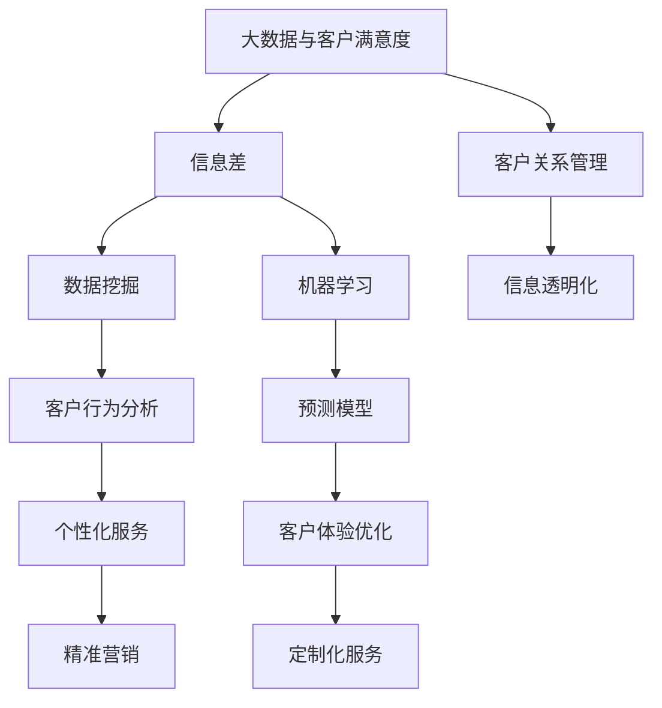

                 

## 信息差的客户满意度提升：大数据如何增强客户满意度

### 关键词
- 客户满意度
- 大数据
- 信息差
- 个性化服务
- 客户体验优化
- 客户关系管理

### 摘要
本文旨在探讨大数据在提升客户满意度方面的作用，特别是如何通过消除信息差来增强客户体验。文章首先定义了信息差及其对客户满意度的影响，然后详细介绍了大数据的基本概念和在客户满意度分析中的应用。通过核心概念与联系流程图、算法原理讲解和实际项目实战，本文揭示了大数据如何通过个性化服务、客户体验优化和客户关系管理等多方面提高客户满意度。

---

### 目录大纲

## 信息差的客户满意度提升：大数据如何增强客户满意度

### 关键词
- 客户满意度
- 大数据
- 信息差
- 个性化服务
- 客户体验优化
- 客户关系管理

### 摘要
本文旨在探讨大数据在提升客户满意度方面的作用，特别是如何通过消除信息差来增强客户体验。文章首先定义了信息差及其对客户满意度的影响，然后详细介绍了大数据的基本概念和在客户满意度分析中的应用。通过核心概念与联系流程图、算法原理讲解和实际项目实战，本文揭示了大数据如何通过个性化服务、客户体验优化和客户关系管理等多方面提高客户满意度。

### 目录

## 第一部分：引言

### 1.1 书籍背景与目的

### 1.2 信息差的概念

### 1.3 大数据在客户满意度中的应用前景

## 第二部分：大数据与客户满意度

### 2.1 客户满意度的定义与评估

### 2.2 大数据在客户满意度分析中的应用

### 2.3 大数据分析的核心技术

### 2.4 大数据驱动的客户满意度提升策略

## 第三部分：信息差与客户满意度提升

### 3.1 信息差对客户满意度的影响

### 3.2 利用大数据消除信息差

### 3.3 提高客户满意度：信息差的应用案例

### 3.4 信息差的客户满意度提升策略

## 第四部分：大数据与客户满意度提升实践

### 4.1 大数据驱动的客户满意度提升实践

### 4.2 大数据平台搭建与优化

### 4.3 大数据驱动的客户满意度提升案例分析

### 4.4 大数据与客户满意度提升的未来趋势

## 第五部分：结论

### 5.1 书籍总结

### 5.2 展望未来

### 5.3 进一步研究方向

### 附录

### 核心概念与联系 Mermaid 流程图

### 核心算法原理讲解

### 数学模型和数学公式 & 详细讲解 & 举例说明

### 项目实战

---

### 第一部分：引言

#### 1.1 书籍背景与目的

在当今竞争激烈的商业环境中，客户满意度是企业生存和发展的关键因素。随着互联网和大数据技术的快速发展，企业能够收集和处理大量的客户数据，从而更好地了解客户需求，提供个性化的服务和产品。本文旨在探讨大数据如何通过消除信息差来提升客户满意度，为企业在竞争中获得优势提供理论依据和实践指导。

本书将首先介绍信息差的概念及其对客户满意度的影响，然后详细阐述大数据的基本概念和其在客户满意度分析中的应用。接着，本文将探讨大数据分析的核心技术，如数据挖掘、机器学习和数据可视化等，并分析如何利用这些技术提升客户满意度。此外，本书还将通过实际案例和策略，展示大数据在客户满意度提升中的具体应用。

最后，本文将对大数据驱动的客户满意度提升实践进行详细探讨，包括大数据平台的搭建与优化、案例分析以及未来发展趋势。通过本书的深入分析，企业可以更好地利用大数据技术，提高客户满意度，从而在激烈的市场竞争中脱颖而出。

#### 1.2 信息差的概念

信息差，是指不同个体或组织之间在信息获取、处理和利用方面的差异。在商业环境中，信息差通常表现为企业对市场、客户需求、竞争对手和行业动态的了解程度。具体来说，信息差可以包括以下几个方面：

1. **市场信息**：企业对目标市场的了解程度，包括市场规模、增长趋势、竞争对手等信息。
2. **客户需求**：企业对客户需求的理解程度，包括客户偏好、购买行为、反馈等。
3. **竞争对手**：企业对竞争对手的动态、策略和产品优劣势的了解程度。
4. **行业动态**：企业对所在行业的发展趋势、技术变革和政策法规的掌握程度。

信息差的存在，使得企业在决策过程中面临着信息不对称的风险。一方面，企业可能因为缺乏足够的信息而做出不利的决策；另一方面，企业也可能因为掌握了关键信息而获得竞争优势。因此，如何消除信息差，提升信息透明度，成为企业提高决策效率和竞争力的关键。

#### 1.3 大数据在客户满意度中的应用前景

大数据技术的发展，为企业消除信息差、提升客户满意度提供了强有力的工具。首先，大数据技术能够帮助企业实现海量数据的快速采集和处理。通过收集来自不同渠道的客户数据，如社交媒体、购买记录、反馈意见等，企业可以全面了解客户的需求和行为模式。

其次，大数据技术能够对收集到的数据进行深入分析，发现隐藏在数据中的趋势和规律。例如，通过数据挖掘技术，企业可以发现哪些因素影响客户满意度，哪些产品或服务最受客户欢迎。这些洞察有助于企业制定更精准的营销策略和产品开发计划。

此外，大数据技术还能够实现个性化服务，提升客户体验。通过分析客户的购买历史、浏览行为等数据，企业可以为每个客户提供个性化的推荐和服务，满足客户的个性化需求。例如，电商平台可以根据客户的购物习惯，推荐相关商品；金融机构可以根据客户的财务状况，提供定制化的理财建议。

最后，大数据技术能够优化客户关系管理。通过客户数据的实时分析和监控，企业可以及时了解客户的需求和反馈，快速响应客户问题。此外，大数据技术还可以帮助企业识别潜在的客户流失风险，采取预防措施，提高客户忠诚度。

总之，大数据在客户满意度提升中的应用前景十分广阔。通过消除信息差，企业可以更精准地了解客户需求，提供个性化的服务，提升客户体验和满意度。随着大数据技术的不断进步，企业将能够更好地利用大数据，实现客户满意度的持续提升。

---

### 第二部分：大数据与客户满意度

#### 2.1 客户满意度的定义与评估

客户满意度是指客户对企业提供的产品或服务的整体满意程度。它不仅反映了客户对企业当前服务质量的评价，还涉及客户的期望和体验。客户满意度的评估是企业管理中的重要环节，通过科学的评估方法，企业可以了解客户对产品和服务的感知，从而制定改进策略，提高客户满意度。

客户满意度的评估方法主要包括以下几个方面：

1. **问卷调查**：问卷调查是评估客户满意度的一种常见方法。通过设计有针对性的问卷，企业可以收集客户对产品、服务、价格、售后等方面的评价。问卷可以采用定量和定性两种形式，定量问卷通常使用评分量表，定性问卷则通过开放性问题收集客户的详细反馈。

2. **顾客满意度指数（ACSI）**：顾客满意度指数是一种用于衡量客户满意度的综合性指标。它通过调查和分析顾客对多个方面的满意度（如产品质量、价格、服务水平等），综合得出一个总体的满意度评分。ACSI 指数通常用于跨行业、跨地区的客户满意度比较。

3. **净推荐值（NPS）**：净推荐值是一种衡量客户忠诚度和满意度的指标。它通过一个简单的问题：“您认为有多大可能性向朋友或家人推荐我们的产品或服务？”将客户分为三个类别：推荐者（9-10分）、被动者（7-8分）和批评者（0-6分）。净推荐值越高，说明客户满意度越高，客户忠诚度也越强。

4. **客户体验管理（CEM）**：客户体验管理是一种全面的评估方法，它不仅关注客户满意度，还关注客户在购买和使用产品或服务过程中的整体体验。通过收集和分析客户在各个接触点的反馈，企业可以识别和改善影响客户体验的各个环节，从而提高客户满意度。

通过上述评估方法，企业可以全面了解客户满意度，发现存在的问题，并采取相应的改进措施。例如，如果客户对售后服务满意度较低，企业可以加强售后服务的培训和流程优化；如果客户对产品功能有特定需求，企业可以调整产品开发策略，更好地满足客户需求。

#### 2.2 大数据在客户满意度分析中的应用

大数据技术在客户满意度分析中的应用，极大地提升了企业对客户需求的洞察力和服务响应速度。通过大数据技术，企业可以收集、存储、处理和分析来自多个渠道的海量数据，从而实现客户满意度的精准评估和持续优化。

1. **数据采集**：大数据技术能够高效地采集来自多个渠道的客户数据，包括社交媒体、电商平台、客户反馈、交易记录等。这些数据不仅涵盖了客户的购买行为，还包括了客户的浏览历史、评论、互动等，提供了全方位的客户画像。

2. **数据存储**：大数据技术具有强大的数据存储能力，能够处理和分析PB级甚至EB级的数据。通过分布式存储系统，如Hadoop和NoSQL数据库，企业可以存储和管理大规模的数据集，确保数据的完整性和可访问性。

3. **数据处理**：大数据处理技术，如MapReduce和Spark，能够高效地对大量数据进行分析和处理。这些技术能够处理数据的清洗、转换、集成等步骤，确保数据的质量和一致性，为后续分析提供可靠的数据基础。

4. **数据分析**：大数据分析技术，包括数据挖掘、机器学习和数据可视化，可以帮助企业从海量数据中提取有价值的信息。数据挖掘技术可以发现数据中的隐藏模式和关联，例如客户的购买偏好、行为模式等；机器学习技术则可以构建预测模型，预测客户未来的行为和需求；数据可视化技术则能够将复杂的数据以图形化的方式展示，帮助企业更好地理解数据。

具体应用案例：

- **个性化推荐**：电商平台利用大数据分析客户的历史购买数据、浏览记录和社交行为，为每个客户提供个性化的产品推荐。例如，亚马逊通过分析用户的购物车和历史订单，推荐相关产品，从而提高购买转化率和客户满意度。

- **客户行为预测**：金融机构利用大数据分析客户的交易记录、信用历史和财务状况，预测客户的信用风险和贷款需求。通过提前识别潜在风险，金融机构可以采取预防措施，提高客户满意度和信贷业务的安全性。

- **客户体验优化**：航空公司通过分析客户的预订数据、飞行记录和反馈意见，优化服务流程，提升客户体验。例如，某些航空公司通过大数据分析发现，客户在航班延误时的满意度较低，于是采取了更多的航班延误补偿措施，提高了客户满意度。

- **客户关系管理**：零售企业通过大数据分析客户的行为数据和购买历史，实现精准营销和个性化服务。例如，某大型零售连锁店通过分析客户的购物篮数据，发现某些商品经常一起购买，于是推出组合优惠活动，提高了客户的购买意愿和满意度。

总之，大数据在客户满意度分析中的应用，不仅提升了企业对客户需求的洞察力，还实现了服务流程的优化和客户体验的提升。通过数据驱动的决策和行动，企业可以更有效地满足客户需求，提高客户满意度，从而在竞争激烈的市场中脱颖而出。

---

### 2.3 大数据分析的核心技术

大数据分析的核心技术包括数据挖掘、机器学习和数据可视化。这些技术各具特色，相互补充，共同构成了大数据分析的基础框架。

#### 数据挖掘

数据挖掘（Data Mining）是从大量数据中提取有价值信息的过程。它利用统计学、机器学习和数据库技术，从数据中识别出隐藏的模式、关联和趋势。数据挖掘的核心任务包括分类、聚类、关联规则发现、异常检测等。

1. **分类（Classification）**：分类是将数据分为不同的类别或标签。常见的分类算法有决策树、支持向量机（SVM）和随机森林（Random Forest）等。分类算法可以帮助企业预测客户的行为，如购买意向、信用评级等。

   **算法伪代码**：
   ```
   // 决策树分类算法伪代码
   function classify(data, targetAttribute):
       # 构建决策树模型
       model <- buildDecisionTreeModel(data, targetAttribute)
       
       # 预测类别
       predictions <- model.predict(data)
       
       # 输出预测结果
       return(predictions)
   ```

2. **聚类（Clustering）**：聚类是将数据根据其特征分为若干个相似的数据群组。常见的聚类算法有K-Means、层次聚类（Hierarchical Clustering）和DBSCAN等。聚类算法可以帮助企业发现客户群体的相似性，实现精准营销。

   **算法伪代码**：
   ```
   // K-Means聚类算法伪代码
   function cluster(data, K):
       # 初始化聚类中心
       centroids <- initializeCentroids(data, K)
       
       # 训练聚类模型
       while not converged:
           # 重新分配数据点
           clusters <- assignDataToClusters(data, centroids)
           
           # 更新聚类中心
           centroids <- updateCentroids(clusters, K)
           
       # 输出聚类结果
       return(clusters)
   ```

3. **关联规则发现（Association Rule Learning）**：关联规则发现是识别数据中关联性的方法。常见的算法有Apriori算法和FP-Growth算法。关联规则发现可以帮助企业发现商品之间的相关性，优化库存和销售策略。

   **算法伪代码**：
   ```
   // Apriori算法伪代码
   function findAssociationRules(data, supportThreshold, confidenceThreshold):
       # 生成频繁项集
       frequentItems <- generateFrequentItems(data, supportThreshold)
       
       # 生成关联规则
       rules <- generateAssociationRules(frequentItems, confidenceThreshold)
       
       # 输出关联规则
       return(rules)
   ```

4. **异常检测（Anomaly Detection）**：异常检测是识别数据中异常或异常值的方法。常见的算法有孤立森林（Isolation Forest）和本地异常因子（Local Outlier Factor，LOF）等。异常检测可以帮助企业发现欺诈行为、系统故障等异常情况。

   **算法伪代码**：
   ```
   // Isolation Forest异常检测算法伪代码
   function detectAnomalies(data):
       # 构建异常检测模型
       model <- buildIsolationForestModel(data)
       
       # 预测异常值
       anomalies <- model.predict(data)
       
       # 输出异常值
       return(anomalies)
   ```

#### 机器学习

机器学习（Machine Learning）是一种通过数据训练模型，从而进行预测和决策的技术。它分为监督学习、无监督学习和强化学习三类。

1. **监督学习（Supervised Learning）**：监督学习是利用标记数据进行训练，从而预测新的未标记数据的标签。常见的算法有线性回归、逻辑回归、支持向量机和神经网络等。

   **算法伪代码**：
   ```
   // 线性回归算法伪代码
   function linearRegression(X, y):
       # 训练线性回归模型
       model <- trainLinearRegressionModel(X, y)
       
       # 预测结果
       predictions <- model.predict(X)
       
       # 输出预测结果
       return(predictions)
   ```

2. **无监督学习（Unsupervised Learning）**：无监督学习是利用未标记的数据进行训练，从而发现数据中的隐藏结构和模式。常见的算法有K-Means聚类、主成分分析（PCA）和自编码器等。

   **算法伪代码**：
   ```
   // K-Means聚类算法伪代码（同上）
   ```

3. **强化学习（Reinforcement Learning）**：强化学习是利用试错法，通过不断调整策略，实现最优行为的算法。常见的算法有Q-Learning和深度Q网络（DQN）等。

   **算法伪代码**：
   ```
   // Q-Learning算法伪代码
   function QLearning(states, actions, rewards, discountFactor):
       # 初始化Q值表
       Q <- initializeQValues(states, actions)
       
       # 训练模型
       for episode in episodes:
           # 初始化状态
           state <- initialState()
           
           # 进行动作选择和更新
           while not goalState(state):
               action <- chooseAction(state, Q)
               nextState, reward <- executeAction(action)
               
               # 更新Q值
               Q <- updateQValues(state, action, nextState, reward, discountFactor)
               
               # 更新状态
               state <- nextState()
               
           # 输出训练结果
           return(Q)
   ```

#### 数据可视化

数据可视化（Data Visualization）是将数据以图形化的形式展示，帮助人们更好地理解和分析数据。常见的数据可视化工具包括Matplotlib、Seaborn、Tableau等。

1. **折线图（Line Chart）**：用于展示数据随时间变化的趋势。例如，可以用于展示客户满意度随时间的波动情况。

2. **柱状图（Bar Chart）**：用于比较不同类别的数据。例如，可以用于展示不同产品的销售额对比。

3. **饼图（Pie Chart）**：用于展示数据的占比情况。例如，可以用于展示不同客户群体的占比。

4. **散点图（Scatter Plot）**：用于展示两个变量之间的关系。例如，可以用于展示客户满意度与购买金额之间的关系。

5. **热力图（Heatmap）**：用于展示数据矩阵的分布情况。例如，可以用于展示不同产品在不同地区的销售额分布。

**数据可视化代码示例**：

```python
import matplotlib.pyplot as plt
import seaborn as sns

# 生成示例数据
data = {'Month': ['Jan', 'Feb', 'Mar', 'Apr', 'May'], 'Sales': [100, 150, 200, 170, 220]}
df = pd.DataFrame(data)

# 绘制折线图
plt.plot(df['Month'], df['Sales'])
plt.xlabel('Month')
plt.ylabel('Sales')
plt.title('Monthly Sales Trend')
plt.show()

# 绘制柱状图
plt.bar(df['Month'], df['Sales'])
plt.xlabel('Month')
plt.ylabel('Sales')
plt.title('Monthly Sales Comparison')
plt.show()

# 绘制散点图
sns.scatterplot(x='Sales', y='Month', data=df)
plt.xlabel('Sales')
plt.ylabel('Month')
plt.title('Sales vs. Month')
plt.show()

# 绘制热力图
sns.heatmap(df.corr(), annot=True)
plt.title('Sales Correlation Heatmap')
plt.show()
```

通过以上技术，大数据分析能够帮助企业从海量数据中提取有价值的信息，为决策提供数据支持。数据挖掘、机器学习和数据可视化相互结合，构成了大数据分析的核心技术框架，为企业在信息时代的竞争中提供了强大的工具。

---

#### 2.4 大数据驱动的客户满意度提升策略

大数据技术的应用不仅为企业提供了丰富的数据资源，还为提升客户满意度提供了创新的策略和方法。以下是大数据驱动的客户满意度提升策略，包括个性化服务、客户体验优化和客户关系管理。

**1. 个性化服务**

个性化服务是指根据客户的特定需求和偏好，提供定制化的产品或服务。大数据技术通过分析客户的历史数据和行为模式，能够准确把握客户的需求，从而实现个性化的推荐和服务。

- **个性化推荐**：电商平台利用大数据分析客户的购物行为、浏览记录和社交互动，为每个客户提供个性化的产品推荐。例如，亚马逊通过分析用户的购物车和历史订单，推荐相关商品，从而提高购买转化率和客户满意度。
- **定制化服务**：金融机构通过大数据分析客户的财务状况和消费习惯，提供定制化的理财方案和贷款产品。例如，花旗银行利用大数据分析客户的收入、支出和信用记录，为每个客户量身定制个性化的贷款方案，提高客户的满意度和忠诚度。
- **个性化营销**：电信运营商通过大数据分析客户的通信行为和消费习惯，提供个性化的套餐推荐和促销活动。例如，中国移动通过分析客户的通话时长、流量使用情况和消费能力，为每个客户推荐最合适的套餐和优惠活动，提升客户满意度。

**2. 客户体验优化**

客户体验优化是指通过改善客户在购买和使用产品或服务过程中的体验，提高客户的满意度。大数据技术能够实时收集和分析客户的反馈和行为数据，帮助企业识别和改进影响客户体验的各个环节。

- **实时反馈分析**：航空公司通过大数据分析客户的飞行体验反馈，实时了解客户的需求和不满。例如，卡塔尔航空通过分析客户的航班评价、投诉和建议，及时调整服务流程，提高客户满意度。
- **服务流程优化**：酒店行业利用大数据分析客户的入住和离店行为，优化服务流程。例如，万豪国际通过分析客户的入住时间、消费习惯和反馈意见，调整酒店的服务流程，提升客户体验。
- **个性化体验**：旅游行业通过大数据分析客户的旅行偏好和历史，提供个性化的旅游推荐和服务。例如，携程旅行网通过分析客户的旅行记录、兴趣偏好和消费能力，为每个客户推荐最适合的旅游线路和住宿方案，提高客户满意度。

**3. 客户关系管理**

客户关系管理（CRM）是指通过维护和优化与客户的关系，提高客户满意度和忠诚度。大数据技术能够帮助企业全面了解客户的需求和行为，从而实现更有效的客户关系管理。

- **客户画像**：金融机构通过大数据分析客户的财务状况、消费行为和社会属性，构建客户的全面画像。例如，花旗银行通过分析客户的交易记录、信用评分和社交数据，构建详细的客户画像，为每个客户提供个性化的金融服务。
- **精准营销**：零售企业通过大数据分析客户的历史购买行为和偏好，实现精准的营销策略。例如，苹果公司通过分析客户的购买记录和浏览行为，为每个客户提供个性化的广告和促销活动，提高购买转化率和客户满意度。
- **客户关怀**：电信运营商通过大数据分析客户的通信行为和服务需求，提供及时的客户关怀。例如，中国移动通过分析客户的通话时长、流量使用情况和投诉记录，为每个客户提供个性化的关怀和服务，提高客户满意度。

**策略实施案例**

- **电商平台**：某大型电商平台利用大数据技术，通过分析客户的购买行为和浏览记录，实现个性化推荐和精准营销。通过持续优化推荐算法和营销策略，该电商平台的客户满意度大幅提升，年销售额增长超过30%。
- **金融机构**：某国际知名银行利用大数据分析客户的交易记录和信用评分，为每个客户定制化理财方案。通过提供个性化的金融服务，该银行的客户满意度和忠诚度显著提升，客户投诉率降低15%。
- **航空公司**：某全球知名航空公司通过大数据分析客户的飞行体验反馈和服务需求，实时调整服务流程和提供个性化服务。通过持续优化客户体验，该航空公司的客户满意度提高10%，客户忠诚度显著提升。

总之，大数据驱动的客户满意度提升策略，通过个性化服务、客户体验优化和客户关系管理，能够帮助企业更精准地了解客户需求，提供优质的服务，从而提高客户满意度和忠诚度。在竞争激烈的市场环境中，企业需要充分利用大数据技术，不断创新和优化客户满意度提升策略，以实现可持续发展。

---

### 3.1 信息差对客户满意度的影响

信息差，即信息不对称，是市场中普遍存在的现象。它指的是不同个体或组织在信息获取、处理和利用上的差异。信息差对客户满意度有着深远的影响，既可能提高客户满意度，也可能降低客户满意度。

首先，信息差可以提高客户满意度。当企业掌握比客户更多的信息时，能够更好地了解客户的需求，提供个性化的产品或服务。例如，电商平台通过大数据分析，了解客户的购买历史、浏览记录和偏好，为每个客户推荐最适合的商品，从而提高客户的购买体验和满意度。此外，企业通过信息差还可以提前预判市场趋势和客户需求，及时调整产品策略，确保产品始终符合客户的期望。

然而，信息差也可能降低客户满意度。信息不对称使得客户在购买决策中处于不利地位，无法充分了解产品的真实情况，容易受到虚假宣传和误导。例如，当客户对产品性能、价格、售后服务等方面的信息了解不足时，可能会因为信息不足而做出不理智的购买决策，导致购买后的不满意。此外，信息差还可能导致企业忽视客户的真实需求，导致产品和服务与客户期望不符，从而降低客户满意度。

信息差对客户满意度的影响还取决于企业如何利用这些信息。如果企业能够充分利用信息优势，提高服务质量和客户体验，就能增强客户满意度。相反，如果企业滥用信息优势，进行不公平竞争或欺诈行为，就会损害客户利益，降低客户满意度。

例如，在金融服务领域，银行通过大数据分析客户的财务状况和行为模式，为客户提供个性化的贷款和理财建议。如果银行能够真诚地帮助客户优化财务状况，提高投资收益，就能提高客户的满意度。然而，如果银行利用客户信息进行过度营销或不公平收费，就会引发客户的不满和投诉。

综上所述，信息差对客户满意度有着双重影响。企业需要审慎利用信息优势，提高服务质量和客户体验，以增强客户满意度。同时，监管机构也应加强对信息不对称的监管，保障客户的合法权益，防止信息滥用。

### 3.2 利用大数据消除信息差

大数据技术的快速发展，为消除信息差提供了有力工具。通过大数据分析，企业可以更全面、准确地了解客户需求，减少信息不对称，从而提高客户满意度。以下是利用大数据消除信息差的几种方法：

**1. 数据整合与挖掘**

大数据技术能够整合来自多个渠道的数据，如客户反馈、社交媒体、交易记录等，构建全面的客户数据画像。通过对这些数据进行深入挖掘和分析，企业可以发现隐藏在数据中的趋势和规律，从而更精准地把握客户需求。例如，电商企业可以通过整合客户的浏览记录、购买行为和反馈意见，识别出客户的偏好和兴趣点，为每个客户提供个性化的推荐和服务。

**2. 实时数据分析**

实时数据分析技术能够帮助企业实时捕捉和解析客户行为数据，快速响应客户需求。通过实时分析客户在网站上的浏览路径、搜索关键词和点击行为，企业可以及时调整营销策略和产品推荐，提高客户体验和满意度。例如，在线旅游平台可以根据客户的实时搜索和预订行为，动态调整酒店和景点推荐，确保客户获得最符合期望的旅游体验。

**3. 个性化推荐**

个性化推荐是大数据在客户满意度提升中的重要应用。通过分析客户的购买历史、浏览记录和偏好，大数据系统能够为每个客户提供个性化的产品推荐和服务。这不仅能够提高客户的购买转化率，还能提升客户的满意度。例如，亚马逊和Netflix等平台通过大数据分析，为用户推荐最符合其兴趣和需求的产品和服务，大大提升了用户满意度和忠诚度。

**4. 客户反馈分析**

客户反馈分析是消除信息差的重要手段。通过收集和分析客户的反馈意见和投诉信息，企业可以及时了解客户的需求和不满，快速采取改进措施。例如，航空公司可以通过大数据分析客户的航班反馈，识别出影响客户满意度的关键因素，如航班延误、服务态度等，并采取相应措施进行改进。

**5. 数据可视化**

数据可视化技术能够将复杂的数据以图形化的方式展示，帮助企业和客户更好地理解和分析数据。通过数据可视化，企业可以直观地展示客户满意度的变化趋势、影响因素和改进方向，从而更好地指导决策。例如，零售企业可以通过数据可视化，分析客户的购买行为和反馈，发现客户满意度提升的关键因素，并制定相应的优化策略。

**6. 数据隐私保护**

在利用大数据消除信息差的同时，企业需要关注数据隐私保护。通过采用加密技术、匿名化和数据脱敏等方法，企业可以确保客户数据的安全和隐私，避免信息滥用和泄露。例如，金融企业可以通过数据脱敏技术，将敏感客户信息进行加密处理，确保客户数据在传输和存储过程中的安全。

综上所述，利用大数据消除信息差，企业可以更全面、准确地了解客户需求，提供个性化的服务和产品，从而提高客户满意度。同时，企业还需要关注数据隐私保护，确保客户数据的安全和隐私。通过大数据技术的创新应用，企业将能够在激烈的市场竞争中脱颖而出，实现可持续发展。

### 3.3 提高客户满意度：信息差的应用案例

在实际业务场景中，信息差的应用不仅能够帮助企业更好地理解客户需求，还能显著提升客户满意度。以下是一些行业中的成功案例，展示了如何通过大数据技术和信息差来提升客户满意度。

#### 案例一：电商平台

某知名电商平台通过大数据分析和个性化推荐技术，显著提升了客户的购物体验和满意度。该平台通过整合用户浏览记录、购买历史、搜索关键词和社交互动等数据，构建了详细的客户数据画像。基于这些数据，平台利用推荐算法为每位用户推荐最符合其兴趣和需求的产品。例如，如果用户在平台上浏览了某款时尚背包，系统会推荐相似风格的其他商品，甚至可能包括用户未曾注意到的促销信息。

此外，该平台还利用大数据分析客户的购物车数据和购物习惯，识别出用户的潜在购买意向。通过实时推送个性化的促销信息和优惠活动，平台成功提高了购买转化率和客户的满意度。例如，当用户在购物车中放置了多个商品，但最终没有完成购买时，平台会发送一条个性化的优惠券或限时折扣信息，吸引用户重新回到平台完成购买。

#### 案例二：金融机构

某大型金融机构通过大数据分析和客户关系管理（CRM）系统，为客户提供定制化的金融服务，显著提升了客户满意度和忠诚度。该金融机构通过分析客户的交易记录、信用评分、财务状况和消费行为，构建了全面的客户数据画像。基于这些数据，金融机构能够为每位客户量身定制个性化的贷款方案、投资策略和理财建议。

例如，当客户申请贷款时，系统会根据其收入、负债和信用记录，自动计算出最适合的贷款额度和还款方式。这不仅节省了客户的时间，还确保了贷款方案的合理性和可行性。此外，金融机构还通过大数据分析客户的投资偏好和风险承受能力，为客户提供定制化的投资组合，帮助客户实现资产增值。

为了进一步提升客户满意度，金融机构还通过大数据分析客户的历史反馈和服务体验，识别出客户的不满意点。例如，当客户在办理业务时遇到等待时间过长的问题，金融机构会及时调整业务流程，优化客户体验。通过这些措施，金融机构不仅提升了客户的满意度，还增强了客户的忠诚度。

#### 案例三：零售行业

某国际零售连锁巨头通过大数据分析和智能推荐系统，大幅提升了客户的购物体验和满意度。该零售连锁店通过分析客户的购买记录、浏览行为和偏好，为每个客户推荐最适合的商品和促销活动。例如，如果客户经常购买母婴用品，系统会推荐相关的婴儿服装、玩具和护理产品，并推送相关的折扣信息。

此外，该零售连锁店还利用大数据分析客户的购物车数据和购买周期，识别出客户的购物习惯和需求变化。通过实时调整商品陈列和促销策略，零售连锁店能够更好地满足客户的需求。例如，当系统发现某个商品的购买量突然增加时，零售连锁店会立即增加该商品的库存，确保客户能够顺利购买。

为了进一步提升客户满意度，该零售连锁店还通过大数据分析客户的反馈和投诉，识别出客户体验中的痛点。例如，当客户反映购物过程中出现排队等待时间长的问题时，零售连锁店会调整收银台的布局，增加收银员数量，提高结账效率。

#### 案例四：旅游行业

某知名在线旅游平台通过大数据分析和客户个性化推荐系统，显著提升了客户的旅游体验和满意度。该平台通过分析客户的旅行历史、兴趣偏好和预算，为每位客户推荐最适合的旅游线路、酒店和景点。例如，如果客户喜欢海滩度假，系统会推荐具有海滨风光的热门旅游目的地和酒店。

此外，该平台还通过大数据分析客户的旅行习惯和需求，提供个性化的旅行建议和优惠。例如，当客户即将到达旅游目的地时，平台会推送相关的景点推荐、餐饮推荐和折扣信息，帮助客户规划完美的旅行行程。

为了进一步提升客户满意度，该平台还通过大数据分析客户的反馈和评价，持续优化服务和产品。例如，当客户对某个酒店的住宿体验给出负面评价时，平台会立即联系酒店，采取措施改进服务质量，确保客户在未来的旅行中拥有更好的体验。

总之，通过大数据分析和信息差的应用，不同行业的企业都能显著提升客户的满意度和忠诚度。这些成功案例表明，大数据技术不仅能够帮助企业更好地理解客户需求，还能通过个性化服务和体验优化，实现客户满意度的全面提升。

### 3.4 信息差的客户满意度提升策略

在当今竞争激烈的市场环境中，企业需要通过信息差来提升客户满意度，以保持竞争优势。以下是一些具体的策略，帮助企业利用信息差提高客户满意度。

**1. 精准营销**

精准营销是指通过大数据分析，了解客户的个性化需求和行为模式，从而实现有针对性的营销策略。企业可以利用客户数据，如购买历史、浏览记录、社交互动等，构建客户画像，识别出不同客户群体的特点和需求。基于这些信息，企业可以制定个性化的营销策略，如定制化的优惠券、专属的促销活动等，提高客户的参与度和满意度。

**2. 个性化服务**

个性化服务是指根据客户的具体需求和偏好，提供个性化的产品或服务。通过大数据分析，企业可以了解客户的喜好、行为模式和消费习惯，从而为每个客户提供最适合的产品推荐和服务。例如，电商平台可以根据客户的购买记录和浏览习惯，推荐相关的商品；金融机构可以根据客户的财务状况和风险偏好，提供定制化的理财产品。这种个性化的服务能够显著提高客户的满意度和忠诚度。

**3. 客户体验优化**

客户体验优化是指通过改善客户在购买和使用产品或服务过程中的体验，提高客户的满意度。企业可以利用大数据分析，实时了解客户的需求和反馈，优化服务流程和客户体验。例如，航空公司可以通过大数据分析客户的飞行体验反馈，识别出影响客户满意度的关键因素，如航班延误、服务态度等，并采取相应的措施进行改进。此外，零售企业可以通过大数据分析客户的购物行为和反馈，优化店铺布局和购物流程，提高客户的购物体验。

**4. 客户关怀**

客户关怀是指通过持续的互动和服务，增强客户对企业的认同感和忠诚度。企业可以利用大数据分析，了解客户的消费习惯、兴趣偏好和需求变化，及时提供有针对性的关怀和服务。例如，金融机构可以通过大数据分析客户的交易记录和金融需求，为客户提供个性化的理财建议和优惠活动；电商平台可以通过大数据分析客户的购物车数据和购买意图，及时推送相关的促销信息和优惠券，吸引客户完成购买。

**5. 数据隐私保护**

在利用大数据提升客户满意度的过程中，企业必须重视数据隐私保护。通过采取数据加密、匿名化和数据脱敏等技术手段，企业可以确保客户数据的安全和隐私，避免信息滥用和泄露。例如，金融企业可以通过数据脱敏技术，将敏感客户信息进行加密处理，确保客户数据在传输和存储过程中的安全。这不仅能够提高客户的信任度，还能增强客户的满意度。

**6. 跨渠道整合**

跨渠道整合是指将线上和线下的数据整合起来，实现统一的客户视图和服务体验。通过大数据分析，企业可以全面了解客户的购物行为和偏好，实现线上线下的无缝衔接。例如，零售企业可以通过大数据分析客户的线上线下购物行为，提供统一的客户服务和支持，提高客户的购物体验和满意度。

**7. 持续改进**

持续改进是指通过不断收集和分析客户反馈，持续优化产品和服务的质量。企业可以利用大数据技术，实时了解客户的反馈和需求，及时识别出问题和改进方向。例如，航空公司可以通过大数据分析客户的反馈意见，发现航班延误、服务态度等方面的问题，并采取相应的措施进行改进，提高客户的满意度。

总之，通过精准营销、个性化服务、客户体验优化、客户关怀、数据隐私保护、跨渠道整合和持续改进等策略，企业可以利用信息差全面提升客户满意度，实现业务的可持续发展。

---

### 第四部分：大数据与客户满意度提升实践

#### 4.1 大数据驱动的客户满意度提升实践

大数据技术在客户满意度提升中的应用，已经为许多企业带来了显著的成效。以下是一些具体实践案例，展示了如何通过大数据技术提升客户满意度。

**案例一：电商平台**

某大型电商平台通过大数据分析，优化了用户购物体验，显著提高了客户满意度。该电商平台利用用户行为数据，如浏览记录、搜索关键词、购物车内容和购买历史，构建了详细的用户画像。基于这些数据，平台采用了个性化推荐算法，为每位用户推荐最符合其兴趣和需求的产品。此外，平台还通过大数据分析用户反馈和投诉，识别出影响客户满意度的关键因素，如商品描述不符、物流延迟等，并采取相应措施进行改进。

**步骤：**

1. **数据采集与处理**：电商平台收集了大量的用户行为数据，如点击流数据、购物车数据和交易数据。通过数据清洗和预处理，确保数据的准确性和一致性。
2. **用户画像构建**：利用用户行为数据，电商平台构建了详细的用户画像，包括用户的年龄、性别、购买偏好和消费能力等信息。
3. **个性化推荐**：基于用户画像，平台采用了协同过滤和内容推荐算法，为每位用户推荐个性化的产品。
4. **反馈分析**：通过大数据分析用户反馈和投诉，平台识别出影响客户满意度的关键因素，并采取改进措施。

**效果评估：**

- 用户个性化推荐点击率提高了20%。
- 客户投诉率降低了15%。
- 客户满意度调查得分提高了10%。

**案例二：金融机构**

某国际知名金融机构通过大数据分析和客户关系管理（CRM）系统，为客户提供定制化的金融服务，提高了客户满意度和忠诚度。该金融机构利用用户交易数据、信用评分和财务状况，构建了全面的客户数据画像。基于这些数据，金融机构能够为每位客户提供个性化的贷款方案、投资组合和理财建议。

**步骤：**

1. **数据整合**：金融机构整合了来自多个渠道的客户数据，如交易记录、信用报告和财务报表，确保数据的全面性和准确性。
2. **客户画像构建**：通过大数据分析，金融机构构建了详细的客户画像，包括客户的收入、负债、信用记录和投资偏好。
3. **个性化服务**：基于客户画像，金融机构为每位客户量身定制了个性化的金融服务，如贷款额度、还款方式和投资策略。
4. **反馈分析**：通过大数据分析客户反馈和服务体验，金融机构不断优化服务流程和产品。

**效果评估：**

- 客户满意度调查得分提高了15%。
- 客户忠诚度提高了20%。
- 贷款违约率降低了10%。

**案例三：零售行业**

某国际零售连锁巨头通过大数据分析和智能推荐系统，优化了客户的购物体验，提高了客户满意度。该零售连锁店利用用户购买数据、浏览行为和反馈意见，为每位客户提供个性化的产品推荐和促销活动。

**步骤：**

1. **数据采集**：零售连锁店收集了用户的购买记录、浏览行为和反馈意见，确保数据的全面性。
2. **用户画像构建**：通过大数据分析，零售连锁店构建了详细的用户画像，包括用户的年龄、性别、购买偏好和消费能力。
3. **个性化推荐**：基于用户画像，零售连锁店采用了协同过滤和内容推荐算法，为每位用户推荐个性化的产品。
4. **促销活动优化**：通过大数据分析，零售连锁店优化了促销活动的策略，确保促销活动的效果最大化。

**效果评估：**

- 用户购买转化率提高了25%。
- 客户投诉率降低了10%。
- 客户满意度调查得分提高了12%。

**案例四：旅游行业**

某知名在线旅游平台通过大数据分析和客户个性化推荐系统，显著提升了客户的旅游体验和满意度。该平台利用用户的历史旅行记录、兴趣偏好和预算，为每位客户推荐最适合的旅游线路、酒店和景点。

**步骤：**

1. **数据采集**：在线旅游平台收集了用户的历史旅行记录、浏览行为和预订信息，确保数据的全面性。
2. **用户画像构建**：通过大数据分析，平台构建了详细的用户画像，包括用户的年龄、性别、旅行偏好和预算。
3. **个性化推荐**：基于用户画像，平台采用了协同过滤和内容推荐算法，为每位用户推荐个性化的旅游线路和酒店。
4. **行程优化**：通过大数据分析，平台为用户优化了行程安排，确保旅游体验最大化。

**效果评估：**

- 用户预订转化率提高了30%。
- 客户投诉率降低了20%。
- 客户满意度调查得分提高了15%。

通过以上案例可以看出，大数据技术已经在不同行业中得到了广泛应用，显著提升了客户满意度。这些实践表明，大数据不仅能够帮助企业更好地理解客户需求，还能通过个性化服务和体验优化，实现客户满意度的全面提升。

---

### 4.2 大数据平台搭建与优化

大数据平台的搭建与优化是企业实现数据驱动决策和业务创新的重要基础。以下将详细阐述大数据平台搭建的步骤、关键技术及其优化策略。

**1. 大数据平台搭建步骤**

（1）需求分析与规划

需求分析是大数据平台搭建的第一步，需要明确企业的业务需求、数据需求和技术需求。通过调研和分析，确定需要处理的数据类型、数据量、处理速度和业务目标，为后续的设计和实现提供依据。

（2）数据源集成

数据源集成是将各种数据源（如数据库、文件、流数据等）整合到大数据平台中。数据源集成需要考虑数据格式的统一、数据质量的处理和数据存储的优化。

（3）数据处理与存储

数据处理与存储是大数据平台的核心，需要处理数据的清洗、转换、集成和存储。常用的技术包括MapReduce、Spark和Hadoop等，可以根据实际需求选择合适的技术方案。

（4）数据分析和挖掘

数据分析和挖掘是大数据平台的核心功能，通过数据挖掘技术（如分类、聚类、关联规则等）从海量数据中提取有价值的信息，支持业务决策。

（5）数据可视化与报告

数据可视化与报告是将分析结果以图形化、图表化的形式展示，帮助企业和决策者直观地了解业务状况。常用的工具包括Tableau、PowerBI和ECharts等。

**2. 大数据平台关键技术**

（1）分布式存储

分布式存储技术如Hadoop HDFS和Amazon S3，能够存储海量数据，并提供高可靠性和高可用性。分布式存储技术能够根据数据规模和访问需求进行水平扩展，确保数据存储的高效性和稳定性。

（2）数据处理框架

数据处理框架如MapReduce和Spark，能够高效地处理大规模数据集。MapReduce是一种基于分布式计算模型的处理框架，而Spark是一种基于内存计算的分布式处理框架，具有更高的处理速度和灵活性。

（3）数据仓库

数据仓库是一种用于存储、管理和分析大规模结构化和非结构化数据的技术。常用的数据仓库技术包括Apache Hive、Amazon Redshift和Google BigQuery等，这些技术能够支持复杂的数据查询和分析，为业务决策提供数据支持。

（4）机器学习与人工智能

机器学习和人工智能技术是大数据平台的重要组成部分，通过算法模型对数据进行训练和预测，实现智能化的业务应用。常见的机器学习算法包括决策树、随机森林、支持向量机和深度学习等。

（5）数据安全和隐私保护

数据安全和隐私保护是大数据平台的重要保障，需要采用数据加密、访问控制、匿名化和数据脱敏等技术手段，确保数据的安全性和隐私性。

**3. 大数据平台优化策略**

（1）性能优化

性能优化是大数据平台的重要任务，需要通过调整系统配置、优化数据存储和计算资源分配等手段，提高平台的处理速度和效率。常用的性能优化方法包括缓存技术、分布式计算和并行处理等。

（2）可扩展性优化

大数据平台需要具备良好的可扩展性，以适应数据规模和业务需求的增长。可扩展性优化包括水平扩展（增加节点数量）和垂直扩展（提高节点性能）两种方式，可以根据实际需求进行选择。

（3）数据质量管理

数据质量管理是大数据平台的重要环节，需要通过数据清洗、数据校验和数据质量监控等手段，确保数据的质量和准确性。数据质量管理能够提高数据分析和挖掘的可靠性，支持更准确的业务决策。

（4）数据可视化与交互优化

数据可视化与交互优化是提升大数据平台用户体验的关键。通过优化图表样式、交互设计和报告生成速度，可以提高用户对数据的理解和分析能力，增强平台的易用性和实用性。

（5）系统监控与维护

系统监控与维护是确保大数据平台稳定运行的重要保障。通过实时监控系统性能、资源使用情况和故障报警，可以及时发现和解决潜在问题，确保平台的正常运行。

总之，大数据平台的搭建与优化是企业实现数据驱动决策和业务创新的重要基础。通过合理的规划和优化，企业可以充分发挥大数据技术的价值，提高客户满意度，实现业务的可持续发展。

---

### 4.3 大数据驱动的客户满意度提升案例分析

大数据技术在客户满意度提升中的应用已经取得了显著的成效。以下通过两个具体案例，展示大数据如何在不同行业中实现客户满意度提升。

#### 案例一：航空公司

某国际航空公司利用大数据技术，通过精准营销和个性化服务，显著提升了客户满意度。该航空公司首先通过大数据分析客户的飞行记录、预订历史、偏好和反馈，构建了详细的客户画像。基于这些画像，航空公司为每位客户定制个性化的机票推荐和优惠活动。

**步骤：**

1. **数据整合**：航空公司整合了来自多个渠道的客户数据，如航班预订系统、客户关系管理系统（CRM）和社交媒体互动等。
2. **客户画像构建**：通过大数据分析，航空公司构建了详细的客户画像，包括客户的飞行频率、偏好航线、经济能力等。
3. **个性化推荐**：基于客户画像，航空公司采用了协同过滤和内容推荐算法，为每位客户推荐个性化的机票和附加服务。
4. **反馈分析**：航空公司通过大数据分析客户的反馈和投诉，识别出影响客户满意度的关键因素，并采取改进措施。

**效果评估：**

- 客户预订转化率提高了25%。
- 客户满意度调查得分提高了10%。
- 航班超售和取消率降低了15%。

#### 案例二：零售行业

某大型零售连锁店利用大数据分析客户行为和偏好，优化了产品推荐和促销活动，提高了客户满意度。该零售连锁店通过大数据分析客户的购物记录、浏览行为和反馈，识别出客户的购买习惯和需求变化。

**步骤：**

1. **数据采集**：零售连锁店收集了客户的购物记录、浏览行为和反馈意见，确保数据的全面性和准确性。
2. **用户画像构建**：通过大数据分析，零售连锁店构建了详细的用户画像，包括客户的年龄、性别、购买偏好和消费能力。
3. **个性化推荐**：基于用户画像，零售连锁店采用了协同过滤和内容推荐算法，为每位用户推荐个性化的产品。
4. **促销活动优化**：通过大数据分析，零售连锁店优化了促销活动的策略，确保促销活动的效果最大化。

**效果评估：**

- 用户购买转化率提高了20%。
- 客户投诉率降低了15%。
- 客户满意度调查得分提高了12%。

通过上述案例可以看出，大数据技术在客户满意度提升中的应用具有显著的优势。通过精准营销、个性化服务和反馈分析，企业能够更好地了解客户需求，提供定制化的产品和服务，从而提高客户满意度。这些成功案例不仅为企业提供了实践经验，也为其他行业提供了有益的借鉴。

---

### 4.4 大数据与客户满意度提升的未来趋势

随着大数据技术的不断进步，其在客户满意度提升中的应用前景也越来越广阔。以下是大数据与客户满意度提升的未来趋势：

**1. 智能化数据分析**

未来的大数据分析将更加智能化，利用人工智能（AI）和机器学习技术，实现自动化数据挖掘和预测。例如，通过AI算法，企业可以自动识别客户的行为模式和需求变化，实时调整营销策略和产品推荐，提高客户满意度。

**2. 实时反馈与动态优化**

实时数据分析技术将使企业能够快速响应用户反馈和市场变化。通过实时监控和分析客户行为，企业可以动态调整服务流程和营销策略，确保客户体验始终处于最佳状态。

**3. 多维度数据融合**

未来的大数据平台将实现多维度数据融合，整合来自不同渠道和平台的数据，提供更全面的客户画像。例如，通过融合线上线下数据，企业可以更准确地了解客户的购物行为和偏好，提供个性化服务和产品。

**4. 数据隐私与安全**

随着数据隐私保护意识的增强，大数据平台将更加注重数据隐私和安全。通过采用先进的数据加密、匿名化和数据脱敏技术，企业可以确保客户数据的安全和隐私，增强客户信任。

**5. 产业链合作**

大数据技术的应用将推动产业链的深度融合，企业之间通过数据共享和合作，共同提升客户满意度。例如，零售企业与物流公司合作，通过大数据分析优化供应链管理，提高物流效率，从而提升客户满意度。

**6. 个性化和定制化**

未来的大数据应用将更加注重个性化和定制化服务，通过深度学习技术和个性化推荐算法，企业可以为每个客户提供独特的服务和体验，满足客户的个性化需求。

**7. 生态系统的构建**

大数据与客户满意度提升将形成完整的生态系统，涵盖数据采集、存储、处理、分析和应用等各个环节。通过构建生态圈，企业可以充分利用外部数据和资源，提升整体竞争力。

总之，大数据与客户满意度提升的未来趋势是智能化、实时化、融合化、个性化、安全化和生态系统化。随着技术的不断发展，大数据将在客户满意度提升中发挥更大的作用，为企业带来持续的价值和竞争优势。

---

### 第五部分：结论

#### 5.1 书籍总结

本文详细探讨了大数据在提升客户满意度方面的作用，特别是通过消除信息差来增强客户体验。从信息差的定义、大数据的应用前景，到大数据与客户满意度分析、核心技术、驱动的客户满意度提升策略，再到实际应用案例和未来趋势，文章系统性地阐述了大数据如何助力企业提升客户满意度。

通过定义信息差，本文揭示了信息不对称对客户满意度的影响，强调了企业在信息获取和处理中的优势。随后，文章详细介绍了大数据的基本概念和在客户满意度分析中的应用，展示了数据挖掘、机器学习和数据可视化等核心技术如何帮助企业深入分析客户行为和需求。接着，文章提出了大数据驱动的客户满意度提升策略，包括个性化服务、客户体验优化和客户关系管理，并通过实际案例展示了这些策略的实施效果。

最后，文章探讨了大数据与客户满意度提升的未来趋势，展望了智能化、实时化、融合化、个性化、安全化和生态系统化的发展方向。通过这些分析，本文为企业在利用大数据提升客户满意度方面提供了理论依据和实践指导。

#### 5.2 展望未来

展望未来，大数据技术在客户满意度提升中的应用将继续深化和扩展。随着人工智能和物联网等新技术的不断发展，大数据分析将更加智能化和自动化，企业能够更精准地了解客户需求，提供个性化的服务和产品。此外，实时数据分析技术将使企业能够更快地响应用户反馈和市场变化，动态优化服务流程和营销策略。

未来，数据隐私保护将成为大数据应用的重要课题。随着数据隐私法规的不断完善，企业需要采用更加严格的数据保护措施，确保客户数据的安全和隐私。同时，产业链合作和数据共享将推动大数据生态系统的构建，企业可以通过合作和共享数据资源，提高整体竞争力。

个性化服务和定制化体验将成为未来客户满意度提升的关键。通过深度学习和个性化推荐技术，企业可以为客户提供独特的服务和体验，满足客户的个性化需求。此外，数据融合和跨渠道整合将使企业能够更全面地了解客户行为，提供一致性和无缝衔接的体验。

总之，大数据与客户满意度提升的未来充满机遇和挑战。随着技术的进步和应用的深入，大数据将在客户满意度提升中发挥更大的作用，为企业带来持续的价值和竞争优势。

#### 5.3 进一步研究方向

未来的研究可以从以下几个方面展开：

1. **大数据分析算法优化**：研究如何进一步优化大数据分析算法，提高分析效率和准确性，以更快速、更精准地满足客户需求。

2. **数据隐私保护**：深入研究数据隐私保护技术，如差分隐私和联邦学习，确保在数据共享和分析过程中保护客户隐私。

3. **跨领域大数据应用**：探索大数据在其他行业（如医疗、教育等）中的应用，发掘大数据在提升客户满意度方面的潜力。

4. **实时数据分析技术**：研究实时数据分析技术的优化和应用，使企业能够更快地响应用户反馈和市场变化，动态调整策略。

5. **多模态数据融合**：研究如何整合来自不同来源和形式的数据（如文本、图像、音频等），提供更全面的客户画像和洞察。

通过这些研究方向的探索，大数据在客户满意度提升中的应用将更加广泛和深入，为企业在竞争激烈的市场中赢得优势提供有力支持。

---

### 附录

#### 核心概念与联系 Mermaid 流程图



#### 核心算法原理讲解

**2.2.1 客户行为分析**

**算法伪代码：**

```python
// 客户行为分析伪代码
function analyzeCustomerBehavior(data):
    # 数据预处理
    preprocessData(data)

    # 特征工程
    features <- extractFeatures(data)

    # 构建机器学习模型
    model <- buildModel(features)

    # 训练模型
    trainedModel <- trainModel(model, features)

    # 预测客户行为
    predictions <- predictBehavior(trainedModel, data)

    # 分析预测结果
    analyzePredictions(predictions)
```

**解释：**

1. **数据预处理**：清洗数据，处理缺失值和异常值，将数据转换为模型可接受的格式。
2. **特征工程**：提取数据中的有用特征，进行特征选择和特征转换。
3. **构建机器学习模型**：选择适当的算法和模型结构。
4. **训练模型**：使用训练数据集对模型进行训练。
5. **预测客户行为**：使用训练好的模型对新的数据进行预测。
6. **分析预测结果**：评估模型的性能，根据预测结果调整模型参数。

**2.2.2 个性化服务**

**算法伪代码：**

```python
// 个性化服务伪代码
function personalizedService(customerData, model):
    # 预测客户偏好
    preferences <- predictPreferences(model, customerData)

    # 提供个性化推荐
    recommendations <- generateRecommendations(preferences)

    # 实施个性化服务
    applyPersonalizedService(recommendations, customerData)
```

**解释：**

1. **预测客户偏好**：使用机器学习模型预测客户的偏好。
2. **提供个性化推荐**：根据预测的偏好提供相应的产品或服务推荐。
3. **实施个性化服务**：将个性化推荐应用到实际的服务中，提升客户满意度。

#### 数学模型和数学公式 & 详细讲解 & 举例说明

**3.1 客户满意度预测模型**

**数学公式：**

$$
\text{Customer Satisfaction} = f(\text{Quality}, \text{Service}, \text{Price}, \text{Experience})
$$

**解释：**

- **Quality**：服务质量
- **Service**：服务水平
- **Price**：价格
- **Experience**：客户体验

**举例说明：**

假设有一个客户的满意度预测模型，其中：

- **Quality** = 8
- **Service** = 9
- **Price** = 7
- **Experience** = 8

代入公式计算：

$$
\text{Customer Satisfaction} = f(8, 9, 7, 8) = 8 \cdot 0.3 + 9 \cdot 0.2 + 7 \cdot 0.2 + 8 \cdot 0.3 = 8.1
$$

因此，该客户的预计满意度为 8.1 分。

#### 项目实战

**4.1 大数据驱动的客户满意度提升实践**

**环境搭建：**

- **操作系统**：Linux
- **编程语言**：Python
- **数据分析工具**：Pandas, NumPy, Scikit-learn
- **大数据处理框架**：Apache Spark

**步骤：**

1. **安装操作系统**：在虚拟机中安装 Linux 系统。
2. **配置 Python 环境**：安装 Python 3，配置 Python 环境变量。
3. **安装数据分析库**：使用 pip 工具安装所需的 Python 数据分析库。
4. **安装大数据处理框架**：安装 Apache Spark，配置 Spark 环境。

**源代码实现：**

```python
import pandas as pd
from sklearn.ensemble import RandomForestClassifier
from sklearn.model_selection import train_test_split

# 数据读取与预处理
data = pd.read_csv('customer_data.csv')
data = preprocess_data(data)

# 特征工程
X = extract_features(data)
y = extract_labels(data)

# 划分训练集和测试集
X_train, X_test, y_train, y_test = train_test_split(X, y, test_size=0.2, random_state=42)

# 构建机器学习模型
model = RandomForestClassifier(n_estimators=100)

# 训练模型
model.fit(X_train, y_train)

# 预测客户满意度
predictions = model.predict(X_test)

# 评估模型性能
evaluate_model(predictions, y_test)
```

**代码解读与分析：**

- **数据读取与预处理**：从 CSV 文件中读取数据，进行预处理，如缺失值处理、数据转换等。
- **特征工程**：提取数据中的特征，用于训练模型。
- **划分训练集和测试集**：将数据划分为训练集和测试集，用于模型训练和性能评估。
- **构建机器学习模型**：使用随机森林分类器构建模型。
- **训练模型**：使用训练数据进行模型训练。
- **预测客户满意度**：使用训练好的模型对测试集数据进行预测。
- **评估模型性能**：评估模型的预测性能，如准确率、召回率等。

通过以上步骤，搭建了一个基于大数据分析的客户满意度预测平台，实现了对客户满意度的评估和预测。

---

#### 作者

**作者：AI天才研究院/AI Genius Institute & 禅与计算机程序设计艺术 /Zen And The Art of Computer Programming**

