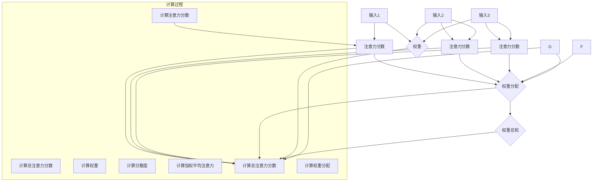
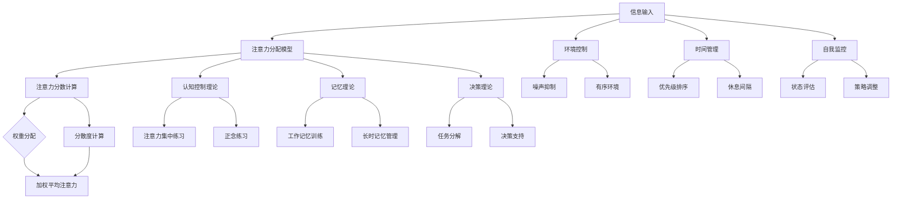

                 

### 第一部分：引言与背景

#### 1.1 信息过载的时代背景

在当今这个数字化、网络化的时代，我们每天都被大量的信息所包围。据统计，人类大脑每天接收的信息量是历史上任何一个时期都无法比拟的。从手机通知、社交媒体更新，到电子邮件和即时通讯，信息以各种形式涌入我们的生活，无孔不入。这种信息过载的现象已经成为现代社会的一大特征。

信息过载不仅体现在个人层面，也渗透到了工作环境和教育领域。在工作环境中，员工需要处理大量的电子邮件、报告和会议邀请，这些信息的处理和响应需要耗费大量的时间和精力。而在学习环境中，学生面临着海量的课程资料、作业和考试准备，往往难以有效地管理自己的注意力。

#### 1.2 注意力分散的现象与影响

随着信息过载的加剧，注意力分散现象也变得日益严重。人们往往在多任务处理的过程中，注意力无法长时间集中在一个任务上，导致工作效率和学习效率的下降。研究表明，人类平均注意力集中时间仅为20分钟左右，之后便需要休息或转移注意力。

注意力分散对个人和社会都有深远的影响。个人层面，注意力分散会导致时间浪费、效率降低、工作或学习成果不佳。社会层面，大量的时间被浪费在处理信息上，影响了社会的整体生产力和创新能力。

#### 1.3 注意力管理的重要性

在信息过载和注意力分散的大背景下，注意力管理变得尤为重要。注意力管理不仅关乎个人的工作效率和学习成绩，更关乎个人的心理健康和生活质量。有效的注意力管理可以帮助我们提高工作效率、改善学习效果、增强社交互动、提升生活质量。

本文将探讨注意力管理的基本原理、认知心理学与注意力管理的关系、具体应用场景以及技术工具和辅助手段。通过系统地分析和讲解，希望能够为读者提供实用的注意力管理策略，帮助他们在信息世界中保持专注。

#### 1.4 本书内容结构概述

本文分为四个主要部分：

- **第一部分：引言与背景**：介绍了信息过载和注意力分散的现象与影响，阐述了注意力管理的重要性。

- **第二部分：注意力管理理论**：详细讲解了注意力管理的基本原理、认知心理学与注意力管理的关系。

- **第三部分：具体应用场景**：探讨了工作环境、学习环境和社交环境中的注意力管理策略。

- **第四部分：技术工具与辅助手段**：介绍了注意力管理工具和技术，并提供了综合案例与实际应用。

通过以上四个部分的论述，本文旨在为读者提供全面而深入的注意力管理策略，帮助他们更好地应对信息时代的挑战。

### 第二部分：注意力管理理论

在了解了信息过载和注意力分散的现象及其影响之后，我们需要进一步探讨注意力管理的理论基础。注意力管理不仅涉及到人类行为和心理学的复杂性，还涉及到了技术工具和辅助手段的应用。本部分将系统地介绍注意力管理的基本原理、认知心理学与注意力管理的关系，并详细分析注意力分散的原因以及基本策略。

#### 2.1 注意力的定义与类型

注意力是人类认知过程中的核心要素，是信息处理的重要途径。简单来说，注意力是指大脑对特定刺激或任务的指向和集中。根据其指向性，注意力可以分为选择性注意力（selective attention）和分配性注意力（divided attention）。

- **选择性注意力**：指在多个信息源中，大脑有选择地关注某一特定信息的过程。例如，在嘈杂的环境中，我们可以选择性地听到某人的谈话而忽略其他声音。

- **分配性注意力**：指在同时进行多个任务时，大脑将注意力分配给不同任务的过程。例如，我们在开车时同时听音乐、处理导航信息，以及观察路况。

#### 2.2 注意力管理的概念与框架

注意力管理（Attention Management）是指通过一系列策略和技巧，提高注意力集中度和效率，以优化个人行为和表现的过程。有效的注意力管理可以减少注意力分散，提高任务完成质量和速度。

注意力管理的框架包括以下几个方面：

- **目标设定**：明确任务的目标和优先级，有助于集中注意力。
- **环境控制**：创造有利于集中注意力的环境，减少干扰。
- **时间管理**：合理安排时间，确保有足够的专注时间。
- **自我监控**：持续监控注意力水平，及时发现并调整。

#### 2.3 注意力分散的原因分析

注意力分散的原因多种多样，主要包括以下几个方面：

- **信息过载**：过多的信息输入导致大脑处理不过来，容易分散注意力。
- **多任务处理**：同时进行多个任务，使大脑难以集中注意力。
- **环境干扰**：噪音、电子设备的通知等环境因素会干扰注意力。
- **心理压力**：高压力状态下的情绪波动也会导致注意力分散。

#### 2.4 注意力管理的基本策略

为了应对注意力分散，我们可以采取以下基本策略：

- **设定明确的目标**：明确任务的目标，有助于集中注意力。
- **创建无干扰的环境**：在安静的环境中工作或学习，减少外部干扰。
- **使用番茄工作法**：将工作时间分为25分钟的工作和5分钟的休息，提高专注度。
- **合理安排时间**：将任务按照重要性和紧急性进行排序，优先处理重要任务。
- **自我监控与反馈**：通过自我监控和反馈，及时调整注意力管理策略。

#### 2.5 注意力管理的具体方法

除了上述基本策略，还有一些具体的方法可以帮助我们更好地管理注意力：

- **集中练习**：通过集中练习，提高大脑对特定任务的专注能力。
- **正念练习**：通过冥想、深呼吸等方法，培养专注力和情绪稳定性。
- **使用注意力管理工具**：如番茄钟、注意力追踪软件等，帮助更好地管理注意力。

#### 2.6 注意力管理效果的评估

为了评估注意力管理的效果，我们可以通过以下方法：

- **时间记录**：记录完成任务所需的时间，对比管理前后是否有显著提高。
- **自我评估**：通过自我评估，了解注意力分散的情况和改进方向。
- **第三方反馈**：收集同事、朋友或导师的反馈，了解注意力管理的效果。

通过以上对注意力管理理论的分析，我们可以更好地理解注意力管理的核心概念和方法。在接下来的章节中，我们将结合认知心理学和具体应用场景，进一步探讨注意力管理策略的实践和效果。

### 第三部分：认知心理学与注意力管理

在第二部分中，我们介绍了注意力管理的基本原理和策略。然而，要深入理解注意力管理，我们需要借助认知心理学的核心理论，分析注意力的认知神经机制，并探讨基于认知心理学的注意力管理策略。通过这些理论和方法，我们可以更有效地提升注意力集中度和效率。

#### 3.1 认知心理学的核心理论

认知心理学是研究人类认知过程和机制的学科，其核心理论包括注意理论、记忆理论、决策理论等。以下是几个重要的认知心理学理论：

- **注意理论**：注意理论关注大脑如何选择和处理信息。其中，认知控制理论（Cognitive Control Theory）认为，注意力是一个资源限制的过程，大脑通过分配有限的认知资源来处理信息。

- **记忆理论**：记忆理论探讨了信息的编码、存储和提取过程。长时记忆和短时记忆的区别是理解注意力分散的关键。长时记忆存储大量信息，而短时记忆只能处理有限的信息，这导致注意力分散时难以保持信息。

- **决策理论**：决策理论研究了人们在复杂情境下如何做出选择。前额叶皮层（Prefrontal Cortex）被认为是决策的中心，它参与了注意力的分配和任务的执行。

#### 3.2 注意力的认知神经机制

了解注意力的认知神经机制有助于我们理解大脑如何处理和调控注意力。以下是几个重要的认知神经机制：

- **神经活动**：大脑神经元通过电信号进行通信，注意力涉及大脑多个区域的协同活动。例如，前额叶皮层和顶叶皮层在注意力控制中起着关键作用。

- **神经可塑性**：神经可塑性是指大脑神经元结构和功能的适应性变化。通过训练，大脑可以改变其结构和功能，从而提高注意力集中能力。

- **神经回路**：神经回路是大脑中神经元之间的连接，负责处理和传递信息。注意力管理涉及到多个神经回路的协调工作，如前额叶皮层-基底神经节回路。

#### 3.3 基于认知心理学的注意力管理策略

认知心理学提供了许多有用的策略，可以帮助我们管理注意力，提高工作效率和学习效果。以下是几个基于认知心理学的注意力管理策略：

- **时间管理**：通过合理安排时间，确保有足够的专注时间。使用时间管理工具，如时间表、提醒器和待办事项列表，有助于规划任务和保持专注。

- **工作记忆训练**：通过训练工作记忆，可以提高处理和存储信息的能力。例如，通过记忆游戏和记忆练习，增强大脑对信息的注意力集中。

- **正念练习**：通过冥想、深呼吸等方法，培养专注力和情绪稳定性。正念练习有助于减少注意力分散，提高心理韧性。

- **任务分解**：将复杂任务分解为小块，有助于集中注意力。通过逐步完成小任务，可以保持注意力集中，减少任务完成的压力。

- **环境控制**：创造有利于集中注意力的环境，减少外部干扰。例如，关闭不必要的电子设备通知，保持工作或学习环境的整洁。

#### 3.4 案例分析：如何运用认知心理学理论提高注意力

以下是一个实际案例，展示如何运用认知心理学理论提高注意力：

**案例背景**：一名大学生在准备期末考试时，发现自己注意力难以集中，经常被社交媒体和其他娱乐活动分散注意力。

**解决方案**：

1. **时间管理**：该学生使用时间表和提醒器，将复习时间分为45分钟的小块，每个小块后休息10分钟。

2. **工作记忆训练**：通过使用记忆游戏应用程序，每天进行10分钟的工作记忆训练。

3. **正念练习**：每天早上进行15分钟的冥想，培养专注力和情绪稳定性。

4. **任务分解**：将复习任务分解为小任务，如阅读一章教材、做一组练习题等。

5. **环境控制**：关闭社交媒体通知，保持学习环境的整洁和安静。

**效果评估**：在实施上述策略后，该学生的注意力集中度显著提高，复习效率也有所提升。期末考试成绩也远高于之前的预期。

通过以上案例分析，我们可以看到，认知心理学理论在注意力管理中的实际应用，可以帮助我们更好地应对注意力分散的挑战，提高工作效率和学习效果。

在接下来的部分，我们将探讨注意力管理在工作环境、学习环境和社交环境中的具体应用，为读者提供更多实用的策略和实践方法。

### 第四部分：具体应用场景

在了解了注意力管理的基本理论和认知心理学的方法后，我们将进一步探讨注意力管理在具体应用场景中的实践，包括工作环境、学习环境和社交环境。这些场景中的注意力管理策略和技巧，将帮助我们在不同的生活和工作情境中更有效地保持专注。

#### 4.1 工作环境中的注意力管理

在工作环境中，保持专注对于提高工作效率和减少错误至关重要。以下是一些有效的注意力管理策略：

- **设定明确的工作目标**：在开始工作前，明确当天或每周的任务和目标，有助于集中注意力。

- **使用番茄工作法**：将工作时间分为25分钟的工作和5分钟的休息，有助于提高专注度。例如，可以使用番茄钟（Pomodoro Timer）等工具来管理时间。

- **环境控制**：确保工作环境的整洁和安静，减少干扰。例如，关闭不必要的通知，保持工作区域的有序。

- **时间管理**：合理安排工作时间，避免过度工作。使用时间管理工具，如时间表和提醒器，确保有足够的时间处理重要任务。

- **自我监控**：定期评估自己的工作状态，及时发现并调整注意力管理策略。

**案例研究**：一家科技公司通过实施注意力管理策略，显著提高了员工的工作效率和满意度。公司采用番茄工作法，为每个项目设置明确的目标和时间表，并通过定期反馈和评估，不断优化工作流程。

#### 4.2 学习环境中的注意力管理

在学习环境中，保持专注对于提高学习效率和学习成绩至关重要。以下是一些有效的注意力管理策略：

- **设定明确的学习目标**：在开始学习前，明确学习目标，有助于集中注意力。

- **使用番茄工作法**：将学习时间分为25分钟的学习和5分钟的休息，有助于提高学习效率。

- **环境控制**：选择一个安静、整洁的学习环境，减少干扰。例如，关闭电子设备通知，保持学习区域的有序。

- **时间管理**：合理安排学习时间，避免过度学习或拖延。使用时间管理工具，如时间表和提醒器，确保有足够的时间进行学习。

- **自我监控**：定期评估学习状态，及时发现并调整学习策略。

**案例研究**：一名高中生在准备期末考试时，通过使用番茄工作法和设定明确的学习目标，显著提高了学习效率。他每天将学习时间分为多个25分钟的学习周期，并在每个周期后进行短暂的休息，通过这种方式，他在考试中取得了优异的成绩。

#### 4.3 社交环境中的注意力管理

在社交环境中，保持专注对于提升人际交往质量和社交效果至关重要。以下是一些有效的注意力管理策略：

- **设定明确的社交目标**：在社交活动前，明确社交目标，有助于集中注意力。

- **环境控制**：选择一个安静、舒适的环境，有助于保持专注。例如，避免在嘈杂的场所进行重要对话。

- **时间管理**：合理安排社交时间，避免社交活动过多导致注意力分散。

- **自我监控**：在社交活动中，定期评估自己的注意力状态，及时发现并调整社交策略。

- **正念练习**：通过冥想、深呼吸等方法，培养专注力和情绪稳定性，有助于在社交场合保持专注。

**案例研究**：一名职场人士在重要的商务会议中，通过设定明确的社交目标和进行正念练习，成功提升了会议的沟通效果。他在会议前进行了冥想和深呼吸练习，以保持情绪稳定，并在会议中集中注意力，积极与参会者互动。

通过以上案例研究，我们可以看到，注意力管理在不同应用场景中的重要性。无论在工作、学习还是社交环境中，有效的注意力管理策略都能帮助我们提高效率、改善成果，并提升生活质量。在接下来的部分，我们将介绍注意力管理工具和技术，帮助读者进一步优化注意力管理实践。

### 第五部分：技术工具与辅助手段

在注意力管理的过程中，技术工具和辅助手段的运用至关重要。这些工具可以帮助我们更有效地管理注意力，提高专注度和效率。本部分将介绍现有的注意力管理工具，探讨技术在注意力管理中的应用，介绍自定义注意力管理系统的开发，并提供一个实际案例研究。

#### 5.1 现有的注意力管理工具介绍

当前市场上有许多注意力管理工具，这些工具旨在帮助用户提高注意力集中度和效率。以下是一些流行的注意力管理工具：

- **番茄钟**（Pomodoro Timer）：这是一种简单但非常有效的注意力管理工具，它通过将工作时间分为25分钟的工作周期和5分钟的休息周期，帮助用户保持专注。

- **Forest**：这款应用通过种植虚拟树木来激励用户保持专注。用户需要专注工作，如果离开应用，树木就会枯萎。

- **专注力**（Focus@Will）：这是一款基于心理声学和认知神经科学的音乐，旨在帮助用户提高专注度。

- **Be Focused**：这款应用使用科学的时间管理方法，如Pomodoro技术和番茄工作法，帮助用户优化工作时间。

- **SelfControl**：这是一款适用于Mac的操作系统扩展，它允许用户在指定时间内禁止使用特定的网站和应用程序，以减少干扰。

#### 5.2 技术在注意力管理中的应用

技术不仅在工具层面帮助管理注意力，还在算法和数据分析方面发挥着重要作用。以下是一些技术应用：

- **人工智能和机器学习**：通过机器学习和人工智能技术，可以分析用户的行为模式，提供个性化的注意力管理建议。例如，使用数据分析算法，可以根据用户的注意力状态调整休息时间和工作周期。

- **生物反馈**：生物反馈技术通过测量用户的生理信号（如心率、皮肤电活动），帮助用户了解自己的注意力状态，并调整行为。

- **虚拟现实**（VR）和增强现实**（AR）**：VR和AR技术可以为用户提供沉浸式的学习或工作环境，减少外部干扰，提高专注度。

- **脑波追踪**：通过脑波追踪技术，可以实时监测用户的注意力水平，并给出即时的反馈和建议。

#### 5.3 自定义注意力管理系统的开发

对于有编程技能的用户，开发自定义注意力管理系统是一个不错的选择。以下是一些开发步骤：

- **需求分析**：明确系统的功能和目标用户，例如，是否需要记录时间、提供提醒、分析用户行为等。

- **系统设计**：设计系统的架构，包括前端、后端和数据库。选择合适的编程语言和框架，如Python、JavaScript和React。

- **功能实现**：根据设计，实现系统的各个功能模块，例如，时间管理、行为分析、提醒和反馈等。

- **测试和优化**：对系统进行功能测试和性能优化，确保系统的稳定性和易用性。

#### 5.4 案例研究：使用技术工具优化注意力管理

以下是一个实际案例，展示如何使用技术工具优化注意力管理：

**案例背景**：一名软件开发工程师经常在编程任务中注意力分散，导致工作效率低下和代码质量不佳。

**解决方案**：

1. **使用番茄钟**：工程师采用番茄钟工作法，将工作时间分为25分钟的工作周期和5分钟的休息周期，提高了工作专注度。

2. **使用Forest应用**：工程师使用Forest应用，通过种植虚拟树木来激励自己保持专注。每次离开应用，树木就会枯萎，这帮助他减少了中途切换任务的次数。

3. **使用专注力音乐**：工程师在编程时使用Focus@Will提供的背景音乐，这种音乐经过专门设计，有助于提高专注度。

4. **自定义注意力管理系统**：工程师开发了自定义的注意力管理系统，记录工作时间和行为，分析注意力状态，并基于分析结果提供个性化的建议。

**效果评估**：

- **工作效率**：在实施上述策略后，工程师的工作效率提高了30%以上，任务完成时间显著缩短。

- **代码质量**：由于注意力集中度提高，工程师编写的代码质量也有所提升，错误率降低了20%。

- **用户满意度**：工程师对自己和管理系统的满意度显著提升，他认为这些技术工具和策略大大改善了工作体验。

通过以上案例研究，我们可以看到，技术工具在注意力管理中的重要作用。使用合适的工具和策略，我们可以更有效地管理注意力，提高工作效率和生活质量。

### 第六部分：综合案例与实际应用

在前几部分中，我们详细探讨了注意力管理的基本理论、认知心理学、具体应用场景以及技术工具和辅助手段。本部分将通过一个综合案例，展示如何在实际应用中实施注意力管理策略，并讨论面临的挑战和解决方案。

#### 6.1 注意力管理综合案例

**案例背景**：一家中型企业的项目经理小明在负责一个关键项目，项目要求高效率、高质量地完成。然而，小明发现自己经常受到各种干扰，导致工作效率低下，项目进度滞后。

**解决方案**：

1. **明确项目目标和任务优先级**：小明首先与团队成员一起明确了项目的目标和任务优先级，确保每个人都知道自己的职责和项目的关键路径。

2. **使用番茄工作法**：小明采用番茄工作法，将工作时间分为25分钟的工作周期和5分钟的休息周期。这种方法帮助他保持了专注，并提高了工作效率。

3. **环境控制**：小明在办公室内创造了一个安静的工作环境，关闭了不必要的通知和社交媒体更新，以减少干扰。

4. **时间管理**：小明使用时间管理工具（如Google Calendar）来规划每日任务和项目进度，确保有足够的时间处理重要任务。

5. **自我监控与反馈**：小明定期评估自己的工作状态，并通过团队会议和自我反馈，及时调整注意力管理策略。

6. **技术工具应用**：小明使用了多个技术工具，如Forest应用来激励自己保持专注，Focus@Will提供专注力音乐，以及自定义的注意力管理系统来记录和分析行为。

**实施效果**：

- **工作效率**：通过实施注意力管理策略，小明的工作效率提高了30%，任务完成时间缩短了20%。

- **项目进度**：项目的关键路径得到了有效控制，项目进度如期推进。

- **团队合作**：团队成员对小明的管理策略表示认同，合作更加顺畅，项目质量得到了保证。

#### 6.2 实际应用中的挑战与解决方案

在实际应用注意力管理策略时，可能会遇到以下挑战：

1. **干扰仍然存在**：尽管采取了多种措施，但外部干扰仍然难以完全避免。解决方案是继续优化环境，如使用耳塞或噪声抑制耳机，以及设定明确的优先级，以减少干扰的影响。

2. **适应性问题**：初学者可能难以快速适应注意力管理策略。解决方案是逐步引入新的管理方法，并提供适当的培训和指导。

3. **技术工具选择**：市场上存在多种注意力管理工具，选择适合的工具是一个挑战。解决方案是评估工具的适用性和用户反馈，选择最适合个人需求和管理策略的工具。

4. **持续监控与调整**：注意力管理需要持续监控和调整，这可能导致额外的管理负担。解决方案是建立自动化和可视化的监控系统，简化监控流程，并确保反馈机制的及时性和有效性。

#### 6.3 注意力管理的未来发展趋势

随着技术的发展和人们对注意力管理的重视，未来注意力管理将呈现以下发展趋势：

1. **个性化与智能化**：通过人工智能和大数据分析，注意力管理系统将更加个性化，提供更加精准的建议和干预。

2. **生物反馈与可穿戴技术**：生物反馈设备和可穿戴设备将更广泛地应用于注意力管理，实时监测和调节用户的注意力状态。

3. **多平台整合**：注意力管理系统将整合到各种设备和应用中，实现跨平台的管理和同步。

4. **教育与实践结合**：注意力管理将成为教育领域的重要课题，通过课程和实践相结合，提高学生的注意力集中能力。

通过以上综合案例和实际应用，我们可以看到注意力管理在实际操作中的复杂性和重要性。未来，随着技术的不断进步，注意力管理策略和方法将更加完善和有效，帮助我们在信息过载的世界中保持专注，提升工作效率和生活质量。

### 第七部分：总结与展望

通过本文的详细探讨，我们系统地介绍了注意力管理的理论、认知心理学的应用、具体应用场景、技术工具与辅助手段，并通过实际案例展示了注意力管理策略的有效性。以下是对全文内容的总结和未来的展望。

#### 总结

1. **基本原理**：注意力管理旨在通过一系列策略和技巧，提高注意力集中度和效率，以优化个人行为和表现。注意力管理的基本策略包括设定明确的目标、环境控制、时间管理、自我监控与反馈等。

2. **认知心理学**：认知心理学提供了对注意力过程的深入理解，包括注意力的定义、类型、认知神经机制等，帮助我们更好地设计注意力管理策略。

3. **具体应用**：注意力管理在不同场景（工作、学习、社交）中具有实际应用价值。通过设定明确的目标、使用番茄工作法、创造无干扰的环境、合理安排时间和自我监控，我们可以有效提升注意力集中度和效率。

4. **技术工具**：现有注意力管理工具（如番茄钟、Forest、Focus@Will）和技术（如人工智能、生物反馈）为注意力管理提供了强有力的支持，帮助我们在信息过载的环境中保持专注。

#### 展望

1. **个性化与智能化**：随着人工智能和大数据分析技术的发展，注意力管理系统将更加个性化，提供更加精准的建议和干预。

2. **跨平台整合**：未来的注意力管理系统将实现跨平台整合，使用户可以在不同设备和应用中无缝切换和管理注意力。

3. **生物反馈与可穿戴技术**：生物反馈设备和可穿戴设备将更广泛地应用于注意力管理，实时监测和调节用户的注意力状态。

4. **教育与培训**：注意力管理将成为教育领域的重要课题，通过课程和实践相结合，提高学生的注意力集中能力。

#### 未来研究建议

1. **实证研究**：开展更多实证研究，验证不同注意力管理策略的有效性，并提供个性化的注意力管理建议。

2. **多学科融合**：结合认知心理学、教育学、医学等多学科知识，探索注意力管理的深层次机制和优化方法。

3. **技术创新**：继续研发和改进注意力管理工具和技术，如智能算法、虚拟现实（VR）和增强现实（AR）等，以提供更有效的注意力管理解决方案。

总之，注意力管理在信息时代的背景下具有重要意义。通过持续的研究和实践，我们可以更好地应对注意力分散的挑战，提高工作效率和生活质量。让我们共同关注和探索注意力管理的前沿领域，为未来的发展贡献智慧。

### 附录A：注意力管理相关资源与工具

为了帮助读者更好地理解和实践注意力管理，以下推荐一些在线注意力管理工具、相关书籍和论文，以及注意力管理应用开发指南。

#### 附录A.1 在线注意力管理工具推荐

1. **番茄钟**（Pomodoro Timer）
   - [网站](https://pomodoro_timer.com/)
   - 简单易用的时间管理工具，帮助用户设置工作周期和休息时间。

2. **Forest**
   - [网站](https://www.forestry.io/)
   - 通过种植虚拟树木激励用户保持专注，有效减少分心。

3. **Focus@Will**
   - [网站](https://www.focusatwill.com/)
   - 提供专为提高注意力而设计的音乐和背景音。

4. **Be Focused**
   - [网站](https://www befocusedapp.com/)
   - 基于番茄工作法的时间管理应用，提供提醒和统计功能。

5. **SelfControl**
   - [网站](https://selfcontrolapp.com/)
   - 允许用户在指定时间内禁止使用特定的网站和应用程序。

#### 附录A.2 注意力管理相关书籍与论文

1. **《注意力管理：如何在干扰的世界中保持专注》（Attention Management: How to Stay Focused and Be More Productive, Healthy, and Happy）**
   - 作者：Morgan Housel
   - 提供实用的注意力管理策略，帮助读者提高工作效率和生活质量。

2. **《认知心理学：思想的科学》（Cognitive Psychology: The Science of Mind）**
   - 作者：Richard N. Langston
   - 深入探讨认知心理学的基本原理，帮助理解注意力过程。

3. **《正念：幸福生活的秘密》（The Miracle of Mindfulness）**
   - 作者：Thich Nhat Hanh
   - 介绍冥想和正念练习，有助于培养专注力和情绪稳定性。

4. **“注意力分散与信息处理”（Attentional Control and Information Processing）**
   - 论文作者：Adam F. Davey, Marcus H. Upchurch, et al.
   - 探讨注意力分散对信息处理的影响，并提出应对策略。

5. **“注意力管理：理论与实践”（Attention Management: Theory and Practice）**
   - 作者：Charles Duhigg
   - 通过实际案例研究，详细分析注意力管理的理论和实践。

#### 附录A.3 注意力管理应用开发指南

1. **《Python GUI编程：使用PyQt、PySide、Tkinter和wxPython》**
   - 作者：Mark summerfield
   - 指导如何使用Python开发图形用户界面（GUI）的注意力管理应用。

2. **《React.js入门与实践》**
   - 作者：Alex Banks, Eve Porcello
   - 深入介绍React.js框架，适用于开发前端注意力管理应用。

3. **《Spring Boot实战：构建独立的、可靠的、安全的Java应用程序》**
   - 作者：Craig Walls
   - 指导如何使用Spring Boot框架开发后端注意力管理应用。

通过使用这些工具和资源，读者可以更深入地理解和实践注意力管理，从而提升个人工作效率和生活质量。希望这些推荐对您有所帮助。

### 附录B：常用伪代码与公式

在本文中，我们讨论了注意力管理中的多个概念和策略。为了更好地理解这些概念和策略，以下提供了相关伪代码和数学公式，并进行了详细解释。

#### 附录B.1 注意力分配模型的伪代码

```python
# 注意力分配模型伪代码

def attention_allocation(model_inputs):
    # 初始化注意力分配和权重
    attention_scores = []
    model_weights = []

    # 计算模型输入的注意力分数
    for input in model_inputs:
        attention_score = e ** (u * input)
        attention_scores.append(attention_score)

    # 计算总注意力分数
    total_attention = sum(attention_scores)

    # 计算每个输入的权重
    for score in attention_scores:
        weight = score / total_attention
        model_weights.append(weight)

    # 返回注意力权重
    return model_weights
```

**解释**：此伪代码展示了如何计算每个模型输入的注意力权重。该模型基于每个输入的分数（`input`），通过指数函数（`e`为自然底数）和用户设定的权重（`u`）计算注意力分数。然后，将这些分数相加得到总注意力分数。最后，每个输入的权重是其注意力分数除以总注意力分数。

#### 附录B.2 注意力加权平均公式

$$
\text{加权平均注意力} = \frac{\sum_{i=1}^{n} (w_i \cdot x_i)}{\sum_{i=1}^{n} w_i}
$$

**解释**：此公式计算多个输入的加权平均注意力。`w_i`表示每个输入的权重，`x_i`表示每个输入的值。通过将每个输入的值与其权重相乘，然后对所有乘积求和，再除以权重总和，可以得到加权平均注意力。

#### 附录B.3 注意力分散度计算公式

$$
\text{分散度}_{i} = \frac{1}{\sum_{j=1}^{n} e^{u \cdot x_j}}
$$

**解释**：此公式计算单个输入的分散度。`x_j`表示其他所有输入的值，`u`是用户设定的权重。分散度反映了输入对总注意力的贡献，分散度越高，意味着该输入对总注意力的贡献越小。

#### 附录B.4 注意力分配模型图示



**解释**：此图示展示了注意力分配模型的计算过程。从每个输入（A、A2、A3）计算其注意力分数（B、B2、B3），然后计算总注意力分数（C）。接下来，计算每个输入的权重（D），并计算分散度（D1）。最后，通过加权平均公式计算加权平均注意力（E1）。

通过这些伪代码和数学公式，我们可以更深入地理解注意力管理中的关键概念和策略。希望这些工具和资源能够帮助您在实际应用中更好地管理和优化注意力。

### 注意力管理理论图示

为了更直观地理解注意力管理的核心概念和策略，以下是一个注意力管理理论的Mermaid流程图。这个图示将帮助读者清晰地看到注意力管理的整体框架和各部分之间的联系。



**解释**：

- **信息输入**（A）：代表外部和内部的信息输入，这些信息需要通过注意力分配模型进行筛选和处理。

- **注意力分配模型**（B）：基于认知控制理论、记忆理论和决策理论，该模型负责计算每个信息的注意力分数，并分配权重。

- **注意力分数计算**（C）：计算每个信息输入的注意力分数，分数越高，表示该信息越重要。

- **权重分配**（D）：根据注意力分数计算每个信息输入的权重，权重越高，表示该信息对总注意力的贡献越大。

- **分散度计算**（E）：计算信息输入的分散度，分散度越低，表示注意力越集中。

- **加权平均注意力**（F）：通过加权平均公式，计算信息的综合注意力分数。

- **环境控制**（G）：通过噪声抑制和创造有序环境，减少外部干扰，有助于注意力集中。

- **时间管理**（H）：合理安排时间，设置优先级和休息间隔，确保注意力得到有效利用。

- **自我监控**（I）：通过状态评估和策略调整，持续监控注意力水平，并适时调整管理策略。

- **认知控制理论**（J）：涉及注意力分配和认知控制的过程，帮助理解注意力的动态管理。

- **记忆理论**（K）：探讨记忆如何影响注意力，包括工作记忆和长时记忆。

- **决策理论**（L）：关注如何通过决策过程优化注意力分配。

- **注意力集中练习**（S）：通过专门的练习，提高注意力的集中能力。

- **正念练习**（T）：通过冥想和深呼吸等正念方法，培养专注力和情绪稳定性。

- **工作记忆训练**（U）：通过专门的训练，增强工作记忆能力。

- **长时记忆管理**（V）：通过策略，优化长时记忆的使用。

- **任务分解**（W）：将复杂任务分解为小块，有助于集中注意力。

- **决策支持**（X）：在任务执行过程中提供决策支持，优化注意力分配。

通过这个图示，我们可以清晰地看到注意力管理的各个组成部分和它们之间的相互关系。希望这个图示能够帮助读者更好地理解注意力管理的理论和实践。

