                 

### 《信息简化的好处与挑战：在复杂世界中简化以提高效率和生产力》

> **关键词：** 信息简化、工作效率、生产力、技术挑战、复杂系统

> **摘要：** 本文将深入探讨信息简化的概念、好处及其在复杂世界中的应用。我们将分析信息简化的理论基础、方法与实践，探讨其在企业信息化管理和教育信息化中的具体应用，并展望其未来趋势与挑战。通过案例分析和实际代码实现，本文将帮助读者理解信息简化的重要性以及如何在实际项目中有效实施。

### 第一部分：引言与概述

#### 1.1 信息简化的概念与重要性

**1.1.1 信息简化的定义**

信息简化是指通过去除冗余、无关或不重要的信息，从而减少信息的复杂度和体积，使其更加简洁、易理解和高效的过程。信息简化的目的在于提高信息的质量和可用性，使其能够更好地支持决策、管理和创新。

**1.1.2 信息简化的重要性**

在当今信息爆炸的时代，信息简化显得尤为重要。以下是一些信息简化的关键重要性：

- **提高工作效率：** 简化的信息有助于快速获取关键信息，减少搜索和处理时间，从而提高工作效率。
- **降低决策成本：** 通过简化信息，决策者可以更快地理解和分析数据，降低决策的时间和成本。
- **减少错误率：** 简化的信息减少了信息处理的复杂度，从而降低了处理错误的可能性。
- **优化资源配置：** 信息简化有助于识别和利用最重要的资源，从而优化资源的配置和利用。

**1.1.3 复杂世界的挑战与简化的需求**

随着科技的发展和全球化进程的加速，我们所处的世界变得越来越复杂。复杂系统的特征包括：

- **信息量巨大：** 数据量和信息来源的急剧增长，使得信息的处理变得更加困难。
- **动态变化：** 复杂系统中的各种因素不断变化，使得信息更新的频率和难度增加。
- **不确定性和风险：** 复杂系统中的不确定性因素增加了决策和管理的风险。

在这样的背景下，信息简化成为应对复杂世界的有效手段。通过信息简化，我们可以更好地应对复杂系统的挑战，提高决策效率，降低风险，实现资源的优化配置。

#### 1.2 信息简化的好处

**1.2.1 提高效率**

信息简化可以通过以下几个方面提高效率：

- **减少信息处理时间：** 通过去除冗余信息，减少了在信息处理上花费的时间。
- **优化工作流程：** 简化的信息使工作流程更加顺畅，减少了信息传递的延迟和错误。
- **提高决策速度：** 简化的信息使决策者能够更快地理解和分析数据，从而提高决策速度。

**1.2.2 提高生产力**

信息简化有助于提高生产力的几个方面：

- **资源优化配置：** 简化的信息帮助更好地识别和利用关键资源。
- **创新加速：** 简化的信息减少了信息处理的复杂度，使得创新过程更加高效。
- **适应快速变化：** 简化的信息使组织能够更快地适应外部环境的变化。

#### 1.3 信息简化的挑战

尽管信息简化具有许多好处，但在实际应用中仍然面临以下挑战：

**1.3.1 简化与精确度的平衡**

在信息简化的过程中，如何在去除冗余信息的同时保持数据的精确性和完整性是一个关键问题。

**1.3.2 文化与心理障碍**

组织和文化背景的不同可能导致对信息简化的接受程度和实施难度不同。

**1.3.3 技术与工具的适应性**

现有的技术和工具可能无法完全支持信息简化的需求，需要开发新的工具和技术。

### 第二部分：信息简化的理论基础

#### 2.1 信息论的基本原理

**2.1.1 熵的概念**

熵是信息论中的一个基本概念，它用于度量一个随机变量的不确定性。一个随机变量的熵越大，表示其不确定性越高。

熵的计算公式为：

$$ H(X) = -\sum_{x \in X} p(x) \log_2 p(x) $$

其中，$p(x)$ 表示随机变量 $X$ 取值为 $x$ 的概率。

**2.1.2 信息量的度量**

信息量是指接收一个信息后，熵的减少量。信息量的度量公式为：

$$ I(X; Y) = H(X) - H(X | Y) $$

其中，$Y$ 是接收的信息，$H(X | Y)$ 表示在接收到信息 $Y$ 后，随机变量 $X$ 的熵。

**2.1.3 信息熵的计算方法**

信息熵可以通过统计方法或优化方法进行计算。常用的方法包括：

- **统计方法：** 通过收集大量数据，计算各个数据点的概率，然后使用熵的计算公式进行计算。
- **优化方法：** 使用优化算法，如梯度下降，最小化损失函数，从而得到最优的信息熵估计。

#### 2.2 信息简化的数学模型

**2.2.1 熵减模型**

熵减模型是一种基于信息熵的简化方法。其基本思想是，通过减少信息熵，简化信息的复杂度。

熵减模型的计算公式为：

$$ H'(X) = H(X) - \alpha \cdot H(X|Y) $$

其中，$\alpha$ 是调节参数，用于平衡简化程度和信息的完整性。

**2.2.2 信息增益模型**

信息增益是衡量信息简化效果的一个指标。信息增益模型通过计算信息熵的减少量，评估简化的效果。

信息增益的计算公式为：

$$ IG(X; Y) = H(X) - H(X|Y) $$

**2.2.3 信息增益率模型**

信息增益率模型是信息增益的改进，它通过将信息增益与原始信息熵的比例进行计算，以消除数据分布的影响。

信息增益率的计算公式为：

$$ IG_R(X; Y) = \frac{IG(X; Y)}{H(X)} $$

#### 2.3 信息简化的算法原理

**2.3.1 数据清洗算法**

数据清洗是信息简化的第一步，其目的是去除数据中的噪声和错误。常用的数据清洗算法包括：

- **去重：** 去除重复的数据记录。
- **格式转换：** 将不同格式的数据转换为统一的格式。
- **缺失值处理：** 对缺失值进行填充或删除。

**2.3.2 信息筛选与压缩算法**

信息筛选与压缩是信息简化的关键步骤。常用的算法包括：

- **信息重要性排序：** 根据信息的重要程度对信息进行排序。
- **信息冗余识别：** 识别并去除冗余信息。
- **信息压缩：** 使用压缩算法减少信息的大小。

### 第三部分：信息简化的方法与实践

#### 3.1 企业信息化管理

**3.1.1 企业信息架构设计**

企业信息架构设计是信息简化的基础。其目的是建立一套高效的信息处理和管理体系。

- **企业信息架构的基本概念：** 企业信息架构包括信息资源、信息流程和信息技术三个核心组成部分。
- **企业信息架构的设计原则：** 包括简洁性、一致性、灵活性和可扩展性。
- **企业信息架构的案例分析：** 通过具体的案例，展示企业信息架构的设计过程和应用效果。

**3.1.2 企业信息流程优化**

企业信息流程优化是提高信息处理效率的关键步骤。

- **企业信息流程的基本概念：** 企业信息流程是指信息在企业内部流转和处理的过程。
- **企业信息流程优化的方法：** 包括流程梳理、流程再造、流程监控和流程优化。
- **企业信息流程优化的案例分析：** 通过具体的案例，展示企业信息流程优化前后的效果对比。

**3.1.3 企业信息化成功实践**

企业信息化成功实践是信息简化在企业中的应用案例。

- **企业信息化的成功因素：** 包括高层领导的支持、员工的积极参与、合理的规划和有效的实施。
- **企业信息化的失败教训：** 分析企业信息化过程中常见的失败原因和教训。

#### 3.2 教育信息化

**3.2.1 教育信息资源管理**

教育信息资源管理是提高教育效率和质量的关键步骤。

- **教育信息资源的基本概念：** 包括教育信息、教育资源和教育资源三个核心组成部分。
- **教育信息资源的管理方法：** 包括资源收集、资源分类、资源共享和资源监控。
- **教育信息资源的案例分析：** 通过具体的案例，展示教育信息资源管理的应用效果。

**3.2.2 教学信息简化策略**

教学信息简化策略是提高教学效率和质量的有效手段。

- **教学信息简化的基本原则：** 包括简洁性、针对性和有效性。
- **教学信息简化的策略：** 包括信息筛选、信息压缩和信息可视化。
- **教学信息简化的案例分析：** 通过具体的案例，展示教学信息简化的应用效果。

**3.2.3 学生信息素养培养**

学生信息素养培养是教育信息化的重要组成部分。

- **学生信息素养的基本概念：** 包括信息意识、信息能力和信息道德。
- **学生信息素养的培养方法：** 包括课程教学、实践活动和校园文化。
- **学生信息素养培养的案例分析：** 通过具体的案例，展示学生信息素养培养的应用效果。

### 第四部分：信息简化的案例分析

#### 4.1 企业案例

**4.1.1 案例一：如何通过信息简化提高企业效率？**

- **案例背景：** 描述企业面临的信息处理复杂度和效率问题。
- **信息简化的实施步骤：** 描述企业采取的信息简化措施，如数据清洗、信息压缩和流程优化。
- **信息简化的效果分析：** 分析信息简化对企业效率提升的具体效果，如处理时间缩短、错误率降低等。

**4.1.2 案例二：如何利用信息简化推动企业创新？**

- **案例背景：** 描述企业面临的信息冗余和创新效率问题。
- **信息简化的实施步骤：** 描述企业采取的信息简化措施，如信息筛选、信息压缩和知识管理。
- **信息简化的效果分析：** 分析信息简化对企业创新能力提升的具体效果，如创新速度加快、创新成功率提高等。

#### 4.2 教育案例

**4.2.1 案例一：如何通过信息简化提升教学质量？**

- **案例背景：** 描述教育机构面临的教学信息复杂度和教学质量问题。
- **信息简化的实施步骤：** 描述教育机构采取的信息简化措施，如信息筛选、信息压缩和信息可视化。
- **信息简化的效果分析：** 分析信息简化对教学质量提升的具体效果，如学生理解度提高、考试成绩提升等。

**4.2.2 案例二：如何利用信息简化培养学生的信息素养？**

- **案例背景：** 描述学校面临的学生信息素养培养问题。
- **信息简化的实施步骤：** 描述学校采取的信息简化措施，如信息素养课程、信息素养实践活动和信息素养评价。
- **信息简化的效果分析：** 分析信息简化对学生信息素养培养的具体效果，如信息获取能力提高、信息处理能力增强等。

### 第五部分：信息简化的未来趋势与挑战

#### 5.1 信息简化的未来趋势

**5.1.1 人工智能在信息简化中的应用**

- **自然语言处理：** 利用 NLP 技术对文本信息进行自动简化。
- **机器学习与深度学习：** 利用 ML 和 DL 技术优化信息简化的算法和流程。
- **人工智能伦理与隐私保护：** 在信息简化的过程中，确保数据隐私和用户隐私。

**5.1.2 信息简化的可持续性发展**

- **信息简化的可持续性原则：** 确保信息简化的过程不会对环境和资源造成负面影响。
- **信息简化的可持续发展策略：** 推广可持续的信息简化方法和技术，提高社会的信息处理能力。

#### 5.2 信息简化的新挑战

**5.2.1 信息过载与信息疲劳**

- **信息过载的原因：** 信息来源的多样性和信息传播速度的加快。
- **信息疲劳的影响：** 影响工作效率、决策能力和心理健康。
- **应对策略：** 采用信息筛选、信息压缩和信息过滤技术，减少信息过载。

**5.2.2 信息简化的伦理问题**

- **信息简化的伦理原则：** 尊重信息真实性、完整性和用户隐私。
- **信息简化的伦理挑战：** 信息简化的过程中可能面临伦理困境，如数据偏见、信息歧视等。
- **伦理解决方案：** 加强信息简化的伦理教育和监管，建立伦理准则和规范。

**5.2.3 全球化背景下的信息简化策略**

- **全球化对信息简化的影响：** 全球化带来的信息多样性和复杂性。
- **全球化背景下的信息简化策略：** 推广通用信息简化方法，适应不同文化背景下的信息需求。

### 附录

#### 6.1 参考文献

- 信息论基本原理
- 信息简化的数学模型
- 企业信息化管理实践
- 教育信息化实践

#### 6.2 信息简化实践案例分析

- 某企业的信息简化实践
- 某学校的教师信息素养培养案例
- 某互联网公司的数据压缩案例

### 附件

- Mermaid 流程图
- 核心算法原理讲解（伪代码）
- 数学模型和公式
- 项目实战代码案例

---

### Mermaid 流程图

```mermaid
graph TD
    A[信息简化概念] --> B[信息简化好处]
    B --> C[提高效率]
    B --> D[提高生产力]
    D --> E[资源优化配置]
    D --> F[创新加速]
    D --> G[适应快速变化]

    C --> H[工作流程优化]
    C --> I[决策速度提升]
    C --> J[减少错误率]

    G --> K[简化与精确度平衡]
    G --> L[文化与心理障碍]
    G --> M[技术与工具适应性]

    B --> N[简化与精确度平衡]
    B --> O[文化与心理障碍]
    B --> P[技术与工具适应性]

    Q[理论基础] --> R[信息论基本原理]
    Q --> S[信息简化数学模型]
    Q --> T[信息简化算法原理]

    R --> U[熵的概念]
    R --> V[信息量的度量]
    R --> W[信息熵的计算方法]

    S --> X[熵减模型]
    S --> Y[信息增益模型]
    S --> Z[信息增益率模型]

    T --> AA[数据清洗算法]
    T --> BB[信息筛选与压缩算法]

    V --> CC[企业信息化管理]
    V --> DD[教育信息化]
    V --> EE[信息简化技术工具]

    CC --> FF[企业信息架构设计]
    CC --> GG[企业信息流程优化]
    CC --> HH[企业信息化成功实践]

    DD --> II[教育信息资源管理]
    DD --> JJ[教学信息简化策略]
    DD --> KK[学生信息素养培养]

    EE --> LL[信息简化工具分类]
    EE --> MM[主流信息简化工具介绍]
    EE --> NN[新技术对信息简化的影响]

    AA --> OO[数据去重算法]
    AA --> PP[数据格式转换算法]
    AA --> QQ[数据缺失值处理算法]

    BB --> RR[信息重要性排序算法]
    BB --> SS[信息冗余识别算法]
    BB --> TT[信息压缩算法]

    AA --> UU[企业案例]
    BB --> VV[教育案例]

    UU --> WW[如何通过信息简化提高企业效率？]
    UU --> XX[如何利用信息简化推动企业创新？]

    VV --> YY[如何通过信息简化提升教学质量？]
    VV --> ZZ[如何利用信息简化培养学生的信息素养？]

    W --> AAA[信息过载与信息疲劳]
    W --> BBB[信息简化的伦理问题]
    W --> CCC[全球化背景下的信息简化策略]

    AAA --> DDD[人工智能在信息简化中的应用]
    AAA --> EEE[信息简化的可持续性发展]

    DDD --> FFF[NLP]
    DDD --> GGG[ML与DL]
    DDD --> HHH[AI伦理与隐私保护]
```


### 核心算法原理讲解（伪代码）

```python
# 数据清洗伪代码
def data_cleaning(data_set):
    cleaned_data = []
    for record in data_set:
        if is_valid(record) and not is_duplicate(record, cleaned_data):
            cleaned_data.append(record)
    return cleaned_data

def is_valid(record):
    # 判断数据是否有效
    return True

def is_duplicate(record, cleaned_data):
    # 判断数据是否重复
    for cleaned_record in cleaned_data:
        if cleaned_record == record:
            return True
    return False
```

### 数学模型和数学公式

1. **熵的概念**

$$ H = -\sum_{i=1}^{n} p_i \log_2 p_i $$

2. **信息增益**

$$ IG(D, A) = Entropy(D) - \sum_{v \in Values(A)} p(v) Entropy(D|A=v) $$

3. **信息增益率**

$$ IG_R(D, A) = \frac{IG(D, A)}{Entropy(A)} $$

### 项目实战

#### 案例一：企业信息流程优化

**开发环境搭建：**
- Python 3.8
- TensorFlow 2.6
- Pandas 1.3.2
- Matplotlib 3.4.2

**源代码实现：**
```python
import pandas as pd
import numpy as np
import tensorflow as tf
import matplotlib.pyplot as plt

# 数据读取
data = pd.read_csv('enterprise_data.csv')

# 数据清洗
cleaned_data = data_cleaning(data)

# 数据可视化
plt.figure(figsize=(10, 6))
plt.plot(cleaned_data['date'], cleaned_data['revenue'])
plt.xlabel('Date')
plt.ylabel('Revenue')
plt.title('Revenue Over Time')
plt.show()

# 信息筛选与压缩
filtered_data = filter_data(cleaned_data)

# 输出结果
print(filtered_data.head())
```

**代码解读与分析：**
- 数据读取：使用 Pandas 读取 CSV 文件。
- 数据清洗：使用自定义的 `data_cleaning` 函数，去除无效数据和重复数据。
- 数据可视化：使用 Matplotlib 绘制时间序列图，展示收入随时间的变化。
- 信息筛选与压缩：实现具体的信息筛选与压缩算法，以提高数据质量和可用性。

#### 案例二：教育信息化案例

**开发环境搭建：**
- Python 3.8
- TensorFlow 2.6
- Scikit-learn 0.24
- Jupyter Notebook

**源代码实现：**
```python
import pandas as pd
import numpy as np
from sklearn.model_selection import train_test_split
from sklearn.ensemble import RandomForestClassifier
from sklearn.metrics import accuracy_score

# 数据读取
data = pd.read_csv('education_data.csv')

# 数据预处理
data = data_cleaning(data)

# 数据分割
X = data.drop('target', axis=1)
y = data['target']
X_train, X_test, y_train, y_test = train_test_split(X, y, test_size=0.2, random_state=42)

# 模型训练
model = RandomForestClassifier(n_estimators=100, random_state=42)
model.fit(X_train, y_train)

# 预测与评估
y_pred = model.predict(X_test)
accuracy = accuracy_score(y_test, y_pred)
print(f"Model Accuracy: {accuracy:.2f}")
```

**代码解读与分析：**
- 数据读取：使用 Pandas 读取 CSV 文件。
- 数据预处理：使用自定义的 `data_cleaning` 函数，去除无效数据和重复数据。
- 数据分割：将数据分为训练集和测试集。
- 模型训练：使用随机森林分类器进行训练。
- 预测与评估：使用测试集进行预测，并计算模型的准确率。

### 附录

#### 参考文献

- Cover, T. M., & Thomas, J. A. (2012). 《信息论、推断论和统计学习理论》.
- Russell, S., & Norvig, P. (2020). 《人工智能：一种现代的方法》.
- Han, J., Kamber, M., & Pei, J. (2011). 《数据挖掘：概念与技术》.

#### 信息简化实践案例分析

- 某企业的信息简化实践案例。
- 某学校的教师信息素养培养案例。
- 某互联网公司的数据压缩案例。

