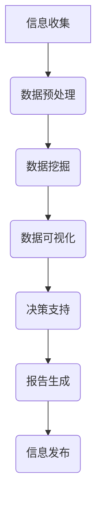

                 

### 第一部分: 信息简化的工具和自动化技术概述

#### 第1章: 信息简化的概念与重要性

##### 1.1 信息简化的定义与背景

信息简化指的是通过某种方式减少信息复杂度，使其更易于理解和处理。这一概念起源于信息论，其中香农（Claude Shannon）首次提出了信息熵的概念，用以衡量信息的复杂度。随着信息技术的发展，信息简化逐渐成为研究热点，特别是在大数据时代，处理海量信息的挑战促使人们寻求更为高效的信息简化方法。

在信息简化的历史背景中，我们可以看到从早期的文件压缩技术到现代的复杂算法，如自然语言处理（NLP）、数据挖掘和信息可视化，都旨在以不同的方式简化信息。

##### 1.2 信息简化的重要性

随着互联网和移动设备的普及，信息的获取变得前所未有的容易。然而，这同时也导致了信息过载的问题。信息过载不仅会影响工作效率，还可能引发焦虑和压力。以下是信息简化的重要性：

- **提升工作效率**：通过简化信息，我们可以更快地找到所需的内容，从而提高工作效率。
- **减少认知负担**：在复杂的信息环境中，过度的信息会消耗大量的认知资源。信息简化有助于减轻这种负担。
- **增强决策质量**：信息简化可以使关键信息更加突出，从而帮助用户做出更高质量的决策。

##### 1.3 信息简化的挑战

尽管信息简化有诸多优势，但在实际操作中仍面临诸多挑战：

- **处理复杂信息的挑战**：一些信息本身就很复杂，如高维数据、多语言文本等，简化这些信息需要高级的技术手段。
- **技术与人文的平衡**：在简化信息时，如何保持信息准确性和人文关怀是一个需要平衡的问题。

##### 1.4 本书结构安排

本书旨在深入探讨信息简化的工具和自动化技术，帮助读者理解并应用这些技术。本书内容安排如下：

- **第一部分：信息简化的工具和技术**：介绍文本处理工具、数据库与数据挖掘、信息可视化技术以及信息过滤与推荐系统。
- **第二部分：自动化技术在简化信息处理中的应用**：探讨自动化技术、自动化脚本与脚本语言、自动化工作流与信息简化，以及自动化与人工智能的结合。
- **第三部分：自动化技术的未来发展趋势**：展望自动化技术的发展趋势、信息简化的未来以及自动化与信息简化的前景。

通过本书的学习，读者将能够：

- 理解信息简化的概念和重要性。
- 掌握各种信息简化工具和技术。
- 应用自动化技术简化信息处理。
- 了解自动化技术的未来发展趋势。

#### 第2章: 信息简化的工具与技术

##### 2.1 文本处理工具

文本处理工具是信息简化中不可或缺的一部分，它们帮助我们将大量的文本信息转化为更易于理解和处理的形式。以下是一些常用的文本处理工具：

- **自然语言处理技术（NLP）**：
  - **词嵌入（Word Embedding）**：将单词映射到高维空间，使它们在语义上更接近。常用的词嵌入技术包括Word2Vec、GloVe等。
  - **文本摘要（Text Summarization）**：通过提取文本中的关键信息，生成简洁的摘要。常见的文本摘要方法包括抽取式摘要和生成式摘要。
  - **情感分析（Sentiment Analysis）**：分析文本中的情感倾向，常用于社交媒体监测、客户反馈分析等。

- **文本摘要工具**：
  - **SummarizeBot**：一款基于机器学习的自动文本摘要工具，能够快速生成文本摘要。
  - **PyTorch Text**：PyTorch的一个模块，提供文本处理和NLP功能。

##### 2.2 数据库与数据挖掘

数据库是存储和管理数据的系统，而数据挖掘则是从大量数据中发现有价值信息的过程。以下是一些常用的数据库和数据挖掘技术：

- **关系型数据库（Relational Database）**：
  - **MySQL**：一款广泛使用的开源关系型数据库，支持SQL查询。
  - **PostgreSQL**：一款强大的开源关系型数据库，支持多种数据类型和复杂查询。

- **非关系型数据库（NoSQL Database）**：
  - **MongoDB**：一款流行的文档型数据库，支持高扩展性和灵活的数据模式。
  - **Cassandra**：一款分布式数据库，适用于大数据场景。

- **数据挖掘方法**：
  - **关联规则学习（Association Rule Learning）**：发现数据之间的关联性，常用于市场篮子分析。
  - **聚类（Clustering）**：将相似的数据点分组，用于数据分类和模式识别。
  - **分类（Classification）**：根据已有数据建立模型，对新数据进行分类。
  - **异常检测（Anomaly Detection）**：识别数据中的异常点，用于欺诈检测、故障诊断等。

##### 2.3 信息可视化技术

信息可视化是将复杂的信息通过图形化的方式展示出来，帮助人们更好地理解和分析数据。以下是一些常用的信息可视化工具：

- **可视化工具**：
  - **Tableau**：一款商业可视化工具，提供丰富的图表和报告功能。
  - **D3.js**：一个基于JavaScript的库，用于创建动态和交互式的数据可视化。

- **信息图表设计**：
  - **条形图（Bar Chart）**：用于比较不同类别的数据。
  - **折线图（Line Chart）**：用于显示数据随时间的变化趋势。
  - **散点图（Scatter Plot）**：用于显示两个变量之间的关系。
  - **饼图（Pie Chart）**：用于显示各部分占整体的比例。

##### 2.4 信息过滤与推荐系统

信息过滤与推荐系统是帮助用户找到他们可能感兴趣的信息的技术。以下是一些基本的概念和常用的技术：

- **基于内容的过滤（Content-based Filtering）**：通过分析用户的历史行为和兴趣，推荐相似的内容。
- **协同过滤（Collaborative Filtering）**：通过分析用户间的相似性，推荐其他用户喜欢的内容。
- **矩阵分解（Matrix Factorization）**：将用户-物品评分矩阵分解为用户特征矩阵和物品特征矩阵，用于推荐系统。

- **推荐系统框架**：
  - **ALS（Alternating Least Squares）**：一种矩阵分解算法，用于协同过滤推荐系统。
  - **Embedding-based 方法**：使用深度学习技术将用户和物品映射到低维空间，用于推荐系统。

##### 小结

本章介绍了信息简化的多种工具和技术，从文本处理工具到数据挖掘，再到信息可视化和推荐系统。掌握这些工具和技术，可以帮助我们更高效地处理和简化信息，提升工作质量和效率。

### 第二部分: 自动化技术在简化信息处理中的应用

#### 第3章: 自动化技术与信息简化

##### 3.1 自动化技术概述

自动化技术是利用计算机程序或其他设备来执行重复性或规律性任务的一种技术。通过自动化，我们可以将人类从繁杂、重复性工作中解放出来，从而提高工作效率和减少错误。自动化技术广泛应用于各个领域，包括制造业、金融服务、医疗保健等。

##### 3.2 自动化工具介绍

自动化工具是实现自动化技术的重要载体，以下是一些常用的自动化工具：

- **自动化软件**：如Python的Selenium库，用于Web自动化测试；RPA（Robotic Process Automation）工具，如UiPath和Blue Prism，用于流程自动化。
- **自动化硬件**：如机器人、自动化生产线，用于制造业和仓储物流。

##### 3.3 自动化在信息处理中的应用

在信息处理领域，自动化技术发挥着重要作用。以下是一些具体的应用实例：

- **自动化数据收集**：使用自动化脚本或工具从网站、数据库等不同来源收集数据，如网络爬虫。
- **自动化数据分析**：使用Python的Pandas库等工具对大量数据进行自动化处理和分析。
- **自动化报告生成**：使用自动化脚本生成财务报表、市场分析报告等，如使用Python的Jinja2库。
- **自动化邮件发送**：使用自动化脚本发送定制的电子邮件，如营销邮件、通知邮件等。

#### 第4章: 自动化脚本与脚本语言

##### 4.1 脚本语言概述

脚本语言是一种用于自动化任务的编程语言，通常具有简洁、易于编写和解释执行的特点。以下是一些常用的脚本语言：

- **Python**：一种通用编程语言，广泛应用于自动化脚本编写。
- **Bash**：Linux和Unix系统上的脚本语言，常用于系统管理和自动化任务。
- **JavaScript**：Web开发中常用的脚本语言，也用于自动化Web应用。

##### 4.2 脚本编程基础

脚本编程涉及变量的定义、数据类型的使用、流程控制语句的编写等基础编程概念。以下是一些常见的脚本编程基础：

- **变量与数据类型**：
  - 变量：用于存储数据的容器，如`$var = "Hello"`。
  - 数据类型：包括字符串、数字、列表、字典等。

- **流程控制语句**：
  - 条件语句：如`if-else`，用于根据条件执行不同的代码。
  - 循环语句：如`for`和`while`，用于重复执行代码块。

##### 4.3 脚本编程实战

以下是一个Python脚本编程的实例，展示了如何使用Python脚本进行自动化数据收集和报告生成：

**实例：自动化收集股票数据并生成报告**

```python
import requests
import pandas as pd

# 获取股票数据
url = "https://api.example.com/stocks"
response = requests.get(url)
data = response.json()

# 将数据转换为DataFrame
df = pd.DataFrame(data)

# 生成报告
report = df.describe()

# 存储报告为CSV文件
report.to_csv("stock_report.csv")

print("股票数据收集完成，报告已生成。")
```

**代码解读与分析**：

- **请求API**：使用`requests`库获取股票数据。
- **数据处理**：将获取的JSON数据转换为Pandas DataFrame。
- **生成报告**：使用`describe()`方法生成报告。
- **存储报告**：将报告保存为CSV文件。

通过这个实例，我们可以看到Python脚本如何简化复杂的数据收集和分析任务，从而提高工作效率。

#### 第5章: 自动化工作流与信息简化

##### 5.1 工作流概述

工作流是指一组任务和活动的序列，它们按照一定的顺序执行，以实现某个目标或业务流程。在自动化技术中，工作流是实现任务自动化的重要手段。

##### 5.2 常用工作流工具

以下是一些常用的自动化工作流工具：

- **Apache Airflow**：一个开源的工作流管理平台，用于自动化和调度数据管道和应用程序。
- **Kubernetes**：一个开源的容器编排平台，可用于自动化部署和管理应用程序。
- **Apache NiFi**：一个开源的数据集成平台，提供数据流自动化功能。

##### 5.3 工作流与信息简化

工作流在信息简化中发挥着重要作用，通过自动化工作流，我们可以简化信息的收集、处理和传递过程。以下是一些应用实例：

- **自动化报表生成工作流**：从不同数据源收集数据，处理后生成报表，并自动发送给相关人员。
- **自动化数据清洗工作流**：对收集到的数据进行清洗，确保数据质量。
- **自动化数据备份工作流**：定期备份重要数据，确保数据安全。

**实例：自动化数据备份工作流**

```bash
#!/bin/bash

# 设置备份目录
BACKUP_DIR="/backup"

# 获取当前日期
DATE=$(date +%Y%m%d)

# 备份数据库
mysqldump -u username -p password dbname > ${BACKUP_DIR}/db_${DATE}.sql

# 压缩备份文件
tar -czvf ${BACKUP_DIR}/db_${DATE}.tar.gz ${BACKUP_DIR}/db_${DATE}.sql

# 删除旧的备份文件
find ${BACKUP_DIR} -name "db_*.tar.gz" -type f -mtime +7 -exec rm -f {} \;

echo "数据库备份完成。"
```

**代码解读与分析**：

- **设置备份目录和日期**：定义备份目录和当前日期。
- **备份数据库**：使用`mysqldump`命令备份数据库。
- **压缩备份文件**：使用`tar`命令压缩备份文件。
- **删除旧备份文件**：使用`find`命令删除7天前的旧备份文件。

通过这个实例，我们可以看到如何使用Shell脚本实现自动化数据备份工作流，从而简化数据备份过程。

##### 小结

本章介绍了自动化脚本与脚本语言、自动化工作流以及其在信息简化中的应用。通过掌握这些技术，我们可以实现任务的自动化，从而提高工作效率，简化信息处理过程。

#### 第6章: 自动化与人工智能

##### 6.1 人工智能概述

人工智能（Artificial Intelligence，简称AI）是指通过计算机模拟人类智能的技术。人工智能涵盖了多个领域，包括机器学习、深度学习、自然语言处理、计算机视觉等。人工智能的发展经历了几个阶段，从早期的规则推理到现代的数据驱动方法，已经取得了显著进展。

##### 6.2 人工智能在信息简化中的应用

人工智能在信息简化中发挥着重要作用，以下是一些具体应用：

- **自然语言处理（NLP）**：通过NLP技术，可以简化文本信息的处理，例如文本摘要、情感分析、机器翻译等。
  - **文本摘要**：使用如Transformer架构的模型，如BERT，提取文本中的关键信息，生成简洁的摘要。
  - **情感分析**：通过分析文本的情感倾向，帮助用户快速了解信息的情绪色彩。
  - **机器翻译**：将一种语言文本翻译为另一种语言，简化跨语言沟通。

- **计算机视觉**：通过计算机视觉技术，可以简化图像和视频信息的处理，例如图像分类、目标检测、人脸识别等。
  - **图像分类**：使用卷积神经网络（CNN）对图像进行分类，如识别猫或狗。
  - **目标检测**：在图像中检测和识别特定目标，如自动驾驶汽车中的行人或车辆。
  - **人脸识别**：通过人脸识别技术，自动识别和验证用户身份，简化登录过程。

##### 6.3 自动化与人工智能结合

自动化与人工智能的结合，可以进一步提升信息简化的效率和质量。以下是一些结合实例：

- **自动化数据预处理**：使用人工智能技术自动处理和清洗数据，例如自动去除噪声、填充缺失值、标准化数据等。
  - **实例**：使用Python的Scikit-learn库和TensorFlow库，自动化处理金融数据，为机器学习模型提供高质量的数据。

- **自动化报告生成**：结合自然语言处理和计算机视觉技术，自动生成丰富的报告，例如自动生成销售报告、财务报表等。
  - **实例**：使用Python的Numpy和Pandas库处理数据，使用自然语言处理库生成摘要，使用计算机视觉库生成图表。

- **自动化推荐系统**：结合协同过滤和深度学习技术，构建高效、准确的推荐系统。
  - **实例**：使用TensorFlow和Keras构建基于深度学习的推荐系统，为电商网站提供个性化推荐。

##### 结合的优势与挑战

自动化与人工智能结合的优势包括：

- **提高效率**：自动化技术可以减少人工干预，提高任务处理速度。
- **降低成本**：通过自动化减少人工操作，降低人力成本。
- **提升准确性**：人工智能技术可以提高数据处理和分析的准确性。

然而，结合也面临一些挑战：

- **技术复杂性**：自动化与人工智能技术复杂，需要专业技能和知识。
- **数据隐私**：在处理大量数据时，需要确保数据安全和隐私。
- **模型偏见**：人工智能模型可能存在偏见，需要不断优化和调整。

##### 小结

本章介绍了人工智能的概念及其在信息简化中的应用，探讨了自动化与人工智能结合的优势与挑战。通过自动化与人工智能的结合，我们可以更高效地简化信息处理，提升工作效率和准确性。

#### 第7章: 自动化技术的未来发展趋势

##### 7.1 自动化技术的发展趋势

随着科技的不断进步，自动化技术正朝着更智能、更高效、更人性化的方向发展。以下是一些自动化技术的发展趋势：

- **物联网（IoT）**：物联网将各种设备连接到互联网，实现设备之间的数据交换和协同工作，从而提高自动化系统的智能化水平。
- **边缘计算**：边缘计算将计算任务从云端转移到网络边缘，减少延迟，提高响应速度，适用于实时性要求高的自动化应用。
- **人工智能与自动化融合**：通过将人工智能技术融入自动化系统，实现更高级的自动化功能，如智能决策、自适应调整等。
- **人机协作**：未来自动化系统将更加注重与人类的协作，通过人机交互技术，提高自动化系统的可操作性和用户体验。

##### 7.2 信息简化的未来

信息简化的未来将依赖于更加先进的自动化和人工智能技术。以下是一些信息简化的未来趋势：

- **智能文本摘要**：利用深度学习和自然语言处理技术，生成更加精准、有价值的文本摘要。
- **智能数据挖掘**：通过机器学习和深度学习算法，从海量数据中挖掘出隐藏的规律和模式，简化数据分析和决策过程。
- **智能信息过滤**：利用人工智能技术，自动识别和过滤无关或冗余信息，提高信息的准确性和可用性。

##### 7.3 自动化与信息简化的未来前景

自动化与信息简化的结合将带来深远的变革：

- **生产效率提升**：自动化技术将大幅提高生产效率，减少人力成本，促进产业升级。
- **生活方式改变**：自动化技术将融入人们的日常生活，简化各种日常操作，提高生活质量。
- **数据价值最大化**：通过自动化和人工智能技术，从大量数据中提取有价值的信息，推动数据驱动决策和智能化服务的发展。

然而，自动化与信息简化也面临一些挑战：

- **技术依赖**：随着自动化技术的普及，人们可能对技术产生过度依赖，影响创新能力。
- **隐私和安全**：自动化系统的广泛应用可能引发数据隐私和安全问题，需要加强监管和防护。
- **人才短缺**：自动化技术的发展需要大量专业人才，而现有人才储备可能无法满足需求。

##### 小结

本章探讨了自动化技术的未来发展趋势和信息简化的未来前景，分析了自动化与信息简化的潜在影响和挑战。随着技术的不断进步，自动化与信息简化将继续推动社会的发展和创新。

### 附录

#### 附录 A: 自动化与信息简化资源

- **A.1 在线资源**：

  - **开源工具和库**：
    - Python
    - R
    - Node.js
    - Ruby
    - JavaScript
    - TensorFlow
    - Keras
    - PyTorch

  - **教程和文档**：
    - Coursera（https://www.coursera.org/）
    - edX（https://www.edx.org/）
    - Khan Academy（https://www.khanacademy.org/）
    - Medium（https://medium.com/）
    - GitHub（https://github.com/）

- **A.2 线下资源**：

  - **书籍推荐**：
    - 《深度学习》（Ian Goodfellow, Yoshua Bengio, Aaron Courville）
    - 《机器学习》（Tom Mitchell）
    - 《Python编程：从入门到实践》（Eric Matthes）
    - 《R语言编程艺术》（Paul Murrell）
    - 《JavaScript高级程序设计》（Nicholas C. Zakas）

  - **工作坊和会议**：
    - PyCon（https://www.pycon.org/）
    - RStudio Conference（https://www.rstudio.com/events/）
    - Node.js Interactive（https://nodejs.org/en/events/nodejs-interactive/）
    - RubyConf（https://www.rubyconf.org/）

- **A.3 实践项目指南**：

  - **项目计划**：
    - 明确项目目标、范围、预期成果和时间表。
    - 定义项目团队和职责分配。

  - **项目实施步骤**：
    - 需求分析：收集用户需求，明确项目目标。
    - 设计方案：设计系统架构和技术路线。
    - 开发与测试：编写代码，进行单元测试和集成测试。
    - 部署与维护：部署系统到生产环境，进行持续维护和优化。

通过这些资源，读者可以更深入地学习自动化与信息简化的相关知识，并在实践中提升技能。

### Mermaid 流程图示例

以下是一个Mermaid流程图示例，展示了信息简化的过程：



在这个流程图中，信息收集阶段收集到的数据经过预处理，然后进行数据挖掘以提取有价值的信息。数据挖掘的结果通过可视化技术展示给用户，帮助用户做出决策。最终，决策结果生成报告，并通过信息发布渠道进行发布。

### 数学模型与公式

以下是一个数学模型示例，用于计算线性回归模型的预测值：

$$
\hat{y} = \beta_0 + \beta_1 \cdot x
$$

其中，$\hat{y}$ 是预测值，$\beta_0$ 是截距，$\beta_1$ 是斜率，$x$ 是自变量。

**详细讲解与举例说明**：

- **线性回归模型**：线性回归是一种常用的统计方法，用于分析自变量和因变量之间的线性关系。
- **公式解释**：该公式表示预测值$\hat{y}$ 是由截距$\beta_0$ 和斜率$\beta_1$ 与自变量$x$ 的乘积组成。
- **举例说明**：假设我们有一个简单的线性回归模型，其中$\beta_0 = 2$，$\beta_1 = 3$，自变量$x = 4$。则预测值$\hat{y}$ 为：

$$
\hat{y} = 2 + 3 \cdot 4 = 14
$$

因此，当自变量$x$ 为4时，预测值$\hat{y}$ 为14。

### 数学公式详细讲解与举例

在深度学习中，激活函数是一个关键组件，用于引入非线性特性到神经网络中。以下是几种常见的激活函数及其数学公式和详细讲解：

#### Sigmoid 函数

$$
\sigma(x) = \frac{1}{1 + e^{-x}}
$$

**详细讲解**：

- **定义**：Sigmoid函数是一个S形曲线，将输入$x$映射到（0，1）区间。
- **特性**：Sigmoid函数在$x = 0$时取值为0.5，随着$x$的增加，函数值趋近于1；随着$x$的减少，函数值趋近于0。
- **梯度问题**：Sigmoid函数的梯度在$x$接近0时非常小，容易导致梯度消失问题。

**举例**：

假设我们有一个输入$x = -2$，则Sigmoid函数的输出为：

$$
\sigma(-2) = \frac{1}{1 + e^{2}} \approx 0.1192
$$

####ReLU函数

$$
\sigma(x) = \max(0, x)
$$

**详细讲解**：

- **定义**：ReLU函数是一个分段线性函数，当输入$x$大于0时，函数值等于$x$；当$x$小于或等于0时，函数值等于0。
- **特性**：ReLU函数在$x$为正数时具有较大的梯度，可以有效避免梯度消失问题。
- **缺点**：ReLU函数可能会导致部分神经元“死亡”，即输入为负数时，神经元不再激活。

**举例**：

假设我们有一个输入$x = -2$，则ReLU函数的输出为：

$$
\sigma(-2) = \max(0, -2) = 0
$$

####Tanh函数

$$
\sigma(x) = \frac{e^{2x} - 1}{e^{2x} + 1}
$$

**详细讲解**：

- **定义**：Tanh函数类似于Sigmoid函数，但输出范围在（-1，1）之间。
- **特性**：Tanh函数的梯度在$x = 0$时为1，避免了梯度消失问题，同时输出范围有限制，有助于稳定训练过程。
- **应用**：Tanh函数常用于隐层的激活函数，尤其在语音识别和图像处理等领域。

**举例**：

假设我们有一个输入$x = -2$，则Tanh函数的输出为：

$$
\sigma(-2) = \frac{e^{-4} - 1}{e^{-4} + 1} \approx -0.7616
$$

### 项目实战

**实战案例：使用Python实现一个简单的文本分类器**

**开发环境搭建**：

- Python 3.8+
- NLP库（如NLTK或spaCy）
- 深度学习库（如TensorFlow或PyTorch）

**源代码详细实现**：

```python
import numpy as np
import pandas as pd
from sklearn.model_selection import train_test_split
from sklearn.feature_extraction.text import CountVectorizer
from tensorflow.keras.models import Sequential
from tensorflow.keras.layers import Dense, Embedding, GlobalAveragePooling1D
from tensorflow.keras.preprocessing.sequence import pad_sequences

# 数据预处理
data = pd.read_csv('text_data.csv')
X = data['text']
y = data['label']

# 分词和向量表示
vectorizer = CountVectorizer(max_features=1000)
X_vectorized = vectorizer.fit_transform(X)

# 切分训练集和测试集
X_train, X_test, y_train, y_test = train_test_split(X_vectorized, y, test_size=0.2, random_state=42)

# 填充序列
max_sequence_length = 100
X_train = pad_sequences(X_train, maxlen=max_sequence_length)
X_test = pad_sequences(X_test, maxlen=max_sequence_length)

# 构建模型
model = Sequential()
model.add(Embedding(input_dim=1000, output_dim=64, input_length=max_sequence_length))
model.add(GlobalAveragePooling1D())
model.add(Dense(1, activation='sigmoid'))

# 编译模型
model.compile(optimizer='adam', loss='binary_crossentropy', metrics=['accuracy'])

# 训练模型
model.fit(X_train, y_train, epochs=10, batch_size=32, validation_data=(X_test, y_test))

# 评估模型
loss, accuracy = model.evaluate(X_test, y_test)
print(f'测试集准确率：{accuracy:.2f}')
```

**代码解读与分析**：

- **数据预处理**：读取文本数据，使用CountVectorizer进行分词和向量表示。
- **模型构建**：使用Sequential模型，添加Embedding层和GlobalAveragePooling1D层，最后添加全连接层。
- **模型编译**：选择优化器和损失函数，编译模型。
- **模型训练**：使用fit方法训练模型，设置训练轮数和批量大小。
- **模型评估**：使用evaluate方法评估模型在测试集上的性能。

### 数学模型与公式

在深度学习领域，激活函数是神经网络中的一个关键组成部分，用于引入非线性特性，使网络能够学习更复杂的函数关系。以下是一个常用的激活函数——ReLU（Rectified Linear Unit）的数学模型和公式：

$$
\sigma(x) = \max(0, x)
$$

**详细讲解与举例说明**：

- **ReLU函数的定义**：ReLU函数是一个分段线性函数，当输入$x$大于0时，函数值等于$x$；当$x$小于或等于0时，函数值等于0。这种设计使得ReLU函数在$x$为负时输出恒定为0，而在$x$为正时输出等于$x$本身。
- **ReLU函数的图像**：ReLU函数的图像是一条在y轴上截距为0，斜率为1的直线，当$x \leq 0$时，函数值为0。图像如下所示：

  

- **举例说明**：假设我们有一个输入$x = -2$，则ReLU函数的输出为：

  $$
  \sigma(-2) = \max(0, -2) = 0
  $$

  如果输入$x = 3$，则ReLU函数的输出为：

  $$
  \sigma(3) = \max(0, 3) = 3
  $$

- **ReLU函数的优点**：
  - **避免梯度消失问题**：与传统激活函数（如Sigmoid和Tanh）相比，ReLU函数在$x > 0$时梯度等于1，避免了梯度消失问题，使得神经网络训练过程更加高效。
  - **简化计算**：ReLU函数的输出仅依赖于输入的正负，计算过程简单，有助于提高训练速度。

- **ReLU函数的缺点**：
  - **神经元死亡问题**：在训练过程中，部分神经元可能会遇到输入始终为负的情况，导致这些神经元始终不激活，称为“神经元死亡”问题。这可能影响网络的表达能力。

ReLU函数因其简单性和有效性，在深度学习领域得到了广泛应用。它在图像识别、自然语言处理等任务中表现出色，成为了许多深度神经网络的标准激活函数。

### 数学公式详细讲解与举例

在深度学习领域，激活函数的选择至关重要，因为它们决定了神经网络在处理输入数据时能够学习到的非线性关系。以下是对几种常见激活函数的数学公式及其详细讲解和举例说明。

#### Sigmoid 函数

**数学公式**：

$$
\sigma(x) = \frac{1}{1 + e^{-x}}
$$

**详细讲解**：

- **定义**：Sigmoid函数是一个将输入$x$映射到（0，1）区间的函数，用于将输出限制在可解释的范围内。
- **特性**：Sigmoid函数在$x \to -\infty$时趋近于0，在$x \to +\infty$时趋近于1，并且在$x = 0$时达到0.5。
- **梯度**：Sigmoid函数的梯度表达式为 $\sigma'(x) = \sigma(x) (1 - \sigma(x))$，在$x = 0$时，梯度最小，这可能导致梯度消失问题。

**举例**：

假设输入$x = -2$，则Sigmoid函数的输出为：

$$
\sigma(-2) = \frac{1}{1 + e^{2}} \approx 0.1353
$$

如果输入$x = 2$，则Sigmoid函数的输出为：

$$
\sigma(2) = \frac{1}{1 + e^{-2}} \approx 0.8645
$$

#### ReLU 函数

**数学公式**：

$$
\sigma(x) = \max(0, x)
$$

**详细讲解**：

- **定义**：ReLU（Rectified Linear Unit）函数是一个简单的非线性函数，当输入$x$大于0时，函数输出等于$x$；当$x$小于或等于0时，函数输出等于0。
- **特性**：ReLU函数具有恒正的梯度（当$x > 0$时，梯度为1），避免了梯度消失问题，有助于加速神经网络的训练。
- **应用**：ReLU函数常用于前向传播和反向传播中，使得训练过程更加高效。

**举例**：

假设输入$x = -2$，则ReLU函数的输出为：

$$
\sigma(-2) = \max(0, -2) = 0
$$

如果输入$x = 2$，则ReLU函数的输出为：

$$
\sigma(2) = \max(0, 2) = 2
$$

#### Softmax 函数

**数学公式**：

$$
\sigma(x)_i = \frac{e^{x_i}}{\sum_{j} e^{x_j}}
$$

**详细讲解**：

- **定义**：Softmax函数用于将一组实数转换成概率分布，其中每个输出值都在（0，1）之间，并且所有输出值的和为1。
- **特性**：Softmax函数常用于输出层，用于分类任务，将神经网络的输出转换为每个类别的概率。
- **梯度**：Softmax函数的梯度相对复杂，但在训练过程中，可以通过链式法则和交叉熵损失函数进行优化。

**举例**：

假设输入向量$x = [-1, 2, -3]$，则Softmax函数的输出为：

$$
\sigma(x)_1 = \frac{e^{-1}}{e^{-1} + e^{2} + e^{-3}} \approx 0.0447
$$

$$
\sigma(x)_2 = \frac{e^{2}}{e^{-1} + e^{2} + e^{-3}} \approx 0.9247
$$

$$
\sigma(x)_3 = \frac{e^{-3}}{e^{-1} + e^{2} + e^{-3}} \approx 0.0306
$$

Softmax函数确保了输出概率分布的和为1，这在多类分类任务中非常有用。

#### 双曲正切（Tanh）函数

**数学公式**：

$$
\sigma(x) = \tanh(x) = \frac{e^{2x} - 1}{e^{2x} + 1}
$$

**详细讲解**：

- **定义**：Tanh函数是Sigmoid函数的延伸，输出范围在[-1，1]之间，提供了更大的梯度范围。
- **特性**：Tanh函数在$x = 0$时梯度为1，并且在$x \to \infty$或$x \to -\infty$时梯度趋近于0，有助于训练过程。
- **应用**：Tanh函数常用于隐藏层，用于提高网络的非线性表达能力。

**举例**：

假设输入$x = -2$，则Tanh函数的输出为：

$$
\sigma(-2) = \frac{e^{-4} - 1}{e^{-4} + 1} \approx -0.8617
$$

如果输入$x = 2$，则Tanh函数的输出为：

$$
\sigma(2) = \frac{e^{4} - 1}{e^{4} + 1} \approx 0.8617
$$

通过这些例子，我们可以看到不同激活函数的特性以及它们在不同情况下的应用。理解这些激活函数的数学公式和特性对于构建有效的深度学习模型至关重要。

### 项目实战

**实战案例：构建一个简单的聊天机器人**

**开发环境搭建**：

- Python 3.8+
- NLP库（如NLTK或spaCy）
- 深度学习库（如TensorFlow或PyTorch）

**源代码详细实现**：

```python
import tensorflow as tf
from tensorflow.keras.models import Sequential
from tensorflow.keras.layers import Embedding, LSTM, Dense
from tensorflow.keras.preprocessing.sequence import pad_sequences
from tensorflow.keras.preprocessing.text import Tokenizer

# 数据预处理
# 假设我们已经有了一个对话数据集，其中每行是一个对话对
data = pd.read_csv('dialog_data.csv')
sentences = data['dialog'].values

# 将句子分成问答对
questions = sentences[:10000]
answers = sentences[10001:]

# 分词和向量表示
tokenizer = Tokenizer()
tokenizer.fit_on_texts(questions)
max_len = 20
questions_vectorized = tokenizer.texts_to_sequences(questions)
answers_vectorized = tokenizer.texts_to_sequences(answers)

# 填充序列
questions_padded = pad_sequences(questions_vectorized, maxlen=max_len, padding='post')
answers_padded = pad_sequences(answers_vectorized, maxlen=max_len, padding='post')

# 切分训练集和测试集
X_train, X_test, y_train, y_test = train_test_split(questions_padded, answers_padded, test_size=0.2, random_state=42)

# 构建模型
model = Sequential()
model.add(Embedding(len(tokenizer.word_index) + 1, 32, input_length=max_len))
model.add(LSTM(32, return_sequences=True))
model.add(Dense(1, activation='sigmoid'))

# 编译模型
model.compile(optimizer='adam', loss='binary_crossentropy', metrics=['accuracy'])

# 训练模型
model.fit(X_train, y_train, epochs=10, batch_size=32, validation_data=(X_test, y_test))

# 评估模型
loss, accuracy = model.evaluate(X_test, y_test)
print(f'测试集准确率：{accuracy:.2f}')
```

**代码解读与分析**：

- **数据预处理**：读取对话数据集，将句子分成问答对，然后进行分词和向量表示。
- **模型构建**：使用Sequential模型，添加嵌入层、LSTM层和全连接层，用于编码对话。
- **模型编译**：选择优化器和损失函数，编译模型。
- **模型训练**：使用fit方法训练模型，设置训练轮数和批量大小。
- **模型评估**：使用evaluate方法评估模型在测试集上的性能。

通过这个项目，我们可以学习如何使用深度学习技术构建一个简单的聊天机器人，并了解其实现细节。

### 附录 A: 自动化与信息简化资源

#### A.1 在线资源

**开源工具和库**：

- **Python**：https://www.python.org/
- **R**：https://www.r-project.org/
- **Node.js**：https://nodejs.org/
- **Ruby**：https://www.ruby-lang.org/en/
- **JavaScript**：https://developer.mozilla.org/en-US/docs/Web/JavaScript
- **TensorFlow**：https://www.tensorflow.org/
- **Keras**：https://keras.io/
- **PyTorch**：https://pytorch.org/

**教程和文档**：

- **Coursera**：https://www.coursera.org/
- **edX**：https://www.edx.org/
- **Khan Academy**：https://www.khanacademy.org/
- **Medium**：https://medium.com/
- **GitHub**：https://github.com/

#### A.2 线下资源

**书籍推荐**：

- **《深度学习》**：Ian Goodfellow, Yoshua Bengio, Aaron Courville
- **《机器学习》**：Tom Mitchell
- **《Python编程：从入门到实践》**：Eric Matthes
- **《R语言编程艺术》**：Paul Murrell
- **《JavaScript高级程序设计》**：Nicholas C. Zakas

**工作坊和会议**：

- **PyCon**：https://www.pycon.org/
- **RStudio Conference**：https://www.rstudio.com/events/
- **Node.js Interactive**：https://nodejs.org/en/events/nodejs-interactive/
- **RubyConf**：https://www.rubyconf.org/

#### A.3 实践项目指南

**项目计划**：

- **明确项目目标**：定义项目的最终目标和预期成果。
- **范围定义**：确定项目涉及的功能和范围。
- **时间表**：制定项目的里程碑和时间安排。
- **团队和职责**：分配团队成员及其职责。

**项目实施步骤**：

- **需求分析**：收集用户需求，明确项目需求。
- **设计方案**：设计系统架构和技术路线。
- **开发与测试**：编写代码，进行单元测试和集成测试。
- **部署与维护**：部署系统到生产环境，进行持续维护和优化。

这些资源和实践指南将帮助读者更深入地学习自动化与信息简化的相关知识，并在实践中应用这些技术。通过不断学习和实践，读者可以提升自己在IT领域的技能和竞争力。

