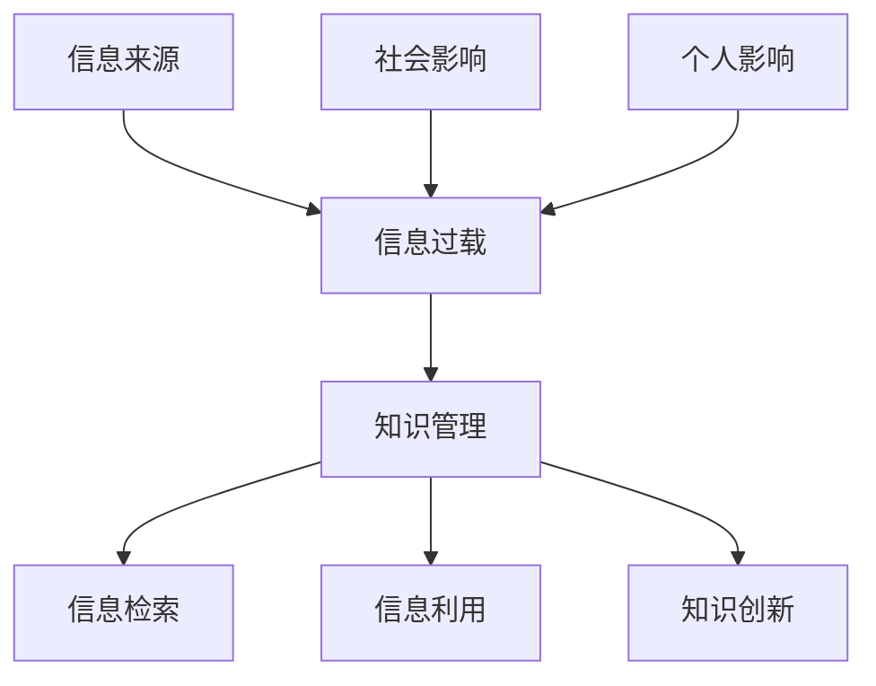
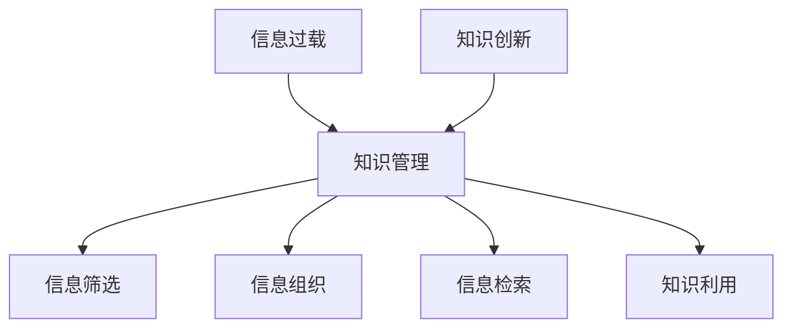

                 

## 第1章：信息过载的起源与影响

### 1.1 信息过载的定义与现象

**核心概念与联系：** 信息过载是指由于信息的迅速增长和爆炸性增长，导致个人和组织在处理和理解信息时面临巨大挑战的现象。知识管理作为一种应对信息过载的策略，旨在提高信息的组织和利用效率，从而减轻信息过载的压力。

下面使用 Mermaid 流程图展示信息过载与知识管理的关系：

**信息过载的现象：**

- **数据爆炸：** 随着互联网和数字技术的快速发展，信息的来源和数量急剧增加。据估计，每天产生的数据量高达数十亿 GB，其中包括社交媒体、电子邮件、新闻、文件等。

- **时间压力：** 个体和组织在有限的时间内难以处理如此庞大的信息量，导致工作效率下降，甚至出现“信息焦虑”。

- **选择困难：** 信息过多导致人们在获取和处理信息时面临选择困难，难以确定哪些信息是重要的，哪些信息可以忽略。

### 1.2 信息过载对社会和个人生活的影响

**影响分析：**

- **社会层面：**

  - **沟通障碍：** 信息过载可能导致沟通效率下降，信息传递延迟，甚至出现信息失真。

  - **社会信任度下降：** 当信息质量无法保证时，社会成员之间的信任关系可能受到冲击。

  - **决策困难：** 政策制定者和企业领导者需要处理大量的信息，但在信息过载的情况下，难以做出明智的决策。

- **个人层面：**

  - **焦虑和压力：** 个体在处理信息时感受到的压力和焦虑增加，影响心理健康。

  - **工作效率下降：** 信息过载导致个体难以集中精力，工作效率下降。

  - **生活质量下降：** 过度关注和处理信息可能导致个人忽视家庭、休闲等其他重要生活领域。

### 1.3 信息技术发展对信息过载的推动作用

**技术因素：**

- **大数据技术：** 大数据技术使得信息的收集、存储和分析变得更加容易和高效，但也导致了信息量的爆炸性增长。

- **人工智能：** 人工智能技术，如推荐系统、自然语言处理等，可以自动处理和分析大量信息，但同时也增加了信息的输入。

- **移动互联网：** 移动互联网使得信息获取变得更加便捷，但同时也使得人们更容易被大量信息所淹没。

### 1.4 知识管理的重要性与目标

**核心概念与联系：** 知识管理是一种系统性方法，旨在通过有效组织和利用知识，提高组织的竞争力和创新能力。知识管理不仅关注信息的收集和存储，更强调知识的共享、应用和创新。

下面使用 Mermaid 流程图展示知识管理与信息过载的解决方案：

**知识管理的目标：**

- **提高信息利用效率：** 通过有效的知识管理，确保关键信息能够在需要时被准确检索和应用。

- **促进知识共享：** 鼓励团队成员之间的知识交流和协作，提高整体团队的知识储备和创新能力。

- **增强创新能力：** 通过知识整合和交叉应用，激发新思维和新创意，推动组织的创新和发展。

### 总结：

信息过载是一个普遍存在的现象，对社会和个人生活产生了深远的影响。知识管理作为一种应对策略，通过有效的信息组织和利用，可以帮助减轻信息过载的压力，提高组织的竞争力和创新能力。在接下来的章节中，我们将深入探讨知识管理的具体策略和实践方法。

---

## 第2章：知识管理与组织

### 2.1 知识管理的定义与原则

**定义：**

知识管理（Knowledge Management，KM）是对知识的获取、共享、应用和创新的系统性管理过程。它不仅仅关注信息的收集和存储，更强调知识的流动、应用和创新，以实现组织的战略目标和竞争优势。

**原则：**

1. **以用户为中心：** 知识管理应关注用户的需求，提供个性化的知识服务，确保用户能够高效地获取和利用所需的知识。

2. **集成性：** 知识管理需要与组织的其他管理系统（如项目管理、质量管理、人力资源管理等）紧密结合，形成一体化的知识管理体系。

3. **持续性：** 知识管理是一个持续的过程，需要不断地评估、优化和改进，以适应组织发展的需要。

4. **透明性：** 知识管理的过程和结果应该是透明的，以便所有相关人员都能够理解和参与。

5. **协同性：** 知识管理鼓励团队成员之间的协作和知识共享，以实现知识的最大化利用。

### 2.2 知识管理与信息管理的联系与区别

**联系：**

- **信息管理是知识管理的基础：** 信息管理负责收集、存储、分类和分发信息，为知识管理提供了必要的信息资源。

- **知识管理依赖信息管理的技术和工具：** 知识管理需要利用信息管理的技术和工具，如数据库、文档管理系统等，来支持知识的管理和共享。

**区别：**

- **目标不同：** 信息管理的目标是确保信息的准确性、完整性和可访问性；而知识管理的目标是提高知识的利用效率和创新能力。

- **关注点不同：** 信息管理主要关注信息的流动和存储，而知识管理更关注知识的创造、共享和应用。

- **过程不同：** 信息管理通常包括信息的收集、存储、检索和分发等环节；而知识管理则包括知识的获取、共享、利用和创新等环节。

### 2.3 知识管理的组织架构与团队角色

**组织架构：**

- **知识管理中心：** 负责制定和实施知识管理策略，协调各部门的知识管理工作。

- **知识管理团队：** 负责具体执行知识管理任务，如知识库的建设、知识共享平台的维护、知识培训等。

- **知识管理员：** 负责知识库的日常管理和维护，确保知识的准确性和完整性。

- **知识贡献者：** 负责创造和贡献知识，可以是组织内部的专业人员或外部专家。

**团队角色：**

- **知识创造者：** 负责识别和创造新的知识。

- **知识传播者：** 负责将知识传递给需要的人。

- **知识应用者：** 负责将知识应用于实际工作中，解决实际问题。

- **知识管理者：** 负责知识库的建设、维护和管理，确保知识的高效利用。

### 2.4 知识管理流程与方法

**流程：**

1. **知识获取：** 从内部和外部获取知识源，如内部文档、外部研究报告、专家意见等。

2. **知识存储：** 利用知识库、文档管理系统等工具，对知识进行分类、归档和存储。

3. **知识共享：** 通过培训、研讨会、知识共享平台等方式，促进知识的传播和共享。

4. **知识应用：** 将知识应用于实际工作中，提高工作效率和创新能力。

**方法：**

1. **基于流程的知识管理：** 通过业务流程整合知识，确保知识在各个环节的有效流动和应用。

2. **基于社区的知识管理：** 通过建立知识社区，促进团队成员之间的知识共享和协作。

3. **基于技术的知识管理：** 利用信息技术工具，如知识库、搜索引擎、协作平台等，支持知识的管理和共享。

### 总结：

知识管理是一个系统性、持续性的过程，它通过有效的组织、管理和利用知识，提高组织的竞争力和创新能力。在接下来的章节中，我们将进一步探讨知识组织策略、知识库建设和信息检索技术等方面的内容。

---

## 第3章：信息分类与标签化

### 3.1 信息分类的原理与方法

**原理：**

信息分类（Information Classification）是根据信息的属性、内容、用途等特征，将信息进行分组和整理的过程。其核心目标是提高信息的组织性、可访问性和可理解性。

**方法：**

1. **手动分类：** 人工根据信息的特点和需求进行分类，适合小规模的信息处理。

2. **自动化分类：** 利用算法和技术，如机器学习、自然语言处理等，自动对信息进行分类，适合大规模的信息处理。

### 3.2 标签化的优势与应用

**优势：**

1. **提高信息检索效率：** 通过标签，用户可以快速定位到所需的信息，减少搜索时间。

2. **增强信息的灵活性：** 标签可以根据需要随时添加、删除或修改，使信息组织更加灵活。

3. **支持多维度检索：** 标签化可以提供多角度的信息分类方式，使用户能够从不同的维度检索信息。

**应用：**

1. **社交媒体：** 用户可以对微博、帖子等进行标签分类，便于信息检索和分享。

2. **文档管理：** 在文档管理系统中，通过标签对文档进行分类，便于文档的检索和管理。

### 3.3 基于自然语言处理的信息分类与标签化技术

**技术：**

1. **词频分析：** 通过统计文本中各个词的出现频率，进行信息分类。

2. **主题模型：** 如LDA（Latent Dirichlet Allocation），可以自动发现文本的主题结构，用于信息分类和标签生成。

3. **实体识别：** 利用自然语言处理技术，识别文本中的关键词、短语和实体，用于信息分类和标签生成。

**应用：**

1. **自动标题生成：** 根据文本内容自动生成合适的标题和标签。

2. **文本分类：** 将文本归类到特定的类别或主题，便于信息检索和管理。

### 3.4 实例：信息分类与标签化在知识管理中的应用

**实例：**

1. **企业内部文档管理系统：** 利用标签对文档进行分类和检索，提高信息查找效率。

2. **知识社区：** 用户可以对帖子进行标签管理，方便其他用户查找和参与讨论。

通过信息分类与标签化，可以有效组织和管理大量信息，提高信息的利用效率和可访问性。在接下来的章节中，我们将进一步探讨文档管理与信息存储、知识库建设等方面的内容。

---

## 第4章：文档管理与信息存储

### 4.1 文档管理的原则与流程

**原则：**

1. **一致性：** 确保文档的命名、格式和分类标准统一，方便检索和管理。

2. **安全性：** 保护文档不受未经授权的访问和修改，确保信息的机密性和完整性。

3. **可追溯性：** 记录文档的创建、修改、删除等操作，以便于审计和追溯。

**流程：**

1. **文档创建：** 根据业务需求创建新文档，并按照统一的标准命名和分类。

2. **文档审核：** 对文档内容进行审查和确认，确保信息的准确性和合规性。

3. **文档存储：** 将经过审核的文档存储到合适的存储介质，如文件服务器、云存储等。

4. **文档共享：** 在团队或组织内部共享文档，确保相关人员能够访问和使用。

5. **文档备份：** 定期对文档进行备份，防止数据丢失。

### 4.2 文档存储的技术与工具

**技术：**

1. **文件服务器：** 用于存储和共享文档，提供文件级别的权限控制。

2. **云存储：** 利用云计算技术提供远程存储和访问文档的服务，如Google Drive、OneDrive等。

3. **分布式存储：** 利用分布式存储技术，提高存储系统的可靠性和扩展性。

**工具：**

1. **SharePoint：** 微软提供的文档管理平台，支持文档的存储、共享和权限管理。

2. **Confluence：** Atlassian 提供的团队协作工具，支持文档的创建、编辑和共享。

3. **Notepad++：** �具有多种编码语言支持的文本编辑器，适合编写和编辑文档。

### 4.3 版本控制与变更管理

**版本控制：**

版本控制是文档管理的重要组成部分，确保文档的各个版本都能被正确记录和管理。

1. **文档版本标记：** 为每个文档版本添加标记，便于区分和跟踪。

2. **历史记录：** 记录文档的创建、修改和删除等历史操作，方便审计和追溯。

**变更管理：**

变更管理是对文档修改过程进行监控和管理，确保变更的合理性和安全性。

1. **变更请求：** 用户提出变更请求，经审核后进行修改。

2. **变更审核：** 对文档变更进行审核，确保变更符合业务需求和规范。

3. **变更记录：** 记录变更内容、原因和责任人，便于追踪和追溯。

### 4.4 实例：文档管理与信息存储的最佳实践

**实例：**

1. **企业内部文档管理：** 利用SharePoint构建企业内部文档管理系统，实现文档的统一存储、共享和版本控制。

2. **项目文档管理：** 在项目管理中，利用Confluence建立项目文档库，确保项目团队成员能够方便地访问和管理项目文档。

通过有效的文档管理和信息存储，可以提高工作效率和协作效率，确保信息的准确性和完整性。在接下来的章节中，我们将继续探讨知识库建设、信息检索技术等方面的内容。

---

## 第5章：知识库建设

### 5.1 知识库的定义与类型

**定义：**

知识库（Knowledge Base，KB）是一个存储、管理和共享知识的系统或平台，旨在为组织提供快速、准确的知识检索和利用。

**类型：**

1. **企业知识库：** 存储和管理企业内部的知识和经验，如业务流程、最佳实践、技术文档等。

2. **行业知识库：** 针对特定行业或领域，提供行业知识和专业信息的集合。

3. **开放知识库：** 公开提供给所有用户访问，如维基百科、GitHub等。

### 5.2 知识库的设计与架构

**设计原则：**

1. **易用性：** 界面友好，用户可以方便地查找和使用知识。

2. **扩展性：** 能够根据组织需求进行扩展和升级，支持不同类型和规模的知识存储。

3. **安全性：** 保护知识库中的信息不被未经授权的访问和篡改。

**架构：**

知识库的架构通常包括以下几层：

1. **数据层：** 存储知识库中的数据，如文档、图像、视频等。

2. **服务层：** 提供知识检索、分类、共享等服务，如RESTful API、搜索引擎等。

3. **用户层：** 用户通过界面与知识库进行交互，进行知识的查询、学习和应用。

### 5.3 知识库的内容组织与检索

**内容组织：**

1. **分类组织：** 根据知识的主题、类型、应用场景等维度进行分类，便于用户快速定位所需信息。

2. **标签组织：** 利用标签对知识进行标记，提供多维度检索方式。

3. **元数据管理：** 记录知识的相关属性，如作者、创建日期、更新日期等，便于管理和检索。

**检索：**

1. **全文检索：** 利用搜索引擎技术，实现全文检索，快速找到匹配的知识。

2. **基于语义的检索：** 通过理解知识的语义关系，实现更精确的检索。

3. **智能推荐：** 根据用户的检索历史和行为，推荐相关的知识，提高检索效率。

### 5.4 实例：构建企业级知识库的案例分析

**案例：**

**企业A** 通过构建企业级知识库，实现了知识的统一管理和共享。以下为构建过程：

1. **需求分析：** 分析企业内部的知识需求和现状，确定知识库的功能和架构。

2. **系统设计：** 设计知识库的架构，包括数据层、服务层和用户层。

3. **知识收集：** 收集企业内部的知识资源，包括文档、图片、视频等。

4. **知识整理：** 对收集到的知识进行分类、标注和整理，确保知识的准确性、完整性和一致性。

5. **系统部署：** 在服务器上部署知识库系统，进行测试和优化。

6. **用户培训：** 对企业员工进行知识库的使用培训，确保他们能够熟练使用知识库。

7. **持续优化：** 根据用户反馈和实际使用情况，对知识库进行持续优化和改进。

通过上述步骤，企业A成功构建了一个高效、易用的企业级知识库，提高了知识的利用效率和团队的协作能力。

### 总结：

知识库建设是知识管理的重要组成部分，通过有效的知识库设计、内容组织和检索技术，可以帮助组织实现知识的统一管理和共享。在接下来的章节中，我们将进一步探讨信息检索技术、知识共享与协作等方面的内容。

---

## 第6章：信息检索技术

### 6.1 信息检索的基本概念与模型

**概念：**

信息检索（Information Retrieval，IR）是指从大量信息中找到满足用户需求信息的过程。它涵盖了信息存储、检索算法、用户界面等方面。

**模型：**

1. **布尔模型（Boolean Model）：** 基于布尔代数运算，通过AND、OR、NOT等操作符组合关键词，实现复杂查询。

2. **向量空间模型（Vector Space Model）：** 将文档和查询表示为向量，通过计算向量之间的相似度来评估文档的相关性。

3. **概率模型（Probability Model）：** 基于概率理论，通过计算文档-查询相关性概率来评估文档的相关性。

### 6.2 搜索引擎的工作原理与优化

**工作原理：**

1. **爬虫（Crawler）：** 爬取互联网上的网页，并将网页内容索引到搜索引擎中。

2. **索引（Index）：** 对爬取的网页进行索引，建立倒排索引，以便快速检索。

3. **检索（Search）：** 根据用户的查询，从索引中检索相关文档。

4. **排序（Ranking）：** 对检索结果进行排序，通常使用TF-IDF、PageRank等算法。

**优化：**

1. **搜索引擎优化（SEO）：** 提高网站在搜索引擎中的排名，吸引更多用户访问。

2. **查询优化：** 提高查询的准确性和效率，如查询重写、同义词处理等。

3. **用户界面优化：** 提高用户的使用体验，如提供实时搜索、个性化推荐等。

### 6.3 信息检索算法与数据结构

**算法：**

1. **布尔检索算法（Boolean Retrieval Algorithm）：** 根据布尔模型实现查询和结果排序。

2. **向量空间模型算法（Vector Space Model Algorithm）：** 计算文档和查询的相似度，如余弦相似度、点积等。

3. **概率检索算法（Probability Retrieval Algorithm）：** 使用概率模型评估文档的相关性。

**数据结构：**

1. **倒排索引（Inverted Index）：** 用于快速检索，将文档中的词映射到对应的文档。

2. **哈希表（Hash Table）：** 用于快速查找词和文档的映射关系。

3. **布隆过滤器（Bloom Filter）：** 用于快速判断某个元素是否存在于集合中，虽然可能有误判，但性能较高。

### 6.4 实例：信息检索在学术研究中的应用

**实例：**

在学术研究中，信息检索技术被广泛应用于文献检索和知识发现。以下是一个典型的应用实例：

1. **学术搜索引擎：** 如Google Scholar，使用先进的检索算法和索引技术，提供快速的学术文献检索。

2. **文献分类：** 使用自然语言处理和机器学习技术，对文献进行分类和标签化，便于用户查找。

3. **引用分析：** 通过计算文献之间的引用关系，发现学术趋势和重要文献。

通过信息检索技术，学术研究人员可以更高效地获取和利用学术资源，提高研究效率。

### 总结：

信息检索技术在各个领域都有着广泛的应用，通过深入理解和优化检索算法和数据结构，可以大幅提高信息检索的效率和准确性。在接下来的章节中，我们将进一步探讨知识共享与协作、知识创新与应用等方面的内容。

---

## 第7章：知识共享与协作

### 7.1 知识共享的理念与原则

**理念：**

知识共享（Knowledge Sharing）是一种促进知识和信息在组织内传递和交流的行为。其核心在于打破知识和资源的壁垒，提高知识利用效率和创新能力。

**原则：**

1. **透明性：** 知识共享过程应该是公开、透明的，确保所有成员都能平等地获取和贡献知识。

2. **互惠性：** 知识共享应建立在互惠互利的基础上，鼓励成员分享知识和资源。

3. **自愿性：** 知识共享应基于自愿原则，尊重个体的意愿和隐私。

4. **多样性：** 鼓励多元化的知识交流，包括不同层级、部门和领域的成员。

### 7.2 知识共享的工具与技术

**工具：**

1. **内部论坛：** 提供一个平台，让团队成员可以发布问题和观点，进行知识交流。

2. **共享文档：** 通过文档管理系统，实现文档的共享和协作编辑。

3. **社交媒体：** 如企业内部的微博、微信等，方便团队成员实时交流和分享信息。

**技术：**

1. **云计算：** 提供知识共享和协作的平台，实现跨地域的实时协作。

2. **社交网络分析：** 利用社交网络分析技术，识别知识传播的关键节点和影响力。

3. **知识图谱：** 构建知识图谱，展示知识的关联性和依赖关系，便于知识发现和利用。

### 7.3 协作学习与团队知识管理

**协作学习：**

协作学习（Collaborative Learning）是一种通过小组合作完成学习任务的方法，强调个体之间的交流和协作。

**团队知识管理：**

1. **知识地图：** 通过知识地图，展示团队成员的知识结构和专业领域，便于知识交流和共享。

2. **案例库：** 收集和整理团队在项目中的成功经验和失败教训，作为知识共享的宝贵资源。

3. **知识培训：** 定期组织知识培训，提高团队成员的知识水平和协作能力。

### 7.4 实例：知识共享与协作在团队项目中的实践

**实例：**

在一个软件开发团队中，知识共享与协作的实践包括：

1. **代码审查：** 开发人员通过代码审查，分享代码编写经验和最佳实践。

2. **项目会议：** 通过定期项目会议，团队成员共享项目进展、问题和解决方案。

3. **知识分享会：** 团队成员定期举办知识分享会，介绍自己在项目中遇到的问题和解决方法。

4. **在线协作工具：** 使用如Slack、Trello等在线协作工具，实现团队成员的实时沟通和协作。

通过这些实践，团队有效提高了知识共享和协作效率，促进了项目的顺利进行和成员的专业成长。

### 总结：

知识共享与协作是知识管理的重要组成部分，通过有效的工具和技术，可以促进知识的流动和应用，提高组织的创新能力和竞争力。在接下来的章节中，我们将进一步探讨知识创新与应用、知识管理实施步骤与实践指导等内容。

---

## 第8章：知识创新与应用

### 8.1 知识创新的过程与策略

**过程：**

知识创新（Knowledge Innovation）是指通过创造性的思维和活动，将现有知识进行重新组合和整合，产生新的知识和价值。

**步骤：**

1. **知识收集：** 收集内部和外部相关的知识资源，如文献、报告、经验等。

2. **知识整合：** 对收集到的知识进行整合和分析，发现知识的关联性和潜在价值。

3. **知识应用：** 将创新的知识应用于实际工作中，解决实际问题或推动新项目的开展。

4. **知识反馈：** 通过实践反馈，对知识创新的效果进行评估和改进。

**策略：**

1. **头脑风暴：** 鼓励团队成员提出新的想法和创意，通过集体讨论和碰撞，激发创新思维。

2. **跨界合作：** 与不同领域的专家和团队合作，引入外部知识和视角，促进知识创新。

3. **开放式创新：** 利用外部资源，如开源项目、合作伙伴等，共同推动知识的创新和创造。

### 8.2 知识创新的工具与方法

**工具：**

1. **思维导图（Mind Map）：** 通过图形化方式展示思维过程，帮助组织知识和创意。

2. **设计思维（Design Thinking）：** 以用户为中心的创新方法，注重用户需求和市场反馈。

3. **情境模拟（Scenario Simulation）：** 通过模拟不同情境，预测未来可能发生的变化，探索创新机会。

**方法：**

1. **逆向思维（Reverse Thinking）：** 从问题的反面思考，寻找创新的解决方案。

2. **群组讨论（Group Discussion）：** 通过集体讨论，激发团队成员的思维碰撞，产生创新点子。

3. **迭代开发（Iterative Development）：** 通过快速迭代和反馈，不断优化创新方案。

### 8.3 知识创新在企业中的应用案例

**案例：**

1. **技术创新：** 企业通过知识创新，研发出新的产品和服务，如智能手表、无人驾驶汽车等。

2. **管理创新：** 企业通过知识创新，改进管理流程，提高运营效率，如敏捷管理、精益生产等。

3. **业务模式创新：** 企业通过知识创新，探索新的商业模式，开拓市场机会，如共享经济、电子商务等。

### 8.4 实例：知识创新在产品开发中的实践

**实例：**

在一个产品开发项目中，知识创新的具体实践包括：

1. **用户调研：** 通过用户访谈、问卷调查等方式，收集用户需求和反馈。

2. **需求分析：** 对收集到的用户需求进行分析和整理，识别关键需求和痛点。

3. **头脑风暴：** 团队成员进行头脑风暴，提出创意和解决方案。

4. **迭代开发：** 根据用户反馈和市场需求，快速迭代产品功能，不断优化产品体验。

通过知识创新，产品团队能够更准确地满足用户需求，提高产品的市场竞争力。

### 总结：

知识创新是推动组织发展和竞争力提升的重要动力。通过有效的工具和方法，企业可以不断创造新的知识和价值，推动产品和业务的创新。在接下来的章节中，我们将探讨知识管理实施步骤、工具选择和实践指导等内容。

---

## 第9章：知识管理的实施步骤与最佳实践

### 9.1 知识管理实施的阶段与方法

**阶段：**

1. **规划阶段：** 明确知识管理的目标和愿景，制定战略规划和实施方案。

2. **实施阶段：** 建立知识管理体系和基础设施，包括知识库、工具和流程。

3. **运行阶段：** 运行和维护知识管理系统的日常操作，持续优化和改进。

4. **评估阶段：** 对知识管理的实施效果进行评估，根据反馈进行改进。

**方法：**

1. **领导支持：** 获得高层领导的支持和参与，确保知识管理项目的顺利进行。

2. **需求分析：** 了解组织内部的知识需求和现状，制定针对性的解决方案。

3. **培训与推广：** 对员工进行知识管理培训和宣传，提高知识管理的认知和参与度。

4. **试点实施：** 在小范围内进行试点实施，收集反馈和经验，为全面推广做好准备。

### 9.2 知识管理实施的障碍与解决方案

**障碍：**

1. **组织文化：** 知识管理可能受到传统组织文化的影响，如信息封闭、知识孤岛等。

2. **技术挑战：** 知识管理工具和技术的选择、部署和维护可能面临技术难题。

3. **人员阻力：** 员工可能对知识管理缺乏兴趣或抵触，影响项目的实施。

**解决方案：**

1. **文化变革：** 通过宣传和培训，改变员工的观念，建立开放、共享的知识文化。

2. **技术选型：** 选择适合组织需求的、成熟可靠的知识管理工具和技术。

3. **激励机制：** 制定激励机制，鼓励员工参与知识管理和知识共享。

4. **试点推广：** 通过试点项目的成功经验，逐步推广知识管理实践。

### 9.3 知识管理的评估与持续改进

**评估：**

1. **效果评估：** 评估知识管理实施的效果，如知识共享率、知识利用率、员工满意度等。

2. **成本效益：** 分析知识管理项目的成本和收益，评估其经济价值。

3. **用户反馈：** 收集用户对知识管理系统的使用体验和改进建议。

**持续改进：**

1. **反馈机制：** 建立反馈机制，及时收集和分析用户反馈。

2. **优化流程：** 根据评估结果和用户反馈，持续优化知识管理的流程和工具。

3. **培训更新：** 定期对员工进行知识管理培训，提高其知识水平和技能。

4. **技术创新：** 引入新的技术和方法，提升知识管理的效果和效率。

### 9.4 实例：知识管理实施的全过程案例

**案例：**

某大型企业实施知识管理的全过程如下：

1. **规划阶段：** 
   - 明确知识管理目标和愿景。
   - 制定知识管理战略规划和实施方案。

2. **实施阶段：**
   - 建立企业内部知识库，收集和整理知识资源。
   - 选择和部署知识管理工具，如SharePoint、Confluence等。

3. **运行阶段：**
   - 培训员工，提高知识管理意识和技能。
   - 持续更新和维护知识库，确保知识的准确性和完整性。

4. **评估阶段：**
   - 进行效果评估，收集用户反馈。
   - 分析成本效益，评估知识管理的经济价值。

5. **持续改进：**
   - 根据评估结果和用户反馈，优化知识管理流程和工具。
   - 引入新技术和方法，提升知识管理效果。

通过实施知识管理，该企业实现了知识的有效共享和应用，提高了员工的创新能力和工作效率。

### 总结：

知识管理的实施是一个系统性的过程，需要明确阶段和方法，克服各种障碍，并持续评估和改进。有效的知识管理可以促进组织的知识积累和创新，提升竞争力和可持续发展能力。

---

## 第10章：知识管理工具的选择与使用

### 10.1 知识管理工具的类型与特点

**类型：**

1. **文档管理工具：** 用于文档的存储、共享和版本控制，如SharePoint、Google Drive、Notepad++等。

2. **知识库工具：** 用于知识存储、管理和共享，如Confluence、Wiki、MindMap等。

3. **协作工具：** 用于团队协作和沟通，如Slack、Trello、Microsoft Teams等。

4. **学习管理工具：** 用于在线学习、培训和知识共享，如Sakai、Moodle、Adobe Captivate等。

**特点：**

1. **易用性：** 用户界面友好，易于操作和适应。

2. **可扩展性：** 支持模块化扩展，可以根据需求添加新的功能。

3. **安全性：** 提供数据加密、权限管理等功能，确保信息安全。

4. **协作性：** 支持多人实时协作，提高团队工作效率。

### 10.2 常见知识管理工具的比较与选择

**比较：**

1. **SharePoint vs. Confluence：**

   - **SharePoint：** 微软提供的文档管理和协作平台，功能强大，但用户界面较为复杂。
   - **Confluence：** Atlassian 提供的知识库和协作工具，用户界面简洁，支持丰富的插件和集成。

2. **Google Drive vs. OneDrive：**

   - **Google Drive：** 谷歌提供的云存储和协作工具，支持在线编辑和实时协作。
   - **OneDrive：** 微软提供的云存储解决方案，与Office 365集成紧密，但用户界面相对简单。

3. **Trello vs. Asana：**

   - **Trello：** 以看板形式展示任务和项目，简单直观。
   - **Asana：** 功能更为丰富的任务管理工具，支持多种视图和报告功能。

**选择：**

- **根据需求：** 根据组织的需求和实际应用场景选择合适的工具。
- **根据预算：** 考虑工具的费用和成本效益。
- **根据用户习惯：** 考虑团队成员对工具的熟悉度和使用偏好。

### 10.3 知识管理工具的实际使用技巧

**技巧：**

1. **合理规划文档结构：** 为文档设置清晰的目录和标签，方便用户快速查找。

2. **定期更新和整理：** 保持知识库和文档的更新和整洁，提高信息准确性。

3. **权限管理：** 根据文档的重要性和敏感性，设置合理的访问权限。

4. **培训与支持：** 定期组织培训，提高员工对知识管理工具的熟练度。

### 10.4 实例：知识管理工具在知识共享中的应用

**实例：**

1. **企业内部文档管理系统：** 利用SharePoint或Confluence，实现文档的集中存储、共享和版本控制。

2. **团队协作平台：** 利用Slack或Microsoft Teams，促进团队成员间的实时沟通和协作。

3. **在线学习平台：** 利用Moodle或Sakai，提供在线培训和学习资源，促进知识共享和技能提升。

通过合理选择和使用知识管理工具，可以有效提高组织的信息组织和利用效率，促进知识共享和创新。

### 总结：

知识管理工具的选择和使用是知识管理成功的关键。通过了解各类工具的特点和优势，结合组织实际需求，可以更好地实现知识共享和协作，提升组织整体效率。

---

## 第11章：知识管理案例研究

### 11.1 案例研究方法与步骤

**方法：**

1. **文献回顾：** 收集与知识管理相关的文献，了解知识管理的基本理论和最佳实践。

2. **数据收集：** 通过问卷调查、访谈、文档分析等方式，收集案例企业的知识管理实践数据。

3. **案例分析：** 对收集到的数据进行深入分析，识别知识管理的成功因素和挑战。

4. **模型构建：** 基于分析结果，构建知识管理模型，以指导其他企业的知识管理实践。

**步骤：**

1. **确定研究目标：** 明确案例研究的目的，如分析知识管理的成功案例、探索知识管理的障碍等。

2. **选择案例企业：** 根据研究目标，选择具有代表性的企业作为案例研究对象。

3. **收集数据：** 通过多种渠道收集数据，确保数据的全面性和准确性。

4. **数据分析：** 对收集到的数据进行分析，识别知识管理的关键成功因素和挑战。

5. **构建模型：** 基于分析结果，构建知识管理模型，并提出改进建议。

6. **撰写报告：** 总结案例研究的主要发现，撰写详细的案例研究报告。

### 11.2 企业知识管理案例介绍

**案例：** 某大型制造企业通过实施知识管理，实现了知识的有效共享和应用，提高了生产效率和质量。

**背景：**

- **企业规模：** 该企业拥有数千名员工，分布在多个国家和地区。
- **业务领域：** 制造业，涉及多个产品线。
- **挑战：** 企业面临知识分散、信息孤岛、沟通不畅等问题，影响生产效率和创新。

**实施过程：**

1. **需求分析：** 企业分析了知识管理的需求和现状，确定了知识管理的关键目标和需求。

2. **战略规划：** 制定知识管理战略，明确了知识管理的愿景、目标和实施步骤。

3. **工具选型：** 选择和部署了知识管理工具，如SharePoint、Confluence等，支持知识的存储、共享和协作。

4. **培训与推广：** 对员工进行知识管理培训和宣传，提高员工对知识管理的认知和参与度。

5. **知识库建设：** 建立了企业知识库，收集和整理了大量的业务知识和技术文档。

6. **协作平台：** 建立了协作平台，促进员工之间的知识共享和协作。

### 11.3 案例分析：知识管理的成功与挑战

**成功因素：**

1. **领导支持：** 企业高层领导对知识管理项目给予了充分的支持和资源投入。

2. **战略规划：** 企业制定了详细的战略规划，明确了知识管理的目标和实施步骤。

3. **工具选型：** 选择了适合企业需求的、功能强大的知识管理工具，提高了知识管理的效率。

4. **培训与推广：** 通过培训和教育，提高了员工对知识管理的认知和参与度。

5. **持续改进：** 企业持续评估和改进知识管理实践，不断优化知识管理流程和工具。

**挑战：**

1. **组织文化：** 企业存在一定的信息封闭和文化壁垒，影响知识共享和协作。

2. **技术难题：** 知识管理工具的部署和维护需要一定的技术支持，对企业IT团队提出了挑战。

3. **员工参与度：** 部分员工对知识管理缺乏兴趣或抵触，影响知识管理的实施效果。

### 11.4 案例启示与未来展望

**启示：**

1. **领导重视：** 知识管理的成功离不开高层的重视和支持，企业应加强对知识管理项目的领导。

2. **战略规划：** 制定详细的战略规划，明确知识管理的目标和实施步骤。

3. **工具选型：** 根据企业需求选择合适的知识管理工具，提高知识管理的效率。

4. **培训与推广：** 通过培训和宣传，提高员工对知识管理的认知和参与度。

5. **持续改进：** 持续评估和改进知识管理实践，不断优化知识管理流程和工具。

**未来展望：**

1. **数字化转型：** 随着数字技术的不断发展，知识管理将更加依赖人工智能、大数据等技术。

2. **跨界合作：** 知识管理将越来越重视与外部合作伙伴的知识共享和协作。

3. **个性化服务：** 知识管理将更加注重个性化服务，满足不同用户的需求。

4. **持续创新：** 知识管理将不断创新，以适应组织发展的需要。

### 总结：

通过案例研究，我们可以看到知识管理在实践中的成功与挑战。有效的知识管理可以提升组织的竞争力，但需要克服各种障碍，持续改进和优化。在未来的发展中，知识管理将继续扮演重要角色，推动组织的创新和发展。

---

### 附录

#### 附录A：知识管理相关术语与定义

- **知识管理（Knowledge Management）：** 对知识的获取、共享、利用和创新的系统性管理过程。
- **知识共享（Knowledge Sharing）：** 促进知识的传递和交流，提高知识利用率。
- **知识库（Knowledge Base）：** 存储和管理知识的系统或平台。
- **信息过载（Information Overload）：** 由于信息的迅速增长和爆炸性增长，导致个人和组织在处理和理解信息时面临巨大挑战的现象。
- **知识创新（Knowledge Innovation）：** 通过创造性的思维和活动，将现有知识进行重新组合和整合，产生新的知识和价值。

#### 附录B：知识管理参考资料与推荐阅读

- **书籍：**
  - Nonaka，I. & Takeuchi，H. (1995). The Knowledge-Creating Company: How Japanese Companies Create the Dynamics of Innovation. Oxford University Press.
  - Davenport，T.H. & Prusak，L. (1998). Working Knowledge: How Organizations Manage What They Know. Harvard Business Press.

- **学术期刊：**
  - The International Journal of Knowledge Management
  - Journal of Knowledge Management

- **网站：**
  - KMWorld: https://www.kmworld.com/
  - Knowledge Management Institute: https://www.kminstitute.org/

- **案例研究：**
  - IBM's Knowledge Management Initiative
  - Nokia's Knowledge Management Success Story

通过这些参考资料和推荐阅读，读者可以进一步了解知识管理的理论和实践，为组织内的知识管理实践提供指导。

---

## 联系信息

作者：AI天才研究院 / AI Genius Institute  
电子邮件：[contact@ai-genius-institute.com](mailto:contact@ai-genius-institute.com)  
官方网站：[https://www.ai-genius-institute.com/](https://www.ai-genius-institute.com/)  
社交媒体：[Twitter](https://twitter.com/AIGeniusInstit) / [LinkedIn](https://www.linkedin.com/company/ai-genius-institute/) / [Facebook](https://www.facebook.com/AIGeniusInstitute)

---

### 结论

在信息爆炸的时代，信息过载已成为个人和组织面临的主要挑战之一。有效的知识管理策略可以帮助我们应对这一挑战，提高信息的组织和利用效率，促进知识的共享和创新。本文从信息过载的起源与影响、知识管理的定义与原则、信息分类与标签化、文档管理与信息存储、知识库建设、信息检索技术、知识共享与协作、知识创新与应用等方面，系统性地探讨了知识管理的理论和实践。

知识管理不仅有助于减轻信息过载的压力，提高工作效率，还能促进组织的创新和发展。通过有效的知识管理，企业可以更好地利用内部和外部的知识资源，提升竞争力，实现可持续发展。

未来，知识管理将继续融合人工智能、大数据、云计算等新兴技术，向智能化、个性化和跨界协作方向发展。我们期待，通过不断的学习和实践，能够为组织的知识管理贡献更多的智慧和力量。

让我们共同努力，构建一个更加智能、高效和协作的知识管理生态系统，为未来的发展奠定坚实的基础。感谢您阅读本文，希望它能对您的知识管理实践提供有益的启示。

---

# 信息过载与知识管理策略：有效组织和检索信息的指南

## 关键词：
信息过载、知识管理、信息检索、信息分类、标签化、文档管理、知识库建设、协作学习、知识创新、案例研究。

## 摘要：
在数字化时代，信息过载已成为普遍问题，严重影响了个人和组织的效率与决策。本文从信息过载的起源与影响入手，系统地探讨了知识管理的定义与原则，以及信息分类与标签化、文档管理与信息存储、知识库建设、信息检索技术、知识共享与协作、知识创新与应用等方面的具体策略和实践。通过案例研究和最佳实践，本文为读者提供了有效的知识管理指南，帮助应对信息过载的挑战，提高信息组织和检索效率，推动组织的创新与发展。

