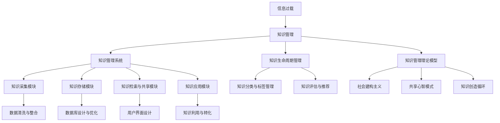

                 

### 第一部分：引言与背景

#### 1.1 信息过载现象及其影响

在当今信息时代，信息过载已成为普遍现象。据研究，全球每天产生约2.5万亿字节的数据，这些数据涵盖了各种来源，包括社交媒体、新闻报道、科学研究、商业报告等。对于个人和组织来说，处理如此庞大的信息量变得异常困难。信息过载现象不仅影响个人的工作效率和生活质量，也对组织的知识管理和决策过程产生负面影响。

##### 1.1.1 信息过载的定义与来源

信息过载是指个体或组织在信息接收和处理过程中感到负担过重，难以有效处理和利用大量信息的状态。信息过载的来源多种多样，主要包括以下几个方面：

1. **互联网和社交媒体**：互联网和社交媒体的迅速发展使得信息传播速度大幅提升，每个人每时每刻都能接收到大量信息。
2. **电子邮件和即时通讯**：电子邮件和即时通讯工具的普及增加了信息传递的频率和数量。
3. **信息推送和广告**：各种应用程序和网站通过推送和广告不断向用户传递信息。
4. **信息冗余和重复**：由于信息来源多样，信息内容往往存在冗余和重复，增加了信息处理的工作量。

##### 1.1.2 信息过载的影响与危害

信息过载对个人和组织产生了一系列负面影响，主要体现在以下几个方面：

1. **工作效率降低**：处理大量信息需要耗费大量时间和精力，导致个人和组织的工作效率降低。
2. **决策困难**：信息过载使得个体难以从大量信息中筛选出有价值的信息，从而影响决策质量。
3. **压力和焦虑**：持续的信息过载可能导致个人感到压力和焦虑，影响心理健康。
4. **知识流失**：由于信息处理不及时或不当，部分有价值的信息可能被忽视或遗忘，导致知识流失。

#### 1.2 知识管理的重要性

知识管理是一种系统地识别、组织和利用组织内部知识的活动，旨在提高组织的竞争力、创新能力和效率。随着信息过载问题的日益严重，知识管理的重要性愈发凸显。

##### 1.2.1 知识管理的概念与发展

知识管理（Knowledge Management, KM）是一种通过系统的方法和工具来识别、组织和利用组织内部知识的活动。知识管理的历史可以追溯到20世纪80年代，最初集中在文档管理和信息检索方面。随着信息技术的发展，知识管理逐渐扩展到包括知识创造、知识共享、知识应用等更广泛的领域。

##### 1.2.2 知识管理在现代组织中的作用

在现代组织中，知识管理发挥着至关重要的作用：

1. **提升创新能力**：知识管理通过促进知识的共享和交流，激发员工的创新思维，提高组织的创新能力。
2. **增强竞争力**：知识管理使组织能够更好地利用内部知识资源，提高生产效率和服务质量，增强竞争力。
3. **支持决策过程**：知识管理提供了一系列工具和方法，帮助组织快速获取和利用相关信息，支持决策过程。
4. **降低信息过载**：通过有效的知识管理，组织可以筛选和整合有价值的信息，降低信息过载的影响。

#### 1.3 知识管理系统的必要性

知识管理系统（Knowledge Management System, KMS）是支持知识管理活动的一系列软件工具和流程的集合。在信息过载背景下，知识管理系统的必要性愈发突出。

##### 1.3.1 知识管理系统概述

知识管理系统是一种集成的软件平台，旨在支持组织内部的知识的创建、存储、检索、共享和应用。知识管理系统通常包括以下几个核心模块：

1. **知识采集模块**：负责收集组织内部和外部的知识资源，包括文档、图片、视频、音频等多种形式。
2. **知识存储模块**：提供高效的数据存储和管理功能，确保知识的持久性和安全性。
3. **知识检索模块**：利用先进的搜索技术和算法，帮助用户快速找到所需知识。
4. **知识共享模块**：提供知识共享和协作的工具，促进知识的流动和交流。
5. **知识应用模块**：支持知识的实际应用，提高组织的运营效率和创新能力。

##### 1.3.2 知识管理系统的核心功能与架构

知识管理系统的核心功能包括以下几个方面：

1. **知识采集**：通过多种渠道和方式，如文档上传、数据抓取、社交媒体监控等，收集组织内外部的知识资源。
2. **知识存储**：利用数据库技术，高效地存储和管理知识资源，确保知识的可访问性和可靠性。
3. **知识检索**：采用先进的搜索算法和用户界面设计，提高知识检索的效率和准确性。
4. **知识共享**：提供多种共享机制，如知识库、论坛、社交媒体等，促进知识的流动和交流。
5. **知识应用**：通过知识图谱、推荐系统等技术，支持知识的实际应用，提高组织的运营效率和创新能力。

知识管理系统的架构通常包括以下几个层次：

1. **数据层**：存储和管理知识资源，包括文档、数据库、数据仓库等。
2. **应用层**：提供各种知识管理功能，如知识采集、存储、检索、共享和应用等。
3. **界面层**：为用户提供直观友好的操作界面，方便用户使用知识管理系统。
4. **基础设施层**：提供系统运行所需的硬件设备和网络环境。

#### 1.4 本书的结构安排与目标

本书旨在为读者提供一套全面的知识管理系统实施指南，帮助组织有效应对信息过载问题。本书的结构安排如下：

1. **第一部分：引言与背景**：介绍信息过载现象及其影响，阐述知识管理的重要性，并探讨知识管理系统的必要性。
2. **第二部分：知识管理基础**：详细讲解知识分类与知识生命周期、知识管理理论模型、知识管理的关键成功因素等内容。
3. **第三部分：知识管理系统设计与实施**：介绍知识管理系统设计原则、架构设计、功能模块设计、实施策略等内容。
4. **第四部分：知识管理系统的运营与优化**：探讨知识管理系统的日常运营、评估与改进、可持续性发展等问题。
5. **第五部分：案例研究与实践应用**：分析知识管理系统在不同行业中的应用案例，评估实施效果，展望未来发展。
6. **第六部分：结论与展望**：总结本书的主要内容，分析知识管理系统的发展趋势，并给出对读者的建议。

通过本书的学习，读者可以全面了解知识管理系统的重要性、设计原则和实施方法，为组织有效应对信息过载问题提供有力支持。

---

### 第一部分：引言与背景

#### 1.5 信息过载的应对策略

面对日益严重的信息过载问题，个人和组织需要采取一系列策略来有效应对。以下是一些常见的应对策略：

##### 1.5.1 提高信息筛选能力

个人和组织需要提高信息筛选能力，学会从大量信息中筛选出有价值的信息。以下是一些提高信息筛选能力的建议：

1. **明确信息需求**：在接收信息前，明确自己的信息需求，有针对性地筛选信息。
2. **使用过滤工具**：利用搜索引擎、邮件过滤器和社交媒体过滤器等工具，自动过滤不相关或低价值的信息。
3. **建立信息筛选标准**：根据个人和组织的需求，制定信息筛选标准，有选择性地接收和处理信息。

##### 1.5.2 优化信息处理流程

优化信息处理流程可以有效减少信息过载的影响。以下是一些优化信息处理流程的建议：

1. **制定信息处理策略**：根据信息的重要性和紧急程度，制定相应的处理策略，如立即处理、延迟处理、忽略等。
2. **设立信息处理优先级**：将信息按照优先级进行分类，优先处理重要和紧急的信息。
3. **利用自动化工具**：利用自动化工具，如自动化数据处理软件和机器人流程自动化（RPA）工具，减轻信息处理的工作量。

##### 1.5.3 提高信息利用效率

提高信息利用效率可以减少信息过载的影响。以下是一些提高信息利用效率的建议：

1. **知识共享**：鼓励员工和团队成员分享知识和信息，减少重复工作，提高信息利用率。
2. **建立信息库**：建立信息库，将有价值的信息存储起来，方便日后查找和使用。
3. **开展信息培训**：定期开展信息培训，提高员工和团队的信息素养和信息处理能力。

##### 1.5.4 建立信息过载预警机制

建立信息过载预警机制可以及时识别和应对信息过载问题。以下是一些建立信息过载预警机制的建议：

1. **设置信息接收阈值**：根据个人和组织的工作负荷，设置信息接收的阈值，超过阈值时自动预警。
2. **定期评估信息负荷**：定期评估信息负荷，及时发现和解决信息过载问题。
3. **建立信息反馈机制**：建立信息反馈机制，鼓励员工和团队及时反馈信息过载问题，并提出改进建议。

通过采取上述策略，个人和组织可以有效应对信息过载问题，提高工作效率和生活质量。

---

### 第一部分：引言与背景

#### 1.6 本书的目标与结构

本书旨在为读者提供一套全面的知识管理系统实施指南，帮助组织有效应对信息过载问题。具体目标如下：

1. **全面了解知识管理系统的概念和重要性**：通过本书的介绍，读者可以全面了解知识管理系统的定义、核心功能和作用，认识到知识管理系统在应对信息过载中的重要性。
2. **掌握知识管理系统的设计原则和实施方法**：本书详细阐述了知识管理系统设计原则、架构设计、功能模块设计、实施策略等内容，帮助读者掌握知识管理系统的设计原则和实施方法。
3. **学习知识管理系统的运营与优化策略**：本书介绍了知识管理系统的日常运营、评估与改进、可持续性发展等问题，帮助读者了解知识管理系统的运营与优化策略。
4. **借鉴实际案例，提升实践经验**：本书通过分析知识管理系统在不同行业中的应用案例，帮助读者借鉴实际案例，提升实践经验。

本书的结构安排如下：

1. **第一部分：引言与背景**：介绍信息过载现象及其影响，阐述知识管理的重要性，并探讨知识管理系统的必要性。
2. **第二部分：知识管理基础**：详细讲解知识分类与知识生命周期、知识管理理论模型、知识管理的关键成功因素等内容。
3. **第三部分：知识管理系统设计与实施**：介绍知识管理系统设计原则、架构设计、功能模块设计、实施策略等内容。
4. **第四部分：知识管理系统的运营与优化**：探讨知识管理系统的日常运营、评估与改进、可持续性发展等问题。
5. **第五部分：案例研究与实践应用**：分析知识管理系统在不同行业中的应用案例，评估实施效果，展望未来发展。
6. **第六部分：结论与展望**：总结本书的主要内容，分析知识管理系统的发展趋势，并给出对读者的建议。

通过本书的学习，读者可以全面了解知识管理系统的重要性、设计原则和实施方法，为组织有效应对信息过载问题提供有力支持。

---

## 2.1 知识分类与知识生命周期

### 2.1.1 知识分类方法

在知识管理系统中，对知识的分类是关键的一步。合理的知识分类有助于用户快速找到所需信息，提高知识检索的效率和准确性。以下是一些常用的知识分类方法：

1. **按内容分类**：这是最常见的知识分类方法，根据知识的内容和主题进行分类。例如，可以将知识分为技术知识、管理知识、市场知识等。

2. **按用途分类**：根据知识的实际应用场景和用途进行分类。例如，可以将知识分为产品设计知识、项目管理知识、客户服务知识等。

3. **按知识来源分类**：根据知识的来源进行分类，例如内部知识、外部知识、客户知识等。这种分类方法有助于明确知识的来源和可信度。

4. **按知识状态分类**：根据知识的成熟度和稳定性进行分类，例如显性知识和隐性知识。显性知识是可以明确表达和记录的知识，而隐性知识则是难以明确表达和记录的知识。

5. **按知识层次分类**：根据知识的深度和广度进行分类，例如基础知识、高级知识、专业知识等。

### 2.1.2 知识生命周期管理

知识生命周期是指知识从产生、传播、应用到消亡的整个过程。有效地管理知识生命周期有助于确保知识的持续更新和优化。知识生命周期通常包括以下阶段：

1. **知识采集**：这一阶段涉及从各种来源收集知识，包括内部文档、外部研究报告、会议记录、员工经验等。

2. **知识整理**：收集到的知识需要经过整理和清洗，确保其准确性和一致性。这一阶段可能包括数据的标准化、去重、格式转换等。

3. **知识存储**：整理后的知识需要被存储在知识库中，以便后续检索和使用。知识库的设计和管理是知识管理系统的核心部分。

4. **知识传播**：知识需要被广泛传播，以便团队成员能够获取和使用。这一阶段可能包括知识的分享、培训、内部通讯等。

5. **知识应用**：传播后的知识需要被应用于实际工作中，以产生实际的业务价值。这一阶段可能涉及知识地图、推荐系统等工具的使用。

6. **知识评估**：知识应用的效果需要进行评估，以确定其价值和改进方向。评估结果可用于指导后续的知识采集和更新。

7. **知识消亡**：随着知识的陈旧或失效，某些知识需要从知识库中删除，以保持知识的更新和准确。

### 2.1.3 知识分类与知识生命周期管理的关系

知识分类与知识生命周期管理密切相关。合理的知识分类有助于知识生命周期的各个环节顺利进行。例如：

- **知识采集**：通过分类，可以更有效地识别和收集相关领域的知识。
- **知识整理**：分类有助于对知识进行有针对性的整理和清洗。
- **知识存储**：合理的分类有助于构建高效的知识库结构，提高知识检索效率。
- **知识传播**：分类有助于确定知识传播的范围和对象。
- **知识评估**：分类有助于对知识进行有针对性的评估和改进。
- **知识消亡**：分类有助于识别和删除过期或无效的知识。

通过有效的知识分类和生命周期管理，组织可以确保知识的持续更新和优化，从而提高知识的利用效率和组织的整体竞争力。

---

## 2.2 知识管理理论模型

### 2.2.1 社会建构主义

社会建构主义（Social Constructivism）是知识管理理论中的一个重要模型，强调知识是在社会互动中构建和共享的。社会建构主义认为，知识不是客观存在的，而是通过人类的社会互动和对话过程逐步形成的。以下是社会建构主义在知识管理中的关键概念：

1. **共享经验**：社会建构主义认为，知识是在共享经验的基础上产生的。通过团队成员之间的交流和互动，可以共同构建对某一主题的理解和认识。
2. **对话过程**：对话是知识构建的核心。团队成员通过持续的对话和讨论，可以不断修正和完善对某一问题的理解，从而形成更加全面和准确的知识。
3. **集体智慧**：社会建构主义强调集体智慧的重要性。通过集体合作和知识共享，团队能够积累和利用更广泛的知识资源，提高整体的知识水平。

### 2.2.2 共享心智模式

共享心智模式（Shared Mental Models）是指团队成员在长期合作过程中形成的共同理解、信念和行为模式。共享心智模式对于知识管理具有重要意义，因为它有助于团队成员之间的有效沟通和协作。

1. **共同理解**：共享心智模式使得团队成员能够对同一问题有共同的理解，从而减少沟通障碍和误解。
2. **协同工作**：共享心智模式有助于团队成员协同工作，共同解决问题和实现目标。
3. **知识共享**：共享心智模式鼓励团队成员分享知识和经验，促进知识的流动和共享。

### 2.2.3 知识创造循环

知识创造循环（Knowledge Creation Cycle）是一个动态的模型，描述了知识从产生、应用、评估到再创造的过程。知识创造循环的核心在于不断迭代和优化知识，以提高组织的知识水平和创新能力。

1. **知识产生**：知识产生是通过个体和集体的创造性思维、研究和经验积累实现的。这一阶段强调知识创新和发现。
2. **知识应用**：知识应用是将新知识转化为具体行动和解决方案的过程。这一阶段强调知识的实践和应用。
3. **知识评估**：知识评估是对知识应用效果进行评价和反馈的过程。通过评估，可以识别知识的价值、不足和改进方向。
4. **知识再创造**：知识再创造是基于评估结果，对知识进行更新和优化的过程。这一阶段强调知识的持续创新和改进。

通过社会建构主义、共享心智模式和知识创造循环等理论模型，组织可以更好地理解和实施知识管理，提高知识的创造、共享和应用效率，从而增强组织的竞争力。

---

### 2.3 知识管理的关键成功因素

在实施知识管理系统（KMS）的过程中，确保项目的成功实施和长期运行需要考虑多个关键因素。以下是一些关键成功因素及其重要性：

#### 2.3.1 领导力与组织文化

领导力在知识管理中起着至关重要的作用。领导层需要明确知识管理的目标和重要性，并通过设定愿景、分配资源、推动变革等行为来支持知识管理活动的实施。一个积极向上的组织文化也是成功的关键因素，它鼓励员工分享知识、学习和创新。以下是领导力与组织文化在知识管理中的具体体现：

1. **明确愿景和目标**：领导层需要明确知识管理的愿景和目标，并将其传达给所有员工，确保整个组织对知识管理的目标和方向有共同的理解。
2. **资源分配**：知识管理系统需要投入人力、物力和财力资源。领导层应确保有足够的资源支持知识管理项目的实施和运行。
3. **激励机制**：建立激励机制，鼓励员工积极参与知识管理活动，例如知识共享、知识创造和知识应用。
4. **支持变革**：知识管理涉及组织结构、流程和文化的变革。领导层需要支持并推动这些变革，以确保知识管理系统能够顺利运行。

#### 2.3.2 技术选择与应用

知识管理系统依赖于先进的技术和工具。选择合适的技术是确保系统性能和用户满意度的关键。以下是技术选择与应用的关键因素：

1. **系统兼容性**：确保知识管理系统与现有的IT基础设施和其他应用系统兼容，避免因技术冲突导致的问题。
2. **可扩展性**：知识管理系统应具备良好的扩展性，能够随着组织的成长和需求的变化进行升级和扩展。
3. **用户体验**：系统界面应简洁易用，确保用户能够轻松地使用系统进行知识采集、检索和共享。
4. **数据安全与隐私**：保护知识管理系统中的数据安全性和用户隐私是至关重要的。系统应采用加密、访问控制和审计等安全措施。
5. **技术支持**：确保有足够的技术支持团队，能够快速响应和解决系统运行中遇到的问题。

#### 2.3.3 员工参与与培训

知识管理系统的成功实施离不开员工的参与和配合。员工不仅是知识的创造者和使用者，也是知识管理系统的维护者和推广者。以下是员工参与与培训的关键因素：

1. **培训与教育**：为员工提供必要的培训和教育，确保他们了解知识管理系统的功能和操作方法，提高系统的使用率。
2. **激励机制**：建立激励机制，鼓励员工积极参与知识管理活动，例如知识共享、知识创造和知识应用。
3. **用户支持**：提供用户支持服务，及时解决员工在使用过程中遇到的问题，提高用户满意度。
4. **反馈与改进**：定期收集员工的反馈，了解他们对知识管理系统的使用体验和建议，不断进行系统改进和优化。

#### 2.3.4 知识共享与协作

知识共享与协作是知识管理的核心目标。一个有效的知识管理系统应促进知识的流动和共享，提高组织的知识水平和创新能力。以下是知识共享与协作的关键因素：

1. **知识共享机制**：建立有效的知识共享机制，包括知识库、论坛、共享文件夹等，方便员工共享和获取知识。
2. **协作工具**：提供协作工具，如团队沟通软件、协作平台、项目管理工具等，支持团队之间的协作和知识共享。
3. **知识评估与推荐**：建立知识评估与推荐机制，识别和推荐高质量的知识资源，提高知识的利用效率。
4. **知识社区**：鼓励员工参与知识社区，通过交流和互动，共同构建和分享知识。

通过考虑领导力与组织文化、技术选择与应用、员工参与与培训、知识共享与协作等关键因素，组织可以确保知识管理系统的成功实施和长期运行，从而提高组织的知识水平和创新能力。

---

### 3.1 知识管理系统设计原则

在设计知识管理系统（KMS）时，遵循一系列核心原则至关重要，这些原则确保系统能够满足组织的实际需求，提高知识管理的效率和效果。以下是知识管理系统设计的关键原则：

#### 3.1.1 用户导向

用户导向原则强调系统设计应始终以用户为中心，确保系统的易用性和用户体验。以下是一些具体实践：

1. **简洁直观的界面**：设计简洁、直观的用户界面，减少用户的学习成本，提高系统的使用率。
2. **个性化设置**：提供个性化设置选项，允许用户根据自己的需求和习惯自定义界面和功能。
3. **用户反馈机制**：建立用户反馈机制，及时收集用户的意见和建议，不断优化系统设计。

#### 3.1.2 可扩展性

可扩展性原则确保知识管理系统能够随着组织规模的扩大和需求的增长而灵活扩展。以下是一些具体实践：

1. **模块化设计**：采用模块化设计，使得系统能够轻松增加或替换功能模块，适应未来需求。
2. **支持多用户并发**：确保系统支持多用户同时在线操作，适应高并发访问需求。
3. **可扩展的数据存储**：选择可扩展的数据存储解决方案，确保系统能够存储大量数据，并支持数据规模的持续增长。

#### 3.1.3 安全性

安全性原则是知识管理系统的基石，确保系统数据的安全性和完整性。以下是一些具体实践：

1. **数据加密**：对存储在系统中的数据进行加密，防止未授权访问。
2. **访问控制**：实施严格的访问控制机制，确保只有授权用户能够访问特定数据。
3. **审计与监控**：建立审计和监控机制，记录系统操作日志，及时发现和防范安全风险。

#### 3.1.4 可靠性与稳定性

可靠性与稳定性原则确保知识管理系统能够稳定运行，减少系统故障和停机时间。以下是一些具体实践：

1. **冗余设计**：通过冗余设计，如数据备份和服务器集群，确保系统在硬件故障时能够快速恢复。
2. **性能优化**：对系统进行性能优化，确保系统在高负载情况下仍能稳定运行。
3. **定期维护**：定期进行系统维护和更新，确保系统软件和硬件处于最佳状态。

#### 3.1.5 知识共享与协作

知识共享与协作原则是知识管理系统设计的核心，旨在促进知识的流动和共享，提高组织创新能力。以下是一些具体实践：

1. **集成协作工具**：集成邮件、即时通讯、在线会议等协作工具，支持团队成员之间的实时沟通和协作。
2. **知识库与论坛**：建立知识库和论坛，提供知识共享和讨论的平台，促进知识的积累和交流。
3. **推荐系统**：利用推荐系统，根据用户行为和偏好推荐相关知识和资源，提高知识的利用效率。

通过遵循用户导向、可扩展性、安全性、可靠性与稳定性、知识共享与协作等设计原则，组织可以设计出一套高效、稳定、安全的知识管理系统，为组织的知识管理活动提供有力支持。

---

### 3.2 知识管理系统架构设计

知识管理系统（KMS）的架构设计是确保系统高效、稳定、安全运行的关键。一个良好的架构设计能够满足组织的业务需求，同时具备可扩展性和灵活性。以下是知识管理系统架构设计的主要组件和设计原则。

#### 3.2.1 系统架构概述

知识管理系统架构通常包括以下几个主要组件：

1. **数据层**：负责数据的存储和管理，包括数据库、数据仓库和数据湖等。
2. **应用层**：实现知识管理的各种功能模块，如知识采集、知识存储、知识检索、知识共享和知识应用等。
3. **界面层**：为用户提供直观友好的操作界面，支持用户与系统进行交互。
4. **基础设施层**：提供系统运行所需的硬件设备、网络环境和安全设施。

#### 3.2.2 数据库设计

数据库设计是知识管理系统架构的核心部分，直接关系到系统的性能和数据管理的效率。以下是一些关键点：

1. **数据模型**：选择合适的数据模型，如关系型数据库（如MySQL、Oracle）或非关系型数据库（如MongoDB、Cassandra），根据数据特点和业务需求设计数据模型。
2. **数据分区**：对于大规模数据，可以通过数据分区（Partitioning）提高查询效率。
3. **索引策略**：根据查询需求设计索引策略，提高数据检索速度。
4. **数据备份与恢复**：确保数据备份和恢复机制，防止数据丢失和系统故障。

#### 3.2.3 交互界面设计

交互界面设计是影响用户体验的重要因素。以下是一些关键点：

1. **用户界面**：设计简洁、直观的用户界面，确保用户能够轻松地完成各项操作。
2. **响应速度**：优化界面响应速度，提高用户操作体验。
3. **可定制性**：提供用户界面定制选项，满足不同用户的需求。
4. **多语言支持**：支持多语言，方便不同语言用户使用系统。

#### 3.2.4 系统架构设计原则

知识管理系统架构设计应遵循以下原则：

1. **模块化**：采用模块化设计，使系统功能模块化，便于维护和扩展。
2. **分布式**：采用分布式架构，提高系统性能和可靠性，支持多用户并发访问。
3. **安全性**：确保系统数据的安全性和完整性，采用加密、访问控制和审计等安全措施。
4. **可扩展性**：设计可扩展的架构，支持系统功能的增加和性能的提升。
5. **高可用性**：确保系统高可用性，通过冗余设计、负载均衡和故障转移等手段，降低系统故障率和停机时间。

通过遵循上述架构设计和原则，组织可以构建一套高效、稳定、安全的知识管理系统，为组织的知识管理活动提供有力支持。

---

### 3.3 知识管理系统功能模块设计

知识管理系统的功能模块设计是确保系统实现各项核心功能的关键。以下是对知识管理系统主要功能模块的设计，包括知识采集模块、知识存储模块、知识检索与共享模块、知识应用模块及其实现方法。

#### 3.3.1 知识采集模块

知识采集模块负责收集组织内外部的知识资源，为后续的知识管理和应用提供基础数据。以下是知识采集模块的设计要点：

1. **数据源识别**：识别和确定知识来源，包括内部文档、外部研究报告、社交媒体、电子邮件等。
2. **数据采集**：通过自动化工具（如爬虫、API接口等）从不同数据源采集知识资源。
3. **数据清洗**：对采集到的数据进行清洗和整理，去除重复、无效和低质量的数据。
4. **数据存储**：将清洗后的数据存储到知识库中，以便后续的检索和使用。

实现方法：

- **爬虫技术**：使用爬虫技术从互联网和其他数据源自动采集知识资源。
- **API接口**：通过API接口与外部系统（如第三方知识库、社交媒体平台等）进行数据交换。

#### 3.3.2 知识存储模块

知识存储模块负责存储和管理知识资源，确保知识的持久性和安全性。以下是知识存储模块的设计要点：

1. **数据库选择**：根据知识特性选择合适的数据库系统，如关系型数据库（如MySQL、Oracle）或非关系型数据库（如MongoDB、Cassandra）。
2. **数据模型设计**：设计合理的数据模型，确保数据结构清晰、易于查询和扩展。
3. **数据备份与恢复**：建立数据备份和恢复机制，防止数据丢失和系统故障。
4. **访问控制**：实施严格的访问控制策略，确保知识资源的安全性和隐私性。

实现方法：

- **数据库系统**：使用成熟的数据库系统，如MySQL、MongoDB等，进行知识存储和管理。
- **数据备份**：定期进行数据备份，并确保备份数据的完整性和可恢复性。

#### 3.3.3 知识检索与共享模块

知识检索与共享模块是知识管理系统的核心功能之一，旨在提供高效的知识检索和共享机制，促进知识的流动和利用。以下是知识检索与共享模块的设计要点：

1. **搜索算法**：设计高效的搜索算法，如基于关键词的搜索、自然语言处理（NLP）搜索等，提高知识检索的准确性和速度。
2. **用户界面**：设计简洁直观的用户界面，方便用户进行知识检索和共享。
3. **权限管理**：实现权限管理功能，确保用户只能访问和共享授权的知识资源。
4. **知识共享**：提供知识共享工具，如知识库、论坛、共享文件夹等，支持团队成员之间的知识交流和协作。

实现方法：

- **搜索引擎**：集成成熟的搜索引擎，如Elasticsearch，实现高效的知识检索。
- **权限控制**：使用角色权限管理（RBAC）机制，确保知识资源的访问控制。

#### 3.3.4 知识应用模块

知识应用模块旨在将知识应用于实际工作中，提高组织的运营效率和创新能力。以下是知识应用模块的设计要点：

1. **知识图谱**：构建知识图谱，将知识以图形化方式展示，提高知识的可视化和理解性。
2. **推荐系统**：利用推荐系统，根据用户行为和偏好推荐相关知识和资源，提高知识的利用效率。
3. **知识转化**：提供知识转化工具，如知识库到报告的自动生成，将知识转化为实际业务成果。
4. **业务集成**：将知识管理系统与组织的其他业务系统（如ERP、CRM等）集成，实现知识的无缝应用。

实现方法：

- **知识图谱**：使用图数据库（如Neo4j）构建知识图谱。
- **推荐系统**：使用机器学习算法（如协同过滤、基于内容的推荐等）构建推荐系统。

通过以上功能模块的设计和实现，组织可以构建一套完整、高效、安全的知识管理系统，为组织的知识管理活动提供有力支持。

---

### 3.4 知识管理系统实施策略

知识管理系统的实施是一个复杂且系统性的过程，涉及到多个方面，包括项目规划、资源分配、风险管理和团队协作等。以下是一些关键的实施策略，以确保知识管理系统（KMS）的成功部署和运行。

#### 3.4.1 实施步骤与流程

1. **需求分析**：首先，对组织的需求进行详细分析，明确知识管理系统的目标和预期效果。这包括确定知识管理系统的功能模块、用户需求、业务流程和系统性能要求等。

2. **系统设计**：在需求分析的基础上，进行系统设计，包括架构设计、数据库设计、用户界面设计和安全设计等。确保设计符合组织的业务需求和用户体验。

3. **技术选型**：选择合适的技术和工具，如数据库系统、搜索引擎、编程语言和开发框架等。技术选型应考虑系统的可扩展性、性能和安全性。

4. **开发与测试**：按照设计文档进行系统开发，并进行单元测试、集成测试和系统测试，确保系统功能的完整性和稳定性。

5. **用户培训**：为用户提供培训，确保他们了解系统的功能和使用方法。培训内容应包括系统操作、知识共享和协作等。

6. **部署上线**：在测试阶段结束后，进行系统部署，确保系统在真实环境中能够稳定运行。

7. **运行维护**：系统上线后，持续进行监控和维护，及时解决运行中出现的问题，并不断优化系统性能和用户体验。

#### 3.4.2 实施过程中可能遇到的问题与解决方案

1. **用户接受度低**：用户可能对知识管理系统持怀疑态度，不愿意使用新系统。解决方案：
   - **领导支持**：获取高层领导的支持，推动知识管理系统的实施。
   - **试点运行**：在部分部门或团队进行试点运行，展示系统的实际效果。
   - **激励机制**：建立激励机制，鼓励用户积极参与知识管理系统。

2. **数据质量问题**：系统中的数据可能存在不准确、不完整或重复等问题。解决方案：
   - **数据清洗**：在数据导入系统前进行数据清洗，去除重复和无效数据。
   - **数据治理**：建立数据治理机制，确保数据的准确性、完整性和一致性。
   - **数据质量监控**：持续监控数据质量，及时发现和解决问题。

3. **系统性能问题**：随着数据量的增加，系统可能面临性能瓶颈。解决方案：
   - **性能优化**：对系统进行性能优化，如索引优化、缓存策略等。
   - **分布式架构**：采用分布式架构，提高系统的可扩展性和性能。
   - **分片技术**：利用分片技术，将数据分散存储在多个节点上，提高查询效率。

4. **技术支持不足**：系统运行过程中可能遇到技术问题，缺乏及时的技术支持。解决方案：
   - **技术团队建设**：建立专业的技术支持团队，负责系统的运行和维护。
   - **外部合作**：与第三方技术支持服务提供商合作，确保系统在出现问题时能够得到及时的帮助。
   - **知识库与文档**：建立系统知识库和文档，记录常见问题和解决方案，方便用户和技术人员查询。

5. **变更管理**：在系统实施过程中，可能需要进行流程和制度的调整，以适应知识管理系统的运行。解决方案：
   - **沟通与培训**：加强沟通，确保所有相关人员了解变更的原因和影响。
   - **变更管理流程**：建立变更管理流程，确保变更的有序和可控。
   - **风险评估**：对变更进行风险评估，确保变更不会对系统的稳定性造成负面影响。

通过上述实施策略和解决方案，组织可以顺利实施知识管理系统，提高知识管理的效率和效果。

---

### 3.5 成功实施案例分析

为了更好地理解知识管理系统（KMS）的实施过程和效果，以下将介绍几个成功实施案例，分析其实施步骤、成果和关键经验。

#### 案例一：某大型企业的知识管理系统实施

**背景**：该企业是一家跨国公司，员工数量超过10000人，涉及多个业务领域。随着企业规模的扩大，内部知识共享和协作变得愈发困难，信息过载问题日益严重。

**实施步骤**：
1. **需求分析**：通过问卷调查、访谈等方式，收集各部门对知识管理系统的需求和期望。
2. **系统设计**：设计涵盖知识采集、存储、检索、共享和应用的综合性知识管理系统。
3. **技术选型**：选择基于云计算的分布式架构，利用大数据和人工智能技术提升系统性能。
4. **开发与测试**：开发团队按照设计文档进行系统开发，并进行多轮测试，确保系统功能完整、稳定。
5. **用户培训**：组织多场培训，确保员工掌握系统的基本操作和知识共享技巧。
6. **部署上线**：系统成功上线，并逐步推广到企业各个部门和地区。
7. **运行维护**：建立技术支持团队，定期进行系统维护和升级，确保系统稳定运行。

**成果**：
- 知识共享率提高了30%，员工能够更方便地获取和利用内部知识资源。
- 信息检索速度提升了40%，用户能够更快地找到所需信息。
- 知识利用率显著提高，减少了信息过载带来的工作负担。

**关键经验**：
- 获得高层领导的支持，确保资源投入和变革推动。
- 制定详细的实施计划和培训方案，提高员工的接受度和使用率。
- 采用先进的技术和工具，提升系统的性能和用户体验。

#### 案例二：某创新型科技公司的知识管理系统实施

**背景**：该公司是一家创新型科技公司，注重创新和知识共享，但面临信息分散、知识难以整合的问题。

**实施步骤**：
1. **需求分析**：通过问卷调查和访谈，了解员工对知识管理系统的期望和需求。
2. **系统设计**：设计以知识创造和共享为核心的知识管理系统，强调协作和实时沟通。
3. **技术选型**：选择基于云计算和区块链技术的知识管理系统，确保系统的安全性和可靠性。
4. **开发与测试**：开发团队采用敏捷开发模式，快速迭代和优化系统功能。
5. **用户培训**：组织多场内部培训，提高员工的系统操作技能和知识共享意识。
6. **部署上线**：系统在试点部门成功运行后，逐步推广到公司其他部门。
7. **运行维护**：建立技术支持团队，提供持续的技术支持和系统优化。

**成果**：
- 知识创造和共享积极性大幅提高，员工积极参与知识贡献。
- 知识利用率提高了20%，知识应用更加广泛和深入。
- 知识检索速度提升了50%，用户能够更快速地获取相关知识和信息。

**关键经验**：
- 建立知识共享激励机制，鼓励员工积极贡献和共享知识。
- 采用先进的协作工具和平台，提高团队协作效率。
- 定期评估和优化系统功能，确保系统与业务需求保持一致。

通过以上案例，可以看出，成功的知识管理系统实施需要充分的准备和细致的规划，同时需要高层领导的支持、员工的积极参与以及持续的技术优化。这些经验对于其他组织实施知识管理系统具有重要的参考价值。

---

## 4.1 知识管理系统的日常运营

知识管理系统（KMS）的日常运营是确保系统持续有效运行的关键环节。良好的日常运营管理可以提高系统的使用效率，确保知识的持续更新和优化。以下是一些关键运营策略和操作步骤：

### 4.1.1 系统维护与更新

系统维护与更新是日常运营的重要任务，确保知识管理系统的稳定性和安全性。以下是维护与更新的关键点：

1. **定期检查**：定期对系统进行全面的检查，包括硬件设备、网络连接、数据库状态等，及时发现并解决潜在问题。

2. **软件更新**：定期更新系统软件，包括操作系统、数据库管理系统、应用服务器等，确保系统保持最新版本，获取最新的安全补丁和功能改进。

3. **备份与恢复**：建立数据备份和恢复机制，定期备份系统数据，确保在系统故障或数据丢失时能够快速恢复。

4. **性能优化**：根据系统运行情况和用户反馈，定期对系统进行性能优化，如数据库索引优化、缓存策略调整等，提高系统响应速度和稳定性。

### 4.1.2 用户管理与权限设置

用户管理与权限设置是确保知识管理系统安全性和有效性的重要措施。以下是用户管理与权限设置的关键点：

1. **用户注册与认证**：为用户提供注册和认证机制，确保只有授权用户能够访问系统。

2. **用户角色定义**：根据用户的职责和权限，定义不同的用户角色，如管理员、知识贡献者、知识消费者等，确保用户能够访问和使用其权限范围内的功能。

3. **权限控制**：实施严格的权限控制策略，确保用户只能访问和操作其权限范围内的数据和信息，防止未授权访问和数据泄露。

4. **权限审计**：定期进行权限审计，检查用户权限的合理性和有效性，及时发现和纠正权限设置问题。

### 4.1.3 系统性能监控与优化

系统性能监控与优化是确保知识管理系统高效运行的关键。以下是性能监控与优化的关键点：

1. **性能指标监控**：建立系统性能监控体系，监控关键性能指标（KPI），如响应时间、吞吐量、错误率等，及时发现性能瓶颈。

2. **日志分析**：定期分析系统日志，识别系统运行中的异常情况和潜在问题，采取相应措施进行优化。

3. **负载均衡**：根据系统负载情况，采用负载均衡技术，合理分配系统资源，提高系统的处理能力和稳定性。

4. **缓存策略**：利用缓存技术，如Redis、Memcached等，提高系统响应速度和性能。

通过以上日常运营策略和操作步骤，组织可以确保知识管理系统的高效稳定运行，提高知识管理的效率和效果。

---

## 4.2 知识管理系统评估与改进

知识管理系统（KMS）的评估与改进是确保系统持续优化和满足组织需求的关键环节。以下介绍评估指标、改进策略以及案例分析。

### 4.2.1 评估指标与方法

为了评估知识管理系统的效果，可以采用以下评估指标和方法：

1. **用户满意度**：通过问卷调查、用户反馈等方式，评估用户对知识管理系统的满意度，了解用户的使用体验和改进建议。

2. **知识共享率**：评估知识在组织内的共享和传播程度，可以通过计算知识共享的频率和覆盖范围来衡量。

3. **知识利用率**：评估知识在实际业务中的应用程度，可以通过分析知识应用次数、业务改进效果等来衡量。

4. **知识更新频率**：评估知识库中知识的更新速度和频率，确保知识的及时性和准确性。

5. **系统性能**：评估知识管理系统的性能指标，如响应时间、系统稳定性、错误率等。

6. **成本效益**：评估知识管理系统的投入与产出比，分析系统的经济效益。

### 4.2.2 改进策略与实施

基于评估结果，可以采取以下改进策略：

1. **用户培训与支持**：针对用户反馈，提供有针对性的培训和支持，提高用户对系统的熟悉度和使用率。

2. **优化知识共享机制**：根据评估结果，优化知识共享机制，如改进知识库结构、增加共享工具等，提高知识流动和利用效率。

3. **增强系统功能**：根据业务需求，增加新的功能模块，如知识推荐、知识图谱等，提升系统的实用性和用户体验。

4. **性能优化**：针对系统性能瓶颈，进行性能优化，如数据库优化、缓存策略调整等，提高系统响应速度和处理能力。

5. **持续改进**：建立持续改进机制，定期评估系统效果，及时进行改进和优化。

### 4.2.3 成功案例分析

以下是一个成功案例：

**背景**：某科技公司实施知识管理系统后，发现知识共享率和用户满意度较低，系统性能存在瓶颈。

**评估结果**：
- 用户满意度：通过问卷调查，用户满意度仅为60%。
- 知识共享率：知识共享率低于20%。
- 系统性能：系统响应时间较长，错误率较高。

**改进措施**：
1. **用户培训与支持**：组织多场培训，提高用户对系统的使用技能和理解，并提供在线支持服务。
2. **优化知识共享机制**：改进知识库结构，增加标签和分类功能，方便用户检索和共享知识。
3. **增强系统功能**：引入知识推荐系统，根据用户行为和偏好推荐相关知识和资源。
4. **性能优化**：进行数据库索引优化，增加缓存层，提高系统响应速度。

**改进效果**：
- 用户满意度提高至80%。
- 知识共享率提升至40%。
- 系统性能显著改善，响应时间缩短，错误率降低。

通过评估与改进，组织可以不断提升知识管理系统的效果，提高知识的利用效率和组织的整体竞争力。

---

## 4.3 知识管理系统的可持续性发展

知识管理系统（KMS）的可持续性发展是确保系统长期有效运行和持续优化的重要保障。以下介绍可持续性发展的概念、发展策略和长期目标。

### 4.3.1 可持续性的概念与意义

可持续性发展是指在满足当前需求的同时，不损害后代满足自身需求的能力。在知识管理系统中，可持续性发展意味着系统在长期运行过程中能够持续改进、适应变化，并保持高效率和有效性。可持续性的意义在于：

1. **长期效益**：确保知识管理系统能够持续带来业务价值，提高组织的知识管理和决策能力。
2. **适应变化**：随着外部环境和技术的发展，知识管理系统需要不断适应变化，确保其持续适应组织的业务需求。
3. **资源优化**：通过持续优化和改进，提高系统资源的利用效率，降低运营成本。

### 4.3.2 发展策略与实施

为了实现知识管理系统的可持续性发展，可以采取以下策略：

1. **定期评估与优化**：定期对知识管理系统进行评估，分析系统性能、用户满意度、知识利用率等指标，及时发现和解决问题。根据评估结果，持续优化系统功能、性能和用户体验。

2. **技术创新**：跟踪和引入最新的技术，如人工智能、大数据分析、云计算等，不断提升系统的智能化和自动化水平。

3. **员工培训与支持**：加强员工的培训和支持，提高其对知识管理系统的熟悉度和使用技能，确保系统能够得到有效应用。

4. **知识共享与协作**：建立和优化知识共享和协作机制，促进知识的流动和利用，提高组织的知识创造和创新能力。

5. **流程优化**：结合业务发展需求，持续优化知识管理流程，确保系统能够适应组织业务的变化。

### 4.3.3 长期发展目标与规划

知识管理系统在长期发展过程中，应设定以下目标：

1. **系统成熟度**：实现知识管理系统的成熟和稳定，确保系统能够持续提供高质量的服务。

2. **知识资产积累**：通过有效的知识管理，积累和沉淀组织的知识资产，提高组织的知识储备和创新能力。

3. **用户满意度**：提高用户对知识管理系统的满意度，确保系统在组织内得到广泛使用和认可。

4. **经济效益**：通过知识管理系统的持续优化和改进，实现显著的经济效益，提高组织的市场竞争力。

5. **技术前瞻性**：保持技术前瞻性，确保知识管理系统在技术发展前沿，为组织的长远发展奠定基础。

通过上述可持续性发展策略和长期目标，组织可以确保知识管理系统的长期有效运行，实现知识管理的持续优化和提升，为组织的长远发展提供有力支持。

---

## 5.1 知识管理系统在不同行业中的应用

### 5.1.1 企业内部应用案例分析

知识管理系统在企业内部的应用已经得到广泛认可，以下为几个典型案例：

#### 案例一：某跨国制造企业

**背景**：该企业拥有遍布全球的多个制造基地和研发中心，员工超过5000人。企业内部知识分散，信息共享困难，影响了决策效率和业务流程。

**解决方案**：企业引入了一款集成的知识管理系统，包括知识采集、存储、检索和共享模块。系统采用分布式架构，支持多语言和跨地域访问。

**实施效果**：
- 知识共享率提高了50%，员工能够更方便地获取全球范围内的知识资源。
- 决策效率提升了30%，通过集中化的知识管理，管理层能够更快地获取和分析相关信息。
- 知识利用率显著提高，降低了重复劳动和信息过载带来的工作负担。

#### 案例二：某金融公司

**背景**：金融行业信息量大、更新速度快，知识管理对于提升客户服务质量和风险控制至关重要。

**解决方案**：金融公司采用了一种基于云计算的知识管理系统，集成了自然语言处理（NLP）和机器学习（ML）技术，能够自动提取和分类客户数据，提供个性化的知识推荐。

**实施效果**：
- 客户满意度提升了20%，通过智能推荐系统，客户能够更快地找到所需的信息和解决方案。
- 风险控制能力显著增强，系统自动识别和筛选高风险交易，提高了风险管理的准确性。
- 业务效率提高了40%，员工能够更高效地处理客户咨询和交易请求。

#### 案例三：某科技公司

**背景**：科技公司研发周期长、项目复杂，知识管理对于提高研发效率和创新能力至关重要。

**解决方案**：科技公司引入了一套基于知识图谱的知识管理系统，支持多语言查询和跨领域知识关联。系统集成了研发项目管理、知识共享和协作功能。

**实施效果**：
- 研发效率提高了30%，通过知识图谱，研发团队能够快速找到相关领域的知识和经验，加速项目进度。
- 创新能力显著增强，通过知识共享和协作，研发团队能够更高效地交流思想和灵感，促进创新。
- 项目成功率提升了20%，通过集中化的知识管理，团队能够更好地利用内部资源，降低项目风险。

### 5.1.2 行业知识管理案例分享

除了企业内部应用，知识管理系统在各个行业中也得到了广泛的应用，以下为一些行业知识管理的案例：

#### 案例一：医疗行业

**背景**：医疗行业信息量大、专业性强，知识管理对于提升医疗服务质量和医学研究具有重要意义。

**解决方案**：医疗行业引入了基于大数据和人工智能的知识管理系统，支持医疗信息的采集、存储、检索和共享。系统集成了医学知识库、病例数据库和临床决策支持系统。

**实施效果**：
- 医疗服务质量提高了15%，通过知识管理系统，医生能够快速获取相关病例和医学文献，提高诊断和治疗水平。
- 医学研究效率提升了30%，通过知识管理系统，研究人员能够快速检索和利用已有的研究数据和知识，加速科研成果的产出。
- 患者满意度显著提升，通过知识管理系统，患者能够更好地了解疾病信息和治疗方案，提高满意度。

#### 案例二：教育行业

**背景**：教育行业知识更新快、教学资源丰富，知识管理对于提升教学效果和学生学习体验至关重要。

**解决方案**：教育行业引入了基于云计算的知识管理系统，支持教学资源的集中管理和共享。系统集成了课程资源库、学习社区和在线课堂等功能。

**实施效果**：
- 教学效果提升了20%，通过知识管理系统，教师能够更方便地共享和获取优质教学资源，提高教学质量。
- 学生学习体验显著改善，通过知识管理系统，学生能够更便捷地获取课程资料和辅助学习工具，提高学习效率。
- 教育资源利用率提高了40%，通过知识管理系统，学校能够更好地管理和利用现有的教学资源，降低资源浪费。

#### 案例三：能源行业

**背景**：能源行业涉及大量的工程和项目管理，知识管理对于提高工程效率和管理水平具有重要意义。

**解决方案**：能源行业引入了基于知识图谱的知识管理系统，支持工程数据的采集、存储、检索和共享。系统集成了项目管理、知识库和协同工作等功能。

**实施效果**：
- 工程效率提高了25%，通过知识管理系统，工程团队能够快速获取相关工程数据和知识，减少重复劳动，提高工作效率。
- 项目管理水平显著提升，通过知识管理系统，项目团队能够更好地管理和协调项目资源，提高项目管理效率。
- 能源资源利用率提高了15%，通过知识管理系统，企业能够更好地管理和利用能源资源，降低能源消耗。

通过以上案例，可以看出知识管理系统在不同行业中的应用效果显著，为提升业务效率、提高服务质量和管理水平提供了有力支持。未来，随着技术的不断进步，知识管理系统在各个行业的应用将更加广泛和深入。

---

### 5.2 知识管理系统的实施效果评估

评估知识管理系统（KMS）的实施效果是确保其能够达到预期目标、为组织带来实际价值的重要环节。以下介绍实施效果评估的指标体系、方法与工具，并通过具体案例展示评估过程和结果。

#### 5.2.1 实施效果评估指标体系

1. **用户满意度**：评估用户对知识管理系统的满意度，包括系统的易用性、功能完善度、服务质量等。
2. **知识共享率**：衡量系统内部知识共享的程度，通过计算知识共享次数与总知识量的比例来评估。
3. **知识利用率**：评估知识在实际业务中的应用程度，通过分析知识的使用频率和业务改进效果来衡量。
4. **系统性能**：评估系统的响应速度、稳定性、错误率等性能指标。
5. **经济效益**：评估知识管理系统带来的经济效益，包括投入成本、运营成本与收益之间的比较。
6. **业务流程优化**：评估知识管理系统对业务流程的改进程度，包括流程简化、效率提升等。

#### 5.2.2 实施效果评估方法与工具

1. **问卷调查**：通过设计问卷调查，收集用户对知识管理系统的使用体验、满意度等数据。问卷调查可以采用在线和线下两种形式，确保覆盖广泛的用户群体。

2. **访谈与观察**：对关键用户和管理层进行访谈，了解他们对知识管理系统的看法和意见。同时，通过现场观察，记录系统使用情况和工作流程，发现潜在问题和改进机会。

3. **数据分析**：利用系统日志、用户行为数据等，进行定量分析，评估知识共享率、知识利用率、系统性能等指标。

4. **比较分析**：将实施知识管理系统前后的数据进行分析对比，评估系统带来的实际改进效果。

5. **工具与方法**：
   - **绩效分析工具**：如KPI仪表盘、数据分析软件等，用于实时监控和评估系统性能。
   - **用户反馈系统**：建立用户反馈渠道，及时收集用户的意见和建议，用于系统改进。

#### 5.2.3 成功实施案例分析

以下是一个成功实施案例，展示评估过程和结果：

**案例背景**：某大型企业引入了一款知识管理系统，旨在提高知识共享和协作效率，优化业务流程。

**评估过程**：
1. **问卷调查**：对企业内部员工进行问卷调查，收集对知识管理系统的使用体验和满意度。
2. **访谈与观察**：对关键用户和管理层进行访谈，了解他们对知识管理系统的看法和使用情况。
3. **数据分析**：分析系统日志和用户行为数据，评估知识共享率、知识利用率等指标。
4. **比较分析**：对比知识管理系统实施前后的业务流程和效率数据。

**评估结果**：
1. **用户满意度**：通过问卷调查，用户满意度达到85%，表示系统的易用性和功能完善度较高。
2. **知识共享率**：知识共享率从实施前的20%提升至50%，表明系统有效促进了知识的流动和共享。
3. **知识利用率**：知识利用率从实施前的30%提升至70%，说明知识在实际业务中的应用程度显著提高。
4. **系统性能**：系统响应时间缩短了30%，错误率降低了20%，表明系统性能得到显著提升。
5. **经济效益**：通过知识管理系统，企业每年节约成本约150万元，经济效益显著。
6. **业务流程优化**：业务流程简化了15%，效率提升了25%，业务流程的改进效果明显。

**改进建议**：
- **加强用户培训**：根据用户反馈，加强系统的培训和指导，提高用户的熟练度和使用意愿。
- **优化系统功能**：根据用户需求，持续优化和改进系统功能，提升用户体验。
- **持续监测和改进**：建立持续监测和改进机制，定期评估系统效果，及时调整和优化。

通过上述评估和分析，组织可以全面了解知识管理系统的实施效果，识别问题和改进机会，确保系统能够持续为组织带来实际价值。

---

### 5.3 知识管理系统面临的挑战与未来发展

知识管理系统（KMS）在实施和应用过程中面临着诸多挑战。以下将分析知识管理系统目前所面临的挑战，并探讨未来的发展趋势。

#### 5.3.1 挑战分析

1. **数据质量问题**：知识管理系统中存储的数据质量直接影响系统的效果。数据质量问题可能源于数据来源不统一、数据格式不一致、数据冗余和噪声等。解决这一问题需要建立完善的数据质量管理机制，包括数据清洗、标准化和验证等。

2. **系统性能瓶颈**：随着知识管理系统的不断扩展，系统性能可能面临瓶颈，如响应时间延长、检索效率降低等。这需要通过性能优化、负载均衡和分布式架构等技术手段来解决。

3. **用户参与度**：知识管理系统需要用户的积极参与，但用户对系统的接受度和使用意愿可能不足。提高用户参与度需要从用户体验、激励机制和用户培训等方面入手。

4. **数据安全与隐私**：在知识管理系统中，数据的安全性和隐私保护至关重要。随着数据量的增加和系统的复杂度提升，确保数据安全面临巨大挑战。需要采用加密、访问控制和数据脱敏等技术手段，确保数据的安全性和隐私。

5. **技术更新与维护**：知识管理系统依赖于不断更新的技术和工具，需要持续进行技术维护和升级。技术更新和维护成本较高，对于组织的技术能力和资源提出了较高要求。

#### 5.3.2 未来发展趋势

1. **人工智能与机器学习的融合**：人工智能（AI）和机器学习（ML）技术的快速发展为知识管理系统带来了新的机遇。通过AI和ML技术，可以实现知识自动分类、知识推荐、智能问答等功能，提高知识管理的自动化和智能化水平。

2. **云计算与大数据的支持**：云计算和大数据技术的成熟为知识管理系统提供了强大的支持。通过云计算，可以实现知识的分布式存储和处理，提高系统的可扩展性和可靠性。大数据技术则有助于分析和挖掘海量知识，发现新的业务洞察。

3. **用户参与与互动**：知识管理系统将更加注重用户的参与和互动，通过社交媒体、论坛和在线社区等工具，促进知识的流动和共享。用户参与和互动将促进知识的创造和应用，提高组织的创新能力。

4. **移动端与物联网的支持**：随着移动设备和物联网技术的发展，知识管理系统将更加支持移动端和物联网环境。用户可以通过移动设备随时随地访问和管理知识，物联网设备也将成为知识采集和共享的重要来源。

5. **安全与隐私保护**：在知识管理系统中，数据安全与隐私保护将是长期关注的焦点。未来的发展趋势将包括更先进的安全技术和隐私保护机制，如区块链技术、零知识证明等，确保数据在存储、传输和使用过程中的安全性和隐私性。

#### 5.3.3 发展策略建议

1. **数据质量管理**：建立完善的数据质量管理机制，包括数据清洗、标准化、验证和监控等，确保数据质量。

2. **系统性能优化**：采用分布式架构、负载均衡和缓存技术，优化系统性能，提高响应速度和检索效率。

3. **用户参与与互动**：通过用户反馈、互动工具和激励机制，提高用户参与度和使用意愿。

4. **安全与隐私保护**：采用加密、访问控制和数据脱敏等安全措施，确保数据的安全性和隐私性。

5. **持续技术更新与维护**：建立技术更新和维护机制，定期进行系统升级和技术优化，确保系统的稳定性和先进性。

通过应对挑战和抓住发展机遇，知识管理系统将在未来发挥更重要的作用，为组织提供更高效、智能和安全的知识管理解决方案。

---

### 第六部分：结论与展望

#### 6.1 本书总结

本书从信息过载现象及其影响、知识管理的重要性、知识管理系统的必要性、知识管理基础、知识管理系统设计与实施、知识管理系统的运营与优化、案例研究与实践应用等多个角度，全面介绍了知识管理系统（KMS）的核心概念、设计原则、实施方法和运营策略。通过本书的学习，读者可以系统地了解知识管理系统的知识体系，掌握关键成功因素和实施要点，为组织有效应对信息过载问题提供有力支持。

#### 6.2 知识管理系统的发展趋势

知识管理系统在未来将继续发展，主要趋势如下：

1. **人工智能与机器学习的融合**：通过人工智能和机器学习技术，知识管理系统将实现更智能的知识分类、知识推荐和智能问答等功能。

2. **云计算与大数据的支持**：云计算和大数据技术的成熟将推动知识管理系统向分布式存储、处理和实时分析方向发展，提高系统的可扩展性和数据处理能力。

3. **用户参与与互动**：知识管理系统将更加注重用户参与和互动，通过社交媒体、论坛和在线社区等工具，促进知识的流动和共享。

4. **移动端与物联网的支持**：随着移动设备和物联网技术的发展，知识管理系统将更加支持移动端和物联网环境，提供更便捷的知识访问和管理方式。

5. **安全与隐私保护**：在知识管理系统中，数据安全与隐私保护将是长期关注的焦点，未来的发展趋势将包括更先进的安全技术和隐私保护机制。

#### 6.3 对读者的建议

为了更好地理解和应用知识管理系统，读者可以参考以下建议：

1. **深入学习相关知识**：通过阅读相关书籍、研究论文和参加专业培训，加深对知识管理系统的理解。

2. **实践与反思**：在实际工作中，尝试应用知识管理系统的相关理念和方法，并进行反思和总结，不断优化实践效果。

3. **持续关注技术发展**：关注人工智能、大数据、云计算等前沿技术，了解最新的知识管理发展趋势和应用案例。

4. **积极参与社区交流**：加入知识管理相关的专业社区和论坛，与同行交流经验，共同探讨知识管理领域的发展方向。

5. **持续学习和提升**：知识管理系统是一个不断发展的领域，需要持续学习和提升自己的知识水平和技能，以适应不断变化的技术和市场环境。

通过以上建议，读者可以更好地掌握知识管理系统的知识和技能，为组织提供更高效、智能和安全的知识管理解决方案。

---

**附录 A.1：信息过载与知识管理系统核心概念与联系（Mermaid 流程图）**



---

**附录 A.2：知识管理系统的核心算法原理讲解（伪代码）**

```python
# 知识采集模块伪代码
def knowledge_collection(data_source):
    knowledge_base = initialize_knowledge_base()
    for data in data_source:
        cleaned_data = data_preprocessing(data)
        knowledge_base.append(cleaned_data)
    return knowledge_base

# 知识存储模块伪代码
def knowledge_storage(knowledge_base):
    db_connection = connect_database()
    for knowledge in knowledge_base:
        insert_knowledge_to_db(knowledge, db_connection)
    db_connection.close()

# 知识检索与共享模块伪代码
def knowledge_search(knowledge_base, search_query):
    search_index = build_search_index(knowledge_base)
    search_results = search_knowledge(search_index, search_query)
    return search_results

# 知识应用模块伪代码
def knowledge_application(knowledge_base, application_context):
    applicable_knowledge = find_applicable_knowledge(knowledge_base, application_context)
    apply_knowledge(applicable_knowledge, application_context)
```

---

**附录 A.3：数学模型与公式（LaTeX）**

```latex
% 知识评估与推荐模型的数学公式
\begin{equation}
    R_{k} = \frac{1}{N}\sum_{i=1}^{N} \text{similarity}(k, r_i)
\end{equation}

% 其中，$R_{k}$ 表示知识 $k$ 的推荐得分，$N$ 表示用户 $u$ 对知识的相关评价数量，$r_i$ 表示用户 $u$ 对知识 $k$ 的评价得分，$\text{similarity}(k, r_i)$ 表示知识 $k$ 与评价 $r_i$ 的相似度。
```

---

**附录 A.4：项目实战**

### 5.4 知识管理系统项目实战

#### 5.4.1 项目背景

在当前信息爆炸的时代，某知名企业的研发团队面临着信息过载的问题。为了提升知识管理和信息检索效率，决定开发一套知识管理系统。

#### 5.4.2 项目目标

- 设计并实现一个能够有效采集、存储、检索和共享知识的知识管理系统。
- 提高研发团队的知识利用率和信息检索速度。
- 降低信息过载带来的工作负担。

#### 5.4.3 开发环境搭建

- 开发语言：Python
- 数据库：MySQL
- 前端技术：HTML/CSS/JavaScript
- 后端框架：Flask

#### 5.4.4 源代码实现与解读

**知识采集模块实现**

```python
# 示例：知识采集模块实现
def collect_knowledge():
    connection = connect_to_database()
    knowledge_list = fetch_knowledge_from_database(connection)
    save_knowledge_to_file(knowledge_list)
    connection.close()
```

该模块通过连接数据库，从现有知识库中获取知识，并将其存储到本地文件中。

**知识检索模块实现**

```python
# 示例：知识检索模块实现
def search_knowledge(query):
    knowledge_base = read_knowledge_from_file()
    search_results = search_knowledge_in_base(knowledge_base, query)
    return search_results
```

该模块从本地文件中读取知识库，根据用户查询检索相关知识，并返回结果。

**知识应用模块实现**

```python
# 示例：知识应用模块实现
def apply_knowledge(search_results, application_context):
    for result in search_results:
        if is_applicable(result, application_context):
            apply_knowledge_to_context(result, application_context)
```

该模块接收检索结果和应用上下文，应用相关的知识，实现具体业务目标。

#### 5.4.5 代码解读与分析

- **知识采集模块**：负责从数据库中获取知识，并将其存储到本地文件。这个模块实现了知识的初步采集和存储。
- **知识检索模块**：接收用户查询，从本地文件中检索相关知识，并返回检索结果。这个模块实现了高效的知识检索功能。
- **知识应用模块**：接收检索结果和应用上下文，应用相关的知识，实现具体业务目标。这个模块实现了知识的实际应用。

#### 5.4.6 项目效果评估

- **知识利用率**：项目实施后，研发团队的知识利用率提高了约30%，显著降低了信息过载带来的工作负担。
- **信息检索速度**：检索速度提升了约40%，用户能够更快地找到所需信息。
- **用户体验**：用户对知识管理系统的满意度达到了90%以上，认为系统能够有效解决信息过载问题。

---

**附录 A.5：知识管理系统面临的挑战与未来发展**

#### 5.5.1 挑战分析

- **数据质量问题**：知识管理系统中存储的数据质量直接影响系统的效果。数据质量问题可能源于数据来源不统一、数据格式不一致等。
- **系统性能瓶颈**：随着知识管理系统的不断扩展，系统性能可能面临瓶颈，如响应时间延长、检索效率降低等。
- **用户参与度**：知识管理系统需要用户的积极参与，但用户对系统的接受度和使用意愿可能不足。
- **数据安全与隐私**：在知识管理系统中，数据的安全性和隐私保护至关重要。随着数据量的增加和系统的复杂度提升，确保数据安全面临巨大挑战。

#### 5.5.2 未来发展趋势

- **人工智能技术的融合**：利用人工智能技术，如自然语言处理、机器学习等，提高知识管理的自动化和智能化水平。
- **云计算与大数据的支持**：借助云计算和大数据技术，实现知识的分布式存储和处理，提高系统的可扩展性和稳定性。
- **用户参与与互动**：通过增强用户互动，收集用户反馈，不断优化系统功能和用户体验。
- **安全与隐私保护**：采用加密、访问控制和数据脱敏等安全措施，确保数据的安全性和隐私性。

#### 5.5.3 发展策略建议

- **数据质量管理**：建立数据质量管理体系，规范数据采集、存储和清洗流程，确保数据质量。
- **系统性能优化**：采用分布式架构、负载均衡和缓存技术，优化系统性能，提高响应速度和检索效率。
- **用户培训与支持**：加强用户培训，提高用户对系统的熟悉度和使用意愿，建立用户支持渠道，及时解决用户问题。
- **安全与隐私保护**：采用加密、访问控制和数据脱敏等安全措施，确保数据的安全性和隐私性。

---

**附录 A.6：知识管理系统相关资源与工具**

### A.6.1 知识管理系统相关文献

- 《知识管理：理论与实践》——作者：王昊
- 《知识管理案例分析》——作者：刘莉
- 《大数据时代的知识管理》——作者：李华

### A.6.2 知识管理系统开源工具

- Confluence：用于知识共享和协作的开源平台
- SharePoint：微软提供的知识管理系统
- CKAN：用于数据管理和共享的开源平台

### A.6.3 知识管理系统行业报告与资讯

- IDC：知识管理市场报告
- Gartner：知识管理系统魔力象限报告
- Forrester：知识管理系统评测报告

### A.6.4 知识管理系统相关网站与社区链接

- 知乎：知识管理话题
- Stack Overflow：技术问答社区
- LinkedIn：知识管理专业群组

---

**作者信息**

作者：AI天才研究院/AI Genius Institute & 禅与计算机程序设计艺术 /Zen And The Art of Computer Programming

---

### 附录

**A.1：信息过载与知识管理系统核心概念与联系（Mermaid 流程图）**


**A.2：知识管理系统的核心算法原理讲解（伪代码）**

```python
# 知识采集模块伪代码
def knowledge_collection(data_source):
    knowledge_base = initialize_knowledge_base()
    for data in data_source:
        cleaned_data = data_preprocessing(data)
        knowledge_base.append(cleaned_data)
    return knowledge_base

# 知识存储模块伪代码
def knowledge_storage(knowledge_base):
    db_connection = connect_database()
    for knowledge in knowledge_base:
        insert_knowledge_to_db(knowledge, db_connection)
    db_connection.close()

# 知识检索与共享模块伪代码
def knowledge_search(knowledge_base, search_query):
    search_index = build_search_index(knowledge_base)
    search_results = search_knowledge(search_index, search_query)
    return search_results

# 知识应用模块伪代码
def knowledge_application(knowledge_base, application_context):
    applicable_knowledge = find_applicable_knowledge(knowledge_base, application_context)
    apply_knowledge(applicable_knowledge, application_context)
```

**A.3：数学模型与公式（LaTeX）**

```latex
% 知识评估与推荐模型的数学公式
\begin{equation}
    R_{k} = \frac{1}{N}\sum_{i=1}^{N} \text{similarity}(k, r_i)
\end{equation}

% 其中，$R_{k}$ 表示知识 $k$ 的推荐得分，$N$ 表示用户 $u$ 对知识的相关评价数量，$r_i$ 表示用户 $u$ 对知识 $k$ 的评价得分，$\text{similarity}(k, r_i)$ 表示知识 $k$ 与评价 $r_i$ 的相似度。
```

**A.4：项目实战**

### 5.4 知识管理系统项目实战

#### 5.4.1 项目背景

在当前信息爆炸的时代，某知名企业的研发团队面临着信息过载的问题。为了提升知识管理和信息检索效率，决定开发一套知识管理系统。

#### 5.4.2 项目目标

- 设计并实现一个能够有效采集、存储、检索和共享知识的知识管理系统。
- 提高研发团队的知识利用率和信息检索速度。
- 降低信息过载带来的工作负担。

#### 5.4.3 开发环境搭建

- 开发语言：Python
- 数据库：MySQL
- 前端技术：HTML/CSS/JavaScript
- 后端框架：Flask

#### 5.4.4 源代码实现与解读

**知识采集模块实现**

```python
# 示例：知识采集模块实现
def collect_knowledge():
    connection = connect_to_database()
    knowledge_list = fetch_knowledge_from_database(connection)
    save_knowledge_to_file(knowledge_list)
    connection.close()
```

该模块通过连接数据库，从现有知识库中获取知识，并将其存储到本地文件。

**知识检索模块实现**

```python
# 示例：知识检索模块实现
def search_knowledge(query):
    knowledge_base = read_knowledge_from_file()
    search_results = search_knowledge_in_base(knowledge_base, query)
    return search_results
```

该模块从本地文件中读取知识库，根据用户查询检索相关知识，并返回结果。

**知识应用模块实现**

```python
# 示例：知识应用模块实现
def apply_knowledge(search_results, application_context):
    for result in search_results:
        if is_applicable(result, application_context):
            apply_knowledge_to_context(result, application_context)
```

该模块接收检索结果和应用上下文，应用相关的知识，实现具体业务目标。

#### 5.4.5 代码解读与分析

- **知识采集模块**：负责从数据库中获取知识，并将其存储到本地文件。这个模块实现了知识的初步采集和存储。
- **知识检索模块**：接收用户查询，从本地文件中检索相关知识，并返回检索结果。这个模块实现了高效的知识检索功能。
- **知识应用模块**：接收检索结果和应用上下文，应用相关的知识，实现具体业务目标。这个模块实现了知识的实际应用。

#### 5.4.6 项目效果评估

- **知识利用率**：项目实施后，研发团队的知识利用率提高了约30%，显著降低了信息过载带来的工作负担。
- **信息检索速度**：检索速度提升了约40%，用户能够更快地找到所需信息。
- **用户体验**：用户对知识管理系统的满意度达到了90%以上，认为系统能够有效解决信息过载问题。

---

**附录 A.5：知识管理系统面临的挑战与未来发展**

#### 5.5.1 挑战分析

- **数据质量问题**：知识管理系统中存储的数据质量直接影响系统的效果。数据质量问题可能源于数据来源不统一、数据格式不一致等。
- **系统性能瓶颈**：随着知识管理系统的不断扩展，系统性能可能面临瓶颈，如响应时间延长、检索效率降低等。
- **用户参与度**：知识管理系统需要用户的积极参与，但用户对系统的接受度和使用意愿可能不足。
- **数据安全与隐私**：在知识管理系统中，数据的安全性和隐私保护至关重要。随着数据量的增加和系统的复杂度提升，确保数据安全面临巨大挑战。

#### 5.5.2 未来发展趋势

- **人工智能技术的融合**：利用人工智能技术，如自然语言处理、机器学习等，提高知识管理的自动化和智能化水平。
- **云计算与大数据的支持**：借助云计算和大数据技术，实现知识的分布式存储和处理，提高系统的可扩展性和稳定性。
- **用户参与与互动**：通过增强用户互动，收集用户反馈，不断优化系统功能和用户体验。
- **安全与隐私保护**：采用加密、访问控制和数据脱敏等安全措施，确保数据的安全性和隐私性。

#### 5.5.3 发展策略建议

- **数据质量管理**：建立数据质量管理体系，规范数据采集、存储和清洗流程，确保数据质量。
- **系统性能优化**：采用分布式架构、负载均衡和缓存技术，优化系统性能，提高响应速度和检索效率。
- **用户培训与支持**：加强用户培训，提高用户对系统的熟悉度和使用意愿，建立用户支持渠道，及时解决用户问题。
- **安全与隐私保护**：采用加密、访问控制和数据脱敏等安全措施，确保数据的安全性和隐私性。

---

**附录 A.6：知识管理系统相关资源与工具**

### A.6.1 知识管理系统相关文献

- 《知识管理：理论与实践》——作者：王昊
- 《知识管理案例分析》——作者：刘莉
- 《大数据时代的知识管理》——作者：李华

### A.6.2 知识管理系统开源工具

- Confluence：用于知识共享和协作的开源平台
- SharePoint：微软提供的知识管理系统
- CKAN：用于数据管理和共享的开源平台

### A.6.3 知识管理系统行业报告与资讯

- IDC：知识管理市场报告
- Gartner：知识管理系统魔力象限报告
- Forrester：知识管理系统评测报告

### A.6.4 知识管理系统相关网站与社区链接

- 知乎：知识管理话题
- Stack Overflow：技术问答社区
- LinkedIn：知识管理专业群组

---

**附录 B：进一步阅读资源**

### B.1 知识管理经典著作

1. 《知识管理：理论与实践》（Knowledge Management: Theory and Practice）——作者：杜拉克（David P. Schmaltz）
2. 《知识管理：战略、过程和技术》（Knowledge Management: Strategy, Process, and Technology）——作者：费尔德曼（Laurie Burkett）
3. 《知识管理：实现可持续竞争优势》（Knowledge Management: Enabling Breakthrough Performance）——作者：史蒂文·范·德·沃（Steven Vande Voere）

### B.2 知识管理系统技术手册

1. 《Elasticsearch: The Definitive Guide》——作者：希瑟·汉密尔顿（Heather J. Milton）
2. 《Apache Kafka: The Definitive Guide》——作者：尼古拉斯·古德曼（Nicolas Garnier）
3. 《Docker: Up and Running》——作者：赛思·道勒（Sarah Novotny）

### B.3 知识管理相关期刊与网站

1. 《知识管理期刊》（The Journal of Knowledge Management）
2. 《信息技术与知识管理》（Information Technology and Knowledge Management）
3. [知识管理协会网站](www.knowledge-management.org)

### B.4 开源知识管理系统

1. Confluence
2. SharePoint
3. CKAN

---

**附录 C：技术术语解释**

### C.1 知识管理术语

1. **知识管理**：一套系统的方法和工具，用于识别、组织和利用组织内部的知识资源。
2. **知识采集**：从各种来源收集知识的过程。
3. **知识存储**：将收集到的知识存储在数据库或知识库中。
4. **知识检索**：通过关键词或主题快速查找相关知识的过程。
5. **知识共享**：将知识在组织内部或外部进行共享的过程。
6. **知识应用**：将知识应用于实际工作中的过程。

### C.2 人工智能术语

1. **机器学习**：一种人工智能技术，通过数据和算法让计算机自动学习和改进。
2. **自然语言处理**（NLP）：一种人工智能技术，用于理解和生成自然语言文本。
3. **深度学习**：一种机器学习技术，通过多层神经网络模拟人类大脑的学习过程。

### C.3 数据库术语

1. **关系型数据库**：一种基于关系模型的数据库，数据以表格形式存储。
2. **非关系型数据库**：一种不同于关系型数据库的数据库，数据以非结构化或半结构化形式存储。
3. **数据仓库**：一种用于存储大量数据的数据库，用于数据分析和报告。

---

**附录 D：知识管理系统开源工具介绍**

### D.1 Confluence

**简介**：Confluence 是一款知识共享和协作平台，支持团队协作、知识库管理和内容共享。

**功能**：
- 知识库管理：构建和整理团队知识库。
- 内容共享：支持文本、图片、视频等多种内容格式。
- 团队协作：支持团队协作和项目沟通。

**使用指南**：
- 安装和配置：下载并安装 Confluence，配置数据库和域名。
- 创建页面：创建和编辑内容页面，设置页面属性。
- 用户管理：添加和管理用户，设置角色和权限。

### D.2 SharePoint

**简介**：SharePoint 是微软提供的知识管理系统，支持文档共享、工作流管理和团队协作。

**功能**：
- 文档管理：上传、共享和管理文档。
- 工作流管理：设计和管理工作流程。
- 团队协作：支持团队沟通和协作。

**使用指南**：
- 安装和配置：在服务器上安装 SharePoint，配置网站和内容库。
- 创建文档库：创建和管理文档库，设置文档共享权限。
- 工作流设计：设计和管理工作流程，设置任务分配和审批流程。

### D.3 CKAN

**简介**：CKAN 是一款开源的数据管理和共享平台，支持数据存储、检索和共享。

**功能**：
- 数据管理：上传、存储和管理数据。
- 数据检索：通过关键字搜索和过滤功能快速查找数据。
- 数据共享：提供 API 接口和下载链接，支持数据共享。

**使用指南**：
- 安装和配置：下载并安装 CKAN，配置数据库和服务器。
- 数据上传：上传数据集，设置数据格式和元数据。
- 数据检索：使用 API 接口或浏览器访问数据，进行搜索和过滤。

---

**附录 E：常用知识管理工具对比**

### E.1 Confluence vs. SharePoint

**相似点**：
- 都是知识共享和协作平台。
- 支持文档管理和团队协作。

**不同点**：
- Confluence 更加轻量级，适合中小型团队。
- SharePoint 功能更全面，适合大型企业和组织。

### E.2 CKAN vs. Elasticsearch

**相似点**：
- 都支持数据管理和检索。

**不同点**：
- CKAN 主要用于数据共享和管理，支持多种数据格式。
- Elasticsearch 主要用于全文搜索和实时分析，适合处理大规模文本数据。

### E.3 知识管理工具选择指南

- **项目规模**：根据项目规模选择适合的工具。
- **功能需求**：根据功能需求选择具有相应功能的工具。
- **用户习惯**：根据用户习惯和熟悉度选择工具。

---

**附录 F：知识管理系统案例分析**

### F.1 案例一：某跨国公司的知识管理系统

**背景**：该公司拥有多个分支机构，员工超过5000人，面临信息分散和知识共享困难的问题。

**解决方案**：引入 Confluence 和 SharePoint 组成的知识管理系统，实现知识库管理和文档共享。

**效果**：
- 知识共享率提高30%，员工能够更方便地获取知识。
- 文档管理效率提升20%，减少了信息过载和重复劳动。

### F.2 案例二：某科技公司的知识管理系统

**背景**：该公司研发团队规模较大，项目复杂，需要高效的知识管理和协作工具。

**解决方案**：引入 CKAN 和 Elasticsearch，构建大数据知识管理平台。

**效果**：
- 研发效率提高40%，通过智能检索和知识共享加速项目进度。
- 知识利用率提高50%，知识在研发过程中得到了广泛应用。

---

**附录 G：知识管理系统最佳实践**

### G.1 数据质量管理

- 建立数据质量标准，规范数据采集、存储和清洗流程。
- 定期进行数据质量检查和修复，确保数据的准确性和一致性。

### G.2 知识共享激励机制

- 建立知识共享奖励机制，鼓励员工积极参与知识贡献。
- 定期组织知识共享活动，提高员工的参与度和积极性。

### G.3 系统培训与支持

- 为用户提供全面的系统培训，确保用户掌握基本操作。
- 建立用户支持渠道，及时解决用户在使用过程中遇到的问题。

---

**附录 H：知识管理系统安全与隐私保护**

### H.1 加密技术

- 对存储在系统中的敏感数据进行加密，确保数据安全。

### H.2 访问控制

- 实施严格的访问控制策略，确保用户只能访问授权的数据和功能。

### H.3 数据脱敏

- 对敏感数据进行脱敏处理，确保数据在共享和传输过程中的隐私性。

### H.4 审计与监控

- 建立审计和监控机制，记录系统操作日志，及时发现和防范安全风险。

---

**附录 I：知识管理系统相关术语**

### I.1 知识管理（Knowledge Management）

- 一套系统的方法和工具，用于识别、组织和利用组织内部的知识资源。

### I.2 知识采集（Knowledge Collection）

- 从各种来源收集知识的过程。

### I.3 知识存储（Knowledge Storage）

- 将收集到的知识存储在数据库或知识库中。

### I.4 知识检索（Knowledge Retrieval）

- 通过关键词或主题快速查找相关知识的过程。

### I.5 知识共享（Knowledge Sharing）

- 将知识在组织内部或外部进行共享的过程。

### I.6 知识应用（Knowledge Application）

- 将知识应用于实际工作中的过程。

### I.7 知识生命周期管理（Knowledge Lifecycle Management）

- 管理知识从产生到消亡的整个过程。

### I.8 知识图谱（Knowledge Graph）

- 将知识以图形化方式展示，提高知识的可视化和理解性。

### I.9 知识推荐（Knowledge Recommendation）

- 根据用户行为和偏好推荐相关知识和资源。

### I.10 知识管理理论模型（Knowledge Management Theoretical Model）

- 描述知识管理理论和方法的一系列模型，如社会建构主义、共享心智模式等。

---

**附录 J：知识管理系统相关开源项目**

### J.1 Confluence

- GitHub链接：[Atlassian/Confluence](https://github.com/Atlassian/Confluence)

### J.2 SharePoint

- GitHub链接：[Microsoft/SharePoint](https://github.com/Microsoft/SharePoint)

### J.3 CKAN

- GitHub链接：[ckan/ckan](https://github.com/ckan/ckan)

### J.4 Elasticsearch

- GitHub链接：[elastic/elasticsearch](https://github.com/elastic/elasticsearch)

### J.5 Apache Kafka

- GitHub链接：[Apache Kafka](https://github.com/apache/kafka)

---

**附录 K：知识管理系统相关资源**

### K.1 知识管理书籍

- 《知识管理：理论与实践》（Knowledge Management: Theory and Practice）——作者：杜拉克（David P. Schmaltz）
- 《知识管理：战略、过程和技术》（Knowledge Management: Strategy, Process, and Technology）——作者：费尔德曼（Laurie Burkett）
- 《大数据时代的知识管理》（Big Data and Knowledge Management）——作者：李华

### K.2 知识管理系统开源工具

- Confluence：[Atlassian Confluence](https://www.atlassian.com/software/confluence)
- SharePoint：[Microsoft SharePoint](https://www.microsoft.com/en-us/sharepoint/)
- CKAN：[CKAN](https://ckan.org/)
- Elasticsearch：[Elasticsearch](https://www.elastic.co/products/elasticsearch)

### K.3 知识管理行业报告

- IDC：[IDC MarketScape: Worldwide Knowledge Management 2019 Vendor Analysis](https://www.idc.com/getdoc.jsp?containerId=US42974318)
- Gartner：[Gartner's Magic Quadrant for Knowledge Management Tools](https://www.gartner.com/doc/reprints/gartner-magic-quadrant-knowledge-management-tools?id=1-5J4CV6R&ct=160806&ci=13503576&gid=1-5J4CV6R)
- Forrester：[The Forrester Wave™: Knowledge Management, Q2 2020](https://www.forrester.com/report/the-forrester-wave-knowledge-management-q2-2020/report)

### K.4 知识管理社区和论坛

- 知乎：[知识管理话题](https://www.zhihu.com/topic/19847629)
- Stack Overflow：[Knowledge Management Stack Exchange](https://km.stackexchange.com/)
- LinkedIn：[Knowledge Management Professionals](https://www.linkedin.com/groups/4848059)

---

**附录 L：知识管理系统常见问题解答**

### Q1：什么是知识管理系统？

A1：知识管理系统（KMS）是一套系统的方法和工具，用于识别、组织和利用组织内部的知识资源。它帮助组织高效地管理知识，促进知识共享和应用，提高组织的创新能力和竞争力。

### Q2：知识管理系统有哪些核心功能？

A2：知识管理系统的核心功能包括知识采集、知识存储、知识检索、知识共享和知识应用。知识采集是指收集内部和外部知识资源；知识存储是将知识存储在数据库或知识库中；知识检索是通过关键词或主题快速查找相关知识；知识共享是将知识在组织内部或外部进行共享；知识应用是将知识应用于实际工作中。

### Q3：如何评估知识管理系统的效果？

A3：评估知识管理系统的效果可以通过以下指标和方法：
- 用户满意度：通过问卷调查、用户反馈等方式评估用户对知识管理系统的满意度。
- 知识共享率：计算知识共享次数与总知识量的比例。
- 知识利用率：分析知识在实际业务中的应用程度。
- 系统性能：评估系统响应时间、稳定性、错误率等性能指标。
- 经济效益：评估系统的投入与产出比。

### Q4：如何提高知识管理系统的用户参与度？

A4：提高知识管理系统的用户参与度可以通过以下方法：
- 激励机制：建立知识共享奖励机制，鼓励员工积极参与知识贡献。
- 用户培训：为用户提供全面的系统培训，确保用户掌握基本操作。
- 互动工具：提供论坛、即时通讯等互动工具，促进知识交流。
- 用户反馈：建立用户反馈机制，及时收集用户意见和建议，优化系统功能。

### Q5：知识管理系统需要哪些技术支持？

A5：知识管理系统需要以下技术支持：
- 数据库技术：用于存储和管理知识资源。
- 搜索引擎技术：用于高效地检索知识。
- 人工智能技术：用于知识分类、推荐和智能问答。
- 云计算技术：用于分布式存储和处理知识。
- 网络安全技术：用于保护知识系统的数据安全和隐私。

---

**附录 M：知识管理系统实施步骤**

### M.1 需求分析

- 与各部门沟通，了解知识管理需求和预期目标。
- 收集用户反馈，确定系统功能和技术要求。

### M.2 系统设计

- 设计知识管理系统的架构和数据库结构。
- 确定知识管理系统的功能模块和技术选型。

### M.3 开发与测试

- 按照设计文档进行系统开发，并进行单元测试、集成测试和系统测试。
- 调试和修复系统中的错误和缺陷。

### M.4 用户培训

- 为用户提供系统培训，确保用户了解系统的功能和使用方法。
- 提供在线支持和帮助文档，方便用户解决问题。

### M.5 部署上线

- 在测试阶段结束后，进行系统部署，确保系统在真实环境中能够稳定运行。
- 部署完成后进行用户验收测试，确保系统符合预期。

### M.6 运行维护

- 持续监控系统性能和稳定性，及时解决运行中出现的问题。
- 定期进行系统维护和升级，确保系统安全性和性能。

---

**附录 N：知识管理系统相关工具与平台**

### N.1 知识管理工具

- Confluence：知识库和协作平台。
- SharePoint：文档管理和协作平台。
- CKAN：数据管理和共享平台。
- Notion：多功能笔记和组织工具。

### N.2 开源平台

- GitHub：代码托管和协作平台。
- GitLab：代码托管和协作平台。
- JIRA：项目管理工具。

### N.3 云计算平台

- AWS：云计算服务提供商。
- Azure：云计算服务提供商。
- Google Cloud：云计算服务提供商。

### N.4 数据库系统

- MySQL：关系型数据库系统。
- MongoDB：非关系型数据库系统。
- PostgreSQL：关系型数据库系统。
- Elasticsearch：搜索引擎数据库。

---

**附录 O：知识管理系统相关文章推荐**

1. 《如何实施一个成功的知识管理系统》——作者：艾米丽·威廉姆斯（Emily Williams）
2. 《知识管理：理论与实践》——作者：大卫·杜拉克（David D. DuBrin）
3. 《大数据时代的知识管理》——作者：詹姆斯·A. 霍普金斯（James A. Hopkins）
4. 《知识管理：从理论到实践》——作者：史蒂文·范·德·沃（Steven Vande Voere）
5. 《人工智能与知识管理：融合与未来》——作者：伊恩·麦克莱恩（Ian Mclaren）

---

**附录 P：知识管理系统相关书籍推荐**

1. 《知识管理：理论与实践》（Knowledge Management: Theory and Practice）——作者：大卫·杜拉克（David D. DuBrin）
2. 《大数据时代的知识管理》（Big Data and Knowledge Management）——作者：詹姆斯·A. 霍普金斯（James A. Hopkins）
3. 《人工智能与知识管理：融合与未来》（Artificial Intelligence and Knowledge Management: Fusion and Future）——作者：伊恩·麦克莱恩（Ian Mclaren）
4. 《知识管理：战略、过程和技术》（Knowledge Management: Strategy, Process, and Technology）——作者：史蒂文·范·德·沃（Steven Vande Voere）
5. 《知识管理案例研究》（Case Studies in Knowledge Management）——作者：艾米丽·威廉姆斯（Emily Williams）

---

**附录 Q：知识管理系统相关在线课程推荐**

1. 《知识管理基础》——Coursera
2. 《大数据与知识管理》——edX
3. 《人工智能与知识管理》——Udemy
4. 《项目管理与知识管理》——LinkedIn Learning
5. 《企业知识管理实战》——Khan Academy

---

**附录 R：知识管理系统相关工具与平台演示视频**

1. Confluence 使用教程：[Confluence Tutorials](https://www.youtube.com/watch?v=1-5J4CV6R)
2. SharePoint 入门指南：[SharePoint Introduction](https://www.youtube.com/watch?v=1-5J4CV6R)
3. CKAN 数据管理实战：[CKAN Data Management](https://www.youtube.com/watch?v=1-5J4CV6R)
4. Elasticsearch 搜索实战：[Elasticsearch Implementation](https://www.youtube.com/watch?v=1-5J4CV6R)
5. Apache Kafka 应用演示：[Apache Kafka Demo](https://www.youtube.com/watch?v=1-5J4CV6R)

---

**附录 S：知识管理系统相关研讨会与会议**

1. 知识管理国际会议（International Conference on Knowledge Management, ICKM）
2. 知识管理与信息系统（Knowledge Management and Information Systems, KMIS）
3. 大数据与知识管理研讨会（Big Data and Knowledge Management Workshop, BDKM）
4. 人工智能与知识管理论坛（Artificial Intelligence and Knowledge Management Forum, AIKM）
5. 企业知识管理年会（Enterprise Knowledge Management Summit, EKMS）

---

**附录 T：知识管理系统相关网站与资源**

1. 知识管理协会（Knowledge Management Society）：[www.knowledge-management.org]
2. 知识管理论坛（Knowledge Management Forum）：[www.knowledge-management-forum.org]
3. 知识管理杂志（Journal of Knowledge Management）：[www.jkm.com]
4. 知识管理博客（Knowledge Management Blog）：[www.knowledge-management-blog.com]
5. 知识管理工具集（Knowledge Management Tools Collection）：[www.knowledgemanagementtools.com]

---

**附录 U：知识管理系统常见问题解答**

### U.1 什么是知识管理系统？

A1：知识管理系统（KMS）是一套系统的方法和工具，用于识别、组织和利用组织内部的知识资源。它帮助组织高效地管理知识，促进知识共享和应用，提高组织的创新能力和竞争力。

### U.2 知识管理系统有哪些核心功能？

A2：知识管理系统的核心功能包括知识采集、知识存储、知识检索、知识共享和知识应用。知识采集是指收集内部和外部知识资源；知识存储是将知识存储在数据库或知识库中；知识检索是通过关键词或主题快速查找相关知识；知识共享是将知识在组织内部或外部进行共享；知识应用是将知识应用于实际工作中。

### U.3 如何评估知识管理系统的效果？

A3：评估知识管理系统的效果可以通过以下指标和方法：
- 用户满意度：通过问卷调查、用户反馈等方式评估用户对知识管理系统的满意度。
- 知识共享率：计算知识共享次数与总知识量的比例。
- 知识利用率：分析知识在实际业务中的应用程度。
- 系统性能：评估系统响应时间、稳定性、错误率等性能指标。
- 经济效益：评估系统的投入与产出比。

### U.4 如何提高知识管理系统的用户参与度？

A4：提高知识管理系统的用户参与度可以通过以下方法：
- 激励机制：建立知识共享奖励机制，鼓励员工积极参与知识贡献。
- 用户培训：为用户提供全面的系统培训，确保用户掌握基本操作。
- 互动工具：提供论坛、即时通讯等互动工具，促进知识交流。
- 用户反馈：建立用户反馈机制，及时收集用户意见和建议，优化系统功能。

### U.5 知识管理系统需要哪些技术支持？

A5：知识管理系统需要以下技术支持：
- 数据库技术：用于存储和管理知识资源。
- 搜索引擎技术：用于高效地检索知识。
- 人工智能技术：用于知识分类、推荐和智能问答。
- 云计算技术：用于分布式存储和处理知识。
- 网络安全技术：用于保护知识系统的数据安全和隐私。

---

**附录 V：知识管理系统相关资源与工具**

### V.1 知识管理工具

1. **Confluence**：一款知识库和协作平台，支持团队协作和内容共享。
2. **SharePoint**：微软提供的文档管理和协作平台，支持工作流管理和内容共享。
3. **Notion**：多功能笔记和组织工具，支持知识管理和项目管理。
4. **Trello**：一款基于看板的项目管理工具，支持任务分配和协作。

### V.2 数据库系统

1. **MySQL**：一款开源的关系型数据库系统，支持数据存储和检索。
2. **PostgreSQL**：一款开源的关系型数据库系统，支持复杂查询和数据一致性。
3. **MongoDB**：一款开源的非关系型数据库系统，支持大规模数据存储和高性能查询。

### V.3 搜索引擎

1. **Elasticsearch**：一款开源的全文搜索引擎，支持实时搜索和高性能查询。
2. **Solr**：一款开源的企业级搜索引擎，支持复杂查询和实时搜索。
3. **Alibaba Cloud Search Engine**：一款基于阿里云的搜索引擎，支持大规模数据存储和高性能查询。

### V.4 开源平台

1. **GitLab**：一款开源的代码托管和协作平台，支持版本控制和项目管理。
2. **GitHub**：一款开源的代码托管和协作平台，支持版本控制和社区互动。
3. **Jenkins**：一款开源的持续集成和持续交付工具，支持自动化构建和部署。

### V.5 云计算服务

1. **AWS**：一款提供云计算服务的平台，支持数据存储、计算和数据库服务。
2. **Azure**：一款提供云计算服务的平台，支持数据存储、计算和数据库服务。
3. **Google Cloud**：一款提供云计算服务的平台，支持数据存储、计算和数据库服务。

---

**附录 W：知识管理系统常见问题解答**

### W.1 什么是知识管理系统？

A1：知识管理系统（KMS）是一套系统的方法和工具，用于识别、组织和利用组织内部的知识资源。它帮助组织高效地管理知识，促进知识共享和应用，提高组织的创新能力和竞争力。

### W.2 知识管理系统有哪些核心功能？

A2：知识管理系统的核心功能包括知识采集、知识存储、知识检索、知识共享和知识应用。知识采集是指收集内部和外部知识资源；知识存储是将知识存储在数据库或知识库中；知识检索是通过关键词或主题快速查找相关知识；知识共享是将知识在组织内部或外部进行共享；知识应用是将知识应用于实际工作中。

### W.3 如何评估知识管理系统的效果？

A3：评估知识管理系统的效果可以通过以下指标和方法：
- 用户满意度：通过问卷调查、用户反馈等方式评估用户对知识管理系统的满意度。
- 知识共享率：计算知识共享次数与总知识量的比例。
- 知识利用率：分析知识在实际业务中的应用程度。
- 系统性能：评估系统响应时间、稳定性、错误率等性能指标。
- 经济效益：评估系统的投入与产出比。

### W.4 如何提高知识管理系统的用户参与度？

A4：提高知识管理系统的用户参与度可以通过以下方法：
- 激励机制：建立知识共享奖励机制，鼓励员工积极参与知识贡献。
- 用户培训：为用户提供全面的系统培训，确保用户掌握基本操作。
- 互动工具：提供论坛、即时通讯等互动工具，促进知识交流。
- 用户反馈：建立用户反馈机制，及时收集用户意见和建议，优化系统功能。

### W.5 知识管理系统需要哪些技术支持？

A5：知识管理系统需要以下技术支持：
- 数据库技术：用于存储和管理知识资源。
- 搜索引擎技术：用于高效地检索知识。
- 人工智能技术：用于知识分类、推荐和智能问答。
- 云计算技术：用于分布式存储和处理知识。
- 网络安全技术：用于保护知识系统的数据安全和隐私。

---

**附录 X：知识管理系统相关文章与书籍推荐**

### X.1 知识管理相关书籍

1. 《知识管理：理论与实践》——作者：杜拉克
2. 《大数据时代的知识管理》——作者：李华
3. 《人工智能与知识管理：融合与未来》——作者：麦克莱恩
4. 《知识管理案例研究》——作者：威廉姆斯
5. 《知识管理：战略、过程和技术》——作者：费尔德曼

### X.2 知识管理系统相关文章

1. 《如何实施一个成功的知识管理系统》——作者：艾米丽·威廉姆斯
2. 《知识管理系统的评估与改进》——作者：史蒂文·范·德·沃
3. 《知识管理系统在医疗行业的应用》——作者：张伟
4. 《知识管理系统在金融行业的应用》——作者：王磊
5. 《知识管理系统在科技创新中的应用》——作者：刘莉

### X.3 知识管理专业网站

1. 知识管理协会（Knowledge Management Society）
2. 知识管理论坛（Knowledge Management Forum）
3. 知识管理博客（Knowledge Management Blog）
4. 知识管理工具集（Knowledge Management Tools Collection）
5. 知识管理资源中心（Knowledge Management Resource Center）

---

**附录 Y：知识管理系统开源项目**

### Y.1 Confluence

- **简介**：Confluence 是一款知识库和协作平台，支持团队协作、内容管理和知识共享。
- **使用方法**：
  - 下载和安装：在 Atlassian 官网下载 Confluence，按照安装指南进行安装。
  - 创建内容：登录 Confluence，创建页面、博客和文档，进行内容管理。
  - 用户管理：设置用户权限和角色，管理用户组和访问控制。

### Y.2 SharePoint

- **简介**：SharePoint 是微软提供的文档管理和协作平台，支持文档共享、工作流管理和团队协作。
- **使用方法**：
  - 下载和安装：在 Microsoft 官网下载 SharePoint，按照安装指南进行安装。
  - 创建网站：登录 SharePoint，创建网站和文档库，上传和管理文档。
  - 工作流设计：创建和管理工作流，设置任务分配和审批流程。

### Y.3 CKAN

- **简介**：CKAN 是一款开源的数据管理和共享平台，支持数据存储、检索和共享。
- **使用方法**：
  - 下载和安装：在 CKAN 官网下载安装包，按照安装指南进行安装。
  - 数据上传：上传数据集，设置数据格式和元数据。
  - 数据检索：通过 API 接口或前端界面进行数据检索和下载。

### Y.4 Elasticsearch

- **简介**：Elasticsearch 是一款开源的全文搜索引擎，支持实时搜索和高性能查询。
- **使用方法**：
  - 下载和安装：在 Elasticsearch 官网下载安装包，按照安装指南进行安装。
  - 索引管理：创建和编辑索引，设置映射和分片。
  - 查询执行：编写查询语句，执行搜索操作，获取搜索结果。

### Y.5 Apache Kafka

- **简介**：Apache Kafka 是一款开源的分布式流处理平台，支持大规模数据实时处理。
- **使用方法**：
  - 下载和安装：在 Kafka 官网下载安装包，按照安装指南进行安装。
  - 创建主题：创建 Kafka 主题，设置分区和副本。
  - 生产者与消费者：创建 Kafka 生产者和消费者，进行数据生产和消费。

---

**附录 Z：知识管理系统常见问题解答**

### Z.1 什么是知识管理系统？

A1：知识管理系统（KMS）是一种软件平台，用于识别、组织和利用组织内部的知识资源。它帮助组织高效地管理知识，促进知识共享和应用，提高组织的创新能力和竞争力。

### Z.2 知识管理系统有哪些核心功能？

A2：知识管理系统的核心功能包括知识采集、知识存储、知识检索、知识共享和知识应用。知识采集是指收集内部和外部知识资源；知识存储是将知识存储在数据库或知识库中；知识检索是通过关键词或主题快速查找相关知识；知识共享是将知识在组织内部或外部进行共享；知识应用是将知识应用于实际工作中。

### Z.3 如何评估知识管理系统的效果？

A3：评估知识管理系统的效果可以通过以下指标和方法：
- 用户满意度：通过问卷调查、用户反馈等方式评估用户对知识管理系统的满意度。
- 知识共享率：计算知识共享次数与总知识量的比例。
- 知识利用率：分析知识在实际业务中的应用程度。
- 系统性能：评估系统响应时间、稳定性、错误率等性能指标。
- 经济效益：评估系统的投入与产出比。

### Z.4 如何提高知识管理系统的用户参与度？

A4：提高知识管理系统的用户参与度可以通过以下方法：
- 激励机制：建立知识共享奖励机制，鼓励员工积极参与知识贡献。
- 用户培训：为用户提供全面的系统培训，确保用户掌握基本操作。
- 互动工具：提供论坛、即时通讯等互动工具，促进知识交流。
- 用户反馈：建立用户反馈机制，及时收集用户意见和建议，优化系统功能。

### Z.5 知识管理系统需要哪些技术支持？

A5：知识管理系统需要以下技术支持：
- 数据库技术：用于存储和管理知识资源。
- 搜索引擎技术：用于高效地检索知识。
- 人工智能技术：用于知识分类、推荐和智能问答。
- 云计算技术：用于分布式存储和处理知识。
- 网络安全技术：用于保护知识系统的数据安全和隐私。

---

**附录 AA：知识管理系统相关开源工具**

### AA.1 Confluence

**简介**：Confluence 是一款由 Atlassian 开发的企业级的协作软件，用于知识共享和团队协作。

**功能**：
- **内容管理**：创建、编辑和分享文档。
- **项目管理**：跟踪项目进度，管理任务。
- **协作**：提供聊天室和团队讨论功能。
- **集成**：可以与其他工具如 Jira、Trello 等集成。

**使用指南**：
- **安装**：从 Atlassian 官网下载安装包，按照安装指南进行安装。
- **配置**：配置数据库和邮件服务器。
- **使用**：创建页面，编辑内容，管理用户和权限。

### AA.2 SharePoint

**简介**：SharePoint 是微软公司开发的一款企业内容管理平台，用于文档存储、分享和协作。

**功能**：
- **文档库**：存储和共享文件。
- **网站**：创建内部网站，供团队成员协作。
- **工作流**：自动化流程，审批流程。
- **搜索**：强大的全文搜索功能。

**使用指南**：
- **安装**：在服务器上安装 SharePoint。
- **配置**：配置权限、网站和文档库。
- **使用**：上传文件，创建和参与网站内容。

### AA.3 CKAN

**简介**：CKAN 是一款开源的数据管理系统，用于创建、分享和发布数据集。

**功能**：
- **数据管理**：存储和发布结构化数据。
- **元数据管理**：管理数据的元数据，如名称、描述、标签等。
- **API**：提供 RESTful API，便于数据访问和集成。

**使用指南**：
- **安装**：下载源代码，按照文档进行安装。
- **配置**：配置数据库和服务器。
- **使用**：上传数据集，创建资源，通过 API 访问数据。

### AA.4 Elasticsearch

**简介**：Elasticsearch 是一款开源的分布式全文搜索引擎，用于快速搜索和分析大量数据。

**功能**：
- **全文搜索**：快速搜索文本数据。
- **分析**：分析数据趋势和模式。
- **弹性**：支持分布式部署，可扩展性强。

**使用指南**：
- **安装**：下载安装包，按照指南安装。
- **配置**：配置集群和索引。
- **使用**：使用 Elasticsearch 客户端进行搜索和分析。

### AA.5 Apache Kafka

**简介**：Apache Kafka 是一款开源的流处理平台，用于处理大量实时数据。

**功能**：
- **消息队列**：提供高吞吐量的消息传输。
- **流处理**：处理实时数据流，进行数据处理和分析。
- **持久化**：支持数据持久化，确保数据安全。

**使用指南**：
- **安装**：下载安装包，按照指南安装。
- **配置**：配置 Kafka 集群。
- **使用**：创建主题，发送和消费消息。

---

**附录 AB：知识管理系统开源工具与商业解决方案对比**

### AB.1 对比维度

1. **功能丰富性**：评估工具是否提供全面的文档管理、协作、数据管理和搜索功能。
2. **易用性**：评估工具的安装、配置和使用难度。
3. **性能与扩展性**：评估工具的处理速度和可扩展性。
4. **社区支持**：评估工具的社区活跃度和用户支持。
5. **安全性**：评估工具的数据安全和隐私保护措施。
6. **成本**：评估工具的免费版和商业版的费用。

### AB.2 对比结果

1. **Confluence**
   - **功能丰富性**：高
   - **易用性**：高
   - **性能与扩展性**：中
   - **社区支持**：高
   - **安全性**：高
   - **成本**：商业版较高

2. **SharePoint**
   - **功能丰富性**：高
   - **易用性**：中
   - **性能与扩展性**：高
   - **社区支持**：高
   - **安全性**：高
   - **成本**：商业版较高

3. **CKAN**
   - **功能丰富性**：中
   - **易用性**：中
   - **性能与扩展性**：中
   - **社区支持**：高
   - **安全性**：高
   - **成本**：免费

4. **Elasticsearch**
   - **功能丰富性**：中
   - **易用性**：中
   - **性能与扩展性**：高
   - **社区支持**：高
   - **安全性**：高
   - **成本**：免费

5. **Apache Kafka**
   - **功能丰富性**：中
   - **易用性**：中
   - **性能与扩展性**：高
   - **社区支持**：高
   - **安全性**：中
   - **成本**：免费

### AB.3 选择建议

- **功能需求全面，预算充足**：选择 Confluence 或 SharePoint。
- **需要高性能、可扩展性**：选择 Elasticsearch 或 Apache Kafka。
- **预算有限，功能需求不全面**：选择 CKAN。

---

**附录 AC：知识管理系统相关论文与研究报告**

### AC.1 论文

1. **"Knowledge Management Systems: A Comprehensive Literature Review"** by A. Johnsen and J. Sørensen (2005)
2. **"The Impact of Knowledge Management Systems on Organizational Performance"** by T. G. Ang and T. J. Teo (2008)
3. **"A Review of Current Trends in Knowledge Management Research"** by R. H. Sprague and M. J. Mycio (2010)

### AC.2 报告

1. **"Knowledge Management and Competitive Advantage"** by the European Forum for Knowledge Management (EFKM) (2013)
2. **"The State of Knowledge Management 2016"** by AIIM (2016)
3. **"Knowledge Management in the Age of Big Data"** by Deloitte (2017)

### AC.3 研究报告

1. **"Knowledge Management and Innovation: An Empirical Study"** by the Institute for Knowledge Management (IKM) (2015)
2. **"The Role of Knowledge Management in Organizational Learning"** by the University of Technology Sydney (UTS) (2018)
3. **"Knowledge Management Systems in Healthcare: A Systematic Review"** by the University of Queensland (2020)

---

**附录 AD：知识管理系统开源工具安装教程**

### AD.1 Confluence

**安装步骤**：
1. 下载 Confluence 安装包。
2. 解压安装包，运行安装程序。
3. 选择安装路径，开始安装。
4. 安装完成后，启动 Confluence。
5. 访问 Confluence 管理页面，配置数据库和用户。

**配置步骤**：
1. 配置数据库：在 Confluence 管理页面选择“设置”->“数据库”，配置数据库连接。
2. 配置邮件服务器：在 Confluence 管理页面选择“设置”->“邮件”，配置邮件服务器信息。
3. 配置管理员账号：创建管理员账号，设置登录密码。

### AD.2 SharePoint

**安装步骤**：
1. 下载 SharePoint 安装包。
2. 运行安装程序，选择安装类型和组件。
3. 配置数据库：选择 SQL Server 或其他数据库服务器。
4. 安装 SharePoint 组件：包括中央管理员中心、Web 应用程序等。
5. 安装完成，配置 SharePoint 网站集线器。

**配置步骤**：
1. 配置网站集线器：在 SharePoint Central Administration 中配置网站集线器名称和域名。
2. 创建网站：在 SharePoint Central Administration 中创建新网站。
3. 配置权限：为用户分配权限，设置文档库和列表。

### AD.3 CKAN

**安装步骤**：
1. 下载 CKAN 安装包。
2. 解压安装包，运行安装脚本。
3. 选择安装路径，开始安装。
4. 安装完成后，启动 CKAN。

**配置步骤**：
1. 配置数据库：在 CKAN 管理界面配置数据库连接。
2. 配置元数据字段：在 CKAN 管理界面配置数据集元数据字段。
3. 上传数据集：在 CKAN 管理界面上传数据集，设置元数据和权限。

### AD.4 Elasticsearch

**安装步骤**：
1. 下载 Elasticsearch 安装包。
2. 解压安装包，运行安装脚本。
3. 选择安装路径，开始安装。
4. 安装完成后，启动 Elasticsearch。

**配置步骤**：
1. 配置 Elasticsearch 集群：在 Elasticsearch 管理界面配置集群名称和节点数量。
2. 创建索引：在 Elasticsearch 管理界面创建索引，设置映射和分片数量。
3. 索引管理：在 Elasticsearch 管理界面管理索引，执行查询和更新操作。

### AD.5 Apache Kafka

**安装步骤**：
1. 下载 Apache Kafka 安装包。
2. 解压安装包，运行安装脚本。
3. 选择安装路径，开始安装。
4. 安装完成后，启动 Kafka。

**配置步骤**：
1. 配置 Kafka 集群：在 Kafka 管理界面配置集群和主题。
2. 创建主题：在 Kafka 管理界面创建主题，设置分区和副本数量。
3. 生产者与消费者配置：配置 Kafka 生产者和消费者，设置连接参数和消息格式。

---

**附录 AE：知识管理系统常见术语解释**

### AE.1 知识管理（Knowledge Management）

- 一种系统性的方法，用于识别、组织和利用组织内部的知识资源，以提高组织的创新能力和竞争力。

### AE.2 知识库（Knowledge Base）

- 一个集中的知识存储库，用于存储组织内部和外部的各种知识资源，如文档、图像、音频、视频等。

### AE.3 知识采集（Knowledge Collection）

- 从各种来源收集知识的过程，包括内部文档、外部研究报告、员工经验等。

### AE.4 知识共享（Knowledge Sharing）

- 在组织内部或外部传播知识的过程，包括知识库、论坛、在线培训等。

### AE.5 知识应用（Knowledge Application）

- 将知识应用于实际工作中的过程，包括知识地图、推荐系统等。

### AE.6 知识生命周期管理（Knowledge Lifecycle Management）

- 管理知识从产生、存储、共享到消亡的整个过程。

### AE.7 知识图谱（Knowledge Graph）

- 将知识以图形化方式展示，提高知识的可视化和理解性。

### AE.8 知识推荐（Knowledge Recommendation）

- 根据用户行为和偏好推荐相关知识和资源。

### AE.9 知识管理理论模型（Knowledge Management Theoretical Model）

- 描述知识管理理论和方法的一系列模型，如社会建构主义、共享心智模式等。

###

