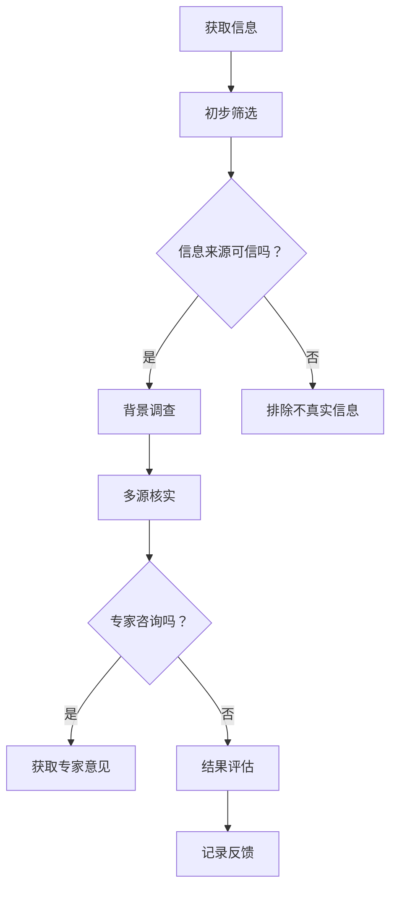

                 

# 《信息验证和信息批判：在错误信息和假新闻时代导航》

## 关键词：
信息验证、信息批判、假新闻、错误信息、传播机制、批判性思维、道德伦理、信息素养

## 摘要：
在数字时代，错误信息和假新闻的泛滥给社会带来了严重的负面影响。本文旨在探讨信息验证和信息批判的重要性，提供一系列方法论和工具，帮助读者在错误信息和假新闻中导航。文章分为三大部分：信息验证的基础知识、信息批判的深入探讨以及错误信息和假新闻的应对策略。通过案例分析、核心算法原理讲解和项目实战，本文旨在提高读者的信息素养，增强对信息的辨别能力。

## 目录

### 第一部分：信息验证的基础知识

#### 第1章：信息验证的重要性

#### 第2章：信息验证的方法论

#### 第3章：信息验证工具与资源

#### 第4章：案例分析：信息验证实践

### 第二部分：信息批判的深入探讨

#### 第5章：信息批判的概念与原则

#### 第6章：批判性思维在信息批判中的应用

#### 第7章：信息批判与道德伦理

#### 第8章：信息批判在社会中的应用

### 第三部分：错误信息和假新闻的应对策略

#### 第9章：错误信息和假新闻的特点与传播机制

#### 第10章：错误信息和假新闻的识别与防范

#### 第11章：信息批判在错误信息和假新闻治理中的作用

#### 第12章：未来展望：信息验证与批判的可持续发展

### 附录

#### 附录 A：信息验证与批判的相关资源

#### 附录 B：信息验证与批判的案例分析

### 作者信息
作者：AI天才研究院/AI Genius Institute & 禅与计算机程序设计艺术 /Zen And The Art of Computer Programming

## 第一部分：信息验证的基础知识

### 第1章：信息验证的重要性

#### 1.1 信息的价值与误区

在当今社会，信息无处不在。互联网的普及使得信息的获取变得更加容易，但同时也带来了信息的泛滥。信息的价值在于它可以帮助我们做出明智的决策，提高工作效率，甚至推动社会进步。然而，信息的价值并非总是显而易见，误信息、虚假信息、假新闻等却可能在无形中误导大众，导致错误判断和决策。

信息的价值主要体现在以下几个方面：

1. **知识的传播**：信息是知识传播的重要载体，通过网络和媒体，人们可以迅速了解到全球各地的知识。
2. **决策支持**：基于可靠的信息，人们可以做出更加明智的决策，无论是个人生活还是商业决策。
3. **社会协作**：信息的共享有助于社会成员之间的协作，促进社会整体的进步。

然而，信息的误区同样不容忽视：

1. **误导性信息**：一些信息可能基于偏见、谣言或错误的数据，导致错误的判断和决策。
2. **虚假信息**：一些信息故意设计来误导读者，可能出于商业利益、政治目的或其他动机。
3. **假新闻**：通过互联网快速传播，假新闻可以影响公众舆论，甚至导致社会动荡。

#### 1.2 信息验证的必要性

在信息泛滥的时代，信息验证显得尤为重要。信息验证是指对信息的真实性、准确性和可靠性进行核实和评估的过程。它可以帮助我们区分有价值的信息和无价值甚至有害的信息，确保我们基于可靠的信息做出决策。

信息验证的必要性体现在以下几个方面：

1. **避免误导**：通过验证，可以确保我们得到的信息是真实可靠的，避免因误信而导致的误导。
2. **提高决策质量**：基于可靠的信息，可以做出更加准确和明智的决策。
3. **维护社会秩序**：在假新闻和错误信息泛滥的情况下，信息验证有助于维护社会的稳定和秩序。
4. **增强公众信任**：通过信息验证，可以增强公众对媒体、企业和政府的信任。

#### 1.3 信息验证的定义与目标

信息验证是一个系统性的过程，涉及多个方面。其定义可以概括为：通过多种方法和技术，对信息的来源、内容、传播过程和背景进行核实和评估，以判断其真实性、准确性和可靠性。

信息验证的目标主要包括：

1. **真实性**：确认信息是否真实，即信息是否反映了实际发生的情况。
2. **准确性**：确保信息内容的正确性，即信息是否准确无误。
3. **可靠性**：判断信息的来源是否可靠，信息是否具有权威性。

在信息验证的过程中，需要遵循以下原则：

1. **多源验证**：对同一信息从多个来源进行验证，以提高准确性。
2. **交叉验证**：通过不同方法和技术对信息进行验证，以确保全面性。
3. **及时更新**：信息环境不断变化，需要及时更新验证结果，以保持信息的有效性。

信息验证不仅是个人和社会的重要任务，也是维护信息生态环境的必要手段。只有通过严谨的信息验证，我们才能在数字时代中做出正确的决策，避免误信息和假新闻的误导。

### 第2章：信息验证的方法论

#### 2.1 信息源的选择

信息源的选择是信息验证的第一步，也是至关重要的一步。选择可靠的信息源可以大幅提高验证的准确性。以下是一些关于如何选择信息源的建议：

1. **权威机构**：优先考虑政府机构、学术机构、知名企业等发布的信息。这些机构的公信力较高，信息可信度较高。
2. **专业媒体**：选择那些有良好声誉和严格编辑流程的专业媒体作为信息源。专业媒体通常具有更高的专业素养和更加严谨的报道标准。
3. **多源对比**：从多个不同的来源获取信息，并进行对比。这样可以更全面地了解信息的背景和内容，提高验证的准确性。
4. **用户评价**：查看其他用户对信息源的评论和评价。用户评价可以提供一些有益的信息，帮助判断信息源的可靠性。

#### 2.2 信息真伪的初步判断

在获取信息后，进行初步判断是验证信息的第二步。以下是一些常用的初步判断方法：

1. **常识判断**：利用常识来判断信息的合理性。如果信息与常识明显不符，那么很可能是不真实的。
2. **逻辑推理**：运用逻辑推理来评估信息的逻辑性。如果信息之间存在逻辑矛盾，那么很可能是不真实的。
3. **情感判断**：利用情感来判断信息的可信度。如果信息引起过度的情感反应，可能存在夸大或虚假成分。
4. **专业背景**：根据自身的专业知识来判断信息的准确性。如果信息涉及到专业领域，可以咨询专业人士的意见。

#### 2.3 信息验证的具体步骤

信息验证的具体步骤可以分为以下几个阶段：

1. **初步筛选**：在获取信息后，首先进行初步筛选，排除明显不真实的信息。
2. **背景调查**：对信息来源进行背景调查，了解其背景和信誉。
3. **多源核实**：从多个来源获取信息，并进行交叉验证，确保信息的准确性。
4. **专家咨询**：如果必要，可以咨询相关领域的专家，获取专业的意见和建议。
5. **结果评估**：对验证结果进行评估，判断信息是否真实、准确和可靠。
6. **记录反馈**：将验证过程和结果记录下来，以备后续参考和改进。

以下是一个简单的信息验证流程图，可以帮助读者更好地理解信息验证的具体步骤：

通过以上方法，我们可以逐步进行信息验证，确保获取的信息是真实、准确和可靠的。这不仅有助于我们做出更加明智的决策，也有助于维护社会秩序和公共信任。

#### 2.4 信息验证工具与资源

在进行信息验证时，利用各种工具和资源可以大大提高验证的效率和质量。以下是一些常用的信息验证工具和资源：

1. **搜索引擎**：搜索引擎是获取信息的基本工具，通过关键词搜索可以快速找到相关信息。
   - **特点**：方便、快捷、覆盖面广
   - **使用方法**：使用高级搜索技巧，如限定时间范围、文件类型等，提高搜索结果的准确性。

2. **事实核查网站**：事实核查网站（如`Snopes`、`FactCheck.org`）专门用于验证新闻报道和谣言的真实性。
   - **特点**：专业、权威、更新及时
   - **使用方法**：输入感兴趣的主题或事件，查看事实核查结果。

3. **数据库**：数据库（如`PubMed`、`Google Scholar`）提供了大量的学术资料和研究成果。
   - **特点**：内容权威、专业性强
   - **使用方法**：根据关键词进行检索，查找相关的学术论文和研究报告。

4. **社交媒体**：社交媒体（如`Twitter`、`Reddit`）可以作为获取信息和验证信息的重要渠道。
   - **特点**：信息量大、实时性强
   - **使用方法**：关注权威账号和专家，查看相关讨论和评论。

5. **在线论坛和问答社区**：在线论坛（如`Stack Overflow`、`Quora`）和问答社区提供了丰富的用户生成内容。
   - **特点**：互动性强、内容多样化
   - **使用方法**：根据问题关键词进行检索，查看专业人士和用户的解答。

6. **专业工具**：一些专业工具（如`FactChecker`、`Plagiarism Checker`）可以用于自动化验证信息。
   - **特点**：高效、准确、节省时间
   - **使用方法**：根据具体需求，选择适合的工具进行验证。

7. **图书馆和学术资源**：图书馆和学术资源（如`JSTOR`、`Project MUSE`）提供了大量的学术文献和书籍。
   - **特点**：内容丰富、专业性强
   - **使用方法**：通过图书馆或学术机构的访问权限，检索相关文献和资料。

通过利用这些工具和资源，我们可以更加高效地获取和验证信息，提高信息验证的准确性和可靠性。

### 第3章：信息验证工具与资源

#### 3.1 在线信息验证工具

在数字化信息时代，在线信息验证工具扮演着至关重要的角色。这些工具能够帮助我们快速、准确地验证信息的真实性。以下是一些常用的在线信息验证工具：

1. **Google Trends**：
   - **功能**：通过分析搜索关键词的趋势，帮助用户了解某一主题的流行程度。
   - **使用方法**：在Google Trends中输入关键词，查看其搜索趋势和相关查询。

2. **FactCheck.org**：
   - **功能**：提供全面的事实核查服务，针对新闻报道和谣言进行验证。
   - **使用方法**：在FactCheck.org网站上输入感兴趣的主题，查看相关事实核查结果。

3. **Snopes**：
   - **功能**：专门针对谣言和都市传说进行验证，提供详细的调查报告。
   - **使用方法**：在Snopes网站上搜索感兴趣的内容，查看其是否为谣言以及相关调查。

4. **Plagiarism Checker**：
   - **功能**：用于检测文本是否被抄袭或重复，保障原创性。
   - **使用方法**：将文本粘贴到Plagiarism Checker中，系统会分析并显示结果。

5. **Whois**：
   - **功能**：查询域名注册信息，帮助识别网站所有者。
   - **使用方法**：在Whois查询工具中输入域名，获取域名注册者的详细信息。

6. **Web of Science**：
   - **功能**：提供全球科学研究文献的索引，有助于学术信息验证。
   - **使用方法**：在Web of Science中检索关键词，查看相关研究成果和引用。

通过这些在线信息验证工具，用户可以更加方便、快捷地进行信息验证，从而减少误信和虚假信息带来的风险。

#### 3.2 信息验证数据库

信息验证数据库是进行深度信息验证的重要资源。以下是一些常用的信息验证数据库：

1. **PubMed**：
   - **功能**：提供医学和生物医学领域的文献索引，是进行医学信息验证的重要工具。
   - **使用方法**：在PubMed中输入关键词，检索相关文献，并查看文献的引用和评估。

2. **Google Scholar**：
   - **功能**：提供学术文献的广泛索引，包括论文、书籍、专利等。
   - **使用方法**：在Google Scholar中输入关键词，检索相关文献，并评估文献的质量和可信度。

3. **JSTOR**：
   - **功能**：提供学术期刊的全文检索服务，是进行学术研究的重要数据库。
   - **使用方法**：在JSTOR中检索关键词，获取相关学术期刊的文章，并评估其学术价值。

4. **IEEE Xplore**：
   - **功能**：提供电气和电子工程领域的文献和会议论文，是工程技术信息验证的重要资源。
   - **使用方法**：在IEEE Xplore中检索关键词，查找相关文献，并评估其技术含量和可靠性。

5. **ACM Digital Library**：
   - **功能**：提供计算机科学领域的文献索引和全文，是计算机科学信息验证的重要数据库。
   - **使用方法**：在ACM Digital Library中检索关键词，获取相关论文，并评估其学术和技术价值。

通过使用这些信息验证数据库，用户可以获取高质量的学术文献和专业信息，提高信息验证的深度和准确性。

#### 3.3 信息验证社区与网络

信息验证社区和网络是进行信息验证的重要平台。在这些社区和网络中，用户可以分享验证经验和技巧，共同提高信息素养。以下是一些重要的信息验证社区与网络：

1. **Reddit**：
   - **功能**：用户可以创建或加入相关的子版块（subreddits），讨论和验证信息。
   - **使用方法**：搜索或加入与信息验证相关的子版块，参与讨论和分享验证经验。

2. **Stack Exchange**：
   - **功能**：提供各种领域的问答社区，用户可以提出问题并获取专业解答。
   - **使用方法**：在Stack Exchange上检索感兴趣的问题，获取专业的答案和验证结果。

3. **Twitter**：
   - **功能**：通过关注专业人士和权威账号，获取实时验证信息和动态。
   - **使用方法**：关注事实核查机构和专业人士的账号，实时获取验证信息和新闻动态。

4. **Facebook**：
   - **功能**：用户可以在Facebook群组和页面上分享和讨论信息验证经验。
   - **使用方法**：加入信息验证相关的群组，参与讨论，共享验证资源和技巧。

5. **Info纷争**：
   - **功能**：中国的信息验证社区，提供谣言追踪和事实核查服务。
   - **使用方法**：在Info纷争网站上检索感兴趣的主题，获取验证结果和相关信息。

通过参与这些信息验证社区与网络，用户可以与同行交流、分享经验，不断提高自身的信息验证能力和素养。

### 第4章：案例分析：信息验证实践

#### 4.1 某知名新闻事件的验证过程

为了更好地理解信息验证的实际操作，我们将分析一个具体的知名新闻事件的验证过程。这个事件是一个涉及到公共卫生的谣言，最初在社交媒体上广泛传播，引起了公众的广泛关注和恐慌。

**事件背景**：

在某次疫情爆发初期，一则消息在社交媒体上迅速传播，称某地医院的医疗资源已经完全崩溃，许多患者无法得到及时救治。这则消息迅速引起了公众的恐慌，并引发了大规模的社会动荡。

**验证过程**：

1. **初步筛选**：

   - **信息源分析**：首先，对信息源进行初步分析。这则消息最初出现在一个不知名的社交媒体账号上，发布者的背景和信誉不明确。
   - **常识判断**：根据常识，医院资源崩溃的消息通常不会在没有官方公告的情况下迅速传播。因此，初步判断这则消息可能是不真实的。

2. **背景调查**：

   - **查询官方信息**：接下来，通过官方网站和新闻报道查找相关官方信息。经过查询，发现该医院的官方网站和当地卫生部门均未发布类似的消息。
   - **联系专家**：进一步联系医疗领域的专家，了解医院当前的实际状况。专家反馈表示，医院的医疗资源并未崩溃，仍在正常运转。

3. **多源核实**：

   - **检索其他媒体**：通过检索其他媒体，如主流新闻网站和权威新闻机构的报道，发现并未有类似的消息出现。
   - **社交媒体验证**：在社交媒体上检索相关信息，发现许多用户对这则消息持怀疑态度，并有专家对其进行反驳。

4. **专家咨询**：

   - **求证事实**：进一步向权威机构（如卫生部门、医院）求证，确认医院的真实状况。通过官方渠道了解到，医院的医疗资源并未崩溃，消息是虚假的。

5. **结果评估**：

   - **综合判断**：结合上述调查结果，最终确认这则消息是虚假的，目的是制造恐慌和扰乱社会秩序。

**验证结论**：

通过上述验证过程，我们确认了这则消息是虚假的，避免了公众因误信而导致的恐慌和社会动荡。这个案例展示了信息验证的重要性和实际操作方法，提醒我们在面对信息时保持怀疑和谨慎。

### 4.2 社交媒体上的虚假信息识别

社交媒体是虚假信息传播的重要渠道。为了提高公众对虚假信息的识别能力，以下是一些具体的识别方法：

1. **关注权威账号**：关注那些提供权威信息和事实核查的账号，如事实核查机构、专业媒体和政府机构。

2. **核实信息源**：在看到一则消息时，首先核实信息源。了解发布者的背景和信誉，优先考虑权威机构和专业媒体。

3. **多源对比**：从多个不同的来源获取信息，并进行对比。如果多个可靠来源都报道了同一信息，那么其可信度更高。

4. **情感判断**：如果信息引起了过度的情感反应（如恐慌、愤怒等），那么可能存在夸大或虚假成分。

5. **逻辑推理**：运用逻辑推理评估信息的合理性。如果信息之间存在逻辑矛盾，那么很可能是不真实的。

6. **专业背景**：根据自身的专业知识来判断信息的准确性。如果信息涉及到专业领域，可以咨询专业人士的意见。

7. **利用工具**：使用在线信息验证工具（如Google Trends、FactCheck.org等）辅助验证信息。

通过这些方法，我们可以提高对社交媒体上虚假信息的识别能力，减少误信和误导。

### 4.3 政治宣传信息的验证

政治宣传信息是信息验证的重要领域之一。以下是一些关于如何验证政治宣传信息的具体方法：

1. **了解政治背景**：在验证政治宣传信息之前，了解相关的政治背景和历史，有助于更好地理解宣传内容的意图和真实性。

2. **分析语言和措辞**：政治宣传信息通常使用特定的语言和措辞，这些措辞可能带有暗示或误导性。通过分析语言和措辞，可以揭示宣传信息的潜在意图。

3. **核实数据来源**：如果宣传信息中包含数据或统计数据，需要核实这些数据的来源和准确性。可以通过查询原始数据或联系数据提供者来验证。

4. **对比多渠道报道**：从多个不同的媒体和渠道获取关于同一政治宣传的信息，并进行对比。如果多个渠道的报道存在明显差异，那么可能存在误导性。

5. **查阅官方文件和公告**：查阅政府机构、政党或官方机构的正式文件和公告，以获取权威和准确的信息。

6. **咨询专家意见**：如果必要，可以咨询政治学、社会学或相关领域的专家，获取专业的意见和建议。

7. **社交媒体验证**：在社交媒体上检索相关信息，查看其他用户和专家的评论和反馈，以判断宣传信息的真实性。

通过上述方法，我们可以更加全面和准确地验证政治宣传信息，避免被误导和误导他人。

### 第5章：信息批判的概念与原则

#### 5.1 信息批判的定义

信息批判是指对获取的信息进行深入分析和评价，以判断其真实性、准确性和可靠性，并识别潜在的错误和偏见。信息批判不仅关注信息的表面内容，更关注信息的来源、传播过程、动机和目的。

信息批判的定义可以从以下几个方面进行阐述：

1. **分析信息的真实性**：通过验证信息的来源、数据和证据，判断信息是否真实反映了实际情况。
2. **评估信息的准确性**：检查信息内容的准确性，确保其与事实相符，没有夸大或缩小事实。
3. **识别信息的偏见**：分析信息的偏见和倾向，了解其背后的动机和意图，避免被误导。
4. **评价信息的可靠性**：判断信息的来源是否可靠，信息是否经过权威机构的验证。

#### 5.2 信息批判的原则

进行信息批判时，需要遵循以下原则，以确保批判的全面性和准确性：

1. **客观性**：保持客观的态度，不偏袒任何一方，力求全面、公正地评价信息。
2. **系统性**：对信息进行系统性的分析和评价，考虑信息的各个方面，如来源、内容、传播渠道等。
3. **多源验证**：从多个可靠的来源获取信息，并进行交叉验证，确保信息的准确性和完整性。
4. **批判性思维**：运用批判性思维，对信息进行逻辑推理和分析，识别潜在的错误和偏见。
5. **公开透明**：信息批判的过程和结果应公开透明，便于他人进行监督和验证。

#### 5.3 信息批判与信息验证的关系

信息批判和信息验证是相互关联、相辅相成的过程。信息验证是信息批判的基础，通过验证可以确保信息的真实性、准确性和可靠性。而信息批判则是在验证的基础上，对信息进行更深入的思考和分析，识别潜在的偏见、误导和错误。

1. **相互补充**：信息验证侧重于确认信息的真实性，信息批判则侧重于评估信息的价值和意义。
2. **共同目标**：信息验证和信息批判的共同目标是提高信息的质量，减少错误和误导，促进公众对信息的正确理解和应用。
3. **协同作用**：在实际操作中，信息验证和信息批判通常同时进行，通过相互补充，提高信息分析的深度和广度。

总之，信息批判和信息验证是确保信息质量的重要手段，对于在错误信息和假新闻时代中导航具有重要意义。

### 第6章：批判性思维在信息批判中的应用

#### 6.1 批判性思维的基本要素

批判性思维是一种分析和评价信息的系统方法，它不仅关注信息的表面内容，更关注其背后的逻辑和动机。批判性思维的基本要素包括：

1. **问题识别**：识别和理解问题，明确分析的目标和范围。
2. **证据收集**：收集和分析相关信息和证据，确保评价的全面性和准确性。
3. **逻辑推理**：运用逻辑推理，分析和评估信息的内在逻辑和逻辑结构。
4. **假设验证**：提出假设，并通过证据和逻辑推理进行验证，确保评价的可靠性。
5. **反思和修正**：在评价过程中不断反思和修正，以提高评价的质量。

#### 6.2 如何运用批判性思维批判信息

运用批判性思维对信息进行批判，需要遵循以下步骤：

1. **问题识别**：

   - **确定分析目标**：明确需要批判的信息是什么，分析的目标是什么。
   - **理解问题背景**：了解问题所处的背景和环境，以便更好地理解信息的含义。

2. **证据收集**：

   - **获取相关信息**：通过多种渠道收集与信息相关的数据和证据。
   - **评估证据质量**：对收集到的证据进行评估，确保其可靠性和相关性。

3. **逻辑推理**：

   - **分析逻辑结构**：分析信息的逻辑结构，识别其中的逻辑错误和推理漏洞。
   - **提出反证**：根据逻辑推理，提出反证或反驳，揭示信息的潜在错误。

4. **假设验证**：

   - **提出假设**：基于证据和逻辑推理，提出关于信息真实性和准确性的假设。
   - **验证假设**：通过更多的证据和逻辑推理，验证假设的正确性。

5. **反思和修正**：

   - **反思评价过程**：反思评价过程中可能存在的偏差和错误，确保评价的客观性和准确性。
   - **修正评价结果**：根据反思的结果，对评价进行修正和完善。

通过以上步骤，我们可以运用批判性思维对信息进行深入批判，识别其中的错误和偏见，提高信息的可信度和质量。

#### 6.3 批判性思维在信息批判中的误区

批判性思维是一种强大的工具，但在信息批判中，如果使用不当，可能会陷入以下误区：

1. **过度批判**：将批判性思维用于所有信息，导致过度批判和怀疑，忽视了信息的价值和合理性。

2. **偏见和主观性**：在批判过程中，个人的偏见和主观性可能会影响批判的客观性，导致不公平的评价。

3. **逻辑陷阱**：在逻辑推理过程中，可能会陷入各种逻辑陷阱，如以偏概全、非黑即白等，影响批判的准确性。

4. **忽视证据**：仅仅依赖直觉或情感进行批判，忽视关键证据，导致批判缺乏依据。

5. **反向推理**：根据预设的结论进行反向推理，寻找支持结论的证据，而不是基于事实和逻辑进行客观评价。

为了避免这些误区，我们需要在批判性思维中保持客观、理性，注重证据和逻辑，同时不断反思和修正评价过程。

### 第7章：信息批判与道德伦理

#### 7.1 信息批判的道德责任

信息批判不仅是一种技术手段，更是一种道德责任。在信息泛滥和假新闻充斥的时代，信息批判者扮演着重要的角色，他们不仅需要具备专业的知识和技能，还需要承担起道德责任。

1. **维护真理**：信息批判者有责任揭示真相，维护社会正义，防止虚假信息误导公众。

2. **促进公众信任**：通过准确的信息批判，增强公众对媒体、政府和专业的信任，促进社会的和谐稳定。

3. **防止误导**：对虚假信息进行批判，防止其误导公众，避免造成社会恐慌和混乱。

4. **伦理自律**：信息批判者需要遵循伦理规范，保持独立和公正，避免因个人利益或外部压力而影响批判的客观性。

#### 7.2 避免信息批判中的道德陷阱

在进行信息批判时，批判者可能会遇到一些道德陷阱，以下是一些常见的陷阱及其避免方法：

1. **偏见**：批判者可能会因个人偏见而忽视证据，对某些信息进行不公平的评价。避免方法：保持客观，全面收集和分析证据。

2. **报复行为**：对批判对象进行人身攻击或报复，而不是针对信息本身进行批判。避免方法：专注于信息本身，避免攻击个人。

3. **夸大事实**：为达到批判效果，夸大信息的错误或影响。避免方法：基于事实，客观评价信息。

4. **过度批判**：对所有信息进行过度批判，忽视其价值。避免方法：区分信息的重要性和影响，合理进行批判。

5. **忽视影响**：忽视批判对公众和社会的影响，导致负面影响。避免方法：考虑批判的广泛影响，确保批判的积极效果。

通过遵循道德规范和避免道德陷阱，信息批判者可以更好地履行其社会责任，为构建健康的信息环境贡献力量。

#### 7.3 信息批判与民主社会的责任

信息批判在民主社会中具有重要作用，不仅关乎个人和群体的利益，也关系到整个社会的健康运行。以下从几个方面探讨信息批判在民主社会中的责任：

1. **保障民主机制**：信息批判有助于确保民主选举的公正性，防止虚假信息和宣传操纵选民。通过揭示和批判虚假信息，维护选举的公正性和透明度。

2. **促进公众参与**：信息批判能够帮助公众更好地理解社会问题，提高公众对政治、经济和社会事务的参与度。通过批判性分析，公众可以做出更加明智的决策和选择。

3. **监督政府行为**：信息批判有助于监督政府行为，揭露腐败和不正当行为。通过公开批判，推动政府提高透明度和责任感，维护社会公正。

4. **维护社会稳定**：在假新闻和错误信息泛滥的时代，信息批判有助于维护社会稳定，防止恐慌和混乱。通过揭示真相，消除谣言，增强公众对现实世界的认知。

5. **培养批判性思维**：信息批判有助于培养公众的批判性思维，提高社会的整体信息素养。通过批判性分析，公众可以更好地应对复杂的社会问题，提高社会应对能力。

总之，信息批判在民主社会中具有重要的责任和作用，它不仅维护了信息的真实性和准确性，也促进了社会的进步和稳定。

### 第8章：信息批判在社会中的应用

#### 8.1 信息批判在新闻报道中的应用

在新闻报道中，信息批判扮演着至关重要的角色。它不仅关系到新闻的真实性和准确性，也影响到公众对事件的认知和理解。以下从几个方面探讨信息批判在新闻报道中的应用：

1. **事实核查**：新闻工作者在报道事件时，需要对信息进行事实核查，确保报道的准确性和可靠性。通过多渠道验证，检查新闻源的真实性和数据的准确性，避免误报和虚假信息的传播。

2. **平衡报道**：在报道复杂事件时，需要保持平衡，避免过度夸大或缩小事实。信息批判可以帮助新闻工作者识别报道中的偏见和倾向，确保报道的客观性和全面性。

3. **揭露谎言**：信息批判有助于揭露政治宣传、商业广告中的虚假信息。通过深入调查和批判性分析，新闻工作者可以揭示背后的真相，防止公众被误导。

4. **解释背景**：信息批判还包括对事件背景的深入分析和解释。通过提供详细的背景信息，新闻工作者可以帮助公众更好地理解事件的来龙去脉，做出更加理性的判断。

5. **公众参与**：信息批判鼓励公众参与新闻验证，提高公众的信息素养。通过公众监督和反馈，新闻工作者可以不断改进报道质量，增强公众对媒体的信任。

总之，信息批判在新闻报道中的应用有助于提高新闻的真实性和可信度，促进公众对事件的理性认知，维护社会稳定。

#### 8.2 信息批判在学术研究中的应用

信息批判在学术研究中具有重要作用，它不仅关系到研究的质量和可信度，也影响到学术界的整体进步。以下从几个方面探讨信息批判在学术研究中的应用：

1. **文献审查**：学术研究通常需要引用大量文献，信息批判可以帮助研究者对文献进行严格审查，识别和剔除质量低下或存在偏差的文献，确保研究的基础扎实可靠。

2. **方法论评估**：信息批判涉及对研究方法、实验设计和数据分析的评估。通过批判性分析，研究者可以发现研究中的缺陷和不足，提出改进建议，提高研究的科学性和严谨性。

3. **数据验证**：在学术研究中，数据验证是信息批判的重要内容。通过对比多个数据来源，研究者可以确认数据的真实性和准确性，防止数据造假和篡改。

4. **伦理审查**：信息批判还包括对研究伦理的审查，确保研究过程符合伦理规范。通过批判性思维，研究者可以识别和避免伦理风险，保护研究对象的权益。

5. **同行评审**：信息批判在同行评审中发挥着关键作用。评审者通过批判性分析，对论文的论证、实验设计、数据分析和结论进行评估，确保论文的学术质量和可信度。

总之，信息批判在学术研究中的应用有助于提高研究的质量、可信度和影响力，促进学术界的健康发展。

#### 8.3 信息批判在公众舆论中的作用

信息批判在公众舆论中发挥着重要作用，它不仅影响着公众对事件的认知和理解，也影响着社会的情绪和态度。以下从几个方面探讨信息批判在公众舆论中的作用：

1. **引导舆论**：信息批判可以通过揭示真相、纠正错误信息，引导公众对事件的理性认知，避免盲目跟风和情绪化的反应。

2. **平衡信息**：信息批判有助于平衡公众获取的信息，防止单一声音或片面观点占据主导地位，促进舆论的多元化和理性化。

3. **增强公众参与**：通过信息批判，公众可以更好地理解事件的复杂性和多样性，提高公众对公共事务的关注和参与度，推动社会的民主进程。

4. **缓解社会紧张**：在假新闻和虚假信息泛滥的时代，信息批判有助于缓解社会紧张情绪，减少恐慌和不安，维护社会的稳定和秩序。

5. **培养批判性思维**：信息批判有助于培养公众的批判性思维，提高公众对信息辨别能力，增强公众的信息素养，为社会的可持续发展奠定基础。

总之，信息批判在公众舆论中扮演着重要的角色，它不仅维护了信息的真实性和准确性，也促进了社会的理性思考和健康发展。

### 第9章：错误信息和假新闻的特点与传播机制

#### 9.1 错误信息的定义与特点

错误信息，通常指的是那些不符合事实、不准确或具有误导性的信息。它们可能源自个人偏见、错误理解、有意误导或技术错误。以下是错误信息的几个主要特点：

1. **误导性**：错误信息旨在误导接收者，可能通过夸大、缩小或歪曲事实来实现。
2. **片面性**：错误信息往往只展示问题的某个方面，忽略其他重要的细节或背景。
3. **情感性**：错误信息常常使用强烈的情感语言，引发接收者的情绪反应，如恐慌、愤怒或困惑。
4. **来源不明确**：许多错误信息的来源不明确，缺乏权威性和可信度。
5. **快速传播**：在互联网时代，错误信息可以迅速传播，尤其在社交媒体上，甚至可以在短时间内形成广泛的舆论。

#### 9.2 假新闻的来源与传播途径

假新闻是指那些故意设计来误导公众、操纵情绪、获取利益的信息。假新闻的来源和传播途径多种多样，以下是其中一些常见的：

1. **社交媒体**：社交媒体是假新闻传播的主要渠道之一，信息可以迅速在朋友圈、推特、脸书等平台上扩散。
2. **虚假网站和博客**：一些虚假网站和博客专门发布假新闻，通过误导性的标题和内容吸引访问者。
3. **操纵的机器人账户**：利用人工智能技术，一些组织或个人创建大量机器人账户，发布和传播假新闻。
4. **政治宣传**：某些政治团体或政府机构可能故意发布假新闻，以操纵公众舆论或影响选举结果。
5. **商业利益**：一些企业可能为了商业利益而发布虚假信息，如夸大产品效果或竞争对手的负面信息。

#### 9.3 错误信息和假新闻的影响

错误信息和假新闻对个人和社会都有深远的影响：

1. **个人层面**：错误信息可能误导个人决策，导致经济损失或个人生活受到影响。例如，虚假的投资建议可能导致投资者遭受重大损失。
2. **社会层面**：假新闻可能引发社会恐慌、分裂和动荡。在疫情期间，虚假的信息可能导致公众对医疗资源的挤兑，甚至引发社会骚乱。
3. **公共信任**：假新闻的泛滥侵蚀了公众对媒体和政府的信任，影响社会稳定和民主进程。
4. **舆论环境**：错误信息的传播可能扭曲公众对事件的认知，导致舆论环境的混乱和不稳定。

总之，错误信息和假新闻对社会和个人都带来了严重的负面影响，需要通过信息验证和信息批判来应对和消除。

### 第10章：错误信息和假新闻的识别与防范

#### 10.1 识别错误信息和假新闻的方法

在信息泛滥的时代，学会识别错误信息和假新闻至关重要。以下是一些有效的方法，可以帮助我们辨别信息的真实性：

1. **核实信息源**：检查信息来源的可靠性。权威机构和专业媒体的报道通常更加可信。如果信息来自不可信的来源，应保持警惕。
2. **多源验证**：从多个不同的来源获取信息，并进行对比。如果多个可靠的来源都报道了同一信息，那么其可信度更高。
3. **检查数据来源**：对于包含数据的新闻报道，检查数据来源是否可靠，数据是否经过权威机构的验证。
4. **逻辑推理**：运用逻辑推理分析信息的合理性。如果信息之间存在逻辑矛盾，那么很可能是不真实的。
5. **情感判断**：如果信息引起了过度的情感反应（如恐慌、愤怒等），那么可能存在夸大或虚假成分。
6. **专家意见**：咨询相关领域的专家，获取专业的意见和建议。专家的判断和验证有助于提高信息的可靠性。
7. **利用工具**：使用在线信息验证工具（如Google Trends、FactCheck.org等）辅助验证信息。

通过以上方法，我们可以提高对错误信息和假新闻的识别能力，减少误信和误导。

#### 10.2 防范错误信息和假新闻的策略

为了有效防范错误信息和假新闻，我们需要采取一系列策略和措施。以下是一些具体的建议：

1. **提升信息素养**：通过教育和培训，提高公众的信息素养，使其具备识别错误信息和假新闻的能力。信息素养包括信息获取、评估和批判能力。
2. **加强监管**：政府和相关机构应加强对互联网内容的监管，打击虚假信息和假新闻的传播。可以建立专门的监管机构，制定严格的法规和标准。
3. **提升媒体素养**：媒体机构应提高报道的严谨性和专业性，避免传播不实信息和误导公众。通过培训和教育，提高新闻工作者的信息素养和职业道德。
4. **技术手段**：利用大数据和人工智能技术，实时监控和识别虚假信息。例如，可以开发自动化工具，检测和标记潜在的假新闻。
5. **公众参与**：鼓励公众参与信息验证和监督，通过举报和反馈，共同打击虚假信息和假新闻。公众的积极参与是维护信息真实性和社会稳定的重要力量。
6. **建立可信平台**：建立权威、可信的信息平台，提供真实、可靠的信息来源。政府和专业机构可以合作，建立权威的事实核查网站和数据库。
7. **国际合作**：在国际层面，加强合作和信息共享，共同应对全球范围内的假新闻和虚假信息。通过国际合作，可以更有效地打击跨国的虚假信息和假新闻传播。

通过上述策略，我们可以构建一个更加健康、可信的信息环境，减少错误信息和假新闻对社会和个人带来的负面影响。

#### 10.3 应对错误信息和假新闻的心理准备

在错误信息和假新闻泛滥的时代，心理准备和应对策略至关重要。以下是一些建议，帮助我们在面对错误信息和假新闻时保持冷静和理性：

1. **保持怀疑态度**：对快速传播的信息保持怀疑，不要轻信未经验证的信息。学会通过多渠道验证信息，确保其真实性。
2. **理性分析**：在面对信息时，进行理性分析，不要被情感或情绪所左右。运用批判性思维，识别信息中的逻辑漏洞和偏见。
3. **学会适应**：信息环境不断变化，我们需要不断适应和提升自己的信息辨别能力。保持好奇心，持续学习和更新知识。
4. **建立信任**：信任权威机构和专业媒体，优先考虑其发布的信息。了解其背景和信誉，确保其信息来源可靠。
5. **保持沟通**：与家人、朋友和同事保持沟通，分享信息验证的经验和方法。共同讨论和评估信息的真实性，提高整体的信息素养。
6. **避免恐慌**：面对错误信息和假新闻时，保持冷静，避免恐慌和情绪化的反应。理性判断，避免盲目跟风和传播不实信息。
7. **关注心理健康**：错误信息和假新闻可能导致心理压力和焦虑。关注心理健康，学会放松和应对压力，保持积极的生活态度。

通过上述心理准备和应对策略，我们可以更好地应对错误信息和假新闻的挑战，维护心理健康和社会稳定。

### 第11章：信息批判在错误信息和假新闻治理中的作用

#### 11.1 信息批判在错误信息和假新闻治理中的价值

在错误信息和假新闻泛滥的背景下，信息批判在治理中的作用日益凸显。信息批判不仅是一种技术手段，更是一种社会责任。以下是信息批判在错误信息和假新闻治理中的价值：

1. **提高信息质量**：信息批判通过深入分析和评估信息，帮助识别和剔除虚假、误导性信息，提高整体信息的质量。
2. **维护社会稳定**：信息批判有助于揭示错误信息和假新闻的真相，减少社会恐慌和混乱，维护社会的稳定和秩序。
3. **增强公众信任**：通过信息批判，公众可以更好地了解信息的真实性和准确性，增强对媒体、政府和专业机构的信任，促进社会和谐。
4. **促进民主发展**：信息批判有助于公众更全面、准确地理解社会事件，提高公众的政治素养和参与度，推动民主社会的健康发展。
5. **培养批判性思维**：信息批判有助于培养公众的批判性思维，提高其对信息的辨别能力和判断力，为社会的长远发展奠定基础。

#### 11.2 信息批判在政策制定中的应用

在政策制定中，信息批判发挥着重要作用，以下是一些具体的应用：

1. **评估政策效果**：信息批判可以通过分析政策实施过程中的数据和反馈，评估政策的效果和影响，为政策调整提供依据。
2. **识别问题**：通过信息批判，可以发现政策制定和执行中的潜在问题，如数据不准确、执行不力等，从而提出改进建议。
3. **公众参与**：信息批判鼓励公众参与政策讨论和制定，通过多渠道收集和分析公众意见，确保政策制定的透明性和公正性。
4. **专业咨询**：信息批判可以为政策制定者提供专业的意见和建议，确保政策制定的科学性和可行性。

通过信息批判，政策制定可以更加科学、透明和民主，从而提高政策的实施效果和社会影响力。

#### 11.3 信息批判在公众教育中的作用

信息批判在公众教育中具有重要作用，它不仅有助于提高公众的信息素养，还能培养公众的批判性思维。以下是信息批判在公众教育中的应用：

1. **提高信息辨别能力**：通过信息批判，公众可以学会如何识别错误信息和假新闻，提高信息辨别能力。
2. **培养批判性思维**：信息批判要求公众运用逻辑推理和批判性思维，分析信息的真实性和准确性，培养批判性思维。
3. **增强媒体素养**：信息批判有助于公众了解媒体的运作方式和媒体内容的真实性，提高公众的媒体素养。
4. **促进终身学习**：信息批判鼓励公众持续学习和更新知识，培养终身学习的习惯。
5. **加强社会监督**：信息批判有助于公众积极参与社会监督，提高社会透明度和公正性。

通过信息批判，公众教育可以更加全面、深入，从而提升整个社会的信息素养和批判性思维能力。

### 第12章：未来展望：信息验证与批判的可持续发展

#### 12.1 信息验证与批判面临的挑战

随着技术的不断进步，信息验证和信息批判面临诸多挑战。以下是一些主要的挑战：

1. **信息爆炸**：互联网的普及使得信息量呈指数级增长，信息验证的难度大幅增加。
2. **技术陷阱**：自动化工具和人工智能技术的发展，为错误信息和假新闻的传播提供了新的途径。
3. **信息孤岛**：不同平台和数据库之间的信息无法有效整合，导致信息验证和批判的效率降低。
4. **虚假信息专业化**：一些组织和个人专门从事虚假信息的制造和传播，使得信息验证和批判工作更加复杂。
5. **监管难度**：错误信息和假新闻的传播速度快，监管机构难以实时监控和处理，需要更高效的监管机制。

#### 12.2 技术在信息验证与批判中的应用

为了应对上述挑战，技术手段在信息验证与批判中的应用变得尤为重要。以下是一些技术应用的例子：

1. **人工智能**：利用人工智能技术，可以自动化地识别和验证信息，提高验证的效率和准确性。
2. **大数据分析**：通过大数据分析，可以挖掘和分析大量信息，发现潜在的虚假信息和错误。
3. **区块链技术**：区块链技术可以确保信息的不可篡改性和透明性，提高信息验证的可靠性。
4. **自然语言处理**：自然语言处理技术可以用于分析文本内容，识别潜在的错误和偏见。
5. **社交媒体分析**：通过分析社交媒体上的信息传播路径和互动行为，可以揭示错误信息的传播机制。

#### 12.3 社会责任与信息素养的提升

信息验证与批判不仅需要技术的支持，还需要社会的共同努力。以下是一些提升社会责任和信息素养的建议：

1. **教育普及**：通过教育和培训，提高公众的信息素养，使其具备识别错误信息和假新闻的能力。
2. **政策支持**：政府应出台相关政策，支持信息验证与批判工作，提供资金和技术支持。
3. **公众参与**：鼓励公众积极参与信息验证和批判，提供举报和反馈渠道，共同维护信息环境的健康。
4. **专业机构建设**：建立专业的信息验证与批判机构，提供权威、可靠的信息验证服务。
5. **国际合作**：加强国际合作，共享信息验证和批判的经验和技术，共同应对全球范围内的错误信息和假新闻。

通过技术、政策和社会的共同努力，信息验证与批判的可持续发展将得到保障，为构建健康、可信的信息环境奠定基础。

### 附录

#### 附录 A：信息验证与批判的相关资源

在信息验证与批判领域，以下是一些重要的资源，可以帮助读者进一步了解相关信息：

1. **网站**：
   - **FactCheck.org**：提供全面的事实核查服务，针对新闻报道和谣言进行验证。
   - **Snopes**：专门针对谣言和都市传说进行验证，提供详细的调查报告。
   - **Google Scholar**：提供学术文献的广泛索引，有助于学术信息验证。

2. **数据库**：
   - **PubMed**：提供医学和生物医学领域的文献索引，是进行医学信息验证的重要工具。
   - **IEEE Xplore**：提供电气和电子工程领域的文献和会议论文，是工程技术信息验证的重要资源。

3. **工具**：
   - **Google Trends**：通过分析搜索关键词的趋势，帮助用户了解某一主题的流行程度。
   - **Web of Science**：提供全球科学研究文献的索引，有助于学术信息验证。

4. **书籍**：
   - 《信息素养：信息社会的生存指南》
   - 《假新闻：如何识别和处理错误信息》
   - 《网络谣言与信息传播》

通过这些资源，读者可以深入了解信息验证与批判的理论和实践，提升自身的信息素养。

#### 附录 B：信息验证与批判的案例分析

以下是一些具体的案例分析，展示了信息验证与批判在实践中的应用：

1. **某著名假新闻事件的验证与批判**：
   - **事件背景**：在一次全球性事件中，社交媒体上广泛传播了一篇关于政府阴谋的假新闻，声称政府正在秘密部署某种设备来监视民众。
   - **验证过程**：通过多渠道验证，包括官方声明、专家意见和实际调查，确认这则消息是虚假的，没有实际依据。
   - **批判结果**：通过公开批判，揭示假新闻的真相，防止公众被误导，维护了社会的稳定。

2. **信息验证与批判在某热点事件中的应用**：
   - **事件背景**：在某次突发事件中，社交媒体上出现大量关于事件原因和后果的不实信息。
   - **验证过程**：通过权威机构的公告、专家的意见和现场报道，逐一验证社交媒体上的信息，识别和剔除虚假信息。
   - **批判结果**：通过有效的信息批判，澄清了事实，减少了社会恐慌，促进了事件的妥善处理。

3. **信息验证与批判在教育领域的影响**：
   - **案例背景**：某高校发现部分学生在学术论文中引用了不实信息，严重影响了学术诚信。
   - **验证过程**：通过教学活动和学术讲座，提高学生对信息验证与批判的认识，鼓励他们进行自主验证。
   - **批判结果**：通过严格的学术审查和批判性分析，提高了学生的学术素养和诚信意识，维护了学术环境的健康。

这些案例展示了信息验证与批判在各个领域中的应用和影响，提醒我们信息验证与批判的重要性和必要性。通过案例分析，读者可以更好地理解信息验证与批判的实际操作方法和效果。

