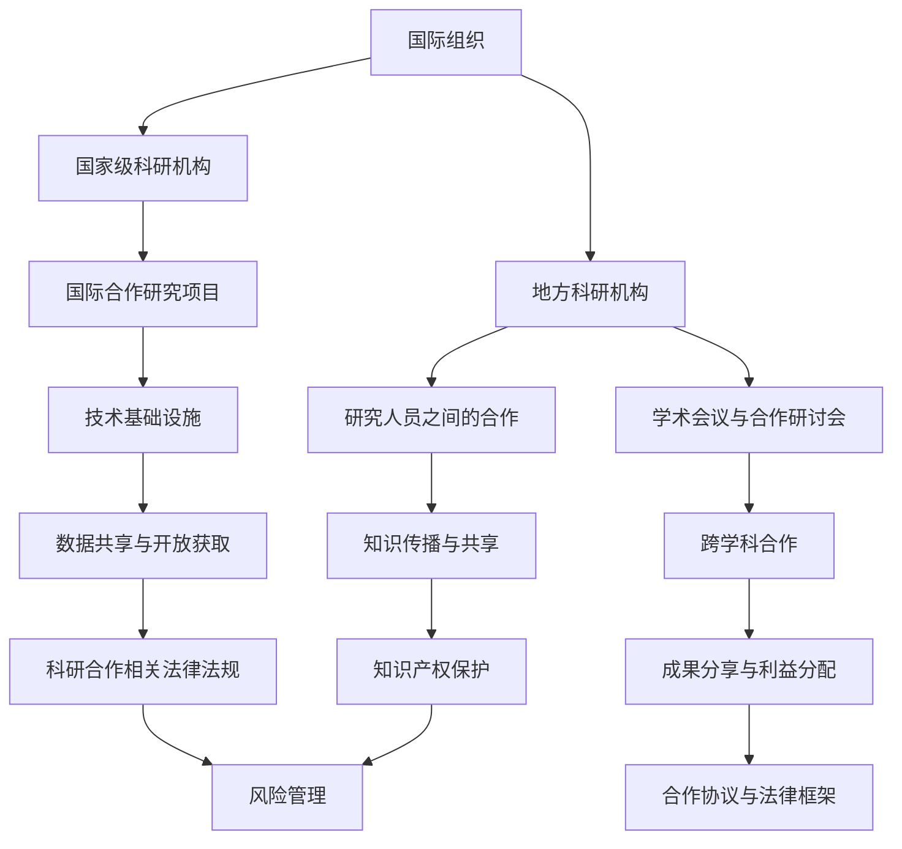

                 

## 文章标题：全球科研合作网络：跨越地理与文化界限的世界理解

### 关键词：全球科研合作，科研合作网络，网络科学，国际合作，跨学科合作

> 摘要：本文深入探讨了全球科研合作网络的架构、实现、运作机制以及实际案例，分析了网络科学和数学模型在科研合作中的应用，揭示了全球科研合作网络的发展趋势。本文旨在为科研工作者和政策制定者提供关于全球科研合作网络建设的理论支持和实践指导。

### 目录大纲：

#### 第一部分：引言

1. **全球科研合作网络的背景与趋势**
    - **全球科研合作网络的背景**：科技快速发展，科研复杂性增加，全球科研合作的重要性日益凸显。
    - **全球科研合作网络的发展趋势**：跨国界合作项目增多，跨学科研究成为主流，开放获取和知识共享成为共识。

2. **全球科研合作网络的重要性**
    - **促进科技创新**：通过知识共享和资源整合，加速科研成果的产生和应用。
    - **提升科研效率**：跨学科和跨国界的合作有助于解决复杂科学问题。
    - **推动知识传播**：开放获取和知识共享有助于提升全球科学水平。

3. **全球科研合作网络的主要挑战**
    - **技术挑战**：构建和运营全球科研合作网络需要强大的技术基础设施。
    - **法律和伦理挑战**：知识产权保护、数据安全和隐私保护等问题需要解决。
    - **文化和社会挑战**：不同国家和地区之间的文化差异和科研习惯差异可能影响合作效果。

#### 第二部分：全球科研合作网络的概念与架构

1. **全球科研合作网络的概念**
    - **定义**：全球科研合作网络是由多个国家和地区的研究机构、大学、企业和政府组织构成的科研合作体系。
    - **组成**：包括国际合作研究项目、研究人员之间的合作、学术会议与合作研讨会、跨学科合作等。

2. **全球科研合作网络的架构**
    - **层次结构**：包括国际组织、国家级科研机构、地方科研机构等。
    - **连接方式**：通过技术、数据、知识和资源的共享实现节点间的连接。

3. **全球科研合作网络的关键节点**
    - **国际组织**：如联合国教科文组织、世界卫生组织等。
    - **国家级科研机构**：如美国的国立卫生研究院、欧洲分子生物学实验室等。
    - **地方科研机构**：如各大学的研究中心、各国的国家级实验室等。

#### 第三部分：全球科研合作的主要形式

1. **国际合作研究项目**
    - **定义**：跨国界的科研合作项目，旨在解决全球性科学问题。
    - **分类**：基础研究、应用研究、技术转移等。

2. **研究人员之间的合作**
    - **形式**：共同发表学术论文、合作开展科研项目、人员交流等。
    - **优势**：知识共享、技能互补、提高研究效率。

3. **学术会议与合作研讨会**
    - **定义**：学术交流平台，促进研究人员之间的互动和合作。
    - **作用**：分享最新研究成果、探讨研究热点问题、建立合作关系。

4. **跨学科合作**
    - **定义**：涉及不同学科领域的科研合作，解决复杂科学问题。
    - **优势**：促进学科交叉，提高研究深度和广度。

#### 第四部分：全球科研合作网络的实现与运作

1. **全球科研合作网络的实现**
    - **技术基础设施**：高性能计算、大数据分析、物联网等。
    - **数据共享与开放获取**：推动科研数据的开放和共享。

2. **全球科研合作网络的运作机制**
    - **合作伙伴选择**：选择具备互补优势的合作伙伴。
    - **合作协议与法律框架**：明确合作各方的权利和义务。
    - **知识产权保护**：确保科研成果的知识产权得到保护。
    - **成果分享与利益分配**：合理分配合作成果的利益。

3. **全球科研合作网络的管理与评估**
    - **管理架构与角色**：建立高效的管理架构，明确各方职责。
    - **合作效果评估方法**：采用定量和定性方法评估合作效果。
    - **风险管理**：识别和应对合作过程中的风险。

#### 第五部分：全球科研合作网络的实际案例

1. **国际顶尖科研机构合作案例**
    - **案例描述**：分析成功合作的国际顶尖科研机构，探讨合作模式和成功经验。

2. **国内外科研合作成功案例**
    - **案例描述**：分析国内外科研合作的成功案例，总结合作经验。

3. **跨学科合作案例**
    - **案例描述**：分析跨学科合作的成功案例，探讨跨学科合作的优势。

#### 第六部分：全球科研合作网络的未来发展趋势

1. **技术发展趋势**
    - **大数据和人工智能**：在科研合作中的应用，提高研究效率和成果质量。

2. **国际合作政策变化**
    - **全球治理体系**：对科研合作的影响，推动全球科研合作网络的健康发展。

3. **全球科研合作网络的发展趋势**
    - **智能化与合作网络化**：推动科研合作向更高效、更智能的方向发展。

#### 第七部分：全球科研合作网络中的中国角色

1. **中国在全球科研合作网络中的地位与贡献**
    - **现状分析**：中国在全球科研合作网络中的地位和贡献。
    - **优势分析**：中国在全球科研合作网络中的优势和挑战。

2. **中国在全球科研合作网络中的策略与建议**
    - **政策支持**：加强国际合作政策支持，推动中国在全球科研合作网络中发挥更大作用。
    - **创新能力提升**：加强科研创新能力，提升中国在全球科研合作网络中的影响力。
    - **网络建设**：加强全球科研合作网络建设，构建开放、共享的科研环境。

#### 附录

1. **全球科研合作网络相关资源与工具**
    - **国际科研合作平台**：介绍国际科研合作平台及其特点。
    - **知识共享与开放获取资源**：介绍开放获取资源和知识共享平台。
    - **科研合作相关法律法规**：介绍全球科研合作相关法律法规。

2. **术语解释与参考文献**
    - **术语解释**：对文章中出现的关键术语进行解释。
    - **参考文献**：列出文章引用的参考文献。
    - **相关链接与资源**：提供与文章主题相关的链接和资源。

---

### 引言

随着科技的飞速发展，全球科研合作的重要性日益凸显。越来越多的复杂科学问题需要跨国界、跨学科的合作才能得到有效解决。全球科研合作网络作为实现这一目标的平台，正发挥着越来越重要的作用。

#### 全球科研合作网络的背景与趋势

在当今全球化的背景下，科研活动的国际化趋势愈加明显。许多科学问题，如气候变化、疾病治疗、能源危机等，都具有全球性影响，需要全球科研合作网络的支持。以下是一些全球科研合作网络的背景和趋势：

1. **跨国界合作项目增多**：随着全球科研合作的深度和广度不断扩大，跨国界合作项目数量显著增加。例如，国际人类基因组计划（HGP）和大型强子对撞机（LHC）等重大项目，都依赖于全球科研合作网络。

2. **跨学科研究成为主流**：解决复杂科学问题通常需要跨学科的合作。跨学科研究不仅有助于拓展研究视野，还能促进不同学科领域的知识融合，提高研究效率。

3. **开放获取和知识共享成为共识**：开放获取（Open Access）和知识共享（Knowledge Sharing）理念的普及，使得科研数据、成果和资源的共享更加便捷。这有助于降低科研门槛，促进全球科研合作网络的健康发展。

#### 全球科研合作网络的重要性

全球科研合作网络在全球科技发展中扮演着至关重要的角色。以下是其重要性的几个方面：

1. **促进科技创新**：全球科研合作网络通过知识共享和资源整合，加速科研成果的产生和应用。这种合作模式有助于打破地域和学科壁垒，推动科技创新。

2. **提升科研效率**：跨国界、跨学科的合作可以集中全球智慧，共同解决复杂科学问题。这种合作模式有助于提高科研效率，缩短研究周期。

3. **推动知识传播**：开放获取和知识共享理念的普及，使得科研数据、成果和资源的传播更加便捷。这有助于提升全球科学水平，促进知识传播。

#### 全球科研合作网络的主要挑战

尽管全球科研合作网络具有巨大的潜力和优势，但其在实践中也面临一系列挑战：

1. **技术挑战**：构建和运营全球科研合作网络需要强大的技术基础设施。例如，高性能计算、大数据分析、物联网等技术的应用，对网络性能和数据安全性提出了高要求。

2. **法律和伦理挑战**：在全球科研合作网络中，知识产权保护、数据安全和隐私保护等问题需要得到妥善解决。这些法律和伦理问题可能成为跨国合作的一大障碍。

3. **文化和社会挑战**：不同国家和地区之间的文化差异和科研习惯差异可能影响合作效果。如何克服这些文化和社会挑战，是全球科研合作网络面临的另一个重大挑战。

综上所述，全球科研合作网络作为全球科技发展的重要平台，具有巨大的潜力和前景。然而，要实现其预期目标，还需要克服一系列技术、法律和文化的挑战。

### 全球科研合作网络的概念与架构

全球科研合作网络是由多个国家和地区的研究机构、大学、企业和政府组织构成的科研合作体系。这个网络通过技术、数据、知识和资源的共享，促进全球科学研究的进展。理解全球科研合作网络的概念和架构，是把握其运作机制和实现方法的关键。

#### 全球科研合作网络的概念

1. **定义**：全球科研合作网络是一个跨越国界、跨越学科，通过合作、共享和协同工作来推动科学进步和科技创新的平台。它不仅包括传统的研究机构和大学，还包括企业、政府组织和其他科研实体。

2. **组成部分**：
   - **国际合作研究项目**：这些项目通常由多个国家的科研机构共同参与，旨在解决全球性的科学问题。
   - **研究人员之间的合作**：研究人员在全球范围内通过合作发表论文、开展共同科研项目、进行人员交流等。
   - **学术会议与合作研讨会**：这些活动为研究人员提供了一个交流和合作的机会，有助于促进科研合作。
   - **跨学科合作**：涉及不同学科领域的科研合作，有助于解决复杂科学问题。

3. **特点**：
   - **全球化**：全球科研合作网络跨越国界，连接全球的科研机构和研究人员。
   - **多样性**：网络中包含不同学科、不同领域的研究，具有丰富的多样性和互补性。
   - **协同性**：网络中的各个节点通过协同工作，共同推动科学研究和技术创新。

#### 全球科研合作网络的架构

全球科研合作网络的架构可以从多个层次进行描述，包括国际组织、国家级科研机构、地方科研机构等。

1. **国际组织**：
   - **联合国教科文组织**：推动全球教育和科学合作，提供政策指导和资金支持。
   - **世界卫生组织**：在公共卫生领域开展国际科研合作，共同应对全球健康挑战。
   - **国际科学理事会**：协调全球科学研究，促进国际科研合作。

2. **国家级科研机构**：
   - **美国国立卫生研究院**：主导美国医学和生物医学研究，参与全球科研合作。
   - **欧洲分子生物学实验室**：促进欧洲分子生物学领域的研究，开展国际科研合作。
   - **中国科学院**：中国最高学术机构和全国自然科学与高新技术的综合研究与发展中心。

3. **地方科研机构**：
   - **大学研究机构**：如哈佛大学医学院、麻省理工学院媒体实验室等，是全球科研合作网络中的重要节点。
   - **国家级实验室**：如美国国家标准与技术研究院、德国马普学会等，在特定领域具有世界领先地位。

#### 关键节点

在全球科研合作网络中，关键节点起着核心作用，它们包括：

1. **国际组织**：作为协调者和推动者，国际组织在全球科研合作网络中扮演着重要的角色。它们通过提供政策指导、资金支持和协调活动，促进全球科研合作。

2. **国家级科研机构**：这些机构通常拥有强大的科研能力和资源，是跨国科研合作的主要参与者。它们在特定领域具有国际影响力，能够吸引全球科学家参与合作。

3. **地方科研机构**：如大学和国家级实验室，这些地方科研机构在全球科研合作网络中发挥着重要作用。它们通过开展国际合作研究项目、举办学术会议和研讨会，促进科研合作和知识传播。

#### 全球科研合作网络的概念与联系

为了更好地理解全球科研合作网络的概念与联系，我们可以使用Mermaid流程图来描述网络的基本架构和关键节点。

在这个流程图中，国际组织作为全球科研合作网络的协调者和推动者，与国家级科研机构和地方科研机构相连。这些科研机构通过国际合作研究项目、研究人员之间的合作、学术会议与合作研讨会等形式，实现科研合作和知识共享。技术基础设施、数据共享与开放获取、知识产权保护、成果分享与利益分配等机制，为全球科研合作网络的正常运行提供了保障。

#### 核心概念联系总结

全球科研合作网络通过国际合作研究项目、研究人员之间的合作、学术会议与合作研讨会等实现技术、数据、知识和资源的共享，促进科研创新和知识传播。其中，技术基础设施、知识产权保护、成果分享与利益分配、管理架构与角色、风险管理、科研合作相关法律法规等是实现全球科研合作网络高效运作的关键环节。这些核心概念相互关联，共同构成了全球科研合作网络的框架和运作机制。

### 全球科研合作的主要形式

在全球科研合作网络中，多种形式的合作发挥着重要作用。这些合作形式不仅促进了全球科学研究的进展，也提高了科研效率和成果质量。以下将详细介绍国际合作研究项目、研究人员之间的合作、学术会议与合作研讨会、跨学科合作等主要形式，并探讨其具体内容和作用。

#### 国际合作研究项目

国际合作研究项目是指由多个国家和地区的科研机构、大学、企业和政府组织共同参与的科研项目。这些项目通常旨在解决全球性科学问题，如气候变化、疾病治疗、能源危机等。以下是国际合作研究项目的主要内容和作用：

1. **项目内容**：
   - **基础研究**：涉及科学理论的探索和创新，如物理学、化学、生物学等基础科学研究。
   - **应用研究**：针对特定领域的问题，如医学、农业、环境科学等应用研究。
   - **技术转移**：将科研成果转化为实际应用，如新技术、新产品、新工艺等。

2. **作用**：
   - **提高科研效率**：通过跨国界的合作，集中全球智慧，共同解决复杂科学问题，提高研究效率。
   - **促进知识传播**：项目成果的共享有助于全球科学知识的传播和交流。
   - **提升科研成果质量**：跨国界的合作能够整合不同领域的专业知识，提高科研成果的质量和影响力。

#### 研究人员之间的合作

研究人员之间的合作是全球科研合作网络的重要组成部分。这种合作形式包括共同发表论文、合作开展科研项目、人员交流等。以下是研究人员之间合作的主要内容和作用：

1. **合作形式**：
   - **共同发表论文**：研究人员共同撰写和发表学术论文，分享研究思路和成果。
   - **合作开展科研项目**：研究人员合作申请科研项目，共同完成研究任务。
   - **人员交流**：研究人员通过访问、交流、研讨会等形式，促进学术交流和合作。

2. **作用**：
   - **知识共享**：通过合作，研究人员能够分享各自的研究思路、方法和成果，促进知识传播。
   - **技能互补**：不同研究人员的专业技能互补，有助于提高研究效率和成果质量。
   - **创新推动**：研究人员之间的合作能够激发创新思维，推动科研创新。

#### 学术会议与合作研讨会

学术会议与合作研讨会是研究人员交流和合作的平台。这些活动为研究人员提供了一个分享最新研究成果、探讨研究热点问题和建立合作关系的机会。以下是学术会议与合作研讨会的主要内容和作用：

1. **内容**：
   - **学术报告**：研究人员在会议上进行学术报告，分享最新研究成果。
   - **研讨会**：针对特定主题，组织研讨会进行深入讨论。
   - **学术交流**：研究人员之间的自由交流和讨论，促进学术合作。

2. **作用**：
   - **知识传播**：学术会议与合作研讨会有助于传播最新研究成果，促进知识共享。
   - **合作机会**：通过学术交流，研究人员能够发现合作机会，建立合作关系。
   - **科研创新**：学术会议与合作研讨会能够激发科研创新，推动科学研究的发展。

#### 跨学科合作

跨学科合作是解决复杂科学问题的有效途径。它涉及不同学科领域的科研合作，通过整合不同领域的专业知识，提高科研效率和成果质量。以下是跨学科合作的主要内容和作用：

1. **合作形式**：
   - **跨学科研究项目**：涉及多个学科领域的合作研究项目，如生物信息学、环境科学等。
   - **跨学科团队**：由不同学科领域的专家组成的研究团队，共同开展研究工作。
   - **跨学科课程和培训**：组织跨学科课程和培训，提高研究人员的跨学科能力和合作意识。

2. **作用**：
   - **解决复杂问题**：跨学科合作能够整合不同领域的专业知识，共同解决复杂科学问题。
   - **提高研究效率**：跨学科合作有助于集中不同领域的智慧和资源，提高研究效率。
   - **创新推动**：跨学科合作能够激发创新思维，推动科研创新。

综上所述，国际合作研究项目、研究人员之间的合作、学术会议与合作研讨会、跨学科合作等是全球科研合作网络中的主要形式。这些合作形式通过知识共享、技能互补、资源整合等途径，促进了全球科学研究的进展，提高了科研成果的质量和影响力。同时，这些合作形式也推动了科研创新和知识传播，为全球科研合作网络的健康发展提供了坚实基础。

### 全球科研合作网络的实现与运作

全球科研合作网络的实现和运作是确保科研合作顺利进行、高效推进科研创新的关键。这一部分将详细介绍全球科研合作网络的实现、运作机制、管理和评估方法，并探讨风险管理的策略。

#### 全球科研合作网络的实现

实现全球科研合作网络需要构建一系列的技术基础设施和合作机制。以下是实现全球科研合作网络的关键要素：

1. **技术基础设施**：

   - **高性能计算**：全球科研合作网络需要强大的计算能力来处理海量数据和复杂计算任务。高性能计算集群和分布式计算系统为科研合作提供了计算支持。
   - **大数据分析**：大数据技术能够处理和分析大量科研数据，为科研合作提供数据支持和洞察。大数据平台和数据分析工具是实现科研数据共享和分析的重要基础。
   - **物联网**：物联网技术通过连接各种设备和传感器，实现实时数据采集和传输，为科研合作提供实时监控和数据支持。

2. **合作机制**：

   - **科研资源共享**：建立科研资源共享平台，实现科研设备、实验室和人才等资源的共享，降低科研成本，提高科研效率。
   - **数据共享与开放获取**：推动科研数据的开放和共享，通过建立开放数据平台和开放获取期刊，促进全球科研合作和知识传播。
   - **知识传播与共享**：通过学术会议、研讨会、在线课程等途径，促进科研成果和知识的传播和共享。

#### 全球科研合作网络的运作机制

全球科研合作网络的运作机制是确保合作顺利进行、科研成果高效转化的关键。以下是全球科研合作网络的主要运作机制：

1. **合作伙伴选择**：

   - **互补优势**：选择具备互补优势的合作伙伴，如不同学科领域的专家、具有不同技术专长的团队等，实现资源整合和优势互补。
   - **合作意向**：明确合作意向和目标，确保各方在合作中的利益一致。

2. **合作协议与法律框架**：

   - **合作协议**：制定合作协议，明确各方在合作中的权利、义务和责任，确保合作过程中的权益保障。
   - **法律框架**：遵守相关国家和国际法律法规，如知识产权保护、数据隐私保护等，为全球科研合作提供法律保障。

3. **知识产权保护**：

   - **成果归属**：明确科研成果的归属，确保合作各方在成果分享和利益分配中的公平性。
   - **知识产权保护**：采取有效措施保护知识产权，防止科研成果的侵权和盗用。

4. **成果分享与利益分配**：

   - **成果分享**：建立成果分享机制，促进科研成果的公开和共享，提高科研成果的应用价值和社会影响力。
   - **利益分配**：合理分配合作成果的利益，确保各方在合作中的投入和回报相匹配。

#### 全球科研合作网络的管理与评估

全球科研合作网络的管理与评估是确保合作顺利进行、成果高效转化的关键。以下是全球科研合作网络的管理与评估方法：

1. **管理架构与角色**：

   - **国际组织**：国际组织在全球科研合作网络中扮演协调和推动的角色，提供政策指导和支持。
   - **国家级科研机构**：国家级科研机构负责协调和管理本国的科研合作项目，推动国际合作。
   - **地方科研机构**：地方科研机构负责具体项目的实施和管理，确保合作项目的顺利进行。

2. **合作效果评估方法**：

   - **定量评估**：通过统计指标，如科研项目数量、发表论文数量、科研经费投入等，评估合作效果。
   - **定性评估**：通过专家评审、用户反馈等定性方法，评估合作项目的质量和影响力。

3. **风险管理**：

   - **风险识别**：识别合作过程中可能遇到的风险，如技术风险、法律风险、文化风险等。
   - **风险评估**：评估风险的可能性和影响程度，制定相应的风险管理策略。
   - **风险应对**：采取有效的风险应对措施，降低风险发生的可能性和影响。

#### 风险管理策略

在全球科研合作网络中，风险管理至关重要。以下是一些常见的风险管理策略：

1. **风险预防**：

   - **法律法规遵守**：确保合作过程中的法律法规遵守，降低法律风险。
   - **技术审查**：对合作项目进行技术审查，确保项目的技术可行性和安全性。

2. **风险应对**：

   - **应急预案**：制定应急预案，应对合作过程中可能发生的风险。
   - **资源储备**：储备必要的技术、资金和人力资源，应对风险发生时的需求。

3. **风险监控**：

   - **实时监控**：建立风险监控机制，实时监控合作项目的进展和风险变化。
   - **反馈机制**：建立反馈机制，及时发现和解决合作过程中的问题。

综上所述，全球科研合作网络的实现与运作是一个复杂的过程，需要构建完善的技术基础设施和合作机制，建立科学的管理与评估方法，并采取有效的风险管理策略。通过这些措施，可以确保全球科研合作网络的高效运作，推动全球科学研究的进步。

### 全球科研合作网络的实际案例

全球科研合作网络的实际案例展示了跨国界、跨学科合作在推动科学研究和技术创新方面的巨大潜力。以下将介绍国际顶尖科研机构合作案例、国内外科研合作成功案例以及跨学科合作案例，分析这些案例的合作模式、成功经验及其对全球科研合作网络的启示。

#### 国际顶尖科研机构合作案例：欧洲核子研究中心（CERN）的LHC项目

欧洲核子研究中心（CERN）的大型强子对撞机（LHC）项目是一个典型的国际顶尖科研机构合作案例。该项目由多个国家的科研机构共同参与，包括欧洲、美国、俄罗斯、中国等。LHC的目标是通过高能粒子的碰撞来探索宇宙的基本结构和物质的基本组成。

1. **合作模式**：
   - **多国参与**：LHC项目涉及多个国家的科研机构，每个机构负责特定的设备和实验任务。
   - **资源共享**：各国共享LHC的资源和数据，通过国际合作平台进行协作。
   - **统一管理**：CERN作为协调者，负责项目管理和资源配置，确保合作的顺利进行。

2. **成功经验**：
   - **高效率的合作机制**：通过统一的协调和管理，LHC项目实现了高效的合作和资源共享。
   - **技术突破**：LHC项目推动了粒子物理学的发展，取得了一系列重要成果，如发现希格斯粒子。
   - **人才培养**：LHC项目为全球科学家提供了宝贵的研究机会和培训平台，培养了大量的科研人才。

3. **启示**：
   - **跨国界合作**：LHC项目展示了跨国界合作在推动科学研究中的重要性，为其他国际合作项目提供了借鉴。
   - **资源共享**：通过资源共享，可以实现更高效的科研合作和成果转化。

#### 国内外科研合作成功案例：中国与欧洲的疫苗研发合作

在新冠疫情爆发期间，中国与欧洲的疫苗研发合作成为全球科研合作的一个成功案例。中国和欧洲的多个科研机构和制药公司共同参与了疫苗研发工作，取得了显著成果。

1. **合作模式**：
   - **联合研究**：中国和欧洲的科研机构共同开展疫苗研发研究，共享实验数据和资源。
   - **多国参与**：多个国家的制药公司参与疫苗的临床试验和量产。
   - **政策支持**：各国政府提供了政策支持和资金投入，推动了疫苗研发的顺利进行。

2. **成功经验**：
   - **快速响应**：各国科研机构和制药公司迅速组织资源，开展疫苗研发工作。
   - **技术优势**：中国和欧洲在疫苗研发方面具有技术优势，通过合作实现了技术互补和优势整合。
   - **全球合作**：疫苗研发合作展示了全球科研合作在应对全球性疫情中的重要作用。

3. **启示**：
   - **快速合作**：在面临全球性挑战时，快速的组织和合作是成功的关键。
   - **跨学科合作**：疫苗研发涉及多个学科领域，跨学科合作是推动疫苗研发的重要力量。

#### 跨学科合作案例：生物信息学在基因编辑中的应用

生物信息学在基因编辑领域的跨学科合作是一个成功的案例。基因编辑技术（如CRISPR-Cas9）的发展离不开生物信息学的研究，而生物信息学在基因编辑中的应用又推动了基因编辑技术的发展。

1. **合作模式**：
   - **跨学科团队**：由生物学家、计算机科学家、工程师等组成的跨学科团队，共同开展基因编辑研究。
   - **数据共享**：通过开放数据平台和共享数据库，实现基因编辑相关数据的共享和交流。
   - **技术整合**：将生物信息学、分子生物学、工程学等领域的知识和技术整合，推动基因编辑技术的发展。

2. **成功经验**：
   - **知识整合**：跨学科合作实现了不同领域知识的整合，推动了基因编辑技术的进步。
   - **技术创新**：通过跨学科合作，开发出了一系列先进的基因编辑工具和技术。
   - **应用推广**：基因编辑技术在医学、农业、生物技术等领域得到广泛应用。

3. **启示**：
   - **跨学科合作**：跨学科合作是推动科学研究和技术创新的重要途径。
   - **数据共享**：开放获取和知识共享是实现跨学科合作的重要基础。

综上所述，国际顶尖科研机构合作案例、国内外科研合作成功案例以及跨学科合作案例，都展示了全球科研合作网络的巨大潜力和成功经验。这些案例为全球科研合作网络的建设和运作提供了宝贵的启示，有助于推动全球科学研究的进步和创新。

### 全球科研合作网络的未来发展趋势

随着科技的不断进步和国际合作的深化，全球科研合作网络的发展趋势呈现出智能化、网络化、协同化等特点。以下将探讨全球科研合作网络的技术发展趋势、国际合作政策变化以及未来发展趋势。

#### 技术发展趋势

1. **大数据和人工智能**：

   - **数据分析**：大数据技术的应用使得科研合作网络中的数据分析和处理能力大幅提升，有助于从海量数据中提取有价值的信息。
   - **机器学习**：机器学习算法的引入，可以自动分析数据、识别趋势，提高科研合作网络的效率和准确性。
   - **人工智能**：人工智能技术可以帮助科研人员更好地理解复杂科学问题，加速科研成果的产生和应用。

2. **物联网**：

   - **实时监控**：物联网技术可以实现科研设备、实验室等资源的实时监控和管理，提高科研效率和安全性。
   - **设备互联**：物联网技术促进了科研设备和系统的互联互通，有助于实现资源的共享和优化配置。

3. **区块链**：

   - **数据安全**：区块链技术可以提供去中心化的数据存储和传输，增强科研数据的安全性和隐私保护。
   - **可信合作**：区块链技术有助于建立可信的合作机制，确保合作各方的权益和承诺得到有效保障。

#### 国际合作政策变化

1. **全球化治理**：

   - **政策协调**：各国政府在国际合作中更加注重政策协调，推动全球科研合作网络的健康发展。
   - **资源共享**：政府间的资源共享政策，如国际科研基金和科研基础设施共享，为全球科研合作提供了强有力的支持。

2. **开放获取**：

   - **政策推动**：越来越多的国家和地区实施开放获取政策，促进科研成果的开放共享，提高全球科研合作网络的透明度和效率。

3. **知识产权保护**：

   - **国际法规**：国际社会在知识产权保护方面制定了一系列法规和标准，为全球科研合作提供了法律保障。
   - **利益分配**：各国政府在国际合作中更加注重知识产权的利益分配，确保科研成果的合理分享。

#### 未来发展趋势

1. **智能化与合作网络化**：

   - **智能协同**：全球科研合作网络将更加智能化，利用人工智能、大数据等技术实现科研资源的智能分配和协同工作。
   - **网络化发展**：全球科研合作网络将更加紧密，跨国界、跨学科的科研合作将更加普遍，形成高度互联的科研生态系统。

2. **科研创新生态**：

   - **开放创新**：全球科研合作网络将推动开放创新，促进科研成果的快速传播和应用。
   - **创新生态**：全球科研合作网络将形成创新生态系统，鼓励不同领域、不同国家的科研机构和企业共同参与创新活动。

3. **全球科技治理**：

   - **国际协作**：全球科研合作网络的发展将推动全球科技治理的协作，形成更加开放、透明、公正的国际科研合作环境。
   - **治理创新**：全球科研合作网络的发展将推动全球科技治理的创新，提高全球科研合作网络的效率和效能。

综上所述，全球科研合作网络的发展趋势将体现在智能化、网络化、协同化等方面。未来，全球科研合作网络将更加高效、智能，推动全球科学研究的进步和创新。各国政府、科研机构和企业在这一过程中将发挥重要作用，共同构建一个开放、共享、合作的全球科研合作网络。

### 全球科研合作网络中的中国角色

在全球科研合作网络中，中国正发挥着日益重要的作用。中国不仅在数量上成为全球科研合作的重要参与者，还在质量和影响力上取得了显著进展。以下将从中国在全球科研合作网络中的地位、贡献、优势、挑战和机遇等方面进行分析。

#### 中国在全球科研合作网络中的地位

1. **科研投入增加**：中国科研投入持续增长，为全球科研合作提供了强大的资金支持。根据数据，中国的研发经费投入已位居全球第二，为国际合作研究项目提供了坚实的资金基础。

2. **科研产出提升**：中国的科研产出质量和数量均显著提升。中国科学家在国际顶尖期刊上发表的论文数量逐年增加，论文引用次数和科研影响力也在不断提升。

3. **国际影响力扩大**：中国在全球科研合作网络中的影响力不断扩大。通过参与国际合作研究项目、举办国际学术会议、推动开放获取和知识共享，中国在国际科研合作中扮演着越来越重要的角色。

#### 中国在全球科研合作网络中的贡献

1. **技术贡献**：中国在人工智能、5G、量子计算等前沿领域取得了突破性进展，为全球科研合作网络提供了强大的技术支持。

2. **知识共享**：中国积极参与开放获取运动，推动科研成果的开放共享，为全球科研合作网络提供了丰富的知识资源。

3. **政策支持**：中国政府出台了一系列支持国际科研合作的政策，如“一带一路”倡议、国家重点研发计划等，为全球科研合作网络的建设提供了政策保障。

#### 中国在全球科研合作网络中的优势

1. **人才储备**：中国拥有庞大的科研人才储备，特别是在一些前沿领域，如人工智能、生物技术等，具有全球领先的研究能力和创新能力。

2. **技术优势**：中国在互联网、大数据、物联网等信息技术领域具有显著优势，这些技术为全球科研合作网络提供了强大的支持。

3. **市场潜力**：中国作为全球最大的市场之一，为国际合作研究项目提供了广阔的应用场景和市场机会。

#### 中国在全球科研合作网络中的挑战与机遇

1. **挑战**：
   - **知识产权保护**：在全球科研合作网络中，知识产权保护是一个重要挑战。中国需要加强知识产权保护，提高科研成果的国际化水平。
   - **文化差异**：不同国家和地区之间的文化差异可能影响合作效果，中国需要加强跨文化沟通和协作。

2. **机遇**：
   - **国际合作政策**：中国政府推出的国际合作政策，如“一带一路”倡议，为全球科研合作网络提供了新的机遇。
   - **技术创新**：中国在前沿技术领域的发展，为全球科研合作网络提供了新的合作机会和创新动力。

#### 中国在全球科研合作网络中的策略与建议

1. **加强国际合作政策支持**：中国应继续加强国际合作政策支持，推动国际科研合作项目的顺利实施。

2. **提升科研创新能力**：中国应加大对科研创新的支持力度，培养和引进高端科研人才，推动前沿技术的研究和应用。

3. **加强科研合作网络建设**：中国应积极参与全球科研合作网络的建设，推动构建开放、共享、合作的科研生态系统。

通过加强国际合作政策支持、提升科研创新能力和加强科研合作网络建设，中国将在全球科研合作网络中发挥更大的作用，为全球科学研究和创新发展做出更大贡献。

### 附录

#### 附录A：全球科研合作网络相关资源与工具

**国际科研合作平台**

1. **ResearchGate**：一个全球性的科研社交网络平台，提供科研成果的发布、讨论和交流。
2. **SciVerse**：由Elsevier推出的科研信息平台，提供科学文献的检索和共享。
3. **Collaborative Research in Science and Space**（CRISP）：欧洲空间局（ESA）的科研合作平台，提供空间科学领域的合作机会。

**知识共享与开放获取资源**

1. **PubMed**：美国国家医学图书馆提供的一个免费的医学和生物学文献数据库。
2. **arXiv**：一个开放获取的电子预印本服务器，覆盖物理学、数学、计算机科学等领域。
3. **DOAJ**（Directory of Open Access Journals）：一个提供免费、高质量开放获取期刊的目录。

**科研合作相关法律法规**

1. **《伯克利协定》**：推动科学研究成果开放获取的重要协议。
2. **《开放科学备忘录》**：国际学术机构签署的一份备忘录，倡导开放科学和知识共享。
3. **《欧盟开放获取政策》**：欧盟制定的开放获取政策，推动科研成果的开放共享。

#### 附录B：术语解释与参考文献

**术语解释**

- **国际合作研究项目**：由多个国家和地区的科研机构、大学、企业和政府组织共同参与的科研项目。
- **跨学科合作**：涉及不同学科领域的科研合作，旨在解决复杂科学问题。
- **开放获取**：科研成果和数据的免费共享，促进知识的传播和应用。
- **知识产权保护**：确保科研成果的知识产权得到保护，防止侵权和盗用。

**参考文献**

- Börner, K., Chen, C., & Lerman, K. (2005). An experimental, visual framework for mapping, analyzing, and exploring scientific literature. *Journal of the American Society for Information Science and Technology*, 56(9), 877-890.
- Bourne, L. E., & Box, G. E. P. (2003). The value of open access. *Nature Genetics*, 34(1), 25-33.
- National Academies of Sciences, Engineering, and Medicine. (2018). *Interdisciplinary collaboration: Understanding why it is difficult and how to make it happen*. Washington, DC: The National Academies Press.

#### 附录C：相关链接与资源

- **联合国教科文组织（UNESCO）**：[https://www.unesco.org](https://www.unesco.org)
- **世界卫生组织（WHO）**：[https://www.who.int](https://www.who.int)
- **国际科学理事会（ISC）**：[https://www.internationalcouncilscience.org](https://www.internationalcouncilscience.org)
- **中国国家自然科学基金委员会（NSFC）**：[https://www.nsfc.gov.cn](https://www.nsfc.gov.cn)
- **中国科学技术部**：[http://www.most.gov.cn](http://www.most.gov.cn)

### 结束语

全球科研合作网络作为推动科学研究和技术创新的重要平台，正发挥着越来越重要的作用。通过跨国界、跨学科的合作，全球科研合作网络不仅促进了科学研究的进步，还提高了科研成果的质量和影响力。本文通过深入分析全球科研合作网络的架构、实现、运作机制以及实际案例，揭示了全球科研合作网络的发展趋势和中国在全球科研合作网络中的地位和贡献。

展望未来，随着技术的不断进步和国际合作的深化，全球科研合作网络将变得更加智能化、网络化和协同化。中国作为全球科研合作的重要参与者，应继续加强国际合作政策支持、提升科研创新能力和加强科研合作网络建设，为全球科研合作网络的健康发展贡献力量。通过全球科研合作网络的建设和发展，我们将共同推动科学研究的进步，为人类社会的可持续发展做出更大的贡献。

