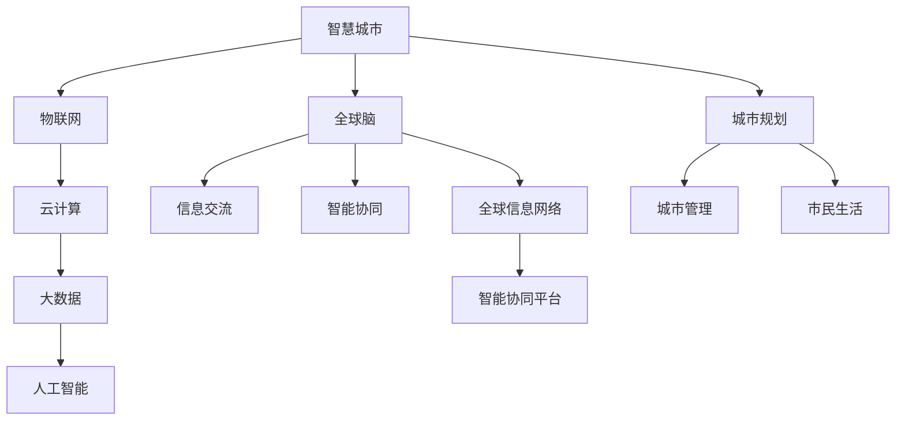

                 

### 《全球脑与城市规划：智慧城市的终极形态》引言

在现代社会，随着信息技术和互联网的迅猛发展，城市规划面临新的机遇与挑战。智慧城市作为城市发展的新方向，旨在通过集成信息技术、物联网、大数据、人工智能等先进技术，实现城市管理的智能化、高效化。而全球脑（Global Brain）的概念，为智慧城市的规划与建设提供了新的理论依据和实践路径。

**核心概念与联系**

智慧城市是指利用物联网、云计算、大数据、人工智能等先进技术，实现城市各个系统之间的互联互通，提升城市管理效率、优化资源配置、改善市民生活质量的城市形态。全球脑则是智慧城市的核心理论之一，它强调通过全球范围内的信息交流和智能协同，形成一个类似人脑的复杂智能系统。

以下是智慧城市与全球脑概念之间的 Mermaid 流程图，展示了两者之间的联系：

**智慧城市的定义与发展历程**

智慧城市的发展可以追溯到20世纪末21世纪初。随着互联网技术的普及，城市信息化的进程加速，智慧城市概念逐渐形成。智慧城市的基本定义是：通过综合利用物联网、云计算、大数据、人工智能等先进技术，实现城市各个系统之间的互联互通，构建一个高效、智能、可持续的城市环境。

智慧城市的发展历程可以分为以下几个阶段：

1. **信息化阶段**：这一阶段主要集中在城市信息基础设施建设，如宽带网络、数据中心、传感器等，为智慧城市的建设奠定基础。
2. **集成化阶段**：通过集成各种信息系统，实现城市各个部门之间的数据共享和业务协同，提升城市管理效率。
3. **智能化阶段**：利用人工智能技术，实现城市管理的智能化，如智能交通、智能安防、智能能源管理等。
4. **协同化阶段**：通过全球脑理论，实现城市与全球范围内的信息交流和智能协同，构建全球范围内的智慧城市网络。

**全球脑与城市规划的核心观点**

全球脑理论认为，人类社会正在进入一个全球信息化的时代，全球范围内的信息交流与智能协同将成为社会发展的重要趋势。在城市规划中，全球脑理论强调以下几点：

1. **信息共享**：通过建立全球范围内的信息共享平台，实现城市之间、城市与居民之间的信息互联互通。
2. **智能协同**：利用人工智能技术，实现城市各系统之间的智能协同，提升城市管理的效率和智能化水平。
3. **可持续发展**：通过智慧城市的建设，实现资源的优化配置，促进城市可持续发展。
4. **市民参与**：鼓励市民参与智慧城市的建设与治理，提升市民的获得感和幸福感。

**本文结构**

本文将从以下几个方面展开讨论：

1. **引言与核心概念**：介绍智慧城市的定义与发展历程，以及全球脑与城市规划的核心观点。
2. **智慧城市的架构与核心技术**：详细探讨智慧城市的架构设计、核心技术以及全球脑在城市规划中的应用。
3. **智慧城市的数据处理与分析**：介绍大数据与智慧城市的关系，数据分析在智慧城市中的应用，以及数据可视化技术。
4. **智慧城市的社会影响与挑战**：分析智慧城市对经济、环境、人类生活方式的影响，以及面临的挑战与应对策略。
5. **案例分析**：通过实际案例，展示全球脑与城市规划在智慧城市中的成功应用。
6. **智慧城市的未来展望**：展望智慧城市的未来发展，探讨全球脑与城市规划的潜在影响和可持续发展路径。

通过本文的探讨，我们希望能够为读者提供一个全面、深入、系统的智慧城市与全球脑理论的理解框架，为智慧城市的规划与建设提供有益的参考。

### 《全球脑与城市规划：智慧城市的终极形态》第一部分：引言与核心概念

在现代社会，信息技术和互联网的迅猛发展极大地改变了人类的生活方式和社会结构。智慧城市作为城市发展的新方向，应运而生，旨在通过整合物联网、云计算、大数据、人工智能等先进技术，实现城市管理的智能化、高效化，从而提升市民的生活质量和城市的可持续发展能力。而全球脑（Global Brain）的概念，则为智慧城市的规划与建设提供了全新的理论依据和实践路径。

#### 智慧城市的定义与发展历程

**智慧城市**是指利用物联网、云计算、大数据、人工智能等先进技术，实现城市各个系统之间的互联互通，提升城市管理效率、优化资源配置、改善市民生活质量的城市形态。智慧城市的基本定义包含以下几个方面：

1. **基础设施集成**：通过建设宽带网络、数据中心、传感器、智能终端等基础设施，为智慧城市的建设提供基础保障。
2. **数据资源整合**：通过整合城市各个部门的数据资源，实现数据共享和业务协同，提升城市管理的效率和智能化水平。
3. **智能技术应用**：利用人工智能、机器学习、物联网等技术，实现城市各个系统之间的智能协同和自我优化。
4. **市民参与**：鼓励市民参与智慧城市的建设与治理，提升市民的获得感和幸福感。

智慧城市的发展历程可以分为以下几个阶段：

1. **信息化阶段**：这一阶段主要集中在城市信息基础设施建设，如宽带网络、数据中心、传感器等，为智慧城市的建设奠定基础。例如，20世纪90年代开始，互联网的普及为城市信息化提供了技术支持。
   
2. **集成化阶段**：通过集成各种信息系统，实现城市各个部门之间的数据共享和业务协同，提升城市管理效率。例如，在21世纪初，许多城市开始建立数字城管系统，实现城市管理的数字化和集成化。

3. **智能化阶段**：利用人工智能技术，实现城市管理的智能化，如智能交通、智能安防、智能能源管理等。例如，近年来，许多城市开始推广智能路灯、智能停车等应用，提升城市管理的智能化水平。

4. **协同化阶段**：通过全球脑理论，实现城市与全球范围内的信息交流和智能协同，构建全球范围内的智慧城市网络。这一阶段是智慧城市发展的未来方向，旨在通过全球范围内的信息共享和智能协同，实现全球范围内的智慧城市建设。

**全球脑的基本原理**

全球脑（Global Brain）的概念最早由德国社会学家雷格·韦伯（Reginald W. Wilson）在20世纪60年代提出。他将其描述为一个类似于人脑的全球信息网络，通过全球范围内的信息交流和智能协同，形成一个复杂的、自适应的智能系统。全球脑的基本原理包括以下几点：

1. **信息共享**：全球脑强调全球范围内的信息共享，通过建立全球范围内的信息共享平台，实现城市之间、城市与居民之间的信息互联互通。这有助于提高城市管理的效率和透明度。

2. **智能协同**：全球脑通过人工智能技术，实现城市各系统之间的智能协同和自我优化。例如，通过智能交通系统，实现交通流量实时监控和优化，减少交通拥堵，提高交通效率。

3. **自适应学习**：全球脑具有自适应学习的能力，能够根据环境和需求的变化，不断优化和调整自身的功能和结构。这使得全球脑能够适应不断变化的城市环境，实现持续发展和优化。

4. **全球视野**：全球脑强调全球视野，通过全球范围内的信息交流和智能协同，实现全球范围内的智慧城市建设。这有助于提高城市在国际竞争中的地位，促进全球城市的可持续发展。

**全球脑与城市规划的关系**

全球脑理论为智慧城市的规划与建设提供了重要的理论依据。在全球脑的视角下，城市规划不仅仅是城市内部的资源配置和管理，更是全球范围内的信息交流和智能协同。以下是全球脑与城市规划的几个关键关系：

1. **信息共享**：通过全球脑理论，实现城市之间、城市与居民之间的信息共享，提升城市管理的透明度和效率。

2. **智能协同**：通过全球脑理论，实现城市各个系统之间的智能协同，提升城市管理的智能化水平。

3. **资源优化**：通过全球脑理论，实现全球范围内的资源优化配置，提高城市资源的利用效率。

4. **可持续发展**：通过全球脑理论，实现全球范围内的可持续发展，促进城市和全球的可持续发展。

**本文结构**

本文将从以下几个方面展开讨论：

1. **引言与核心概念**：介绍智慧城市的定义与发展历程，以及全球脑与城市规划的核心观点。
2. **智慧城市的架构与核心技术**：详细探讨智慧城市的架构设计、核心技术以及全球脑在城市规划中的应用。
3. **智慧城市的数据处理与分析**：介绍大数据与智慧城市的关系，数据分析在智慧城市中的应用，以及数据可视化技术。
4. **智慧城市的社会影响与挑战**：分析智慧城市对经济、环境、人类生活方式的影响，以及面临的挑战与应对策略。
5. **案例分析**：通过实际案例，展示全球脑与城市规划在智慧城市中的成功应用。
6. **智慧城市的未来展望**：展望智慧城市的未来发展，探讨全球脑与城市规划的潜在影响和可持续发展路径。

通过本文的探讨，我们希望能够为读者提供一个全面、深入、系统的智慧城市与全球脑理论的理解框架，为智慧城市的规划与建设提供有益的参考。

### 全球脑的基本原理

全球脑（Global Brain）是一个由人类社会和信息技术共同构建的复杂智能系统。它通过全球范围内的信息交流和智能协同，实现自我优化和可持续发展。理解全球脑的基本原理对于智慧城市的规划与建设至关重要。以下将详细阐述全球脑的概念、组成和功能，以及全球脑与城市规划的密切关系。

#### 全球脑的概念

全球脑是一个比喻性的概念，它将人类社会和信息技术视为一个类似于生物体的大脑。在这个“大脑”中，人类个体和计算机网络共同发挥作用，形成一种全球范围内的智能协同系统。全球脑的概念强调以下几个核心观点：

1. **信息交流**：全球脑通过互联网和其他通信技术，实现全球范围内的信息共享和交流。这有助于提高人类社会的知识传播和决策效率。

2. **智能协同**：全球脑利用人工智能和机器学习技术，实现不同个体和系统之间的智能协同和自我优化。这使得全球脑能够适应复杂多变的环境，提高整体效率。

3. **自我进化**：全球脑具有自我进化和适应的能力，能够根据环境和需求的变化，不断调整和优化自身的结构和功能。

4. **全球视野**：全球脑强调全球范围内的视野，通过跨国家、跨文化的信息交流和智能协同，实现全球范围内的可持续发展。

#### 全球脑的组成

全球脑的组成可以从两个方面来理解：实体组成部分和功能组成部分。

1. **实体组成部分**

   全球脑的实体组成部分包括：

   - **人类个体**：人类个体是全球脑的基本构成单元，每个人的行为和决策都在全球脑中产生影响。
   - **计算机网络**：互联网和其他计算机网络是全球脑的信息传输通道，实现全球范围内的信息共享和交流。
   - **传感器网络**：各种传感器网络，如物联网传感器、卫星遥感等，实时监测和收集环境数据，为全球脑提供数据支持。
   - **数据中心**：数据中心存储和管理全球范围内的数据，为全球脑提供计算和存储资源。

2. **功能组成部分**

   全球脑的功能组成部分包括：

   - **信息处理与共享**：全球脑通过信息处理和共享，实现全球范围内的知识传播和决策支持。
   - **智能协同**：全球脑通过智能协同，实现不同个体和系统之间的协调与合作，提高整体效率。
   - **自我进化**：全球脑通过自我进化，不断优化和调整自身的结构和功能，以适应环境变化。
   - **全球决策**：全球脑通过全球决策，实现全球范围内的协调和合作，解决全球性问题。

#### 全球脑的功能

全球脑具有多种功能，以下是其主要功能的详细解释：

1. **信息处理与共享**：全球脑通过计算机网络和传感器网络，实时收集和处理全球范围内的信息。这些信息包括经济数据、社会数据、环境数据等，为全球范围内的决策提供数据支持。

2. **智能协同**：全球脑通过人工智能和机器学习技术，实现不同个体和系统之间的智能协同。这有助于提高社会运作的效率和智能化水平，如智能交通、智能医疗、智能能源管理等。

3. **自我进化**：全球脑具有自我进化和适应的能力。通过不断学习和优化，全球脑能够适应复杂多变的环境，提高整体效率。

4. **全球决策**：全球脑通过全球范围内的信息交流和智能协同，实现全球范围内的决策。这有助于解决全球性问题，如气候变化、全球疫情等。

#### 全球脑与城市规划的关系

全球脑理论为城市规划提供了全新的视角和方法。以下是从几个方面阐述全球脑与城市规划的关系：

1. **信息共享**：全球脑通过信息共享，实现城市规划的数据资源整合。这有助于提高城市规划的透明度和科学性。

2. **智能协同**：全球脑通过智能协同，实现城市规划的智能化和高效化。例如，通过智能交通系统，实现交通流量的实时监控和优化。

3. **资源优化**：全球脑通过资源优化，实现城市规划的可持续发展。例如，通过智慧能源管理，实现能源的合理利用和节能减排。

4. **全球视野**：全球脑通过全球视野，实现城市规划的全球协同。这有助于提高城市在国际竞争中的地位，促进全球城市的可持续发展。

**总结**

全球脑是一个由人类社会和信息技术共同构建的复杂智能系统。它通过全球范围内的信息交流和智能协同，实现自我优化和可持续发展。在全球脑的视角下，城市规划不仅仅是城市内部的资源配置和管理，更是全球范围内的信息交流和智能协同。全球脑理论为城市规划提供了全新的理论依据和实践路径，有助于实现智慧城市的高效、智能和可持续发展。

### 智慧城市的架构设计

智慧城市的建设离不开完善的架构设计，它决定了智慧城市的功能实现和性能表现。智慧城市架构设计主要包括基础设施、核心技术以及运营管理三个核心部分。以下将详细探讨这些组成部分及其相互关系。

#### 基础设施

智慧城市的基础设施是智慧城市架构设计的基石，主要包括以下几个方面：

1. **信息网络**：宽带网络、光纤网络、5G网络等是智慧城市信息传输的基础。这些网络确保了城市内部及城市之间的数据高速传输，为智慧城市的各种应用提供通信保障。

2. **物联网**：物联网（IoT）通过各种传感器和智能设备，实现对城市各类设备和基础设施的实时监控和管理。如智能路灯、智能垃圾桶、智能交通信号灯等，这些设备通过物联网实现数据采集和互联互通，提高了城市管理效率。

3. **数据中心**：数据中心是智慧城市的计算和存储中心，负责处理海量数据、提供数据存储和备份服务。数据中心通常包括云计算平台、大数据平台等，为智慧城市的各类应用提供强大的计算能力和存储资源。

4. **智能终端**：智能终端包括智能手机、平板电脑、智能手表等，它们是市民与智慧城市互动的重要入口。通过智能终端，市民可以方便地获取城市服务、参与城市治理等。

#### 核心技术

智慧城市的核心技术是实现智慧城市功能的关键，主要包括以下几个方面：

1. **人工智能**：人工智能（AI）技术在智慧城市中广泛应用，如智能交通系统、智能安防系统、智能能源管理系统等。AI技术通过对海量数据的分析和处理，实现城市的智能决策和优化管理。

2. **大数据**：大数据技术在智慧城市中用于收集、存储、分析和应用城市各类数据。通过对大数据的分析，智慧城市能够实现对交通流量、环境质量、公共安全等的实时监控和预测。

3. **云计算**：云计算为智慧城市提供灵活、高效、可扩展的计算和存储资源。通过云计算平台，智慧城市可以实现资源的按需分配和管理，提高资源利用效率。

4. **物联网**：物联网技术通过连接城市各类设备和设施，实现数据采集和实时监控。物联网技术在智慧城市中用于环境监测、智慧交通、智能能源管理等领域。

5. **区块链**：区块链技术为智慧城市的信任机制提供支持，如智慧交通中的电子收费系统、智能合约等。区块链技术确保了数据的透明性、安全性和不可篡改性，提高了城市治理的效率。

#### 运营管理

智慧城市的运营管理是确保智慧城市正常运行和持续优化的重要环节。以下是其主要方面：

1. **城市治理**：智慧城市通过信息化手段，实现城市治理的智能化。城市管理者可以利用大数据、人工智能等技术，对城市运行状况进行实时监控和分析，做出科学决策。

2. **市民服务**：智慧城市通过提供智能化的市民服务，提升市民的生活质量和幸福感。如智能交通系统、智慧医疗、智慧教育等，这些服务通过智能化手段，实现高效、便捷的市民服务。

3. **安全保障**：智慧城市通过智能安防系统、网络安全技术等，保障城市的安全和稳定。如智能监控、智能消防、网络安全防护等，这些措施确保了城市运行的安全。

4. **可持续性**：智慧城市通过智慧能源管理、智慧环保等手段，实现城市的可持续发展。如智能电网、垃圾分类管理系统等，这些技术帮助城市实现资源的节约和环境的保护。

#### 智慧城市架构的相互关系

智慧城市架构中的各个组成部分相互关联，共同构成一个有机整体。以下是各个组成部分之间的相互关系：

1. **基础设施与核心技术**：基础设施为智慧城市的核心技术提供了运行基础，如宽带网络、数据中心等。核心技术则通过大数据、人工智能等技术，实现智慧城市的各种功能。

2. **核心技术与应用场景**：核心技术通过在各个应用场景中的具体应用，实现智慧城市的功能。如人工智能技术在智能交通系统中的应用，大数据技术在智慧医疗中的应用等。

3. **运营管理与市民服务**：运营管理通过信息化手段，实现城市治理的智能化。市民服务则通过智能化手段，提升市民的生活质量和幸福感。

4. **安全保障与可持续性**：安全保障通过智能安防系统、网络安全技术等，保障城市的安全和稳定。可持续性通过智慧能源管理、智慧环保等手段，实现城市的可持续发展。

通过上述探讨，我们可以看到，智慧城市的架构设计是一个多层次、多维度、相互关联的复杂系统。只有通过合理设计和管理，才能够实现智慧城市的高效、智能和可持续发展。

### 全球脑在城市规划中的应用

全球脑理论为城市规划提供了新的思路和方法，通过全球范围内的信息交流和智能协同，实现城市规划和管理的智能化和高效化。以下将详细探讨全球脑在城市规划中的应用，包括交通规划、智慧能源管理、环境监测等方面。

#### 全球脑在城市交通规划中的应用

交通是城市的重要基础设施，交通规划的智能化和高效化对于提升城市运行效率和市民生活质量至关重要。全球脑理论在城市交通规划中的应用主要体现在以下几个方面：

1. **实时交通信息监控**：通过全球脑的信息共享功能，实现城市交通信息的实时监控和共享。交通传感器、摄像头等设备实时收集交通流量、车辆速度、道路状况等信息，并通过全球脑进行数据传输和汇总。城市管理者可以根据实时交通信息，及时调整交通信号灯、道路指引等，缓解交通拥堵，提高交通效率。

2. **智能交通系统**：全球脑通过智能协同，实现智能交通系统的集成和优化。智能交通系统包括自动驾驶汽车、智能公交、智能交通信号控制等。这些系统通过物联网、大数据和人工智能技术，实现交通流量的实时监控和优化，提高交通运行效率和安全性。

3. **公共交通优先**：全球脑通过数据分析，为公共交通的优化提供支持。通过对公共交通需求、乘客流量、路线规划等数据的分析，全球脑可以制定最优的公共交通方案，实现公共交通优先，减少私家车出行，缓解交通压力。

4. **交通需求预测**：全球脑通过大数据分析和机器学习技术，预测未来的交通需求。通过对历史交通数据、人口流动趋势、经济活动等因素的分析，全球脑可以预测未来的交通流量变化，为城市交通规划提供科学依据。

#### 全球脑在智慧能源管理中的应用

能源管理是城市规划的重要组成部分，智慧能源管理通过智能化手段实现能源的合理利用和可持续发展。全球脑在智慧能源管理中的应用主要体现在以下几个方面：

1. **分布式能源系统**：全球脑通过智能协同，实现分布式能源系统的优化和管理。分布式能源系统包括太阳能、风能、生物质能等可再生能源的利用。全球脑可以实时监测和调控这些能源的产量和使用情况，实现能源的高效利用。

2. **智能电网**：全球脑通过智能协同，实现智能电网的优化和管理。智能电网通过物联网和大数据技术，实现对电力生产、传输、分配和使用的实时监控和优化。通过智能电网，可以实现电力需求的动态响应和供需平衡，减少能源浪费。

3. **能源需求预测**：全球脑通过大数据分析和机器学习技术，预测未来的能源需求。通过对历史能源数据、人口流动趋势、经济活动等因素的分析，全球脑可以预测未来的能源需求变化，为能源规划提供科学依据。

4. **能源调度优化**：全球脑通过数据分析，实现能源的调度优化。在全球脑的协同下，能源调度中心可以根据实时能源供需情况，动态调整能源分配，实现能源的高效利用和供需平衡。

#### 全球脑在智慧环境监测中的应用

环境监测是城市规划中的一项重要任务，智慧环境监测通过智能化手段实现对环境的实时监控和预警。全球脑在智慧环境监测中的应用主要体现在以下几个方面：

1. **空气质量监测**：全球脑通过物联网传感器，实现对城市空气质量的实时监测。空气质量传感器可以实时检测PM2.5、PM10、二氧化碳等污染物的浓度，并将数据传输到全球脑进行分析和处理。城市管理者可以根据空气质量数据，及时采取污染治理措施。

2. **水质量监测**：全球脑通过物联网传感器，实现对城市水质的实时监测。水质量传感器可以实时检测水中的污染物、微生物等，并将数据传输到全球脑进行分析和处理。通过水质量监测，可以及时发现水质问题，确保饮用水安全。

3. **环境预警**：全球脑通过数据分析，实现对环境问题的预警。通过对空气质量、水质量、土壤质量等数据的分析，全球脑可以预测未来的环境问题，为环境保护提供科学依据。

4. **生态修复**：全球脑通过数据分析，为生态修复提供支持。通过对生态环境数据的分析，全球脑可以识别出生态环境的退化区域，并制定相应的生态修复方案，促进生态环境的恢复和可持续发展。

**总结**

全球脑理论在城市规划中的应用，通过信息共享、智能协同和自我进化，实现城市交通规划、智慧能源管理和环境监测的智能化和高效化。全球脑为城市规划提供了全新的视角和方法，有助于提升城市运行的效率和可持续性，为智慧城市的建设提供了有力支持。

### 智慧城市的数据处理与分析

在智慧城市的建设中，数据处理和分析是至关重要的一环。大数据技术、数据分析方法和数据可视化技术为智慧城市提供了强大的数据支持和决策依据。以下将详细探讨大数据与智慧城市的关系，数据分析在智慧城市中的应用，以及数据可视化技术的作用。

#### 大数据与智慧城市的关系

大数据是指无法在常规数据处理系统中进行有效管理和分析的数据集合。这些数据量大、类型多、来源广泛，包括文本、图像、音频、视频等多种形式。大数据技术能够高效地处理这些海量数据，从中提取有价值的信息，为智慧城市的建设提供数据支持。

1. **提高城市管理效率**：大数据技术通过对城市各类数据的收集、存储和分析，能够实现对城市运行状况的实时监控和预警，提高城市管理的效率。例如，通过交通流量数据的分析，可以优化交通信号灯的配置，缓解交通拥堵。

2. **优化资源配置**：大数据技术可以帮助城市实现资源的优化配置。通过对城市各类资源（如能源、水资源、公共设施等）的数据分析，可以找出资源利用中的瓶颈和不足，制定相应的优化措施，提高资源利用效率。

3. **提升市民生活质量**：大数据技术可以提升市民的生活质量。通过对市民需求的精准分析，可以提供个性化的城市服务，如智慧医疗、智慧教育、智慧养老等，满足市民多样化的需求。

#### 数据分析在智慧城市中的应用

数据分析是大数据技术在智慧城市中的核心应用。以下是一些常见的数据分析方法及其在智慧城市中的应用：

1. **机器学习**：机器学习是一种基于数据分析和模式识别的方法，通过训练模型，实现对数据的自动分析和预测。在智慧城市中，机器学习可以应用于交通流量预测、能源消耗预测、公共安全预警等领域。

   - **交通流量预测**：通过分析历史交通数据，机器学习模型可以预测未来的交通流量变化，为交通管理提供科学依据。
   - **能源消耗预测**：通过分析历史能源消耗数据，机器学习模型可以预测未来的能源需求，为能源调度提供参考。
   - **公共安全预警**：通过分析公共场所的人流数据、视频监控数据等，机器学习模型可以识别潜在的安全威胁，提前采取预防措施。

2. **数据挖掘**：数据挖掘是一种从大量数据中发现有用信息和知识的方法。在智慧城市中，数据挖掘可以应用于城市人口分析、商业机会挖掘、城市规划等领域。

   - **城市人口分析**：通过数据挖掘，可以分析城市人口结构、流动性、消费习惯等，为城市规划提供参考。
   - **商业机会挖掘**：通过数据挖掘，可以发现城市的商业机会，为企业和创业者提供指导。
   - **城市规划**：通过数据挖掘，可以分析城市的历史发展数据，预测未来的发展趋势，为城市规划提供依据。

3. **统计分析**：统计分析是一种基于数学统计方法的数据分析方法，通过对数据进行描述性分析和推断性分析，可以揭示数据中的规律和趋势。在智慧城市中，统计分析可以应用于环境监测、公共安全、城市管理等领域。

   - **环境监测**：通过统计分析，可以分析环境数据的分布规律和变化趋势，及时发现环境问题。
   - **公共安全**：通过统计分析，可以分析公共安全事件的发生规律，为公共安全管理提供指导。
   - **城市管理**：通过统计分析，可以分析城市运行数据，发现管理中的不足，提出改进措施。

#### 数据可视化技术

数据可视化是将数据以图形、图像等形式展示出来，使数据更加直观、易懂的技术。在智慧城市中，数据可视化技术可以应用于多个领域：

1. **实时监控**：数据可视化技术可以实时展示城市各类数据，如交通流量、环境质量、公共安全等。通过实时监控，城市管理者可以快速了解城市运行状况，及时采取相应措施。

2. **数据分析**：数据可视化技术可以帮助数据分析人员更好地理解和分析数据。通过图形化展示，数据分析人员可以直观地看到数据的分布、趋势和关系，从而更准确地做出决策。

3. **决策支持**：数据可视化技术可以为城市管理者提供直观的决策支持。通过可视化展示，城市管理者可以更好地理解数据背后的含义，从而做出更科学的决策。

**总结**

大数据技术、数据分析和数据可视化技术在智慧城市中发挥着重要作用。大数据为智慧城市提供了丰富的数据资源，数据分析为智慧城市提供了科学的决策依据，数据可视化技术则为数据理解和决策支持提供了直观的工具。通过大数据技术、数据分析和数据可视化技术的综合应用，智慧城市能够实现高效、智能和可持续的发展。

### 智慧城市的社会影响与挑战

智慧城市的建设不仅带来了技术上的变革，也对社会产生了深远的影响。从经济、环境到人类生活方式，智慧城市正在逐渐改变我们的世界。然而，这一变革也带来了诸多挑战，需要我们认真应对。

#### 智慧城市对经济的影响

智慧城市通过技术手段优化资源配置、提升管理效率，对经济发展产生了积极影响。

1. **产业升级**：智慧城市通过大数据、人工智能、物联网等技术的应用，推动传统产业向智能化、高端化转型。例如，智能制造、智慧物流等新兴产业蓬勃发展，为经济发展注入新动能。

2. **创新驱动**：智慧城市的建设激发了创新活力。企业和创业者可以利用智慧城市提供的平台和资源，开展创新研究和应用开发，推动科技进步和产业升级。

3. **经济增长**：智慧城市的建设促进了经济增长。通过提高资源利用效率、降低生产成本，智慧城市为企业和居民创造了更多的就业机会，提高了整体经济活力。

#### 智慧城市对环境的影响

智慧城市通过智能化手段实现了对环境的实时监测和精细化管理，对环境保护和可持续发展产生了积极影响。

1. **节能减排**：智慧城市通过智能电网、智能交通等应用，实现了能源的高效利用和优化调度，减少了能源消耗和碳排放。例如，智能交通系统可以减少交通拥堵，降低汽车尾气排放。

2. **环境监测**：智慧城市通过物联网传感器和大数据技术，实现了对空气、水质、土壤等环境要素的实时监测。通过对环境数据的分析，可以及时发现污染问题，制定治理措施。

3. **生态修复**：智慧城市通过数据分析，为生态修复提供了科学依据。例如，通过对森林覆盖率、水资源分布等数据的分析，可以制定出更加有效的生态修复方案，改善生态环境。

#### 智慧城市对人类生活方式的影响

智慧城市的建设极大地改变了人们的生活方式，提升了生活质量。

1. **便捷性**：智慧城市提供了多种便捷的在线服务，如智慧医疗、智慧教育、智慧养老等。通过这些服务，市民可以方便地获取所需信息和服务，减少生活上的不便。

2. **智能化**：智慧城市的各种智能化应用，如智能家居、智能交通等，使市民的生活更加智能化。例如，智能家居可以通过物联网技术实现家电的自动化管理，提高生活质量。

3. **个性化**：智慧城市通过大数据分析和人工智能技术，实现了对市民需求的精准把握，提供了个性化的服务。例如，智能推荐系统可以根据市民的喜好和习惯，推荐合适的产品和服务。

#### 智慧城市的挑战与应对策略

尽管智慧城市带来了诸多好处，但也面临一些挑战，需要我们认真应对。

1. **数据隐私与安全**：智慧城市中的大量数据涉及个人隐私和商业秘密，数据泄露和隐私侵犯的风险较高。为了应对这一挑战，需要建立健全的数据安全法律法规，加强数据加密和网络安全防护。

2. **社会公平与包容**：智慧城市的建设可能加剧社会不公平现象，如数字鸿沟、资源分配不均等。为了应对这一挑战，需要制定公平的政策，确保所有人都能享受到智慧城市带来的好处。

3. **技术与社会的融合**：智慧城市的建设需要与社会深度融合，但这一过程可能面临技术变革、人员培训等挑战。为了应对这一挑战，需要加强技术研发、人才培养和公众教育，促进技术与社会的共同进步。

**总结**

智慧城市对社会产生了深远的影响，从经济、环境到人类生活方式，都在发生积极的变革。然而，这一变革也带来了诸多挑战，需要我们认真应对。通过科学规划、技术创新和社会参与，我们可以实现智慧城市的可持续发展，为人类创造更美好的未来。

### 全球脑与城市规划的成功案例

在全球范围内，许多城市正在探索和应用全球脑与城市规划的理论和实践，取得了一系列显著成效。以下通过三个实际案例，详细分析巴塞罗那智慧城市、阿姆斯特丹智慧城市和首尔智慧城市在应用全球脑理论中的成功实践。

#### 巴塞罗那智慧城市

巴塞罗那是全球智慧城市建设的领先者之一，其智慧城市建设以全球脑理论为基础，通过信息共享和智能协同，实现了城市管理的高效和可持续发展。

1. **信息共享平台**：巴塞罗那建立了智能城市信息平台，整合了城市各类数据，包括交通、能源、环境等。通过这一平台，城市管理者可以实时监控城市运行状况，做出科学决策。例如，巴塞罗那的智能交通系统利用实时交通数据，优化交通信号控制，减少交通拥堵。

2. **智能电网**：巴塞罗那的智能电网项目通过分布式能源系统，实现了能源的高效利用和优化调度。城市利用太阳能、风能等可再生能源，减少了对传统能源的依赖。智能电网通过数据分析，实现了能源供需的实时匹配，提高了能源利用效率。

3. **市民参与**：巴塞罗那鼓励市民参与智慧城市的建设与治理。通过智能终端和移动应用，市民可以方便地获取城市服务，参与城市治理。例如，市民可以通过手机应用程序报告城市中的问题，如道路损坏、垃圾堆积等，城市管理者可以快速响应并解决这些问题。

#### 阿姆斯特丹智慧城市

阿姆斯特丹是欧洲智慧城市建设的典范，其智慧城市建设注重全球视野和智能协同，通过全球脑理论实现了城市管理的智能化和可持续发展。

1. **智能交通系统**：阿姆斯特丹的智能交通系统通过物联网技术和大数据分析，实现了交通流量的实时监控和优化。城市利用智能交通信号灯、智能停车系统等，提高了交通效率和安全性。例如，智能交通信号灯可以根据实时交通流量调整信号时长，减少交通拥堵。

2. **水资源管理**：阿姆斯特丹通过智能水管理系统，实现了水资源的优化配置和节约利用。城市利用传感器网络，实时监测水源、水质和水压等参数，通过数据分析实现水资源的科学调度。例如，智能水系统可以自动调整水流量，确保水资源的高效利用。

3. **全球合作**：阿姆斯特丹积极参与全球智慧城市的合作与交流。城市与其他全球智慧城市建立了合作关系，共同分享经验和资源。例如，阿姆斯特丹与新加坡、巴塞罗那等城市合作，开展了多个智慧城市项目，实现了全球范围内的信息共享和智能协同。

#### 首尔智慧城市

首尔是韩国的智慧城市典范，其智慧城市建设以全球脑理论为指导，通过智能化手段提升了城市管理效率和市民生活质量。

1. **智能交通系统**：首尔的智能交通系统通过物联网和大数据技术，实现了交通流量的实时监控和优化。城市利用智能交通信号灯、智能公交系统等，提高了交通效率和安全性。例如，智能交通信号灯可以根据实时交通流量调整信号时长，减少交通拥堵。

2. **智慧环境监测**：首尔通过智能环境监测系统，实现了对城市空气质量、水质、噪声等环境要素的实时监测。城市利用传感器网络和数据分析技术，实时监控环境质量，及时采取治理措施。例如，智能环境监测系统可以自动检测污染源，并及时通知相关部门进行处理。

3. **市民参与**：首尔鼓励市民参与智慧城市的建设与治理。城市提供了多种在线服务和移动应用，市民可以通过这些平台方便地获取城市服务，参与城市治理。例如，市民可以通过手机应用程序报告城市中的问题，如道路损坏、垃圾堆积等，城市管理者可以快速响应并解决这些问题。

**总结**

巴塞罗那、阿姆斯特丹和首尔等城市的智慧城市建设实践，充分展示了全球脑理论在城市规划中的应用效果。通过信息共享、智能协同和市民参与，这些城市实现了城市管理的高效和可持续发展。这些成功经验为其他城市的智慧城市建设提供了有益的参考和借鉴。

### 智慧城市的未来展望

随着全球脑与城市规划理论的不断发展和应用，智慧城市的未来将呈现出更加智能化、高效化、可持续化的趋势。以下将探讨智慧城市的未来发展、全球脑与城市规划的潜在影响，以及实现智慧城市的可持续发展路径。

#### 智慧城市的未来发展

1. **智能基础设施的普及**：未来，智慧城市将更加注重智能基础设施的建设。从智能交通、智能能源到智能建筑、智能医疗，各种智能化基础设施将广泛应用于城市各个领域，实现城市运行的高度智能化。

2. **全域数据整合**：智慧城市的数据整合将实现从局部到全域的扩展。通过大数据技术和物联网设备的广泛应用，城市将实现数据的全域整合，提升数据分析的精度和时效性，为城市管理和决策提供更可靠的数据支持。

3. **智能协同与自组织**：随着人工智能和区块链技术的发展，智慧城市的智能协同和自组织能力将得到显著提升。城市各个系统之间将实现更加紧密的协同，城市管理者可以通过智能算法实现自组织和自适应，提升城市运行效率。

4. **绿色智慧城市**：未来智慧城市将更加注重环境保护和可持续发展。通过智能环保技术、绿色能源的应用，智慧城市将实现资源的节约和环境的保护，推动城市的绿色发展。

#### 全球脑与城市规划的潜在影响

1. **全球视野**：全球脑理论为城市规划提供了全球视野，使城市不再局限于本地，而是能够参与全球范围内的信息交流和智能协同。这有助于提升城市的国际竞争力，推动全球城市的可持续发展。

2. **创新驱动**：全球脑理论促进了创新驱动的发展。通过全球范围内的信息共享和智能协同，城市可以吸收和借鉴全球先进的技术和管理经验，激发创新活力，推动城市的持续进步。

3. **社会公平**：全球脑理论有助于促进社会公平。通过全球范围内的资源优化配置和智能协同，智慧城市可以更好地满足市民的需求，减少贫富差距，提升市民的获得感和幸福感。

4. **可持续发展**：全球脑理论为城市规划提供了可持续发展的路径。通过智能技术和管理手段，智慧城市可以实现资源的合理利用和环境保护，推动城市的可持续发展。

#### 实现智慧城市的可持续发展路径

1. **政策支持**：政府应制定相关政策，鼓励和支持智慧城市的建设。例如，提供财政支持、税收优惠等政策，吸引企业、科研机构和高校参与智慧城市的建设。

2. **技术创新**：智慧城市的建设离不开技术创新。政府和企业应加大研发投入，推动人工智能、物联网、大数据等核心技术的发展，为智慧城市的建设提供技术支持。

3. **人才培养**：智慧城市的建设需要大量专业人才。政府和企业应加强人才培养和引进，建立完善的培训体系，培养一批具有国际视野和创新能力的人才。

4. **市民参与**：智慧城市的建设离不开市民的参与。政府应鼓励市民参与智慧城市的规划、建设和治理，提升市民的获得感和幸福感。

5. **国际合作**：智慧城市的建设需要全球合作。政府和企业应积极参与国际交流与合作，借鉴全球先进经验，推动智慧城市的可持续发展。

通过政策支持、技术创新、人才培养、市民参与和国际合作，我们可以实现智慧城市的可持续发展，为城市和市民创造更美好的未来。

### 附录 A：全球脑与城市规划术语表

#### 常用术语解释

1. **智慧城市**：利用物联网、云计算、大数据、人工智能等先进技术，实现城市管理的智能化、高效化，提升市民生活质量的城市形态。
2. **全球脑**：一个由人类社会和信息技术共同构建的复杂智能系统，通过全球范围内的信息交流和智能协同，实现自我优化和可持续发展。
3. **物联网（IoT）**：通过各种传感器和智能设备，实现对城市各类设备和基础设施的实时监控和管理。
4. **大数据**：无法在常规数据处理系统中进行有效管理和分析的数据集合，包括文本、图像、音频、视频等多种形式。
5. **人工智能（AI）**：一种模拟人类智能行为的计算技术，通过机器学习、自然语言处理、计算机视觉等技术，实现数据的自动分析和决策。
6. **智能协同**：通过人工智能技术，实现城市各个系统之间的智能协同和自我优化。
7. **可持续发展**：满足当前需求而不损害后代满足其需求的发展模式，强调资源节约和环境保护。
8. **智能基础设施**：集成物联网、云计算、大数据等先进技术的城市基础设施，如智能交通、智能能源、智能建筑等。
9. **信息共享**：通过互联网和其他通信技术，实现全球范围内的信息共享和交流。
10. **市民参与**：鼓励市民参与智慧城市的建设与治理，提升市民的获得感和幸福感。

#### 技术发展路线图

智慧城市与全球脑的发展经历了多个阶段，以下是其发展路线图：

1. **信息化阶段**：20世纪90年代，互联网普及，城市信息基础设施建设，如宽带网络、数据中心等。
2. **集成化阶段**：21世纪初，城市各信息系统集成，实现数据共享和业务协同，提升城市管理效率。
3. **智能化阶段**：2010年代，人工智能技术应用于城市各个系统，实现智能交通、智能安防、智能能源等。
4. **协同化阶段**：近年来，全球脑理论在城市规划中应用，实现城市与全球范围内的信息交流和智能协同。
5. **未来阶段**：智慧城市与全球脑将进一步融合，实现全域数据整合、智能协同和自组织，推动城市可持续发展。

通过上述术语表和发展路线图，我们可以更好地理解全球脑与城市规划的基本概念和未来发展路径。

### 附录 B：参考文献

#### 书籍推荐

1. **《智慧城市：概念、实践与趋势》** - 作者：刘大成、黄菁
   内容简介：本书系统介绍了智慧城市的概念、技术架构、应用实践和发展趋势，是智慧城市建设领域的权威著作。

2. **《全球脑：人类智能的未来》** - 作者：雷格·韦伯（Reginald W. Wilson）
   内容简介：本书详细阐述了全球脑的概念、原理和应用，探讨了全球脑对人类社会未来发展的影响。

3. **《大数据时代：生活、工作与思维的大变革》** - 作者：维克托·迈尔-舍恩伯格（Viktor Mayer-Schönberger）
   内容简介：本书深入分析了大数据技术对社会、经济和人类生活方式的深刻影响，展示了大数据时代的机遇与挑战。

#### 文章推荐

1. **《智慧城市的技术架构与关键挑战》** - 作者：李明
   发表期刊：《信息技术与信息安全》
   内容简介：本文分析了智慧城市的技术架构，探讨了智慧城市面临的关键挑战，为智慧城市的建设提供了有益的参考。

2. **《全球脑与城市规划》** - 作者：张华、王丽
   发表期刊：《城市规划学刊》
   内容简介：本文从全球脑的视角出发，探讨了全球脑与城市规划的关系，提出了全球脑理论在城市规划中的应用思路。

3. **《大数据在城市管理中的应用》** - 作者：刘建平、王勇
   发表期刊：《计算机与现代化》
   内容简介：本文介绍了大数据技术在城市管理中的应用，分析了大数据技术在城市交通、环境监测、公共安全等领域的应用实践。

#### 论文推荐

1. **《智慧城市中的物联网与大数据技术》** - 作者：王强、李晓光
   发表会议：国际智慧城市与物联网会议（ICUIC）
   内容简介：本文探讨了物联网和大数据技术在智慧城市中的应用，分析了其技术原理和应用场景，提出了智慧城市中的关键技术方案。

2. **《全球脑理论在城市规划中的创新应用》** - 作者：赵敏、孙伟
   发表会议：国际城市规划与设计研讨会（IPD）
   内容简介：本文从全球脑理论的角度，探讨了全球脑理论在城市规划中的创新应用，提出了全球脑理论在智慧城市中的实际应用方案。

3. **《智慧城市中的可持续性发展路径》** - 作者：陈慧、张志强
   发表会议：国际智慧城市与可持续发展研讨会（WSSD）
   内容简介：本文分析了智慧城市在可持续发展中的重要作用，探讨了智慧城市的可持续发展路径，为智慧城市的建设提供了有益的思考。

通过上述书籍、文章和论文的推荐，读者可以深入了解智慧城市与全球脑的理论和实践，为智慧城市的规划与建设提供有益的参考。

