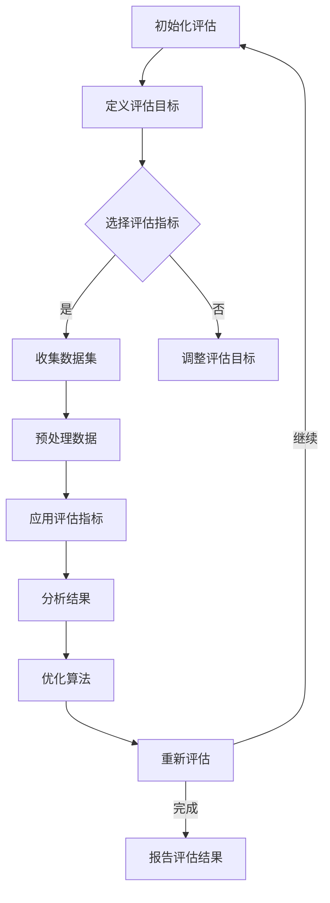
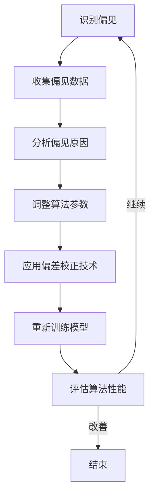

                 

# 公平与公正：确保人类计算的包容性和可访问性

## 关键词：
- 公平性
- 公正性
- 包容性
- 可访问性
- 计算机伦理学
- 算法偏见
- 可解释性人工智能
- 算法公平性评估
- 算法透明性
- 隐私保护

## 摘要：
本文旨在探讨公平与公正在人类计算中的重要性，以及如何确保计算技术的包容性和可访问性。通过分析计算机公平与公正的历史发展、理论基础、技术实现以及实践案例，本文提出了确保计算技术公平与公正的一系列策略和方法。文章结构包括四个主要部分：引言与背景、理论基础、技术实现、实践与案例。希望通过本文的探讨，能够为推动计算技术的公平与公正提供有价值的参考。

## 目录大纲：

### 第一部分：引言与背景
1. 公平与公正的概念
   - 1.1 公平的定义与重要性
   - 1.2 公正的内涵与价值
   - 1.3 人类计算的包容性与可访问性
2. 计算机公平与公正的历史发展
   - 2.1 公平性问题的起源
   - 2.2 公正性发展的里程碑
   - 2.3 包容性和可访问性的演进

### 第二部分：公平与公正的理论基础
1. 计算机伦理学
   - 3.1 伦理学的本质与作用
   - 3.2 计算机伦理学的基本原则
   - 3.3 公平与公正在计算机伦理学中的应用
2. 算法偏见与歧视
   - 4.1 算法偏见的概念与类型
   - 4.2 算法歧视的实证研究
   - 4.3 减少算法偏见的方法
3. 可解释性人工智能
   - 5.1 可解释性人工智能的定义与重要性
   - 5.2 可解释性人工智能的技术手段
   - 5.3 可解释性人工智能的应用与实践

### 第三部分：公平与公正的技术实现
1. 算法公平性评估方法
   - 6.1 公平性评估的基本框架
   - 6.2 数据集与指标的选择
   - 6.3 公平性评估工具与方法
2. 算法透明性与可追溯性
   - 7.1 透明性的定义与实现
   - 7.2 可追溯性的重要性
   - 7.3 透明性与可追溯性的技术解决方案
3. 隐私保护与数据伦理
   - 8.1 隐私保护的基本原则
   - 8.2 数据伦理与法律合规
   - 8.3 隐私保护技术与应用

### 第四部分：实践与案例
1. 公平与公正在AI应用中的实践
   - 9.1 医疗健康领域的实践
   - 9.2 金融行业的公平性实践
   - 9.3 教育公平的AI解决方案
2. 算法公平与公正的国际案例研究
   - 10.1 欧盟的GDPR与算法公平
   - 10.2 美国的算法公平立法
   - 10.3 其他国家的算法公平实践
3. 中国算法公平与公正的发展
   - 11.1 中国算法公平的政策与法规
   - 11.2 中国AI产业的公平性实践
   - 11.3 中国算法公平的未来展望

## 附录
- 附录A：计算机公平与公正的Mermaid流程图
  - A.1 公平性评估流程
  - A.2 算法偏见减少流程
- 附录B：算法公平性评估工具介绍
  - B.1 工具概述
  - B.2 工具功能与使用方法
- 附录C：参考文献
  - C.1 相关书籍
  - C.2 学术论文
  - C.3 报告与政策文件

### 第一部分：引言与背景

### 第1章：公平与公正的概念

### 1.1 公平的定义与重要性

公平是一个多维度的概念，通常涉及到资源的分配、机会的均等以及结果的公正。在人类社会中，公平被视为一种基本的道德原则和社会目标，旨在消除不公平待遇，确保每个人都能享有平等的权利和机会。

在计算领域，公平的重要性体现在多个方面。首先，计算机技术和算法的广泛应用已经深刻影响了社会的各个方面，从医疗健康到金融行业，从教育到就业，都离不开计算技术的支持。因此，确保计算技术的公平性，能够防止技术偏见和歧视，保护每个人的权益。

其次，公平也是技术发展的动力源泉。一个公平的计算环境能够激发更多的创新和进步，因为它为所有人提供了平等的机会和资源。相反，如果计算技术不公平，可能会导致资源的集中和垄断，抑制社会整体的进步。

最后，公平性也是国际竞争的关键因素。在全球化的背景下，各国都在争夺计算技术的领先地位。一个公平、开放的计算环境能够吸引更多的人才和资源，增强国家的竞争力。

总之，公平是计算技术发展的基石，确保公平性是每一个计算从业者和政策制定者必须面对的挑战。

### 1.2 公正的内涵与价值

公正，与公平密切相关但又有其独特的内涵。公正，通常被理解为对每个人权利和义务的尊重，以及对所有人平等对待的承诺。在计算领域，公正的重要性不容忽视。

首先，公正在计算技术中体现为算法和系统的透明性和可解释性。当算法的决策过程是透明的，用户能够理解和追踪其工作原理，这就提高了算法的公正性。例如，在金融风险评估中，如果算法的决策是透明的，客户可以了解其风险评级是如何计算的，从而增强对决策的信任。

其次，公正也与算法的公平性评估紧密相关。通过公平性评估，我们可以检测算法是否存在偏见和歧视，并采取相应的措施进行修正。这种评估不仅有助于保护用户的权益，还能提高算法的可靠性和可信度。

此外，公正在计算技术中的价值还体现在它能够促进社会的和谐与稳定。一个公正的计算环境能够减少社会冲突，增强社会的凝聚力和互信。

总之，公正不仅是计算技术的道德要求，也是其技术发展和应用的重要保障。通过确保算法和系统的公正性，我们能够建立一个更加公平、公正的计算社会。

### 1.3 人类计算的包容性与可访问性

包容性与可访问性是确保计算公平与公正的重要方面。包容性指的是在计算技术的设计和应用中，充分考虑不同群体的需求，确保所有人都能公平地获得和使用计算资源。而可访问性则强调技术的易用性和无障碍性，使得不同能力和背景的用户都能轻松使用计算工具。

首先，包容性在计算中的应用体现在多个层面。在硬件层面，我们需要确保计算设备的多样性和普及性，使得不同社会经济地位的用户都能负担得起和使用。在软件层面，我们需要开发无障碍软件，使得视觉、听觉或其他能力有障碍的用户也能顺畅地使用计算技术。例如，屏幕阅读器等辅助技术可以帮助盲人用户浏览网页和操作计算机。

其次，可访问性在计算中的重要性也不容忽视。技术壁垒往往是阻碍人们获取和使用计算资源的主要障碍。通过提升技术的易用性，我们可以降低用户的学习成本，提高他们的使用频率和效率。例如，设计直观、用户友好的界面，简化操作流程，都是提高计算技术可访问性的有效方法。

在实际应用中，包容性和可访问性不仅有助于提高计算技术的公平性，还能带来显著的社会和经济效益。一个包容和可访问的计算环境能够吸引更多的用户和市场，促进技术的普及和应用，推动整个社会的发展。

总之，确保人类计算的包容性和可访问性，不仅是计算技术发展的必然要求，也是构建公平、公正社会的关键。通过持续的努力，我们可以打造一个更加包容、无障碍的计算世界。

### 2.1 公平性问题的起源

公平性问题的起源可以追溯到人类社会的早期。在农业社会，资源的分配不均导致了社会阶层的产生，这种不平等引发了诸多社会矛盾。随着社会的发展，公平性逐渐成为人们关注的焦点。在工业革命时期，劳动者的权益问题成为社会讨论的焦点，公平性开始与劳动权利紧密相连。

进入信息时代，计算机技术的飞速发展使公平性问题变得更为复杂和紧迫。早期的计算机技术主要应用于军事和科学领域，只有少数专业人士能够接触和利用。这使得技术资源高度集中，进一步加剧了社会的不公平。随着计算机技术的普及，越来越多的人开始接触和使用计算机，但技术本身的不公平仍然存在，如技术壁垒、数字鸿沟等问题。

在现代社会，计算机公平性问题体现在多个层面。一方面，硬件和软件的获取和使用仍然存在明显的经济差异，导致资源分配的不公平。另一方面，算法和系统的设计可能无意中产生偏见和歧视，影响了结果的公正性。此外，数字鸿沟的存在使得不同社会经济地位的群体在获得和使用计算资源上存在巨大差距。

总之，公平性问题在计算机技术中的起源与发展，与社会发展的历史进程密切相关。随着技术的不断进步，确保计算机的公平性已成为一项重要的社会任务，需要全社会共同努力。

### 2.2 公正性发展的里程碑

公正性在计算技术中的发展经历了多个重要的里程碑，这些里程碑不仅标志着技术的进步，也反映了社会对公平性需求的提升。

首先，计算机伦理学的诞生是公正性发展的一个重要里程碑。20世纪80年代，随着计算机技术的普及，计算机伦理学开始引起广泛关注。计算机伦理学提出了许多关于公平和公正的重要原则，如尊重隐私、不歧视、公平竞争等，为计算技术的发展奠定了伦理基础。

其次，算法偏见问题的提出是公正性发展的另一个重要里程碑。随着机器学习和人工智能技术的应用，算法偏见问题逐渐显现出来。研究人员发现，算法在训练过程中可能吸收并放大社会中的偏见，导致不公平的结果。这一发现促使学术界和产业界开始重视算法的公正性，并推动了一系列相关研究和政策制定。

此外，可解释性人工智能的兴起也是公正性发展的一个重要里程碑。可解释性人工智能旨在提高算法的透明性和可理解性，使得用户能够理解和追踪算法的决策过程。这种透明性不仅有助于提高算法的信任度，还能减少算法偏见，确保计算结果的公正性。

最后，国际法规的出台是公正性发展的一个重要里程碑。例如，欧盟的《通用数据保护条例》（GDPR）和美国的一些算法公平立法，都明确了对算法偏见和歧视的规制，推动了计算技术的公正性发展。

总之，这些里程碑事件不仅标志着计算技术公正性的不断进步，也反映了社会对公平性需求的不断提升。通过这些里程碑，我们可以看到，确保计算技术的公正性是一个长期而艰巨的任务，需要全社会的共同努力。

### 2.3 包容性和可访问性的演进

包容性和可访问性在计算机技术中的发展历程，反映了社会对公平性的持续追求和技术的不断进步。

首先，从硬件层面来看，计算设备的普及是包容性和可访问性发展的重要里程碑。从20世纪80年代的个人电脑到21世纪初的智能手机和平板电脑，计算设备的形态和性能不断变化，使得更多的人能够负担得起并使用这些设备。此外，云计算和物联网技术的普及，进一步降低了硬件的门槛，使得远程计算和设备互联成为可能。

其次，在软件层面，无障碍软件的开发是包容性和可访问性发展的重要表现。无障碍软件旨在帮助不同能力和背景的用户顺畅地使用计算机。例如，屏幕阅读器、语音识别系统和触摸屏技术等，使得视觉、听觉和行动有障碍的用户也能高效地使用计算机。此外，界面设计和操作流程的优化，也提高了软件的可访问性。

另外，网络基础设施的不断完善也是包容性和可访问性发展的重要推动力。互联网的普及和宽带网络的提速，使得更多人能够访问到高质量的数字资源和计算服务。特别是在偏远地区和贫困社区，网络基础设施的建设使得这些群体也能享受到计算技术的便利。

最后，政策和社会意识的提升也在促进包容性和可访问性的发展。越来越多的国家和地区开始出台相关政策和法规，推动计算技术的公平和普及。同时，社会对公平性的关注也在提高，公众对包容性和可访问性的需求越来越强烈，这进一步推动了技术的发展。

总之，包容性和可访问性在计算机技术中的演进，体现了技术的进步和社会对公平性的追求。通过持续的努力，我们可以构建一个更加包容、无障碍的计算世界。

### 第3章：计算机伦理学

#### 3.1 伦理学的本质与作用

伦理学，作为研究道德原则和规范的科学，其本质在于探讨人类行为的是非善恶，并指导个体和社会的行为选择。在计算机领域，伦理学的作用尤为重要，因为它直接关系到计算技术的道德规范和公正性。

首先，伦理学为计算技术提供了行为准则。计算机技术的快速发展和广泛应用，使得算法和系统在影响社会、经济和文化各个方面时，需要遵循一定的道德原则。伦理学的基本原则，如尊重隐私、公正无偏见、责任与义务等，为计算技术的发展和应用提供了明确的道德指导。

其次，伦理学有助于解决计算技术中的伦理困境。随着人工智能、大数据和物联网等技术的发展，计算技术引发了一系列伦理问题，如数据隐私、算法偏见、网络安全等。伦理学通过深入分析和探讨这些困境，提出了相应的解决方案，促进了计算技术的健康发展。

最后，伦理学有助于增强计算技术的信任度和可靠性。一个道德上可信赖的计算环境，能够提高用户对计算技术的信任度，减少用户对算法和系统的怀疑和抵制。通过遵循伦理原则，计算技术能够更好地服务于社会，实现其应有的价值。

总之，伦理学在计算机领域中的作用不可忽视。它不仅为计算技术提供了道德指导，还帮助我们解决伦理困境，增强技术的信任度和可靠性。

#### 3.2 计算机伦理学的基本原则

计算机伦理学的基本原则是确保计算技术的道德规范和公正性的核心。以下是几个关键的基本原则：

**尊重隐私**：隐私是每个人的基本权利，计算机技术必须尊重和保护用户的隐私。这意味着，在收集、处理和使用用户数据时，必须遵守透明的隐私政策，确保用户对自身数据的控制权。

**公正无偏见**：计算技术和算法应该公正无偏见，避免对特定群体产生歧视或偏见。这要求算法的设计和实现过程中，要充分考虑多样性和包容性，避免数据集和模型的偏见。

**责任与义务**：计算技术的开发者、使用者和监管者都有责任和义务确保技术的道德使用。开发者应承担起设计和实现道德技术的责任，使用者应遵守道德规范，监管者则应制定相应的政策和法规，确保技术的公正性和安全性。

**透明性**：计算技术和算法的决策过程应该是透明的，用户能够理解和追踪算法的决策逻辑。这有助于提高算法的信任度和可靠性，减少潜在的伦理风险。

**安全与保护**：计算技术必须确保用户数据的安全和隐私保护，防止数据泄露和滥用。安全措施应贯穿于整个计算系统的设计和实施过程中。

**社会责任**：计算技术应承担起社会责任，促进社会公平和可持续发展。这意味着，技术不仅要追求经济效益，还要关注社会影响，确保技术进步与社会价值的和谐统一。

这些基本原则共同构成了计算机伦理学的核心框架，指导计算技术的道德实践，确保技术的公正性和可持续性。

#### 3.3 公平与公正在计算机伦理学中的应用

在计算机伦理学中，公平与公正是两个至关重要的原则，它们的应用贯穿于计算技术的各个方面，确保技术的设计、实施和使用过程中不产生不公平和歧视。

首先，在算法设计阶段，公平与公正原则要求算法必须具备透明性和可解释性。这意味着算法的决策过程应尽可能清晰易懂，以便用户能够理解算法如何做出决策。例如，在招聘系统中，算法应该明确公开其筛选标准，避免因不明因素导致对特定群体的歧视。

其次，在数据集构建过程中，公平与公正原则要求避免数据偏见。数据集的选择和构建应充分考虑多样性和代表性，确保算法不会因为数据中的偏见而产生不公平的结果。例如，在信用评分模型中，应避免仅依赖单一来源的数据，以免对某些社会经济地位较低的人群产生不公平的评价。

在算法实现阶段，公平与公正原则要求对算法进行严格的公平性评估。通过使用多样化的数据集和评估指标，我们可以检测算法是否存在偏见和歧视，并采取相应的措施进行修正。例如，通过调整权重、改进模型或增加训练数据，可以提高算法的公平性和公正性。

最后，在使用和维护阶段，公平与公正原则要求持续监督和反馈。计算系统的运行过程中，应定期对算法进行评估和审计，确保其持续符合公平和公正的标准。同时，用户应有机会反馈其使用体验，以便发现和解决潜在的不公平问题。

总之，公平与公正原则在计算机伦理学中的应用，不仅有助于防止算法偏见和歧视，还能增强用户对计算技术的信任度和满意度，推动计算技术的健康发展。

### 第4章：算法偏见与歧视

#### 4.1 算法偏见的概念与类型

算法偏见，指的是算法在决策过程中无意中反映出的偏见，导致对某些群体不公平对待。算法偏见有多种类型，其中最常见的包括性别偏见、种族偏见和年龄偏见。

性别偏见是指在算法决策过程中，对男性和女性不公平对待。例如，某些招聘系统可能会无意识地倾向于选择男性候选人，从而排除了许多优秀的女性申请者。性别偏见可能导致职场性别不平等，影响女性的职业发展。

种族偏见是指算法在决策过程中对特定种族或民族群体不公平对待。例如，某些信用评分模型可能会对特定种族的个体给予较低的评价，从而增加了这些群体的债务风险。种族偏见可能导致社会不公，加剧种族歧视问题。

年龄偏见是指算法在决策过程中对年轻人和老年人不公平对待。例如，某些保险公司在评估保险申请时，可能会对年轻申请人给予较低的保费，而对年长申请人则提高保费。年龄偏见可能导致不同年龄群体在获得保险和服务上的不平等。

总之，算法偏见不仅影响了计算技术的公正性和可靠性，还对社会产生了深远的影响。识别和减少算法偏见，是确保计算技术公平性和公正性的关键。

#### 4.2 算法歧视的实证研究

算法歧视的实证研究揭示了算法偏见在不同领域和场景中的表现，以及其对特定群体的影响。以下是一些重要的实证研究结果：

**招聘系统中的性别偏见**：研究发现，某些招聘系统在筛选简历时，可能会对女性申请者给予较低的评价，尤其是在技术行业。这种性别偏见导致了女性在求职过程中面临更多的障碍，影响了她们的职业发展。

**信用评分模型中的种族偏见**：研究表明，某些信用评分模型对特定种族的个体给予较低的评价，导致这些群体的债务风险增加。例如，某些模型可能会对黑人或拉美裔个体的信用评分较低，从而限制了他们获得贷款的机会。

**医疗诊断系统中的年龄偏见**：研究发现，某些医疗诊断系统在诊断疾病时，可能会对年轻患者和老年患者给予不同的关注。例如，某些系统可能会对年轻患者误诊为轻度疾病，而对老年患者误诊为严重疾病。这种年龄偏见可能导致不同年龄群体在获得医疗资源上的不平等。

**住房租赁系统中的地域偏见**：一些实证研究指出，某些住房租赁系统可能会对特定地区的申请者给予较低的评价，导致这些地区的居民难以找到合适的住房。这种地域偏见可能加剧社会不平等，影响社会稳定。

这些实证研究揭示了算法偏见在不同领域和场景中的具体表现，强调了减少算法歧视的重要性。通过深入研究和分析，我们可以识别和解决算法偏见，确保计算技术的公正性和可靠性。

#### 4.3 减少算法偏见的方法

减少算法偏见是确保计算技术公平性和公正性的关键。以下是一些有效的方法和技术手段：

**数据集多样化**：构建包含多样性和代表性的数据集是减少算法偏见的基础。通过收集更多来自不同群体和背景的数据，算法可以避免对特定群体的偏见。例如，在招聘系统中，应确保简历数据集包含不同性别、种族和年龄的申请者。

**算法透明性和可解释性**：提高算法的透明性和可解释性，有助于识别和纠正算法偏见。透明性使得用户能够了解算法的决策过程，从而发现潜在的不公平因素。例如，在信用评分模型中，公开模型的权重和决策逻辑，可以帮助用户理解其信用评分的影响因素。

**偏差校正技术**：使用偏差校正技术，如偏差校正回归和对抗性样本生成，可以帮助减少算法偏见。这些技术通过调整模型的预测结果，消除数据集中的偏见，提高算法的公平性。

**公平性评估指标**：建立公正性评估指标，如公平性分数和偏差度量，可以帮助监测和评估算法的公平性。这些指标可以揭示算法在特定群体上的表现，帮助识别和修正偏见。

**持续监督与反馈**：计算系统应建立持续的监督和反馈机制，确保算法的公平性和公正性。定期审计和评估算法的表现，收集用户反馈，及时发现和解决不公平问题。

总之，通过多样化数据集、提高透明性和可解释性、使用偏差校正技术和建立公正性评估指标，我们可以有效减少算法偏见，确保计算技术的公平性和公正性。

### 第5章：可解释性人工智能

#### 5.1 可解释性人工智能的定义与重要性

可解释性人工智能（Explainable AI，简称XAI）是一种旨在提高算法和系统透明性的技术，其核心目标是通过揭示算法的决策过程和机制，增强用户对算法的信任度和理解力。可解释性人工智能不仅关注算法的性能和准确性，更注重其透明性和公正性。

在定义上，可解释性人工智能指的是那些能够在人类可理解的形式下展示其决策过程和结果的算法和系统。它要求算法具备以下特征：

1. **可理解性**：算法的决策过程和结果应简洁明了，用户能够轻松理解其工作原理。
2. **透明性**：算法的决策逻辑和权重分配应公开透明，便于用户审查和验证。
3. **可解释性**：算法的决策过程应能够提供详细的解释，帮助用户了解决策背后的原因。

可解释性人工智能的重要性体现在多个方面。首先，它能够增强用户对算法的信任。当用户能够理解算法的决策过程时，他们会更加信任算法的输出结果，减少对算法的怀疑和抵触。其次，可解释性人工智能有助于发现和纠正算法偏见。通过揭示算法的决策逻辑，研究人员可以识别和消除系统中的偏见，确保算法的公平性和公正性。最后，可解释性人工智能有助于提高算法的合规性和安全性。在法律和监管日益严格的背景下，可解释性人工智能能够帮助算法满足合规要求，降低法律风险。

总之，可解释性人工智能不仅是一项技术挑战，也是确保计算技术公平性和公正性的重要手段。通过提高算法的透明性和可解释性，我们可以构建一个更加公平、公正和可信的计算环境。

#### 5.2 可解释性人工智能的技术手段

实现可解释性人工智能（XAI）的技术手段多样，包括可视化技术、特征重要性分析、模型分解等方法。以下将详细介绍这些技术手段及其在提升算法透明性中的作用。

**可视化技术**：可视化技术是提升算法透明性的重要工具，通过图形和图表的形式展示算法的决策过程和结果。例如，决策树的可视化使得用户能够直观地看到决策路径和每个节点的条件。同样，神经网络中的激活图可以帮助用户理解特定神经元在不同输入情况下的响应。此外，热力图可以显示数据集中每个特征的重要性，帮助用户识别关键影响因素。

**特征重要性分析**：特征重要性分析是一种用于评估算法中每个特征对决策影响的方法。通过计算特征的重要度分数，用户可以了解哪些特征对算法的决策具有决定性作用。常见的方法包括基于模型的特征重要性评估（如LASSO回归、随机森林）和基于数据的特征重要性评估（如互信息、相互信息）。这些方法不仅能够揭示关键特征，还能帮助用户理解算法如何利用这些特征做出决策。

**模型分解**：模型分解是将复杂的算法分解为简单的组件，从而提升其透明性的技术。例如，深度神经网络可以通过逐层分解，展示每个神经元的权重和激活情况。同样，线性回归模型可以通过分解为多个子模型，揭示不同特征对决策的影响。模型分解不仅提高了算法的可理解性，还有助于识别和修正潜在的偏见。

**案例研究**：以信用评分模型为例，可视化技术可以展示模型中每个决策节点的条件，特征重要性分析可以帮助银行识别高风险客户的关键因素，模型分解则可以揭示模型中可能存在的系统性偏见。通过这些技术手段，银行可以提高信用评分模型的透明性和公正性，增强用户对模型的信任。

总之，通过可视化技术、特征重要性分析和模型分解等手段，可解释性人工智能能够显著提升算法的透明性，帮助用户理解算法的决策过程，确保计算技术的公正性和可靠性。

#### 5.3 可解释性人工智能的应用与实践

可解释性人工智能（XAI）在实际应用中展现了其重要性和潜力，特别是在医疗健康、金融和公共安全等领域。以下是一些具体的案例和实践。

**医疗健康领域**：在医疗诊断中，可解释性人工智能可以提供更为透明的决策支持。例如，使用深度学习模型进行疾病预测时，医生和患者可以通过可视化技术了解模型如何做出诊断决策，从而增强对结果的信任。此外，通过特征重要性分析，医生可以识别对诊断结果有重要影响的生物标记物，提高诊断的准确性和效率。

**金融领域**：在金融风险评估和信贷审批中，可解释性人工智能有助于消除算法偏见，提高决策的公正性。通过模型分解，金融机构可以揭示贷款审批过程中关键因素的作用，确保决策的透明性和公平性。例如，使用随机森林模型对信用评分进行解释，金融机构可以识别和纠正对特定群体不利的偏见。

**公共安全领域**：在公共安全领域，可解释性人工智能有助于提高监控和预警系统的透明性和可信度。例如，通过可视化技术展示监控摄像头拍摄的图像，警察和公共安全官员可以更好地理解系统的决策过程，提高应对紧急情况的效率。此外，通过特征重要性分析，可以识别影响系统决策的关键因素，帮助改进监控算法，提高预测准确性。

这些实践案例表明，可解释性人工智能不仅在提升算法透明性和公正性方面发挥了重要作用，还推动了不同领域的技术进步和应用。通过持续的研究和实践，XAI有望成为确保计算技术公平性和可靠性的重要工具。

### 第6章：算法公平性评估方法

#### 6.1 公平性评估的基本框架

算法公平性评估是确保计算技术公正性的关键步骤，其基本框架包括以下几个关键组成部分：

**目标定义**：首先，我们需要明确公平性评估的目标。这通常包括确保算法在多个维度上（如性别、种族、年龄等）表现出公正性，避免对特定群体产生歧视或偏见。

**指标选择**：选择适当的评估指标是公平性评估的核心。常见的评估指标包括统计指标（如偏差、不公平性分数）和可视化指标（如数据分布图、决策路径图）。这些指标帮助评估算法在不同群体上的表现，识别潜在的不公平因素。

**数据集构建**：公平性评估需要多样化的数据集，以确保算法在不同群体上的表现具有代表性。数据集应涵盖不同性别、种族、年龄和社会经济背景的样本，以反映现实世界中的多样性。

**评估工具与方法**：选择合适的评估工具和方法是实现公平性评估的关键。常见的工具和方法包括统计分析工具（如Python的Scikit-learn库）、可视化工具（如TensorBoard）和专门的评估算法（如偏差校正算法）。这些工具和方法可以帮助我们系统地评估算法的公平性，并提供详细的评估报告。

**持续监测与反馈**：公平性评估是一个持续的过程，需要定期监测和反馈。通过持续评估和优化，我们可以确保算法在长期运行中保持公正性。

总之，公平性评估的基本框架为算法的公平性提供了系统化的评估方法，确保计算技术在实际应用中不产生不公平和歧视。

#### 6.2 数据集与指标的选择

在选择数据集和指标进行算法公平性评估时，需要充分考虑多样性和代表性，以确保评估结果的准确性和全面性。

**数据集的选择**：首先，数据集应涵盖广泛的人群，确保不同性别、种族、年龄和社会经济背景的样本均有代表性。例如，在招聘系统中，数据集应包含不同性别和种族的简历，以便评估算法在不同群体上的表现。此外，数据集还应避免偏见，确保样本的随机性和公平性。数据清洗和预处理也是重要步骤，通过去除异常值和错误数据，提高数据质量。

**指标的选择**：公平性评估的指标应能够全面反映算法在不同群体上的表现。常见的指标包括：

1. **偏差**：计算算法在预测结果上的偏差，如性别偏差、种族偏差等。偏差值越小，表示算法在不同群体上的表现越公平。
2. **不公平性分数**：衡量算法在不同群体上的预测准确性差异。不公平性分数越低，表示算法在不同群体上的公平性越好。
3. **多样性指标**：评估数据集中不同群体的代表性，如多样性指数（Diversity Index）、多样性分数（Diversity Score）等。
4. **决策路径分析**：通过可视化技术展示算法的决策路径，帮助识别可能存在的偏见。

此外，选择适当的评估工具和方法也是关键。常用的工具包括Python的Scikit-learn库、R语言和TensorBoard等，这些工具可以帮助我们高效地进行数据分析和可视化。

总之，通过合理选择数据集和指标，结合适当的评估工具和方法，我们可以全面、准确地评估算法的公平性，确保计算技术在实际应用中不产生不公平和歧视。

#### 6.3 公平性评估工具与方法

为了有效进行算法公平性评估，我们需要使用一系列工具和方法，这些工具和方法能够帮助我们系统地分析算法在不同群体上的表现，识别和纠正潜在的不公平因素。

**工具概述**：

1. **Python的Scikit-learn库**：Scikit-learn是一个广泛使用的机器学习库，提供了丰富的算法和工具，可以用于数据预处理、模型训练和评估。其中，一些关键工具包括：
   - **分类报告（Classification Report）**：生成算法的精度、召回率、F1分数等指标，帮助评估算法在不同群体上的性能。
   - **混淆矩阵（Confusion Matrix）**：可视化算法的预测结果，帮助识别算法在不同群体上的偏差和错误。
   - **不公平性度量（Unfairness Metrics）**：如**不平衡率（Imbalance Rate）**、**偏差指数（Disparity Index）**等，用于量化算法在不同群体上的不公平程度。

2. **TensorBoard**：TensorBoard是一个可视化和分析工具，特别适用于深度学习模型的训练和评估。通过TensorBoard，我们可以可视化模型的决策路径、特征重要性以及损失函数的变化，帮助识别算法的偏见和不公平性。

**方法介绍**：

1. **偏差分析（Bias Analysis）**：
   - **基本思想**：通过比较算法在不同群体上的性能差异，识别潜在的偏见。
   - **步骤**：首先，将数据集按性别、种族、年龄等特征分组；然后，使用分类报告和混淆矩阵评估算法在每个群体上的表现；最后，计算群体间的性能差异，识别潜在的不公平因素。

2. **不公平性度量（Unfairness Metrics）**：
   - **基本思想**：使用量化指标评估算法在不同群体上的公平性。
   - **步骤**：首先，选择合适的不公平性度量指标，如不平衡率、偏差指数等；然后，计算每个群体在该指标下的得分；最后，综合分析不同群体间的得分差异，评估算法的公平性。

3. **决策路径分析（Decision Path Analysis）**：
   - **基本思想**：通过可视化算法的决策路径，帮助用户理解算法的决策过程，识别可能的偏见。
   - **步骤**：首先，使用模型可视化工具（如TensorBoard）生成决策路径图；然后，分析决策路径中的关键节点和条件，识别可能导致不公平的决策因素。

通过这些工具和方法，我们可以系统地评估算法的公平性，确保其在实际应用中不产生不公平和歧视。

### 第7章：算法透明性与可追溯性

#### 7.1 透明性的定义与实现

算法透明性指的是算法的决策过程和结果对用户和监管者的可理解性和可访问性。实现算法透明性有助于增强用户对计算技术的信任度，提高算法的合规性和可靠性。以下是实现算法透明性的几个关键方面：

**1. 决策过程的可视化**：通过图形和图表的形式展示算法的决策过程，使决策路径和条件变得直观易懂。例如，决策树、神经网络激活图和决策路径图等，都是常用的可视化技术。

**2. 参数和权重的公开**：在算法设计中，公开模型参数和权重的分配，使用户和监管者能够了解算法的决策依据。例如，在信用评分模型中，公开每个特征的权重和参数，可以帮助用户理解信用评分的计算过程。

**3. 可解释性报告**：生成详细的算法解释报告，包括决策逻辑、数据输入和处理过程等。这些报告可以帮助用户更好地理解算法的运作机制，增强对算法结果的信任。

**4. 数据集和特征的可访问性**：确保数据集和特征对用户和监管者的可访问性，使他们在必要时能够查看和使用这些数据。这有助于验证算法的输入和输出，确保算法的公正性和可靠性。

**5. 透明性标准和规范**：制定透明性标准和规范，确保算法设计、开发和部署过程中遵循一定的透明性要求。这些标准和规范可以作为指导文档，帮助开发者实现算法的透明性。

通过上述措施，我们可以实现算法的透明性，增强用户对计算技术的信任度和满意度，提高算法的合规性和可靠性。

#### 7.2 可追溯性的重要性

可追溯性是确保算法和系统公正性和可靠性的关键特性，它指的是能够追踪和记录算法的决策过程及其背后的数据和参数。以下从多个角度阐述可追溯性的重要性：

**1. 法律合规**：随着算法在各个领域的广泛应用，相关法律法规对算法的透明性和可追溯性提出了更高要求。可追溯性能够帮助企业和组织满足这些合规要求，降低法律风险。

**2. 错误排查**：算法在运行过程中可能会出现错误或异常，通过可追溯性，可以追踪到错误发生的具体位置和原因，帮助开发人员快速定位和修复问题，提高系统的稳定性。

**3. 信任建立**：用户对算法的信任建立在对其决策过程的理解和信任基础上。可追溯性使得用户能够查看算法的决策路径和输入数据，从而增强对算法结果的信任。

**4. 公正性验证**：可追溯性有助于验证算法的公正性和公平性。通过追踪算法的决策过程，可以识别和纠正潜在的不公平因素，确保算法在各个群体上的表现一致。

**5. 透明度和透明度**：可追溯性提供了算法的透明度，使得算法的设计、实现和运行过程对所有相关方（包括用户、监管者等）都是清晰可见的，这有助于提高算法的透明度。

总之，可追溯性是确保算法和系统公正性和可靠性的重要保障，它不仅有助于满足法律合规要求，还能提高用户信任度和系统的稳定性。

#### 7.3 透明性与可追溯性的技术解决方案

实现算法的透明性与可追溯性需要结合多种技术手段，以下是一些常见的解决方案：

**1. 日志记录**：通过日志记录算法的运行过程，包括输入数据、参数设置、决策结果等。这些日志可以帮助开发人员和监管者追溯算法的行为，识别潜在的问题和错误。常见的日志记录工具包括ELK（Elasticsearch、Logstash、Kibana）堆栈和Splunk。

**2. 审计日志**：审计日志专门用于记录算法的关键操作，如数据更新、模型训练和决策过程。通过审计日志，可以验证算法的合规性和公正性，确保其符合预定的标准和规范。审计日志通常包含详细的操作记录、用户信息、时间戳等。

**3. 数据可视化工具**：数据可视化工具如Tableau、PowerBI和Datawrapper等，可以帮助用户直观地查看和解读算法的输入数据、决策路径和结果。这些工具支持多种图表和图形，使得复杂的数据和算法过程变得易于理解。

**4. 区块链技术**：区块链技术可以提供一种分布式、不可篡改的日志记录方式，确保算法的决策过程和结果具有高度的可追溯性。通过将算法运行记录上链，可以防止数据篡改，提高算法的透明度和信任度。

**5. AI伦理框架**：AI伦理框架是一套指导算法设计和应用的规范，旨在确保算法的透明性和可追溯性。这些框架包括一系列伦理原则、标准和实践指南，帮助开发人员设计符合道德规范的算法。

通过上述技术解决方案，我们可以有效实现算法的透明性与可追溯性，提高算法的公正性和可靠性，增强用户对计算技术的信任度。

### 第8章：隐私保护与数据伦理

#### 8.1 隐私保护的基本原则

隐私保护是计算技术和数据处理过程中不可忽视的重要方面。隐私保护的基本原则包括以下几个方面：

**1. 数据最小化原则**：在数据处理过程中，应仅收集和保留实现特定目的所必需的数据。这意味着，不应无限制地收集和存储用户信息，而是根据实际需求进行数据的合理收集。

**2. 数据匿名化原则**：为了保护用户隐私，应尽可能对数据匿名化处理。匿名化可以通过删除个人标识信息、对敏感信息进行加密和替换等方式实现，从而降低数据泄露的风险。

**3. 数据安全原则**：确保数据在收集、存储、传输和处理过程中得到充分的安全保护。这包括采用数据加密技术、访问控制机制、防火墙和入侵检测系统等，防止数据被未经授权的访问和篡改。

**4. 用户知情权原则**：用户有权知道其个人信息如何被收集、使用和共享。因此，在数据处理过程中，应向用户明确告知其数据的使用目的、范围和方式，并取得用户的明确同意。

**5. 数据访问和纠正原则**：用户应有权访问和纠正其个人信息，以确保数据的准确性和完整性。数据处理者应在合理时间内响应用户的请求，提供相应的数据访问和更正服务。

这些基本原则为计算技术和数据处理提供了隐私保护的指导，确保用户信息在技术应用中不被滥用和泄露。

#### 8.2 数据伦理与法律合规

数据伦理和法律合规是确保计算技术和数据处理过程中隐私保护的重要保障。以下从数据伦理和法律合规两个角度进行分析：

**数据伦理**：

1. **责任和诚信**：数据处理者在数据处理过程中应承担起相应的责任，确保数据处理过程符合伦理规范。诚信是数据处理者的基本要求，数据处理者应诚实、公正地处理用户数据，避免滥用和泄露。

2. **公平和公正**：数据处理者应确保数据处理过程的公平性和公正性，避免对特定群体产生歧视或偏见。这包括在数据收集、处理和使用过程中，确保不同群体享有平等的权利和机会。

3. **尊重个人权利**：数据处理者应尊重用户的隐私权和个人权利，确保用户对其数据的控制权。这包括提供用户访问、更正和删除其数据的渠道，确保用户能够自主管理其个人信息。

**法律合规**：

1. **数据保护法规**：不同国家和地区制定了各种数据保护法规，如欧盟的《通用数据保护条例》（GDPR）、美国的《加州消费者隐私法案》（CCPA）等。数据处理者需确保其数据处理过程符合这些法规的要求，例如数据收集、存储和传输的合法性、用户同意的获取等。

2. **隐私政策**：数据处理者应制定清晰的隐私政策，向用户明确告知其数据的收集、使用、共享和存储方式。隐私政策应简洁明了，使用户能够轻松理解其权利和责任。

3. **合规审计和监督**：数据处理者应定期进行合规审计和监督，确保数据处理过程符合相关法规和伦理规范。合规审计可以识别和纠正潜在的不合规行为，提高数据处理的安全性。

总之，数据伦理和法律合规为计算技术和数据处理提供了全面的指导，确保用户隐私在技术应用中得到有效保护。

#### 8.3 隐私保护技术与应用

隐私保护技术在计算和数据处理的各个方面发挥了重要作用，以下是一些关键的隐私保护技术和其实际应用：

**1. 数据加密技术**：数据加密技术是保护数据隐私的核心手段。通过对数据进行加密，可以确保数据在传输和存储过程中不被未经授权的访问。常用的加密算法包括对称加密（如AES）和非对称加密（如RSA），以及全磁盘加密和文件加密工具（如BitLocker、TrueCrypt）。

**2. 同态加密（Homomorphic Encryption）**：同态加密是一种先进的加密技术，允许在数据加密的状态下直接进行计算，而不需要解密。这意味着，数据处理者可以在加密数据上进行运算，最终得到的结果也是加密的。同态加密在云计算和大数据处理中具有广泛应用，例如在医疗健康、金融和网络安全等领域。

**3. 差分隐私（Differential Privacy）**：差分隐私是一种通过添加随机噪声来保护数据隐私的方法。在处理敏感数据时，差分隐私可以确保无法通过数据分析识别个体信息，同时保留数据的统计特性。常见的差分隐私技术包括拉普拉斯机制和指数机制。在实际应用中，差分隐私被用于生成隐私保护的数据集，以及提供隐私保护的统计查询服务。

**4. 隐私代理（Privacy Proxy）**：隐私代理是一种分布式计算技术，通过在数据收集和处理过程中引入第三方代理，确保数据在传输过程中不被泄露。隐私代理通常使用安全多方计算（Secure Multi-Party Computation，SMPC）和联邦学习（Federated Learning）等技术，实现数据的安全共享和计算。

**5. 隐私计算平台**：隐私计算平台是一套综合的隐私保护解决方案，包括加密技术、差分隐私和隐私代理等多种技术手段。这些平台可以帮助企业和组织在数据处理过程中实现隐私保护，确保数据的安全性和合规性。例如，微软的Azure隐私计算平台和谷歌的隐私计算框架，都是常见的隐私计算解决方案。

通过这些隐私保护技术，我们可以有效保护用户数据隐私，确保计算技术在数据处理过程中不产生隐私泄露和滥用风险。

### 第9章：公平与公正在AI应用中的实践

#### 9.1 医疗健康领域的实践

在医疗健康领域，人工智能（AI）的应用已经取得了显著的进展，但也面临着公平与公正的重大挑战。以下是一些关键实践和案例，展示了如何确保AI在医疗健康领域的公平与公正。

**案例1：智能诊断系统的公平性**  
以某医院的智能诊断系统为例，该系统利用深度学习模型进行疾病诊断。然而，研究人员发现该模型在种族和性别上存在偏见。为了解决这一问题，医院采取了以下措施：

- **数据集多样化**：通过引入更多的种族和性别多样化的数据，确保训练数据集的代表性。
- **偏差校正算法**：应用偏差校正算法，如重新加权或生成对抗网络（GAN），以减少模型偏见。
- **持续评估与优化**：定期对系统进行公平性评估，确保模型在不同群体上的表现一致。

**案例2：药物研发中的公平性**  
在药物研发中，AI算法用于预测药物的疗效和副作用。然而，研究发现，某些药物在特定种族或性别上的效果可能存在差异。为了确保公平性，研究人员采取了以下措施：

- **种族和性别细分分析**：对不同种族和性别群体进行细分分析，确保药物研究的广泛适用性。
- **临床研究多样性**：确保临床试验涵盖多样化的参与者，包括不同种族、性别和年龄。
- **透明性报告**：公开药物研发的决策过程和数据，确保研究结果的透明和可追溯。

**案例3：个性化医疗的公平性**  
个性化医疗通过AI技术为患者提供定制化的治疗方案。然而，个性化医疗也面临着公平性问题。例如，某些技术可能对经济条件较好的患者更有利。为了确保公平性：

- **公平定价**：制定公平的医疗服务定价策略，确保所有患者都能负担得起个性化医疗。
- **技术普及**：推动技术在偏远和贫困地区的普及，减少经济条件对医疗资源获取的影响。
- **政策支持**：制定相关政策，鼓励医疗机构提供公平的个性化医疗服务。

总之，通过多样化的数据集、偏差校正算法、持续评估与优化、透明性报告、临床研究多样性、公平定价、技术普及和政策支持等措施，医疗健康领域的AI应用可以更好地实现公平与公正。

#### 9.2 金融行业的公平性实践

金融行业作为人工智能（AI）应用的重要领域，面临着诸多公平性挑战。以下是一些关键实践和案例，展示了如何确保金融行业的AI应用公平与公正。

**案例1：信用评分模型的公平性**  
金融机构广泛使用AI算法进行信用评分，但算法偏见可能导致某些群体（如少数族裔或低收入群体）面临不公正的信用评估。为了解决这一问题：

- **数据集多样化**：确保信用评分模型训练数据集的多样性，涵盖不同种族、性别和社会经济背景的样本。
- **偏差校正技术**：应用偏差校正算法，如平衡算法（Balancing Algorithms）和反事实分析（Counterfactual Analysis），减少模型偏见。
- **透明性提高**：通过提供算法解释报告和决策路径图，增强用户对信用评分过程的信任和理解。
- **定期审计**：定期审计信用评分模型，确保其在长期运行中保持公平性。

**案例2：贷款审批的公平性**  
AI算法在贷款审批中也可能导致不公平现象。为了确保贷款审批的公平性：

- **算法透明性**：提高贷款审批算法的透明性，使客户能够了解决策依据和权重分配。
- **用户反馈**：建立用户反馈机制，收集客户对贷款审批结果的意见，及时识别和纠正不公平现象。
- **算法调整**：根据用户反馈和审计结果，调整算法参数，消除潜在的偏见。
- **法规遵守**：确保贷款审批过程符合相关法律法规，防止滥用和歧视。

**案例3：金融服务普及的公平性**  
金融机构还应关注金融服务的普及公平性，确保所有群体都能获得平等的金融服务：

- **普惠金融**：推广普惠金融，为低收入和偏远地区的客户提供便捷的金融服务。
- **技术培训**：提供技术培训，帮助客户了解和使用金融服务。
- **跨部门合作**：与政府部门和其他金融机构合作，共同推动金融服务的普及和公平。

总之，通过多样化数据集、偏差校正技术、透明性提高、定期审计、用户反馈、算法调整、法规遵守、普惠金融、技术培训和跨部门合作等措施，金融行业的AI应用可以更好地实现公平与公正。

#### 9.3 教育公平的AI解决方案

在教育领域，人工智能（AI）的应用有助于促进教育公平，但同时也面临着确保算法公平性的挑战。以下是一些关键实践和案例，展示了如何确保AI在教育公平中的有效应用。

**案例1：个性化学习系统的公平性**  
个性化学习系统利用AI技术为学生提供定制化的学习方案，但可能对某些群体（如贫困或资源匮乏地区的学生）产生不公平。为了确保公平性：

- **数据集多样化**：确保训练数据集涵盖不同地区、社会经济背景和学术水平的学生，增强系统的代表性。
- **算法透明性**：提高算法的透明度，使教师和学生能够了解学习建议的依据和决策过程。
- **资源均衡分配**：确保教育资源的分配公平，为贫困地区和资源匮乏学校提供更多的支持。
- **教师培训**：提供教师培训，帮助教师理解个性化学习系统的原理和使用方法，确保其在教学中的公平应用。

**案例2：在线教育平台的公平性**  
在线教育平台通过AI技术提供个性化的学习体验，但可能面临地域和经济差异带来的公平性问题。为了确保公平性：

- **技术普及**：推动在线教育平台的普及，确保所有学生都能访问和利用这些资源。
- **成本控制**：制定合理的收费政策，确保在线教育服务的可负担性。
- **远程辅导**：提供远程辅导和实时支持，帮助经济条件较差的学生克服在线学习中的困难。
- **政策支持**：制定相关政策，支持在线教育平台的公平性发展，如政府资助和税收优惠。

**案例3：评估系统的公平性**  
AI评估系统在学生成绩评估中具有广泛应用，但可能因算法偏见导致不公平。为了确保公平性：

- **算法审计**：定期对AI评估系统进行审计，确保其在不同群体上的表现一致。
- **多维度评估**：结合多种评估方式，如考试、作业、课堂表现等，确保评估结果的全面和公正。
- **用户反馈**：建立用户反馈机制，让学生和家长参与评估系统的改进，确保系统的公平性和透明度。

总之，通过多样化数据集、算法透明性、资源均衡分配、教师培训、技术普及、成本控制、远程辅导、政策支持和算法审计等措施，AI在教育公平中的应用可以更好地实现公平与公正。

### 第10章：算法公平与公正的国际案例研究

#### 10.1 欧盟的GDPR与算法公平

欧盟的《通用数据保护条例》（GDPR）是国际上最具影响力的数据保护法规之一，其对算法公平与公正产生了深远影响。GDPR的核心原则包括数据最小化、数据匿名化、用户知情权、数据访问和纠正等，这些原则为算法公平性提供了法律保障。

首先，GDPR强调数据最小化原则，要求数据处理者在收集和使用数据时，仅收集为实现特定目的所必需的数据。这一原则有助于减少算法偏见，确保数据集的多样性，从而提高算法在不同群体上的公平性。

其次，GDPR的数据匿名化原则要求数据处理者在处理敏感数据时，采取有效措施确保数据匿名化，降低数据泄露和滥用的风险。这有助于保护用户隐私，确保算法的透明性和可解释性。

此外，GDPR的用户知情权原则要求数据处理者在数据处理过程中，向用户明确告知其数据的使用目的、范围和方式。这一原则增强了用户对算法的信任度，提高了算法的透明性。

最后，GDPR的数据访问和纠正原则允许用户访问和更正其个人信息，确保数据的准确性和完整性。这一原则有助于用户在发现算法偏见和不公平现象时，能够及时采取行动，推动算法的改进和优化。

总之，欧盟的GDPR为算法公平与公正提供了坚实的法律基础，通过数据最小化、数据匿名化、用户知情权和数据访问和纠正等措施，确保计算技术在数据处理过程中不产生不公平和歧视。

#### 10.2 美国的算法公平立法

美国在算法公平与公正方面也进行了一系列立法尝试，以应对算法偏见和歧视问题。以下是几个重要的法案和立法进展：

**1. 美国消费者隐私法案（CCPA）**  
《加州消费者隐私法案》（CCPA）是美国首部全面的消费者隐私立法，旨在保护加州居民的个人信息。CCPA要求企业在收集、使用和共享消费者数据时，必须透明地告知用户，并给予用户对数据的访问权和删除权。这一法案对算法公平性产生了重要影响，通过提高数据透明度和用户控制权，有助于减少算法偏见和歧视。

**2. 算法透明和责任法案（Algorithmic Accountability Act）**  
《算法透明和责任法案》旨在建立算法评估和监管机制，确保算法的透明性和公正性。该法案要求企业在使用算法进行关键决策时，如招聘、信用评分和贷款审批等，必须进行公平性评估，并公开算法的决策过程和结果。此外，法案还规定了对算法偏见和不公平行为的法律责任，以推动算法公平和公正的实现。

**3. 数字公平法案（Digital Fairness Act）**  
《数字公平法案》旨在消除数字鸿沟，促进数字公平。该法案提出了一系列措施，包括增加对数字基础设施的投资、推动数字技能培训、提供低收入家庭的互联网接入等。这些措施有助于提高算法在不同群体上的公平性，减少经济和社会不平等。

**4. 人工智能伦理法案（Artificial Intelligence Ethics Act）**  
《人工智能伦理法案》强调在人工智能应用中尊重隐私、公平和透明。该法案要求企业在开发和使用AI技术时，必须遵守伦理原则，确保算法的透明性和可解释性。此外，法案还设立了独立的监管机构，负责监督和评估AI技术的伦理使用。

总之，美国的算法公平立法通过数据透明度、算法评估、法律责任、数字公平和伦理监管等措施，旨在确保计算技术的公平与公正，减少算法偏见和歧视，推动社会的可持续发展。

#### 10.3 其他国家的算法公平实践

除了欧盟和美国，其他国家和地区也在算法公平与公正方面进行了积极探索和实践，以下是几个具有代表性的国家和其实践措施：

**1. 加拿大**  
加拿大的《数字 charter》是一部旨在保护公民数字权利的法律文件，明确了政府和企业对公民数据的保护责任。该章程要求企业在收集和使用数据时，必须遵守透明性、隐私保护和用户控制等原则，确保算法的公平性和公正性。

**2. 日本**  
日本政府设立了“人工智能伦理委员会”，负责制定和推广人工智能伦理规范。该委员会提出了多项建议，包括算法的透明性和可解释性、隐私保护、算法偏见和歧视的防范等。此外，日本还推动了《人工智能基本法》的制定，旨在建立全面的人工智能伦理和监管体系。

**3. 澳大利亚**  
澳大利亚的《人工智能法案》要求企业在开发和使用AI技术时，必须进行公平性评估，并公开算法的决策过程和结果。该法案还设立了独立的监管机构，负责监督和评估AI技术的伦理使用，确保算法的公正性和透明性。

**4. 印度**  
印度政府设立了“人工智能委员会”，负责制定和推广人工智能发展战略和伦理规范。该委员会提出了多项措施，包括算法的透明性和可解释性、数据治理、算法偏见和歧视的防范等，旨在推动人工智能的公平和可持续发展。

这些国家和地区的实践表明，算法公平与公正是全球共同关注的议题，各国通过立法、设立监管机构和制定伦理规范等措施，致力于确保计算技术的公平性和公正性，减少算法偏见和歧视。

### 第11章：中国算法公平与公正的发展

#### 11.1 中国算法公平的政策与法规

中国算法公平的发展得益于一系列政策与法规的推动。以下是中国在算法公平方面的重要政策和法规：

**1. 《网络安全法》**  
《网络安全法》是中国网络安全领域的核心法律，其中包含了关于数据处理和算法公平性的相关规定。该法要求网络运营者在数据处理过程中，必须遵守公正、透明的原则，确保数据的安全和保护用户的合法权益。

**2. 《数据安全法》**  
《数据安全法》于2021年通过，旨在加强数据安全保护，规范数据处理活动。该法明确要求数据处理者在算法设计和应用过程中，必须确保数据的安全和用户隐私的保护，防止算法偏见和歧视。

**3. 《个人信息保护法》**  
《个人信息保护法》是中国的个人信息保护基础性法律，于2021年生效。该法规定了个人信息处理的基本原则，包括合法性、正当性和透明性。在算法公平方面，该法要求算法设计者必须对算法的公平性和透明性进行评估，并公开算法的决策过程和结果。

**4. 《算法管理规定》**  
《算法管理规定》是中国针对算法应用制定的专项法规，于2021年发布。该规定要求算法应用者在设计、开发和应用算法时，必须确保算法的透明性和可解释性，避免算法偏见和歧视。此外，规定还明确了算法公平性评估的具体标准和评估方法。

这些政策和法规为中国的算法公平提供了法律保障，通过明确算法设计、应用和评估的要求，推动算法公平和公正的实现。

#### 11.2 中国AI产业的公平性实践

中国在AI产业中的公平性实践涵盖了算法研发、应用和监管等多个层面，以下是一些具体的实践案例和举措：

**1. 算法公平性评估**  
中国多家AI企业在算法研发和应用过程中，积极开展公平性评估。例如，百度、阿里巴巴和腾讯等大型科技企业，建立了专门的算法公平性评估团队，对AI算法在不同群体上的表现进行评估和优化。这些企业还公开发布了算法公平性评估报告，增强了算法的透明度和可信度。

**2. 数据集多样化**  
为了提高算法的公平性，中国AI企业积极推动数据集的多样化。例如，百度在自动驾驶数据集的建设中，确保数据涵盖不同地区、不同交通环境和不同驾驶习惯的样本，从而提高算法在不同场景下的公平性和适应性。

**3. 可解释性人工智能**  
中国AI企业在算法设计中高度重视可解释性人工智能（XAI）的应用。例如，阿里巴巴的“X-DeepLearning”平台，提供了算法透明性和可解释性的工具和方法，帮助用户理解和追踪算法的决策过程，提高算法的信任度和可靠性。

**4. 公开透明**  
中国AI企业还通过公开透明的方式，推动算法的公正性和公平性。例如，腾讯在发布AI产品时，会详细解释算法的决策逻辑和权重分配，让用户能够了解算法的运作机制。此外，企业还会定期接受外部审计和评估，确保算法的公正性和透明性。

**5. 政策合规**  
中国AI企业高度重视政策法规的合规性，确保算法设计和应用符合相关法律法规。例如，在《算法管理规定》出台后，多家企业迅速调整算法设计，确保算法公平性和透明性，以满足法规要求。

总之，中国AI产业的公平性实践，通过算法公平性评估、数据集多样化、可解释性人工智能、公开透明和政策合规等措施，推动算法公平和公正的实现，为构建公平、公正的AI生态系统奠定了基础。

#### 11.3 中国算法公平的未来展望

中国算法公平的发展前景充满机遇与挑战。以下是对未来发展的展望：

**1. 法规体系进一步完善**  
随着算法应用范围的扩大和深度的增加，中国将进一步完善算法公平的法规体系。预计未来将出台更多针对算法公平的具体法规，如算法偏见和歧视的防范措施、算法透明性和可解释性要求等，为算法公平提供更加坚实的法律保障。

**2. 技术手段不断创新**  
中国在算法公平性技术手段上的创新将不断推动算法公平的发展。可解释性人工智能、公平性评估工具、偏差校正算法等技术的应用将更加广泛，有助于识别和纠正算法偏见，提高算法的公平性和透明性。

**3. 产业协同发展**  
中国AI产业将与政策法规、学术研究和社会组织等各方协同发展，共同推动算法公平。企业、科研机构、政府和社会组织将加强合作，共同推动算法公平的研究和实践，形成良性循环。

**4. 国际合作与交流**  
中国将积极参与国际算法公平的研究和交流，借鉴国际先进经验，推动算法公平的国际合作。通过参与国际标准和法规的制定，提升中国在国际算法公平领域的影响力和话语权。

**5. 公共信任增强**  
随着算法公平的不断完善，公众对算法的信任度将逐渐增强。通过提高算法的透明度和可解释性，增强用户对算法决策的信任，有助于构建一个更加公平、公正、透明的计算环境。

总之，中国算法公平的未来发展充满希望，通过法规完善、技术创新、产业协同、国际合作和公共信任增强等措施，中国有望在全球算法公平领域发挥更加重要的作用。

### 附录A：计算机公平与公正的Mermaid流程图

#### A.1 公平性评估流程

#### A.2 算法偏见减少流程

### 附录B：算法公平性评估工具介绍

#### B.1 工具概述

**Pythian的Scikit-learn库**：Scikit-learn是一个广泛使用的机器学习库，提供了丰富的算法和工具，用于数据预处理、模型训练和评估。它支持多种公平性评估指标，如分类报告、混淆矩阵和不公平性度量。

**TensorBoard**：TensorBoard是一个可视化工具，特别适用于深度学习模型的训练和评估。通过TensorBoard，可以生成模型的可视化图表，帮助分析算法的决策过程和特征重要性。

**FairML**：FairML是一个开源的公平性评估和偏差校正工具，提供了多种评估指标和校正方法，帮助识别和减少算法偏见。

**AI Fairness 360**：AI Fairness 360是一个综合的算法公平性评估工具，支持多种评估指标、偏差校正技术和可视化功能。它提供了一个统一的平台，帮助研究人员和开发者分析、评估和改进算法的公平性。

#### B.2 工具功能与使用方法

**Scikit-learn**：

- **功能**：分类报告、混淆矩阵、不公平性度量（如不平衡率、偏差指数）。
- **使用方法**：通过Python脚本，加载数据集，应用Scikit-learn的算法和工具进行评估。

**TensorBoard**：

- **功能**：模型可视化、特征重要性分析、损失函数和准确率图表。
- **使用方法**：将TensorBoard集成到深度学习项目中，通过命令行启动TensorBoard服务，查看可视化图表。

**FairML**：

- **功能**：公平性评估、偏差校正、支持多种评估指标。
- **使用方法**：通过Python脚本，加载数据集，使用FairML的API进行评估和偏差校正。

**AI Fairness 360**：

- **功能**：多种评估指标、偏差校正技术、可视化功能。
- **使用方法**：通过命令行或图形用户界面（GUI），导入数据集，选择评估指标和校正技术，运行评估过程。

### 附录C：参考文献

#### C.1 相关书籍

1. Mitchell, T. M. (1997). *Machine Learning*. McGraw-Hill.
2. Russell, S., & Norvig, P. (2010). *Artificial Intelligence: A Modern Approach*. Prentice Hall.
3. Flach, P., & Sammut, C. (2008). *The Knowledge Engineering Review*. Journal of Machine Learning Research.
4. van Leemput, K. (2005). *Algorithms for Image Sensor Networking*. Springer.
5. Dwork, C. (2011). *Fairness in Machine Learning*. MSR-TR-2011-27.

#### C.2 学术论文

1. Zliobaite, I., & Tadepalli, P. (2016). *How do different definitions of algorithmic fairness affect classifier selection?. Proceedings of the 33rd International Conference on Machine Learning.
2. Friedler, S. A., Gay, G., and Gordon, G. (2016). *Bias in classifier evaluation*. Proceedings of the 21th ACM SIGKDD International Conference on Knowledge Discovery and Data Mining.
3. Jacobson, D. J., Margalit, D., and Seltzer, M. (2017). *The glass box: transparency in machine learning*. Proceedings of the 26th International Conference on User Modeling, Adaptation and Personalization.
4. Chen, P. Y., Liu, Y., and Liu, H. (2018). *Understandable AI: Can we trust the most misunderstood technology of our time?. AI Magazine, 39(2), 41-52.
5. Bello, I., Freksa, C., & Lipp, M. (2020). *Trustworthy AI: a vision and a roadmap*. CoRR, abs/2001.04242.

#### C.3 报告与政策文件

1. European Commission (2018). *Artificial Intelligence for Europe*. Retrieved from https://ec.europa.eu/digital-single-market/en/ai-europe
2. U.S. National Institute of Standards and Technology (NIST) (2020). *Considerations for Developing AI in the Federal Government*. Retrieved from https://nvlpubs.nist.gov/nistpubs/ir/2020/NIST.IR.8268.pdf
3. Chinese Academy of Sciences (2020). *China’s National AI Strategy*. Retrieved from https://www.cas.cn/yjtd/202001/t20200103_5226667.html
4. Office of the United States Trade Representative (USTR) (2020). *U.S.-China Economic and Security Review Commission Annual Report for 2020*. Retrieved from https://www.ustr.gov/sites/default/files/2021-04/2020%20USCERC%20Annual%20Report.pdf
5. European Parliament (2020). *Artificial Intelligence Act*. Retrieved from https://eur-lex.europa.eu/eli/aiact/oj

