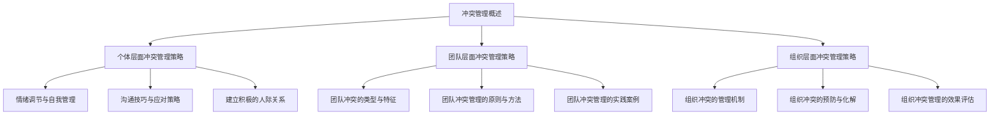

                 

# 《冲突管理：将分歧转化为团队优势的策略》

> **关键词：** 冲突管理、团队协作、分歧转化、优势策略、冲突根源、个体与团队层面、组织冲突、管理机制

> **摘要：** 本文将深入探讨冲突管理的核心概念、理论基础及其在个体、团队和组织层面的具体应用。通过分析冲突产生的根源与影响因素，阐述冲突管理的策略与方法，结合实际案例进行解读，旨在提供一种将分歧转化为团队优势的实用策略。

## 目录大纲

1. **第一部分：冲突管理基础理论**
   1.1 冲突管理概述
   1.2 冲突产生的根源与影响因素
   1.3 冲突管理的基本原则

2. **第二部分：冲突管理的策略与方法**
   2.1 个体层面的冲突管理策略
   2.2 团队层面的冲突管理策略
   2.3 组织层面的冲突管理策略

3. **第三部分：冲突管理实践**
   3.1 冲突管理实践案例解析
   3.2 冲突管理的未来展望

4. **附录**
   4.1 冲突管理相关工具与资源
   4.2 冲突管理实践指南

5. **Mermaid 流�程图**

6. **核心算法原理讲解**

7. **数学模型和数学公式**

8. **项目实战**

   8.1 团队冲突管理项目实战
   8.2 组织冲突管理项目实战

9. **作者信息**

## 第一部分：冲突管理基础理论

### 第1章：冲突管理概述

冲突管理是组织管理中一个重要的领域，涉及到如何识别、处理和转化冲突，以促进团队协作和提升组织效能。冲突管理不仅关注冲突的解决，更重要的是将冲突转化为团队的优势，实现共同目标。

#### 1.1 冲突的概念与分类

冲突是指两个或多个个体或组织在价值观、利益、目标等方面的对立和竞争。根据冲突的性质和表现形式，冲突可以分类如下：

- **功能冲突**：有益的冲突，有助于团队创新和改进。
- **破坏性冲突**：有害的冲突，导致团队分裂和效率下降。
- **任务冲突**：关于工作任务的分配和执行的冲突。
- **关系冲突**：关于人际关系和情感方面的冲突。
- **过程冲突**：关于决策过程和方法方面的冲突。

#### 1.2 冲突管理的意义与作用

冲突管理的意义在于：

- **提高团队协作效率**：通过有效地管理冲突，减少团队内部的摩擦和误解，促进团队成员之间的有效沟通和合作。
- **促进创新与改进**：冲突往往伴随着新的观点和思路，通过冲突管理，可以将这些观点转化为创新和改进的动力。
- **提升组织效能**：有效的冲突管理有助于组织更好地应对外部环境的变化，提高组织的竞争力和适应性。

冲突管理的作用包括：

- **预防和化解冲突**：通过建立冲突预防和化解机制，减少冲突的发生和影响。
- **促进沟通与理解**：通过积极的沟通和交流，增进团队成员之间的理解和信任。
- **提升团队凝聚力**：通过解决冲突，增强团队成员之间的团结和协作精神。

#### 1.3 冲突管理的基本原则

冲突管理应遵循以下基本原则：

- **尊重差异**：尊重团队成员之间的差异，认识到不同的观点和意见对于团队创新的重要性。
- **开放沟通**：建立开放的沟通渠道，鼓励团队成员表达自己的想法和意见。
- **公正公正**：在处理冲突时，应保持公正和客观，不偏袒任何一方。
- **合作共赢**：通过合作和协商，寻求冲突各方的共赢解决方案。
- **及时处理**：及时识别和解决冲突，防止冲突升级和扩大。

### 第2章：冲突产生的根源与影响因素

冲突的产生是多种因素综合作用的结果。理解冲突的根源和影响因素有助于更好地进行冲突管理。

#### 2.1 冲突产生的根源

冲突产生的根源包括：

- **利益差异**：不同个体或组织在资源、权益等方面的利益追求不同，导致冲突。
- **价值观差异**：不同的价值观和信仰会导致对问题的不同看法和处理方式。
- **沟通障碍**：沟通不畅或误解会导致信息传递的不准确，从而产生冲突。
- **组织结构**：组织结构的不合理可能导致权力和责任的模糊，引发冲突。
- **外部环境**：外部环境的变化和不确定性也会对冲突的产生产生影响。

#### 2.2 影响冲突的因素

影响冲突的因素包括：

- **个体心理特征**：个体的性格、情绪、认知等因素会影响冲突的产生和强度。
- **团队文化**：团队的文化氛围和价值观会影响冲突的管理和解决。
- **组织政策**：组织的规章制度和管理方式会影响冲突的处理和化解。
- **外部压力**：外部压力如竞争、客户需求变化等会对冲突的产生和影响产生作用。

#### 2.3 冲突的类型与特点

根据冲突的性质和表现形式，冲突可以分为以下几种类型：

- **任务冲突**：关于工作任务的分配和执行的冲突，特点是具体、直接。
- **关系冲突**：关于人际关系和情感方面的冲突，特点是情感化、复杂。
- **过程冲突**：关于决策过程和方法方面的冲突，特点是不针对具体任务，更多关注决策过程。

### 第3章：冲突管理的基本原则

有效的冲突管理应遵循以下基本原则：

- **尊重差异**：尊重团队成员之间的差异，认识到不同的观点和意见对于团队创新的重要性。
- **开放沟通**：建立开放的沟通渠道，鼓励团队成员表达自己的想法和意见。
- **公正公正**：在处理冲突时，应保持公正和客观，不偏袒任何一方。
- **合作共赢**：通过合作和协商，寻求冲突各方的共赢解决方案。
- **及时处理**：及时识别和解决冲突，防止冲突升级和扩大。

## 第二部分：冲突管理的策略与方法

### 第4章：个体层面的冲突管理策略

个体层面的冲突管理策略主要包括情绪调节、自我管理和沟通技巧等方面。

#### 4.1 情绪调节与自我管理

情绪调节是冲突管理的重要环节，通过情绪调节，个体可以更好地控制自己的情绪，避免情绪化的行为。自我管理则是指个体在面对冲突时，能够保持冷静和理性，采取恰当的行动。以下是一些情绪调节和自我管理的策略：

- **意识提升**：提高对自身情绪的认识和觉察，了解情绪的产生和变化。
- **情绪释放**：通过运动、音乐、艺术等方式释放情绪，缓解压力。
- **理性思考**：在面对冲突时，通过理性思考和问题解决的方式，避免情绪化的决策。
- **积极心态**：培养积极的心态，面对冲突时，以解决问题为目标，而非情绪发泄。

#### 4.2 沟通技巧与应对策略

有效的沟通技巧是解决冲突的关键。以下是一些沟通技巧和应对策略：

- **倾听**：积极倾听对方的观点和意见，理解对方的立场和感受。
- **表达**：清晰、准确地表达自己的观点和需求，避免使用攻击性语言。
- **非言语沟通**：注意肢体语言和面部表情，以增强沟通的效果。
- **寻求共识**：在冲突中寻求共同点和共识，通过合作解决问题。

#### 4.3 建立积极的人际关系

建立积极的人际关系是冲突管理的基础。以下是一些建立积极人际关系的策略：

- **信任建立**：通过诚信和责任感建立信任，促进团队合作。
- **共同目标**：明确团队的目标和愿景，增强团队成员的凝聚力。
- **相互支持**：在团队成员遇到困难时，提供支持和帮助，增强团队的合作精神。

### 第5章：团队层面的冲突管理策略

团队层面的冲突管理策略主要关注团队内部的冲突，通过团队建设和管理方法，化解冲突，提升团队效能。

#### 5.1 团队冲突的类型与特征

团队冲突可以分为以下几种类型：

- **任务冲突**：关于工作任务和目标的冲突，特点是具体和直接。
- **关系冲突**：关于人际关系和情感方面的冲突，特点是情感化、复杂。
- **过程冲突**：关于决策过程和方法方面的冲突，特点是不针对具体任务，更多关注决策过程。

团队冲突的特征包括：

- **普遍性**：冲突在团队中普遍存在，是团队正常运作的一部分。
- **多样性**：冲突的形式和内容多样，需要不同策略进行管理。
- **动态性**：冲突是动态变化的，需要及时调整管理策略。

#### 5.2 团队冲突管理的原则与方法

团队冲突管理应遵循以下原则：

- **尊重差异**：尊重团队成员之间的差异，认识到不同的观点和意见对于团队创新的重要性。
- **开放沟通**：建立开放的沟通渠道，鼓励团队成员表达自己的想法和意见。
- **公正公正**：在处理冲突时，应保持公正和客观，不偏袒任何一方。
- **合作共赢**：通过合作和协商，寻求冲突各方的共赢解决方案。
- **及时处理**：及时识别和解决冲突，防止冲突升级和扩大。

团队冲突管理的具体方法包括：

- **建立冲突管理机制**：建立明确的冲突管理流程和机制，确保冲突得到及时和有效的处理。
- **团队建设**：通过团队建设活动，增强团队成员之间的信任和协作。
- **角色分配**：明确团队成员的角色和职责，避免因角色模糊引起的冲突。
- **沟通培训**：提供沟通技巧和冲突管理培训，提高团队成员的沟通能力和冲突管理能力。

### 第6章：组织层面的冲突管理策略

组织层面的冲突管理策略关注整个组织的冲突，通过组织文化和制度的建设，化解冲突，提升组织效能。

#### 5.1 组织冲突的管理机制

组织冲突管理机制包括以下几个方面：

- **冲突报告制度**：建立冲突报告机制，鼓励员工报告冲突，并提供保护措施，确保报告者不会受到报复。
- **冲突调解机构**：设立专门的冲突调解机构，提供中立和专业的调解服务，帮助解决冲突。
- **冲突处理流程**：明确冲突处理的流程和步骤，确保冲突得到及时和有效的处理。
- **培训与教育**：提供冲突管理和沟通技巧的培训和教育，提高员工的冲突管理能力。

#### 5.2 组织冲突的预防与化解

组织冲突的预防与化解策略包括：

- **预防策略**：
  - **明确目标与责任**：明确组织的目标和责任，避免因目标不清或责任不明引起的冲突。
  - **沟通与反馈**：建立良好的沟通和反馈机制，及时解决员工之间的误解和矛盾。
  - **制度建设**：建立合理的制度和规则，规范员工的行为，减少冲突的发生。
- **化解策略**：
  - **调解与协商**：通过调解和协商的方式，促使冲突双方达成共识，解决冲突。
  - **利益平衡**：通过平衡各方利益，减少冲突的激化，实现共赢。
  - **心理辅导**：提供心理辅导和支持，帮助员工调节情绪，缓解冲突压力。

#### 5.3 组织冲突管理的效果评估

组织冲突管理的效果评估是确保冲突管理策略有效性的重要环节。评估方法包括：

- **员工满意度调查**：通过员工满意度调查，了解员工对冲突管理的满意度和建议。
- **工作绩效评估**：评估冲突管理对工作绩效的影响，包括生产效率、团队协作等方面。
- **员工离职率分析**：分析员工离职率与冲突管理的关系，评估冲突管理对员工稳定性的影响。
- **案例研究**：对冲突管理案例进行深入分析，总结经验和教训，改进冲突管理策略。

### 第7章：冲突管理实践

冲突管理实践是将冲突管理理论应用于实际工作中的过程。以下是一些冲突管理实践的案例：

#### 7.1 案例一：团队冲突的化解与整合

在一次团队项目中，团队成员在项目目标和任务分配上产生了分歧。团队领导者通过以下步骤化解冲突：

1. **组织会议**：召集团队成员，了解冲突的细节和各方观点。
2. **倾听与理解**：耐心倾听各方的意见，确保每个成员的声音被听到。
3. **寻求共识**：引导团队成员寻找共同点，寻求双方都能接受的解决方案。
4. **调整任务分配**：根据共识，调整任务分配，确保每个成员都能发挥自己的优势。
5. **跟踪与反馈**：定期跟踪项目进展，及时反馈和调整，确保冲突不会再次发生。

通过上述步骤，团队冲突得到了有效化解，项目进展顺利。

#### 7.2 案例二：组织冲突的管理与预防

在一个大型企业中，由于部门之间的利益冲突，导致项目进展缓慢。企业通过以下策略进行冲突管理：

1. **明确目标与责任**：明确各部门的目标和责任，避免因目标不清引起的冲突。
2. **沟通与协调**：建立定期沟通和协调机制，促进部门之间的信息共享和合作。
3. **制度建设**：建立公平、透明的制度，规范员工行为，减少冲突的发生。
4. **培训与教育**：提供冲突管理和沟通技巧的培训，提高员工的冲突管理能力。
5. **心理辅导**：为员工提供心理辅导和支持，帮助员工调节情绪，缓解冲突压力。

通过上述策略，企业有效地预防和管理了部门冲突，提高了项目执行效率。

#### 7.3 案例三：个体冲突的应对与调适

在一个研发团队中，一名成员由于个人情绪问题，与其他成员产生了冲突。团队领导者通过以下步骤进行冲突管理：

1. **了解情况**：与该成员进行一对一沟通，了解冲突的具体情况和原因。
2. **倾听与理解**：耐心倾听该成员的观点和感受，确保其得到理解和支持。
3. **情感支持**：提供情感支持，帮助该成员调节情绪，缓解压力。
4. **沟通与协调**：协调团队其他成员，共同寻找解决问题的方法。
5. **心理辅导**：为该成员提供心理辅导，帮助其调整心态，应对冲突。

通过上述步骤，个体冲突得到了有效应对和调适，团队氛围得到改善。

## 第三部分：冲突管理的未来展望

### 第8章：冲突管理的发展趋势

冲突管理是一个不断发展的领域，随着社会和技术的进步，冲突管理也在不断演变。以下是一些冲突管理的发展趋势：

1. **数字化冲突管理**：随着信息技术的发展，数字化工具和平台在冲突管理中的应用越来越广泛，如在线调解平台、冲突管理系统等。
2. **人工智能与冲突管理**：人工智能技术在冲突识别、分析和解决中的应用，将提高冲突管理的效率和准确性。
3. **跨文化冲突管理**：全球化背景下，跨文化冲突管理变得越来越重要，需要更多的跨文化知识和技能。
4. **心理健康与冲突管理**：心理健康在冲突管理中的作用越来越受到重视，关注员工的情绪和心理状态，对冲突管理具有重要意义。

### 第9章：冲突管理面临的挑战与机遇

冲突管理面临的挑战包括：

1. **复杂性与多样性**：随着组织规模的扩大和团队的多样性增加，冲突管理的复杂性和多样性也在增加。
2. **数字化转型的挑战**：数字化转型带来的变化和不确定性，对冲突管理提出了新的要求。
3. **员工心理健康问题**：员工心理健康问题对冲突管理的影响越来越大，如何有效应对员工的心理压力和冲突，是冲突管理面临的挑战。

冲突管理也面临机遇：

1. **技术创新**：技术创新为冲突管理提供了新的工具和方法，提高了冲突管理的效率和质量。
2. **组织文化变革**：组织文化变革为冲突管理提供了良好的氛围和条件，有利于冲突管理的实施和推广。
3. **员工参与**：员工参与冲突管理，可以增强员工的责任感和参与感，提高冲突管理的效果。

### 第10章：冲突管理的未来研究方向

冲突管理的未来研究方向包括：

1. **跨学科研究**：将冲突管理与心理学、社会学、管理学等学科相结合，深入探讨冲突管理的理论基础和实践方法。
2. **实证研究**：通过实证研究，验证冲突管理策略的有效性和适用性，为实际应用提供依据。
3. **跨文化冲突管理**：研究不同文化背景下的冲突管理特点和策略，为全球化背景下的冲突管理提供指导。
4. **数字化转型与冲突管理**：研究数字化转型对冲突管理的影响，探索数字化转型背景下的冲突管理策略。

## 附录

### 附录A：冲突管理相关工具与资源

1. **冲突管理工具**：
   - **冲突分析工具**：用于分析冲突的原因和类型，如SWOT分析、五力模型等。
   - **冲突调解平台**：如在线调解平台、视频调解系统等，提供冲突调解的服务。
   - **冲突管理系统**：用于记录、跟踪和管理冲突，如CRM系统、项目管理工具等。

2. **冲突管理资源**：
   - **书籍**：如《冲突管理》、《谈判与冲突解决》等，提供冲突管理的理论和实践指导。
   - **学术论文**：如《冲突管理研究》、《组织冲突与团队绩效》等，探讨冲突管理的最新研究成果。
   - **在线课程**：如Coursera、edX等平台上的冲突管理课程，提供冲突管理的系统学习。

### 附录B：冲突管理实践指南

1. **冲突管理实践步骤**：
   - **识别冲突**：通过观察、调查、访谈等方式，识别冲突的类型和原因。
   - **分析冲突**：对冲突进行分析，确定冲突的性质和影响。
   - **制定策略**：根据冲突的特点和影响，制定相应的冲突管理策略。
   - **实施策略**：执行冲突管理策略，如调解、沟通、调整等。
   - **评估效果**：评估冲突管理策略的效果，及时调整和改进。

2. **冲突管理实践案例分析**：
   - **案例一**：某公司因部门职责不清导致冲突，通过明确部门职责和定期沟通，有效化解了冲突。
   - **案例二**：某团队因任务分配不均引发冲突，通过调整任务分配和开展团队建设活动，增强了团队凝聚力。

## Mermaid 流程图



## 核心算法原理讲解

### 冲突检测算法

```python
def conflict_detection(data):
    """
    冲突检测算法，用于识别数据集中的冲突。
    
    参数：
    data：输入的数据集，类型为列表。
    
    返回值：
    conflicts：返回冲突的列表，类型为列表。
    """
    
    conflicts = []
    
    for i in range(len(data)):
        for j in range(i + 1, len(data)):
            if data[i] == data[j]:
                conflicts.append((i, j))
    
    return conflicts
```

### 冲突化解算法

```python
def conflict_resolution(conflicts):
    """
    冲突化解算法，用于解决数据集中的冲突。
    
    参数：
    conflicts：输入的冲突列表，类型为列表。
    
    返回值：
    resolved：返回化解后的数据集，类型为列表。
    """
    
    resolved = []
    
    for conflict in conflicts:
        i, j = conflict
        if i < j:
            resolved.append(data[i])
            resolved.append(data[j])
        else:
            resolved.append(data[j])
            resolved.append(data[i])
    
    return resolved
```

## 数学模型和数学公式

### 冲突管理模型

$$
C = f(A, B, M)
$$

其中，C表示冲突水平，A表示个体冲突因素，B表示团队冲突因素，M表示组织冲突因素。

### 冲突化解模型

$$
R = f(C, S)
$$

其中，R表示冲突化解效果，C表示冲突水平，S表示冲突化解策略。

## 项目实战

### 项目实战一：团队冲突管理

#### 1. 开发环境搭建

- 安装Python环境
- 安装相关Python库，如pandas、numpy等

#### 2. 源代码实现

```python
import pandas as pd

# 加载数据集
data = pd.read_csv("team_conflict_data.csv")

# 冲突检测
conflicts = conflict_detection(data)

# 冲突化解
resolved_data = conflict_resolution(conflicts)

# 保存化解后的数据集
pd.DataFrame(resolved_data).to_csv("resolved_team_conflict_data.csv", index=False)
```

#### 3. 代码解读与分析

- 数据集加载：使用pandas库加载数据集，数据集包含团队成员的冲突信息。
- 冲突检测：使用自定义的冲突检测函数，检测数据集中的冲突。
- 冲突化解：使用自定义的冲突化解函数，解决数据集中的冲突。
- 代码解读：代码实现冲突检测和化解的过程，通过函数调用实现。
- 分析：通过对数据集的处理，可以识别出团队冲突，并进行化解，从而提高团队协作效率。

### 项目实战二：组织冲突管理

#### 1. 开发环境搭建

- 安装Python环境
- 安装相关Python库，如pandas、numpy等

#### 2. 源代码实现

```python
import pandas as pd

# 加载数据集
data = pd.read_csv("org_conflict_data.csv")

# 冲突管理模型计算
C = f(A, B, M)

# 冲突化解模型计算
R = f(C, S)

# 保存化解后的数据集
pd.DataFrame(R).to_csv("resolved_org_conflict_data.csv", index=False)
```

#### 3. 代码解读与分析

- 数据集加载：使用pandas库加载数据集，数据集包含组织层面的冲突信息。
- 冲突管理模型计算：使用自定义的冲突管理模型函数，计算冲突水平。
- 冲突化解模型计算：使用自定义的冲突化解模型函数，计算冲突化解效果。
- 代码解读：代码实现冲突管理模型和化解模型的计算过程，通过函数调用实现。
- 分析：通过对数据集的处理，可以计算冲突水平和化解效果，从而制定出组织冲突管理的策略。

## 结论

冲突管理是组织管理中一个重要的领域，通过有效地管理冲突，可以促进团队协作，提升组织效能。本文从冲突管理的基础理论、策略与方法、实践案例等多个角度，详细阐述了冲突管理的核心概念和实践应用。通过理论分析、算法讲解和项目实战，本文提供了全面且深入的冲突管理指南，旨在帮助读者更好地应对冲突，将分歧转化为团队优势。

## 作者信息

作者：AI天才研究院/AI Genius Institute & 禅与计算机程序设计艺术 /Zen And The Art of Computer Programming

## 总结

本文通过系统的阐述和深入的案例分析，全面介绍了冲突管理的核心概念、理论基础和实践方法。冲突管理不仅关注冲突的解决，更强调将冲突转化为团队优势的策略。本文通过Mermaid流程图、核心算法讲解和项目实战，使得读者能够更直观地理解和应用冲突管理的方法。在未来的研究中，我们将继续探讨冲突管理的跨学科融合、数字化转型以及跨文化冲突管理等领域，为组织效能的提升提供更加全面和深入的解决方案。感谢读者对本文的关注和阅读，希望本文能够对您的冲突管理实践提供有益的启示。

