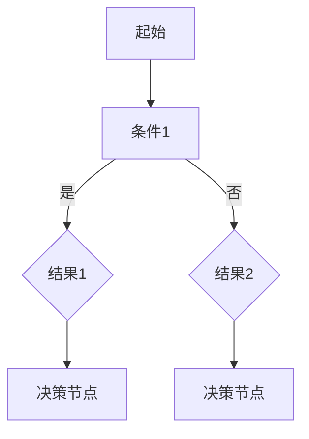
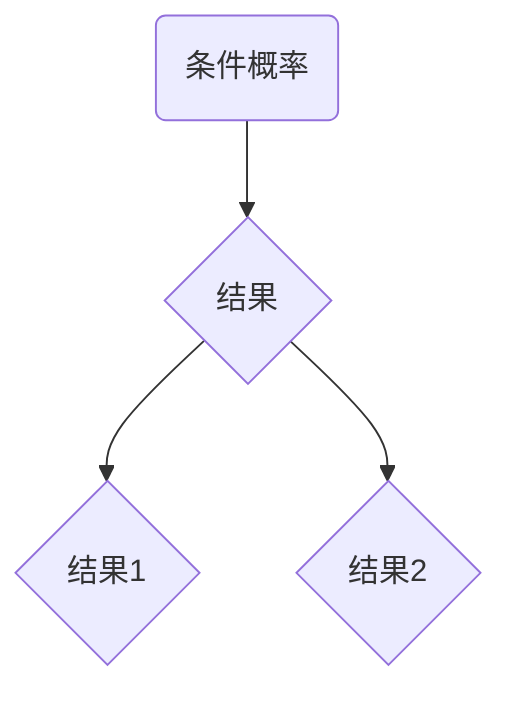
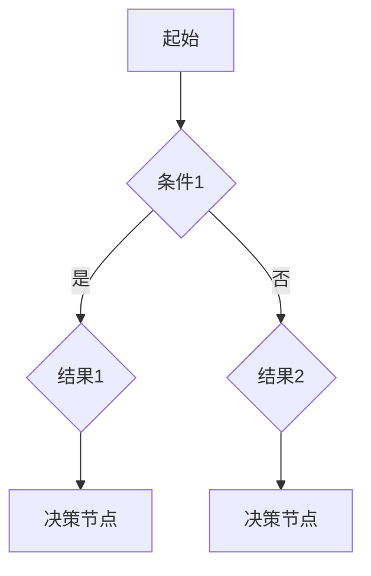

                 

## 决策技巧：在不确定性中把握方向

> **关键词：** 决策技巧、不确定性、人工智能、数据分析、决策模型

**摘要：** 
本文旨在探讨决策技巧在不确定环境中的应用，分析决策过程中常见的挑战和应对策略。通过深入理解决策技巧的基础知识，介绍多种决策模型和方法，探讨其在个人和组织决策中的应用，并展望未来的发展趋势。本文为从事IT领域的专业人士提供了一份全面而实用的决策指南。

### 第一部分：决策技巧基础

#### 第1章：决策技巧概述

##### 1.1 决策技巧的定义与重要性

**1.1.1 决策技巧的日常应用**

在日常生活中，我们不断地做出决策，从选择早餐吃什么，到决定如何安排工作与休息时间，决策无处不在。良好的决策技巧能够帮助我们更好地管理时间和资源，提高生活质量。例如，使用优先级设定工具，如番茄工作法，可以帮助我们更高效地完成工作任务，减少拖延。

**1.1.2 决策技巧在职业生涯中的价值**

在职业生涯中，决策技巧尤为重要。能否做出明智的决策往往决定了职业发展的成败。优秀的决策者能够从复杂的信息中提取关键点，迅速做出正确的决策，从而在竞争中脱颖而出。例如，项目经理需要根据项目进度和资源情况，及时调整计划，确保项目按时完成。

**1.1.3 决策技巧的社会影响**

决策技巧不仅对个人和职业有重要影响，也对整个社会产生深远的影响。在公共事务中，政府官员需要基于数据和公众意见做出决策，以促进社会的发展和稳定。例如，交通规划部门需要通过数据分析，优化公共交通系统，提高交通效率。

##### 1.2 决策过程中的常见问题

**1.2.1 决策偏差**

决策偏差是指人们在决策过程中，由于认知偏差、情绪影响等因素，导致做出非理性决策的现象。常见的决策偏差包括确认偏差、代表性偏差和锚定效应。了解决策偏差，有助于我们在决策时更加客观、理性。

**1.2.2 情绪对决策的影响**

情绪对决策具有重要影响。积极的情绪可以提高决策者的自信心，而消极的情绪则可能导致决策者过度谨慎或冒险。例如，在面临重要决策时，焦虑和压力可能会影响我们的判断力。

**1.2.3 信息过载与决策困境**

在信息爆炸的时代，我们面临的信息量前所未有。然而，过多的信息反而可能导致决策困境，使我们难以做出明智的决策。信息过载的应对策略包括简化信息、筛选关键信息和使用数据分析工具。

### 第一部分总结

本章节概述了决策技巧的定义与重要性，以及决策过程中常见的挑战和问题。在接下来的章节中，我们将深入探讨决策模型与方法，以及决策技巧在个人和组织中的应用。通过这些讨论，我们将更好地理解如何在不确定性中把握方向，做出明智的决策。

### 第二部分：决策模型与方法

#### 第2章：决策模型与方法

决策模型与方法是决策技巧的核心内容，帮助我们系统地分析和解决复杂问题。在本章节中，我们将介绍几种常见的决策模型和方法，包括决策树模型、贝叶斯网络模型和多目标决策模型，并探讨如何使用这些模型进行决策分析。

##### 2.1 决策模型概述

决策模型是用于描述决策过程和相关信息的数学模型。常见的决策模型包括确定性模型和概率性模型。确定性模型假设决策变量和结果之间存在明确的因果关系，而概率性模型则考虑了不确定性和随机性。

**2.1.1 决策树模型**

决策树模型是一种广泛应用于决策分析的图形化工具。它通过一系列判断节点和结果节点，将决策过程分解为多个步骤，每个步骤都有不同的结果和概率。决策树模型能够清晰地展示决策过程，帮助决策者理解每个决策节点的影响。

**Mermaid 流程图：**

**2.1.2 贝叶斯网络模型**

贝叶斯网络是一种概率性模型，用于描述变量之间的依赖关系。它由节点和边组成，每个节点表示一个变量，边表示变量之间的条件概率关系。贝叶斯网络能够有效地处理复杂的问题，并计算后验概率，帮助我们做出更加准确的决策。

**Mermaid 流程图：**

**2.1.3 多目标决策模型**

多目标决策模型考虑了决策过程中的多个目标，旨在找到一个或多个满足所有目标的最优解。常见的多目标决策方法包括线性加权法、非线性加权法和目标规划法。多目标决策模型能够帮助我们权衡不同目标之间的冲突，找到最佳平衡点。

**Mermaid 流程图：**

##### 2.2 决策分析工具

决策分析工具是支持决策模型和方法的重要手段。以下是一些常见的决策分析工具：

**2.2.1 效用理论**

效用理论用于评估决策结果的价值。通过给不同结果赋予效用值，决策者能够比较不同决策的结果，并选择具有最高效用的决策。效用理论常用于风险评估和成本效益分析。

**2.2.2 风险评估**

风险评估是一种评估决策风险的方法，包括识别、评估和应对风险。常见的方法包括定性评估和定量评估。定性评估使用主观判断，而定量评估使用数学模型和统计数据。

**2.2.3 决策树分析法**

决策树分析法是一种图形化工具，用于分析和比较不同决策的结果。它通过一系列判断节点和结果节点，将决策过程分解为多个步骤，每个步骤都有不同的结果和概率。

**Mermaid 流程图：**

##### 2.3 数据分析在决策中的应用

数据分析在决策过程中起着至关重要的作用。通过分析数据，决策者能够获取有价值的信息，帮助做出更加明智的决策。以下是一些常见的数据分析工具：

**2.3.1 数据可视化**

数据可视化是将数据转化为图形化表示的方法，帮助决策者直观地理解数据。常见的数据可视化工具包括图表、地图和热力图等。

**2.3.2 数据分析工具**

数据分析工具用于处理和分析大量数据，帮助决策者提取有价值的信息。常见的数据分析工具包括Python、R和Excel等。

**2.3.3 数据驱动决策**

数据驱动决策是一种基于数据分析的决策方法。通过收集、处理和分析数据，决策者能够获取有关决策结果的准确信息，从而做出更加明智的决策。

##### 2.4 决策模型的实际应用

**2.4.1 项目管理**

在项目管理中，决策模型和方法被广泛应用于项目规划、进度控制和风险评估。决策树模型可以帮助项目经理分析项目风险，贝叶斯网络模型可以用于项目风险评估和决策。

**2.4.2 金融投资**

在金融投资中，决策模型和方法用于投资组合优化、风险评估和策略制定。多目标决策模型可以帮助投资者权衡不同投资目标之间的冲突，找到最佳投资组合。

**2.4.3 人力资源管理**

在人力资源管理中，决策模型和方法用于招聘、培训和绩效评估。风险评估方法可以帮助企业识别和应对人力资源管理风险，优化人力资源配置。

##### 2.5 决策模型的选择和运用

选择合适的决策模型是决策成功的关键。以下是一些选择和运用决策模型的方法：

**2.5.1 问题分析**

在决策前，首先要对问题进行详细分析，明确决策目标和约束条件。通过问题分析，可以确定需要使用哪种决策模型。

**2.5.2 数据收集**

收集与决策相关的大量数据，包括历史数据、市场数据和企业内部数据。数据收集的完整性和准确性对决策模型的运用至关重要。

**2.5.3 模型验证**

在运用决策模型之前，需要进行模型验证。模型验证包括对模型假设的验证、数据验证和模型结果验证。通过模型验证，可以确保决策模型的准确性和可靠性。

**2.5.4 模型优化**

根据实际应用情况，对决策模型进行优化。模型优化可以包括调整模型参数、改进算法和引入新的模型。

##### 2.6 决策模型与人工智能

人工智能技术的发展为决策模型的应用带来了新的机遇。以下是一些将人工智能应用于决策模型的方法：

**2.6.1 机器学习算法**

使用机器学习算法，可以从大量数据中提取有价值的信息，辅助决策。常见的机器学习算法包括回归分析、决策树和神经网络等。

**2.6.2 深度学习**

深度学习算法在图像识别、自然语言处理和推荐系统等领域取得了显著成果。深度学习算法可以用于复杂决策问题，提高决策模型的准确性和效率。

**2.6.3 强化学习**

强化学习算法可以用于动态决策问题，通过不断尝试和反馈，找到最佳决策策略。强化学习算法在自动化控制、游戏和机器人领域具有广泛的应用前景。

##### 2.7 数据科学与决策

数据科学是决策过程中不可或缺的一部分。以下是一些数据科学在决策中的应用：

**2.7.1 数据挖掘**

数据挖掘是一种从大量数据中提取有价值信息的方法。通过数据挖掘，可以识别决策过程中的潜在问题和机会。

**2.7.2 数据分析**

数据分析是一种对数据进行分析和解释的方法，帮助决策者理解数据中的趋势和规律。数据分析可以用于优化决策模型和策略。

**2.7.3 数据可视化**

数据可视化是一种将数据转化为图形化表示的方法，帮助决策者直观地理解数据。数据可视化可以用于展示决策结果和趋势。

##### 2.8 决策模型的未来发展趋势

随着技术的不断进步，决策模型也在不断发展。以下是一些决策模型的未来发展趋势：

**2.8.1 自动化决策**

自动化决策是指使用计算机算法和人工智能技术，自动执行决策过程。自动化决策可以提高决策效率，减少人为错误。

**2.8.2 集成决策**

集成决策是指将不同决策模型和方法整合在一起，形成更全面的决策框架。集成决策可以提高决策的准确性和可靠性。

**2.8.3 个性化决策**

个性化决策是指根据个人的需求和偏好，制定个性化的决策策略。个性化决策可以更好地满足个人需求，提高生活质量。

**2.8.4 可持续发展**

可持续发展是指在经济、社会和环境等方面实现平衡发展。未来的决策模型将更加注重可持续发展，实现经济、社会和环境的协调发展。

### 第二部分总结

本章节介绍了决策模型与方法的概述，包括决策树模型、贝叶斯网络模型和多目标决策模型，以及常见的决策分析工具。同时，讨论了数据分析在决策中的应用，以及决策模型与人工智能的结合。在下一章节中，我们将探讨决策技巧在个人和组织决策中的应用。

### 第三部分：决策技巧的应用

#### 第3章：个人决策技巧

个人决策技巧在日常生活中扮演着至关重要的角色。无论是在职业发展、时间管理，还是风险管理等方面，良好的决策技巧都能帮助我们更好地应对挑战，实现目标。以下是一些个人决策技巧的应用。

##### 3.1 时间管理与优先级设定

时间管理是提高工作效率的关键。以下是几种常用的时间管理方法和工具：

**3.1.1 时间管理的基本原则**

- **明确目标**：设定明确的目标，有助于我们更好地分配时间和精力。
- **优先级设定**：根据任务的重要性和紧急程度，设定优先级，确保重要任务得到优先处理。
- **任务分解**：将复杂任务分解为小步骤，有助于我们更好地掌控时间和进度。

**3.1.2 设定个人目标的优先级**

- **SMART目标**：确保目标是具体的、可测量的、可实现的、相关的和有时间限制的。
- **优先级矩阵**：使用优先级矩阵，将任务分为重要且紧急、重要但不紧急、不重要但紧急、不重要且不紧急四个象限，有助于我们更好地设定优先级。

**3.1.3 使用时间管理工具**

- **日历应用**：使用日历应用，如Google Calendar，帮助安排日程和提醒重要事件。
- **时间跟踪工具**：使用时间跟踪工具，如Toggl，帮助记录工作时间，分析时间利用率。
- **待办事项列表**：使用待办事项列表，如Wunderlist，帮助跟踪任务进度，提高工作效率。

**示例**：
假设你需要安排一天的时间来完成任务A、任务B和任务C。以下是一个可能的时间管理方案：

- **目标**：完成任务A、任务B和任务C。
- **优先级设定**：根据任务的重要性和紧急程度，设定优先级。
  - 任务A：重要且紧急，需要优先处理。
  - 任务B：重要但不紧急，可以安排在任务A之后处理。
  - 任务C：不重要但紧急，可以安排在任务B之后处理。
- **任务分解**：将任务A、任务B和任务C分解为小步骤。
  - 任务A：1. 分析需求，2. 设计方案，3. 编写代码，4. 测试代码。
  - 任务B：1. 收集资料，2. 整理文档，3. 分析报告。
  - 任务C：1. 回复邮件，2. 预约会议。

- **时间管理工具**：使用Google Calendar和Toggl进行时间管理和任务跟踪。

##### 3.2 解决冲突与协调关系

在个人生活和职业发展中，冲突和关系协调是常见的挑战。以下是一些解决冲突和协调关系的技巧：

**3.2.1 冲突的类型**

- **认知冲突**：由于对问题或目标的看法不一致导致的冲突。
- **情感冲突**：由于情绪或价值观的差异导致的冲突。
- **利益冲突**：由于个人或团队的利益冲突导致的冲突。

**3.2.2 冲突解决策略**

- **沟通**：通过有效沟通，了解对方的观点和需求，找到共同点。
- **妥协**：在某些情况下，妥协是解决冲突的有效方法。
- **合作**：通过合作，寻求双赢的解决方案。
- **调解**：当双方无法达成共识时，可以寻求第三方调解。

**3.2.3 建立和谐的人际关系**

- **尊重**：尊重他人，关注他人的感受和需求。
- **信任**：建立信任关系，通过诚信和透明度来维护人际关系。
- **支持**：在他人需要帮助时，提供支持和援助。

**示例**：
假设你和同事在项目计划上存在分歧，以下是一种解决冲突和协调关系的策略：

- **沟通**：与同事进行面对面沟通，了解对方的观点和需求。
- **妥协**：在讨论中，双方都做出一些妥协，以达成共识。
- **合作**：将双方的观点结合起来，制定一个双方都满意的计划。
- **调解**：如果分歧仍然存在，可以寻求项目经理或第三方调解。

##### 3.3 风险评估与应对策略

在个人决策过程中，风险评估和应对策略是重要的环节。以下是一些风险评估和应对策略：

**3.3.1 识别潜在风险**

- **风险识别方法**：通过头脑风暴、访谈和文档审查等方法，识别潜在风险。
- **风险分类**：根据风险的可能性和影响，将风险分为高、中、低三个等级。

**3.3.2 制定应对策略**

- **风险缓解**：通过风险缓解措施，降低风险的可能性或影响。
- **风险接受**：在某些情况下，风险无法避免，可以接受风险并制定应对策略。
- **风险规避**：通过避免高风险活动，降低风险。

**3.3.3 风险管理实践**

- **建立风险管理计划**：明确风险管理目标、策略和责任。
- **定期评估**：定期评估风险状况，更新风险管理计划。

**示例**：
假设你正在计划一次旅行，以下是一种风险评估和应对策略：

- **识别潜在风险**：旅行过程中可能面临的风险包括交通延误、天气变化、人身安全等。
- **风险评估**：根据风险的可能性和影响，将风险分为高、中、低三个等级。
  - 高风险：人身安全。
  - 中风险：交通延误、天气变化。
  - 低风险：行李丢失。
- **制定应对策略**：
  - 高风险：购买旅行保险，提前了解当地的安全情况。
  - 中风险：提前安排交通工具，关注天气变化，携带必需品。
  - 低风险：使用行李锁，关注行李安全。

##### 3.4 决策技巧的实践与反思

决策技巧不仅是理论知识，更需要通过实践来提升。以下是一些实践和反思的建议：

**3.4.1 实践**

- **模拟训练**：通过模拟训练，模拟不同的决策场景，锻炼决策能力。
- **实际操作**：在实际工作中，运用所学决策技巧，解决实际问题。
- **反思**：在决策后，反思决策过程和结果，总结经验教训。

**3.4.2 学习与成长**

- **学习资源**：利用在线课程、书籍和研讨会等学习资源，不断学习新的决策技巧。
- **专业认证**：通过专业认证，证明自己在决策领域的专业能力。
- **交流与合作**：与同行交流，分享决策经验，共同成长。

### 第三部分总结

本章节讨论了个人决策技巧的应用，包括时间管理、冲突解决和风险评估。通过实际案例和示例，展示了如何运用决策技巧来提高个人决策能力。在下一章节中，我们将探讨决策技巧在组织决策中的应用。

### 第四部分：决策技巧的组织应用

#### 第4章：组织决策技巧

在组织环境中，决策技巧的应用至关重要。组织决策不仅影响个人和团队的绩效，还关系到整个组织的成功。本章节将探讨团队决策、高级管理决策以及企业风险管理等方面的决策技巧。

##### 4.1 团队决策过程

团队决策是组织决策的重要组成部分。有效的团队决策可以提高决策的质量，促进团队协作。以下是一些团队决策过程的关键要素：

**4.1.1 团队决策的优势与挑战**

- **优势**：
  - **多样化的观点**：团队成员来自不同的背景和领域，能够提供多样化的观点。
  - **集体智慧**：团队决策能够集思广益，提高决策的质量。
  - **增强团队凝聚力**：共同参与决策过程，有助于增强团队成员之间的信任和合作。
- **挑战**：
  - **时间消耗**：团队决策过程可能需要更多的时间，影响决策的及时性。
  - **协调难度**：团队成员之间可能存在不同的意见和利益冲突，增加决策的复杂性。

**4.1.2 团队决策模型**

- **头脑风暴**：通过集体讨论，激发创意，产生新的想法。
- **德尔菲法**：通过匿名的方式，收集团队成员的意见和预测，逐步达成共识。
- **决策矩阵**：将决策问题分解为多个因素，为每个因素分配权重，评估不同决策方案的优劣。

**4.1.3 团队沟通技巧**

- **有效倾听**：倾听是沟通的关键，确保理解团队成员的观点。
- **积极反馈**：给予团队成员积极反馈，鼓励表达意见和参与决策。
- **冲突管理**：通过有效的沟通技巧，管理团队内部的冲突，避免影响决策过程。

**示例**：
假设一个团队需要决定如何改进项目进度，以下是一个团队决策过程：

1. **头脑风暴**：团队成员提出各种改进项目进度的想法，如增加资源、优化流程、提高团队成员的工作效率等。
2. **德尔菲法**：团队成员匿名提交自己的意见和预测，团队领导进行初步筛选和分析。
3. **决策矩阵**：将各个想法进行评分和排序，根据重要性、可行性等因素进行权衡，选择最佳方案。
4. **团队讨论**：团队成员针对最佳方案进行讨论，共同制定详细的改进计划。
5. **实施与反馈**：团队按照改进计划执行，并对结果进行评估和反馈，持续优化。

##### 4.2 高级管理决策

高级管理决策涉及组织的战略规划和运营管理。有效的管理决策能够推动组织的发展和竞争优势。以下是一些高级管理决策的关键要素：

**4.2.1 战略决策**

- **愿景与目标**：明确组织的愿景和目标，确保管理决策与组织战略一致。
- **市场分析**：通过市场分析，了解行业趋势、竞争对手和市场需求，为战略决策提供依据。
- **资源分配**：根据组织战略，合理分配资源，确保战略目标的实现。

**4.2.2 创新决策**

- **创新理念**：鼓励创新思维，培养员工的创新意识。
- **创新评估**：对创新项目进行评估，包括技术可行性、市场前景和潜在风险。
- **创新支持**：提供必要的支持和资源，确保创新项目的顺利进行。

**4.2.3 决策制定中的伦理问题**

- **伦理标准**：建立伦理标准，确保决策过程和结果符合道德和伦理要求。
- **利益冲突**：识别和处理利益冲突，确保决策的公正性和透明度。
- **社会责任**：关注企业的社会责任，确保决策对环境和社会的积极影响。

**示例**：
假设一家公司需要决定是否投资一个新的市场，以下是一个高级管理决策过程：

1. **愿景与目标**：公司管理层明确公司的愿景和目标，确保投资决策与公司战略一致。
2. **市场分析**：通过市场调查和分析，了解新市场的潜力、竞争对手和市场需求。
3. **资源分配**：评估公司的资源和能力，确定是否具备投资新市场所需的资源。
4. **创新评估**：对投资新市场的可行性进行评估，包括技术可行性、市场前景和潜在风险。
5. **伦理审查**：评估投资决策是否符合公司的伦理标准和社会责任要求。
6. **决策制定**：根据以上分析，公司管理层做出是否投资的决策。
7. **实施与监控**：如果决定投资，制定详细的实施计划，并对投资结果进行监控和评估。

##### 4.3 企业风险管理

企业风险管理是高级管理决策的重要组成部分。通过有效的风险管理，企业可以降低风险，保障业务持续发展。以下是一些企业风险管理的关键要素：

**4.3.1 风险识别**

- **风险识别方法**：通过风险评估工具，如风险识别清单、头脑风暴和访谈，识别潜在风险。
- **风险分类**：根据风险的可能性和影响，将风险分为高、中、低三个等级。

**4.3.2 风险评估**

- **风险评估方法**：使用定量和定性方法，评估风险的可能性和影响。
- **风险优先级**：根据风险的可能性和影响，确定风险优先级，重点关注高优先级风险。

**4.3.3 风险应对策略**

- **风险缓解**：通过风险缓解措施，降低风险的可能性和影响。
- **风险接受**：在某些情况下，风险无法避免，可以接受风险并制定应对策略。
- **风险规避**：通过避免高风险活动，降低风险。

**4.3.4 风险管理实践**

- **建立风险管理框架**：制定风险管理政策、流程和责任，确保风险管理工作的有效实施。
- **定期评估**：定期评估风险状况，更新风险管理计划。
- **风险意识培训**：提高员工的风险意识，确保风险管理知识的普及和落实。

**示例**：
假设一家公司需要评估其网络安全风险，以下是一个企业风险管理过程：

1. **风险识别**：通过访谈、风险识别清单等方法，识别潜在的网络安全隐患。
2. **风险评估**：使用定量和定性方法，评估网络安全风险的可能性和影响。
3. **风险缓解**：制定网络安全缓解措施，如安装防火墙、定期更新安全软件、加强员工安全意识培训等。
4. **风险接受**：对于无法完全缓解的风险，制定风险接受策略，如制定应急预案、购买网络安全保险等。
5. **风险规避**：通过避免高风险活动，如不访问不明来源的网站、不下载不明软件等，降低风险。
6. **定期评估**：定期评估网络安全风险状况，更新风险管理计划。
7. **风险意识培训**：开展网络安全培训，提高员工的风险意识，确保网络安全措施的有效落实。

##### 4.4 决策技巧在组织中的应用案例

以下是一些决策技巧在组织中的应用案例：

**案例1：企业并购决策**

- **愿景与目标**：明确企业并购的愿景和目标，如扩大市场份额、提高竞争力等。
- **市场分析**：分析目标市场的趋势、竞争对手和潜在客户需求。
- **资源分配**：评估企业并购所需的资源和能力。
- **创新评估**：评估并购后的创新潜力、市场前景和潜在风险。
- **伦理审查**：确保并购决策符合企业的伦理标准和社会责任要求。
- **决策制定**：根据以上分析，制定并购决策。
- **实施与监控**：制定详细的实施计划，并对并购结果进行监控和评估。

**案例2：新产品开发决策**

- **市场分析**：分析市场需求、竞争对手和潜在客户需求。
- **技术评估**：评估新产品开发的技术可行性。
- **资源分配**：确定新产品开发所需的资源和预算。
- **创新评估**：评估新产品的创新潜力、市场前景和潜在风险。
- **决策制定**：根据以上分析，制定新产品开发决策。
- **实施与监控**：制定详细的开发计划，并对新产品开发过程进行监控和评估。

**案例3：企业运营优化决策**

- **数据分析**：收集企业运营数据，如成本、利润、市场份额等。
- **风险评估**：评估现有运营模式的风险和潜在优化机会。
- **创新评估**：评估不同运营优化方案的可行性和效果。
- **决策制定**：根据以上分析，制定企业运营优化决策。
- **实施与监控**：制定详细的实施计划，并对运营优化效果进行监控和评估。

### 第四部分总结

本章节讨论了组织决策技巧的应用，包括团队决策、高级管理决策和企业风险管理。通过实际案例和示例，展示了如何运用决策技巧来提高组织决策能力。在下一章节中，我们将探讨复杂决策技巧的深化。

### 第五部分：复杂决策技巧的深化

#### 第5章：复杂决策技巧

随着环境的变化和问题的复杂性增加，决策者面临的问题越来越复杂。在这一部分，我们将探讨复杂决策技巧的深化，包括复杂系统的决策分析、多因素决策分析和决策支持系统的应用。

##### 5.1 复杂系统的决策分析

复杂系统具有高度不确定性和多变量依赖性，使得传统的决策方法难以有效应用。以下是一些复杂系统决策分析的关键要素：

**5.1.1 复杂系统的特性**

- **高度不确定性和随机性**：复杂系统中的变量之间存在复杂的非线性关系，导致结果的不确定性。
- **多变量依赖性**：复杂系统中的变量之间存在相互依赖关系，一个变量的变化会影响其他变量。
- **动态变化**：复杂系统中的状态和结果会随时间变化而变化。

**5.1.2 复杂决策模型**

- **系统动力学模型**：通过描述变量之间的因果关系和反馈机制，模拟复杂系统的动态行为。
- **多代理模型**：模拟多个独立代理的行为和相互作用，分析复杂系统中的群体行为。
- **复杂网络模型**：通过网络结构描述变量之间的关系，分析复杂系统的传播和协作行为。

**5.1.3 复杂决策的挑战与应对**

- **挑战**：
  - **信息过载**：复杂系统中存在大量信息，难以处理和理解。
  - **计算复杂性**：复杂决策模型需要大量的计算资源，难以实时处理。
  - **模型验证**：复杂决策模型需要验证其准确性和可靠性，以确保决策的有效性。
- **应对策略**：
  - **数据驱动方法**：利用大量数据，通过数据挖掘和机器学习算法，提取有价值的信息，辅助决策。
  - **代理协作**：通过多代理系统，实现多个决策主体的协作，提高决策的效率和效果。
  - **模拟与仿真**：通过模拟和仿真，验证复杂决策模型的准确性和可靠性，减少决策风险。

**示例**：
假设一家公司需要决定如何优化其供应链系统，以下是一个复杂系统决策分析过程：

1. **信息收集**：收集供应链系统的相关数据，包括库存水平、运输成本、需求预测等。
2. **模型构建**：构建一个系统动力学模型，描述供应链系统中变量之间的因果关系和反馈机制。
3. **模拟仿真**：使用模拟仿真工具，模拟供应链系统的动态行为，分析不同决策方案的效果。
4. **结果分析**：分析模拟结果，评估不同决策方案的优缺点，为决策提供依据。
5. **决策制定**：根据分析结果，制定供应链优化决策。
6. **实施与监控**：根据决策方案，实施供应链优化措施，并对实施效果进行监控和评估。

##### 5.2 多因素决策分析

多因素决策分析涉及多个相互关联的因素，需要权衡不同因素之间的冲突和优先级。以下是一些多因素决策分析的关键要素：

**5.2.1 多目标决策分析**

- **目标设定**：明确决策的目标和指标，如成本、质量、时间等。
- **权重分配**：根据目标的重要性和影响，为不同目标分配权重。
- **决策方案评估**：评估不同决策方案的目标实现情况，选择最优方案。

**5.2.2 多因素决策矩阵**

- **因素识别**：识别决策过程中涉及的主要因素，如成本、时间、风险等。
- **权重分配**：为不同因素分配权重，反映其在决策中的重要性。
- **决策方案评估**：评估不同决策方案在各个因素上的表现，选择最优方案。

**5.2.3 多因素决策的优化方法**

- **线性加权法**：将各因素得分乘以其权重，求和得到总得分，选择总得分最高的方案。
- **非线性加权法**：根据因素之间的关系，采用非线性模型，优化决策方案。
- **多目标优化算法**：使用遗传算法、粒子群优化算法等，求解多目标优化问题。

**示例**：
假设一家公司需要决定如何投资其研发资金，以下是一个多因素决策分析过程：

1. **目标设定**：明确研发资金投资的目标，如提高产品质量、缩短研发周期等。
2. **权重分配**：根据目标的重要性和影响，为不同目标分配权重，如产品质量：0.6，研发周期：0.4。
3. **决策方案评估**：评估不同投资方案在各个目标上的表现，如方案A：产品质量：90%，研发周期：70%，方案B：产品质量：85%，研发周期：80%。
4. **优化方法**：使用线性加权法，计算各方案的总得分，选择总得分最高的方案。

##### 5.3 决策支持系统

决策支持系统（DSS）是一种基于计算机技术的决策辅助工具，用于支持复杂决策过程。以下是一些决策支持系统的关键要素：

**5.3.1 决策支持系统的概念**

- **定义**：决策支持系统是一种利用计算机技术和数据分析方法，辅助决策者进行决策的系统。
- **功能**：决策支持系统可以帮助决策者收集、处理和分析数据，提供决策方案和建议。

**5.3.2 决策支持系统的组件**

- **数据管理模块**：负责数据收集、存储、管理和维护。
- **模型库模块**：提供各种决策模型和方法，供决策者选择和应用。
- **用户接口模块**：为用户提供交互界面，帮助用户输入数据、选择模型和查看结果。

**5.3.3 决策支持系统的应用**

- **企业决策支持**：用于企业的战略规划、运营管理、投资决策等。
- **公共决策支持**：用于政府公共事务决策，如城市规划、交通管理、环境保护等。
- **个人决策支持**：用于个人的职业规划、投资理财、健康管理等。

**示例**：
假设一家企业需要决定如何优化其生产计划，以下是一个决策支持系统应用过程：

1. **数据收集**：收集生产计划相关的数据，如生产量、库存水平、市场需求等。
2. **模型选择**：选择合适的决策模型，如线性规划、动态规划等。
3. **模型运行**：运行决策模型，生成优化方案。
4. **结果分析**：分析优化方案的效果，评估不同方案的成本、效益和风险。
5. **决策建议**：根据分析结果，向决策者提供决策建议。

### 第五部分总结

本章节探讨了复杂决策技巧的深化，包括复杂系统的决策分析、多因素决策分析和决策支持系统的应用。通过实际案例和示例，展示了如何运用复杂决策技巧来应对复杂决策问题。在下一章节中，我们将探讨决策技巧的持续提升。

### 第六部分：决策技巧的持续提升

#### 第5章：复杂决策技巧

在快速变化的商业环境中，决策者需要不断提升自身的决策技巧，以适应新的挑战。本章节将探讨决策技巧的持续提升，包括决策技巧的持续学习、决策技巧的职业发展和决策技巧的未来趋势。

##### 6.1 决策技巧的持续学习

持续学习是提升决策技巧的关键。以下是一些决策技巧持续学习的策略：

**6.1.1 决策技巧的学习资源**

- **在线课程**：利用在线平台，如Coursera、edX和Udemy等，学习决策技巧的相关课程。
- **专业书籍**：阅读专业书籍，如《决策与判断》、《决策分析：理论与实践》等，深入了解决策理论和实践。
- **研讨会和工作坊**：参加决策技巧的研讨会和工作坊，与同行交流经验，提升决策能力。

**6.1.2 持续学习的策略**

- **定期复习**：定期复习决策技巧的知识点，巩固记忆，提高应用能力。
- **实践应用**：将所学决策技巧应用于实际工作中，通过实践不断优化和提升。
- **反思与总结**：在决策后，反思决策过程和结果，总结经验教训，持续改进。

**6.1.3 实践与反思的重要性**

- **实践**：实践是检验决策技巧的重要途径，通过实际应用，可以更好地理解决策理论，发现自身的不足。
- **反思**：反思是提升决策技巧的关键，通过反思决策过程和结果，可以发现问题和改进空间，从而不断提升决策能力。

**示例**：
假设一位决策者在学习决策技巧后，如何持续提升决策能力：

1. **定期复习**：每周定期复习决策技巧的知识点，如决策模型、风险评估等。
2. **实践应用**：将所学决策技巧应用于实际工作中，如项目决策、投资决策等。
3. **反思与总结**：在每个决策后，反思决策过程和结果，总结经验教训，发现问题和改进空间。

##### 6.2 决策技巧的职业发展

决策技巧在职业发展中具有重要价值。以下是一些决策技巧在职业发展中的应用：

**6.2.1 决策角色的职业路径**

- **项目经理**：通过提升决策技巧，成为高效的项目经理，负责项目的规划、执行和监控。
- **风险管理专家**：专注于风险评估和管理，为组织提供决策支持。
- **战略规划师**：参与组织的战略规划和决策制定，推动组织发展。
- **决策顾问**：为其他组织提供决策咨询和培训服务。

**6.2.2 决策技巧的职业认证**

- **认证项目**：参加专业认证项目，如PMP（项目管理专业认证）和CFA（注册金融分析师）等，提升职业竞争力。
- **培训课程**：参加专业的培训课程，学习决策技巧的最新理论和方法。
- **实践经验**：通过实际工作经验，积累决策技巧，提升职业能力。

**6.2.3 决策技巧在国际商务中的应用**

- **跨文化决策**：在国际商务中，跨文化决策技巧尤为重要。通过了解不同文化的价值观和行为模式，提高跨文化决策能力。
- **全球化战略**：通过全球化的视角，制定和实施国际业务战略，提升组织的全球竞争力。
- **国际化人才**：培养国际化人才，提高组织在全球市场中的决策和执行能力。

**示例**：
假设一位项目经理如何提升决策技巧：

1. **参加PMP认证项目**：参加PMP认证项目，系统学习项目管理知识和技巧。
2. **参加培训课程**：参加决策技巧的培训课程，学习最新的决策理论和实践方法。
3. **实践经验**：在实际项目中，运用所学决策技巧，解决实际问题，不断优化和提升决策能力。

##### 6.3 决策技巧的未来趋势

随着技术的不断进步，决策技巧也在不断进化。以下是一些决策技巧的未来趋势：

**6.3.1 数据科学与决策**

- **大数据分析**：利用大数据技术，分析海量数据，为决策提供更准确的预测和分析。
- **机器学习**：通过机器学习算法，从历史数据中提取有价值的信息，辅助决策。
- **预测分析**：利用预测分析模型，预测未来的趋势和变化，为决策提供前瞻性指导。

**6.3.2 AI在决策中的应用**

- **自动化决策**：通过人工智能技术，实现自动化决策，提高决策效率和准确性。
- **智能决策支持系统**：结合人工智能技术，构建智能决策支持系统，为决策者提供实时、个性化的决策支持。
- **人机协作**：通过人机协作，结合人类专家的经验和人工智能的计算能力，提高决策的效率和效果。

**6.3.3 决策伦理与可持续发展**

- **决策伦理**：在决策过程中，关注伦理和道德问题，确保决策的公正和合理。
- **可持续发展**：在决策中考虑环境和社会因素，实现经济、社会和环境的可持续发展。
- **责任担当**：决策者应承担决策带来的责任，确保决策的后果符合道德和伦理标准。

**示例**：
假设一家企业如何应用决策技巧的未来趋势：

1. **大数据分析**：利用大数据技术，分析市场趋势和客户需求，为产品研发和营销决策提供支持。
2. **AI自动化决策**：应用人工智能技术，实现销售预测和库存管理自动化，提高决策效率和准确性。
3. **智能决策支持系统**：构建智能决策支持系统，为管理层提供实时、个性化的决策建议。
4. **决策伦理与可持续发展**：在决策过程中，考虑环境和社会因素，实现经济、社会和环境的可持续发展。

### 第六部分总结

本章节探讨了决策技巧的持续提升，包括决策技巧的持续学习、决策技巧的职业发展和决策技巧的未来趋势。通过实际案例和示例，展示了如何不断提升决策技巧，以应对快速变化的商业环境。在下一章节中，我们将提供决策技巧的相关资源和工具。

### 附录

#### 附录 A：决策技巧相关资源与工具

为了帮助读者更好地了解和掌握决策技巧，我们整理了一些决策技巧相关资源与工具，包括研究论文集、案例分析集和学习平台推荐。

**A.1 决策技巧研究论文集**

- **《决策心理学》**：由丹尼尔·卡内曼（Daniel Kahneman）撰写，介绍了决策过程中的心理学原理和认知偏差。
- **《决策与判断》**：由理查德·塞勒（Richard Thaler）撰写，探讨了行为经济学在决策中的应用。
- **《决策分析：理论与实践》**：由威廉·金（William G. Kuhns）撰写，介绍了决策分析的基本理论和实践方法。

**A.2 决策技巧案例分析集**

- **《企业战略决策案例》**：收集了多个企业战略决策案例，包括市场进入、投资决策和产品开发等。
- **《项目管理案例分析》**：提供了多个项目管理案例分析，涵盖项目规划、进度控制和风险管理等方面。
- **《金融投资案例分析》**：分析了多个金融投资案例，探讨了投资决策的策略和风险控制。

**A.3 决策技巧学习平台推荐**

- **Coursera**：提供多种决策技巧相关的在线课程，包括项目决策、风险管理和战略规划等。
- **edX**：提供由全球顶尖大学开设的决策技巧课程，涵盖经济学、心理学和计算机科学等领域。
- **Udemy**：提供丰富多样的决策技巧培训课程，适合不同水平和需求的学员。

通过阅读这些论文和案例，参加在线课程，读者可以深入了解决策技巧的理论和实践，提升自身的决策能力。希望这些资源和工具能够对读者的学习和工作有所帮助。

