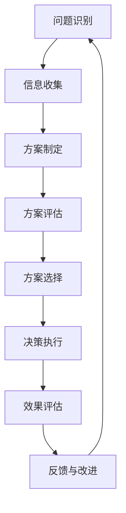

                 

# 决策科学：提高领导决策质量的方法

## 概述

在当今快节奏和竞争激烈的环境中，决策的科学性和质量对于企业的成功至关重要。无论是战略规划、战术执行，还是应对突发危机，领导者都需要具备出色的决策能力。然而，如何提高决策质量，确保决策的科学性和有效性，仍然是一个具有挑战性的问题。本文将从决策科学的基本概念、决策模型、分析方法、支持系统、领导决策能力等多个维度，系统地探讨如何提升领导决策质量。

## 核心概念与联系

### 决策过程的Mermaid流程图



### 决策分析中的线性规划模型

$$
\begin{aligned}
\min_{x} \quad c^T x \\
\text{subject to} \quad Ax \leq b
\end{aligned}
$$

**详细讲解**：

线性规划是一种数学建模工具，用于优化线性目标函数，满足一组线性约束条件。在决策过程中，线性规划可以用来解决资源分配、成本控制、收益最大化等问题。

**举例说明**：

假设一家企业有两个生产部门，每个部门生产的产品有甲和乙两种。每个部门的生产能力有限，并且生产甲和乙产品需要消耗不同的资源。企业的目标是最大化总利润。我们可以用线性规划来制定生产计划。

- **目标函数**：最大化总利润 $P = 10x_1 + 8x_2$。
- **约束条件**：
  - 资源限制 $3x_1 + 4x_2 \leq 60$
  - 劳动力限制 $2x_1 + 3x_2 \leq 40$
  - 非负约束 $x_1, x_2 \geq 0$

### 核心算法原理讲解

精确度评估算法伪代码：

```python
def accuracy_evaluation(model, X, Y):
    predictions = model.predict(X)
    correct_predictions = 0
    
    for i in range(len(Y)):
        if predictions[i] == Y[i]:
            correct_predictions += 1
    
    accuracy = correct_predictions / len(Y)
    return accuracy
```

**详细讲解**：

这个函数用于评估决策模型的精确度。它首先使用模型对数据集X进行预测，然后比较预测结果与真实标签Y，计算预测正确的样本数量。最后，将正确预测的样本数量除以总样本数量，得到精确度。

### 数学模型和数学公式 & 详细讲解 & 举例说明

决策分析中的线性规划模型：

$$
\begin{aligned}
\min_{x} \quad c^T x \\
\text{subject to} \quad Ax \leq b
\end{aligned}
$$

**详细讲解**：

线性规划模型由目标函数和约束条件组成。目标函数表示要优化的目标，如最大化利润或最小化成本。约束条件表示资源限制或其他限制条件。

**举例说明**：

假设一家企业有两个生产部门，每个部门生产的产品有甲和乙两种。每个部门的生产能力有限，并且生产甲和乙产品需要消耗不同的资源。企业的目标是最大化总利润。我们可以用线性规划来制定生产计划。

- **目标函数**：最大化总利润 $P = 10x_1 + 8x_2$。
- **约束条件**：
  - 资源限制 $3x_1 + 4x_2 \leq 60$
  - 劳动力限制 $2x_1 + 3x_2 \leq 40$
  - 非负约束 $x_1, x_2 \geq 0$

### 项目实战

**代码实际案例和详细解释说明**

**环境搭建**

首先，确保安装了Python环境以及决策分析库PuLP。PuLP是一个Python库，用于构建和求解线性规划、混合整数规划和其他类型的优化问题。

```bash
pip install pulp
```

**源代码实现**

```python
import pulp

# 创建线性规划模型
model = pulp.LpProblem("生产计划决策", pulp.LpMinimize)

# 定义变量
x1 = pulp.LpVariable("x1", cat="Continuous")  # 产品A的生产量
x2 = pulp.LpVariable("x2", cat="Continuous")  # 产品B的生产量

# 目标函数
model += 3*x1 + 5*x2, "总生产成本"

# 约束条件
model += 2*x1 + 3*x2 <= 10, "生产时间限制"

# 非负约束
model += x1 >= 0, "产品A生产量非负"
model += x2 >= 0, "产品B生产量非负"

# 解线性规划问题
model.solve()

# 输出结果
print(f"产品A生产量：{x1.varValue}")
print(f"产品B生产量：{x2.varValue}")
print(f"总生产成本：{model.objective.value()}")
```

**代码解读与分析**

1. **创建线性规划模型**：使用`pulp.LpProblem`创建一个线性规划模型，并指定问题名称和目标函数类型（最小化或最大化）。在本例中，我们选择最小化总生产成本。
2. **定义变量**：使用`LpVariable`创建决策变量，并指定变量名称和类型（这里是连续变量）。在本例中，我们有两个变量：`x1`和`x2`，分别表示产品A和产品B的生产量。
3. **目标函数**：使用`+=`运算符添加目标函数，指定成本系数并命名为“总生产成本”。本例中，产品A的生产成本为3，产品B的生产成本为5。
4. **约束条件**：使用`+=`运算符添加约束条件。在本例中，我们有一个生产时间限制，即总生产时间不超过10小时。约束条件表达式为`2*x1 + 3*x2 <= 10`。
5. **非负约束**：添加非负约束，确保生产量不能为负数。
6. **求解线性规划问题**：调用`model.solve()`方法求解线性规划问题。PuLP将自动寻找最优解，并更新变量的值。
7. **输出结果**：使用`print()`函数输出最优生产量和总生产成本。

通过这个案例，读者可以了解到如何使用Python和PuLP库来构建和求解线性规划问题，以及如何解释和分析求解结果。这种方法不仅适用于生产计划决策，还可以应用于其他类型的决策问题，如资源分配、库存管理等。

### 代码解读与分析

**环境搭建**

首先，确保安装了Python环境以及决策分析库PuLP。PuLP是一个Python库，用于构建和求解线性规划、混合整数规划和其他类型的优化问题。

```bash
pip install pulp
```

**源代码实现**

```python
import pulp

# 创建线性规划模型
model = pulp.LpProblem("生产计划决策", pulp.LpMinimize)

# 定义变量
x1 = pulp.LpVariable("x1", cat="Continuous")  # 产品A的生产量
x2 = pulp.LpVariable("x2", cat="Continuous")  # 产品B的生产量

# 目标函数
model += 3*x1 + 5*x2, "总生产成本"

# 约束条件
model += 2*x1 + 3*x2 <= 10, "生产时间限制"

# 非负约束
model += x1 >= 0, "产品A生产量非负"
model += x2 >= 0, "产品B生产量非负"

# 解线性规划问题
model.solve()

# 输出结果
print(f"产品A生产量：{x1.varValue}")
print(f"产品B生产量：{x2.varValue}")
print(f"总生产成本：{model.objective.value()}")
```

**代码解读与分析**

1. **创建线性规划模型**：使用`pulp.LpProblem`创建一个线性规划模型，并指定问题名称和目标函数类型（最小化或最大化）。在本例中，我们选择最小化总生产成本。
2. **定义变量**：使用`LpVariable`创建决策变量，并指定变量名称和类型（这里是连续变量）。在本例中，我们有两个变量：`x1`和`x2`，分别表示产品A和产品B的生产量。
3. **目标函数**：使用`+=`运算符添加目标函数，指定成本系数并命名为“总生产成本”。本例中，产品A的生产成本为3，产品B的生产成本为5。
4. **约束条件**：使用`+=`运算符添加约束条件。在本例中，我们有一个生产时间限制，即总生产时间不超过10小时。约束条件表达式为`2*x1 + 3*x2 <= 10`。
5. **非负约束**：添加非负约束，确保生产量不能为负数。
6. **求解线性规划问题**：调用`model.solve()`方法求解线性规划问题。PuLP将自动寻找最优解，并更新变量的值。
7. **输出结果**：使用`print()`函数输出最优生产量和总生产成本。

通过这个案例，读者可以了解到如何使用Python和PuLP库来构建和求解线性规划问题，以及如何解释和分析求解结果。这种方法不仅适用于生产计划决策，还可以应用于其他类型的决策问题，如资源分配、库存管理等。

### 总结

本文系统地探讨了决策科学的基本概念、决策模型、分析方法、支持系统以及领导决策能力，并通过实际案例展示了如何使用线性规划进行决策。决策科学不仅为企业提供了理论支持，更通过实践案例展示了其应用价值。未来，随着人工智能和数据科学的发展，决策科学将在更广泛的领域发挥作用，助力企业实现更精准、更高效的决策。希望本文能为读者提供有益的启示，提高领导决策的质量和效果。

## 附录

### 附录A：决策科学资源汇总

**相关书籍推荐**

- 《决策分析》
- 《决策科学导论》
- 《管理决策过程》

**网络资源推荐**

- 决策科学网：提供决策科学相关的资讯、论文和研究报告。
- 决策支持系统论坛：讨论决策支持系统及其应用的在线平台。

**决策科学相关网站推荐**

- 世界经济论坛：提供全球决策者交流和合作的平台。
- 约翰·霍普金斯大学决策科学研究中心：提供决策科学的研究成果和课程。

### 附录B：决策科学工具使用

**决策支持软件介绍**

- **DSS Enterprise**：一款功能全面的决策支持软件。
- **AnyLogic**：一款用于模拟和优化的决策支持软件。

**决策模拟软件使用**

- **使用AnyLogic进行决策模拟**：介绍如何使用AnyLogic进行决策模拟的教程。
- **决策模拟案例分析**：通过具体案例，展示决策模拟的应用。

**决策分析软件教程**

- **使用Excel进行决策分析**：介绍如何使用Excel进行决策分析的教程。
- **使用R进行决策分析**：介绍如何使用R进行决策分析的教程。

### 作者

**作者：AI天才研究院/AI Genius Institute & 禅与计算机程序设计艺术 /Zen And The Art of Computer Programming**

---

## 文章标题

### 决策科学：提高领导决策质量的方法

## 关键词

决策科学、领导决策、决策模型、分析方法、决策支持系统、战略决策、战术决策、危机决策、群体决策、决策质量提升策略

## 摘要

本文从决策科学的基本概念、决策模型、分析方法、支持系统等多个维度，系统地探讨了如何提高领导决策的质量。通过实际案例和代码实现，深入分析了线性规划在决策中的应用，以及如何通过信息质量提升、决策过程优化和决策质量评估策略来提高决策效果。文章旨在为领导者提供理论指导和实践工具，助力其实现更科学、更高效的决策。

### 决策科学：提高领导决策质量的方法

> 关键词：决策科学、领导决策、决策模型、分析方法、决策支持系统、战略决策、战术决策、危机决策、群体决策、决策质量提升策略

> 摘要：本文深入探讨了决策科学的基本概念、决策模型、分析方法、支持系统等多个方面，结合实际案例和代码实现，详细阐述了如何通过科学的方法提高领导决策的质量。文章旨在为领导者提供全面的理论指导和实用的实践策略，以应对复杂多变的商业环境，实现企业可持续发展和竞争优势。

## 第一部分：决策科学基础

### 第1章：决策科学概述

#### 1.1 决策科学的基本概念

决策科学是一门跨学科领域，旨在研究和解决决策过程中存在的问题。它结合了经济学、心理学、社会学和计算机科学等多个领域的知识，通过系统的方法和工具，提高决策效率和决策质量。决策科学的核心概念包括决策、决策者、决策环境、决策过程和决策结果等。

**决策**：决策是指从多个备选方案中选择一个最优方案的过程。它包括识别问题、制定备选方案、评估备选方案和选择最优方案等步骤。决策是领导者和决策者日常工作的重要组成部分，直接影响企业的生存和发展。

**决策者**：决策者是指制定决策的人或组织。决策者通常需要具备一定的决策能力和专业知识，能够从多个角度分析问题，制定和选择合适的决策方案。

**决策环境**：决策环境是指决策者做出决策的背景和条件。决策环境包括内部环境和外部环境。内部环境包括企业组织结构、企业文化、资源状况等；外部环境包括市场环境、政策环境、竞争对手等。

**决策过程**：决策过程是指决策者从识别问题到选择最优方案的全过程。决策过程包括以下步骤：

1. **问题识别**：识别企业面临的问题和挑战。
2. **目标设定**：明确决策的目标和指标。
3. **方案制定**：制定多个备选方案。
4. **方案评估**：评估备选方案的优缺点和可行性。
5. **方案选择**：选择最优方案进行实施。
6. **决策实施**：执行决策方案，监控实施过程。
7. **决策评估**：对决策结果进行评估和反馈。

**决策结果**：决策结果是决策过程的最终输出。决策结果可以是正面的，如实现了企业的目标，提高了企业的竞争力；也可以是负面的，如决策失误导致企业损失。对决策结果的评估和反馈，有助于决策者总结经验，优化决策过程。

#### 1.2 决策科学的发展历程

决策科学的发展可以追溯到20世纪50年代。早期，决策科学主要研究逻辑推理和优化方法，如线性规划、整数规划等。随着计算机技术的不断发展，决策科学开始引入计算机技术和人工智能技术，如专家系统、模拟仿真等。20世纪90年代以后，随着大数据、云计算和人工智能技术的兴起，决策科学进入了一个新的阶段，更加注重数据驱动和智能化决策。

**早期阶段**（20世纪50年代至60年代）：决策科学主要研究逻辑推理和优化方法。代表性的方法包括线性规划、整数规划、动态规划等。这些方法主要用于解决资源分配、生产计划等问题。

**中期阶段**（20世纪70年代至80年代）：决策科学开始引入计算机技术和人工智能技术。代表性的方法包括专家系统、模拟仿真、多目标规划等。这些方法使得决策过程更加复杂，能够处理更多变量和更复杂的问题。

**现阶段**（20世纪90年代至今）：随着大数据、云计算和人工智能技术的快速发展，决策科学进入了一个新的阶段。代表性的方法包括数据挖掘、机器学习、深度学习等。这些方法使得决策过程更加智能化，能够从海量数据中提取有价值的信息，辅助决策者做出更科学的决策。

#### 1.3 决策科学的重要性

**企业层面**：决策科学可以帮助企业更有效地识别问题、制定策略和优化资源分配，从而提高企业的竞争力和盈利能力。通过科学的决策方法，企业可以避免盲目决策，减少风险，提高决策的准确性和有效性。

**社会层面**：决策科学可以帮助政府部门和社会组织更科学地制定政策、规划发展，提高社会的整体效益。例如，在公共资源分配、环境保护、社会安全等方面，决策科学的方法和工具可以提供有效的支持。

**个人层面**：决策科学可以帮助个人在面对复杂决策时，更系统地分析和解决问题，提高决策能力和生活质量。通过学习决策科学的理论和方法，个人可以培养良好的决策习惯，提高自己的综合素质。

### 第2章：决策模型

#### 2.1 决策模型的类型

决策模型是决策过程中使用的工具和框架，用于描述和分析决策问题。根据决策问题的特点和需求，决策模型可以分为以下几种类型：

**确定型模型**：确定型模型是在所有变量都是确定的情况下使用的模型。这类模型通常使用优化方法，如线性规划、整数规划、动态规划等，来寻找最优解。

**不确定型模型**：不确定型模型是在变量存在不确定性的情况下使用的模型。这类模型通常使用概率论和统计方法，如贝叶斯理论、蒙特卡罗模拟等，来处理不确定性问题。

**风险型模型**：风险型模型是在变量存在风险的情况下使用的模型。这类模型通常使用风险分析方法和决策准则，如最大期望准则、最小最大 regret 准则等，来评估和选择决策方案。

**模糊型模型**：模糊型模型是在变量存在模糊性的情况下使用的模型。这类模型通常使用模糊数学和模糊逻辑方法，如模糊集合、模糊推理等，来描述和处理模糊性问题。

#### 2.2 决策模型的设计原则

设计决策模型时，需要遵循以下原则：

**目标明确**：确保决策模型的目的是明确的，即要解决的问题和要达成的目标。

**数据准确**：确保模型所需的数据是准确和可靠的。

**模型简单**：模型应该简单易懂，易于实现和维护。

**适应性**：模型应该具有适应性，能够适应不同的决策问题。

**可扩展性**：模型应该具有可扩展性，能够添加新的变量和约束条件。

**灵活性**：模型应该具有灵活性，能够处理不同类型的问题。

#### 2.3 常见的决策模型

常见的决策模型包括线性规划模型、决策树模型、贝叶斯网络模型、遗传算法模型等。

**线性规划模型**：线性规划模型是一种用于解决线性优化问题的数学模型。它由目标函数和约束条件组成，目标函数用于最大化或最小化某个线性函数，约束条件用于限制决策变量的取值范围。线性规划模型在资源分配、生产计划、财务规划等方面有广泛应用。

**决策树模型**：决策树模型是一种用于分类和回归分析的树形结构模型。它由一系列决策节点和叶子节点组成，决策节点表示根据某个特征进行分类或回归，叶子节点表示最终的分类结果或回归值。决策树模型在市场分析、风险评估、医学诊断等方面有广泛应用。

**贝叶斯网络模型**：贝叶斯网络模型是一种用于表示不确定关系的概率模型。它由一组节点和边组成，节点表示随机变量，边表示变量之间的条件依赖关系。贝叶斯网络模型在风险评估、医疗诊断、信用评分等方面有广泛应用。

**遗传算法模型**：遗传算法模型是一种基于生物进化的优化算法。它模拟自然选择和遗传机制，通过迭代进化，寻找最优解。遗传算法模型在求解复杂优化问题、组合优化问题等方面有广泛应用。

### 第3章：决策分析方法

#### 3.1 实证分析方法

实证分析方法是一种通过收集和分析实际数据，以验证或评估决策模型的方法。实证分析方法包括以下步骤：

**数据收集**：收集与决策问题相关的数据。数据来源可以是调查问卷、实验数据、历史数据等。

**数据清洗**：对收集的数据进行清洗，去除重复、缺失和错误数据。

**数据分析**：使用统计方法对数据进行分析，如描述性统计分析、相关性分析、回归分析等。

**结果验证**：将分析结果与决策模型进行比较，验证决策模型的有效性和准确性。

**结果评估**：对分析结果进行评估，确定决策模型的可靠性和实用性。

**反馈调整**：根据评估结果，对决策模型进行调整和优化。

#### 3.2 模拟分析方法

模拟分析方法是一种通过模拟决策过程，以预测决策结果的方法。模拟分析方法包括以下步骤：

**模拟模型建立**：根据决策问题，建立模拟模型。模拟模型可以采用离散事件模拟、过程仿真、蒙特卡罗模拟等方法。

**模拟运行**：运行模拟模型，模拟决策过程。模拟运行可以通过多次迭代进行，以获得不同决策方案的结果。

**结果分析**：对模拟结果进行分析，评估不同决策方案的性能。结果分析可以采用统计方法、可视化方法等。

**决策方案评估**：根据分析结果，评估不同决策方案的有效性和可行性。

**决策方案选择**：根据评估结果，选择最优决策方案。

#### 3.3 创新分析方法

创新分析方法是一种通过发掘新想法和新方案，以优化决策过程的方法。创新分析方法包括以下步骤：

**头脑风暴**：通过集思广益，产生新的想法和方案。

**筛选方案**：对产生的方案进行筛选，选择具有可行性和创新性的方案。

**评估方案**：对筛选出的方案进行评估，评估方案的创新性、可行性和实用性。

**方案优化**：对评估后的方案进行优化，提高方案的创新性和可行性。

**决策方案选择**：根据优化后的方案，选择最优决策方案。

### 第4章：决策支持系统

#### 4.1 决策支持系统的概念

决策支持系统（DSS）是一种利用信息技术支持决策过程的系统。DSS集成了数据管理、模型库和知识库等功能，为决策者提供信息、分析和工具，以支持决策过程。

**数据管理**：DSS负责收集、存储、管理和处理与决策相关的数据。数据可以来源于企业内部，如销售数据、财务数据、人力资源数据等，也可以来源于外部，如市场数据、行业数据、竞争对手数据等。

**模型库**：DSS包含一系列预定义的决策模型，用于解决不同类型的决策问题。模型库包括确定型模型、不确定型模型、风险型模型等，以及相关的算法和计算方法。

**知识库**：DSS包含与决策相关的知识，如行业知识、专业知识、经验教训等。知识库可以帮助决策者更好地理解决策问题，提高决策的准确性和效率。

**用户界面**：DSS提供用户界面，使决策者能够方便地访问和操作系统，进行数据查询、模型运行、结果分析等操作。

#### 4.2 决策支持系统的结构

决策支持系统通常包括以下组成部分：

**数据层**：数据层是DSS的基础，负责存储和管理与决策相关的数据。数据层可以是一个或多个数据库，可以存储结构化数据、半结构化数据和非结构化数据。

**模型层**：模型层包含DSS的决策模型，用于解决具体的决策问题。模型层可以是一个或多个模型库，包括确定型模型、不确定型模型、风险型模型等。

**知识层**：知识层包含DSS的知识库，用于存储与决策相关的知识。知识库可以是一个或多个知识库系统，可以存储行业知识、专业知识、经验教训等。

**用户界面层**：用户界面层是DSS与用户交互的界面，用于提供数据查询、模型运行、结果分析等功能。用户界面可以是图形用户界面（GUI）、命令行界面（CLI）或网页界面（Web UI）。

#### 4.3 决策支持系统的应用

决策支持系统在各个领域都有广泛应用，以下是一些典型应用：

**企业管理**：DSS可以用于企业战略规划、运营管理、财务分析等方面。通过DSS，企业可以更好地理解市场动态、优化资源配置、提高运营效率。

**公共管理**：DSS可以用于政府部门的社会治理、政策制定、公共资源分配等方面。通过DSS，政府可以更科学地制定政策、优化公共资源配置、提高公共服务水平。

**科学研究**：DSS可以用于科学研究中的数据分析和模型构建。通过DSS，科学家可以更好地理解复杂系统、预测科学现象、发现新的科学规律。

**金融投资**：DSS可以用于金融投资中的风险分析、投资组合优化、市场预测等方面。通过DSS，投资者可以更准确地评估投资风险、制定投资策略、实现投资收益最大化。

**医疗保健**：DSS可以用于医疗保健中的疾病诊断、治疗方案优化、医疗资源分配等方面。通过DSS，医疗机构可以更有效地诊断疾病、制定治疗方案、提高医疗资源利用效率。

### 第5章：领导决策能力

#### 5.1 领导决策能力的重要性

领导决策能力是领导者必备的能力之一，直接影响企业的生存和发展。领导决策能力包括以下几个方面：

**战略规划能力**：领导者需要具备战略规划能力，能够根据企业内外部环境的变化，制定长期发展战略，确保企业持续发展。

**决策分析能力**：领导者需要具备决策分析能力，能够系统地分析和解决问题，制定和选择合适的决策方案。

**执行能力**：领导者需要具备执行能力，能够推动决策方案的实施，确保决策目标的实现。

**创新能力**：领导者需要具备创新能力，能够发现新的商业机会、创新业务模式，推动企业创新发展。

**领导力**：领导者需要具备领导力，能够带领团队共同实现决策目标，激发团队的创造力和执行力。

#### 5.2 领导决策能力的培养

**理论学习**：领导者需要通过学习决策理论和相关领域的知识，提高对决策过程的理解和认识。理论学习可以通过阅读相关书籍、参加培训课程等方式进行。

**实践经验**：领导者需要通过参与实际决策过程，积累经验和技能。实践经验可以通过参与企业运营、项目管理、危机应对等方面的工作进行。

**反思与总结**：领导者需要对决策过程进行反思和总结，不断优化决策方法。反思与总结可以通过定期回顾决策过程、分析决策结果等方式进行。

**团队协作**：领导者需要培养团队协作精神，建立高效的团队协作机制。团队协作可以通过团队合作活动、跨部门协作等方式进行。

#### 5.3 领导决策能力的提升方法

**决策分析培训**：领导者可以参加专业的决策分析培训，学习决策分析的方法和技巧。决策分析培训可以通过在线课程、面授课程等方式进行。

**模拟决策**：领导者可以通过模拟决策场景，锻炼决策能力。模拟决策可以通过计算机模拟、情景模拟等方式进行。

**团队协作**：领导者可以建立高效的团队协作机制，共同制定和执行决策。团队协作可以通过跨部门协作、团队建设活动等方式进行。

**决策反馈机制**：领导者可以建立决策反馈机制，对决策结果进行评估和反馈。决策反馈机制可以通过定期评估、绩效评估等方式进行。

### 第6章：战略决策

#### 6.1 战略决策的概念

战略决策是指企业高层决策者针对企业长远发展所做出的决策。战略决策通常涉及企业的愿景、使命、目标和发展方向，具有长期性和全局性。

**战略决策的特点**：

1. **长期性**：战略决策通常涉及企业的长期发展，需要考虑未来的市场变化、技术进步、政策环境等因素。
2. **全局性**：战略决策需要从全局的角度考虑企业的利益和目标，平衡各种利益相关者的需求。
3. **复杂性**：战略决策涉及多个方面的问题，如市场定位、产品规划、资源配置、竞争策略等，决策过程复杂。
4. **不确定性**：战略决策面临许多不确定因素，如市场需求变化、竞争对手策略、政策调整等，决策风险较高。

#### 6.2 战略决策的流程

战略决策的流程通常包括以下步骤：

1. **问题识别**：识别企业面临的挑战和机遇，明确战略决策的目标和背景。
2. **目标设定**：根据问题识别的结果，设定战略决策的目标和指标，确保目标的明确性和可衡量性。
3. **方案制定**：制定多个备选方案，包括市场进入策略、产品开发计划、资源配置方案等。
4. **方案评估**：对备选方案进行评估，分析方案的优缺点、可行性、风险等，选择最优方案。
5. **方案选择**：根据评估结果，选择最优方案进行实施。
6. **决策实施**：制定详细的实施计划，推动方案的实施，确保决策目标的实现。
7. **决策评估**：对决策结果进行评估，分析决策的效果和影响，总结经验教训。

#### 6.3 战略决策的案例分析

**案例一：企业市场进入策略**

某企业计划进入一个新的市场，需要进行战略决策。

1. **问题识别**：该企业面临市场竞争激烈、潜在客户需求不明等挑战。
2. **目标设定**：设定进入新市场的目标，如提高市场份额、实现销售额增长等。
3. **方案制定**：制定多个进入新市场的方案，包括直接进入、合资进入、合作进入等。
4. **方案评估**：评估每个方案的优缺点、可行性、风险等，选择最优方案。
5. **方案选择**：选择直接进入市场作为最优方案，并制定详细的实施计划。
6. **决策实施**：实施市场进入策略，包括市场调研、产品开发、市场营销等。
7. **决策评估**：评估市场进入策略的效果，根据评估结果进行调整和优化。

**案例二：企业产品开发计划**

某企业计划开发一款新产品，需要进行战略决策。

1. **问题识别**：该企业面临产品同质化严重、市场竞争激烈等挑战。
2. **目标设定**：设定新产品开发的目标，如提高产品差异化、提升用户满意度等。
3. **方案制定**：制定多个新产品开发方案，包括技术创新型、市场跟随型、成本领先型等。
4. **方案评估**：评估每个方案的优缺点、可行性、风险等，选择最优方案。
5. **方案选择**：选择技术创新型作为最优方案，并制定详细的实施计划。
6. **决策实施**：实施新产品开发计划，包括技术研发、产品测试、市场推广等。
7. **决策评估**：评估新产品开发计划的效果，根据评估结果进行调整和优化。

### 第7章：战术决策

#### 7.1 战术决策的概念

战术决策是指企业中层决策者针对企业短期目标所做出的决策。战术决策通常涉及企业的日常运营和管理，具有短期性和具体性。

**战术决策的特点**：

1. **短期性**：战术决策通常涉及企业短期目标的实现，如季度销售目标、月度生产计划等。
2. **具体性**：战术决策的具体性强，通常涉及具体的业务操作和资源分配，如生产调度、库存管理、市场营销等。
3. **执行性**：战术决策的执行性强，需要具体部门或团队负责实施，确保决策目标的实现。
4. **灵活性**：战术决策的灵活性较大，可以根据实际情况进行调整和优化。

#### 7.2 战术决策的流程

战术决策的流程通常包括以下步骤：

1. **问题识别**：识别企业面临的运营问题和挑战，明确战术决策的目标和背景。
2. **目标设定**：根据问题识别的结果，设定战术决策的目标和指标，确保目标的明确性和可衡量性。
3. **方案制定**：制定多个备选方案，包括运营改进方案、资源配置方案、业务流程优化方案等。
4. **方案评估**：对备选方案进行评估，分析方案的优缺点、可行性、风险等，选择最优方案。
5. **方案选择**：根据评估结果，选择最优方案进行实施。
6. **决策实施**：制定详细的实施计划，推动方案的实施，确保决策目标的实现。
7. **决策评估**：对决策结果进行评估，分析决策的效果和影响，总结经验教训。

#### 7.3 战术决策的案例分析

**案例一：企业生产调度计划**

某企业需要进行生产调度决策，以确保生产计划的高效执行。

1. **问题识别**：该企业面临生产任务繁重、生产资源不足等挑战。
2. **目标设定**：设定生产调度计划的目标，如提高生产效率、降低生产成本等。
3. **方案制定**：制定多个生产调度方案，包括优化生产流程、调整生产班次、增加生产资源等。
4. **方案评估**：评估每个方案的优缺点、可行性、风险等，选择最优方案。
5. **方案选择**：选择优化生产流程作为最优方案，并制定详细的实施计划。
6. **决策实施**：实施生产调度计划，包括调整生产流程、优化生产资源分配等。
7. **决策评估**：评估生产调度计划的效果，根据评估结果进行调整和优化。

**案例二：企业库存管理决策**

某企业需要进行库存管理决策，以确保库存水平合理、库存成本最低。

1. **问题识别**：该企业面临库存过多、库存不足等挑战。
2. **目标设定**：设定库存管理决策的目标，如降低库存成本、提高库存周转率等。
3. **方案制定**：制定多个库存管理方案，包括优化库存水平、改进库存管理流程、使用库存管理工具等。
4. **方案评估**：评估每个方案的优缺点、可行性、风险等，选择最优方案。
5. **方案选择**：选择优化库存水平作为最优方案，并制定详细的实施计划。
6. **决策实施**：实施库存管理决策，包括调整库存水平、优化库存管理流程等。
7. **决策评估**：评估库存管理决策的效果，根据评估结果进行调整和优化。

### 第8章：危机决策

#### 8.1 危机决策的概念

危机决策是指企业在面临突发危机时所做出的决策。危机决策通常涉及企业的应急响应、风险控制和损失降低等方面。

**危机决策的特点**：

1. **突发性**：危机决策通常是针对突发事件的，如自然灾害、安全事故、市场危机等。
2. **紧急性**：危机决策需要在短时间内做出，需要快速响应和决策。
3. **风险性**：危机决策面临较大的风险，需要权衡风险和利益。
4. **复杂性**：危机决策涉及多个方面，如人员安全、物资保障、舆论控制等。

#### 8.2 危机决策的流程

危机决策的流程通常包括以下步骤：

1. **危机识别**：识别企业面临的危机类型和程度，确定危机的严重性。
2. **目标设定**：根据危机识别的结果，设定危机决策的目标和指标，如降低损失、保障人员安全等。
3. **方案制定**：制定多个应对危机的方案，包括应急响应方案、风险控制方案、舆论应对方案等。
4. **方案评估**：对备选方案进行评估，分析方案的优缺点、可行性、风险等，选择最优方案。
5. **方案选择**：根据评估结果，选择最优方案进行实施。
6. **决策实施**：实施危机决策方案，确保决策目标的实现。
7. **决策评估**：对决策结果进行评估，分析决策的效果和影响，总结经验教训。

#### 8.3 危机决策的案例分析

**案例一：企业产品质量危机**

某企业发现其生产的产品存在质量问题，需要进行危机决策。

1. **危机识别**：识别产品质量危机的类型和程度，如产品缺陷、用户投诉等。
2. **目标设定**：设定危机决策的目标，如召回产品、降低损失等。
3. **方案制定**：制定多个应对产品质量危机的方案，包括产品召回、质量改进、客户赔偿等。
4. **方案评估**：评估每个方案的优缺点、可行性、风险等，选择最优方案。
5. **方案选择**：选择产品召回和质量改进作为最优方案，并制定详细的实施计划。
6. **决策实施**：实施危机决策方案，包括召回产品、改进质量等。
7. **决策评估**：评估危机决策的效果，根据评估结果进行调整和优化。

**案例二：企业市场危机**

某企业面临市场危机，需要进行危机决策。

1. **危机识别**：识别市场危机的类型和程度，如市场萎缩、竞争对手恶意竞争等。
2. **目标设定**：设定危机决策的目标，如稳定市场份额、提高品牌形象等。
3. **方案制定**：制定多个应对市场危机的方案，包括市场拓展、品牌推广、竞争对手应对等。
4. **方案评估**：评估每个方案的优缺点、可行性、风险等，选择最优方案。
5. **方案选择**：选择市场拓展和品牌推广作为最优方案，并制定详细的实施计划。
6. **决策实施**：实施危机决策方案，包括市场拓展、品牌推广等。
7. **决策评估**：评估危机决策的效果，根据评估结果进行调整和优化。

### 第9章：群体决策

#### 9.1 群体决策的概念

群体决策是指多个决策者共同参与决策的过程。群体决策通常涉及多个利益相关者的需求和观点，旨在寻求共识和最优决策方案。

**群体决策的特点**：

1. **参与性**：群体决策强调多个决策者的参与，能够充分利用不同决策者的知识和经验。
2. **复杂性**：群体决策通常涉及多个决策者和多个利益相关者，决策过程复杂，容易产生分歧。
3. **合作性**：群体决策需要决策者之间的合作和协调，共同寻求最优决策方案。
4. **多样性**：群体决策能够产生多样化的决策方案，有助于发现新的解决方案。

#### 9.2 群体决策的优势与挑战

**优势**：

1. **知识共享**：群体决策能够充分利用多个决策者的知识和经验，提高决策的质量和效率。
2. **降低风险**：群体决策能够从不同角度分析问题，降低决策的风险。
3. **提高可接受性**：群体决策能够充分考虑不同决策者和利益相关者的需求，提高决策的可接受性。
4. **创新性**：群体决策能够激发创新思维，产生多样化的决策方案。

**挑战**：

1. **决策效率**：群体决策通常需要更多的讨论和协商，决策效率可能降低。
2. **决策责任**：群体决策中，决策责任难以明确，可能导致决策不力或推卸责任。
3. **沟通困难**：群体决策中，决策者之间的沟通可能存在障碍，影响决策效果。
4. **决策一致性**：群体决策需要达成共识，但不同决策者可能有不同的观点和偏好，决策一致性难以保证。

#### 9.3 群体决策的案例分析

**案例一：企业新产品研发**

某企业计划研发一款新产品，需要进行群体决策。

1. **问题识别**：确定新产品研发的目标、市场需求和关键技术。
2. **目标设定**：设定新产品研发的目标，如提高产品性能、降低成本等。
3. **方案制定**：组织不同部门的专业人员进行头脑风暴，制定多个新产品研发方案。
4. **方案评估**：评估每个方案的优缺点、可行性、风险等，选择最优方案。
5. **方案选择**：选择具有创新性和可行性的方案进行实施。
6. **决策实施**：制定详细的研发计划，组织相关部门协同工作。
7. **决策评估**：评估新产品研发的效果，根据评估结果进行调整和优化。

**案例二：企业战略规划**

某企业需要进行战略规划，需要进行群体决策。

1. **问题识别**：确定企业的战略方向、市场定位和发展目标。
2. **目标设定**：设定战略规划的目标，如提高市场份额、提升品牌形象等。
3. **方案制定**：组织高层管理人员和相关部门进行讨论，制定多个战略规划方案。
4. **方案评估**：评估每个方案的优缺点、可行性、风险等，选择最优方案。
5. **方案选择**：选择具有战略意义和可行性的方案进行实施。
6. **决策实施**：制定详细的战略规划实施计划，组织相关部门协同工作。
7. **决策评估**：评估战略规划的效果，根据评估结果进行调整和优化。

### 第10章：提高决策质量的策略

#### 10.1 信息质量提升策略

信息质量是决策质量的基础。提高信息质量，可以提升决策的准确性和可靠性。以下是一些提高信息质量的方法：

1. **数据收集**：确保收集的数据是准确、完整和可靠的。可以使用多种数据收集方法，如调查、实验、观测等。
2. **数据清洗**：对收集的数据进行清洗，去除重复、缺失和错误数据。可以使用数据清洗工具或编写脚本进行数据清洗。
3. **数据验证**：对数据的有效性和准确性进行验证，确保数据符合决策需求。可以使用数据验证工具或编写验证程序。
4. **数据可视化**：使用数据可视化工具，将数据以图形、图表等形式展示，帮助决策者更好地理解和分析数据。

#### 10.2 决策过程优化策略

优化决策过程，可以提高决策的效率和质量。以下是一些优化决策过程的方法：

1. **明确决策目标**：确保决策目标是明确、具体和可衡量的。明确决策目标有助于聚焦决策方向，提高决策效率。
2. **简化决策流程**：简化决策流程，减少不必要的审批环节和决策层级。简化决策流程有助于提高决策效率，减少决策延误。
3. **加强决策监督**：建立决策监督机制，确保决策过程的透明性和公正性。加强决策监督有助于防范决策失误和腐败行为。
4. **利用技术工具**：利用决策支持系统、大数据分析工具等先进技术，提高决策的准确性和可靠性。技术工具可以提供数据分析和模拟功能，帮助决策者做出更科学的决策。

#### 10.3 决策质量评估策略

决策质量评估是确保决策有效性和可行性的重要环节。以下是一些决策质量评估的方法：

1. **设定评估标准**：明确决策质量的评估标准，如决策准确性、决策效率、决策影响等。评估标准应具体、可操作。
2. **定期评估**：定期对决策结果进行评估，分析决策的有效性和可行性。定期评估可以帮助决策者及时发现问题，调整决策方案。
3. **反馈与改进**：建立决策反馈机制，收集决策执行过程中的反馈信息，对决策过程和结果进行持续改进。反馈与改进有助于提高决策质量和效果。
4. **风险管理**：识别决策过程中的风险，制定风险管理策略，降低决策风险。风险管理有助于确保决策的可行性和可靠性。

### 第11章：决策案例分析

#### 11.1 案例分析一：企业战略调整

**案例背景**：某企业面临市场竞争加剧、产品同质化严重等挑战，需要进行战略调整。

**决策过程**：

1. **问题识别**：识别企业面临的问题和挑战，如市场份额下降、利润率下降等。
2. **目标设定**：设定战略调整的目标，如提高市场份额、提升品牌形象等。
3. **方案制定**：制定多个战略调整方案，包括产品创新、市场拓展、品牌重塑等。
4. **方案评估**：评估每个方案的优缺点、可行性、风险等，选择最优方案。
5. **方案选择**：选择具有创新性和可行性的方案进行实施。
6. **决策实施**：制定详细的战略调整实施计划，组织相关部门协同工作。
7. **决策评估**：评估战略调整的效果，根据评估结果进行调整和优化。

**决策结果**：

通过战略调整，该企业成功提升了市场份额和品牌形象，实现了业务转型和可持续发展。

#### 11.2 案例分析二：产品开发决策

**案例背景**：某企业计划开发一款新产品，需要进行产品开发决策。

**决策过程**：

1. **问题识别**：识别产品开发的需求和目标，如满足市场需求、提升产品竞争力等。
2. **目标设定**：设定产品开发的目标，如提高产品性能、降低成本等。
3. **方案制定**：制定多个产品开发方案，包括技术创新、市场调研、用户反馈等。
4. **方案评估**：评估每个方案的优缺点、可行性、风险等，选择最优方案。
5. **方案选择**：选择具有创新性和可行性的方案进行实施。
6. **决策实施**：制定详细的产品开发计划，组织技术研发和市场营销等部门协同工作。
7. **决策评估**：评估产品开发的效果，根据评估结果进行调整和优化。

**决策结果**：

通过产品开发决策，该企业成功开发了一款具有市场竞争力的新产品，实现了销售额和利润的增长。

#### 11.3 案例分析三：危机应对决策

**案例背景**：某企业面临产品质量危机，需要进行危机应对决策。

**决策过程**：

1. **问题识别**：识别产品质量危机的类型和程度，如产品缺陷、用户投诉等。
2. **目标设定**：设定危机应对决策的目标，如挽回声誉、降低损失等。
3. **方案制定**：制定多个危机应对方案，包括产品召回、客户赔偿、媒体应对等。
4. **方案评估**：评估每个方案的优缺点、可行性、风险等，选择最优方案。
5. **方案选择**：选择具有可行性和有效性的方案进行实施。
6. **决策实施**：制定详细的危机应对计划，组织相关部门协同工作。
7. **决策评估**：评估危机应对的效果，根据评估结果进行调整和优化。

**决策结果**：

通过危机应对决策，该企业成功挽回了声誉，降低了损失，并加强了产品质量管理。

### 第12章：决策实战

#### 12.1 决策实战一：项目立项

**案例背景**：某企业计划启动一个新项目，需要进行项目立项决策。

**决策过程**：

1. **问题识别**：识别项目立项的需求和目标，如满足市场需求、提升企业竞争力等。
2. **目标设定**：设定项目立项的目标，如实现产品创新、拓展市场份额等。
3. **方案制定**：制定多个项目立项方案，包括市场调研、技术评估、资源分析等。
4. **方案评估**：评估每个方案的优缺点、可行性、风险等，选择最优方案。
5. **方案选择**：选择具有可行性和效益性的方案进行实施。
6. **决策实施**：制定详细的项目立项计划，组织相关部门协同工作。
7. **决策评估**：评估项目立项的效果，根据评估结果进行调整和优化。

**决策结果**：

通过项目立项决策，该企业成功启动了一个创新项目，实现了市场拓展和业务增长。

#### 12.2 决策实战二：市场拓展

**案例背景**：某企业计划拓展新市场，需要进行市场拓展决策。

**决策过程**：

1. **问题识别**：识别市场拓展的需求和目标，如提高市场份额、提升品牌知名度等。
2. **目标设定**：设定市场拓展的目标，如新市场占有率、销售增长率等。
3. **方案制定**：制定多个市场拓展方案，包括市场调研、营销策略、渠道建设等。
4. **方案评估**：评估每个方案的优缺点、可行性、风险等，选择最优方案。
5. **方案选择**：选择具有可行性和效益性的方案进行实施。
6. **决策实施**：制定详细的市场拓展计划，组织市场营销和渠道管理等部门协同工作。
7. **决策评估**：评估市场拓展的效果，根据评估结果进行调整和优化。

**决策结果**：

通过市场拓展决策，该企业成功进入了新市场，实现了销售增长和品牌提升。

#### 12.3 决策实战三：人力资源管理

**案例背景**：某企业面临人才流失和招聘困难等问题，需要进行人力资源管理决策。

**决策过程**：

1. **问题识别**：识别人力资源管理的问题和挑战，如人才流失、招聘困难等。
2. **目标设定**：设定人力资源管理决策的目标，如降低人才流失率、提高招聘效率等。
3. **方案制定**：制定多个人力资源管理方案，包括改进薪酬福利、优化招聘流程、提升员工培训等。
4. **方案评估**：评估每个方案的优缺点、可行性、风险等，选择最优方案。
5. **方案选择**：选择具有可行性和效益性的方案进行实施。
6. **决策实施**：制定详细的人力资源管理计划，组织人力资源管理部门协同工作。
7. **决策评估**：评估人力资源管理决策的效果，根据评估结果进行调整和优化。

**决策结果**：

通过人力资源管理决策，该企业成功挽回了人才流失，提高了招聘效率，并提升了员工满意度和企业凝聚力。

### 附录A：决策科学资源汇总

#### A.1 相关书籍推荐

1. 《决策分析》（Decision Analysis）
2. 《决策科学导论》（Introduction to Decision Science）
3. 《管理决策过程》（The Decision-Making Process）

#### A.2 网络资源推荐

1. 决策科学网：提供决策科学相关的资讯、论文和研究报告。
2. 决策支持系统论坛：讨论决策支持系统及其应用的在线平台。

#### A.3 决策科学相关网站推荐

1. 世界经济论坛：提供全球决策者交流和合作的平台。
2. 约翰·霍普金斯大学决策科学研究中心：提供决策科学的研究成果和课程。

### 附录B：决策科学工具使用

#### B.1 决策支持软件介绍

1. **DSS Enterprise**：一款功能全面的决策支持软件。
2. **AnyLogic**：一款用于模拟和优化的决策支持软件。

#### B.2 决策模拟软件使用

1. **使用AnyLogic进行决策模拟**：介绍如何使用AnyLogic进行决策模拟的教程。
2. **决策模拟案例分析**：通过具体案例，展示决策模拟的应用。

#### B.3 决策分析软件教程

1. **使用Excel进行决策分析**：介绍如何使用Excel进行决策分析的教程。
2. **使用R进行决策分析**：介绍如何使用R进行决策分析的教程。

### 作者

**作者：AI天才研究院/AI Genius Institute & 禅与计算机程序设计艺术 /Zen And The Art of Computer Programming**

