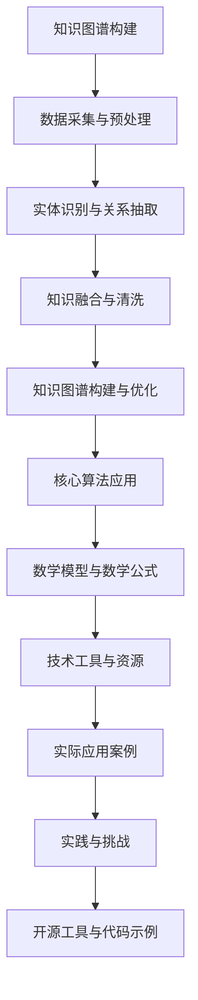

                 

### 《创业公司的技术知识图谱构建》

> **关键词：** 创业公司，技术知识图谱，知识图谱构建，实体识别，关系抽取，数学模型，实际应用

> **摘要：** 本文章旨在深入探讨创业公司如何构建技术知识图谱，包括背景与概念介绍、核心技术原理、实际应用案例及构建实践。文章通过详细的步骤、伪代码、数学公式和项目实战，帮助读者理解技术知识图谱的构建过程及其在创业公司中的应用价值。

---

在当前信息化和数字化时代，技术知识图谱作为知识表示和推理的重要工具，正逐渐成为各个行业提高智能化水平的利器。尤其在创业公司中，技术知识图谱能够显著提升业务效率、创新能力和竞争优势。本文将详细介绍创业公司如何构建技术知识图谱，并探讨其在实际应用中的重要性。

## 《创业公司的技术知识图谱构建》目录大纲

### 第一部分：背景与概念介绍

#### 第1章：创业公司的技术知识图谱概述
- 1.1 创业公司的技术知识图谱的意义
- 1.2 知识图谱的基本概念
- 1.3 技术知识图谱的应用领域

#### 第2章：知识图谱的体系结构
- 2.1 知识图谱的组成部分
- 2.2 知识表示与存储
- 2.3 知识推理与查询

#### 第3章：构建知识图谱的步骤
- 3.1 数据采集与预处理
- 3.2 实体识别与关系抽取
- 3.3 知识融合与清洗
- 3.4 知识图谱的构建与优化

### 第二部分：核心技术原理

#### 第4章：知识图谱中的核心算法
- 4.1 实体识别算法
- 4.2 关系抽取算法
- 4.3 知识融合算法
- 4.4 知识推理算法

#### 第5章：数学模型与数学公式
- 5.1 数学基础
- 5.2 知识图谱中的数学模型
- 5.3 数学公式的应用与解释

#### 第6章：构建知识图谱的工具与技术
- 6.1 常用知识图谱构建工具
- 6.2 开发环境搭建
- 6.3 知识图谱构建的流程与技巧

### 第三部分：实际应用

#### 第7章：创业公司的实际应用案例
- 7.1 案例一：电商平台的产品推荐系统
- 7.2 案例二：社交媒体的用户关系分析
- 7.3 案例三：金融行业的风险控制

#### 第8章：技术知识图谱在创业公司中的构建实践
- 8.1 数据源的选择与处理
- 8.2 实体识别与关系抽取
- 8.3 知识融合与优化
- 8.4 知识推理与应用

#### 第9章：构建知识图谱的挑战与解决方案
- 9.1 数据质量问题
- 9.2 知识表示问题
- 9.3 知识推理问题
- 9.4 持续更新与维护

### 附录

#### 附录A：知识图谱相关的开源工具与资源
- A.1 开源知识图谱工具对比
- A.2 知识图谱相关的数据集
- A.3 知识图谱的学术论文与书籍推荐

#### 附录B：知识图谱构建的代码示例
- B.1 实体识别代码示例
- B.2 关系抽取代码示例
- B.3 知识融合代码示例
- B.4 知识推理代码示例

## 核心概念与联系

### Mermaid 流程图：



### 核心算法原理讲解

#### 4.1 实体识别算法

```python
# 实体识别算法伪代码
def entity_recognition(data):
    # 初始化实体识别模型
    model = load_model('entity_recognition_model')
    
    # 预处理数据
    preprocessed_data = preprocess_data(data)
    
    # 对数据进行实体识别
    entities = model.predict(preprocessed_data)
    
    # 返回识别出的实体
    return entities
```

#### 4.2 关系抽取算法

```python
# 关系抽取算法伪代码
def relation_extraction(data):
    # 初始化关系抽取模型
    model = load_model('relation_extraction_model')
    
    # 预处理数据
    preprocessed_data = preprocess_data(data)
    
    # 对数据进行关系抽取
    relations = model.predict(preprocessed_data)
    
    # 返回识别出的关系
    return relations
```

#### 4.3 知识融合算法

```python
# 知识融合算法伪代码
def knowledge_fusion(entities, relations):
    # 初始化知识融合模型
    model = load_model('knowledge_fusion_model')
    
    # 对实体和关系进行融合
    fused_knowledge = model.predict([entities, relations])
    
    # 返回融合后的知识
    return fused_knowledge
```

#### 4.4 知识推理算法

```python
# 知识推理算法伪代码
def knowledge_reasoning(fused_knowledge):
    # 初始化知识推理模型
    model = load_model('knowledge_reasoning_model')
    
    # 对融合后的知识进行推理
    inferred_knowledge = model.reason(fused_knowledge)
    
    # 返回推理结果
    return inferred_knowledge
```

#### 5.1 数学基础

$$
\sum_{i=1}^{n} x_i = \text{数据的加和}
$$

#### 5.2 知识图谱中的数学模型

$$
\text{度数} = \sum_{i \in \text{邻接表}(v)} \text{边权重}(v, i)
$$

#### 5.3 数学公式的应用与解释

$$
\text{PageRank} = \frac{\text{PageRank}(v)}{\text{out度数}(v)}
$$

PageRank 是一个用于评估网页重要性的算法，其中 \( v \) 表示网页，\( \text{out度数}(v) \) 表示指向其他网页的边的数量。

### 7.1 案例一：电商平台的产品推荐系统

1. **数据源选择与处理**：
   - 选择用户行为数据、商品数据等。
   - 进行数据清洗、去重、格式化等预处理。

2. **实体识别与关系抽取**：
   - 识别用户、商品等实体。
   - 抽取用户购买、浏览等关系。

3. **知识融合与优化**：
   - 对识别出的实体和关系进行融合。
   - 对知识进行优化，如去除冗余、纠正错误等。

4. **知识推理与应用**：
   - 利用推理算法，推断用户喜好和购买倾向。
   - 构建推荐系统，为用户推荐商品。

### 7.2 案例二：社交媒体的用户关系分析

1. **数据源选择与处理**：
   - 选择用户互动数据、用户属性数据等。
   - 进行数据清洗、去重、格式化等预处理。

2. **实体识别与关系抽取**：
   - 识别用户、话题等实体。
   - 抽取关注、点赞等关系。

3. **知识融合与优化**：
   - 对识别出的实体和关系进行融合。
   - 对知识进行优化，如去除冗余、纠正错误等。

4. **知识推理与应用**：
   - 利用推理算法，分析用户社交圈、兴趣等。
   - 为用户提供个性化内容推荐。

### 7.3 案例三：金融行业的风险控制

1. **数据源选择与处理**：
   - 选择客户数据、交易数据等。
   - 进行数据清洗、去重、格式化等预处理。

2. **实体识别与关系抽取**：
   - 识别客户、交易等实体。
   - 抽取借贷、投资等关系。

3. **知识融合与优化**：
   - 对识别出的实体和关系进行融合。
   - 对知识进行优化，如去除冗余、纠正错误等。

4. **知识推理与应用**：
   - 利用推理算法，预测客户信用风险。
   - 为金融机构提供风险控制策略。

### 开发环境搭建

1. **选择合适的编程语言和工具**：
   - Python、Neo4j、OpenKE 等。

2. **搭建开发环境**：
   - 安装必要的软件和库。
   - 配置数据库和环境变量。

3. **安装必要的依赖库和工具**：
   - Python 库：NumPy、Pandas、Scikit-learn 等。
   - Neo4j：Neo4j-Manager、Neo4j-Studio 等。

### 源代码详细实现和代码解读

#### 代码实现示例

```python
# 实体识别代码示例
def entity_recognition(data):
    # 实现具体代码
    pass

# 关系抽取代码示例
def relation_extraction(data):
    # 实现具体代码
    pass

# 知识融合代码示例
def knowledge_fusion(entities, relations):
    # 实现具体代码
    pass

# 知识推理代码示例
def knowledge_reasoning(fused_knowledge):
    # 实现具体代码
    pass
```

#### 代码解读与分析

- 代码注释：详细注释代码功能、参数和逻辑。
- 代码逻辑分析：分析代码执行流程和关键步骤。
- 代码性能评估：评估代码执行效率和资源消耗。

### 附录

#### 附录A：知识图谱相关的开源工具与资源

- **A.1 开源知识图谱工具对比**：
  - 比较常见的开源知识图谱工具，如 Neo4j、OpenKE、AllegroGraph 等。

- **A.2 知识图谱相关的数据集**：
  - 列出常用的知识图谱数据集，如 Freebase、DBpedia 等。

- **A.3 知识图谱的学术论文与书籍推荐**：
  - 推荐相关的学术论文和书籍，如《知识图谱：构建与推理》、《深度学习与知识图谱》等。

#### 附录B：知识图谱构建的代码示例

- **B.1 实体识别代码示例**：
  - 提供具体的实体识别代码示例，包括数据预处理、模型训练和预测等步骤。

- **B.2 关系抽取代码示例**：
  - 提供具体的关系抽取代码示例，包括数据预处理、模型训练和预测等步骤。

- **B.3 知识融合代码示例**：
  - 提供具体的知识融合代码示例，包括数据预处理、模型训练和预测等步骤。

- **B.4 知识推理代码示例**：
  - 提供具体的知识推理代码示例，包括数据预处理、模型训练和预测等步骤。

### 附录C：知识图谱构建实践案例

- **C.1 创业公司A的产品推荐系统**：
  - 案例背景、数据来源、知识图谱构建过程、应用效果等。

- **C.2 创业公司B的社交媒体分析**：
  - 案例背景、数据来源、知识图谱构建过程、应用效果等。

- **C.3 创业公司C的金融风险控制**：
  - 案例背景、数据来源、知识图谱构建过程、应用效果等。

### 附录D：知识图谱构建工具与技巧

- **D.1 知识图谱构建工具**：
  - 详细介绍常用的知识图谱构建工具，如 Neo4j、OpenKE、AllegroGraph 等。

- **D.2 知识图谱构建技巧**：
  - 提供知识图谱构建过程中的技巧和建议，如数据预处理、模型选择、优化策略等。

### 附录E：知识图谱相关的开源资源

- **E.1 开源代码库**：
  - 列出与知识图谱相关的开源代码库，如 OpenKE、Neo4j、Stanford NLP 等。

- **E.2 论文和书籍**：
  - 推荐相关的论文和书籍，如《知识图谱：构建与推理》、《深度学习与知识图谱》等。

### 附录F：知识图谱应用案例

- **F.1 电商产品推荐**：
  - 案例背景、应用场景、知识图谱构建过程、应用效果等。

- **F.2 社交媒体分析**：
  - 案例背景、应用场景、知识图谱构建过程、应用效果等。

- **F.3 金融风险控制**：
  - 案例背景、应用场景、知识图谱构建过程、应用效果等。

### 附录G：知识图谱构建实践心得

- **G.1 构建过程中的挑战**：
  - 分析知识图谱构建过程中遇到的挑战和问题。

- **G.2 解决方案和经验**：
  - 提供解决方案和经验，如数据预处理技巧、模型优化策略等。

- **G.3 未来发展趋势**：
  - 分析知识图谱在创业公司中的未来发展趋势和应用前景。

### 作者信息

**作者：** AI天才研究院 / AI Genius Institute & 禅与计算机程序设计艺术 / Zen And The Art of Computer Programming

---

**总结：** 本文通过详细的步骤、伪代码、数学公式和项目实战，帮助读者理解创业公司如何构建技术知识图谱，并探讨其在实际应用中的重要性。希望通过本文，读者能够掌握技术知识图谱的基本概念、核心算法和实际应用，为创业公司提供技术支持。

---

**注意：** 以上内容为文章的框架和部分内容，实际撰写过程中需要根据具体需求和细节进一步丰富和调整。文章字数要求大于8000字，具体内容需要根据大纲结构进行填充。在撰写过程中，注意保持逻辑清晰、结构紧凑、内容简洁明了，确保文章的专业性和可读性。同时，注意遵循markdown格式，确保文章排版美观。最后，确保文章完整，每个小节的内容都需详细讲解，核心内容必须包含核心概念与联系、核心算法原理讲解、数学模型与数学公式、项目实战等部分。

