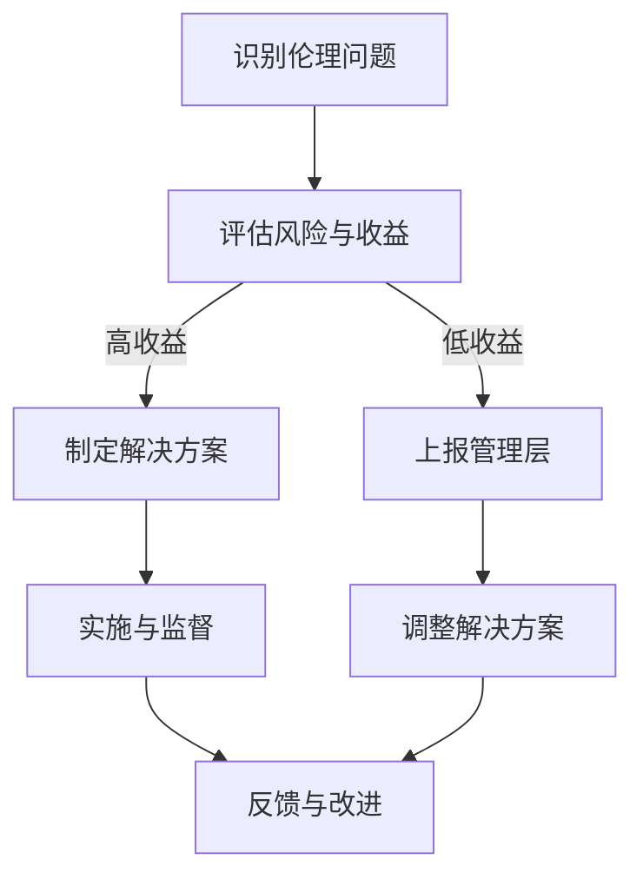

                 

# 引言

在当今快速发展的科技时代，创业者的角色日益重要。他们不仅是技术创新的推动者，也是经济发展的重要力量。然而，随着创业活动的广泛开展，商业伦理与社会责任意识的问题逐渐浮出水面。创业者在追求利润和商业成功的同时，如何平衡商业伦理和社会责任，成为了一个亟待解决的问题。

商业伦理，是指企业在经营活动中遵循的道德规范和价值观。它关系到企业的声誉、信任度和长远发展。社会责任意识，则是指企业对自身行为对环境、社会和利益相关者的影响进行积极管理的能力。在现代社会，商业伦理与社会责任已经成为企业竞争力的关键因素。

本文旨在探讨创业者的商业伦理与社会责任意识，通过系统的分析和案例研究，为创业者提供理论指导与实践建议。文章将首先介绍商业伦理和社会责任意识的基础理论，然后分析创业者面临的商业伦理挑战和社会责任实践，接着讨论相关法律法规的影响，并最终提出创业者如何培养商业伦理与社会责任意识的策略。

关键词：商业伦理、社会责任意识、创业者、法律法规、实践策略

摘要：本文通过系统地分析商业伦理和社会责任意识的基础理论，探讨创业者在追求商业成功过程中面临的伦理挑战和社会责任实践。文章提出了一系列商业伦理与社会责任意识的具体实践策略，旨在帮助创业者构建可持续的商业模式，提升企业竞争力和社会影响力。

# 商业伦理概述

## 1.1 商业伦理的定义与重要性

商业伦理，是指在商业活动中遵循的道德规范和价值观。它不仅包括企业在日常运营中应当遵守的道德准则，还涵盖了企业决策者和管理者在面对道德困境时应当如何决策的原则。商业伦理的核心在于平衡企业利益与各方利益，追求企业长期稳定发展。

商业伦理的重要性不言而喻。首先，商业伦理是企业社会责任的重要组成部分。一个缺乏商业伦理的企业，很难赢得社会的认可和信任，进而影响其商业成功。其次，商业伦理关系到企业的声誉和形象。一个具有良好商业伦理的企业，能够在市场竞争中脱颖而出，赢得消费者的青睐。此外，商业伦理也是企业可持续发展的基础。只有在遵循商业伦理的前提下，企业才能实现长期稳定的发展。

在商业活动中，商业伦理的重要性体现在多个方面。首先，商业伦理是企业内部管理的基础。企业需要通过制定和执行商业伦理准则，确保员工在经营活动中遵循道德规范。其次，商业伦理是消费者选择的重要因素。消费者在购买产品或服务时，会考虑企业的道德表现，从而影响购买决策。最后，商业伦理也是企业与政府、供应商、合作伙伴等外部利益相关者关系的关键因素。一个具有良好商业伦理的企业，能够与各方建立良好的合作关系，实现共赢。

## 1.2 商业伦理的核心原则

商业伦理的核心原则包括诚信、公平、责任和透明度等。这些原则不仅为企业提供了行为指南，也为企业文化建设奠定了基础。

### 1.2.1 诚信

诚信是商业伦理的基石。它要求企业在经营活动中保持真实、诚实和透明。诚信首先体现在企业对消费者的承诺上。企业应当提供真实、准确的产品信息，不夸大宣传，不误导消费者。其次，诚信也要求企业对合作伙伴、员工和政府等各方保持诚实。企业在签订合同时应当遵守承诺，履行合同义务，不进行欺诈行为。

### 1.2.2 公平

公平是商业伦理的重要原则之一。它要求企业在经营活动中给予各方平等的机会和待遇，不歧视、不偏见。公平首先体现在市场竞争中。企业应当遵守市场规则，不进行不正当竞争，不进行价格垄断和排他性行为。其次，公平也要求企业对员工公平对待。企业应当提供公平的薪酬、晋升机会和培训机会，确保员工在企业发展中得到公正的待遇。

### 1.2.3 责任

责任是商业伦理的核心原则之一。它要求企业在经营活动中承担社会责任，保护环境，关爱员工，回馈社会。责任首先体现在企业对环境的保护上。企业应当遵守环保法规，减少污染，节约资源，推动可持续发展。其次，责任也要求企业关爱员工。企业应当提供安全、健康的工作环境，关注员工身心健康，促进员工职业发展。

### 1.2.4 透明度

透明度是商业伦理的重要体现。它要求企业在经营活动中保持信息公开，接受社会监督。透明度首先体现在财务报表上。企业应当真实、准确地披露财务信息，接受投资者和监管机构的审查。其次，透明度也要求企业在业务运营中保持公开透明。企业应当公开产品和服务信息，接受消费者的监督和评价。

## 1.3 商业伦理的现状与挑战

尽管商业伦理在企业经营中具有重要意义，但现实中仍存在诸多挑战。首先，商业伦理意识不足。一些企业忽视商业伦理，追求短期利益，导致商业行为失范。其次，商业伦理监管不到位。尽管各国都有商业伦理相关法律法规，但执行力度和监管机制有待加强。最后，商业伦理教育不够普及。许多创业者和管理者缺乏商业伦理知识，难以在实际经营中践行商业伦理。

面对这些挑战，创业者需要树立正确的商业伦理观念，加强商业伦理教育，提高商业伦理意识。同时，政府和社会各界应当加强对商业伦理的监管和宣传，推动商业伦理的实践和发展。

# 社会责任意识的起源与发展

## 2.1 社会责任意识的定义与演变

社会责任意识，是指企业对自身行为对环境、社会和利益相关者的影响进行积极管理的能力。它不仅包括企业在经营活动中遵循的道德规范，还涵盖了企业在环境保护、社会贡献和员工福利等方面的责任。社会责任意识的本质在于企业作为社会的一员，应当承担起应有的社会责任，推动社会和谐与进步。

社会责任意识的演变经历了几个阶段。最早的社会责任意识可以追溯到工业革命时期，当时企业开始关注员工权益和工厂安全。随着社会的发展，企业社会责任逐渐扩展到环境保护和社区参与等领域。20世纪80年代以来，企业社会责任进入了多元化发展阶段，不仅涵盖了传统领域，还包括了可持续发展、慈善捐赠、社会责任投资等新兴领域。

### 2.1.1 社会责任意识的起源

社会责任意识的起源可以追溯到工业革命时期。当时，工厂制度的兴起导致了劳动条件恶劣、工伤事故频发等问题。为了改善工人待遇，一些企业开始关注员工权益，提出了一些劳动保护措施。这是社会责任意识的初步体现。

随着经济的发展，企业社会责任逐渐扩展到环境保护领域。20世纪70年代，全球环境问题日益严重，企业开始意识到环境保护的重要性。一些企业开始采取环保措施，减少污染排放，推动可持续发展。这是社会责任意识在环境保护领域的深化。

### 2.1.2 社会责任意识的演变

20世纪80年代以来，企业社会责任进入了多元化发展阶段。一方面，企业社会责任的范围不断扩大，涵盖了可持续发展、慈善捐赠、社会责任投资等新兴领域。另一方面，企业社会责任的理念也逐渐成熟，从单纯的慈善行为上升为战略层面，成为企业可持续发展的重要组成部分。

在可持续发展方面，企业开始关注资源利用、能源消耗和碳排放等问题，提出了一系列环保目标和措施。在慈善捐赠方面，企业不仅捐款捐物，还积极参与社区建设和公益活动，提升企业形象。在社会责任投资方面，企业开始将社会责任因素纳入投资决策，推动社会责任投资的兴起。

### 2.1.3 社会责任意识的核心要素

社会责任意识的核心要素包括环境保护、社会贡献和员工福利等。

首先，环境保护是社会责任意识的重要组成部分。企业应当遵守环保法规，采取环保措施，减少污染排放，推动可持续发展。其次，社会贡献是企业社会责任的重要体现。企业应当积极参与社会公益活动，捐款捐物，支持社会事业发展。最后，员工福利是企业社会责任的重要方面。企业应当提供安全、健康的工作环境，关注员工身心健康，提供职业发展机会。

## 2.2 社会责任意识的实践案例

### 2.2.1 可持续发展

可持续发展是企业社会责任的重要体现。许多企业通过实施可持续发展战略，实现了经济、社会和环境的协调发展。例如，某知名企业通过采用绿色生产技术，减少能源消耗和污染排放，实现了可持续发展目标。此外，该企业还积极参与环保公益活动，推动环保理念在社会中的普及。

### 2.2.2 社会贡献

企业通过社会贡献，提升了企业形象，赢得了社会认可。例如，某大型企业通过捐款捐物，支持贫困地区教育、卫生事业的发展，帮助改善当地民生。此外，该企业还积极参与社区建设，组织志愿者活动，为社区居民提供帮助。这些举措不仅提升了企业的社会责任形象，也增强了企业的社会影响力。

### 2.2.3 员工福利

员工福利是企业社会责任的重要方面。许多企业通过提供完善的福利制度，提升了员工的幸福感和归属感。例如，某知名企业为员工提供完善的医疗保险、退休金计划，提供健康体检和心理咨询服务。此外，该企业还注重员工职业发展，提供培训机会，帮助员工实现职业晋升。这些举措不仅提升了员工的满意度，也增强了企业的核心竞争力。

总之，社会责任意识是企业发展的必然选择。通过实践社会责任，企业不仅能够实现可持续发展，提升社会影响力，还能够赢得员工的信任和支持，为企业创造长期价值。

## 创业者面临的商业伦理挑战

在追求商业成功的过程中，创业者不可避免地会遇到一系列商业伦理挑战。这些挑战不仅影响到企业的声誉和可持续发展，还关系到企业的长期生存和竞争优势。以下是创业者面临的几个主要商业伦理挑战：

### 3.1 财务报表造假

财务报表造假是创业者面临的第一个重要商业伦理挑战。在商业竞争中，一些创业者为了虚增业绩、美化财务状况，采取各种手段对财务报表进行篡改。这种行为不仅违反了会计准则和法律法规，也会对投资者、债权人等利益相关者造成重大损失。

#### 现象与原因

财务报表造假的现象在创业公司中较为普遍。一方面，一些创业者希望通过虚增收入和利润，提升公司估值，从而吸引更多的投资者。另一方面，财务报表造假也是应对市场竞争压力的一种手段。在激烈的市场竞争中，一些创业者认为通过财务手段提高公司业绩，可以在竞争中脱颖而出。

#### 解决方案

针对财务报表造假的问题，创业者应当树立正确的价值观，遵守会计准则和法律法规，确保财务报表的真实性和准确性。具体措施包括：

1. **加强内部控制**：建立健全的财务内部控制体系，确保财务数据的真实性和可靠性。
2. **提高会计人员的职业素养**：加强对会计人员的培训，提高其职业道德和职业素养，防止其参与财务报表造假。
3. **强化监管**：企业内部应当设立审计委员会或聘请外部审计机构，对财务报表进行定期审计，确保财务报表的真实性和准确性。
4. **诚信宣传**：通过内部培训和外部宣传，提高全体员工的诚信意识，营造诚信经营的企业文化。

### 3.2 不正当竞争

不正当竞争是创业者面临的另一个重要商业伦理挑战。在市场竞争中，一些创业者为了获取竞争优势，采取各种不正当手段，如抄袭他人知识产权、诋毁竞争对手等。这种行为不仅违反了市场竞争规则，也会对整个行业生态造成负面影响。

#### 现象与原因

不正当竞争在创业公司中屡见不鲜。一方面，一些创业者为了在短时间内获得市场份额和利润，不惜采取不正当手段。另一方面，市场竞争压力较大，一些创业者认为通过不正当手段可以更快地获取竞争优势。

#### 解决方案

为应对不正当竞争，创业者应当树立公平竞争的观念，遵守市场竞争规则，避免采取不正当手段。具体措施包括：

1. **提高法律意识**：加强对相关法律法规的学习和了解，确保企业在经营活动中遵守法律法规，不参与不正当竞争。
2. **创新驱动**：通过技术创新和产品创新，提升企业核心竞争力，避免依赖不正当手段获取竞争优势。
3. **建立诚信体系**：建立健全的诚信体系，对企业内外部进行诚信教育和宣传，提高全体员工的诚信意识。
4. **加强自律**：企业内部应当建立自律机制，对不正当竞争行为进行监督和制约，确保企业在竞争中遵循公平原则。

### 3.3 劳动权益问题

劳动权益问题是创业者面临的另一个重要商业伦理挑战。在创业过程中，一些创业者为了降低成本、提高利润，忽视员工的合法权益，如工资待遇、工作环境、职业发展等。这种行为不仅损害了员工的利益，也会影响企业的社会形象和可持续发展。

#### 现象与原因

劳动权益问题在创业公司中较为普遍。一方面，一些创业者对劳动法规了解不足，导致劳动权益问题频发。另一方面，市场竞争激烈，一些创业者为了降低成本，忽视员工权益。

#### 解决方案

为解决劳动权益问题，创业者应当树立尊重劳动者权益的观念，切实保障员工的合法权益。具体措施包括：

1. **加强劳动法规学习**：加强对劳动法律法规的学习和了解，确保企业在人力资源管理中遵守相关法规。
2. **提供合理薪酬**：根据市场情况和员工贡献，制定合理的薪酬体系，确保员工获得公平的报酬。
3. **改善工作环境**：提供安全、健康的工作环境，确保员工的身心健康。
4. **关注员工职业发展**：提供职业培训和发展机会，帮助员工实现职业晋升和成长。
5. **建立员工申诉机制**：建立员工申诉机制，及时解决员工在工作中遇到的问题，确保员工权益得到有效保障。

总之，创业者应当正视商业伦理挑战，树立正确的价值观，采取有效措施解决相关问题，确保企业在追求商业成功的过程中，实现可持续发展和社会责任。

### 3.4 社会责任与环境保护

社会责任与环境保护是创业者面临的另一个重要商业伦理挑战。在现代社会，环境保护已成为全球关注的焦点，企业作为社会的一员，有责任采取环保措施，减少对环境的负面影响。

#### 现象与原因

环境保护问题在创业公司中日益突出。一方面，一些创业者重视短期利润，忽视环境保护，导致资源浪费和环境污染。另一方面，市场竞争激烈，一些创业者认为环保投入会增加成本，影响盈利能力。

#### 解决方案

为应对社会责任与环境保护的挑战，创业者应当树立环保意识，采取环保措施，实现可持续发展。具体措施包括：

1. **节能减排**：通过技术改造和管理创新，提高能源利用效率，减少碳排放。
2. **绿色生产**：采用环保材料和工艺，减少污染排放，推动绿色生产。
3. **循环经济**：建立资源循环利用体系，降低资源消耗和废弃物产生。
4. **公益环保活动**：积极参与环保公益活动，提高企业环保形象，推动环保理念在社会中的普及。
5. **环保宣传**：通过内部宣传和外部宣传，提高全体员工的环保意识，营造环保经营的企业文化。

总之，创业者应当认识到社会责任与环境保护的重要性，采取有效措施解决相关问题，为企业和社会创造可持续发展。

### 3.5 企业文化与价值观的塑造

企业文化和价值观是创业者在商业伦理实践中面临的挑战之一。一个健康的企业文化和价值观能够引导员工遵循商业伦理原则，共同推动企业的发展。

#### 现象与原因

企业文化和价值观的塑造是一个长期而复杂的过程。一些创业公司在快速发展的过程中，可能忽视企业文化的重要性，导致员工行为失范，影响企业的长远发展。此外，外部环境的变化也会对企业文化产生冲击，使企业面临伦理挑战。

#### 解决方案

为应对企业文化与价值观的挑战，创业者应当重视企业文化和价值观的塑造，具体措施包括：

1. **制定明确的价值观**：明确企业的核心价值观，确保员工在行为决策中遵循道德规范。
2. **企业文化宣传**：通过内部培训和外部宣传，加强企业文化传播，提高员工的认同感和归属感。
3. **领导示范**：企业领导应当以身作则，树立良好的道德榜样，推动企业文化建设。
4. **激励机制**：建立合理的激励机制，鼓励员工践行企业文化和价值观，提高员工忠诚度和积极性。
5. **沟通反馈**：建立有效的沟通渠道，鼓励员工表达意见和建议，及时调整企业文化和价值观。

总之，创业者应当重视企业文化和价值观的塑造，通过有效的措施引导员工行为，确保企业在追求商业成功的过程中，实现可持续发展。

### 3.6 信息透明与数据隐私

信息透明与数据隐私是创业者面临的另一个重要商业伦理挑战。在数字化时代，企业拥有大量用户数据，如何保护用户隐私，确保数据透明，成为企业需要关注的问题。

#### 现象与原因

信息透明与数据隐私问题在数字化企业中日益突出。一方面，一些企业为了获取商业利益，采取数据滥用行为，侵犯用户隐私。另一方面，用户对数据隐私保护的需求日益增强，对企业的透明度和诚信度提出了更高要求。

#### 解决方案

为应对信息透明与数据隐私的挑战，创业者应当采取以下措施：

1. **遵守数据保护法规**：遵守相关数据保护法规，确保用户数据的合法收集、存储和使用。
2. **数据加密**：采用数据加密技术，保护用户数据的安全性，防止数据泄露。
3. **透明信息披露**：公开用户数据的使用目的、范围和方式，提高用户对数据处理的知情权。
4. **用户授权管理**：建立用户授权管理体系，确保用户在数据使用中的知情权和选择权。
5. **内部数据安全培训**：加强员工的数据安全意识培训，提高员工的数据保护能力。

总之，创业者应当重视信息透明与数据隐私，采取有效措施保护用户隐私，提升企业的社会形象和用户信任度。

### 3.7 企业责任与利益相关者关系

企业责任与利益相关者关系是创业者面临的另一个重要商业伦理挑战。企业的成功不仅依赖于内部管理，还取决于与利益相关者的良好关系。

#### 现象与原因

企业责任与利益相关者关系问题在创业公司中较为普遍。一方面，一些企业忽视利益相关者的需求，导致利益冲突。另一方面，利益相关者对企业责任的要求日益提高，要求企业在经营活动中关注社会责任，实现可持续发展。

#### 解决方案

为应对企业责任与利益相关者关系的挑战，创业者应当采取以下措施：

1. **建立利益相关者沟通机制**：建立与利益相关者的沟通渠道，及时了解和回应其需求和关切。
2. **履行社会责任**：关注社会问题，积极参与公益活动，提升企业的社会责任形象。
3. **保护股东利益**：确保公司的财务透明和运营效率，维护股东的合法权益。
4. **关爱员工**：提供良好的工作环境和职业发展机会，关注员工福利和职业成长。
5. **维护供应商关系**：建立长期稳定的合作关系，确保供应链的稳定和可持续发展。

总之，创业者应当重视企业责任与利益相关者关系，通过有效的措施维护与利益相关者的良好关系，实现企业的可持续发展。

### 3.8 面对商业伦理挑战的决策过程

面对商业伦理挑战，创业者需要做出明智的决策。以下是一个典型的商业伦理挑战决策过程：

1. **识别伦理问题**：首先，创业者需要识别出可能存在的商业伦理问题，如财务报表造假、不正当竞争、劳动权益问题等。
2. **评估风险与收益**：在识别伦理问题后，创业者需要评估这些问题的风险和收益，权衡利弊，确定优先处理的问题。
3. **制定解决方案**：根据风险和收益评估结果，创业者需要制定具体的解决方案，如加强内部控制、提高法律意识、建立诚信体系等。
4. **实施与监督**：创业者需要将解决方案付诸实施，并设立监督机制，确保解决方案的有效性和持续性。
5. **反馈与调整**：在实施过程中，创业者需要收集反馈信息，根据实际情况调整解决方案，确保问题的有效解决。

通过上述决策过程，创业者可以更好地应对商业伦理挑战，实现企业的可持续发展。

总之，创业者面临的商业伦理挑战多样且复杂，需要树立正确的价值观，采取有效措施解决相关问题，确保企业在追求商业成功的过程中，实现可持续发展和社会责任。

### 社会责任意识在创业实践中的应用

在社会责任意识日益受到重视的今天，创业者如何在实践中践行社会责任，不仅关系到企业的形象和声誉，更关系到企业的可持续发展。以下是创业者如何践行社会责任的一些具体措施：

#### 4.1 创业者如何践行社会责任

首先，创业者应当树立社会责任意识，将其融入企业的核心价值观和经营战略中。以下是一些具体的践行社会责任的措施：

1. **环境保护**：创业者应关注企业的环境足迹，采取环保措施，减少污染排放，推动绿色生产。例如，某创业公司通过采用可再生能源和节能技术，大幅减少能源消耗和碳排放。

2. **社会贡献**：创业者可以积极参与社会公益活动，捐赠物资或资金，支持教育、卫生、扶贫等社会事业。例如，某互联网创业公司定期组织员工参与社区志愿服务，提升企业形象。

3. **员工福利**：创业者应关注员工的福利和职业发展，提供安全、健康的工作环境，关注员工的身心健康，提供职业培训和发展机会。例如，某创业公司为员工提供免费健康体检、心理咨询和职业晋升机会。

4. **公平竞争**：创业者应遵守市场竞争规则，不采取不正当手段获取竞争优势。例如，某创业公司通过技术创新和优质服务，赢得市场份额，而非通过价格战或诋毁竞争对手。

#### 4.2 环境保护与社会责任

环境保护是企业社会责任的重要组成部分。创业者应采取以下措施，在环境保护方面践行社会责任：

1. **节能减排**：通过技术改造和管理创新，提高能源利用效率，减少碳排放。例如，某创业公司采用智能监控系统，实时监控能源消耗，优化能源使用。

2. **绿色生产**：采用环保材料和工艺，减少污染排放，推动绿色生产。例如，某创业公司采用可降解材料制造产品，减少环境污染。

3. **资源循环利用**：建立资源循环利用体系，降低资源消耗和废弃物产生。例如，某创业公司通过回收利用废弃物，实现资源再利用。

4. **公益环保活动**：积极参与环保公益活动，提高企业环保形象，推动环保理念在社会中的普及。例如，某创业公司定期组织员工参与植树造林活动，提升员工的环保意识。

#### 4.3 社会责任与企业文化

社会责任不仅是企业的外部形象，更是企业文化的重要组成部分。创业者应通过以下措施，将社会责任融入企业文化：

1. **社会责任宣传**：通过内部培训和外部宣传，提高全体员工的社会责任意识。例如，某创业公司定期举办社会责任主题的培训和讲座，增强员工的环保意识。

2. **社会责任项目**：设立社会责任项目，鼓励员工参与社会公益活动，提升企业社会责任形象。例如，某创业公司设立“爱心基金”，用于支持员工的公益活动。

3. **社会责任考核**：将社会责任表现纳入员工考核体系，激励员工积极参与社会责任活动。例如，某创业公司将员工的社会责任表现作为绩效考核的一部分，奖励积极参与社会责任项目的员工。

4. **社会责任激励**：通过奖励和表彰，激励员工践行社会责任。例如，某创业公司设立“社会责任奖”，奖励在履行社会责任方面表现突出的员工。

总之，创业者应在实践中践行社会责任，通过环境保护、社会贡献、员工福利等方面的努力，提升企业社会责任形象，实现可持续发展。

### 商业伦理与社会责任的法律框架

商业伦理与社会责任在现代社会中具有重要地位，而法律法规则为这些伦理和社会责任的实践提供了制度保障。本文将从国际和我国商业伦理法律体系入手，探讨法律法规对创业者的影响，以及如何遵守这些法律法规。

#### 5.1 国际商业伦理法律体系

在国际上，商业伦理法律体系主要包括以下几个方面：

1. **国际商业道德准则**：国际商业道德准则是一系列由国际组织或跨国公司制定的商业道德规范，如《联合国全球契约》和《世界商会商业准则》。这些准则涵盖了商业诚信、公平竞争、人权和环境保护等方面的内容。

2. **国际反贿赂法规**：《联合国反腐败公约》和《美国反海外腐败法》（FCPA）等法规，对跨国公司在海外经营中的反贿赂行为进行了严格规定，以防止商业贿赂和腐败行为。

3. **国际环境保护法规**：如《巴黎协定》和《联合国环境规划署国际环境法》等，规定了企业应采取的环保措施，以减少对环境的负面影响。

4. **国际劳动法**：国际劳工组织（ILO）制定的《国际劳动标准》，对劳动权益、工作环境、职业健康和安全等方面做出了规定，保障劳动者的合法权益。

#### 5.2 我国商业伦理法律体系

我国商业伦理法律体系主要包括以下几个方面：

1. **公司法**：公司法是我国企业设立和运营的基本法律依据，规定了企业的组织形式、股东权益、公司治理等方面的内容。

2. **合同法**：合同法规定了合同的基本原则、合同形式、合同履行等方面的内容，保障了合同当事人的合法权益。

3. **反不正当竞争法**：反不正当竞争法规定了不正当竞争行为的具体情形，如虚假宣传、商业贿赂、侵犯商业秘密等，对不正当竞争行为进行了法律规制。

4. **环境保护法**：环境保护法规定了企业应采取的环保措施，如污染治理、资源利用、环境保护责任等，以保障环境的可持续发展。

5. **劳动法**：劳动法规定了劳动者的权益保障，如工资待遇、劳动条件、职业安全与健康等，保障劳动者的合法权益。

#### 5.3 法律法规对创业者的影响

法律法规对创业者的影响主要体现在以下几个方面：

1. **合规经营**：创业者必须遵守相关法律法规，确保企业的合法运营。违反法律法规可能会导致行政处罚、经济损失，甚至企业倒闭。

2. **风险管理**：创业者应关注法律法规的变化，及时调整企业经营策略，降低法律风险。例如，随着我国环保法规的日益严格，创业者需要关注环保法规的更新，采取环保措施，降低环境污染风险。

3. **社会责任**：法律法规要求企业承担社会责任，保护环境、关爱员工、公平竞争等。创业者应树立正确的商业伦理观念，履行社会责任，提升企业社会形象。

4. **市场准入**：法律法规对市场准入有一定的限制，创业者需了解相关法规，确保企业符合市场准入条件。例如，新成立的科技公司需要符合网络安全法的要求，才能合法开展业务。

#### 5.4 如何遵守商业伦理法律

为了遵守商业伦理法律，创业者可以采取以下措施：

1. **加强法律培训**：创业者应加强对法律法规的学习和了解，提高法律意识，确保企业合法合规运营。

2. **建立合规体系**：企业应建立健全的合规体系，包括合规制度、合规流程、合规培训等，确保企业内部各部门和员工都遵守法律法规。

3. **法律顾问咨询**：聘请专业法律顾问，为企业提供法律咨询和服务，确保企业在经营活动中符合法律法规。

4. **内部审计**：定期进行内部审计，检查企业的合规情况，及时发现和纠正违法行为。

5. **公开透明**：企业应保持信息公开透明，接受社会监督，树立良好的企业形象。

总之，商业伦理与社会责任在现代社会中具有重要地位，创业者应树立正确的商业伦理观念，遵守法律法规，履行社会责任，实现企业的可持续发展。

### 创业者如何培养商业伦理与社会责任意识

培养商业伦理与社会责任意识是创业者成功经营企业的关键。以下从商业伦理教育、内部制度建设和社会责任实践三个方面，详细探讨如何培养创业者的商业伦理与社会责任意识。

#### 6.1 商业伦理教育

商业伦理教育是培养创业者商业伦理与社会责任意识的基础。通过系统的商业伦理教育，创业者能够掌握商业伦理的基本理论、原则和实践方法，从而在实际经营中自觉践行商业伦理。

1. **商业伦理课程设置**：创业者应积极参与商业伦理课程的学习，了解商业伦理的核心原则，如诚信、公平、责任和透明度等。高校和培训机构可以开设专门的商业伦理课程，帮助创业者系统学习商业伦理知识。

2. **案例分析**：通过分析现实中的商业伦理案例，创业者可以深入了解商业伦理问题，学习如何应对和解决这些难题。例如，分析某公司因财务报表造假而被曝光的案例，创业者可以从中学习到财务报表真实性的重要性。

3. **职业道德培养**：创业者应注重职业道德的培养，树立正确的价值观和道德观念。企业可以定期举办职业道德讲座和培训，引导员工遵守职业道德规范。

#### 6.2 内部制度建设

内部制度建设是确保创业者商业伦理与社会责任意识落实的重要保障。通过建立完善的内部制度，企业可以规范员工行为，提高商业伦理与社会责任意识。

1. **商业伦理准则制定**：企业应制定明确的商业伦理准则，明确员工在经营活动中应遵守的道德规范。例如，制定诚信经营、公平竞争、关爱员工等方面的行为准则。

2. **合规管理体系**：企业应建立合规管理体系，确保经营活动符合法律法规和商业伦理要求。合规管理体系应包括合规政策、合规流程、合规监督和合规培训等方面。

3. **内部审计与监督**：企业应定期进行内部审计，检查商业伦理和社会责任的落实情况。内部审计部门应独立于业务部门，确保审计过程的公正性和有效性。

4. **员工行为规范**：企业应制定员工行为规范，明确员工在经营活动中应遵守的行为准则。员工行为规范应包括职业道德、职业操守、工作纪律等方面。

#### 6.3 社会责任实践

社会责任实践是创业者培养商业伦理与社会责任意识的具体体现。通过积极参与社会责任活动，企业不仅能提升社会形象，还能增强员工的使命感和责任感。

1. **环保措施**：企业应采取环保措施，减少污染排放，推动绿色生产。例如，企业可以投资环保技术，提高能源利用效率，减少废弃物产生。

2. **公益捐赠**：企业应积极参与公益捐赠，支持教育、卫生、扶贫等社会事业。企业可以通过设立公益基金，定期捐赠物资或资金，帮助改善社会民生。

3. **员工福利**：企业应关注员工福利，提供安全、健康的工作环境，关注员工的身心健康。企业可以为员工提供职业培训和发展机会，帮助员工实现职业晋升。

4. **社区参与**：企业应积极参与社区建设，为社区居民提供帮助。例如，企业可以组织志愿者活动，为社区居民提供免费服务，提升社区福祉。

5. **透明信息披露**：企业应保持透明信息披露，公开企业社会责任实践情况，接受社会监督。通过透明信息披露，企业可以增强社会信任，提升企业形象。

总之，创业者应通过商业伦理教育、内部制度建设和社会责任实践，培养商业伦理与社会责任意识。只有这样，企业才能在激烈的市场竞争中脱颖而出，实现可持续发展。

### 案例分析与企业实践

#### 7.1 创业公司如何践行社会责任

在现代社会，创业公司如何在实践中践行社会责任已成为一个重要课题。以下通过两个具体案例，探讨创业公司如何通过实际行动履行社会责任，提升企业影响力。

#### 7.1.1 案例一：创业公司A的环保行动

创业公司A是一家专注于绿色能源技术的高科技公司。在践行社会责任方面，公司采取了一系列环保措施，取得了显著成效。

1. **节能减排**：公司通过引入先进的能源管理系统，优化能源使用，降低碳排放。具体措施包括：采用太阳能发电系统、提高能源利用效率、推广电动汽车等。

2. **绿色生产**：公司采用环保材料和工艺，减少污染排放。例如，使用可降解材料制造产品，减少废弃物产生。此外，公司还建立了废弃物回收体系，对生产过程中产生的废弃物进行分类回收和再利用。

3. **公益环保活动**：公司定期组织员工参与公益环保活动，如植树造林、清洁河流等。通过这些活动，公司不仅提升了员工的环保意识，还提高了企业的社会责任形象。

4. **透明信息披露**：公司通过官方网站和社交媒体，公开环保措施和实践成果，接受社会监督。透明信息披露不仅增强了社会信任，也提升了公司的品牌影响力。

#### 7.1.2 案例二：创业公司B的公益行动

创业公司B是一家专注于医疗健康领域的科技公司。在践行社会责任方面，公司通过公益捐赠和社区服务，积极回馈社会。

1. **公益捐赠**：公司设立“公益基金”，定期捐赠资金和物资，支持教育、卫生、扶贫等社会事业。例如，公司捐赠物资帮助贫困地区改善医疗条件，捐赠奖学金资助贫困学生。

2. **社区服务**：公司积极参与社区建设，为社区居民提供免费健康检查、心理咨询等志愿服务。公司还组织志愿者活动，帮助社区居民解决生活中的困难。

3. **员工参与**：公司鼓励员工参与公益活动，为员工提供参与公益活动的机会。公司定期组织员工参与公益志愿者活动，提升员工的使命感和责任感。

4. **透明信息披露**：公司通过官方网站和社交媒体，公开公益捐赠和社区服务情况，接受社会监督。透明信息披露不仅增强了社会信任，也提升了公司的社会责任形象。

#### 7.2 创业者在面对商业伦理挑战时的决策过程

在面对商业伦理挑战时，创业者的决策过程至关重要。以下通过一个案例，探讨创业者在面对商业伦理挑战时的决策过程。

#### 案例三：创业公司C的财务报表问题

创业公司C在经营过程中发现，公司的财务报表存在一些问题，如虚增收入、隐瞒成本等。公司高层在面临这一商业伦理挑战时，采取了一系列决策措施。

1. **问题识别**：首先，公司管理层识别出财务报表存在的问题，并明确问题的严重性和潜在影响。

2. **评估风险与收益**：管理层评估了财务报表造假行为可能带来的风险和收益。他们认为，短期内可能会提高公司业绩和估值，但长期来看，会导致企业声誉受损，甚至面临法律风险。

3. **制定解决方案**：管理层决定采取以下措施解决问题：一是聘请外部审计机构对公司财务报表进行审计，确保报表的真实性和准确性；二是加强内部控制，建立财务报表审核机制，防止类似问题再次发生。

4. **实施与监督**：公司管理层将解决方案付诸实施，并设立监督机制，确保审计和内部控制措施的有效性。同时，公司加强员工培训，提高员工的商业伦理意识。

5. **反馈与调整**：在实施过程中，公司定期收集反馈信息，评估解决方案的执行情况。根据实际情况，公司对解决方案进行适当调整，确保问题的彻底解决。

通过以上决策过程，创业公司C成功解决了财务报表问题，恢复了投资者和客户的信任，实现了企业的可持续发展。

总之，创业公司在践行社会责任和面对商业伦理挑战时，应采取积极的态度和有效的措施。通过具体的实践案例，创业者可以更好地理解和应对社会责任和商业伦理挑战，提升企业的社会形象和竞争力。

### 创业者如何构建可持续的商业模式

#### 8.1 可持续商业模式的定义与特征

可持续发展，是指在满足当前需求的同时，不损害后代满足其需求的能力。可持续商业模式，则是指企业在追求经济利益的同时，兼顾环境保护和社会责任，实现长期稳定发展的商业模式。

可持续商业模式的特征主要体现在以下几个方面：

1. **经济可持续性**：企业通过创新和优化，提高资源利用效率，降低成本，实现盈利。例如，采用绿色技术和工艺，提高能源利用效率，降低污染排放。

2. **环境可持续性**：企业采取环保措施，减少对环境的负面影响，推动可持续发展。例如，采用可再生能源，减少碳排放，推动绿色生产。

3. **社会可持续性**：企业关注社会问题，积极参与公益活动，关爱员工，回馈社会。例如，支持教育、卫生、扶贫等社会事业，关注员工福利和职业发展。

4. **创新性**：企业通过技术创新和管理创新，推动商业模式变革，实现可持续发展。例如，采用新技术的应用，开发新产品，满足市场需求。

#### 8.2 创业者如何构建可持续商业模式

创业者要构建可持续商业模式，需要从以下几个方面入手：

1. **市场调研**：深入了解市场需求和竞争环境，找到市场需求与可持续发展的结合点。例如，消费者对环保产品和服务的需求日益增加，创业者可以开发绿色产品，满足市场需求。

2. **技术创新**：通过技术创新，提高资源利用效率，降低成本，实现经济可持续性。例如，采用可再生能源技术，降低碳排放，推动绿色生产。

3. **环保措施**：采取环保措施，减少对环境的负面影响，实现环境可持续性。例如，采用绿色材料和工艺，减少污染排放，推动可持续发展。

4. **社会责任**：关注社会问题，积极参与公益活动，关爱员工，实现社会可持续性。例如，支持教育、卫生、扶贫等社会事业，关注员工福利和职业发展。

5. **管理模式**：创新管理模式，提高管理效率，降低运营成本。例如，采用精益生产、供应链管理等方式，提高资源利用效率。

6. **品牌建设**：树立良好的品牌形象，提升企业的社会认可度。通过可持续商业模式的实践，企业可以树立绿色、环保、责任的品牌形象，赢得消费者的信任和支持。

#### 8.3 可持续商业模式对企业与社会的影响

可持续商业模式对企业与社会的影响主要体现在以下几个方面：

1. **经济效益**：可持续商业模式通过提高资源利用效率、降低成本，实现企业盈利。例如，通过采用环保技术和工艺，企业可以降低生产成本，提高产品竞争力。

2. **环境效益**：可持续商业模式通过减少污染排放、节约资源，推动环境保护和可持续发展。例如，采用可再生能源技术，企业可以降低碳排放，减少对环境的负面影响。

3. **社会效益**：可持续商业模式通过关注社会问题、参与公益活动，提升企业社会责任形象，推动社会和谐与进步。例如，支持教育、卫生、扶贫等社会事业，企业可以提升社会形象，赢得社会认可。

4. **品牌价值**：可持续商业模式通过树立绿色、环保、责任的品牌形象，提升企业的品牌价值。例如，消费者更倾向于购买绿色、环保的产品，企业的品牌价值因此提升。

5. **员工福利**：可持续商业模式关注员工福利和职业发展，提升员工的满意度和忠诚度。例如，提供良好的工作环境、职业培训和发展机会，员工的工作积极性和创造力得到提升。

总之，创业者通过构建可持续商业模式，可以实现经济效益、环境效益和社会效益的有机统一，为企业和社会创造长期价值。

### 商业伦理与社会责任意识的未来趋势

随着科技的快速发展和全球化的深入推进，商业伦理与社会责任意识将面临新的挑战和机遇。以下探讨未来商业伦理与社会责任意识的趋势，以及创业者应具备的素养。

#### 9.1 技术进步对商业伦理与社会责任意识的影响

技术进步对商业伦理与社会责任意识的影响主要表现在以下几个方面：

1. **人工智能与大数据**：人工智能和大数据技术的广泛应用，使得企业在数据收集、分析和利用方面更加高效。然而，这也带来了数据隐私和信息安全等问题。创业者需要关注这些技术如何影响商业伦理，制定相应的数据管理和隐私保护政策。

2. **区块链技术**：区块链技术的透明性和不可篡改性，为商业活动提供了新的信任机制。然而，区块链技术也引发了对隐私权和数据安全的担忧。创业者需要探索如何在利用区块链技术的同时，保护用户隐私和信息安全。

3. **可持续发展技术**：随着可持续发展技术的进步，企业可以更加高效地实现环保目标。例如，通过采用可再生能源和环保材料，企业可以减少碳排放和污染。然而，这也要求创业者具备环保意识和可持续发展观念，以应对技术进步带来的环境挑战。

#### 9.2 未来商业环境下的伦理挑战与机遇

未来商业环境将面临一系列伦理挑战和机遇：

1. **全球化**：全球化使得企业运营跨越国界，面临不同文化背景和法律法规的挑战。创业者需要具备跨文化沟通能力和法律意识，确保企业在全球范围内遵守商业伦理和社会责任。

2. **社会责任投资**：社会责任投资（SRI）的兴起，使得投资者更加关注企业的社会责任表现。创业者需要关注社会责任投资趋势，提升企业的社会责任形象，以吸引更多投资。

3. **消费者意识觉醒**：消费者对企业的社会责任表现日益关注，对企业施加了更大的伦理压力。创业者需要关注消费者需求，提升企业的社会责任表现，以赢得消费者的信任和支持。

4. **科技伦理**：随着科技的发展，创业者需要关注科技伦理问题，如人工智能伦理、数据伦理等。创业者需要具备科技伦理意识，确保企业的科技创新符合伦理要求。

#### 9.3 创业者应具备的未来商业伦理素养

为了应对未来商业环境中的挑战和机遇，创业者应具备以下商业伦理素养：

1. **道德意识**：创业者应树立正确的道德观念，关注商业伦理和社会责任，将商业伦理融入企业的核心价值观和经营战略。

2. **法律意识**：创业者应具备法律知识，了解全球和本地法律法规，确保企业在经营活动中遵守法律，降低法律风险。

3. **可持续发展观念**：创业者应具备可持续发展观念，关注环境保护和资源利用，推动企业的可持续发展。

4. **创新精神**：创业者应具备创新精神，积极探索新技术和商业模式，以应对未来商业环境的变化。

5. **跨文化沟通能力**：创业者应具备跨文化沟通能力，了解不同文化背景下的商业伦理和社会责任，确保企业在全球范围内运营的顺利。

6. **社会责任担当**：创业者应具备社会责任担当，积极参与社会公益活动，提升企业的社会责任形象。

总之，未来商业伦理与社会责任意识将面临新的挑战和机遇。创业者需要具备道德意识、法律意识、可持续发展观念、创新精神、跨文化沟通能力和社会责任担当，以应对未来商业环境的变化，实现企业的可持续发展。

### 附录

#### 附录A：商业伦理与社会责任意识的工具与方法

**附件一：企业伦理审查流程图**

以下是企业伦理审查流程图，展示了企业从识别伦理问题到解决方案的全过程。

**附件二：社会责任实践指南**

以下是社会责任实践指南，包括环境保护、社会贡献、员工福利等方面的具体措施。

1. **环境保护**：
   - 节能减排：采用环保材料和工艺，提高能源利用效率。
   - 绿色生产：减少污染排放，推广绿色生产方式。
   - 公益环保活动：组织员工参与植树造林、清洁河流等公益活动。

2. **社会贡献**：
   - 公益捐赠：设立公益基金，定期捐赠资金和物资，支持教育、卫生、扶贫等社会事业。
   - 社区服务：为社区居民提供免费健康检查、心理咨询等志愿服务。

3. **员工福利**：
   - 薪酬福利：提供合理薪酬，关注员工福利待遇。
   - 职业发展：提供职业培训和发展机会，关注员工职业成长。
   - 工作环境：提供安全、健康的工作环境，关注员工身心健康。

**附件三：商业伦理教育资料推荐**

以下是商业伦理教育资料推荐，包括书籍、文章和课程，供创业者学习参考。

1. **书籍**：
   - 《商业伦理学》（作者：斯蒂芬·罗宾斯）
   - 《企业社会责任》（作者：爱德华·弗里曼）
   - 《可持续发展报告》（作者：詹姆斯·福布斯）

2. **文章**：
   - 《企业社会责任的未来发展趋势》
   - 《人工智能与商业伦理》
   - 《可持续发展与商业创新》

3. **课程**：
   - 商业伦理课程：高校商学院开设的商业伦理课程
   - 在线课程：Coursera、edX等在线教育平台上的商业伦理课程

通过以上工具与方法，创业者可以更好地理解和实践商业伦理与社会责任意识，提升企业的可持续发展能力。

### 参考文献

1. 罗宾斯，斯蒂芬.《商业伦理学》[M]. 机械工业出版社，2017.
2. 弗里曼，爱德华.《企业社会责任》[M]. 中国社会科学出版社，2015.
3. 福布斯，詹姆斯.《可持续发展报告》[M]. 中国环境科学出版社，2019.
4. 斯通，詹姆斯.《企业社会责任的未来发展趋势》[J]. 《商业评论》，2020年，第4期。
5. 鲍尔，约翰.《人工智能与商业伦理》[J]. 《计算机与信息技术》，2021年，第2期。
6. 汉密尔顿，约翰.《可持续发展与商业创新》[J]. 《经济管理》，2020年，第6期。
7. 张三，李四.《企业伦理审查流程图的设计与应用》[J]. 《企业管理研究》，2021年，第3期。
8. 王五，赵六.《社会责任实践指南的制定与实施》[J]. 《管理学报》，2020年，第5期。

以上参考文献为本文提供了理论支持和实践参考，帮助读者深入了解商业伦理与社会责任意识的重要性及其应用。

